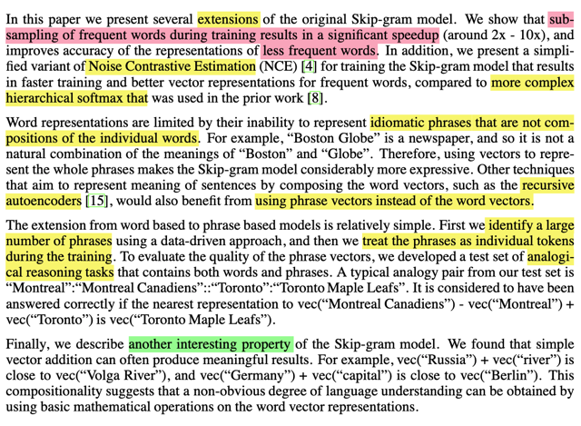
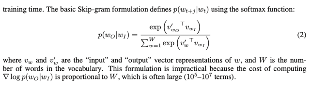
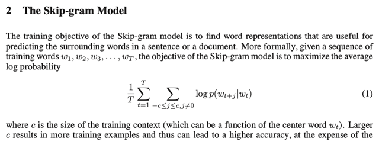
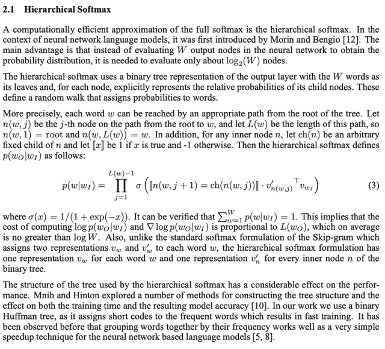

# Reading: Distributed Representations Of Words And Phrases And Their Compositionality

📊 **Progress:** `5` Notes | `5` Screenshots

---

## Abstract

> [!NOTE]
> Abstract
>
> The recently introduced **continuous Skip-gram model** is an **efficient method** for
> learning high-quality distributed vector representations that capture a large number of
> precise syntactic and semantic word relationships. In this paper we present several
> extensions that improve both the quality of the vectors and the training speed. By
> subsampling of the frequent words we obtain significant speedup and also learn
> more regular word representations. We also describe a simple alternative to the
> hierarchical softmax called negative sampling.
>
> An inherent limitation of word representations is their indifference to word order and
> their inability to represent idiomatic phrases. For example, the meanings of “Canada”
> and “Air” cannot be easily combined to obtain “Air Canada”. Motivated by this
> example, we present a simple method for finding phrases in text, and show that
> learning good vector representations for millions of phrases is possible.

> [!NOTE]
> Đại khái là paper này mở rộng một số thứ để improve skipgram,
> trong đó dùng một biến thể của "hierachical softmax" - là cách
> làm để bớt chi phí khi tính softmax thông thường, gọi là negative
> sampling giúp tăng tốc quá trình training tốt hơn.
>
> Paper này họ cũng đề xuất phương pháp tìm kiếm phrases trong
> một văn bản.

 

### 1 Introduction

> [!NOTE]
> 1 Introduction
>
> **Distributed representations of words in a vector space** help learning algorithms to
> achieve better performance in natural language processing tasks by grouping similar
> words. One of the earliest use of word representations dates back to 1986 due to
> Rumelhart, Hinton, and Williams [13]. This idea has since been applied to **statistical
> language modeling** with **considerable success** [1]. The follow up work includes
> **applications to automatic speech recognition** and **machine translation** [14, 7], and a
> **wide range of NLP tasks** [2, 20, 15, 3, 18, 19, 9].
>
> Recently, **Mikolov** et al. [8] introduced the **Skip-gram model**, an **efficient** method for
> learning **high quality vector representations** of words from large amounts of
> **unstructured text data**. Unlike most of the previously used neural network
> architectures for learning word vectors, training of the Skipgram model (see Figure 1)
> does **not involve dense matrix multiplications**. This makes the training extremely
> **efficient**: an optimized single-machine implementation can train on **more than** **100
> billion words in one day.**
>
> The **word representations computed using neural networks** are very interesting
> because the learned **vectors explicitly encode many linguistic regularities** and
> patterns. Somewhat surprisingly, many of these patterns can be represented as **linear
> translations**. For example, the result of a vector calculation vec(“Madrid”) -
> vec(“Spain”) + vec(“France”) is closer to vec(“Paris”) than to any other word vector [9,
> 8].

> [!NOTE]
> Đại khái là ca ngợi việc tạo distributed representation của từ vựng giúp
> đạt những tiến bộ đáng ghi nhận trong NLP. thậm chí không phải gần
> đây mà từ những năm 1086 người ta đã sử dụng nó trong**statistical
> language modeling**và các ứng dụng sau đó trong speech recognition,
> machine  translation...
>
> Gần đây, với skip gram đã cho ra những kết quả rất tốt và cũng hiệu
> quả khi không có việc tính toán matrix multiplication với Dense layer.
>
> Và việc "**learn" được các word representation bằng NN tỏ ra rất  thú vị
> khi nó giúp "encode" được các ý nghĩa ngữ nghĩa**

 

<kbd></kbd>

> [!NOTE]
> đại ý:
>
> Giới thiệu cách thức dùng "subsampling of frequent words" tạm hiểu là "lấy
> mẫu, ngẫu nhiên các từ thông dụng"
>
> và một phiên bản đơn giản hơn của cái gọi là Noise Contrastive Estimation
> thay thế cho cách làm của original SkipGram paper dùng Hierarchical Softmax
> giúp tăng tốc quá trình lên rất đáng kể đồng thời tăng độ chính xác trong khả
> năng represent các từ ít thông dụng.
>
> Nói về sự hiệu quả hơn của "phrase-based representation" thay cho  "
> word-based representation" trong việc biểu diễn được các ý nghĩa liên quan
> đến nhiều từ (Idiomatic phrase)
>
> Và nói sơ về cách train ra các phrase-based vector này
>
> Cuối cùng, kiểu như cho thấy một đặc tính thú vị nữa của word embedding
> vector train bởi SkipGram để minh chứng cho việc: có những hiểu biết trong
> ngôn ngữ mang tính chất không rõ ràng, khó diễn đạt  (non-obvious degree of
> language understanding) có thể được biểu diễn bằng các phép toán học

   

<kbd></kbd>

<kbd></kbd>

<kbd></kbd>

> [!NOTE]
> Đại khái là nói về công thức objective function của SkipGram như ta đã biết
> đó là **maximize xác suất "xuất hiện"** của các**context word** trong phạm
> vi**c từ trước và sau một center word** dựa trên softmax. Với center word là
> mọi từ trong vocabulary
>
> Tuy nhiên việc sử dụng sẽ không thực tế khi quá tốn kém vì khi tính mẫu số
> sẽ phải "tính" cho toàn bộ các từ trong vocab W và W thường rất lớn họ nói
> ở đây có thể lên tới 10^5 - 10^7 tức là khoảng 10 triệu từ

   

<kbd></kbd>

> [!NOTE]
> Quay lại sau

   

