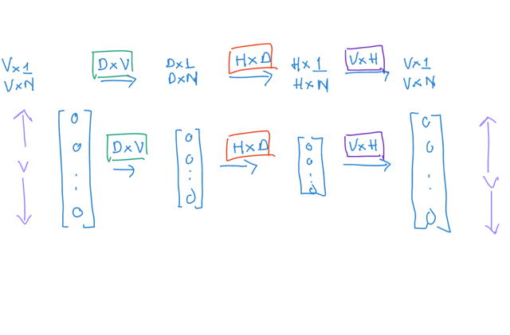
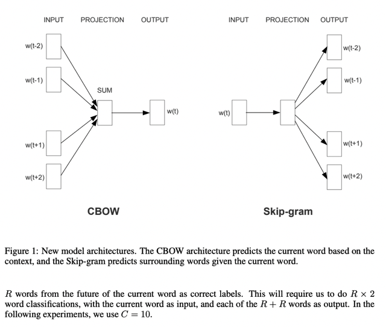
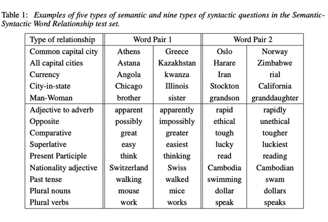
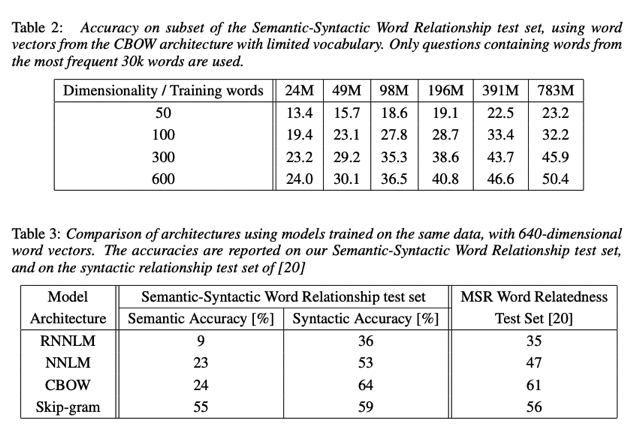
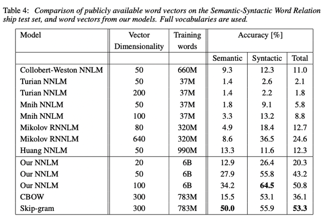
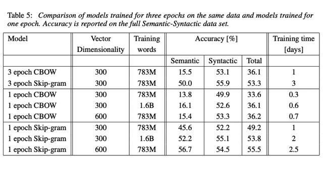
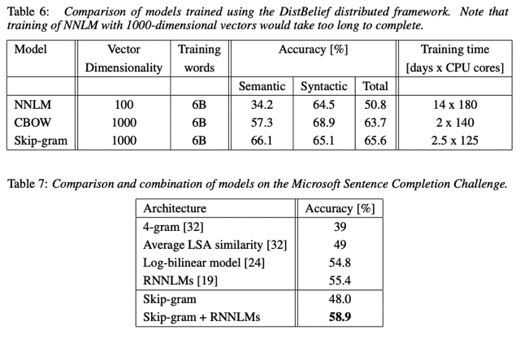

# Reading: Efficient Estimation Of Word Representations In Vector Space (word2vec Paper)

📊 **Progress:** `9` Notes | `7` Screenshots

---

## We propose two novel model architectures for computing \\*continuous vector

> [!NOTE]
> We propose two novel model architectures for computing \**continuous vector
> representations of words\** from \**very large data sets\**.
>
> The quality of these representations is measured in a \**word similarity task\**,
> and the results are \**compared to the previously best performing techniques\**
> based on different types of neural networks. We observe \**large
> improvements\** in \**accuracy\** at much \**lower computational cost\**, i.e. it
> takes less than a day to learn high quality word vectors from a \**1.6 billion
> words data set.\**
>
> Furthermore, we show that these vectors provide\**state-of-the-art performance
> on our test set\** for \**measuring syntactic and semantic word similarities.\**

> [!NOTE]
> Đại khái là họ dùng một cách mới để**tạo ra bộ word
> embedding** có **hiệu suất hơn hẳn các technique trước
> đây** khi đánh giá trên nhiệm vụ **so sánh sự giống nhau
> của các từ vựng** nhưng đồng thời cũng **giảm chi phí tính
> toán hơn**. (Thời gian huấn luyện chỉ tốn 1 ngày)
>
> Và khi đánh giá trên test set về vấn đề sự tương đồng của từ
> vựng trên các khía cạnh về n**gữ pháp** và**ý nghĩa** thì
> phương pháp này gần như là **xịn xò nhất** (state of the art)

 

### 1 Introduction

> [!NOTE]
> 1 Introduction
>
> Many current NLP systems and techniques treat words as atomic units - there is \**no notion
> of similarity between words\**, as these are represented as \**indices\** \**in a vocabulary\**. This
> choice has \**several good reasons\** - \**simplicity\**, robustness and the \**observation\** that \**simple
> models trained on huge amounts of data\** outperform \**complex systems trained on less
> data\**. An example is the \**popular N-gram model\** used for statistical language modeling -
> today, it is possible to train N-grams on virtually all available data (trillions of words [3]).
>
> However, the simple techniques are at their \**limits\** in many tasks. For example, the
> \**amount of relevant in-domain data\** for automatic speech recognition is \**limited\** - the
> performance is usually \**dominated by the size of high quality transcribed speech data\**
> (often just millions of words). In machine translation, the existing corpora for many
> languages \**contain only a few billions of words\** or less. Thus, there are situations where
> \**simple scaling up of the basic techniques will not result in any significant progress\**, and
> we have to focus on more advanced techniques.
>
> With \**progress of machine learning techniques\** in recent years, it has become \**possible to
> train more complex models on much larger data set\**, and they \**typically outperform the
> simple models\**. Probably the most successful concept is to use \**distributed
> representations of words\** [10]. For example, neural network based language models
> significantly outperform N-gram models [1, 27, 17].

> [!NOTE]
> Đại khái là nói về các model đơn giản hơn trước đây thường chỉ
> represent từ vựng ở dạng "**atomic unit**" (tạm hiểu là**riêng lẻ**) không
> hề chứa những ý nghĩa "gần xa" (về mặt ý nghĩa) với nhau như cách
> dùng **word index**, **one-hot vector**. Thì cách này cũng có những ưu
> điểm như **đơn giản**, và với việc thực tế đã chứng minh model **đơn
> giản mà train với data lớn** **vẫn có thể vượt trội** những model phức
> tạp mà train với ít data. Và nổi tiếng trong loại này là N-gram model.
>
> Tuy nhiên vẫn có những hạn chế của chúng ví dụ như về **mặt dữ liệu
> thì không phải lúc nào cũng có nhiều** **dữ liệu chất lượng cao** để huấn
> luyện mô hình, do đó có cần có những cách khác tốt hơn.
>
> Thì với **sự phát triển của Deep Learning** giúp có thể train model phức
> tạp trên bộ dataset lớn đã cho thấy có thể đạt performance vượt trội. Và
> trong đó những mô hình sử dụng "**distributed representation of words**"
> là một  bước tiến quan trọng.

 

- 1.1 Goals of the Paper  The main goal of this paper is to introduce techniques that can be used for learning\\* high-quality word vectors\\* from \\*huge data sets with billions of words\\*, and with millions of words in the vocabulary. As far as we know, none of the previously proposed architectures has been successfully trained on more than a few hundred of millions of words, with a modest d\\*imensionality of the word vectors between 50 - 100\\*.  We use recently proposed techniques for measuring the quality of the resulting vector representations, with the expectation that not only will \\*similar words tend to be close to each other\\*, but that words can have \\*multiple degrees of similarity \\*[20]. This has been observed earlier in the context of inflectional languages - for example, nouns can have multiple word \\*endings\\*, and if we search for similar words in a subspace of the original vector space, it is possible to find words that have similar endings [13, 14].  Somewhat surprisingly, it was found that similarity of word representations goes beyond simple syntactic regularities. Using a word offset technique where simple algebraic operations are performed on the word vectors, it was shown for example that \\*vector(”King”)\\* - \\*vector(”Man”)\\* + \\*vector(”Woman”)\\* results in a vector that is \\*closest to the vector representation of the word Queen [20]\\*. In this paper, we try to maximize accuracy of these vector operations by developing new model architectures that preserve the linear regularities among words. We design a new comprehensive test set for measuring both syntactic and semantic regularities1 , and show that many such regularities can be learned with high accuracy. Moreover, we discuss how training time and accuracy depends on the dimensionality of the word vectors and on the amount of the training data.
  > [!NOTE]
  > Đại khái là nói về mục tiêu của paper là giới thiệu technique sử dụng
  > để **tạo bộ word representation (word embedding)**. Trong đó không chỉ
  > đạt được một tiêu chí là **các từ gần nghĩa sẽ nằm gần nhau** (trong không
  > gian vector) mà nó còn có "**nhiều mức độ gần gũi".**Ví dụ cũng một từ
  > có thể **có nhiều "ending" khác nhau**, sẽ được represent bởi các vector
  > nằm gần nhau.
  >
  > Một điều quan trọng khác đó là nghiên cứu có thấy không chỉ nắm bắt
  > được các**quan hệ cú pháp (syntactic meaning)** của các từ vựng mà còn
  > là **quan hệ ngữ nghĩa của chúng** (**semantic meaning)** với ví dụ nổi tiếng
  > là **v(man) - v(woman) = v(king) - v(queen) từ đó v(man) - v(king)** thể hiện
  > chiều của véctơ biểu hiện khái niệm giới tính.
  >
  > Cuối cùng là nói về thời gian và độ chính xác của quá trình huấn luyện
  > **tùy thuộc vào số chiều của word embedding vector**

   

  
  - 1.2 Previous Work  Representation of words as continuous vectors has a long history [10, 26, 8]. A very popular model architecture for estimating neural network language model (NNLM) was proposed in [1], where a feedforward neural network with a linear projection layer and a non-linear hidden layer was used to learn jointly the word vector representation and a statistical language model. This work has been followed by many others.  Another interesting architecture of NNLM was presented in [13, 14], where the word vectors are first learned using neural network with a single hidden layer. The word vectors are then used to train the NNLM. Thus, the word vectors are learned even without constructing the full NNLM. In this work, we directly extend this architecture, and focus just on the first step where the word vectors are learned using a simple model.  It was later shown that the word vectors can be used to significantly improve and simplify many NLP applications [4, 5, 29]. Estimation of the word vectors itself was performed using different model architectures and trained on various corpora [4, 29, 23, 19, 9], and some of the resulting word vectors were made available for future research and comparison2 . However, as far as we know, these architectures were significantly more computationally expensive for training than the one proposed in [13], with the exception of certain version of log-bilinear model where diagonal weight matrices are used [23].
     

    
    - 2. Model Architectures  Many \\*different types of models\\* were proposed for \\*estimating continuous representations of words\\*, including the well-known \\*Latent Semantic Analysis\\* (LSA) and \\*Latent Dirichlet Allocation (LDA)\\*. In this paper, we focus on \\*distributed representations of words learned by neural networks\\*,  as it was previously shown that they \\*perform significantly better than LSA\\* for \\*preserving linear regularities\\* among words [20, 31];  \\*LDA\\* moreover becomes \\*computationally very expensive\\* on large data sets.  Similar to [18], to compare different model architectures we define first the computational complexity of a model as the \\*number of parameters\\* that need to be accessed to fully train the model. Next, we will try to \\*maximize the accuracy\\*, while \\*minimizing the computational complexity  \\*For all the following models, the \\*training complexity\\* is \\*proportional to  O = E × T × Q, (1)  \\* where \\*E is number of the training epochs\\*, \\*T is the number of the words\\* in the training set  and Q is defined further for each model architecture. \\*Common choice\\* is E = 3 − 50 and T  up to \\*one billion\\*. All models are trained using\\* stochastic gradient descent\\* and \\*backpropagation\\*  [26].
      > [!NOTE]
      > Đại khái là họ nói rằng trước đây các model như LSA, LDA
      > cũng đã tìm cách "estimating continuous representation of
      > words" - nôm na là tìm các học cách represent words sao
      > cho giống như trong không gian các điểm liên tục nhau để
      > tạo thành các quan hệ tuyến tính phản ánh mối liên hệ trong
      > ý nghĩa của từ ngữ.
      >
      > Tuy nhiên ở đây người ta sử dụng neural network để learn 
      > word vector và cho thấy nó perform tốt hơn LSA và "rẻ" hơn
      > LDA. 
      >
      > Tiếp theo đại khái họ nói là họ dựa trên tiêu chí đánh giá 
      > độ complexity của model

       

      
      - 2.1 Feedforward Neural Net Language Model (NNLM)  The probabilistic feedforward neural network language model has been proposed in [1]. It consists of \\*input\\*, \\*projection\\*, \\*hidden\\* and \\*output\\* layers. At the input layer, \\*N previous words\\* are encoded using \\*1-of-V coding\\*, where V is size of the vocabulary. The input layer is then projected to a \\*projection layer P\\* that has dimensionality \\*N × D\\*, using a shared projection matrix. As only N inputs are active at any given time, composition of the projection layer is a relatively cheap operation. The NNLM architecture becomes complex for computation between the projection and the hidden layer, as values in the projection layer are dense. For a common choice of \\*N = 10\\*, the size of the projection layer (P) might be \\*500 to 2000\\*, while the\\* hidden layer size H is typically 500 to 1000\\* units. Moreover, the hidden layer is used to \\*compute probability distribution\\* over all the words in the vocabulary, resulting in an\\* output layer with dimensionality\\* \\*V\\* . Thus, the computational complexity per each training example is  Q = N × D + N × D × H + H × V, (2)  where the \\*dominating term is H × V\\* . However, several practical solutions were proposed for avoiding it; either using \\*hierarchical versions of the softmax\\* [25, 23, 18], or \\*avoiding normalized models\\* completely by using models that are not normalized during training [4, 9]. With binary tree representations of the vocabulary, the number of output units that need to be evaluated can go down to around log2(V ). Thus, \\*most of the complexity is caused by the term N × D × H.\\*
        > [!NOTE]
        > Thì đại khái ở đây người ta nói đến việc dùng Neural Network với mô tả
        > như trong hình. Thế trong đó layer cuối dùng softmax để xuất ra vector
        > các probabilities. Input là N từ "previous words" tức là những từ trước
        > của từ cần được dự đoán. Mỗi từ được represent thành one-hot vector
        > (1-of-V coding). Bắt đầu với Projection layer có shape (ý nói weight matrix)
        > DxV trong đó D thường chọn 500-2000. Họ dùng từ projection có thể ý là 
        > không có activation function. Tiếp theo là một hidden layer HxD trong đó H
        > thường là 500-1000 và có activation function
        >
        > Và sau đó là qua output layer softmax để ra vector
        > có V chỉ số probabilities.
        >
        > Thế thì họ cho rằng vì N không lớn (chỉ là vài từ) nên các phép tính toán
        > matrix ở projection layer không lớn, và vì ở softmax tuy lớn nhưng người
        > Ta có những cách khắc phục như dùng một "hierarchical version của softmax"
        > hoặc tránh việc normalized (kiểu như tìm cách không chia cho mẫu số như 
        > trong glove) nên cuói cùng bước tốn kém nhất chính là bước tính ở hidden layer
        > VxH@HxN = VxN

         

          
          
<kbd></kbd>

           

        
        - In our models, we use hierarchical softmax where the vocabulary is represented as a Huffman binary tree. This follows previous observations that the frequency of words works well for obtaining classes in neural net language models [16]. Huffman trees assign short binary codes to frequent words, and this further reduces the number of output units that need to be evaluated: while balanced binary tree would require log2(V ) outputs to be evaluated, the Huffman tree based hierarchical softmax requires only about log2(Unigram perplexity(V )). For example when the vocabulary size is one million words, this results in about two times speedup in evaluation. While this is not crucial speedup for neural network LMs as the computational bottleneck is in the N ×D×H term, we will later propose architectures that do not have hidden layers and thus depend heavily on the efficiency of the softmax normalization.
          > [!NOTE]
          > Đại khái là họ dùng Huffman binary tree để dùng trong hierarchical
          > softmax giúp giảm chi phí tính toán bớt (không nói rõ lắm, chỉ biết vậy
          > thôi)

           

          
          - \\*2.2 Recurrent Neural Net Language Model (RNNLM) \\*  Recurrent neural network based language model has been proposed to overcome certain limitations of the feedforward NNLM, such as the need to specify the context length (the order of the model N), and because theoretically RNNs can efficiently represent more complex patterns than the shallow neural networks [15, 2]. The RNN model does not have a projection layer; only input, hidden and output layer. What is special for this type of model is the recurrent matrix that connects hidden layer to itself, using time-delayed connections. This allows the recurrent model to form some kind of short term memory, as information from the past can be represented by the hidden layer state that gets updated based on the current input and the state of the hidden layer in the previous time step. The complexity per training example of the RNN model is  Q = H × H + H × V, (3)  where the word representations D have the same dimensionality as the hidden layer H. Again, the term H × V can be efficiently reduced to H × log2(V ) by using hierarchical softmax. Most of the complexity then comes from H × H.
            > [!NOTE]
            > Cũng chỉ nói vậy biết vậy rằng họ dùng RNN
            > thay cho NN giúp tăng hiệu quả

             

            
            - \\*2.3 Parallel Training of Neural Networks\\*  To train models on huge data sets, we have implemented several models on top of a large-scale distributed framework called \\*DistBelief\\* [6], including the feedforward NNLM and the new models proposed in this paper. The framework allows us to \\*run multiple replicas of the same model in parallel\\*, and each \\*replica synchronizes its gradient updates through a centralized server that keeps all the parameters\\*. For this parallel training, we use \\*mini-batch asynchronous gradient descent\\* with an\\* adaptive learning rate\\* procedure called \\*Adagrad\\* [7]. Under this framework, it is common to use one hundred or more model replicas, each using many CPU cores at different machines in a data center.
              > [!NOTE]
              > Đại khái là học nói về việc họ dùng distributed
              > framework có tên là DistBelief để làm cái gọi là
              > distributed training - training cùng lúc trên nhiều
              > GPU/TPU.
              >
              > Và có một cái mình đã học bên MLOps Spec đó là
              > họ dùng cách "update / sync weight value từ các
              > replica (kiểu như máy con) với centralized server.
              >
              > Nhắc đến việc họ dùng Adagrad (adaptive gradient)
              > như Adam, Nadam..

               

              
              - In this section, we propose two new model architectures for learning distributed representations of words that try to minimize computational complexity. The main observation from the previous section was that most of the complexity is caused by the non-linear hidden layer in the model. While this is what makes neural networks so attractive, we decided to explore simpler models that might not be able to represent the data as precisely as neural networks, but can possibly be trained on much more data efficiently.  The new architectures directly follow those proposed in our earlier work [13, 14], where it was found that neural network language model can be successfully trained in two steps: first, continuous word vectors are learned using simple model, and then the N-gram NNLM is trained on top of these distributed representations of words. While there has been later substantial amount of work that focuses on learning word vectors, we consider the approach proposed in [13] to be the simplest one. Note that related models have been proposed also much earlier [26, 8].
                > [!NOTE]
                > Đại khái là giới thiệu hai model architecture "học" cách tạo
                > word representation giúp giảm chi phí tính toán.
                >
                > Và họ nói như ở trên đã cho thấy bước tốn kém nhất lại
                > chính là bước hidden layer với activation function. Và họ
                > dùng cách khác hi sinh việc dùng complex non-linear neural
                > network (với hidden layer có activation function) bằng việc
                > dùng một model đơn giản kết hợp  với N-gram NNLM
                > (Neural Network Language Model) cho thấy kết quả rất tốt
                > nhưng giảm chi phí tính toán giúp train được bộ big data

                 

                
                - The first proposed architecture is similar to the feedforward NNLM, where the \\*non-linear hidden layer is removed\\* and the \\*projection layer is shared for all words\\* (not just the projection matrix); thus, \\*all words get projected into the same position\\* (their vectors are averaged). We call this architecture a bag-of-words model as the \\*order of words in the history\\* \\*does not influence the projection.\\*  Furthermore, we a\\*lso use words from the future\\*; we have obtained the best performance on the task introduced in the next section by building a \\*log-linear classifier with four future and four history words\\* at the input, where the training \\*criterion\\* is to c\\*orrectly classify the current (middle) word\\*.  Training complexity is then  Q = \\*N × D + D × log2(V )\\*. (4)  We denote this model further as \\*CBOW\\*, as unlike \\*standard bag-of-words model\\*, it uses \\*continuous distributed representation of the context\\*. The model architecture is shown at Figure 1. Note that the weight matrix between the input and the projection layer is shared for all word positions in the same way as in the NNLM.
                   

                    
                    
<kbd></kbd>

                     

                  
                  - 3.2 Continuous Skip-gram Model  The second architecture is similar to CBOW, but instead of\\* predicting the current word based on the context\\*, it tries to \\*maximize classification of a word based on another word in the same sentence\\*. More precisely, we \\*use each current word as an input \\*to a \\*log-linear classifier\\* with \\*continuous projection layer\\*, and \\*predict words within a certain range before and after the current word\\*. We found that increasing the range improves quality of the resulting word vectors, but it also increases the computational complexity. Since the more distant words are usually less related to the current word than those close to it, we give less weight to the distant words by sampling less from those words in our training examples.  The training complexity of this architecture is proportional to  Q = C × (D + D × log2(V )), (5)  where C is the maximum distance of the words. Thus, if we choose C = 5, for each training word we will select randomly a number R in range < 1; C >, and then use R words from history an
                     

                    
                    - 4 Results  To compare the quality of different versions of word vectors, previous papers typically use a table showing example words and their most similar words, and understand them intuitively. Although it is easy to show that word France is similar to Italy and perhaps some other countries, it is much more challenging when subjecting those vectors in a more complex similarity task, as follows. We follow previous observation that there can be many different types of similarities between words, for example, word big is similar to bigger in the same sense that small is similar to smaller. Example of another type of relationship can be word pairs big - biggest and small - smallest [20]. We further denote two pairs of words with the same relationship as a question, as we can ask: ”What is the word that is similar to small in the same sense as biggest is similar to big?”  Somewhat surprisingly, these questions can be answered by performing simple algebraic operations with the vector representation of words. To find a word that is similar to small in the same sense as biggest is similar to big, we can simply compute vector X = vector(”biggest”)−vector(”big”) + vector(”small”). Then, we search in the vector space for the word closest to X measured by cosine distance, and use it as the answer to the question (we discard the input question words during this search). When the word vectors are well trained, it is possible to find the correct answer (word smallest) using this method.  Finally, we found that when we train high dimensional word vectors on a large amount of data, the resulting vectors can be used to answer very subtle semantic relationships between words, such as a city and the country it belongs to, e.g. France is to Paris as Germany is to Berlin. Word vectors with such semantic relationships could be used to improve many existing NLP applications, such as machine translation, information retrieval and question answering systems, and may enable other future applications yet to be invented.
                       

                        
                        
<kbd></kbd>

                         

                      
                      - 4.1 Task Description  To measure quality of the word vectors, we define a comprehensive test set that contains five types of semantic questions, and nine types of syntactic questions. Two examples from each category are shown in Table 1. Overall, there are 8869 semantic and 10675 syntactic questions. The questions in each category were created in two steps: first, a list of similar word pairs was created manually. Then, a large list of questions is formed by connecting two word pairs. For example, we made a list of 68 large American cities and the states they belong to, and formed about 2.5K questions by picking two word pairs at random. We have included in our test set only single token words, thus multi-word entities are not present (such as New York).  We evaluate the overall accuracy for all question types, and for each question type separately (semantic, syntactic).  Question is assumed to be correctly answered only if the closest word to the vector computed using the above method is exactly the same as the correct word in the question; synonyms are thus counted as mistakes. This also means that reaching 100% accuracy is likely to be impossible, as the current models do not have any input information about word morphology. However, we believe that usefulness of the word vectors for certain applications should be positively correlated with this accuracy metric. Further progress can be achieved by incorporating information about structure of words, especially for the syntactic questions.
                         

                        
                        - 4.2 Maximization of Accuracy  We have used a Google News corpus for training the word vectors. This corpus contains about 6B tokens. We have restricted the vocabulary size to 1 million most frequent words. Clearly, we are facing time constrained optimization problem, as it can be expected that both using more data and higher dimensional word vectors will improve the accuracy. To estimate the best choice of model architecture for obtaining as good as possible results quickly, we have first evaluated models trained on subsets of the training data, with vocabulary restricted to the most frequent 30k words. The results using the CBOW architecture with different choice of word vector dimensionality and increasing amount of the training data are shown in Table 2.  It can be seen that after some point, adding more dimensions or adding more training data provides diminishing improvements. So, we have to increase both vector dimensionality and the amount of the training data together. While this observation might seem trivial, it must be noted that it is currently popular to train word vectors on relatively large amounts of data, but with insufficient size (such as 50 - 100). Given Equation 4, increasing amount of training data twice results in about the same increase of computational complexity as increasing vector size twice. For the experiments reported in Tables 2 and 4, we used three training epochs with stochastic gradient descent and backpropagation. We chose starting learning rate 0.025 and decreased it linearly, so that it approaches zero at the end of the last training epoch.
                           

                            
                            
<kbd></kbd>

                             

                          
                          - 4.3 Comparison of Model Architectures  First we compare different model architectures for deriving the word vectors using the same training data and using the same dimensionality of 640 of the word vectors. In the further experiments, we use full set of questions in the new Semantic-Syntactic Word Relationship test set, i.e. unrestricted to the 30k vocabulary. We also include results on a test set introduced in [20] that focuses on syntactic similarity between words3 . The training data consists of several LDC corpora and is described in detail in [18] (320M words, 82K vocabulary). We used these data to provide a comparison to a previously trained recurrent neural network language model that took about 8 weeks to train on a single CPU. We trained a feedforward NNLM with the same number of 640 hidden units using the DistBelief parallel training [6], using a history of 8 previous words (thus, the NNLM has more parameters than the RNNLM, as the projection layer has size 640 × 8). In Table 3, it can be seen that the word vectors from the RNN (as used in [20]) perform well mostly on the syntactic questions. The NNLM vectors perform significantly better than the RNN - this is not surprising, as the word vectors in the RNNLM are directly connected to a non-linear hidden layer. The CBOW architecture works better than the NNLM on the syntactic tasks, and about the same on the semantic one. Finally, the Skip-gram architecture works slightly worse on the syntactic task than the CBOW model (but still better than the NNLM), and much better on the semantic part of the test than all the other models. Next, we evaluated our models trained using one CPU only and compared the results against publicly available word vectors. The comparison is given in Table 4. The CBOW model was trained on subset of the Google News data in about a day, while training time for the Skip-gram model was about three days.  For experiments reported further, we used just one training epoch (again, we decrease the learning rate linearly so that it approaches zero at the end of training). Training a model on twice as much data using one epoch gives comparable or better results than iterating over the same data for three epochs, as is shown in Table 5, and provides additional small speedup
                             

                              
                              
<kbd></kbd>

                               

                              
                              
<kbd></kbd>

                               

                            
                            - 4.4 Large Scale Parallel Training of Models  As mentioned earlier, we have implemented various models in a distributed framework called DistBelief. Below we report the results of several models trained on the Google News 6B data set, with mini-batch asynchronous gradient descent and the adaptive learning rate procedure called Adagrad [7]. We used 50 to 100 model replicas during the training. The number of CPU cores is an estimate since the data center machines are shared with other production tasks, and the usage can fluctuate quite a bit. Note that due to the overhead of the distributed framework, the CPU usage of the CBOW model and the Skip-gram model are much closer to each other than their single-machine implementations. The result are reported in Table 6.
                               

                                
                                
<kbd></kbd>

                                 

                              
                              - 4.5 Microsoft Research Sentence Completion Challenge  The Microsoft Sentence Completion Challenge has been recently introduced as a task for advancing language modeling and other NLP techniques [32]. This task consists of 1040 sentences, where one word is missing in each sentence and the goal is to select word that is the most coherent with the rest of the sentence, given a list of five reasonable choices. Performance of several techniques has been already reported on this set, including N-gram models, LSA-based model [32], log-bilinear model [24] and a combination of recurrent neural networks that currently holds the state of the art performance of 55.4% accuracy on this benchmark [19].  We have explored the performance of Skip-gram architecture on this task. First, we train the 640- dimensional model on 50M words provided in [32]. Then, we compute score of each sentence in the test set by using the unknown word at the input, and predict all surrounding words in a sentence. The final sentence score is then the sum of these individual predictions. Using the sentence scores, we choose the most likely sentence.  A short summary of some previous results together with the new results is presented in Table 7. While the Skip-gram model itself does not perform on this task better than LSA similarity, the scores from this model are complementary to scores obtained with RNNLMs, and a weighted combination leads to a new state of the art result 58.9% accuracy (59.2% on the development part of the set and 58.7% on the test part of the set).
                                 

                                
                                - 5 Examples of the Learned Relationships  Table 8 shows words that follow various relationships. We follow the approach described above: the relationship is defined by subtracting two word vectors, and the result is added to another word. Thus for example, Paris - France + Italy = Rome. As it can be seen, accuracy is quite good, although there is clearly a lot of room for further improvements (note that using our accuracy metric that assumes exact match, the results in Table 8 would score only about 60%). We believe that word vectors trained on even larger data sets with larger dimensionality will perform significantly better, and will enable the development of new innovative applications. Another way to improve accuracy is to provide more than one example of the relationship. By using ten examples instead of one to form the relationship vector (we average the individual vectors together), we have observed improvement of accuracy of our best models by about 10% absolutely on the semantic-syntactic test. It is also possible to apply the vector operations to solve different tasks. For example, we have observed good accuracy for selecting out-of-the-list words, by computing average vector for a list of words, and finding the most distant word vector. This is a popular type of problems in certain human intelligence tests. Clearly, there is still a lot of discoveries to be made using these techniques.
                                   

                                  
                                  - 6 Conclusion  In this paper we studied the quality of vector representations of words derived by various models on a collection of syntactic and semantic language tasks. We observed that it is possible to train high quality word vectors using very simple model architectures, compared to the popular neural network models (both feedforward and recurrent). Because of the much lower computational complexity, it is possible to compute very accurate high dimensional word vectors from a much larger data set. Using the DistBelief distributed framework, it should be possible to train the CBOW and Skip-gram models even on corpora with one trillion words, for basically unlimited size of the vocabulary. That is several orders of magnitude larger than the best previously published results for similar models.  An interesting task where the word vectors have recently been shown to significantly outperform the previous state of the art is the SemEval-2012 Task 2 [11]. The publicly available RNN vectors were used together with other techniques to achieve over 50% increase in Spearman’s rank correlation over the previous best result [31]. The neural network based word vectors were previously applied to many other NLP tasks, for example sentiment analysis [12] and paraphrase detection [28]. It can be expected that these applications can benefit from the model architectures described in this paper.  Our ongoing work shows that the word vectors can be successfully applied to automatic extension of facts in Knowledge Bases, and also for verification of correctness of existing facts. Results from machine translation experiments also look very promising. In the future, it would be also interesting to compare our techniques to Latent Relational Analysis [30] and others. We believe that our comprehensive test set will help the research community to improve the existing techniques for estimating the word vectors. We also expect that high quality word vectors will become an important building block for future NLP applications.
                                     

                                    
                                    - 7 Follow-Up Work  After the initial version of this paper was written, we published single-machine multi-threaded C++ code for computing the word vectors, using both the continuous bag-of-words and skip-gram architectures4 . The training speed is significantly higher than reported earlier in this paper, i.e. it is in the order of billions of words per hour for typical hyperparameter choices. We also published more than 1.4 million vectors that represent named entities, trained on more than 100 billion words. Some of our follow-up work will be published in an upcoming NIPS 2013 paper [21].
                                       

