# Assignment 1 - 2 Layer Nn

📊 **Progress:** `29` Notes | `45` Screenshots

---
<a id="node-772"></a>

<p align="center"><kbd>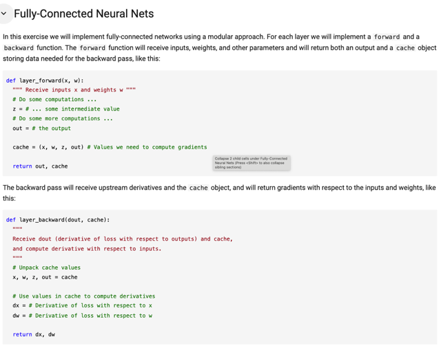</kbd></p>

> [!NOTE]
> Phần này đại khái là mình sẽ làm function forward() và backward() trong
> đó forward() sẽ tính output từ input và params, trong quá trình này ta sẽ
> lưu lại các intermediate value đặng còn xài khi backward trong cache
> còn backward sẽ tính downstream gradient (derivative of loss đối với
> input, params) dựa trên upstream gradient và cache

<br>

<a id="node-773"></a>

<p align="center"><kbd>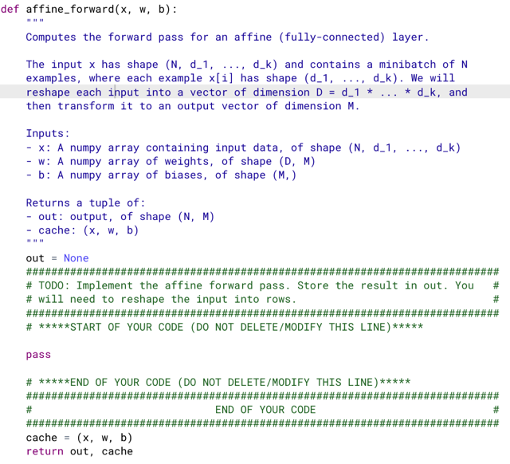</kbd></p>

> [!NOTE]
> đại khái là làm một cái fully connected layer, điểm chú ý là input có
> ```text
> shape (N, d_1, ...d_k) thì N chính là số sample, còn (d_1, d_2,...d_k)
> ```
> là shape của một sample 'tensor' ví dụ hình màu CIFAR 10 thì nó là
> 3x32x32 hay 32x32x3 gì đó, tùy.
>
> Vậy ý tưởng đầu tiên là phải flatten nó ra, thành ra vector có
> ```text
> d_1*d_2*..d_k = D units. Khi đó input sẽ có shape là (N, D)
> ```

<br>

<a id="node-774"></a>

<p align="center"><kbd>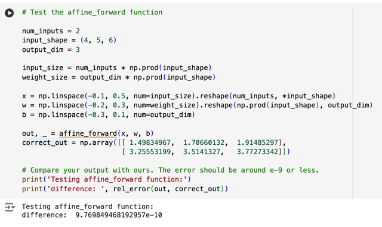</kbd></p>

<p align="center"><kbd></kbd></p>

<p align="center"><kbd>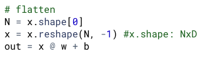</kbd></p>

<br>

<a id="node-775"></a>

<p align="center"><kbd>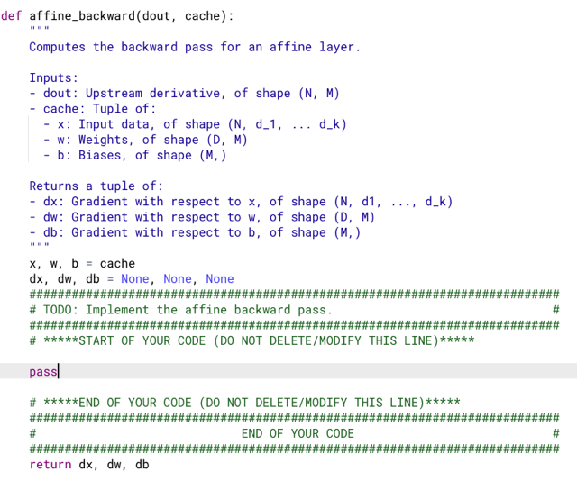</kbd></p>

> [!NOTE]
> có dout (hiểu nó là derivative of loss w.r.t output), cần tính downstream
> gradient dx, dw, b.
>
> Thế thì theo computational graph đơn giản của xw `+` b `=` out thì dx `=`
> dout(upstream gradient) * `dout/dx` (local gradient) `dout/dx` sẽ là w và
> transpose nếu cần sao cho dx cùng shape x
>
> **dx (N, D) `=` dout (N, M) @ w.T (M, D)**
>
> ```text
> Tương tự dw = dout * dout/dw, với dout/dw = x
> ```
>
> **dw (D, M) `=`  x.t (D, N) @ dout (N, M)**
>
> ```text
> Còn db = dout * dout/db thì dout/db = 1 tuy nhiên vì là b được
> ```
> broadcasting n ên phải phải lấy mean dout theo phương phù hợp (sum
> và chia N `=` số sample)

<br>

<a id="node-776"></a>

<p align="center"><kbd>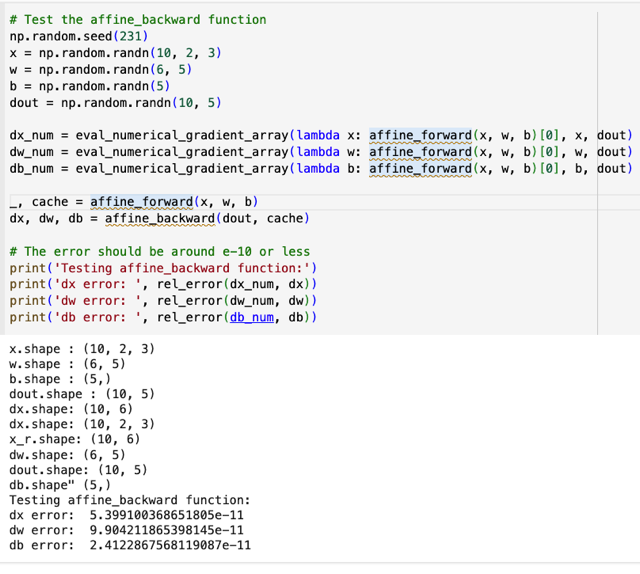</kbd></p>

<p align="center"><kbd></kbd></p>

<p align="center"><kbd>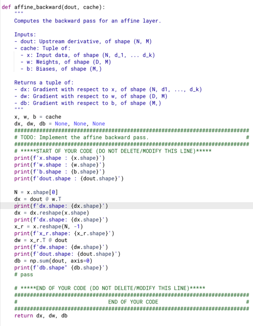</kbd></p>

> [!NOTE]
> Chú ý người ta yêu cầu shape của các x, dx, ở dạng ban
> đầu (khi chưa reshape) nên khi tính toán thì thực hiện
> reshape. Nhưng sau đó thì reshape dựa trên shape của x.
>
> Với db thì hãy dùng np.sum() thay vì inner sum của np
> array

<br>

<a id="node-777"></a>

<p align="center"><kbd>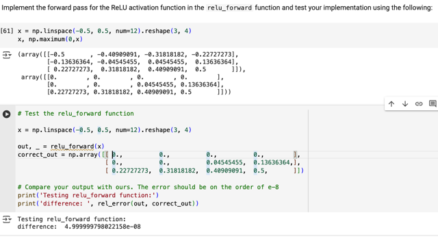</kbd></p>

<p align="center"><kbd></kbd></p>

<p align="center"><kbd>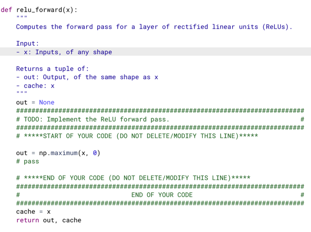</kbd></p>

> [!NOTE]
> np.maximum(x, 0) chứ ko phải dùng np.max() nhé, và x trước. Vì sao?

<br>

<a id="node-778"></a>

<p align="center"><kbd>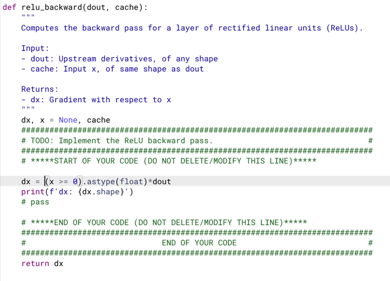</kbd></p>

> [!NOTE]
> relu backward()

<br>

<a id="node-779"></a>

<p align="center"><kbd>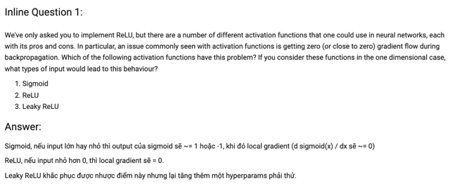</kbd></p>

<br>

<a id="node-780"></a>

<p align="center"><kbd>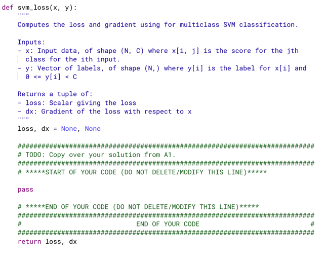</kbd></p>

> [!NOTE]
> Viết function tính `svm_loss` và d `loss/` d input.
>
> Lập luận như sau: hinge loss của một sample, ta sẽ xem thử
>
> **(1) trong các predicted class score ứng với incorrect class, cái
> nào mà correct score chưa bỏ xa một đoạn delta `=` 1**, thì
>
> (2) tính tổng các distance giữa incorrect score cộng 1 và correct score.
>
> Như vậy để làm ý (1), ta sẽ check xem các vị trí có thỏa điều
> kiện này. Đó là bằng cách đầu tiên lấy ra correct score :
>
> `correct_s` `=` x[arange(len(y)), y],
>
> ```text
> Sau đó cái này (correct_s - x) < 1.0 tương đương correct_s < 1 + x
> ```
> sẽ cho ra matrix mà chỗ nào thỏa sẽ là 1, ngược lại là 0. Gọi là
> matrix vị trí, sẽ được dùng 
>
> Rồi, ta sẽ chuẩn bị matrix các margin là score `+` 1 `-` correct score,
> và vì chỉ tính những incorrect score, nên cần set vào margin matrix
> này chỗ nào ứng với correct score thì cho bằng 0.
>
> Rồi dùng cái matrix vị trí ở trên, để mà lấy ra từ matrix margin mới tính
>
> rồi sum() để tổng lại, khỏi bỏ axis vì ta sẽ cần tổng lại hết theo hàng
> để ra L(i), nhưng sau đó cũng tổng lại các L(i) để có L(batch)
>
> Cuối cùng chia N (số sample) để có mean.

<br>

<a id="node-781"></a>

<p align="center"><kbd>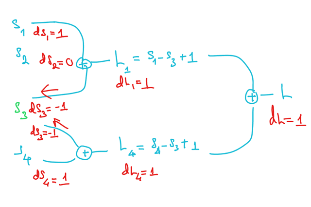</kbd></p>

<p align="center"><kbd></kbd></p>

<p align="center"><kbd>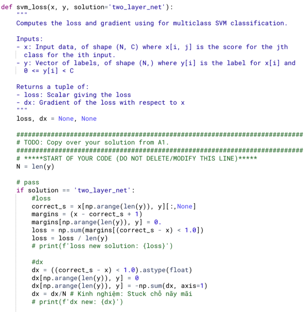</kbd></p>

> [!NOTE]
> Còn về dx tức dL `/` d score, suy nghĩ như sau: correct score ví dụ s3 lần
> lượt tham gia với các incorrect score khác s1 để tính margin1, với s2 để
> tính margin2. Rồi trong các margin nếu cái nào thỏa sẽ tham gia vào  loss
> qua các phép cộng.
>
> Vậy, cái graph sẽ như trên, khi backprop, qua node (cộng) như đã biết
> gradient sẽ được phân bổ đều, và qua các nhánh dưới cũng là node cộng
> nên cũng lại phân bổ đều. Vậy **ds1, ds2 (incorrect class) đều bằng 1** còn
> với **correct class thì nó sum lại từ số nhánh** (trong C `-` 1 nhánh) có tham
> gia. Nên ta **phải xem có bao nhiêu nhánh tham gia**, bằng cách **check
> số margin thỏa điều kiện `correct_s` < incorrect score
> `+` 1.**Chú ý là với correct score thì phải nhân `-1`
>
> Vậy ta chỉ cần**xem margin nào thỏa `correct_s` < x `+` 1** như đã có sẵn lúc
> tính loss. Lúc này ta đã có một matrix 1 `/` 0, gán cho dx.
>
> Sau đó, **set vị trí ứng với correct class thành 0**, đặng sau đó **tổng theo
> `axis=1` để ra SỐ LƯỢNG CÁC NHÁNH MÀ correct score  có tham gia** tính
> loss, và **lấy giá trị này set vào vị trí ứng với correct score trong dx. Là
> xong.
>
> Chú ý quan trọng là, phải chia cho N để lấy trung bình vì ta đang tính
> trên một batch**

<br>

<a id="node-782"></a>

<p align="center"><kbd>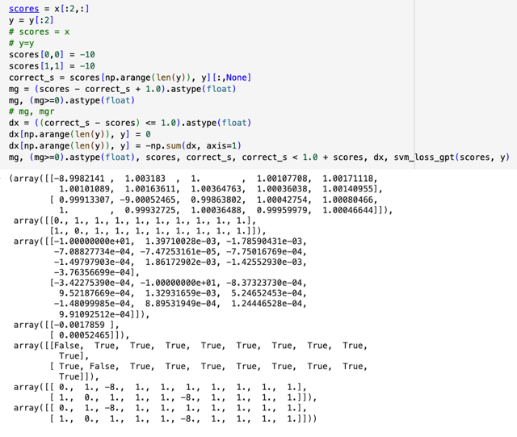</kbd></p>

> [!NOTE]
> Thực tập (dòng suy nghĩ): lấy 2 sample, từ các scores, ta tính ra
> **margin (mg) `=` score `+` 1 `-` correct score,**trong đó mỗi row ta sét hai vị
> trí để ví dụ cho việc correct score ở đây đã bỏ xa incorrect score (ví trí 0,
> 0 và 1,1), tức là **margin hai chỗ này đã âm**
>
> Thành ra khi tạm matrix 'vị trí' sao cho chỗ nào margin dương hoặc
> bằng 0, mg `=` `mg>=0` thì mọi vị trí đều true, trừ hai vị trí trên.
>
> Tới đây chỉ việc set vào margin chỗ nào ứng với correct class thành 0 là
> xong rồ**i dùng matrix vị trí để lấy ra**, sum lại là ra loss

<br>

<a id="node-783"></a>

<p align="center"><kbd>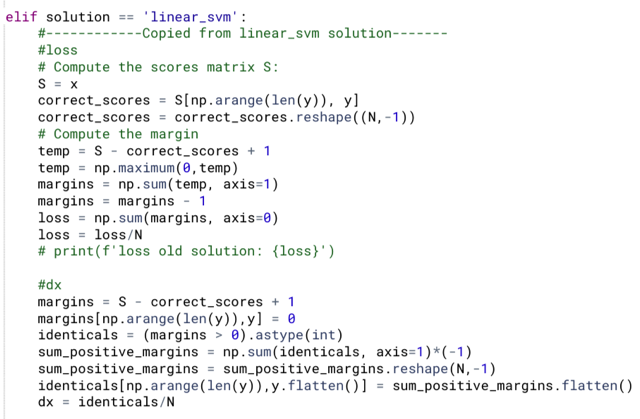</kbd></p>

> [!NOTE]
> có thể thấy hồi làm `linear_svm` dài dòng
> hơn nhưng cơ bản cũng lập luận tương tự

<br>

<a id="node-784"></a>

<p align="center"><kbd>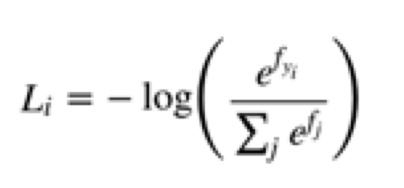</kbd></p>

<p align="center"><kbd></kbd></p>

<p align="center"><kbd>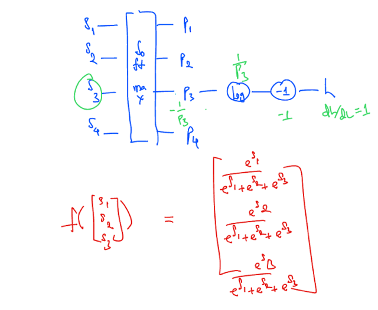</kbd></p>

> [!NOTE]
> Dựa theo công thức L(i) `=` `-` log prob [yi] computation graph, từ s
> (predicted class scores), qua softmax ra class probabilities, tới đây
> chỉ correct class probability tham gia tính loss, với việc qua log, và
> lấy âm.
>
> Thì backprop, bắt đầu với `dL/dL` `=` 1, qua node `(*-1)` có local grad 
> ```text
> d (-log p) / d log p = -1, và d log p / d p = 1/p nên ta có downstream
> ```
> gradient tại p3 là `-1/p3` (p3 ở đây cho rằng là prob của correct class)

<br>

<a id="node-785"></a>

<p align="center"><kbd>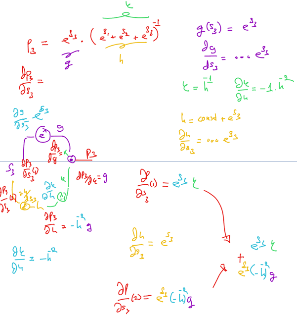</kbd></p>

> [!NOTE]
> phác thảo c.g từ s3 để tính ra p3 phải đi theo 2 nhánh, một
> nhánh ở tử số, một nhánh ở mẫu số, backprop về có thể thấy
> `dp3/ds3` `=` tổng grad đi về theo 2 nhánh
>
> triêng lh

<br>

<a id="node-786"></a>

<p align="center"><kbd>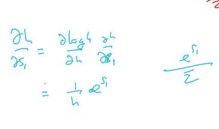</kbd></p>

<p align="center"><kbd></kbd></p>

<p align="center"><kbd>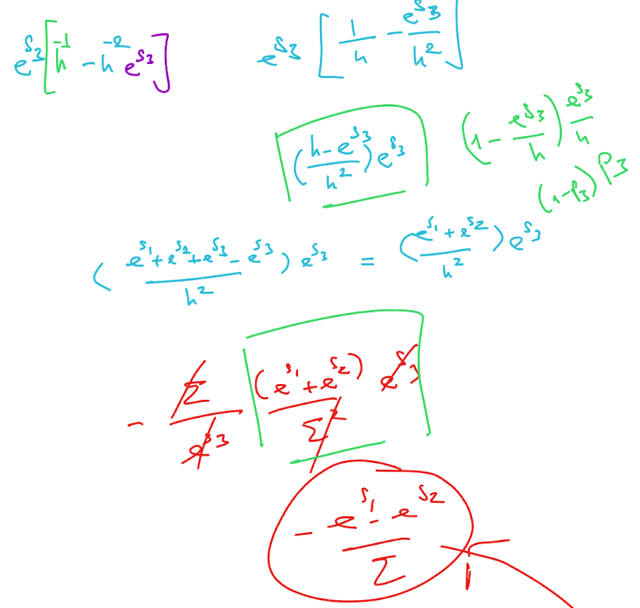</kbd></p>

> [!NOTE]
> tổng grad 2 nhánh về s3 ta có `dp3/ds3` là (1 `-` p3)*p3
> hay**-(e^s2 `+` e^s1) `/` tổng j `e^s_j` chính là**
> **- (tổng các `p_incorrect` class)**
>
> `====`
>
> Nếu tính **dp3 `/` ds1** thì grahp sẽ là: 
>
> ```text
> s1 -> e^s1 -> sum e^sj -> 1/ sum -> * (e^s3)
> ```
> nên backprop sẽ là :
>
> dp3 `/` d `{1/` sum} `=` e^s3
>
> d `{1/sum}` `/` dsum `=` -1/sum**2
>
> d {sum} `/` d e^s1 `=` 1
>
> d e^s1 `/` d s1 `=` e^s1
>
> Vậy d p3 `/` d s1 `=` e^s3 * (-1/sum**2) * e^s1
>
> `=` -e^s1*e^s3/sum**2 **chính là -p1*p3**
>
> **Nếu nhân thêm dL `/dp3` ta sẽ có dL `/` ds1**:
>
>  (-1/p3)*[-e^s1*e^s3/sum**2] `=`  
> `=` `(1/` [e^s3 `/` sum]) (e^s1*e^s3/sum**2)
> `=` (sum `/` e^s3)*(e^s1*e^s3/sum**2)
> `=` **e^s1/sum chính là p1**

<br>

<a id="node-787"></a>

<p align="center"><kbd>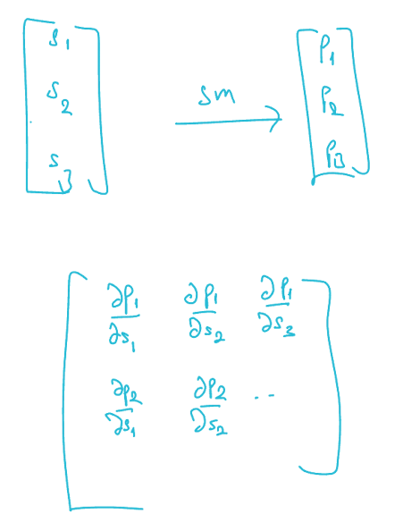</kbd></p>

> [!NOTE]
> Rồi tới đây dừng lại chút, nói về việc hàm softmax nhận
> một vector, trả ra một vector, nên đạo hàm của hàm
> softmax d softmax (v) `/` dv sẽ là Jacobian matrix Trong đó
> mỗi hàng của nó là đạo hàm của từng phần tử của vector
> p đối với các phần tử của vector s
>
> Và như trên đã thấy nếu "cùng số", ví dụ `dp3/ds3` thì sẽ là
> (1 `-` p3)p3, còn khác số như `dp3/ds1` sẽ là p1
>
> Nên có thể ghi `dp/ds` (p, s là vector output, input):
>
> Matrix entry aij (hàng i, cột j) là d pi `/` d sj
>
> nếu **i bằng j: (1 `-` pi)*pi**
> nếu **i khác j**:  **-pi*pj**

<br>

<a id="node-788"></a>

<p align="center"><kbd>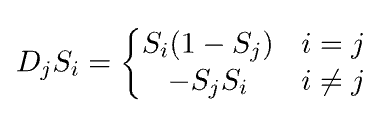</kbd></p>

<p align="center"><kbd></kbd></p>

<p align="center"><kbd>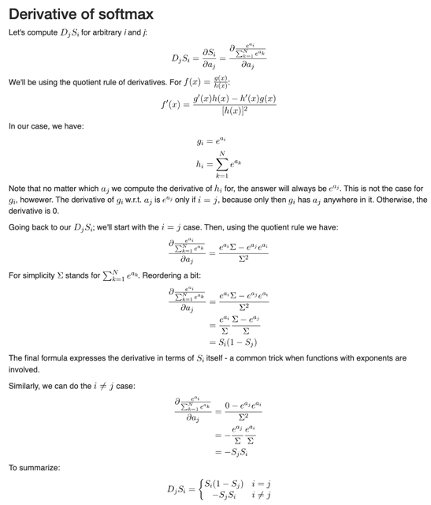</kbd></p>

> [!NOTE]
> ```text
> https://eli.thegreenplace.net/2016/the-softmax-function-and-its-derivative/
> ```
>
> Trùng kết quả với bài viết này, Si ở đây là Pi

<br>

<a id="node-789"></a>

<p align="center"><kbd>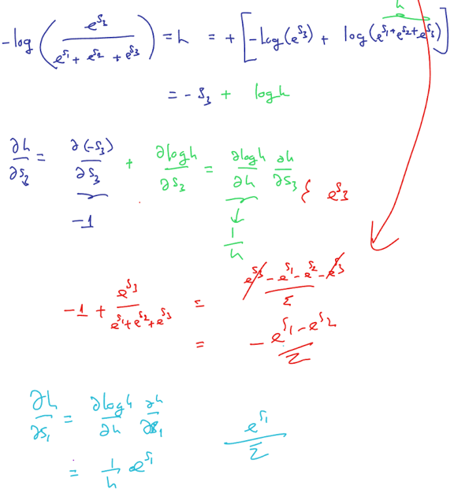</kbd></p>

> [!NOTE]
> Nếu chỉ cần tính dL `/` ds thì dễ hơn khi
> nhờ log và exp triệt nhau.
>
> Tóm lại: 
>
> `dL/ds_correct` là **- (tổng các p_incorrect)**dL/ds_incorrect **là p_incorrect**

<br>

<a id="node-790"></a>

<p align="center"><kbd>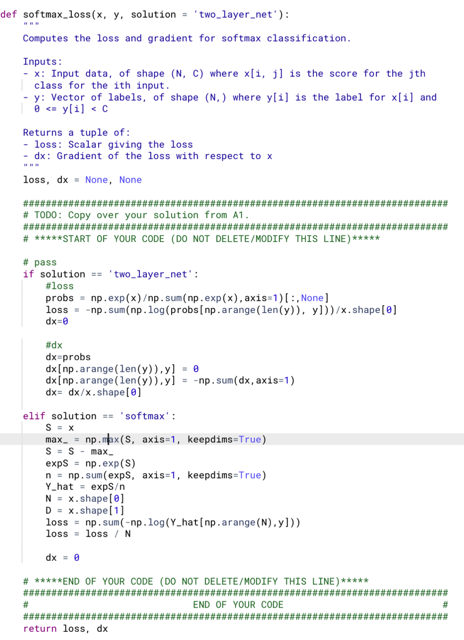</kbd></p>

> [!NOTE]
> "Softmax loss" tính đơn giản, chỉ bỏ các score qua hàm
> softmax, để ra probability, Sau đó dùng y để lấy ra prob ứng
> với correct class. Từ đó log, và sum và negative Chia N là ra
> loss.
>
> Tuy nhiên cách làm này, có chút chưa chuẩn, tuy ko sai, đó là
> cái vụ unstable Softmax, nên trong bài làm softmax classifier
> đã làm đó là trước khi tính prob Ta sẽ trừ đi một constant, lấy
> bằng thằng lớn nhất trong các score, sau đó mới  bỏ qua
> softmax tính prob. Chỉ vậy thôi còn lại y chang. Theo link để
> tới note nói về cái này
>
> Còn dx thì là d loss `/` d score, thì với correct score,**sẽ là 
> `-` (tổng các p incorrect). với incorrect score thì là p_incorrect.**
>
> Vậy ta chỉ việc bắt đầu (gán dx cho) bằng matrix prob.
> Xong, set 0 vào vị trí correct class , đặng tổng lại theo hàng
> (axis `=` 0) để rồi lấy giá trị đó sét vào vị trí correct class

> [!NOTE]
> CHÚ Ý, COI CHỪNG LỘN: ở đây mình đã làm lại cái
> `softmax_loss,` chú thích là solution `=` ' `two_layer_net',`
> còn cái dưới là copy từ phần làm softmax classifier.
> Cũng như nhau thôi. Cái quan trọng nhất đó là khi tét
> softmax với random ini weight phải ra `-log(num_classes)`
> nếu là `CIFAR-10` thì là 2.3

<br>

<a id="node-791"></a>

<p align="center"><kbd>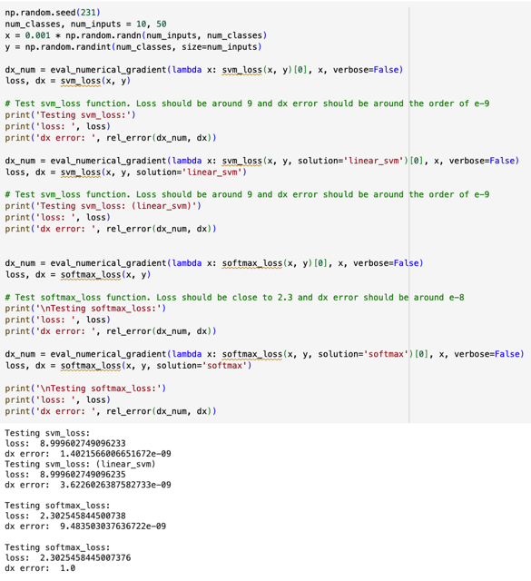</kbd></p>

> [!NOTE]
> `svm_loss` ra cỡ 9 là đúng, dx có sai số `e-9.` Cả solution mới làm và
> copy từ `linear_svm` đều ra đúng.
>
> softmax ra khoảng 2.3 tương đương **-log(num class =10)** là đúng

<br>

<a id="node-792"></a>

<p align="center"><kbd>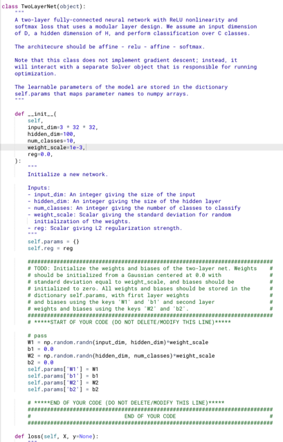</kbd></p>

> [!NOTE]
> tổng hợp lại, build cái two layer network model. ở
> bước ini, dùng np. randn(shape)*scale để khởi tạo các 
> weight matrix như đã học. 
>
> còn bias thì ini bằng 0,
>
> Set vào params dictionary (DLSpec cũng đã làm tương tự

<br>

<a id="node-793"></a>

<p align="center"><kbd>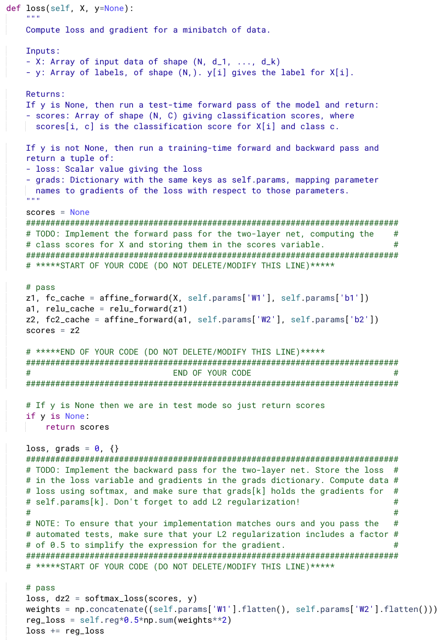</kbd></p>

> [!NOTE]
> function loss này sẽ chịu trách nhiệm forward prop, để
> tính ra prediction (score) (nếu ở test mode thì trả ra
> prediction (score)).  Quá trình này chỉ việc lần lượt gọi
> các `affine_forward,` `relu_forward` xen kẽ nhau,  cuối
> cùng là softmax loss để có loss, và `dL/dscore`
>
> Ở đây ta phải là cái vụ regularization loss, cũng đơn
> giản, cộng dồn vào loss thôi. Chú ý phải có scale
> factor 0.5 **tức là ta tính (l2) reg loss theo công thức 0.
> 5*lambda*Sum w**2**

<br>

<a id="node-794"></a>

<p align="center"><kbd>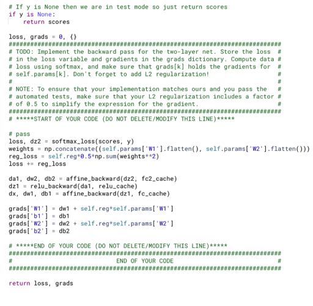</kbd></p>

> [!NOTE]
> Sau đó backprop thì chỉ viêc gọi các `relu_backward,`
> `affine_backward` để có các `dL/dW` và `dL/db`
> **add reg loss grad**và gán vào grad dict

<br>

<a id="node-795"></a>

<p align="center"><kbd>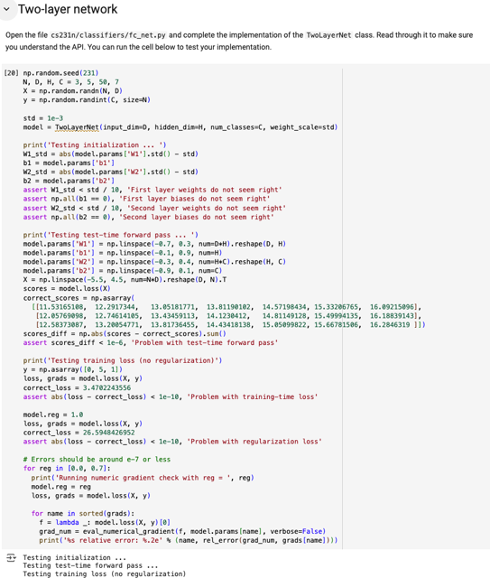</kbd></p>

<br>

<a id="node-796"></a>

<p align="center"><kbd>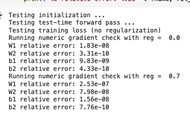</kbd></p>

> [!NOTE]
> chạy cái này ra mọi
> relative error đều cỡ `e-9`
>
> và pass hết các test case

<br>

<a id="node-797"></a>

<p align="center"><kbd>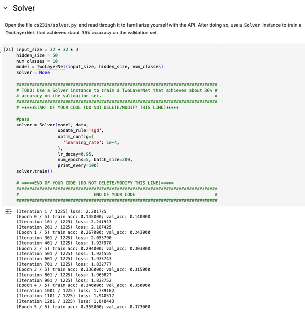</kbd></p>

> [!NOTE]
> cái solver thì sẽ còn quay lại tự làm lại sau, ở đây người ta
> chỉ yêu cầu xem và dùng nó.

<br>

<a id="node-798"></a>

<p align="center"><kbd>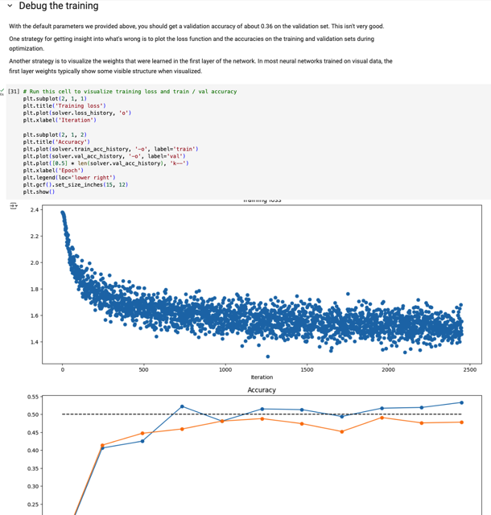</kbd></p>

> [!NOTE]
> khi train model với các h.p để sẵn, model cơ bản là underfit biểu hiện là
> hai đường train và val acc bám sát nhau và còn đang đi xuống
>
> (cái hình dưới là với best model, sau khi đã tuning thì thấy rằng model đã
> bắt đầu overfit khi val acc đang bắt đầu giảm.

<br>

<a id="node-799"></a>

<p align="center"><kbd>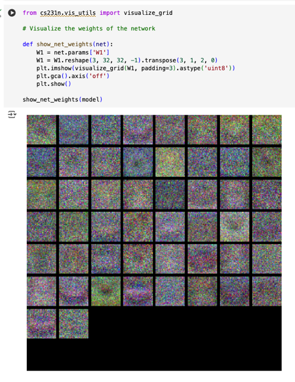</kbd></p>

> [!NOTE]
> với cái model chưa được finetune, visualize
> các hidden value chưa thấy rõ hình hài gì

<br>

<a id="node-800"></a>

<p align="center"><kbd>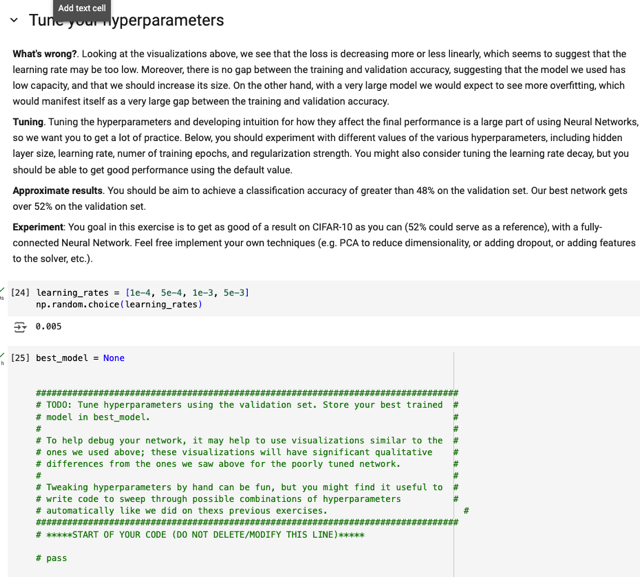</kbd></p>

> [!NOTE]
> họ nói rằng nhìn vào plot có thể thấy lr đang nhỏ, model
> underfit và có thể cải thiện thêm. Ở đây ta sẽ cố gắn tuning
> để coi có đạt performance 52% như người ta hay ko

<br>

<a id="node-801"></a>

<p align="center"><kbd>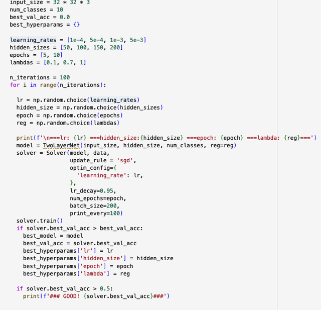</kbd></p>

> [!NOTE]
> thử với các hp,
> random search

<br>

<a id="node-802"></a>

<p align="center"><kbd>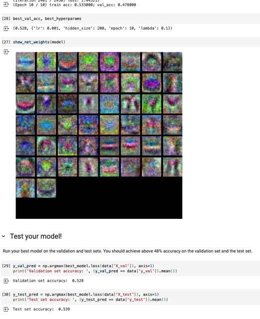</kbd></p>

> [!NOTE]
> kết quả đã đạt 52% như họ nói và các hidden
> layer cũng đã show các pattern rất rõ

<br>

