# Assignment 1 - KNN

📊 **Progress:** `31` Notes | `52` Screenshots

---

<kbd></kbd>

> [!NOTE]
> Như đã biết trong lecture, kNN classifier ở bước **training** thì thật ra nó **chỉ
> save nguyên bộ training set vào bộ nhớ**
>
> Rồi khi **testing**, với mỗi image cần predict, nó chỉ **lần lượt tính distance
> (l1 or l2) của image đó với các image trong training set**. Để rồi**chọn ra k
> image có closest distance**. Sau đó xem trong đó, **class nào chiếm số
> đông** thì dùng nó để làm prediction của image cần predict.
>
> Thì**k** là **hyperparams**, sẽ được **cross-validated để tìm ra (h.p tuning)**

 

## # Run some setup code for this notebook.

> [!NOTE]
> # Run some setup code for this notebook.
>
> import random
> import numpy as np
> from cs231n.data_utils import load_CIFAR10
> import matplotlib.pyplot as plt
>
> # This is a bit of magic to make matplotlib figures appear inline in the notebook
> # rather than in a new window.
> %matplotlib inline
> plt.rcParams['figure.figsize'] = (10.0, 8.0) # set default size of plots
> plt.rcParams['image.interpolation'] = 'nearest'
> plt.rcParams['image.cmap'] = 'gray'
>
> # Some more magic so that the notebook will reload external python modules;
> # see http://stackoverflow.com/questions/1907993/autoreload-of-modules-in-ipython
> %load_ext autoreload
> %autoreload 2

 

<kbd>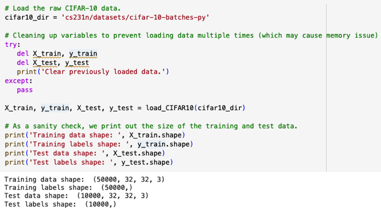</kbd>

> [!NOTE]
> Load bộ cifar dataset chứa sẵn trong datasets directory.
>
> Training data có 50.000 images, test data có 10.000 images

 

### # Visualize some examples from the dataset.

> [!NOTE]
> # Visualize some examples from the dataset.
> # We show a few examples of training images from each class.
> classes = ['plane', 'car', 'bird', 'cat', 'deer', 'dog', 'frog', 'horse', 'ship', 'truck']
> num_classes = len(classes)
> samples_per_class = 7
> for y, cls in enumerate(classes):
>     idxs = np.flatnonzero(y_train == y)
>     idxs = np.random.choice(idxs, samples_per_class, replace=False)
>     for i, idx in enumerate(idxs):
>         plt_idx = i * num_classes + y + 1
>         plt.subplot(samples_per_class, num_classes, plt_idx)
>         plt.imshow(X_train[idx].astype('uint8'))
>         plt.axis('off')
>         if i == 0:
>             plt.title(cls)
> plt.show()
>

> [!NOTE]
> In một số ra xem

 

<kbd>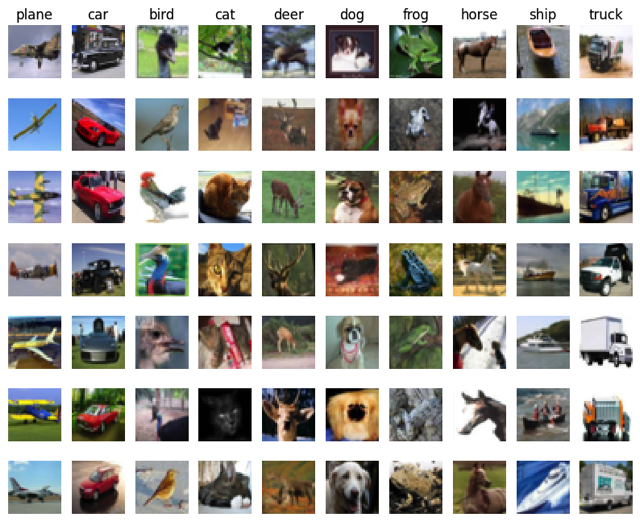</kbd>

   

<kbd>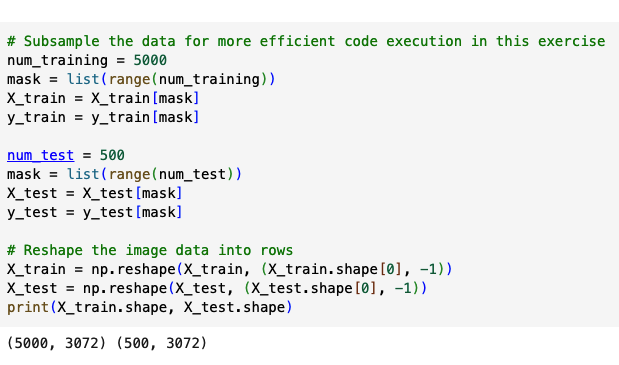</kbd>

> [!NOTE]
> Đại khái ở đây học lấy ra ngẫu nhiên 5000
> tấm để giảm bớt thời gian run
>
> Cũng không phải ngẫu nhiên, mà là lấy 5000 image đầu tiên,
> học tạo list (range 5000) sẽ cho ra vector [0,1,2...5000]
> và dùng nó để lấy 5000 image đầu ra.
>
> Tương tự lấy 500 trong 10000 image test

   

<kbd>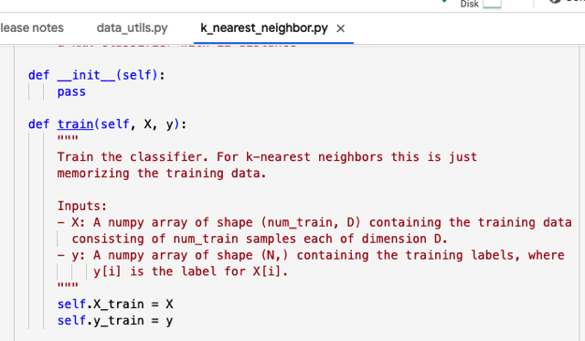</kbd>

<kbd></kbd>

<kbd>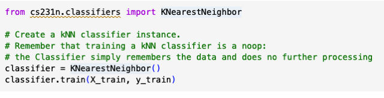</kbd>

> [!NOTE]
> Khởi tạo KNearestNeighbor (custom model - model tự làm trong
> k_nearest_neighbor.py) và gọi train để training mà thật ra chả làm gì chỉ
> là save vào X_train, y_train thôi

   

- We would now like to classify the test data with the kNN classifier. Recall that we can break down this process into two steps:  First we must compute the distances between all test examples and all train examples. Given these distances, for each test example we find the k nearest examples and have them vote for the label Lets begin with computing the distance matrix between all training and test examples. For example, if there are Ntr training examples and Nte test examples, this stage should result in a Nte x Ntr matrix where each element (i,j) is the distance between the i-th test and j-th train example.  Note: For the three distance computations that we require you to implement in this notebook, you may not use the np.linalg.norm() function that numpy provides.  First, open cs231n/classifiers/k_nearest_neighbor.py and implement the function compute_distances_two_loops that uses a (very inefficient) double loop over all pairs of (test, train) examples and computes the distance matrix one element at a time.
   

    
    
<kbd>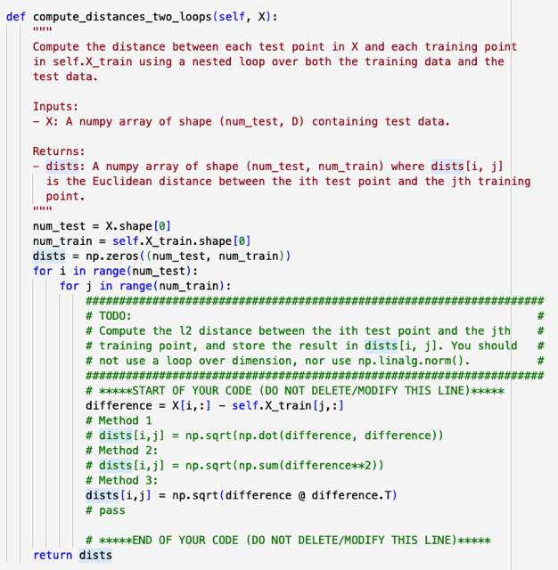</kbd>

    > [!NOTE]
    > Đại khái là loop trong 500 các image test (num_test, là số row của
    > X, = X.shape[0]), và với mỗi image, loop trong 5000 image của training
    > set X_train. 
    >
    > Tính**L2 distance** của hai vector có thể tính bằng nhiều cách. Đều là tính
    > hiệu hai vector (difference) trước sau đó bình phương rồi np.sum
    > cũng được hoặc dùng np.dot cũng được, thậm chí **matmul @** cũng được.
    >
    > Thật ra có thể dùng**np.linag.norm** nhưng họ bảo không được dùng để
    > tự tính L2 distance

     

    
    
<kbd>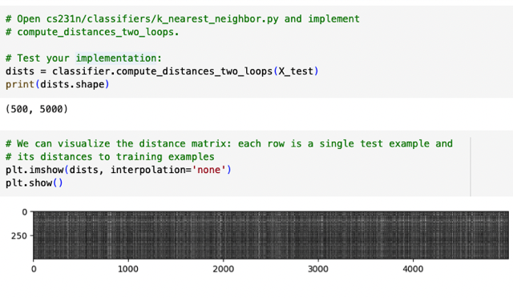</kbd>

    > [!NOTE]
    > đại khái in ra cái matrix 500x5000 các chỉ số l2 distance các số lớn
    > thì màu trắng, nhỏ thì màu đen thì nhận thấy là gì có các hàng cũng
    > cột trắng

     

  
  - Inline Question 1  Notice the structured patterns in the distance matrix, where some rows or columns are visibly brighter. (Note that with the default color scheme black indicates low distances while white indicates high distances.)  What in the data is the cause behind the distinctly bright rows? What causes the columns?   Y𝑜𝑢𝑟𝐴𝑛𝑠𝑤𝑒𝑟:  fill this in.  **Bright row cause by all the training image are different (have high distance) from the test image in that row.  Bright column cause by all the test images have high distance from the training image in that column.**
    > [!NOTE]
    > Thì mới hỏi là những hàng trắng có ý nghĩa gì -> Thì rõ
    > ràng là mọi training image (5000) đều có high distance với
    > test image của các hàng đó 
    >
    > Và cột trắng, có nghĩa là với 1 training image (cột) thì nó 
    > có high distance với mọi image trong test set

     

      
      
<kbd>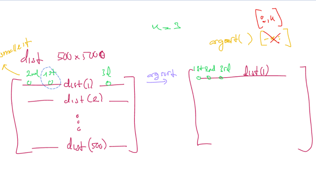</kbd>

      > [!NOTE]
      > Chỗ này có chút nhầm lẫn, argsort xong thì những thằng gần nhất tức
      > là distance nhỏ nhất sẽ đứng đầu, và nó trả về các indices của các
      > thằng đó, để rồi ta lấy các label ra
      >
      > Thì đáng lẽ phải dùng [:k] để lấy k thằng đừng đầu = những thằng gần nhất
      > chứ lúc đầu lại làm [-k,:] để lấy k thằng đứng cưới = những thằng xa nhất

       

      
      
<kbd>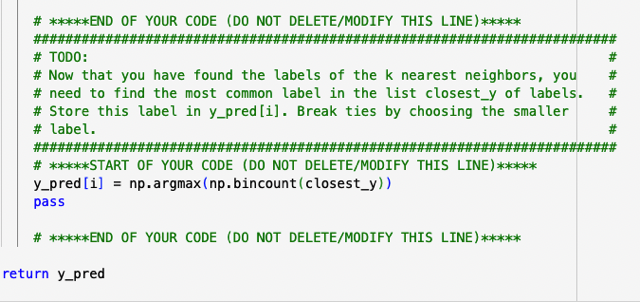</kbd>

      
<kbd></kbd>

      
<kbd>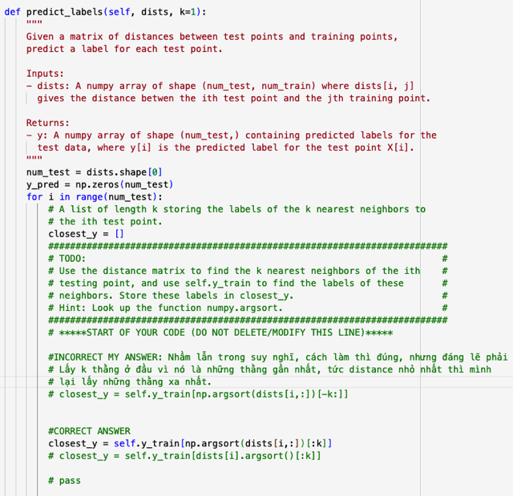</kbd>

      > [!NOTE]
      > Dùng**np.argsort** để sort value (distance) trong vector
      > (distance của image test thứ i với 5000 training images) thành
      > từ nhỏ tới lớn, và trả ra index của chúng.
      >
      > Sau đó**lấy (index của) k thằng (có value distance nhỏ) nhất** thì
      > **phải là lấy k thằng đầu** (lúc đầu làm sai, lấy k thằng cuối)
      >
      > **Bỏ cái list index vào y_train** để**lấy labels** **value**.
      >
      > Cuối cùng dùng **np.bincount()**để đếm số lần xuất hiện,  và np.
      > **argmax** để lấy cái có số lần xuất  hiện cao nhất. Đoạn code này
      > Hỏi GPT

       

      
      
<kbd>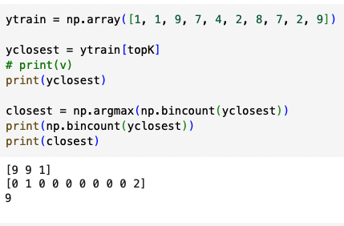</kbd>

      > [!NOTE]
      > Giải thích:
      >
      > Y closest = [9, 9, 1] thì **np**.**bincount** nó sẽ coi như
      > có các số từ 0 đến 9, và nó đếm tần suất xuất hiện của
      > các số này trong array [9,9,1]
      >
      > Từ đó nó ra [0 1 0 0 0 0 0 0 0 2], để rồi **np**.**argmax** của cái
      > này sẽ chính là số 9.

       

      
      
<kbd>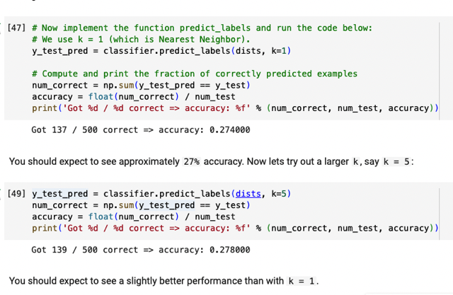</kbd>

       

      
      
<kbd>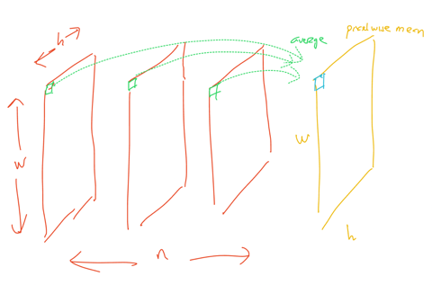</kbd>

      
<kbd></kbd>

      
<kbd>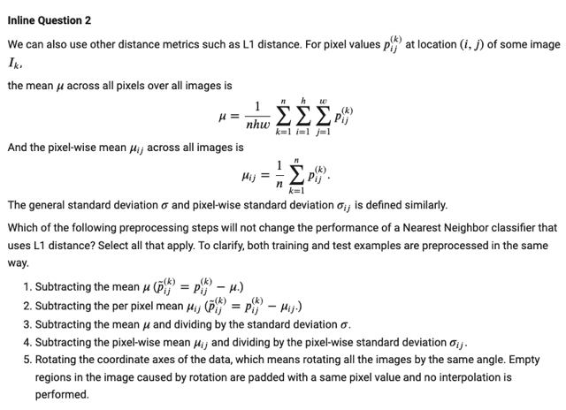</kbd>

      > [!NOTE]
      > Đại khái là cho một xấp n tấm hình (image), kích thước w, h. Mỗi hình
      > có w*h pixel, mà có n hình. Thì nếu mình lấy tổng mọi pixel value của 
      > mọi tấm và chia cho tổng số các pixel = w*h*k thì được **mean across 
      > mọi pixel và mọi images.**
      > Còn nếu lấy trung bình giá trị của các pixel cùng vị trí thì ta có**pixel-wise
      > mean.**Tính standard deviation cũng tương tự

       

      
      
<kbd>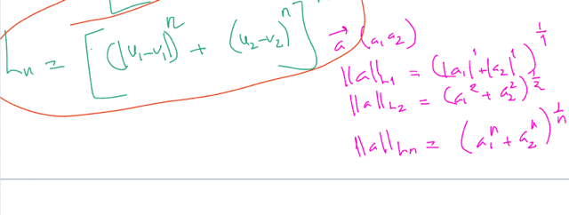</kbd>

      
<kbd></kbd>

      
<kbd>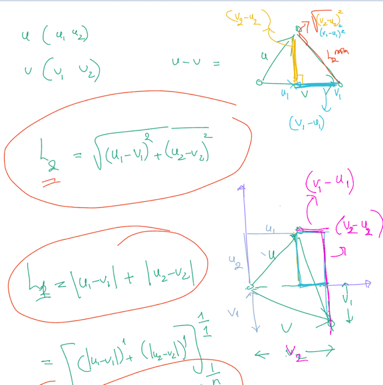</kbd>

       

      
      
<kbd>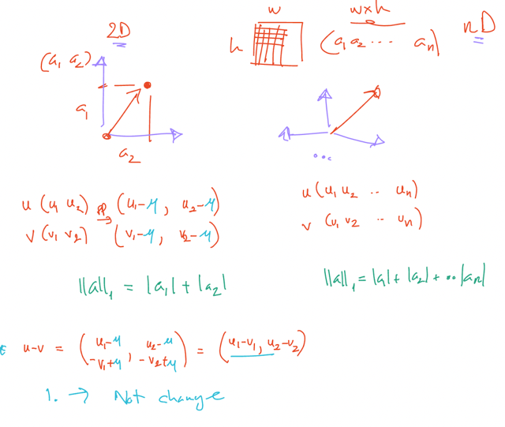</kbd>

      > [!NOTE]
      > 1. Subtract mean: **Not change L1 distance, nên
      > performance cũng không ảnh hưởng: Correct!**

       

      
      
<kbd>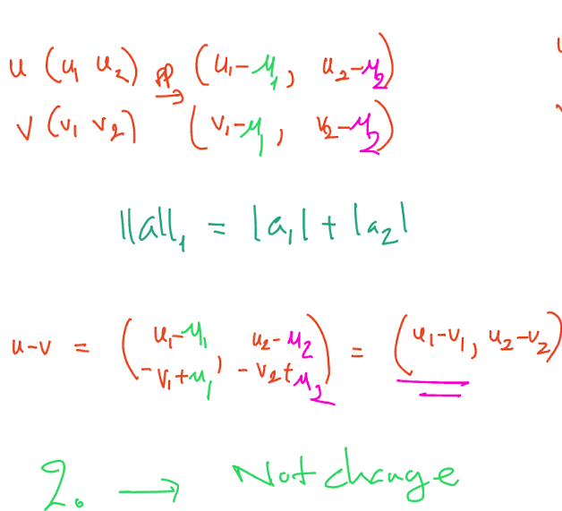</kbd>

      > [!NOTE]
      > 2. Subtract pixel-wise mean: **Not change L1 distance,
      > performance cũng không bị thay đổi: Correc!**

       

      
      
<kbd>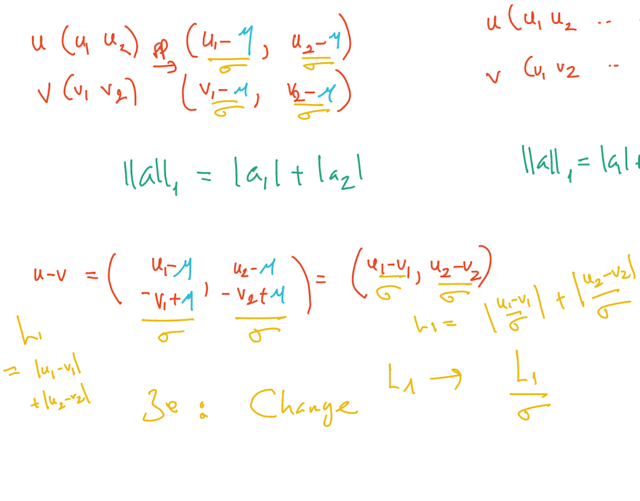</kbd>

      > [!NOTE]
      > 3. Subtract mean and divide by std. dev: Change L1 distance
      > -> L1 bị scale:  Nhưng không ảnh hưởng đến model
      > performance vì cơ bản mọi distance đều bị scale cùng 1 giá
      > trị standard dev

       

      
      
<kbd>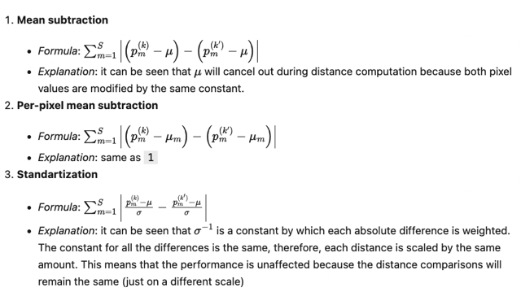</kbd>

       

      
      
<kbd>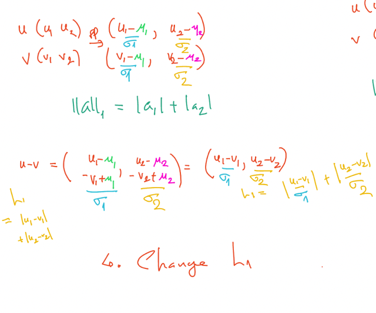</kbd>

      > [!NOTE]
      > 4. Subtract pw mean and divide by pw std. dev: Khiến L1 distance
      > thay đổi và sự thay đổi này sẽ khác nhau với mội distance, nên có thể
      > thay đổi thứ tự của các distance nên sẽ thay đổi  performance của
      > model
      >
      > ví dụ có 2 difference vector:
      >
      > d1 = (u1-v1, u2-v2) -> l1 = |u1-v1| + |u2-v2| ví dụ = A + B
      >
      > d2 = (u1-w1, u2-w2) -> l2 = |u1-w1| + |u2-w2| ví dụ = C + D
      >
      > Sau khi preprocessed:
      >
      > d1' = (u1-v1/std1, u2-v2/std2) -> l1' = |u1-v1|/std1 +  |u2-v2|/std2 ví dụ = A/std1 + B/std2
      >
      > d2' = (u1-w1/std1, u2-w2/std2) -> l2' = |u1-w1|/std1 + |u2-w2|/std2 ví dụ = C/std1 + D/std2
      >
      > Thì có thể chứng minh nếu d1 > d2 thì có thể d1' < d2' không?

       

      
      
<kbd>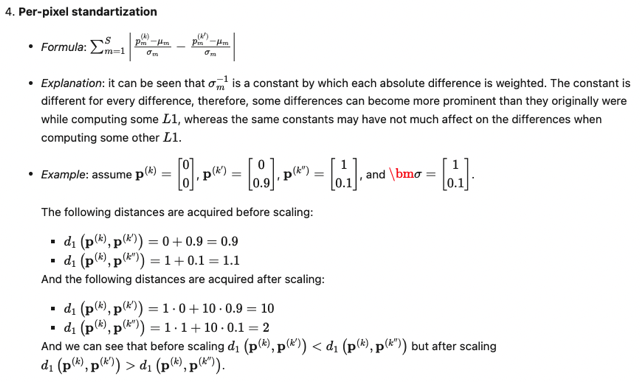</kbd>

       

      
      
<kbd>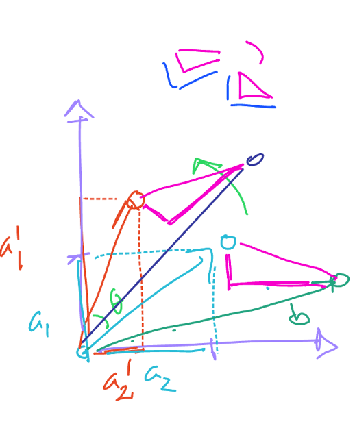</kbd>

      > [!NOTE]
      > 5. Suy đoán là không thay đổi vì
      > phép quay nó giữ nguyên khoảng
      > cách giữa hai vector: SAI

       

      
      
<kbd>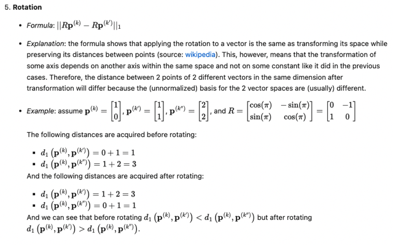</kbd>

       

      
      
<kbd>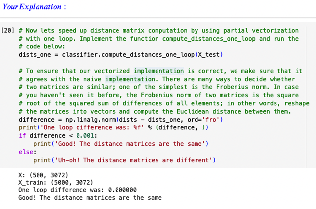</kbd>

      > [!NOTE]
      > Tính bằng 1 loop

       

      
      
<kbd>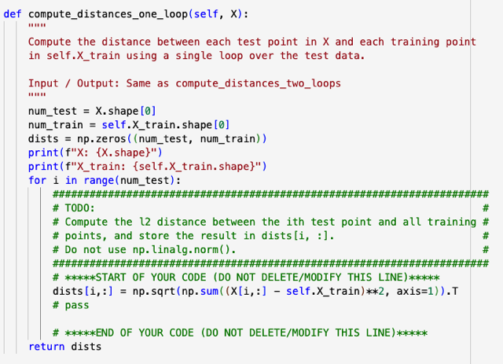</kbd>

      > [!NOTE]
      > Correct!

       

      
      
<kbd>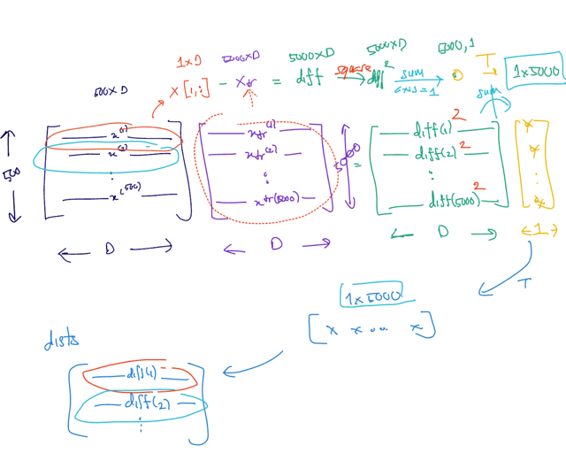</kbd>

      > [!NOTE]
      > Loop trong từng test image Xi = X[i, :] (1xD), trừ cho Xtr (5000xD) thì nó sẽ
      > broadcasting để thành ra 5000xD-5000xD để ta có diff 5000xD, mỗi row là hiệu
      > của Xi với mỗi trong  5000 train image Xtr.
      >
      > (D là chiều dài vector image flattened = 3072)
      >
      > Xong np.sqrt để square (element-wised).
      >
      > Numpy sum axis = 1 để thành vector cột 5000x1, là  L2 distance của Xi và mỗi
      > trong 5000 Xtrain image.
      >
      > Cuối cùng phải transpose để thành vector hàng và assign thành 1 hàng trong dist

       

      
      
<kbd>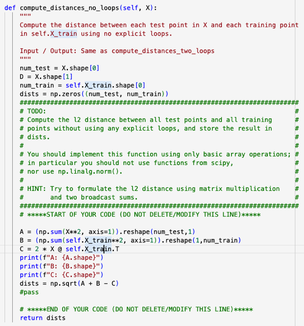</kbd>

       

      
      
<kbd>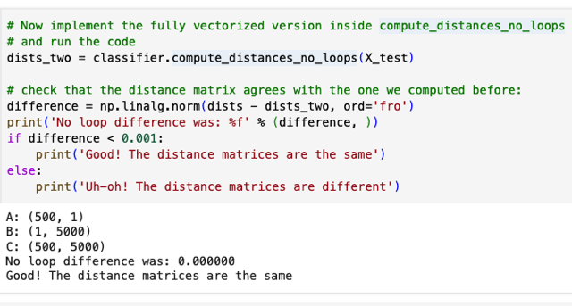</kbd>

       

      
      
<kbd>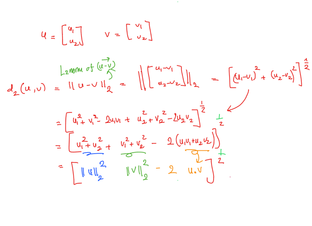</kbd>

      > [!NOTE]
      > Triển khai ra để có thể thấy công thức
      > tính L2 distance của u và v có thể tính bằng
      > sqrt (||u||**2 + ||v||**2 - 2uv]

       

      
      
<kbd>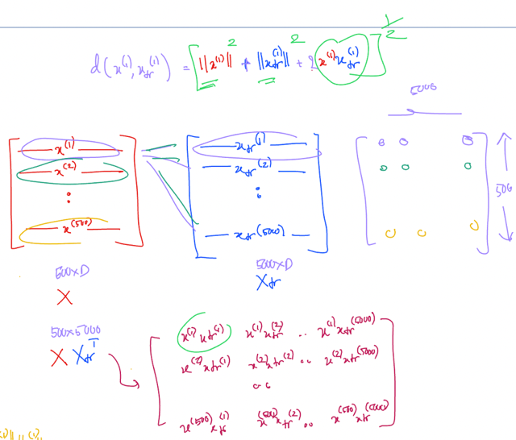</kbd>

      > [!NOTE]
      > Suy nghĩ như sau: Đầu tiên áp dụng công thức ta sẽ thấy để tính L2 distance 
      > giữa x(1) và xtr(1) tương tự ta sẽ tính 
      >
      > sqrt(||x(t)||**2 + ||xtr(1)||**2 + 2x(1).xtr(1)) gọi là 
      >
      > Tiếp theo để ý nếu ta dot product X (500xD) với Xtr_T (Dx5000) thì sẽ được
      > matrix X@Xtr_T (500x5000) trong đó mỗi row ví dụ row 1 là 5000 giá trị dot
      > product của x(1) và xtr(1), xtr(2)...xtr(5000) (trong hình dưới là hàng trên của 
      > matrix bên phải)
      >
      > Có nghĩa là đã có được phần dot product của công thức tính L2 distance ở
      > trên.
      >
      > Do đó ta sẽ nghĩ đến việc làm sao để có matrix A 500x5000, trong đó mỗi hàng
      > (i) là 5000 item bình phương L2 norm của x(i)
      >
      > Và tương tự làm sao để có matrix B 500x5000, trong đó mỗi hàng lần lượt
      > là bình phương L2 norm của xtr(1), xtr(2)....xtr(5000) hay nói cách khác mỗi cột
      > (j) là 500 item bình phương L2 norm của xtr(j)

       

      
      
<kbd>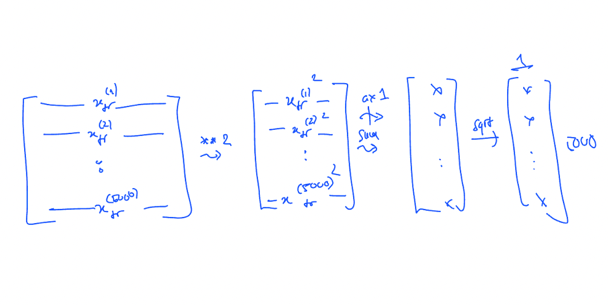</kbd>

      
<kbd></kbd>

      
<kbd>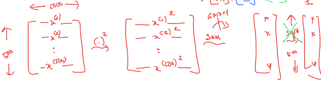</kbd>

      > [!NOTE]
      > A có thể tính từ X, đầu tiên là bình phương lên, để nó element wise square,
      > Sau đó dùng np.sum qua axis 1 để có một vector cột 500x1, mỗi item (i) chính là
      > bình phương L2 norm của x(i) (chú ý công thức L2 norm thì phải có bước lấy sqrt 
      > nhưng vì ta đang tính bình lương L2 norm nên khỏi)
      > Thì đây, khi ta tính A (500x1) - C (500x5000) thì broadcasting sẽ tự động duplicate
      > vector cột lên 5000 lần thành matrix A(500x5000)
      >
      > Tương tự tính B từ Xtr. Nhớ transpose, để ta sẽ có vector hàng 1x5000, mỗi item
      > j là bình phương L2 norm của xtr(j). Và tương tự khi tính B - C thì nó cũng sẽ được
      > duplicate 500 hàng thành 500x5000 matrix

       

      
      
<kbd>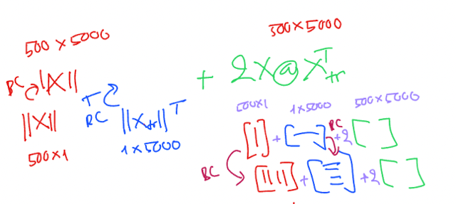</kbd>

       

      
      
<kbd>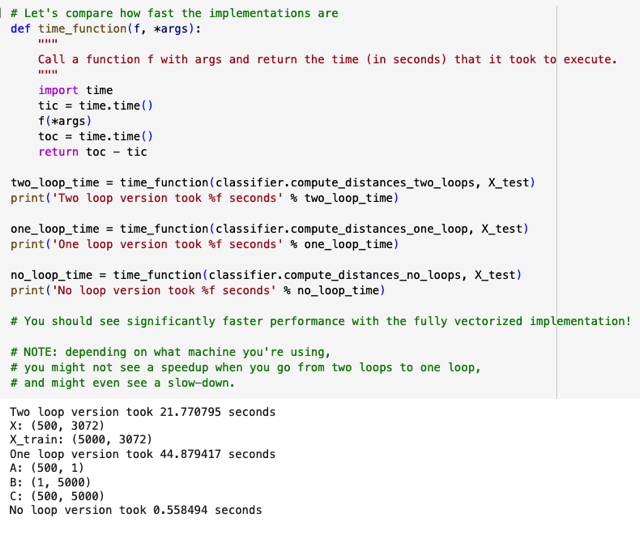</kbd>

      > [!NOTE]
      > Vectorization khiến
      > tăng tốc đáng kể

       

      
      
<kbd>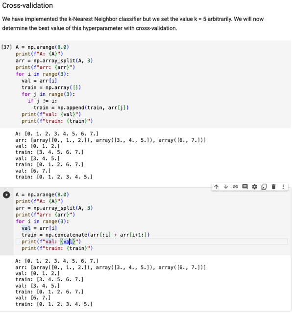</kbd>

      > [!NOTE]
      > Qua phần cuối, làm cross validation. Thì đại khái là ta sẽ chia bộ training data 
      > Xtrain, ytrain thành 5 (num_folds) phần. 
      >
      > Chuẩn bị một list các giá trị hyper-params k để h.tuning.
      >
      > Để rồi, iterate trong các giá trị k, với mỗi gía trị k, ta sẽ lần lượt iterate
      > num_folds lần (for i in range(num_folds), mỗi lần (tại i) lấy bộ Xval là 
      > bộ Xtrain_fold[i], ytrain_fold[i], còn 4 bộ kia ta sẽ gom lại trở thành Xtrain, ytrain
      >
      > Sau khi chia bằng np.array_split (Xtrain, num_folds) ta sẽ được list các np.array
      > nên giả sử lấy Xval là array thứ 2 (i=2) = Xtrain_fold[i]
      > thì để gom 4 bộ còn lại số 1,3,4,5 lại thành Xtrain thì ta làm như sau:
      > Xtrain_fold[:I] + Xtrain_fold[I+1,:] sẽ tạo list với 4 array, sau đó dùng np.concatenate
      > để concatenate thành 1 array duy nhất.

       

      
      
<kbd>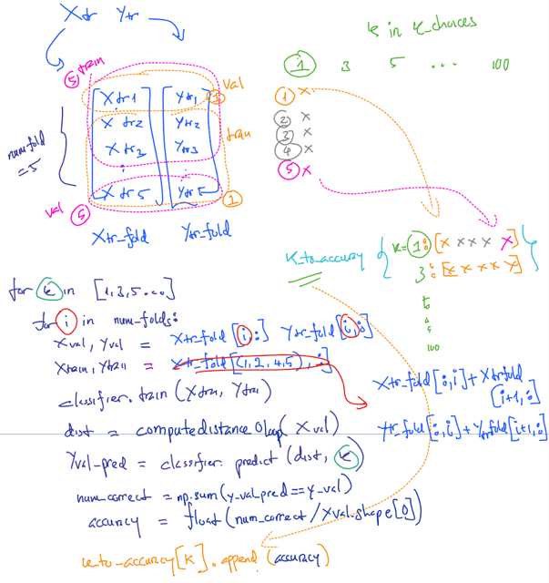</kbd>

      > [!NOTE]
      > Từ đó với Xtrain, ytrain ta tạo KNN Classifier, gọi train()
      > để train và tính prediction với Xval
      >
      > Sau đó tính accuracy và append vào list tương ứng của
      > dictionary k_to_accuracy là một dictionary với k là các giá trị k
      > và value là list chứa các giá trị accuracy của các lần test

       

      
      
<kbd>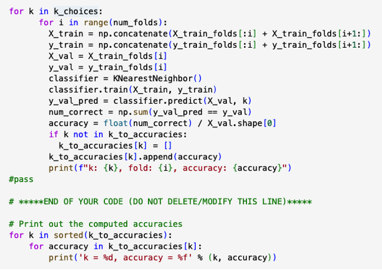</kbd>

      
<kbd>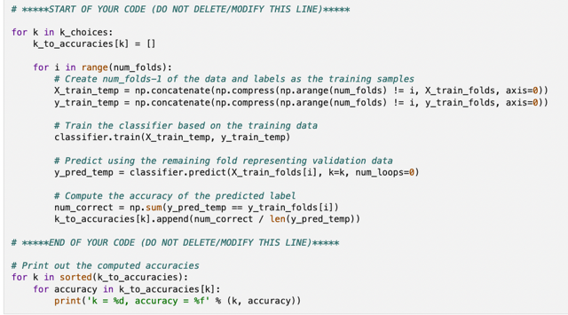</kbd>

      
<kbd></kbd>

      
<kbd></kbd>

      
<kbd>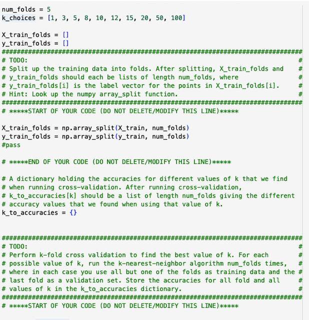</kbd>

      > [!NOTE]
      > Solution của khứa Mantas, dùng np.compress

       

    
    - k: 1, fold: 0, accuracy: 0.2625 k: 1, fold: 1, accuracy: 0.240625 k: 1, fold: 2, accuracy: 0.234375 k: 1, fold: 3, accuracy: 0.2921875 k: 1, fold: 4, accuracy: 0.2703125 k: 3, fold: 0, accuracy: 0.2484375 k: 3, fold: 1, accuracy: 0.225 k: 3, fold: 2, accuracy: 0.26875 k: 3, fold: 3, accuracy: 0.2609375 k: 3, fold: 4, accuracy: 0.25625 k: 5, fold: 0, accuracy: 0.2671875 k: 5, fold: 1, accuracy: 0.253125 k: 5, fold: 2, accuracy: 0.2765625 k: 5, fold: 3, accuracy: 0.259375 k: 5, fold: 4, accuracy: 0.2453125 k: 8, fold: 0, accuracy: 0.284375 k: 8, fold: 1, accuracy: 0.24375 k: 8, fold: 2, accuracy: 0.2828125 k: 8, fold: 3, accuracy: 0.2828125 k: 8, fold: 4, accuracy: 0.253125 k: 10, fold: 0, accuracy: 0.2828125 k: 10, fold: 1, accuracy: 0.2625 k: 10, fold: 2, accuracy: 0.2875 k: 10, fold: 3, accuracy: 0.2890625 k: 10, fold: 4, accuracy: 0.2640625 k: 12, fold: 0, accuracy: 0.2859375 k: 12, fold: 1, accuracy: 0.2515625 k: 12, fold: 2, accuracy: 0.29375 k: 12, fold: 3, accuracy: 0.2734375 k: 12, fold: 4, accuracy: 0.25 k: 15, fold: 0, accuracy: 0.29375 k: 15, fold: 1, accuracy: 0.2484375 k: 15, fold: 2, accuracy: 0.30625 k: 15, fold: 3, accuracy: 0.2484375 k: 15, fold: 4, accuracy: 0.2390625 k: 20, fold: 0, accuracy: 0.2703125 k: 20, fold: 1, accuracy: 0.25 k: 20, fold: 2, accuracy: 0.2921875 k: 20, fold: 3, accuracy: 0.2484375 k: 20, fold: 4, accuracy: 0.2625 k: 50, fold: 0, accuracy: 0.2640625 k: 50, fold: 1, accuracy: 0.2625 k: 50, fold: 2, accuracy: 0.284375 k: 50, fold: 3, accuracy: 0.2578125 k: 50, fold: 4, accuracy: 0.25 k: 100, fold: 0, accuracy: 0.253125 k: 100, fold: 1, accuracy: 0.253125 k: 100, fold: 2, accuracy: 0.2671875 k: 100, fold: 3, accuracy: 0.275 k: 100, fold: 4, accuracy: 0.24375
       

        
        
<kbd>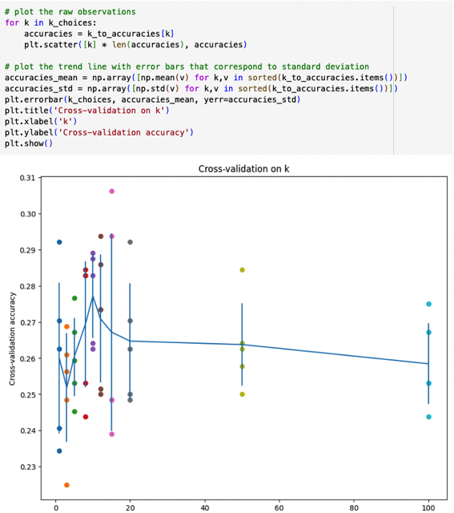</kbd>

        > [!NOTE]
        > Plot Cross-validation
        > accuracy theo K

         

        
        
<kbd>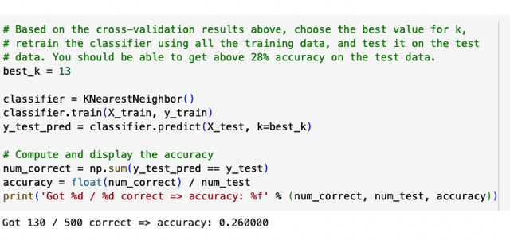</kbd>

        > [!NOTE]
        > Chọn k 15,13 và train lại và
        > tính test accuracy

         

        
        
<kbd>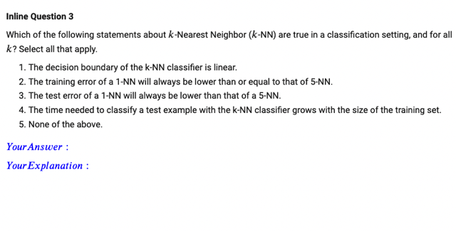</kbd>

        > [!NOTE]
        > 1. Ko đúng cho mọi k vì với k nhỏ, DB không linear mà có độ flexible rất cao
        >
        > 2. Đúng, 1-NN có K nhỏ hơn 5-NN, nên độ flexible cao hơn dẫn tới overfit
        > training set cao hơn -> training error thấp hơn
        >
        > 3. Sai, vì với K nhỏ, model sẽ overfit training set nên test error có thể sẽ lớn
        >
        > 4. Đúng vì KNN có training O(1) nhưng inference O(N)
        >
        > Vậy để đúng với mọi K thì có (2), (4)

         

        
        
<kbd>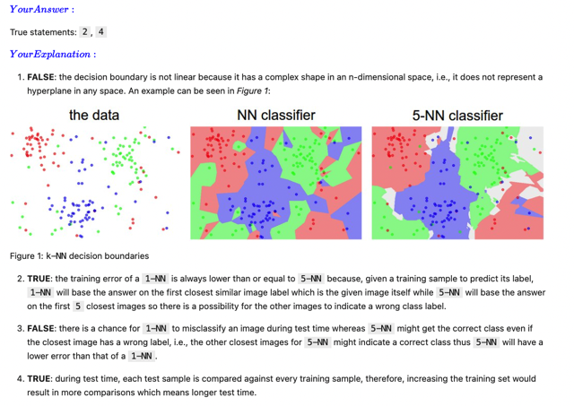</kbd>

        > [!NOTE]
        > Crrect

         

