# Assignment 1 SVM

📊 **Progress:** `14` Notes | `25` Screenshots

---

<kbd></kbd>

> [!NOTE]
> Đại khái là ta sẽ làm phiên bản fully vectorized khi công thức tính
> loss function với SVM, cũng như là analytic gradient. Rồi check
> (gradient check) với numerical gradient. Tune learning rate và
> regularization. Optimize với SGD

 

<kbd>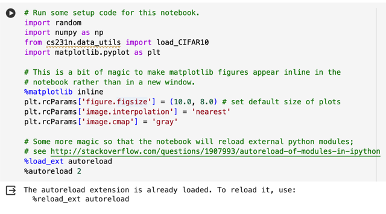</kbd>

> [!NOTE]
> Ta sẽ dụng utils function người ta chuẩn bị
> sẵn để load CIFAR10 dataset

 

<kbd>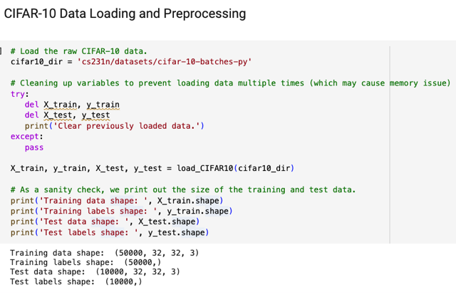</kbd>

> [!NOTE]
> Nhờ utils function load dataset CIFAR10 từ thư mục, nó đã có sẵn
> training + testing dataset. Trong function đó đã thực hiện động tác
> reshape để training tensor sẽ có shape là 50.000 x 32 x 32 x 3

 

<kbd>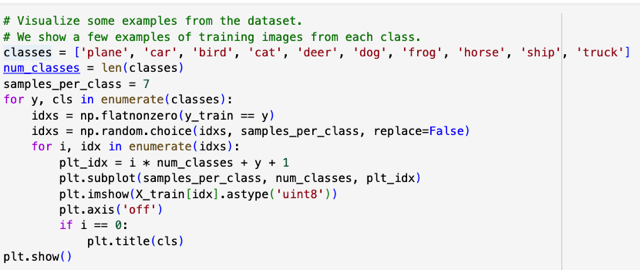</kbd>

 

<kbd>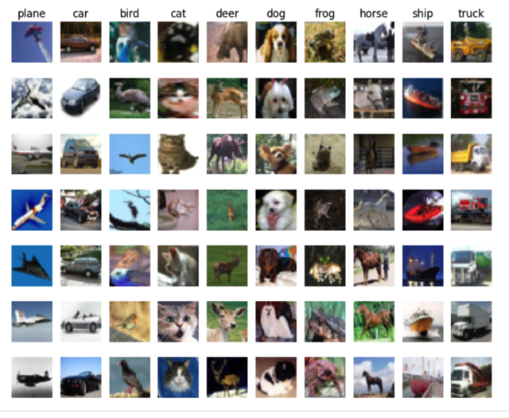</kbd>

> [!NOTE]
> In vài data sample ra xem thử

 

<kbd>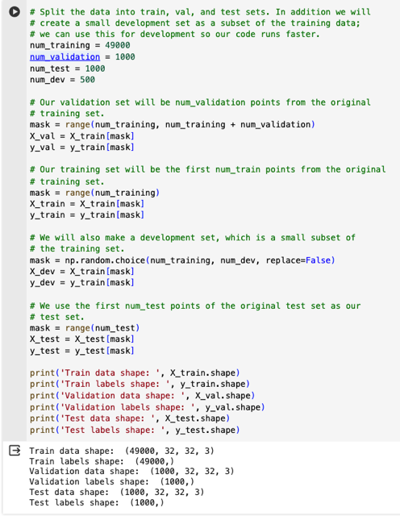</kbd>

> [!NOTE]
> Đại khái là với 50000 cái hình trong training, người ta
> dành 1000 cái cuói làm validatiaon sét. Rồi lại lấy trong
> 49000 cái của training sét, random 500 cái dùng làm dev
> sét.
>
> Rồi trong 10000 cái của tét sét gốc thì ta chỉ lấy 1000 cái
> đầu thôi

 

<kbd>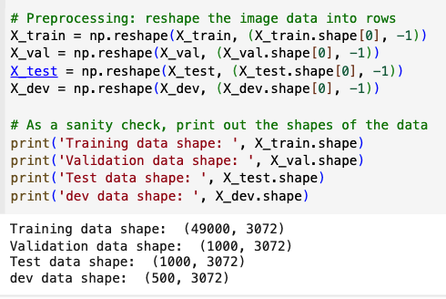</kbd>

> [!NOTE]
> Cơ bản là flatten các image đang là 32,32,3 thành
> vector có 32x32x3 dimensions

 

<kbd>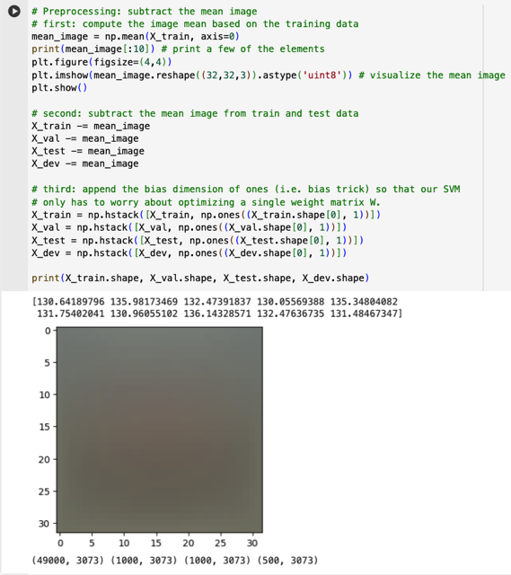</kbd>

> [!NOTE]
> Đại khái là lúc này X_train có shape là 49000,3072 để normalization,
> họ tính mean của từng feature, đương nhiên là theo từng cột của
> matrix, nên axis sẽ là 0. Sau đó trừ mọi giá trị của tensor X cho
> mean.
>
> Còn bước hai đó là bias trick, cơ bản là tạo vector cột toàn số 1 có
> shape là 49000x1 rồi dùng numpy's hstack. = horizontal stack để
> stack lại,

 

<kbd>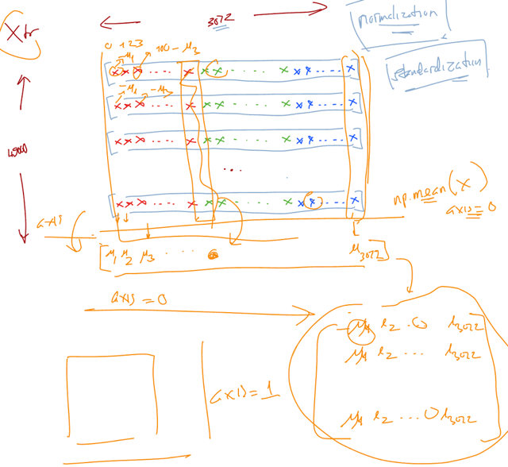</kbd>

 

<kbd>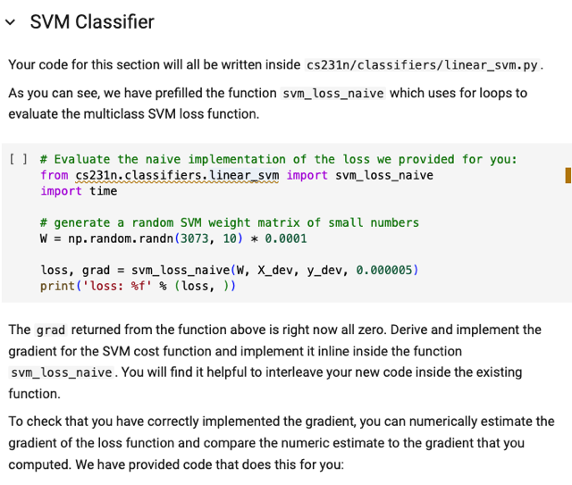</kbd>

> [!NOTE]
> Đại khái là hoàn thành
> function tính svm loss

 

<kbd>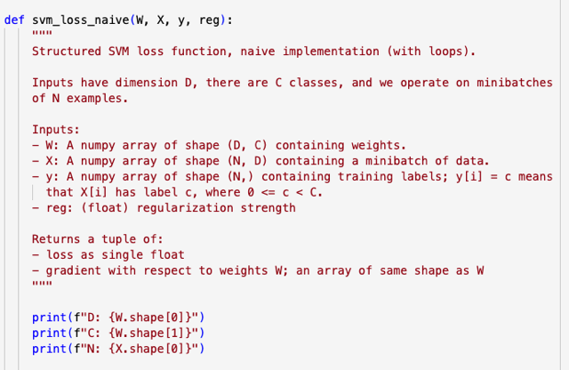</kbd>

 

<kbd>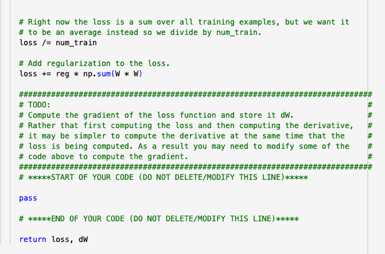</kbd>

<kbd></kbd>

<kbd>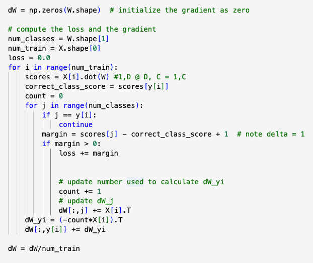</kbd>

 

<kbd>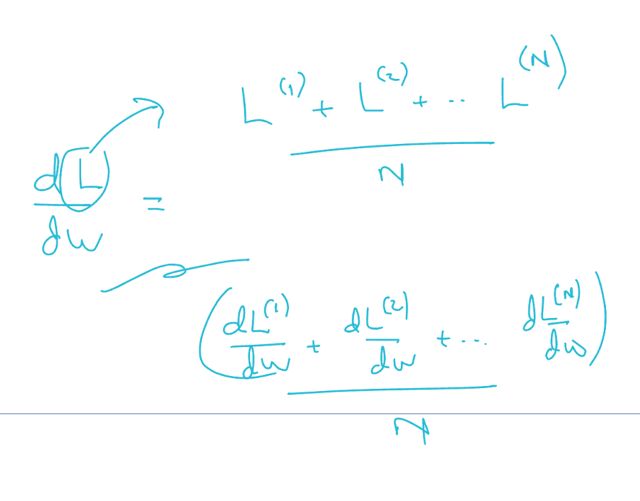</kbd>

> [!NOTE]
> Tại sao lại "cộng dồn" khi tính đạo hàm của L w.r.t W với
> loss là trên 1 batch các data sample lại là tổng (đúng hơn là
> trung bình) các đạo hàm của loss trên từng data sample w.
> r.t W. Vì đạo hàm của tổng là tổng đạo hàm vậy thôi

 

## Inline Question 1

> [!NOTE]
> Inline Question 1
>
> It is possible that once in a while a dimension in the gradcheck will not match exactly. What could
> such a discrepancy be caused by? Is it a reason for concern? What is a simple example in one
> dimension where a gradient check could fail? How would change the margin affect of the frequency
> of this happening? Hint: the SVM loss function is not strictly speaking differentiable
>
> Y𝑜𝑢𝑟𝐴𝑛𝑠𝑤𝑒𝑟:  fill this in.

> [!NOTE]
> Quay lại sau

 

<kbd>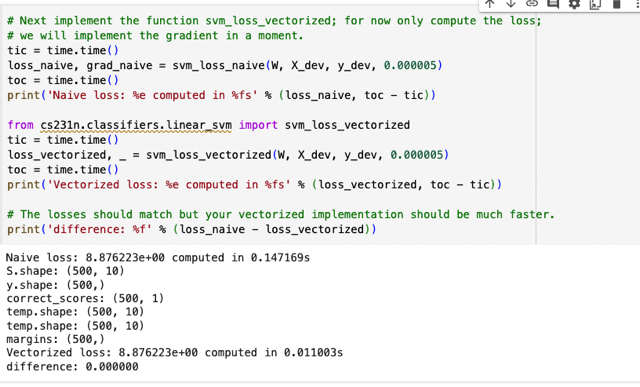</kbd>

 

<kbd>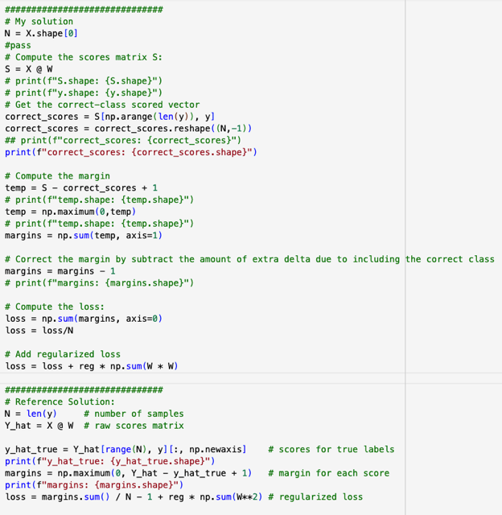</kbd>

> [!NOTE]
> Correct! Viết hàm tính loss SVM vectorized
>
> Chú ý phải có regularizer (ban đầu mình quên cộng), còn
> cơ bản cách làm là đúng khi so với cách làm của solution
> tham khảo.
>
> Nhìn hơi khác ở chỗ là trong cách làm tham khảo,  họ
> reshape vector y_hat_true (mà mình gọi là correct_scores)
> bằng cái syntax: [:, np.newaxis] còn mình reshape bằng
> function reshape: .reshape(N,-1)
>
> Sau đó thì cũng lấy S (họ đặt là Y_hat) trừ đi y_hat_true và
> cộng delta.
>
> Một chỗ khác nữa, đó là mình bỏ bớt delta thừa bằng cách
> trừ margins vector cho 1 còn họ thì dùng cách - 1 thật ra
> cũng y chang.

 

<kbd>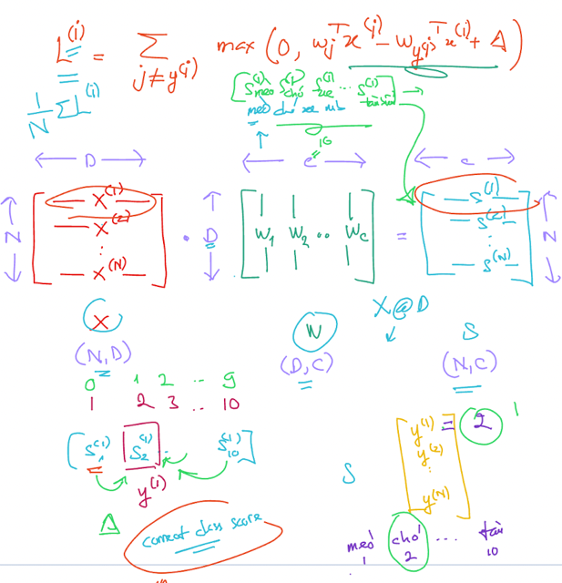</kbd>

 

<kbd>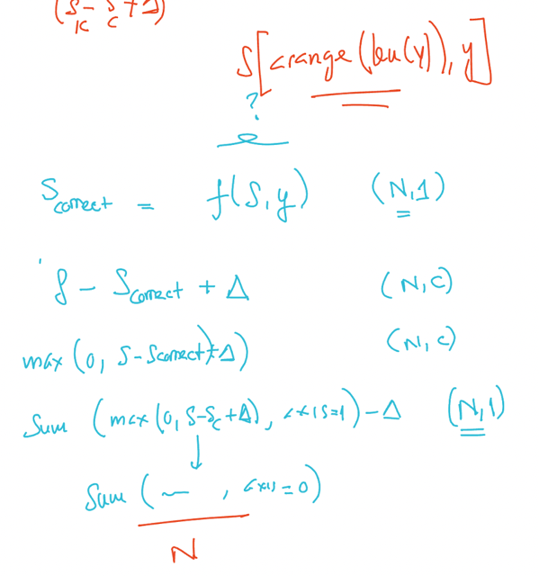</kbd>

 

<kbd>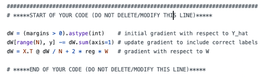</kbd>

<kbd></kbd>

<kbd>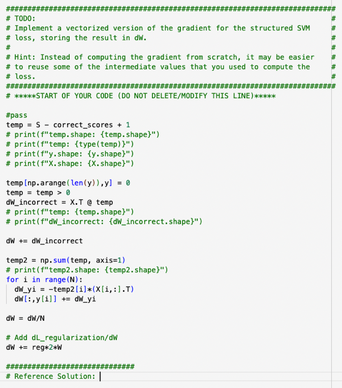</kbd>

> [!NOTE]
> Giảm xuống còn 1 vòng lặp nhưng chú ý là phải có
> dL_regularizer/dW nếu Loss có regularizer loss term

 

<kbd>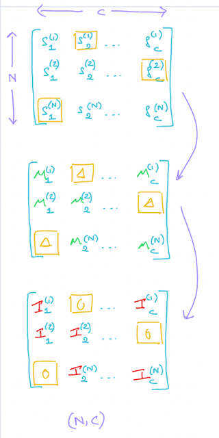</kbd>

> [!NOTE]
> Qua các bước tính ra margin, và khử đi vị
> trí tương ứng với correct class, tạm gọi là matrix I

 

<kbd>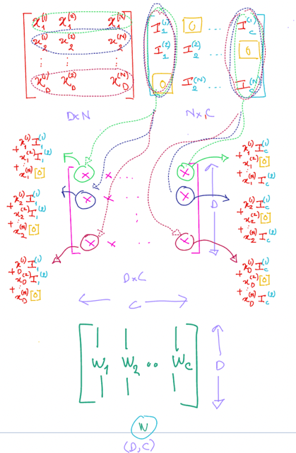</kbd>

> [!NOTE]
> đại khái là X (transposed) matmul với I thì
> kết qủa matrix (shape DxC) thì nó chính là
> tổng dW "đối với / tính trên các incorrect class

 

<kbd>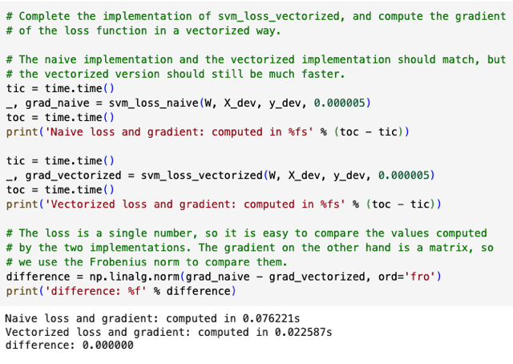</kbd>

 

