# Assignment 2 - Pytorch

📊 **Progress:** `22` Notes | `37` Screenshots

---

<kbd></kbd>

 

<kbd>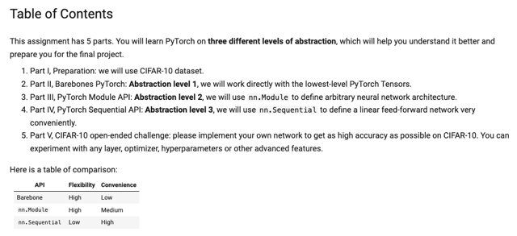</kbd>

> [!NOTE]
> Nói chung phần này hơi bị hay, khi người ta sẽ bắt mình làm 3
> cấp độ (sâu) của pytorch

 

<kbd>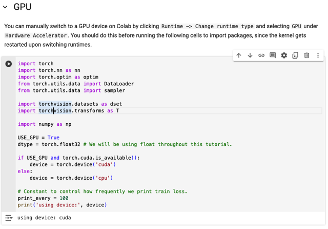</kbd>

> [!NOTE]
> Import torch, torch.nn, torch.optim, DataLoader của
> torch, dataset và transform của torchvision.
>
> Sau đó là check GPU có available không để dùng

 

<kbd>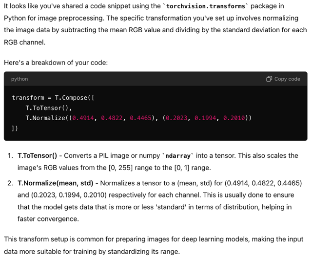</kbd>

<kbd></kbd>

<kbd>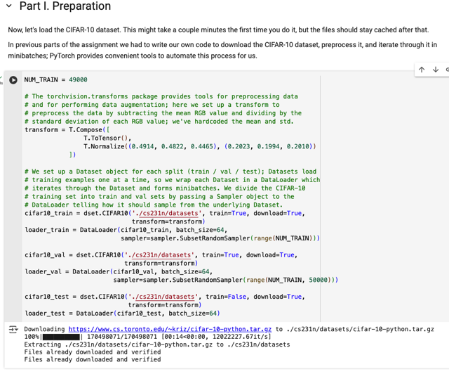</kbd>

> [!NOTE]
> ở đây, người ta dùng torchvision.transform giúp preprocessing data,
> cụ thể là tạo một compose chứa hai bước xử lý: chuyển data thành tensor
> sau đó là normalization với mean và standard deviation.
>
> Thì bước ToTensor như GPT cho biết nó sẽ chuyển PIL image hoặc numpy
> array thành tensor, đồng thời cũng scale value từ range [0-255] trở thành 
> [0-1]. Sau đó bước normalizing, thì theo phần lecture note nn part 2 về 
> data preprocessing cũng có nói với image người ta có thể dùng cách mean
> Subtraction với mean của toàn bộ image (cả 3 depth/channel) hoặc làm
> theo từng depth, tức lớp nào thì trừ mean của lớp đó. Thì ở đây là làm
> theo cách trừ mean của từng depth slice.
>
> =====
>
> Có thể thấy với torchvision's dataset, cho phép ta "gọi" khởi tạo CIFAR10 
> dataset, với input là path - có lẽ là để chứa khi download bộ data về, train
> bằng True là để nó download cả training set, vì nếu không cần train mà chỉ
> cần test set thì set train=False. Download = True dĩ nhiên để nó thực hiện
> việc download, và transform argument để nó dùng cho việc transform.
>
> Sau đó, người ta bao cái dataset trong một cái DataLoader, đặng nó sẽ giúp
> "lần lượt" (iteratively) trả ra từng gói (batch) data, số lượng define bởi argument
> batch_size. Đáng chú ý, ở đây ta hiểu rằng, DataLoader giống như nắm được
> cái nguồn để lấy dữ liệu ra, thế thì cái sampler argument sẽ quy định rằng khi 
> training, cái loader_train sẽ chỉ lấy ngẫu nhiên trong số 49000 samples đầu tiên
> của bộ dữ liệu gốc thôi. Để rồi cái loader_val sẽ cũng lấy dữ liệu từ cái nguồn"
> đó, nhưng khi lấy data cho validation thì nó sẽ lấy trong 1000 cái sample cuối
>
> Cái test set/loader cũng tương tự

 

<kbd>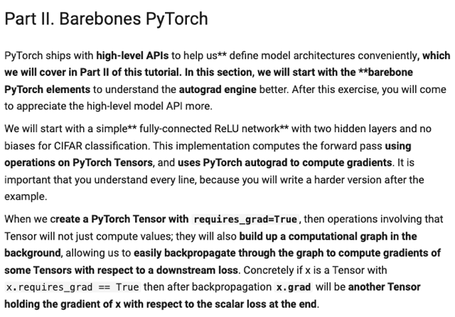</kbd>

> [!NOTE]
> đại khái như đã biết bên fastai cũng như trong bài giảng, pytorch cho phép ta
> thuận tiện hơn trong việc xây dựng kiến trúc deep learning model. Tuy vậy
> nó cũng có các cấp độ khác nhau, mà ở cấp barebone, ta sẽ làm quen với 
> việc dùng pytorch giúp tính đạo hàm tự động (autograd/autodifferentiation)
>
> Phần này ta sẽ build một fully connected layer cho CIRAR10 classification,
> Thực hiện forward pass bằng các operation trên Pytorch Tensor và nhờ Pytorch
> giúp cho việc tính gradient.
>
> Kiến thức này đã được học bên fastai với gs JJ.Howard,  rằng khi define
> torch.Tensor với requires_grad=True thì, khi gọi loss.backward(), pytorch sẽ
> giúp ta tính gradient = derivative of loss w.r.t tensor đó. Và gía trị của nó sẽ
> (là một tensor khác) trong variable .grad

 

<kbd>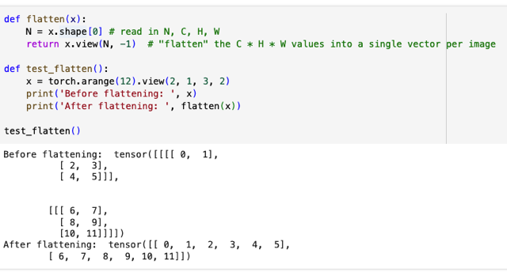</kbd>

<kbd></kbd>

<kbd>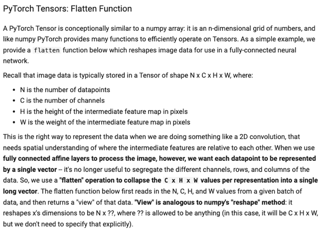</kbd>

> [!NOTE]
> Đại ý là nói về Pytorch tensor, cái này tương tự numpy array. Sau đó nói về
> các function mà pytorch hỗ trợ để làm việc với tensor, ví dụ flatten. Cái này
> đã quá quen, đó là hành động trải phẳng 2d, 3d..tensor thành ra vector.
>
> rồi họ nói đến việc khi làm việc với FC layer thì cần phải chuyển image về
> vector, thì khi đó ta sẽ dùng flatten để làm.
>
> Nói thêm về function view trong pytorch tương tự reshape của numpy

 

<kbd>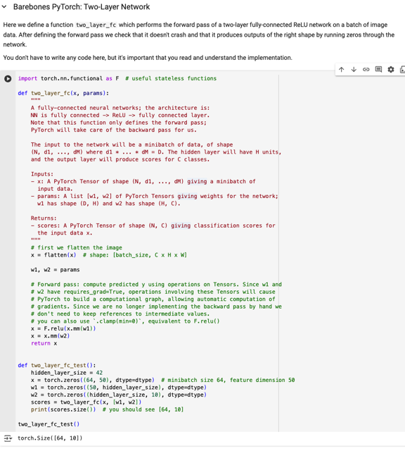</kbd>

> [!NOTE]
> ví dụ một 2-layer fc neural-net làm bằng pytorch. rất đơn giản, input x
> với shape là tensor 2D,3D..nD bất kì sẽ được flatten trước khi nhân
> matrix với ư (x.mm(w1)). Kết quả bỏ qua F.relu là phiên bản function
> của nn.ReLu như ta đã biết, sau đó mm tiếp với w2

 

<kbd>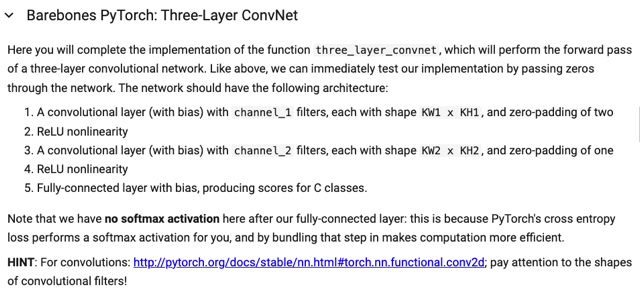</kbd>

<kbd></kbd>

<kbd>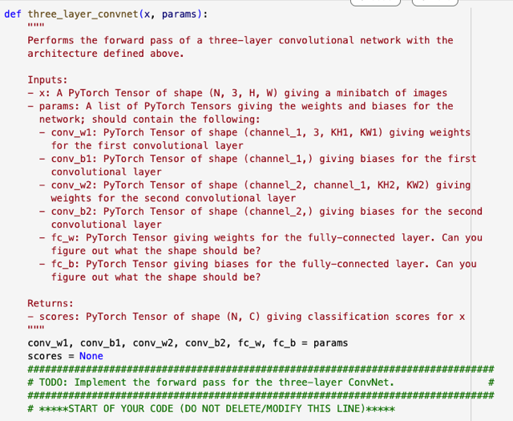</kbd>

 

<kbd>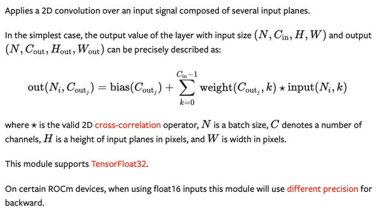</kbd>

> [!NOTE]
> có thể hiệu công thức dưới như sau: Giả sử input depth là 3 -> Cin = 3 Và
> depth của output của conv layer đương nhiên sẽ là số filter = Cout, giả sử
> là 4. 
>
> Với out_j sẽ lần lượt là out0, out1, out2, out3 để áp vô công thức tính ra
> 4 cái activation map (là kết quả của 4 filter thực hiện convol input tensor)
>
> Ví dụ xét out(Ni, Cout0):
>
> Thế thì ta xét cái tổng trước: ∑ k={0,1,2} weight(Cout0, k) * input(Ni, k)
>
> có nghĩa là, lần lượt với từng k value, ví dụ k = 0, ta sẽ tính:
>
> weight(Cout0, 0) * input(Ni, 0) : có nghĩa là lấy cái filter thứ nhất ra, đương
> nhiên weight là (Cout, Cin, KH, KW) nên weight(Cout0,..) sẽ cho ta một
> 3d tensor (Cin, KH, KW). Rồi lấy cái depth slice đầu ra weight(Cout0, 0)
>
> Thế thì lúc này ta có một miếng (matrix) của filter, ta mới thực hiện phép *
> mà ở đâu cho biết là phép 2D cross-correlation. Với input(Ni, 0) tức là với
> miếng (depth slice/channel) thứ 1 của input. Kết quả của phép toán này
> chưa biết thế nào nhưng suy đoán nó phải là một miếng có shape là 
> Hout , Wout. Chú ý đây chưa phải là activation map. Vì ta sẽ phải làm như
> vậy với k=1,2 để rồi sum lại, trước khi cộng với bias thì mới được một 
> activation map. Và là tương tự với các Coutj = Cout1, Cout2, Cout3 để có 
> được 4 activation map, stack lại để có output tensor.

 

<kbd>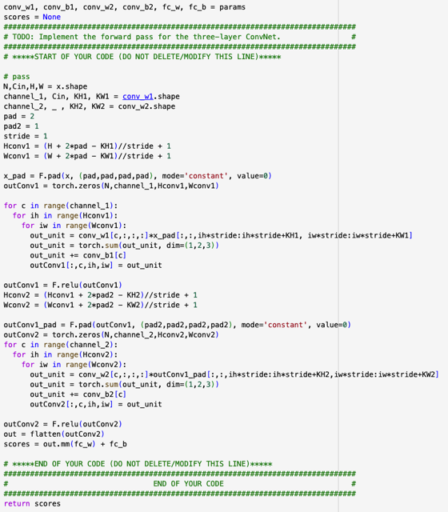</kbd>

> [!NOTE]
> cơ bản là giống như lúc ta làm conv_forward, chẳng qua
> là làm với pytorch
>
> Có điều chưa rõ là padding, và stride hard code trong này

 

<kbd>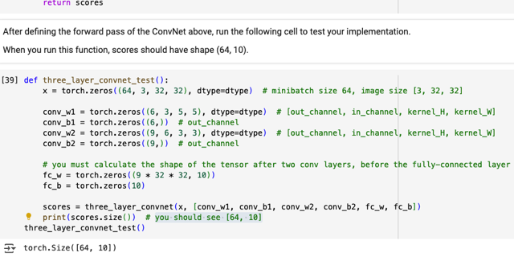</kbd>

> [!NOTE]
> you should see [64, 10]

 

<kbd>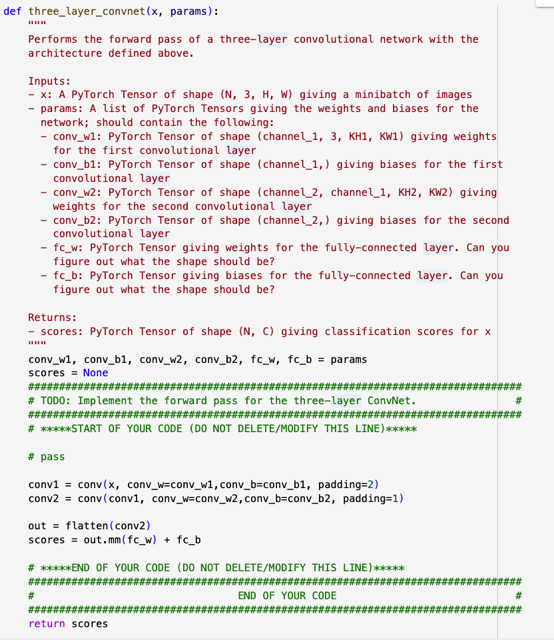</kbd>

<kbd></kbd>

<kbd>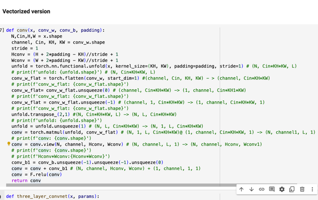</kbd>

 

<kbd>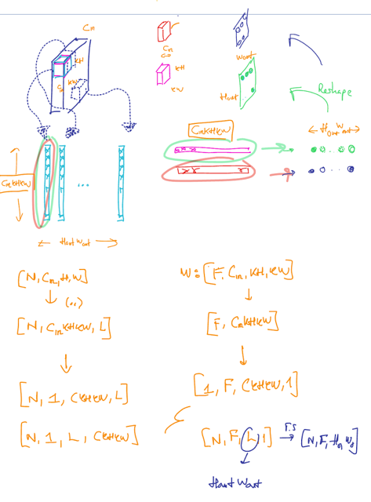</kbd>

 

<kbd>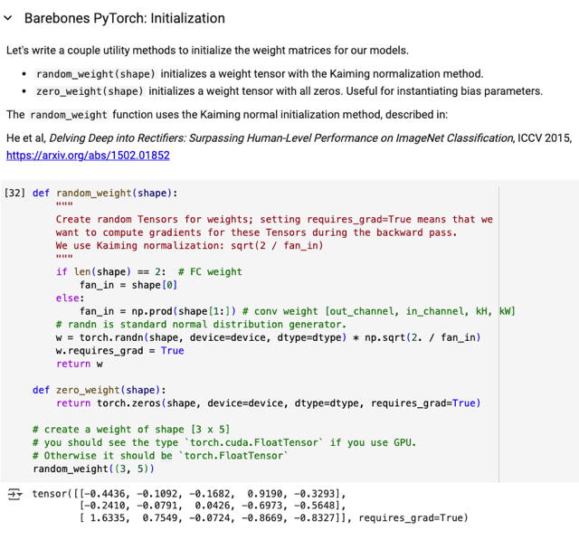</kbd>

> [!NOTE]
> Không có gì khó hiểu, ở đây người ta ko bắt làm nhưng gọi là cho thấy hai
> function giúp việc weight initialization (vẫn đang ở barebone, tức là cơ bản là
> ta làm from scratch, chỉ nhờ pytorch ở bước backward tính  gradient giùm
> thôi.
>
> Quay lại hai function này, thì weight sẽ được random initialized theo Kaiming
> initialization, random ini sau đó nhân cho sqrt(2/fan_in) cái này đã biết ở bài
> trước, lí do là mình dùng relu cho non linearity.
>
> Trong function này, tùy vào shape của weight tensor, là 2D (input_dim,
> hidden_dims) - nếu là weight của FC layer, hoặc 4D nếu là weight của Conv
> layer (F, Cin, filter height, filter width).
>
> Thành ra nếu shape là 2D thì fan in chính là item đầu, còn 4D thì nó là tích
> của Cin (số depth slice của input) * filter height * filter width: prod(shape[1:])
> shape[1:] = shape[1],shape[2], shape[3]]
>
> ===
>
> Một điểm chú ý là requires_grad = True

 

<kbd>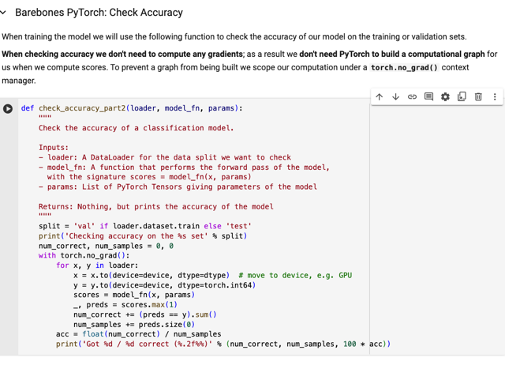</kbd>

> [!NOTE]
> đại ý đây là một "barebone" function giúp check accuracy của model, nhận
> vào loader (có thể là train loader để tính val accuracy hoặc test accuracy),
> model và param.
>
> Ở đây người ta chú ý rằng vì quá trình test, không cần backward nên ta sẽ "
> làm" trong khuôn khổ là **with torch.no_grad():**để cho pytorch biết là
> không cần build computational graph.
>
> Còn lại thì không có gì khó hiểu, **data loader sẽ lần lượt trả các sample
> batch**, ta sẽ "**đưa data sample vào**" CPU/ GPU tức là việc này sẽ kiểu
> như **đặt dữ liệu để tính toán ở CPU hay GPU**.
>
> Sau đó thì **bỏ vào model để lấy ra output** - scores.
>
> Mỗi sample là một vector 10 class scores, thì **scores** sẽ là **tensor có
> size là NxC** (số class x 10). Từ đây ta mới **lấy index ứng với giá trị lớn
> nhất của mỗi hàng để có được cái gọi là prediction / predicted class**.
>
> Do đó ở đây,**trong pytorch, ta dùng tensor.max(dim=1)** mang ý nghĩa là
> lấy max với dimension = 1. Nó sẽ trả ra giá trị max và index ứng với giá trị
> max. Đương nhiên là ta sẽ **chỉ quan tâm đến cái index thôi.** ( _, preds =
> scores. max(1))
>
> Rồi, cuối cùng là so với y và tính ra accuracy

 

<kbd>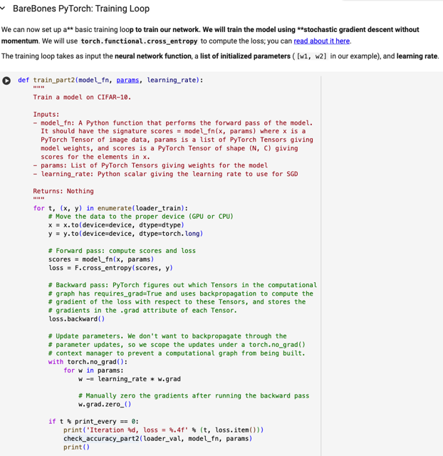</kbd>

> [!NOTE]
> ở đây ta sẽ xem một "barebone" simple function giúp train nn. nó nhận
> nn (model), params (đã initialized), learning rate.
>
> Cái này cũng đã học bên fastai với gs J.Howard, có điều bên đó gs
> chưa dùng conv, chỉ minh họa dùng fc layer thôi
>
> Cơ bản là lần lượt nhờ data loader, trả cho mình từng data batch x,y.
> Như ở trên, ta sẽ đưa nó vào CPU/GPU (.to(device) Sau đó forward
> vào model, để ra scores.
>
> Và đưa scores cùng với y (ground true label) vào F.cross_entropy luôn
> (mà không cần chuyển thành probability, lí do là người có nói, F.
> cross_entropy sẽ giúp tính probability (bằng softmax) ở trong đó.
>
> có loss, gọi .backward(), bước này như đã biết bên fastai, pytorch  sẽ
> tự backpropagation để tính gradient (derivative of loss with  respect to
> ) của cái tensor nào mà 'requires_grad = True'
>
> Sau đó chỉ việc interate qua các parameters, đặng update các Param
> bằng gradient của nó chứa trong field .grad, nhân với lr.
>
> Và cũng như đã biết từ DLYan, fastai đó là Pytorch nó mặc định là sẽ
> cộng dồn gradient, nên ta sẽ phải w.grad.zero_()
>
> Ở đây liên hệ lại đã học bên fastai, function nào có '_' ở cuối tức là nó
> sẽ apply vào chính cái tensor gọi nó thay vì trả ra một cái khác.
>
> Cuối cùng là cứ "lâu lâu" thì check accuracy và in ra

 

<kbd>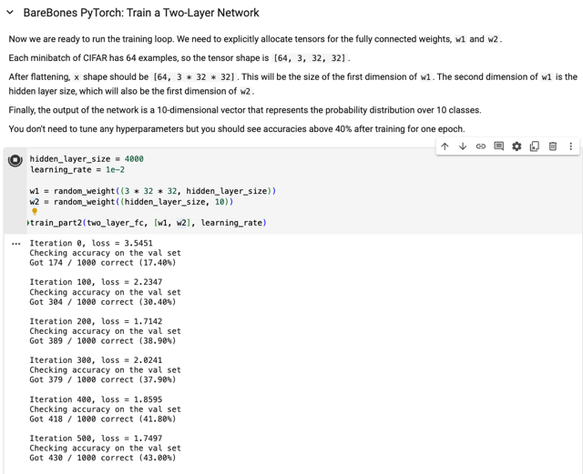</kbd>

> [!NOTE]
> rồi, ta đã có đủ đồ chơi để bắt đầu train.  Đầu tiên sẽ thử train
> 2-layer fc network. Define h.param hidden_size, learning rate, khởi
> tạo w1,w2, và bỏ model function vào train_part2.
>
> Chú ý là trong train_part2, ta gọi model function với input là  data
> batch và params, cái model ở đây làm việc như function, chứ ko phải
> một object.

 

<kbd>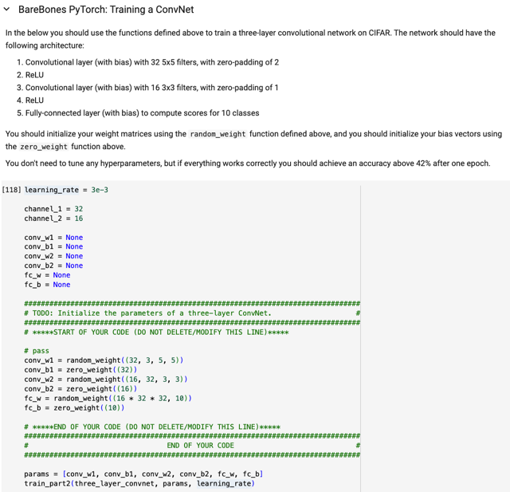</kbd>

 

<kbd>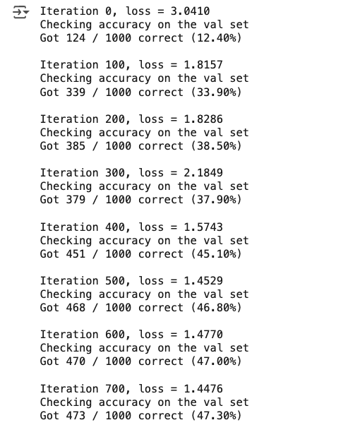</kbd>

> [!NOTE]
> if everything works correctly you
> should achieve an accuracy above
> 42% after one epoch.

 

<kbd>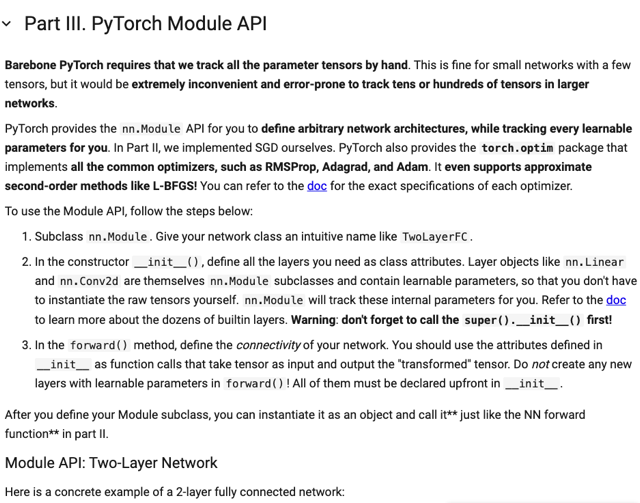</kbd>

> [!NOTE]
> đại ý là việc làm theo barebone pytorch nơi ta chỉ nhờ pytorch ở bước
> backward, còn lại ta phải tự theo dõi xem param nào là learnable cũng như
> phải tự làm các bước tính toán của forward prop là khá phiền nếu như phải
> làm với một neural network có kiến trúc phức tạp
>
> Do đó, ta sẽ sử dụng module api, bằng cách extend module class, trong function
> Init, ta sẽ define các loại built-in layer khác nhau như Fc, conv. 
>
> Và trong function forward, ta sẽ thực hiện việc connect chúng lại.
>
> Ở đây họ lưu ý là trong function ini nhớ gọi super()._ini_() cũng như trong forward
> đừng có khởi tạo layer.

 

<kbd>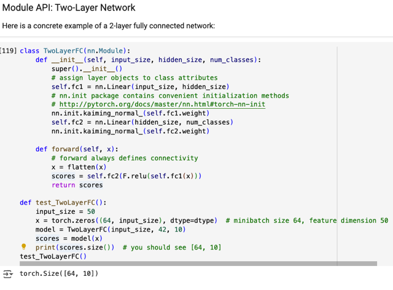</kbd>

> [!NOTE]
> rất dễ hiểu, ở đây họ define subclass của nn.Module, trong _ini_sau khi gọi
> super._ini_(), define hai fully connected layer - dùng nn.Linear(input_dim,
> hidden_dim)
>
> Hay ho hơn Pytorch nn.init. có các api giúp cho việc weight initialization. Có
> thể thấy ở đây nn.init.kaiming_normal() với input là weight của fc layer giúp
> khởi tạo giá trị của chúng theo kaiming (random, *sqrt(2/fan_in))
>
> Trong forward, lần lượt forward input qua các layer theo kiểu function để cuối
> cùng ra scores

 

<kbd>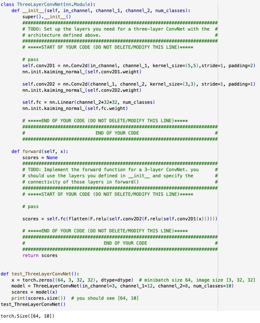</kbd>

<kbd></kbd>

<kbd>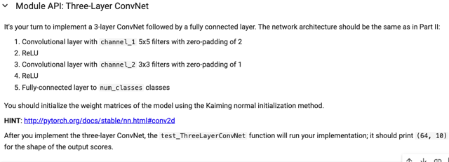</kbd>

> [!NOTE]
> Dễ ko có gì đáng nói, chỉ có một điểm đáng chú ý đó là khi ini
> cho fc layer cuối, phải dùng kaiming: Nhớ rằng vấn đề là do
> **layer trước xài nên layer này phải dùng kaiming. Chứ đừng
> nhầm lẫn là layer đó xài relu nên nó phải dùng kaiming. Ko
> phải, mà là do relu ở layer trước khi layer sau phải dùng
> kaiming**

 

<kbd>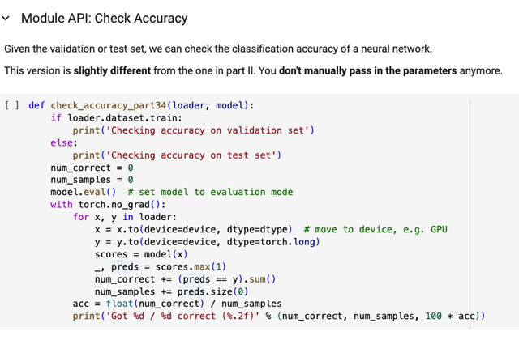</kbd>

> [!NOTE]
> Function check accuracy ở đây cơ bản là giống hồi nãy chỉ
> khác là không (manually) pass params vô nữa

 

<kbd>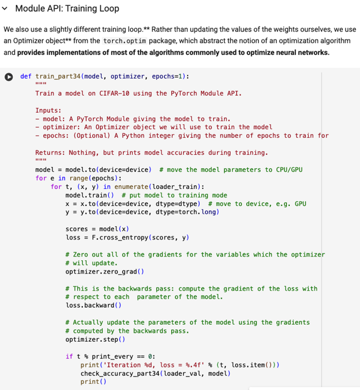</kbd>

> [!NOTE]
> Training fuction cơ bản là y như hồi nãy, chỉ khác ở chỗ, có thêm
> iterate no. epochs. Và thay vì "tự" update param bằng gradient
> như hồi nãy, thì nay nhờ optimizer làm chuyện đó.
>
> Sau khi loss.backward() chỉ việc gọi step() với optimizer thì nó 
> sẽ tự động thực hiện giùm mình các bước update params
> dựa trên gradient mà còn theo các strategy xịn xò như Adam...
>
> Trước đó nhớ optimizer.zero_grad() 
>
> Chú ý là ở đây khi gọi function này thì ta đưa optimizer đã khởi
> tạo với model.parameters ròi, nên optimizer nó đã biết các param
> nào cần update của model.

 

<kbd>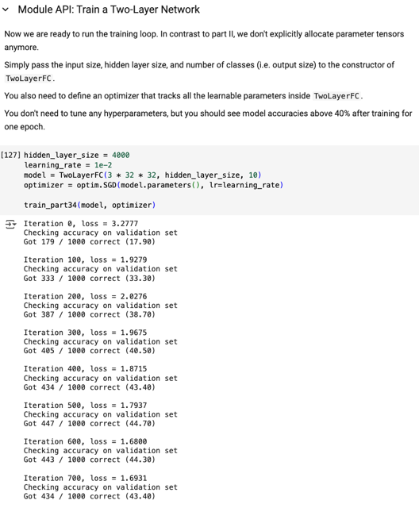</kbd>

> [!NOTE]
> khởi tạo optimizer với model.parameters(), learning rate.
> các h. params. Kết quả training 2layerfc net, sau 1 epoch
> đạt 43% val accuracy

 

<kbd>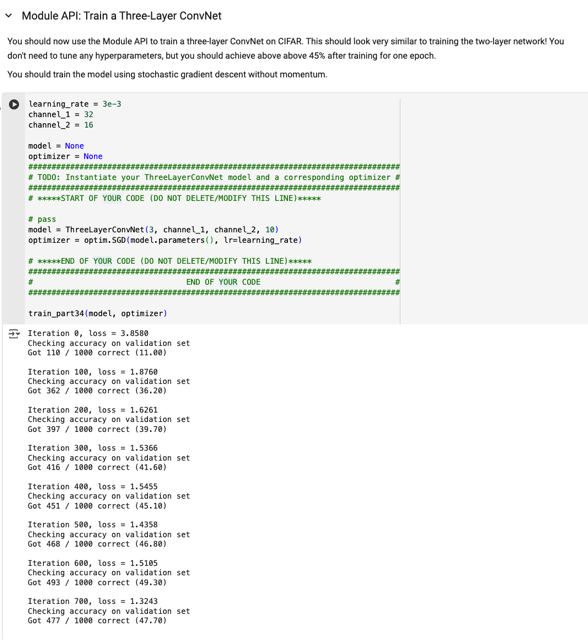</kbd>

> [!NOTE]
> but you should achieve above above 45%
> after training for one epoch.

 

<kbd>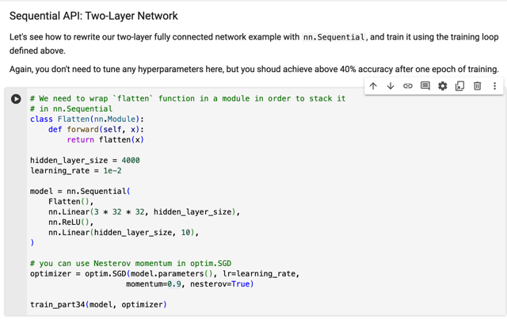</kbd>

 

## còn một phần là

> [!NOTE]
> còn một phần là
> hyperparameter tuning.
> Quay lại sau

> [!NOTE]
> quay lại sau

 

