# Assignment 2 - Batch Normalization

📊 **Progress:** `19` Notes | `48` Screenshots

---

<kbd>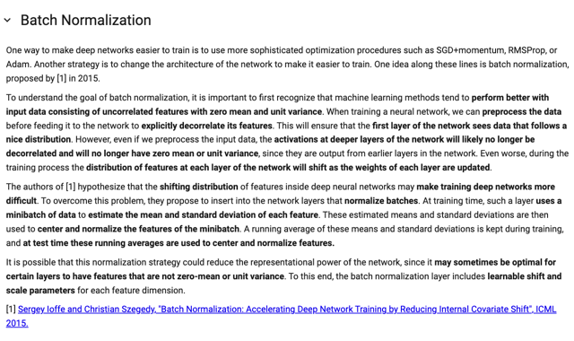</kbd>

> [!NOTE]
> Rất rõ, như đã biết ở trong lecture, ở phần weight initialization cho ta thấy
> rằng neural net sẽ p**erform tốt khi input được preprocess sao cho có dạng
> chuẩn** (Gaussian distribution unit variance, zero mean). Thế thì việc đó chỉ
> giúp**layer đầu tiên hưởng lợi,** còn sau đó**các layer sau khi take input từ
> activation của các layer trước thì không còn tính chất này.**
>
> Vấn đề thứ hai là trong quá trình training, param được update khiến
> **distribution của các activation** thay đổi liên tục (**covariate shift**), điều này
> gây **khó khăn cho training.**
> **Batch normalization** sẽ tính (ước lượng) **running** mean và variance của
> một batch các output từ layer và dùng nó để normalize (zero center và unit
> variance). Và trong quá trình training nó sẽ cập nhật, **giữ cái running mean và
> standard dev** này, để mà**normalize cho lúc testing.**
>
> Ngoài ra, vì chưa chắc lúc nào unit variance zero mean distribution cũng là tốt
> nhất cho nên BatchNorm có**learnable shift và scale param**  để nếu cần, nn
> có thể thay đổi, học ra, tự quyết định distribution (với mean nào, variance nào
> là tốt nhất

 

<kbd>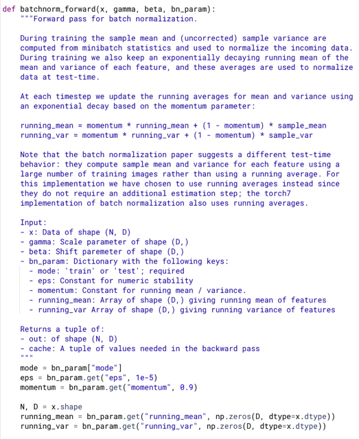</kbd>

 

<kbd>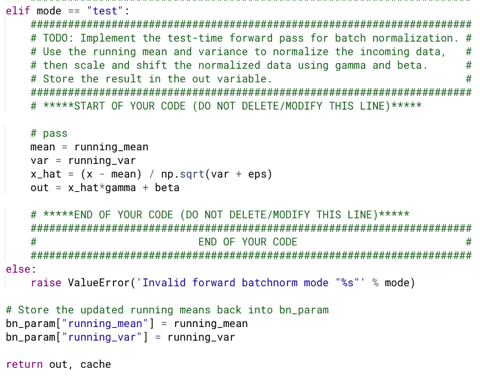</kbd>

<kbd></kbd>

<kbd>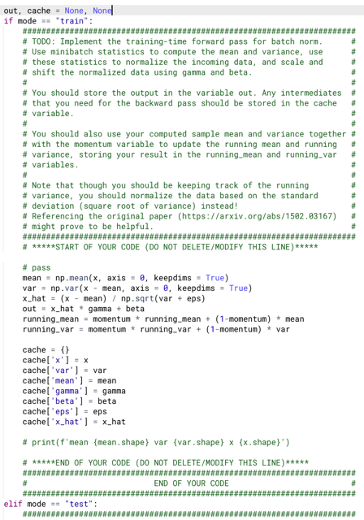</kbd>

> [!NOTE]
> việc dùng keepdims True giúp sau khi mean và var vẫn
> có dạng matrix. Với batch norm, ta mean và variance
> theo từng cột (feature column) nên từ x có shape (N,D)
> sẽ được (1,D)
>
> x_hat  = x - mean = (N,D) - (1,D) python sẽ broadcast
> mean thành N hàng, để phép tính trở thành (N,D) - (N,D)
> tương tự, (x - mean) / sqrt(var) là (N,D) / (1,D) python sẽ
> broadcast sqrt(var) từ (1,D) thành (N,D) để có phép chia
> element-wise (N,D) / (N,D)
>
> Thật ra nếu không keepdims thì kết quả của mean và var
> sẽ là 1d array (D,) python vẫn tự thêm 1 dimension vào
> trước để thành (1,D) sau đó broadcasting như trên. Tuy
> nhiên việc keepdims sẽ giúp tránh những rắc rối ví dụ
> như khi làm qua  LayerNorm, hoàn toàn tương tự
> BatchNorm, chỉ khác ở chỗ ta sẽ dùng statistic theo hàng
> thay vì cột. Lúc này mean và var nếu không keepdims
> True sẽ có shape là (N,). Lúc này khi thực hiện operation
> x - mean = (N,D) - (N,) thì nó sẽ báo lỗi. Vì khi đó python
> thêm một dimension vào trước để chuyển  (N,) sang (1,
> N) và (1,N) thì không thể broadcast thành (N,D) được.
> Nhưng nếu có keepdims, kết quả sẽ ra (N, 1). Lúc này
> broadcasting sẽ có thể biến (N,1) thành (N,D)

 

<kbd>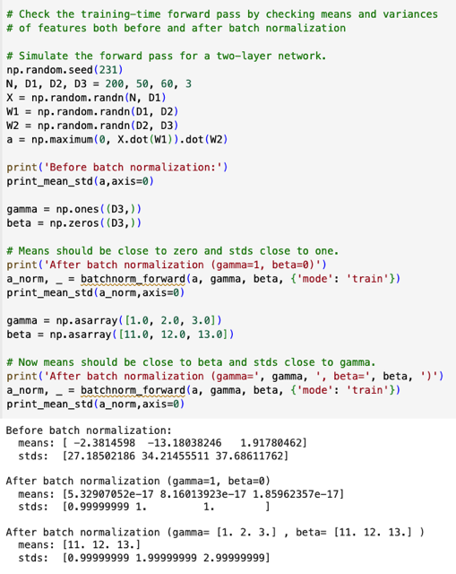</kbd>

> [!NOTE]
> Passed!

 

<kbd>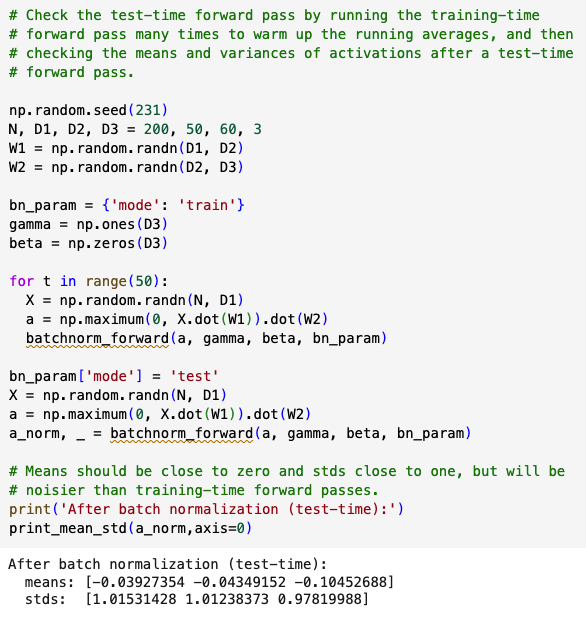</kbd>

 

<kbd>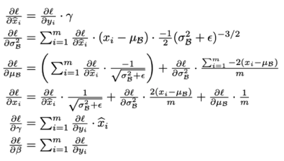</kbd>

<kbd>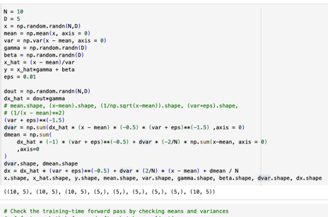</kbd>

<kbd>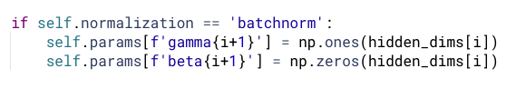</kbd>

<kbd></kbd>

<kbd></kbd>

<kbd></kbd>

<kbd>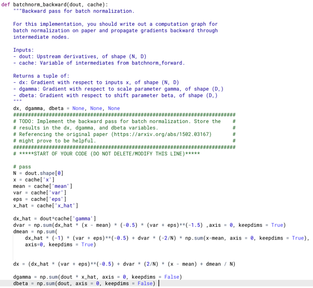</kbd>

> [!NOTE]
> Theo công thức mà áp vô thôi, dout chính là dl/dyi. Tuy
> công thức là dx_hat(i) nhưng với dx_hat (mini batch thì
> cũng vậy) (thử check các shape trước)

> [!NOTE]
> Lưu ý ở đây, nếu dgamma tính toán ở đây mà có keepdims true thì nó sẽ
> có dạng matrix shape (1,D) Nên lúc khởi tạo BN weight matrix gamma ở
> fc_net _ini_ cũng phải có shape (1,D) tức là dùng np.ones((1,D)) chứ
> không phải chỉ là np.ones(D)
>
> Ngược lại như hiện tại, khởi tạo với np.ones(D) thì không cần keepdims
> True

 

<kbd>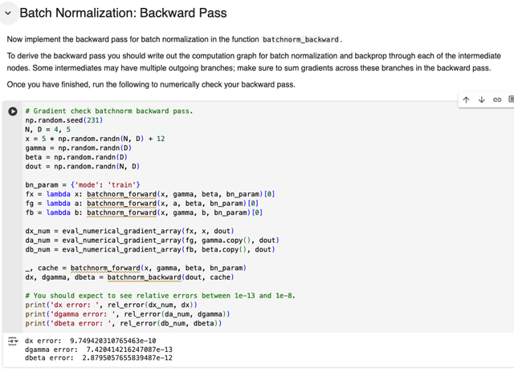</kbd>

> [!NOTE]
> Passed! các error đều
> cỡ 1e-8 - 1e-13

 

<kbd>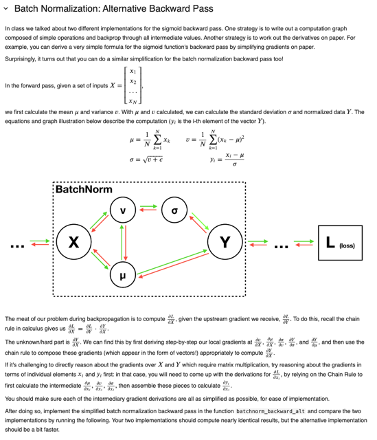</kbd>

> [!NOTE]
> phần này quay lại sau: đại ý là yêu cầu làm
> (backnorm backward) theo một cách khác

 

<kbd>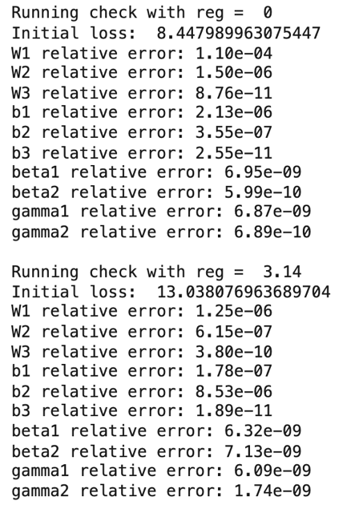</kbd>

<kbd></kbd>

<kbd>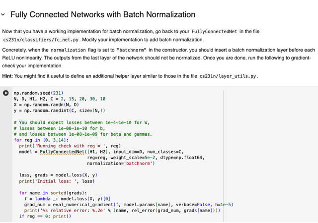</kbd>

> [!NOTE]
> # You should expect losses between 1e-4~1e-10 for W,
> # losses between 1e-08~1e-10 for b,
> # and losses between 1e-08~1e-09 for beta and gammas.

 

<kbd>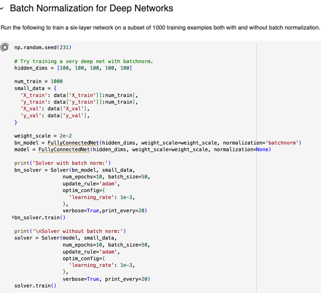</kbd>

> [!NOTE]
> train 5 hidden layer (6
> layer) network

 

<kbd>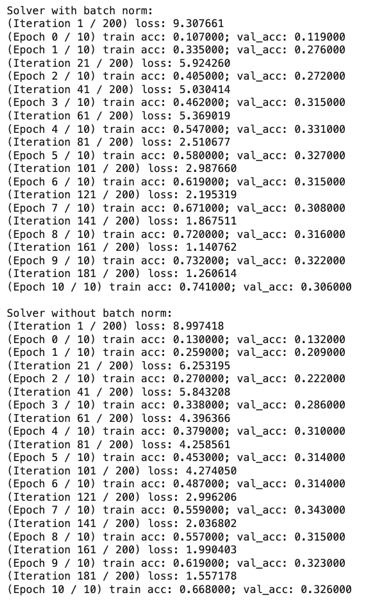</kbd>

> [!NOTE]
> kết quả có thể thấy có BN model converge
> tốt hơn khi train acc đạt 74.1% so với 66.
> 8% khi không có BN

 

<kbd>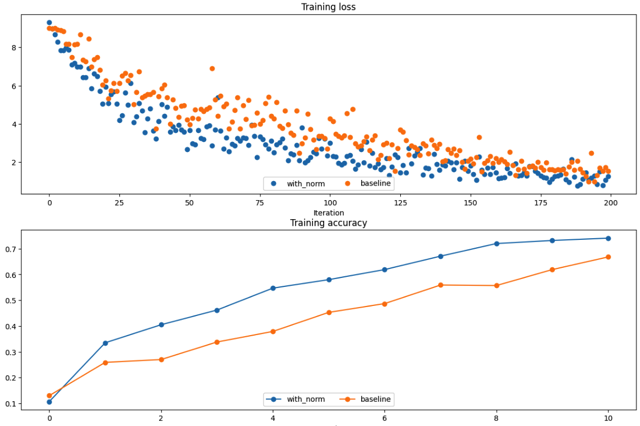</kbd>

<kbd>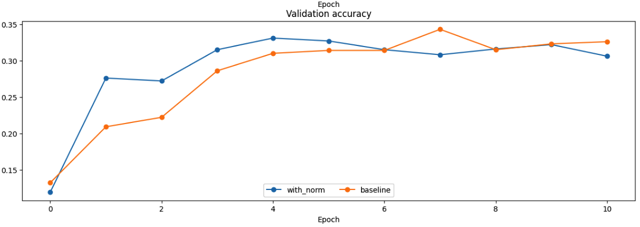</kbd>

<kbd></kbd>

<kbd></kbd>

<kbd>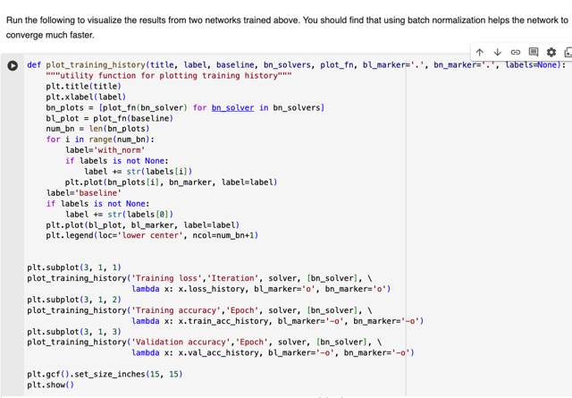</kbd>

> [!NOTE]
> đồ thị cho thấy BN converge tốt hơn, cụ thể là nhanh hơn và về loss thấp hơn

 

<kbd>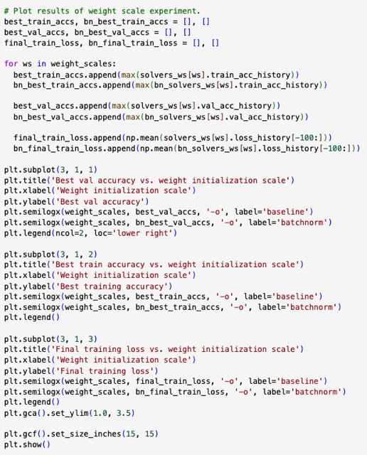</kbd>

<kbd></kbd>

<kbd>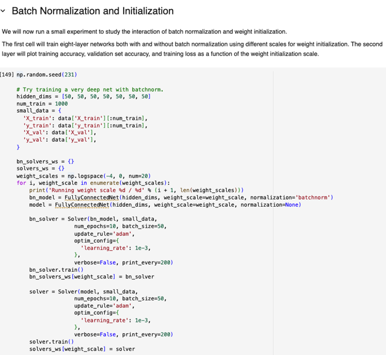</kbd>

 

<kbd>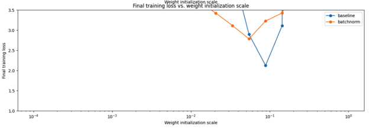</kbd>

<kbd>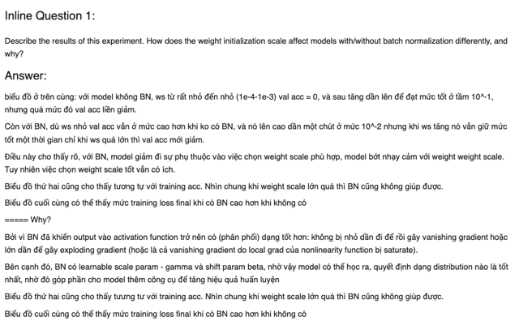</kbd>

<kbd></kbd>

<kbd></kbd>

<kbd>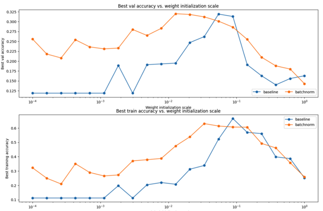</kbd>

> [!NOTE]
> biểu đồ ở trên cùng: với model không BN, ws từ rất nhỏ đến nhỏ
> (1e-4-1e-3) val acc = 0, và sau tăng dần lên để đạt mức tốt ở tầm 10^-1,
> nhưng quá mức đó val acc liền giảm.
>
> Còn với BN, dù ws nhỏ val acc vẫn ở mức cao hơn khi ko có BN, và nó lên
> cao  dần một chút ở mức 10^-2 nhưng khi ws tăng nó vẫn giữ mức tốt một
> thời gian chỉ khi ws quá lớn thì val acc mới giảm.
>
> Điều này cho thấy rõ, với BN, **model giảm đi sự phụ thuộc vào việc chọn
> weight scale phù hợp, model bớt nhạy cảm với weight weight scale**. Tuy
> nhiên việc chọn weight scale tốt vẫn có ích.
>
> Biểu đồ thứ hai cũng cho thấy tương tự với training acc. Nhìn chung khi
> weight scale lớn quá thì BN cũng không giúp được.
>
> Biểu đồ cuối cùng có thể thấy mức training loss final khi có BN cao hơn khi
> không có
>
> ===== Why?
>
> Bởi vì BN đã **khiến output vào activation function trở nên có (phân phối)
> dạng  tốt hơn**: **không bị nhỏ dần đi để rồi gây vanishing gradient** hoặc
> **lớn dần để gây exploding gradient** (hoặc là cả vanishing gradient do local
> grad của nonlinearity function bị saturate).
>
> Bên cạnh đó, BN có **learnable scale param - gamma và shift param beta**,
> nhờ vậy**model có thể học ra, quyết định dạng distribution nào là tốt nhất**,
> nhờ đó góp phần cho model **thêm công cụ để tăng hiệu quả huấn luyện**

 

<kbd>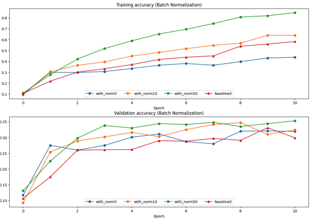</kbd>

<kbd>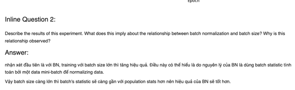</kbd>

<kbd></kbd>

<kbd></kbd>

<kbd>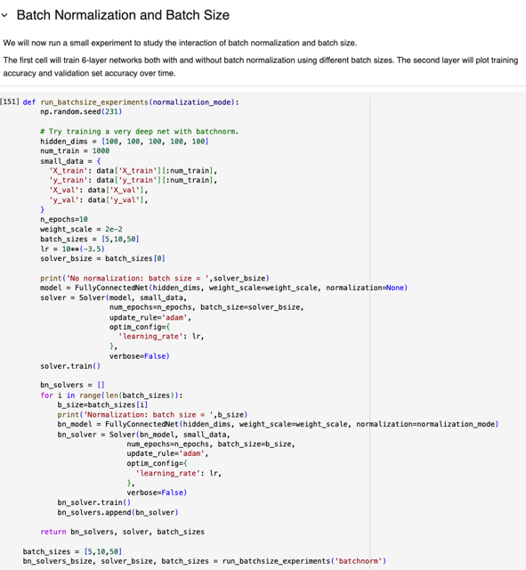</kbd>

> [!NOTE]
> nhận xét đầu tiên là với BN, training với batch size lớn thì tăng hiệu quả.
> Điều này có thể hiểu là do nguyên lý của BN là dùng **batch statistic tính
> toán bởi một data mini-batch để normalizing data.**
>
> Vậy **batch size càng lớn thì batch's statistic sẽ càng gần với population
> stats** hơn nên hiệu quả của BN sẽ tốt hơn.

 

<kbd></kbd>

 

<kbd>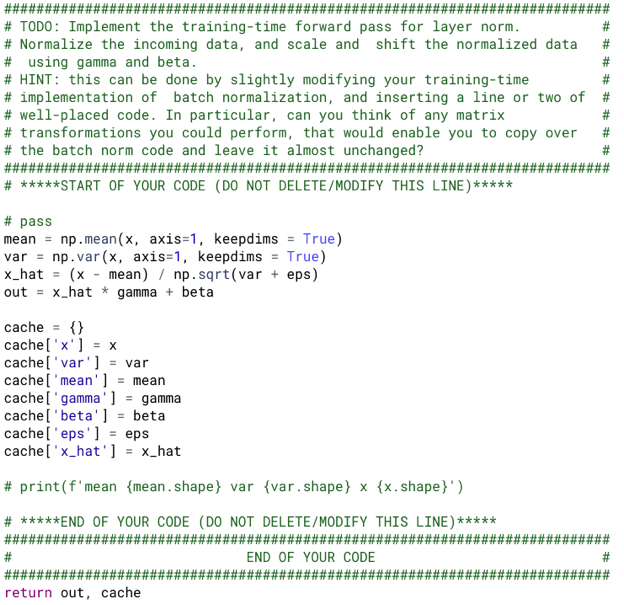</kbd>

<kbd></kbd>

<kbd>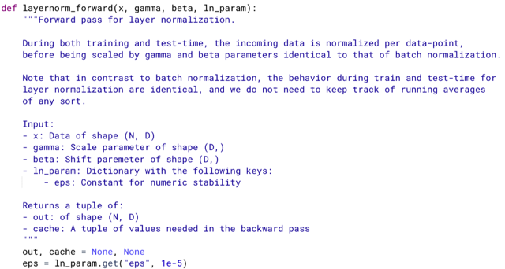</kbd>

> [!NOTE]
> Theo mô tả, Layer Normalization chỉ khác Batch Normalization ở chỗ nó sẽ
> **không cần tính statistic của một batch** (vì đây cũng là lí do mà người ta tạo
> ra Layer Normalization vì **muốn không cần phụ thuộc vào / phải dùng statistic
> của mini-batch mới làm được**)
>
> Thay vào đó, Layer Norm dùng mean và variance của một single feature
> vector, để normalizing feature vector. Vậy ta có thể hiểu ví dụ input vào
> LayerNorm là một batch N cái feature vector, mỗi vector là output từ layer
> trước, ứng với một sample. Thì ta sẽ **cần tính mean và variance của vector
> này**. Vậy nếu batch of Input có shape N,D thì **thay vì mean với axis = 0 để có
> mean của các column = các feature trong batch, ở đây ta sẽ mean (và var)
> với axis = 1 để có mean của mỗi hàng.**
>
> Dùng keepdims True để shape của mean và var là (N,1) giúp khi tính x -mean
> có thể broadcast được thành (N,D). Nếu không kết quả của mean là (N,) sẽ
> không broadcast được (N,) -python sẽ chèn thêm một dimension ở trước -->
> (1,N)   -> không thể thành (N, D) được

 

<kbd>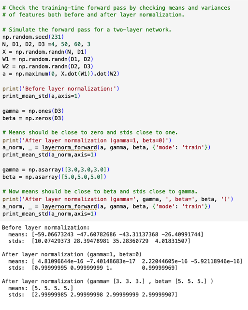</kbd>

> [!NOTE]
> Passed!

 

<kbd>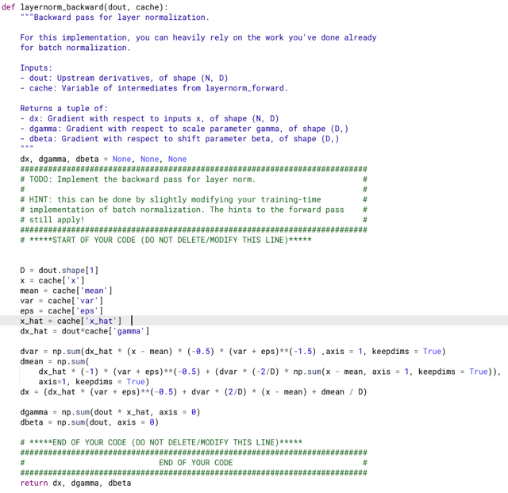</kbd>

> [!NOTE]
> Backward cũng chỉ cần thay đổi axis từ 0 sang 1

 

<kbd>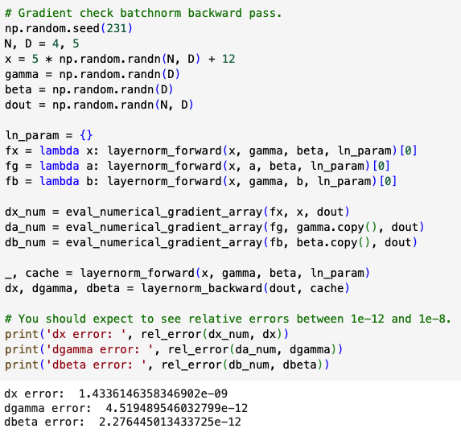</kbd>

> [!NOTE]
> should expect to see relative errors between
> 1e-12 and 1e-8: Passed

 

<kbd>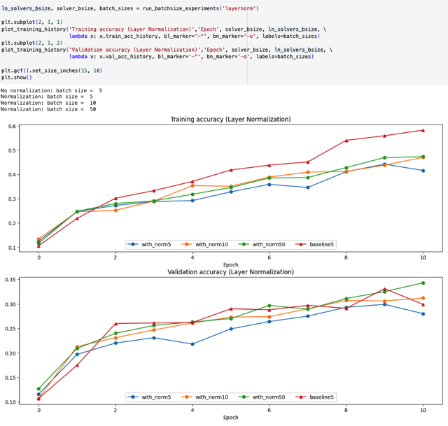</kbd>

> [!NOTE]
> Quay laị chỗ này sau, qua làm Dropout luôn

 

<kbd>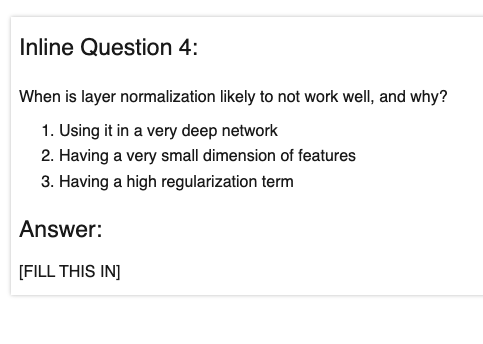</kbd>

> [!NOTE]
> quay lại sau

 

