# Assignment 2 - Dropout

📊 **Progress:** `7` Notes | `18` Screenshots

---

<kbd>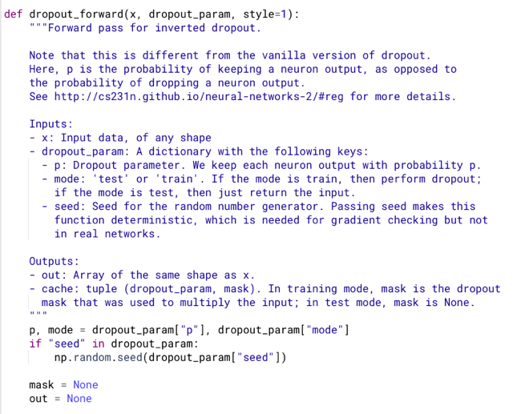</kbd>

 

<kbd>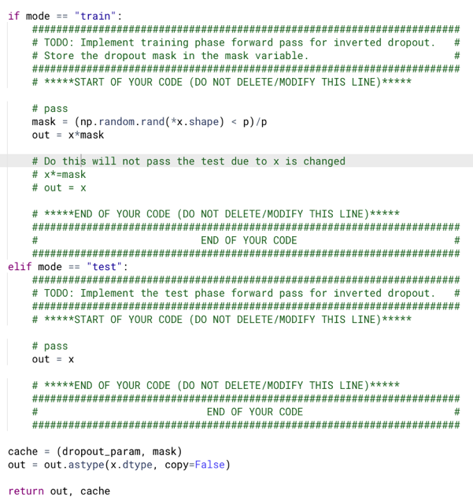</kbd>

> [!NOTE]
> Dropout module thực ra rất đơn giản
>
> chú ý là nếu làm theo kiểu `x*=` mask, out `=` x thì
> sẽ không pass test do x đã bị thay đổi.

 

<kbd>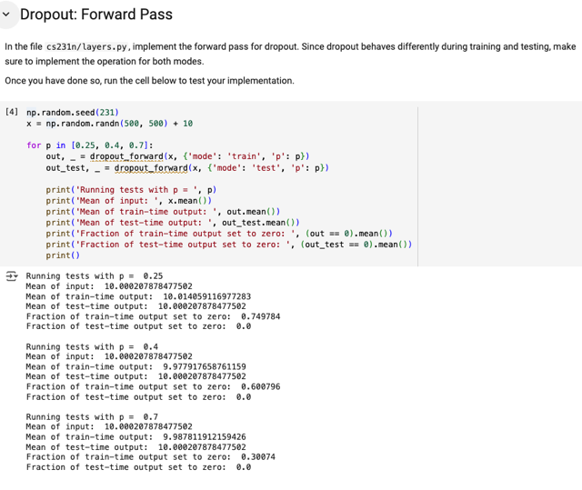</kbd>

 

<kbd>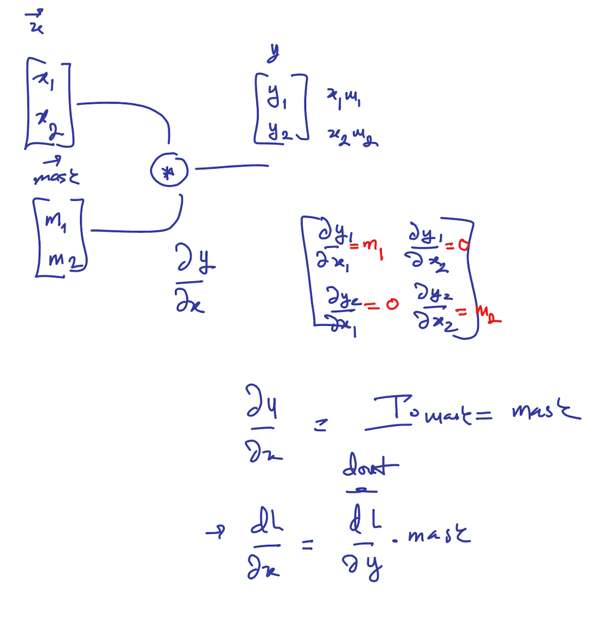</kbd>

<kbd></kbd>

<kbd>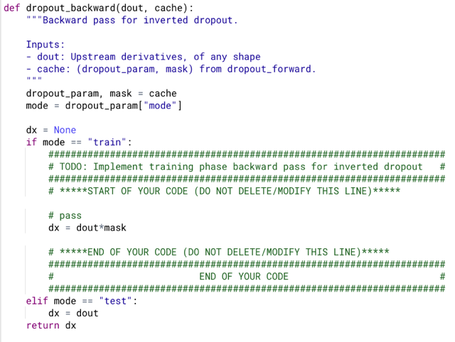</kbd>

 

<kbd>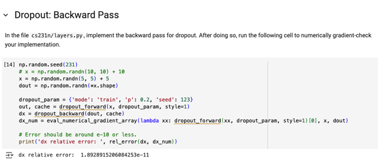</kbd>

> [!NOTE]
> Error should be around
> `e-10` or less: Passed

> [!NOTE]
> câu hỏi là nếu ko chia cho p thì sao?

 

<kbd>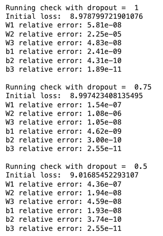</kbd>

<kbd></kbd>

<kbd>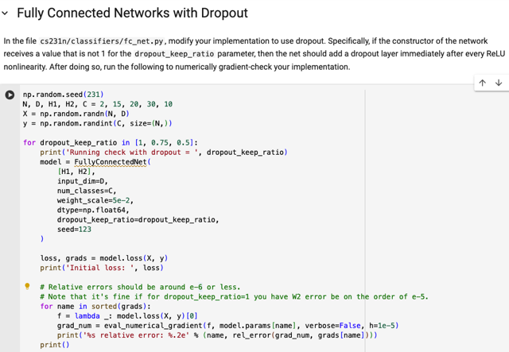</kbd>

> [!NOTE]
> Relative errors should be around `e-6` or less.
> Note that it's fine if for `dropout_keep_ratio=1`
> you have W2 error be on the order of `e-5.`

 

<kbd>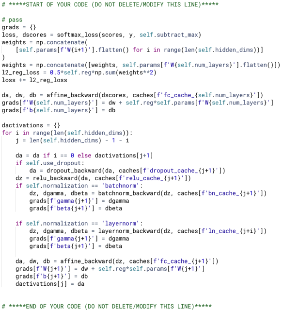</kbd>

<kbd></kbd>

<kbd>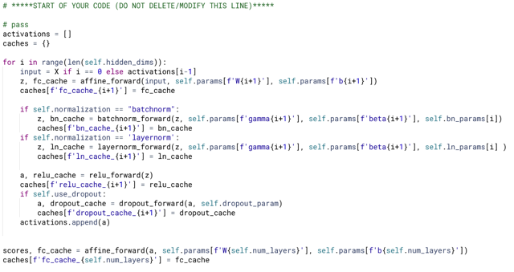</kbd>

> [!NOTE]
> Nếu có dropout thì
> apply nó trước relu,

 

<kbd>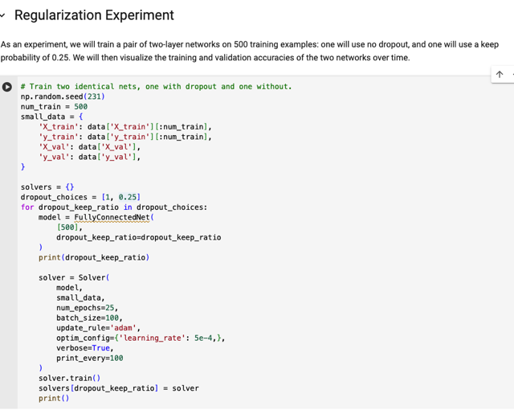</kbd>

 

<kbd>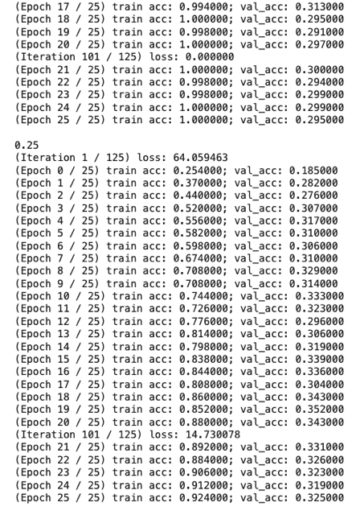</kbd>

> [!NOTE]
> Có thể thấy rõ với dropout giúp giảm overfit
> nên val acc tốt hơn (đương nhiên là train acc
> kém hơn)

 

<kbd>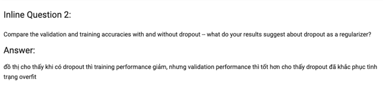</kbd>

<kbd></kbd>

<kbd>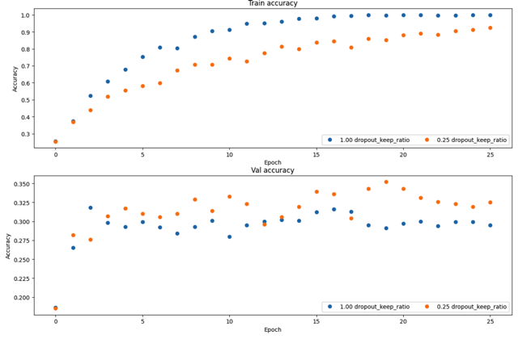</kbd>

> [!NOTE]
> đồ thì cho thấy khi có dropout thì training performance giảm,
> nhưng validation performance thì tốt hơn cho thấy dropout đã
> khắc phục tình trạng overfit

 

