# Assignment 2 - Fully Connected Nn

📊 **Progress:** `40` Notes | `93` Screenshots

---

<kbd>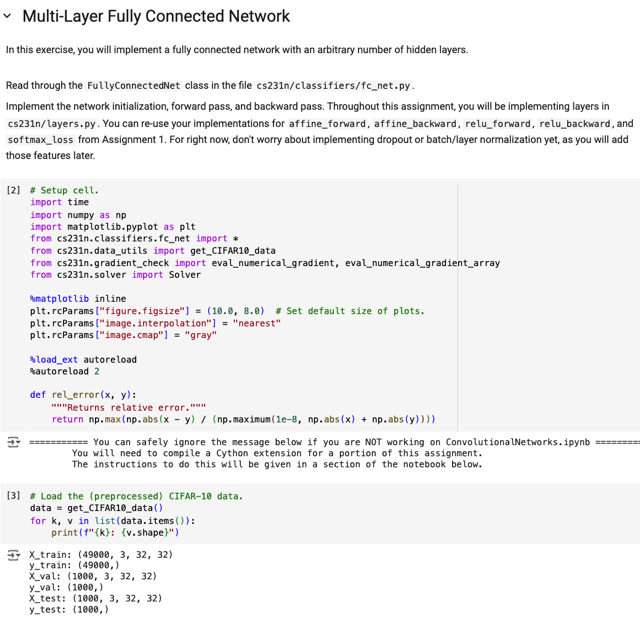</kbd>

 

<kbd>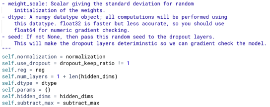</kbd>

<kbd></kbd>

<kbd>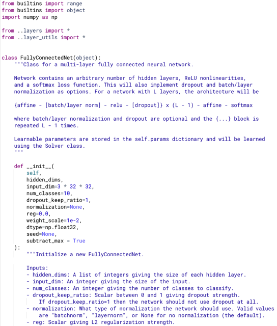</kbd>

> [!NOTE]
> cái  subtrac_max là tự thêm để thử nghiệm
> hiệu quả của việc có hay không trừ max
> trong hàm softmax

 

<kbd>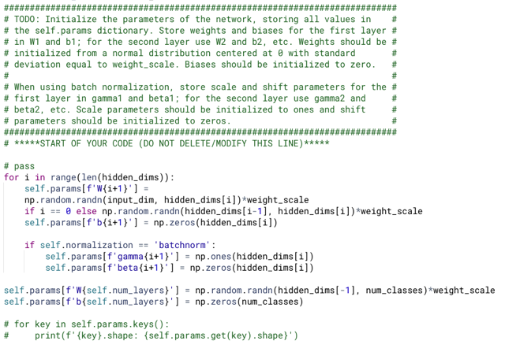</kbd>

> [!NOTE]
> Có một chú ý quan trọng để sau này đừng sai: hidden_dims
> sẽ quy định size (còn gọi width, số unit) của hidden layer,
> đương nhiên là quy định luôn số hidden layer. Nhưng phải
> có một layer output nữa.
>
> Vậy, dựa vào input size và hidden_dims ta sẽ init các W,b của 
> hidden layer, sau đó init một W,b của output layer với số output
> là num_classes.
>
> Phần này chưa cần làm BatchNorm nên ko note về nó ở đây

 

<kbd>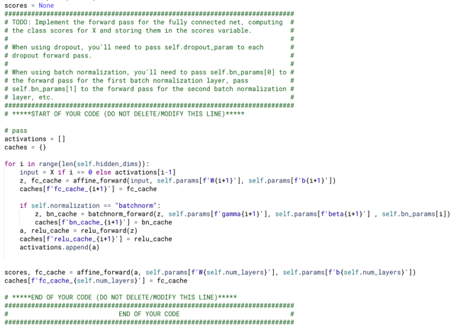</kbd>

<kbd></kbd>

<kbd>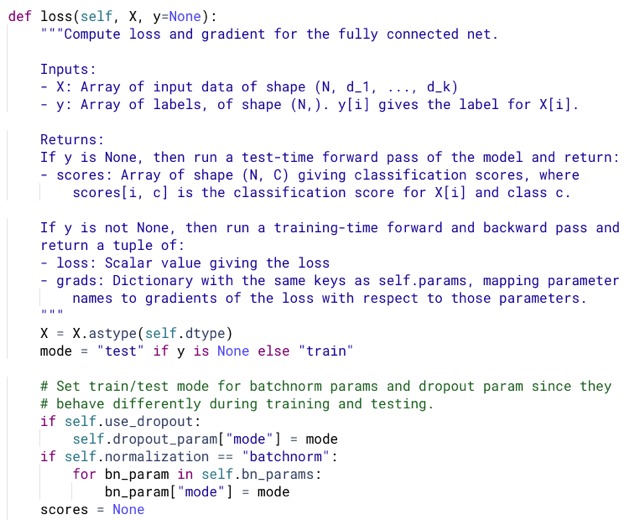</kbd>

> [!NOTE]
> Nếu là layer đầu thì input là X, còn sau đó input là output của layer
> trước.
>
> với mỗi hidden layer đều có qua hàm relu, layer cuối thì không 
>
> output của layer cuối chính là scores.
>
> ở đây chưa cần làm BN nên ko nói về BN ở đây

 

<kbd>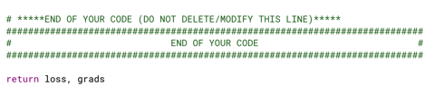</kbd>

<kbd></kbd>

<kbd>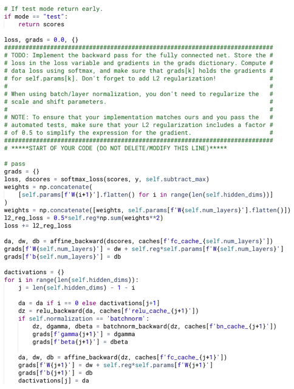</kbd>

> [!NOTE]
> backprop thì nếu là layer cuối thì không backprop qua relu,
> còn lại thì có backprop qua relu

 

<kbd>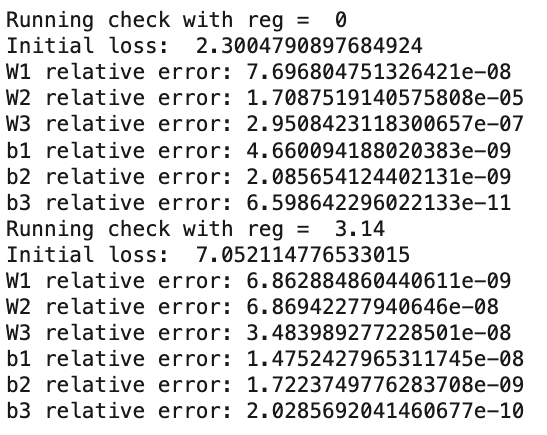</kbd>

<kbd></kbd>

<kbd>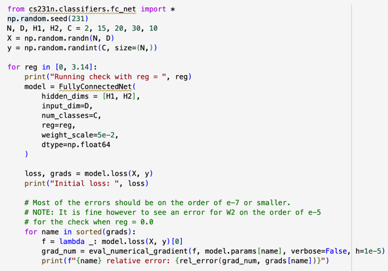</kbd>

> [!NOTE]
> kết quả cho thấy các  Ini loss (softmax) 10 class là
> -log(10) = 2.3 là ok
>
> relative error đều < e^-7 và đúng là W2 error 1e-5

 

<kbd>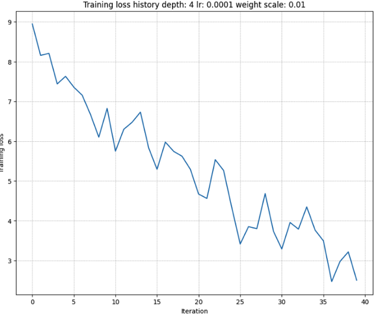</kbd>

<kbd>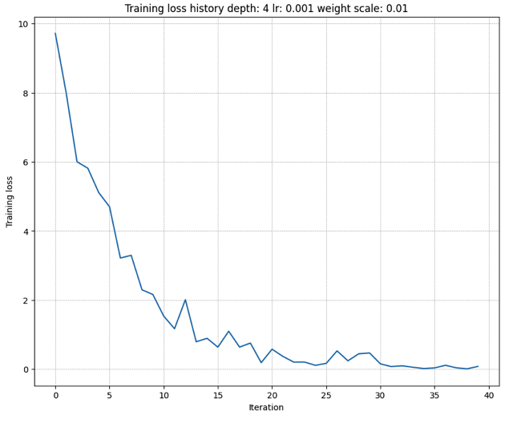</kbd>

<kbd></kbd>

<kbd></kbd>

<kbd>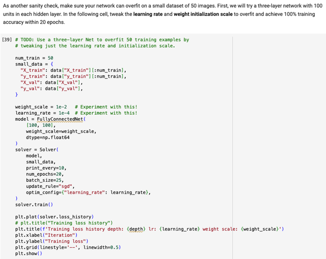</kbd>

> [!NOTE]
> tiếp theo họ kêu mình tuning lr, và weight scale sao cho
> training acc đạt 1. Ta sẽ viết một grid search để tìm. Thì
> kết qủa là lr 0.001 thì model đạt 100% training acc

 

<kbd>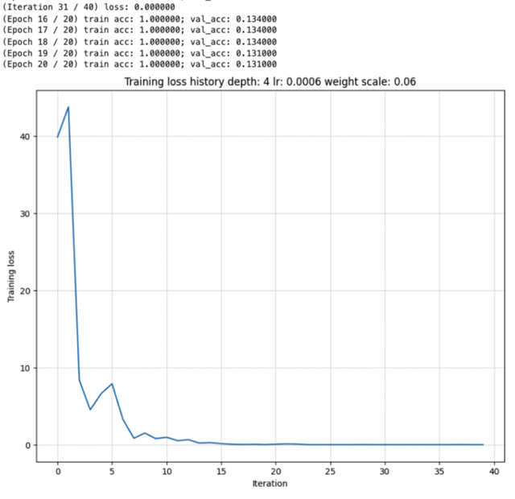</kbd>

<kbd></kbd>

<kbd>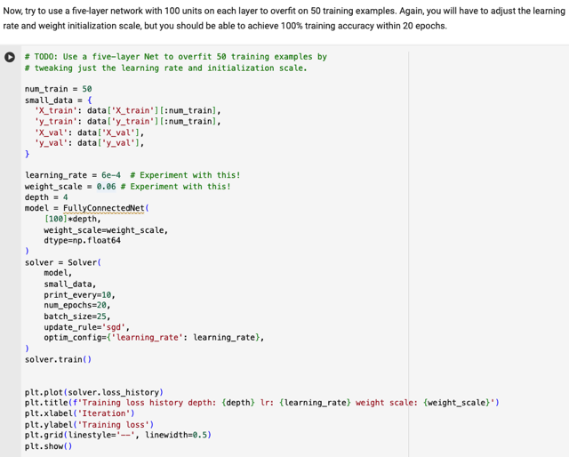</kbd>

 

<kbd>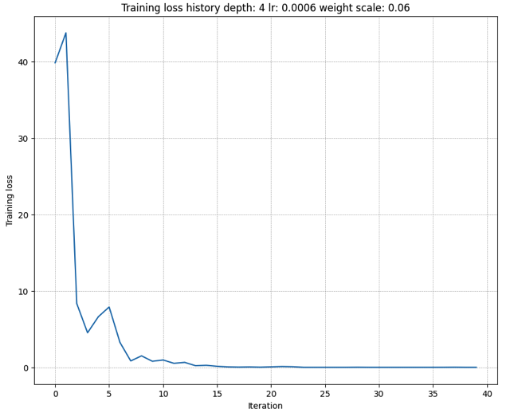</kbd>

<kbd></kbd>

<kbd>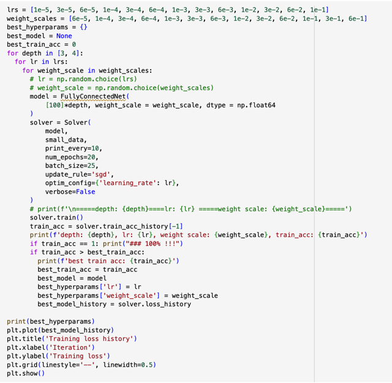</kbd>

> [!NOTE]
> Sau đó làm vậy với 4 hidden layers và câu hỏi đặt ra là
> thấy cái nào nhạy cảm với weight scale hơn

 

<kbd>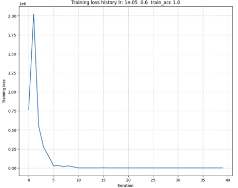</kbd>

<kbd>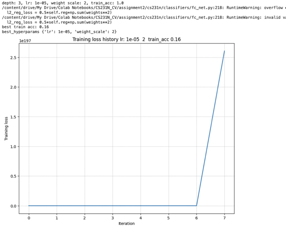</kbd>

<kbd>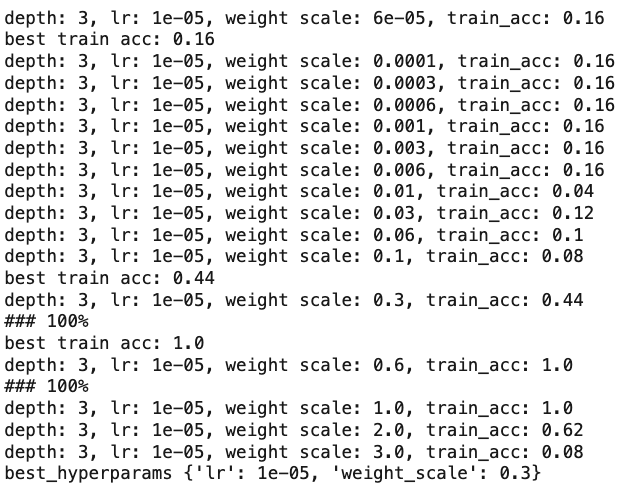</kbd>

<kbd>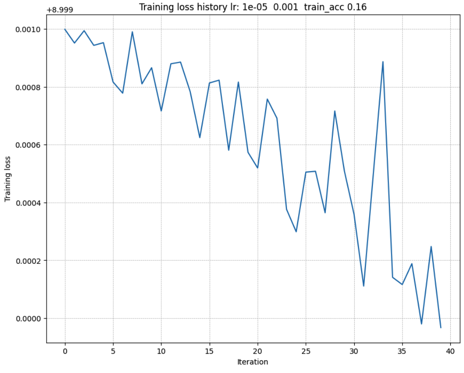</kbd>

<kbd></kbd>

<kbd></kbd>

<kbd></kbd>

<kbd></kbd>

<kbd>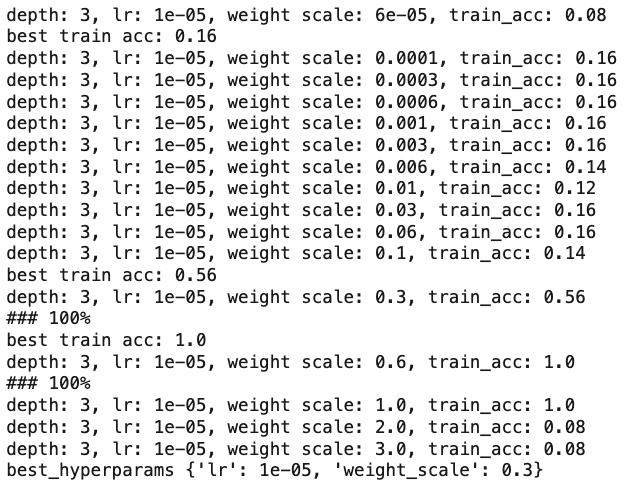</kbd>

> [!NOTE]
> Vậy trước khi trả lời câu hỏi thì nhìn vào qúa trình thử với các depth, lr,
> weight Scale khác nhau có những nhận định sau:
>
> Nhận xét: khi **3 hidden layers** (4 layer),**lr = 1e-5**, nhận thấy **khi
> weight scale ngày càng lớn thì train acc ngày càng tốt.**
>
> Điều này có thể giải thích là vì khi **weight scale** quá nhỏ,  gây hiện
> tượng **gradient vanishing**, dẫn đến quá trình **training diễn ra rất
> chậm**, vì gradient quá nhỏ, nên sau 20 epoch model học rất ít ->
> underfit. Khi tăng scale lên, dần dần khắc phục hiện tượng này, nên ở
> mức phù hợp model đạt train_acc 100% sau 20 epochs.

> [!NOTE]
> subtract_max = True, ws tăng dần thì acc tốt dần n**hưng quá 1 thì xảy
> ra hiện tượng exploding gradient.**

> [!NOTE]
> thử subtract_max = False để xem nó có cho thấy việc trừ max có tác
> dụng gì hay không thì ở đây chưa thấy khác biệt, ở đây cũng exploding
> khi wc ở mức > 1

> [!NOTE]
> biểu đồ loss cho thấy diverge do exploding gradient

> [!NOTE]
> ws phù hợp trong trường hợp này là 0. 3-1

> [!NOTE]
> ws nhỏ quá gây vanishing gradient, khiến model learn
> chậm,

 

<kbd>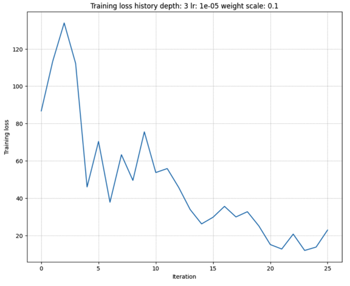</kbd>

<kbd>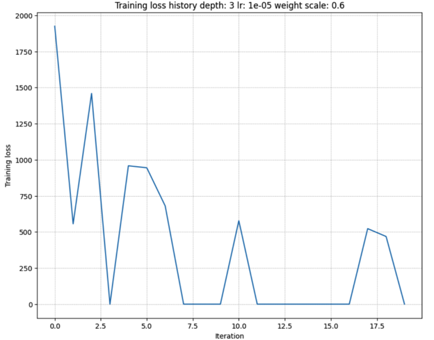</kbd>

<kbd>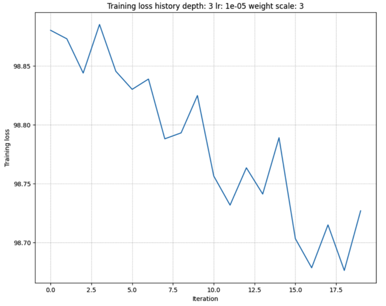</kbd>

<kbd>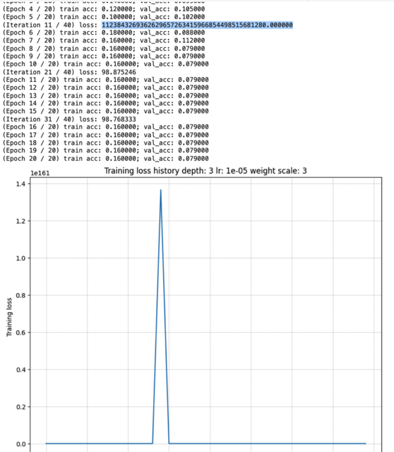</kbd>

<kbd>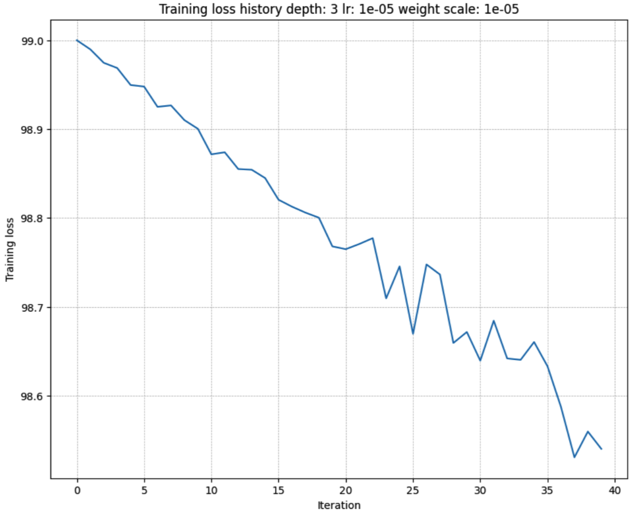</kbd>

<kbd></kbd>

<kbd></kbd>

<kbd></kbd>

<kbd></kbd>

<kbd></kbd>

<kbd>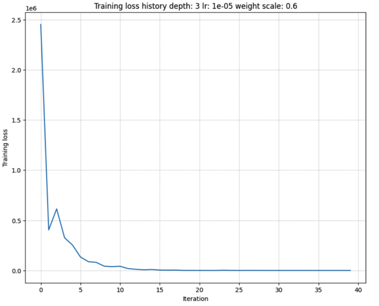</kbd>

> [!NOTE]
> với **weight scale 0.1 nhỏ, gradient nhỏ model learn chậm**, In
> 30 value cuối để thấy**loss vẫn đang tiếp tục chiều hướng đi
> xuống**, thể hiện model vẫn đang **underfit**

> [!NOTE]
> với weight scale 0.6, model learn tốt, với 30 epoch cuối, cho thấy , loss đã đạt 0

> [!NOTE]
> Khi **weight scale lớn quá (2,3)**, nhận xét thấy: một là**vanishing gradient** do weight lớn
> -> underfit (hình bên trái) hoặc là bị **diverge** (loss trở nên rất lớn, hình bên phải)

> [!NOTE]
> với **weight scale quá nhỏ -> vanishing gradient
> learn chậm, thậm chí không learn**

 

<kbd>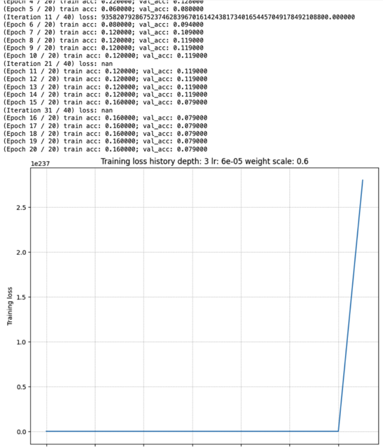</kbd>

<kbd>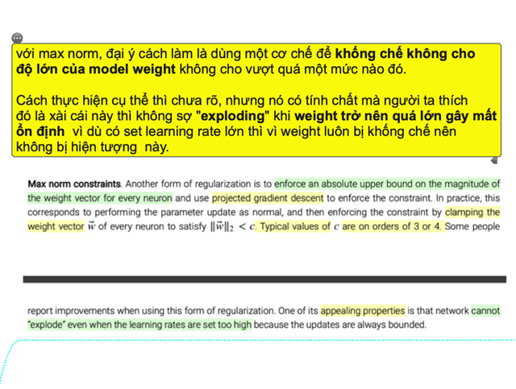</kbd>

<kbd>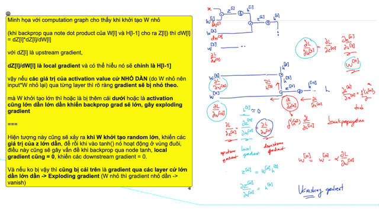</kbd>

<kbd></kbd>

<kbd></kbd>

<kbd></kbd>

<kbd>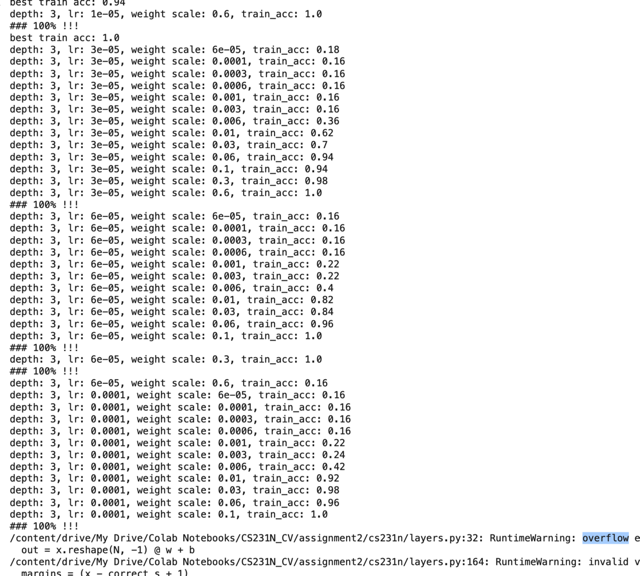</kbd>

> [!NOTE]
> có thể thấy **hiện tượng này lặp lại**với các lr khác 3e-5,
> 6e-5, 1e-4. Tất cả đều là weight scale quá nhỏ thì gây
> vanishing gradient, và cỡ >= 0.1 - 0.6 thì đạt 100%
>
> cụ thể: 
> lr 3e-5, weight scale 0.06 - 94%, 0.1 - 94%, 0.3 - 98%, 0.6 - 100%
> lr 6e-5, weight scale 0.06 - 96%, 0.1 - 100%, 0.3 - 100% 
>
> **nhưng 0.6 thì diverge (loss tăng vọt) (bên trái) hoặc bị lỗi overflow
>
> \/overflow encountered in matmul out = x.reshape(N, -1) @ w + b**\/

> [!NOTE]
> Có phải là diverge ko, **tại sao weight lớn lại gây
> diverge ?**
>
> Đúng là diverge, ta có thể hiểu **diverge** là do
> **gradient lớn** -> nên khi **update params với grad
> lớn** thì cũng**tương tự khi learning rate lớn**
> khiến "đi vọt qua bên kia"
>
> trong note nn part 2 regularization đã nhắc đến việc
> **weight lớn có thể gây hiện tượng network '
> 'explode'** bên cạnh việc nó **gây vanishing
> gradient** liên quan đến activation function lớn local
> grad ~= 0

> [!NOTE]
> hoặc như trong lecture note về weight ini cũng đã
> thấy, W lớn có thể gây **vanishing** nói gọn là**do
> local grad hàm activation**, hoặc gây**exploding
> gradient**do grad đi về bị khuếch đại do nhân với
> activation value  lớn (mà cũng bởi W lớn)

 

<kbd>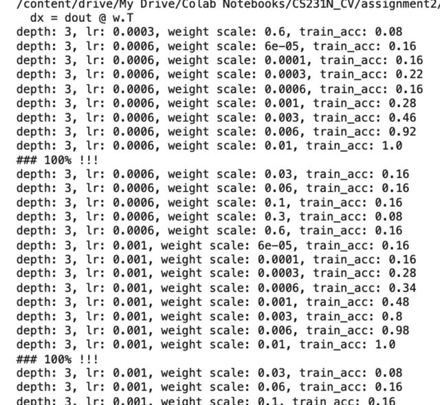</kbd>

<kbd></kbd>

<kbd>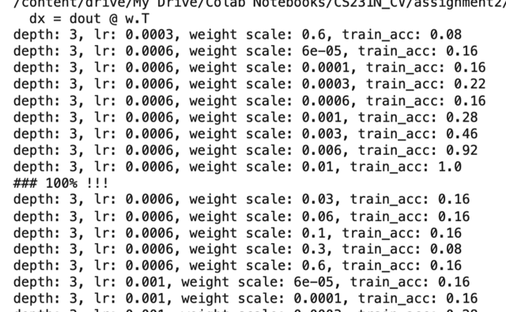</kbd>

> [!NOTE]
> với depth 3, lr 0.0006, 0.001 có thể thấy cũng có hiện tượng trên,
> nhưng weight scale lúc này chỉ nên ở 0.01(lúc nãy là 0.1, 0.6) lên
> 0.03 là đã diverge rồi

 

<kbd>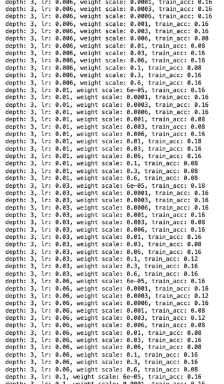</kbd>

> [!NOTE]
> với lr lớn hơn 0.01 thì đã trở nên quá
> lớn, weight scale bao nhiêu cũng
> diverge

 

<kbd>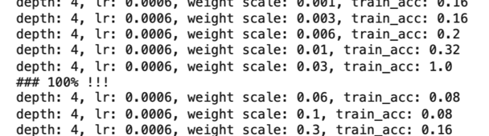</kbd>

<kbd>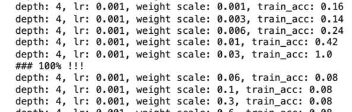</kbd>

<kbd>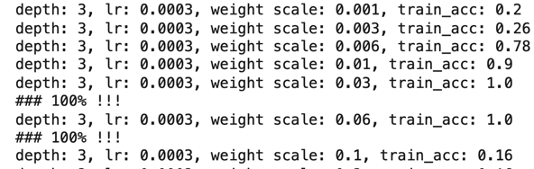</kbd>

<kbd>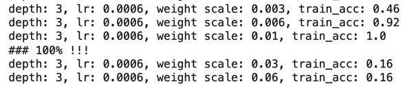</kbd>

<kbd></kbd>

<kbd></kbd>

<kbd></kbd>

<kbd></kbd>

<kbd>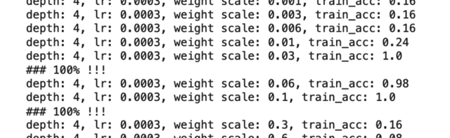</kbd>

> [!NOTE]
> Depth = 4, lr 3e-4, ws: 0.01 - 0.03, train acc: 24% 100%

> [!NOTE]
> Depth = 4, lr 6e-4, ws: 0.01 - 0.03 - 0.06, train acc: 32% 100% 8%

> [!NOTE]
> Depth = 4, lr 1e-3, ws: 0.01 - 0.03 - 0.06, train acc: 42% 100% 8%

> [!NOTE]
> có thể thấy với depth = 4, nn **nhạy cảm** với weight scale hơn depth = 3
>
> Nguyên nhân có thể hiểu là vì nó sâu hơn, nên kiểu như tác động của việc
> scale trở nên lớn hơn (scale nhiều lần hơn)
>
> Do đó, nó nhạy cảm hơn, dễ mất ổn định hơn khi ini weight chỉ khác đi một
> chút là performance đã khác rất nhiều

> [!NOTE]
> Depth = 3, lr 3e-4, ws: 0.01 - 0.03, train acc: 90% 100%

> [!NOTE]
> Depth = 3, lr 6e-4, ws: 0.006 - 0.01, train acc: 92% 100%

 

<kbd>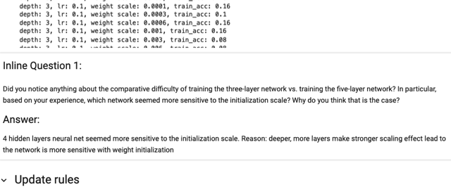</kbd>

 

<kbd>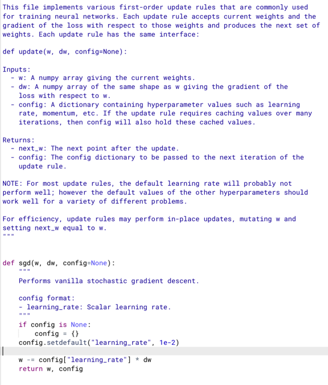</kbd>

> [!NOTE]
> kế tiếp ta sẽ làm cái SGD Momentum, trước đó xem qua
> optim.py chứa các function giúp thực hiện việc
> optimizing (dùng gradient để thay đổi parameters)
>
> Có thể thấy sgd - vanilla gradient descent, sẽ update 
> weight bằng cách trừ cho gradient * learning rate.

 

<kbd>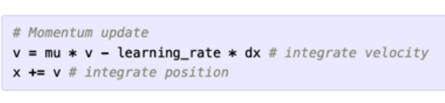</kbd>

<kbd></kbd>

<kbd>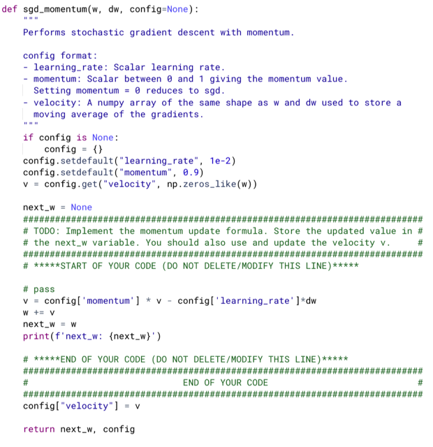</kbd>

> [!NOTE]
> nhiệm vụ là làm cái sgd_momentum update. Dựa trên
> công thức mà làm thôi, còn nguyên lý của cái này thì
> trong note đã hiểu

 

<kbd>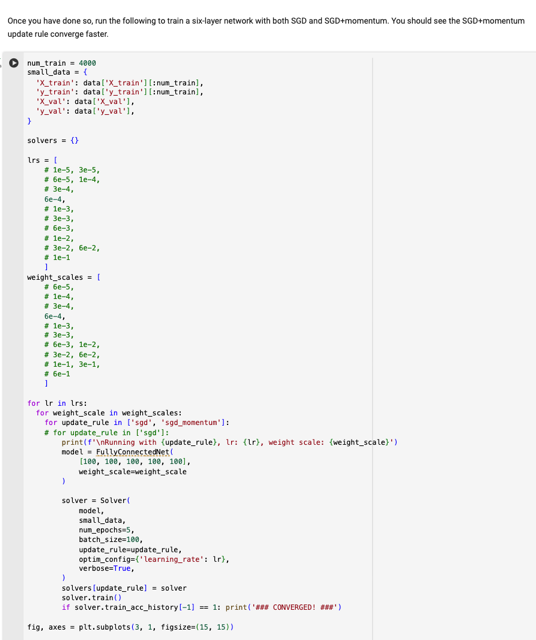</kbd>

<kbd></kbd>

<kbd>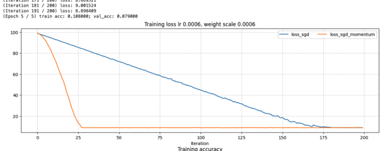</kbd>

> [!NOTE]
> Train 5 hidden layers neural net cho thấy sgd
> momentum converge nhanh hơn. Ở đây ta train
> với 4000 sample chứ ko phải 50 nên không đạt
> train acc 100% được (overfit)

 

<kbd>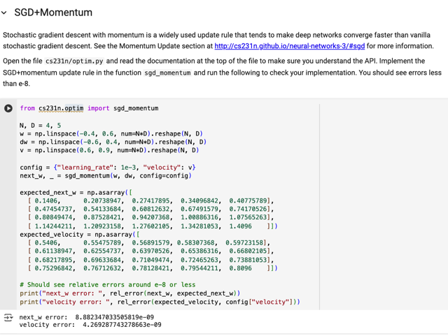</kbd>

> [!NOTE]
> error e-8 là ok

 

<kbd>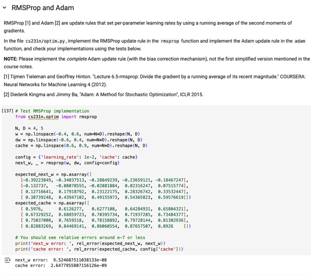</kbd>

> [!NOTE]
> Tiếp theo là làm
> RMSProp và Adam

 

<kbd>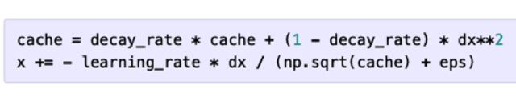</kbd>

<kbd></kbd>

<kbd>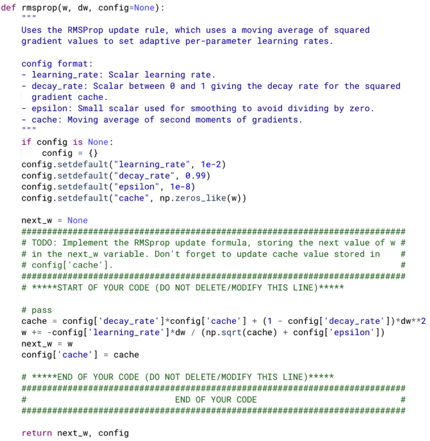</kbd>

> [!NOTE]
> cứ theo công thức mà làm thôi

 

<kbd>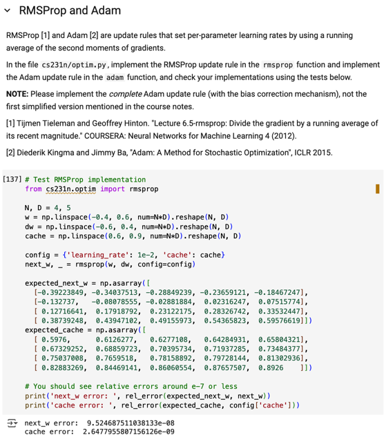</kbd>

> [!NOTE]
> Pass!

 

<kbd>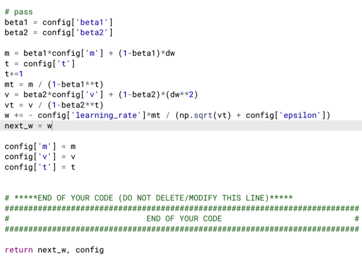</kbd>

<kbd>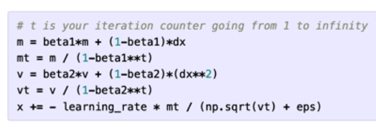</kbd>

<kbd></kbd>

<kbd></kbd>

<kbd>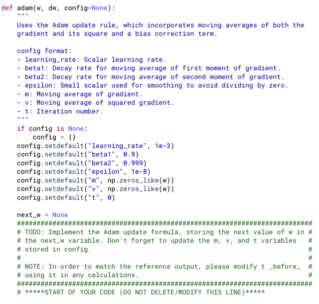</kbd>

> [!NOTE]
> cứ theo công thức mà làm thôi, chú ý t là number of iteration,
> đương nhiên là sẽ += 1 mỗi lần

 

<kbd>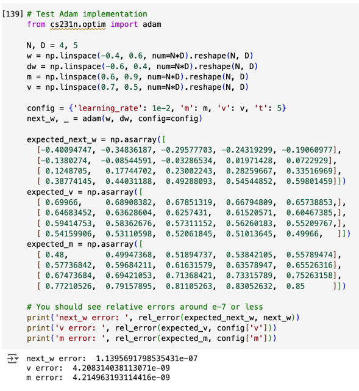</kbd>

> [!NOTE]
> Pass!

 

<kbd>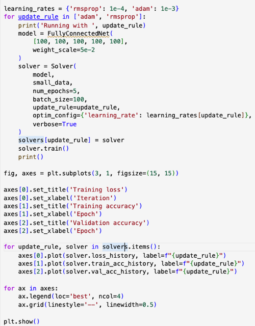</kbd>

 

<kbd>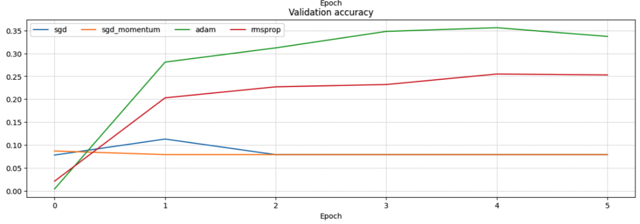</kbd>

<kbd></kbd>

<kbd>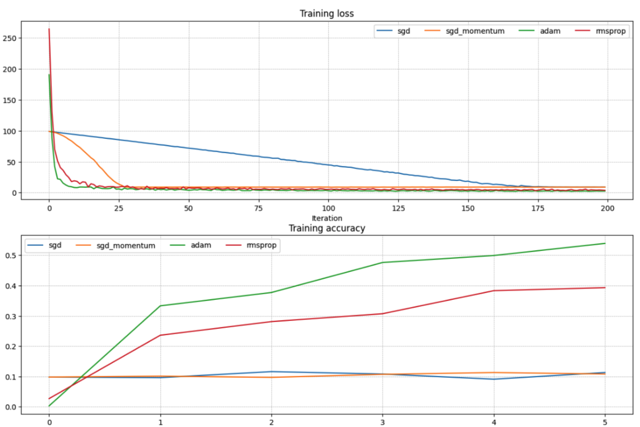</kbd>

> [!NOTE]
> có thể thấy rõ Adam converge sớm nhất, sau đó là
> rmsprop, tệ nhất là vanilla sgd

 

<kbd>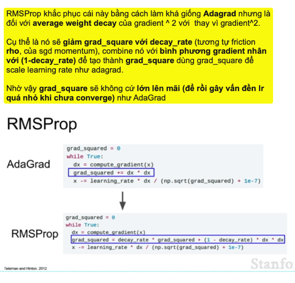</kbd>

<kbd></kbd>

<kbd>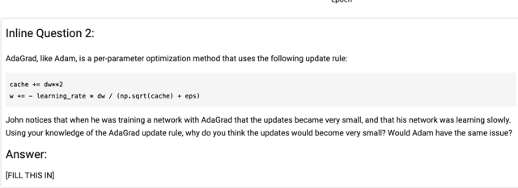</kbd>

> [!NOTE]
> Câu hỏi là khi John train với AdaGrad thì thấy hiện tượng parameters
> được update rất chậm, khiến learning trở nên rất lâu. Vậy tại sao lại thế
> và Adam có bị vậy không?
>
> -> Dựa vào việc hiểu nguyên lý của AdaGrad là nó cố gắng cân bằng
> việc update các param bằng cách điều chỉnh learning rate cho từng
> param thay vì dùng chung một learning rate.
>
> Bằng cách **chia lr của mỗi params** cho một giá trị **grad_square
> được cộng dồn trong quá khứ**. Với ý tưởng là nếu param A được
> update nhiều hơn param B thì learning rate cho param A sẽ nhỏ hơn
> của B.
>
> Thế thì nhược điểm của cái này là **grad_square cứ cộng dồn nên lớn
> lên mãi, sẽ khiến lr ngày càng bị bóp nhỏ lại**.
>
> RMSProp (cũng như Adam) khắc phục bằng cách dùng một **average
> weight decay**đối với grad_square giúp grad_square đại khái là không
> cứ lớn mãi dẫn đến vấn đề của AdaGrad

 

<kbd>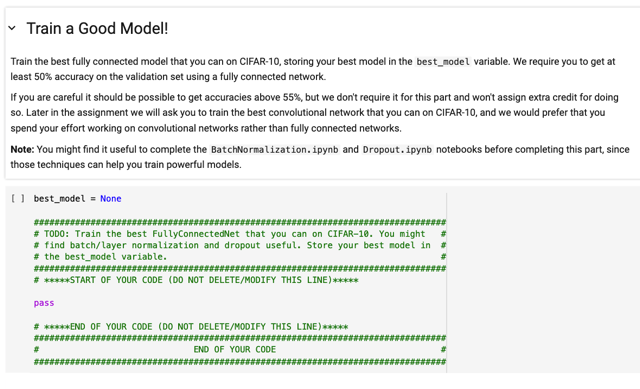</kbd>

> [!NOTE]
> để train dc một FC model có val acc > 50% thì ta sẽ qua làm
> BatchNorm và Dropout trước, quay lại đây sau. Vì hai technique
> này sẽ giúp giảm overfit

 

