# Assignment 3 - Lstm Captioning

📊 **Progress:** `13` Notes | `51` Screenshots

---

<kbd>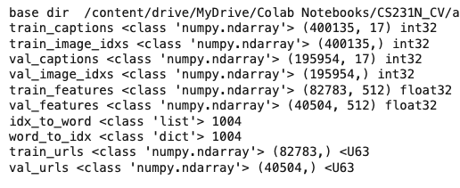</kbd>

<kbd></kbd>

<kbd>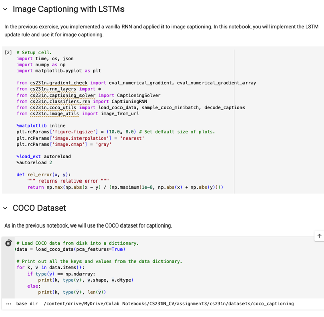</kbd>

> [!NOTE]
> ở đây lại không bị cái vụ lỗi import như ở RNN captioning, cũng như
> trong notebook đó ta cũng sẽ dùng COCO dataset

 

<kbd>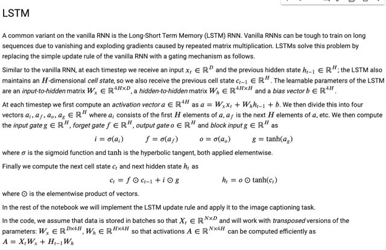</kbd>

> [!NOTE]
> mô tả lại cách "làm" LSTM, như đã biết, nhưng chú ý là ở đây trong cs231n,
> khác với DLSpec hay NLPSpec, ta sẽ "gộp" các matrix W (cho các gate) thành
> matrix lớn, để rồi khi tính, cơ bản là ta tính một lượt từ xt, ht-1, ra luôn 4 vector
> dưới dạng một vector a dài 4H, sau đó cắt ra và apply các function sigmoid /
> tanh khác nhau để có các gate vector.
>
> Sau đó thì tính ct, ht thì biết rồi.

 

<kbd>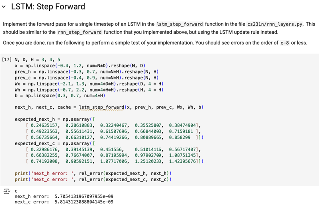</kbd>

 

<kbd>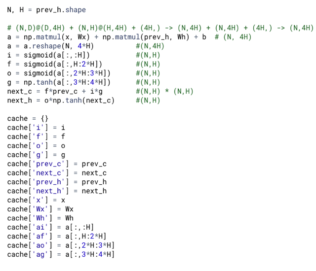</kbd>

<kbd></kbd>

<kbd>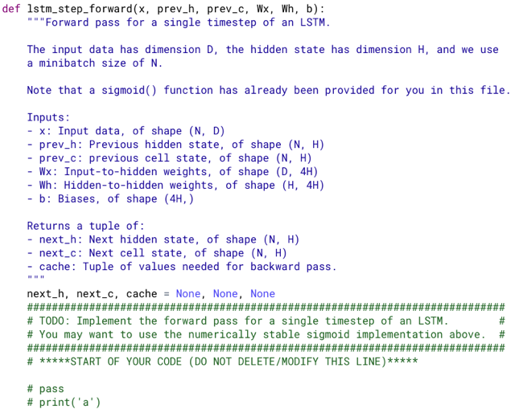</kbd>

> [!NOTE]
> forward tương đối đơn giản, theo mô tả đã rất rõ
> không cần phải note gì nhiều

 

<kbd>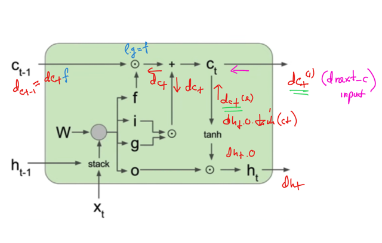</kbd>

<kbd>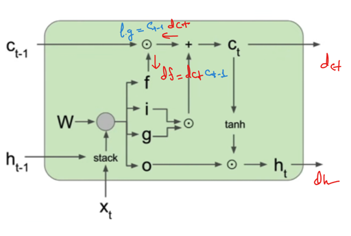</kbd>

<kbd>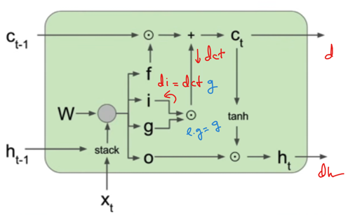</kbd>

<kbd>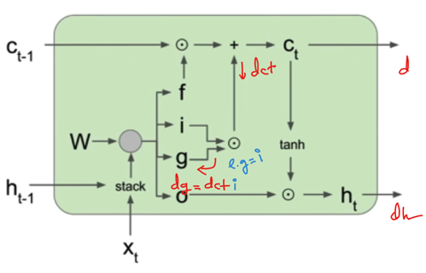</kbd>

<kbd>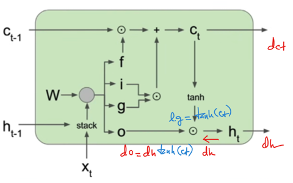</kbd>

<kbd>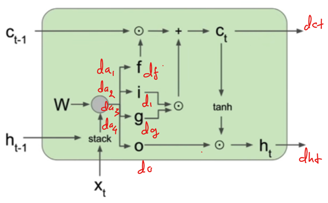</kbd>

<kbd>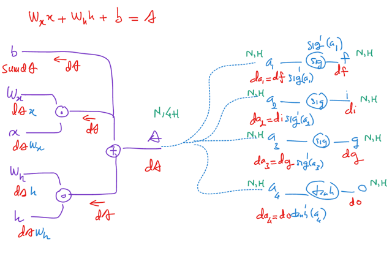</kbd>

<kbd>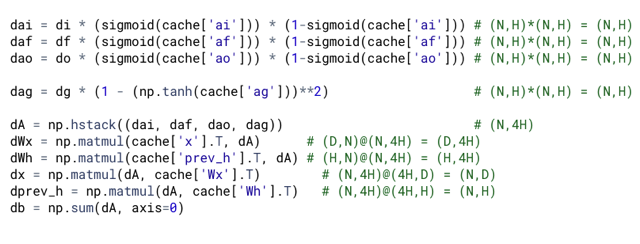</kbd>

<kbd></kbd>

<kbd></kbd>

<kbd></kbd>

<kbd></kbd>

<kbd></kbd>

<kbd></kbd>

<kbd></kbd>

<kbd></kbd>

<kbd>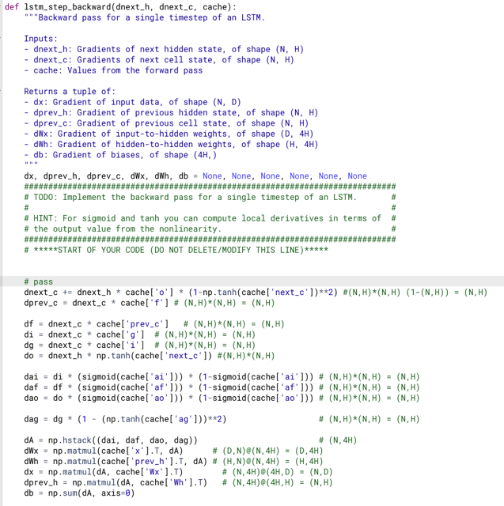</kbd>

> [!NOTE]
> dnext_c input chỉ là 1 nhánh, ct có tham gia tính ht,nên phải có 
> gradient của nhánh đó nữa.
>
> dnext_c += dnext_h * cache['o'] * (1-np.tanh(cache['next_c'])**2) 
>
> dprev_c = dnext_c * cache['f']

> [!NOTE]
> df = dnext_c * cache['prev_c']   # (N,H)*(N,H) = (N,H)

> [!NOTE]
> di = dnext_c * cache['g']  # (N,H)*(N,H) = (N,H)

> [!NOTE]
> dg = dnext_c * cache['I']  # (N,H)*(N,H) = (N,H)

> [!NOTE]
> do = dnext_h * np.tanh(cache[' next_c']) #(N,H)*(N,H)

 

<kbd>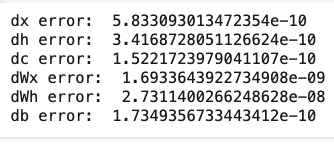</kbd>

<kbd></kbd>

<kbd>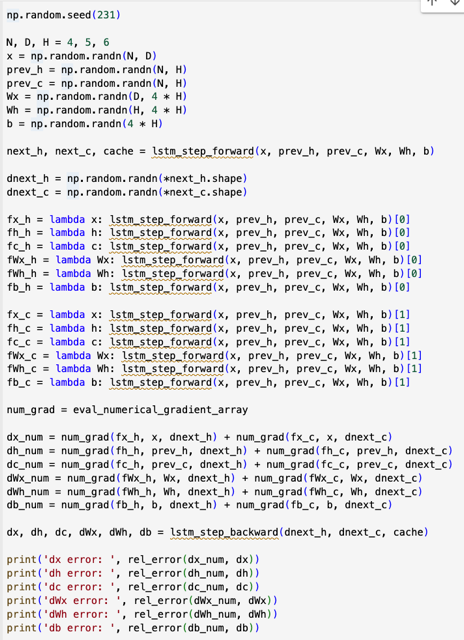</kbd>

> [!NOTE]
> You should see errors on the
> order of e-7 or less.

 

<kbd>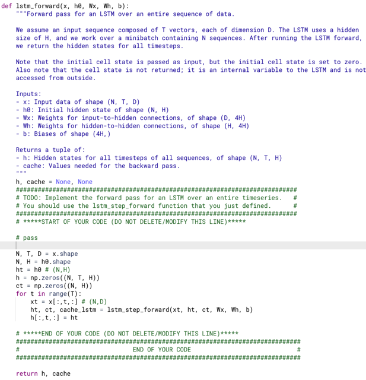</kbd>

 

<kbd>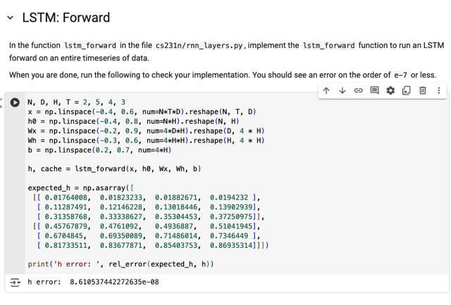</kbd>

> [!NOTE]
> You should see an error on
> the order of e-7 or less

 

<kbd>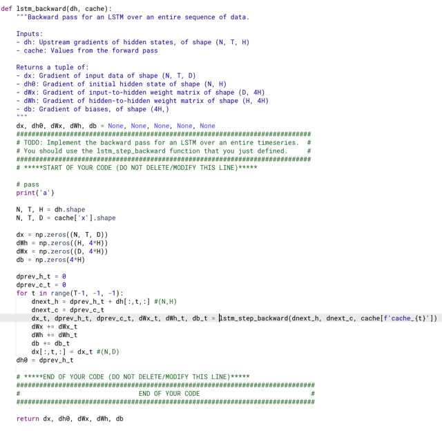</kbd>

> [!NOTE]
> Hoàn toàn tương tự cái rnn_backward()

 

<kbd>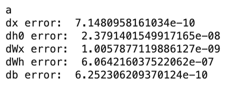</kbd>

<kbd></kbd>

<kbd>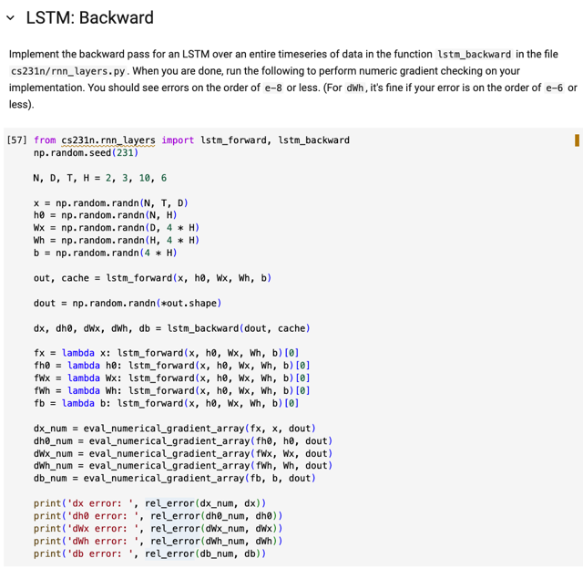</kbd>

 

<kbd>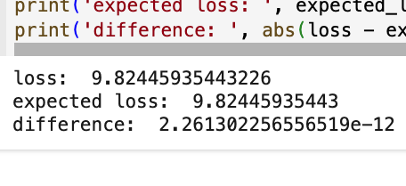</kbd>

<kbd></kbd>

<kbd>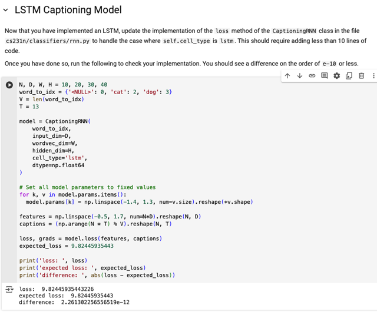</kbd>

 

<kbd>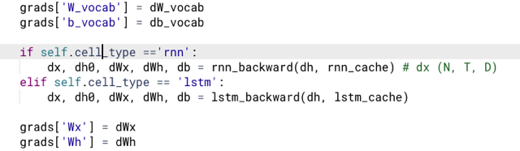</kbd>

<kbd></kbd>

<kbd>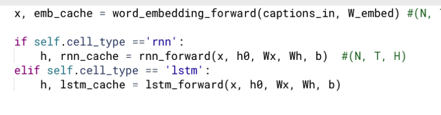</kbd>

> [!NOTE]
> Update thêm case lstm

 

<kbd>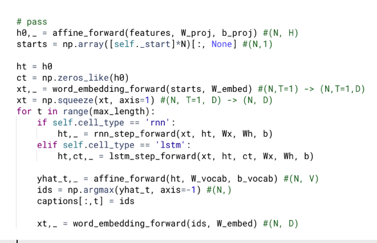</kbd>

> [!NOTE]
> update thêm case của
> lstm cho sample()

 

<kbd>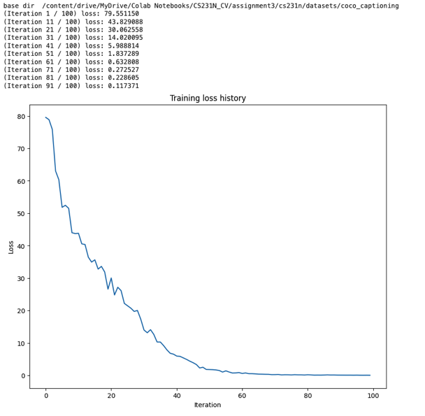</kbd>

<kbd></kbd>

<kbd>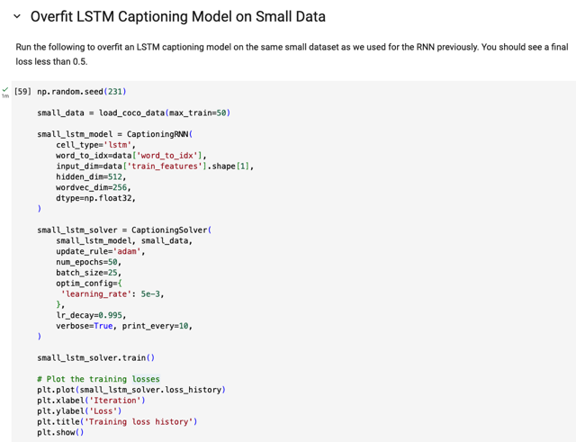</kbd>

 

<kbd>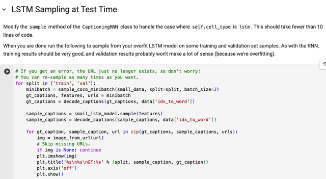</kbd>

 

<kbd>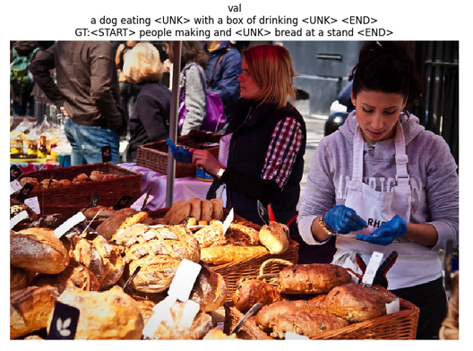</kbd>

<kbd>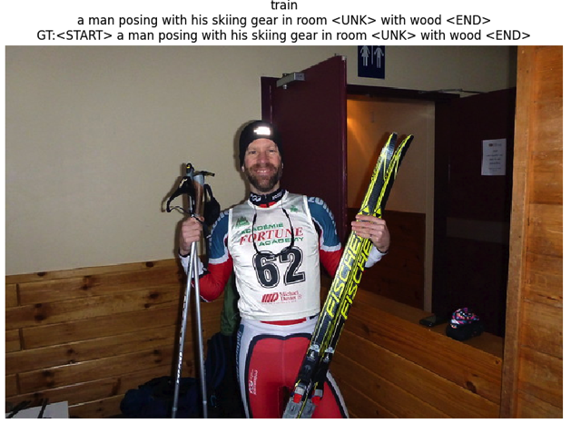</kbd>

<kbd></kbd>

<kbd></kbd>

<kbd>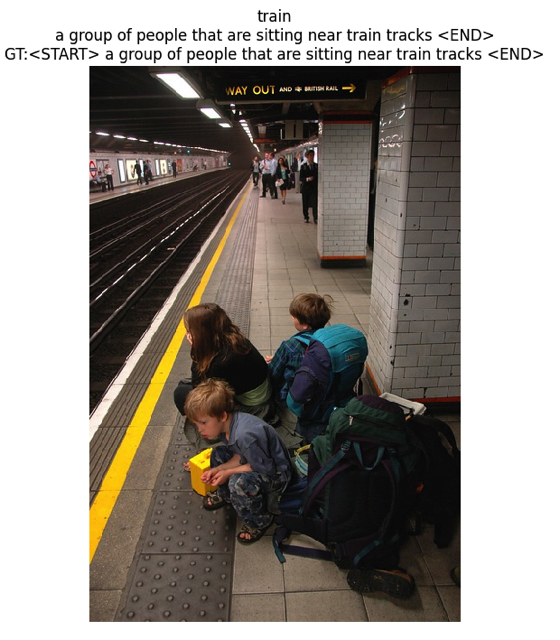</kbd>

 

<kbd>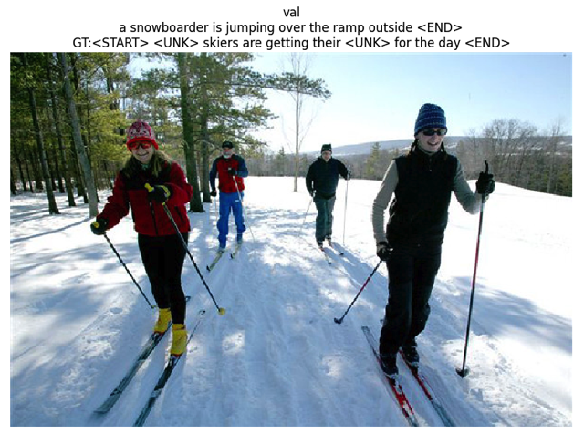</kbd>

 

