# Assignment 4 - Transformer Image Captioning

📊 **Progress:** `25` Notes | `50` Screenshots

---
<a id="node-1318"></a>

<p align="center"><kbd>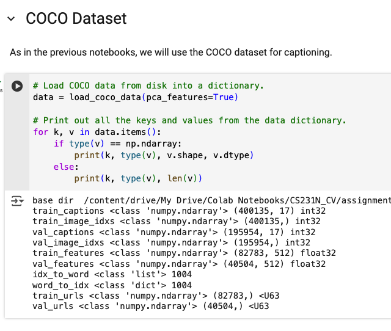</kbd></p>

> [!NOTE]
> Rồi, khúc đầu cũng y chang, tải
> bộ COCO dataset về

<br>

<a id="node-1319"></a>

<p align="center"><kbd>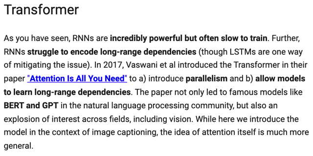</kbd></p>

> [!NOTE]
> rồi, ở đây nhắc lại về những nhược điểm của  vanilla RNN và cải tiến của nó
> là LSTM đó là không có khả năng xử lý song song và hạn chế trong việc nắm
> bắt `long-range` dependency. Thì paper Attention is All You Need với kiến trúc
> Transformer sử dùng Attention Layer đã giải quyết rất tốt hai nhược điểm này.
>
> Nó nhanh chóng được áp dụng trong NLP để đặt nền tảng cho mô hình ngôn
> ngữ lớn như BERT và GPT nhưng khả năng của nó có thể áp dụng cho 
> nhiều lĩnh vực khác như vision.

<br>

<a id="node-1320"></a>

<p align="center"><kbd>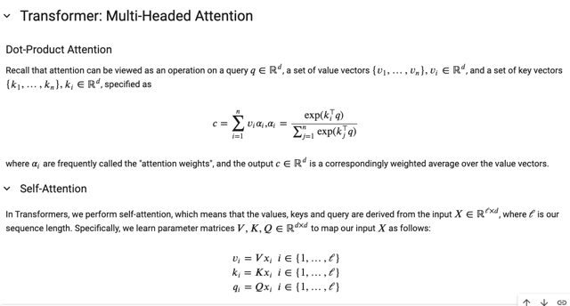</kbd></p>

> [!NOTE]
> đầu tiên nói lại về `Dot-Product` Attention mechanism, thì như đã hiểu trong
> lecture thì ta xét `/` có một vector query `-` q (có d unit). Và một bộ không care
> thứ tự (tức là coi như một set) n các key vector k: [k1,k2...kn], và một bộ n
> vector value v: [v1, v2...vn]. Thế thì ta sẽ tính similarity scores `/` alignment
> scores giữa vector q và các vector k, dùng một similarity function đơn giản
> mà hiệu quả là dot product (việc tính similarity score có thể dùng các function
> phức tạp hơn như cosine distance...nhưng việc dùng dot product cho thấy
> giúp có thể vectorization tốt hơn khi quá trình attention với nhiều véctơ q
> cùng lúc có thể được triển khi chỉ với phép nhân matrix) giữa chúng.
>
> Kết quả là ta một bộ n vector attention scores `s_i,` apply qua softmax ta có
> attention weights `alpha_i.` Để rồi dùng chúng trong việc tính toán một linear
> combination  của các vector value `v_i,` mà ở đây người ta gọi là weighted
> average. Để được c, (kí hiệu của context) mang ý nghĩa là một  vector mang
> context information
>
> `====`
>
> Rồi, thì đó là cơ chế Attention sử dụng dot product, thế thì, với `Self-Attention,`
> là ta có một bộ có l input vector size d tạo thành matrix X shape (l,d). Ta dùng
> 3 matrix K,Q,V shape d,d để chuyển `/` cho model learn từ mỗi vector x, ra 3
> vector k, q, v. Để rồi tạm gọi là cho chúng "self" attend lẫn nhau, y như ở
> Attention ở trên, khi ta có một bộ l vector keys k `=` [k1,k2...kl], l vector value v
> `=` [v1, v2...vl] chỉ có điều là ta làm cùng lúc cho l vector query, [q1, q2...ql] để
> kết quả là l vector c: c1,c2...cl

<br>

<a id="node-1321"></a>

<p align="center"><kbd>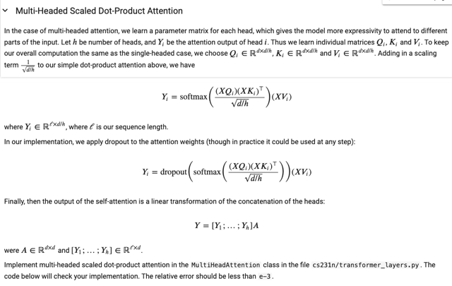</kbd></p>

> [!NOTE]
> Rồi, về cái mà ta làm sẽ `multi-headed` scaled `dot-product` attention.
>
> thì nó sẽ như vậy, thay vì như cái `Self-Attention` ở trên đang nói thì nó tạm gọi là
> `"one-head"` attention, mà trong đó ta dùng MỘT bộ 3 matrix Q, K, V có shape (d,
> d) để cho model "learn" ra từ một vector x (R^d) ra 3  vector q, k, v. Thì với
> `Multi-head,` ta sẽ có nhiều bộ QKV: Gọi số head là h, thì ta có h bộ Q, K,V, và mỗi
> matrix sẽ có shape là `(d,d/h)` mang ý nghĩa là model sẽ learn từ một vector x ra
> nhiều (h) bộ véctơ q,k,v  mà mỗi cái "ngắn" hơn, chỉ dài có `d/h` unit thôi.
>
> Rồi, tiếp theo với mỗi một head, thì self attention như thường lệ, chỉ có điều
> đương nhiên output từ mỗi head sẽ là một bộ có l vector ngắn hơn, chỉ dài `d/l`
> thôi.
>
> Và ta sẽ concatenate các vector ngắn này (tất nhiên tương ứng vị trí, ví dụ x1 `->`
> h bộ (q11, k11, v11), (q12,k12,v12)...(q1h,k1h,v1h) thì output của multihead self
> attention ra ta sẽ có tương ứng với x1, có h vector y11, y12...y1h, mỗi vector dài
> `d/h.` Ta concat tụi nó lại để được y1 (R^d)
>
> Có thêm vài điều chỉnh so với `Dot-Product` Self Attention đó là ta sẽ Scale,
> nguyên nhân thì như đã hiểu trong lecture, việc dùng dot product làm similarity
> function có vài hạn chế như, phép dot product sẽ sinh ra những giá trị lớn khi
> kích thước vector (d) lớn. Khiến qua softmax, gây ra hiện tượng vanishing
> gradient. Do đó ta mới chia cho sqrt của độ dài vector mà trong `multi-head`
> attention, thì nó là `d/h.`
>
> Một điểm nữa, là ở đây trong assignment này, người ta nói mình sẽ apply một
> layer Dropout đối với attention weights, đây là một điểm không thấy nói ở cả
> trong lecture (trước giờ với DLSpec, NLPSpec, cs231n)
>
> Và sau khi concatenate các head's output, ta sẽ cho nó qua một linear
> transformation nữa.

<br>

<a id="node-1322"></a>

<p align="center"><kbd>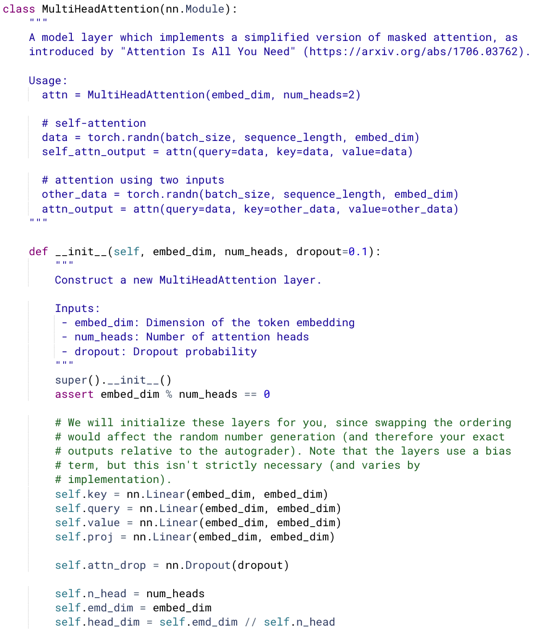</kbd></p>

> [!NOTE]
> rồi, ở assignment này ta sẽ được dùng pytorch torch.nn. Đầu
> tiên là làm cái module này, cơ bản là ta sẽ làm một Attention
> layer.  để rồi nó nhận vào 3 bộ vector queries, keys, values,
> và thực hiện attentions.
>
> Thì có thể hiểu, nếu như ta pass vào 3 argument này, cùng
> một bộ vector X thì ta có `Self-Attention.` (Tất nhiên nếu muốn
> làm `mượt-head,` thì dùng nhiều bộ matrix Q,K,V để mà tạo
> nhiều bộ queries, keys, values và pass mỗi bộ qua một
> MultiHeadAttention này)
>
> Nhưng nếu dùng arg queries là vector X1, còn W,K là một bộ
> véctơ X2 thì ta có cross attention.
>
> `======`
>
> Chú ý , ta đã biết ở DLSPec, tuy nó rằng ta dùng h matrix Q
> shape d, `d/h` thì thật lúc làm ta "vẫn chỉ coi là một matrix Q d,d" 
> thôi
>
> Nói chung đây là làm một module thực hiện các tính toán của
> scale dot product attention
>
> `===`
>
> Ở trong init, người ta initialize giùm, với 3 matrix Q,K,V dùng 3
> nn.Linear layer shape (d,d), và một `W_proj` để transform cái  y
> trước khi output

<br>

<a id="node-1323"></a>

<p align="center"><kbd>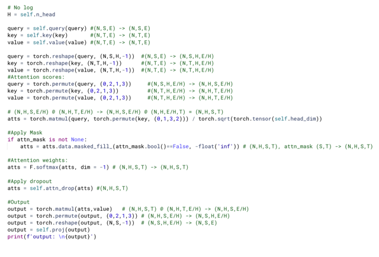</kbd></p>

<p align="center"><kbd></kbd></p>

<p align="center"><kbd>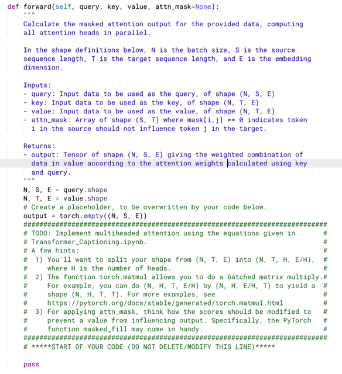</kbd></p>

> [!NOTE]
> Chú ý, hơi khác bên assignment 4 của cs224n, trong đó mask được
> cho là `=` 1 thì là "che đi influence", còn ở đây là ngược lại
>
> `====`
>
> còn lại thì cơ bản là chuyển shape sao cho đúng là được: chắc viết vài
> ```text
> dòng chỗ chuyển shape từ N,S,H,E/H -> N,H,S,E/H là suy nghĩ thế
> ```
> này: 
>
> ban đầu là S vector, mỗi cái dài `E` (khỏi nói tới B đi): (B, S, `E)`
>
> Ta mới bẻ mỗi vector thành H phần, dài `E/H,` nên giờ ta có **S bộ, mỗi
> bộ có H vector dài E/H**
>
> Thì ta cũng có thể coi như có H bộ, mỗi bộ có S vector các loại (ý nói
> mỗi cái là 1 đoạn của một input vector khác nhau), mỗi cái dài `E/H.`
>
> Và các bộ (mỗi cái S vector này) mới tham gia attention
>
> `====`
>
> Hàm softmax nhớ define dim

<br>

<a id="node-1324"></a>

<p align="center"><kbd>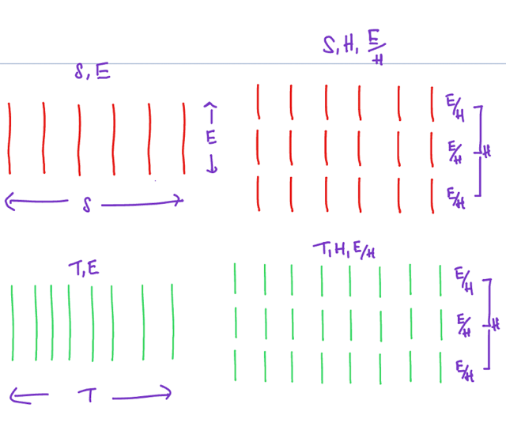</kbd></p>

> [!NOTE]
> ```text
> S,E -> S,H,E/H
> ```

<br>

<a id="node-1325"></a>

<p align="center"><kbd>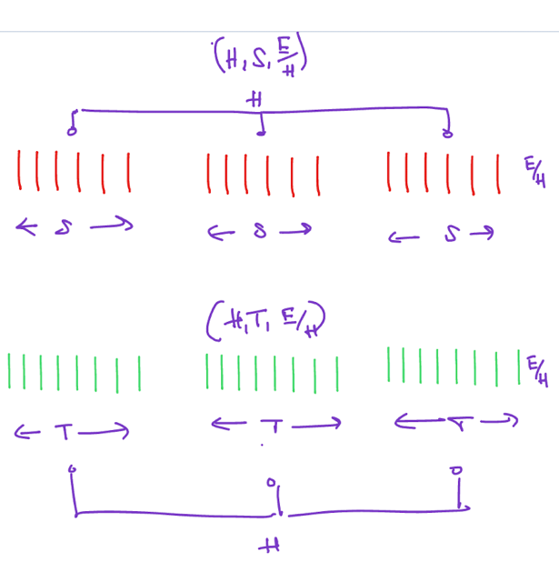</kbd></p>

> [!NOTE]
> ```text
> S,H,E/H --permute-->  H,S, E/H
> ```

<br>

<a id="node-1326"></a>

<p align="center"><kbd>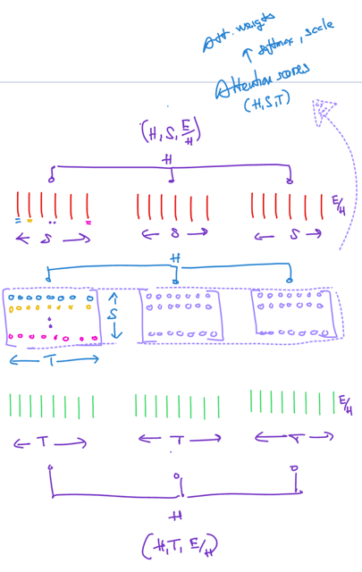</kbd></p>

> [!NOTE]
> ```text
> H,S,E/H @ H,E/H,T -> H,S,T (attention scores)
> ```

<br>

<a id="node-1327"></a>

<p align="center"><kbd>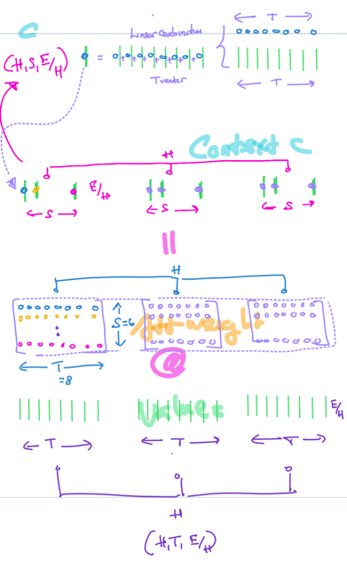</kbd></p>

> [!NOTE]
> ```text
> H,S,T @H,T,E/H -> H,S,T/H
> ```

<br>

<a id="node-1328"></a>

<p align="center"><kbd>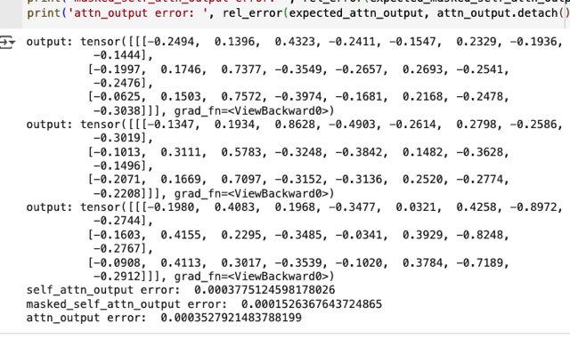</kbd></p>

<p align="center"><kbd></kbd></p>

<p align="center"><kbd>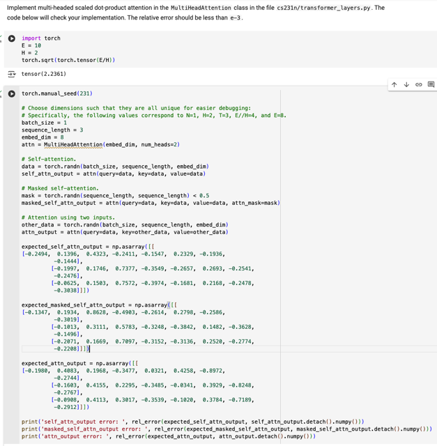</kbd></p>

<br>

<a id="node-1329"></a>

<p align="center"><kbd>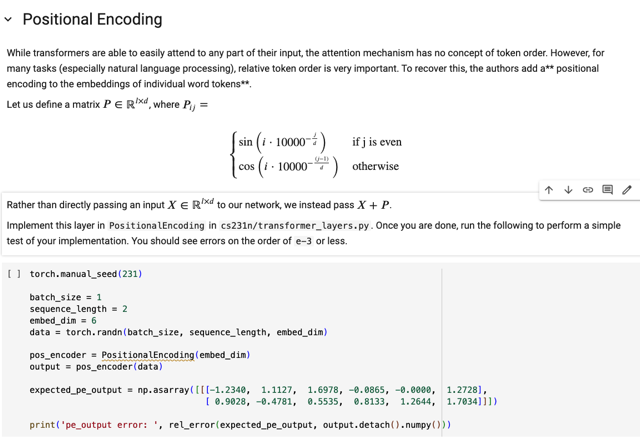</kbd></p>

> [!NOTE]
> đại khái là mỗi vị trí trong L (hay T, sequence length) vị trí sẽ tương ứng với một
> positional encoding vector (cũng có d unit như input vector). Và cơ bản giá
> trị của các phần tử sẽ tuân theo công thức này, hay nói cách khác, chỉ cần
> define theo công thức này một matrix P shape LxD thì mỗi hàng của nó, ví
> dụ hàng thứ i sẽ là positional encoding của input thứ i.

<br>

<a id="node-1330"></a>

<p align="center"><kbd>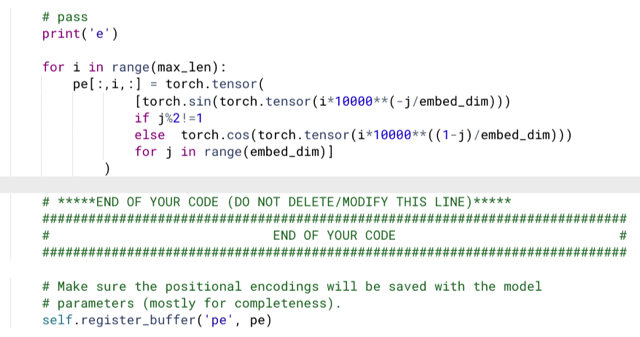</kbd></p>

<p align="center"><kbd>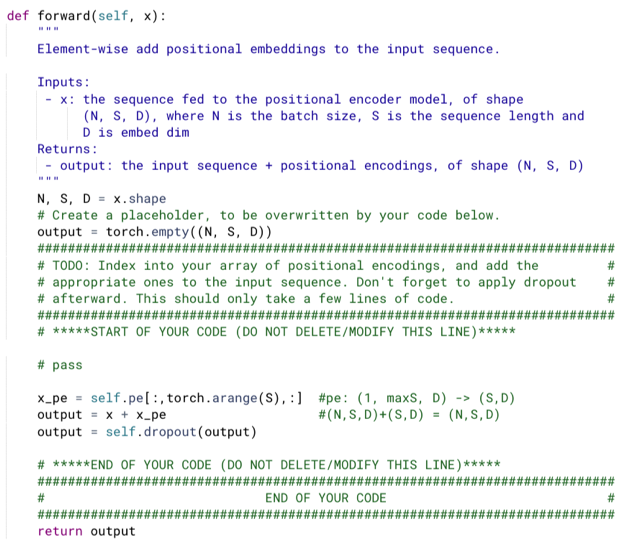</kbd></p>

<p align="center"><kbd></kbd></p>

<p align="center"><kbd></kbd></p>

<p align="center"><kbd>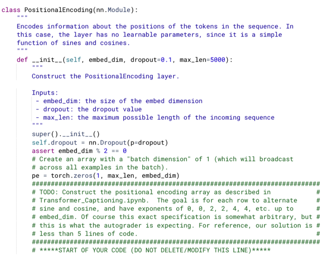</kbd></p>

> [!NOTE]
> Dùng function
> `torch.sin/cos,`

<br>

<a id="node-1331"></a>

<p align="center"><kbd>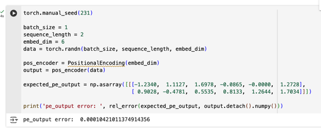</kbd></p>

> [!NOTE]
> You should see errors on the
> order of `e-3` or less

<br>

<a id="node-1332"></a>

<p align="center"><kbd>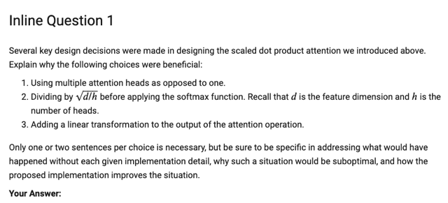</kbd></p>

> [!NOTE]
> 1. Cho phép model thêm sự linh hoạt trong việc khám phá các khía cạnh
> nào của việc attention mà nếu chỉ một head thì không đủ để
>
> 2. Để giảm vấn đề phép dot product với d lớn sẽ dể cho ra các kết quả
> lớn, gây ra vấn đề vanishing gradient, chia cho sqrt của vector dimension
> sẽ khắc phục điều này.
>
> 3. Linear layer cuối là để: tạo ra sự liên hệ giữa các output vốn trong attention
> hoàn toàn độc lập nhau.

> [!NOTE]
> Quay lại tham khảo thêm gpt ở câu hỏi 3

<br>

<a id="node-1333"></a>

<p align="center"><kbd>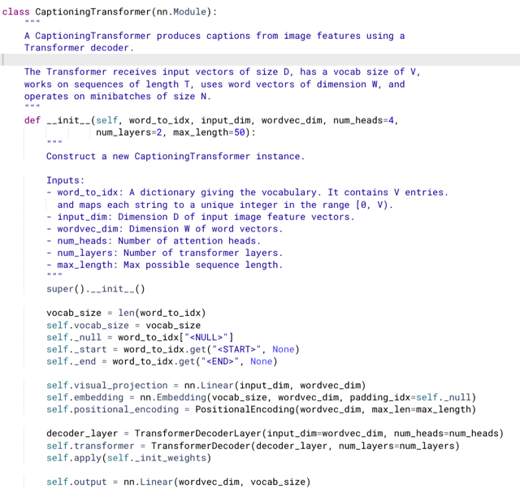</kbd></p>

> [!NOTE]
> ở đây ta sẽ hoàn thiện **một nn.module CaptionTransformer**, function init đã
> được làm sẵn trong đó ta thấy họ**chuẩn bị những cái như các kích thước**,
> **các token id đặc biệt như <NULL>, <START>, <END>**. Rồi**các layer** gồm có
> **embedding**, dùng để**chuyển token id thành embedding vector.** **Positional
> encoding mình** đã làm ở trên, để chuyển lấy ra positional encoding vector
> với một vị trí.
>
> Rồi ta thấy họ khởi tạo **TransformerDecoderLayer**, pass vào khởi tạo
> **TransformerDecoder**. Ta sẽ xem nó là ntn

<br>

<a id="node-1334"></a>

<p align="center"><kbd>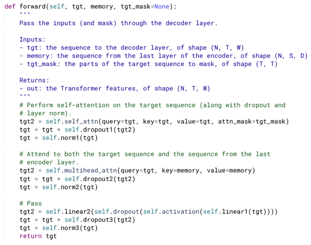</kbd></p>

<p align="center"><kbd>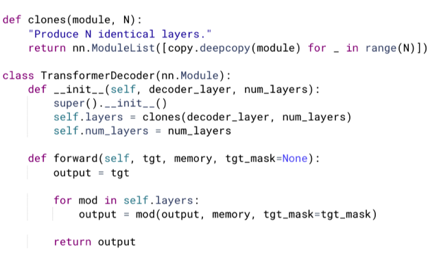</kbd></p>

<p align="center"><kbd>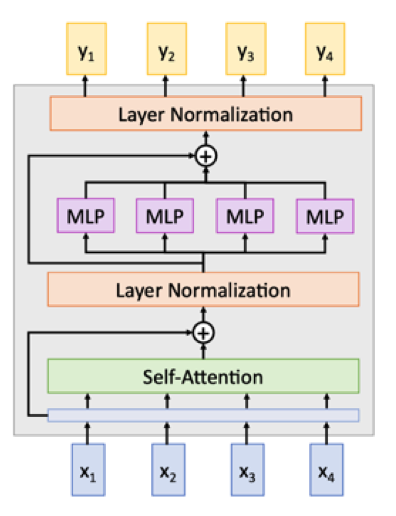</kbd></p>

<p align="center"><kbd>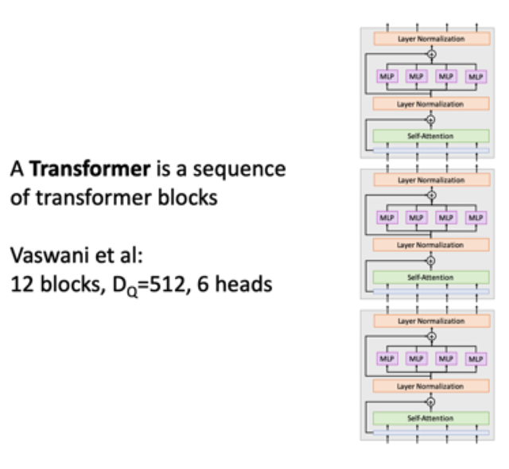</kbd></p>

<p align="center"><kbd>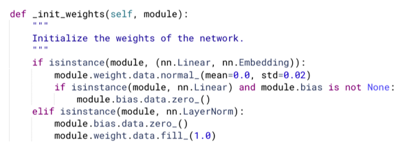</kbd></p>

<p align="center"><kbd></kbd></p>

<p align="center"><kbd></kbd></p>

<p align="center"><kbd></kbd></p>

<p align="center"><kbd></kbd></p>

<p align="center"><kbd></kbd></p>

<p align="center"><kbd>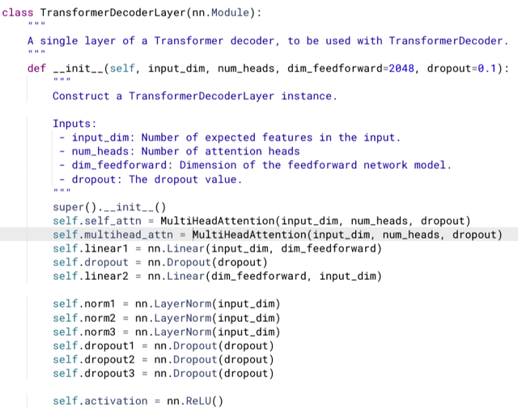</kbd></p>

> [!NOTE]
> rồi, cái TransformerDecoderLayer module, trong init ta (thấy họ) define các layer như
> có hai MultiHeadAttention module, một cái ta hiểu là để để Masked `Self-Attention,` một
> cái là "Cross attention", tức có sự tham gia của các encoder
>
> Ngoài ra là các Linear layer, LayerNorm, Dropout
>
> Trong function init ta thấy với linear và embedding thì ini với normal distribution
> còn layer norm thì weight được ini `=` 1, zero bias

> [!NOTE]
> Trong forward, input thứ nhất sẽ có **tgt** là một **chuỗi target, input vào
> decoder**, (đại khái trong bài toán Image Captioning nó **là cái câu caption
> target (label)** đó, hay nếu là bài toán **machine translation** thì nó **chính là
> câu target, (câu dịch mẫu)**
>
> (*Tất nhiên nói là "câu" nhưng ta đều hiểu nó là chuỗi các token embedding
> vector, chuyển từ token id nhờ embedding layer )
>
> Input thứ hai là **memory**, đây chính là **output từ encoder.**  (gọi là memory,
> ta hiểu người ta gọi như vậy với ý nghĩa là **"nhìn bức ảnh, nhớ trong đầu, rồi
> dùng trí nhớ đó để tạo ra caption**).
>
> `====` #Perform `self-attention` on the target sequence with dropout, layernorm
>
> Vậy đầu tiên input của decoder sẽ qua một **Masked `Multi-head` Self Attention**,
> nơi mà **các input vector self attend với nhau để `tạo/bồi` đắp thông tin contextual
> "cho nhau"**. Nên có thể thấy  tgt được **pass vào ở cả ba cửa query, key và
> value**. Và vì đây là decoder, nơi nên ta sẽ có **tgt_mask** như đã biết `-` **để  tại
> mỗi vị trí nó sẽ không attend các vị trí sau nó (tương lai).**
>
> Kết quả sẽ được "**dropout**", **add với skip connection** `(+tgt)` và **layer
> normalized.**
>
> `====` #Attend to both target sequence and sequence of the last encoder layer
>
> Rồi, tiếp theo nó sẽ đi qua cơ chế **"cross attention"** ở cổng **query**. Còn
> **encoder output** sẽ join ở 'cổng' **key**, **value**. Output sẽ được **dropout**,
> add **skip connection** và **layer normalized**.
>
> Trong đây nói lại một cách ngắn gọn, thì query (từ decoder) sẽ dùng để so sánh
> xem thử nó giống với encoder input nào (mà encoder input ta biết nó mang
> thông tin đại diện cho các feature vector của bức hình, đại khái là đại diện cho
> những vùng khác nhau trên bức hình) Thế thì từ đó ta sẽ có các attention scores
> và attention weights. để rồi dùng chúng để tính một linear combination các (tạm
> gọi là) context vector mang thông tin kiểu như với một vị trí t trong caption hay
> để dự đoán `/` chọn từ cho một vị trí t trong câu caption thì nên chú ý đến vùng
> nào của bức ảnh. Và quá trình này được thực hiện CÙNG LÚC với mọi
> (decoder) query.
>
> `====` #Pass
>
> Bước này chính là bước pass qua **MLP** trong lecture. một linear layer để tăng
> vector size từ `input_dim` `->` `dim_feedforward,` rồi activation relu. Rồi dropout, và
> một linear để từ `dim_feedforward` `->` `input_dim.`
>
> Rồi lại **dropout, skip connection và layer norm**.
>
> Như vậy mới là **xong MỘT transformer decoder layer**, và **decoder nó có NHIỀU
> layer như vậy,** cho nên ta xem ở dưới là define của **TransformerDecoder**, ta thấy
> trong ini, người ta dùng **function clones để clone decoder layer thành
> `num_layers` "cái".**
>
> Để rồi trong **forward, mới pass input qua một loạt các layer này,**mỗi cái đều pass
> vào input thứ nhất (tgt) là **output của layer trước,**và input thứ hai là encoder's output 
> memory, tức tham gia vào mọi DecoderTransformer layer này.
>
> `====`
>
> Vậy thì đây là Decoder, ta sẽ làm cái Encoder và toàn bộ model

> [!NOTE]
> ...và decoder nó có NHIỀU ví dụ 12 layer như vậy,

> [!NOTE]
> vậy mới là xong MỘT transformer decoder layer

<br>

<a id="node-1335"></a>

<p align="center"><kbd>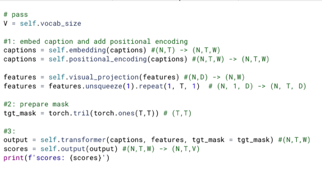</kbd></p>

<p align="center"><kbd>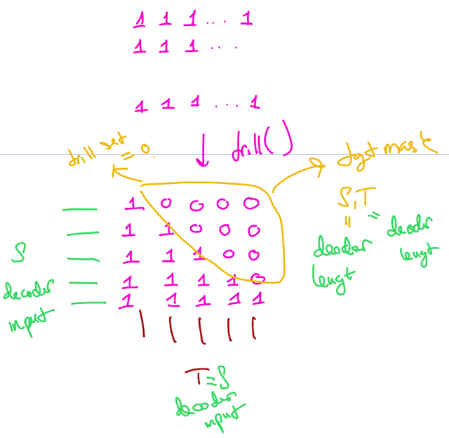</kbd></p>

<p align="center"><kbd></kbd></p>

<p align="center"><kbd></kbd></p>

<p align="center"><kbd>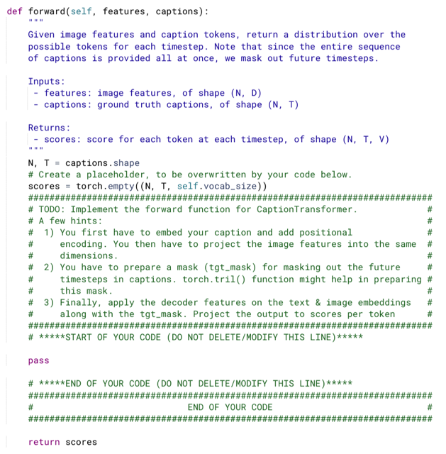</kbd></p>

> [!NOTE]
> giờ ta sẽ hoàn thiện function forward. Vậy trước tiên cần suy nghĩ một
> chút về features, nó là output từ fully connected layer fc7 của VGG16
> là một vector. Nên N sample sẽ là N `(D-dimension)` vector.
>
> Vậy có thể thấy một điểm quan trọng, đó là: Ta không làm một cái hoàn
> toàn giống như trong lecture, cụ thể hơn, ta không có các feature vectors
> lấy từ conv layer của CNN, để có shape là ((N), W*H, D) để rồi ta thực sự
> làm một mô hình attention như trong lecture. Mà ở đây ta vẫn stick với
> COCO dataset trong đó người ta pass mỗi bức hình qua một CNN nhưng
> lấy output của fc7 ra làm như feature vector, tức là chỉ có MỘT vector đại
> diện cho cả bức hình, thay vì một bộ W*H vector mỗi cái đại diện cho một
> vùng.
>
> Nhưng ta vẫn làm mọi thứ đầy đủ của một (Decoder) transformer, chỉ có 
> điều việc đưa feature vector vào attention không mang đầy đủ "ý định" 
> như trong lecture, mà mang tính cách "mô phỏng `/` minh họa", vì nếu đúng
> ra thì features đưa vào self.transformer phải là output từ một encoder, 
> mà trong đó, encoder nó đã xử lý một bộ các "spatial feature vector",
> mỗi vector mang thông tin của một vùng trong bức hình như đã nói ở trên.
> Còn ở đây, để đảm bảo yêu cầu pass vào một bộ vector cho vai trò của 
> keys và queries, ta duplicate feature vector lên T lần.
>
> `====`
>
> Quay lại function này, thì ngoài cái kì cục ở trên, mọi chuyện vẫn theo 
> "sự hiểu", đó là captions (shape (N,T) `-` là batch các chuỗi token id target) 
> Ta mới pass qua embedding layer để chuyển token id thành embedding
> vector. 
>
> Sau đó, pass tiếp qua positional encoding layer mà ta đã làm ở trên, trong
> đó nó sẽ "lấy ra" positional encoding" cho mỗi vector theo vị trí của nó
> và CỘNG positional encoding vào embedding vector.
>
> Tiếp, ta sẽ dùng torch.trill để tạo cái mask, pass vào argument một matrix
> có shape (T,T) thì torch.trill sẽ cho một matrix mà ở trên đường chéo sẽ
> là số 0. Xem hình vẽ note sẽ hiểu thêm.
>
> Rồi, đến cái features thì như trên đã nói rồi, ta sẽ cho nó qua một linear
> để trở thành vector có cùng độ dài W với input của decoder, replicate
> T lần để từ (N,W) thành (N,T,W) đặng pass vào Decoder Transformer
>
> Những gì xẩy ra trong Decoder Transformer thì biết rồi, chỉ có cái là vì
> bộ vector feature y như nhau, nên chỉ có cái Masked `Self-Attention` là
> thật sự có attention, còn cái `"Cross-attention"` thì không ý nghĩa gì lắm
> vì chắc chắn các attention weight đều giống nhau, nên linear combination
> của các feature vector cũng sẽ lại ra chính cái feature vector đưa vào.
>
> Vậy, có thể coi như sau khi qua self attention để attend với các input trước
> đó (ý là theo T dimension), thì nó sẽ chỉ đơn giản là add với feature vector.

<br>

<a id="node-1336"></a>

<p align="center"><kbd>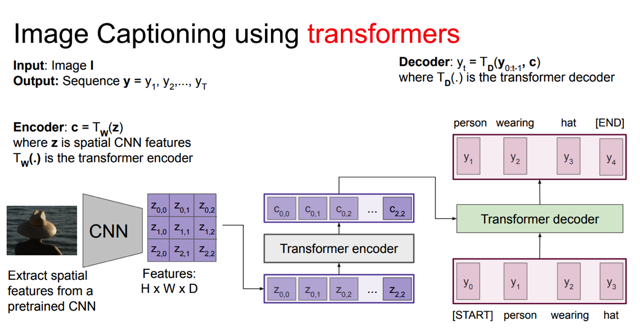</kbd></p>

<p align="center"><kbd></kbd></p>

<p align="center"><kbd>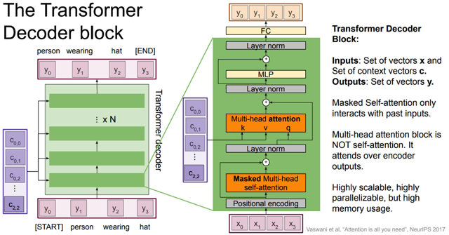</kbd></p>

> [!NOTE]
> đây, nếu đúng thật sự là Image Captioning dùng transformers thì ta cần
> features vector là tensor shape `(N,T=W*H,D),` để rồi pass vào encoder để
> được `self-attention` cho ra output `(N,T=W*H,D),` project với một linear
> transformation để thành  `(N,T=W*H,W)` với W là word embedding dimensions.
> Encoder output sẽ tham gia vào Decoder với "tư cách" là value và key trong
> `Cross-Attention` layer mà output từ các layer trước của decoder sẽ tham gia với
> tư cách queries.

> [!NOTE]
> Với decoder: input sẽ là sequence of target token id, (N,S) qua embedding
> layer chuyển thành sequence of embedding vector (N,S,W). Được add
> Positional information bởi positional encoding layer.
>
> Rồi pass vào Masked `Multi-Head` `Self-` Attention:
>
> Tại đây, mỗi input sẽ được `self-attend` với các input ở vị trí đứng trước (bao
> gồm  chính nó) trong chuỗi, mang ý nghĩa là cập nhật lại bổ sung thông tin
> context. Output sẽ được add lại skip connection, qua (dropout) và layer
> normalization trước khi joint vào "Cross Attention" ở "vai trò" queries như nói ở
> trên.
>
> Thế thì nếu như trong bài, feature vector chỉ là có shape là (N,D) (sau khi project 
> được N,W) thì tức là mỗi image chỉ được đại diện bởi MỘT vector duy nhất, để rồi
> ta replicate thành T lần và pass vào Decoder cho vai trò của value và key. Thì có
> thể thấy, các query vector khác nhau nhưng key và value đều giống nhau cả.
> Thành ra kết quả của cái Cross Attention này cơ bản cũng chỉ là cái feature vector
> được replicate T lần. Để rồi add với skip connection thì cơ bản có ý nghĩa là
> mỗi `time-step,` input được add với cùng một image feature vector để tham gia tính
> toán distribution over vocab cho next token.

<br>

<a id="node-1337"></a>

<p align="center"><kbd>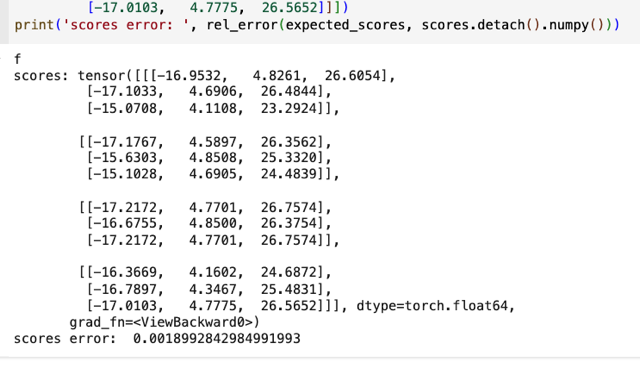</kbd></p>

<p align="center"><kbd></kbd></p>

<p align="center"><kbd>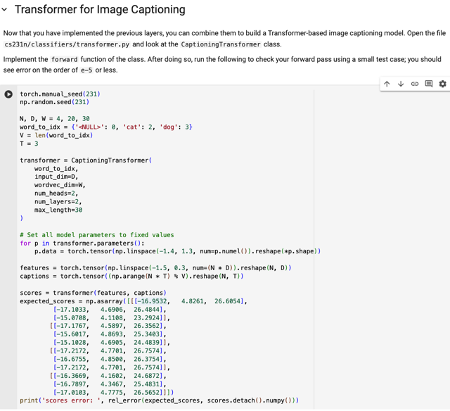</kbd></p>

> [!NOTE]
> kết quả ra đúng cho thấy đúng là ý đồ của
> họ là đơn giản hóa chỉ tập trung vào
> decoder, ko có decoder. Ta có thể quay lại
> làm một cái decoder bài bản như trong
> lecture sau khi kết thúc khóa này

<br>

<a id="node-1338"></a>

<p align="center"><kbd>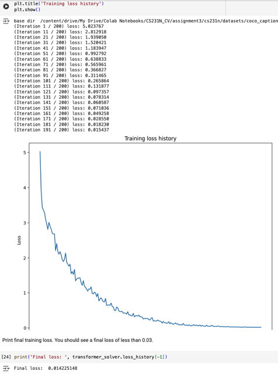</kbd></p>

<p align="center"><kbd></kbd></p>

<p align="center"><kbd>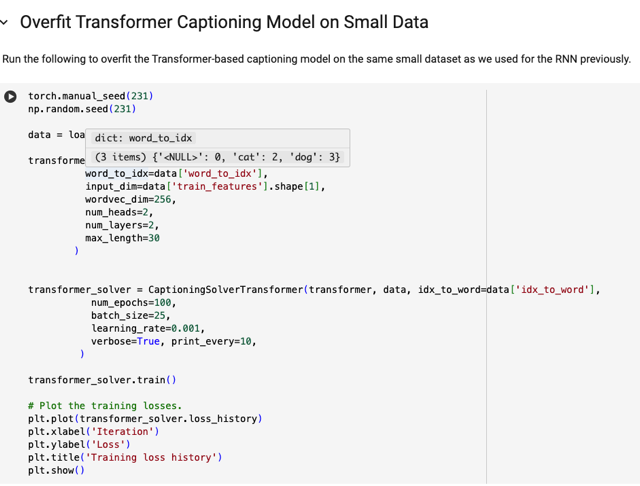</kbd></p>

> [!NOTE]
> You should see a final loss
> of less than 0.03.

<br>

<a id="node-1339"></a>

<p align="center"><kbd>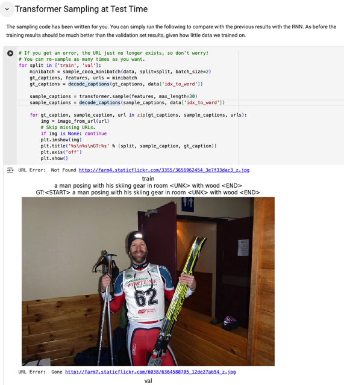</kbd></p>

<br>

