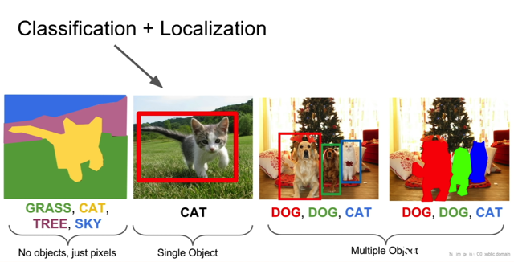
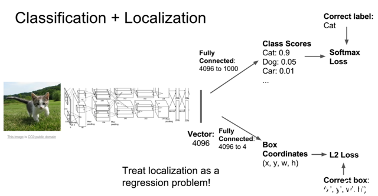
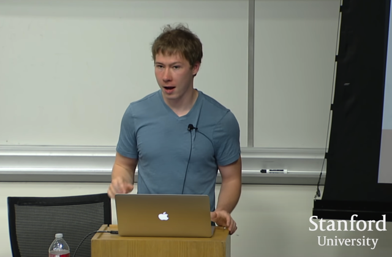
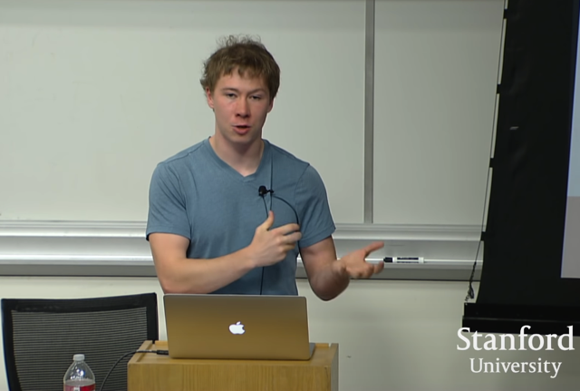
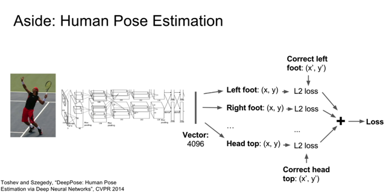
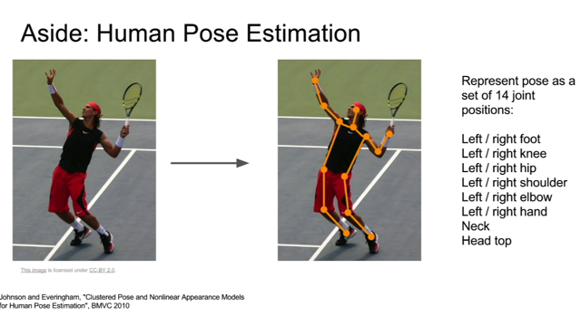

# Classification + Localization

📊 **Progress:** `8` Notes | `8` Screenshots

---

<kbd></kbd>

> [!NOTE]
> qua bài toán mở rộng thứ hai (mở rộng từ bài toán truyền thống
> classification) là classification `+` localization.
>
> Trong đó ta muốn classify đồng thời predict một bounding box quanh
> object.
>
> Bài toán này khác với object detection ở chỗ: Ta **giả định rằng  mình đã
> biết trước là sẽ có một hoặc vài object trong image** mà mình cần
> classify cũng như vẽ bounding box.

> [!NOTE]
> the distinction here between this and object detection is that in the
> localization scenario **you assume ahead of time that you know there's
> exactly one object in the image that you're looking for** or **maybe more
> than one** but you **know ahead of time** that we're going to make some
> classification decision about this image and we're going to produce
> exactly one bounding box that's going to tell us where that object is
> located in the image

 

<kbd></kbd>

> [!NOTE]
> đại khái là trong bài toán này, ta cũng tận dụng phần lớn một classification
> model như đã biết tới giờ (ý nói, những bài toán mở rộng từ bài toán gốc 
> classification đều kiểu như có thể giải quyết bằng cách chỉnh sửa đôi chút
> các mô hình classification)
>
> Cụ thể ở đây, output qua CNN, mà last layer cho ra một vector ví dụ như ở
> đây là fc7 của VGG16, cho ra vector 4096 unit, thì như bài toán classification
> nó sẽ qua một linear layer output ra 1000 class scores. Thì ở đây, nó sẽ cho
> qua thêm một linear layer nữa map nó với 4 scalar của bounding box.
>
> Tức là nó sẽ có 2 output. Và ứng với output 1 dùng cross entropy loss như
> cũ. Còn với output 2 thì dùng L2 loss (chính là MSE) hay L1 loss (MAE) của
> bài toán regression.

 

<kbd></kbd>

> [!NOTE]
> câu hỏi là: Liệu làm như vậy, bắt model predict cùng lúc class và bounding 
> box liệu có hiệu quả không. 
>
> Justin: Đại khái là đây là một cách làm mà có thể mang lại hiệu quả nhất 
> định. Tuy nhiên người ta có thể làm cho nó phức tạp hơn một chút ví dụ
> như thay vì chỉ predict ra một bounding box, người ta cho predict ra mỗi
> class một bounding box, và chỉ apply loss đối với bounding box tương ứng
> với correct class. Và nó thể mang lại hiệu quả hơn

 

<kbd></kbd>

> [!NOTE]
> câu hỏi khác đại khái là bây giờ có 2 loss, có khi nào gradient của một cái
> dominate cái kia không (giống như một cái có giá trị lớn khiến model chỉ
> ưu tiên cái đó mà phớt lờ cái kia)
>
> Justin: Đúng vậy, nên ta sẽ có kiểu như các trọng số như một dạng h.p 
> để weighted sum hai cái loss này. Tuy nhiên vì h.p này có thể trực tiếp
> thay đổi loss nên việc chọn ra weight khá là khó khăn.
>
> Nên giải pháp Justin đề nghị là dùng một metric khác mà ta quan tâm
> trong quá trình cross validation để chọn weight thay vì dùng validation loss.

 

<kbd></kbd>

> [!NOTE]
> câu hỏi khác đại khái là tại sao không fixed một cnn rồi train hai fc layer
> riêng lẻ cho hai đầu ra (classification và bounding box)
>
> Justin: Thật ra có người làm vậy, và đó cũng là thứ mà bạn nên thử khi gặp
> tình huống này. Tuy nhiên, nói qua của transfer learning thì có một nguyên
> tắc chung là, ta sẽ thu được hiệu quả cao hơn nếu như có thể train cả
> system (ý nói, train lại pretrained layer với các điều chỉnh cho bài toán mới).
> Và cách làm thường được cho là có hiệu quả tốt đó là ta sẽ freeze các
> pretrained layer và train các new layer cho đến khi converge. Sau đó
> unfreeze các pretrained layer và train tiếp cả hệ thống

> [!NOTE]
> Yeah, so the question is why don't we fix the big network and then just only
> learn separate fully connected layers for these two tasks? People do do that
> sometimes and in fact that's probably the first thing you should try if you're
> faced with a situation like this but in general whenever you're doing transfer
> learning 38:54 you always get better performance if you fine tune the whole
> system jointly because there's probably some mismatch between the
> features, if you train on ImageNet and then you use that network for your
> data set you're going to get better performance on your data set if you can
> also change the network. 39:09 But one trick you might see in practice
> sometimes is that you might freeze that network then train those two things
> separately until convergence and then after they converge then you go back
> and jointly fine tune the whole system. So that's a trick that sometimes
> people do in practice in that situation.

 

<kbd></kbd>

<kbd></kbd>

<kbd></kbd>

> [!NOTE]
> mở rộng ra, ta hoàn toàn có thể làm các bài toán tương tự như Human
> Pose Estimation. Trong đó ta sẽ dự đoán các vị trí của các pose
>
> Và có thể thấy trong bài toan này chỉ dùng regression loss.

 

