# Eecs498-007 Lecture 17: 3d Vision

📊 **Progress:** `49` Notes | `61` Screenshots

---
<a id="node-1775"></a>

<p align="center"><kbd>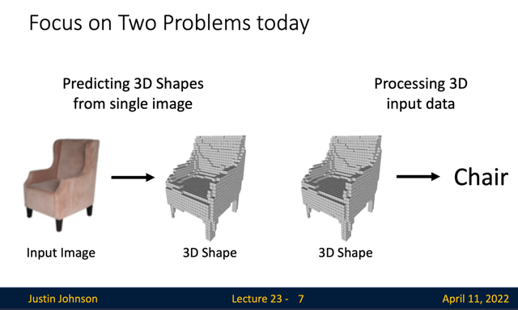</kbd></p>

> [!NOTE]
> Đại khái là Justin sẽ nói về 2 vấn đề trong bài ngày hôm nay, là dừng
> deep learning model để dự đoán 3D shape từ một single image. Và
> ingest 3D information gì đó.

<br>

<a id="node-1776"></a>

<p align="center"><kbd>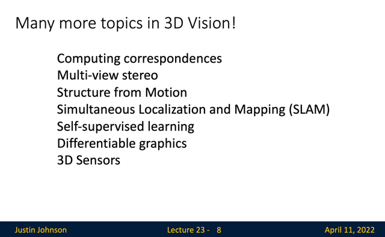</kbd></p>

> [!NOTE]
> Nhưng Justin lưu ý ta rằng đây là lĩnh vực khá rộng mà trong course
> này không cover hết được.

<br>

<a id="node-1777"></a>

<p align="center"><kbd>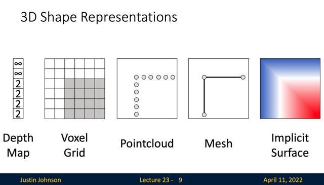</kbd></p>

> [!NOTE]
> cuối bài ta sẽ hiểu 5 cách
> thức represent 3D

<br>

<a id="node-1778"></a>

<p align="center"><kbd>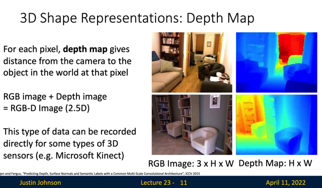</kbd></p>

> [!NOTE]
> Cái đầu tiên là Depth Map, đơn giản là với mỗi pixel, ta sẽ có một giá trị
> thể hiện khoảng cách của nó tới camera tính bằng mét. Để rồi với bức
> hình RGB, mà ta coi như 3 matrix ứng với 3 channel Red, Green, Blue
> stack lại, thì giờ đây ta có thêm một lớp nữa để thể hiện depth. Tạo thành
> `RGB-D` image. 
>
> Vấn đề là với cái này, nếu một object ở đằng xa bị che (occluded) bởi một
> cái gì đó gần hơn đứng đằng trước, thì Depth Map sẽ chỉ thể hiện được
> phần không bị che thôi. Thành ra người ta mới coi cái này chỉ như 2.5D 
> chứ không hoàn toàn là 3D
>
> Một lí do khiến cái này quan trọng là bởi ta có thể có được dữ liệu theo 
> dạng này từ một số thiết bị như Microsoft Kinect.

<br>

<a id="node-1779"></a>

<p align="center"><kbd>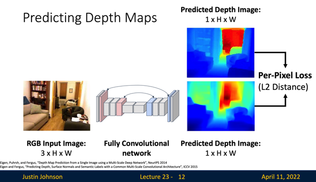</kbd></p>

> [!NOTE]
> Đại khái là ta có thể train một mô hình Fully Convolutional Network để
> predict depth map. Ví dụ như dùng kiến trúc `U-net` như dùng trong bài toán
> Semantic Segmentation, nơi ta sẽ predict class của mỗi một pixel, thì ở bài
> toán này ta sẽ predict "depth" của mỗi pixel. Nên input là image, với target
> là ground truth `depth-map` của bức ảnh đó (trong slide ghi nhầm) để rồi
> predict ra output là một matrix WxH, với các giá trị bất kì từ `0-infinity.` Và vì
> đây là bài toán regression nên loss ta sẽ dùng L2 distance.

<br>

<a id="node-1780"></a>

<p align="center"><kbd>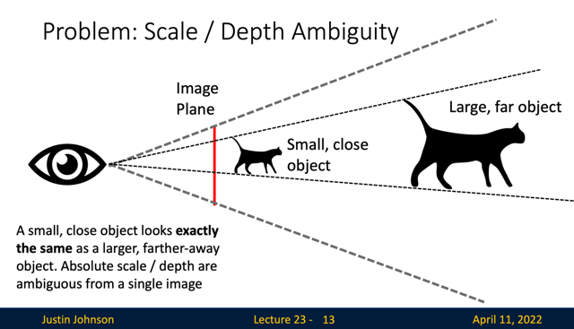</kbd></p>

> [!NOTE]
> Thế nhưng cách làm tạm gọi là cơ bản như vừa mô tả không hiệu quả, vì
> một vấn đề đối với cái vụ 3D này đó là hiện tượng một object nhỏ mà ở
> gần sẽ cũng trông giống một object to mà ở xa. Gọi là vấn đề
> `Scale/Depth` Ambiguity

<br>

<a id="node-1781"></a>

<p align="center"><kbd>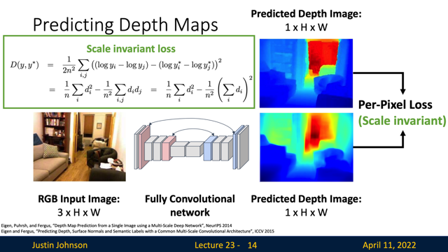</kbd></p>

> [!NOTE]
> có một cách rất tốt để giải quyết vấn đề này đó là người ta dùng Scale
> invariant loss (thay vì L2 distance loss). Để hiểu ưu điểm của cái loss
> này, Justin đề nghị ta đọc Paper.

<br>

<a id="node-1782"></a>

<p align="center"><kbd>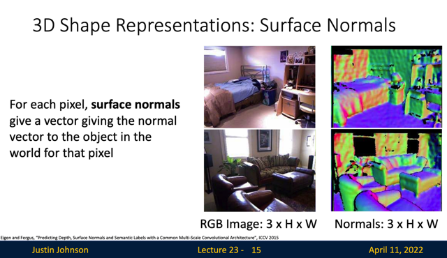</kbd></p>

> [!NOTE]
> Một thể loại khác là surface normal đại khái là ở mỗi pixel, surface
> normals sẽ gán một vector thể hiện hướng của object tại pixel đó trong
> đời thực.
>
> Ví dụ các pixel "của cái mặt giường, mặt sàn" được gán màu tím, thể
> hiện là nó hướng lên trên. Còn vách tường, cái tủ có màu xanh lá thể
> hiện hướng của nó sang trái (đại khái là vậy)
>
> Để rồi từ đó ta có thể train một deep learning model dự đoán hướng
> của từng pixel.

<br>

<a id="node-1783"></a>

<p align="center"><kbd>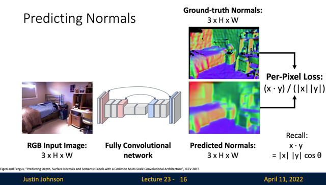</kbd></p>

> [!NOTE]
> để train model thì cũng như trên thôi, input vào Unet image 3xHxW
> (RGB image), target là ground trình surface normals là tensor 3xHxW
> (chú ý depth là 3 là bởi tại mỗi pixel là một 3D basiss vector thể hiện
> hướng của object tại pixel đó).
>
> nên output của model cũng là tensor 3xHxW. Và loss cũng sẽ là
> `per-pixel` loss, với công thức ta sẽ dùng cosine cuả hai vector `=` x.y `/`
> (|x|.|y|) (Vì sao dùng cosine: hai vector trùng nhau thì cosine sẽ `=` 0)
>
> Và ta có thể trainmột model để cùng một lúc vừa làm nhiệm vụ
> segmentation, predict depth map và surface normal

<br>

<a id="node-1784"></a>

<p align="center"><kbd>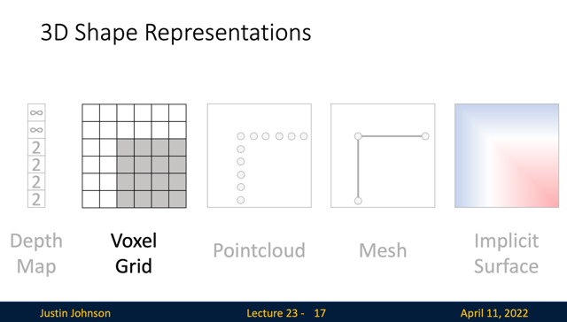</kbd></p>

<br>

<a id="node-1785"></a>

<p align="center"><kbd>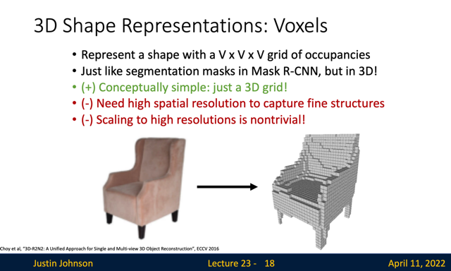</kbd></p>

> [!NOTE]
> Cách representation một object theo 3D thứ hai là Voxels grids `-` đơn
> giản là ta define một 3D grid, trong đó mỗi item trong grid sẽ mang giá
> trị 0 hoặc 1 để biểu thị "khoảng trống" hoặc "object", từ đó giúp biểu
> diễn object ở dạng 3D.
>
> Thế thì nó có nhược điểm thế này: để kiểu như có thể biễu diễn một
> cách chi tiết, ví dụ như cái ghế bên trái, muốn "thể hiện" được sự mượt
> mà của các đường cong, thì dễ hiểu rằng voxels grid bên phải phải có
> các unit, rất nhỏ, hay nói cách khác 3d grid phải rất dày đồng nghĩa
> dimension phải rất lớn.
>
> Từ đó nếu muốn có độ phân giải cao thì ta sẽ tốn kém rất lớn về tính
> toán.

<br>

<a id="node-1786"></a>

<p align="center"><kbd>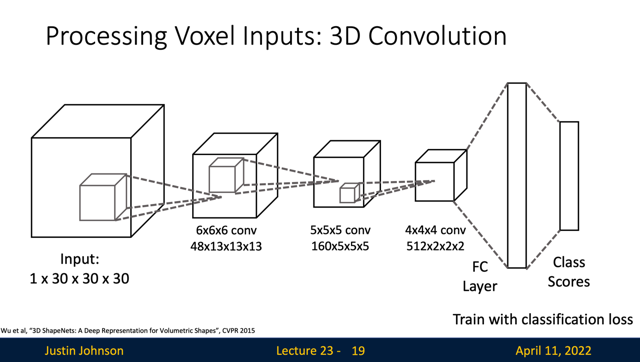</kbd></p>

> [!NOTE]
> Xong nói qua việc với cách representation này, việc xử lý dạng data này
> tương đối đơn giản. Ví dụ như nếu muốn train một neural net để có thể
> classify một voxels input, chỉ cần sử dụng 3D convolution.
>
> Input, như đã nói sẽ là voxels grid 1xHxWxD, dài x rộng x sâu, mỗi
> phần tử mang giá trị binary 1 or 0 thể hiện tại đó "có object hay là chỗ
> trống" hay "trạng thái có bị lấp đầy hay không" (occupancy)
>
> Thì input sẽ được convolve bởi các 3D filters, để ra các "3D feature
> cube" (thay vì 2D feature map) (H',W',D'). Mỗi filter cho ra một cái thì
> Bao nhiêu filter thì bấy nhiêu cái.
>
> Để rồi stack các output của mỗi filter lại thành 4D tensor (no. filter,H',W',
> D') để rồi các layer cuối cũng flatten để qua FC layer và output layer có
> `num_classes` class scores.
>
> Và ta sẽ train nó với classification loss bình thường
>
> `===`
>
> *Lưu ý là chỉ input là có giá trị binary, còn các filter thì mang giá trị real value
> bình thường (dù điều này ta thấy là đương nhiên nhưng có bạn hỏi chỗ này)

<br>

<a id="node-1787"></a>

<p align="center"><kbd>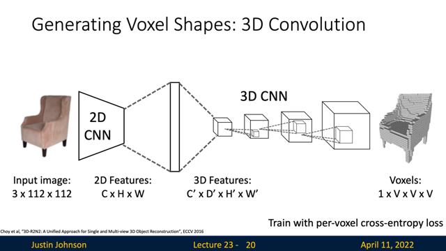</kbd></p>

> [!NOTE]
> Bài toán thứ hai là train nn để predict voxels shape từ 2D image.
>
> Input sẽ là image RGB bình thường (3xHxW), và output sẽ là 4D tensor
> 1xVxVxV mang giá trị dự đoán là xác suất một grid cell trong 3D grid là
> có occupancy hay không? (Occupancy probability)
>
> Thế thì, kiến trúc cũng dễ hình dùng sẽ là 2D CNN để xử lý 2D input
> (chỉ tính spatial size) trước khi flatten qua vài FC trung gian rồi reshape
> thành 3D (spatial size) để xử lý tiếp với các Conv3D
>
> Và với output như vậy, ta có thể hình dùng rằng sẽ cùng với ground truth 
> occupancy, cũng là một tensor 1xVxVxV chứa các giá trị binary, tham gia
> t.ính loss dùng binary cross entropy loss.

<br>

<a id="node-1788"></a>

<p align="center"><kbd>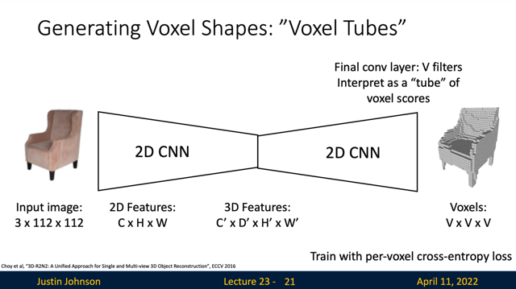</kbd></p>

> [!NOTE]
> Vấn đề là kiến trúc vừa rồi rất tốn kém về tính toán vì 3D convolution rất
> tốn kém so với 2D convolution.
>
> Cách làm để khắc phục chuyện này đó là cứ dùng conv2D, nhưng layer
> cuối với spatial size là VxV và có V channels để output là tensor VxVxV.
>
> Để rồi, ta coi channels dimension như depth dimension. Có thể hiểu như
> vầy, đúng ra thì trong bài toán này, như khi dùng 3D convolution, thì depth,
> sẽ là một spatial dimension nữa bên cạnh width và height. Khi đó, giả sử
> qua một conv3D có 10 filter thì output là 10xDxHxW `-` mỗi filter cho ra một
> cube output DxHxW. Còn ở cách làm này, ta lại coi số filter như depth.
> Thì hệ quả của nó như trong câu hỏi mà một anh bạn đặt ra ở dưới đây..
>
> Q: Làm vậy thì ta bị mất gì khi so với 3D conv
>
> A: Mất đi tính chất translational invariance trong z dimension: Đại khái có
> nghĩa là, nhớ lại khi dùng conv2d thì một ưu điểm của nó đó là translational
> invariance, `-` giả sử có một con mèo trong bức hình, thì dù nó ở vị trí nào
> (ám chỉ spatial dimension H,W) thì khi kiểu như "quét" dọc ngang bức hình
> thì nó cũng sẽ phát hiện ra. Tương tự như vậy, trong bài toán 3d, thì nếu trong
> một input 3D có một con mèo 3D, thì dù con mèo 3D nằm ở chỗ nào trong cái
> "hộp" input 3D, thì khi filter 3D "quét" khắp cái hộp nó cũng sẽ phát hiện ra.
> Đó là tính chất translational invariance.
>
> Nhưng với cách làm 2D ở đây, tính chất này không còn nữa.

<br>

<a id="node-1789"></a>

<p align="center"><kbd>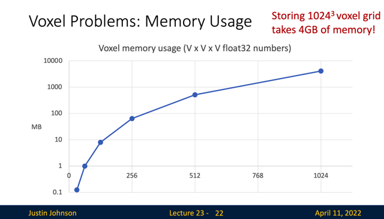</kbd></p>

> [!NOTE]
> vấn đề của cách represent theo kiểu voxel đó khả năng scalability của nó
> vì rất tốn memory, ví dụ như chỉ với spatial size 1024 thì ta có 1024^3 con
> số, với 32 bit một số thì tổng cộng cần 4GB

<br>

<a id="node-1790"></a>

<p align="center"><kbd>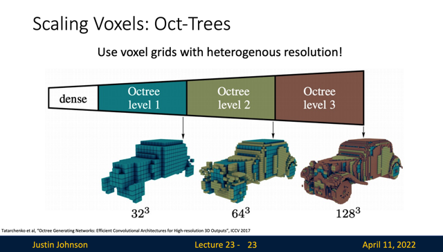</kbd></p>

> [!NOTE]
> một cách làm giống như trick để có thể tạm gọi là khắc phục vấn đề
> memory đó là, họ làm với các mức độ dense khác nhau nhưng chỉ
> lấy một phần thôi rồi trộn lại.
>
> Nói chung Justin không nói rõ cái này, chỉ biết là cách làm này có
> tính chất không đơn giản

<br>

<a id="node-1791"></a>

<p align="center"><kbd>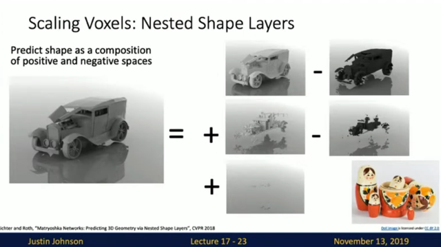</kbd></p>

<br>

<a id="node-1792"></a>

<p align="center"><kbd>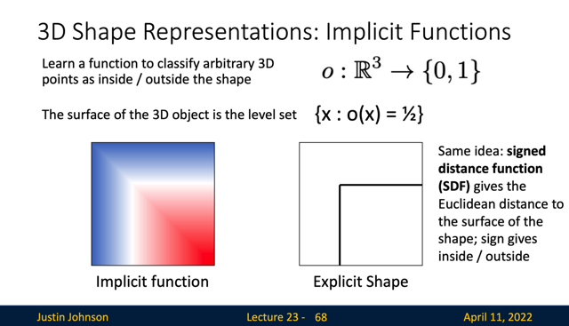</kbd></p>

> [!NOTE]
> Cách 3D representation Implicit function đại khái là: Ta sẽ learn một
> Function có khả năng nhận vào một 3D coordinate `-` vector thể hiện
> tọa độ của một điểm trong không gian 3D, và function sẽ tính toán ra
> "xác suất điểm đó bị occupied bởi object, tức là xác xuất tại điểm đó
> là `/` thuộc object" `-` đương nhiên nó sẽ là giá trị trong range [0:1]
>
> Để rồi, ta sẽ có thể xem cái vùng mà tại đó xác suất occupancy `=` 0.5
> như lớp vỏ ngoài của object.
>
> Có thể có một cách thể hiện khác nhưng cùng ý tưởng đó là "signed
> distance function" trong đó ta sẽ train function tính ra một giá trị 
> thể hiện khoảng cách từ điểm đó đến bề mặt của object, thì nếu âm
> thể hiện nó nằm trong object, nếu dương thì thể hiện nó nằm ngoài
> object. Và càng dương thì càng "ở ngoài". Cơ bản cũng cùng ý tưởng
> với Implicit function trên thôi

<br>

<a id="node-1793"></a>

<p align="center"><kbd>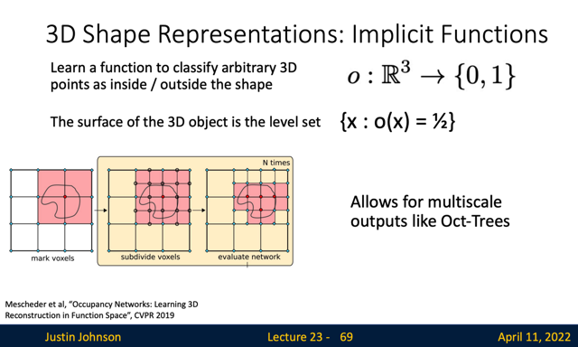</kbd></p>

> [!NOTE]
> nói chung Justin cũng không đi vào chi tiết cách làm này, vì các
> bước xử lý của nó khá phức tạp. Nhưng ý tưởng chính đó là khi
> ta đã (dùng neural network) để learn được một function như
> vậy, thì khi muốn dùng nó để xây dựng hình ảnh 3D của object,
> ta sẽ thực hiện nhiều lần sampling, cũng như những bước hậu
> xử lý

<br>

<a id="node-1794"></a>

<p align="center"><kbd>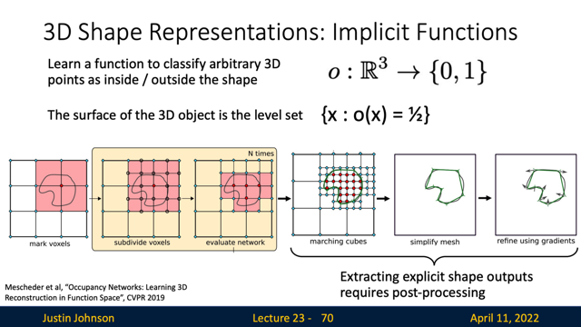</kbd></p>

<br>

<a id="node-1795"></a>

<p align="center"><kbd>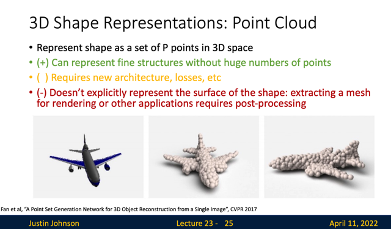</kbd></p>

> [!NOTE]
> đại khái là cách 3D representation Point Cloud, như tên gọi `-` "Đám mây điểm",
> một 3D object sẽ được represent bởi một set các point. Mỗi point đương nhiên
> là 3 giá trị coordinates thể hiện vị trí trong 3D space.
>
> Cách làm này có ưu điểm hơn Voxel grids đó là khi cần represent bề mặt chi
> tiết (fine surface) thì chỉ cần thêm nhiều point ở vùng đó, ngược lại, với những
> bề mặt không chi tiết, thì chỉ cần ít point hơn. So sánh với voxel grids có tính
> chất là khi muốn represent chi tiết thì cần dimension tăng lên
>
> Một nhược điểm của cái này đó là theo lí thuyết, thì mỗi point chỉ có kích thước
> vô cùng nhỏ (infinitely small) nhưng đại khái là như vậy thì ta không làm được,
> nên phải biểu diễn nó như một trái banh. Thành ra khi muốn có được "bề mặt"
> thật sự của object, ta phải thực hiện quá trình `post-processing` nào đó.

<br>

<a id="node-1796"></a>

<p align="center"><kbd>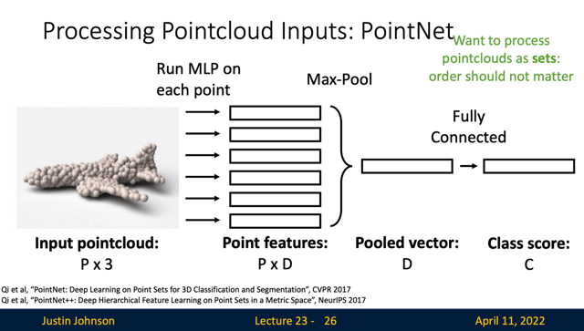</kbd></p>

> [!NOTE]
> đại khái là nói về một kiến trúc nn mới được thiết kế để process input có
> dạng là Point Cloud. Mỗi object như đã nói, là một point cloud `=` một set
> (size `=` P) các point `-` là 3D vector chứa 3 gía trị coordinates.
>
> Vậy đầu tiên mỗi point sẽ được xử lý riêng lẻ với một MLP để biến 3d
> input thành `D-d` feature vectors. Để từ (P,3) input thành (P,D) features.
>
> Tiếp, ta sẽ dùng `max-pooling` để xử lý cái (P,D) features này trở thành (1,D)
> pooled feature. Và tiếp tục dùng nó trong mô hình nn thông thường để map
> nó với vector có C class scores.
>
> Vậy chú ý ở chỗ, theo lí thuyết, thì rõ ràng là ta không quan tâm thứ tự của
> mấy cái point như thế nào, vì một đám mây các point thì quan tâm thứ tự
> làm gì đâu. Nên trong PointNet, ta dùng `Max-Pool` để chuyển PxD feature 
> Thành 1xD vector chính là bởi khi max, chính là mình đã không quan tâm đến
> thứ tự.
>
> Justin nói thêm mô tả ở đây chỉ là đơn giản hóa bớt chỉ thể hiện ý chính, 
> thực tế có thể phức tạp hơn

<br>

<a id="node-1797"></a>

<p align="center"><kbd>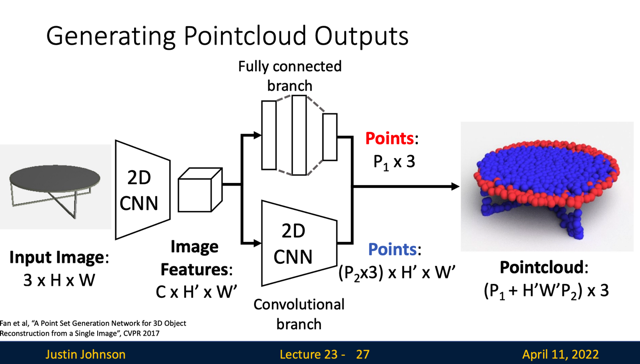</kbd></p>

> [!NOTE]
> nói qua bài toán khác, build nn để nó từ 2D image, dự đoán ra pointcloud.
>
> Justin tạm bỏ qua để nói về loss function cho bài toán này trước.

<br>

<a id="node-1798"></a>

<p align="center"><kbd>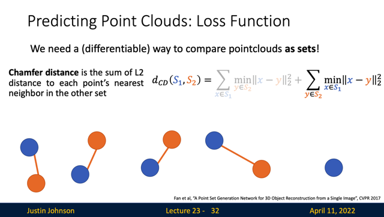</kbd></p>

<p align="center"><kbd></kbd></p>

<p align="center"><kbd>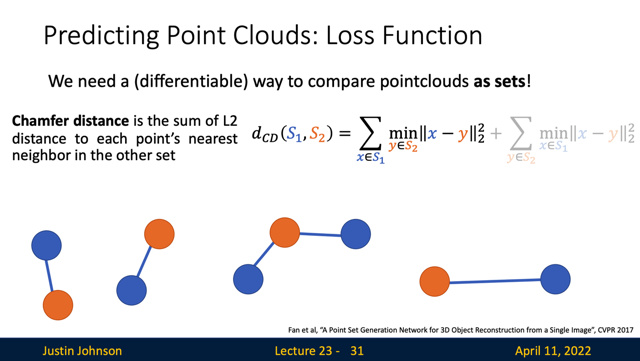</kbd></p>

> [!NOTE]
> Điểm thú vị của cái này chính là ta sẽ define một "loại" loss function mới
> để nắm bắt sự sai khác giữa hai point cloud, đặng khi giảm loss, hai đám
> đó (giữa predicted point clouds và target point clouds) trùng nhau
>
> Đó là Chamfer loss: có hai vế, một là: với mỗi một điểm của đám thứ nhất
> (Gọi là Blue cloud) ta sẽ xem khoảng cách (L2 distance) nhỏ nhất của nó 
> với những điểm của Orange cloud là gì, nói cách khác, ta sẽ tìm nearest
> neighbor của blue point đó trong các orange points và lấy l2 distance.
> Làm vậy với mọi blue point và cộng hết các distance lại.
>
> Term hai làm ngược lại, với mỗi orange point, khoảng cách nhỏ nhất của
> nó với một blue point là gì, rồi cộng lại hết.
>
> Thế thì ý nghĩa của Chamfer loss là, nó sẽ chỉ `=` 0 nếu hai đám mây này
> có các điểm hoàn toàn trùng nhau.
>
> Một điểm cần chú ý nữa đó là việc tính loss có thể thấy hoàn toàn không
> quan tâm gì thứ tự của các point, tuân thủ theo nhận định hồi nãy rằng
> thứ tự các point không quan trọng.

<br>

<a id="node-1799"></a>

<p align="center"><kbd>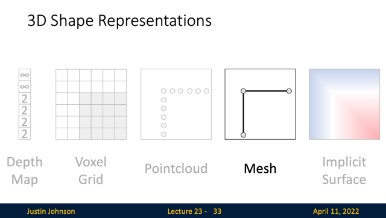</kbd></p>

<br>

<a id="node-1800"></a>

<p align="center"><kbd>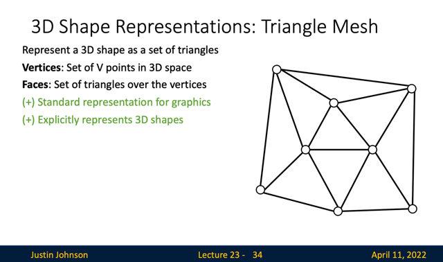</kbd></p>

> [!NOTE]
> cách cuối cùng là Triangle Mesh, đại khái là, cũng represent bởi các điểm
> như trong point clouds nhưng nó có thêm các tam giác nối các đỉnh.
>
> Cái này rất thông dụng `-` là cách thể hiện tiêu chuẩn trong graphics. Và
> Ưu điểm của nó là nó trực tiếp thể hiện hình dáng 3D.

<br>

<a id="node-1801"></a>

<p align="center"><kbd>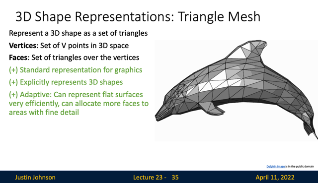</kbd></p>

> [!NOTE]
> Nó cũng có tính chất adaptive `-` khi có thể biểu diễn các bề mặt phẳng rất 
> hiệu quả cũng như có thể chỉ định nhiều miếng tam giác nhỏ hơn khi cần
> thể hiện các vùng có chi tiết phức tạp

<br>

<a id="node-1802"></a>

<p align="center"><kbd>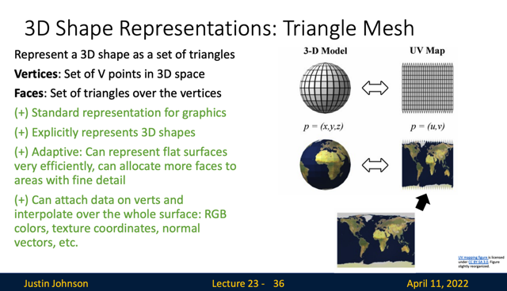</kbd></p>

> [!NOTE]
> có nhiều ưu điểm là vậy nhưng để build nn có thể represent
> object với cái này không đơn giản

<br>

<a id="node-1803"></a>

<p align="center"><kbd>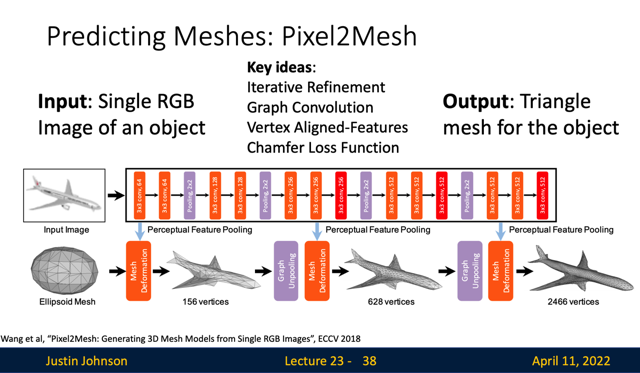</kbd></p>

> [!NOTE]
> một nhóm nghiên cứu đề xuất Pixel2Mesh, một mô hình có thể nhận
> input là 2D image và predict ra 3D Mesh của object

<br>

<a id="node-1804"></a>

<p align="center"><kbd>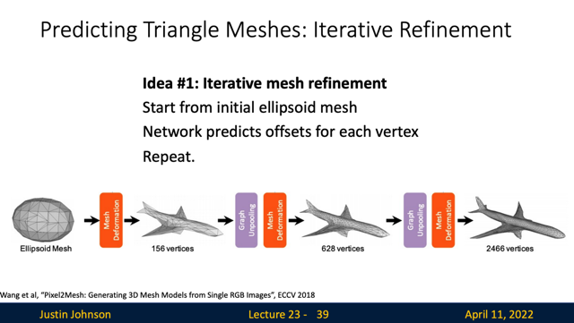</kbd></p>

> [!NOTE]
> Đại khái ý tưởng thú vị thứ nhất của Pixel2Mesh đó là model sẽ bắt
> đầu với một cái form, ví dụ như cái mesh hình Elip, nó sẽ predict các
> offsets đối với các đỉnh `(vertex/vertices)` của mesh, đặng so sánh với
> input image. Và quá trình này lặp lại cho đến khi được một mesh "nhìn
> giống" với image.

<br>

<a id="node-1805"></a>

<p align="center"><kbd>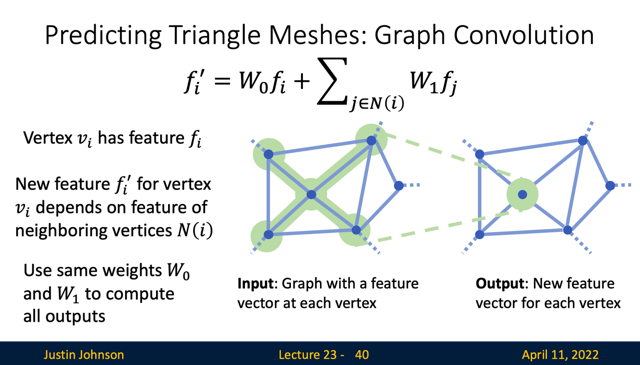</kbd></p>

> [!NOTE]
> đầu tiên, hiểu phép Graph convolution là gì đã: Thì đại khái là thế này, ta có
> một graph, là các điểm (hay đỉnh, vertex) nối với nhau thành các tam giác
> như đã nói, thế thì mỗi một điểm i sẽ có một feature vector `f_i.`
>
> Điểm i đương nhiên sẽ có các neighbor kí hiệu bọn nó là N(i).
>
> Việc tính convolution là ta sẽ tính một feature vector mới cho đỉnh i, kí hiệu là
> f'_i theo công thức `=` W0*feature vector cũ của i `+` tổng W1*feature vector của
> các bạn hàng xóm của i.
>
> Ta gọi phép tính này là convolution là bởi vì, với mọi điểm khác trong mess, ta
> cũng áp dụng cùng phép tính như vậy để tính ra feature vector mới, giống
> như trong 2D convolution, với mọi vị trí spatial, ta đều thực hiện tính toán với
> cùng bộ giá trị của filter để tính ra output là feature value mới

<br>

<a id="node-1806"></a>

<p align="center"><kbd>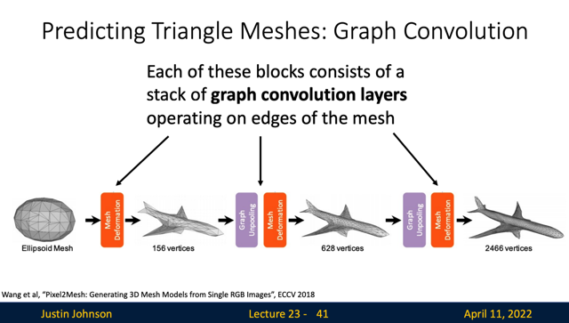</kbd></p>

> [!NOTE]
> và Pixel2Mesh sẽ sử dụng các block
> mỗi block bao gồm stack các **graph
> convolution layers**

<br>

<a id="node-1807"></a>

<p align="center"><kbd>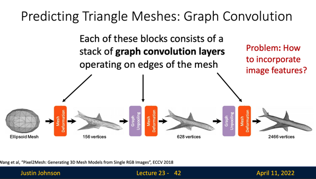</kbd></p>

> [!NOTE]
> Đặt vấn đề là ta cần tích hợp image feature (thông tin trong cái
> hình 2D ban đầu) vào Graph Convolution

<br>

<a id="node-1808"></a>

<p align="center"><kbd>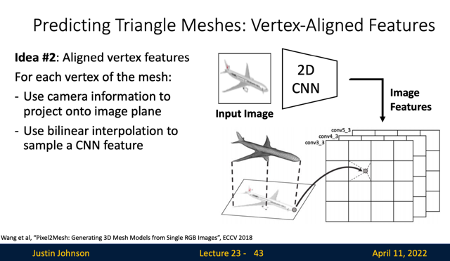</kbd></p>

> [!NOTE]
> Ok, ý tưởng là ta dùng cnn xử lý 2D image để có features. Sau đó,
> dùng phương pháp camera intrinsic gì đó để nôm na là chiếu
> (project) cái mesh (các đỉnh của nó) xuống feature map, tương tự
> như khi trong `Fast-RCNN` project cái Proposal Region (tạo bởi các
> thuật toán region proposal như Selective Search) lên feature map
> vậy.

<br>

<a id="node-1809"></a>

<p align="center"><kbd>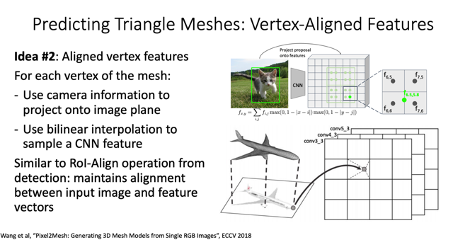</kbd></p>

> [!NOTE]
> Từ đó ta mới dùng bilinear interpolation (như ROI Align làm) để "tính ra"
> giá trị của feature vector của cái vị trí của cái đỉnh sau khi chiếu xuống.
>
> Và mình sẽ dùng feature vector này, để kết hợp với feature vector tính
> bởi graph convolutional network, mang ý nghĩa là cho phép ta mix image
> feature vào.

<br>

<a id="node-1810"></a>

<p align="center"><kbd>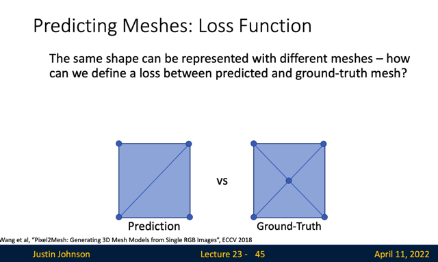</kbd></p>

> [!NOTE]
> vấn đề của loss function cho cái này đó là làm sao, giả sự
> model predict ra một cái mesh tuy khác so với ground truth
> mesh nhưng vẫn là thể hiện cùng một thứ (như hai miếng
> tam giác của prediction và 4 miếng cuả gt vẫn là cùng thể
> hiện một hình vuông)

<br>

<a id="node-1811"></a>

<p align="center"><kbd>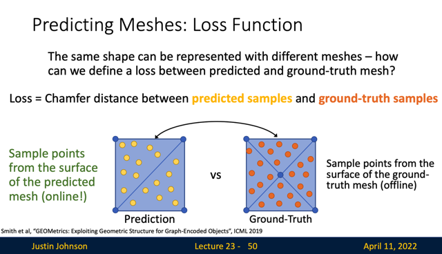</kbd></p>

> [!NOTE]
> Người ta sẽ làm như vầy, sampling các point từ gt mesh, và sampling các
> điểm từ predicted mesh, rồi dùng Chamfer loss để tính.
>
> Thế thì vấn đề là, với gt mesh, ta có thể sampling sẵn, tức làm làm offline.
> còn với predicted mesh, việc sampling sẽ làm online, tức là xảy ra khi quá
> trình training đang diễn ra. Thành ra yêu cầu đặt ra là phải có cách thức
> Sampling sao cho có tính chất differentiable để mà backprop được, Justin
> đề nghị nếu muốn tìm hiểu thì đọc paper trong slide

<br>

<a id="node-1812"></a>

<p align="center"><kbd>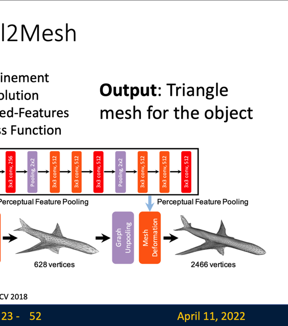</kbd></p>

<p align="center"><kbd></kbd></p>

<p align="center"><kbd>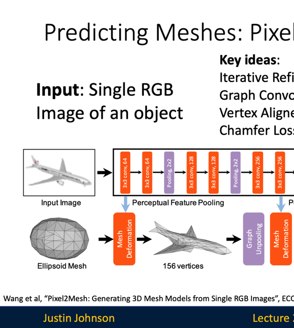</kbd></p>

> [!NOTE]
> đó là nhưng main component của Pixel2Mesh

<br>

<a id="node-1813"></a>

<p align="center"><kbd>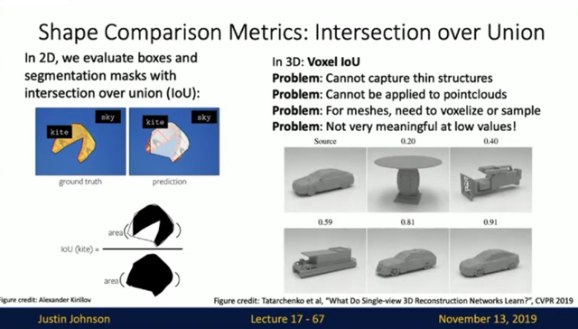</kbd></p>

<br>

<a id="node-1814"></a>

<p align="center"><kbd>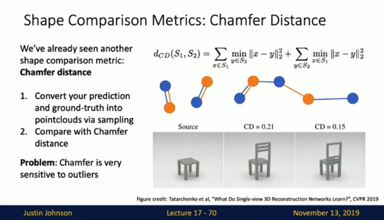</kbd></p>

> [!NOTE]
> đại khái là người ta thấy rằng dùng Chamfer distance
> thì tốt hơn là IoU, nhưng nó lại dựa vào L2 distance
> nên rất sensitive với outlier.

<br>

<a id="node-1815"></a>

<p align="center"><kbd>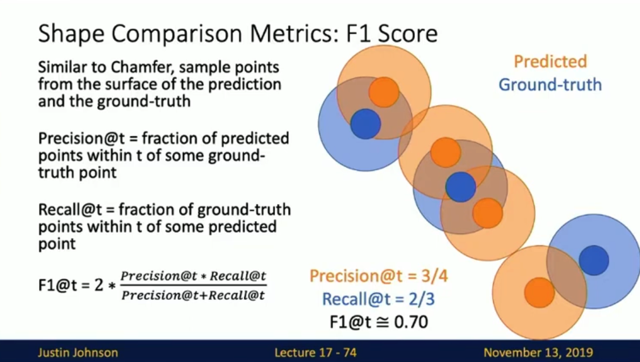</kbd></p>

> [!NOTE]
> Thay vào đó người ta dùng f1 score. Trước đó ta cũng sample các point từ
> ground truth và predicted point cloud:
>
> Để tính cái này đầu tiên ta tính Precision và Recall giống như trong bài toán
> classification.
>
> Trong đó bên classification thì công thức của **precision** là tỉ số của  True
> Positive `/` (True Positive `+` False Negative) : trong số dự đoán   là positive thì
> đúng được bao nhiêu phần trăm. Vậy trong bài toán này, ví dụ có 4 point
> trong predicted point cloud và so với ground truth point cloud thì có 3 cái
> trúng, tức là có 3 predicted point nằm  gần sát (trong một threshold nào đó)
> với các gt point `->` true positive TP `=` 3  Và 1 cái thì không sát với gt point nào
> ```text
> (tức false positive FP = 1). Thì như vậy Precision = TP / (TP+FP) = 3/4
> ```
>
> Còn recall, cũng là sensitivity (độ nhạy), đo "trong các positive sample thì
> ```text
> phát hiện được mấy cái" TP/(TP+FN). Trong ví dụ này  = 2/(2+1) = 2/3
> ```
>
> Từ đó ráp vào tính F1 score

<br>

<a id="node-1816"></a>

<p align="center"><kbd>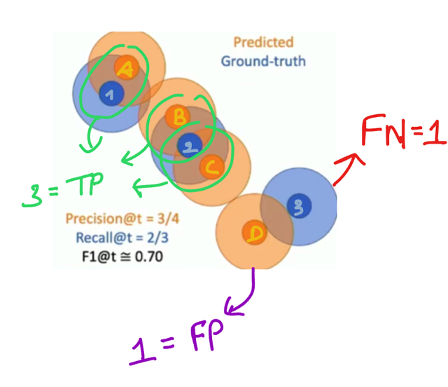</kbd></p>

> [!NOTE]
> Giải thích kĩ hơn
>
> ở ví dụ này các cặp `1-A,` `2-B,` `2-C` hai bi (point) sát nhau đạt ngưỡng nên đây là
> 3 case mà predicted point (bi A,B,C) đều đúng (vì nó đều sát với 
> một bi ground true, A hoặc B hoặc C)
>
> Bi predicted D không "trúng" với bi gt nào (với bi gt 3 không tính là
> trúng vì chưa đủ gần) nên đây là một false positive `-` dự đoán positive
> mà thật ra không phải.
>
> Bi gt số 3 không trúng với bi predicted nào, vậy nó là một false negative
> tức là coi như dự đoán không nhưng thực ra là có. Vậy FN `=` 1.

<br>

<a id="node-1817"></a>

<p align="center"><kbd>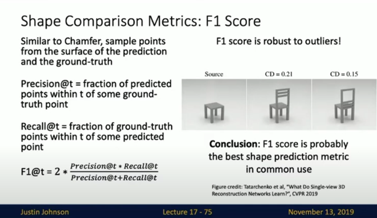</kbd></p>

> [!NOTE]
> F1 score không bị sensitive với
> outlier, và nó được cho là thước đo
> tốt nhất cho bài toán này

<br>

<a id="node-1818"></a>

<p align="center"><kbd>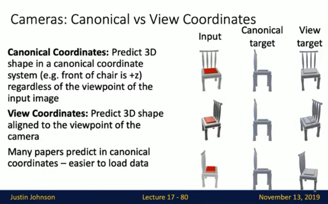</kbd></p>

> [!NOTE]
> đại ý là có 2 loại coordinates: canonical đại khái là hệ tọa độ chuẩn, ví
> dụ cho mặt trước của cái ghế luôn hướng về trục z dương.
>
> còn view coordinate đại khái là predict 3D shape tương ứng với góc
> nhìn của camera
>
> Phần lớn paper dùng canonical coordinate

<br>

<a id="node-1819"></a>

<p align="center"><kbd>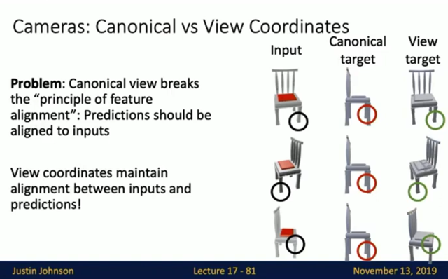</kbd></p>

> [!NOTE]
> Nhưng canonical thì lại mất đi sự
> tương ứng của feature

<br>

<a id="node-1820"></a>

<p align="center"><kbd>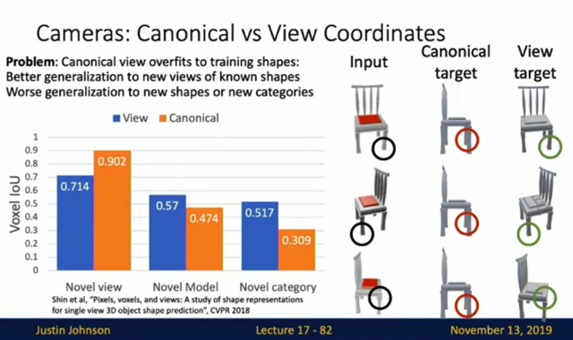</kbd></p>

> [!NOTE]
> các kết quả nghiên cứu cho thấy canonical view overfit với
> training shapes. Nên khuyên dùng view coordinate hơn

<br>

<a id="node-1821"></a>

<p align="center"><kbd>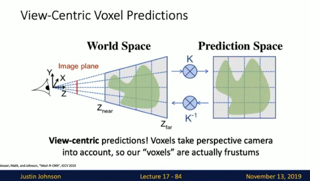</kbd></p>

<br>

<a id="node-1822"></a>

<p align="center"><kbd>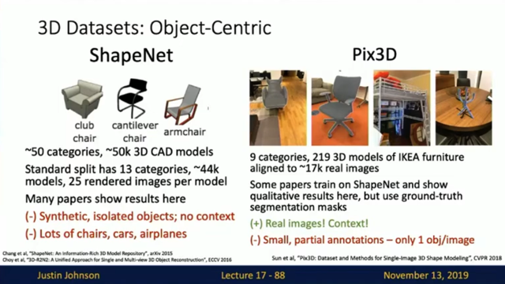</kbd></p>

> [!NOTE]
> nói sơ qua hai dataset cho bài toán này. Với ShapeNet, kiểu như nó không
> phải là những object thực tế, mà giống như là vẽ từ autocad. Nên nó phù
> hợp training model khi nó có nhiều data hơn.
>
> còn Pix3D do MIT collect. Họ dùng hình ảnh của người ta khi mua  một món
> đồ nội thất của IKEA, và mô hình mesh do IKEA publish để rồi tạo thành
> dataset. Thì đây là những object ngoài đời thực

<br>

<a id="node-1823"></a>

<p align="center"><kbd>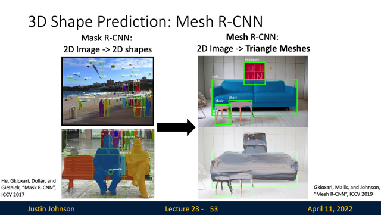</kbd></p>

> [!NOTE]
> Nói về Mesh `R-CNN,` input một image, nó sẽ detect object và semantic
> segmentation, sau đó predict ra 3D shape (triangle meshes)

<br>

<a id="node-1824"></a>

<p align="center"><kbd>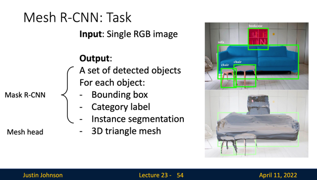</kbd></p>

> [!NOTE]
> cơ bản nó là Mask RCNN với thêm
> Mesh head để predict 3D shape

<br>

<a id="node-1825"></a>

<p align="center"><kbd>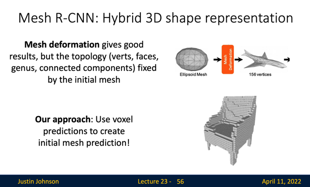</kbd></p>

> [!NOTE]
> ở đây họ kết hợp ưu điểm của cả Mesh và Voxels. Vì Mesh, như cách làm
> của Pixel2Mesh có nhược điểm làm dựa trên việc dự đoán một chuỗi các
> bước deformation để biến một Initial mesh thành ra dạng mong muốn. Thì
> cái này nó bị một vấn đề là nếu initial mesh tạm gọi là khác loại với cái
> mesh mong muốn thì không có cách nào deform ra được. Ví dụ nôm na là
> nếu dùng cái Ellipsoid mesh thì không thể deform thành hình Donut được.
>
> Do đó, trong Mesh RCNN, người ta predict ra voxel shape trước, rồi từ đó
> dùng nó làm initial mesh cho bước deformation

<br>

<a id="node-1826"></a>

<p align="center"><kbd>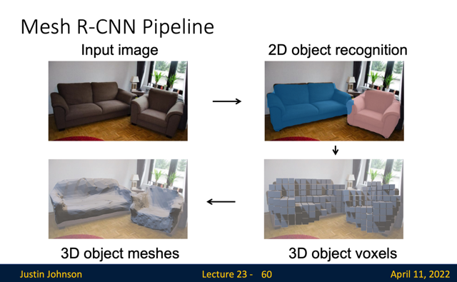</kbd></p>

<br>

<a id="node-1827"></a>

<p align="center"><kbd>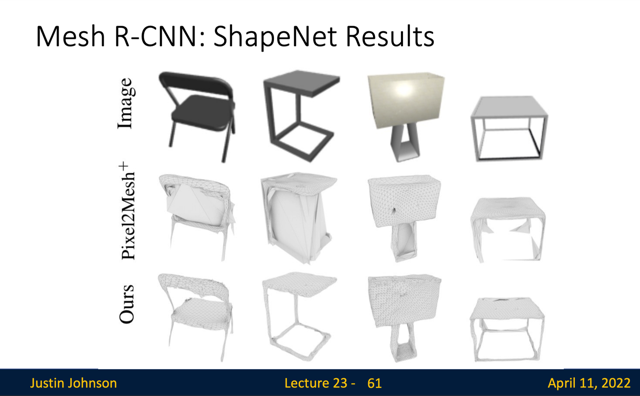</kbd></p>

> [!NOTE]
> kết quả so sánh với Pixel2Mesh cho thấy nó không thể bỏ đi cái lỗ
> trống ở giữa cái ghế vì vấn đề mới nói hồi nãy. Còn với Mesh RCNN
> thì nó cho ra kết quả tốt hơn

<br>

<a id="node-1828"></a>

<p align="center"><kbd>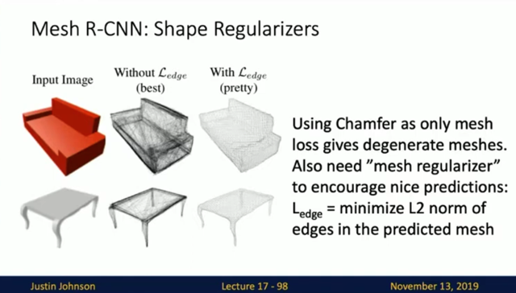</kbd></p>

> [!NOTE]
> nói thêm về việc dùng regularizer để cải
> thiện hơn kết qủa prediction.

<br>

<a id="node-1829"></a>

<p align="center"><kbd>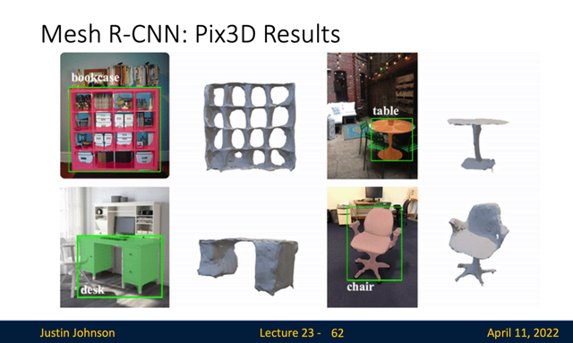</kbd></p>

<br>

<a id="node-1830"></a>

<p align="center"><kbd>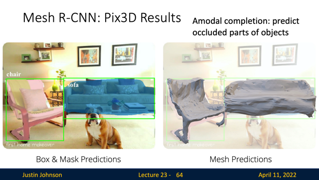</kbd></p>

> [!NOTE]
> khả năng predict cả những
> phần bị che của 3d object gọi
> là amodal completion

<br>

<a id="node-1831"></a>

<p align="center"><kbd>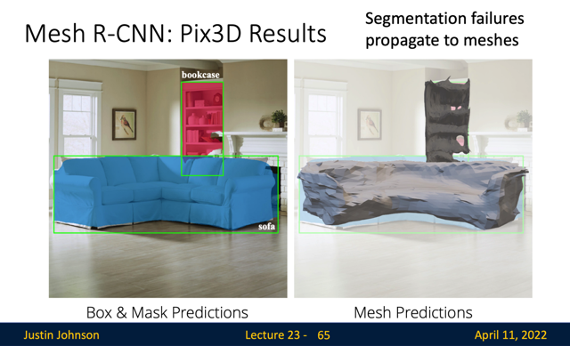</kbd></p>

> [!NOTE]
> Fail case, khi segmentation không dự đoán được luôn phần
> bị che của cái kệ sách dẫn đến mesh prediction của fail
> không dự đoán được 3d của phần đó. gợi ý cho ta là nếu
> khắc phục được segmentation case thì cũng sẽ hữu ích giúp
> khắc phục mesh case

<br>

