# Eecs498-007 Lecture 18: Video

📊 **Progress:** `56` Notes | `75` Screenshots

---
<a id="node-1833"></a>

<p align="center"><kbd>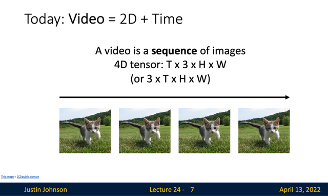</kbd></p>

> [!NOTE]
> với video ta sẽ add thêm một dimension: temporal dimension.

<br>

<a id="node-1834"></a>

<p align="center"><kbd>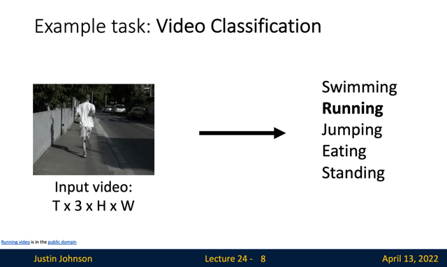</kbd></p>

> [!NOTE]
> một ví dụ là video classification, trong đó ta dùng nn để nhận một
> video và predict category của nó.
>
> Đương nhiên có thể đoán loss sẽ dùng cross entropy loss.

<br>

<a id="node-1835"></a>

<p align="center"><kbd>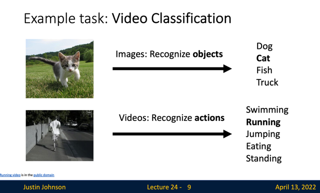</kbd></p>

> [!NOTE]
> đại khái Justin nói rằng với image classification, đối tượng cần nhận
> diện là object, nó có hình dạng, có những đặc điểm để nhận ra.
>
> ví dụ như con mèo trong ảnh, nó là một vùng có hình dạng, có
> những đặc điểm, quy luật riêng để cho ta biết đó là con mèo và ta sẽ
> xây dựng mô hình nn, để nắm bắt các quy luật này
>
> Nhưng với video classification, phần lớn cái ta cần nhận diện là hành
> động, chuyển động.
>
> Hay nói nôm na, với image classification, ta cần detect noun còn với
> video ta cần detect verb

<br>

<a id="node-1836"></a>

<p align="center"><kbd>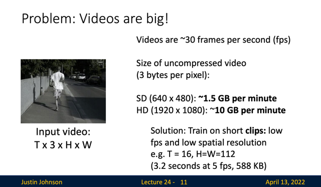</kbd></p>

> [!NOTE]
> Vấn đề dễ thấy với việc làm việc với video đó là nó rất "nặng" `-` cần
> dung lượng lớn để lưu trữ và xử lý. Ở đây ta biết thêm video thường
> có 30 fps tức 30 khung hình `/` giây (frame per second). Mỗi khung
> hình tất nhiên tương đương một image 3 channel RGB (đang nói
> phim màu)
>
> Kích thước (bề dài x rộng) của SD là 640x480, thì một image `/` frame
> sẽ cần 640*480*3 byte (mỗi pixel cần 3 bytes, một byte cho mỗi color
> channel). Vậy một phút phim sẽ có 30*60 frame, tổng cộng cần dung
> lượng là 640*480*3*30*60 `=` 1,658,880,000 là 1.65 GB
>
> Nếu là phim hd thì nó còn lớn hơn nữa.
>
> Thành ra giải pháp đó là ta sẽ
>
> i) cắt ngắn đoạn video lại chỉ vài giây
>
> ii) thay vì dùng 30 fps thì người ta có thể chỉ dùng 5 `frame/second`
> thôi (tức là thay vì dùng hết 30 frame của 1 second thì chỉ dùng 5
> frame (bằng cách sampling 5 frame trong 30 frame)
>
> iii) đồng thời, ta sẽ thu nhỏ spatial dimension (H,W) lại thay vì dùng
> 224x224 như bữa giờ thì nay chỉ dùng 112 thôi. Từ đó giúp giảm một
> thước video dài 3.2 giây chỉ tốn 588KB

<br>

<a id="node-1837"></a>

<p align="center"><kbd>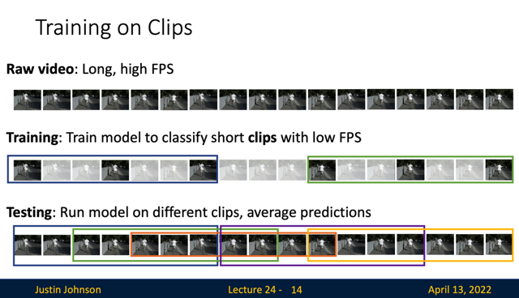</kbd></p>

> [!NOTE]
> Như vậy lúc training, ta sẽ sampling các frame từ cá đoạn ngắn của video gốc
> và giảm H, W để như vừa nói, giảm kích thước xuống. Đây sẽ là training set
> để train nn, cho bài toán classification.
>
> Thì khi test, đại khái là ta sẽ run model trên những đoạn video ngắn khác nhau,
> để có prediction trên những đoạn ngắn đó. Để rồi average kết quả lại để có 
> prediction cuối cùng.

<br>

<a id="node-1838"></a>

<p align="center"><kbd>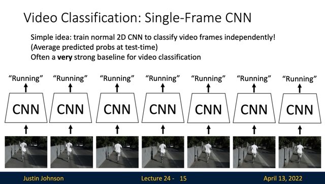</kbd></p>

> [!NOTE]
> đại ý là Justin nói về một phương pháp có vẻ rất stupid cho bài toán này
> Nhưng thực tế lại cho thấy đạt hiệu quả khá tốt, hoàn toàn có thể được
> dùng đầu tiên cho nhiệm vụ này để đóng vai trò là baseline performance.
>
> Cách này đơn giản là dùng image classification model để predict từng
> frame trong video, một cách hoàn toàn độc lập nhau. Thì cách này nói là
> stupid bởi lẽ ta hoàn toàn coi video như một chuỗi hình ảnh độc lập, và vì
> vậy hoàn toàn không đá động gì tới tính chất nối tiếp nhau về mặt thời
> gian của các bức ảnh (temporal structure).
>
> Tuy nhiên như đã nói, nó vẫn tỏ ra khá tốt, nên Justin cho rằng dùng thử
> cách này trước

<br>

<a id="node-1839"></a>

<p align="center"><kbd>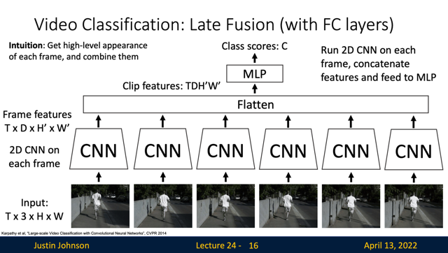</kbd></p>

> [!NOTE]
> Với Late Fusion, người ta tìm cách nắm bắt temporal structure mà
> cách làm trước hoàn toàn bỏ qua. Khúc đầu cũng vẫn vậy, dùng cnn
> image classification model để predict từng frame, nhưng đúng hơn
> là extract features của từng frame.
>
> Để từ input là (T,3,H,W) chuỗi T frame, mỗi frame có shape (3,H,W).
> Process vào cnn, để với mỗi frame ta có output features (D,H',W')
> (D, như đã biết, là kích thước `/` số filter của conv layer cuối khi dùng
> cnn để extract feature), nên ta có gọi là "Frame feature" (T,D,H',W')
>
> Tiếp theo, để "hợp nhất" (fusion) các frame lại, ta sẽ flatten frame 
> feature này thành T*D*H'*W' `-` dimensional vector. Sau đó dùng MLP
> để predict class scores.
>
> Thì có thể thấy, cái việc cố gắng nắm bắt thông tin liên quan đến chuỗi
> thời gian chỉ được thực hiện sau khi đã xử lý qua CNN, nên tên gọi là
> "Late" fusion là vậy.

<br>

<a id="node-1840"></a>

<p align="center"><kbd>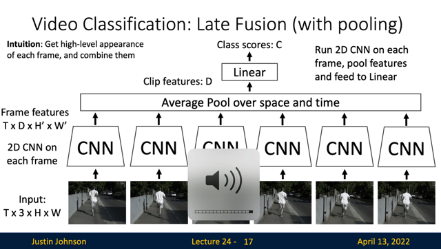</kbd></p>

> [!NOTE]
> Thế thì như ta cũng đã biết một hạn chế của việc xài Fully Connected
> layer đó là nó khiến số lượng parameters tăng lên rất nhiều.
>
> Do đó, ở đây cũng vậy, người ta sẽ dùng Average Pool đối với frame 
> features (có thể đoán rằng, apply average pooling đối với frame feature
> đã được flatten, nên mang ý nghĩa là pooling over space và time)
>
> Kết quả chỉ còn `D-dimension` feature, pass qua linear layer cuối để có
> class scores. Cách làm này giúp tránh việc dùng FC sau bước flatten
> gây tăng lên rất nhiều parameters

<br>

<a id="node-1841"></a>

<p align="center"><kbd>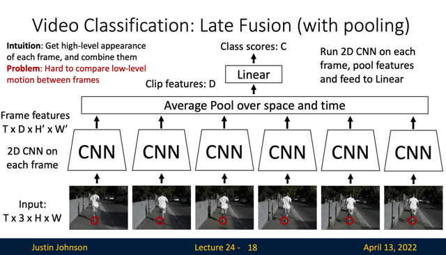</kbd></p>

> [!NOTE]
> Thế thì vấn đề đối với cách làm Late Fusion này, đó là lấy ví dụ như trong
> video này là một người đang chạy. Nếu ta (chúng ta) xem xét các bức hình
> (frame) riêng lẻ thì có thể nhận ra một đặc điểm quan trọng giúp ta đoán
> được ông này đang chạy hay đứng yên hay đi bộ đó là: có frame có cái
> chân trái chạm đất, qua frame tiếp theo lại không thấy cái chân trái ổng đâu,
> qua frame tiếp theo lại thấy chân trái chạm đất.
>
> Thế thì ý nói, đây là một đặc điểm mà nếu mình xem xét `/` so sánh các bức
> hình "ở low level" `-` ý là lúc image feature còn ở trạng thái thô `/` ban đầu thì ta
> sẽ dễ nhận ra. Nhưng nếu ta xem xét `/` so sánh các bức hình "ở high level"
> `-` ý nói là khi đã pass các bức hình qua cnn để nó extract ra các higher,
> abstract feature thì sẽ khó so sánh để phát hiện các chi tiết nhỏ nhưng quan
> trọng này.
>
> Vì sao, vì như đã biết qua cnn, qua từng layer từ nông đến sâu nó đã học
> cách nắm bắt các feature từ đơn giản đến phức tạp, cũng đồng thời tạo ra
> các feature ngày càng quan tâm đến quy luật tổng thể hơn là chi tiết. Ví dụ,
> mắt con mèo có  thể khác nhau ở mức độ chi tiết trên nhiều bức hình mèo
> khác nhau, nhưng  qua cnn ở các level sâu, feature thể hiện concept "mắt
> mèo" được extract ra `/` học ra  là giống nhau, và nó không còn quan tâm các
> khác biệt về chi tiết của các mắt mèo trong hình gốc nữa.
>
> Thì đây cũng vậy, với việc đã pass các khung hình qua cnn để extract ra các
> higher abstract feature. Thì có thể những chi tiết nhỏ như chân trái của ông
> này không còn được quan tâm nữa, từ đó model không phát hiện ra quy luật
> lúc có lúc không  của cái chân trái để rồi miss đi một quy luật quan tính
> temporal quan trọng. (Trong slide chính là ý khó so sánh các `low-lovel` motion
> giữa các frame)
>
> Đó là hạn chế của việc "late" khi kiến trúc của model chỉ cố gắng nắm bắt
> temporal structure trong giai đoạn sau khi đã xử lý qua cnn.

<br>

<a id="node-1842"></a>

<p align="center"><kbd>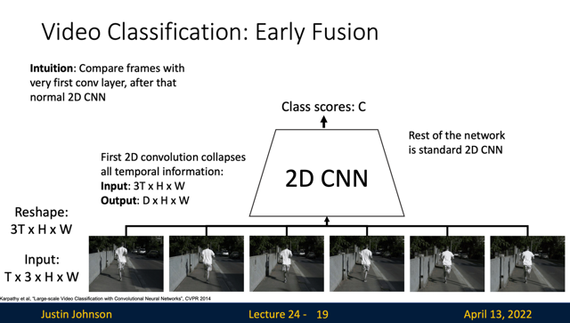</kbd></p>

> [!NOTE]
> Thế thì để khắc phục nhược điểm của Late Fusion, người ta sẽ cho bước
> fusion xảy ra sớm, để có Early Fusion:
>
> video input có shape (T,3,H,W) như đã biết, ta sẽ reshape nó thành (T*3,H,
> W) mang ý nghĩa là ta collapse temporal dimension để có một 3D tensor với
> channels bao gồm cả temporal dimensions và color dimension.
>
> HÌnh dung giống như từ việc ta có một chuỗi `/` dãy có T bộ, mỗi bộ là một
> xấp có 3 miếng của bức hình theo 3 màu RGB. Bây giờ ta sẽ gom lại hết,
> xếp chồng lên nhau các bộ 3 tấm đó lại thành một chồng có độ dày là T*3.
>
> Đến đây hoàn toàn có thể dùng nó trong một 2D CNN thông thường để coi
> nó như một input có 3T channels thôi. Và output của CNN sẽ là DxH'xW'
> như thường lệ trước khi pass qua linear layer để có class score

<br>

<a id="node-1843"></a>

<p align="center"><kbd>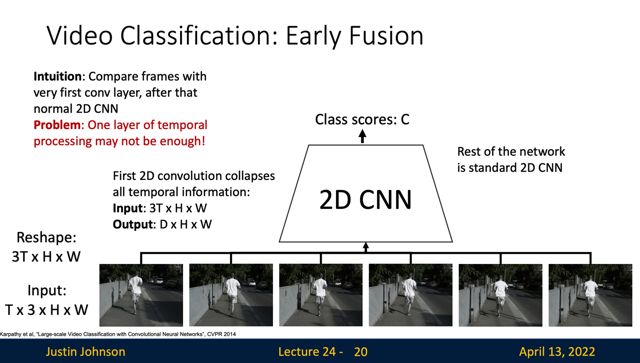</kbd></p>

> [!NOTE]
> Với cách làm này, người ta đã mong muốn rằng, khi convolutional layer 
> đầu tiên của CNN tiếp nhận tensor có depth `=` 3T, (các filter của nó có thể)
> học được cách phát hiện những chi tiết, những quy luật mang tính chất
> temporal như ví dụ hồi nãy.
>
> Hình dung thế này, ta đã biết layer đầu tiên sẽ có nhiều filter, thực hiện việc
> quét qua input để tính toán ra output, mỗi một "vị trí quét", ta nhớ thực ra là
> nó làm một phép tính dot product giữa hai cái 3D matrix có shape 
> (kernel size, kernel size, 3T): một cái là cái filter, một cái là cái "vùng đang xét" 
> của input.
>
> Vậy ta hi vọng rằng, một trong số các filter của layer này, sẽ phát hiện ra cái
> quy luật "chân trái lúc có lúc không" này bằng cách "nhìn xuyên qua chồng
> ảnh có độ dày 3T, ở một vùng đang xét".
>
> Vậy thực tế cho thấy một lớp conv layer đầu tiên không đủ để nắm bắt được
> các quy luật này

<br>

<a id="node-1844"></a>

<p align="center"><kbd>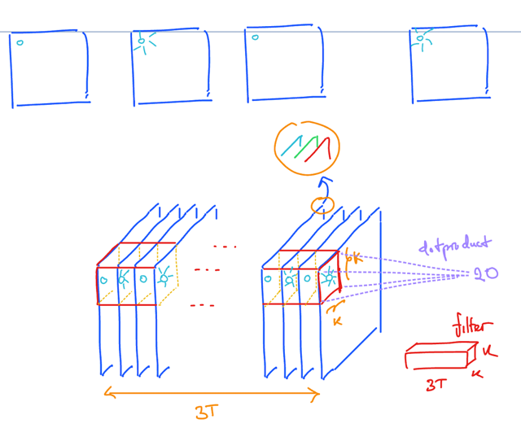</kbd></p>

> [!NOTE]
> ví dụ như video bóng
> đèn nhấp nháy

<br>

<a id="node-1845"></a>

<p align="center"><kbd>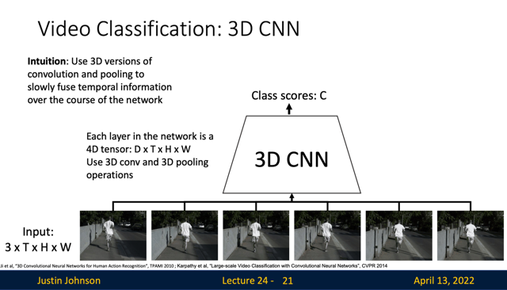</kbd></p>

> [!NOTE]
> Cách tiếp cận thứ 3 đó là dùng 3D CNN.

<br>

<a id="node-1846"></a>

<p align="center"><kbd>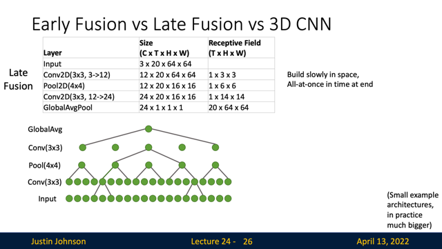</kbd></p>

> [!NOTE]
> đại khái là ta sẽ dùng một small architecture để so sánh 3 cách làm Late
> Fusion, Early Fusion và 3D CNN.
>
> Đầu tiên là Late Fusion: Input là `(3,T=20,H=64,W=64),` như đã biết, cách này
> nó sẽ process mỗi frame (3,H,W) với 2d cnn, mà ở đây cho đơn giản chỉ là một
> con2d layer có 12 filters size 3x3. Để kết quả sau khi input mỗi frame  (3, 64,
> 64) sẽ là (12,64,64), xét cho toàn bộ các frame thì output sẽ có shape (12,
> 20,64,64).
>
> Vậy thì ở quá trình này, có thể coi như **receptive field** là 1x3x3: **1 là trên
> temporal dimension T** và **3 trên hai spatial dimension H,W**
>
> Sau đó, pass qua Pool2D(4x4) cũng như là tiếp tục một Conv layer nữa  sẽ
> mang hiệu quả**mở rộng receptive field trên spatial dimension**(tại sao mở
> rộng receptive field thì biết rồi, nhưng ý chính là **muốn nhấn mạnh sự mở
> rộng này chỉ là đối với spatial dimension H, W thô**i, chứ **với temporal
> dimension thì không**). Để rồi receptive field mở rộng dần từ 1x3x3 `->` 1x6x6
> `->` 1x14x14
>
> Đến cuối cùng, thì mới có một GlobalAvgPooling để kiểu như làm việc tổng
> hợp các temporal information.
>
> Do đó, họ mới nói rằng cách làm của late fusion, giúp model **mở rộng góc
> nhìn trong spatial dimension** (nôm na là nhìn quét ngang dọc của một
> khung hình)  **một cách từ từ, nhiều lần**, giúp "nó" detect được các pattern,
> mô tuýp xuất hiện trong  khung hình rất tốt.
>
> Tuy nhiên, nó lại **chỉ nhìn quét qua hết, mở rộng góc nhìn theo chiều thời
> gian temporal dimension có một lần một**. Thành ra không đủ, để nắm bắt
> được các quy luật trong đó, chưa kể là nó lại xem xét với  `high-level` feature
> (sau khi đã output bởi conv2d) khiến mất đi các chi tiết như đã nói hồi nãy

<br>

<a id="node-1847"></a>

<p align="center"><kbd>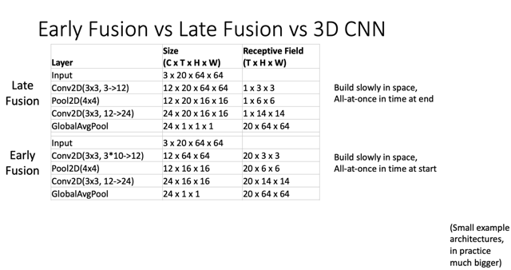</kbd></p>

> [!NOTE]
> Với Early Fusion, ta stack các frame lại để thành ra một "chồng" dày 3T
> các miếng HxW và input vào conv2D có 12 filter size 3x3, đương nhiên
> filter's depth cũng phải là 3T, để output là (12,H,W). Ý nghĩa là 12 filter khi
> convol input sẽ quét qua `/` nhìn qua xuyên suốt toàn bộ (T) chiều thời gian
> temporal dimension, tất nhiên là cũng nhìn qua một vùng của chiều không
> gian spatial dimension H,W có kích thước 3x3.
>
> Nên mới nói receptive field ở bước này là 20x3x3.
>
> Sau đó các Pool2D, Conv2D sẽ tương tự, dần mở rộng receptive field trên
> spatial dimension rộng ra: 20x3x3 `->` 20x6x6 `->` 210x14x14 `->` 20x64x64
>
> Tuy có đưa việt "quét qua temporal" có xảy ra trước tuy nhiên cơ bản vẫn
> giống Late Fusion ở chỗ đối với spatial dimension thì receptive field được
> mở rộng từ từ, còn với temporal dimension thì nó chỉ mở rộng có 1 lần
> `(All-at-one)`

<br>

<a id="node-1848"></a>

<p align="center"><kbd>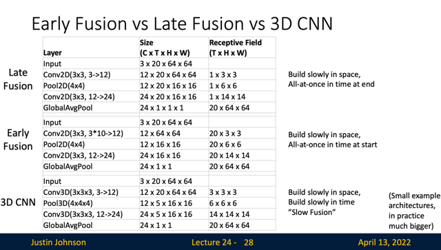</kbd></p>

> [!NOTE]
> còn với 3D CNN, thì tương tự như ở trong bài về 3D vision trong đó ta coi
> input như một 3D image với 3 spatial dimension HxWxD `(D=depth)` và 1
> color dimension nữa thì 3D image sẽ là 4D tensor (3xDxHxW) (*khi nói 2D
> image hay 3D image thì nên hiểu là ám chỉ các spatial  dimension), còn khi
> làm việc thì đương nhiên tùy vào hình màu hay trắng đen mà có thêm color
> dimension bằng 1 hay 3 nữa.
>
> Vậy tương tự như color image input vào conv2D có shape 3xHxW thì,
> conv2D's filter sẽ có shape là 3xKxK (K: kernel size, và đương nhiên filter
> có số channel `=` số channel của image `=` 3). Để mỗi filter cho ra một feature
> map (H',W'), thì layer có C filter cho ra output: (C,H',W')
>
> Thì ở đây input vào có shape 3xDxHxW, conv3D sẽ có filter với shape
> là 3xKxKxK. Để rồi mỗi filter cho ra một "3D feature map" shape (D',H',W') 
> thì layer có C filter sẽ cho ra output shape (C,D',H',W')
>
> Vậy nếu coi T như D tức là một spatial dimension thứ 3 thì input (3,T,H,W) sẽ 
> ra output (C,T,H,W) (cho rằng dùng same padding nên spatial size giữ nguyên)
>
> Để rồi khi ta đối xử với temporal dimension T như spatial dimension thứ 3,
> để nguyên video như một "cục" image 3D, thì khi pass nó vào một 3D CNN
> thì receptive field cũng sẽ được mở rộng dần dần ở cả 3 spatial dimension
> đồng nghĩa là r**eceptive field trên temporal dimension, cũng sẽ được mở
> rộng  dần dần.** Đây chính là lí do cách tiếp cận này được gọi là **Slow
> Fusion**

<br>

<a id="node-1849"></a>

<p align="center"><kbd>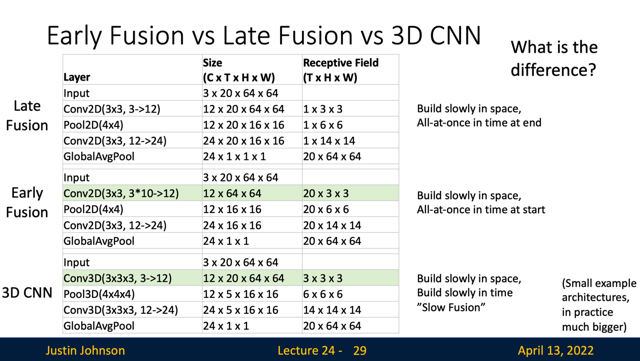</kbd></p>

<br>

<a id="node-1850"></a>

<p align="center"><kbd>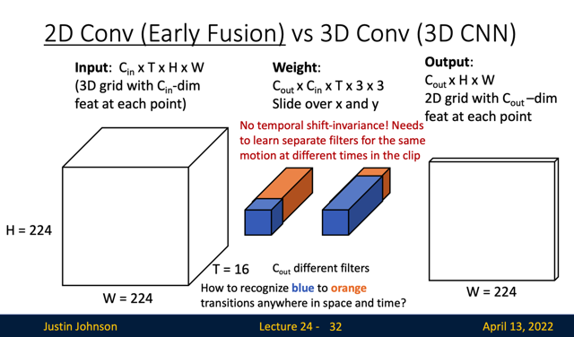</kbd></p>

<p align="center"><kbd>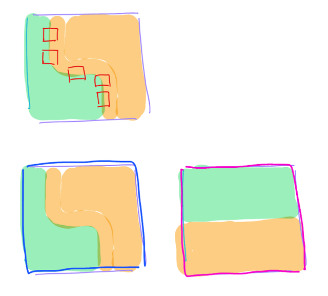</kbd></p>

<p align="center"><kbd></kbd></p>

<p align="center"><kbd></kbd></p>

<p align="center"><kbd>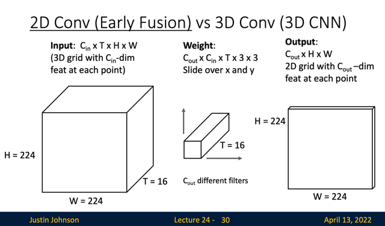</kbd></p>

> [!NOTE]
> Trước hết, cần chú ý là như bên slide về Early Fusion, ta nói stack các frame theo
> Temporal dimension để thành tensor (3T,H,W) và được conv bởi conv2D. thì conv2D
> filter sẽ có shape (3T,K,K), để rồi phép tính là dot product giữa hai khối 3D mà mỗi
> phép tính đơn lẻ là giữa hai số thực.
>
> Thế thì tensor (3T,H,W) được convol với conv2D có filter (3T,K,K) thì cũng có thể coi
> như tensor (T,H,W) được convol với conv2D có filter (T,K,K) mà mỗi vị trí trong hai
> tensor đều là một vector có 3 phần tử. Để rồi phép tính convol là dot product giữa hai
> khối 3D mà mỗi phép tính đơn lẻ lại là dot product giữa  hai 3D vector.
>
> `===`
>
> Vậy có thể hiểu đại khái là vấn để `shift-invariance` trong chiều temporal nếu làm theo
> lối 2D convolution như vầy: Mấu chốt là ở chỗ, với spatial dimension, một bộ giá trị
> của filter được tính với nhiều vị trí spatial khác nhau của input hay mình hay nói là
> filter như một bộ lọc (thì mới gọi nó là filter) quét qua nhiều vùng của bức hình, để rồi
> cái mà model phải `/` muốn học được đó là: nếu có một pattern, mô tuýp nào đó mà cái
> filter đó đang quan tâm (ví dụ như một sự chuyển màu từ xanh sang cam chẳng hạn)
> xuất hiện ở đâu trong bức hình (nôm na là ở vùng KxK tọa độ Hi, Wi nào trong bức
> hình thì nó cũng sẽ activate `/` phát hiện ra.
>
> Thế thì vấn đề là nếu ta cho kích thước của filter, tức là K bự bằng H,W luôn, thì
> chuyện sẽ xảy ra đó là ta sẽ mất đi khả năng phát hiện một dạng pattern chung chung
> là "màu xanh `->` màu cam, không quan tâm dạng cụ thể ra sao". Cái này khó giải
> thích nhưng nhìn hình minh họa sẽ hiểu ngay: Ý là những filter màu đỏ sẽ có tính
> chất shift invariance, nôm na là nó linh hoạt hơn, khi một mình nó có thể phát hiện
> miễn là vùng màu xanh chuyển sang màu cam, bất kì vị trí đó nó nằm ở đâu, có
> hướng cụ thể như thế nào.
>
> Ngược lại với hai cái hình dưới, khi filter size `=` H, W luôn thì cho rằng cái filter màu
> xanh dương học cách detect được vùng màu xanh chuyển sang cam, thì nó chỉ
> active khi cái hướng nó như vậy, mà không detect được khi sự chuyển màu có
> hướng khác như hình bên phải, lúc này cần một filter khác để học cách detect ra sự
> chuyển màu ở hướng nằm ngang như này
>
> `====`
>
> Từ đó giúp ta có thể hiểu rằng điều này cũng tương tự khi với việc sử dụng conv2d,
> ta đang quét qua toàn bộ temporal dimension. Nên nếu trong chiều temporal, cần học
> được cách phát hiện ra sự chuyển màu thì cũng phải dùng 2 filter khác nhau Cho hai
> hướng `Blue->` Orange và `Orange->Blue`

<br>

<a id="node-1851"></a>

<p align="center"><kbd>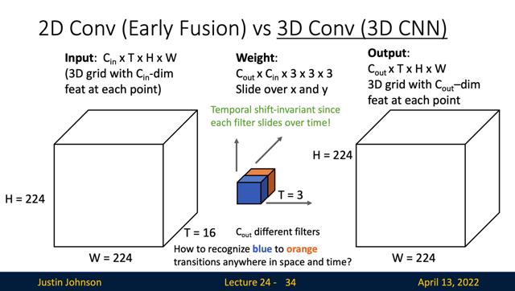</kbd></p>

<p align="center"><kbd></kbd></p>

<p align="center"><kbd>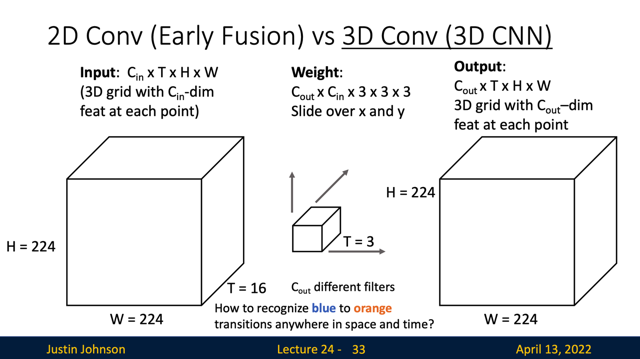</kbd></p>

> [!NOTE]
> Còn với 3D cnn, thì như đã nói, nó đối xử với temporal dimension như chiều
> spatial dimension thứ 3. Dẫn đến là kernel size của temporal dimension cũng
> là K, và có nghĩa là nó cũng quét filter qua xuyên suốt chiều thời gian để rồi
> quá trình huấn luyện nó sẽ có được tính chất shift invariance

<br>

<a id="node-1852"></a>

<p align="center"><kbd>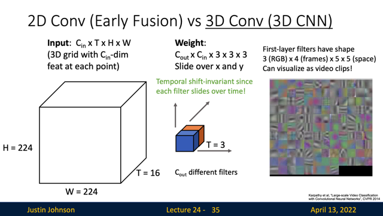</kbd></p>

> [!NOTE]
> và một cái hay của 3D CNN là nó cho phép visualization, cũng như khi
> ta visualize filter của 2D CNN để thấy những pattern mà filter tìm kiếm.
> Thì với 3D CNN, hình ảnh sẽ là video. Khi xem trong bài giảng có thể
> thấy một số filter chỉ có dạng tĩnh, tức là kiểu như là nó chỉ tìm kiếm
> một pattern cố định xuyên suốt temporal dimension. Bên cạnh đó cũng
> có một số có cái kiểu "nhích qua nhích lại" mang ý nghĩa là filter đó tìm
> kiếm một dạng chuyển động (local motion in different dirrection)

<br>

<a id="node-1853"></a>

<p align="center"><kbd>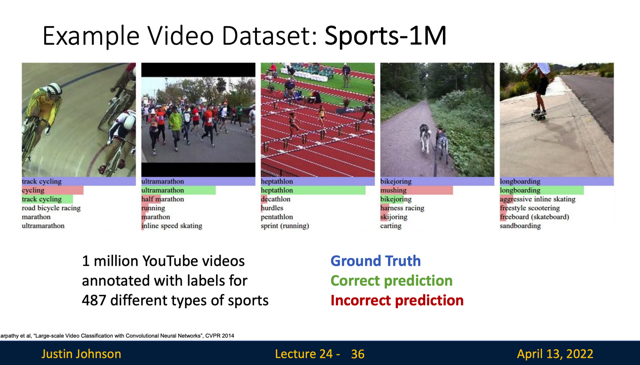</kbd></p>

> [!NOTE]
> người ta train và đánh giá model trên `Sports-1M`
> dataset, có các video thể thao được gán nhãn.

<br>

<a id="node-1854"></a>

<p align="center"><kbd>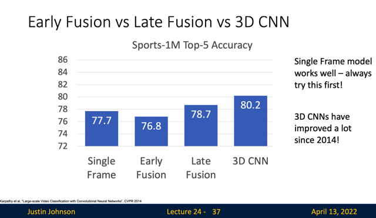</kbd></p>

> [!NOTE]
> So sánh 4 model trên `Sports-1M` cho thấy như đã nói lúc trước,
> các làm Single Frame trong đó chỉ dùng 2d cnn model để predict
> từng frame tỏ ra rất tốt khi cũng đạt 77.7%. Và rồi các cách tiếp
> cận phức tạp hơn như Late Fusion, 3D CNN chỉ giúp đẩy hiệu suất
> lên thêm một chút. Do đó Justin cho rằng luôn nên bắt đầu với
> single frame
>
> Tuy nhiên cũng cần lưu ý đây là kết quả của paper bởi Andrej Karpathy
> từ năm 2014 tại google, lúc đó Justin cho biết còn chưa có GPU cluster
> nên cơ bản là ta nên hiểu rằng mô hình video hiện nay sẽ tốt hơn nhiều

<br>

<a id="node-1855"></a>

<p align="center"><kbd>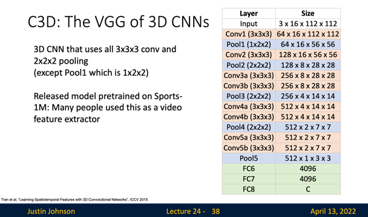</kbd></p>

> [!NOTE]
> thế thì mới nói qua C3D còn gọi là VGG của 3D CNN, ta đã biết mô
> hình VGG mà kiến trúc của nó khá đơn giản chỉ là "rất nhiều" combo
> các layer `conv-conv-pooling.` Thì cái này là giống vậy nhưng với 3D
> convolution và pooling.
>
> Và đại khái là paper này người ta còn publish pretrained weight của
> nó, giúp cho ta nếu cần có thể dùng nó làm feature extractor, giống
> như cách ta dùng pretrained cnn để extract feature trong các bài
> toán khác như object detection, ....

<br>

<a id="node-1856"></a>

<p align="center"><kbd>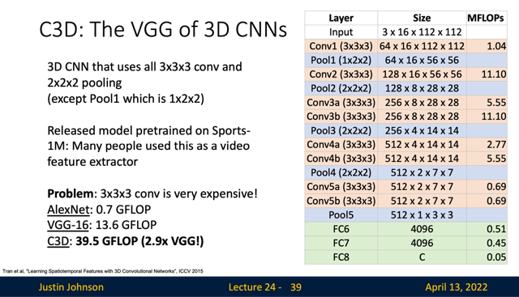</kbd></p>

> [!NOTE]
> Nhưng vấn đề đó là 3D CNN rất tốn kém về tính toán, có
> thể thấy dù với input rất khiêm tốn nhưng C3D tốn kém
> gấp 3 lần VGG, và bỏ xa AlexNet

<br>

<a id="node-1857"></a>

<p align="center"><kbd>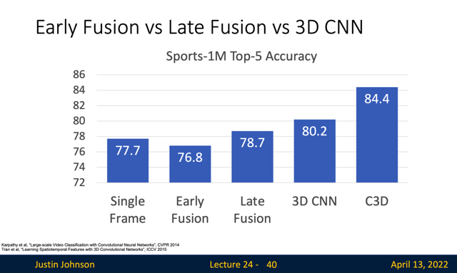</kbd></p>

> [!NOTE]
> đại khái Justin nói rằng, cũng tương tự như 2D, 3D CNN cũng
> có thể tiếp tục cải thiện với xu hướng build model ngày càng bự
> hơn.
>
> Tuy nhiên ta sẽ dừng lại để suy nghĩ một chút, để thấy rằng, đúng
> ra nên xử lý temporal dimension riêng, ý là theo một cách khác
> so với spatial dimension. Trong 3D CNN, như đã biết, ta đang đối
> xử với temporal dimension như nó làm một spatial dimension thứ 3,
> tức là coi chúng như nhau. Tuy nhiên ở slide sau, ta sẽ thấy, não 
> người không nhận biết chuyển động theo cách thức giống như 
> nhận biết hình ảnh (object)

<br>

<a id="node-1858"></a>

<p align="center"><kbd>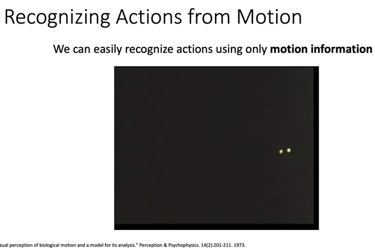</kbd></p>

> [!NOTE]
> Đại khái là justin đoạn video cho thấy chỉ các chấm sáng, kiểu như gắn vài
> đèn led vào người rồi bước đi trong bóng tối ấy.
>
> Thì ý chính muốn nói, là mắt người hoàn toàn nhận biết được đây là
> chuyển động gì, mà không cần phải thấy hết đối tượng. Điều này cho thấy
> não người có cơ chế xử lý riêng đối với chuyển động.

<br>

<a id="node-1859"></a>

<p align="center"><kbd>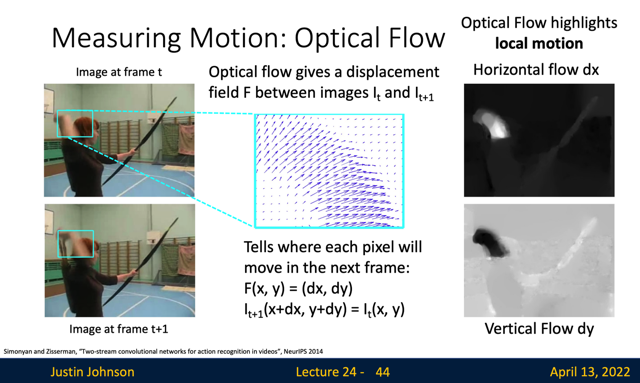</kbd></p>

> [!NOTE]
> đại khái là cái này nói về có nhiều thuật toán giúp việc tính toán ra kiểu
> như trong một bức ảnh, các pixel có hướng chuyển động như thế nào
> giữa hai khung hình liên tiếp nhau. Để ra được 2 tấm thể hiện
> horizontal flow dx và vertical flow dy.
>
> Vậy ví dụ như có T khung hình, thì ta sẽ có `T-1` các cặp khung hình
> liền kề, để rồi cho ra `2(T-1)` local motion 
>
> Và từ đó, dạng dữ liệu này, có thể được dùng để huấn luyện mô hình
> học sâu

<br>

<a id="node-1860"></a>

<p align="center"><kbd>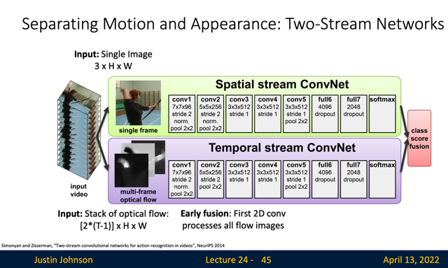</kbd></p>

> [!NOTE]
> Nói qua một mô hình nổi tiếng trong bài toán này là `Two-stream`
> convolutional network.
>
> Nó sẽ có 2 phần, một phần gọi là spatial stream convnet, cơ bản
> là một cái thuộc loại single frame như hồi nãy, để process từng
> frame (3,H,W) với 2D cnn để predict ra category và average prediction lại.
>
> Một phần gọi là temporal stream convnet, sẽ process từng local motion
> `(2*(T-1),H,W)` `-` tức là chuỗi local motion mà cứ hai frame liền kề cho ra
> hai "tấm" local motion dx, dy. Thì T frame sẽ có `2(T-1)` cái, và ta sẽ stack
> lại thành ra 1 xấp dày `2(T-1),` kích thước H,W vẫn là như cũ. Và cái này
> thì làm theo cách của Early Fusion. Và đương nhiên nó cũng predict
> ra category
>
> Như vậy temporal stream và spatial stream được train độc lập nhau.
> Để rồi khi test, mỗi stream sẽ predict ra một probability distribution over
> all classes riêng, ta sẽ average lại để có final prediction.

<br>

<a id="node-1861"></a>

<p align="center"><kbd>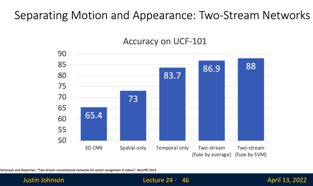</kbd></p>

> [!NOTE]
> So sánh các mô hình trên `UCF-101,` cho thấy 
> i) `Two-Stream` Network mà chỉ sử dụng spatial stream thôi cũng 
> tốt hơn 3D CNN 
>
> ii) Chỉ sử dụng temporal stream lại cho thấy tốt hơn spatial stream 
> để minh họa cho ví dụ hồi nãy, rằng mắt người có cơ chế xử lý riêng 
> với chuyển động và máy tính cũng có khả năng như vậy.
>
> iii) Dùng cả hai stream thì tốt hơn nữa.
>
> Justin Không nói về fuse by SVM là sao, có thể tự tìm hiểu

<br>

<a id="node-1862"></a>

<p align="center"><kbd>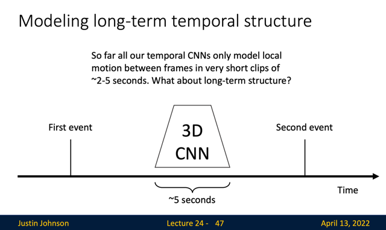</kbd></p>

> [!NOTE]
> Đại khái là từ nãy đến giờ, các mô hình chỉ đang cố gắng nắm bắt
> được những `short-term` motion. Nghĩ lại xem:
>
> Cái Late fusion thì khỏi nói
>
> Early Fusion: stack mọi frame lại thành temporal dimension 3T, và đã
> thấy hạn chế của nó đó là tuy cách làm của cái này giúp tạo hiệu quả
> ví von như mô hình sẽ **nhìn xuyên suốt, toàn bộ temporal dimension**
> nhưng nó **chỉ làm  vậy có một lần một, nên không đủ để hiệu quả**.
>
> 3D CNN: Khá hơn trong việc nắm bắt pattern theo temporal dimension
> vì tính chất mở rộng receptive field từ từ theo cách áp dụng với spatial
> dimension, nhưng vì **nó đối xử với temporal dimension cùng một cách
> với spatial dimension nên cũng không đạt hiểu qủa lắm. Và trong cách
> này, vì receptive field có tính chất local, nên các temporal pattern `/`
> structure nó nắm bắt được cũng mang tính short-term**
>
> `2-stream` CNN: Tuy là cái này xử lý temporal information theo cách
> riêng (với temporal stream network) nhưng nhớ lại, input của nó chỉ
> phản ánh **local motion của chỉ có hai frame liền kề** tức là nó **cũng chỉ là
> những `short-term` structure.**
> Câu hỏi là làm sao để ta **nắm bắt các `long-term` relationship, `long-term`
> structure của video.**

<br>

<a id="node-1863"></a>

<p align="center"><kbd>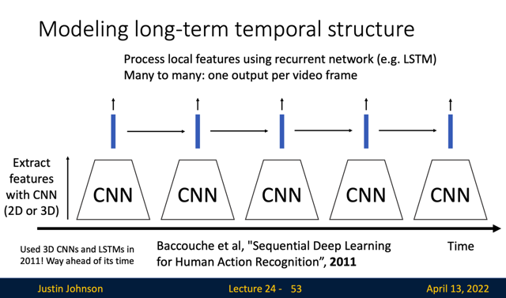</kbd></p>

<p align="center"><kbd></kbd></p>

<p align="center"><kbd>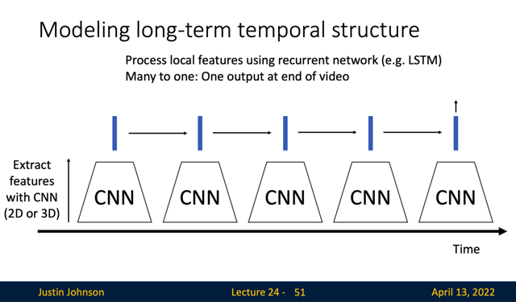</kbd></p>

> [!NOTE]
> Giải pháp là dùng RNN: ý tưởng là cũng process từng frame bởi cnn, có
> thể là 2D hoặc 3D để extract ra feature.
>
> Và pass feature của mỗi frame vào RNN để mô hình hóa `long-term`
> structure.
>
> Và nếu cần predict ra một output ví dụ như classify video thì ta dùng kiến
> trúc `Many-To-One`
>
> hoặc muốn predict output tại mỗi `time-frame` thì dùng `Many-To-Many`

<br>

<a id="node-1864"></a>

<p align="center"><kbd>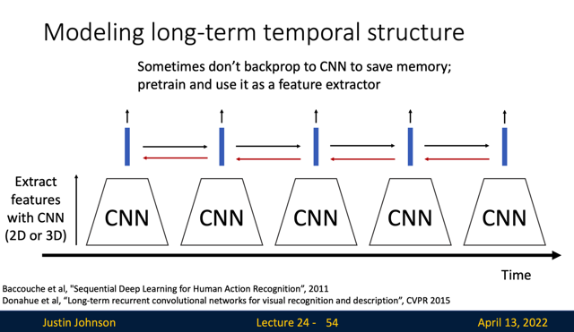</kbd></p>

> [!NOTE]
> đại khái là để tiết kiệm memory có thể ta sẽ không cần backprop
> qua CNN mà giữ pretrained CNN như một fixed feature extractor, và
> chỉ train RNN thôi.

<br>

<a id="node-1865"></a>

<p align="center"><kbd>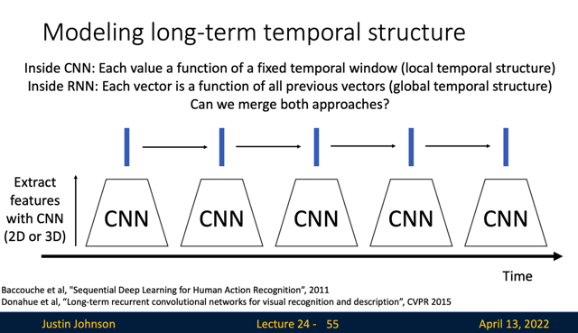</kbd></p>

> [!NOTE]
> Tiếp theo đại khái là nói về việc ta đã thấy có hai cách thức temporal
> fusion: Một là **local temporal fusion** ở trong 3D CNN, nơi mà ta đã
> xem temporal dimension như một spatial dimension thứ 3 và capture
> structure của nó theo cách của spatial dimension thông thường với
> convolution filter.
>
> Hai là dùng RNN để capture **long term `/` global temporal structure**Vậy có cách nào để áp dùng cả hai

<br>

<a id="node-1866"></a>

<p align="center"><kbd>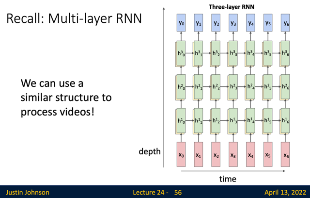</kbd></p>

> [!NOTE]
> Thế thì người ta sẽ dùng ý tưởng của `Multi-layer` RNN, nơi mà tính toán
> mỗi hidden vector tại mỗi `time-step` sẽ lấy input từ hidden value từ layer
> trước, cùng `time-step` và từ `time-step` trước của cùng layer đó.

<br>

<a id="node-1867"></a>

<p align="center"><kbd>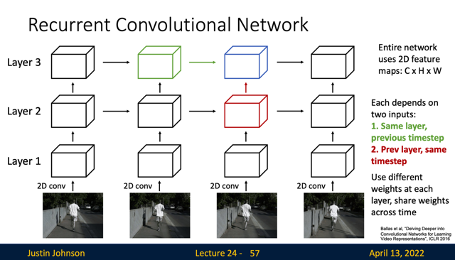</kbd></p>

> [!NOTE]
> mỗi frame sẽ pass qua RNN layer 1 để có 2d feature map (C,H,W) (C là số
> filter của layer).
>
> Để rồi chúng sẽ được pass vào RNN layer 2, tại mỗi `time-step,` sẽ tính toán
> dựa trên output của `time-step` `t-1,` và output do CNN vào tại `time-step` t.
> Đương nhiên  với RNN thì mọi `time-step` đều share chung một bộ params.
>
> Tương tự output của RNN layer 2 sẽ pass vào layer 3.
>
> Chú ý là các phép tính trong RNN sẽ là Convolution như sẽ nói ở slide sau,
> nên đây gọi là Recurrent Convolutional Network

<br>

<a id="node-1868"></a>

<p align="center"><kbd>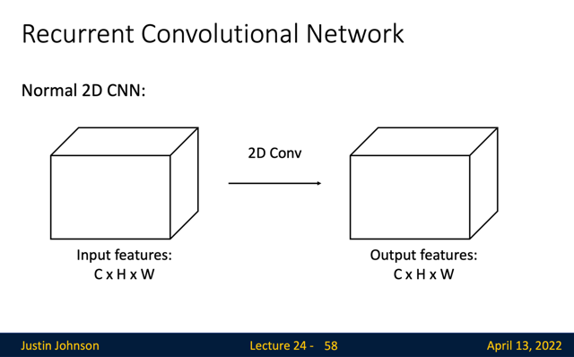</kbd></p>

> [!NOTE]
> Vậy với normal 2D cnn thì
> như đã quá rành

<br>

<a id="node-1869"></a>

<p align="center"><kbd>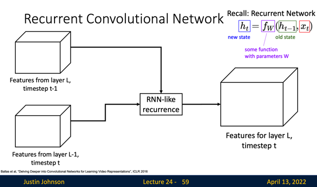</kbd></p>

> [!NOTE]
> Thế thì với RNN `time-step,` nhớ lại rằng ta dùng một function để "tổng hợp"
> (fusion) hai input: current `time-step` input `x_t` và previous `time-step` output
> `h_t-1.` Function nói trên đơn giản là dùng hai matrix Whh, Wxh để transform,
> xong cộng lại và có thể cộng bias, và squash với tanh.
>
> Thì với Recurrent Convolutional Network cũng sẽ như vậy.Có điều hai input
> tensor là 3D tensor

<br>

<a id="node-1870"></a>

<p align="center"><kbd>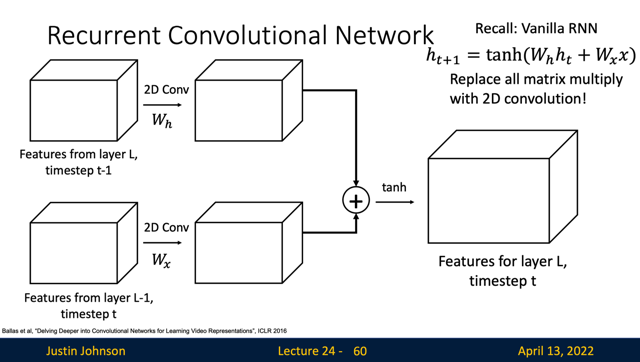</kbd></p>

> [!NOTE]
> Thế thì thay vì dùng matrix để transform, RCN sẽ dùng hai phép
> 2D convolution để xử lý hai input. rồi cũng cộng lại và squash với tanh

<br>

<a id="node-1871"></a>

<p align="center"><kbd>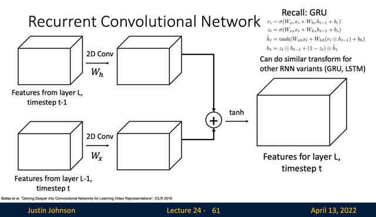</kbd></p>

> [!NOTE]
> Và ta có thể dùng bất kì dạng nào của RNN
> như GRU, LSTM như đã biết

<br>

<a id="node-1872"></a>

<p align="center"><kbd>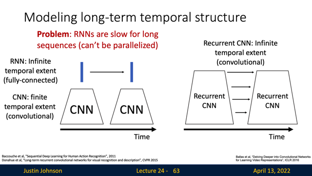</kbd></p>

<p align="center"><kbd></kbd></p>

<p align="center"><kbd>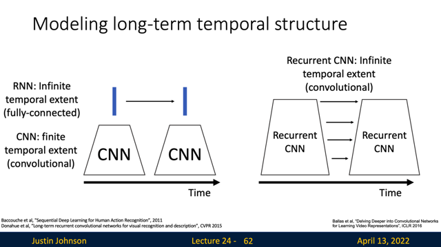</kbd></p>

> [!NOTE]
> cách làm này Justin cho rằng tuy là một cách làm giúp tổng hợp temporal
> structure và spatial khá tốt tuy nhiên nó lại phụ thuộc RNN có nhược điểm
> là tính toán tuần tự, do đó rất chậm với squence dài.

<br>

<a id="node-1873"></a>

<p align="center"><kbd>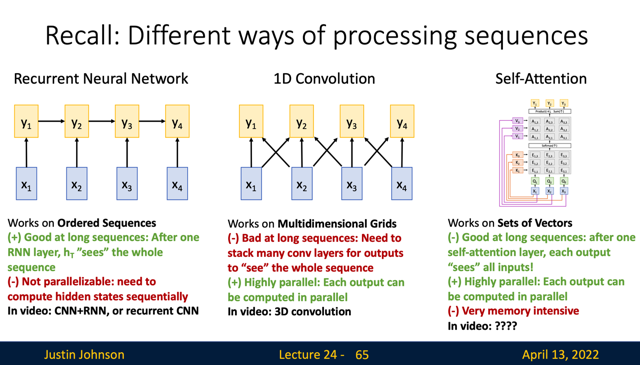</kbd></p>

> [!NOTE]
> Thế thì để khắc phục vấn đề này ta lại quay lại lúc nói về nhược điểm của
> RNN và các phương án cải thiện. Đầu tiên tóm tắt lại một chút về ưu nhược
> điểm của RNN và các phương án thay thế:
>
> RNN có thể capture `long-term` dependencies (tuy không qúa tốt nhưng cơ
> bản là tốt), hay nói như ở trong slide: là tại `time-step` `h_T,` nó có thể thấy mọi
> thông tin từ trước đó. Nhưng nhược điểm là xử lý tuần tự, phải đợi `time-step`
> `t-1` xong thì mới đến t.
>
> Áp dụng trong video chính là `CNN+RNN` (dùng 3D CNN để process
> `spatial+short` term temporal structure) hoặc Recurrent CNN như mới nói.
>
> `===`
>
> Ta cũng đã biết với sequence data có thể dùng 1D convolution để capture
> short term structure. Ưu điểm là khả năng tính toán song song của
> convolution, Nhưng nhược điểm là tính chất short term của convolution (vì
> mỗi filter chỉ "nhìn" vào được một receptive field hạn chế), để rồi muốn mở
> rộng receptive field ta  cần stack nhiều 1D conv layer lại.
>
> Thì trong bối cảnh video thì đây chính là cái 3D convolution hồi nãy đã nói,
> khi ta dùng trong mô hình Early fusion, stack temporal dimension và đối xử
> với nó như một spatial dimension, để convol nó với 3D conv layer.
>
> `===`
>
> Vậy, còn một giải pháp rất ưu việt cho vấn đề này chính là `Self-Attention,` khi
> nó vượt trội ở khả năng capture `long-term` dependency cũng như là có khả 
> năng tính toán song song rất tốt

<br>

<a id="node-1874"></a>

<p align="center"><kbd>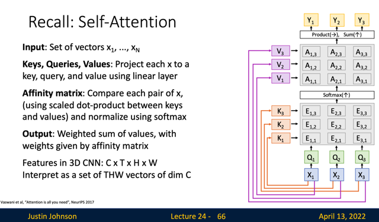</kbd></p>

> [!NOTE]
> Ta sẽ ôn lại `Self-attention` chút xíu: Về cơ bản, `self-attention` bắt đầu với
> một set các input vector (nói là một set vì ta sẽ không quan tâm đến thứ tự
> của chúng), để mục đích là update lại, tạo ra lại một set các vector đã
> được phản ánh, cập nhật thêm thông tin về context.
>
> Vậy đầu tiên, mỗi vector sẽ được transform qua ba matrix để có query,
> key, value. Giả sử có 3 vector X1, X2, X3 thì sẽ cho ra Q1,Q2,Q3. Tương
> tự với key, value
>
> Sau đó, mỗi query (3 cái) sẽ cũng với mỗi key (3 cái) để tính ra affinity
> matrix, hay  attention score (shape 3x3)
>
> Đồng nghĩa mỗi input (ví dụ X1) sẽ có 3 con số attention score thể hiện
> mức độ giống nhau giữa query của nó và key của 3 thằng khác (1 cái của
> chính nó, 2 cái  của hai thằng kia). Để rồi dùng Softmax để chuyển thành
> attention weights. Và dùng các weight để tính một linear combination của
> các value vector. tạo ra Y1.
>
> `====`
>
> Thế thì với video ta sẽ có input là output từ một 3D CNN là 4D tensor
> shape (C,T,H,W) với C là số filter last layer của 3D CNN `=` 3, T là temporal
> dimensions, H,W là spatial dimensions. Ta sẽ xem nó như một đám có
> THW vector, mỗi vector dài C unit.

<br>

<a id="node-1875"></a>

<p align="center"><kbd>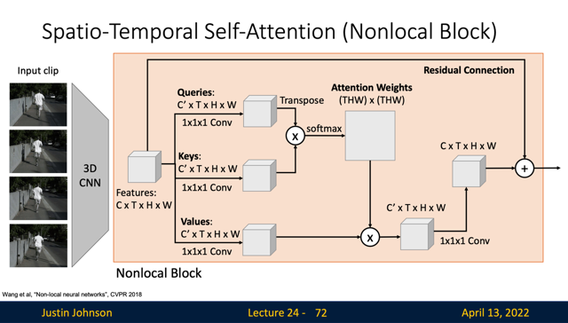</kbd></p>

> [!NOTE]
> Đầu tiên, input clip, với shape coi như là (3,T,H,W) nếu là video màu, hoặc (1, T,
> H,W) nếu là video trắng đen. Sẽ được process qua 3D CNN.
>
> Nhớ lại rằng, ta nên hiểu 3D CNN sẽ treat temporal dimension như spatial
> dimension, để rồi nó sẽ có các filter có spatial size là (K,K,K).
>
> Cho dễ hình dung, ta nói về 2D CNN trước, take input share là (3,H,W) thì mỗi
> filter sẽ có shape là (3,K,K) để convol ra một feature map (H,W) (coi như same
> padding)
>
> Vậy thì 3D CNN take input shape 3,T,H,W thì mỗi filter sẽ có shape là (3,K, K,
> K) để convol ra một feature map shape (T,H,W).
>
> Và rồi với 2D conv layer có C filter, từ input là (3,H,W) sẽ ra output (C,H,W) thì
> tương tự với 3D conv layer có C filter, input (3,T,H,W) sẽ ra output (C,T,H,W)
>
> `====`
>
> Như đã nói, cục 4D tensor (C,T,H,W) được xem như một set có THW vector,
> mỗi vector có C unit. Thì ta sẽ cần tạo bộ ba vector query, key, value cho mỗi
> vector. Bước này sẽ dùng 1x1 convolution.
>
> Ôn lại, với conv2D kernel size `=` 1x1 có C filter. Thì với input là (3,H,W), output
> cũng sẽ giữ nguyên spatial size, tức là cũng C,H,W. Vậy có thể thấy input (3,H,
> W) có thể  được coi như một set gồm có H*W các `3-dimensional` vector, để sau
> khi conv 1x1 cũng cho ra một bộ gồm có H*W vector, có điều mỗi vector bây giờ
> là `C-dimensional` vector.
>
> Vậy thì quay lại đây cũng vậy, input (C,T,H,W) sẽ được process bởi conv3D
> kernel size `=` 1x1x1, có C' filter, thì output cũng giữ nguyên spatial size, để rồi
> với mỗi filter 1x1x1 cho ra một feature map (T,H,W), C' filter cho ra output (C',T,
> H,W). Và tương tự nó cũng mang ý nghĩa là từ một bộ gồm có THW vector, mỗi
> vector có C unit, sau khi conv 1x1x1, cho ra  bộ gồm có THW vector, mỗi vector
> dài C' unit.
>
> Như vậy có thể hiểu qua 3 conv3D layer kernel size 1x1x1, ta sẽ tạo ra 3 vector
> query, key, value cho mỗi `C-dims` vector trong set THW đưa vào attention mecha
> Thể hiện dưới dạng 3 tensor Queries, Keys, Value đều có shape (C',T,H,W)
>
> `===`
>
> Tiếp, bắt đầu tính attention scores bằng cách dùng queries và keys để tính cho mỗi
> query một attention score với mỗi key. Việc này được vectorization bằng cách 
> nhân `Queries_reshape` (THW,C') với `Keys_reshape_permute` (C',THW)
> để có kết quả (THW, THW). Sau đó chuyển thành attention weight bằng cách apply
> softmax.
>
> Tiếp, dùng attention weight để tính cho mỗi vector input một linear combination
> của mọi vector (T*H*W) khác. Lấy Values reshape nhân với attention weight 
>
> (C', THW) @ (THW, THW) `=` (C', THW). Reshape lại thành (C', T, H, W)
>
> và thường sẽ được conv 1x1x1 lần nữa để quay lại `C-dimension.` Trước khi add
> với residual connection là xong. Cái này được gọi là `Non-local` Block

<br>

<a id="node-1876"></a>

<p align="center"><kbd>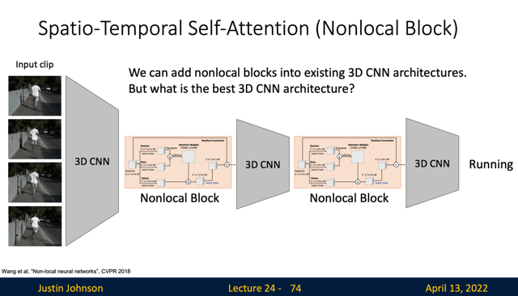</kbd></p>

<p align="center"><kbd></kbd></p>

<p align="center"><kbd>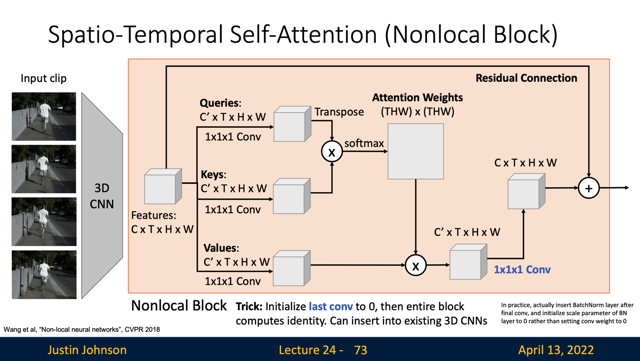</kbd></p>

> [!NOTE]
> Và thông thường người ta init conv layer cuối (cái conv3D 1x1x1 cuối)
> với 0. Để cho ban đầu cái nonlocal block này chỉ đơn giản là work như
> một identity function.
>
> Thế rồi ta sẽ insert các block này vào giữa một pretrained 3D CNN
> để `fine-tuning.`
>
> Tuy nhiên vẫn còn phải quyết định kiến trúc của 3D CNN như thế nào.

<br>

<a id="node-1877"></a>

<p align="center"><kbd>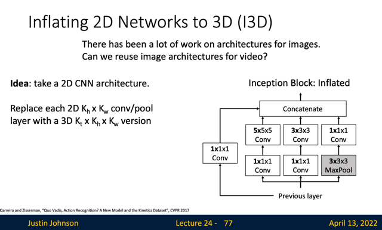</kbd></p>

<p align="center"><kbd></kbd></p>

<p align="center"><kbd>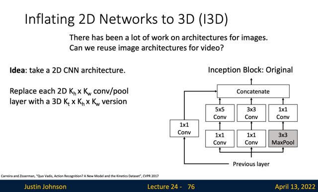</kbd></p>

> [!NOTE]
> Thì đại khái câu trả lời đó là vì ta đã thấy rất nhiều nỗ lực trong việc
> cải tiến và xây dựng những mô hình CNN 2D hiệu quả, do đó ý tưởng
> sẽ là làm sao chỉ thay đổi một chút để có thể dùng các mô hình này
> cho 3D cnn. Đó gọi là **Inflating 2D networks to 3D**
>
> Và công thức chung đó là, thay thế chỗ nào có conv2d, pool2d bằng 
> conv3d hay pool3d.

<br>

<a id="node-1878"></a>

<p align="center"><kbd>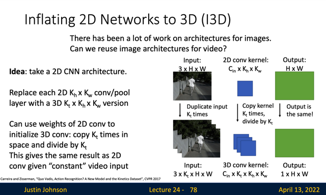</kbd></p>

> [!NOTE]
> ví dụ một conv2D layer, với một filter có shape `(Cin=3,Kh,` Kw) "đang
> dùng" để convol 2D image `(Cin=3,H,W)` Có thể được chuyển thành
> conv3D để process 3D video  `(Cin=3,Kt,H,W)` bằng cách duplicate filter
> (Kh, Kw) lên Kt lần và chia giá trị cho Kt, để thành filter `(Cin=3,Kt,Kh,Kw)`
>
> Lí do phải chia cho Kt:
>
> Đại khái là với 2d convolution. Cái hình input có shape (3, H, W) sẽ được
> convol với một filter có shape (3, Kh, Kw) (ví dụ chỉ có 1 filter cho đơn giản,
> và same padding)  để cho ra một feature map (H,W). Thì trong đó, vị trí (1,
> 1) của feature map đương nhiên như đã biết là phép dot product của filter
> tensor và một tensor có shape tương ứng "cắt ra" từ input.
>
> Thế thì bây giờ, giả sử ta copy cái hình (3,H,W) lên Kt lần để thành một
> video (3,Kt,H,W) (mà Justin gọi là boring "constant" video), và để convol
> cái video này, ta cũng copy cái filter tensor (3,Kh,Kw) lên Kt lần để thành
> (3,Kt, Kh,Kw) Thế thì khi convol cái filter (3,Kt,Kh,Kw) "lên" cái video (3,Kt,
> H,W). Thì cũng cho ra 1 feature map. Trong đó vị trí 1,1 sẽ tính bằng dot
> product của filter tensor và một tensor cắt ra từ input có cùng shape với
> tensor.
>
> Mà bản chất của phép dot product là linear operation. Nên kết quả tương
> đương lấy tổng của Kt lần, mà mỗi lần là một filter (3,Kh,Kw) convol một
> image (3,H,W). Như vậy, cái output lúc này cũng là feature map có shape
> H, W nhưng giá trị mỗi vị trí thì bằng Kt lần giá trị tương ứng của phép tính
> convol 2d.
>
> Do đó phải scale xuống filter value xuống Kt lần thì hai phép tính mới
> tương đương. (nếu chưa rõ xem hình bên)
>
> `====`
>
> Nhưng nói chung là, cách Inflating này cho phép tận dụng lại các kiến trúc
> cnn đã làm rất tốt trên image cũng như tận dụng được các pretrained
> params để làm bước khởi đầu tốt trong việc finetune với bài toán video

<br>

<a id="node-1879"></a>

<p align="center"><kbd>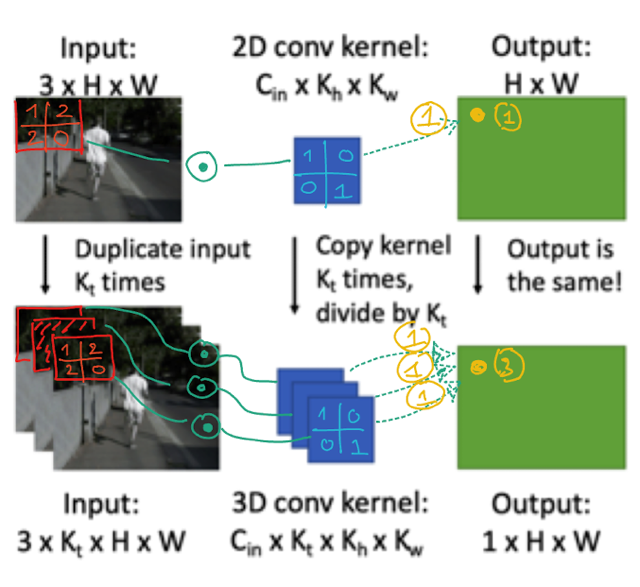</kbd></p>

> [!NOTE]
> vì mình copy filter lên Kt miếng, và dùng nó để process một
> input cũng được duplicate lên Kt miếng nên kết quả sẽ là Kt *
> (output cũ). Do đó muốn kết qủa vẫn như cũ thì phải scale
> giá trị của filter xuống Kt

<br>

<a id="node-1880"></a>

<p align="center"><kbd>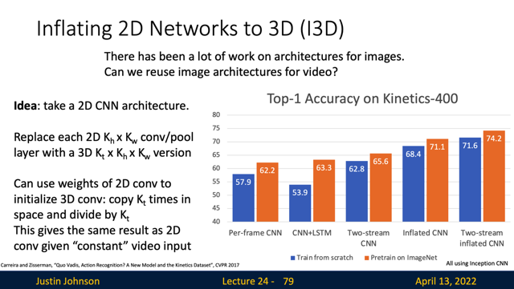</kbd></p>

> [!NOTE]
> Kết qủa so sánh các mô hình cho thấy các mô hình sử dụng conv layer
> được pretrained trên ImageNet luôn tốt hơn là train from scratch..
>
> Cũng như là các mô hình dùng technique Inflating 2D to 3D tỏ ra rất
> tốt.

<br>

<a id="node-1881"></a>

<p align="center"><kbd>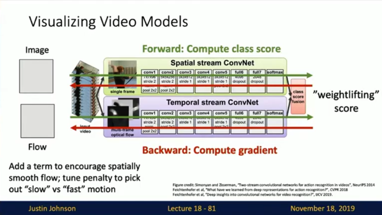</kbd></p>

> [!NOTE]
> rồi, đại khái là tương tự như những technique giúp ta visualizing 2d cnn,
> để hình dung được nó học dc cái gì. Thì với video cũng vậy. Ví dụ ta dùng
> mô hình `two-stream` inflated CNN, đã được training xong. Bắt đầu với một
> random noise video (được chia làm image và flow), ta sẽ forward nó qua 
> model để có predicted class scores.
>
> Rồi chọn một (target) class score để thực hiện backprop tính ra gradient
> của class score đó w.r.t image. Để rồi dùng gradient ascent, update image
> và flow khiến class score tăng lên.

<br>

<a id="node-1882"></a>

<p align="center"><kbd>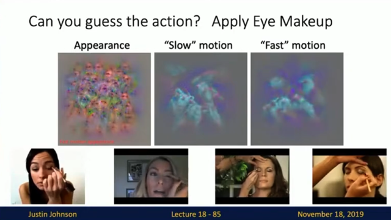</kbd></p>

<p align="center"><kbd></kbd></p>

<p align="center"><kbd>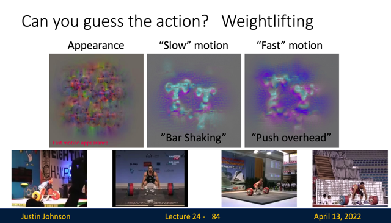</kbd></p>

> [!NOTE]
> Kết quả là với target class là Weightlifting, ta có phần Image có thể
> thấy có pattern của các "cục tạ", và phần motion là hình ảnh chuyển
> động đi lên (ảnh screenshot không phản ánh được cái này)

<br>

<a id="node-1883"></a>

<p align="center"><kbd>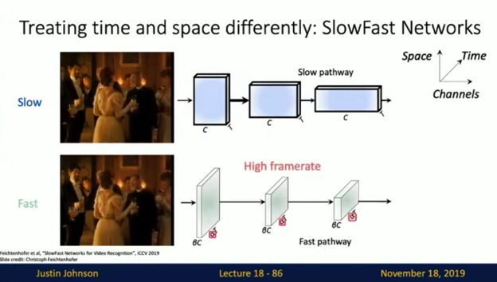</kbd></p>

<p align="center"><kbd></kbd></p>

<p align="center"><kbd>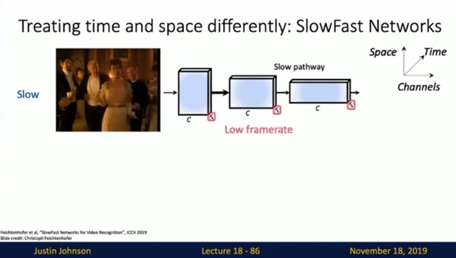</kbd></p>

> [!NOTE]
> Đại khái là, tới đây Justin nói qua một mô hình mà trong đó người ta không
> còn muốn dùng `/` phụ thuộc vào Optical Motion như của `Two-stream` model
> (vì như vậy phải dùng thuật toàn Optical motion để chuẩn bị input data của
> phần này) mà muốn train model từ raw video luôn vì khuynh hướng chung
> trong deep learning là muốn một `end-to-end` system có thể map raw data
> với target luôn.
>
> Thế thì cách làm này được cho là state of the art thời điểm bài giảng. Nó
> cũng gòm 2 stream, stream #1 đại khái là process video với một 3D cnn có
> framerate nhỏ, nhưng số channel sẽ lớn: Tức là ta sẽ chỉ lấy các  frame từ
> video với (tạm gọi) là số lượng ít ví dụ thay vì 24 fps thì ta lấy 5 fps thôi.
> Nhưng cnn như đã nói sẽ có nhiều filter, để các layer output có số channel
> lớn.
>
> Again, đây là 3D cnn, một filter sẽ có shape là (Cin,Kt,Kh,Kw), với nếu là
> conv đầu tiên take video input thì Cin `=` 3. Và nếu gọi Cout là số filter thì
> layer output của một Conv layer sẽ là (Cout,T,H',W').
>
> Trong slide minh họa có thể hiểu là qua từng layer, số channel ngày càng
> tăng tức là các layer sau có nhiều filter lên. Và spatial size (ở đây gom H,
> W thành HW, để có thể thể hiện output ở dạng 3D (C, temporal size `=` T,
> spatial size `=HW))` ngày càng nhỏ xuống.

> [!NOTE]
> Còn second stream thì dùng framerate cao hơn, tức là filter có Kt lớn,
> nhưng số channel nhỏ thôi

<br>

<a id="node-1884"></a>

<p align="center"><kbd>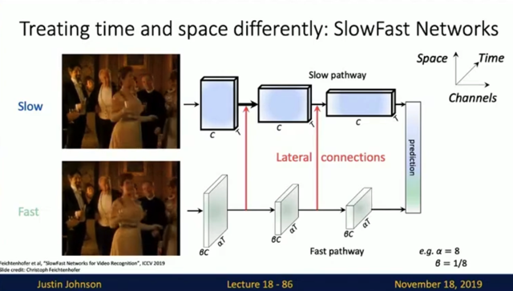</kbd></p>

> [!NOTE]
> và xen giữa là các lateral connections giúp
> (tổng hợp `-` fuse) thông tin giữa hai stream. và.
> Output ở cuối ra prediction.

<br>

<a id="node-1885"></a>

<p align="center"><kbd>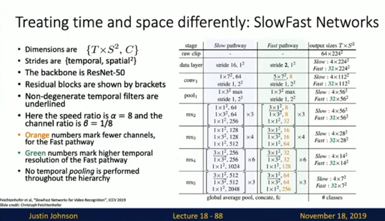</kbd></p>

> [!NOTE]
> Dimensions {TxS^2, C) tức là (C,T, H,W) với `H=W` đó. Ghi vậy là vì T, H,
> W hay T và S (ám chỉ Spatial dimension) sẽ được convol bởi C filter (Kt,
> Kh,Kw)
>
> Thông số cần cho convolution strides kí hiệu là {temporal, spatial^2} ví dụ
> Slow pathway, data layer là (16,1^2) tức là trong phép convol, mỗi lần
> filter sẽ "slide" đi 16 vị trí trên temporal dimension, và 1 trên spatial
> dimension H,W. Nhưng với Fast pathway thì temporal stride là **2.**Vậy
> có thể hiểu là, fast với slow là chỗ đó: trên slow pathway, kiểu như 16
> frame thì mới lấy 1 frame, còn với fast pathway thì cứ 2 frame thì lấy 1
> frame.
>
> Cũng vì thế mà output size của data layer trên slow pathway sẽ là 4,
> 224^2 tức là temporal dimension chỉ bằng 4 (y như việc ta convol 2d
> image với stride lớn thì cái outsize sẽ nhỏ lại vậy), còn spatial  size vẫn
> 224 vì spatial stride là 1, dễ hiểu. Tương tự, với fast path, temporal stride
> nhỏ hơn, nên temporal dimension bớt bị "bóp" lại hơn (32)
>
> `===`
>
> Tiếp, xét conv1 của hai pathway: của slow pathway là 1x7^2, 64, stride 1,
> 2^. Có nghĩa là nó có 64 filter, mỗi filter có shape là (1,7,7). Để rồi khi
> convol output từ data layer, nó sẽ cho ra output có temporal giữ nguyên
> vì Kt `=` 1 và temporal stride `=` 1 (y như conv image với filter 1x1 thì kích
> thước giữ nguyên), còn vì Kh, Kw `=` 7, cộng với spatial stride `=` 2 nên
> ```text
> spatial size sẽ là (224 + 2*3 - 7 + 1 )/2 = 224/2 = 112 (padding = 3, không
> ```
> nói nhưng tự hiểu)
>
> Tương tự với fast pathway, có 8 filter size 5x7^2, stride 1,2^2 sẽ tạo output
> ```text
> có temporal dimensions = (32 + 2*2 -5 + 1)/1 = 32 (tự hiểu padding = 2).
> ```
> ```text
> và spatial dimensions = (224 +2*3 - 7 +1)/2 = 224/2 = 112.
> ```
>
> Như vậy có thể thấy slow path conv1 có nhiều filter hơn slow path giúp số
> channel tăng lên nhanh hơn (64 so với 8)
>
> ```text
> Tương tự vậy, ở cả hai path, spatial luôn nhỏ lại dần từ 224-112-56-28-14-7
> ```
> Còn với temporal dims, slow path nhỏ hơn (4) fast path (32).
> Với channels dims, slow path lớn hơn fast path.
>
> Nói chung hiểu sơ vậy, ngoài ra còn có residual block,...

<br>

<a id="node-1886"></a>

<p align="center"><kbd>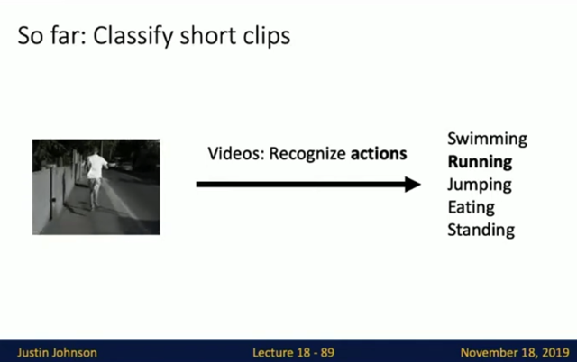</kbd></p>

> [!NOTE]
> vài phút cuối Justin lướt qua cả task khác
> của video: bên cạnh classification

<br>

<a id="node-1887"></a>

<p align="center"><kbd>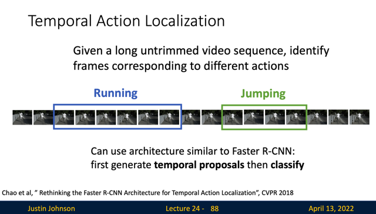</kbd></p>

> [!NOTE]
> thì còn có temporal action localization: đại khái là với một long
> untrimmed video sequence, nhiệm vụ là identify những action khác
> nhau. Thế thì Justin nói rằng, ta có thể dùng kiến trúc giống như Faster
> `R-CNN` để bước 1 là predict `/` generate ra temporal proposals (như với
> object detection, thì predict region proposals vậy) `-` tức là một "đoạn"
> trên chiều temporals mà nghi ngờ là có action. Sau đó là classify cái
> đoạn đó với mô hình classify như đã nói đến xuyên suốt trong bài này

<br>

<a id="node-1888"></a>

<p align="center"><kbd>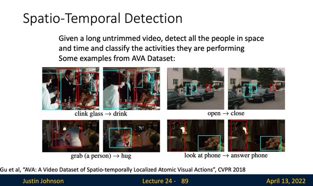</kbd></p>

> [!NOTE]
> và một nhiệm vụ khác gọi là `Spatio-Temporal` detection còn thách thức 
> hơn nữa khi muốn predict `/` detect object (ví dụ như people trong khung
> hình) và còn classify activity của họ. Cái này có một dataset là AVA,
> và Justin cho rằng sẽ phát triển thêm trong những năm tới.

<br>

<a id="node-1889"></a>

<p align="center"><kbd>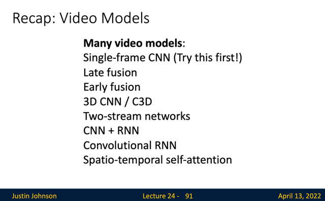</kbd></p>

<br>

