# EECS 498-007/598-005 (2022) - ASSIGNMENT 4 (Part 1): ONE-STATE OBJECT DETECTOR

📊 **Progress:** `63` Notes | `170` Screenshots

---
<a id="node-1474"></a>

<p align="center"><kbd>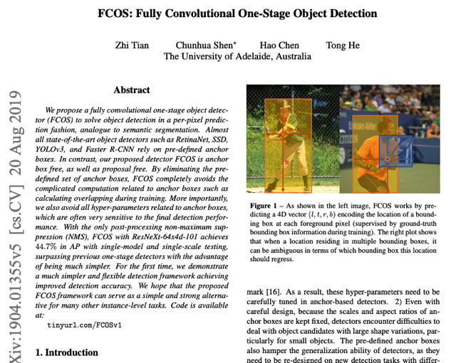</kbd></p>

<br>

<a id="node-1475"></a>

<p align="center"><kbd>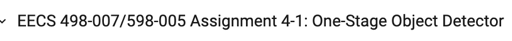</kbd></p>

<p align="center"><kbd></kbd></p>

<p align="center"><kbd>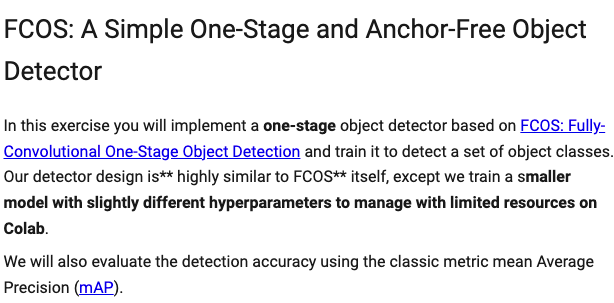</kbd></p>

<br>

<a id="node-1476"></a>

<p align="center"><kbd>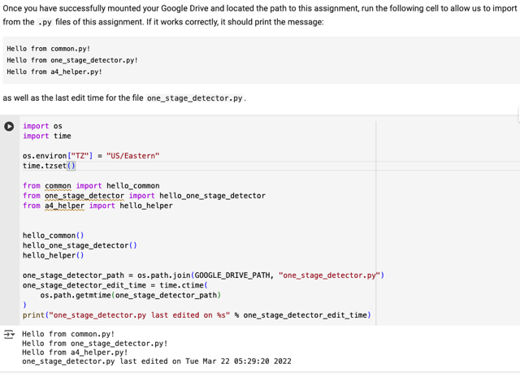</kbd></p>

<br>

<a id="node-1477"></a>

<p align="center"><kbd>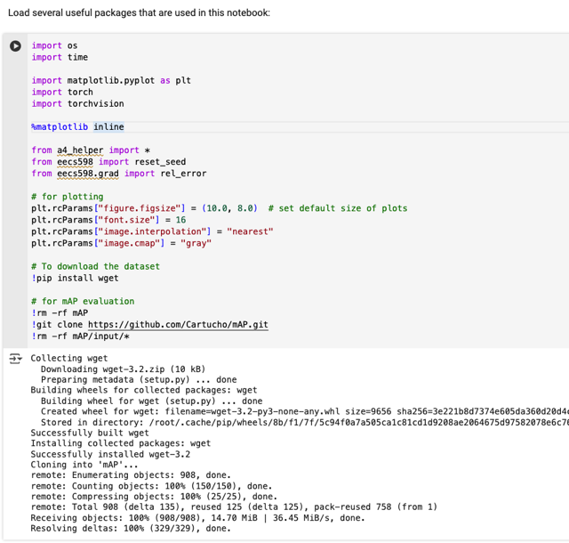</kbd></p>

<br>

<a id="node-1478"></a>

<p align="center"><kbd>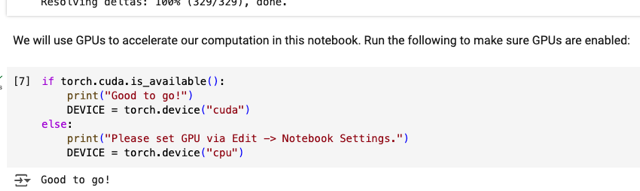</kbd></p>

<br>

<a id="node-1479"></a>

<p align="center"><kbd>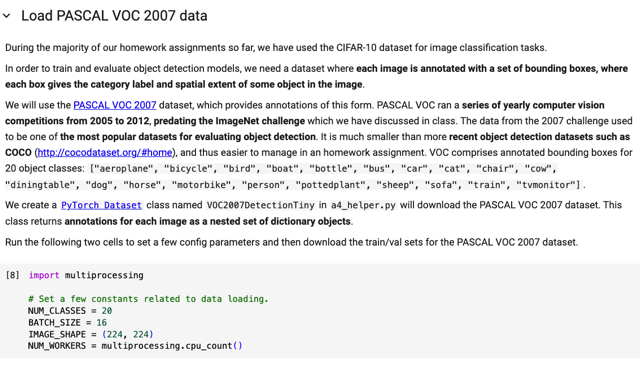</kbd></p>

> [!NOTE]
> Đại khái là nói về việc ta sẽ dùng PASCAL VOC 2007 dataset. Đây là một
> trong những bộ data nổi tiếng nhất trong object detection mà trước
> ImageNet thì kiểu như nó cũng dẫn dắt một chuỗi các cuộc thi trong lĩnh
> vực cv.
>
> Sau này có bộ COCO mà mình đã gặp trong cs231n Assignment 3 `-`
> Transformer Image captioning.
>
> Trong bộ data này, các image có các object thuộc về 20 loại. Mỗi image
> được annotated các vị trí của bounding box và category của nó. 
>
> Họ làm giùm một pytorch class VOC2007DetectionTiny đảm nhiệm việc 
> download dataset. 
>
> Đầu tiên ta sẽ define một số hyper parameters như num class, batch size,
> image shape, số workers (lấy từ cpu.count())

<br>

<a id="node-1480"></a>

<p align="center"><kbd></kbd></p>

> [!NOTE]
> đại khái là dùng các constant đã define chứ đừng hardcode. đoạn
> code tiếp theo sẽ giúp download dataset về Google Drive. Nhưng nếu
> bị lỗi thì tự download về và up file lên cũng dc

<br>

<a id="node-1481"></a>

<p align="center"><kbd>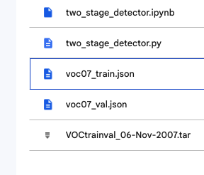</kbd></p>

<p align="center"><kbd>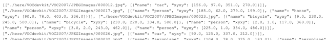</kbd></p>

<p align="center"><kbd></kbd></p>

<p align="center"><kbd></kbd></p>

<p align="center"><kbd>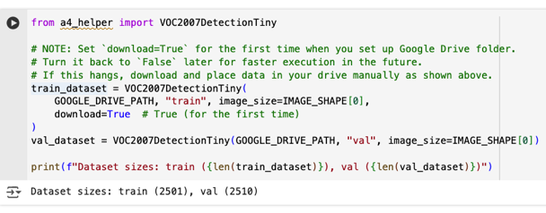</kbd></p>

> [!NOTE]
> có thể thấy mỗi image có label là một class name, và 4 tọa độ
> của bounding box

<br>

<a id="node-1482"></a>

<p align="center"><kbd>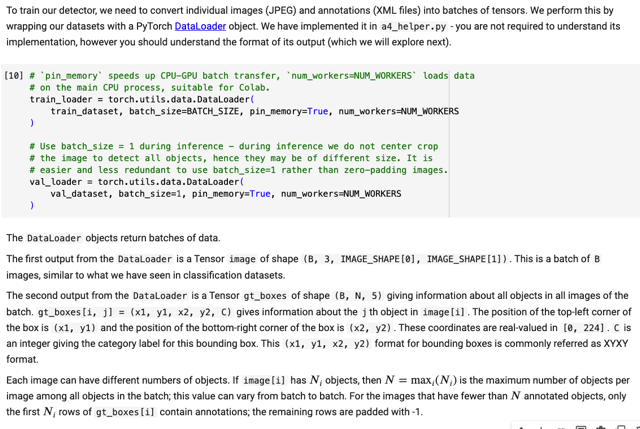</kbd></p>

> [!NOTE]
> rồi, đại khái là ta sẽ **dùng Pytorch DataLoader** để giúp ta chuẩn bị và **cung
> cấp từng batch data**, mà mỗi sample bao gồm**image tensor** và **label tensor**.
>
> ở đây người ta đề nghị sẽ quay lại tìm hiểu sau ở trong **a4_helper**. Còn bây
> giờ quan trọng là hiểu các mà label được chuẩn bị.
>
> vậy, như đã nói DataLoader sẽ chuẩn bị từng batch dataset, thì nó sẽ bao
> gồm "**xb**" sẽ có shape **(B,3,W,H)** với W, H là bề rộng dài của image `=` 
> `IMAGE_SHAPE[0]` và `IMAGE_SHAPE[1].` 
>
>
> **yb** sẽ là tensor shape **(B,N,5)**: tức là, B images, mỗi cái có label sẽ là một
> matrix **(N,5)**. Trong đó **N là số lượng object nhiều nhất xuất hiện trong một
> bức hình nào đó trong batch này**. Ví dụ là 3 đi, thì có nghĩa là trong batch
> có ít nhất một bức hình nào đó mà nó có 3 object. Để rồi label của nó sẽ là
> matrix **3 hàng 5 cột**, **mỗi hàng sẽ là một vector 5 con số x1, y1, x2, y2, c**
> cho biết tọa độ của góc trên `-` trái và góc dưới `-` phải của bounding box. 
> Còn **c** là class id.
>
> Vậy **đương nhiên** **có bức chỉ có 2 hoặc 1 object**, khi đó **label của nó vẫn là
> matrix 3x5** nhưng**chỉ có 2 hoặc 1 hàng là có số thôi**, còn lại là **-1** (gọi là dc
> **null padding**)

<br>

<a id="node-1483"></a>

<p align="center"><kbd></kbd></p>

<br>

<a id="node-1484"></a>

<p align="center"><kbd>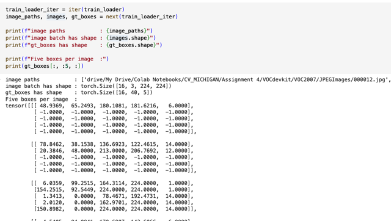</kbd></p>

> [!NOTE]
> đây, in batch đầu tiên ra coi, tensor xb thì có shape (16,3,244,244) ko có gì
> đáng nói.
>
> yb thì có shape (16,40,5) vậy tức là trong cái batch đầu này có một tấm hình
> có 5 object (chính là tấm thứ 3, trong đó nhìn vào c ta thấy nó có 2 object
> thuộc c `=` 1, và 3 object c `=` 14 (trong tổng số có 20 posible classes)
>
> *Trong notebook có thể dùng kiểu cũ là `train_loader_iter.next(),` sửa lại thành
> `next(train_loader_iter)` là được

<br>

<a id="node-1485"></a>

<p align="center"><kbd>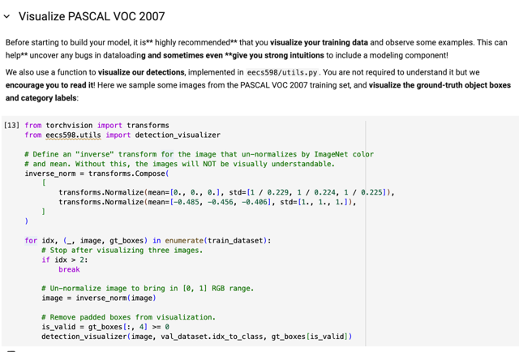</kbd></p>

> [!NOTE]
> đại ý là trước khi làm thì luôn luôn nên visualize (xem thử) các image
> trong training set, nhờ đó có thể giúp phát hiện bug cũng như giúp ích
> rất nhiều trong việc hiểu về nhiệm vụ cần làm.
>
> Họ sẽ giúp mình sample vài cái hình và dùng một helper function để
> vẽ cái bounding box cũng như class label. Khuyến nghị nên xem qua 
> **detection_visualizer().**

<br>

<a id="node-1486"></a>

<p align="center"><kbd>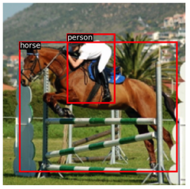</kbd></p>

<p align="center"><kbd>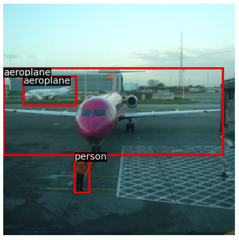</kbd></p>

<p align="center"><kbd>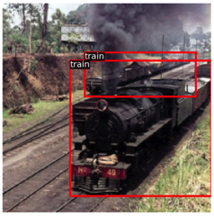</kbd></p>

<p align="center"><kbd></kbd></p>

<p align="center"><kbd></kbd></p>

<p align="center"><kbd></kbd></p>

<p align="center"><kbd>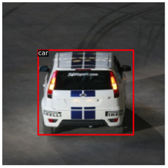</kbd></p>

<br>

<a id="node-1487"></a>

<p align="center"><kbd>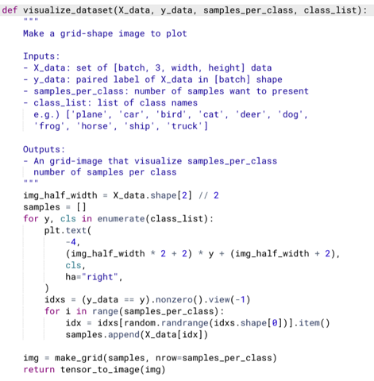</kbd></p>

<br>

<a id="node-1488"></a>

<p align="center"><kbd>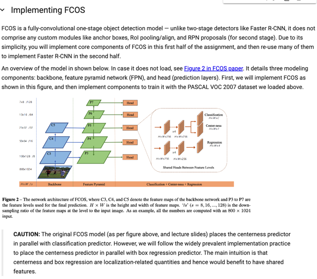</kbd></p>

> [!NOTE]
> Đại ý là ta sẽ làm FCOS viết tắt của Fully Convolutional `One-Stage` object
> detection model. Thì cái này nó ko có những cái như anchor box, Region
> of Interest `pooling/align,` RPN...Ta sẽ làm cái này trước và dùng lại nhiều
> component của nó trong phần 2 khi ta sẽ build một cái Faster `R-CNN` (Two
> Stage object detection model).
>
> Sơ lược thì cái này có 3 thành phần chính: backbone CNN, feature pyramid
> network FPN có nhắc đến trong cái slide mà Justin nói rằng kể từ khi paper
> `Faster-RCNN` ra đời thì có những cải tiến thêm giúp đẩy hiệu suất lên nữa

<br>

<a id="node-1489"></a>

<p align="center"><kbd>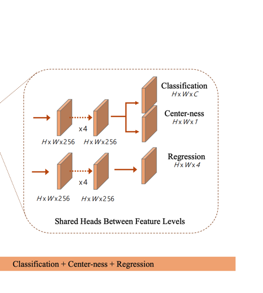</kbd></p>

<p align="center"><kbd>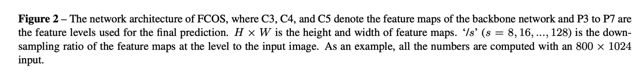</kbd></p>

<p align="center"><kbd></kbd></p>

<p align="center"><kbd></kbd></p>

<p align="center"><kbd>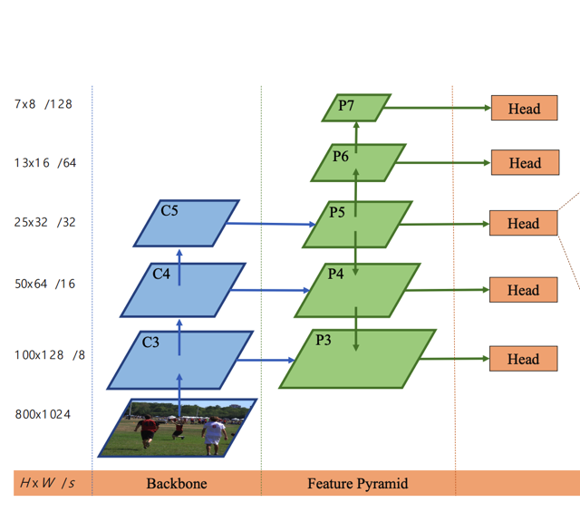</kbd></p>

> [!NOTE]
> thì ở đây họ cho biết ta sẽ làm khác mô hình FCOS một chút, thay vì theo đó người ta để cái Classification predictor song
> song với `center-ness` predictor như trong hình, thì ở đây do ta thấy rằng predict ra `center-ness` (có thể hiểu cái này predict
> ra tâm của bbox) cũng tương tự như cái regression predictor nên ta sẽ cho nó chung một nhánh để tận dụng `shared-param`

<br>

<a id="node-1490"></a>

<p align="center"><kbd>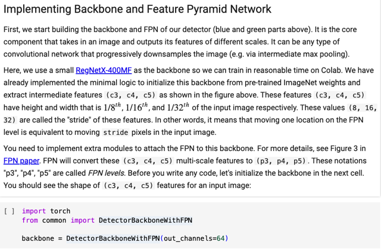</kbd></p>

> [!NOTE]
> rồi, đại khái là ta biết cái fcos này có 3 phần là backbone cnn, feature pyramid
> network và prediction head.
>
> Vậy thì cái backbone cnn sẽ xử lý cái hình gốc, rồi qua từng layer như đã biết
> output của nó sẽ giảm spatial size (và tăng depth). Nên họ**cho rằng cái
> backbone cnn có thể kiến trúc ntn cũng được miễn là nó liên tục giảm dần
> spatial size của output là được** (với các layer mà ta đã biết như max pooling.
> hoặc convolution với stride giúp giảm spatial size)
>
> Vậy ở đây **người ta chọn backbone dùng mô hình CNN** có tên là **RegNetX-400MF**
> và họ **đã giúp làm giùm cái phần khởi động cái backbone model** này với
> **pre-trained weights (train trên ImageNet)**và **extract feature**(tạm hiểu là
> output từ các layer) ra (c3, c4, c5). Nó lần lượt có spatial size (W, H) bằng `1/8,`
> `1/16,` `1/32` image gốc.
>
> Ở đây cũng nhắc lại khái niệm **stride** trong bài có nói, ví dụ 8 có nghĩa là **nhích
> một vị trí trên feature map sẽ tương đương nhích 8 vị trí trên ảnh gốc**.
>
> **Nhiệm vụ của mình** là thực thi một module làm nhiệm vụ **gắn kết cái FPN với cái
> backbone CNN này**. Có lẽ cần tham khảo FPN paper. Thì cái FPN có nhiệm vụ
> là convert c3, c4, c5 thành cái gọi là **multi-scale features** p3, 4,5, mà ở trong
> FPN gọi là FPN level.

<br>

<a id="node-1491"></a>

<p align="center"><kbd></kbd></p>

<br>

<a id="node-1492"></a>

<p align="center"><kbd>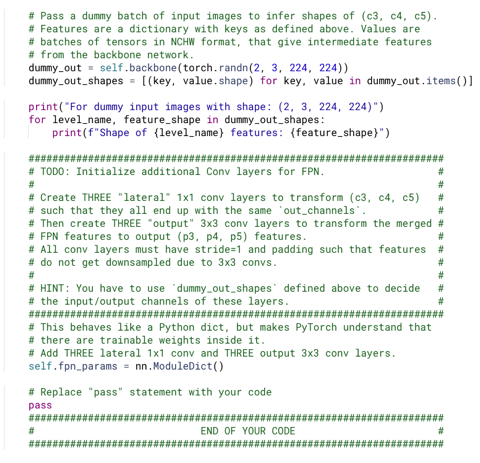</kbd></p>

<p align="center"><kbd>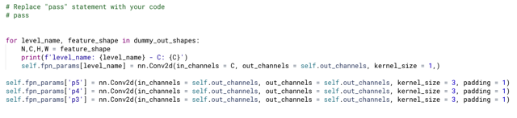</kbd></p>

<p align="center"><kbd></kbd></p>

<p align="center"><kbd></kbd></p>

<p align="center"><kbd>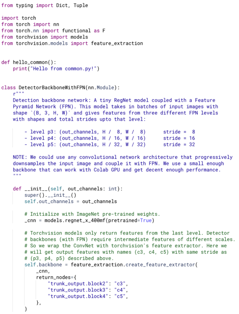</kbd></p>

> [!NOTE]
> đại khái là trong cái module này, nó sẽ kiểu như là một**tiny RegNet** được gắn
> với **một FPN**. Model sẽ nhận một batch các images và trả ra features của 3
> FPN levels với shape có **depth size giữ nguyên** nhưng **spatial size lần lượt là
> `1/8,` `1/16,` 1/32** raw image input size.
>
> Họ nhắc lại một chú ý là trong bài toán này ta **có thể dùng bất cứ kiến trúc
> nào có thể giảm spatial size progressively** đều được, và  trong phạm vi
> assignment này họ **chọn một mô hình nhỏ để train cho nhanh**.
>
> Ta thấy trong **__ini__** người ta dùng **models api** của pytorch, để dùng
> **pre-trained model RegNet X 400mf**.
>
> Sau đó vì nếu chỉ như vậy thì đương nhiên nó **chỉ trả ra cho mình prediction
> tức output của layer cuối**, mà **ta cần là output của 3 layer** do đó người ta dùng
> **feature_extraction** của pytorch để giúp việc này.
>
> Function **create_feature_extractor** sẽ take**input cái model**, và define một
> dictionary với **key** ở đây mình hiểu nó là **tên của cái model regnet's layer**, value
> là tên của output mà ta muốn nó gán vô.
>
> Xong người ta mới **pass vào nó một dummy batch** (giá trị ngẫu nhiên) mục
> đích là **để biết `/` có được kích thước của các feature** tức output của các layer
> trung gian mà ta đã yêu cầu với `feature_extraction` ở trên nên có thể hiểu
> **dummy_out_shapes** là một dictionary, các key sẽ là  'c1', 'c2', 'c3' mà ta định
> nghĩa ở `return_nodes` ở trên, còn **value sẽ là cái tensor output từ 3 layer có
> tên là trunk_output.block2/3/4** (với input là dummy tensor random), chủ yếu là
> nhờ đó ta có các **shape của các intermediate output.**
>
> `=====`
>
> Rồi nhiệm vụ của mình bây giờ là**dùng conv 1x1 layer để transform c3, c4, c5**
> sao cho kết quả chúng **đều có chung depth**(quy định bởi argument
> **out_channels**)
>
> Sau đó ta sẽ dùng **F.interpolate** với**scale factor `=` 2 để tăng spatial size** lên
> gấp đôi, rồi **merge với lateral conv output.**

> [!NOTE]
> ```text
> 2*pad = k - 1 = 3-1 = 2 -> pad = 1
> ```

<br>

<a id="node-1493"></a>

<p align="center"><kbd>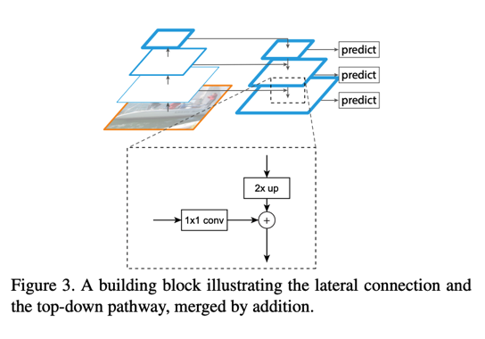</kbd></p>

<p align="center"><kbd></kbd></p>

<p align="center"><kbd>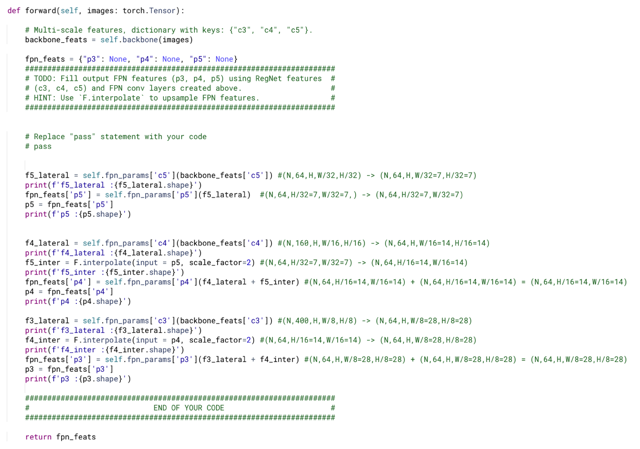</kbd></p>

> [!NOTE]
> output từ c5 sẽ qua conv 1x1 và conv 3x3 để thành p5
>
> p5 downsample xuống, output từ c4 sẽ qua conv 1x1 để merge (cộng) với
> p5 downsample, kết quả pass qua conv 3x3 để thành p4.
>
> p4 downsample xuống, output từ c3 sẽ qua conv 1x1 để merge với p4
> xuống, kết quả sẽ pass qua conv 3x3 để thành p3

<br>

<a id="node-1494"></a>

<p align="center"><kbd></kbd></p>

<p align="center"><kbd>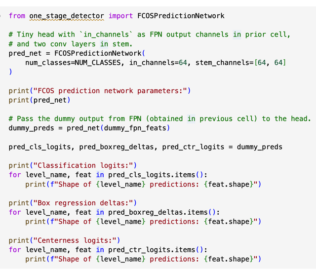</kbd></p>

<p align="center"><kbd>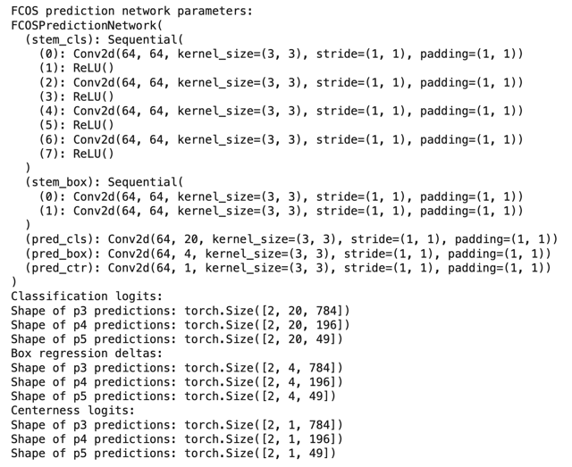</kbd></p>

<p align="center"><kbd></kbd></p>

<p align="center"><kbd></kbd></p>

<p align="center"><kbd></kbd></p>

<p align="center"><kbd>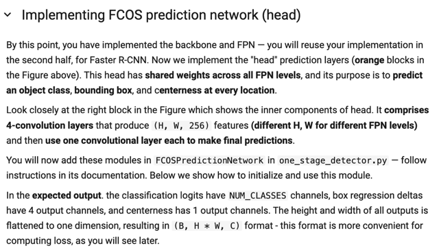</kbd></p>

> [!NOTE]
> rồi, giờ ta sẽ implement "head" prediction layers, nơi mà ta sẽ làm những
> layer output ra
>
> 1. **Các class scores**
>
> 2 . **Bốn giá trị scalar `-` "box regression deltas"** có thể tạm hiểu thể hiện "
> khoảng  cách" từ location đó tới 4 cạnh của b.box
>
> 3. **Một giá trị logit (probability) của center-ness** (tạm hiểu là **khả năng tại
> location  đó là tâm của cái b.box**)
>
> Và cái head này nó sẽ có **2 nhánh**, **một nhánh output ra classification
> scores**, **một nhánh output ra `center-ness` và regression**
>
> Và mỗi nhánh đều**gồm 4 conv layer mà output đều có depth là 256**,
> **spatial size thì tùy vào feature level**, tức là **cái head này sẽ được gắn
> vào từng level hay nói dễ hiểu hơn là nó sẽ gắn vào và nhận output từ mọi
> level p3, p4, p5 của FPN.**

<br>

<a id="node-1495"></a>

<p align="center"><kbd>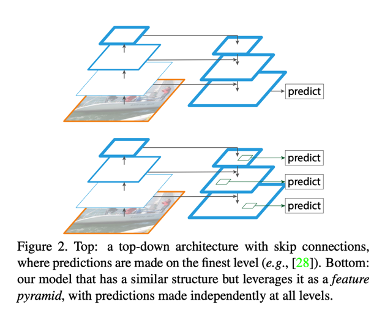</kbd></p>

<p align="center"><kbd>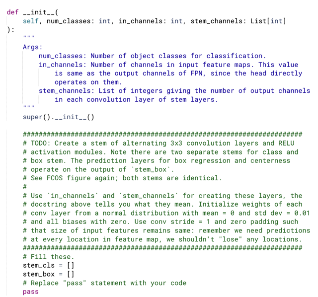</kbd></p>

<p align="center"><kbd></kbd></p>

<p align="center"><kbd></kbd></p>

<p align="center"><kbd>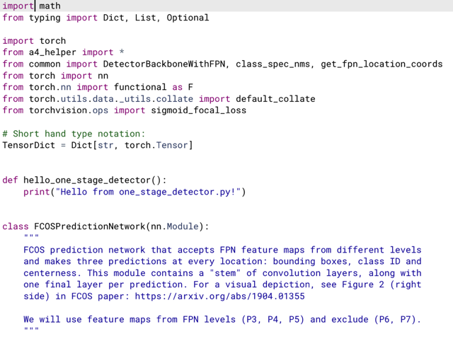</kbd></p>

> [!NOTE]
> rồi theo mô tả thấy thấy đại khái FCOSPredictionNetwork sẽ **nhận input là
> các feature maps tensor từ FPN**, và **ở các level khác nhau** như đã biết
>
> Để rồi nó (tức là cái này FCOSPredictionNetwork, đóng vai trò là cái 'head'
> đang nói) sẽ gồm **một "stem" of conv layers** tức có nghĩa là (...) với **một 
> prediction layer để predict ra final predictions**.

> [!NOTE]
> từ hình ảnh có thể hiểu trong assignment này ta sẽ làm cái "ở dưới",
> tức là output ra prediction ở mọi feature level p3,4,5 của FPN. Còn cái
> trên có nghĩa là chỉ output ở level 5 thôi.

> [!NOTE]
> Argument bao gồm `num_classes,` là số class cần predict, `in_channels` là
> depth của input (output từ FPN, như ta đã làm ở trên thì đều có depth bằng
> nhau hết). Còn stem channels là list các integers quy định depth (số filter)
> của các conv layers trong stem layers. (nhắc lại chữ stem ý là khúc này
> giống như cái nhánh cây, thân cây) vì nó chỉ khác cái prediction layer ở cuối)
> Và như hình hay trong mô tả sẽ có 2 'stem'. Trong đó một cái sẽ output ra
> song song 2 final layer để cho `center-ness` và regression (nhắc lại người ta
> đã nói ở đầu, là mình sẽ làm hơi khác với trong FCOS paper khi để
> `center-ness` và regression chung một stem). Còn một cái sẽ gắn với
> classification layer để predict ra class scores.
>
> Theo hint thì ta sẽ dùng conv layer với input's depth và số filter quy định từ
> `in_channels` và `stem_channels,` khởi tạo random Normal zero mean, stddev
> 0.01. Mọi bias `=` 0. Stride 1, same" padding.
>
> Hint cũng nhắc nhở ta cần predictions ở mọi location của feature maps. vậy
> ta cần hình dùng rằng **tại mỗi spatial position của output** (cùng W,H với
> input) sẽ predict ra:
>
> Với classification head: **num_classes class scores**, vậy tensor sẽ là
> `batch_size,` W*H, `num_classes`
>
> Với regression head:
>
> `+` một con số **center-ness logit**, thể hiện rằng **vị trí đó có phải là center
> của một object không.**
>
> `+` bốn con số thể hiện **box regression delta**, tạm hiểu là khoảng cách từ vị
> trí đến 4 cạnh của bounding box.

<br>

<a id="node-1496"></a>

<p align="center"><kbd>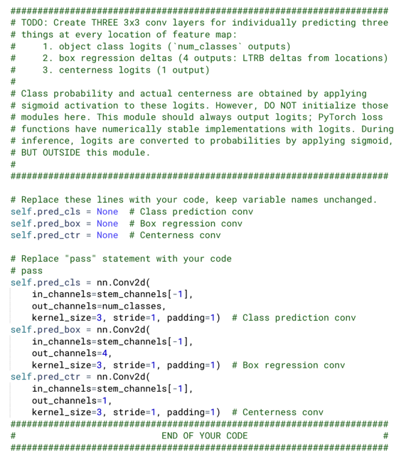</kbd></p>

<p align="center"><kbd></kbd></p>

<p align="center"><kbd>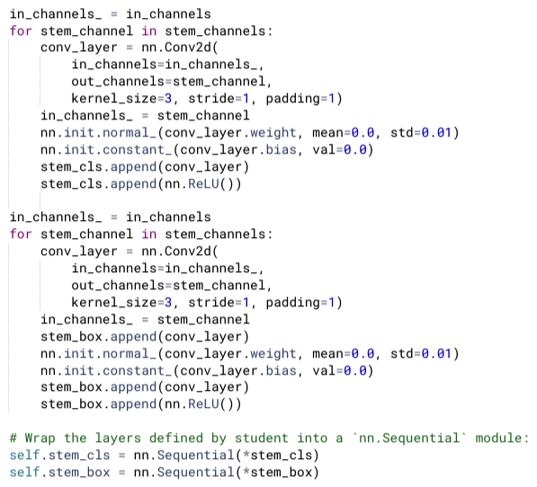</kbd></p>

> [!NOTE]
> Hai "stem" layer là chuỗi các conv layer `-` relu,  với `out_channels` quy định
> trong `stem_channels.` Dùng nn.init để initialize các layer này.

> [!NOTE]
> còn các prediction head thì bao gồm 3 head `=` 3 conv layer

<br>

<a id="node-1497"></a>

<p align="center"><kbd>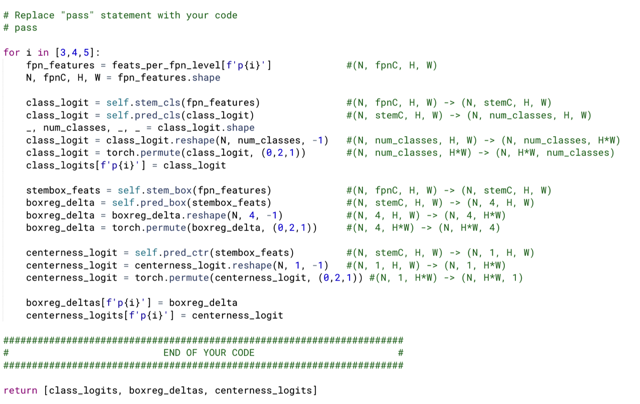</kbd></p>

<p align="center"><kbd></kbd></p>

<p align="center"><kbd>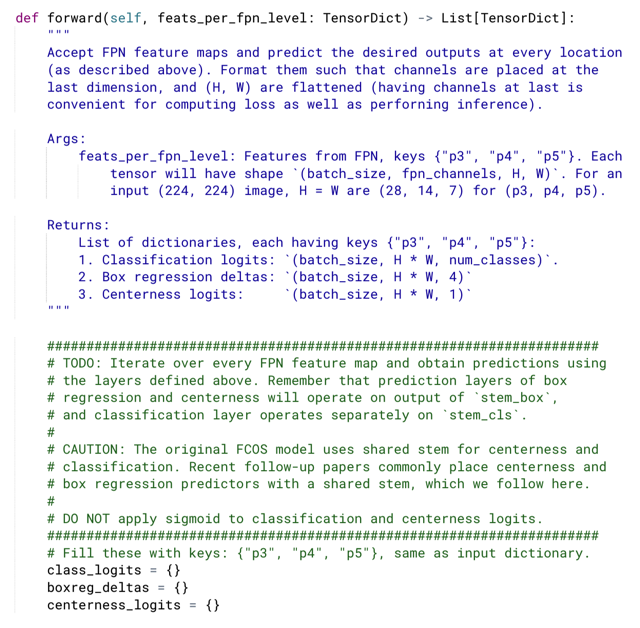</kbd></p>

> [!NOTE]
> Đại khái là ta sẽ **lấy feature ở từng level của FPN ra** (mà ta sẽ nhận
> dưới dạng một **tensor dict**) để rồi với mỗi cái ta sẽ đều:
>
> **Forward qua 2 stem layers**. Rồi **output từ classify stem thì cho qua
> tiếp classification head** còn **output từ centers `/` regression stem thì cho
> qua hai cái head kia.**Cuối cùng là theo như gợi ý ta sẽ cần reshape để flatten cái spatial
> dimensions W,H ra thành W*H

<br>

<a id="node-1498"></a>

<p align="center"><kbd>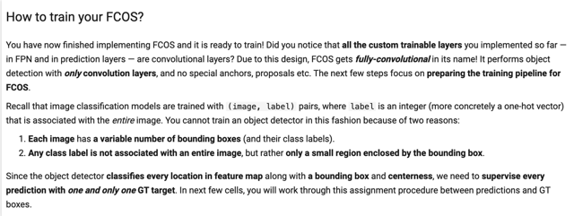</kbd></p>

> [!NOTE]
> rồi, họ nói tới đây là ta đã làm xong FCOS để sẵn sàng cho việc training rồi
> thế thì ta mới để ý rằng mọi cái nãy giờ ta làm chỉ bao gồm convolution layer
> đây cũng chính là nguyên nhân của cái tên FCOS Fully Convolutional.
>
> Thế thì vì đặc điểm của bài toán object detection là, (với mỗi bức hình), ta sẽ
> dự đoán có thể ra nhiều b.box và mỗi b.box sẽ gắn với một class (object)
> nên phần tiếp theo ta sẽ làm đại khái là **cơ chế để map model prediction với
> ground truth target box để từ đó mới supervised `/` tính loss function các 
> kiểu**

<br>

<a id="node-1499"></a>

<p align="center"><kbd>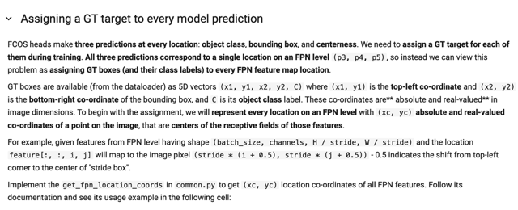</kbd></p>

> [!NOTE]
> đại khái là như ta đã thấy qua việc implement FCOS module vừa rồi, về cơ
> bản có thể thấy nó sẽ **nhận một giá trị trên feature map**, nói đúng hơn là
> **một 'depth' vector trên feature map** ứng với một level (trong 3 level) và map
> vector này `với/` tính toán ra 3 thứ:
>
> `-` một **vector** chứa **num_classes** con số **logit class scores**
>
> `-` một **con số** logit **center-ness** `-` **khả năng tại location đó là center** của
> một object.
>
> `-` một **vector** có **4 con số** tạm hiểu là khoảng cách **từ location đó tới hai
> góc `top-left` `/` `bottom-right` của b.box** mà cũng chính là khoảng cách tới 4
> cạnh của box
>
> Vậy đại ý ở đây người ta nói mình có thể cho rằng bước **assign ground truth
> target box cho model prediction** thực chất là **assign cho mỗi một location
> trên feature ma**p (của FPN).
>
> Thế thì, mỗi**GT box** nó sẽ có dạng là **một 5D vector [x1, y1, x2, y2, C]**
> cho biết **tọa độ của `top-left` và `bottom-right` corner** của GT box, cộng với**class id**.
>
> Vậy để bắt đầu làm cái vụ assignment này thì ta **cần thể hiện mỗi location
> trên một FPN level bằng giá trị tọa độ (xc, yc)** của **một điểm trên hình gốc**
> mà điểm đó **chính là tâm của receptive fields ứng với (feature) location đó**.
>
> Người ta cho mình sẵn công thức để với một location trên feature map có
> shape là **(batch size, channels, H `/` stride, W `/` stride)** với H,W là dài rộng
> của hình gốc thì**với một location tại spatial location (i, j)**thì **center của cái
> receptive field tương ứng với nó** (tức là cái điểm trên hình gốc mà ứng với
> cái feature location đó) sẽ là**[stride*(i+0.5), stride*(j+0.5])]**
>
> Thế thì bây giờ ta sẽ làm cái **get_fpn_location_coords** để **tính toán (xc, yc)
> cho mọi FPN-features.**

<br>

<a id="node-1500"></a>

<p align="center"><kbd>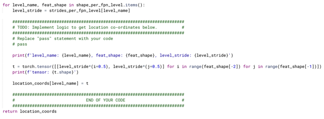</kbd></p>

<p align="center"><kbd></kbd></p>

<p align="center"><kbd>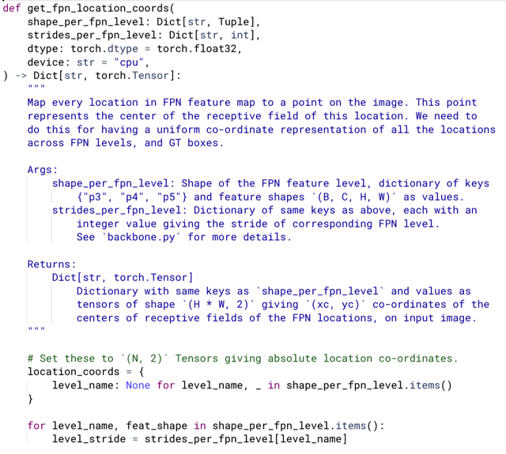</kbd></p>

> [!NOTE]
> Yêu cầu của function này là tính ra hai giá trị tọa độ [xc, yc] cho mỗi location
> trên feature map.
>
> Input là shape của 3 cái feature tensor của FPN và gía trị stride đã dùng.

> [!NOTE]
> Cũng không có gì đáng nói, **với từng vị trí trong spatial map** (xác định 
> bởi hai "tọa độ" theo spatial dimension `-` là hai dimension cuối, 
> `feat_shape[-2]` và `feat_shape[-1],` ta mới **dùng công thức người ta cho
> sẵn** để **tính ra tọa độ tương ứng của location đó trên image gốc**.
>
> Với mỗi location ta có 1 cặp tọa độ xc, yc

> [!NOTE]
> Quay lại sau để sửa lại: Dùng
> device cũng như dtype

<br>

<a id="node-1501"></a>

<p align="center"><kbd>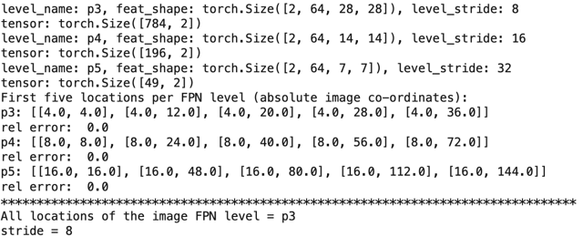</kbd></p>

<p align="center"><kbd></kbd></p>

<p align="center"><kbd>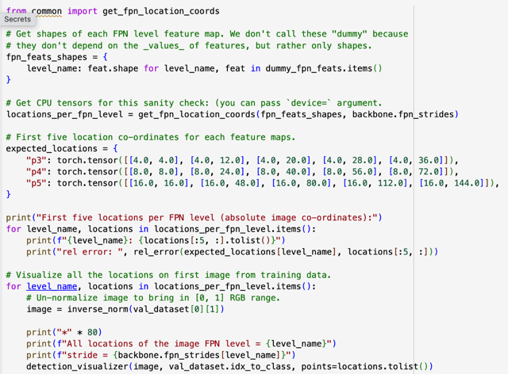</kbd></p>

<br>

<a id="node-1502"></a>

<p align="center"><kbd>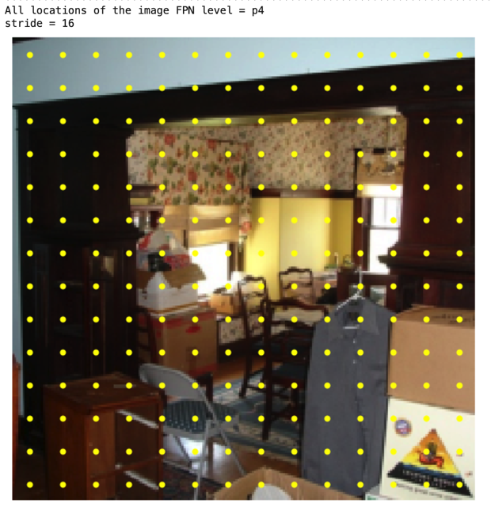</kbd></p>

<p align="center"><kbd>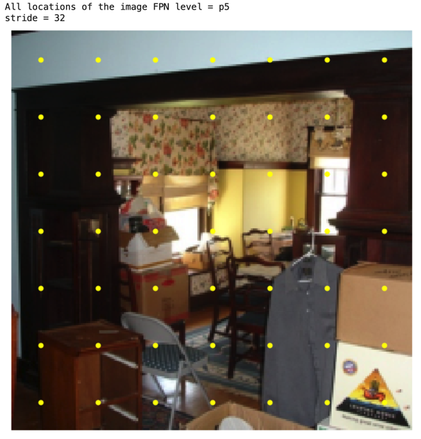</kbd></p>

<p align="center"><kbd></kbd></p>

<p align="center"><kbd></kbd></p>

<p align="center"><kbd>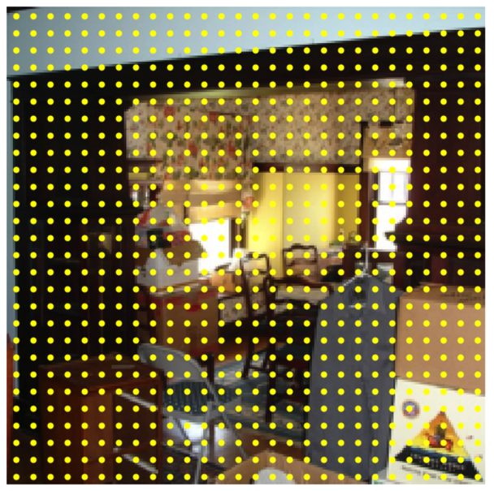</kbd></p>

<br>

<a id="node-1503"></a>

<p align="center"><kbd>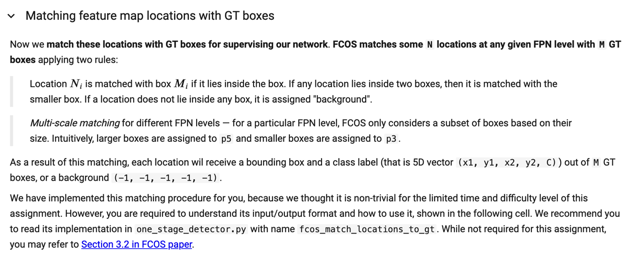</kbd></p>

> [!NOTE]
> Nói về quy tắc ta sẽ làm theo trong việc map `/` match giữa feature map
> location với GT boxes: (Trước đó ta sẽ quy ước với nhau khi gọi "**feature
> map location**" hoặc "**feature center**". Là nói về cái chấm màu vàng, **center
> của receptive field trên ảnh gốc** ứng với mỗi location trên feature map)
>
> Rule thứ nhất:
>
> Ta cho rằng có một location `N_i,` và một GT box `M_i.` Thì, **nếu `N_i` nằm bên
> trong `M_i` thì ta gọi location `N_i` match với M_i**. Nếu **không nằm trong box
> nào thì nó sẽ được gán là "background".**
>
> Còn nếu nó **nằm trong nhiều box thì gán nó với box nhỏ nhất.**
> Rule thứ hai: gọi là `"Multi-scale` matching":
>
> Đó là FCOS sẽ assign tùy vào FPN  level và size của GT box.  Ví dụ, box
> lớn thì sẽ dc assign với p5.
>
> Với hai quy tắc này, mỗi location sẽ nhận một GT box (và một class label)
> ```text
> trong M GT box hoặc được gán với background [-1, -1, -1, -1, -1]
> ```

<br>

<a id="node-1504"></a>

<p align="center"><kbd>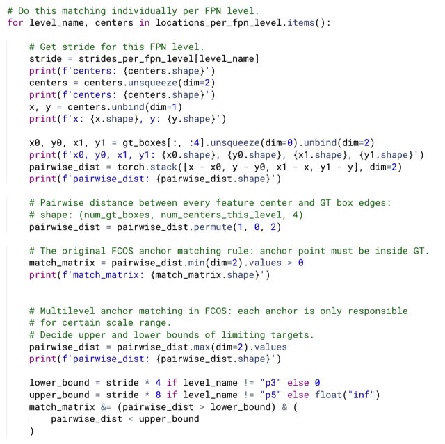</kbd></p>

<p align="center"><kbd>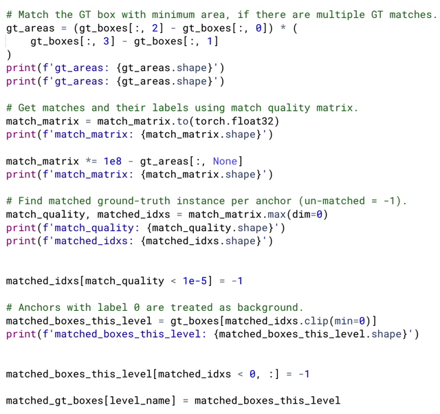</kbd></p>

<p align="center"><kbd>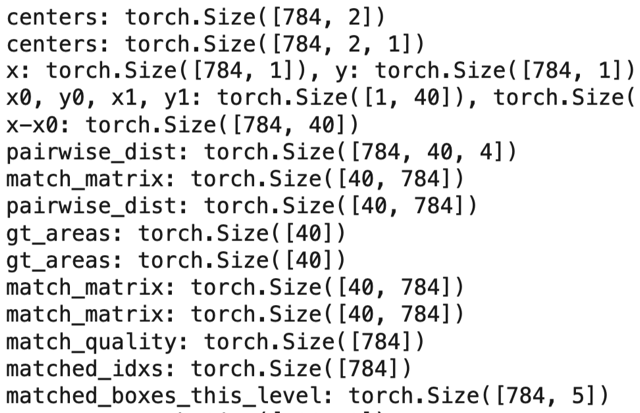</kbd></p>

<p align="center"><kbd></kbd></p>

<p align="center"><kbd></kbd></p>

<p align="center"><kbd></kbd></p>

<p align="center"><kbd>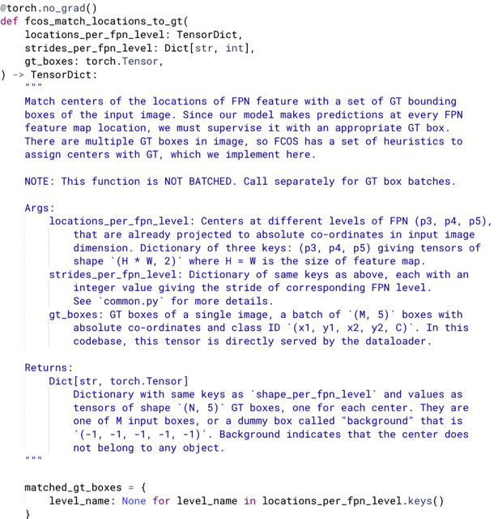</kbd></p>

> [!NOTE]
> Function này vì tương đối phức tạp `(non-trivial)` và vì vốn assignment này đã khó nên họ "làm giúp". Mục đích chính là nó sẽ match các feature map location
> với một set các bounding box. Again, nhắc lại không thừa, vì **CHO MỖI MỘT LOCATION trên feature map** (và có 3 feature map) FCOS model sẽ dự
> đoán:
>
> `-` Một vector các class scores
>
> `-` Một chỉ số `center-ness:` logit cho khả năng location ấy là một `box-center.`
>
> `-` Một vector bốn chỉ số scalar tạm thời hiểu là "deltas" từ vị trí của feature map location (nhớ là đã quy ước sẽ ám chỉ cái "center của receptive field" trên raw
> image) tới 4 cạnh của bbox: [delta x1, delta y1, delta x2, delta y2].
>
> Vậy thì, vì model predict "một bộ" như vậy `"cho"/"tại"` mỗi location nên ta sẽ cần đại khái là chuẩn bị target cho nó.
>
> `===`
>
> Thế thì function sẽ nhận mọi cặp [xc, yc] mà ta đã chuẩn bị trong bước ở trên với 3 level thì ta sẽ có 3 cái "list" như vậy, mỗi list chứa H*W cặp [xc, yc] ( chú
> ý H,W sẽ khác nhau tùy vào feature level, p3 thì to 28x28, p4 nhỏ hơn  14x14, p5 nhỏ nhất 7x7)
>
> Nó cũng nhận list các giá trị stride đã xài ở mỗi level.
>
> Và quan trọng là `gt_boxes:` là một matrix (M,5), M số bounding box, tức mỗi hàng là một vector [x1, y1, x2, y2, C] `-` thể hiện "tọa độ" của hai góc và class id.
>
> `===`
>
> Và vì ta sẽ **gán MỘT GT BOX HOẶC BACKGROUND CHO MỖI MỘT LOCATION trên feature map**, nên output sẽ là dictionary với 3 key p3, p4, p5. Gắn
> với mỗi key là**một matrix (N,5),** **N là số feature location ở level đó**, tức là **mỗi một location sẽ được gán (nhãn)** là **một vector của một trong M box
> cho trước** hoặc là n**ếu không phải box mà là background thì sẽ là vector [-1]*5**

> [!NOTE]
> ```text
> iterate trong các key, value của locations_per_fpn_level, thì level_name (key) là p3, p4, p5 thì biết rồi. Còn centers (value) sẽ là 3 tensor (H*W = N, 2)
> ```
> với N là số location center sẽ khác nhau tùy level.
>
> Vậy `centers.unsqueeze(dim=2)` sẽ tăng thêm một dimension: (N, 2) `->` (N, 2, 1) sau đó thì `centers.unbind(dim=1)` sẽ tách ra thành hai tensor x (N,1) và
> y (N,1)
>
> tiếp, **gt_boxes** shape **(M=40, 5)**, `gt_boxes[:,` :4] sẽ shape là **(M, 4)**, `unsqueeze(dim=0)` xong thì thành shape (**1, M, 4**). Rồi mới **unbind(dim=2)** thì tách
> thành **4 tensors x0, y0, x1, y1 mỗi cái có shape là (1, M)**chứa x hoặc y của góc trên hay góc dưới của bbox.
>
> Tiếp theo dòng **pairwise_dist `=` torch.stack([x `-` x0, y `-` y0, x1 `-` x, y1 `-` y], dim=2)** sẽ kiểu như là**x `-` x0**= (N,1) `-` (1,M) `=` (N,M) `-` (N,M) `=` **(N,M)**mang ý
> nghĩa là với mỗi center (trong N center), tính distance (theo phương `/` trục x) của nó với mỗi trong M cái `top-left` corner của những cái box. thì đây
> cũng chính là**khoảng cách của center tới cạnh dọc bên trái của box**
>
> Tương tự như vậy với y `-` y0, shape `=` (N,M) ý nghĩa với **mỗi center trong N center, tính distance theo phương y với các `top-left` corner (M cái) của b.
> box**, thì đây cũng chính là **khoảng cách của center với cạnh ngang bên trên của M box**
>
> Để rồi **pairwise_dist** có shape **(N=784,M=40,4)**: Mỗi trong N center, ta có M vector**chứa distance của center (có N center) với 4 cạnh của mỗi (trong M)
> box**
>
> Tiếp, **transpose**: `pairwise_dist` `=` `pairwise_dist.permute(1,` 0, 2) **(N=784,M=40,4)** `->` **(M=40,N=784,4)**
>
> Tiếp, **match_matrix** `=` `pairwise_dist.min(dim=2).values` > 0: đại ý là ta sẽ tạo một **matrix (M=40,N=784)** mỗi hàng ứng với một box, có N giá trị `True/False`
> cho biết**các center có nằm ở trong box đó hay không** bằng cách xét tiêu chí: **khoảng cách nhỏ nhất từ center đến 1 cạnh có dương không**.
>
> Tiếp, đại ý là **add thêm điều kiện**, tùy level mà ta thì khoảng cách lớn nhất tới một cạnh phải thỏa là nằm trong một giới hạn dưới và trên để đại
> khái là nếu là p3 (với các location dày như hình trước) sẽ đảm nhiệm các box nhỏ (thể hiện qua việc không có lower bound) còn ngược lại nếu là p5
> (các location thưa) thì sẽ đảm nhiệm các box lớn (thể hiện qua việc không có upper bound)
>
> Nói chung mục đích chính là làm cái `"multi-scale` matching": Những location với các level nhỏ như p3 sẽ được assign với các box có diện tích nhỏ,
> những location với level lớn như p5 sẽ được assign với các box có diện tích lớn.
>
> Tiếp **gt_areas (M=40,)** tính c**ác diện tích của các boxes** là**hai cạnh nhân nhau,** ko có gì khó hiểu
>
> Tiếp theo người ta chuyển `match_matrix` từ boolean sang float32. Đương nhiên nó  sẽ thành matrix 1,0.
>
> Sau đó ta mới **nhân `element-wise` với 1e8 `-` `gt_areas[:,` None]**:
>
> `gt_areas` như đã nói là diện tích `(M=40,),` ta mới cho nó mọc thêm 1 dim nữa thành **(M=40,1)** đặng 1e8 `-` `gt_areas[:,` None] sẽ **giống như một dạng trọng
> số**, để **box nào có diện tích nhỏ thì sẽ có trọng số lớn hơn**. Vậy `match_matrix` (M,N) sau khi nhân với trọng số thì chỗ nào 0 là do nó ko pass hai
> điều kiện ở trên, còn chỗ nào khác 0 thì sẽ lớn hay nhỏ là do gắn với box có diện tích nhỏ hay lớn.
>
> **match_quality, `matched_idxs` `=` match_matrix.max(dim=0)**: **(M=40,N=784)** `->` **(N=784,)**cho ta với mỗi center, thì cái box nào là có chỉ số match lớn
> nhất). Trước khi lấy mã, `match_matrix` shape M,N. thì một cột j nào đó sẽ cho ta biết là ứng với là một center `c_j` nào đó trong N center, các giá trị trong
> cột sẽ là M match score của M boxes. Trong M scores này có cái bằng 0 thể hiện rằng cái center `c_j` không lọt trong cái box đó. Và có thể có nhiều giá
> trị khác 0, thể hiện cái center `c_j` lọt trong nhiều box. Thế thì như trong rule nó nói lúc nãy, **khi một center "có" nhiều box, ta sẽ gán nó với cái NHỎ 
> NHẤT.** Vậy, việc max qua dim `=` 0, từ vector cột này ta lấy ra giá trị lớn nhất `(match_quality[j],` và index tương ứng `matched_idx[j])` thì đó sẽ cho ta biết
> cái box nhỏ nhất vì cái nhỏ nhất sẽ có `match_score` lớn nhất.
>
> ```text
> matched_idxs[match_quality < 1e-5] = -1: Dòng này có nghĩa là trong cái vector (N=784,) mà như đã nói ở trên, mỗi center chọn ra cái box có match score
> ```
> lớn nhất. Tuy nhiên, ở đây ta sẽ sát hạch lần nữa: những center nào mà sau khi lấy ra cái box có match quality lớn nhất rồi mà nó vẫn nhỏ quá thì coi như 
> cái center ko có box (và thuộc background) bằng cách gán lại `matched_idxs` tại đó `=-1.`
>
>
> Cuối cùng: Nhìn nhận lại `matched_idxs` `(N=784,)` sẽ là (với mỗi center) một index của box (hoặc `-1` thể hiện center ứng với vị trí đó là background)
>
> người ta dùng **matched_idxs.clip(min=0)** để **set những chỗ bằng `-1` thành 0**, đặng tránh lỗi truy cập khi pass list index này vào để lấy các box
>
> ```text
> matched_boxes_this_level = gt_boxes[matched_idxs.clip(min=0)] : gt_boxes là (M,5) (mỗi box là một vector [x1,y1,x2,y2,c] nên matched_boxes_this_level
> ```
> sẽ là (**N=784, 5**)
>
> ```text
> Nhưng một lần nữa tại các vị trí ko có background thì phải set nó là [-1, -1, -1, -1, -1]
> ```
>
> ```text
> matched_boxes_this_level[matched_idxs < 0, :] = -1
> ```
>
> Cuối cùng gán nó vào value của key là level name tương ứng
>
> ```text
> matched_gt_boxes[level_name] = matched_boxes_this_level
> ```

<br>

<a id="node-1505"></a>

<p align="center"><kbd>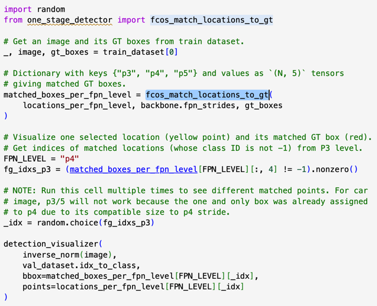</kbd></p>

<br>

<a id="node-1506"></a>

<p align="center"><kbd>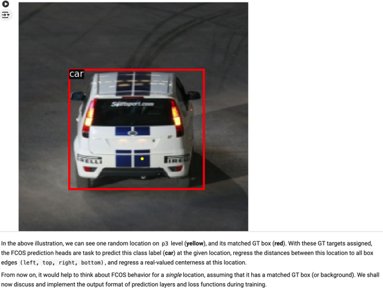</kbd></p>

> [!NOTE]
> một minh họa của kết quả assigning vừa rồi, ta thấy một p3 location, với cái
> GT box "của nó". Như vậy, đây chính là target `/` label của model output cho
> location center này. Và với cái target này, model phải predict ra như đã nói
> 3 thứ:
>
> `1/` Một vector class scores, với class score cao nhất nên ứng với 'car'
>
> `2/` Một véctơ 4 chỉ số scalar: thể hiện distance của điểm center tới 4 cạnh 
> của box
>
> `3/` Một scalar centerness chính xác là logit thể hiện sự tự tin hoặc xác suất
> mà cái location center màu vàng đó chính là center của box.
>
> `====`
>
> Rồi, họ mới nói từ giờ trở đi ta sẽ cứ nghĩ theo từng single location thôi, và
> Khi đã có target rồi thì ta giờ sẽ chuyển sang nói về các bước tiếp theo như 
> cost function

<br>

<a id="node-1507"></a>

<p align="center"><kbd>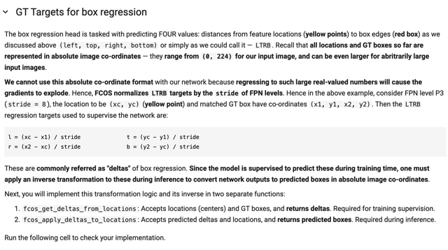</kbd></p>

> [!NOTE]
> rồi, thì cái này đại khái là nói về "nhiệm vụ" regression `-` prediction ra 4 cái
> distance tới 4 cạnh của box (tất nhiên như mới nói ta sẽ dùng `/` đối từng single
> location để nói chuyện)
>
> Vậy thì vấn đề là đây là các giá trị target (tức là khoảng cách từ center tới các
> cạnh nếu tính bằng các tọa độ của tốp left, bottom right corner thì ở đây đang
> là absolute value, tức là vì đang xài cái hình 224x224 nên đại khái là x, y của
> hai điểm này sẽ trong khoảng 0:224. Và nếu train với cái hình có kích thước
> khác thì nó sẽ khác. Nhưng nói chung vấn đề là nếu regression mà target có
> giá trị lớn như vậy thì gradient sẽ explode. (Đó là cũng là lí do ta cần phải có
> bước normalization trong cái bài toán như linear regression).
>
> Vậy thì tương tự, ở đây ta sẽ normalize bằng cách chia "absolute" distance
> cho stride (như đã biết ứng với mỗi feature level có một stride). Thì 4 giá trị đã
> normalize này gọi là deltas
>
> Nói tóm lại là ta cần normalize 4 cái "target" distance to cạnh này, vậy thì lúc
> inference, ta cần đảo nghịch lại để chuyển từ giá trị normalized sang giá trị
> absolute.
>
> Đây chính là nhịệm vụ cần làm: Viết hai function, một cái từ location centers,
> và box, tính ra deltas. Dùng cho quá trình training.
>
> Một cái thì từ deltas (do model predict ra cho một location), và location center,
> Tính ra absolute value của distance tới 4 cạnh `-` tức là tính được tọa độ hai
> điểm corner từ đó vẽ ra được cái box.

<br>

<a id="node-1508"></a>

<p align="center"><kbd>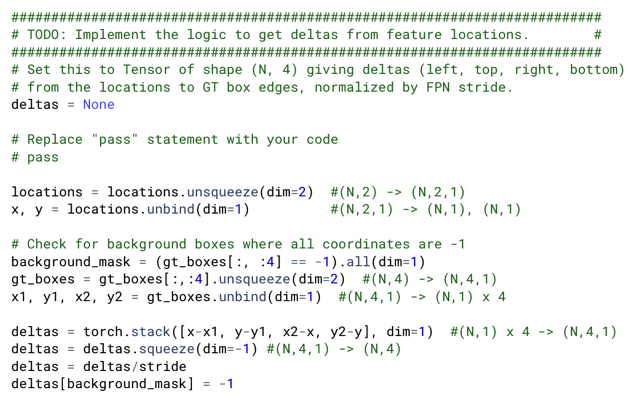</kbd></p>

<p align="center"><kbd></kbd></p>

<p align="center"><kbd>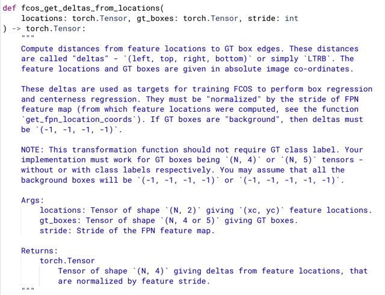</kbd></p>

> [!NOTE]
> Function này ta sẽ tính deltas `=` **khoảng cách từ location center tới 4 cạnh**
> của gt box tương ứng của nó (ground truth box) mà cái chính là các
> k**hoảng cách này được normalized bằng cách chia cho stride**. Các giá trị
> này sẽ **đóng vai trò làm target khi train model**. (Qua box regression head,
> model sẽ **dự đoán ra deltas cho mỗi location**)
>
> Vậy argument có (1) **locations**, shape (**N, 2)** là N (số location) các
> vector chứa **xc, yc `-` tọa độ (absolute `co-ordinate)` của các features
> location**.
>
> (2) **gt_boxes,** shape **(N, 4 hoặc 5)**, là N là số box (bằng số location),
> mỗi row là vector [x1, y1, x2, y2, (c)] là **co-ordinate của hai góc Top Left,
> Bottom Right**. (theo absolute value) và có thể có hoặc không có class
> label, không ảnh hưởng gì (nhưng phải đảm bảo thực hiện function này ko
> cần có hay ko label, tức là `gt_boxes` có shape N,4 hay N,5 gì cũng dc cả)
>
> stride là int number để normalized.
>
> `====`
>
> Yêu cầu**tính ra tensor (N, 4) `-` với mỗi location**,**khoảng cách tới 4 cạnh
> của cái box "của nó"**

> [!NOTE]
> locations `-` "list" các location center `-` (N,2) (N locations), mỗi cái có 2
> ```text
> co-ordinate (x_i, y_i) (i = 1:N)
> ```
>
> Thế thì đầu tiên ta sẽ tách thành hai list `/` vector chỉ chứa x hoặc y. (vì để
> mục đích là tí nữa ta sẽ tính khoảng cách đến các cạnh của box thì ta
> cần x, y tách riêng). Ta có thể dùng `unbind(dim=1)` để tách thành hai
> vector (N,) (N,) luôn, nhưng sẽ tiện hơn nếu dùng `unsqueeze(dim=2)` để 
> chuyển shape thành (N,2,1) rồi `unbind(dim=1)` để tách thành hai matrix
> (N,1), (N,1).
>
> `gt_boxes,` shape `=` (N,4 hoặc 5, nếu có class id). Ta sẽ slicing để chỉ lấy
> các coordinate của box's corner thôi: `gt_boxes[:,:4]` shape (N,4) mang ý
> nghĩa N box, mỗi box là một vector 4 `co-ordinate` của top left và bottom
> right corner [x1, y1, x2, y2]. Thì `gt_boxes` là gì, nó là N box ứng với `/` của
> N cái location ở trên
>
> Vậy ta cũng làm tương tự như locations, đó là tách riêng thành 4 vector
> x1, y1, x2, y2 đều có shape (N,1). Cách làm thì tương tự, khỏi nói lại.
>
> `===`
>
> Rồi, với các bộ x, y, x1, y1, x2, y2 đều có shape (N,1), ta mới tính các
> ```text
> 'bộ' distance từ location tới 4 cạnh: x-x1, y-y1, x2-x, y2-y đều có shape
> ```
> (N,1) `-` thì bước này chính là ta tính distance từ location tới 4 cạnh, làm 
> cùng lúc cho mọi location và box tương ứng của nó.
>
> Tiếp theo, ta dùng torch.stack để stack các matrix N,1 này lại, kết qủa
> sẽ được (N,4,1), rồi `unsqueeze(dim=-1)` để còn (N,4), là ta có N row,
> mỗi row là 4 giá trị distance của location center tới 4 cạnh của box của nó
>
> Kế tới, ta mới chia cho stride để normalize, như nói ở trên là được deltas
>
> Cuối cùng, một bước quan trọng cần nhắc tới là, ở trên ta đã dùng dòng
> code: **bk_mask `=` `(gt_boxes[:,:4]` `=` -1).all(dim=1)** có nghĩa nôm na là "check
> xem có phải matrix `bt_boxes,` row nào có mọi giá trị đều bằng `-1),` nó sẽ
> t**rả ra một vector dài bằng số hàng của `gt_boxes,` giá trị là true nếu cả hàng
> đó đều bằng -1.**
>
> Cuối cùng, ta sẽ dùng cái `background_mask` này để **set cho deltas matrix
> chỗ nào (hàng nào) mà trong `gt_boxes` đều bằng -1** tức là cái hàng đó là
> một box giả (đồng nghĩa cái location tương ứng sẽ được gán với background) 
> thì như yêu cầu, **hàng đó trong deltas sẽ có giá trị `-1` hết.**

<br>

<a id="node-1509"></a>

<p align="center"><kbd>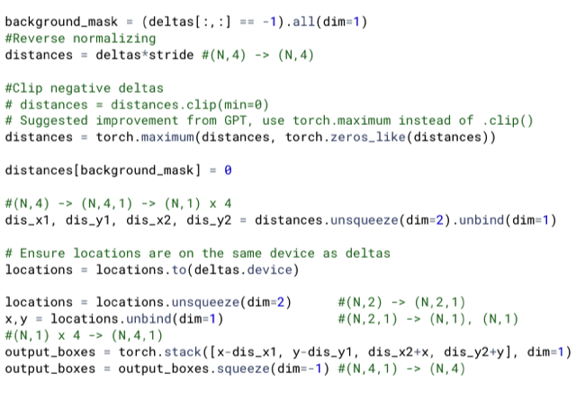</kbd></p>

<p align="center"><kbd></kbd></p>

<p align="center"><kbd>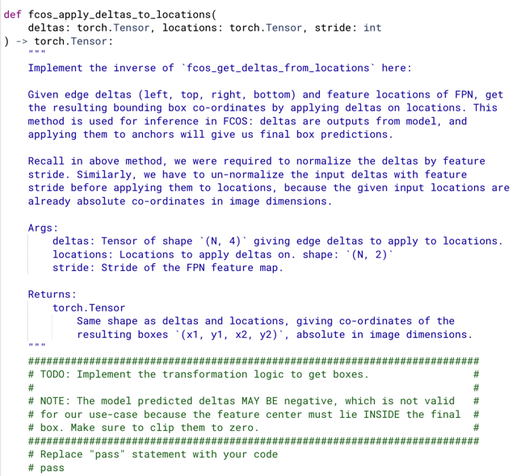</kbd></p>

> [!NOTE]
> Rồi, function này thì làm ngược lại, nhận deltas (N,4) N set khoảng cách từ
> location với 4 cạnh của box "của nó" (nói "của nó" là vì ở **phần trước ta đã gán
> mỗi location một box**.
>
> Và với deltas, từ locations (N,2) tọa độ x, y của N locations, ta sẽ "tính ra" tọa độ
> của 2 góc.
>
> Vậy đầu tiên ta có deltas (là distance đã normalized, nhưng chỗ nào `/` row nào
> mà tương ứng với background thì sẽ là `-1,` kết quả của việc set lại matrix deltas
> bằng background mask ở function trước), nên ta cũng sẽ "đánh dấu" lại chỗ nào
> là background, bằng cách tạo lại một cái background mask.
>
> tiếp theo, ta sẽ nhân deltas lại cho stride để reverse "sự normalized". Sau đó,
> dùng **clip(min=0)** để set các giá trị delta âm thành 0, vì như người ta có nói trong
> mô tả function này là prediction của model có thể ra âm, mà điều này đồng nghĩa
> cái location lại nằm ở ngoài cái box, thì không được. 
>
> Chỗ này **GPT cho rằng dùng .clip() tuy valid** (sự thật là trong function 
> `fcos_match_..gt` người ta cũng dùng clip()) **có thể gây vấn đề gradient flow back 
> không tốt**  nên đề xuất mình dùng reLU hay **torch.maximum()**
>
> distances `=` **torch.maximum(distances, torch.zeros_like(distances))**
>
> Tiếp, sau khi unnormalized, ta sẽ set distances, những row nào ứng với background
> sẽ cho distance `=` 0. Để cho việc tính ra cái box (2 điểm góc) nó cũng sẽ trùng với
> location, đặng vẽ ra..ko có cái box nào.
>
> Còn lại thì từ distance, và location để tính ra "box" là tọa độ hai điểm góc cũng dễ
> hiểu với các technique tương tự function trước

<br>

<a id="node-1510"></a>

<p align="center"><kbd>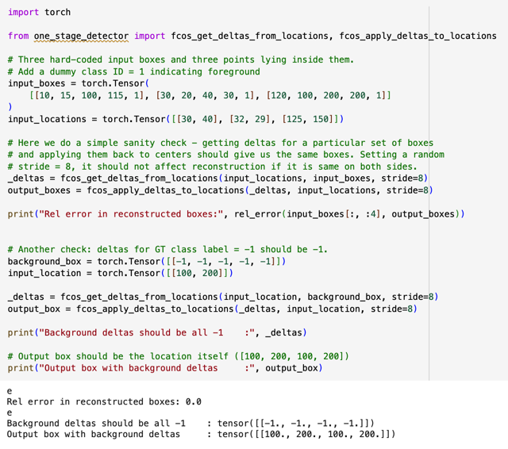</kbd></p>

> [!NOTE]
> cái sanity check này đại khái là họ chuẩn bị 3 cái box (box bình thường, không
> phải "background box", và 3 cái location. Đặng pass qua function đầu để tính
> deltas, rồi pass delta và location qua function sau để xem có ra lại ba cái box
> ban đầu không. Kết qủa relative error `=` 0.0 cho thấy ta làm đúng.
>
> ```text
> Cái check thứ hai là pass một cái background box ([-1,-1,-1,-1] và một location,
> ```
> ```text
> thì deltas expect sẽ cũng là [-1,-1,-1,-1]. Và dùng function chuyển deltas, và
> ```
> location, thì expect cái box là "chính cái location đó", hay hai corner đều
> trùng với location, để kiểu như..không vẽ cái box nào cả

<br>

<a id="node-1511"></a>

<p align="center"><kbd>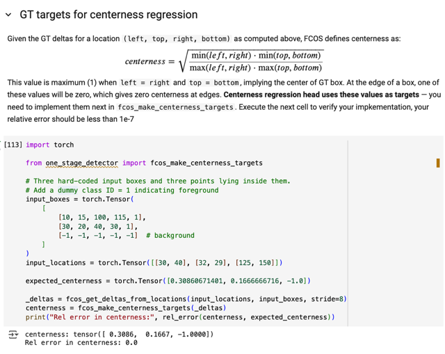</kbd></p>

> [!NOTE]
> đại khái cái này là (tạm gọi là) "mức độ" `/` **xác suất một location chính là tâm
> của box**. Được dùng để **tạo target cho cái centerness head** mà trong đó ta 
> cho model dự đoán rằng một location có khả năng bao nhiêu rằng nó là tâm 
> của cái box. Có thể hiểu rằng lúc labeler "đánh nhãn" bằng cách vẽ ra cái box thì 
> họ chỉ vẽ ra cái box, và class name. 
>
> Từ đó là ta có thể tính ra khoảng cách từ location tới các cạnh của box (deltas) 
> để làm target cho cái "box head" như vừa mới làm ở hai function trước. Rồi với 
> cái deltas, ta sẽ tính **ground true "xác suất tâm" để làm target cho cái 
> `center-ness` regression head.**Như vậy có thể hiểu đây là quá trình mà ta chuyển từ label `/` target tạm gọi là
> thô, thành ra tinh, những cái có thể dùng để train một bài toán cụ thể. Như
> trong bài này ta muốn model dự đoán ra xác suất một location là tâm của một
> box, thì để có target cho bài toán đó thì ta tự hỏi ngược lại, là với các Ground
> Truth box thì các location có "xác suất" hay "độ" `/` "mức độ" center như thế nào.

<br>

<a id="node-1512"></a>

<p align="center"><kbd>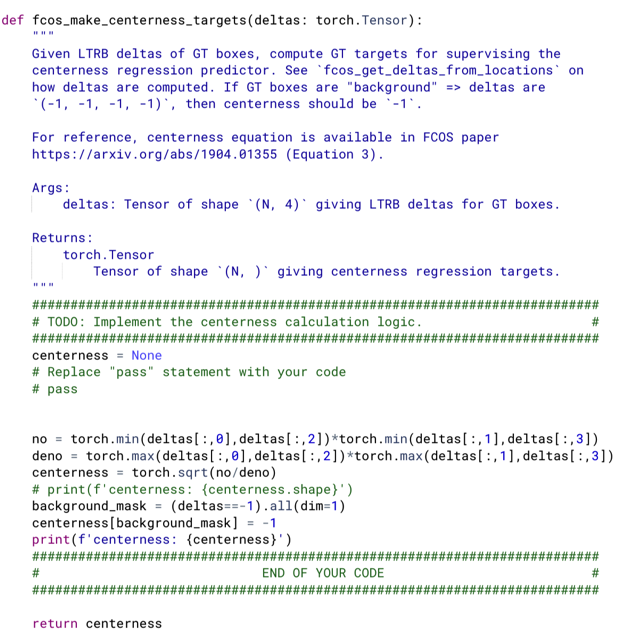</kbd></p>

> [!NOTE]
> làm cũng khá đơn giản chỉ theo công thức thôi, chỉ lưu ý cũng phải
> xài background mask để set centerness cho trường hợp background
> thành `-1,` chứ nếu theo công thức mà tính thì nó sẽ thành ra 1.

<br>

<a id="node-1513"></a>

<p align="center"><kbd>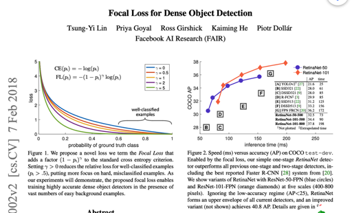</kbd></p>

<p align="center"><kbd>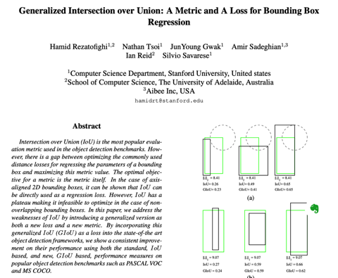</kbd></p>

<p align="center"><kbd>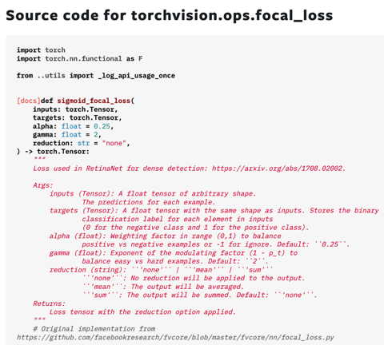</kbd></p>

<p align="center"><kbd>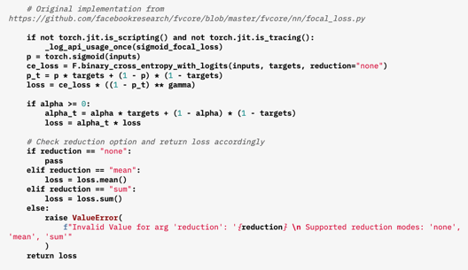</kbd></p>

<p align="center"><kbd></kbd></p>

<p align="center"><kbd></kbd></p>

<p align="center"><kbd></kbd></p>

<p align="center"><kbd></kbd></p>

<p align="center"><kbd>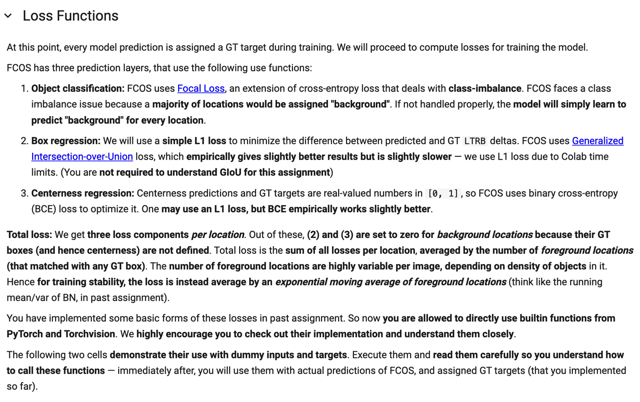</kbd></p>

> [!NOTE]
> Đại khái là với cái classification head, FCOS dùng Focal loss là một dạng mở
> rộng của `cross-entropy` loss mà có thêm việc deal với vấn đề class imbalance
> `-` do đại ý là số location gắn với `/` có object sẽ có thể ít so với các location gắn
> với "background". Nên cần phải deal với vấn đề này nếu không model chỉ
> việc predict background là xong.
>
> Với box regression thì ở trong phạm vi này ta sẽ dùng L1 loss cho đơn giản
> dù FCOS paper dùng GIoU `-` Generalized intersection over union loss vốn
> thực nghiệm cho thấy nó tốt hơn nhưng lại chậm hơn. Họ cũng không yêu
> cầu phải hiểu GIoU trong assignment này. Ta sẽ quay lại tìm hiểu thêm cái
> này và FCOS loss function.
>
> Với cái `center-ness` regression, thì model predict một `center-ness` probability
> với target là một số thực nằm trong range [0:1] (mà cái function `fcos_make_`
> `centerness_targets` ta đã thấy). Nên cái loss ta sẽ dùng binary cross entropy
> dù có thể dùng L1 loss cũng được nhưng họ nói thực nghiệm cho thấy BCE
> tốt hơn.
>
> Total loss trên toàn image là tổng loss trên mọi location. Mà tại mỗi location
> thì nếu là gắn với background thì sẽ chỉ có cái loss loại 1 (classification
> head). Sau đó, ta sẽ tính trung bình, bằng cách chia cho tổng số location mà
> CÓ GẮN VỚI OBJECT BOX, gọi là foreground location (trái với background
> location). Vấn đề là số foreground location thay đổi rất khác nhau `/` chênh
> lệch rất lớn qua từng image nên có thể gây không ổn định quá trình training.
> Vậy nên người ta dùng cái exponential moving average của số lượng các
> foreground locations.(giống trong batch norm)
>
> Cuối cùng, họ nói vì ta đã làm from scratch về loss function như svm, softmax
> loss ở những bài trước nên ở đây ta được dùng `built-in` loss của torch, tuy nhiên
> họ khuyên nên xem source code để hiểu nó work ra sao.

<br>

<a id="node-1514"></a>

<p align="center"><kbd>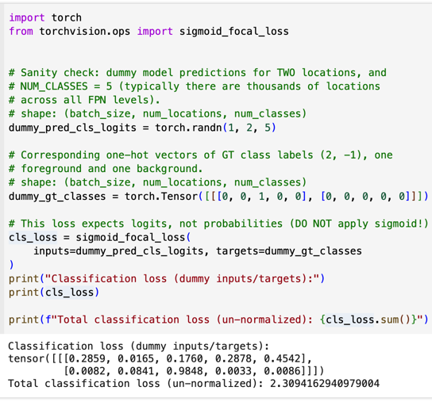</kbd></p>

> [!NOTE]
> người ta cho xem một ví dụ về việc xài `built-in` loss function
> `sigmoid_focal_loss` của torch.vision.ops
>
> thì đơn giản là đưa cái prediction (ở đây yêu cầu logit, chứ không
> phải probability, lí do thì có thể cũng tương tự như torch's
> negative cross entropy loss nó tính probability và log " cùng lúc"
> có nhiều ưu điểm quan trọng hơn là tách ra.
>
> thì prediction, người ta lấy ví dụ là tensor có shape (1, 2, 5). Mang
> ý nghĩa là trong batch có 1 sample (batch size `=` 1), có 2 location
> (thực tế sẽ có cả ngàn location tùy feature level, điều này dễ
> hiểu), mỗi location, model predict ra một logits vector có 5 class
> scores.
>
> Thì target cũng là tensor (1,2,5), nhưng mỗi vector là `one-hot`
> vector đại diện cho "true probability distribution", với "cái" location
> mà ground truth là background, thì one hot vector chỉ có zero.
>
> Kết quả nó trả ra có thể hiểu là có include probability, và loss mà
> như trên đã nói là nó sẽ tính tới imbalance giữa các số lượng của
> foreground `/` background locations

<br>

<a id="node-1515"></a>

<p align="center"><kbd>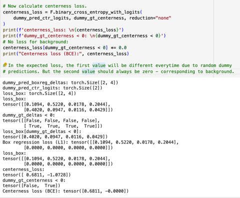</kbd></p>

<p align="center"><kbd></kbd></p>

<p align="center"><kbd>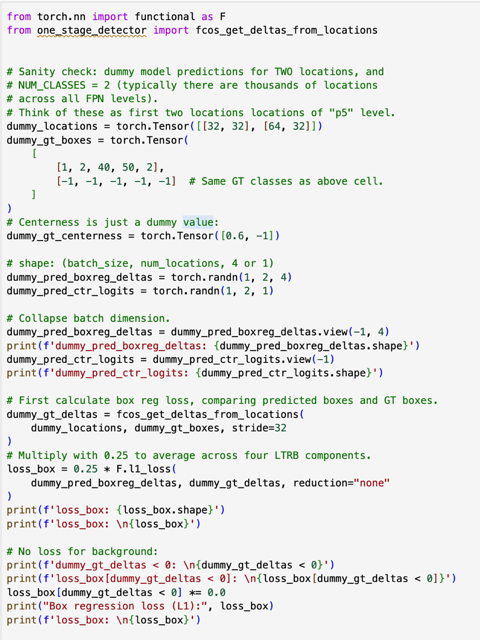</kbd></p>

> [!NOTE]
> Người ta cho ví dụ hai location với **2 cái gt box** (thật ra là tương 
> ứng với gt class ở ví dụ trước (một cái có class id `=` 2, một cái là 
> `-1` (background))
>
> Vậy thì đương nhiên ta hiểu được cái gt box "của" cái location có 
> ```text
> class là background sẽ là vector [-1, -1, -1, -1]
> ```
>
> Thế thì người ta mới pass **location** và **gt box** qua function 
> **fcos_get_deltas_from_locations** để "chuyển thành" ground
> truth deltas, có shape là (1,2,4): 
>
> Với ý nghĩa là 1 sample (hay 1 image trong batch, batch size `=` 1), 
> 2 location, mỗi cái có 4 giá trị khoảng cách **thật sự từ location tới 
> 4 cạnh của gt box.**Để rồi mới pass vào trong **F.l1_loss** cùng với predictions `-` tức
> là **predicted deltas**. kết qủa có shape (2, 4): mỗi hàng (mỗi location) 
> là 4 giá trị loss ứng với 4 predicted deltas.
>
> Có điều, **với background thì ta ko tính box regression loss**
> và **centerness loss**, nên người ta mới tạo cái mask, đặng set
> cho loss ứng với cái background thành 0: 
>
> `loss_box[dummy_gt_deltas` < 0] `*=` 0.0
>
> `loss_box` #(2,4)
> mask `=` `dummy_gt_deltas` < 0 #(2,4) trong đó chỗ nào tương ứng 
> với `dummy_gt_deltas` mà < 0 sẽ là True, ngược lại là False.
> Nên sau khi `loss_box[dummy_gt_deltas` < 0] `*=` 0.0 thì chỗ đó trong
> `loss_box` cũng thành 0
>
> Với `centerness-loss` cũng tương tự, nhưng thay vì dụng F.l1_loss
> thì ta sẽ dùng `F.binary_cross_entropy_with_logits`

<br>

<a id="node-1516"></a>

<p align="center"><kbd>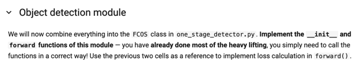</kbd></p>

<p align="center"><kbd></kbd></p>

<p align="center"><kbd>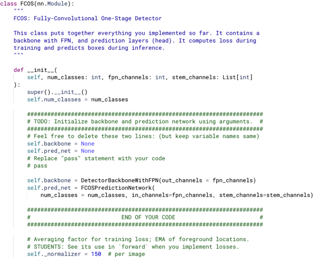</kbd></p>

> [!NOTE]
> Đây là lúc **tổng hợp lại hết** những module đã làm đầu tới giờ để **build
> `from-scratch` mô hình FCOS**.
>
> Đầu tiên trong **__init__**ta sẽ **khởi tạo hai module là cái backbone** with
> **FPN** mà ta đã làm trong **DetectorBackboneWithFPN** và cái prediction
> heads network

<br>

<a id="node-1517"></a>

<p align="center"><kbd>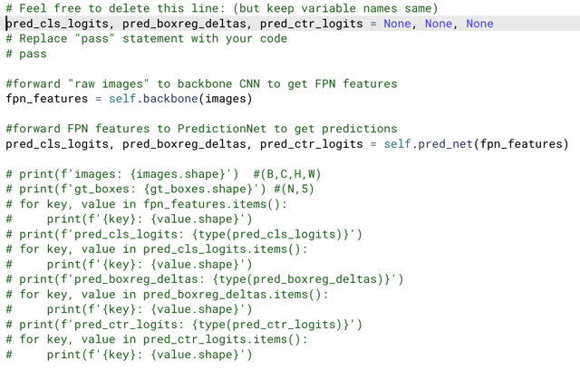</kbd></p>

<p align="center"><kbd>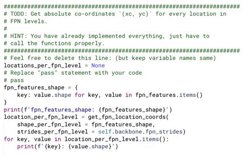</kbd></p>

<p align="center"><kbd></kbd></p>

<p align="center"><kbd></kbd></p>

<p align="center"><kbd>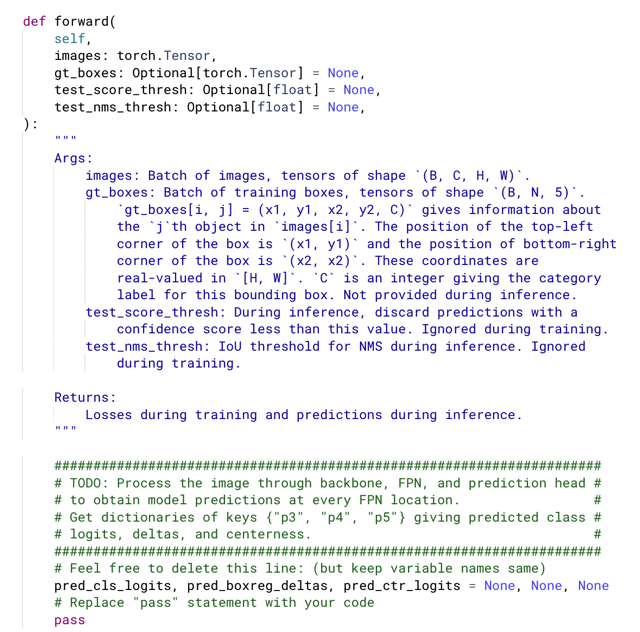</kbd></p>

> [!NOTE]
> Function forward, nhận một batch các images shape (B,3,H,W) và
> target B,N,5 (mỗi images sẽ có N box (Đáng lẽ nên dùng chữ M, vì
> N ở function trước từng dành để chỉ số location (tức tích của hai
> spatial size), mỗi box được represent bởi một vector [x1, y1, x2, y2,
> C]. Cùng với hai threshold sẽ nói sau.

> [!NOTE]
> Vậy đầu tiên đương nhiên là **forward images tensor qua backbone CNN**,
> như đã biết nó sẽ process images qua các layer của CNN, để rồi **sau đó
> là một FPN Feature Pyramid Network** với cách thức cụ thể thế nào thì 
> ta đã làm ở **DetectorBackboneWithFPN**. 
>
> Kết quả trả ra là **3 features tensor** **ứng với 3 level p3,4,5** có shape là 
> ```text
> (B,64,H/8,W/8), (B,64,H/16,W/16) và (B,64,H/32,W/32)
> ```
>
> p3: torch.Size([16, 64, 28, 28])
> p4: torch.Size([16, 64, 14, 14])
> p5: torch.Size([16, 64, 7, 7])
>
> Tiếp theo, với **từng level features** ta mới pass qua**prediction head**(**FCOS
> PredictionNetwork**), để với mỗi level features, output sẽ có prediction của
> model gồm:
>
> 1. **Classification head**: sẽ có shape là (B, `num_classes` `=` 20, `(W/8)*(H/8))`
> ```text
> (B, num_classes = 20, (W/16)*(H/16)), (B, num_classes = 20, (W/32)*(H/32))
> ```
>
> Mang ý nghĩa là ví dụ p3 (16,20,784): 16 image trong batch, sau khi pass
> qua backbone và classification head, với "level 3 feature" có spatial size là
> ```text
> W/8=28, H/8=28 ta có 28*28 = 784 locations, model predict cho mỗi location
> ```
> một vector có 20 class scores. Tương tự với các level feature khác (p4, p5)
>
> `pred_cls_logits:` <class 'dict'>
> p3: torch.Size([16, 20, 784])
> p4: torch.Size([16, 20, 196])
> p5: torch.Size([16, 20, 49])
>
> 2. **Box-Regression head output**: shape sẽ là: 
> ```text
> (B, 4, (W/8)*(H/8))       #W/8 = H/8= 224/8 = 28
> ```
> ```text
> (B, 4, (W/16)*(H/16))   #W/16 = H/16 = 224/16 = 14
> ```
> ```text
> (B, 4, (W/32)*(H/32))   #W/32 = H/32 = 224/32 = 7
> ```
>
> Ý nghĩa: ví dụ p3 (16,4,784): 16 images trong batch, với level 3 features
> có 784 locations như nói ở trên, model prediction 4 giá trị deltas `=` normalized
> distance từ location tới 4 cạnh của box. Tương tự với các level feature khác.
>
> **pred_boxreg_deltas**: <class 'dict'>
> p3: torch.Size([16, 4, 784])
> p4: torch.Size([16, 4, 196])
> p5: torch.Size([16, 4, 49])
>
> 3. **Centerness head**: Lập luận tương tự, chỉ khác khác với mỗi location model
> predict "mức độ center" `/` xác suất rằng cái **location 'trùng' với center của box**
>
> `pred_ctr_logits:` <class 'dict'>
> p3: torch.Size([16, 1, 784])
> p4: torch.Size([16, 1, 196])
> p5: torch.Size([16, 1, 49])

> [!NOTE]
> Tiếp, ta sẽ dùng function **get_fpn_location_coords** đã làm ở trên để đại khái
> là**tính ra "location coordinate"**, tức là **vị trí của receptive field center trên 
> raw image tương ứng với mỗi location trên feature map**. Ta cần cái này 
> trong bước **gắn các prediction với target.**
>
> key: p3: value.shape: torch.Size([784, 2])
> key: p4: value.shape: torch.Size([196, 2])
> key: p5: value.shape: torch.Size([49, 2])
>
> Kết qủa là (với mỗi level feature), ta có các coordinate x,y của từng location.
>
> Chú ý là cái **stride** cần có để input vào là dùng cái function **fpn_strides**() của
> backbone module

<br>

<a id="node-1518"></a>

<p align="center"><kbd>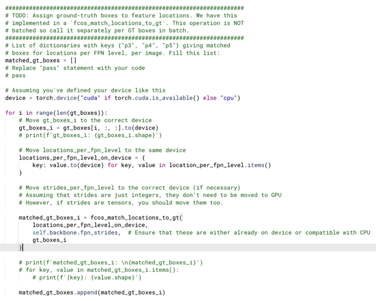</kbd></p>

<p align="center"><kbd></kbd></p>

<p align="center"><kbd>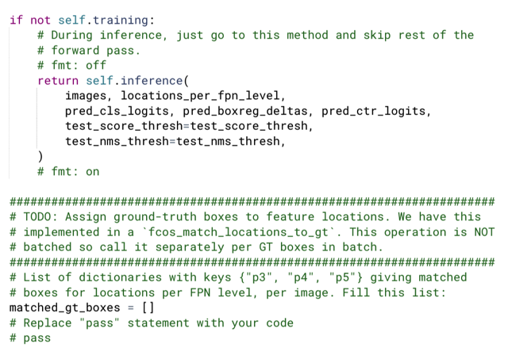</kbd></p>

> [!NOTE]
> rồi tiếp theo đại khái là ta sẽ dùng cái function **fcos_match_location_to_gt** (cái mà
> người ta **không bắt làm nhưng yêu cầu đọc hiểu** hồi nãy.
>
> Vậy thì còn nhớ, nó nhận input thứ nhất là 3 bộ các locations (dưới dạng dic với key p3,
> 4,5 như đã biết), mỗi bộ có shape [**số location trong level, 2]. Số location trong level
> tương ứng** lần lượt là `(W/8)*(H/8)` `=` `(224/8)*(224/8)` `=` 784, `(W/16)*(W/16)` `=` 196,
> `(W/32)(H/32)` `=` 49
>
> Input thứ hai là một bộ bounding box (M, 5) M là số box, mỗi box biểu diễn bởi một
> vector [x1, y1, x2, y2, c]
>
> Thì function này đại khái là **với mỗi location, nó sẽ gán một box trong M box hoặc một
> fake box (background)** `[-1,-1,-1,-1,-1].` Để trả cho ta 3 bộ (again, dưới dạng dict), mỗi
> bộ là có shape **[số location trong level, 5]**====
>
> Thế thì vì như họ nói, function này là thực hiện việc assign location `-` box của  đại khái
> là**làm cho từng cái hình (ý là không thể làm cùng lúc nhiều hình trong batch vì mỗi cái
> mỗi khác)**.
>
> Nên thành ra ta phải lấy từng `gt_boxes` của mỗi sample trong batch, và gọi function.  Để
> được một dict. Có nghĩa là ta sẽ thực hiện việc gán tuần tự cho từng sample (image)
> trong batch.
>
> Kết quả được một list (size `=` batch size) các dict `-` `matched_gt_boxes`
>
> ví dụ một dict:
>
> p3: torch.Size([784, 5]) 
> p4: torch.Size([196, 5]) 
> p5: torch.Size([49, 5])
>
> `===`
>
> Lưu ý có nhờ gpt giúp khắc phục một error báo rằng các tensor không cùng device
> `Cpu/gpu`

> [!NOTE]
> khúc đầu là dành cho inference (testing) ta
> sẽ làm function inference sau

<br>

<a id="node-1519"></a>

<p align="center"><kbd>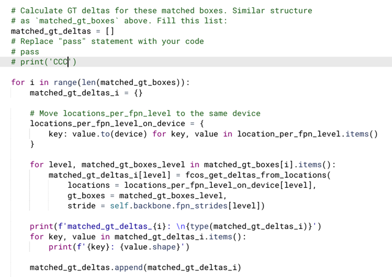</kbd></p>

> [!NOTE]
> Tiếp theo là dùng **fcos_get_deltas_from_locations** để **tính GT deltas** của
> các matched box (N, 4). Function này sẽ giúp **tính ra deltas** từ **location
> và box** để trả ra **cho mỗi location**, **4 con số deltas chính là normalized
> distance từ location tới 4 cạnh**.
>
> **matched_gt_deltas_1**: 
> <class 'dict'>
> p3: torch.Size([784, 4])
> p4: torch.Size([196, 4])
> p5: torch.Size([49, 4])
> ....
> ....
> **matched_gt_deltas_14:**
> <class 'dict'>
> p3: torch.Size([784, 4])
> p4: torch.Size([196, 4])
> p5: torch.Size([49, 4])
> **matched_gt_deltas_15**: 
> <class 'dict'>
> p3: torch.Size([784, 4])
> p4: torch.Size([196, 4])
> p5: torch.Size([49, 4])
>
> cái này làm theo từng sample (ý là không làm một phát cho cả batch, nên
> ta iterate qua từng "cái" trong batch dimension, và pass vào `fcos_get_deltas..`
> Mỗi cái cho ra một dict, vậy `matched_gt_deltas` là list (có số lượng bằng 
> `batch-size)` cái dict, mỗi dict là kết quả của một sample.

<br>

<a id="node-1520"></a>

<p align="center"><kbd>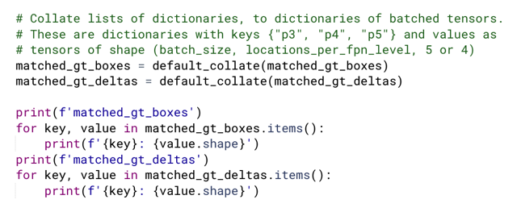</kbd></p>

> [!NOTE]
> thì nãy giờ do ta "làm" với từng sample, vì những function gán gt box cho
> location để được "mỗi location một vector gt box", và sau đó là tính deltas
> để được "mỗi location một vector deltas" thì những bước này đều là làm
> cho từng image, để mỗi cái ta được một list cái dictionary các tensor (N,4)
>
> Bây giờ ta mới gom lại thành một dictionary các tensor (B,N,4)
>
> **matched_gt_boxes**
> p3: torch.Size([16, 784, 5])
> p4: torch.Size([16, 196, 5])
> p5: torch.Size([16, 49, 5])
> **matched_gt_deltas**
> p3: torch.Size([16, 784, 4])
> p4: torch.Size([16, 196, 4])
> p5: torch.Size([16, 49, 4])

<br>

<a id="node-1521"></a>

<p align="center"><kbd>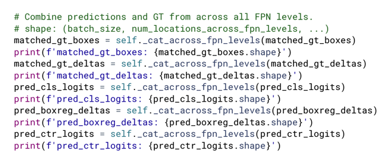</kbd></p>

> [!NOTE]
> kế tới đoạn code này người ta **concat các tensor value của các
> dictionary thành 1 tensor duy nhất**,**không phân biệt `/` phân chia theo
> level nữa**
>
> tức là ví dụ với `matched_gt_boxes`
>
> p3: tensor (B, W1*H1,4), p4: tensor (B, W2*H2,4), p5: tensor (B,W3*H3, 4)
> thì concat lại theo dim `=` 1 (xem function **_cat_across_fpn_levels**) sẽ thấy
> **default dim `=` 1**) để thành tensor **(B, `W1*H1+W2H2+W3H3,` 4)**
>
> ```text
> matched_gt_boxes: torch.Size([16, 1029, 5]) #1029 = 784 + 196 + 49
> ```
> `matched_gt_deltas:` torch.Size([16, 1029, 4])
> `pred_cls_logits:` torch.Size([16, 1029, 20])
> `pred_boxreg_deltas:` torch.Size([16, 1029, 4])
> `pred_ctr_logits:` torch.Size([16, 1029, 1])

<br>

<a id="node-1522"></a>

<p align="center"><kbd>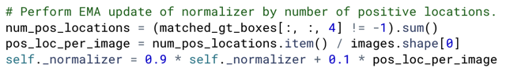</kbd></p>

> [!NOTE]
> tiếp, bước này chính là lúc họ tính cái Exponential Moving Average (EMA)
> đầu tiên là xem thử trong `num_pos_locations` (N, tổng mọi location mọi level, 5)
> thì cái class id ([:,:,5]) có khác `-1` hay không, nếu có thì nó sẽ là 'foreground'
> location (không phải background mà có gắn với object). Nói chung ta tính tổng
> các foreground (hay positive) location.
>
> Tiếp, chuyển thành scalar (.item()) và chia cho batch size (images.shape[0])
> để có trung bình location trong mỗi image của batch.
>
> Dòng cuối chính là tính EMA.

<br>

<a id="node-1523"></a>

<p align="center"><kbd>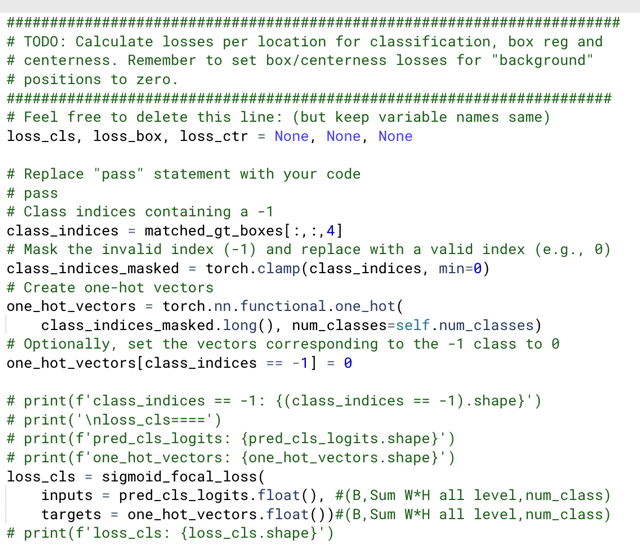</kbd></p>

> [!NOTE]
> tới phần tính loss, thì đầu tiên tính cái **classification loss** với **sigmoid_focal_loss**, 
> thế thì inputs là **pred_cls_logits (N, Sum W*H across mọi level, num class)** thì có 
> rồi, nhưng target là ở dạng `one-hot` vector thì chưa.
>
> Nên ta sẽ dùng **F.one_hot().** Đầu tiên lấy các class indices ra, nó là `item/column` thứ 
> 5 trong mỗi `vector/row` của `matched_gt_boxes` `->` **matched_gt_boxes[:,:,4]**(4 items đầu là coordinates của `top-left,` `bottom-right` corner x1, y1, x2, y2)
>
> Tiếp theo ta sẽ cần phải **gán cho những class index `=` `-1` thành 0** (đây **là những cái 
> gắn với background class**), vì nếu **để vậy pass vào `one_hot` thì nó sẽ không chịu**. 
> Ta làm việc này bằng **torch.clamp(tensor, min=0)**
>
> Sau đó pass vào **F.one_hot()** thì nó sẽ **chuyển class id thành `one-hot` vector** để kết 
> quả từ shape: **(B, Sum W*H all level, 1)** thành **(B, Sum W*H all level, num_classes)**
>
> Sau đó ta cần set lại **những chỗ nào của background thành [0, 0...0]** `-` là `one-hot` 
> vector của background class chứ không là những chỗ này nó sẽ là 'class #1'.
>
> Rồi pass predict và target vào `sigmoid_focal_loss`
>
> `====`
>
> **pred_ctr_logits**: torch.Size([16, 1029, **1**])
> `class_indices` `==` `-1:` torch.Size([16, 1029])
> **pred_cls_logits**: torch.Size([16, 1029, **20**])
> **one_hot_vectors**: torch.Size([16, 1029, **20**])
> `loss_cls:` torch.Size([16, 1029, 20])

<br>

<a id="node-1524"></a>

<p align="center"><kbd>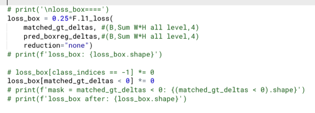</kbd></p>

> [!NOTE]
> tới cái `loss_box,` dùng **F.l1_loss** như ví dụ người ta làm cho xem hồi nãy
> chia 4 để average cho 4 edges
>
> Sau đó, ta sẽ dùng cái mask  để reset những "chỗ" là background thành 
> 0 để không tính box regression loss và `center-ness` loss
>
> ```text
> mask1 = (class_indices ==  -1)
> ```
> mask2 `=` `matched_gt_deltas` < 0**loss_box: torch. Size([16, 1029, 4])
> ```text
> mask = class_indices == -1: torch.Size([16, 1029])
> ```
> mask `=` `matched_gt_deltas` < 0: torch.Size([16, 1029, 4])**Lúc đầu dùng mask1 nhưng sửa lại dùng mask2 cho giống lúc người
> ta làm mẫu

<br>

<a id="node-1525"></a>

<p align="center"><kbd>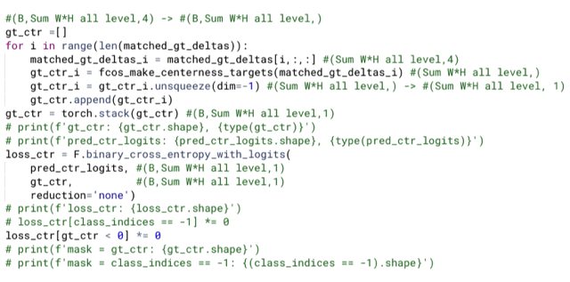</kbd></p>

> [!NOTE]
> Rồi tới centerness regression loss. Dùng BCE.
>
> Có điều again, **chưa có target** `-` là **ground truth centerness**.
>
> Ta sẽ dùng function **fcos_make_centerness_targets** mà tự mình đã làm
> ở trên. Nó sẽ **nhận** một **tensor các deltas (N, 4)**: Mỗi location ứng với một 
> vector **deltas** để từ đó tính centerness theo công thức. Vậy function này cũng 
> làm mỗi lần cho mỗi một sample, không làm theo batch được. Nên cũng như 
> ở trên. Ta cũng sẽ **thực hiện cho từng sample** (mỗi bộ `gt_boxes[i,:,:]` có shape
> (No. locations across all levels `=` Sum W*H all level, 4)
>
> Kết quả ra shape (Sum W*H all level, ). `Unsqueeze(dim=-1)` để thành 
> (Sum W*H all level, 1).
>
> Mỗi cái như vậy **add vào list**, **stack lại** để có tensor (B, Sum W*H all level, 1)
>
> Cùng với `pred_ctr_logit,` pass vào **F.binary_cross_entropy_with_logits**
>
> Cuối cùng tương tự **reset cho những "chỗ background" thành 0 vì background
> thì ko tính box regression & centerness loss**
>
> `gt_ctr:` torch.Size([16, 1029, 1]),
> `pred_ctr_logits:` torch.Size([16, 1029, 1]), 
> `loss_ctr:` torch.Size([16, 1029, 1])

<br>

<a id="node-1526"></a>

<p align="center"><kbd>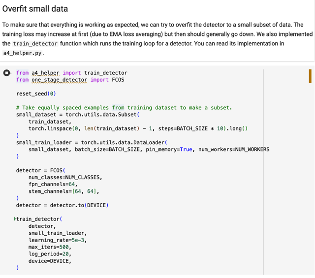</kbd></p>

<br>

<a id="node-1527"></a>

<p align="center"><kbd>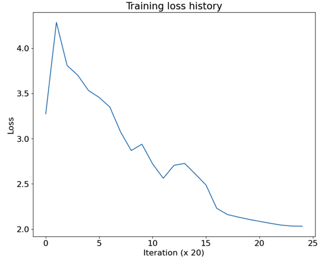</kbd></p>

<p align="center"><kbd></kbd></p>

<p align="center"><kbd>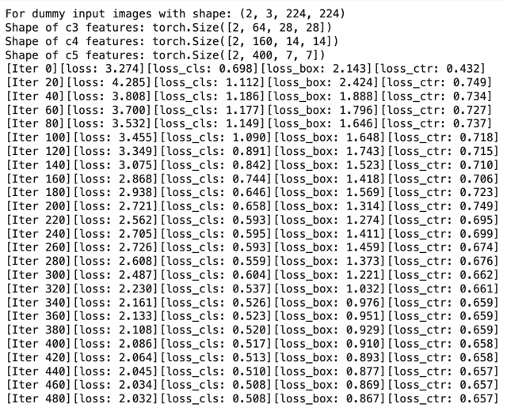</kbd></p>

> [!NOTE]
> có thể thấy như người ta nói loss ban đầu hơi nhích lên do EMA effect, sau
> đó thì nó giảm dần

<br>

<a id="node-1528"></a>

<p align="center"><kbd>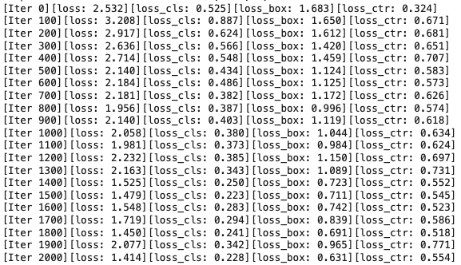</kbd></p>

<p align="center"><kbd>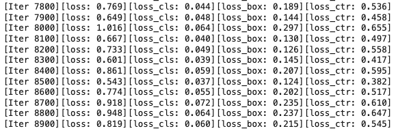</kbd></p>

<p align="center"><kbd>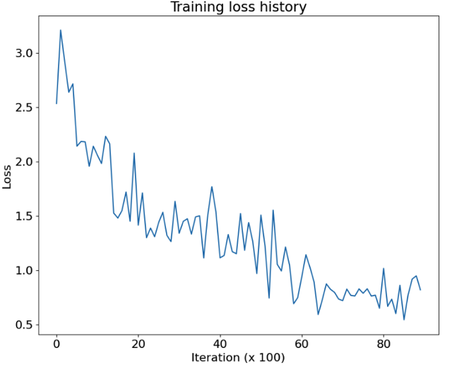</kbd></p>

<p align="center"><kbd></kbd></p>

<p align="center"><kbd></kbd></p>

<p align="center"><kbd></kbd></p>

<p align="center"><kbd>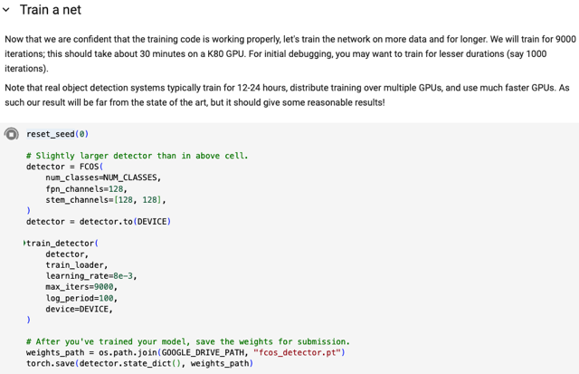</kbd></p>

> [!NOTE]
> Sau khi đã train thử ta sẽ train thật với 9000 iterations. Có thể thấy
> classification loss và box regression loss đều giảm dần

<br>

<a id="node-1529"></a>

<p align="center"><kbd>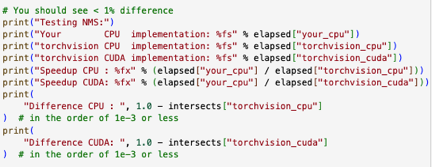</kbd></p>

<p align="center"><kbd></kbd></p>

<p align="center"><kbd>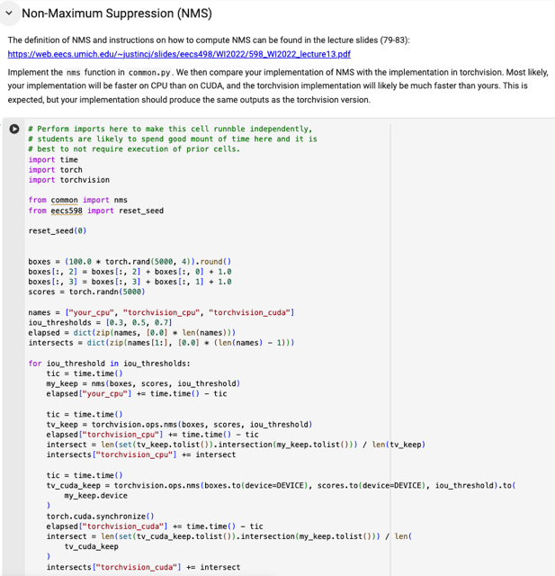</kbd></p>

<br>

<a id="node-1530"></a>

<p align="center"><kbd>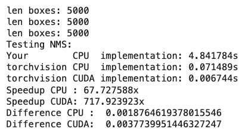</kbd></p>

<br>

<a id="node-1531"></a>

<p align="center"><kbd>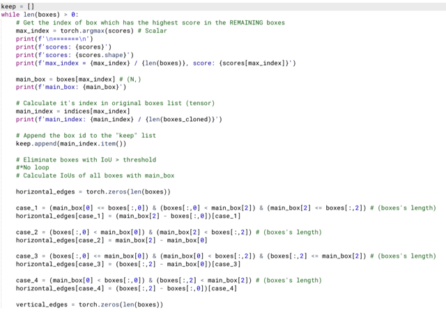</kbd></p>

<p align="center"><kbd>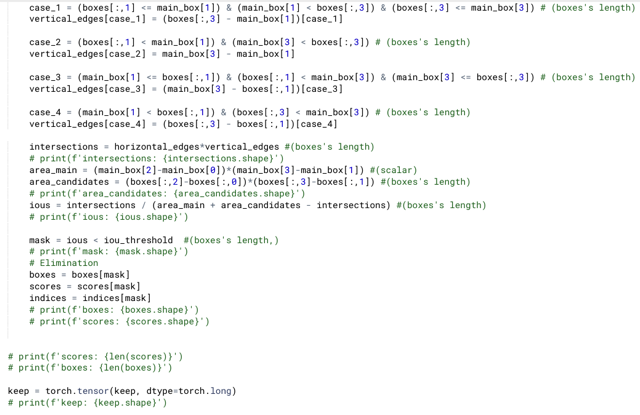</kbd></p>

<p align="center"><kbd>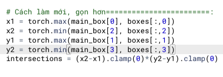</kbd></p>

<p align="center"><kbd></kbd></p>

<p align="center"><kbd></kbd></p>

<p align="center"><kbd></kbd></p>

<p align="center"><kbd>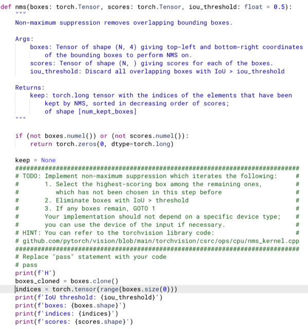</kbd></p>

> [!NOTE]
> Cách làm thì như mô tả 3 bước ở dưới: 
> Đầu tiên chuẩn bị một `boxes_clones,` là list box ban đầu sẽ không
> thay đổi, còn boxes thì sẽ loại bỏ dần nên sẽ ít dần đi.  
>
> Chọn một box có scores lớn nhất:
>
> `max_index` `=` torch.argmax(scores) ta được index của box có score
> lớn nhất trong scores. Sau đó ta mới lấy cái box đó ra (từ boxes) 
>
> Tiếp theo ta sẽ kiểu lấy index của cái box này trong list box gốc 
> (indices)
>
> Sau đó loại bỏ mọi box trong list boxes (boxes tensor)
> mà có iou với cái box được chọn lớn hơn `iou_threshold.` Rồi lại lặp
> lại như vậy cho đến khi box list rỗng
>
> Việc tính iou thì có các trường hợp như hình minh họa, cái chính
> là ta sẽ tính ious của một box (cái có score lớn nhất) và mọi box
> khác trong boxes một cách ĐỒNG LOẠT. 
>
> Để rồi dùng nó tạo cái mask, để thực hiện bước elimination một
> cách ĐỒNG LOẠT.
>
> Thì cũng dễ, ta sẽ tạo vector các chiều dài cạnh, filled với zero,
> length `=` len(boxes). Sau đó các case sẽ dùng để fill vào với giá trị
> theo công thức tương ứng.

> [!NOTE]
> Cách tính Intersection gọn hơn

<br>

<a id="node-1532"></a>

<p align="center"><kbd></kbd></p>

<p align="center"><kbd></kbd></p>

<p align="center"><kbd></kbd></p>

<p align="center"><kbd></kbd></p>

<p align="center"><kbd></kbd></p>

> [!NOTE]
> Lúc đầu làm chia ra các trường hợp, nhưng sau đó với gợi ý của gpt
> Ta có thể làm đơn giản hơn với min, max: Vì cuối cùng các trường hợp
> đều quy về là min (của x2 đỏ, x2 xanh) `-` max (của x1 đỏ và x1 xanh) 
> và clamp(0) để handle các trường hợp mà kết qủa ra âm (tức là không
> có intersection)

<br>

<a id="node-1533"></a>

<p align="center"><kbd></kbd></p>

> [!NOTE]
> tương tự, với y cũng vậy, không cần chia trường hợp,
> mà dùng min, max, clamp sẽ gọn hơn

<br>

<a id="node-1534"></a>

<p align="center"><kbd>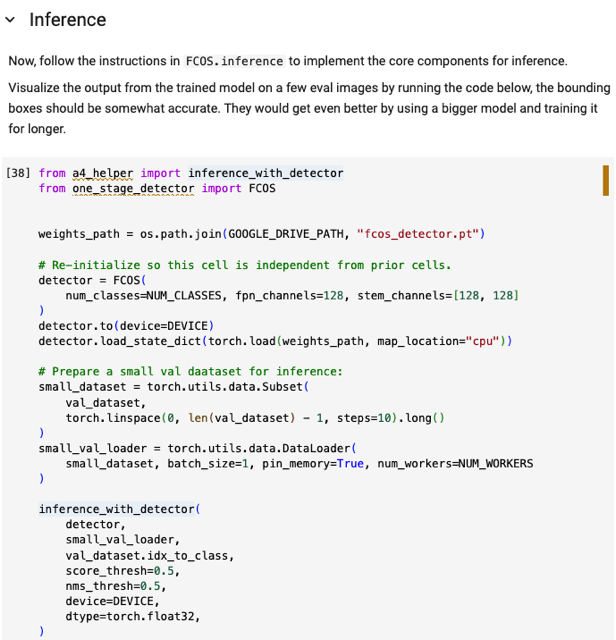</kbd></p>

<br>

<a id="node-1535"></a>

<p align="center"><kbd>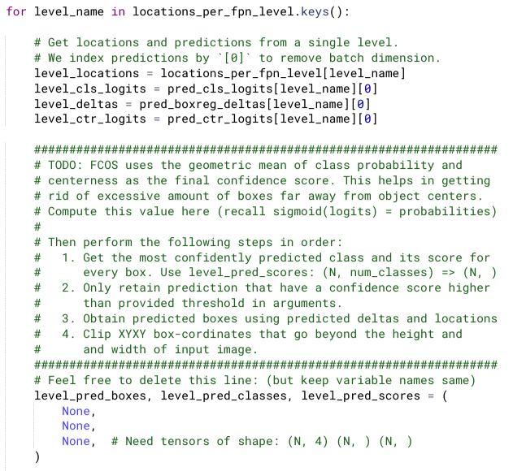</kbd></p>

<p align="center"><kbd></kbd></p>

<p align="center"><kbd>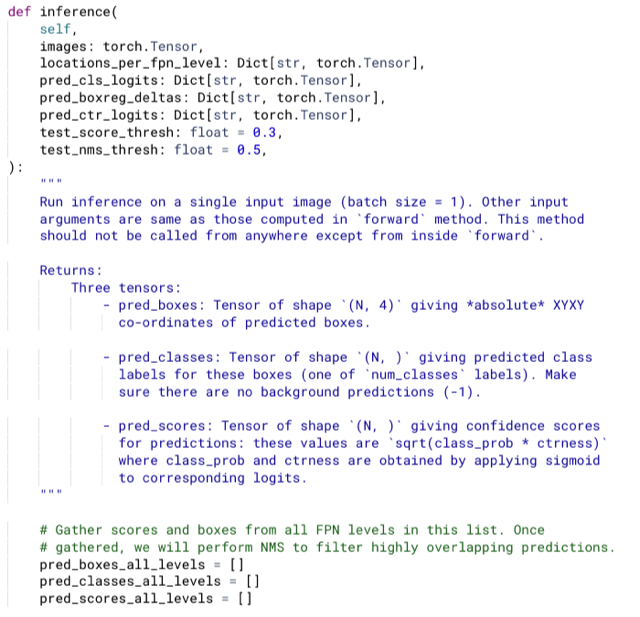</kbd></p>

> [!NOTE]
> Function inference sẽ được gọi ở đây (fcos's forward) đại khái là Sau khi đã
> forward image qua backbone cnn fpn và prediction head để có:
>
> **- locations_per_fpn_level** đại khái là 3 bộ location center coordinate (N,4)
> ứng với 3 level (N lần lượt là 28*28, 14*14, 7*7) 
>
> `-` `pred_cls_logits:` 3 bộ các classification logits (class scores) mà model dự
> đoán cho mỗi location. Shape: N, `num_classes` `=` 20
>
> `-` `pred_boxreg_deltas:` 3 bộ các box deltas mà model dự đoán cho mỗi 
> location. Shape: N, 4 (khoảng cách từ location với predicted box)
>
> `-` `pred_ctr_logits:` 3 bộ các centerness logit, shape (N,1)

> [!NOTE]
> "xét riêng" từng level, lấy các "bộ" (value) tương ứng ra.

<br>

<a id="node-1536"></a>

<p align="center"><kbd>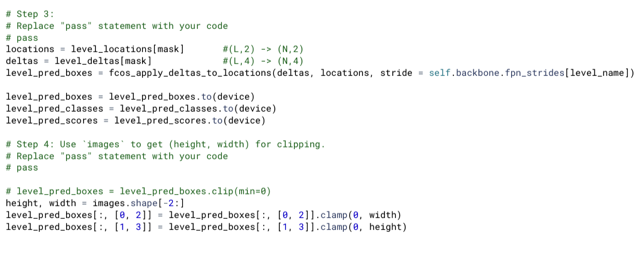</kbd></p>

<p align="center"><kbd>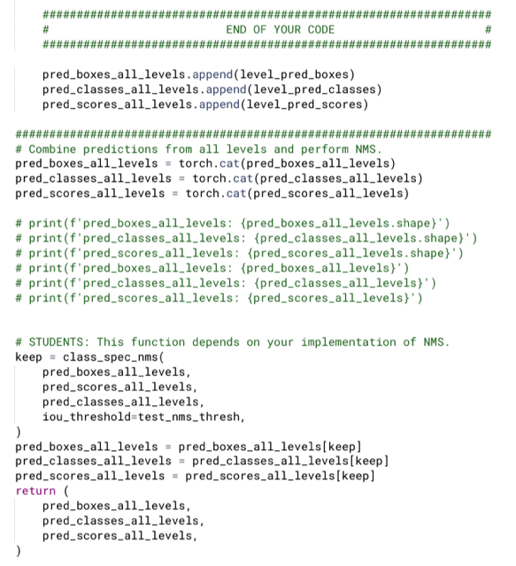</kbd></p>

<p align="center"><kbd></kbd></p>

<p align="center"><kbd></kbd></p>

<p align="center"><kbd>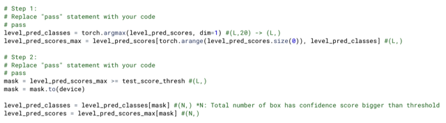</kbd></p>

> [!NOTE]
> Bước 1: dùng argmax để **"lấy" ra index của cột có giá trị lớn nhất** trong mỗi
> hàng. Đây cũng chính là class id gắn với class score cao nhất.
>
> Rồi cùng dùng các index này để lấy ra mấy cái class score cao nhất đó.
>
> Bước 2: Tạo một cái mask (L,) L ở đây là tổng số location trong level hiện
> tại. Cái mask này sẽ có giá trị True nếu class score tại vị trí tương ứng cao
> hơn threshold. Để rồi ta dùng cái mask này để "lọc" bớt, chỉ giữ lại các row
> trong `level_pred_classes,` và `level_pred_scores` có class scores lớn hơn 
> threshold. Mang ý nghĩa là ta sẽ chỉ giữ lại các location mà model khá chắc
> chắn thuộc về một class nào đó

> [!NOTE]
> Bước 3: Cũng dùng cái mask trên để lọc bớt các location và deltas.
> Ta mới dùng hai cái này trong function `fcos_apply_deltas_to_locations`
> mà ta đã tự làm ở trên, nó sẽ giúp "tính" `/` chuyển vị trí của location, và
> predicted deltas để thành ra tọa độ chính xác của cái predicted boxes
> mà ta nhớ là trong đó nó reverse lại quá trình normalize blah blah.
>
> (Chỗ này lúc đầu ta quên rằng đã làm cái function `fcos_apply....locations`
> này nên thay vì dùng nó ta lại tính lại (mà không có cái unnormalize) khiến
> kết qủa mấy cái (predicted) box nó nhỏ xíu.
>
> Và bước cuối cùng là dùng function .clamp() để clip `/` nói chung là đảm bảo
> các predicted box (đương nhiên là tọa độ của 2 góc không vượt quá height 
> và width của original image.

<br>

<a id="node-1537"></a>

<p align="center"><kbd>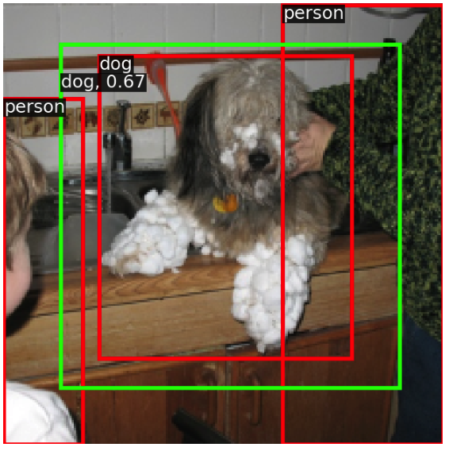</kbd></p>

<p align="center"><kbd>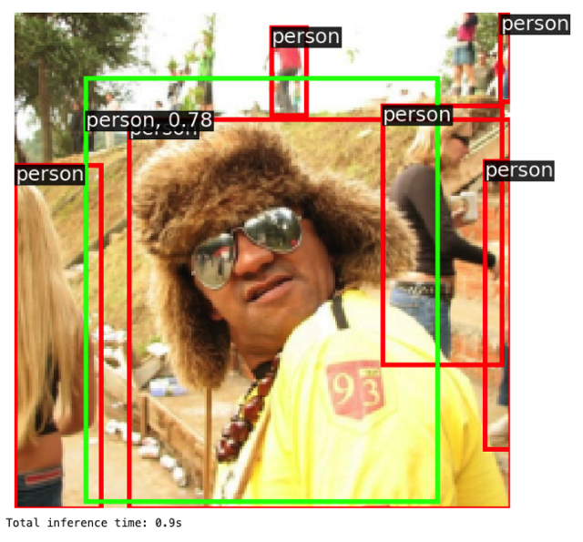</kbd></p>

<p align="center"><kbd></kbd></p>

<p align="center"><kbd></kbd></p>

<p align="center"><kbd>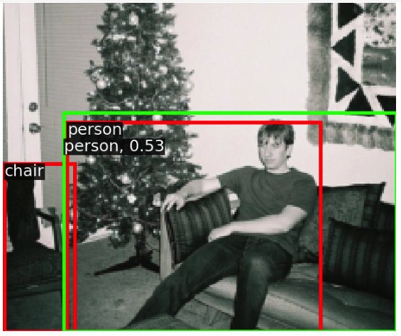</kbd></p>

<br>

<a id="node-1538"></a>

<p align="center"><kbd>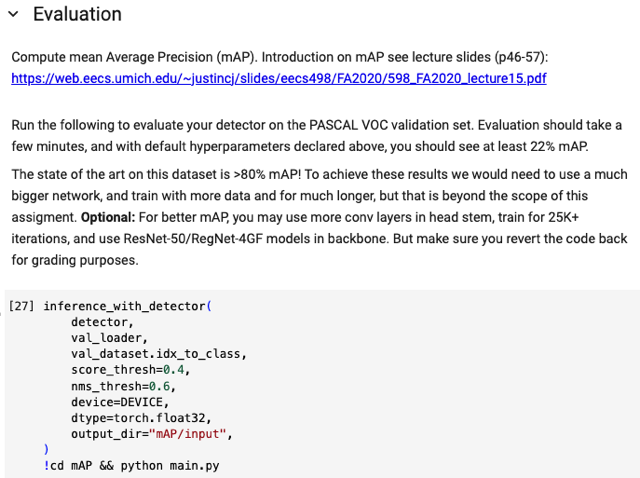</kbd></p>

> [!NOTE]
> rồi cuối cùng, ta sẽ evaluate nó với chỉ số mAP. Họ cho rằng ta nên thấy
> mAP đạt mức trên 22% và cho biết mô hình xịn nhất hiện nay có thể đạt
> trên 80% mAP. Để có được hiệu suất này ta sẽ cần một network lớn hơn
> Train với nhiều data hơn.
>
> Mình có thể thử bằng cách thêm nhiều conv layer vào head stem. Train
> lâu hơn với 25K iterations cũng như là dùng `ResNet-50/RegNet-4GF` 
> cho backbone CNN.

<br>

<a id="node-1539"></a>

<p align="center"><kbd>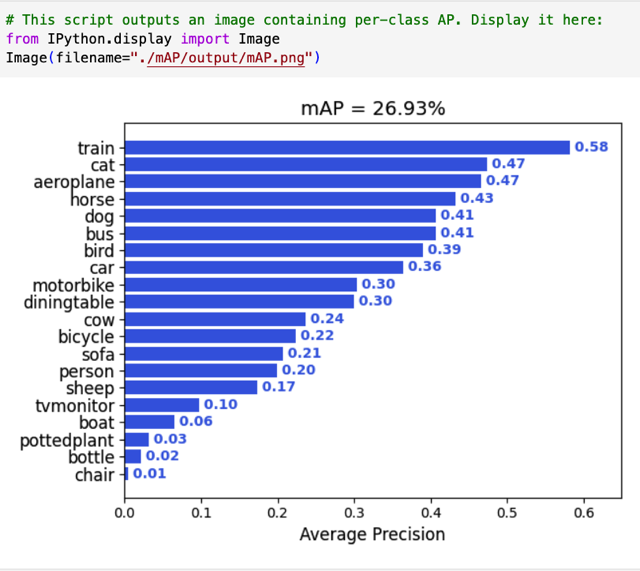</kbd></p>

<p align="center"><kbd></kbd></p>

<p align="center"><kbd>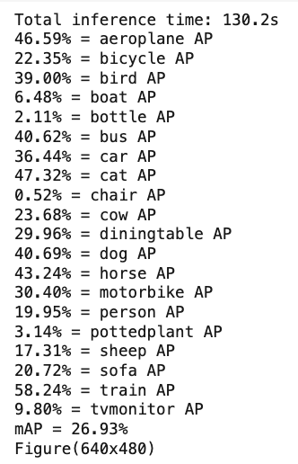</kbd></p>

> [!NOTE]
> Kết qủa mAP 27% > 22% như yêu cầu

<br>

