# EECS 498-007/598-005 (2022) - ASSIGNMENT 4 (Part 2): TWO-STAGE DETECTOR

📊 **Progress:** `54` Notes | `202` Screenshots

---

<kbd>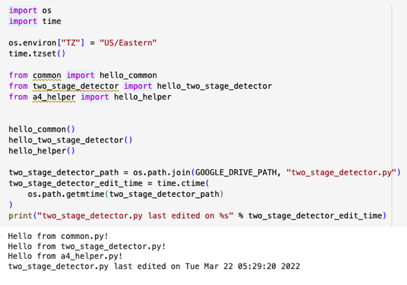</kbd>

<kbd></kbd>

<kbd>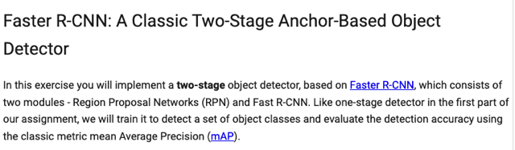</kbd>

 

<kbd>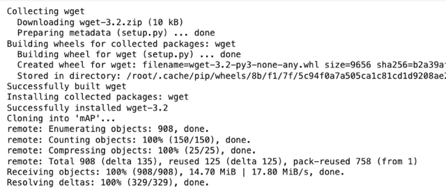</kbd>

<kbd></kbd>

<kbd>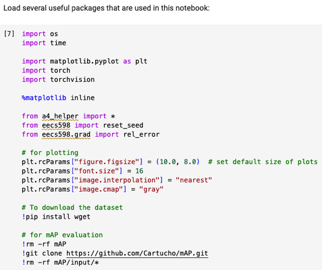</kbd>

 

<kbd>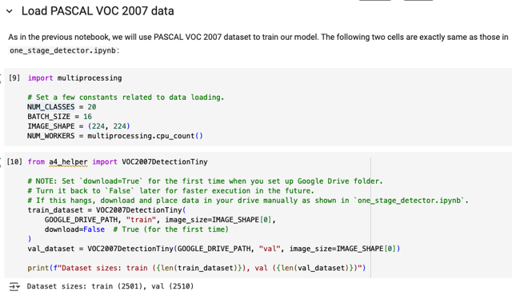</kbd>

> [!NOTE]
> rồi, với cái này ta cũng train nó trên PASCAL 2007 dataset, hai cell này y như
> part 1, họ giúp ta download (nếu chưa có) dataset về. Sét một số
> constant như batch size,

 

<kbd>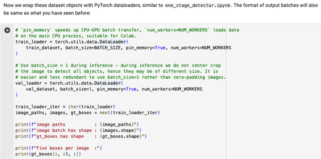</kbd>

> [!NOTE]
> Y như part 1, copy phần note của part 1:
>
> rồi, đại khái là ta sẽ **dùng Pytorch DataLoader** để giúp ta chuẩn bị và **cung
> cấp từng batch data**, mà mỗi sample bao gồm**image tensor** và **label tensor**.
>
> ở đây người ta đề nghị sẽ quay lại tìm hiểu sau ở trong **a4_helper**. Còn bây
> giờ quan trọng là hiểu các mà label được chuẩn bị.
>
> vậy, như đã nói DataLoader sẽ chuẩn bị từng batch dataset, thì nó sẽ bao
> gồm "**xb**" sẽ có shape **(B,3,W,H)** với W, H là bề rộng dài của image = 
> IMAGE_SHAPE[0] và IMAGE_SHAPE[1]. 
>
>
> **yb** sẽ là tensor shape **(B,N,5)**: tức là, B images, mỗi cái có label sẽ là một
> matrix **(N,5)**. Trong đó **N là số lượng object nhiều nhất xuất hiện trong một
> bức hình nào đó trong batch này**. Ví dụ là 3 đi, thì có nghĩa là trong batch
> có ít nhất một bức hình nào đó mà nó có 3 object. Để rồi label của nó sẽ là
> matrix **3 hàng 5 cột**, **mỗi hàng sẽ là một vector 5 con số x1, y1, x2, y2, c**
> cho biết tọa độ của góc trên - trái và góc dưới - phải của bounding box. 
> Còn **c** là class id.
>
> Vậy **đương nhiên** **có bức chỉ có 2 hoặc 1 object**, khi đó **label của nó vẫn là
> matrix 3x5** nhưng**chỉ có 2 hoặc 1 hàng là có số thôi**, còn lại là **-1** (gọi là dc
> **null padding**)

 

<kbd>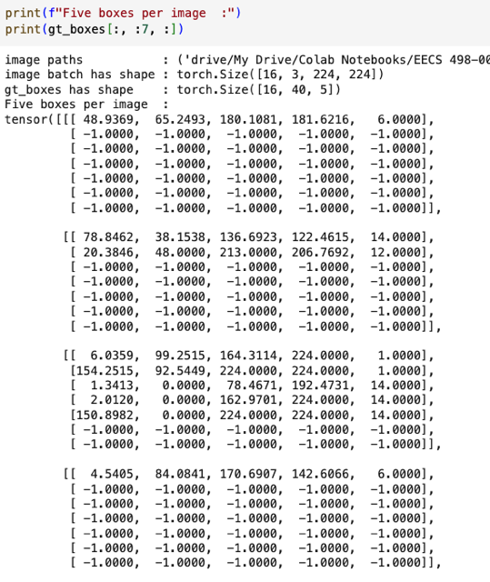</kbd>

> [!NOTE]
> chú ý gt_boxes mà next(train_loader_iter) trả ra ở đây, (chính là yb) 
> có shape là (16, 40, 5) thì có nghĩa là một cái hình nào đó trong batch
> có tới 40 box nên y của mọi sample để có shape (40,5). 
>
> Ở đây họ chỉ "in ra" 7 "cái" đầu thôi

 

<kbd>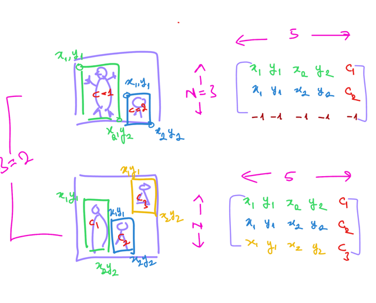</kbd>

 

<kbd>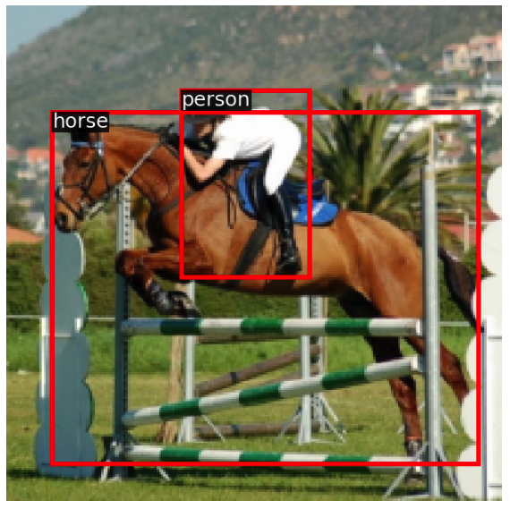</kbd>

<kbd></kbd>

<kbd>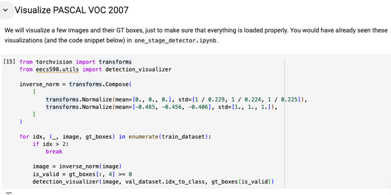</kbd>

 

<kbd>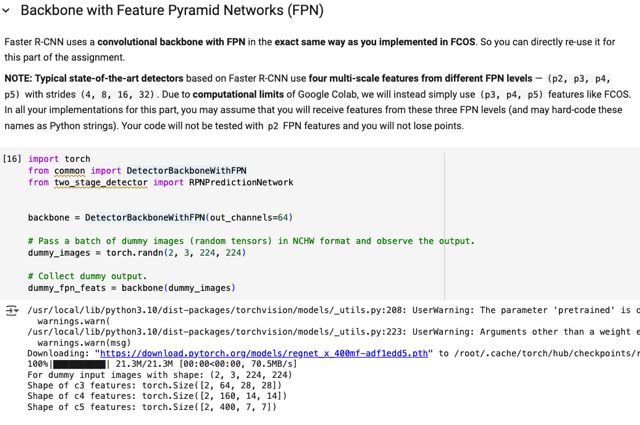</kbd>

> [!NOTE]
> đại khái là **Faster R-CNN cũng dùng backbone CNN và FPN y như FCOS**,
> nên ta sẽ **dùng lại những phần đã làm**.
>
> Ở đây cho biết là những mô hình Object detector dựa trên Faster R-CNN **xịn
> xò nhất sẽ "dùng" với 4 level feature**: **p2,p3,p4,p5** với stride 4,8,16, 32.
> Nhưng vì giới hạn trong compute resource của colab nên tương tự như FCOS
> (vốn dĩ người dùng thêm p6, p7 thì ở đây ta cũng chỉ dùng 3 level : p3, 4,5
>
> Rồi, ở dưới ta sẽ **load cái backbone with FPN model -
> DetectorBackboneWithFPN** mà mình đã làm ở part 1. Pass cho nó một
> dummy tensor để nó in ra mấy cái shape của các feature ở các level khác
> nhau

 

<kbd>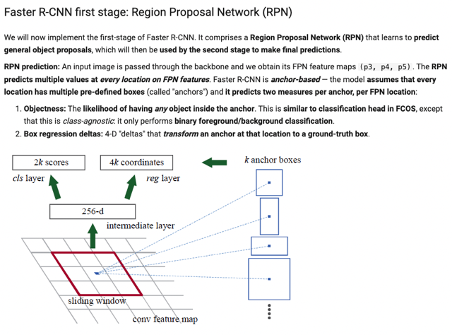</kbd>

> [!NOTE]
> Rồi, đại khái là đầu tiên ta sẽ train cái Region Proposal Network. Nhớ lại, sự
> khác biệt giữa Slow/Fast/Faster R-CNN là:
>
> Slow R-CNN: Dùng Region Proposal algorithm như **Selective Search** để 
> propose  các "region" - những vùng mà "nghi ngờ" có object, rồi sau đó 
> **pass các region này qua backbone CNN để dự đóan class và bounding 
> box**.
>
> Fast R-CNN khắc phục nhược điểm chậm của "Slow" R-CNN bằng cách đổi
> ngược lại **cho cái raw image qua CNN trước**, rồi **mới project các proposed
> region** (mà thuật toán Region Proposal đã tính ra từ original image) **lên trên
> feature map**
>
> Còn Faster R-CNN thì**cho model học luôn cái bước region proposal** bằng
> model **Region Proposal Network - RPN**
>
> ====
>
> Quay lại đây, quá trình hoạt động của RPN sẽ như sau:
>
> Tuy nhiên trước hết phải nói về việc Faster R-CNN nó khác FCOS ở chỗ **nó
> là một "anchor-based" model**, mà trong đó mỗi một location sẽ được gắn
> với **một hoặc nhiều anchor - box** có **kích thước định trước**.
>
> Input image sau khi **forward qua backbone CNN với FPN** nói ở trên sẽ
> **cho ra dictionary các feature maps p3, p4, p5** (**cùng depth**, **khác
> spatial size**). RPN sẽ nhận cái này để dự đoán ra / tính toán ra: **ỨNG VỚI
> MỖI MỘT ANCHOR** (nhớ nhé, một location center hay ở version 2020 gọi là
> grid center có A anchor, nên tổng cộng có AH'*W' (H'W'=số location tại
> feature map của  level) model sẽ **dự đoán ra hai thứ**:
>
> 1.Objectness: Tạm gọi là **xác suất có một object nằm trong anchor**, hay
> **xác suất anchor chứa một ground truth object box**.
>
> Vậy thì dễ hiểu khi người ta nói cái này nó **giống như classification head**
> của FCOS, chỉ khác là **với FCOS, nó tính ra một vector các class scores**
> tức là **dự đoán class gì** trong num_classes categories. Còn ở đây **chỉ là
> dự đoán có / hay không chứa object** hay nói cách khác nó **chỉ là bài toán
> binary classification**: foreground / background class.
>
> 2. Cái thứ hai mà model tính toán cho mỗi location là **một "box regression"**mà như FCOS đã làm - đó là **4 giá trị deltas**, mang ý nghĩa là **dùng để "
> sửa lại"  hay transform từ anchor thành ra gt box.**Cái transformation có
> dạng như thế nào thì sẽ nói sau.
>
> Chú ý là ta chưa nói cái hình nhé

 

<kbd>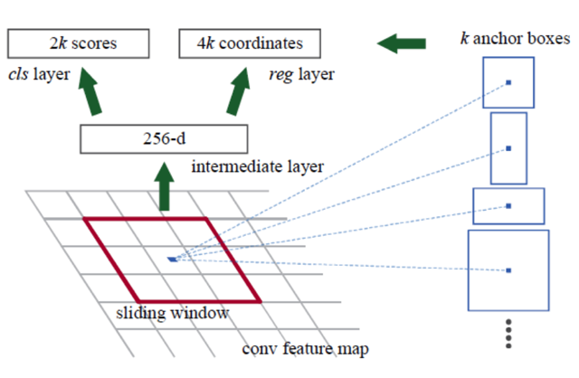</kbd>

> [!NOTE]
> cái hình này minh họa rõ hơn: Với **mỗi location center** (mà từ part 1 đã hiểu, đó
> là vị trí (trên raw image) **tâm của một vùng receptive field** mà  tại đó phép tính
> convolution tính toán ra một giá trị trên feature map) sẽ "có" / **được gắn với k
> anchor box** với kích thước khác nhau định sẵn.
>
> Để sau khi qua một intermediate layer, sẽ là hai prediction head:
>
> 1. **Binary classification**: predict anchor đó là một / thuộc một object hay không.
> Thể hiện bằng hai class scores. Vậy với k anchor box (đã nói ở trên, mỗi
> location sẽ 'có' k anchor box) thì classification head này sẽ tính ra **2k class**
> **scores**.
>
> 2. **Regression** layer: khoảng **deltas** đại khái là**những con số giúp chuyển từ
> anchor box thành ground truth box**. Tương tự như trên, với k anchor box thì
> reg layer sẽ tính ra 4k coordinates.

 

<kbd>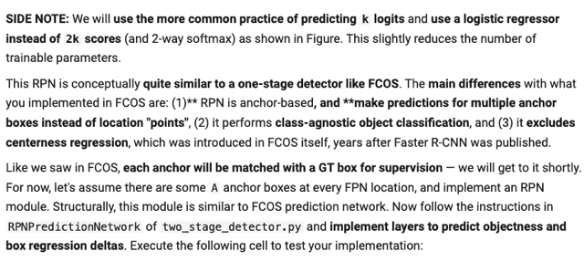</kbd>

> [!NOTE]
> Ở đây người ta lưu ý là tuy theo hình thì ta sẽ **"tính ra" hai class scores (có /
> không chứa object)**, nhưng ở đây mình **sẽ làm theo lối thông dụng hơn** là
> dùng **logistic**, tức là hàm **sigmoid** thay vì **softmax** để **chỉ tính ra 1 score** /
> hay **1 probability score ứng với positive class** thôi. Điều này giúp giảm bớt
> chút ít số trainable param
>
> Cái nữa đó là **RPN khá giống với one-stage detector FCOS** nhưng điểm
> khác biệt là **nó thuộc dạng anchor-based** (cái nãy nãy mới nói), vậy thì **với
> FCOS, "nó" sẽ predict CHO MỖI LOCATION** (như đã biết ở part 1) **3 giá trị**:
> ****1.**Classification:**Dự đoán tại location đó là **class gì** trong num_classes
> category 
>
> 2.**Regression box**: Dự đoán ra **4 giá trị là khoảng cách từ location đến 4 cạnh
> của object box** 
>
> 3.**Centerness**: Dự đoán một chỉ số thể hiện **khả năng location đó là tâm của
> một object bbox**. 
>
> Còn với RPN thì nó sẽ predict **CHO MỖI ANCHOR** 2 giá trị: 
>
> 1. **(Binary) Classification**: **Object-ness** - **xác suất anchor có chứa một object** 
>
> 2. **Regression** box: **4 giá trị tạo nên một phép transformation** để convert anchor
> thành ra bbox
>
> Như vậy điểm khác biệt nữa đó là như đã nói nó sẽ chỉ predict bài toán
> binary classification và không có center-ness.
>
> Rồi, giống như FCOS, **mỗi anchor sẽ được gán ghép (match) với một ground 
> truth box** để **làm target cho bài toán supervised learning**. 
>
> Ta sẽ giả sử / cho rằng mỗi location sẽ "có" **A anchor box**, thì nhiệm vụ đầu tiên là 
> ta sẽ "làm" module RPN, vốn dĩ, như đã nói có kiến trúc khá giống FCOS prediction 
> network (tức là khúc prediction head)

 

<kbd>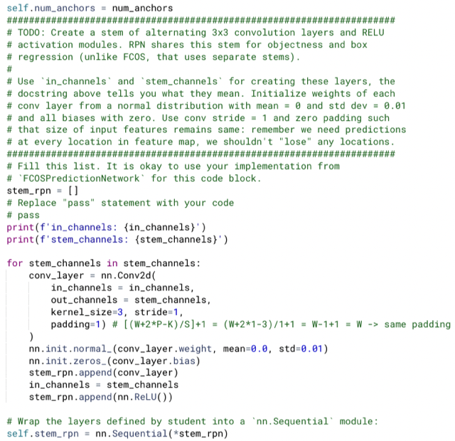</kbd>

<kbd>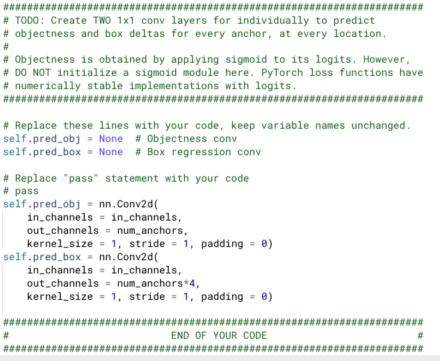</kbd>

<kbd></kbd>

<kbd></kbd>

<kbd>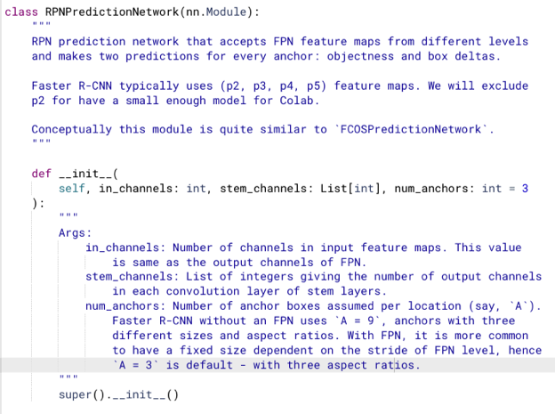</kbd>

> [!NOTE]
> Rồi thế thì như đã nói **RPN này nó sẽ có kiến trúc tương tự như
> FCOSPredictionNetwork**, cũng **nhận input từ "backbone CNN with FPN"**
> **với các level khác nhau** (cùng depth, khác spatial size)
>
> Như đã nói hồi nãy, trong assignment này ta sẽ **chỉ làm với p3,4,5** thay 
> vì p2,p3,p4,p5 như một Faster R-CNN đầy đủ.
>
> Vậy nhớ lại, **FCOSPredictionNetwork** sẽ có kiến trúc là **hai nhánh**, **mỗi
> nhánh là một chuỗi 4 conv layer**, và cuối một nhánh là **classification** 
> layer hoặc **regression** layer (**depth và spatial size giữ nguyên xuyên suốt**)
>
> Input của module sẽ có **in_channels** - là **depth (int) của FPN output tensor,**
> **step_channels** là các depth của các conv layer. Và cuối cùng là **num_anchors**
> là số anchor box "của" một location.

> [!NOTE]
> Ở đây thật ra hơi khác với FCOSDetectionNetwork ở chỗ, **thay vì có
> hai nhánh (stem)**: **một cái cho classification head**, **một cái xài
> chung (share) cho cả regression và centerness**.
>
> Thì ở đây, sẽ **chỉ có một nhánh** (tức là chuỗi 4 cái conv layer đó), và
> **xài chung cho cả (binary) classification head và regression head**.
>
> Vậy đầu tiên ta sẽ "làm" cái stem này, chỉ là chuỗi các conv layer 3x3,
> stride 1, same padding, với weight được khởi tạo với normal distribution
> zero mean, std 0.01. Còn bias thì init với zero. Đương nhiên là theo sau
> conv layer là relu.
>
> còn hai cái "head" layer thì là hai cái conv layer,  với pred_obj sẽ có
> depth =  num_anchors, còn pred_box thì depth = 4*num_anchors. Dùng
> kernel size 1x1, stride 1 và chú ý là padding = 0. vì conv 1x1 thì reserve
> spatial shape mà không  cần padding.
>
> \/So sánh với cấu trúc của ProposalModule (trong v2020 part 2 FasterRCNN) 
> thì ta nhớ trong đó người ta không chia thành BoxRegression head và 
> Object-ness (ở trong đó gọi là object confidence) mà chỉ output chung trong
> một head theo kiểu tại mỗi spatial location sẽ output một vector dài A*6
> A là số anchor, 6 là gồm 2 giá trị binary confidence scores và 4 giá trị box
> offsets (transformation). Có thể đoán rằng việc chia thành hai head hiệu quả
> hơn. Tương tự như vậy, nhớ lại với Single Stage Detector của v2020 - tức 
> YOLO, PredictionNetwork cũng không chia thành các head với các nhánh
> song song (stem layers) như của FCOS.\/

> [!NOTE]
> RPNPredictionNetwork

 

<kbd>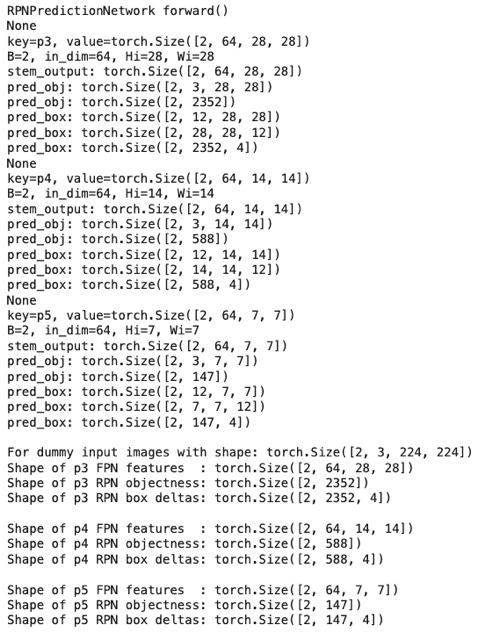</kbd>

<kbd>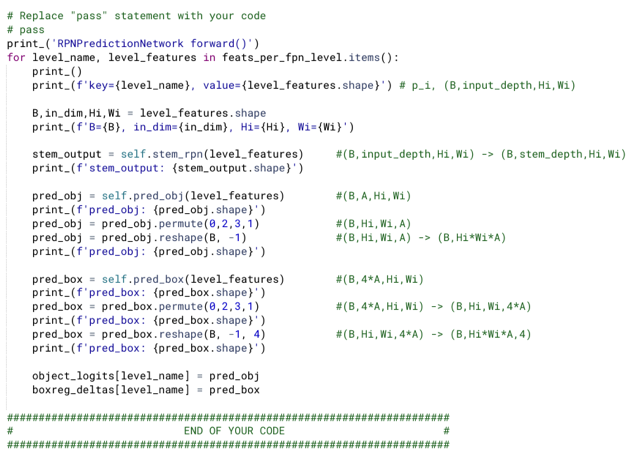</kbd>

<kbd></kbd>

<kbd></kbd>

<kbd>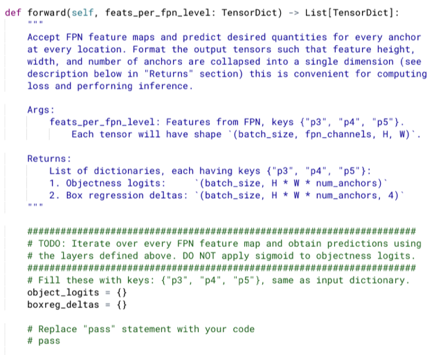</kbd>

> [!NOTE]
> forward function, sẽ nhận feature map từ FPN ứng với 3 level khác nhau p3,
> p4, p5 như đã biết, sẽ có cùng depth, nhưng khác nhau spatial size.
>
> Thì trong forward, ta sẽ forward từng feature tensor "của" / ứng với từng level
> qua stem structure và hai cái prediction head. Rồi bỏ vào hai cái dict với key =
> level name tương ứng.
>
> Chú ý yêu cầu là **"collapse" cái number of anchors** thì ý là: ví dụ tensor có
> shape (B,W,H, A=num_anchors,4)  mang ý nghĩa là đại khái là còn  phân biệt /
> xác định (logit của) một cái  anchor box là thuộc một  location nào, và là cái thứ
> mấy trong A anchor.
>
> Còn sau khi reshape nó thành (B, **no.anchors across location** = W*H*A , 4) thì
> kiểu như là ta **không còn  quan tâm anchor box đó là ở location nào nữa**,
> chỉ c**òn một list (các logit cuả) các anchor box nói chung** của**mọi location**
> trong batch đó.

 

<kbd>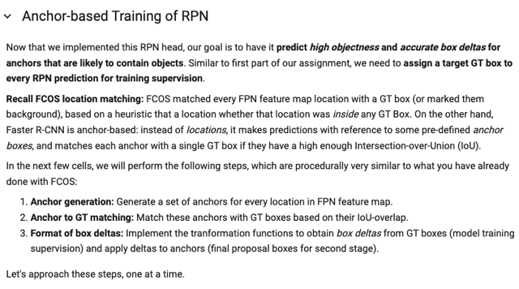</kbd>

> [!NOTE]
> Thế thì, với RPN ta muốn train nó để có khả năng là **nếu một location " là" / " thuộc" một object** (ý là
> một ground truth box) thì ta sẽ muốn nó..:
>
> 1. Dự đoán ra x**ác suất của việc location đó "là"/ "thuộc" class object** -**"object-ness" cao** và
>
> 2. Dự đoán chính xác **4 giá trị deltas** giúp transform anchor box thành ground truth box (lúc đầu nghĩ
> rằng deltas là khoảng cách từ 1 cạnh của anchor box tới 1 cạnh tương ứng của gt box nhưng lúc sau
> thấy rằng không phải vậy, nó sẽ là **tx, ty - giúp shift tâm của anchor box** / (cũng là vị trí của location)
> **trở** **thành tâm của gt box**, và **tw, th**: scale factor **giúp scale từ width và height của anchor box
> để thành width, height của gt box**
>
> Do đó thì cũng giống như part 1, ta sẽ cần làm động tác là tính toán và assign target. Hiểu đại khái là ta
> cần tính xem với **một cái anchor box của một location nào đó thì ground truth objectness là bao nhiêu**cũng****như là **khoảng cách thực sự từ các cạnh của anchor box đó tới một cái box thiệt là bao
> nhiêu**.
>
> Vì ta đang train theo lối **supervised** **learning**, thì RPN mình muốn nó predict như vậy, thì p**hải có
> cái target cho nó.**
>
> ===
>
> Vậy thì nhớ lại bên FCOS, ta đã (xem một function mà họ làm giùm việc này) **match mỗi location với
> một box** (object ground truth box - một box với class thuộc một trong các class hoặc **background box**), và
> điều này được thực hiện **dựa trên việc xác định xem cái location nó nằm ở trong phạm vi của một
> ground truth box nào**. (cái rule của việc này còn mấy vấn đề khác, có thể đọc lại cái note đó)
>
> Còn ở đây, như đã nói, nó là một **anchor-based approach**, nên **mỗi một anchor-box sẽ được assign
> với ground truth box dựa trên IoU** (cũng có rule cho cái này tí nữa sẽ nói)
>
> ===
>
> Thế thì trong phần tiếp theo ta sẽ thực hiện các bước của quá trình này. Bao gồm:
>
> 1. **Anchor generation**: **Tạo ra cho mỗi một location, một bộ các anchor boxes**.
>
> 2. **Anchor to GT matching**: **Với mỗi anchor box, gán cho nó một GT box**, **dựa trên IoU**
> (intersection over unions) của nó với các gt box.
>
> 3. **Format of box deltas**: Viết một **"transformation function"** để mà dùng trong việc **tính ra GT box
> deltas của một anchor box**. Cũng như là **một function khác giúp tính từ anchor box, và (predicted)
> delta để tạo ra predicted object box** (tức là bước mà mình đã cho model dự đoán ra cái deltas thì dùng
> nó để cùng với anchor box "chuyển thành" / "tính ra" một object box

 

<kbd>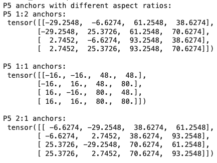</kbd>

<kbd></kbd>

<kbd>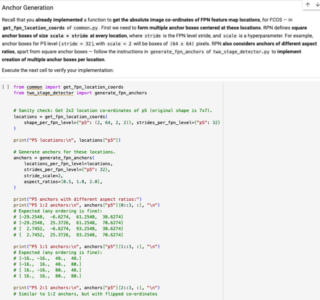</kbd>

> [!NOTE]
> Rồi, đầu tiên là ta sẽ làm cái bước **Anchor Generation**. Thì họ nói là ở
> phần 1 mình đã làm cái function **get_fpn_location_coors**() mà trong đó đại
> khái là ta tính ra tọa độ (coordinate) trên original image của từng location
> center. Vậy thì ở đây mình sẽ cần **taọ các anchor box mà tâm của chúng là
> tại các location (coordinate) này.** Vậy đại khái là ta hiểu rằng,**với mỗi
> location trên feature map, ta đã có các tọa độ trên original image ứng với
> nó**, thì ta sẽ **xác định ra vị trí của một anchor box "tại đó"** (tâm tại tọa độ
> đó) (bằng cách  định ra hai điểm TL, BR).
>
> Thế thì kiểu như **để vẽ cái hình chữ nhật, thì nếu có tâm rồi** (location
> coordinate) thì **cần thêm kích thước cạnh nữa là sẽ vẽ được**. Thì ở đây
> người ta cho biết RPN nó sẽ dùng **anchor box vuông**, bề dài (cũng như
> rộng) sẽ là **scale*stride**trong đó stride thì biết rồi, ứng với từng level, sẽ có
> stride (là cái thông số stride dùng trong (FPN) lúc thực hiện tính toán
> convolution để tạo ra feature map). Còn **scale là một hyperparameters**.
> Như vậy là ta có thể xác định vị trí của anchor box.
>
> Bên cạnh đó, RPN cũng dùng các anchor box chữ nhật. Thì bây giờ mình sẽ "
> làm" function **generate_fpn_anchors**

> [!NOTE]
> So sánh kết quả khớp với
> expected value

 

<kbd>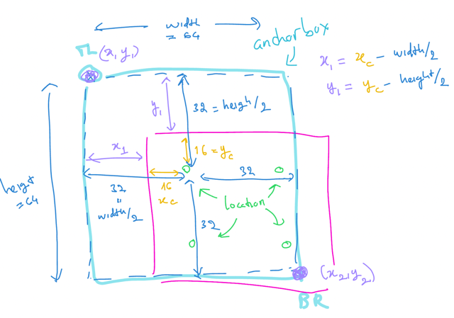</kbd>

<kbd>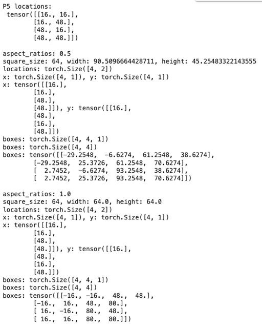</kbd>

<kbd>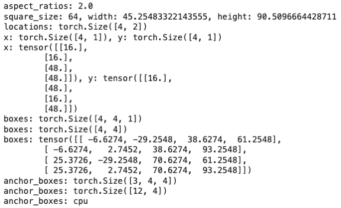</kbd>

<kbd>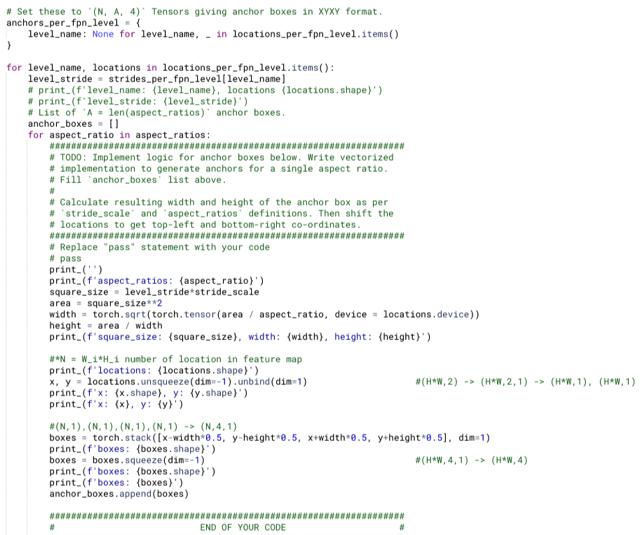</kbd>

<kbd></kbd>

<kbd></kbd>

<kbd></kbd>

<kbd></kbd>

<kbd>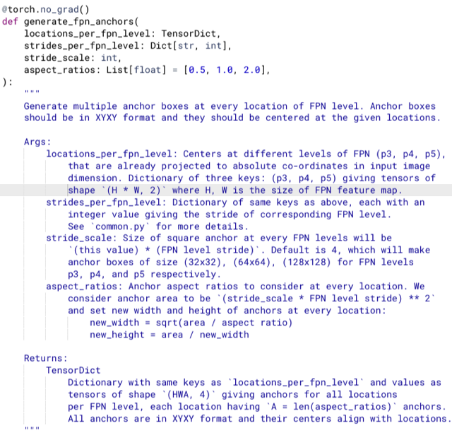</kbd>

> [!NOTE]
> Input thứ nhất là **locations_per_fpn_level**, là cái gì thì biết rồi, nó là 3 bộ (trong
> hình hài một dict, nói 3 bộ cho dễ hình dung), bộ gì? bộ các tọa độ (xc, yc) của
> các location center ứng với các giá trị của feature map. Nên mỗi bộ là một
> tensor shape là (W_i*H_i, 2) trong đó W_i, H_i là spatial size của level p_i (trong
> 3 level p3,p4,p5, again bản đầy đủ người ta xài thêm p2).
>
> Input thứ hai là **strides_per_fpn_level**: là các giá trị stride (int) tương ứng với mỗi
> level
>
> **stride_scale**: giá trị scale (là hyper-param) mà khi nhân với stride ta sẽ có kích
> thước của cái anchor box mà thuộc loại hình vuông (square anchor box)
>
> **aspect_ratios**: tạm hiểu là nó là cái giá trị dùng để "tính ra" cái hình dạng thực
> sự của anchor box, kiểu như là, cơ bản thì ta có square anchor box với kích
> thước stride*scale, để rồi diện tích sẽ là (stride*scale)**2. Thì cái aspect_ratios
> này sẽ  dùng để tính ra chiều dài và chiều rộng mới theo công thức:
>
> bề rộng "mới" = sqrt(area/aspect ratios)
>
> bề dài "mới" = area / bề rộng mới.  Thì cơ bản mình hiểu là nó sẽ giúp chuyển
> cái hình vuông thành ra hình chữ nhật.
>
> ===
>
> Yêu cầu sẽ là 3 bộ, mỗi bộ là shape (W_i*H_i*num_anchors, 4) mang ý nghĩa
> là: (với feature level i), có tộng cộng W_i*H_i location -> có
> W_i*H_i*num_anchors các anchor boxes. Mỗi anchor box được represent / định
> bởi 4 giá trị (x1,y1,x2,y2)  là coordinate của hai TL, BR corners.
>
> Ở đây cho biết ta có thể có giá trị của num_anchors = số phần tử của aspect ratios, 
> vì mỗi anchor nó ứng với một aspect ratio

> [!NOTE]
> Đại khái là ta sẽ cần làm như sau: Làm l**ần lượt cho từng level**, trong đó, với
> mỗi aspect ratio, (ví dụ có 3 cái aspect ratios, tức là có 3 anchor box tại mỗi
> location)  ta sẽ **"tính" tọa độ của anchor box của MỌI location cùng lúc**. Để có
> tensor shape  (W_i*H_i, 4), add vào list. Để được**list chứa 3 tensor** như vậy.
> Đặng**torch.stack** để thành một tensor shape (3 = chính là A, là số anchor box
> đó, W_i*H_i, 4)
>
> Quá trình tính toán sẽ là:
>
> VỚi mỗi aspect ratio, cùng với level_stride, stride_scale mà tính ra area và width,
> height của anchor box theo công thức ở trên.
>
> Từ đó mới**"shift the location to get the TL, BR corner coordinate"**tức là tính ra
> tọa độ của hai góc. Chỗ này ta sẽ dùng các function **unsqueeze**, **unbind** như
> cách thức đã làm ở part 1. Chỉ chú ý rằng x1 sẽ là **x - width / 2** (chứ không phải
> width) vì đây là **width, và height tức bề dài, rộng của anchor box**chứ không phải
> deltas như bên FCOS (là khoảng cách từ location tới các cạnh)

> [!NOTE]
> generate_fpn_anchors

 

<kbd>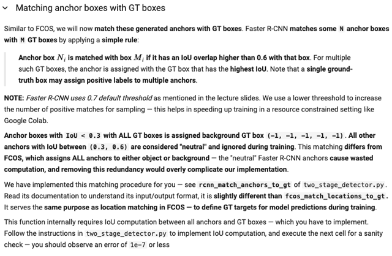</kbd>

> [!NOTE]
> tiếp theo tương tự bên FCOS, trong function **fcos_match_locations_to_gt**
> mà trong đó ta thực hiện việc ghép đôi một location và một ground truth box
> (nhằm có input-target cho việc training) thì ở đây cũng vậy, ta sẽ thực hiện
> việc **ghép (match) một anchor box và một ground truth box**.
>
> Việc ghép dựa trên một simple rule đại khái như sau:
>
> **Một anchor box (trong số N anchor box) sẽ được match với một ground 
> truth box (trong số M gt box) nếu nó có IoU với nhau lớn hơn threshold 
> = 0.6**. 
>
> Và **nếu một anchor box thỏa mãn điều kiện trên với nhiều gt box thì sẽ 
> chọn cái có iou lớn nhất**.
>
> Và họ chú ý nhấn mạnh rằng đương nhiên một gt box có thể được match với
> nhiều anchor box khác nhau.
>
> \/Thế thì sau khi làm "version" 2020, thì ta thấy trong đó, một box cũng sẽ được
> ghép cho một anchor **nếu như anchor đó là cái có iou với nó lớn nhất trong
> mọi anchor, dù ngay cả cái iou lớn nhất cũng không lớn hơn threshold**. 
> Lí do được giải thích là vì một số hiếm trường hợp, chẳng có iou nào lớn hơn pos
> threshold hết\/
>
> =====
>
> Tiếp theo đại ý là thật ra thì Faster R-CNN họ dùng threshold = 0.7, nhưng ta
> sẽ dùng 0.6 trong assignment này để**tăng số lượng các cặp ghép đôi
> anchor-gt box lên** từ đó kiểu như có nhiều data hơn giúp training nhanh hơn.
>
> Những**anchor box mà có IoU với MỌI gt box đều nhỏ hơn 0.3 thì ta sẽ 
> gán / ghép nó với background box** (như FCOS) [-1,-1,-1,-1]
>
> Còn những anchor box mà IoU từ 0.3 tới 0.6 thì sẽ là "neutral", và mặc kệ nó
> không sử dụng trong training. Đây cũng là một điểm khác với FCOS khi
> FCOS ta nhớ rằng ta gán mọi location với foreground hoặc background chứ
> không có vụ neutral. Ngoài ra nói thêm là ta cứ kệ các neutral anchors vì nó
> khiến lãng phí tính tính toán và nếu cố gắng loại bỏ nó thì cũng khiến làm
> phức tạp thêm bài toán
>
> Rồi, thế thì người ta cũng làm giúp mình function này -
> **rcnn_match_anchors_to_gt** mình sẽ cần đọc để hiểu. Nhưng bên trong nó
> cũng cần một function mà mình phải **tự làm là bước tính iou của mọi anchor
> box với mọi gt box**

 

<kbd>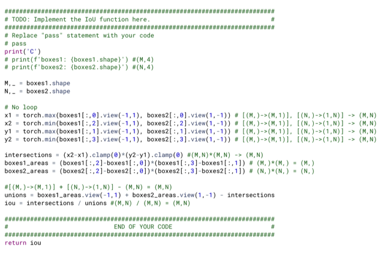</kbd>

<kbd>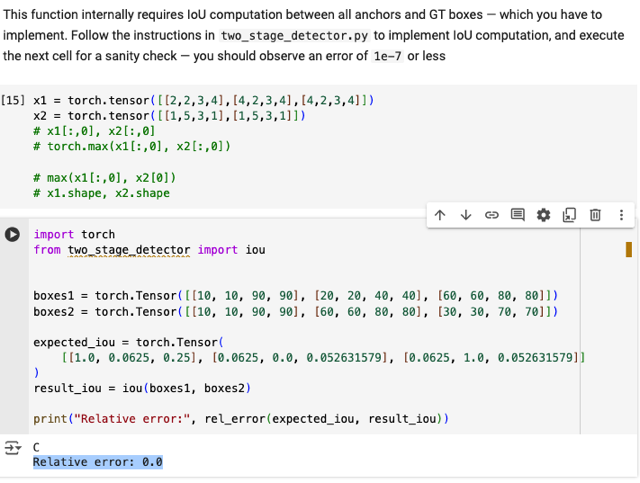</kbd>

<kbd></kbd>

<kbd></kbd>

<kbd>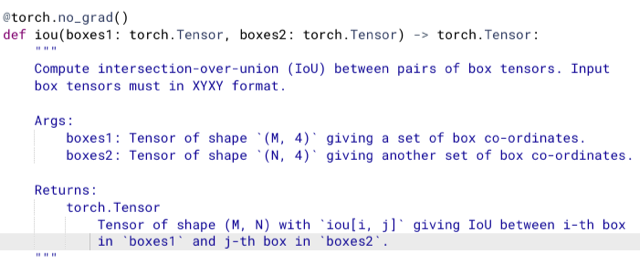</kbd>

> [!NOTE]
> iou()
>
> Function này ta sẽ nhận hai list các box và tính IoU của mỗi cái trong list này
> với mỗi cái trong list kia. (một list sẽ là các anchor box, một list là các ground
> truth box)
>
> Dựa trên cái này là có thể làm được theo cách vectorize:
>
> Cho vector a (M,) và vector b (N,) thì để tạo matrix C (M,N) có phần tử i,j là
> max của ai và bj thì ta sẽ reshape a thành (M,1) và b thành (1,N) và C = torch.
> max(a, b).
>
> Còn lại thì cách tính intersection như đã biết ở part 1 (* dùng cách làm với
> Max, min, clamp, không cần chia các trường hợp như "phiên bản tự làm" đầu
> tiên (xem lại trong part 1 nms()

> [!NOTE]
> you should observe an error of 1e-7 or
> less: Checked!

 

<kbd>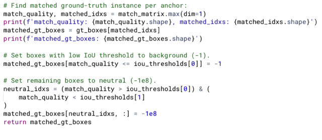</kbd>

<kbd></kbd>

<kbd>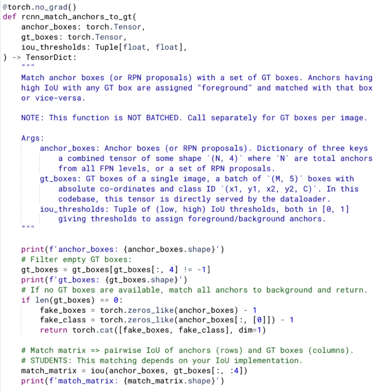</kbd>

> [!NOTE]
> **rcnn_match_anchors_to_gt**:
>
> Như đã nói function này người ta "làm giùm", nhưng ta sẽ cần hiểu nó làm gì. Thế thì như
> họ nói, việc assign một gt box cho một anchor box sẽ dựa theo cái gt box nào có IoU lớn
> nhất và lớn hơn threshold.  Với anchor_box mà không có cái IoU với cái gt box nào lớn hơn
> 0.3 thì sẽ được gán background ([-1,-1,-1,-1, -1]. Còn lại là neutral [0,0,0,0,0]
>
> Vậy ở đây mình nhận vào anchor_boxes shape (N,4) với N là**tổng số mọi anchor box, của
> mọi location, ở mọi level.**
>
> gt_boxes shape (M,5) là các ground truth box, mỗi row là vector [x1,y1,x2,y2,c=class id]
>
> anchor_boxes: torch.Size([588, 4])
>
> gt_boxes: torch.Size([1, 5])
>
> Và hai cái iou_thresholds [0.3, 0.6] để dùng khi quyết định "cái" assign là gt box hay neutral
> (nếu mọi IoU đều lớn hơn 0.3 nhưng bé hơn 0.6) hay background (nếu mọi IoU đều bé hơn
> hoặc bằng 0.3)
>
> Và result mình cần tạo là tensor shape (N,5): N anchor boxes, mỗi cái / row là gt box [x1,y1,
> x2,y2,c=class id] (hoặc "background box" [-1,-1,-1,-1,-1] hoặc neutral [-1e8,-1e8,-1e8,-1e8,-1e8])
>
> ====
>
> Cách làm: đầu tiên là ta sẽ dùng iou() function mình vừa mới làm, pass vào anchor boxes
> (M,4) và gt boxes (gt boxes[:,:4]) (N,4) để có match_matrix (M, N) nơi mà mỗi row (i) là
> vector N chỉ số IoU của anchor box i với mọi gt box.
>
> match_matrix: torch.Size([588, 1])
>
> Rồi, như đã biết, ta sẽ lấy/chọn "cái có IoU lớn nhất" nên mới dùng **max(dim=1)** để
> được **match_quality**, và **matched_idx**
>
> match_quality: torch.Size([588]), matched_idxs: torch.Size([588])
>
> matched_idx là vector có M phần tử, mà giá trị của phần tử thứ i sẽ là 'index' của cái gt box
> (trong số N gt box) mà có IoU với cái anchor box thứ i là lớn nhất
>
> match_quality thì dĩ nhiên dễ hiểu là giá trị IoU tương ứng.
>
> Để rồi ta mới, dùng matched_idx để thông qua dòng lệnh **gt_boxes[matched_idx] tạo ra
> matrix (N,5) - mỗi gt box gắn cho mỗi anchor box.
>
> matched_gt_boxes: torch.Size([588, 5])**
> Sau đó, ta cần xem thử anchor box nào mà ngay cả IoU max vẫn không lớn hơn  "
> threshold" chuẩn dưới (iou_threshold[0]) thì ta thay vector gt box ở đó bằng background box
> [-1,-1,-1,-1,-1]. Tương tự xem những chỗ nào mà IoU max nằm trong khoảng
> [threshold_dưới 0.3, threshold_trên 0.6] thì gán nó là neutral

> [!NOTE]
> rcnn_match_anchors_to_gt

 

<kbd>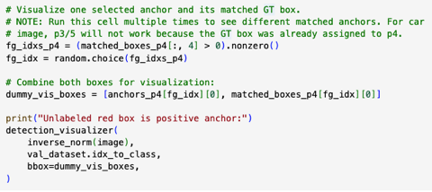</kbd>

<kbd>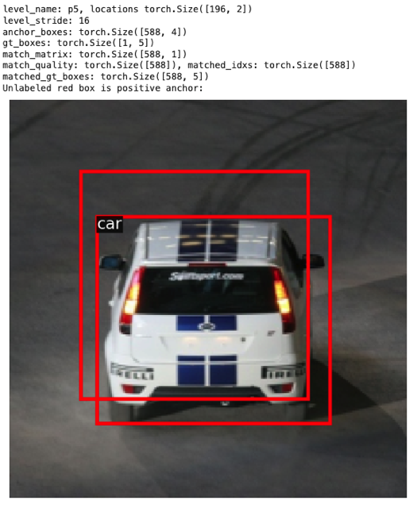</kbd>

<kbd>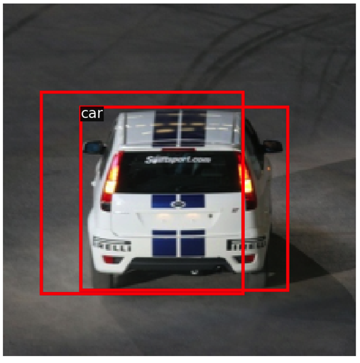</kbd>

<kbd></kbd>

<kbd></kbd>

<kbd></kbd>

<kbd>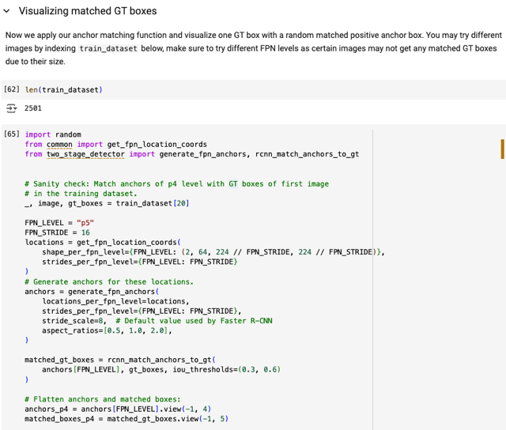</kbd>

 

<kbd>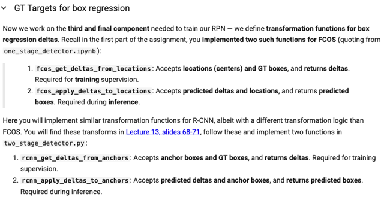</kbd>

> [!NOTE]
> rồi, đến đây đại khái là ta sẽ làm cái component thứ 3 và cũng là cuối cùng
> trong những cái cần thiết để train RPN. Thì cụ thể là giống như FCOS, ta đã
> tự làm hai function:
>
> **fcos_get_deltas_from_locations**: Nhận locations center (N,2) và các gt
> boxes đã gắn (N,5) với chúng, ta sẽ tính ra deltas: Distance từ location tới 4
> cạnh của gt box "gắn với nó" / "của nó". Function này sẽ giúp "tạo" target cho
> việc train bài toán supervised learning
>
> **fcos_apply_deltas_to_locations**: Làm ngược lại, có predicted deltas, và
> locations, chuyển nó thành ra predict box. Dùng khi inference / testing
>
> Thì bây giờ với R-CNN, ta cũng làm hai function tương tự để
>
> 1. Chuyển từ list các anchor box và list các gt box "của chúng" (mỗi anchor
> box đã gắn  với / có một gt box) thành ra **deltas**
>
> 2. Chuyển từ các predict deltas, và anchor box để thành ra lại predicted
> object box
>
> \/Liên hệ với "v2020" thì cái vụ chuyển từ location thành deltas tương đương
> với function GeneraProposal() trong đó mình tính ra vị coordinate của TL, BT 
> corners từ offsets (transformation) và anchor's coordinate. Còn cái thứ hai - 
> chuyển từ ground truth box coordinate thành offsets so thì mình không làm,
> mà nó nằm trong cái function **ReferenceOnActivatedAnchor** - giúp match 
> anchors với gt box mà họ làm giùm. \/

 

<kbd>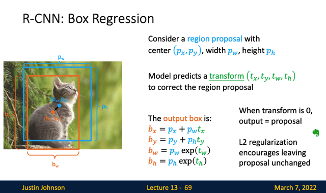</kbd>

<kbd>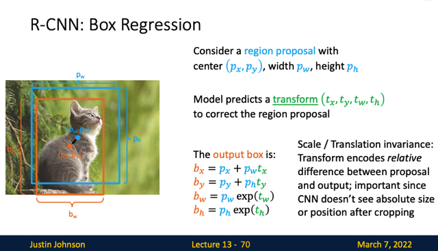</kbd>

<kbd>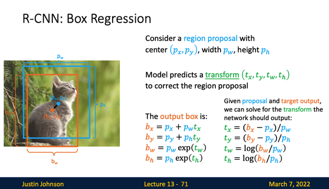</kbd>

<kbd></kbd>

<kbd></kbd>

<kbd></kbd>

<kbd>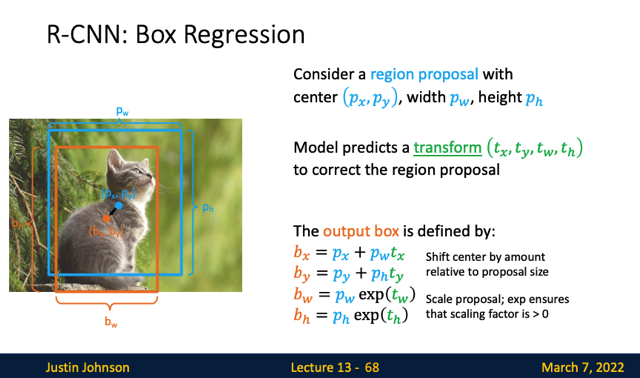</kbd>

> [!NOTE]
> cũng dễ hiểu thôi, trong mấy slide này định nghĩa cách transform từ
> anchor box (có dạng center x, center y, width, height)  và prediction của
> model (là phép transform quy định bởi tx, ty, tw, th)  để tính ra predicted
> box. (dưới dạng center x, center y, width, height)
>
> Ta sẽ dựa vào đây mà xây dựng công thức từ anchor box, và ground truth
> box để tính ra tx, ty, tw, th.
>
> Có điều trong function ta làm việc với anchor box có dạng XYXY  tức là
> x1, y1, x2, y2. Và gt box cũng vậy. Nên mình cần chuyển nó sang "dạng"
> (center x, center y, width, height) để tính.
>
> có thể hiểu model predict ra một phép transform để mà "biến đổi" một 
> anchor box thành một object box. Việc biến đổi này bao gồm 
>
> 1: là shift cái center của anchor box sang vị trí của "object" box. Và 
>
> 2: scale kích thước của anchor box để được object box. Mà trong công thức
> có exponential là mục đích để scaling factor luôn dương.

> [!NOTE]
> Trong đây có thể hiểu ý họ nói là sở dĩ ta "thiết kế" như vậy (tức là để cho
> model learn  một phép transformation shift & scale) là vì nó có tính chất
> invariance, ý là model không biết/không thấy giá trị mang tính tuyệt đối
> của các box và gt box, nên nó không thể học không thể predict ra vị trí
> chính xác của object box, thay vào đó, nó sẽ học một quan hệ tương đối
> giữa anchor box và object box để rồi từ đó có ý nghĩa như là với một
> anchor box (có vai trò như một region proposal ban đầu / nháp) thì nó sẽ
> biết cách "sửa" lại để tạo thành một region proposal chính xác

> [!NOTE]
> Với việc học ra phép transformation thì nếu 'predicted' transform = 0 thì tức
> là model thấy rằng không cần sửa cái "initial proposal region" (tức là cái anchor
> box) mà nó đã chính là cái output / cái proposal region chuẩn rồi.

> [!NOTE]
> Và từ các công thức này ta có thể có công thức của phép biến đổi nếu có
> anchor box (proposal) và ground truth box (target output). Dùng nó cho việc
> hoàn thành function này

 

<kbd>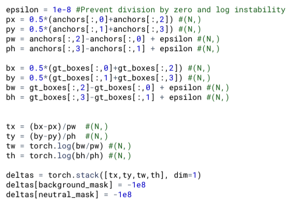</kbd>

<kbd></kbd>

<kbd>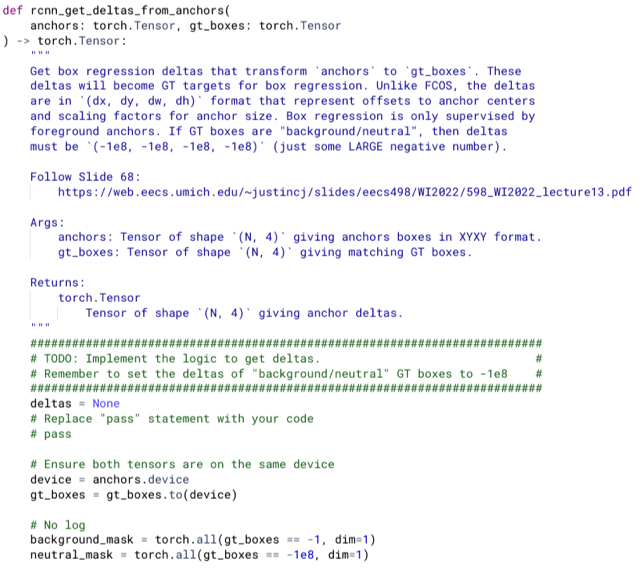</kbd>

> [!NOTE]
> Có chú ý là, nếu gt box là background hay neutral thì deltas sẽ là [-1e8,
> -1e8, -1e8, -1e8]. Mà ở trong function match.. ta đã thấy nếu là
> background anchor sẽ được gán cho [-1,-1,-1,-1,-1], còn neutral anchor
> sẽ được gán [-1e8,-1e8,-1e8,-1e8,-1e8]
>
> Nên ta sẽ chuẩn bị hai cái mask, và dùng nó để set những row trong
> deltas matrix ứng với các bk hay neutral thành -1e8
>
> Chú ý khi stack nhớ define dim, nó mới stack đúng dimension
>
> Sau khi run với gpu bị lỗi không cùng device nên bổ sung dòng lệnh
> mąkę sure anchor và gt_boxes cùng device

> [!NOTE]
> rcnn_get_deltas_from_anchors

 

<kbd>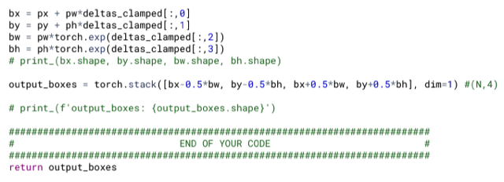</kbd>

<kbd></kbd>

<kbd>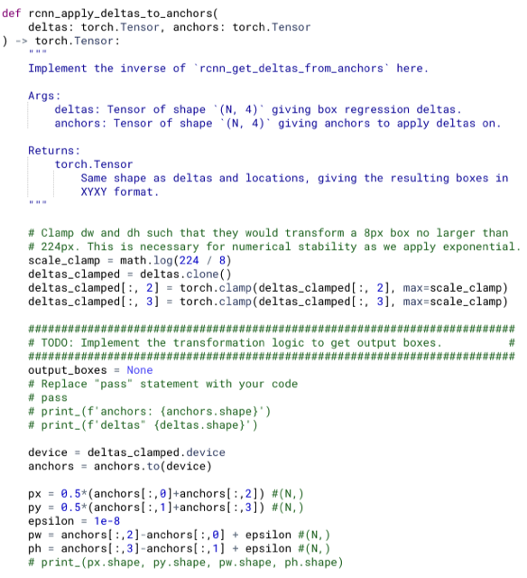</kbd>

> [!NOTE]
> Function apply ngược lại cũng đơn giản, ko có gì phải nói.
>
> Sau khi run với gpu bị lỗi không cùng device nên bổ sung dòng lệnh
> mąkę sure anchor và deltas cùng device

> [!NOTE]
> rcnn_apply_deltas_to_anchors

 

<kbd>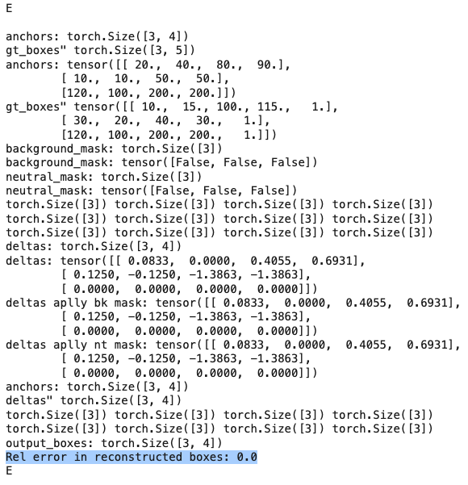</kbd>

<kbd>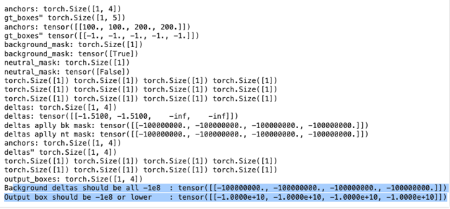</kbd>

<kbd></kbd>

<kbd></kbd>

<kbd>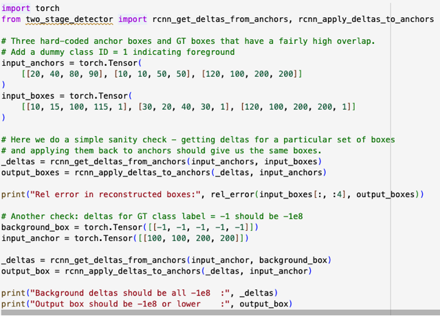</kbd>

> [!NOTE]
> Rel error = 0.0: Checked!

 

<kbd>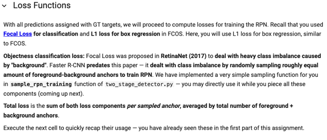</kbd>

> [!NOTE]
> rồi, với loss function thì tương tự như part 1 FCOS. Trong FCOS,
> classification head dùng Focal Loss, và Box-Regression head thì dùng L1
> loss (ngoài ra với center-ness head ta nhớ sẽ dùng Binary Cross Entropy
> loss)
>
> Ở đây họ nhắc lại rằng Focal loss được ra đời (RetinaNet 2017) là để deal
> với sự mất cân bằng giữa các class: Background class vs foreground class
> - trong một bức hình thì "vùng" không có object nào tức background hầu
> như luôn nhiều hơn. Tuy nhiên R-CNN ra đời trước cái RetinaNet nên lúc
> đó người ta deal với vấn đề này bằng một cách khác: **Sampling một số
> lượng bằng nhau các foreground/background anchors**. 
>
> Cái vụ sampling để deal với class-imbalance này ta đã gặp trong 
> Machine Learning for Medicine Specialization
>
> Và họ cùng đã "làm giùm" một function cho vụ sampling này.
>
> Cuối cùng, với**total loss** thì nó sẽ là **tổng của hai loại loss** tại mỗi anchor
> box,  và được average bằng cách **chia cho tổng số các foreground và
> background anchor**\/Liên hệ với "v2020 assignment 5 part 2 FasterRCNN", thì cái vụ sampling này
> thật ra cũng có, và người ta làm trong **ReferenceOnActivatedAnchor,**khi
> tạo negative anchor ind thì họ cũng random sampling một số lượng bằng
> positive anchor\/

 

<kbd>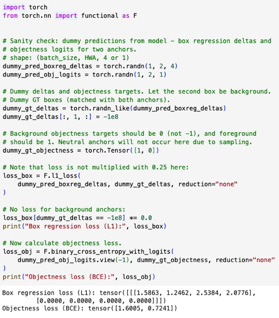</kbd>

> [!NOTE]
> ví dụ việc sử dùng F.l1_loss để tính loss, cũng tương tự như part 1 
> thôi. Chỉ khác là loss_box ở đây không nhân cho 0.25 (chia cho 4
> mang ý nghĩa average như ở FCOS).

 

<kbd>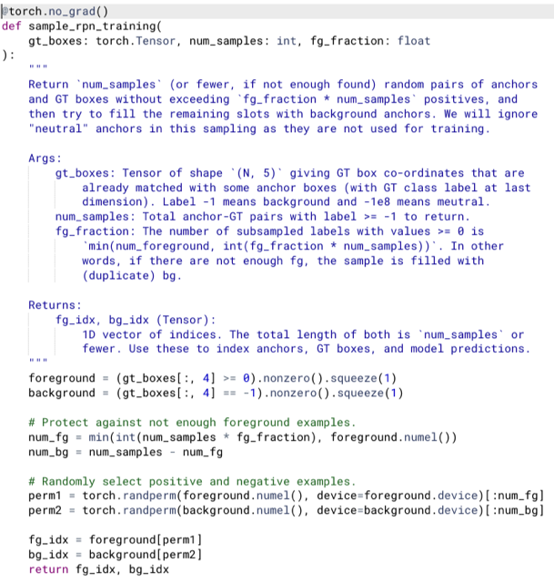</kbd>

> [!NOTE]
> Đầu tiên với họ tạo boolean mask xét điều kiện class id (phần tử thứ 5)
> của matched gt box lớn hơn 0 để vị trí nào thỏa điều kiện sẽ True,
> ngược lại là  False. Kết quả là boolean vector, được apply torch.nonzero
> để được vector chứa các indices của các vị trí khác 0 = chính là các
> anchor có matched box là một object box.
>
> Cũng làm vậy để tạo background - chứa indices của các vị anchor có
> matched gt box là background box
>
> Tiếp theo, tính lại số lượng sẽ sampling, vì phải tính đến trường hợp số
> foreground anchor không đủ số lượng mong muốn là num_samples*fg_fraction
>
> Cuối cùng là sampling với torch.randperm

> [!NOTE]
> sample_rpn_training

 

<kbd>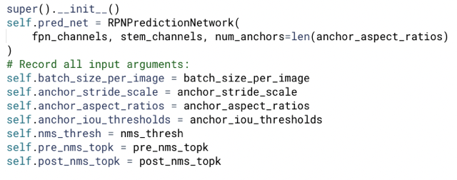</kbd>

<kbd>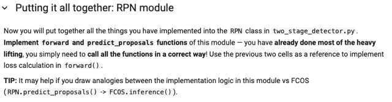</kbd>

<kbd></kbd>

<kbd></kbd>

<kbd>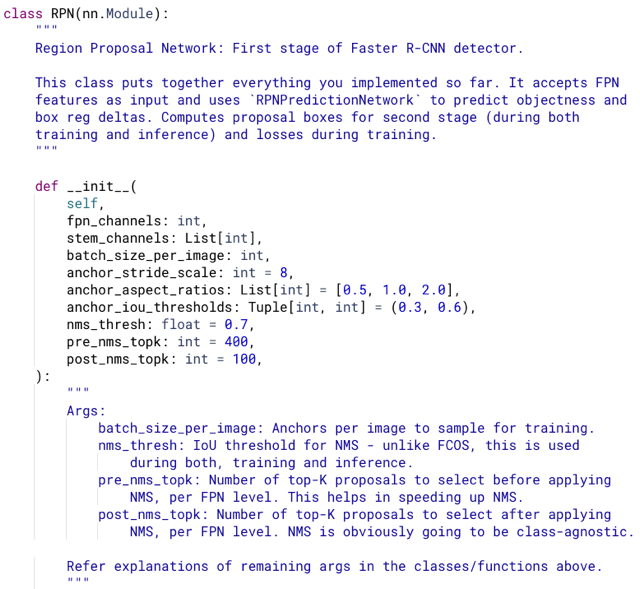</kbd>

> [!NOTE]
> tổng hợp những gì đã làm để hoàn thành module RPN - train một module là
> nhiệm vụ của proposal region algorithm - nhận vào fpn feature output từ 
> [backbone cnn - fpn] predict / propose ra các region có object.

> [!NOTE]
> RPN

 

<kbd>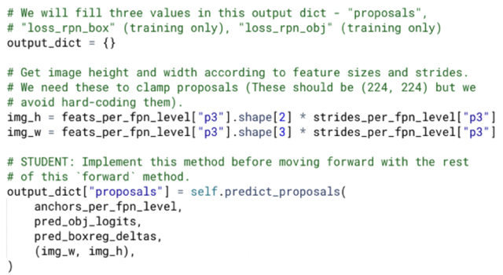</kbd>

<kbd>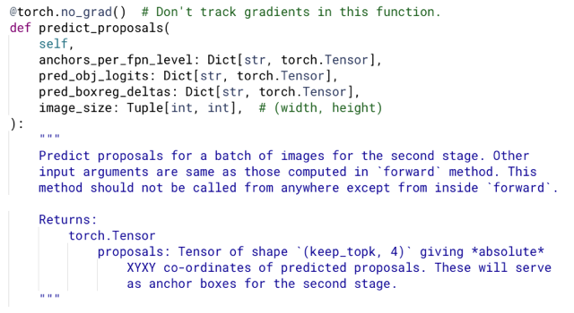</kbd>

<kbd>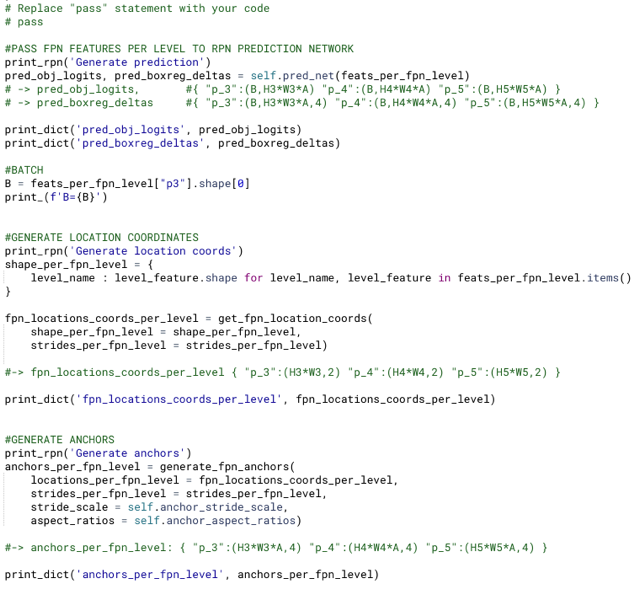</kbd>

<kbd>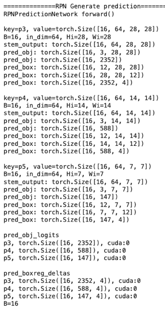</kbd>

<kbd>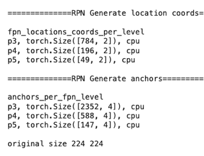</kbd>

<kbd>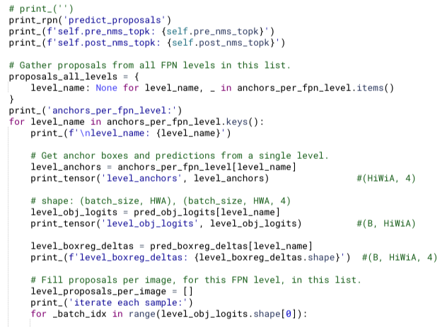</kbd>

<kbd>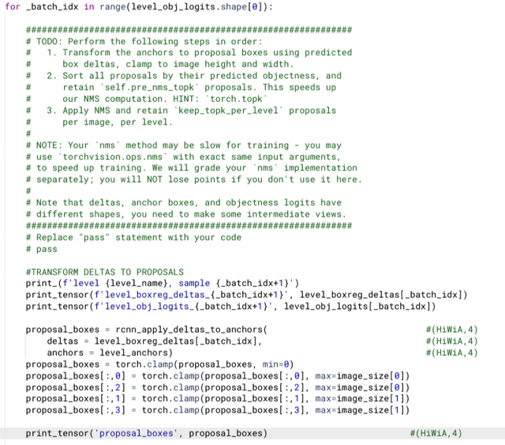</kbd>

<kbd>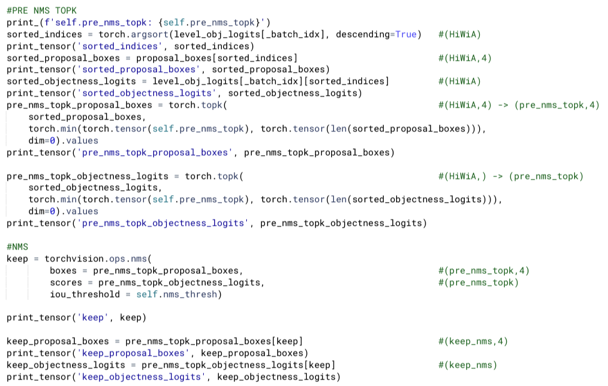</kbd>

<kbd>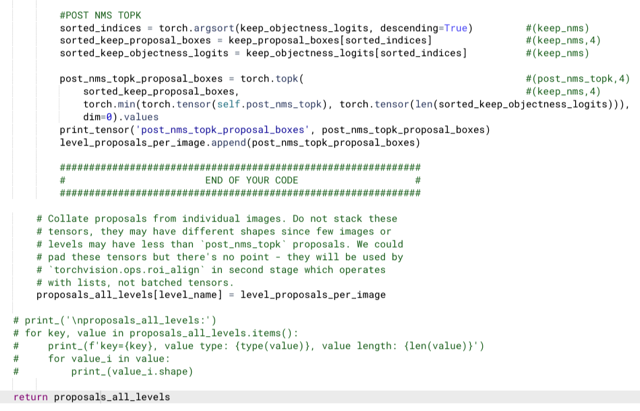</kbd>

<kbd>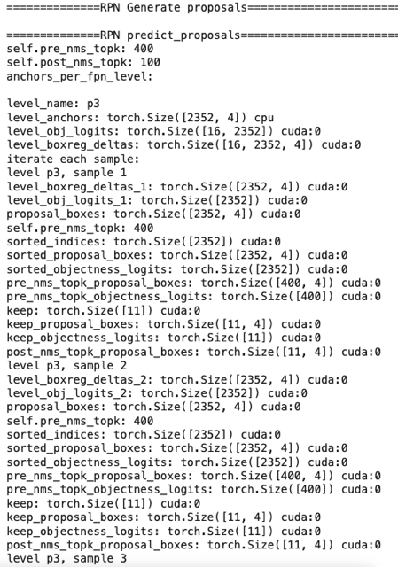</kbd>

<kbd>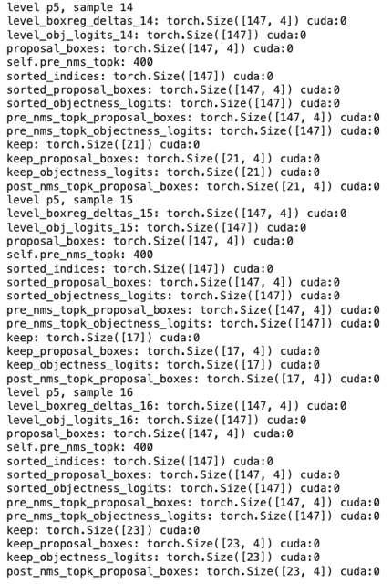</kbd>

<kbd></kbd>

<kbd></kbd>

<kbd></kbd>

<kbd></kbd>

<kbd></kbd>

<kbd></kbd>

<kbd></kbd>

<kbd></kbd>

<kbd></kbd>

<kbd></kbd>

<kbd></kbd>

<kbd>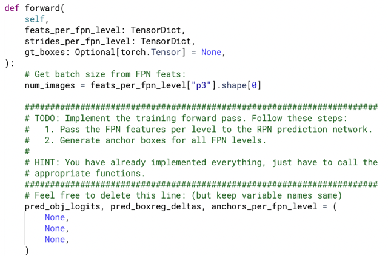</kbd>

> [!NOTE]
> **1. PASS FEATURE QUA RPN PREDICTION NETWORK ĐỂ CÓ PREDICTED
> PROPOSED REGIONS**
>
> Nhiệm vụ đầu tiên trong forward() yêu cầu ta **forward backbone (+fpn) features per level
> vào RPN Prediction Network**, như biết lúc làm cái này, nó sẽ forward fpn features (của
> từng level) qua **stem layers** và **hai prediction head** để trả ra cho ta hai kết qủa:
>
> predicted object-ness logit {pi:(B,AHiWi)} và predicted boxreg deltas pi:(B,AHiWi,4)
>
> Và nó "gom" object-ness "tính từ" / "của" nhiều level vào một dict, và boxreg deltas của
> nhiều level vào một dict nên output ta có 2 **dict**:
>
> **pred_obj_logits** sẽ là dict, ứng với mỗi key p_i, là tensor có shape là (B=16, AHiWi) (16
> sample, mỗi cái có H_i*W_i locations, mỗi locations có A anchor box -> có W_i*W_i*A viết
> tắt là HWA_i anchor, mỗi anchor ứng với 1 object-ness score)
>
> **pred_boxreg_deltas** sẽ  là dict, ứng với mỗi key p_i, là tensor có shape là (B=16,
> AHiWi, 4) (mỗi anchor box, ứng với 4 giá trị delta (tx,ty,tw,th)
>
> **2. GENERATE PROPOSAL (PART 1): GENERATE ANCHORS:**Tiếp theo ta sẽ dùng boxreg deltas (mà ở v2020 gọi offsets) để  chuyển thành proposal
> boxes, bước này cũng như v2020 ta cần  anchors (location coordinates) nên trước tiên ta
> sẽ generate anchor, mà cái này cần grid  (coordinate của các location)
>
> Do đó nhiệm vụ thứ hai là họ bảo ta **generate anchor boxes cho MỌI fpn level**. Thế thì
> mình đã làm function **generate_fpn_anchors** hồi nãy, nó sẽ cần **các tọa độ của các
> location**và các thông  số như **stride**, **scale**, **aspect** ratios đặng nó sẽ giúp 'tính
> ra' / 'tạo ra' cho mỗi location vài cái anchor  box (vài ở đây là số lượng num_anchors, hay
> kí hiệu là A). Đương nhiên, nó sẽ tính toán với cả 3  level và trả ra cho ta:
>
> **anchors_per_fpn_level** sẽ là dict,  p_i: (B, AHi*Wi*, 4): B=16 sample, mỗi cái có tổng
> cộng AHiWi anchor  = (số location là Hi*Wi) nhân (số anchor trên một locations A), mỗi
> anchor "là" một vector 4  giá trị [x1,y1,x2,y2]
>
> \/(tương ứng với việc dùng GenerateAnchor để tạo anchors ở v2020)\/
>
> Để dùng function trên mình cần có **location coordinate** nên ta sẽ dùng function
> **get_fpn_location_coords** đã làm ở phần trước để mà tạo (và họ cũng đã import giùm
> mình ở trên), pass vào cho nó **các shape features ở các level khác nhau cũng như là
> stride.**\/(tương ứng với việc dùng GenerateGrid để có grid ở v2020)\/

> [!NOTE]
> 2B.GENERATE PROPOSALS (PART 2)
>
> Tiếp theo ta sẽ implement function **predict_proposals**, function này có nhiệm vụ:
> **tính toán ra / dự đoán ra proposal regions.**Thế thì cần nhớ rằng**RPN** - Region Proposal Network là module có nhiệm vụ
> **thay thế Region Proposal algorithm** mà trong đó ta muốn dùng deep learning để
> học cách propose ra các proposal region - vốn trước đó là công việc của một fixed
> algorithm như **Selective Search.**
>
> Vậy function này, chính là làm chuyện đó, khi mà ở bước trên nó đã forward fpn
> features qua RPN Prediction Network để có được predicted object-ness logits và
> predicted box regression deltas **CHO MỖI ANCHOR BOX CỦA MỖI LOCATION**.
> Tức là với mỗi anchor box của mỗi location (tại mỗi fpn level) ta đã cho model
> (RPN Prediction Network) dự đoán ra:
>
> - **Object-ness logits**: Xác suất location đó "là" / "thuộc về" một object \/hay nói
> theo v2020 thì là xác suất anchor chứa một object\/ (và nói đúng ra logits thì không
> phải xác suất nhưng ta cứ hiểu  vậy cũng được)
>
> - **Deltas (hay offsets)**: [tx, ty, tw, th] là các giá trị **định ra một phép biến đổi giúp "
> biến" một  anchor box thành ra predicted object bounding box**.
>
> ====
>
> Thế thì với cái predicted deltas của mỗi anchor box, ta sẽ chuyển nó thành ra
> **predicted object box**, và đó **CŨNG CHÍNH LÀ PROPOSAL REGIONS
>
> ==== LÀM LẦN LƯỢT TỪNG LEVEL**Quá trình làm như sau: Ta sẽ xét từng level, làm lần lượt "cho từng level":
>
> Ta **lấy bộ anchor box, predict object-ness, boxreg deltas ở level đó ra** (dùng key
> là level name  để lấy ra từ cái **anchors_per_fpn_level**  dict), nó sẽ là
>
> level_anchor (AHiWi, 4) (level p_i, i=4,5,6 như đã biết).
>
> level_obj_logits  (B, AHiWi)
>
> level_boxreg_deltas (B, AHiWi, 4).

> [!NOTE]
> def predict_proposals: TƯƠNG ĐƯƠNG VỚI
> RPN'S INFERENCE() CỦA V2020

> [!NOTE]
> ===LÀM TỪNG SAMPLE
>
> Tới đây ta mới làm lần lượt cho từng sample (iterate trong batch size):
>
> Dùng function **rcnn_apply_deltas_to_anchors**đã làm ở trên để từ các **anchor 
> boxes (AHiWi, 4)** và **predicted deltas (AHiWi, 4)** tương ứng, function
> này sẽ giúp tính ra **proposal boxes: (AHiWi, 4)**
>
> level_boxreg_deltas[_batch_idx=1]: torch.Size([2352, 4])
> level_anchors: torch.Size([2352, 4])
> proposal_boxes: torch.Size([2352, 4])
>
> Theo gợi ý ta cần nhớ thực hiện việc**clamp - đại khái là nếu predicted box
> (cũng chính là proposed region) vượt quá phạm vi của image thì reset nó**.
>
> Nên ta sẽ clamp x1,y1, x2, y2 như đã biết là absolute coordinate của hai góc cho 
> không quá width và height của image và không bé hơn 0
>
> 3. PRE NMS TOPK: \/Khác với v2020 trong đó ta thresholding để loại bớt các 
> proposed box có objectness confidence score thấp, thì ở đây ta sẽ sort và giữ
> lại topk cái có confidence score cao nhất. Cũng tương tự thôi\/
>
> Ta dùng **torch.argsort** với input là vector objectness logits (level_obj_logits 
> có shape (AHiWi) là mỗi row là một vector objectness logit của một sample 
> trong batch (level_obj_logits[_batch_idx]), arg descending = True. 
>
> Kết quả là ta có vector các index của các object-ness logit đã được sort theo 
> từ lớn tới nhỏ.
>
> Ta mới dùng vector sort indices này để mà sort cả list các proposal boxes
> và object logits. Sau đó, dùng function **torch.topk** để **"cắt" chỉ lấy ra top k
> "những cái trên cùng"**. 
>
> Trong đây mình dùng k = **min (pre_nms_topk, len of sorted_proposal box)** là bởi 
> có khi pre_nms_topk lớn hơn số lượng của box mà ta có.
>
> Chú ý**cần declare arg dim của topk(). dim=0** đương nhiên.
>
> self.pre_nms_topk: 400
> pre_nms_topk_proposal_boxes (batch i): torch.Size([400, 4]) #(pre nms keep i, 4)
> pre_nms_topk_proposal_logits (batch i): torch.Size([400]) #(pre nms keep i)
>
> 4.NMS: Tiếp theo là ta sẽ apply nms, theo chỉ dẫn, ta sẽ dùng function của 
> torch.vision để tăng sự hiệu quả. Argument cũng y chang nms mà mình
> đã làm ở part 1: boxes, scores để đánh giá thì là objectness logits, và 
> Iou_threshold.
>
> 5.POST NMS TOPK: Sau khi nms, ta sẽ làm thêm một bước sort và topk nữa 
> với post_nms_topk để giữ lại (retain) một số lượng nào đó các propose box có 
> score cao nhất
>
> Chú ý rằng có thể thấy sau khi topk và nms thì từ (HWA, 4), chắc chắn
> ta sẽ chỉ còn (một con số <= post_nms_topk, 4) tức số proposal box còn
> lại chỉ còn nhỏ hơn hoặc bằng post_nms_topk. Lí do có thể nhỏ hơn là
> vì số lượng box đạt yêu cầu không đủ.
>
> ====
>
> Đoạn cuối đại khái họ nói là ta sẽ **không stack những tensor này lại**. Vì như đã 
> thấy **length của chúng (tức số propose box của từng image/sample) có thể 
> khác nhau** (<= post_nms_topk). 
>
> Vả lại họ cho biết cái này khi được dùng ở stage 2 thì **torch.vision.ops.roi_align 
> operate trên list chứ không phải tensor** nên đại khái là ta**không cần stack** thành
> tensor
>
> Như vậy có thể thấy nó xuất ra các proposal regions cho một bức hình.
> Output là dictionary, mỗi value là một list các proposed regions của các
> image trong batch, ứng với từng level.
>
> dict: {
> p1: list chứa 16 (B) tensor shape (no. proposed region <= post_nms_topk, 4)
> p2: list chứa 16 (B) tensor shape (no. proposed region <= post_nms_topk, 4)
> p3: list chứa 16 (B) tensor shape (no. proposed region <= post_nms_topk, 4)
> }

 

<kbd>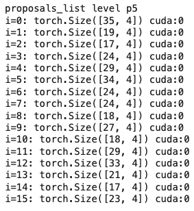</kbd>

<kbd>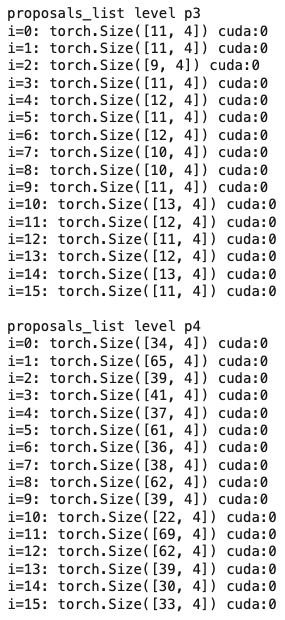</kbd>

<kbd>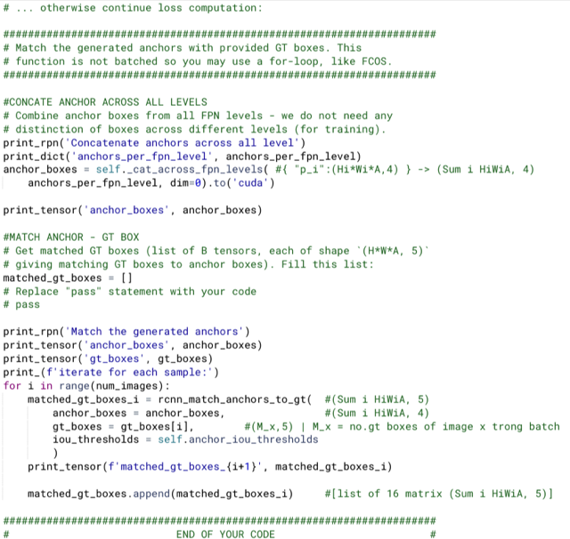</kbd>

<kbd>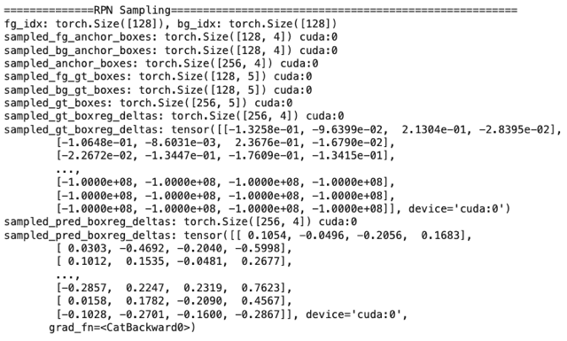</kbd>

<kbd>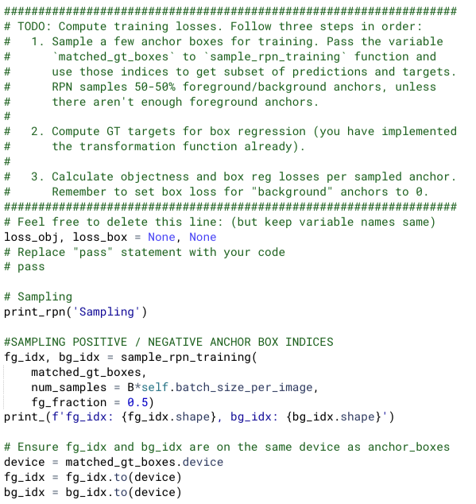</kbd>

<kbd>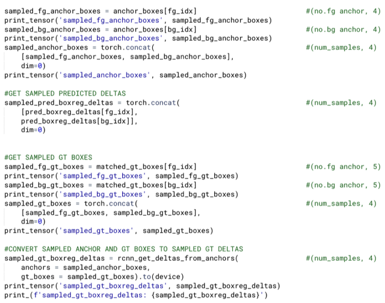</kbd>

<kbd>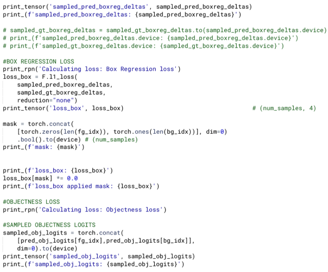</kbd>

<kbd>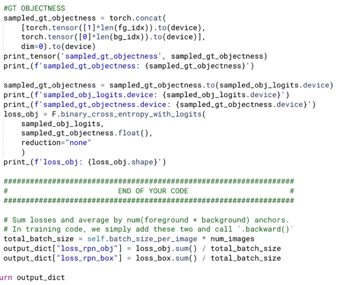</kbd>

<kbd>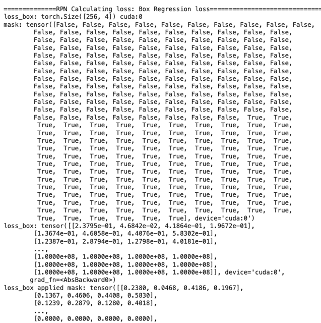</kbd>

<kbd>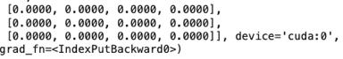</kbd>

<kbd>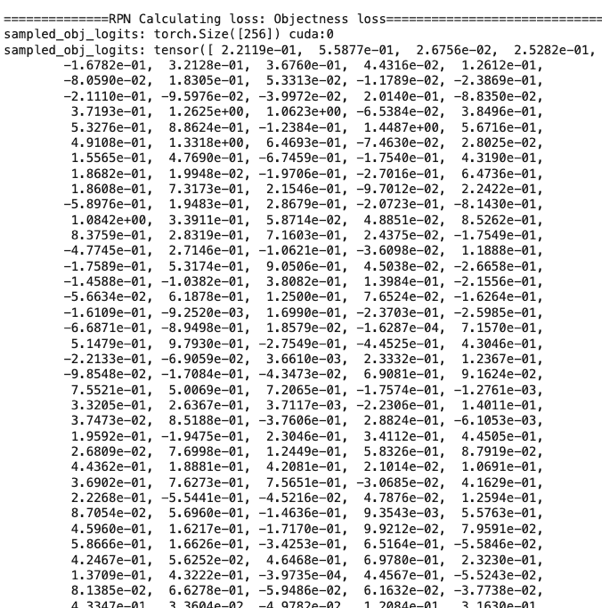</kbd>

<kbd>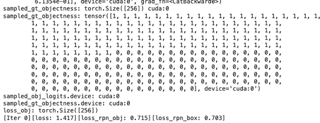</kbd>

<kbd>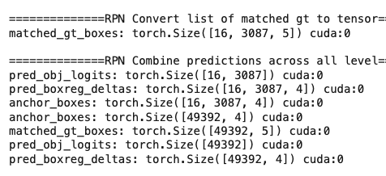</kbd>

<kbd>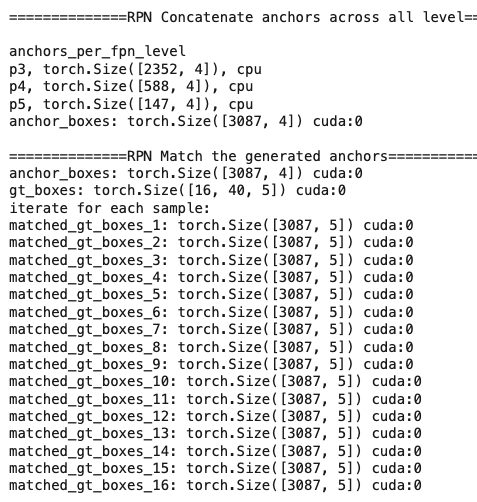</kbd>

<kbd>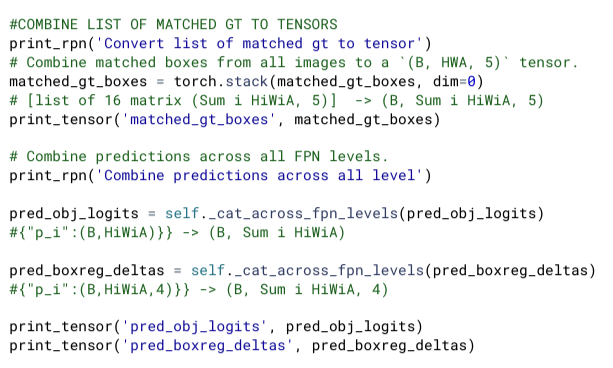</kbd>

<kbd>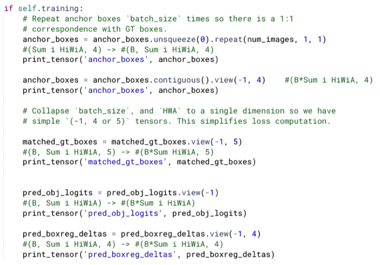</kbd>

<kbd></kbd>

<kbd></kbd>

<kbd></kbd>

<kbd></kbd>

<kbd></kbd>

<kbd></kbd>

<kbd></kbd>

<kbd></kbd>

<kbd></kbd>

<kbd></kbd>

<kbd></kbd>

<kbd></kbd>

<kbd></kbd>

<kbd></kbd>

<kbd></kbd>

<kbd></kbd>

<kbd>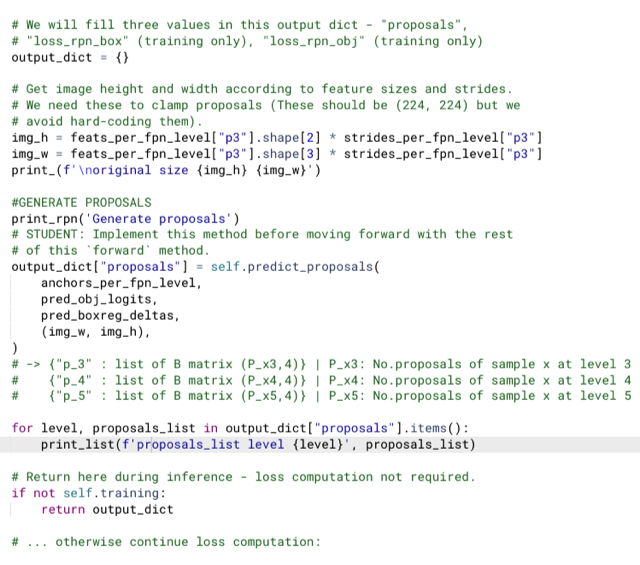</kbd>

> [!NOTE]
> rồi, chú ý là predict_proposals là để testing / inference, để tính toán ra cái
> mà nó được huấn luyện : proposal regions. Còn nếu không phải là inference
> mode, thì tiếp tục phần dưới để làm các bước của training: tính ra loss

> [!NOTE]
> Tiếp tục training code:
>
> 1.GOM ANCHORS CỦA MỌI LEVEL:
>
> Vậy thì đầu tiên, cũng như part 1 đã thấy, ta sẽ "gom" mọi anchor ở mọi level để không còn phân
> biệt level nữa:
>
> **anchor_boxes**:
>
> {pi:(AHiWi, 4)} (i=4,5,6) -> **(no.anchors ở mọi level, mọi location của một image = sum AHiWi, 4)**
>
> ====
>
>
> 2.MATCH ANCHOR VỚI GT BOX
>
> Tiếp theo, ta sẽ dùng function **rcnn_match_anchors_to_gt** để mà làm cái bước **"gán cho mỗi
> anchor một ground truth box"** nhằm làm target cho supervised learning. Thì như đã biết, bước này
> ta sẽ**làm riêng cho từng sample trong batch** (chứ không làm một phát mọi sample được)
>
> Kết quả là ta có**list (có B cái) tensor, mỗi tensor có shape ..
>
> (no.anchors của image ở mọi level, mọi location = sum AHiWi, 5)**:
>
> Mỗi anchor trong tổng số sum AiHiWi ở mọi level, mọi location, sẽ được "ghép" với một  ground
> truth box - thể hiện bởi 5D vector [x1, y1, x2, y2, c]
>
> Ta mới **stack cái list** này để thành một tensor **matched_gt_boxes**: 
>
> **(B, no.anchors của image ở mọi level, mọi location = sum AHiWi, 5)**
>
> ====
>
>
> 3.GOM PREDICTED OBJECT-NESS LOGITS VÀ BOX REG DELTAS Ở **MỌI LEVEL**
>
> Tiếp theo, ta cũng dùng làm tương tự **("gom" mọi level lại)** đối với **predicted object-ness logits**
> và **predicted box regression deltas**
>
> **pred_obj_logits**:
>
> {pi:(B, AHiWi)} -> **(B, no.anchors ở mọi level, mọi location của một image)**
>
> **pred_boxreg_deltas**:
>
> {pi:(B, AHiWi, 4)}  -> **(B, no.anchors ở mọi level, mọi location của một image, 4)**

> [!NOTE]
> tiếp tục quá trình trainning mode của forward

> [!NOTE]
> 1.COPY ANCHOR X16 (BATCH SIZE) **anchor_boxes** đang là (**no.anchor all level = Sum AHiWi, 4**), người ta mới dùng
> **unsqueeze**(0) để thành**(1, Sum AHiWi, 4)**.
>
> Sau đó **repeat**(batch_size) để kiểu như **copy B=16 lần để thành (B, Sum AiHiWi, 4)**
>
> **anchor_boxes: (B, no.anchors của image ở mọi level, mọi location = sum AHiWi, 4)**
>
>
> ====
>
>
> 2.GOM ANCHORS, PREDICTED OBJECTNESS, BOXREG DELTAS CỦA**MỌI SAMPLE**
>
> Sau đó ta sẽ**gom anchors của mọi sample lại dùng view(-1, *) để thành ra:
>
> anchor_boxes: (no.anchors của mọi location, mọi level, mọi image trong batch, 4)**
> **matched_gt_boxes: (no.anchors của mọi location, mọi level, mọi image trong batch, 5)**
>
> **pred_obj_logits**: **(no.anchors của mọi location, mọi level, mọi image trong batch)**
>
> **pred_boxreg_deltas: (no.anchors của mọi location, mọi level, mọi image trong batch, 4)**
>
> Again: no.anchors của mọi location, mọi level, mọi image trong batch = Sum b=1:B {Sum in {3,
> 4,5} AHiWi}
>
> Function **contiguous**() theo gpt giải thích là để nó **đảm bảo tensor được lưu trữ trên một dải
> bộ nhớ liên tục / liền kề**, giúp nó ở trạng thái **sẵn sàng cho bước reshaping (view)** mà
> nguyên do là những function như **unsqueeze** hay **repeat** có thể khiến các tensor được
> store ở các vùng bộ nhớ không liên tục (non-contiguous memory)

> [!NOTE]
> Rồi, bắt đầu có thể tính loss: 
>
> SAMPLING & GENERATE TARGET OFFSET + LOGIT
>
> Thế thì như ở trên họ đã nói về vấn đề **class-unbalance**: sự không cân xứng 
> giữa số foreground và background location. Nên FCOS giải quyết điều này bằng 
> cách dùng Focal Loss,  còn R-CNN thì dùng sampling. 
>
> Như đã nói, ta sẽ sampling một số lượng bằng nhau giữa hai class, dùng function 
> người ta đã làm sẵn. Pass vào **matched_gt_boxes**, số lượng sample mong muốn 
> là  **self.batch_size_per_images**và tỉ lệ của foreground class - **fg_fraction**.
>
> Nó sẽ **trả ra hai list các indices** của hai loại **foreground** anchors và **background**
> anchors. Ta sẽ **dùng nó để tạo hai subset các anchor boxes** mỗi loại và **ghép
> lại**. Tương tự, dùng hai list indices đó để**tạo hai subset các ground truth
> boxes** và **ghép lại**.
>
> *Khi run với gpu báo **lỗi ko cùng device** giữa tensor (anchor) và indices, nên
> ta sẽ move hai cái indices tensor "lên" cùng device với anchor tensor
>
> sampled_fg_anchor_boxes: torch.Size([8, 4]) #(M,4) M: sampling no.positive anchor
> sampled_bg_anchor_boxes: torch.Size([8, 4]) #(M,4)
> sampled_anchor_boxes: torch.Size([16, 4]) #(2M,4)
>
> sampled_fg_gt_boxes: torch.Size([8, 5]) #(M,5)
> sampled_bg_gt_boxes: torch.Size([8, 5]) #(M,5)
> sampled_gt_boxes: torch.Size([16, 5]) #(2M,5)
>
> Tiếp theo, khi đã có bộ sampled anchors và gt box có sự cân bằng giữa hai loại. 
>
> Ta mới dùng **rcnn_get_deltas_from_anchors** để **tạo ra target deltas**, 
> là **target** để supervise cho model **predict_boxreg_deltas**.
>
> sampled_pred_boxreg_deltas: torch.Size([16, 4])
> sampled_gt_boxreg_deltas: torch.Size([16, 4])
>
> \/*Cái bước này: sampling, trả ra indices của positive anchor và negative anchor,
> để rồi lấy subset các pos/neg anchors và matched GT boxes của chúng, từ đó tạo target 
> offset (deltas) và target objectness logit. Thì trong v2020, được làm hết ở trong 
> ReferenceOnActivatedAnchor()\/
>
> ====
>
> - BOX REGRESSION LOSS
>
> Trước khi pass vào loss function, ta sẽ make sure hai tensor predicted và
> target cùng chung device. (Nếu không khi run với gpu sẽ báo lỗi)
>
> Rồi, pass predicted boxreg deltas và target boxreg deltas vào **f.l1_loss** loss 
> function, đảm bảo rằng shape của chúng giống nhau để ra loss, là tensor
> cùng shape (16, 4) là regression loss "tại" mỗi giá trị delta.
>
> Thết thì ta nhớ là các **background anchor sẽ không có boxreg loss**, nên ta sẽ
> **tạo một cái mask dùng nó để "reset" các vị trí của boxreg loss ứng với 
> background anchor thành 0**.
> \/
> (Trong v2020, ta chỉ việc pass predicted offset và target offset CỦA CÁC POSITIVE 
> ANCHOR VÀO function tính regression loss thôi, không cần pass vào của cả pos/neg
> để rồi lại phải dùng mask để set thành 0 cho mất công)\/ 
>
> - OBJECNESS LOSS
>
> Thế còn target cho predicted_objectness_logit? thì đơn giản, ta sẽ tạo vector
> có **len(fg_idx)** **con số 1**, và **len(bg_idx)** **con số 0**, bởi vì đây là bài toán binary
> classification nơi model predict ra xác suất một anchor thuộc positive class
> (tức là object class hay còn gọi là foreground class)
>
> Và pass vào **F.binary_cross_entropy_with_logits**()
>
> Ở dưới người ta sum và chia cho tổng số (foreground + background) anchor
> để average như đã biết trong phần lí thuyết
>
> \/(Ở v2020 người ta làm giùm function tính loss này, nên chỉ việc pass vào predicted
> logit, trong function đó họ cũng tạo binary target và dùng F.binary_cross_entropy_with_logits)\/

 

<kbd>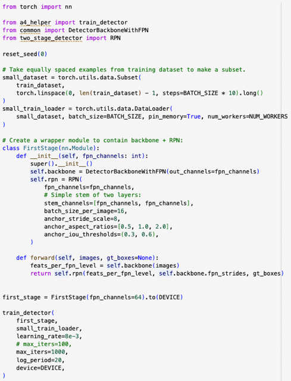</kbd>

 

<kbd>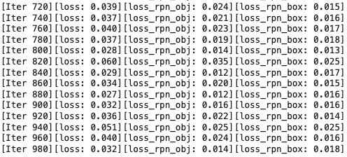</kbd>

<kbd>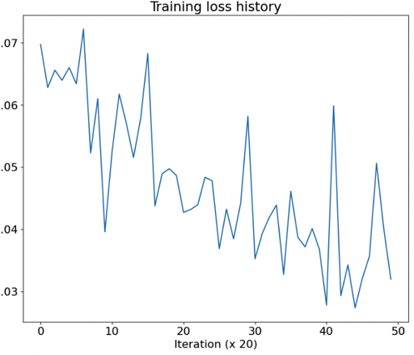</kbd>

<kbd></kbd>

<kbd></kbd>

<kbd>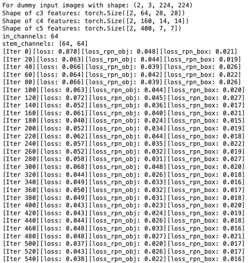</kbd>

 

<kbd>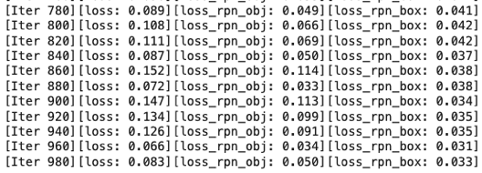</kbd>

<kbd>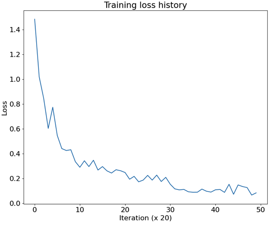</kbd>

<kbd></kbd>

<kbd></kbd>

<kbd>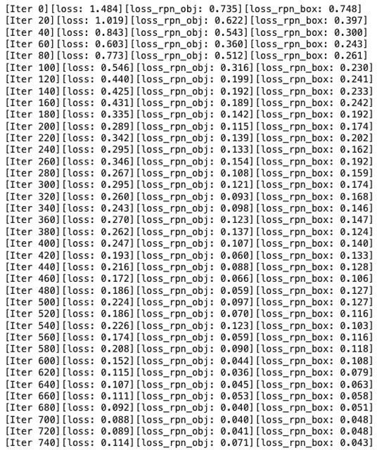</kbd>

 

<kbd>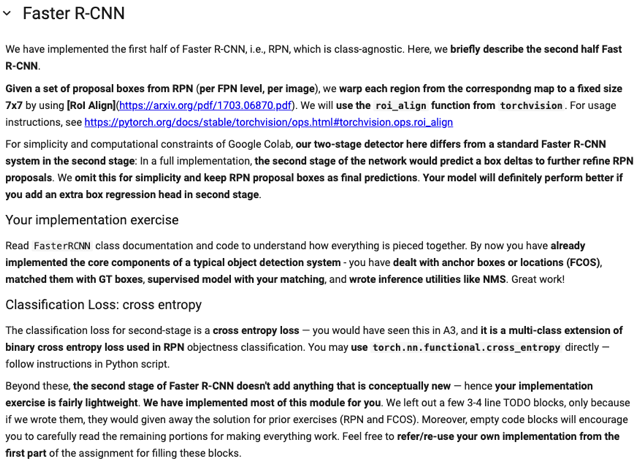</kbd>

> [!NOTE]
> rồi, với việc (coi như) đã làm xong RPN, có nghĩa là stage 1 trong 2 stage của
> 2-stage object detection model Faster R-CNN. Thì nó sẽ predict ra các
> proposal region / box để pass qua stage 2. Ta sẽ review lại stage 2 nó sẽ làm
> gì với cái này. Thì ở đây họ nói là ta sẽ "warp" - đại ý giống như là project các
> region vào một fixed size 7x7 dùng kĩ thuật RoI align. (again phải review lại cái
> này và quay lại đây mô tả kĩ hơn).
>
> Ta sẽ dùng roi_align function của torch.vision.
>
> Ý tiếp theo người ta nói, đó là, nếu đúng ra, phiên bản đầy đủ (typical) của
> Faster R-CNN thì từ propose region output từ RPN, stage 2 sẽ tiếp tục refine
> nó để kiểu như learn thêm một lần nữa, điều chỉnh thêm một lần nữa cái
> proposal region này (bằng cách dùng cái proposal region và map nó với
> ground truth box, với một box-regression head, để predict box deltas, giống
> như cách mà ta map anchor box với ground truth box ở RPN).
>
> Tuy nhiên với giới hạn tính toán của Google Colab, nên ta sẽ không làm bước
> này, để chỉ dùng chính Region proposed từ RPN như finał bounding box cuối
> cùng thôi. Điều này có nghĩa là stage 2 sẽ chỉ có classification head nơi mà ta
> sẽ predict class cho mỗi region.
>
> Thế thì ta sẽ read và implement Faster R-CNN, và người ta cho biết họ đã làm
> giùm phần lớn, bởi vì đây là những cái tương tự với FCOS.
>
> ====
>
> Với Classification head của stage 2 ta sẽ dùng cross entropy loss, là phiên
> bản mở rộng với nhiều class của binary cross entropy, cái này thì biết rồi.

 

<kbd>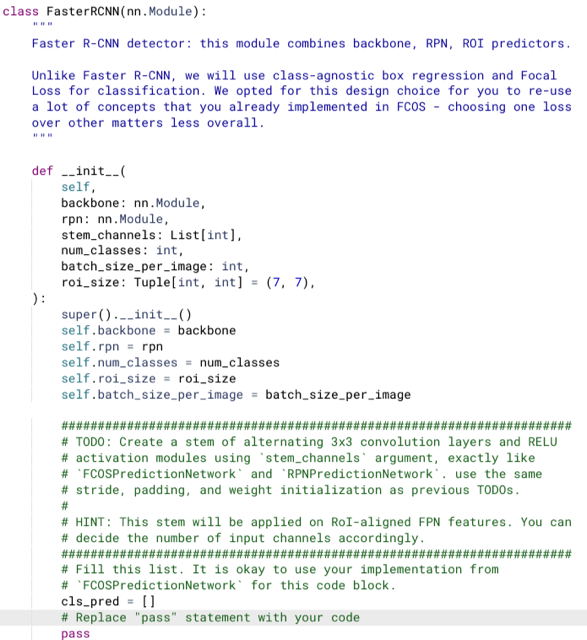</kbd>

> [!NOTE]
> Đại khái họ nói cái Faster RCNN ta sẽ làm ở đây **hơi khác Faster RCNN thông
> thường** ở chỗ ta sẽ dùng **class-agnostic box** (chưa rõ cụ thể ra sao, nhưng
> **class-agnostic có ý nghĩa là không phân biệt class**. Mà vừa rồi họ nói ta sẽ cắt
> bớt bằng cách không làm cái bước train stage 2 để refine các proposed box (từ
> RPN) thêm (để/bằng cách map nó với gt box với một box regression head nữa), và
> dùng nó như final bounding box luôn. Có thể ý này là  vậy.
>
> Điểm khác biệt thứ hai mà họ nói đến là ta sẽ **dùng Focal Loss** cho Classification
> head, mục đích là để ta có thể dùng những cái / gặp lại những concept mà đã gặp ở
> FCOS. Và vì việc chọn loss này thay vì loss kia nó cũng không quan trọng / ảnh
> hưởng gì lắm (ý nói dùng focal loss hay cross entropy)
>
> ====
>
> Thế thì đầu tiên trong __ini__ ta thấy input có**backbone module**, **RPN** module,
> list các channels (depth) của "stem network", num_classes,
> **batch_size_per_images** (cái này đã biết ở trên, nó là số lượng anchor mà ta sẽ
> sampling trong mỗi image để training)
>
> Ngoài ra còn có **roi_size**là kích thước sẽ dùng cho bước roi pooling - là bước****nhận các **"proposed region feature map" kết hợp từ "predicted region" từ RPN và
> backbone-fpn feature map.**Chỗ này chú ý nhớ rằng RPN giúp (nhận vào feature
> map) và output ra predicted region - vốn dĩ **bản chất chỉ nôm na là nó giúp đề xuất
> ra các box** / các phạm vi của **các region mà nó đoán là "có" object**, mà ta biết nó
> thể hiện bằng **4 giá trị XYXY của hai điểm góc TL, BR**. Thế thì cái này sẽ **DÙNG
> ĐỂ kiểu như "cắt ra" từ "original feature map**" - ám chỉ cái tensor nguyên vẹn
> output từ backbone-fpn - **để có được một "vùng" của feature map ứng với cái 
> region proposed** (còn depth thì giữ nguyên, hình dung như là ta sắn một miếng 
> bánh hình chữ nhật từ một cái bánh kem hình chữ nhật lớn hơn vậy)
>
> Thế thì vì**vốn dĩ RPN output ra có nhiều (spatial) size khác nhau, nên các miếng
> bánh được sắn ra "proposed region feature map" cũng sẽ có spatial size khác nhau.
> Do đó ta cần resize thành ra cùng một size**(Để tạo ra cái mà trong đây họ gọi là **"
> RoI-aligned FPN features")**Từ đó mới pass chúng vào****tiếp stage 2 là một kiến trúc s**tem layers gồm các
> conv - relu và prediction head** gồm fc layer output các class scores cho nhiệm vụ
> classification và có thể có regression box head predict ra object box (một lần nữa,
> mang ý nghĩa tiếp tục refine proposed region vốn cũng đã là predicted object box rồi)
>
> Nhiệm vụ đầu tiên sẽ là **define một stem các conv-relu layers** giống như đã làm ở
> FCOS và RPN, và người ta cho biết, cái stem này sẽ **nhận input từ "RoI-aligned
> FPN features"** - đã nói ở trên - stem layers là chuỗi vài conv-relu, giữ nguyên
> spatial size. Cuối cùng là **prediction heads** bao gồm một **FC layer** để **output
> ra một vector có (num_classes+1) class scores** (num_class object class và 1
> background class). Prediction heads **cũng có thể có box regression head** để
> output ra box regression deltas giúp **"tiếp tục refine" predicted region/box từ RPN.**

 

<kbd>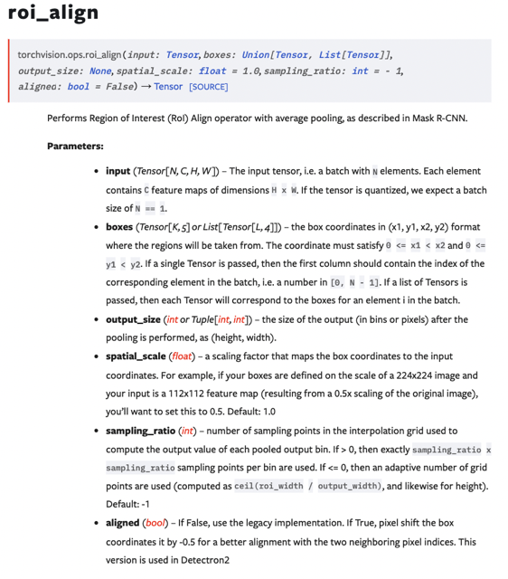</kbd>

<kbd></kbd>

<kbd>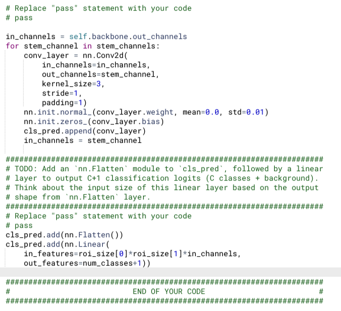</kbd>

> [!NOTE]
> Rồi, thế thì tương tự stem layers đã làm ở những phần trước, đơn
> giản là ta tạo chuỗi các conv layer theo sau relu layer, với input
> depth (tức in_channels) của cái conv đầu tiên sẽ là depth của
> output từ backbone & fpn module, vốn dĩ có thể access từ field
> out_channels. Còn đương nhiên với các layer sau thì input depth là
> output depth của layer trước). Theo chỉ dẫn, ta cũng khởi tạo nó với
> normal distribution zero mean, std = 0.01 đối với weight, zero ini đối
> với bias.
>
> Như đã nói, input của stem layers + prediction head sẽ là TỪNG
> (KHÔNG PHẢI TOÀN BỘ) "cái" feature map tensor ỨNG VỚI mỗi
> proposed region (từ RPN) MÀ ĐÃ ĐƯỢC RESIZE với ROI Aligned
> để có CÙNG MỘT FIXED SPATIAL SIZE.
>
> Vậy có thể hiểu rằng input của stem layer sẽ có shape là:
>
> width = roi_size, height = roi_size, depth = backbone output depth.
>
> Vậy, với việc các conv trong stem dùng "same" padding để giữ
> nguyên spatial size thì output của stem layer cũng có spatial size
> (roi_size, roi_size) depth thì = giá trị của stem_channel cuối trong
> stem_channels.
>
> Do đó khi flatten, nó sẽ thành vector có depth*roi_size*roi_size, và
> nó chính là input dimension giúp khởi tạo fc layer (nn.Linear). Còn
> output dim thì biết rồi, sẽ là num_classes + 1.

 

<kbd>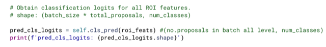</kbd>

<kbd>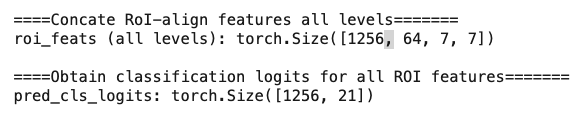</kbd>

<kbd>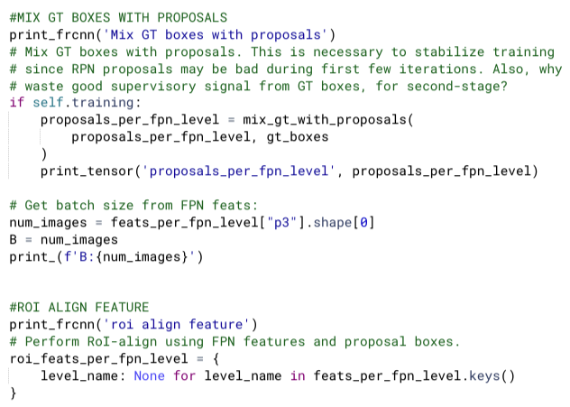</kbd>

<kbd>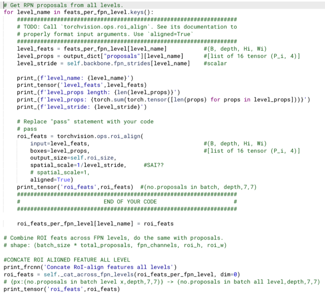</kbd>

<kbd>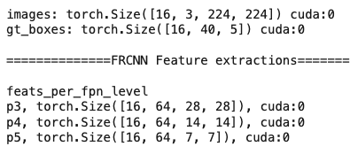</kbd>

<kbd>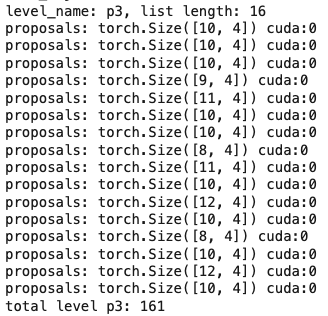</kbd>

<kbd>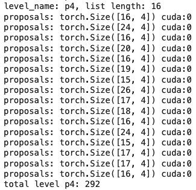</kbd>

<kbd>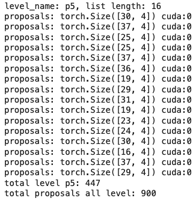</kbd>

<kbd>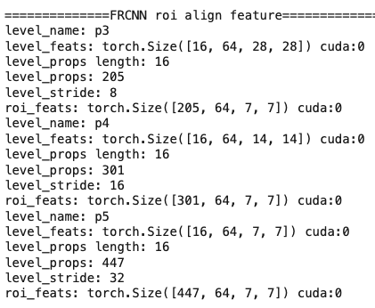</kbd>

<kbd></kbd>

<kbd></kbd>

<kbd></kbd>

<kbd></kbd>

<kbd></kbd>

<kbd></kbd>

<kbd></kbd>

<kbd></kbd>

<kbd></kbd>

<kbd>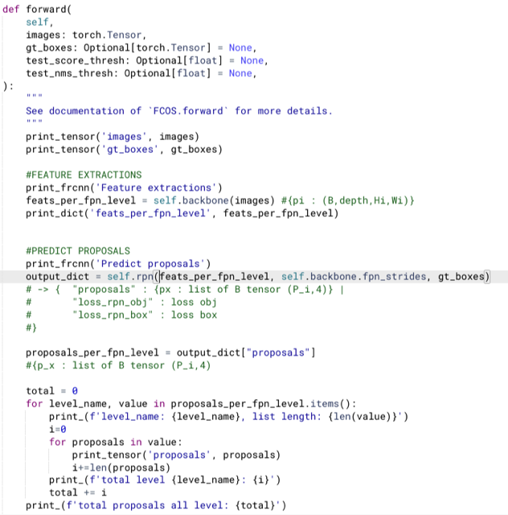</kbd>

> [!NOTE]
> **FEATURE EXTRACTING WITH BACKBONE**
>
> Trong forward, original image được pass qua self.backbone cnn & fpn, output sẽ là một dictionary mỗi value là 
> một feature tensor ứng với mỗi feature level.
>
> feats_per_fpn_level: {p_x : (B, depth, Hi, Wi)}
>
> Ví dụ level_name: p3 - feats_per_fpn_level: torch.Size([16, 64, 28, 28])
>
> =====
>
> **PREDICT PROPOSAL WITH RPN**
>
> Ta mới pass nó qua tiếp RPN để có được một dictionary ứng với từng level là các proposed region.
>
> {
>   "proposals" : {p_x: list chứa B tensor (P_i,4)}   #P_i là số proposal của image thứ i ở level x
>   "loss_rpn_obj" : loss obj
>   "loss_rpn_box" : loss box
>
> }
>
> proposals_per_fpn_level: {p_x: **LIST chứa B tensor** (P_i,4)}   #**P_i là số proposal của image thứ i** ở level x
>
> ví dụ in các tensor trong list ứng với p3
>
> proposals: torch.Size([9, 4])
> proposals: torch.Size([12, 4])
> proposals: torch.Size([8, 4])
> proposals: ..
> proposals: torch.Size([11, 4])
> proposals: torch.Size([10, 4])
> proposals: torch.Size([11, 4])
>
> **Tổng số các proposed region trong batch (tại level x)** sẽ = tổng các **LENGTH** của các tensor trong list = 9+12 ....
> 10+11=204
>
> (*) Nên hiểu mỗi lần "chạy" nó sẽ ra kết qủa ở các con số này khác  nhau xuất phát từ bước sampling  trong RPN
>
> Nhiệm vụ tiếp theo ta sẽ cần dựa vào các proposed region này để lấy ra / cắt ra các "vùng  feature map ứng với các 
> region đó" Thì bước này ta sẽ nhờ**torchvision.ops.roi_align**=====**MIX GT WITH PROPOSALS**=====**XÉT TỪNG LEVEL, TÍNH ROI ALIGN FEATURE**
>
> lần lượt "xét" từng level, lấy ra các features tensor, proposals, cũng như  stride của level tương ứng. Ví dụ  level p3, ta sẽ có 
> features tensor  shape **(B=16,depth=64,28,28)**. Còn proposals thì sẽ là một  list các tensor  **(x, 4)** có  length = (1st dimension)  
> khác nhau, lí do như đã biết khi làm RPN, là vì mỗi  image có số lượng proposed region (nói đúng hơn là các proposed region 
> đạt tiêu chuẩn) khác nhau do bản chất nội dung của mỗi image khác nhau.
>
> Rồi, ta sẽ pass **features tensor** as **input**,**list các proposal region**as  **boxes**, cùng với roi_align chính là output_size (quy định 
> spatial size đầu ra của bước roi_align = [7,7]), aligned = True vào **torchvision.ops.roi_align()**.
>
> level_feats: torch.Size([16, 64, 28, 28])
> level_props length: 16
> level_props: **204**
> level_stride: 8
> roi_feats: torch.Size([**204**, 64, 7, 7])
>
> Kết quả, function này sẽ giúp: Ứng với mỗi proposed region (như ở đây có **204** "cái") thì nó sẽ "xắn ra" vùng tương ứng 
> của feature map, sau đó nó mới để resize để trở thành tensor spatial size như output_size quy định (depth giữ nguyên).
>
> Thành ra với level **p3**, ta thấy output của nó sẽ là (tổng số proposal / positive anchor trong batch = **204, depth=64,7,7**) 
>
> **roi_feats: torch.Size([210, 64, 7, 7])**Tương tự với các **p4,5**
> **roi_feats: torch.Size([288, 64, 7, 7])
> roi_feats: torch.Size([428, 64, 7, 7])**\/=====
>
> Ở đây khi pass level_props - tức proposals của level đang xét thì nó đã là một list các tensor [P_i,4] mà mỗi cái trong
> list tương ứng với một sample trong batch. Nên đã hợp với yêu cầu của roi_align (là trường hợp pass value cho boxes
> ở dạng list[Tensor[L,4]]. Còn hồi v2020, thì ta pass vào là dạng tensor trong đó số hàng là tổng số proposal trong một 
> batch, nên phải có dạng [K,5] - cột đầu tiên chứa index của image (trong batch) của cái proposals
>
> Còn spatial scale, ban đầu để là 1/level_stride nhưng sau khi làm v2020, mình đọc kĩ lại thì thấy rằng với việc RPN
> generate ra proposal từ feature map, thế thì spatial scale chỉ cần bằng 1.
>
>
>
> \/**GOM ROI FEATURE Ở MỌI LEVEL**
> Tiếp theo, ta sẽ **"gom" các roi_features ở mọi level** lại để được một tensor (tổng proposal region all level, depth=64,7,7)
>
> **roi_feats (all levels)**: torch.Size([**920**, 64, 7, 7])  #920 = 210 + 288 + 428
>
>
> **USE ROI FEATURE TO PREDICT CLASSIFICATION LOGITS**
>
> Sau đó ta sẽ**forward qua prediction head** (stem layers + output layer) để có được kết qủa là:**ứng với mỗi proposed 
> region** là một vector có (num_classes + 1 = **21**) **class logits.**
>
> **pred_cls_logits**: torch.Size([**920, 21**])

 

<kbd>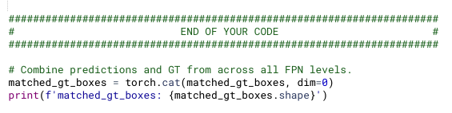</kbd>

<kbd>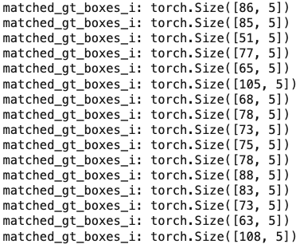</kbd>

<kbd>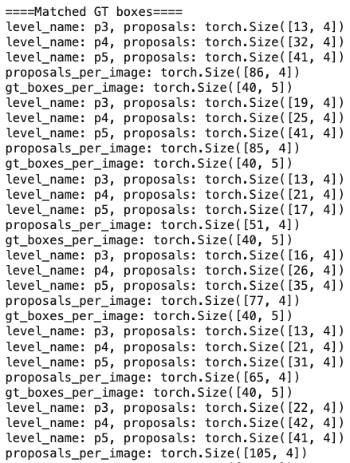</kbd>

<kbd>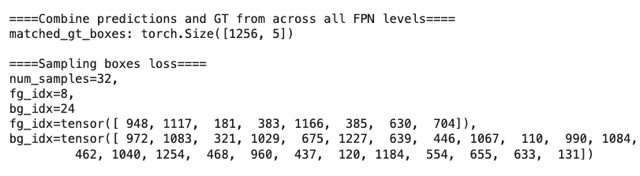</kbd>

<kbd></kbd>

<kbd></kbd>

<kbd></kbd>

<kbd></kbd>

<kbd>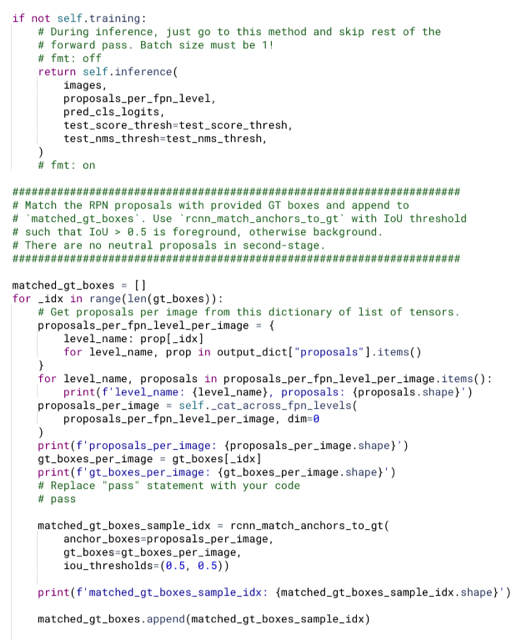</kbd>

> [!NOTE]
> Tiếp, nếu là inference mode thì gọi (và return inference()), quay lại sau, khi làm inference().
> **THỰC HIỆN MATCH ANCHOR-GT BOX CHO TỪNG IMAGE.**
>
> Còn để tiếp tục quá trình training thì  bước kế tiếp là ghép mỗi proposed box (region) với các ground truth box, để mà
> đóng vai trò target (về khía cạnh ground truth class giúp supervised việc learn bài toàn classification và nếu là phiên bản
> đầy đủ của Faster RCNN thì sẽ bao gồm cả khía cạnh  ground truth box giúp supervise việc learn một lần nữa bounding
> box, mang ý nghĩa là tiếp tục refine cái proposed box predict bởi RPN)
>
> Thế thì, việc này như ở lúc trước đã làm, ta biết sẽ làm "lần lượt cho từng sample (vì không làm một lúc cho mọi sample
> trong batch được, vì mỗi image mỗi khác). Do đó, ta sẽ iterate từng sample.
>
> Để rồi (với mỗi cái) lấy ra các proposal region của từng level, và concat lại để có **mọi proposal regions của một sample**.
> Ví dụ của**sample đầu tiên (trong B=16 sample)**:
>
> level_name: p3, proposals: torch.Size([**9**, 4])  
> level_name: p4, proposals: torch.Size([**18**, 4]) 
> level_name: p5, proposals: torch.Size([**27**, 4]) 
>
> **proposals_per_image**: torch.Size([**54**, 4])  #54 = 9 + 18 + 27
>
> - Gt box cũng vậy, lấy gt box tensor của sample đó ra.
>
> **gt_boxes**: torch.Size([1**6, 40, 5**])           
> **gt_boxes_per_image: torch.Size([40, 5])**
>
> Pass chúng vào function **rcnn_match_anchors_to_gt** với proposal regions đóng vai trò anchor và dùng iou_thresholds
> là (0.5, 0.5) để nếu chỉ chia làm hai loại:
>
> - Foreground (nếu iou của proposal box và gt box > 0.5 = iou_thresholds[1])
> - Background (nếu iou < 0.5 = iou_threshold[0])
> - Không có neutral
>
> **matched_gt_boxes_sample_idx**: **torch.Size([54, 5])**, với mỗi proposed box của image sample, nó sẽ
> được gắn với một gt box: [x1,y1,x2,y2,class id]
>
>
>
> CONCAT LẠI ĐỂ TẠO TENSOR CHO NGUYÊN CÁI BATCH
>
> Append vào list, để có list các **matched_gt_boxes** của mọi sample trong batch, xong suôi thì concate lại thành một
> tensor :
>
> **matched_gt_boxes**: torch.Size([**mọi matched proposed region trong batch** = **920**, **5**])
>
> ===Ôn lại một chút===
>
> (Ta nhớ lại, trong function này, nếu ví dụ như iou mà < thresholds[0] thì nó sẽ gán cho background box: [-1,-1,-1,-1,-1] còn
> nếu nằm ở giữa hai mức ví dụ 0.3 < iou < 0.7, thì nó sẽ gán cho một neutral box = [-1e8,-1e8,-1e8,-1e8, -1e8] để rồi dựa
> vào đặc điểm này mà khi qua bước tính ground truth deltas, cả foreground, background đều có deltas là [-1e8, -1e8, -1e8,
> -1e8]. Từ đó khi tính box regression loss, dùng để tạo masks giúp reset box loss của những cái này thành 0.
>
> Còn chú ý nếu có confuse về ground truth class score của background và neutral anchor box thì là vầy: Trong RPN, ta chỉ
> predict object-ness, bằng bài toán binary classification.
>
> Khi tính classification loss, ta có bước sampling, thì ở trong đó đã loại đi các neutral (ý là ignore các neutral anchor). Rồi
> khi sampling xong ta có hai list các indices của foreground anchors và background anchors, thì ta dùng nó để lấy  ra
> subset các anchor box, cũng như là "tạo" ground truth class box (0 or 1)

 

<kbd>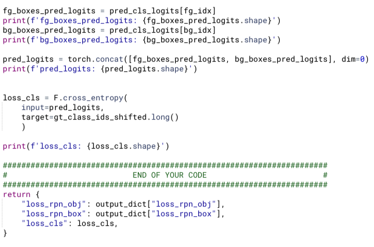</kbd>

<kbd>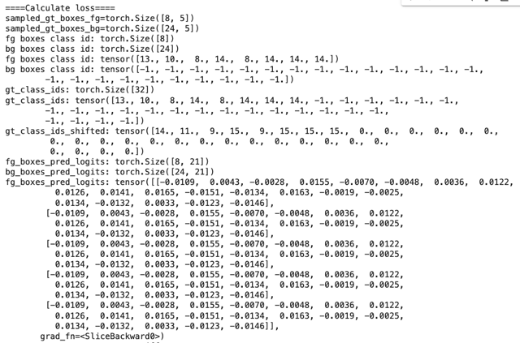</kbd>

<kbd></kbd>

<kbd></kbd>

<kbd>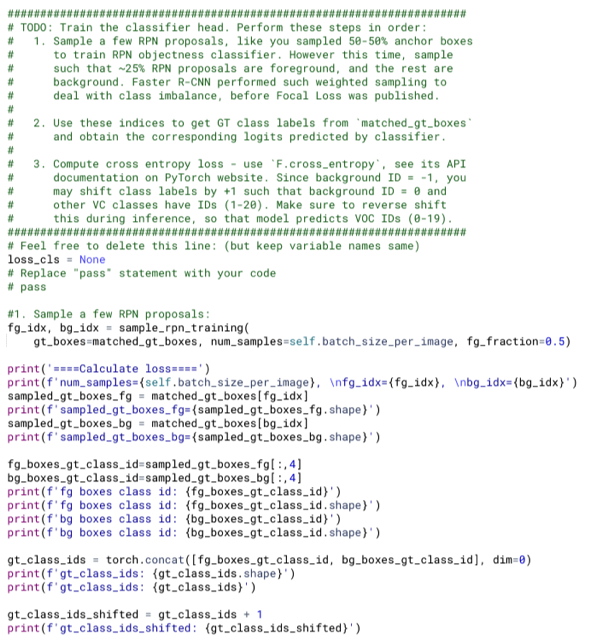</kbd>

> [!NOTE]
> Qua bước tính loss, thì trước khi bắt đầu tính loss, hãy để ý rằng tại  đây ta đã có hai bộ:**predicted
> logits** cho mọi proposed region trong batch:
>
> **pred_cls_logits**: torch.Size([**920**, 21])
>
> Và **ground truth box** match cho mọi proposed region trong batch:
>
> **matched_gt_boxes**: torch.Size([**920**, 5])
>
> 920: là tổng số proposed region trong batch, 21 là num_classes=20 + 1, 5 là x1, y1, x2, y2, ground
> truth class id
>
> ====
>
> SAMPLING AN EQUAL SIZE OF POSTIVE ANCHOR / NEGATIVE ANCHOR
>
> Thế thì bước một trong việc tính loss là ta sẽ sampling ra một số lượng nào đó (*) các proposed box
> để xài trong việc tính loss. Như gợi ý ta sẽ dùng fg_fraction = 0.25 để có 25% foreground region, còn
> lại là background. Mục đích là để deal với class imbalance trước khi Focal Loss được "phát minh".
>
> Như bên RPN, nó sẽ **trả cho hai bộ indices (M)**, từ đó ta**lấy ra các subset các gt box** và sau đó là**ground
> truth class id**. Dùng làm target.
>
> fg_idx: torch.Size([16])   #(M) M Số positive anchor được sampling
> bg_dix: torch.Size([16])  #(M)
> **gt_class_ids**: torch.Size([**32**]) #(2M) 
>
>
> SHIFT CLASS ID
>
> Ở đây làm thêm động tác shift các class id thêm 1, để cho background class id từ -1 thành 0. Mấy
> foreground class id từ [0-19] thành ra [1-20]
>
> Còn phần predict logits, cùng dùng hai bộ indices để lấy ra các predicted logits.
>
> **pred_logits**: torch.Size([**32**, 21])
>
> (*): Số lượng yêu cầu cho function sampling có lẽ là quy định bởi  **self. batch_size_per_image**,
> không thể thấy có thể dùng cái gì ngoài cái này, cũng như không thể thấy dùng cái arg input này ở
> đâu khác ngoài ở đây, mặc dù cái tên gây confuse)

 

<kbd>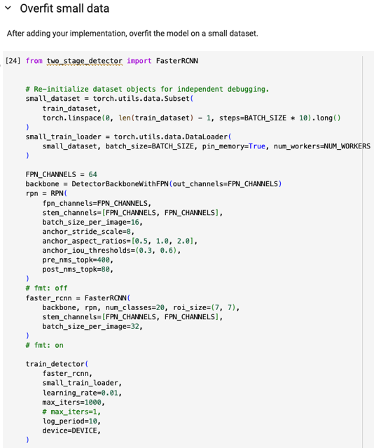</kbd>

 

<kbd>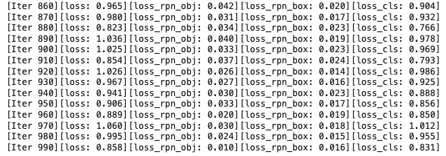</kbd>

<kbd>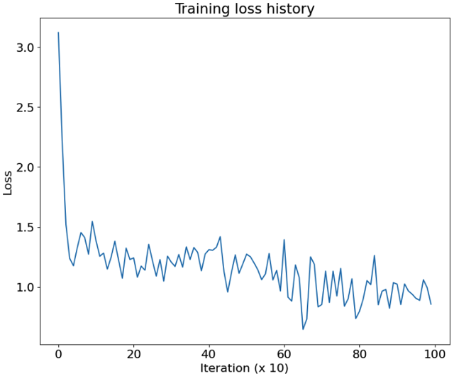</kbd>

<kbd></kbd>

<kbd></kbd>

<kbd>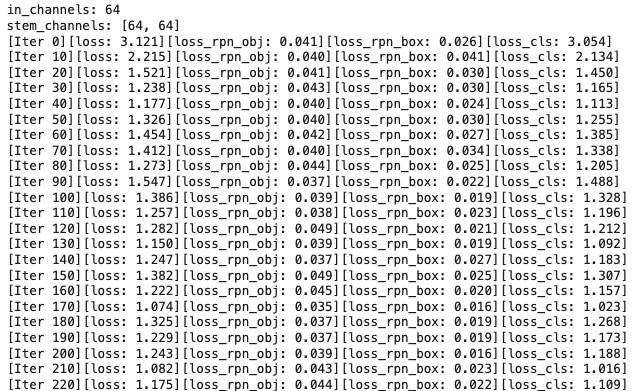</kbd>

 

<kbd>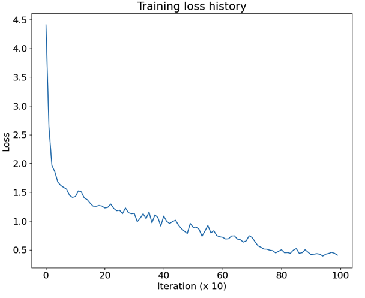</kbd>

<kbd></kbd>

<kbd>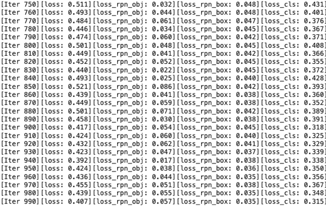</kbd>

 

<kbd>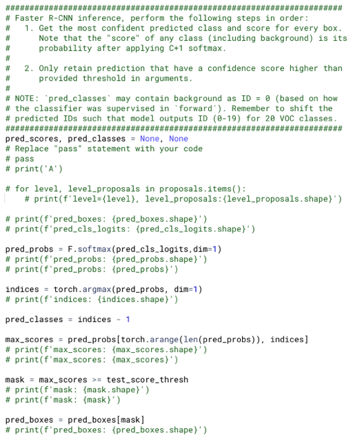</kbd>

<kbd>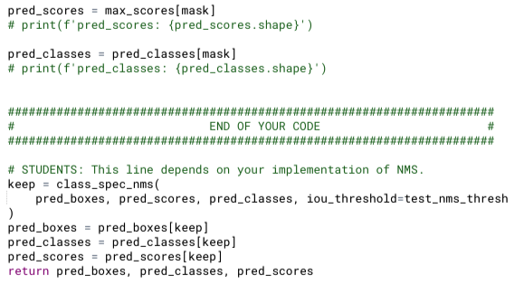</kbd>

<kbd></kbd>

<kbd></kbd>

<kbd>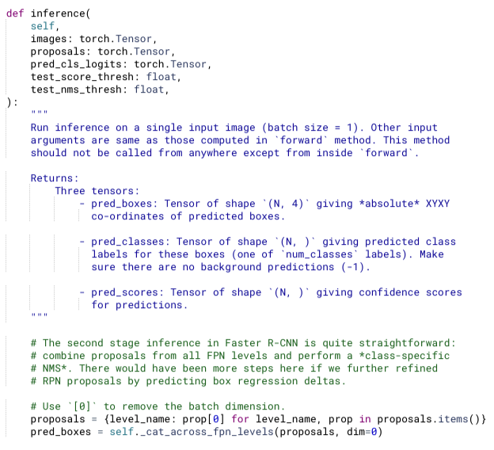</kbd>

> [!NOTE]
> Kết quả ra không tốt, và mình cũng không biết vấn đề
> nằm ở đâu. Do đó, quyết định làm tiếp Assignment của
> EECS 498007 version 2020, trong đó ta cũng làm một cái
> Single-stage detector nhưng mà là YOLO thay vì FCOS,
> và phần hai cũng làm Faster RCNN, ta sẽ củng cố sự
> hiểu của mình, cũng như là có bài mẫu của những anh
> bạn khác để so sánh. Khi đó ta sẽ quay lại để fix lỗi cái
> này.

 

