# Eecs 498-007_598-005 (2020) Assignment 4 (part 1): Single-stage Detector - Yolo

📊 **Progress:** `95` Notes | `259` Screenshots

---
<a id="node-1586"></a>

<p align="center"><kbd>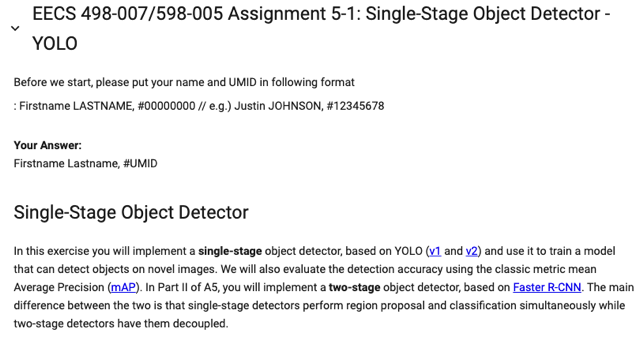</kbd></p>

> [!NOTE]
> ở version (của EECS `498-007` 2020) Phần 1, single stage detector sẽ là mô
> hình dựa trên YOLO. Phần 2 thì vẫn là Faster `R-CNN.` Ở đây cho biết sự
> khác nhau chỉ là ở chỗ, `Single-stage` nó sẽ perform việc dự đoán region
> proposal và thực hiện classification (ra các object class) cùng một lúc. Còn
> `Two-stage` thì chia làm hai bước, region proposal trước, sau đó mới
> classification

<br>

<a id="node-1587"></a>

<p align="center"><kbd>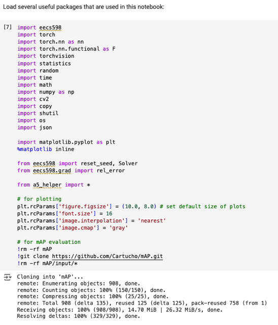</kbd></p>

<br>

<a id="node-1588"></a>

<p align="center"><kbd>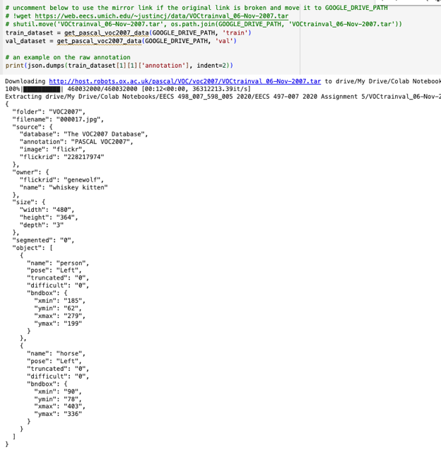</kbd></p>

<p align="center"><kbd></kbd></p>

<p align="center"><kbd>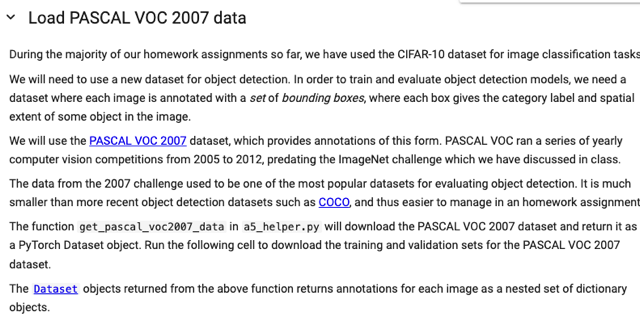</kbd></p>

> [!NOTE]
> đại khái là, như đã biết, để huấn luyện mô hình object detection, ta sẽ chuyển
> từ dataset quen thuộc `CIFAR-10` sang PASCAL VOC 2007, nơi mỗi image
> được labeled với bounding boxes và class label. Như đã nói ở "version 2022"
> , hiện nay người ta dùng COCO, vì VOC 2007 tỏ ra qúa dễ với các state of
> the art model  ngày nay. Nhưng với kích thước của nó, tỏ ra phù hợp cho
> assignment.
>
> Đoạn code dưới sẽ giúp ta download dataset về

<br>

<a id="node-1589"></a>

<p align="center"><kbd>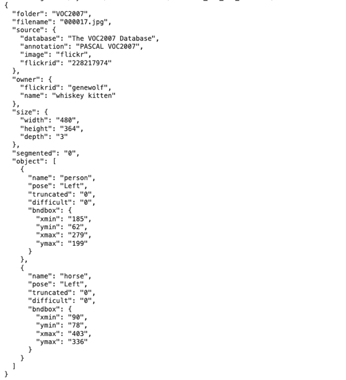</kbd></p>

> [!NOTE]
> ví dụ của một "labeled sample", ta thấy image 000017.jpg, có size 480x364x3
> có 2 object: một cái có lavel là "person", với bounding box coordinates
> [xmin, ymin, xmax,ymax] là coordinate hai top left, bottom right corners.
>
> và một object khác name "horse" với bounding box tương tự.

<br>

<a id="node-1590"></a>

<p align="center"><kbd>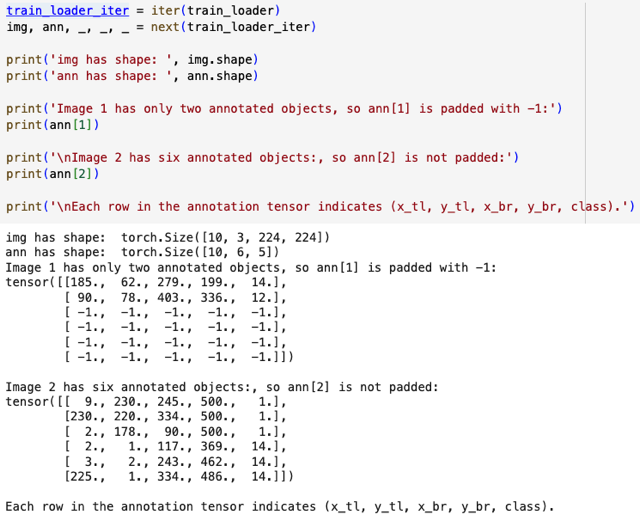</kbd></p>

<p align="center"><kbd></kbd></p>

<p align="center"><kbd>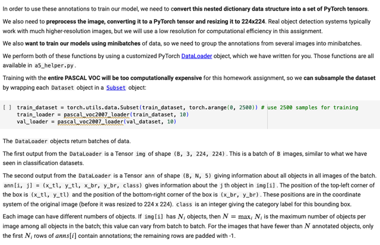</kbd></p>

> [!NOTE]
> đại ý là (nhắc lại, cũng tương tự như version 2022), ta sẽ cần convert từ dạng
> hiện tại của dataset sang pytorch tensor, đồng thời cần làm một số bước 
> preprocessing như resize image thành 224x224. Rồi ta sẽ muốn có các batch
> of data để training, nên ta sẽ dùng DataLoader. Tóm lại, các bước này người
> ta đã làm giúp mình trong a5_helper.py. Ngoài ra, thay vì training trên toàn
> VOC dataset ta sẽ chỉ train trên subset 2500 samples.
>
> Tiếp theo nói về việc "mỗi lần" dataloader sẽ trả ra một tuple bồm có:
>
> xb: shape (B, 3, 224, 224) là một batch các image tensor đã được resize 
> như đã nói thành 224x224.
>
> yb: shape (B, N, 5): có nghĩa là mỗi sample trong batch sẽ có N bounding 
> ```text
> box + class id thể hiện bởi vector 5 phần tử: [x_tl, y_tl, x_br, y_br, class id]
> ```
> mà trong "v2022" gọi là [x1,y1,x2,y2,class id].
>
> Tuy nhiên phải hiểu là không phải cái image nào cũng có N object, nên N sẽ
> là số object của cái hình nào đó trong batch mà có nhiều object nhất. Khi đó,
> ```text
> mấy cái sample có ít hơn N object sẽ được "pad" với [-1,-1,-1,-1,-1]
> ```

<br>

<a id="node-1591"></a>

<p align="center"><kbd>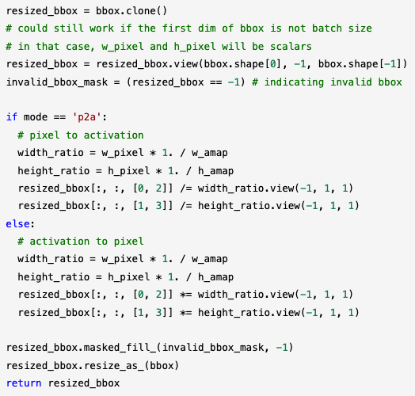</kbd></p>

<p align="center"><kbd></kbd></p>

<p align="center"><kbd>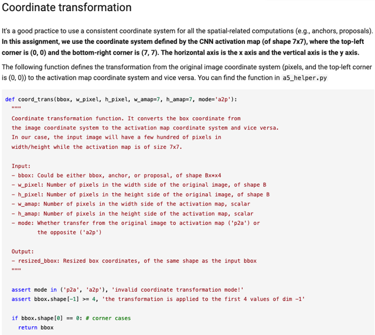</kbd></p>

> [!NOTE]
> đại khái là, các image gốc có size rất khác nhau, nên coordinate của các
> bounding box hay anchor box hay proposal box trên các image đó cũng sẽ rất
> khác nhau, không thống nhất.
>
> Do đó, ta sẽ chuẩn bị một function giúp chuyển đổi coordinate của các anchor
> box qua lại giữa hai hệ coordinate: từ coordinate của box trong ảnh gốc, sang
> một coordinate thống nhất của feature map với size là 7x7. Và ngược lại.

<br>

<a id="node-1592"></a>

<p align="center"><kbd>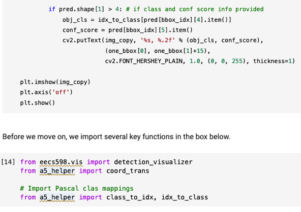</kbd></p>

<p align="center"><kbd></kbd></p>

<p align="center"><kbd>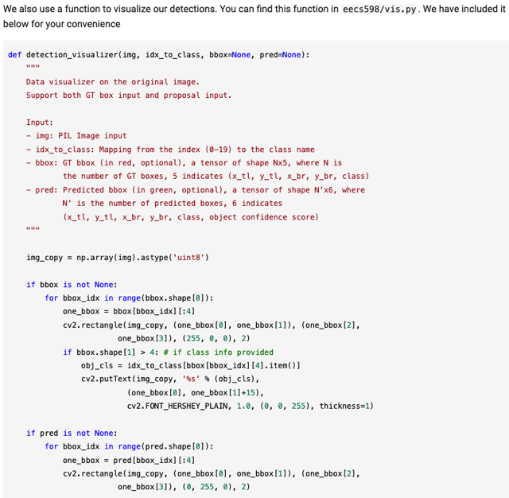</kbd></p>

> [!NOTE]
> rồi, người ta cũng chuẩn bị cho một function
> giúp visualize các kết qủa detection. Có thể
> quay lại đọc kĩ để hiểu cách làm

<br>

<a id="node-1593"></a>

<p align="center"><kbd>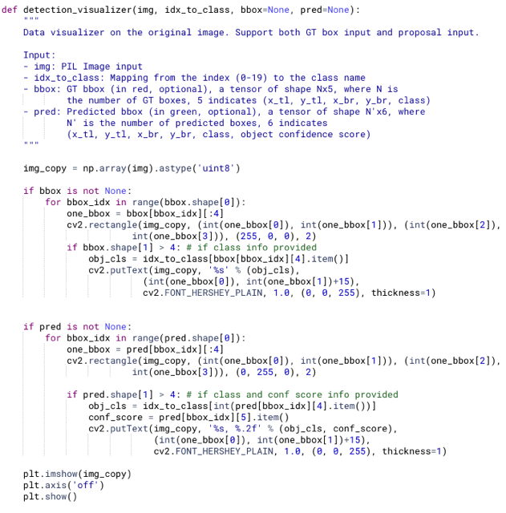</kbd></p>

<p align="center"><kbd></kbd></p>

<p align="center"><kbd>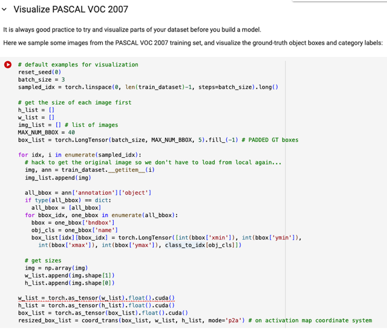</kbd></p>

> [!NOTE]
> tiếp theo chạy đoạn code này để in ra một vài sample để xem thử, như
> v2022 đã thấy. Chỗ này lúc chạy báo một lỗi kiểu như do version của
> OpenCV api thay đổi, sửa lại bằng cách mở file vis.py, chuyển các giá
> trị của các coordinate ví dụ `one_bbox[0]` thành integer: `int(one_bbox[0])`

<br>

<a id="node-1594"></a>

<p align="center"><kbd>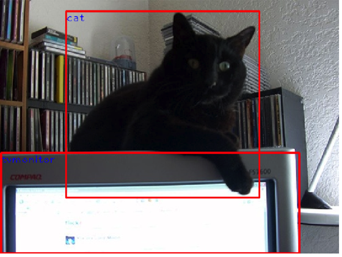</kbd></p>

<p align="center"><kbd>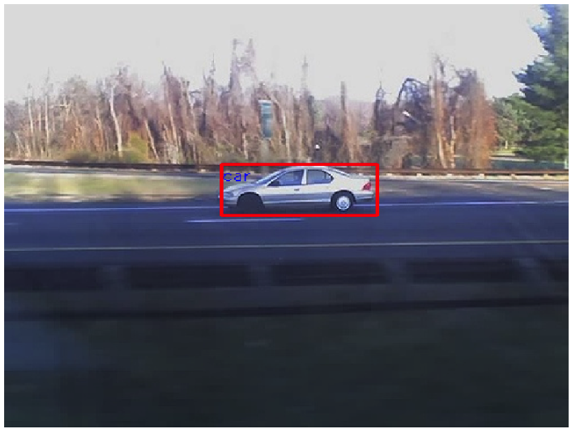</kbd></p>

<p align="center"><kbd></kbd></p>

<p align="center"><kbd></kbd></p>

<p align="center"><kbd>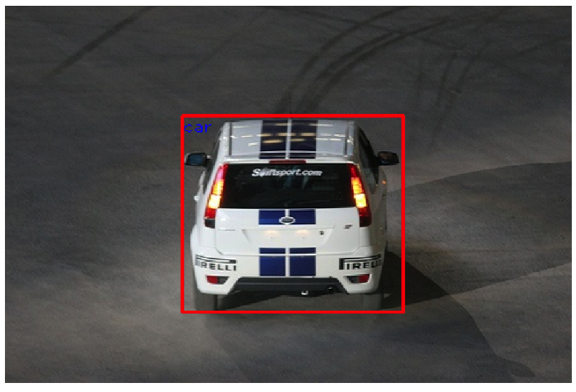</kbd></p>

<br>

<a id="node-1595"></a>

<p align="center"><kbd>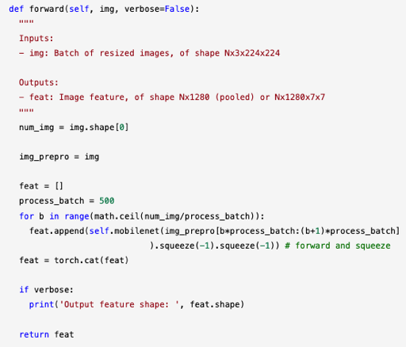</kbd></p>

<p align="center"><kbd></kbd></p>

<p align="center"><kbd>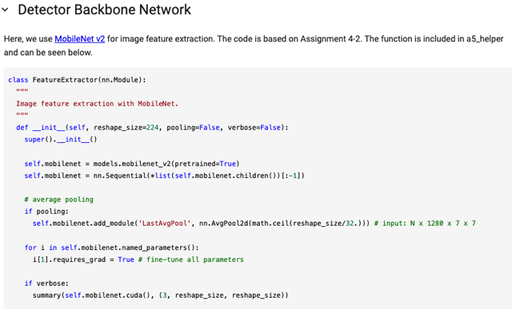</kbd></p>

> [!NOTE]
> đại khái là tương tự như "bên" version 2022, FCOS, ta dùng một backbone
> cnn `+` FPN (Feature Pyramid Network) để mà extract feature, ở các "level"
> khác nhau, đặng dùng nó cho quá trình training ra detector. Thì ở đó ta dùng
> `regnet_x_400_mf,` còn ở đây, ta sẽ dùng MobileNet v2.
>
> Trong __ini__, ta thấy họ khởi tạo pretrained mobileNet model, dùng api
> của Pytorch, sau đó, đại khái là ta sẽ "tạo lại một model" bao gồm các layer
> của mobileNet trừ cái layer cuối. (Bằng cách gọi .children() để return một 
> iterator over mọi children module, tạo một cái list, trải nó ra với (*), pass vào
> nn.Sequential())
>
> Tiếp, nếu argument pool is True, thì "add thêm" một module (layer) 
> nn.AvgPool2d.
>
> Iterate qua các bộ parameters của các layer và set `requires_grad` `=` True,
> điều này có nghĩa là ta sẽ finetune toàn bộ các layer của pretrained mobile
> net trong quá trình training bài toán object detection.
>
> Rồi nếu argument verbose `=` True thì "in" kết quả summary `->` cho thấy kiến
> trúc của model.
>
> `=====`
>
> Rồi, function forward:
>
> Về cơ bản ta thấy rằng, họ sẽ pass từng batch 500 sample vào model để có
> output feature, append vào list. Cuối cùng thì dùng torch.concat để tạo tensor
> các feature.

<br>

<a id="node-1596"></a>

<p align="center"><kbd>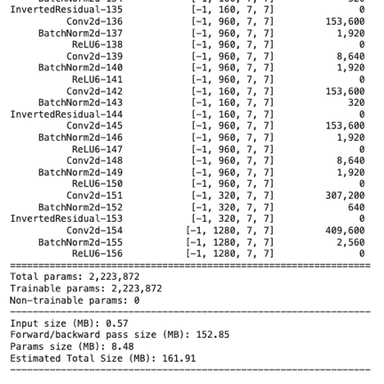</kbd></p>

<p align="center"><kbd></kbd></p>

<p align="center"><kbd>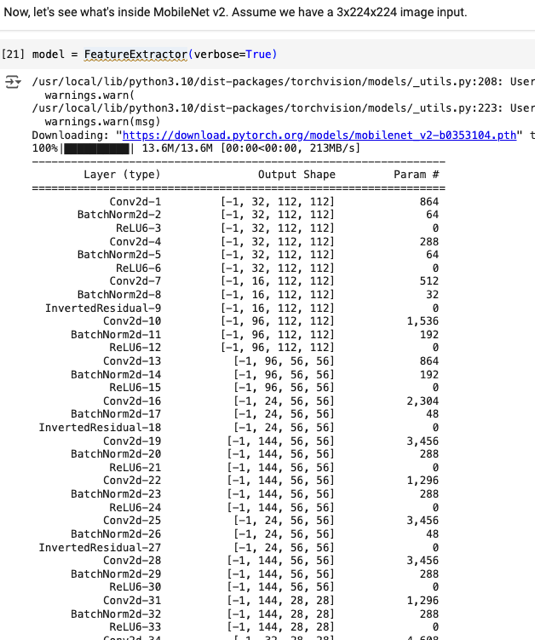</kbd></p>

> [!NOTE]
> mình thấy rằng nó là một sequence các [conv2d `-`
> batchnorm `-` relu], thỉnh thoảng là InvertedResidual.
> Tổng cộng có ~ 2 triệu trainable params

<br>

<a id="node-1597"></a>

<p align="center"><kbd>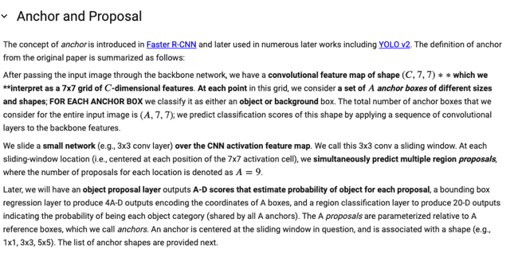</kbd></p>

> [!NOTE]
> Đại khái là nói lại khái niệm anchor box mà mình đã biết ở part 2 của
> Assignment 5 EECS `498-007` version winter 2022. Thì ở đây họ nói khái
> niệm này được giới thiệu ở Faster `R-CNN,` rồi sau đó mới được dùng trong
> nhiều model khác bao gồm YOLO v2. (có nghĩa là không như mình nghĩ,
> thật ra YOLO v2 ra đời sau Faster `R-CNN.`
>
> Ở đây người ta sẽ tóm tắt việc định nghĩa ra anchor box trong paper YOLO
> v2 như sau: Sau khi pass cái input image qua backbone network ta có
> được feature map shape (C,7,7) C là depth dimension đương nhiên như
> đã biết sẽ là bằng số filter của cái conv layer cuối. Thế thì ta sẽ nhìn nhận
> cái tensor này như là một "grid 7x7" các vector có C unit. Thế thì  tại mỗi
> điểm (location) trong 7x7 location đó, ta mới "gán" A cái anchor boxes, có
> shape và size khác nhau. Như vậy sẽ có 7*7*A anchor boxes tổng cộng.
>
> `===`
>
> Thế thì bước đầu tiên sẽ là region proposal khi họ cho biết rằng ta sẽ quét
> một 3x3 conv qua feature map (spatial size `=` 7x7) đặng tại mỗi vị trí, tương
> ứng với mỗi anchor box, dự đoán ra một proposal region. Ở đây họ không 
> nói gì thêm.
>
> Sau đó, với mỗi region proposal, ta sẽ muốn predict ra 3 thứ:
>
> 1. Anchor box đó có phải là một object hay không, bằng cách tính toán một
> chỉ số probability of object: Xác suất anchor là một object. Vậy tại mỗi
> location, vì có A anchor box, cần tính ra A giá trị xác suất, nên người ta ghi
> là `A-dimensional` vector. Việc này sẽ do một classification layer
> `-` với binary cross entropy loss để map giữa predicted probability và ground
> truth `object-ness`
>
> 2.Box regression: Và với mỗi box ta cũng muốn tính ra (dự đoán ra) các
> giá trị coordinate của một cái object box hay proposal regions.
>
> Liên hệ bên Faster `R-CNN,` thì cái này sẽ predict ra cho mỗi anchor box 4
> giá trị deltas [tx,ty,tw,ty] để mà  "chuyển" anchor box thành ra predicted
> object box. Còn ở đây có lẽ là ta sẽ predict ra thẳng coordinate của object
> box luôn. Bước này sẽ dùng box regression layer. Vì có A anchor tại mỗi
> location, nên sẽ output A*4 giá trị coordinates.
>
> 3.Region classification: Với mỗi location, ta sẽ predict xem "tại đó"thuộc
> class gì, bằng cách tính ra một 20 dimensional vector chứa 20 class probs.

<br>

<a id="node-1598"></a>

<p align="center"><kbd>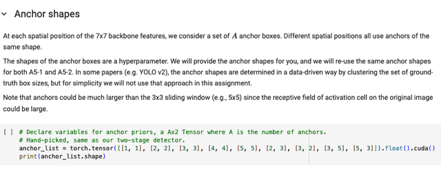</kbd></p>

> [!NOTE]
> đại khái là nói về shape và size của các anchor box sẽ khác nhau.
> Và nó là một loại hyperparameters, ở đây người ta chọn sẵn cho mình
> và cho biết thêm có paper dùng giá trị tính toán dựa vào data
>
> Chú ý thêm rằng anchor có thể to hơn 3x3 sliding window

<br>

<a id="node-1599"></a>

<p align="center"><kbd>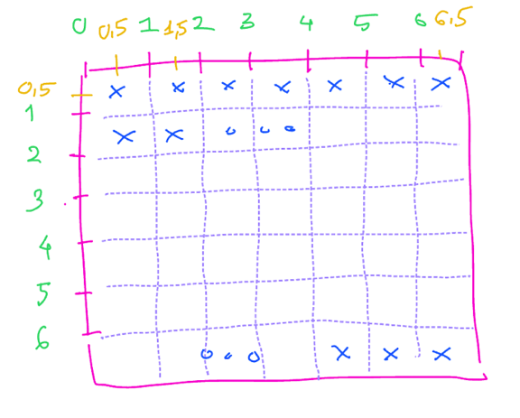</kbd></p>

<p align="center"><kbd></kbd></p>

<p align="center"><kbd>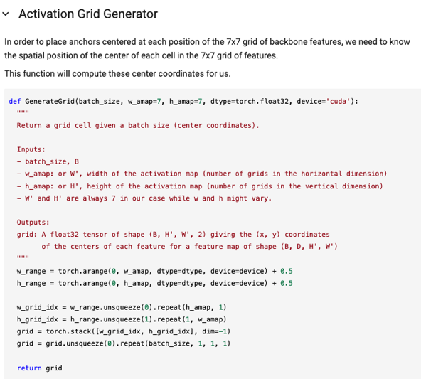</kbd></p>

> [!NOTE]
> đại khái là function này giúp tính ta tọa độ của các location trong 7x7
> feature map (không phải trong 224x224 original size nhé).
>
> Mục đích là để phục vụ cho bước "đặt tâm của các anchor tại mỗi
> location.
>
> giải thích: 
>
> ```text
> w_range = torch.arange(0, w_amap, dtype=dtype, device=device)
> ```
>
> `->` [0,1,2,3,4,5,6] shape (W,)
>
> ```text
> w_range = w_range + 0.5: [0,1,2,3,4,5,6] -> [0.5,1.5,2.5,3.5,4.5,5.5,6.5]
> ```
>
> ```text
> w_grid_idx = w_range.unsqueeze(0).repeat(H=h_amap, 1)
> ```
>
> từ (W,) `unsqueeze(dim=0)` để thành (1,W), rồi repeat(H,1) để nó copy theo
> trục 0 từ 1 hàng thành H hàng (H, W)
>
> [[0.5,1.5,2.5,3.5,4.5,5.5,6.5],
> [0.5,1.5,2.5,3.5,4.5,5.5,6.5],
> ...
> [0.5,1.5,2.5,3.5,4.5,5.5,6.5]]
>
> `====`
>
> tương tự với `h_grid_idx:` 
>
> ```text
> h_range = torch.arange(0, h_amap, dtype=dtype, device=device) + 0.5
> ```
>
> `->` [0.5,1.5,2.5,3.5,4.5,5.5,6.5] shape (H,)
>
> ```text
> h_grid_idx = h_range.unsqueeze(1).repeat(1, W=w_amap)
> ```
>
> từ (H,) unsqueeze(1) sẽ có (H,1), repeat(1,W) để thành W (H, W)
>
> [[0.5,1.5,2.5,3.5,4.5,5.5,6.5],
> [0.5,1.5,2.5,3.5,4.5,5.5,6.5],
> ...
> [0.5,1.5,2.5,3.5,4.5,5.5,6.5]]
>
> Stack theo dim `=` `-1,` thì (H, W) (H, W) sẽ thành (H, W, 2) để thành ra 
> H*W vị trí, mỗi vị trí là 2 giá trị tọa độ.
>
> `====`
>
> Sau đó nó mới repeat thành B cái tensor như vậy.

> [!NOTE]
> Function này người ta làm
> giùm, trong a5_helper.py

<br>

<a id="node-1600"></a>

<p align="center"><kbd>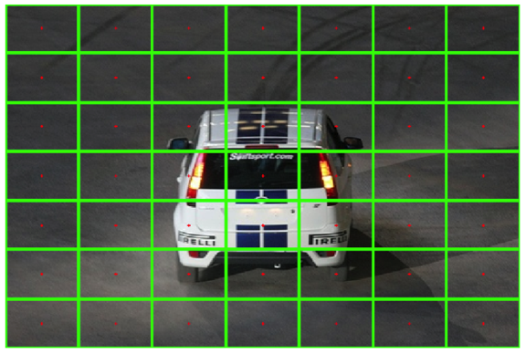</kbd></p>

<p align="center"><kbd>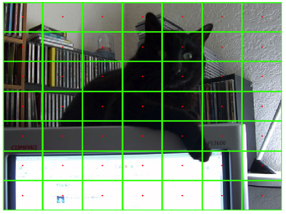</kbd></p>

<p align="center"><kbd>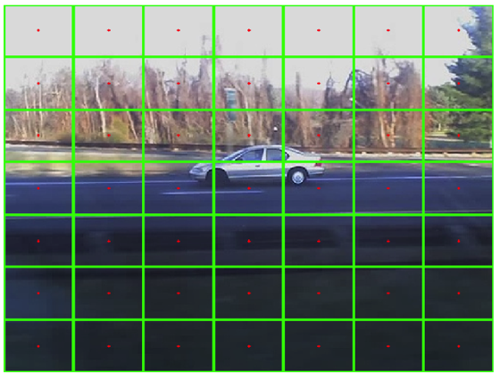</kbd></p>

<p align="center"><kbd></kbd></p>

<p align="center"><kbd></kbd></p>

<p align="center"><kbd></kbd></p>

<p align="center"><kbd>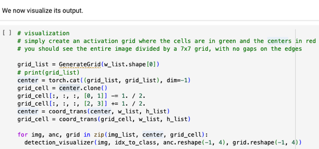</kbd></p>

<br>

<a id="node-1601"></a>

<p align="center"><kbd>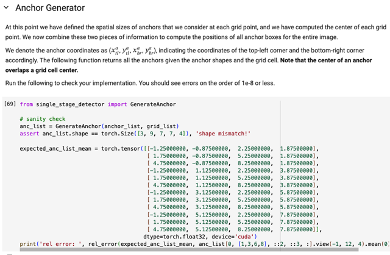</kbd></p>

> [!NOTE]
> Đại khái là tới đây mình đã định nghĩa ra spatial sizes của các anchor 
> boxes. Cũng như là tính toán ra center của các grid points. Bây giờ ta
> sẽ implement function GenerateAnchor, nhận vào các grid center's
> coordinates và các width và height của các anchor boxes. Để mà tạo
> ra, các coordinate của các anchor boxes, tại mỗi grid centers

<br>

<a id="node-1602"></a>

<p align="center"><kbd>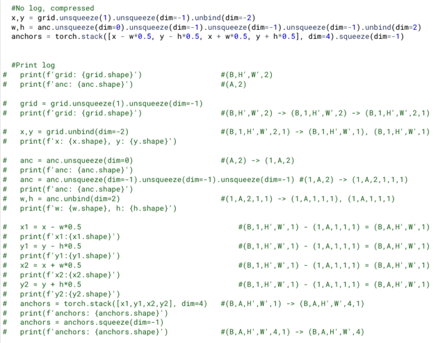</kbd></p>

<p align="center"><kbd>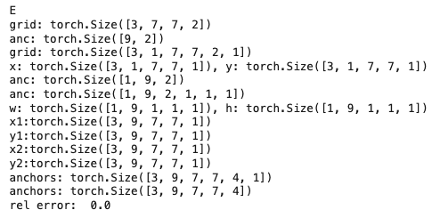</kbd></p>

<p align="center"><kbd>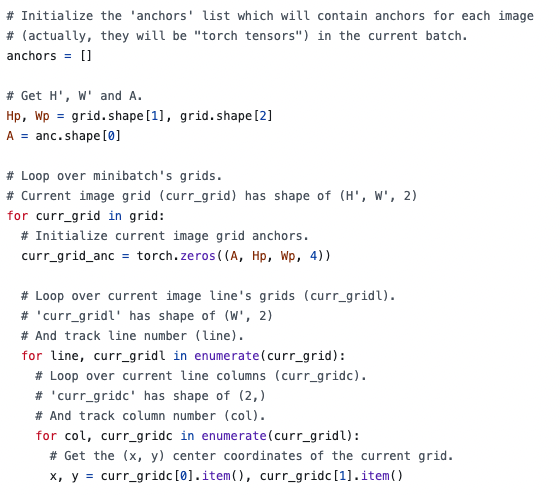</kbd></p>

<p align="center"><kbd>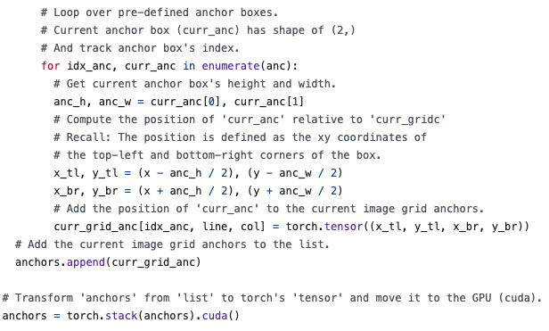</kbd></p>

<p align="center"><kbd></kbd></p>

<p align="center"><kbd></kbd></p>

<p align="center"><kbd></kbd></p>

<p align="center"><kbd></kbd></p>

<p align="center"><kbd>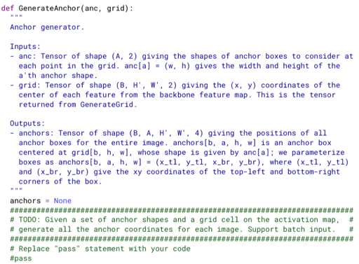</kbd></p>

> [!NOTE]
> Input như đã nói sẽ có grid: là các coordinate x,y của các grid
> center. Feature map output từ backbone cnn sẽ có size là (H'
> `=7,` `W'=7),` tạo thành một cái grid 7x7. Rồi hồi nãy ta  đã thấy
> họ giúp tính coordinate của mổi grid center, để có (H',W',2).
> Và với B sample trong batch, ta có tensor (B,H',W',2)
>
> Input thứ hai là anc `-` các kích thước của các anchor tại mỗi
> một grid center (hay gọi là location center cũng được). Thế
> thì, như đã nói, mỗi location sẽ được gán A anchor. Thì anh,
> shape là (A,2) sẽ quy định width và height của các anchor.
>
> Nhiệm vụ là ta sẽ tạo tensor (B,A,H',W',4) mang ý nghĩa:  với
> mỗi location `/` grid center (trong H'*W' location), sẽ có A anchor,
> mỗi anchor có 4 giá trị x1,y1,x2,y2: top left và bottom right corner
> của anchor.
>
> `======`
>
> Vậy thì cách làm như mình đã biết ở "v2022", nên cũng đơn
> giản. Caí chính là dùng unsqueeze để tạo các shape phù hợp
> và unbind để "tách các dimension ra". Chứ không biết giải thích
> như thế nào.

> [!NOTE]
> Rel error `=` 0.0: Checked!

> [!NOTE]
> Solution của seloufian: Nhìn chung là rườm ra hơn nhiều khi sử
> dụng nhiều for loop. Rõ ràng solution của mình tốt hơn khi chỉ tốn
> có 3 dòng

<br>

<a id="node-1603"></a>

<p align="center"><kbd>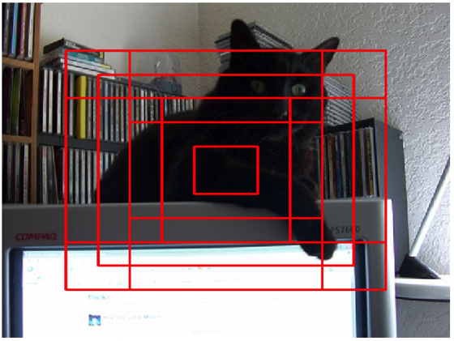</kbd></p>

<p align="center"><kbd>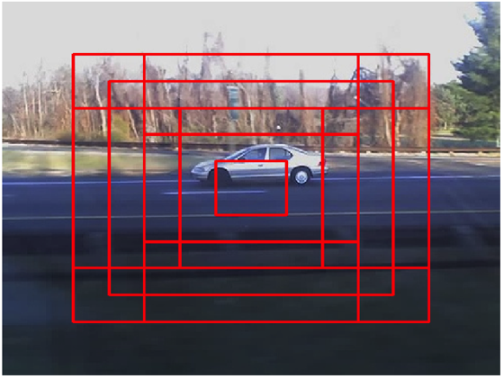</kbd></p>

<p align="center"><kbd>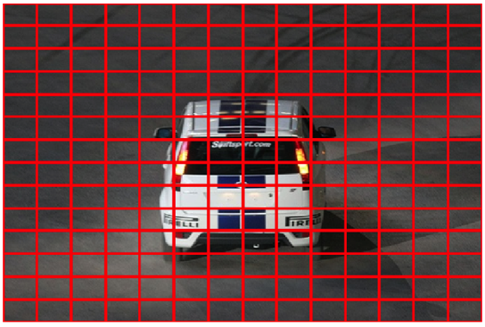</kbd></p>

<p align="center"><kbd>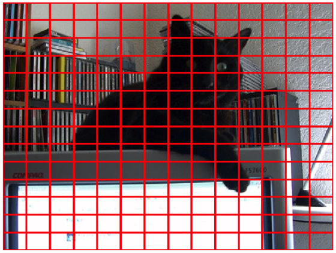</kbd></p>

<p align="center"><kbd>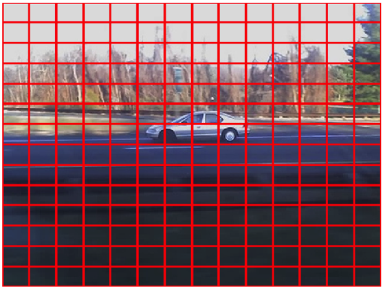</kbd></p>

<p align="center"><kbd></kbd></p>

<p align="center"><kbd></kbd></p>

<p align="center"><kbd></kbd></p>

<p align="center"><kbd></kbd></p>

<p align="center"><kbd></kbd></p>

<p align="center"><kbd>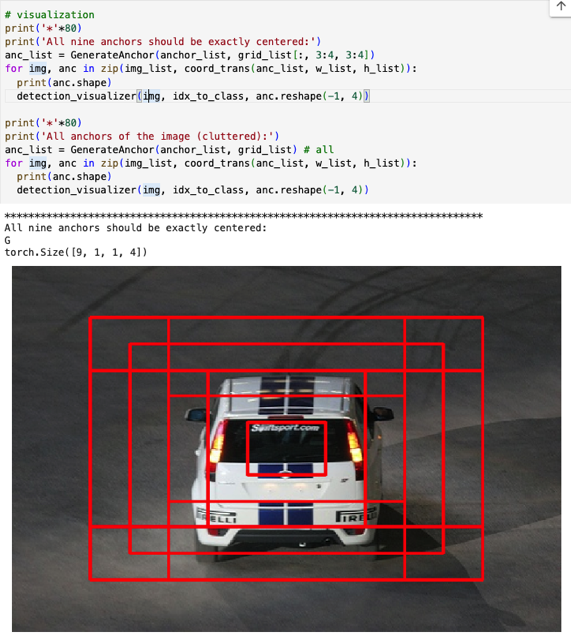</kbd></p>

> [!NOTE]
> 3 hình đầu là visualize 9 cái anchor
> tại cái center grid location. 3 cái sau
> là mọi anchor của image

<br>

<a id="node-1604"></a>

<p align="center"><kbd>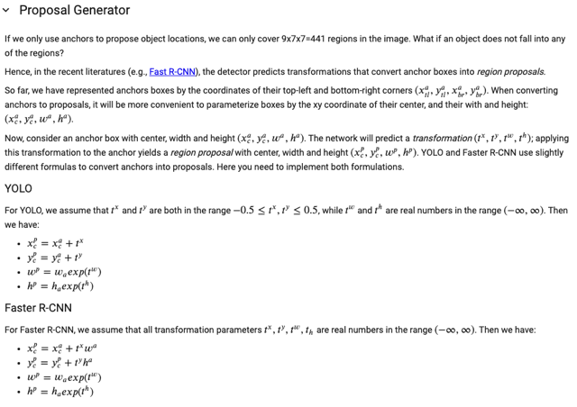</kbd></p>

> [!NOTE]
> rồi, đại ý là, nếu như ta chỉ dùng các anchor box để propose object location
> (có nghĩa là nếu ta chỉ dùng các fixed size, predefined anchor box cho vai
> trò là sự dự đoán của object bounding box) thì ta sẽ chỉ có tổng cộng A*7*7
> `=` 9*7*7 `=` 441 region. Thế thì có thể cái object trong hình không nằm trong 
> một trong 441 region này. Do đó, trong nghiên cứu mới Faster `R-CNN,` người
> ta cho model dự đoán thêm một phép biến đổi (transformation) giúp convert
> một anchor box thành object box, hay gọi là region proposal.
>
> Rồi, ý tiếp theo đại khái là, nãy giờ ta thể hiện anchor box bằng format XYXY
> tức là coordinate của hai điểm tốp left, bottom right của anchor. Tuy nhiên
> sẽ dễ hơn cho bước transformation nếu ta thể hiện nó dưới format center 
> coordinate `+` width, height.
>
> Và model predict ra transformation là predict ra 4 giá trị: tx, ty, tw, th. Nhưng
> YOLO và Faster `R-CNN` có hai công thức khác nhau cho mấy cái này.
> Với Faster `R-CNN` thì đã làm ở part 2 version 2022 nên biết rồi, còn YOLO
> thì hơi khác xíu.
>
> Ở function GenerateProposal ta sẽ làm theo cả hai phương pháp.

<br>

<a id="node-1605"></a>

<p align="center"><kbd>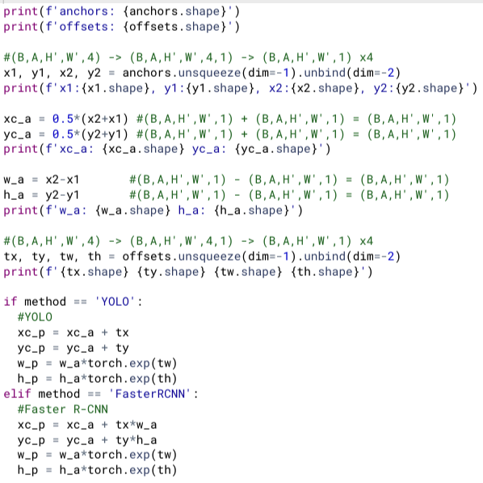</kbd></p>

<p align="center"><kbd>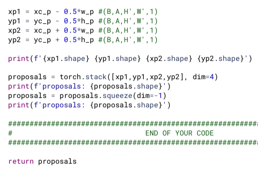</kbd></p>

<p align="center"><kbd>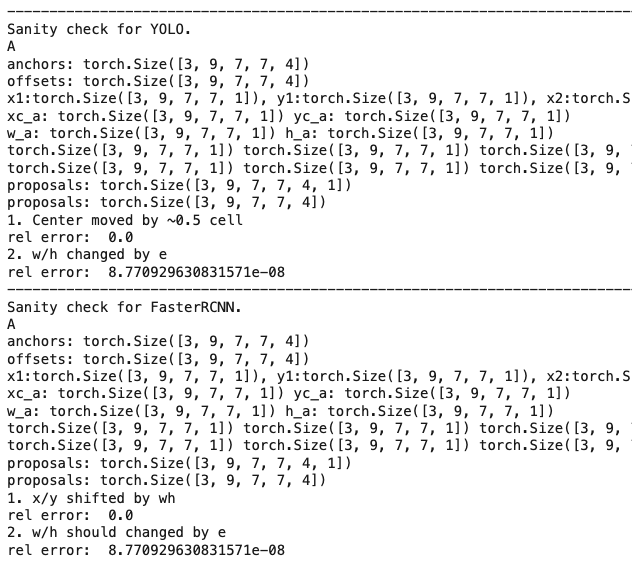</kbd></p>

<p align="center"><kbd></kbd></p>

<p align="center"><kbd></kbd></p>

<p align="center"><kbd></kbd></p>

<p align="center"><kbd>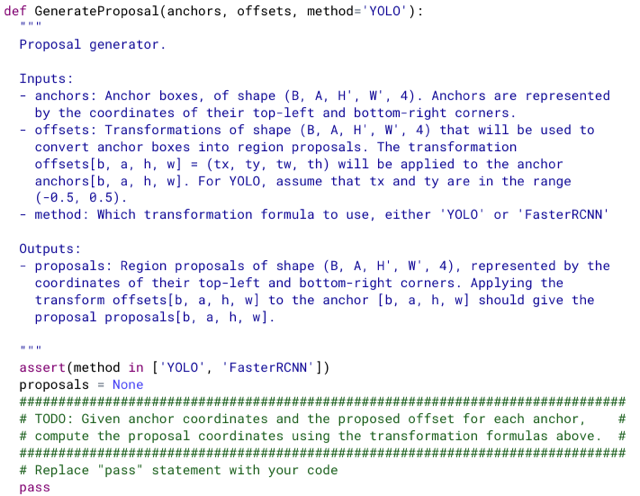</kbd></p>

> [!NOTE]
> Function này ta sẽ nhận các input:
>
> anchors: (B,A,H',W',4) `-` các anchor box, là kết qủa của function đã làm hồi
> nãy: mỗi anchor trong A anchor của một location trong W'*H' locations sẽ
> là một 4D vector: [x1, y1, x2, y2]
>
> offsets: (B,A,H',W',4) `-` các transformation, để biến một anchor thành một
> proposal box. Mỗi anchor trong A anchor của một location trong W'*H'
> locations sẽ ứng với một vector 4D mang giá trị của transformation [tx, ty,
> tư, th]
>
> Và ta sẽ dựa vào anchors, và transformation để mà tính ra proposal region
> coordinate (theo format XYXY)
>
> `====`
>
> Cách làm cũng đơn giản với việc sử dụng unsqueeze, unbind để "tách riêng
> các kích thước ra", tính ra anchor's `x_center,` `y_center,` width, height. Dùng
> các công thức để tính ra proposed box `x_center,` `y_center,` width, height và
> chuyển lại thành dạng XYXY.
>
> Chỉ chú ý lúc làm mắc sai sót ngớ ngẩn là `x_center` `=` (x2 `-` x2)*0.5.

> [!NOTE]
> You should see errors on the order of `1e-7` or less.

> [!NOTE]
> Checked!

<br>

<a id="node-1606"></a>

<p align="center"><kbd>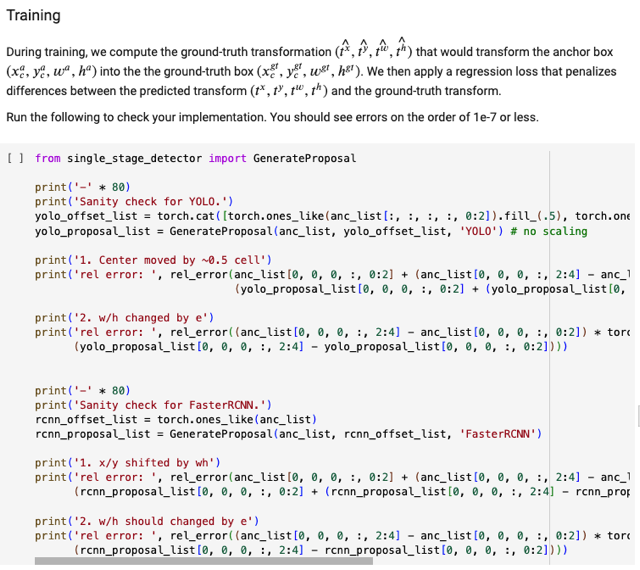</kbd></p>

<br>

<a id="node-1607"></a>

<p align="center"><kbd>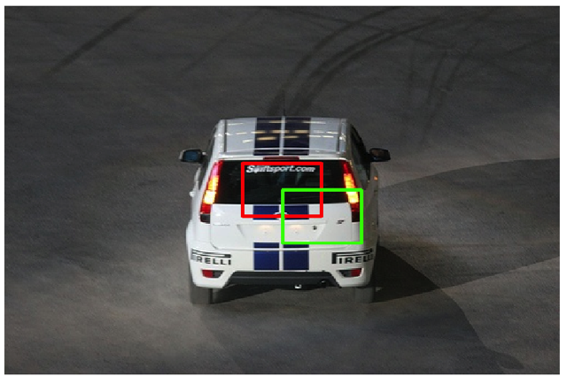</kbd></p>

<p align="center"><kbd>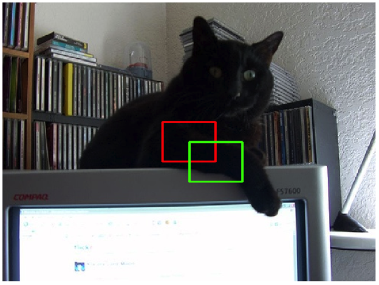</kbd></p>

<p align="center"><kbd></kbd></p>

<p align="center"><kbd></kbd></p>

<p align="center"><kbd>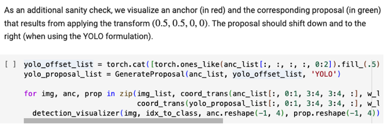</kbd></p>

<br>

<a id="node-1608"></a>

<p align="center"><kbd>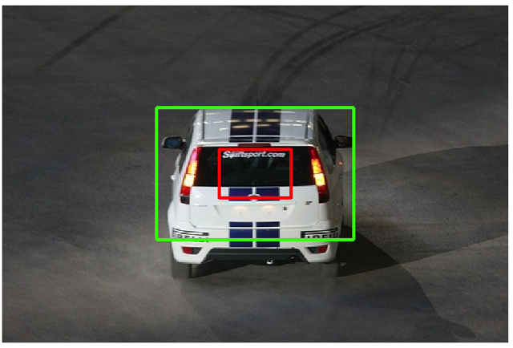</kbd></p>

<p align="center"><kbd></kbd></p>

<p align="center"><kbd></kbd></p>

<p align="center"><kbd></kbd></p>

<p align="center"><kbd>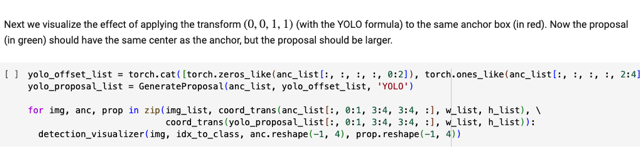</kbd></p>

<br>

<a id="node-1609"></a>

<p align="center"><kbd>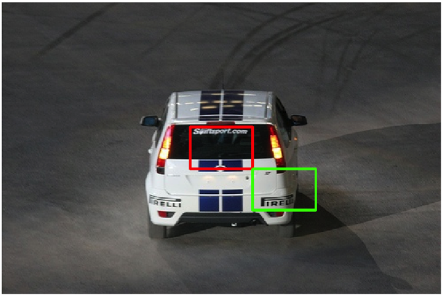</kbd></p>

<p align="center"><kbd>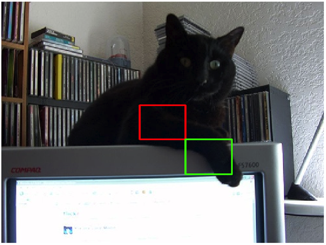</kbd></p>

<p align="center"><kbd></kbd></p>

<p align="center"><kbd></kbd></p>

<p align="center"><kbd>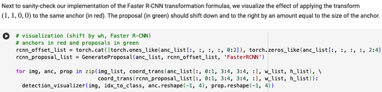</kbd></p>

<br>

<a id="node-1610"></a>

<p align="center"><kbd>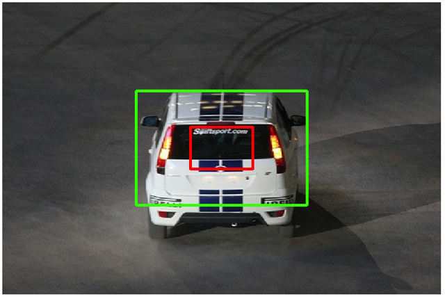</kbd></p>

<p align="center"><kbd>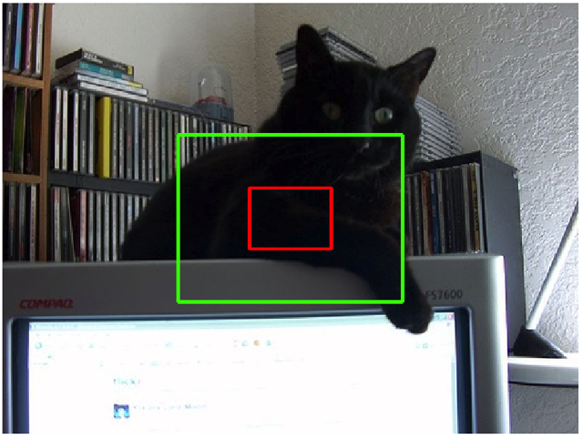</kbd></p>

<p align="center"><kbd></kbd></p>

<p align="center"><kbd></kbd></p>

<p align="center"><kbd>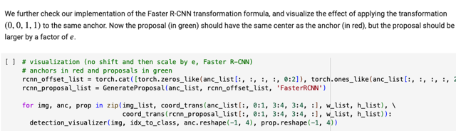</kbd></p>

<br>

<a id="node-1611"></a>

<p align="center"><kbd>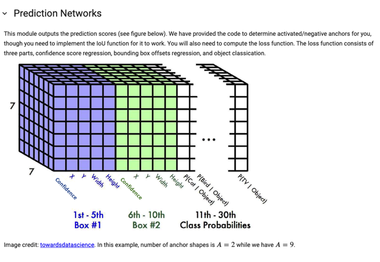</kbd></p>

> [!NOTE]
> tiếp theo, ta sẽ làm Prediction Networks. Thì cái hình này có ý nghĩa là:
> Tại mỗi 'location' (có 7x7 location, hay grid point). Ta sẽ predict ra gồm
> có:
>
> 1. Với mỗi anchor box (trong số A anchor box, ví dụ như ở trong hình là
> A `=` 2), predict ra vector: [confidence, tx, ty, tw, th]. 
>
> Trong đó confidence
> có thể hiểu tương tự như `object-ness` khi làm ở EECS 498_007 v2022 
> Part 2 `-` Faster RCNN, chính là xác suất cái anchor là một `/` gắn với một
> object (hay foreground, đối nghịch với background). Thì confidence score
> sẽ được tính từ một logistic sigmoid function.
>
> Còn 4 giá trị kia đương nhiên là predicted transformation giúp transform
> anchor box thành object box.
>
> 2. `num_classes` giá trị class probabilities `-` là dự đoán của model cho ra
> một probability distribution over all object class, cho location đó.
>
> ```text
> Vậy output tại một grid point sẽ là vector có (A=9)*5 + (num_class=20) = 65
> ```
> unit.
>
> ```text
> Cho nên output tensor sẽ là H'=7,W'=7,(A=9)*5 + num_class=20 = 7x7x65.
> ```
> Thêm batch size: (B,7,7,65)

<br>

<a id="node-1612"></a>

<p align="center"><kbd>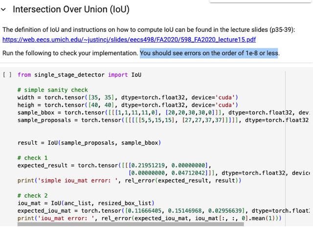</kbd></p>

<br>

<a id="node-1613"></a>

<p align="center"><kbd>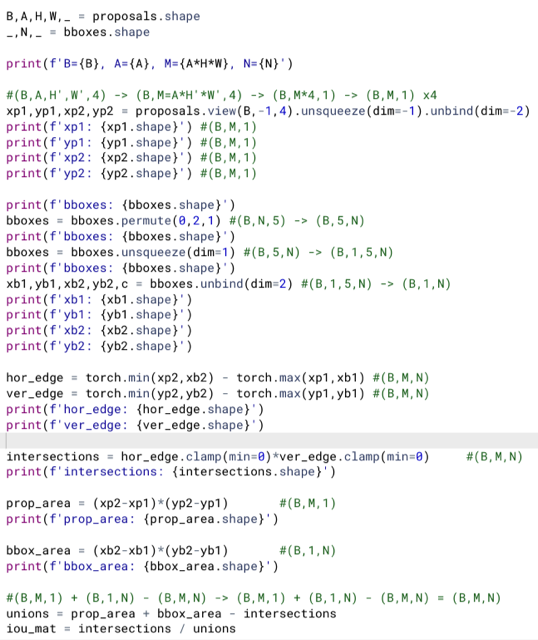</kbd></p>

<p align="center"><kbd>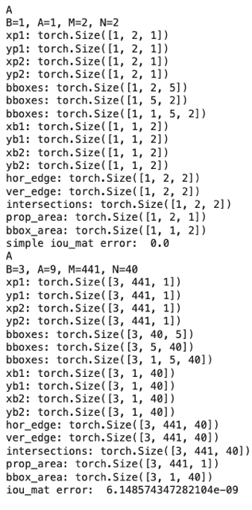</kbd></p>

<p align="center"><kbd></kbd></p>

<p align="center"><kbd></kbd></p>

<p align="center"><kbd>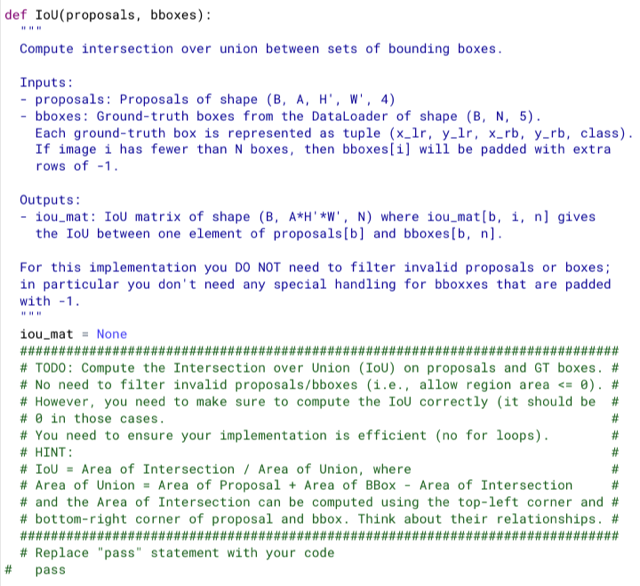</kbd></p>

> [!NOTE]
> Function này ta sẽ tự làm lại IoU, take input là các proposal regions
> (B,A,H',W',4) tức là: Như đã biết, mỗi anchor box sẽ được model predict
> một transformation để transform thành một proposal region. Và bbox:
> ground truth bounding box (B,N,4).
>
>
> Ta sẽ tính ra chỉ số IoU của mỗi proposal với mỗi gt box.
> Vậy đầu tiên gom lại hết A,H',W' để có `(B,M=A*H'*W',4):` mang ý nghĩa
> là không cần quan tâm anchor box của `/` gắn với location nào, chỉ còn là
> mỗi image có M anchor box, cũng là M proposal.
>
> Thì thông qua các function unsqueeze, unbind ta cũng tách ra các gía
> trị xp1, yp1, xp2, yp2 riêng lẻ. Mỗi cái có shape là (B,M,1).
>
> Tương tự với bbox, ta cũng tách ra. Nhưng trước hết ta sẽ chuyển
> (tranpose, bằng function permute) (B,N,5) thành (B,5,N). Để sau khi
> tách, ta có xb1,yb1,xb2,yb2,class là các tensor (B,1,N)
>
> Thế thì ta sẽ tính intersection của mỗi proposal và mỗi bbox. Như kinh 
> nghiệm bữa trước, chỉ việc tính độ dài cạnh của intersection bằng cách
> tọa độ của thằng nhỏ hơn trong hai cái `Bottom-Right` corner 
> trừ thằng lớn hơn trong hai cái `Top-Left.` (nói khó hình dung, nhìn hình là hiểu)
> với chú ý là không lấy giá trị âm (bằng function `clamp(min=0)`
>
> Khi đó, cộng với broadcasting, ta sẽ có tensor intersection (B,M,N).
> Rồi, chỉ việc tính unions bằng tổng diện tích trừ intersection là xong.

> [!NOTE]
> You should see errors on the
> order of `1e-8` or less.

> [!NOTE]
> Checked!

<br>

<a id="node-1614"></a>

<p align="center"><kbd>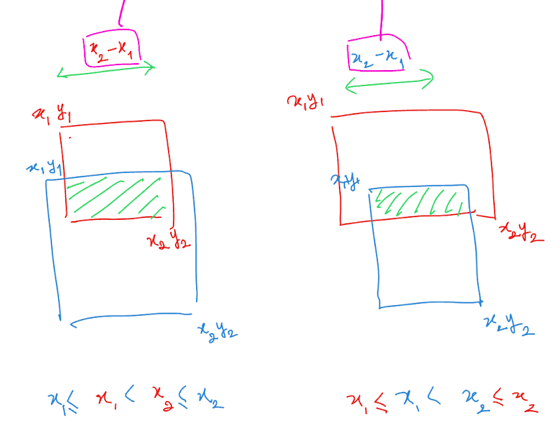</kbd></p>

<p align="center"><kbd>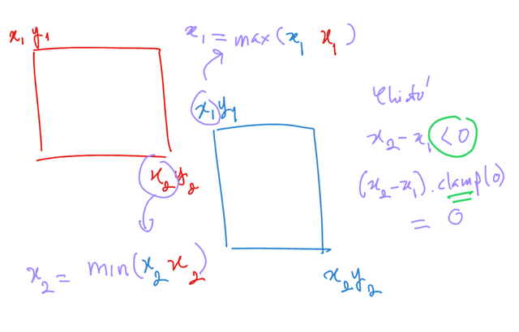</kbd></p>

<p align="center"><kbd></kbd></p>

<p align="center"><kbd></kbd></p>

<p align="center"><kbd>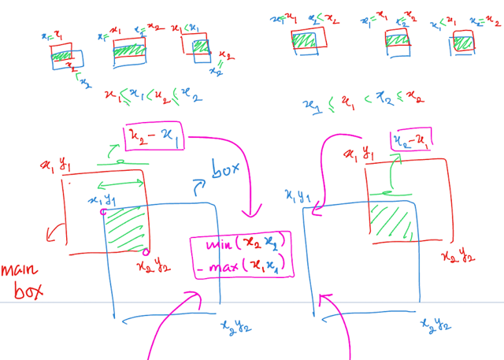</kbd></p>

> [!NOTE]
> Lúc đầu làm chia ra các trường hợp, nhưng sau đó với gợi ý của gpt
> Ta có thể làm đơn giản hơn với min, max: Vì cuối cùng các trường hợp
> đều quy về là min (của x2 đỏ, x2 xanh) `-` max (của x1 đỏ và x1 xanh) 
> và clamp(0) để handle các trường hợp mà kết qủa ra âm (tức là không
> có intersection)

<br>

<a id="node-1615"></a>

<p align="center"><kbd>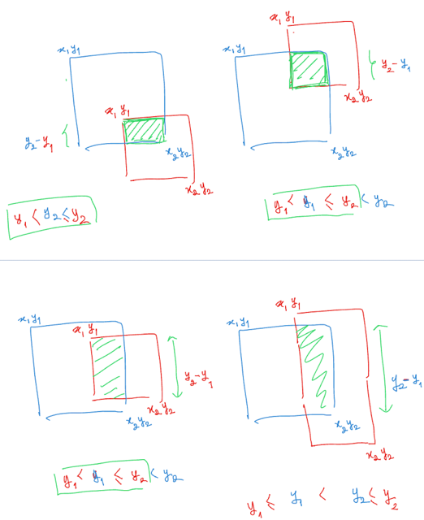</kbd></p>

> [!NOTE]
> tương tự, với y cũng vậy, không cần chia trường hợp,
> mà dùng min, max, clamp sẽ gọn hơn

<br>

<a id="node-1616"></a>

<p align="center"><kbd>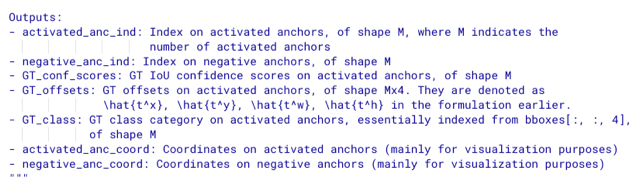</kbd></p>

<p align="center"><kbd></kbd></p>

<p align="center"><kbd>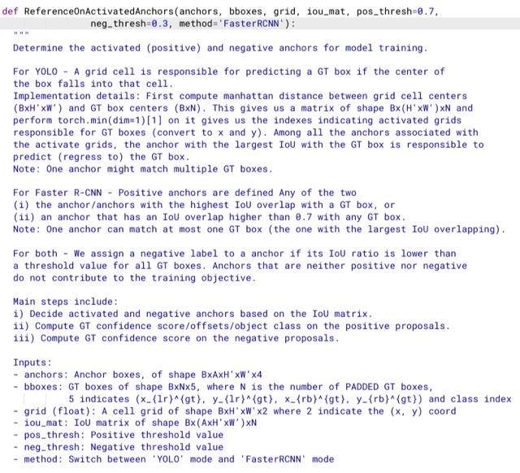</kbd></p>

> [!NOTE]
> Bước tiếp theo sẽ làm việc ta gán cho mỗi proposal (cũng là mỗi anchor) một target `-` để mà supervise cho quá trình
> training. Target đó đương nhiên là một ground truth box. 
>
> `====`
>
> **Thì theo YOLO**, **một grid cell, sẽ chịu trách nhiệm cho việc dự
> đoán (regress to) sẽ gán một  gt box** nếu như **tâm của gt box đó nằm trong phạm vi của grid cell**đó.
>
> Thế thì họ đã làm giúp function làm cái việc đó ở đây, (cũng như ở v2022) và chỉ yêu cầu ta đọc hiểu. Đầu tiên ý tưởng
> chính là ta sẽ tìm ra cho mỗi anchor box, thì tâm của nó, rơi vào grid cell nào. Đương nhiên**tâm của một anchor box sẽ
> chỉ rơi vào một grid cell duy nhất**, và ta **có thể tìm bằng cách xem thử trong các grid cell thì cái nào có tâm gần với
> tâm của gt box nhất**.
>
> Với ý tưởng đó, bước tính toán đầu tiên ta sẽ tính khoảng cách của mỗi anchor box center (grid point) với mỗi center của
> gt box theo L1 distance. Có mỗi sample, có `M=A*H'` *W' anchor box, và N gt box. Nên các distance sẽ làm thành matrix
> M,N. Tính luôn cả batch thì (B,M,N).
>
> Thế thì họ nói ta sẽ `min(dim=1),` tương đương nếu làm cho 1 sample thì sẽ là `min(dim=0).` Sẽ là tìm min của mỗi cột, mà
> mỗi cột j sẽ là distance của các location 1,2...M với anchor box j. Nên kết quả sẽ cho ra vector N giá trị mà mỗi phần tử j
> sẽ là khoảng cách của cái  location (grid point) gần nhất với cái gt box j.
>
> Thì từ đó cho ta biết được với một GT box, grid cell nào sẽ chứa center của nó, hoặc có thể hiểu theo cách khác, **rằng
> trong số các grid cell thì những cái nào là "có chứa" một GT box center**, thì đó **sẽ được gọi là các "activated grid"**,
> bởi chỉ có những cái grid cell này sẽ "chịu trách nhiệm" cho việc predict ra gt box, hay có tham gia vào quá trình training.
>
> Thế thì ta nhớ tại một grid cell, sẽ có A anchor. Vậy nên cái rule tiếp theo đó là **trong số các anchor của cái activated grid
> cell, thì cái nào có IoU với GT box lớn nhất** sẽ chịu trách nhiệm cho việc regress ra GT box. Tóm lại có hai ý, một là
> trong số các**grid cell thì cái nào chứa gt box**, thì nó sẽ "tham gia", activated. Và hai là, t**rong số các anchor box của
> activated grid thì cái nào có IoU lớn nhất**, thì nó sẽ được gắn label `/` target là GT box để mà supervised cho việc learning
>
> Từ đây ta có thể hiểu cái chú ý của họ cho rằng một anchor có thể match với nhiều gt box. Đúng vậy, hai rule trên không
> ngăn cản một anchor có thể "có" nhiều gt box
>
> `====`
>
> Còn với **Faster R-CNN**, cái rule hơi khác, (ta đã biết qua ở part 2 "v2022") đó là nó sẽ gán một GT box cho một anchor
> nếu anchor đó **THỎA MỘT TRONG HAI ĐIỀU KIỆN** 
>
> 1: **IoU với gt box nào đó lớn hơn một threshold 0.7.**
>
> 2: **Là cái có IoU lớn nhất trong số những IoU của các anchor với một gt box nào đó.**(có nghĩa là **với một gt box**,
> thì **cái anchor có iou lớn nhất với nó sẽ mặc định được activated**, kể cả giá trị IoU đó không lớn hơn 0.7 cũng đạt yêu 
> cầu. 
>
> ```text
> Cuối cùng, một anchor sẽ được gán cho cái "background box" ([-1,-1,-1,-1,-1]) nếu IoU của nó với
> ```
> mọi GT box đều nhỏ hơn 0.3. Số anchor box còn lại sẽ được gán "Neutral" và những cái này sẽ bị ignore, không tham gia
> vào quá trình training (có nghĩa là training sẽ chỉ có "positive" anchor và "negative" anchor thôi). 
>
> Và chú ý thêm, với Faster  `R-CNN` thì một anchor box sẽ chỉ được match với một GT box thôi, khác với YOLO.
>
> Input sẽ có 
>
> `-` anchors (B,A,H',W',4) mỗi anchor (trong A anchor) của một grid cell (trong H'*W' cell) của một sample (trong B 
> sample) sẽ là một XYXY 4D vector. 
>
> `-` bboxes (B,N,5): mỗi GT box (trong N gt box) của một sample sẽ là một vector (XYXY, 
> class id), đương nhiên như đã biết không phải sample image nào cũng có N object box, mà N sẽ là số object lớn nhất của 
> ```text
> một hình nào đó trong batch, thì những cái image có số object ít hơn số đó sẽ được pad (với [-1,-1,-1,-1,-1])
> ```
>
> `-` grid (B,H',W',2): coordinates của các grid cell
>
> `-` hai giá trị positive threshold, và negative threshold. (Chú ý là function này họ sẽ implement cho cả YOLO và Faster RCNN)
> nên hai cái threshold này là để dùng cho việc quyết định một anchor box là `positive/neutral/negative` theo Faster RCNN
>
> Output sẽ là:
>
> `activated_anc_ind:` tensor chứa index của những activated anchor, chỉ là một vector (M,) M là tổng số activated anchor.
>
> `negative_anc_ind:` tensor chứa index của các negative anchor, ở đây ghi là cũng size M, nhưng có lẽ phải khác M ở trên,
> vì số negative anchor đâu có nhất thiết phải bằng số activate anchor, trừ khi ý họ đang nói đến vụ sampling để mà tạo sự
> cân bằng giữa `positive/negative` anchor. Có lẽ là vậy rồi.
>
> `GT_conf_scores:` GT IoU confidence scores của các activated anchors: Như đã biết, model sẽ dự đoán ra tại mỗi grid cell
> 3 thứ: Đầu tiên cho mỗi một anchor, 2 thứ: `object-ness` confidence score, đại khái là xác suất rằng anchor đó là một object 
> là bao nhiêu, và box regression (4 giá trị tx,ty,tw,th giúp transform anchor thành gt box). Vậy để supervised learning, đương 
> nhiên phải có target cho objectness confidence score, đó chính là ground truth confidence score.
>
> Và một cái thứ 3 là model dự đoán ra `num_classes` giá trị class probabilities cho mỗi grid cell, để đoán grid cell đó thuộc
> Class gì.
>
> `GT_offsets,` tương tự đây sẽ là target để supervised cho box regression nói trên.
>
> `GT_class:` cái này đương nhiên sẽ target cho classification

<br>

<a id="node-1617"></a>

<p align="center"><kbd>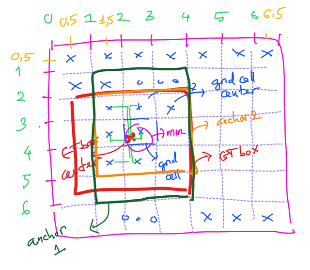</kbd></p>

<p align="center"><kbd></kbd></p>

<p align="center"><kbd>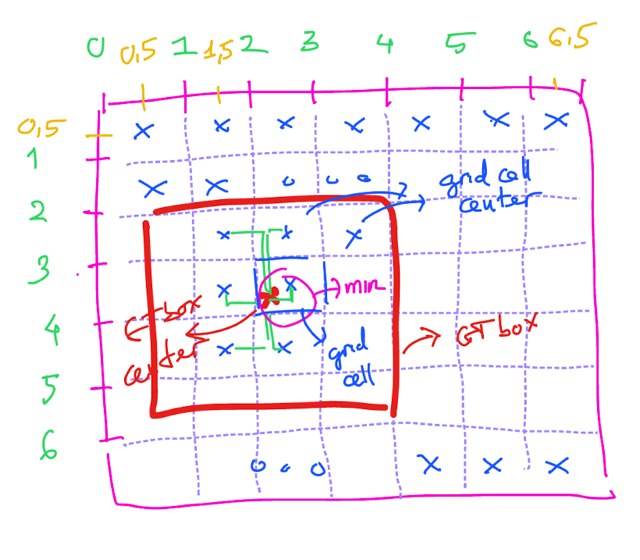</kbd></p>

> [!NOTE]
> đương nhiên để tìm xem với một GT box, tâm của nó "lọt" trong
> grid cell nào thì ta sẽ xem grid cell nào có center gần với GT box
> center nhất

> [!NOTE]
> và trong các anchor của activated grid cell thì cái nào có IoU
> với GT box lớn nhất sẽ được chịu trách nhiệm `-` được gán
> target

<br>

<a id="node-1618"></a>

<p align="center"><kbd>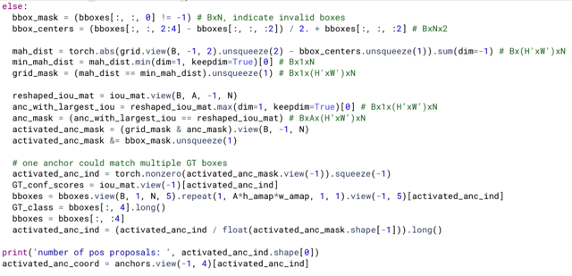</kbd></p>

<p align="center"><kbd>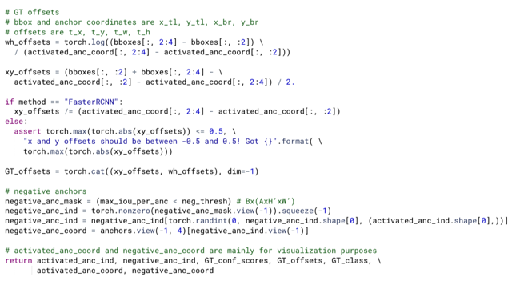</kbd></p>

<p align="center"><kbd></kbd></p>

<p align="center"><kbd></kbd></p>

<p align="center"><kbd>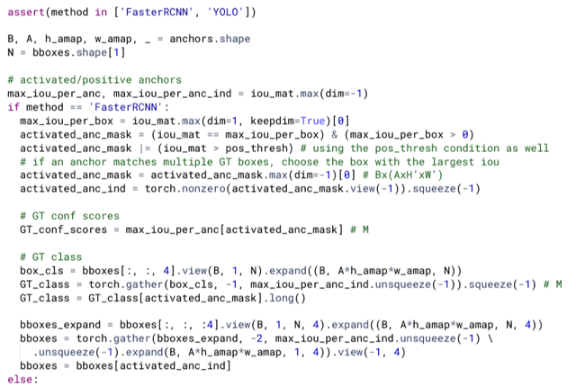</kbd></p>

<br>

<a id="node-1619"></a>

<p align="center"><kbd>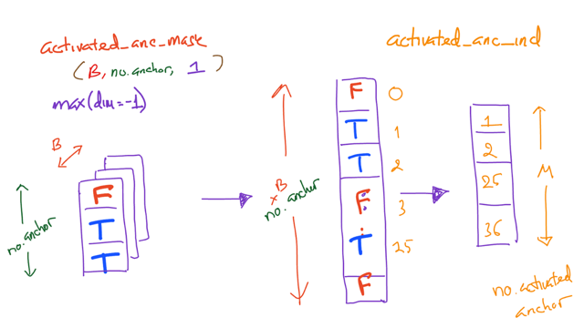</kbd></p>

<p align="center"><kbd>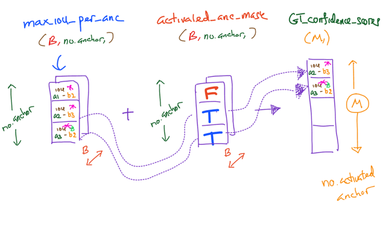</kbd></p>

<p align="center"><kbd>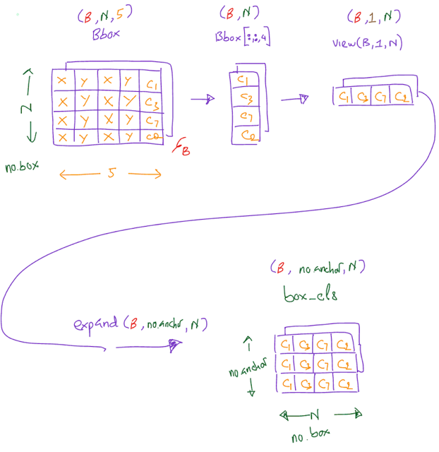</kbd></p>

<p align="center"><kbd>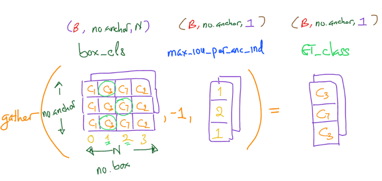</kbd></p>

<p align="center"><kbd>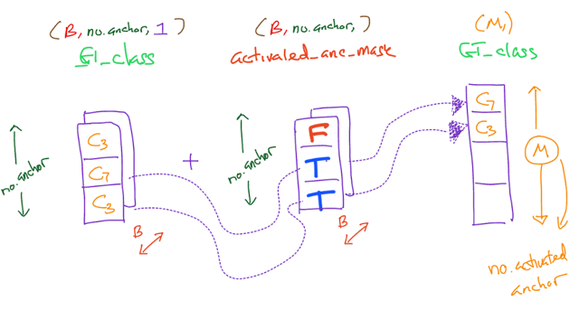</kbd></p>

<p align="center"><kbd>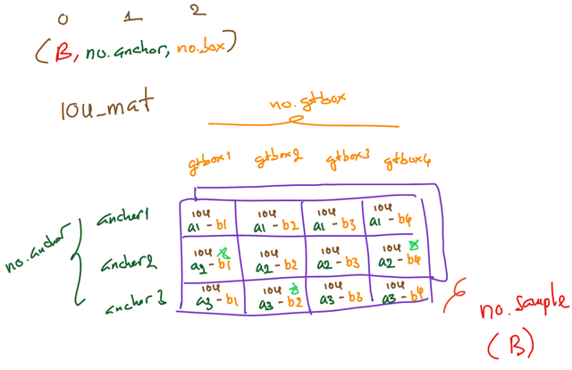</kbd></p>

<p align="center"><kbd>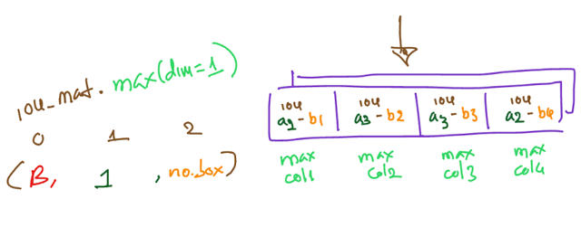</kbd></p>

<p align="center"><kbd>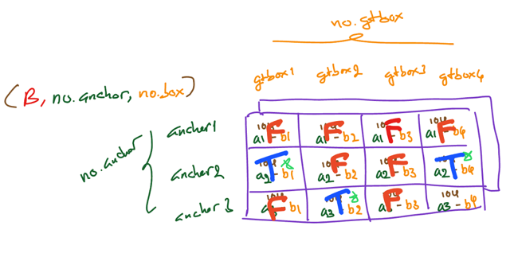</kbd></p>

<p align="center"><kbd>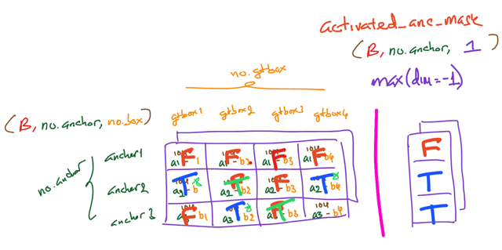</kbd></p>

<p align="center"><kbd>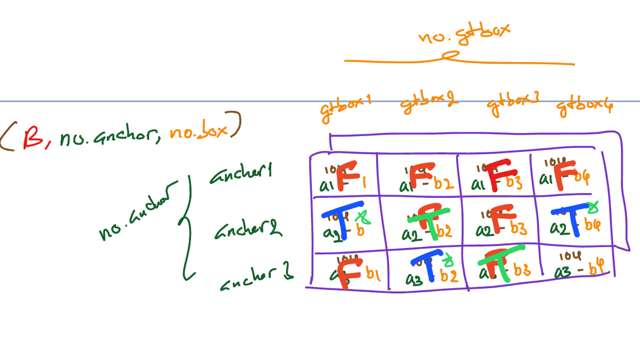</kbd></p>

<p align="center"><kbd></kbd></p>

<p align="center"><kbd></kbd></p>

<p align="center"><kbd></kbd></p>

<p align="center"><kbd></kbd></p>

<p align="center"><kbd></kbd></p>

<p align="center"><kbd></kbd></p>

<p align="center"><kbd></kbd></p>

<p align="center"><kbd></kbd></p>

<p align="center"><kbd></kbd></p>

<p align="center"><kbd></kbd></p>

<p align="center"><kbd>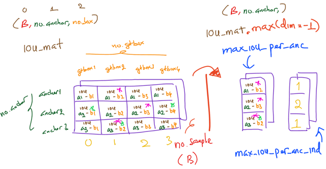</kbd></p>

> [!NOTE]
> **iou_mat** (B, số anchor `(=AxH'xW'),` số gt box): Mỗi sample, ta có **một matrix IoU** của**mỗi anchor với mỗi box**, có "số anchor" hàng, và "số gt box" cột. Và ở dưới **khi nói cột hay
> hàng ta sẽ hiểu là đang xét từng matrix** trong B matrix. (Trong hình minh họa, có các vị trí
> đánh dấu sao màu xanh là lớn nhất trong mỗi cột, và màu hồng là lớn nhất trong mỗi hàng)

> [!NOTE]
> **max_iou_per_anc, `max_iou_per_anc_ind` `=` iou_mat.max(dim=-1)**
>
> Vậy lấy max dim `=` `-1` sẽ cho ta cái gì? `->` Trong mỗi hàng lấy ra phần tử lớn nhất, kết
> qủa có  shape (B, số anchor): **Với mỗi sample, ta được một (column) vector (số
> anchor, 1)** mà phần tử thứ i, s**ẽ là iou lớn nhất trong số các iou của anchor thứ i với
> các gt box**, (nên đặt tên là **max_iou_per_anc**),
>
> Đồng thời nó cũng trả ra cho ta**index của cái gt box mà ứng với cái iou lớn nhất** đó
> (**max_iou_per_anc_ind**)
>
> Tóm lại **với mỗi anchor, ta có iou lớn nhất trong số những iou của nó với các gt box**

> [!NOTE]
> # GT class
>
> ```text
> box_cls = bboxes[:, :, 4].view(B, 1, N).expand((B, A*h_amap*w_amap, N))
> ```
>
> Bboxes là tensor (B,N,5) mỗi sample có N bbox, represent bởi 5D vector: [XYXYC]
> Lấy phần tử thứ 5 ứng với class id, của mỗi vector (B,N,5) `->` (B,N)
>
> Reshape nó thành (B,1,N) và dùng expand để "copy" thành no.ancho "cái"
> `->` (B, no.anchors, N): Với mỗi anchor là vector N giá trị class id ứng với N bbox

> [!NOTE]
> Tiếp theo là "làm theo Faster `R-CNN` rule" trước, như đã nói ở trên, **một anchor box
> sẽ được "match" với một GT box nếu như nó là "cái" có IoU lớn nhất trong những
> cái đạt chuẩn** `-` tức có IoU với GT box đó lớn hơn chuẩn trên. Còn nếu một anchor
> box mà **IoU của nó với mọi GT box đều bé hơn chuẩn dưới thì nó sẽ được gán là  "
> background box"**. Còn lại thì là neutral box.
>
> Vậy thì trước khi bắt đầu phân tích cách làm thì ý tưởng đại khái là, với cái `iou_mat`
> thể hiện iou của mọi anchor và mọi box, ta sẽ**tạo cái mask để kiểu như đánh dấu
> các hàng (ứng với anchor) đạt yêu cầu** là****1.**Có iou (với một gt box nào đó) lớn hơn chuẩn trên** 
>
> HOẶC, 
>
> 2.**Là cái có IoU lớn nhất trong mọi iou của các anchor với một gt box**. 
>
> Vậy thì đầu tiên ta sẽ lọc cái ý 2, **lấy cái anchor có iou lớn nhất với mỗi box**, cái này
> theo điều kiện 2 thì luôn được activated, dù giá trị iou đó chưa chắc đã lớn hơn chuẩn
> trên, (những ít nhất phải yêu cầu nó dương, vì lớn nhất mà âm cũng ko dc)
>
> Nên ta thấy đầu tiên họ lấy **iou_mat.max(dim=1, keep_dim=True)** để lấy **gía trị
> max của mỗi cột** `->` **(B, 1, số gt box)**.****Mang ý nghĩa là:
>
> Với mỗi sample ta có **một row vector (1, số gt box)** mà **phần tử thứ j sẽ là giá trị
> iou lớn nhất trong số các iou của các anchor box với gt box thứ j đó**gọi nó là
> ```text
> \/max_iou_per_box\/)
> ```
>
> Again, function này cũng trả ra cho ta row vector các index của cái anchor tương ứng
> với cái max iou đó, nhưng ta không cần nó nên chỉ lấy phần giá trị thôi ([0])

> [!NOTE]
> Thế thì tiếp theo họ mới tạo cái **activated_anc_mask** dựa theo các điều kiện:
>
> ```text
> 1. (iou_mat == max_iou_per_box) & (max_iou_per_box > 0):
> ```
>
> (B, số anchor, số gt box) `==` (B, 1, số gt box)  `->` (B, số anchor, số box)
>
> (B, 1, số gt box) > 0  `->` (B, 1, số box)
>
> `=>` (B, số anchor, số box) & (B, 1, số box) `=` (B, số anchor, số box)
>
> Bước này nôm na là ta lấy cái hàng **max_iou_per_box**, đem copy thành nhiều hàng (
> số lượng là no. anchor) để thành cái bảng (matrix) shape (no. anchor, no. box). Để rồi
> so sánh nó với `iou_mat` để xem ở mỗi vị trí (ứng với một cặp `anchor-gt` box), thì chỗ nào
> có iou max và dương. Trong hình minh họa, những chỗ có dấu sao màu xanh là giá trị 
> max ở mỗi cột, nên kết quả của `activated_anc_mask` ở bước này là cái matrix `True/False`
> cùng kích thước trong đó chỗ ứng với vị trí max sẽ là True, còn lại là False (giả sử mấy
> cái max iou ở mỗi cột đều dương)
>
> Kết qủa là tạo cái mask shape (B, số anchor, số box) cho biết **chỗ nào (trong mỗi cột) là
> vị trí cái anchor box mà có iou lớn nhất và giá trị này dương**

> [!NOTE]
> Tiếp theo, ta sẽ làm theo điều kiện 1, tạo cái mask đánh dấu thêm những cặp `anchor-gt`
> box có iou lớn hơn chuẩn trên `(iou_mat` > `pos_thres)`
>
> Để rồi thông qua `"|=",` ghép nó với cái mask **activated_anc_mask** hiện tại, để kết quả
> sẽ được mở rộng: cái mask sẽ**đánh dấu những vị trí có iou max** `+` dương **HOẶC**
> là có**iou đạt chuẩn trên**Trong hình minh họa, những chữ T màu xanh lá cây ý là những chỗ có iou lớn hơn
> `pos_threshold`

> [!NOTE]
> **activated_anc_mask `=` activated_anc_mask.max(dim=-1)[0]** `->` (B, số anchor): Lấy giá trị 
> lớn nhất của một hàng, mà với cái mask này các ô đều là True hoặc False, nên kết qủa là ta 
> sẽ có một vector cột, mang giá trị 1 hoặc 0, với ý nghĩa là:
>
> **Tại hàng `/` phần tử `/` thứ i, tương ứng với cái anchor thứ i thì có chỗ nào trong hàng
> là True không, nếu có thì thể hiện rằng cái anchor box i đó ít nhất cũng thỏa một trong
> hai điều kiện, đó là nó là cái có iou max của một gt box nào đó HOẶC nó là cái có iou
> với một gt bõ nào đó lớn hơn chuẩn trên**Ngược lại nếu phần tử tại hàng i `=` False, có nghĩa là cái anchor tại đó không thỏa mãn điều 
> kiện nào.
>
> Chú ý again, là `activated_anc_mask.max(dim=-1)` vốn sẽ trả cho mình giá trị max, và index 
> của cái cột có giá trị max. Ta chỉ quan tâm cái " giá trị thôi" nên chỉ lấy cái đầu [0]

> [!NOTE]
> **activated_anc_ind `=` torch.nonzero(activated_anc_mask.view(-1)).squeeze(-1)** : Đầu tiên
> với **view(-1)**, chính là **flatten cái tensor (B, no. anchor) thành vector (B * no. anchor,)**
> mang ý nghĩa là không còn care anchor của sample nào nữa, gom lại hết chung trong một
> batch. 
>
> Sau đó, họ mới dùng function **torch.nonzeron()**, để nó**trả ra các index của vector trên
> mà giá trị tại đó khác 0**. Có nghĩa là, giả sử trong tổng số B*no. anchor giá trị, có M giá trị
> khác 0, thì function này sẽ trả ra vector có M phần tử, mỗi phần tử là**index của phần tử khác
> 0 đó.**
>
> Kết qủa này có shape (M,1), thì lệnh**squeeze(-1)** sẽ chuyển nó thành vector (M,)

> [!NOTE]
> **GT_conf_scores `=` max_iou_per_anc[activated_anc_mask]** # M:
>
> **Apply cái `activated_anc_mask` vào cái  max_iou_per_anc** (cả hai cái đều có shape
> (B, no. anchor) sẽ cho ra một vector có M phần tử, M là số vị trí mang giá trị True, mang
> ý nghĩa là **vector các gía trị** **iou của các activated anchor với gt box tương ứng của
> nó.  Và đây được dùng để làm ground truth confidence score.**Ta hiểu như vầy:
>
> Đầu tiên, **max_iou_per_anc** là gì, nó cho biết **với mỗi anchor box, giá trị iou lớn nhất
> của nó với các gt box là gì**.
>
> Còn **activated_anc_mask**, thì nó là cái mask, **đánh dấu vị trí nào là một anchor
> activated**.
>
> Thành ra, kết quả của việc apply cái mask sẽ là ta có: **các giá trị iou (lớn nhất trong số
> các iou với các gt box) của các activated ancho**r. Hay  nói cách khác, ta có **danh sách
> với mỗi activated anchor thì iou lớn nhất của nó trong số mọi iou của nó với các gt box**.
>
> Thế thì để hiểu**tại sao cái này lại là ground truth confidence score** thì ta liên hệ lại rule
> của Faster RCNN, đó là, **một anchor sẽ được assign với một gt box** nếu nó **có iou với gt
> box lớn hơn chuẩn trên** HOẶC là cái có iou lớn nhất trong nhiều cái với một gt box. 
>
> Vậy ta nói mình gán anchor box với một gt box thì có nghĩa là gì, ta sẽ dùng cái
> gt box đó để supervise cho việc training ra một transformation giúp `convert/transform` cái
> anchor box thành ra cái gt box, và cũng supervise cho việc training model dự đoán ra
> xác suất cái anchor đó là một object, thì trong bước này, n**gười ta dùng iou của anchor
> box với cái gt box "của nó" để làm target.**

> [!NOTE]
> ```text
> GT_class = torch.gather(box_cls, -1, max_iou_per_anc_ind.unsqueeze(-1)) .squeeze(-1) #
> ```
> M
>
> Function này dùng lệnh gather kiểu như giúp, dựa vào max iou per anchor index để lấy ra
> **cái class id của cái gt box có iou max cho mỗi anchor**. Nói gọn hơn, từ việc mỗi anchor
> đang gắn với vector N class id của N anchor box thì giờ ta sẽ **chỉ giữ cái class id của cái gt
> box có iou với nó lớn nhất thôi**

> [!NOTE]
> ```text
> GT_class = GT_class[activated_anc_mask].long()
> ```
>
> Cuối cùng ta apply cáo `activated_anc_mask,` để **chỉ còn giữ những activated anchor** 
>
> (M,): Giá trị class id (của gt box của nó) cho mỗi activated anchor

> [!NOTE]
> với Faster `R-CNN,` cái rule hơi khác, (ta đã biết qua ở part 2 "v2022") đó là nó sẽ gán một GT box
> cho một anchor nếu anchor đó THỎA MỘT TRONG HAI ĐIỀU KIỆN
>
> 1: IoU với gt box nào đó lớn hơn một threshold 0.7.
>
> 2: Là cái có IoU lớn nhất trong số những IoU của các anchor với một gt box nào đó. (có nghĩa là
> với một gt box, thì cái anchor có IoU lớn nhất với nó sẽ mặc định được activated, kể cả giá trị IoU
> đó không lớn hơn 0.7 cũng đạt yêu  cầu.
>
> ```text
> Cuối cùng, một anchor sẽ được gán cho cái "background box" ([-1,-1,-1,-1,-1]) nếu IoU của nó với
> ```
> mọi GT box đều nhỏ hơn 0.3. Số anchor box còn lại sẽ được gán "Neutral" và những cái này sẽ bị
> ignore, không tham gia vào quá trình training (có nghĩa là training sẽ chỉ có "positive" anchor và "
> negative" anchor thôi)

> [!NOTE]
> `activated_anc_ind`

> [!NOTE]
> `GT_conf_scores`

> [!NOTE]
> `activated_anc_ind`

> [!NOTE]
> `GT_class`

> [!NOTE]
> FASTER RCNN

<br>

<a id="node-1620"></a>

<p align="center"><kbd>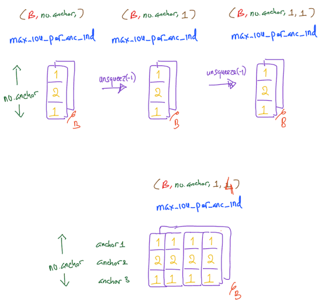</kbd></p>

<p align="center"><kbd>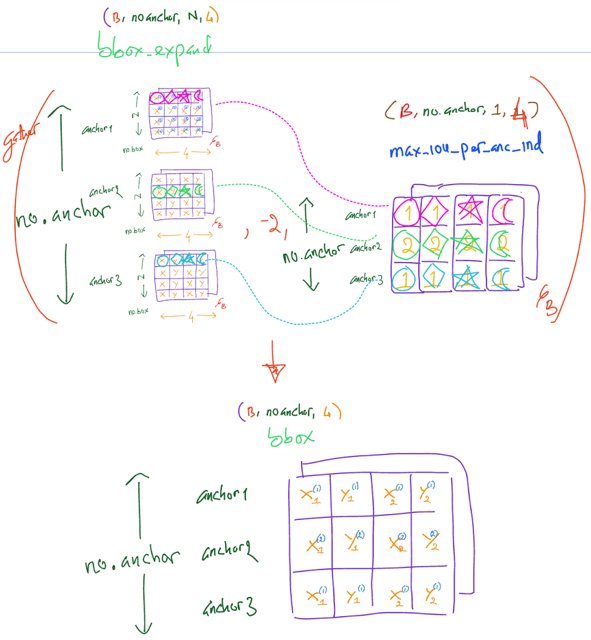</kbd></p>

<p align="center"><kbd>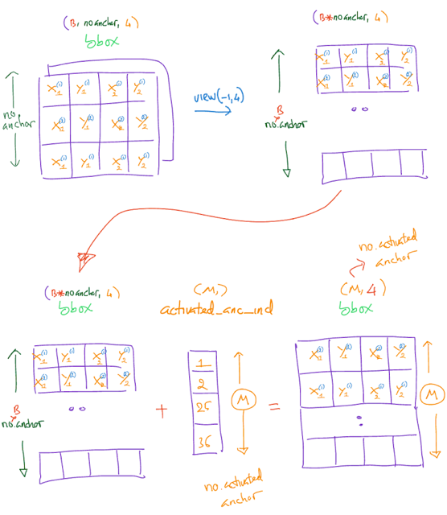</kbd></p>

<p align="center"><kbd></kbd></p>

<p align="center"><kbd></kbd></p>

<p align="center"><kbd></kbd></p>

<p align="center"><kbd>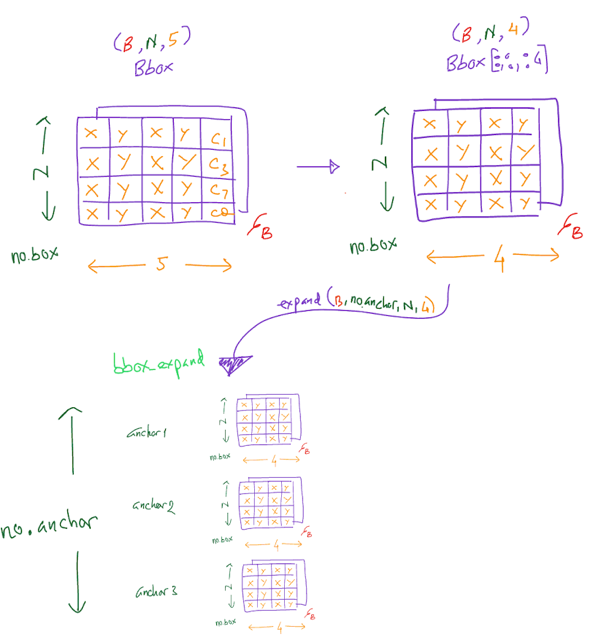</kbd></p>

> [!NOTE]
> ```text
> bboxes_expand = bboxes[:, :, :4].view(B, 1, N, 4).expand((B, A*h_amap*w_amap, N, 4))
> ```
>
> (B, N, 5) `->` (B, N, 4) `->` (B, 1, N, 4) `->` (B, no. anchor, N, 4): Mỗi anchor có một bộ N vector
> ,mỗi vector là  4 tọa độ của anchor.

> [!NOTE]
> ```text
> max_iou_per_anc_ind.unsqueeze(-1).unsqueeze(-1)
> ```
>        .expand(B, `A*h_amap*w_amap,` 1, 4))
>
> Hai lần unsqueeze: (B, no.anchor) `->` (B, no.anchor, 1) `->` (B, no.anchor, 1, 1) 
>
> Expand: `->` (B, no.anchor, 1, 4)
>
> Ý nghĩa: mỗi anchor, có 1 index của cái box mà iou của cái anchor với box đó là 
> lớn nhất trong các box. Ví dụ với anchor 1, cái box có  iou lớn nhất với nó là cái 
> box số 1.
>
> Ta mới replicate cái index này thành 4 lần.

> [!NOTE]
> ```text
> bboxes = torch.gather(bboxes_expand, -2, max_iou_per_anc_ind.
> ```
> ```text
> unsqueeze(-1).unsqueeze(-1).expand(B, A*h_amap*w_amap, 1, 4)).
> ```
> `view(-1,` 4)
>
> Lệnh gather này sẽ: Cho mỗi anchor, như đã nói sẽ có một gt box mà iou của
> anchor với gt box đó là lớn nhất trong mọi gt box. Ta gọi là cái "gt box của nó"
> đi, thì dòng code này sẽ lấy ra tọa độ của cái gt box "của mỗi anchor".
>
> Ta thấy cái `mã_iou_per_anc_ind` (sau khi expand các kiểu như hình trên) sẽ
> giúp đóng vai trò hướng dẫn function gather rằng:
>
> tọa độ gt box "của" anchor 1 sẽ là tọa độ của cái box thứ 1, 
> tọa độ gt box "của" anchor 2 sẽ là tọa độ của cái box thứ 2, 
> tọa độ gt box "của" anchor 3 sẽ là tọa độ của cái box thứ 1
>
> Kết qủa là ứng với mỗi anchor, ta có 4 tọa độ của cái gt box ("của nó")

> [!NOTE]
> Trong hình này thể hiện cái `view(-1,` 4) ở trên, giúp flatten batch
> dim ra, (B, no.anchor, 4) `->` (B*no. anchor, 4).
>
> Sau đó, mới dùng các index của các activated anchor `=` `activated_anc_ind`
> để mà "slicing" (chú ý đây gọi là slicing, không phải apply mask) để có được
> (M, 4) M là số activated anchor: với mỗi activated anchor, là vector 4 tọa độ
> của gt box "của nó"

<br>

<a id="node-1621"></a>

<p align="center"><kbd>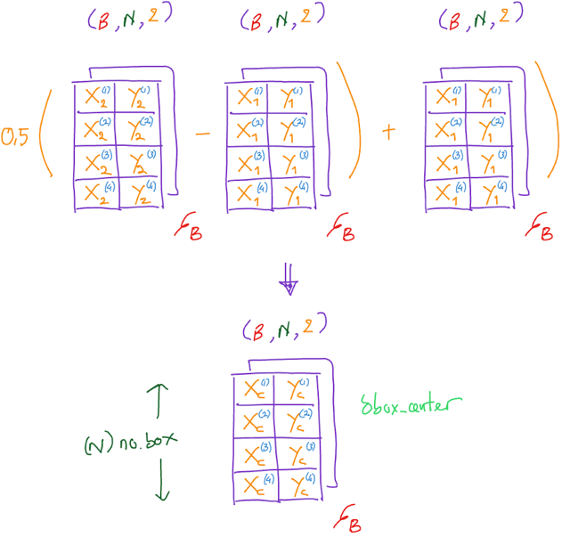</kbd></p>

<p align="center"><kbd>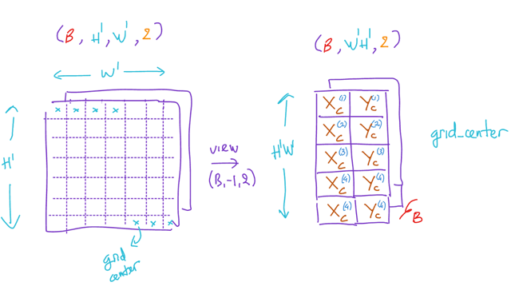</kbd></p>

<p align="center"><kbd>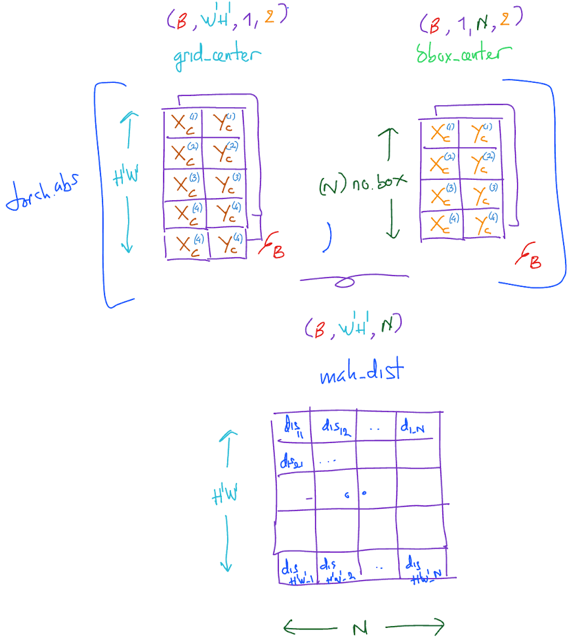</kbd></p>

<p align="center"><kbd>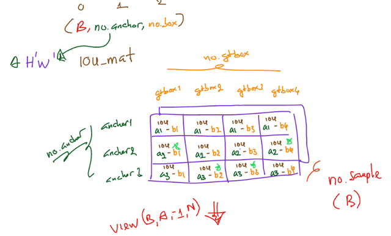</kbd></p>

<p align="center"><kbd>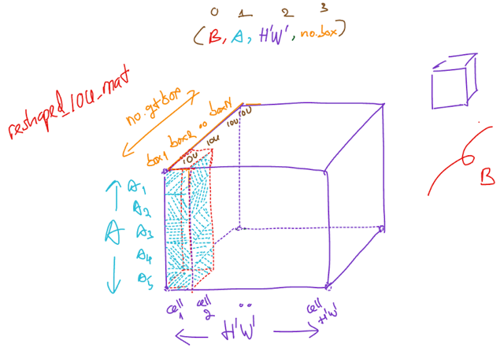</kbd></p>

<p align="center"><kbd>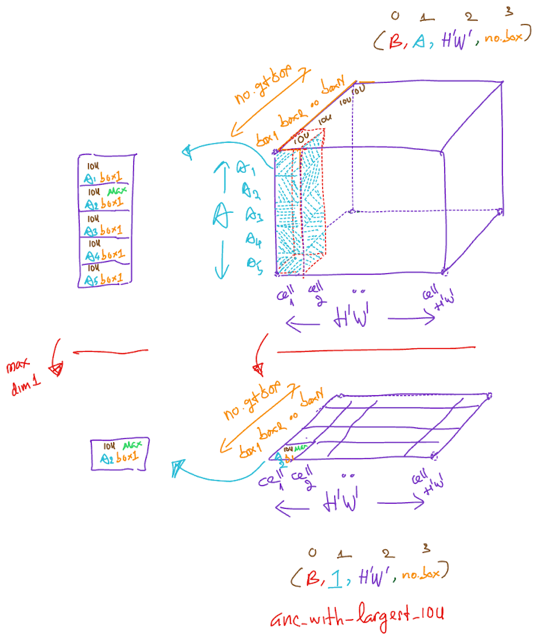</kbd></p>

<p align="center"><kbd>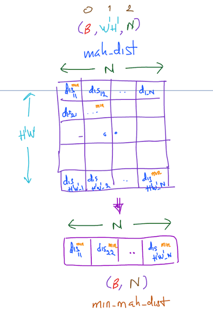</kbd></p>

<p align="center"><kbd>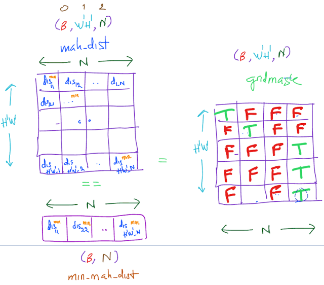</kbd></p>

<p align="center"><kbd></kbd></p>

<p align="center"><kbd></kbd></p>

<p align="center"><kbd></kbd></p>

<p align="center"><kbd></kbd></p>

<p align="center"><kbd></kbd></p>

<p align="center"><kbd></kbd></p>

<p align="center"><kbd></kbd></p>

<p align="center"><kbd></kbd></p>

<p align="center"><kbd>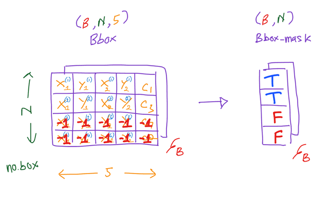</kbd></p>

> [!NOTE]
> ```text
> bbox_mask = (bboxes[:, :, 0] != -1): (B,N,5) -> (B,N)
> ```
>
> tạo cái mask cho biết hàng nào có giá trị đầu tiên là `-1,` mà giá trị  đầu tiên
> tương ứng với x1, thì đại khái là ta nhớ là, N ở đây là  số object box của một
> cái hình nào đó có nhiều object nhất. Ví dụ một batch, có 24 sample (B `=` 24),
> trong đó cái sample có nhiều object nhất có 10 object, thì khi đó N `=` 10, và gt
> box của sample đều được thể hiện là matrix (N,5), thì với những sample có ít
> ```text
> hơn 10 object thì các hàng "dư" sẽ là [-1,-1,-1,-1,-1]. Nên cái bbox_mask này
> ```
> là để đánh dấu với mỗi sample, thì hàng nào là cái "padding row" này
>
> Ví dụ trong hình minh hoạ, N `=` 4, nên cái sample đầu chỉ có 2 object box nên
> ```text
> hai hàng dưới của nó sẽ là [-1,-1,-1,-1,-1]
> ```

> [!NOTE]
> ```text
> bbox_centers = (bboxes[:, :, 2:4] - bboxes[:, :, :2]) / 2. + bboxes[:, :, :2] # BxNx2
> ```
>
> tính ra tọa độ tâm của bbox, dễ hiểu

> [!NOTE]
> **mah_dist** `=` torch.abs(grid.view(B, `-1,` 2).unsqueeze(2) `-` 
> `bbox_centers.unsqueeze(1)).sum(dim=-1)` # Bx(H'xW')xN
>
> `A=` grid.view(B, `-1,` 2).unsqueeze(2) 
> (B, H', W', 2) `->` (B, H'*W', 2) `->` (B, H'*W', 1, 2)
>
> `B=` `bbox_centers.unsqueeze(1)`
> (B, N, 2) `->` (B, 1,N, 2)
>
> `torch.abs(A-B).sum(dim=-1)`
>
> torch.abs[(B, H'*W', 1, 2), (B,1,N,2)] `->` **[B,H'*W', N] 
>
> Ý nghĩa: tính L1 distance giữa mỗi grid center và mỗi bbox center**

> [!NOTE]
> `min_mah_dist` `=` **mah_dist.min(dim=1, keepdim=True)**[0] # Bx1xN
>
> **Tìm min của mỗi cột**, ta có cái nhỏ nhất trong số **các khoảng cách
> các một grid center với mỗi bbox center.
>
> Hay nói cách khác: Với mỗi box center, ta có khoảng cách của cái grid
> center gần với nó nhất, thì đồng nghĩa đó là cái grid cell chứa nó**

> [!NOTE]
> **grid_mask** `=` `(mah_dist` `==` `min_mah_dist).unsqueeze(1)` # Bx1x(H'xW')xN
>
> ```text
> grid_mask = (mah_dist == min_mah_dist): Bx(H'xW')xN
> ```
>
> **Tạo ra cái mask thể hiện với mỗi box, thì grid center nào là gần nó nhất**
> Hay nói cách khác, **cái grid cell nào chứa box center. Như đã nói, với mỗi
> box sẽ chỉ "nằm" trong một grid cell, nen với mỗi box ta có một giá trị là
> true, và grid cell đó gọi là activated grid cell**
>
> ví dụ trong hình, vói bbox 1 (cột thứ 1 trong matrix), thì cái grid center gần nó 
> nhất là grid center 1. 
>
> `grid_mask.unsqueeze(1):` Bx(H'xW')xN `->` Bx1x(H'xW')xN

> [!NOTE]
> ```text
> reshaped_iou_mat = iou_mat.view(B, A, -1, N)
> ```
>
> `->` Reshape (B, no.anchors `=` AH'W', N) `->` (B, A, H'W', N)

> [!NOTE]
> ```text
> anc_with_largest_iou = reshaped_iou_mat.max(dim=1, keepdim=True)[0] # Bx1x(H’xW’)xN
> ```
>
> Lấy max qua dim `=` 1 để mang ý nghĩa là: với mỗi location, giá trị iou lớn nhất của trong A 
> giá trị iou của A anchor tại location đó với một box là bao nhiêu.

> [!NOTE]
> Rule của YOLO: Với mỗi box, cái grid cell nào gần nó nhất thì sẽ là
> activated grid cell.
>
> Sau đó, trong các A anchor tại grid cell, cái nào có iOU với box lớn
> nhất thì sẽ được match với cái box đó

> [!NOTE]
> YOLO

<br>

<a id="node-1622"></a>

<p align="center"><kbd>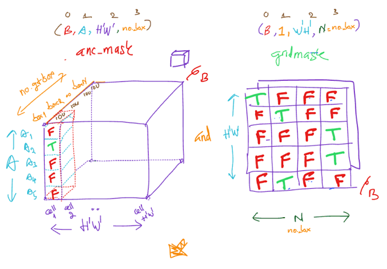</kbd></p>

<p align="center"><kbd>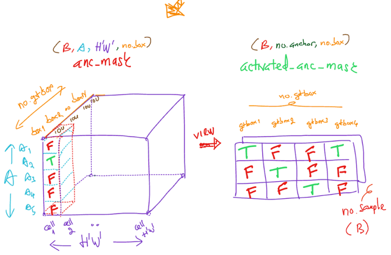</kbd></p>

<p align="center"><kbd>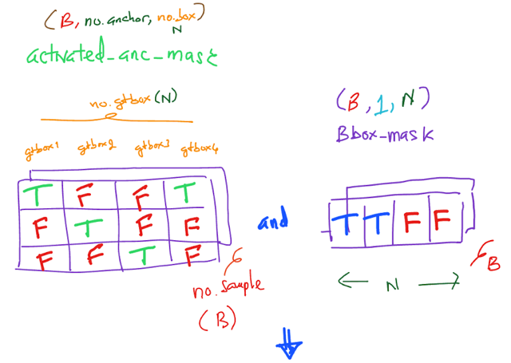</kbd></p>

<p align="center"><kbd>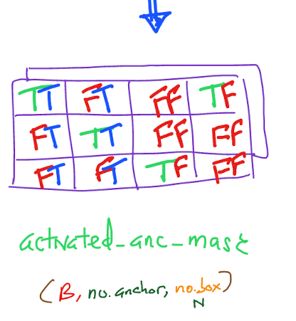</kbd></p>

<p align="center"><kbd>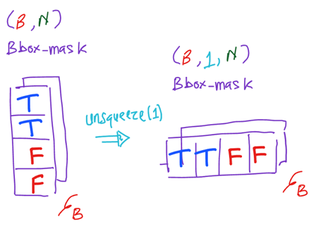</kbd></p>

<p align="center"><kbd>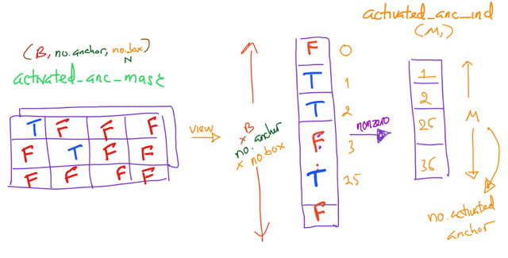</kbd></p>

<p align="center"><kbd>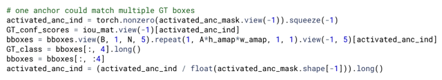</kbd></p>

<p align="center"><kbd></kbd></p>

<p align="center"><kbd></kbd></p>

<p align="center"><kbd></kbd></p>

<p align="center"><kbd></kbd></p>

<p align="center"><kbd></kbd></p>

<p align="center"><kbd></kbd></p>

<p align="center"><kbd></kbd></p>

<p align="center"><kbd>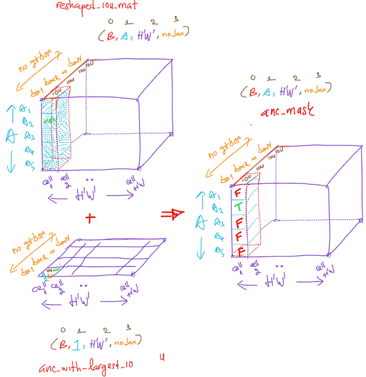</kbd></p>

> [!NOTE]
> ```text
> anc_mask = (anc_with_largest_iou == reshaped_iou_mat) # BxAx(H’xW’)xN
> ```
>
> Tạo cái mask, đánh dấu **tại một location, trong A anchor tại đó, cái nào có
> iou lớn nhất với box1**, tương tự với box2, box3...
>
> Ví dụ trong hình, tại cell 1, Anchor 2 là cái có iou lớn nhất với box1

> [!NOTE]
> ```text
> activated_anc_mask = (grid_mask & anc_mask).view(B, -1, N)
> ```
>
> ```text
> 1. activated_anc_mask = (grid_mask & anc_mask)
> ```
> (B,A,H'W', N) and (B, 1, H'W', N) `=` (B, A, H'W', N)
>
> `->` **Kết hợp hai cái mask**, thành một, broadcasting ở dim 1, để mang ý nghĩa
>
> Ví dụ với **grid_mask** cho biết đối với một bbox thì một grid cell có phải là activated 
> không (thông qua việc ta xác định tâm của bbox đó có nằm trong grid cell không)
>
> kết hợp thêm **anc_mask cho biết là**: tại grid cell 1, đối với 1 box thì cái anchor nào
> là cái có iou với cái box đó lớn nhất
>
> Ví dụ như trong hình, với box1, thì grid cell 1 là activated. Và trong các anchor tại
> grid cell 1, thì cái có iou lớn nhất với box 1 là cái anchor 2. Thì từ đây, ta sẽ match
> anchor 2 (của grid cell 1) với gt box 1
>
> 2.view(B, `-1,` N)
>
> `->` Reshape từ (B, A, H', W', N) thành (B, no.anchors `=` AH'W', N)

> [!NOTE]
> `bbox_mask.unsqueeze(1)`

> [!NOTE]
> `activated_anc_mask` `&=` `bbox_mask.unsqueeze(1)`
>
> Cập nhật thêm `activated_anc_mask` với `bbox_mask,` mang ý nghĩa là **disable đi
> các pading bbox**.
>
> Ví dụ, với sample 1, chỉ có 2 bbox thôi (là hai cái đầu tiên thôi, còn hai cái kia là "
> pad"). Thành ra, việc kết hợp với `bbox_mask,` sẽ **vô hiệu hóa những "chỗ" ứng
> với box 3, và 4 nếu có  chỗ nào đang True (có nghĩa là cái chỗ đó anchor đang
> được match với một " pad" box) thì ta sẽ disable nó, set nó thành False**

> [!NOTE]
> **activated_anc_ind** `=` `torch.nonzero(activated_anc_mask.view(-1)).squeeze(-1)`
>
> (B, np.anchor, np.box) `->` (B*no.anchor*no.box, )
>
> Ở đây sau khi đã xong **activated_anc_mask**, ta mới **flatten** nó thành
> vector (B*no.anchor*no.box) rồi dùng torch.nonzero() để l**ấy ra những 
> (index) cũng những vị trí có giá trị khác 0 như đã biết.
>
> *Các index sẽ có range 0: B*no.anchor*no.box**

> [!NOTE]
> ```text
> GT_conf_scores = iou_mat.view(-1)[activated_anc_ind]
> ```
>
> Rồi tới đây không cần minh họa nữa, ở đây ta đã flatten `iou_mat` thành (b*no. `anchor*no.box)-D` vector luôn để có
> thể dùng vector `activated_anc_ind` chứa id (range từ 0 tới b*no.anchor*no.box) các activated anchor để có được
> iou của các anchor đó với "gt box của nó".
>
> Đóng vai trò làm ground truth confidence score như tương tự ở case Faster RCNN (tí nữa xem kĩ sẽ thấy thật ra cả
> Part 1 và 2 người ta đều không dùng cái này, mà tạo target value `=` 1 cho positive anchor confidence score, và 0 cho 
> negative anchor)
>
> ```text
> ==========
> ```
>
> ```text
> bboxes = bboxes.view(B, 1, N, 5).repeat(1, A*h_amap*w_amap, 1, 1).view(-1, 5)[activated_anc_ind]
> ```
>
> Reshape bboxes từ (B, N, 5) `->` (B, 1, N, 5), rồi copy với số lượng `=` no.anchor để thành (B, no.anchor, `N=no.box,`
> 5) với ý nghĩa là với mỗi anchor, ta có một bộ `N=no.box` vector, mỗi vector là 5 giá trị XYXYC
>
> Xong, reshape nó `view(-1,5)` để flatten mọi dimension trừ cái cuối, để được (B*no.anchor*N, 5)
>
> Lúc này có thể dùng vector activated anchor box index (chứa M `=` số activated anchor) để slicing giúp ta có tensor
> bboxs (mới) shape (M,5): Mỗi activated anchor gắn với một vector XYXYC
>
> Hay nói cách khác tensor này cho biết tọa độ và class id của cái box của mỗi activated anchor.
>
> ```text
> ===========
> ```
>
>
> `GT_class` `=` bboxes[:, 4].long(): đương nhiên lấy ra vector `(M=số` activated anchor) các giá trị class id của matched box
> `->` thì đây chính là ground truth class id
>
> ```text
> ===========
> ```
>
> bboxes `=` bboxes[:, :4]: `->` (M, 5) `->` (M, 4): chỉ giữa lại các coordinate thôi để có tọa độ của các matched bbox của mỗi
> activated anchor
>
> ```text
> ===========
> ```
>
> Xong xuôi hết, **activated_anc_ind `=` `(activated_anc_ind` `/` float(activated_anc_mask.shape[-1])).long()**
>
> Sau đó dòng này chung cho cả YOLO và Faster RCNN: Lấy ra activated anchor từ anchors tensor bằng 
> activated anchor indices.
>
> **activated_anc_coord `=` `anchors.view(-1,` 4)[activated_anc_ind]**Vậy cái này đại khái là vì với Faster RCNN, xem lại cái hình minh họa lúc tạo ra `activated_anc_ind` sẽ thấy các giá trị
> của nó sẽ có range [0: B*no. anchor], nên "chỉ việc" dùng `activated_anc_ind,` để slicing từ anchors mà thôi.
>
> Nhưng với YOLO thì index có range từ 0: B*no.anchor*no.box, nên ta phải chia đi cho no.boxes `(=` `float(activated_anc_mask.shape[-1])`
> để về lại range [0: B*no.anchor] thì mới slicing được

> [!NOTE]
> `GT_conf_scores`

> [!NOTE]
> `activated_anc_ind`

> [!NOTE]
> `GT_class`

<br>

<a id="node-1623"></a>

<p align="center"><kbd>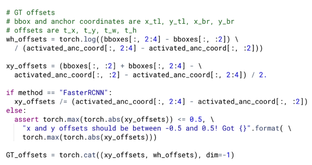</kbd></p>

> [!NOTE]
> Đoạn này chưa đọc kĩ nhưng có thể thấy chỉ là việc chuyển coordinate
> của matched GT box thành GT offset (tx,ty, tw,th) làm target việc predict ra
> transformation thôi

> [!NOTE]
> `GT_offsets`

<br>

<a id="node-1624"></a>

<p align="center"><kbd>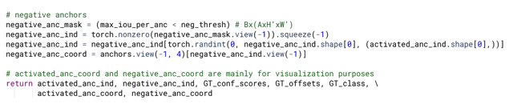</kbd></p>

> [!NOTE]
> Cuối cùng làm gán các negative anchor: 
>
> `max_iou_per_anc` (B, no.anchor) còn nhớ là iou lớn nhất của mỗi anchor box, 
> thì việc so với bé hơn `neg_threshold` sẽ tạo cái mask (B, no.anchor) đánh dấu
> vị trí của anchor nào mà max iou của nó cũng nhỏ hơn `neg_thres.` Thì đó chính
> là negative anchor.
>
> Ta với flatten, và dùng torch.nonzero đến đây đã quen thuộc để mà tạo ra
> vector chứa các index (từ 0: B*no.anchor) của các negative anchor.
>
> Cái bước tiếp theo, chính là việc lấy ra ngẫu nhiên một số lượng bằng với 
> positive (activated) anchor để cân bằng: 
>
> torch.randint(0, `negative_anc_ind.shape[0],` `(activated_anc_ind.shape[0],)` tạo
> ra vector chứa "số activated anchor" các giá trị nằm trong range 0 tới "số negative
> anchors" và dùng vector này để slicing ra một bộ index của negative anchor, 
> và dùng bộ index này để lấy ra các negative anchors.

> [!NOTE]
> `negative_anc_ind`

<br>

<a id="node-1625"></a>

<p align="center"><kbd>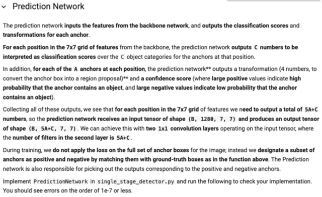</kbd></p>

> [!NOTE]
> Đại khái là Prediction Network sẽ take input là feature từ backbone network,
> và output ra cho classification score và transformation cho mỗi anchor.
>
> Thế thì như đã nói ở phần đầu, ở đây chỉ nhắc lại, đó là, output của backbone
> cnn là 7x7xdepth feature map, thì sau khi qua Prediction Network, nó sẽ
> predict ra 3 thứ:
>
> Với mỗi grid point, predict ra C `=` `num_class` `=` 20 class probabilities:
> probability distrib cho việc grid point đó là "thuộc class gì"
>
> Với mỗi cái trong A anchor tại một grid point, dự đoán ra 5 giá trị bao gồm 4
> giá trị Định nghĩa ra một phép transformation giúp transform cái anchor box
> đó thành object box, và 1 giá trị mang ý nghĩa xác suất rằng cái anchor box
> đó có chứa một object.
>
> Ở ReferenceOnActivatedAnchors vừa mới phân tích ta đã thấy: Target cho
> anchor box transformation là GT offset, được tính toán từ việc lấy cái anchor
> box và cái matched gt box của nó (tức là cái gt box được ghép cho cái anchor
> box đó) và tính anchor chỉ có cần thiết để convert anchor box đó thành gt box,
> thì cái ground truth offset này sẽ supervised cho việc trainning ra box
> transformation.
>
> Còn target cho object probability thì ta cũng đã thấy qua việc phân tích tại khi
> ReferenceOnActivatedAnchors, đó chính là IoU của anchor box với matched
> gt box. Điều này giúp cho ta biết được tính target là sao nó là GT confidence
> score, là bởi vì, nếu IoU càng lớn thì dương nhiên xác suất anchor box chứa
> gt box càng lớn, còn nếu IoU bằng 0 thì xác suất cũng bằng 0.
>
> `=====`
>
> Quay lại cái note này, người ta cho biết như vậy Prediction network sẽ take
> input là backbone feature Bx7x7x1280 và output ra tensor `Bx7x7x(5A+C)`
> anchor box. Điều này gồm 2 conv 1x1 layer, với cái output layer sẽ có depth
> là `5A+C` (cái conv thứ 1 có depth là hyper param)

<br>

<a id="node-1626"></a>

<p align="center"><kbd>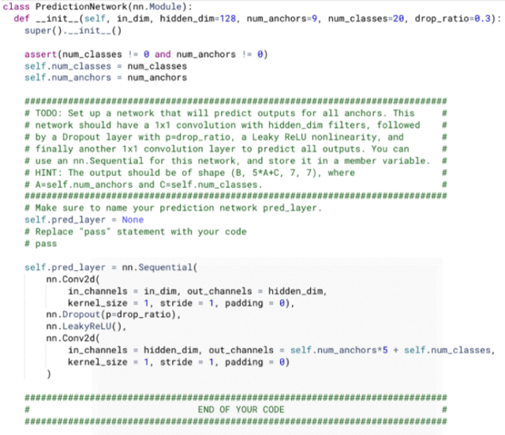</kbd></p>

> [!NOTE]
> Lưu ý để same padding thì với stride `=` 1, kernel size `=` 1 thì
> padding `=` 0 (chứ không phải 1)

> [!NOTE]
> Phát hiện thêm chỗ này Seloufian: Dùng Dropout2d. Sửa lại
> và test lại

<br>

<a id="node-1627"></a>

<p align="center"><kbd>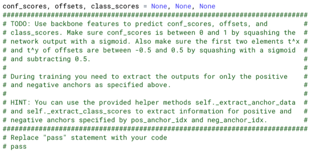</kbd></p>

<p align="center"><kbd>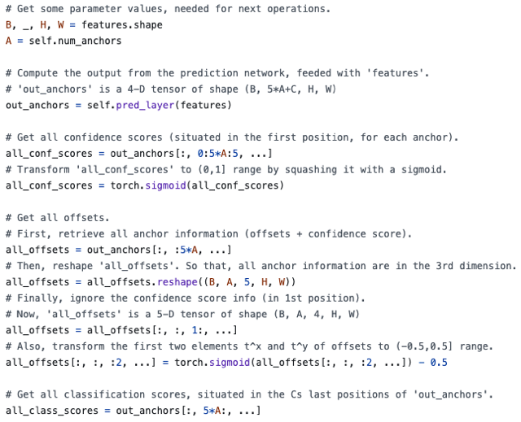</kbd></p>

<p align="center"><kbd>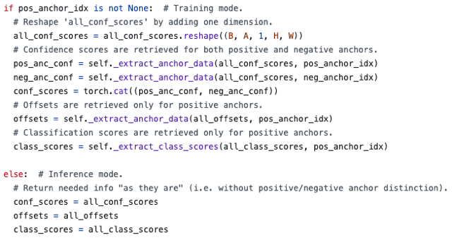</kbd></p>

<p align="center"><kbd>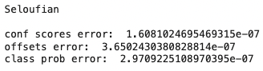</kbd></p>

<p align="center"><kbd>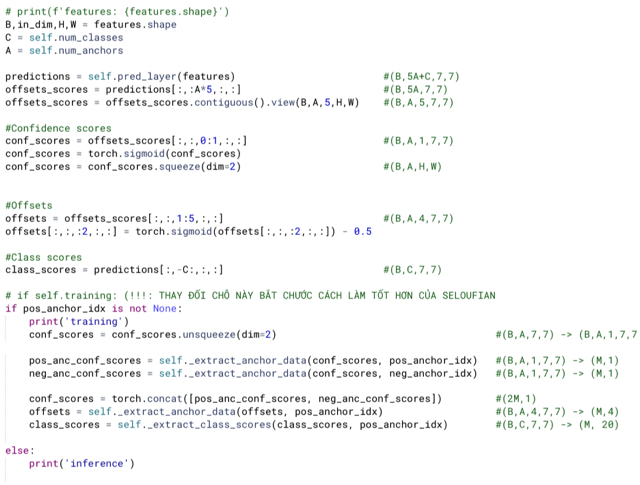</kbd></p>

<p align="center"><kbd></kbd></p>

<p align="center"><kbd></kbd></p>

<p align="center"><kbd></kbd></p>

<p align="center"><kbd></kbd></p>

<p align="center"><kbd></kbd></p>

<p align="center"><kbd>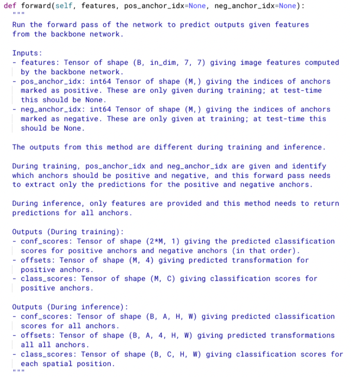</kbd></p>

> [!NOTE]
> Đầu tiên pass feature tensor (output từ backbone) qua prediction
> layer.
>
> Sau đó dùng các function view() để reshape (nếu cần thì gọi
> contiguous() để "liên mạch vùng memory" trước khi reshape) và
> slicing, torch.sigmoid để làm "lấy ra" (slicing) các tensor: class scores,
> anchor confidence score, và anchor's transformation, cũng không có
> gì phức tạp.
>
> Chỉ chú ý là trong 5D vector thì confidence score nằm ở vị trí đầu tiên.
> Sau đó là tx, ty, tw, th. Và trong `5A+C` vector thì đương nhiên C vị trí
> cuối là class scores, lấy ra bằng các slicing: `...[:,-C],...`
>
> Chú ý là cần chuyển confidence score qua sigmoid để ém (squash)
> giá trị thành range [0,1]. Cũng như là tx, ty cũng dùng sigmoid và `-0.5`
> để ém về range `[-0.5,` 0.5]
>
> Khi training thì ta sẽ dùng hai helper function để giúp extract ra do các
> positive `/` negative anchor.
>
> *Điểm lưu ý nữa là trong unit test khi để float32 thì relative error là chỉ
> cỡ `e-5.` Theo gpt thì chỉ là do vấn đề làm tròn số.
>
> Khi dùng float64, cả ba giá trị cho `e-7` chứng tỏ mình đã làm đúng.

> [!NOTE]
> Solution của seloufian: Anh này lấy confidence score theo kiểu khác mình:
> `all_conf_scores` `=` `out_anchors[:,` 0:5*A:5, ...] Slicing kiểu này có nghĩa là, ở
> dimension thứ 2, bắt đầu ở 0 và kết thúc ở 5*A `=45,` mỗi lần nhảy qua 5 vị trí.
>
> Sở dĩ như vậy là bởi ta biết `out_anchors` có shape `(B,5A+C,H',W')` tại mỗi grid
> ```text
> cell là một vector có 5A+C = 45 + 20 = 65 phần tử, với 5A=45 phần tử đầu là
> ```
> predicted confidence score và offset của các anchors, C phần tử  cuối là
> predicted class scores.
>
> Do đó, yêu cầu "bắt đầu ở 0, stop ở 45, step `=` 5 sẽ giúp lấy ra các vị trí:  0, 5,
> 10, 15,20, 25, 30, 35, 40. Đây chính là các vị trí ứng với confidence scores, bởi
> vì trong một vector đang nói thì các giá trị sẽ xếp như sau:
>
> c1, tx1, ty1, tw1, th1, c2, tx2, ty2, tw2, th2, c3.....c9, tx9,..th9, K1, K2, .. .K20
>
> thì rõ ràng là ta sẽ bắt đầu ở 0, rồi nhảy qua 5, rồi 10...để lấy các confidence
> score. Nhưng phải dừng ở 45, vì nếu không ta sẽ lạm qua các class scores.
>
> `====`
>
> Điểm khác thứ hai là ảnh check training mode bằng cách xem có
> `pos_anchor_idx` hay không, thay vì dùng self.training như mình. Cách này rất
> đúng khi trong quá trình inference thì ta sẽ không có positive hay negative
> anchor indices gì cả. Và làm như vậy thì sẽ giúp ở forward của
> SingleStageDetector, khi forward qua PredictionNetwork không cần set nó ở
> training mode. (Sở dĩ mình làm vậy là bởi vì khi run DetectorEvaluater, trong đó
> nó run SingleStageDetector ở "chế độ inference (bằng .eval()) thì lúc này,
> PredictionNetwork nếu ta không set nó một cách cụ thể là run ở training mode,
> thì nó cũng sẽ  run ở reference mode, ở trạng thái đó, với cách làm của mình là
> phân biệt training mode bằng biến self.training, nó sẽ chạy vào nhánh sau, và
> trả ra "full anchor" result thay vì chỉ những `positive/negative` anchors
>
> `->` Tóm lại cách làm của SELOUFIAN tốt hơn

<br>

<a id="node-1628"></a>

<p align="center"><kbd></kbd></p>

<p align="center"><kbd>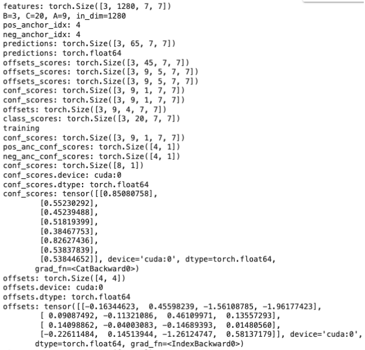</kbd></p>

<p align="center"><kbd>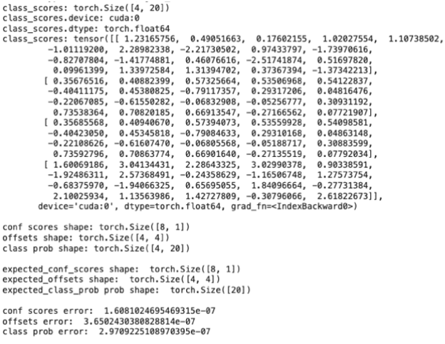</kbd></p>

<p align="center"><kbd></kbd></p>

<p align="center"><kbd></kbd></p>

<p align="center"><kbd></kbd></p>

<p align="center"><kbd>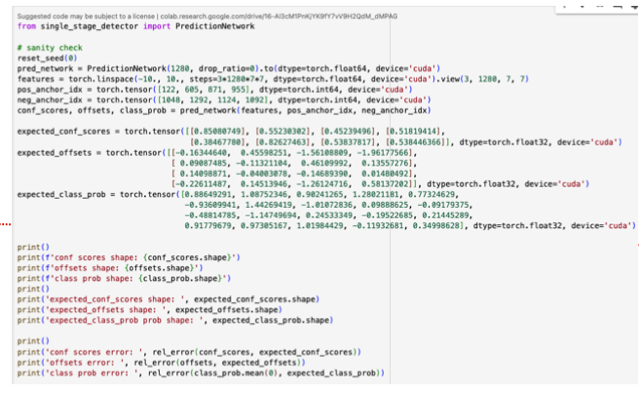</kbd></p>

> [!NOTE]
> Checked!

<br>

<a id="node-1629"></a>

<p align="center"><kbd>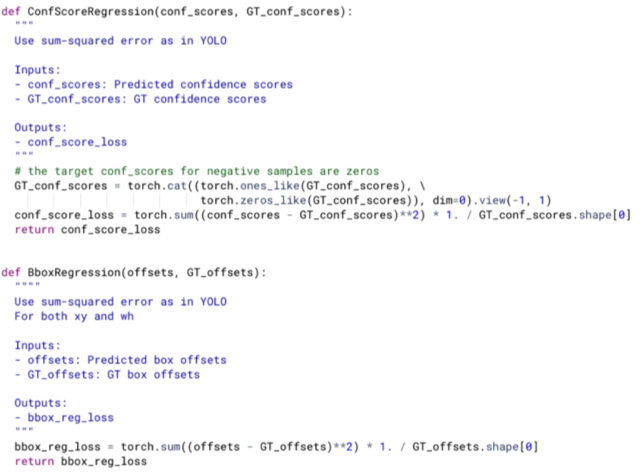</kbd></p>

<p align="center"><kbd>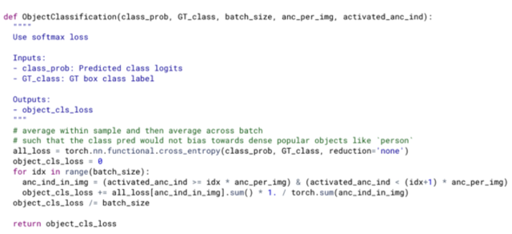</kbd></p>

<p align="center"><kbd></kbd></p>

<p align="center"><kbd></kbd></p>

<p align="center"><kbd>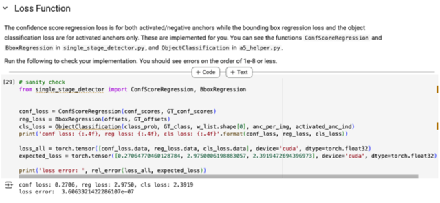</kbd></p>

> [!NOTE]
> Họ làm giùm cái này, xem qua để hiểu:
>
> Với ConfScoreRegression, đều cần để ý đầu tiên là **thật ra họ không dùng
> giá trị của `GT_conf_scores` pass vào** `-` vốn output từ
> ReferenceOnActivatedAnchor được lấy từ giá trị **iou của positive anchor với
> matched box của nó**.
>
> **Thay vào đó,  ta thấy đầu tiên họ tạo một target khác với các giá trị binary**:
> với positive anchor confidence score thì target là 1, còn với negative anchor
> confidence score thì target là 0.
>
> Nhưng đáng chú ý là loss không phải là binary cross entropy mà là
> MeanSquareError. Tổng bình phương difference giữa predicted score và
> target rồi chia cho batch size.
>
> `===`
>
> Còn với **BboxRegression** loss thì cũng là **MSE** luôn.
>
> `===`
>
> Với **ObjectClassification** thì **cross entropy** (với bước lấy average trên mỗi
> image và trên batch để class prediction không bias toward một loại object
> xuất hiện nhiều như "person").

> [!NOTE]
> Checked!

<br>

<a id="node-1630"></a>

<p align="center"><kbd>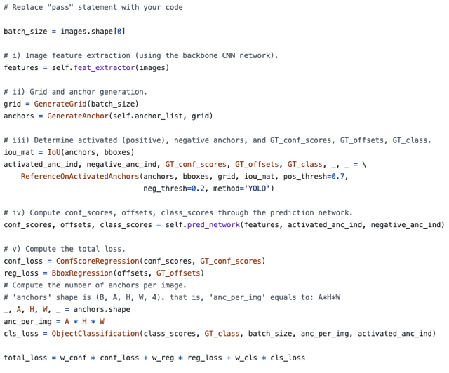</kbd></p>

<p align="center"><kbd>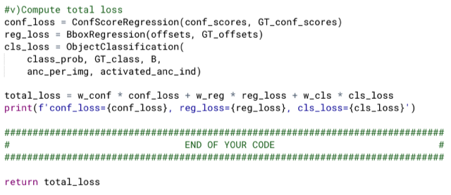</kbd></p>

<p align="center"><kbd>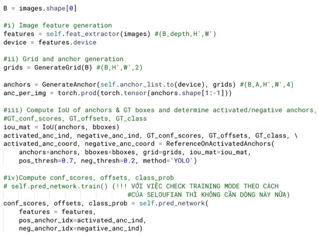</kbd></p>

<p align="center"><kbd></kbd></p>

<p align="center"><kbd></kbd></p>

<p align="center"><kbd></kbd></p>

<p align="center"><kbd>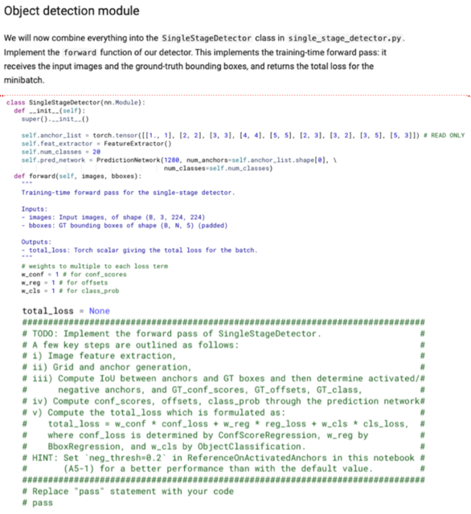</kbd></p>

> [!NOTE]
> **Bước 1** là pass images tensor qua backbone cnn để có features tensor (B,depth,H,W)
>
> features: torch.Size([10, 1280, 7, 7]), cuda:0, torch.float32  **Bước 2** là dùng function GenerateGrid() để tạo grid `=` tensor
> các coordinate của các `grid-cell` center có shape (B,H,W,2)
>
> grids: torch.Size([10, 7, 7, 2]) **Bước 3** là sẽ pass grid tensor cùng với anchor list vào GenerateAnchor() để tạo tensor các anchor (B,A,H,W,4): mỗi grid cell
> có A anchor represent bởi 4D vector XYXY
>
> anchors: torch.Size([10, 9, 7, 7, 4])
>
> Chuẩn bị thông số các anchor `per_image:` 56 anchor trong một image, là `A\/H\/W` đòng này copy theo người ta ở trên, cũng
> dùng đoạn thôi lấy shape của anchors, `A=9` cell list (B,A,H,W,4) để access phần từ từ batch, `anchor_list.shape[:-1][:1]` rồi nhân
> lại với torch.prod() bbox, là tensor shape (B,N,5) mà details ở trên, là N là số object của cả image chứ không nhất định trong
> batch, mỗi bbox sẽ "là" một 5D vector [x1, y1, x2, y2, class id] **Bước 4** ta sẽ dùng IoU để input là anchors và bbox để tính ra IoU matrix `(iou_mat):` là matrix (mỗi image một matrix) các iou
> của anchor với mỗi bbox
>
> bbox: torch.Size([10, 5, 4]) `iou_mat:` torch.Size([10, 441, 17]) #441 `=` no.anchors `=` `A\/H\/W` `=` `(9\/7\/7)` **Bước 5** ta sẽ dùng function ReferenceOnActivatedAnchors `-` là function giúp gán ghép (matching) một anchor với một gt box
> mà mình đã phân tích để hiểu ở trên, là:
>
> • `activated_anc_ind,` `negative_anc_ind:` hai vector cùng size (M) chứa indices của các activated anchor (tức là các anchor như
> còn nhớ với rule của yolo, thì là anchor có iou lớn nhất (trong số mọi iou của các anchor với một gt box nào đó) hoặc có iou
> với một gt box nào đó lớn hơn positive threshold), và negative anchor (là anchor có iou với mọi gt box đều nhỏ hơn negative
> threshold) **• GT_conf_scores** (M), **GT_offsets** (M,4), **GT_class** (M) lần lượt là (của positive anchor) **ground truth
> confidence score** được lấy bằng iou của anchor với matched gt box, **ground truth box offset** `-` tức 4 giá trị tx, ty, tw, th giúp
> 'transform' anchor box thành cái matched gt box, và **ground truth class index** của anchor đó
>
> • Ngoài ra còn trả ra coordinate của các positive `/` negative anchors
>
> `activated_anc_ind:` torch.Size([43])
>
> `negative_anc_ind:` torch.Size([43])
>
> `GT_conf_scores:` torch.Size([43])
>
> `GT_offsets:` torch.Size([43, 4])
>
> `GT_class:` torch.Size([43])
>
> `activated_anc_coord:` torch.Size([43, 4])
>
> `negative_anc_coord:` torch.Size([43, 4])
>
> Tiếp theo, "bật" **PredictionNetwork** qua chế độ training, và pass features cùng indices của postive anchors và negative
> anchors vào để có prediction là 3 tensors: **• conf_scores**: Là tensor (2*M,1) predicted confidence scores của positive và
> negative anchors **• offsets**: Là tensor (M,4) predicted offsets của positive anchors **• class_probs**: tensor (M,20) `-`
> predicted class scores, tương ứng mỗi positive anchor là 20D vector thể hiện predicted probability distribution over 20 classes
> thể hiện đoán chính xác model đoán category của `/` tại một anchor.
>
> `conf_scores:` torch.Size([86, 1])
>
> offsets: torch.Size([43, 4])
>
> `class_probs:` torch.Size([43,20])
>
> Cuối cùng, pass predicted confidence scores và ground truth confidence scores vào **ConfScoreRegression** để tính
> confidence regression loss
>
> Pass predicted offsets và Ground truth offsets vào **BboxRegression** để tính bbox regression loss
>
> Predicted class scores và Ground truth class id vào **ObjectClassification** để tính class **Classification** loss.
>
> Cuối cùng weighted sum ba loại loss này lại.

> [!NOTE]
> Solution của seloufian: Nhìn chung là y change, chỉ khác 
>
> `-` không có bước ship grids và `self.anchor_list` "lên" cùng device
> là vì trong GenerateAnchor, họ đã ship result lên 'cuda' sẵn
>
> `-` không gọi `self.pred_network.train()` để chuyển nó ở training mode. 
> `->` Sau khi kiểm tra thì thấy là do PredictionNetwork's forward() ảnh 
> check training mode bằng cách check xem `pos_anchor_ind` có `=None`
> không. Cách này tốt hơn là dùng self.training như mình, từ đó không
> cần phải chuyển PredictionNetwork ở training mode

<br>

<a id="node-1631"></a>

<p align="center"><kbd>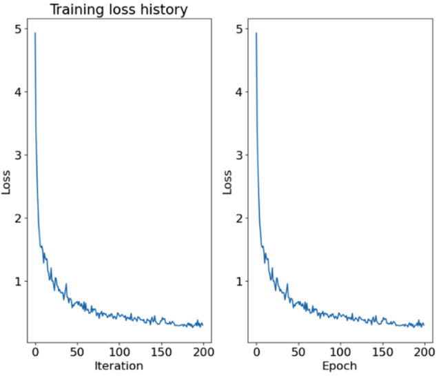</kbd></p>

<p align="center"><kbd></kbd></p>

<p align="center"><kbd>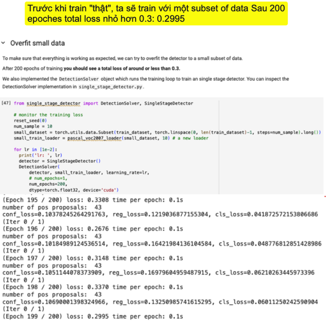</kbd></p>

<br>

<a id="node-1632"></a>

<p align="center"><kbd>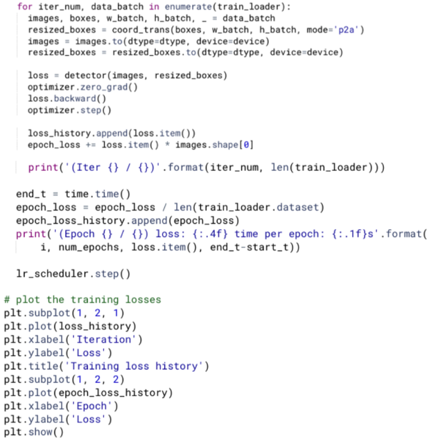</kbd></p>

<p align="center"><kbd></kbd></p>

<p align="center"><kbd>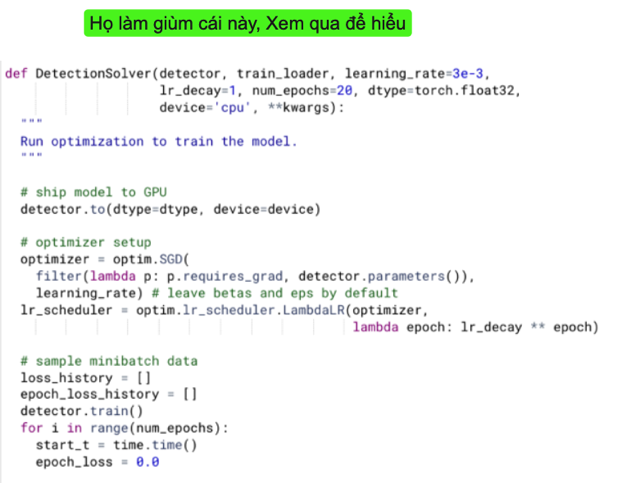</kbd></p>

> [!NOTE]
> Function này nhận vào model (detector, train loader giúp "cung cấp" các batched
> data, giá trị của một số training hyperparameter như learning rate, `lr_decay,`
> `num_epoches,...`
>
> Đầu tiên ship model vào GPU, rồi khởi tạo optimizer sử dụng SGD, learning rate
> scheduler.
>
> Chuyển model sang training mode
>
> Start for loop over `num_epoches,` trong đó:
>
> Nhờ data loader trả ra từng data batch, bao gồm images tensor, bboxes, bên cạnh
> đó còn list chứa width và height của các images. (mà mình đã hiểu khi xem xét
> function `voc_collate_fn` (pass vào DataLoader để customize data batch trả ra)
>
> Thế thì đầu tiên họ sẽ pass boxes tensor, `w_batch,` `h_batch` vào `coord_trans` để "
> chuyển" bboxes coordinate từ hệ tọa độ "original image 224x224" sang hệ tọa độ
> của feature map size (ví dụ 7x7, ta không thấy họ pass vào hai giá trị này như xem
> function là thấy nó là giá trị mặc định của `w_amap,` `h_amap)`
>
> Tiếp theo là động tác ship các tensor vào cùng device trước khi forward qua model
> (detector) để có loss.
>
> Sau đó là reset gradient và thực hiện backpropagation (backward) để tính gradient
> rồi update parameters với optimizing step (backward).
>
> Append loss, finish thì plot history ra.

<br>

<a id="node-1633"></a>

<p align="center"><kbd>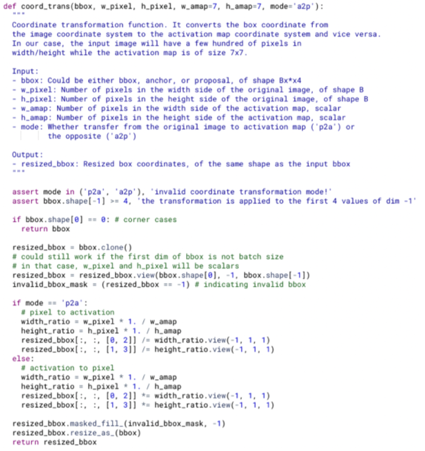</kbd></p>

> [!NOTE]
> Function giúp convert coordinate của một bounding box từ "hệ
> tọa độ" gắn với kích thước gốc của image (ví dụ 224x224) sang
> "hệ tọa độ" gắn với kích thước của feature map (ví dụ 7x7)
> hoặc ngược lại.
>
> Thật ra cũng đơn giản, chỉ là ta sẽ tính ra width ratio và height
> ratio là tỉ lệ giữa width của original image và width feature map
> cũng như là height của original image với height của feature
> map. Rồi dùng chúng để scale các giá trị coordinate.
>
> Còn chi tiết thì có một số bước đáng chú ý như, trước tiên ta sẽ
> tạo cái mask đánh dấu chỗ nào trong box có giá trị `-1` (thể hiện
> invalid value ví dụ như trong số các box có những "padding"
> box `-` liên quan đến việc ví dụ như trong một batch, các sample
> có số object box khác nhau, thì như ta biết các sample sẽ đều
> được "add" các padding box đủ `N-` là số box của cái image có
> nhiều object nhất trong batch) đặng tí nữa khi scale xong thì fill
> lại những chỗ đó thành `-1.`
>
> Function `resize_as_()` sau khi tham khảo gpt có vẻ là thừa, vì
> nó bản thân `resized_bbox` đã cùng shape với bbox do được
> clone từ bbox, nên function này có vẻ như chỉ là để make sure
> chúng cùng shape nhau.

<br>

<a id="node-1634"></a>

<p align="center"><kbd>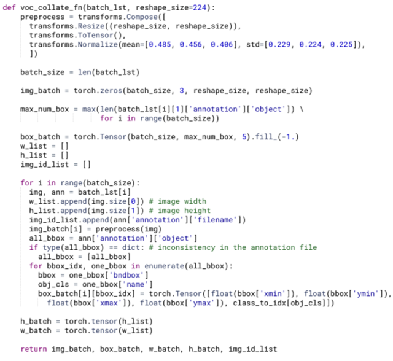</kbd></p>

<p align="center"><kbd></kbd></p>

<p align="center"><kbd>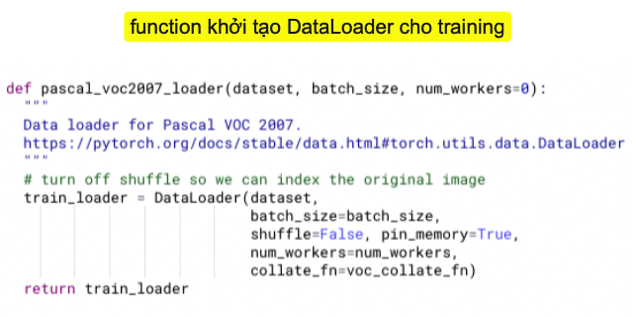</kbd></p>

> [!NOTE]
> function giúp collate (tạm gọi là "đối chiếu" một value tensor và target
> tensor, giúp customize data trả ra từ DataLoader, để có thêm width và
> height của images
>
> Input có `batch_lst` là list các tuple *xb, yb), `reshape_size` `=` 224.
>
> `box_batch` khởi tạo ban đầu là tensor shape (batch size B, max number of
> box N, 5) `w_list,` `h_list` là hai list rỗng
>
> Iterate over batch size: Lấy tuple img (xb), ann (yb) `=` `batch_lst[i]`
>
> Append width và height và filename của image vào `w_list,` `h_list,`
> `img_id_list`
>
> Pass image qua preprocessing function, bao gồm các bước resize, chuyển
> thành tensor và normalizing với fixed mean và std.
>
> Lấy thông tin bbox ra, ta thấy có bước xử lý khi có sự inconsistency trong
> data file.
>
> Tiếp Theo iterate trong các boxes info, lấy bbox coordinate info (có thể thấy
> nó sẽ là một dict với các key "xmin", "ymin", "xmax" "ymax" gắn với value là
> coordinate của corners) từ key "bndbox", object label từ field "name"
>
> Tạo tensor vector 4 giá trị của bbox corner coordinates.

<br>

<a id="node-1635"></a>

<p align="center"><kbd>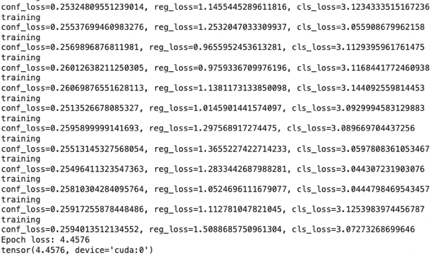</kbd></p>

<p align="center"><kbd></kbd></p>

<p align="center"><kbd>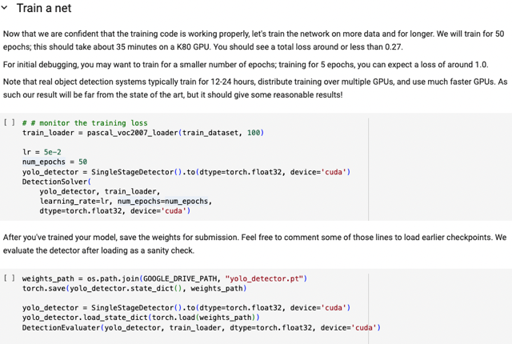</kbd></p>

> [!NOTE]
> Train thật, tốn cỡ tiếng mấy (chỗ này quên chụp hình
> loss history) Save model.

> [!NOTE]
> Sau đó load model và evaluate

<br>

<a id="node-1636"></a>

<p align="center"><kbd>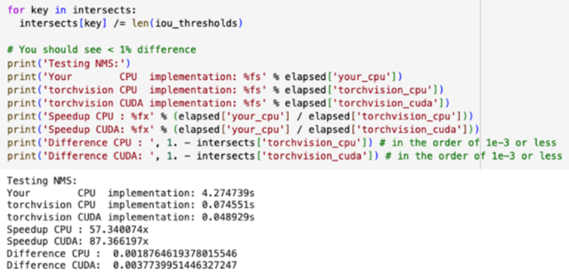</kbd></p>

<p align="center"><kbd></kbd></p>

<p align="center"><kbd>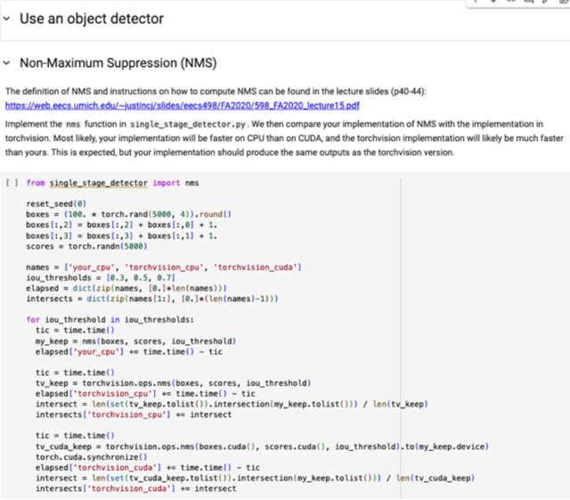</kbd></p>

> [!NOTE]
> tiếp theo là implement function nms, cái này đã làm ở v2022 part 1 rồi nên ta sẽ
> chỉ copy qua.
>
> Tuy nhiên có chút khác đó là ở đây họ sẽ yêu cầu làm thêm vụ filter bớt chỉ lấy
> topk các giá trị có score cao nhất sau khi đã nms.

> [!NOTE]
> Checked!

<br>

<a id="node-1637"></a>

<p align="center"><kbd>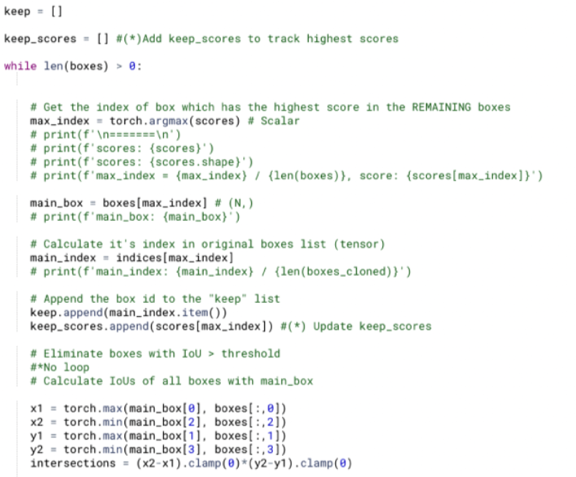</kbd></p>

<p align="center"><kbd>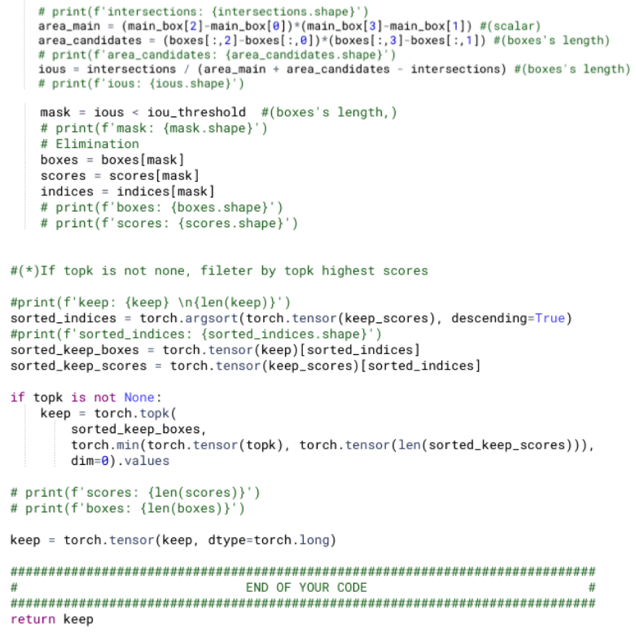</kbd></p>

<p align="center"><kbd></kbd></p>

<p align="center"><kbd></kbd></p>

<p align="center"><kbd>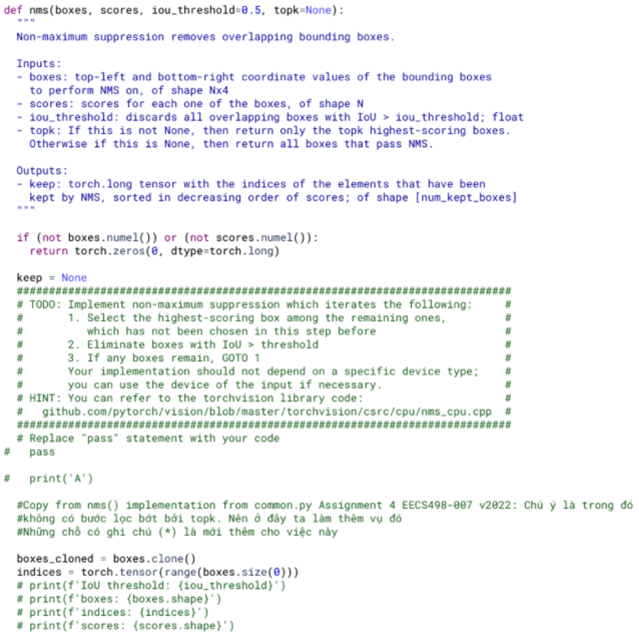</kbd></p>

<br>

<a id="node-1638"></a>

<p align="center"><kbd>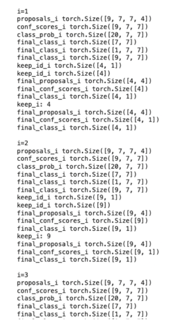</kbd></p>

<p align="center"><kbd>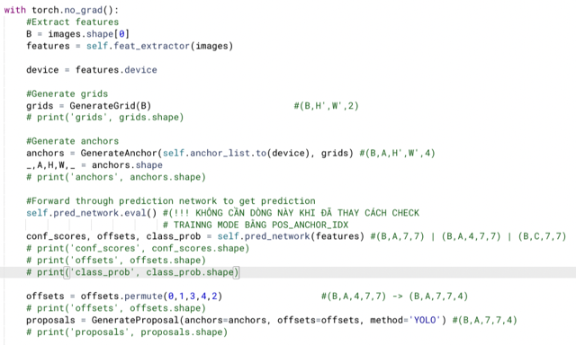</kbd></p>

<p align="center"><kbd>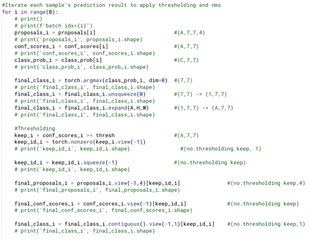</kbd></p>

<p align="center"><kbd>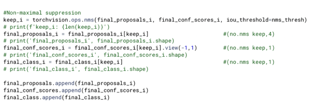</kbd></p>

<p align="center"><kbd></kbd></p>

<p align="center"><kbd></kbd></p>

<p align="center"><kbd></kbd></p>

<p align="center"><kbd></kbd></p>

<p align="center"><kbd>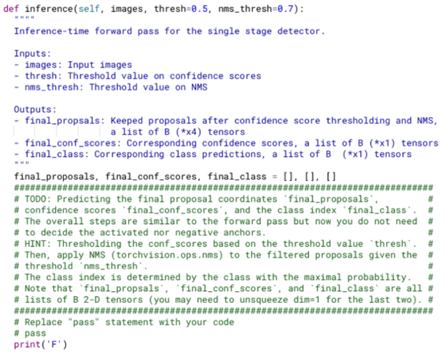</kbd></p>

> [!NOTE]
> Quá trình inference, ta thực hiện với "with `torch.no_grad()",` nếu không khi run sẽ bị lỗi xảy ra trong
> function `coord_trans` `(resize_box.resize_as(..)).`
>
> • Bước đầu cũng sẽ là forward images tensor qua backbone model để extract features.
>
> • Kế tiếp là generate grids tensor (B,H,W,2) và anchors tensor (B,A,H,W,4) như ở forward() **grids:** torch.Size([10, 7, 7, 2]) **anchors:** torch.Size([10, 9, 7, 7, 4])
>
> Tới đây ta không cần thực hiện việc "matching giữa anchor và gt box".
>
> • Mà forward feature qua prediction model với reference mode `-` `pred_network.eval()` `-` để có 3 tensor
> như đã biết. Như đã làm ở PredictionNetwork's forward, với reference mode, prediction sẽ không
> không chỉ là " của" các `positive/negative` anchors, mà sẽ là "của" mọi anchors. **conf_scores:** torch.Size([10, 9, 7, 7, 1]) #B (A, H, W) **offsets:** torch.Size([10, 9, 4, 7, 7]) #B (A, H, W) **class_prob:** torch. Size([10, 20, 7, 7]) #B (C, H, W)
>
> Ta sẽ chuyển predicted offsets cộng với anchors's coordinate thành predicted bbox (proposals) bằng
> function generate GenerateProposals đã làm ở đầu, thì bước này ta cần permute (transpose) một
> chút do shape hơi bị ngược yêu cầu GenerateProposals. **anchors:** torch.Size([10, 9, 7, 7, 4])  **proposals:** torch.Size([10, 9, 7, 7, 4])
>
> • Đến đây ta sẽ "xét" từng sample, để thực hiện việc thresholding và nms `-` là bước loại bỏ bớt các
> proposal đã generate ra và giữ lại prediction của sample mỗi khi anchor ta đã làm từng sample. Lấy
> (slicing) predicted proposals, confidence scores và class scores của từng sample (slicing by batch id)
> và dùng argmax `dim=0` với `class_probs` để có predicted class id tại mỗi "grid cell" `/` anchor center. **proposals_i:** torch.Size([9, 7, 7, 4]) #A, H', W' **conf_scores_i:** torch.Size([9, 7, 7, 1]) #A, H', W' **class_prob_i:** torch.Size([20, 7, 7]) #C, H', W'
>
> Tại đây ta thấy proposals shape (A, H', W') ứng với mỗi grid cell có A anchor, và confidence scores
> (A, H' , W') và class scores (1, H', W'): Có nghĩa là ta sẽ lấy A*H'W' anchor's confidence scores và
> coords (anchors) và H', W' class id dự đoán cho mỗi grid cell. Do đó ta sẽ dùng expand để "copy"
> cho mỗi anchor cái predicted class id, để có tensor class cùng có shape (A, H', W'). Nhằm mục đích
> cho bước tiếp theo. **final_class_i:** torch.Size([7, 7]) **final_class_i:** torch.Size([1, 7, 7]) #Sau khi `unsqueeze(dim=0)`  **final_class_i:** torch.Size([9, 7, 7]) #Sau khi expand
>
> Đó là thresholding: đại khái là ta sẽ bỏ đi các proposals nào mà có confidence score thấp hơn
> threshold đã định đưa đầu tiên ta làm hoặc indicator những vị trí có score lớn hơn threshold, sau đó
> dùng torch. nonzero để giữ lại các class index trong range [0
>
> `.anchor=A\/H\/W]` của các vị trí đã yêu cầu.
>
> Và dùng nó để slicing. **keep_id_i** torch.Size([4]) #no.thresholding keep, 1) (lý là số lượng giữ lại sau khi thresholding) **keep_id_i** torch.Size([4]) **final_proposals_i** torch.Size([4, 4]) #no.thresholding keep, 1) **final_conf_scores_i** torch.Size([4]) #no.thresholding keep, 1) **final_class_i** torch.Size([4]) #no. thresholding keep, 1)
>
> `===`
>
> Tiếp nữa là bước nms **keep_i:** 4 
> **final_proposals_i** torch.Size([4, 4]) #no.nms keep (số lượng giữ lại sau khi nms) 
> **final_conf_scores_i** torch.Size([4, 1]) #no. nms keep, 1) 
> **final_class_i** torch. Size([4, 1]) #no.nms keep, 1)

> [!NOTE]
> Lưu ý nếu đã bắt chước solution của Seloufian ở
> PredictionNetwork thì không cần gọi eval() ở

<br>

<a id="node-1639"></a>

<p align="center"><kbd>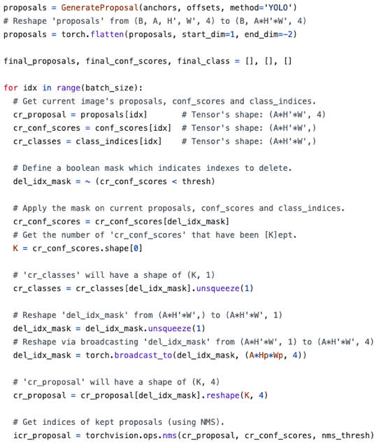</kbd></p>

<p align="center"><kbd>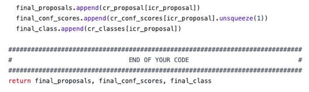</kbd></p>

<p align="center"><kbd></kbd></p>

<p align="center"><kbd></kbd></p>

<p align="center"><kbd>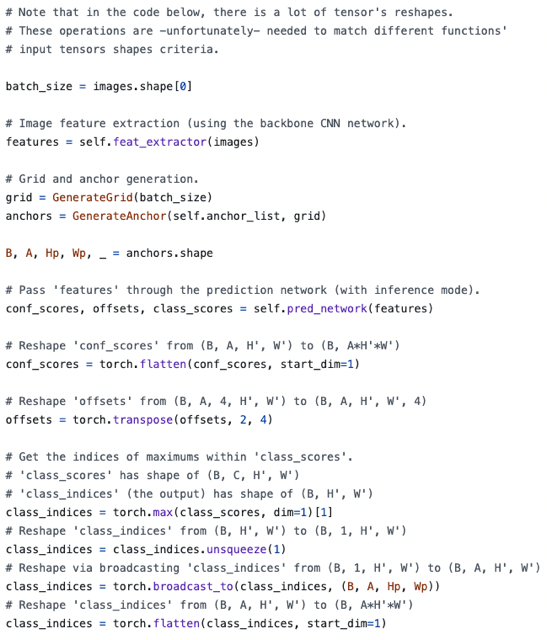</kbd></p>

> [!NOTE]
> Solution của seloufian:Solution của seloufian:
>
> `-` Đầu tiên cũng pass qua PredictionNetwork để có 3 tensor confidence score,
> offsets, class scores
>
> Transpose để có shape mong muốn, họ dùng transpose thay vì permute.
>
> `-` Kế tiếp, cũng lấy class id có giá trị class score lớn nhất để làm predicted
> class id cho grid location đó. Nhưng họ dùng max (vốn trả ra cả max value
> và id) rồi lấy cái thứ 2 ([1]) thay vì argmax như mình.
>
> Tiếp theo họ cũng "copy" predicted class id tại mỗi location cho A anchor
> tại đó, nhưng họ dùng broadcast thay vì expand.
>
> `-` Kế tiếp họ flatten confidence score, class indices mình thì chưa
>
> `-` Họ cũng xét riêng từng batch ở bước thresholding và nms
>
> Ở bước thresholding, họ dùng động các hơi rườm rà là ~ (..<..) thay vì `>=` 
> để tạo mask đánh dấu vị trí có confidence score lớn hơn threshold.
>
> Sau đó với các tensor confidence score và class indices đã flatten, họ sẽ 
> apply mask vector, để tạo một `K-D` vector `(K=số` lượng giữ lại). Còn mình
> thì chưa flatten confidence score mà cứ tạo mask tensor `=,` sau đó dùng 
> nonzero để tạo "keep" indices vector và dùng cái đó để slicing. Các indices
> sẽ có range [0: sớ anchor `=` A*H'W']
>
> Cách làm này có phần tiện hơn khi chỉ việc reshape các tensor thành 
> Shape (np. anchor, *) và slicing thôi.
>
> Còn họ thỉ với offset phải broadcast cái mask lần nữa thành (K, 4) rồi mới 
> Apply mask được.
>
> `-` Bước nms thì giống.
>
> Nói chung ý tưởng không có gì khác, khác cách làm thôi

<br>

<a id="node-1640"></a>

<p align="center"><kbd>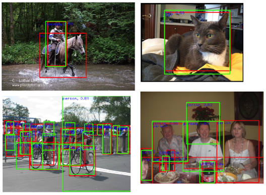</kbd></p>

<p align="center"><kbd>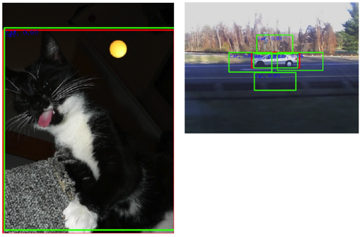</kbd></p>

<p align="center"><kbd></kbd></p>

<p align="center"><kbd></kbd></p>

<p align="center"><kbd>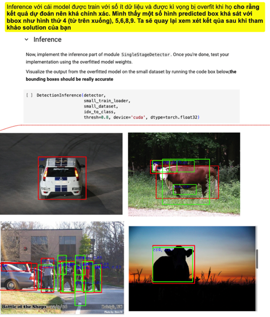</kbd></p>

> [!NOTE]
> Kết quả run reference của Seloufian cho thấy không khác lắm
> với của mình. Cho thấy function của mình không sai

<br>

<a id="node-1641"></a>

<p align="center"><kbd>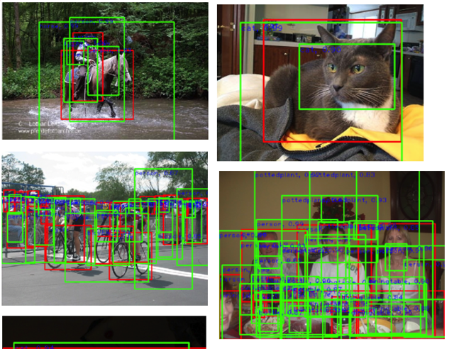</kbd></p>

<p align="center"><kbd>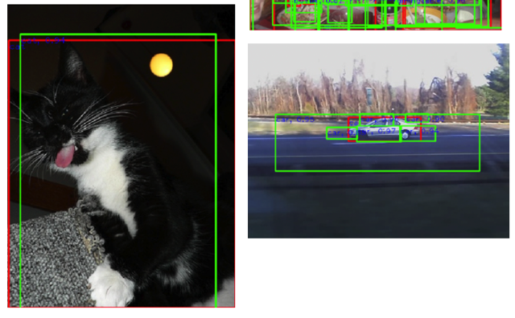</kbd></p>

<p align="center"><kbd></kbd></p>

<p align="center"><kbd></kbd></p>

<p align="center"><kbd>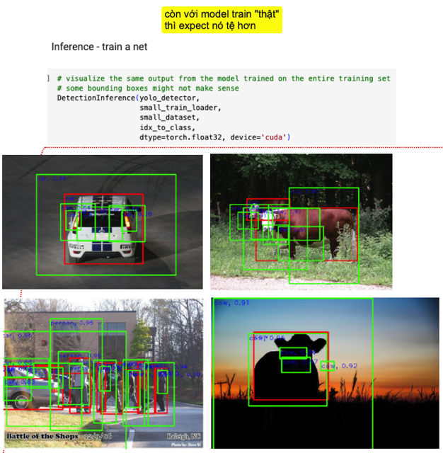</kbd></p>

<br>

<a id="node-1642"></a>

<p align="center"><kbd>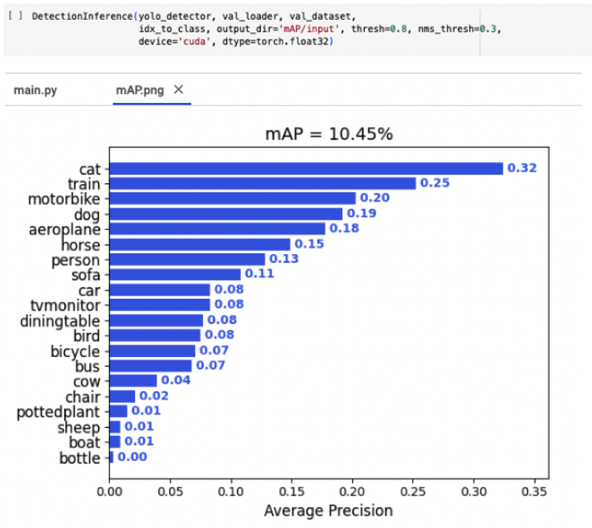</kbd></p>

<p align="center"><kbd>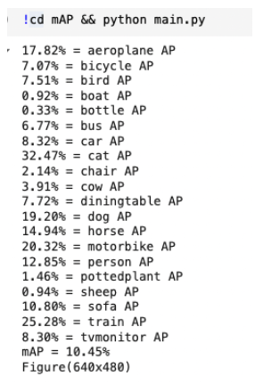</kbd></p>

<p align="center"><kbd></kbd></p>

<p align="center"><kbd></kbd></p>

<p align="center"><kbd>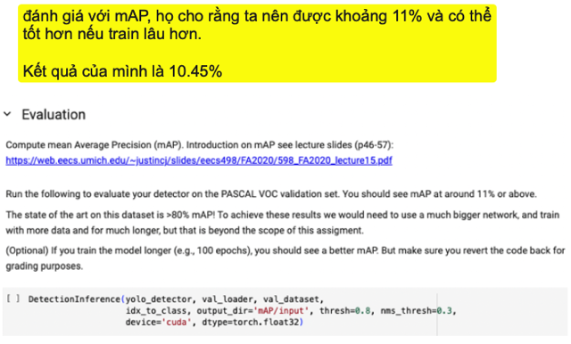</kbd></p>

<br>

