# Eecs 498-007_598-005 (2020) Assignment 4 (part 2): Two-stage Detector - Faster Rcnn

📊 **Progress:** `25` Notes | `161` Screenshots

---

<kbd>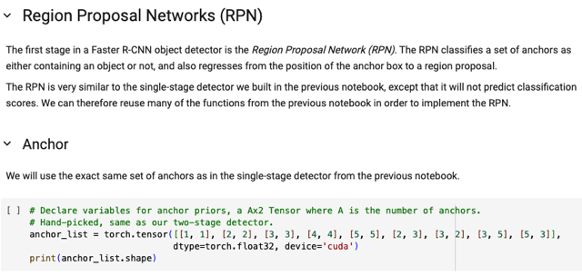</kbd>

> [!NOTE]
> Phần một của Faster RCNN object detector là Region Proposal Network
> - RPN, nó sẽ làm nhiệm vụ (học cách) classify một anchor có chứa một
> object hay không, và nếu có thì nó sẽ regress / dự đoán ra một phép 
> transformation để convert anchor box thành gt box.
>
> RPN có nhiều điểm chung với Single-Stage detector nơi mà ta cũng dự
> đoán một anchor box có chứa một object hay không (confidence score)
> cũng như là một transformation để transform anchor box thành bounding
> box. Nên về cơ bản là RPN chỉ không predict một grid center là class gì
> mà thôi.
>
> Do đó ta sẽ dùng lại nhiều component của mô hình Single Stage Detector
> YOLO ở phần 1

 

<kbd>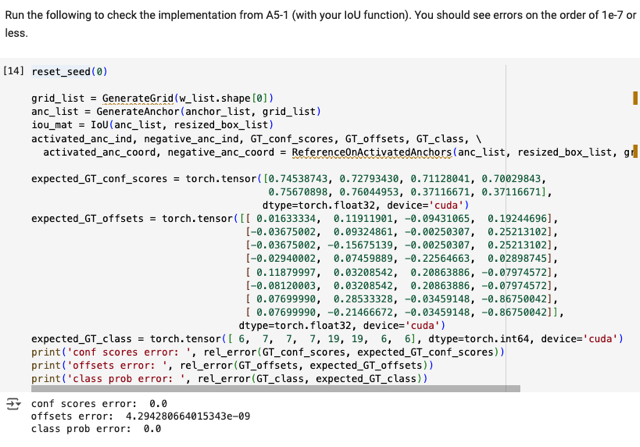</kbd>

<kbd></kbd>

<kbd>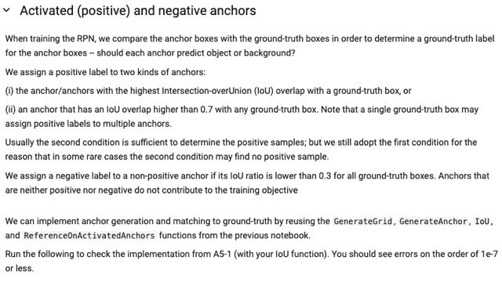</kbd>

> [!NOTE]
> Nói về việc "gán ghép" một anchor với một gt box mà ta phân tích function
> ReferenceOnActivatedAnchors. Trong đó với Faster RCNN rules, một anchor
> sẽ được gán ghép với một gt box nếu nó thỏa một trong hai điều kiện:
>
> 1. Đối với một gt box nào đó, trong số mọi iou của các anchor box, thì nó là
> cái có iou lớn nhất.
>
> 2. Anchor box sẽ được gán với gt box nếu IoU của nó với gt box lớn hơn 0.7
>
> Thế thì thật ra phần lớn trường hợp ta sẽ có điều kiện hai, còn điều kiện một
> là để một số hiếm trường hợp, không có anchor nào có iou với box nào lớn
> hơn 0.7.
>
> Ngoài ra, một anchor nếu không có IoU với box nào lớn hơn 0.3, thì nó sẽ 
> là Negative box, cũng tham gia vào quá trình huấn luyện. Còn những anchor
> giữa giữa - Neutral thì bị ignore.
>
> (còn YOLO: một anchor sẽ được gán ghép cho một gt box nếu tâm của nó
> activate - có nghĩa là vị trí tâm là gần với tâm của gt box nhất  trong số các
> grid center, đồng thời, trong số các anchor tại activate center đó thì nó là cái
> có IoU lớn nhất)
>
> Tóm lại, mình sẽ dùng lại các component như GenerateGrid, GenerateAnchor,
> IOU, và ReferenceOnActivatedAnchors

 

<kbd>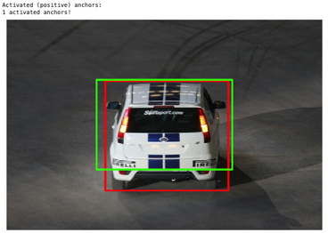</kbd>

<kbd>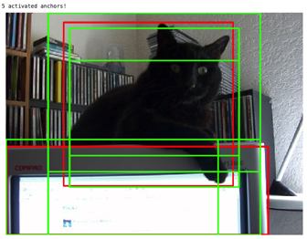</kbd>

<kbd>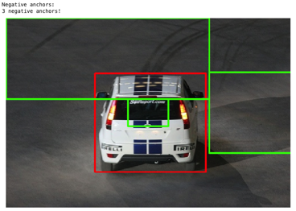</kbd>

<kbd>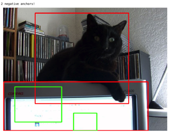</kbd>

<kbd></kbd>

<kbd></kbd>

<kbd></kbd>

<kbd></kbd>

<kbd>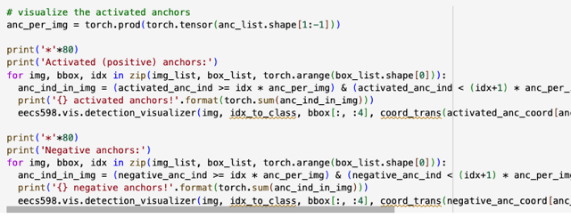</kbd>

 

<kbd>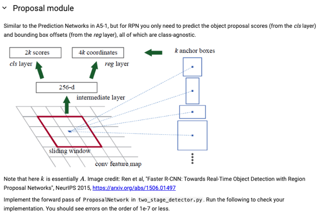</kbd>

> [!NOTE]
> Với k, hay A là số anchor tại mỗi location (grid cell center) thì  đại khái là như 
> đã nói ở slice trước về nhiệm vụ của PRN, thế thì cụ thể nó sẽ cần tính toán 
> và output ra:
>
> 1. Hai giá trị class score ứng với hai class: Có hay không có chứa một object
> Như part2 của version 2022, thật ra lúc làm ta chỉ dùng hàm sigmoid để output
> ra một giá trị ứng với P(có object), nhưng thích thì tính ra hai giá trị P(có object)
> và p(không có object) cũng được, khi đó ta sẽ dùng softmax để chuyển hai logit
> thành probabiity.
>
> 2. 4 giá trị box regression: tx, ty, tw, th, làm thành một phép biến đổi để tranform
> anchor box thành object box.

 

<kbd>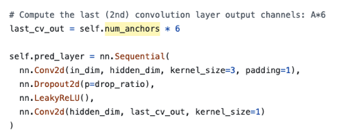</kbd>

<kbd></kbd>

<kbd>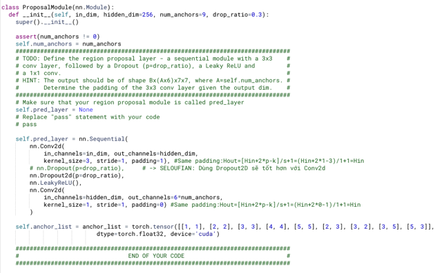</kbd>

> [!NOTE]
> kiến trúc của cái này tương tự PredictionNetwork, chỉ khác là nó chỉ output
> ra tại mỗi một location output ra vector có 6*A phần tử  (A anchors/locations,
> 6 giá trị (4 box regression + 2 object-ness classification)
>
> Chú ý là conv layer đầu tiên kernel size = 3x3, để same padding thì thì
> padding = 1. Còn conv layer thứ hai kernel size = 1x1, nên padding = 0.
>
> Ta cũng chuẩn bị anchor_list: define 9 kích thước của các anchors, như ở
> trên nói, ta sẽ dùng các giá trị giống như của part 1

> [!NOTE]
> Tham khảo solution của seloufian: Ổng dùng Dropout2d

 

<kbd>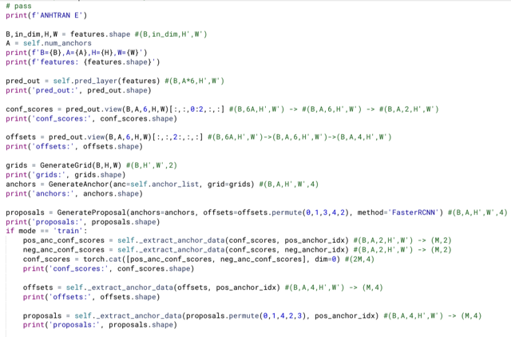</kbd>

<kbd>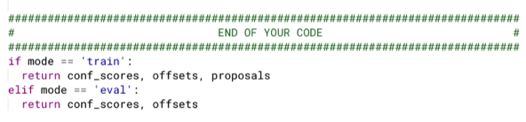</kbd>

<kbd>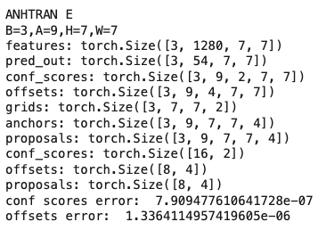</kbd>

<kbd>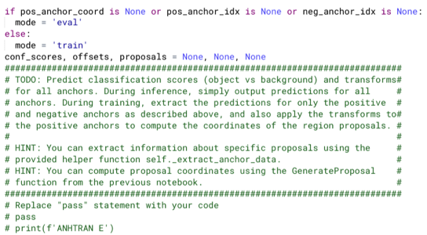</kbd>

<kbd>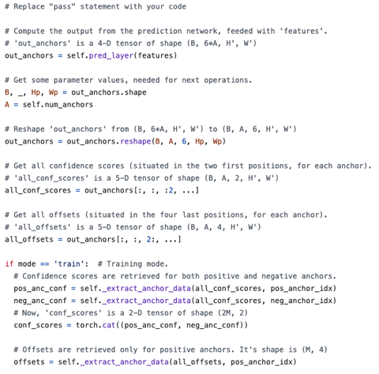</kbd>

<kbd>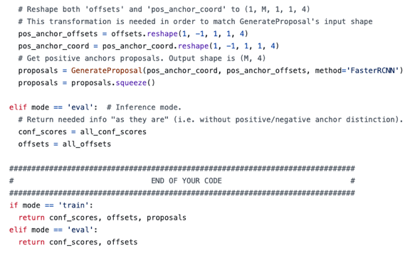</kbd>

<kbd>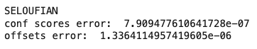</kbd>

<kbd></kbd>

<kbd></kbd>

<kbd></kbd>

<kbd></kbd>

<kbd></kbd>

<kbd></kbd>

<kbd></kbd>

<kbd>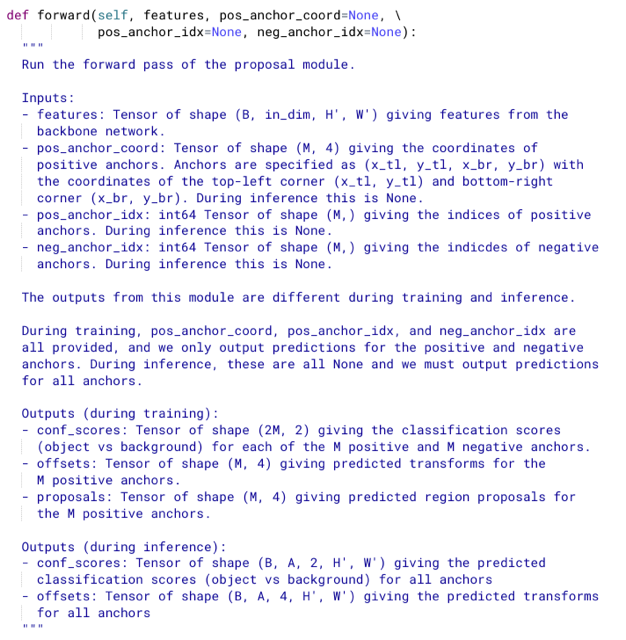</kbd>

> [!NOTE]
> Quá trình tính toán rất tương tự PredictionNetwork:
>
> - Forward qua prediction layer sau đó dùng permute để
> transpose, view để reshape về dạng phù hợp trong đó ứng với
> mỗi anchor là một 6D vector.
>
> - Thế thì hai phần tử đầu sẽ là confidence scores (binary
> classification logits) và 4 phần tử sau sẽ là box regression. Nên
> ta sẽ slicing cho phù hợp.
>
> - Khi đã có offsets thì nhờ function GenerateGrid,
> GenerateAnchor, và. GenerateProposals để tạo ra grids,
> anchors, và proposals.
>
> Ở đây người ta đã chia giùm hai mode 'train' và 'eval', thì**với
> train mode ta sẽ nhờ function _extract_anchor_data để "lấy ra"
> các kết quả ứng với positive và negative anchor thôi.**
>
> Nói chung là sau khi đã làm ở part1 thì function này tương đối dễ

> [!NOTE]
> Tham khảo solution của seloufian: Hơi khác ở chỗ,
> của mình thì pass offset (mọi offsets và anchors coord)
> vào  GenerateProposals, để có mọi proposals.
>
> Sau đó dựa vào positive anchor indices để lấy ra các
> proposals của các positive anchors.
>
> Còn Seloufian sẽ chỉ pass positive offsets và anchors's
> coord để có proposals

 

<kbd>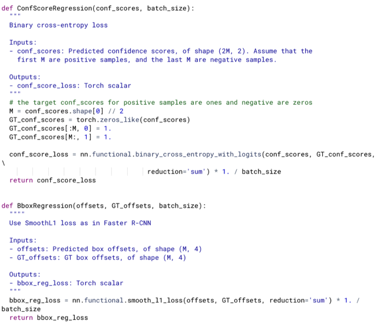</kbd>

<kbd></kbd>

<kbd>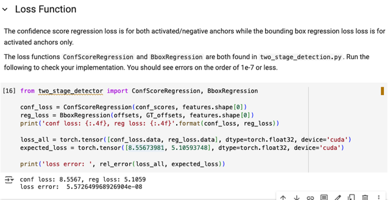</kbd>

> [!NOTE]
> Xem qua hai function giúp tính loss. Cái đầu có thể thấy input là predicted
> confidence score (2M, 2), với M "hàng" trên là "của" positive anchor, M "
> hàng dưới" là của negative anchor. Vì là bài toán binary classification, họ
> tạo target, ứng với positive class là các vector [1,0], còn target cho negative
> sample là [0,1]. Và dùng binary cross-entropy with logits giúp tính binary
> classification loss.
>
> Còn với box regression thì dùng smooth_l1_loss

 

<kbd>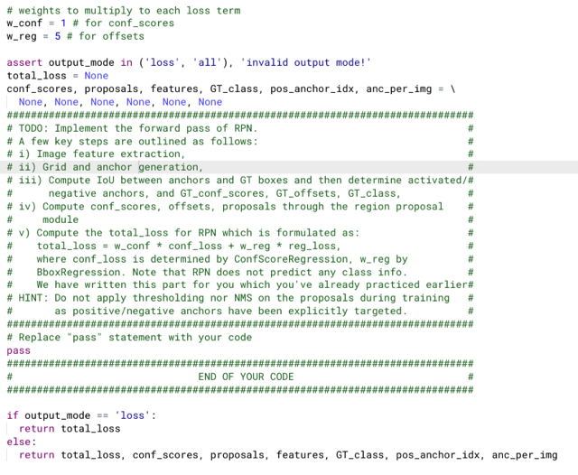</kbd>

<kbd>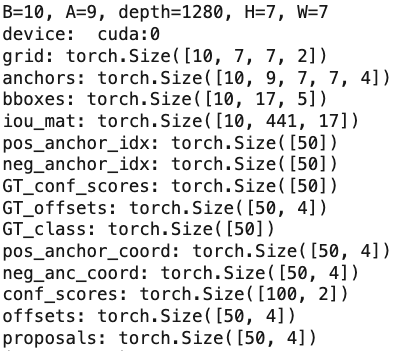</kbd>

<kbd>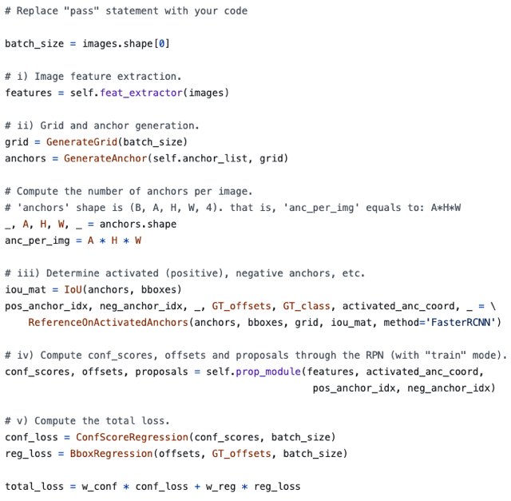</kbd>

<kbd>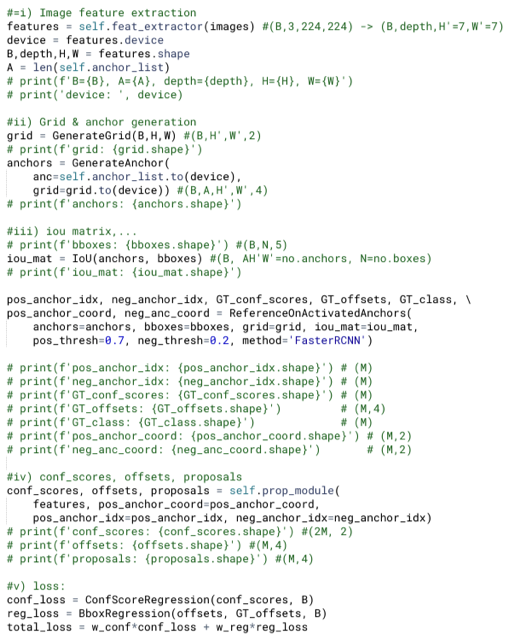</kbd>

<kbd>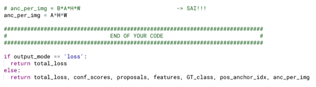</kbd>

<kbd></kbd>

<kbd></kbd>

<kbd></kbd>

<kbd></kbd>

<kbd></kbd>

<kbd>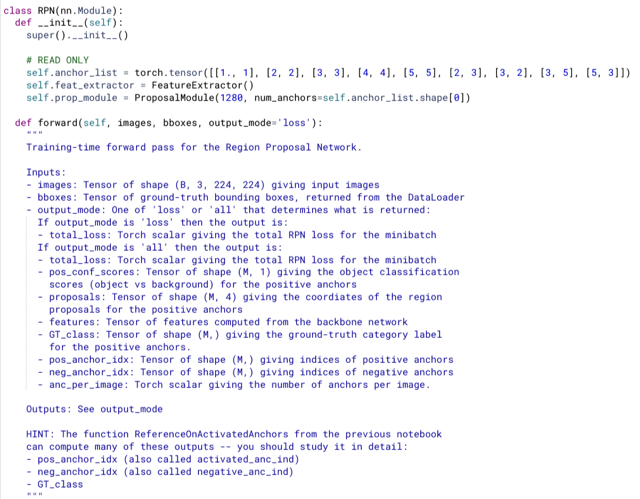</kbd>

> [!NOTE]
> 1. Inference qua backbone cnn (feature extractor) để có features (B,depth,
> H',W')
>
> 2. Generate grid, anchors, iou matrix sử dụng các function GenerateGrid,
> GenerateAnchor, IoU từ part 1.
>
> grid: (B,H',W',2)   anchors (B,A,H',W',4)   bboxes (B,N,5)
>
> iou_mat: (B, AH'W', N)
>
> Sau đó pass vào ReferenceOnActivatedAnchor để nó giúp làm  cái bước
> gán ghép (matching) các positive anchor với gt box. Kết quả là các tensor
> liên quan đến positive, negative anchor trong đó M LÀ TỔNG SỐ
> POSITIVE ANCHOR**TRONG BATCH**
>
> pos_anchor_idx: [M],     neg_anchor_idx: [M] :
>
> GT_conf_scores: [M]    GT_offsets: [M, 4]     GT_class: [M]
>
> ====
> Chú ý khúc này:
>
> \/***GT_conf_scores** có shape (M) là thật ra **chính là iou của các positive
> anchor với matched gt box của nó**. Và ta sẽ không dùng cái này, ở part1
> YOLO, có thể xem lại để thấy để tính confidence loss thì trong function
> người ta tạo target là 1 cho positive anchor, và 0 cho negative anchor và
> dùng Mean Square Error 
>
> Với part 2 cũng vậy **chỉ pass predicted confidence score** - (2M,2) (gồm cả
> positive và negative anchor) vào function **ConfScoreRegression**, ở **trong
> đó nó sẽ tạo target cho positive anchor là [1,0]**, và **negative anchor là [0,1]**.
> Và dùng **binary cross entropy loss.**\/
>
> ====
>
> 3. Pass features qua cho Region Proposal module cùng với pos_anchor_idx + 
> pos_anchor_coord để nó predict ra confidence scores, box regression và 
> proposals ở train mode tức là của positive/negative anchors
>
> conf_scores: (2M,2)     offsets (M,4)    proposals(M,4)

> [!NOTE]
> Tham khảo solution của seloufian: Cơ bản là giống, ngoại trừ mình mắc
> một sơ suất trong việc tính giá trị của anc_per_img phát hiện được nhờ 
> đối chiếu với Seloufian's solution

 

<kbd>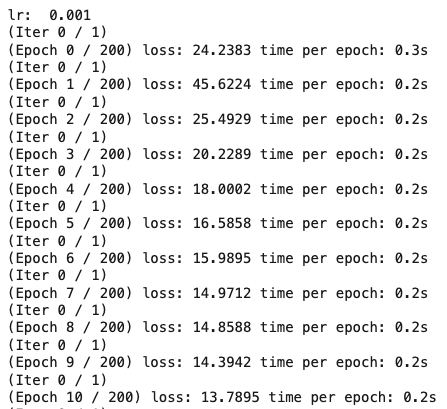</kbd>

<kbd>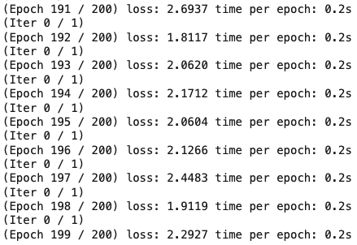</kbd>

<kbd>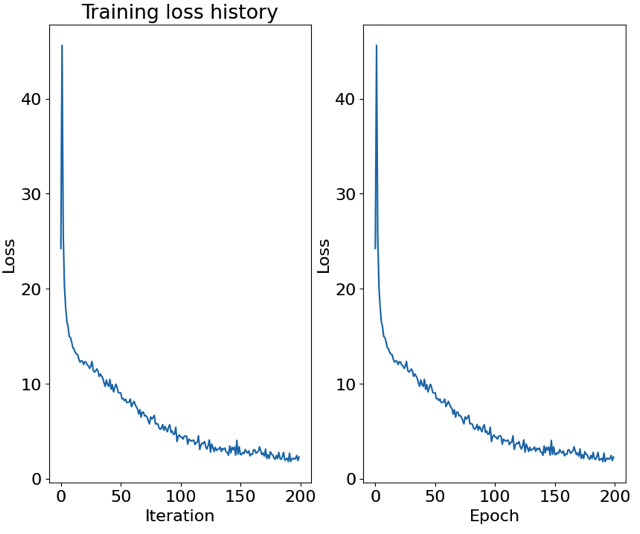</kbd>

<kbd></kbd>

<kbd></kbd>

<kbd></kbd>

<kbd>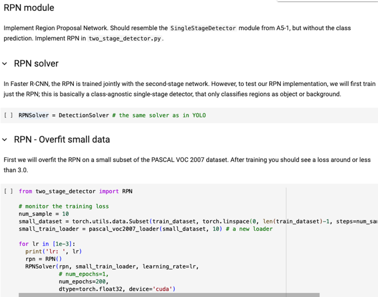</kbd>

> [!NOTE]
> Training cho thấy loss nhỏ hơn 3 như họ
> expect cho thấy ta đã làm đúng

 

<kbd>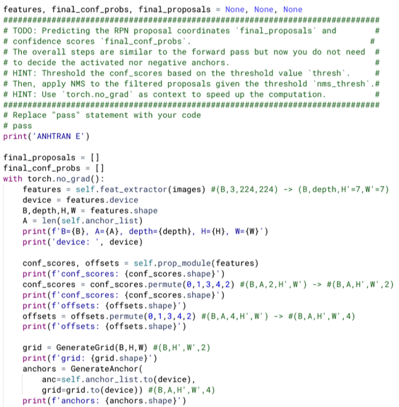</kbd>

<kbd>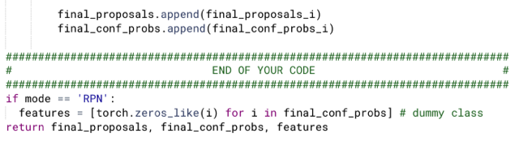</kbd>

<kbd>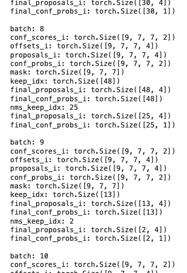</kbd>

<kbd>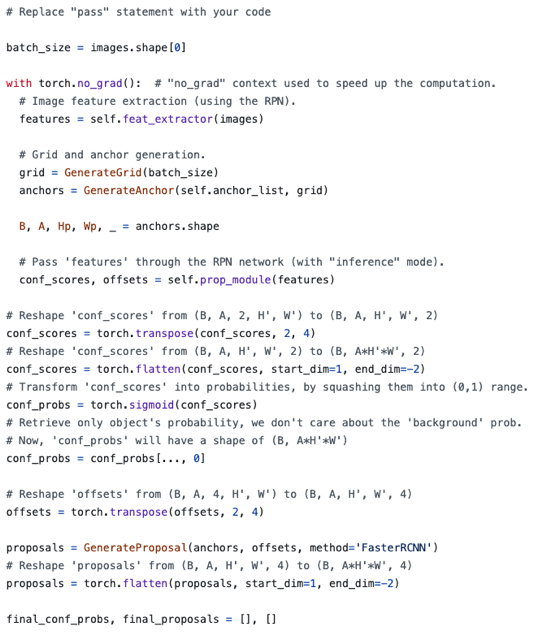</kbd>

<kbd>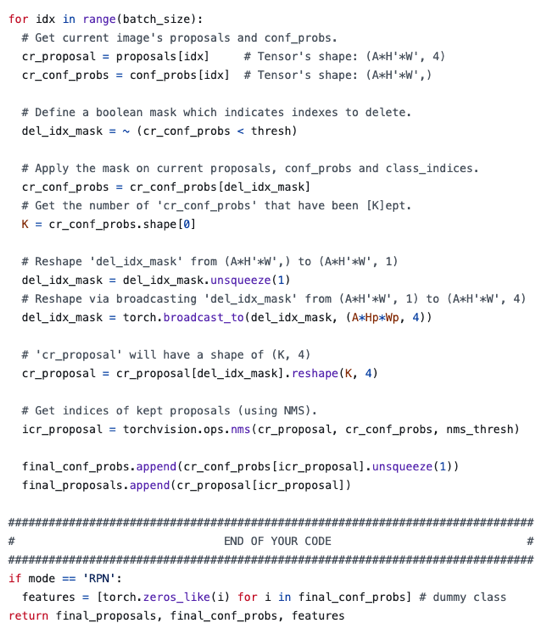</kbd>

<kbd>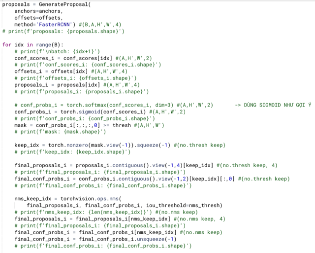</kbd>

<kbd></kbd>

<kbd></kbd>

<kbd></kbd>

<kbd></kbd>

<kbd></kbd>

<kbd></kbd>

<kbd>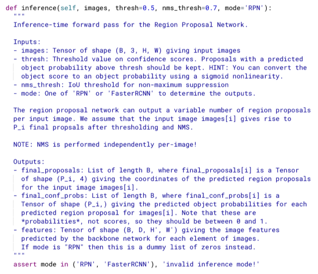</kbd>

> [!NOTE]
> ==LÀM NGUYÊN BATCH
>
> 1. FEATURE EXTRACTOR: Pass images tensor qua backbone cnn để extract feature
> maps.
>
> 2. PREDICT PROPOSED REGION: Pass features qua ProposalModule để predict 2
> tensor: Mỗi anchor: 2 gía trị object-ness confidence score (hay logit) và 4 giá trị box 
> offsets của mỗi anchors
>
> conf_scores (B,A,2,H',W') và offsets (B,A,4,H',W')
>
> 3. GENERATE GRID, ANCHOR VÀ PROPOSALS. Với predicted offsets, ta sẽ chuyển
> nó thành predicted proposals region nhờ function GenerateProposal đã làm. Thế thì
> nó sẽ cần thêm anchors (coordinate các anchors), nên ta cần tạo grids (với Generate
> Grid, và pass vào GenerateAnchor để có anchors)
>
> grid: (B,H',W',2)    anchors (B,A,H',W',4)    proposals (B,A,H',W',4)
>
> ==LÀM TỪNG SAMPLE
>
> 4. THRESHOLD: Tới đây phải làm CHO TỪNG SAMPLE RIÊNG, vì bước này
> ta sẽ xem thử với mỗi images, proposal box nào có object-ness probability thấp quá
> thì loại bỏ, sau đó loại bỏ bớt lần nữa qua Non-Maximal Suppression.
>
> Đầu tiên ta cần chuyển object confident scores thành object probability thông qua hàm
> \~SOFTMAX \~ **SIGMOID** (Sau khi đọc lại thì thấy học gợi ý dùng sigmoid, dù mình nghĩ hàm 
> softmax vẫn đúng nhưng cứ làm theo gợi ý). 
>
> Ta sẽ thresholding positive probability, là cái đầu trong hai cái. (A,H',W').
> Sau đó ta mới flatten thành ra một AH'W' vector, và pass vào torch.nonzero để lấy ra
> vector chỉ chứa indices (trong range 0-AH'W') của các vị trí khác 0. 
>
> keep_idx: (no.thresholding keep i) #no.thresholding keep i: ý nói số lượng giữ lại sau khi 
> threshold của sample I (mỗi sample sẽ mỗi khác)
>
> Và ta sẽ dùng nó để slicing các tensor proposals (cần chuyển về shape (AH'W',4)) và
> confidence probabilities (cần chuyển về shape (AH'W', 2)) trước khi slicing
>
> final_proposals_i (no.thresholding keep i, 4)
> final_conf_probs_i (np.thresholding keep i, 2)
>
> 5.NMS: Bước cuối cùng là loại bỏ bớt thông qua nms, đơn giản là pass object probabilities
> vào nms() để trả ra keep idx - **nms_keep_idx** vector chứa các id của các proposals sẽ được 
> giữ lại. Và ta sẽ dùng nó để slicing lần nữa trước khi add vào list final_proposals
>
> final_proposals_i (no.nms keep i, 4)
> final_conf_probs_i (np.nms i, 2)

> [!NOTE]
> Function này sẽ nhận tensor images với hai cái threshold, nhiệm vụ là trả
> ra: các proposed region và object confidence (object probability).
>
> Thì vì mỗi image sẽ có các proposal regions khác nhau, nên output sẽ  là
> dạng list, chứa B item, mỗi item ứng với một image. Gọi P_i là số proposed
> box còn lại của sample i sau khi loại bỏ bớt ở bước thresholding (tức là chỉ
> giữ những region có object probability cao) và ở bước nms. Thì ta với
> sample  i, hai tensor vại vị trí i trong hai list sẽ là là proposal i (P_i, 4) và
> confidence (P_i)

> [!NOTE]
> Tham khảo solution của seloufian: Hơi khác chút xíu ở chỗ:
>
> - Họ dùng sigmoid để chuyển thành probability
>
> - Threshold - liên quan đến cách mask và slicing. Tương tự
> như ở part 1 YOLO, đại ý cách làm của anh này là tạo và dùng
> boolean mask để sclicing, còn mình thì tạo non-zero indices để
> slicing.

 

<kbd>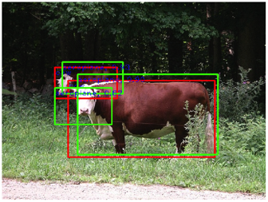</kbd>

<kbd>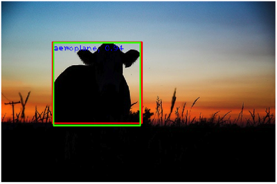</kbd>

<kbd>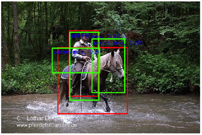</kbd>

<kbd>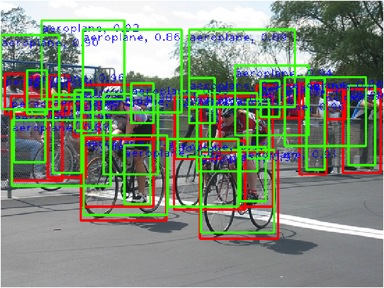</kbd>

<kbd>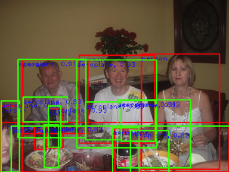</kbd>

<kbd>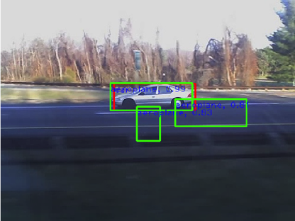</kbd>

<kbd>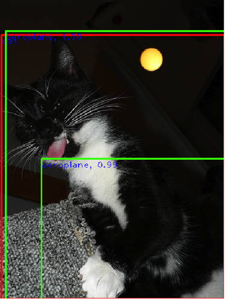</kbd>

<kbd>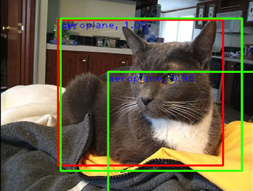</kbd>

<kbd>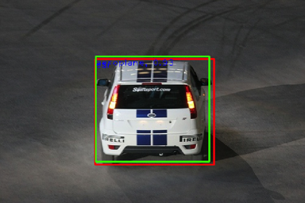</kbd>

<kbd>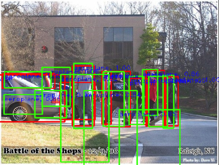</kbd>

<kbd></kbd>

<kbd></kbd>

<kbd></kbd>

<kbd></kbd>

<kbd></kbd>

<kbd></kbd>

<kbd></kbd>

<kbd></kbd>

<kbd></kbd>

<kbd></kbd>

<kbd>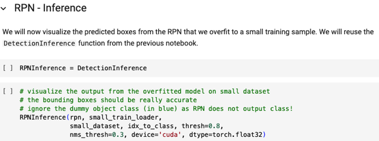</kbd>

 

<kbd>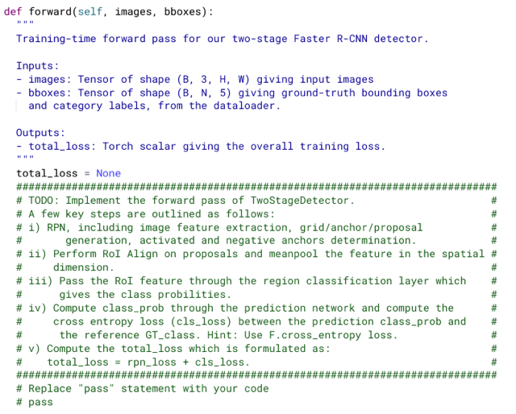</kbd>

<kbd></kbd>

<kbd></kbd>

<kbd></kbd>

<kbd></kbd>

<kbd></kbd>

<kbd></kbd>

<kbd></kbd>

<kbd></kbd>

> [!NOTE]
> Rồi, đây sẽ là mô hình Faster RCNN với hai stages, Trong init, ta sẽ define RPN module, và một Classification module đóng vai trò
> stage 2, nhận các feature của các "proposal  region" để dự đoán xem là class gì.
>
> Cấu tạo của classification layers ta hiểu là cần hai fully connected layer (xen kẽ bởi Dropout, ReLU).  FC layer đầu tiên sẽ nhận
> input là từ một tensor có shape [C,H,W] trong đó C - số channel sẽ chính là depth của features output từ backbone cnn, và spatial
> size H, W sẽ chính là quy định bởi roi_out_h và roi_out_w.
>
> *Một điểm nên nhớ trong bài giảng có nói , hai layer này chính là kiến trúc của phần đuôi của mô hình ResNet. (Khúc đầu làm
> backbone)
>
> Để hiểu điều này ta sẽ ôn lại một chút về lí thuyết: Trong Faster RCNN, Images tensor sẽ được pass qua backbone CNN để extract
> features. RegionProposalNetwork sẽ nhận features và dự đoán (đề xuất - propose) ra các " vùng có thể có object". Thế thì, ROI
> module sẽ giúp nôm na là  "trích xuất" features ứng với các proposed region này, đồng thời resize spatial size của chúng thành một
> kích thước định trước, (roi_out_h/w)
>
> Để rồi các roi output tensor này (có shape là (depth, roi_out_h, roi_out_w)) mới có chung size để rồi mới thông qua stage 2,
> classification layers sẽ dự đoán class cho từng proposed region.
>
> \~Như vậy, có thể chỗ này họ hơi sai sót một chút khi gợi ý rằng Linear layer thứ nhất có in_features là in_dim, mà đúng ra phải là:
>
> in_dim*roi_out_h*roi_dim_w, vì như đã nói output từ roi align modul có shape là (depth=in_dim, roi_out_h, roi_out_w).
>
> Điểm thứ hai có thể họ không nói nhưng mình phải tự hiểu đó là trước Linear layer phải có một Flatten layer, để flatten 3D tensor
> (in_dim, roi_out_h, roi_out_w)  thành vector (in_dim*roi_out_h*roi_out_w)
>
> Còn Linear layer thứ hai thì đương nhiên output dimensions sẽ là num_class để cho ra một vector các class scores.
>
> \~\/Lúc đầu, chưa để ý việc sẽ cần meanpool roi feature, còn khi đã meanpool để từ (B, in_dim,2,2) thành (B, in_dim), tức roi
> feature từ mỗi feature sẽ từ 3D  (in_dim, 2,2) trở thành vector (in_dim), thì đúng là Linear layer đầu tiên của  classification layers chỉ
> cần in_features = in_dim\/

> [!NOTE]
> Các bước của forward:
>
> 1. FEATURE EXTRACTING
>
> Đương nhiên là forward images qua RPN module, trong đó, nó sẽ tính toán  rpn loss, confidence scores, proposals, features,
> GT_class, và indices của positive anchors và negative anchors
>
> Vậy điểm chú ý ở đây đó là, đây là 'training' mode, nên như ta biết, khi forward qua RPN, thì bên trong function forward của nó, nó sẽ
> forward qua ProposalModule với positive/negative anchor indices, để rồi ProposalModule sẽ run ở train mode luôn và trả ra CHỈ
> NHỮNG KẾT QUẢ LIÊN QUAN TỚI POSITIVE, NEGATIVE  ANCHOR. Trong đó ví dụ như proposals sẽ có shape (M, 4): là SỐ
> POSITIVE ANCHOR TRONG BATCH.
>
> Và trong đó cũng có GT_class, vốn được tính toán bởi ReferenceOnActivatedAnchor function, có shape (M) mỗi giá trị chính là ground
> truth class id của cái gt box được gán với cái positive anchor tương ứng.
>
> 2.ROI ALIGN: 
>
> Tiếp theo, ta sẽ nhờ torchvision.ops.roi_align để từ các proposals và features nó sẽ chuyển thành tensor: (M, depth, roi_out_h,
> roi_out_w).
>
> *function này nó yêu cầu boxes argument là tensor (K,5) hoặc list các tensor (K,4) nên [\~ta tạo list trước khi pass vào: -> Sai]
>
> \~\/Nhờ Seloufian, đọc kĩ doc của function roi align, cho thấy trong trường hợp ta pass vào proposals là một single tensor thì phải có
> dạng [K,5] với cột đầu là index của sample trong batch - điều này có nghĩa  là phải cho torch biết, cái proposal thứ i (hàng thứ i của
> tensor [M,4]) LÀ THUỘC VỀ SAMPLE NÀO TRONG B SAMPLE. Vậy làm sao ta có cái này, thế thì để ý mình đã có positive anchor
> indices, là (M) vector mà giá trị là index của cái positive anchor trong tổng tất cả anchor trong batch = B*A*H'*W' = B*số anchor trong
> mỗi image. Vậy có nghĩa là các index này có range [0: B*số anchor trong mỗi image], nên nếu mình chia cho "số anchor trong mỗi
> image" thì mình sẽ đưa nó về range [0:B], và nó sẽ trở thành sample id của positive anchor (cũng là proposal) mà ta cần.
>
> Do đó mình mới chia pos_anchor_idx cho anc_per_img (chính là A*H'*W') Tiếp theo, chuyển nó thành shape (M,1) để rồi concat nó với
> proposals (M,4) theo dim = 1 để có boxes (M,5), pass vào as argument boxes.\/
>
> **các argument khác như output_size thì biết rồi, [\~còn spatial_scale sẽ là tỉ lệ giữa feature's spatial size / original image's spatial size
> -> SAI]\~
>
> \/Chỗ này nhờ Seloufian, đọc kĩ doc của arg spatial_scale mới thấy rằng chỉ khi ví dụ như mình dùng thuật toán Region Proposal trên
> original image để có proposals Sau đó project các proposals lên feature map, thì lúc này cần define spatial scale là (spatial size của
> feature map) / (spatial size của original image). Đây chính là  trường hợp của Fast RCNN.
>
> Tuy nhiên, với Faster RCNN, proposal regions được output bởi RPN, tính toán từ feature map, nên spatial scale sẽ là 1 là giá trị mặc
> định.\/
>
> 2B: ROL FEATURE MEAN-POOLING
>
> Sau khi tham khảo mới để ý việc họ nói ở mở đầu phần Faster RCNN về việc ta sẽ meanpool roi features, để chuyển roi aligned có 
> dạng (in_dim,2,2) thành vector (in_dim) bằng cách meanpool ở spatial dim: Hình dung đơn giản là với mỗi miếng 2x2 (có in_dim miếng) 
> ta sẽ tính trung bình. Thì từ 3D tensor sẽ thành 1D vector. Nhờ bước này, mà liên hệ đến việc Linear layer đầu tiên của classification
> layers sẽ có in_features = in_dim, và ko cần phải có nn.Flatten()
>
> 3.CLASSIFICATION
>
> Ta sẽ pass roi features qua classification layers, khi đó M nó sẽ treat như batch size - có nghĩa là, sẽ giống như việc ta pass một
> tensor  (B,C,H,W) vào classification layers thì mỗi 3D tensor (C,H, W) sẽ được flatten thành vector (C*H*W) và pass qua và các  Linear
> layer sau đó để cho ra một vector class scores. Và quá trình này sẽ xảy ra cùng lúc với B tensor. Sở dĩ nói lại chỗ này vì trong bài
> giảng có chi tiết rằng classification layers (tức stage 2) sẽ được apply cho từng proposed region
> - thì quả thực là như vậy nhưng không phải là một cách lần lượt, mà là đồng loạt như tính chất của vectorization mang lại.
>
> output sẽ có shape là (M, num_class) - mỗi một proposed region sẽ ứng với một vector có num_class = 20 class scores.
>
> 4. LOSS:
>
> Cuối cùng ta mới dùng đến GT_class - là vector (M): mỗi positive anchor / cũng là ứng với một proposed region là một giá trị ground
> truth class index. Pass hai tensor này vào nn.function.cross_entropy sẽ cho ra classification loss.
>
> 5.TOTAL LOSS: Cộng với rpn loss để có total loss.

> [!NOTE]
> Tham khảo solution của seloufian cho thấy những lỗi mình mắc phải:
>
> - Không để ý đến việc người ta nói về bước meanpool đối với output của
> roi, cái này sẽ liên quan đến số input features của Linear layer đầu tiên của
> classification layers.
>
> - Input cho argument boxes của ROI align trong trường hợp forward sẽ phải
> là một tensor có shape [K,5], với giá trị đầu tiên của mỗi hàng sẽ là index
> của sample trong batch.
>
> - Mình thấy Selufian không chỉ định spatial_scale đồng nghĩa dùng giá trị
> default = 1, đọc lại mới thấy vậy là đúng vì region propose output từ
> RPN-lấy input từ feature mập chứ không phải là nhờ dùng thuật toán
> Region Proposal trên image gốc rồi project lên feature map.

 

<kbd></kbd>

<kbd></kbd>

<kbd></kbd>

<kbd></kbd>

<kbd></kbd>

<kbd></kbd>

<kbd></kbd>

<kbd></kbd>

<kbd></kbd>

<kbd></kbd>

<kbd></kbd>

> [!NOTE]
> Chỗ này họ mô tả ngắn gọn lại quá trình tính toán của Faster RCNN:
>
> Cũng như ở slice trước, chỉ nhắc lại thêm chi tiết rằng với mỗi một proposed
> region, thì RoI Align sẽ warp (hiểu nôm na là "cắt ra") một vùng tương ứng
> từ  feature tensor.
>
> Sau đó nó sẽ resize về kích cỡ như 2x2, và qúa trình này được thực hiện
> mean-pooling (hay average pooling). Để rồi classification layer sẽ tính ra
> class scores. CHÚ Ý CHỖ NÀY, có nghĩa là với output từ RoI Align là tensor
> shape (B, depth=in_dim, roi_h=2, roi_w=2), in_dim là depth output từ cnn,
> luôn giữ  nguyên sau đó.
>
> Ta sẽ average pooling để từ 3D tensor  (in_dim,2,2) trở thành một vector
> (in_dim). Do đó ta mới thấy mô tả cấu trúc của classification layer sẽ có FC
> layer đầu tiên có in_features = in_dim. Nếu không có vụ meanpool này thì
> tất nhiên để "gắn" được với FC, phải có bước flatten và FC layer phải có
> in_features = in_dim*2*2
>
> ====
>
> Thế thì, bản đầy đủ của Faster RCNN sẽ có thêm một Box Regression nữa,
> Y như box regression giúp predict ra transformation để convert anchor
> thành Gt box, thì đây lại tiếp tục predict ra một transformation để transform
> proposed box thành gt box, mang hiệu quả là "refine propose region" thêm
> nữa.
>
> Điểm thứ hai, đại khái là nó có thể predict một proposed box là background
> đồng nghĩa là output sẽ là num_class + 1 class score
>
> Muốn làm vậy thì mình sẽ phải tính proposals cho cả các negative anchor,
> rồi chuẩn bị target cho chúng. Có thể thử sau,

> [!NOTE]
> Với những cải thiện từ Seloufian, loss đã nhỏ hơn
> 4 như họ nói

> [!NOTE]
> Trước khi sửa, loss chỉ đạt ngấp nghé mức 4.

 

<kbd></kbd>

> [!NOTE]
> Phải đọc kĩ yêu cầu của nó

 

<kbd></kbd>

<kbd></kbd>

<kbd></kbd>

<kbd></kbd>

<kbd></kbd>

<kbd></kbd>

<kbd></kbd>

<kbd></kbd>

<kbd></kbd>

<kbd></kbd>

<kbd></kbd>

> [!NOTE]
> 1. Pass images và các threshold vào RPB.inference(), chú ý là phải để mode = ' FasterRCNN' để
> nó trả ra features là cái features output từ backbone cnn.
>
> Lí do của cái vụ này là bởi vì....
>
> Vì là inference nên bên trong, khi qua ProposalModule's forward, nó sẽ trả  ra offsets và
> confidence scores của mọi anchors. Để rồi (trong RPN's forward) mới tính ra Proposals cho mọi
> anchor. Sau đó, qua quá trình làm với từng sample hai bước thresholding và nms. Kết quả cho ta
> các proposals và confidence list chứa proposal và confidence score của mỗi image (số lượng của
> mỗi image mỗi khác như đã biết).
>
> 2. Do đó bước tiếp theo ta cũng xét từng sample trong batch. Pass proposals của nó và features
> vào roi align để có roi feature (P_i,in_dim,2,2)
>
> Chỗ này cần chú ý (lúc đầu cũng làm sai) features pass vào đương nhiên "là của sample" i.
> Nhưng theo yêu cầu trong doc của roi align, **phải giữ batch dimension**, nên ta sẽ unsqueeze
> dim = 0 để feature_i có shape (1, in_dim, H', W')
>
> 2B: (Nhờ Seloufian) ta sẽ meanpool roi feature theo 2 dimension cuối, để  thành (P_i, in_dim)
>
> 3. Pass roi feature qua classification layers để có (P_i, num_class) - ứng với mỗi proposal là một
> vector predicted class scores.
>
> Dùng argmax dim=1 để có predicted class id.
>
> Append các tensor vào các list
>
> (Nhờ Seloufian) ta sẽ bổ sung thêm việc check xem image có proposals nào hay không để tránh
> lỗi trong lúc argmax. Cũng như là run qua classification với trạng thái no_grad.

> [!NOTE]
> Tham khảo solution của seloufian: 
>
> - Again, phải meanpool đối với output của roi
>
> - Feature đương nhiên là feature của sample tương ứng, nhưng 
> cần phải giữ 1st dimension = 1 (N=1, in_dim, H', W'
>
> - Again, spatial_scale phải bằng 1
>
> - Ngoài ra, bổ sung thêm việc inference qua classification với
> torch.no_grad() cũng như là check trường hợp không có proposed
> region nào

 

<kbd></kbd>

<kbd></kbd>

<kbd></kbd>

<kbd></kbd>

<kbd></kbd>

<kbd></kbd>

<kbd></kbd>

<kbd></kbd>

<kbd></kbd>

<kbd></kbd>

<kbd></kbd>

<kbd></kbd>

<kbd></kbd>

<kbd></kbd>

<kbd></kbd>

<kbd></kbd>

<kbd></kbd>

<kbd></kbd>

<kbd></kbd>

<kbd></kbd>

<kbd></kbd>

 

<kbd></kbd>

<kbd></kbd>

<kbd></kbd>

<kbd></kbd>

<kbd></kbd>

<kbd></kbd>

<kbd></kbd>

<kbd></kbd>

<kbd></kbd>

> [!NOTE]
> Kết quả training sau khi fix lỗi:
>
> - Tính sai anc_per_img (AH'W' thay vì BAH'W'),
>
> - Dùng sigmoid (thay vì softmax),
>
> - Dropout2d (thay vì Dropout) ProposalModule
>
> -> Loss đã **nhỏ hơn 3** như họ yêu cầu
>
> Eval loss: 1.64
>
> mAP đã đạt 15.33%

> [!NOTE]
> Kết quả training sau khi fix lỗi:
>
> - 1st Linear input feature
>
> - Thêm bước roi features meanpool
>
> - Các lỗi của roi_aligned
>
> + roi align spatial_scale = 1
>
> + vụ [K,5]
>
> -> Loss vẫn chưa nhỏ hơn 3 
>
> Eval loss: 3.634
>
> - mAP vẫn  không được nổi 1%

 

<kbd></kbd>

<kbd></kbd>

<kbd></kbd>

 

<kbd></kbd>

<kbd></kbd>

<kbd></kbd>

<kbd></kbd>

<kbd></kbd>

<kbd></kbd>

<kbd></kbd>

<kbd></kbd>

<kbd></kbd>

 

