# Eecs 498-007_598-005 (2020) Assignment 6: Network Visualization

📊 **Progress:** `9` Notes | `54` Screenshots

---

<kbd>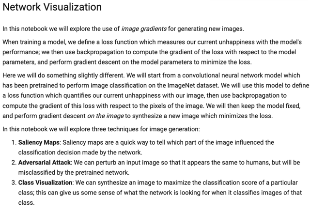</kbd>

> [!NOTE]
> đại ý là bình thường, khi train mô hình cho nhiệm vụ nào đó, ta sẽ pass image
> vào mô hình để tính ra prediction và loss, từ đó backpropagation để tính
> gradient của loss w.r. t model parameters.
>
> còn bây giờ, ta sẽ pass image (ban đầu để random), qua model mà model này
> đã được pretrained rồi, để tính loss rồi cũng backprop để tính gradient, có điều
> ta sẽ tính gradient của loss đối với image. Và dùng nó để thay đổi image khiến
> loss giảm chứ không phải thay đổi model params
>
> Vậy ta sẽ làm qua 3 cái liên quan đến cái này là Saliency Maps: giúp cho ta có
> thể hiểu được vùng nào của image ảnh hưởng nhất đến dự đoán của model.
>
> Adversarial Attack: Thay đổi một bức hình sao cho dưới mắt người thì nó vẫn 
> vậy, mà dưới mắt của mô hình thì nó là thứ khác.
>
> Class visualization: tạo image khiến tối đa hóa class score của một class nào đó
> từ đó có thể cho chúng ta hiểu được phần nào rằng khi model nó ra quyết định
> nó sẽ nhìn vào cái gì.

 

<kbd>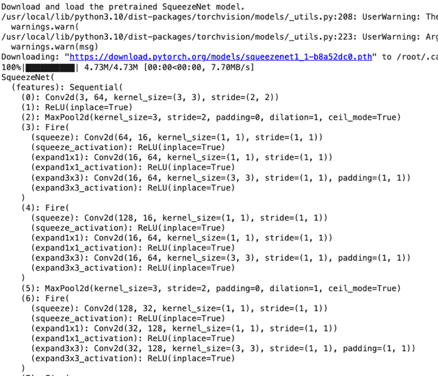</kbd>

<kbd></kbd>

<kbd>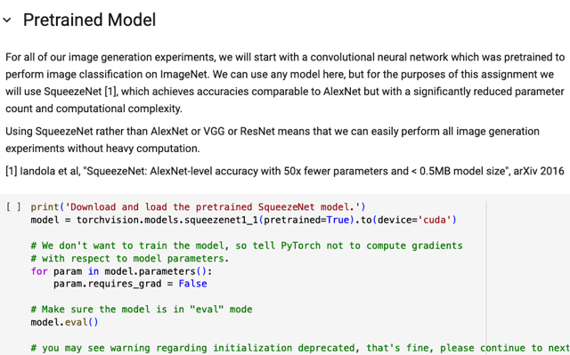</kbd>

> [!NOTE]
> như mới nói, ta sẽ dùng pretrained cnn model, thế thì họ chọn
> SqueezeNet, là model nhỏ hơn AlexNet nhưng có hiệu suất tương đương
> nhằm tiết kiệm chi phí tính toán và thời gian

 

<kbd>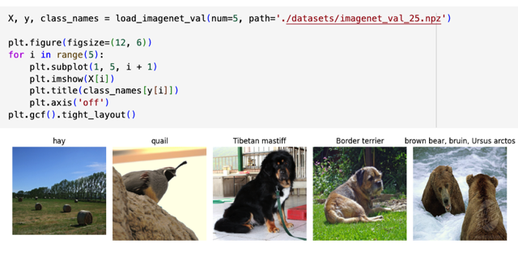</kbd>

<kbd></kbd>

<kbd>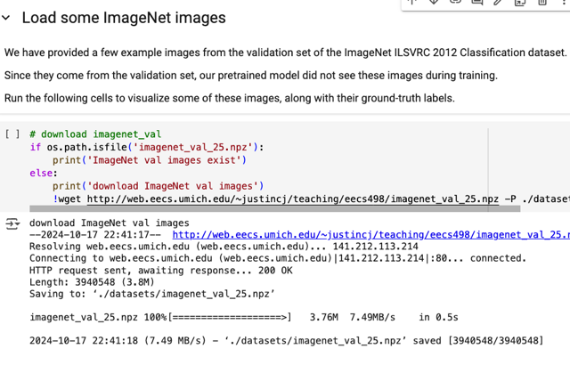</kbd>

> [!NOTE]
> Load một vài ImageNet image

 

<kbd>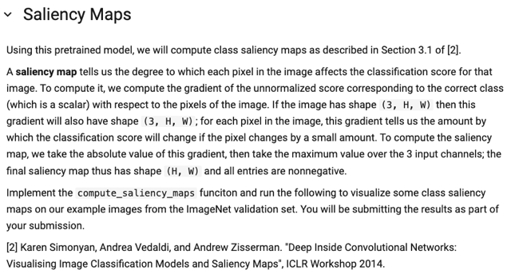</kbd>

> [!NOTE]
> để tạo saliency map với gradient, đơn giản là mình tính gradient của
> correct class score output từ last FC layer, đối với image pixel.
> vì image tensor RGB có shape 3xHxW, thì gradient cũng vậy. Nên ta sẽ
> lấy giá trị tuyệt đối và max trên 3 channel tại mỗi pixel để có kết quả là
> HxW.

 

<kbd>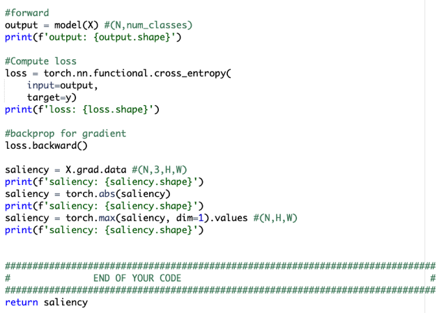</kbd>

<kbd>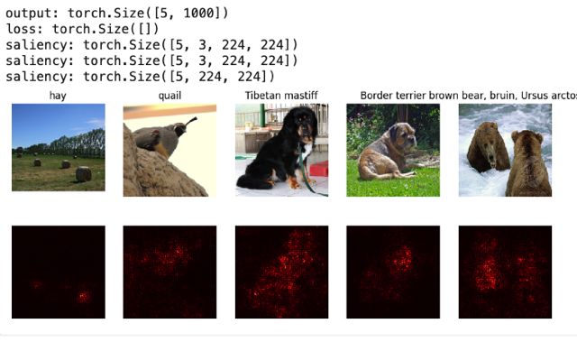</kbd>

<kbd></kbd>

<kbd></kbd>

<kbd>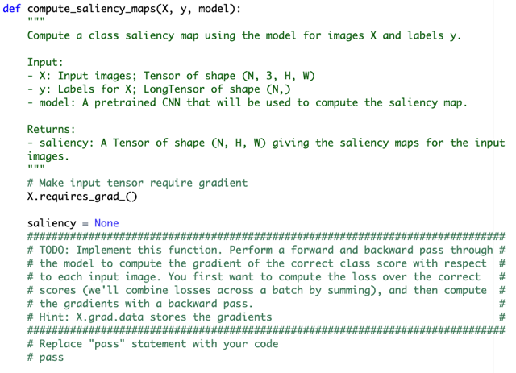</kbd>

> [!NOTE]
> Có thể thấy ví dụ như hình con chó, những vùng ảnh hưởng đến class score
> `-` loss nhất chính là vùng ảnh gắn với con chó

 

<kbd>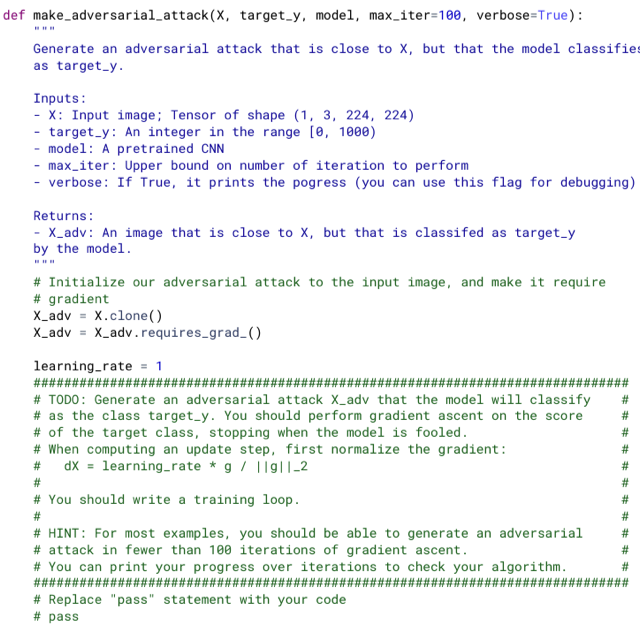</kbd>

<kbd>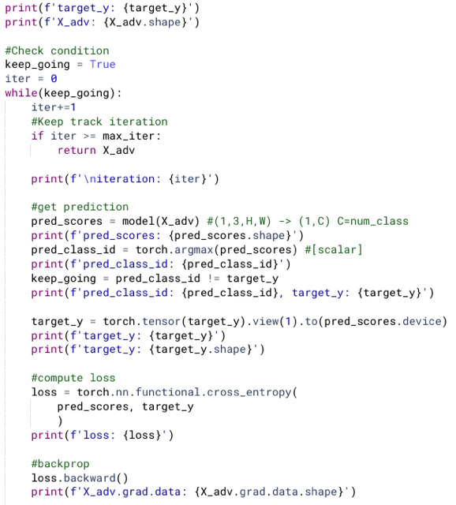</kbd>

<kbd>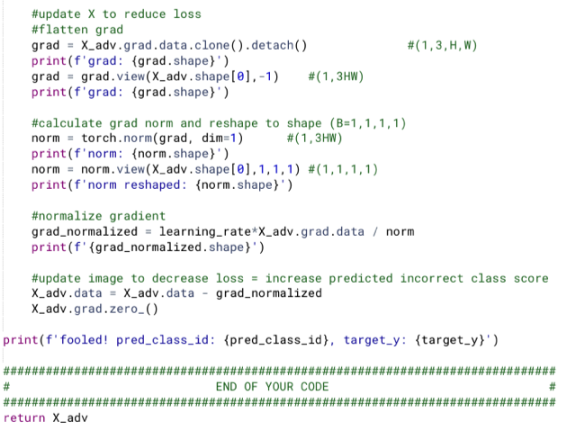</kbd>

<kbd>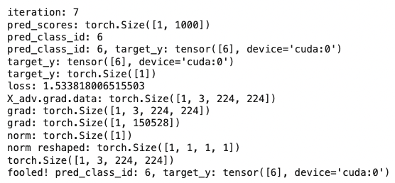</kbd>

<kbd></kbd>

<kbd></kbd>

<kbd></kbd>

<kbd></kbd>

<kbd>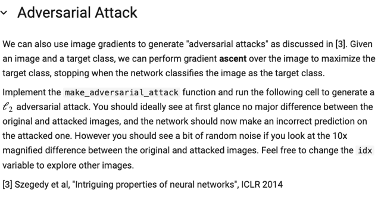</kbd>

> [!NOTE]
> còn với Adversarial Attack, ta sẽ dùng tính gradient của một incorrect class
> core đối với image để update image theo hướng khiến class score này tăng
> lên (gradient ascent), và một khi wrong class score này đã vượt correct class
> score thì dừng. Lúc này mình đã tạo ra sự thay đổi tối thiểu để (hi vọng) mắt
> người ko nhận ra nhưng với model nó đã đoán sai

> [!NOTE]
> Forward qua model để có prediction (predicted class scores)
>
> Argmax để có predicted class id.
>
> Lúc này ta mới so sánh xem predicted class id có bằng với target class id
> `(target_y)` chưa, nếu có tức là model đã bị lừa, ta có thể dừng. Nếu chưa,
> ta sẽ tiếp tục dùng gradient để sửa lại image.
>
> Dùng view(1) để chuyển predicted class id thành vector dù chỉ có 1 phần
> tử, vì khi tính loss cần. Cũng chuyển nó lên cùng device với `pred_scores.`
>
> Tính loss cross entropy. Giữa predicted score và target y. Để rồi ta sẽ
> backprop, rồi update image sao cho loss giảm, có nghĩa là vẫn gradient
> descent với ý nghĩa loss giảm, thì đồng nghĩa là model phải đẩy class
> score của fake class tăng lên.
>
> Sau khi backward.
>
> Tính gradient norm (flatten thành vector, dùng torch.norm, và reshape lại
> thành (B,1,1,1) để `X/norm` sẽ chia mọi vị trí cho norm `(element-wise)`
>
> Normalized gradient xong thì dùng nó để update `X_adv` theo hướng ngược
> với gradient (để loss giảm, như đã nói bằng cách đẩy class score của wrong
> class lên

 

<kbd>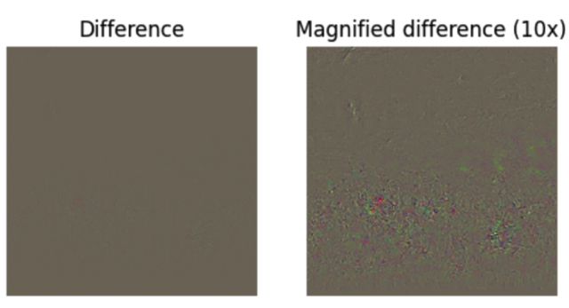</kbd>

<kbd></kbd>

<kbd>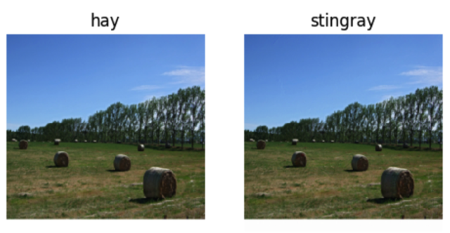</kbd>

 

<kbd>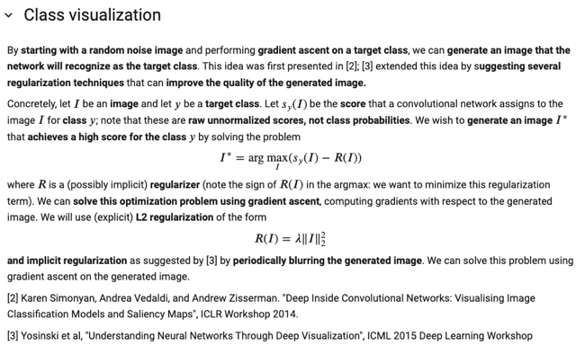</kbd>

> [!NOTE]
> với cái này, ta sẽ bắt đầu với random noise image, và một target class và
> mục đích là dùng gradient ascent của target class score with respect to
> image để mà thay đổi nó theo hướng target class score ngày càng tăng lên.
>
> Bên cạnh đó có vài regularization technique nhằm khiến generated image
> trông tự nhiên hơn.
>
> Công thức có ý nghĩa là ta sẽ `tìm/tạo` ra image I sao cho tối đa hóa class
> score ứng với class y do model dự đoán khi đánh giá image I, Nhưng đồng
> thời phải giảm regularizer `-` dùng l2 regularizer.
>
> NGoài ra còn một cái gọi là implicit regularizer, bằng cách đều đặn định kì
> làm mờ bức hình.

 

<kbd>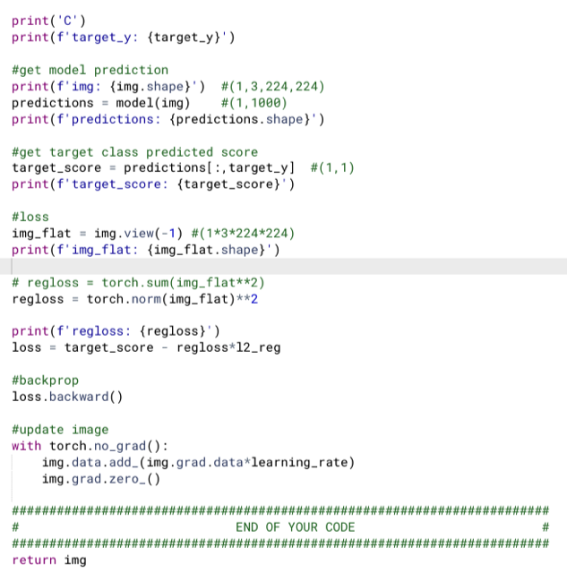</kbd>

<kbd>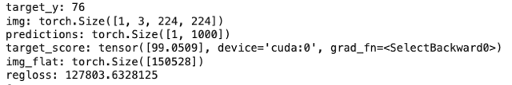</kbd>

<kbd></kbd>

<kbd></kbd>

<kbd>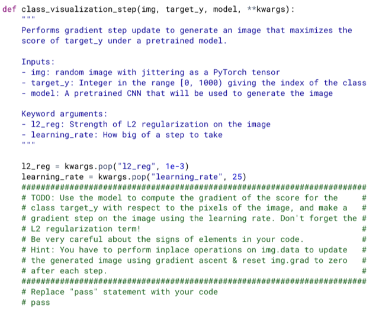</kbd>

> [!NOTE]
> với cái này, ta sẽ bắt đầu với random noise image, và một target class và
> mục đích là dùng gradient ascent của target class score with respect to
> image để mà thay đổi nó theo hướng target class score ngày càng tăng lên.
>
> Bên cạnh đó có vài regularization technique nhằm khiến generated image
> trông tự nhiên hơn.
>
> Công thức có ý nghĩa là ta sẽ `tìm/tạo` ra image I sao cho tối đa hóa class
> score ứng với class y do model dự đoán khi đánh giá image I, Nhưng đồng
> thời phải giảm regularizer `-` dùng l2 regularizer.
>
> NGoài ra còn một cái gọi là implicit regularizer, bằng cách đều đặn định kì
> làm mờ bức hình.

 

<kbd>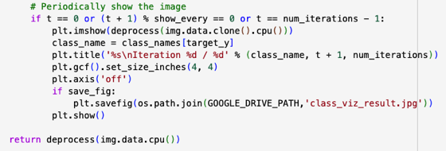</kbd>

<kbd></kbd>

<kbd>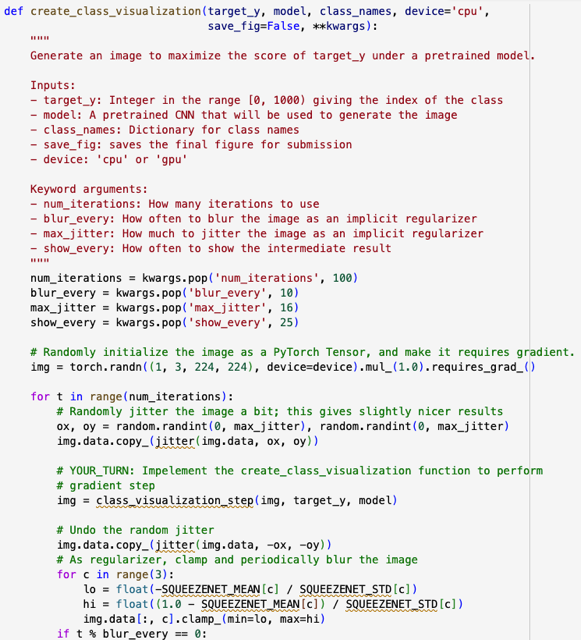</kbd>

 

<kbd>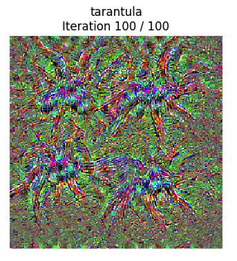</kbd>

<kbd>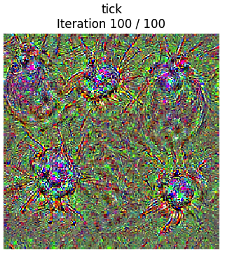</kbd>

<kbd>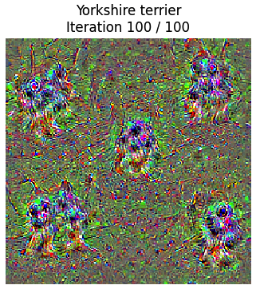</kbd>

<kbd>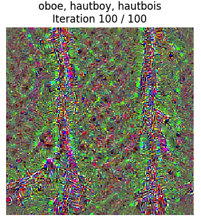</kbd>

<kbd>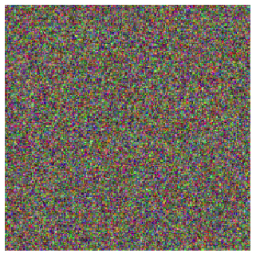</kbd>

<kbd>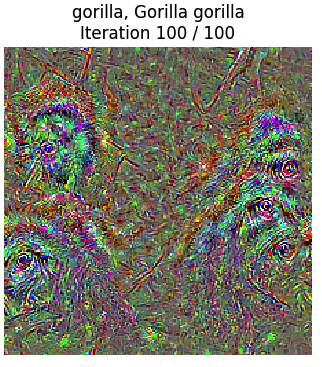</kbd>

<kbd>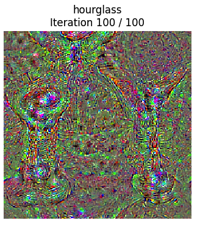</kbd>

<kbd></kbd>

<kbd></kbd>

<kbd></kbd>

<kbd></kbd>

<kbd></kbd>

<kbd></kbd>

<kbd></kbd>

<kbd>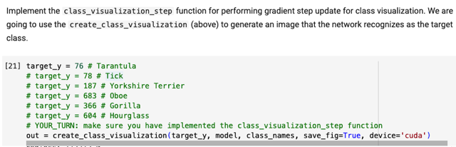</kbd>

 

<kbd>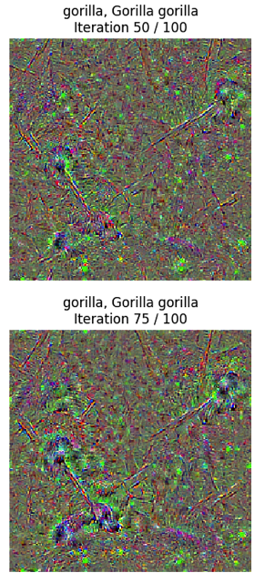</kbd>

<kbd>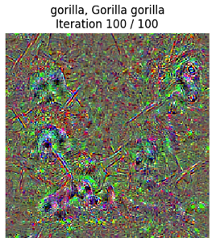</kbd>

<kbd></kbd>

<kbd></kbd>

<kbd>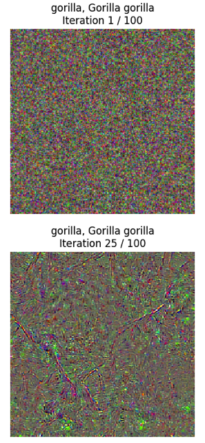</kbd>

 

