# Eecs 498-007_598-005 (2020) Assignment 6: Style Transfer

📊 **Progress:** `11` Notes | `61` Screenshots

---
<a id="node-1744"></a>

<p align="center"><kbd>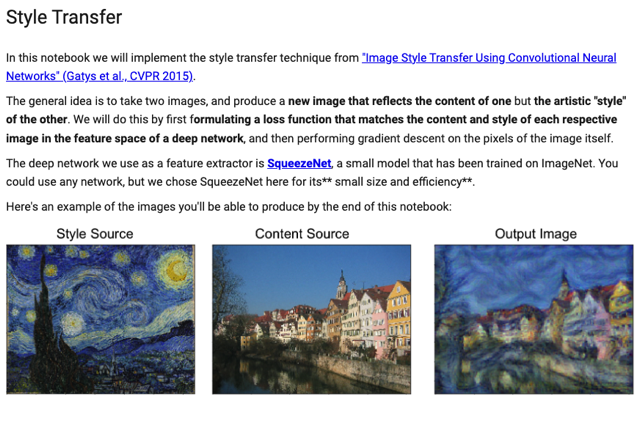</kbd></p>

> [!NOTE]
> Notebook này mình sẽ làm technique `Style-Transfer.` Ý tưởng chung là lấy hai
> bức hình, và tạo ra một bức hình sao cho lấy nội dung từ một cái và lấy style
> của cái kia.
>
> Thì bước đầu tiên cần làm là xây dựng một loss function sao cho phản ánh
> được mục tiêu đó là (khi giảm loss) thì cái hình tạo ra sẽ có content gần với
> content của ảnh 1 và style thì giống style của ảnh 2.
>
> Ta sẽ dùng SqueezeNet (một CNN model đã pretrained trên ImageNet) để 
> extract features vì tính chất gọn nhẹ của nó.

<br>

<a id="node-1745"></a>

<p align="center"><kbd>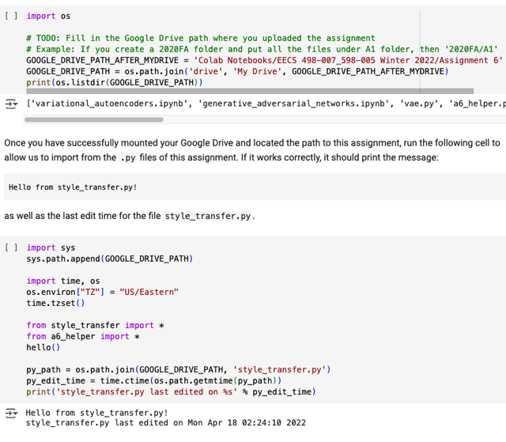</kbd></p>

<p align="center"><kbd></kbd></p>

<p align="center"><kbd></kbd></p>

<br>

<a id="node-1746"></a>

<p align="center"><kbd>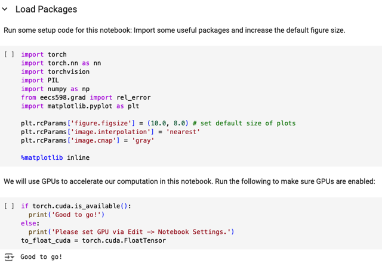</kbd></p>

<br>

<a id="node-1747"></a>

<p align="center"><kbd>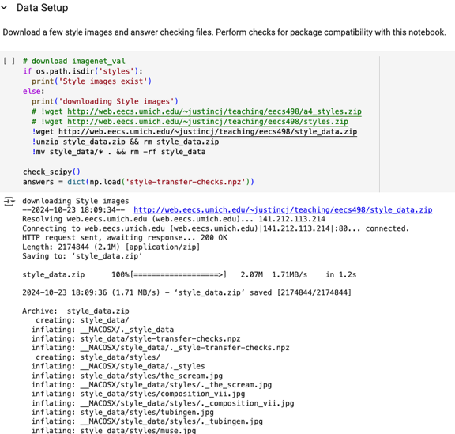</kbd></p>

> [!NOTE]
> Download dataset

<br>

<a id="node-1748"></a>

<p align="center"><kbd>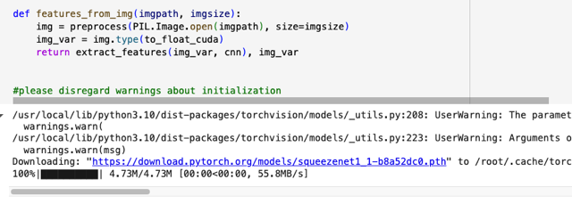</kbd></p>

<p align="center"><kbd></kbd></p>

<p align="center"><kbd>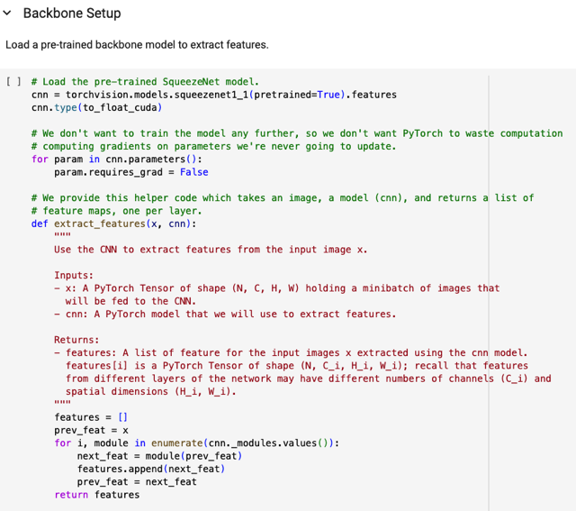</kbd></p>

> [!NOTE]
> đoạn code giúp load pretrained SqueezeNet model với torchvision và
> như đã biết ta sẽ không đụng đến model parameters nữa, mà  chỉ dùng
> model như một function giúp extract feature cũng như là style của
> image thôi. Do đó ở đây, họ iterate qua các parameters của model và
> set `requires_grad` `=` False để lock chúng lại.
>
> Đồng thời họ cũng chuẩn bị cho mình function giúp extract features. ở
> trong đó, có thể thấy cơ bản là dùng cnn._modules.values() để có list
> các modules của model `-` tức là các layer của model
>
> để rồi khi pass input vào, thì qua mỗi layer, lấy output của nó (tức là
> feature đó) bỏ vào list trước khi pass vào layer tiếp theo.

<br>

<a id="node-1749"></a>

<p align="center"><kbd>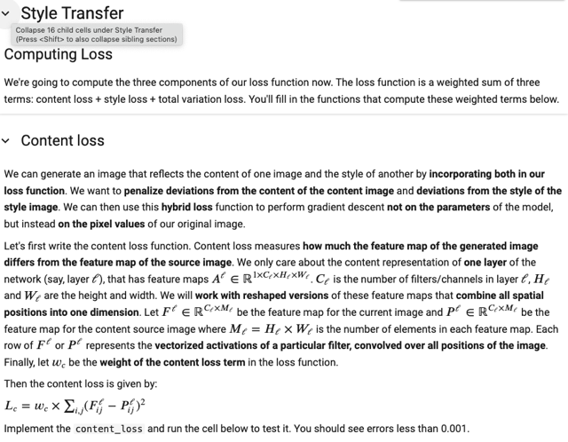</kbd></p>

> [!NOTE]
> đại khái là loss của bài toán này gồm 3 loại: content loss, style loss và total
> variation loss.
>
> Đại ý là để đạt được mục đích của bài toán đặt ra, luôn luôn phản ánh trong
> loss function mà ta xây dựng. Thế thì trong style transfer, ta muốn tạo ra một
> bức ảnh có nội dung của một ảnh gốc thứ nhất (gọi là content  image) thì ta
> sẽ phản ánh điều đó bằng một content loss sao cho ảnh chế càng giống
> content image về mặt nội dung thì content loss càng nhỏ.
>
> Tương tự, ta muốn ảnh chế giống phong cách của một bức ảnh khác (gọi là
> style image) thì ta tạo style loss sao cho hai bức ảnh càng giống style nhau
> thì style loss càng nhỏ. Để rồi tổng hai loss đó lại dùng nó để train ra image
> bằng gradient descent `-` tweak các giá trị của generated image bằng gradient
> sao cho loss ngày càng giảm dần.
>
> Thế thì với content loss, để phản ánh mức độ khác nhau giữa content của
> hai image, thì ta sẽ dùng sự khác nhau giữa feature map của chúng sau khi
> pass chúng qua cnn.
>
> Như đã quá rành, output của một layer nào đó của CNN (cái squeezenet ở
> trên) sẽ có shape là (C,H',W') với H',W' là spatial size, C là depth chính là số
> filter của conv layer mà ta lấy output từ đó làm feature. Thế thì đương  nhiên
> là có nhiều layer, nên gọi `(C_l,H_l,W_l)` là feature map bởi layer thứ l Ôn lại
> một chút thì ta đã biết, l nhỏ, tức các layer ở đầu, thì các feature mang tính
> chất `low-level,` phản ánh những quy luật thô sơ, sơ cấp, đơn giản còn l lớn
> hơn `-` các layer sâu hơn, thì feature phản ánh các pattern cao cấp, phức tạp
> hơn.
>
> Thế thì feature map có thể hiểu là sự chắt lọc (extraction) các đặc điểm
> chính của bức ảnh ban đầu bởi cnn model. Và do đó, nó hàm chứa nội dung
> của bức ảnh. Thành ra, để xây dựng loss phản ánh sự khác nhau nhiều ít
> của nội dung giữa hai bức ảnh, thì ta sẽ tính difference `/` distance giữa
> feature map của chúng.
>
> ```text
> Trong đây người ta nói rằng, từ feature có shape (B=1,C_l,H_l,W_l) hình dung
> ```
> ```text
> như một xấp (C_l) miếng kích thước (H_l,W_l) mỗi miếng ứng với / là kết
> ```
> quả convolution của một filter của layer là điều dễ hiểu. Vậy tính difference
> giữa hai feature map thật ra **đơn giản là ta tính chỉ là tổng bình phương
> `element-wise` distance giữa các giá trị giữa hai tensor.** Làm như họ ở đây thì
> cũng không khác gì, chẳng qua là reshape một feature map thành vector, để
> ```text
> từ "3D" tensor trở thành 2D matrix, (C_l, H_l*W_l), mỗi hàng là một vector -
> ```
> tương ứng với một "miếng" `-` kết quả của một filter.
>
> Nói chung nhìn công thức thì cũng là hiệu hai hàng tương ứng, bình phương
> lên, để được một vector, xong tổng lại hết ở cả hàng và cột. Và nhân với một
> trọng số wc khống chế sức nặng của content hay style.

<br>

<a id="node-1750"></a>

<p align="center"><kbd>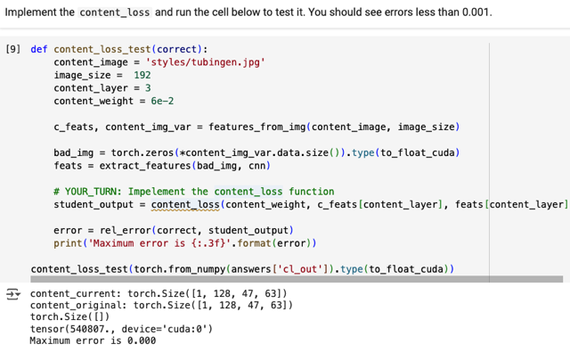</kbd></p>

<p align="center"><kbd></kbd></p>

<p align="center"><kbd>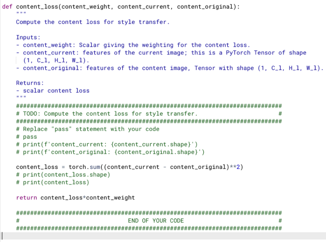</kbd></p>

<br>

<a id="node-1751"></a>

<p align="center"><kbd>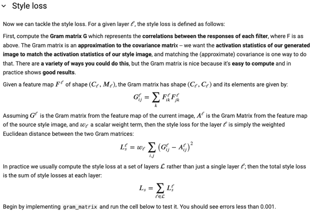</kbd></p>

> [!NOTE]
> Rồi, trong note lúc xem bài giảng đã hiểu Gram matrix tại sao lại đại diện cho
> quy luật texture `/` style của image bằng cách chứa đựng thông tin về sự tương
> quan giữa các feature (kết quả convol bởi các filter khác nhau), nên có thể coi
> nó  là ước lượng approximation của covariance matrix
>
> Vì vậy ta sẽ dùng nó để làm target cho generated image về mặt phong cách
> bằng cách xây dựng style loss là l2 distance giữa Gram matrix của hai bức
> hình, để hướng dẫn model thay đổi bức hình sao cho activation (cũng là tên
> gọi của feature map) của nó cũng có sự tương quan giữa các feature giống
> như của hình gốc, biểu hiện là Gram matrix của generated feature giống với
> gram matrix "mẫu", thì kết qủa là hình chế sẽ giống style hình mẫu.
>
> Ngoài ra ta còn được biết thêm thật ra có thể có nhiều cách làm khác, nhưng
> dùng Gram matrix là đủ tốt vì nó dễ tính.
>
> Cuối cùng là về công thức thì đã phân tích trong phần note bài giảng, để hiểu
> rằng ở đây là phiên bản tạm gọi là đơn giản của Gram matrix, cho phép tính
> toán hiệu quả hơn qua vectorization.
>
> Features của bức hình như đã nói đã flatten để thành matrix F (C, HW), mỗi
> hàng là một vector mọi giá trị của một feature map. Thì lấy F@F.T `=` (C, HW)
> (HW, C) cho ta Gram matrix (C,C). Và ta sẽ tính style loss là L2 distance giữa
> hai Gram matrix của (image mẫu và của image fake). 
>
> Tuy nhiên không chỉ dùng Gram matrix bởi feature tại một layer, mà sẽ là
> nhiều layer. Có nghĩa là ta sẽ với layer một cặp gram matrix `->` tính distance 
> để ra style loss tại layer này. Và style loss sẽ là weight sum các style loss tại
> các layer.

<br>

<a id="node-1752"></a>

<p align="center"><kbd>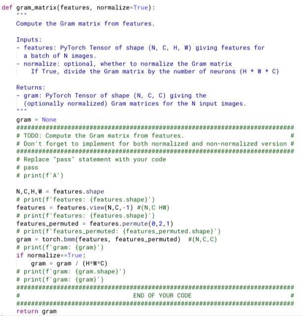</kbd></p>

<br>

<a id="node-1753"></a>

<p align="center"><kbd>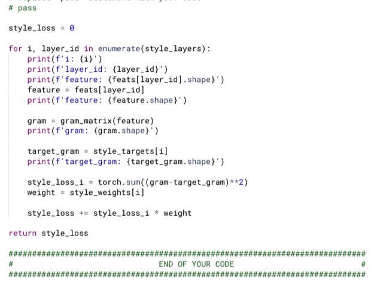</kbd></p>

<p align="center"><kbd></kbd></p>

<p align="center"><kbd>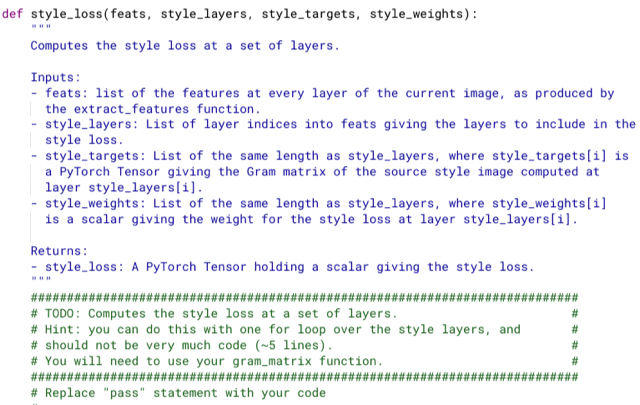</kbd></p>

> [!NOTE]
> Iterate qua item của `style_layers` cho ta index của các layer sẽ được
> dùng để lấy feature khi tính Gram matrix, dùng nó `layer_id` để lấy
> feature, pass vào function `gram_matrix` để tính Gram matrix.
>
> Còn trong `style_target` thì dùng (iterate) index (0,1,2..., phân biệt nới
> `layer_id` chứa trong `style_layers)` để lấy target Gram matrix.
>
> Style loss là tổng các l2 distance của cặp Gram matrix, weighted bởi
> weight tương ứng, cũng được lấy bởi (iterate) index

<br>

<a id="node-1754"></a>

<p align="center"><kbd>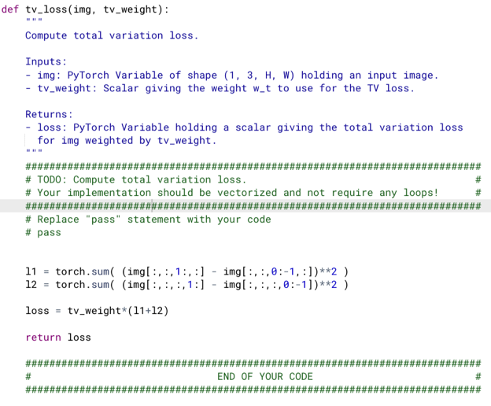</kbd></p>

<p align="center"><kbd></kbd></p>

<p align="center"><kbd>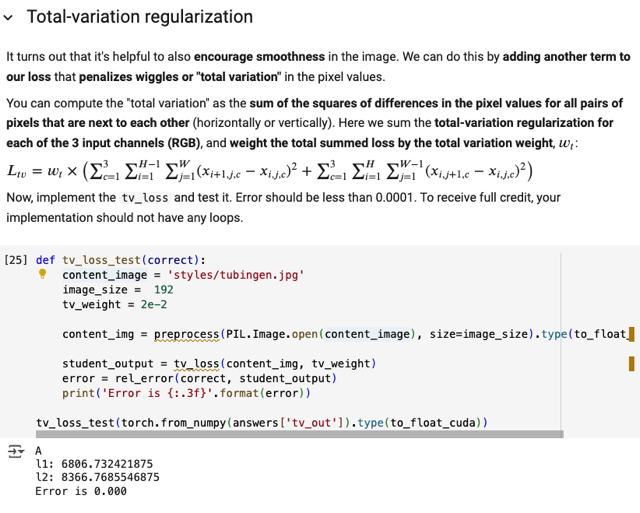</kbd></p>

> [!NOTE]
> đại khái là một penalty loss term để "làm mượt" `-`
> encourage smoothness trong image.

<br>

<a id="node-1755"></a>

<p align="center"><kbd>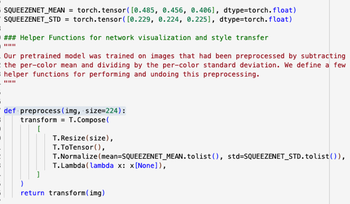</kbd></p>

<p align="center"><kbd>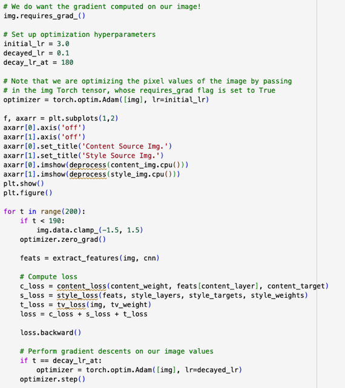</kbd></p>

<p align="center"><kbd></kbd></p>

<p align="center"><kbd></kbd></p>

<p align="center"><kbd>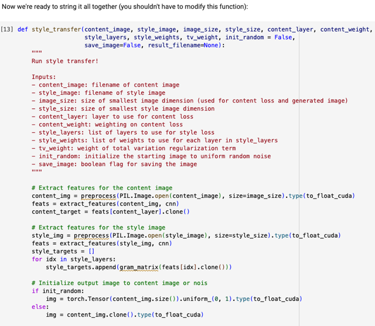</kbd></p>

> [!NOTE]
> Dùng PIL.Image.open('an image path') để "open" content image và style
> image file path. Dùng **preprocess()** function để preprocess image,
> trong đó ta thấy họ tạo **torchvision.transform Compose** gồm các bước
> **resize**, **chuyển thành tensor**, **normalize** với các giá trị**mean và
> standard deviation của SqueezeNet** (điều này là dễ hiểu khi bước
> preprocess phải tuân theo những thông số khi train SqueezeNet), cuối
> cùng là một lambda function làm cái việc **chuyển x thành x[None]** tức
> là nó sẽ**extend một dimension** (để có batch dimension) để t**ừ (3,H,
> W) thành (1,3,H,W)**Tạo `content_target,` `style_targets.`
>
> Khởi tạo một random image, hoặc bắt đầu với content image. Cái này
> sẽ default là dùng content image, để tí nữa ta sẽ dùng option true khi
> làm feature inversion `-` đại khái là dùng gradient của content loss để
> chuyển một random image để dần dần nó có feature của cái hình gốc.
>
> Chỉ định `requires_grad` với img.
>
> Set up vài hyperparams của optimizer như lr và lr decay.
>
> Dùng Adam optimizer.
>
> Tạo training loop:
>
> Reset gradient.
>
> Pass image qua `extract_features` để có features. Tính content loss, style
> loss và variation loss.
>
> Backprop để có gradient của loss w.r.t image pixel
>
> gọi optimizer.step()

<br>

<a id="node-1756"></a>

<p align="center"><kbd>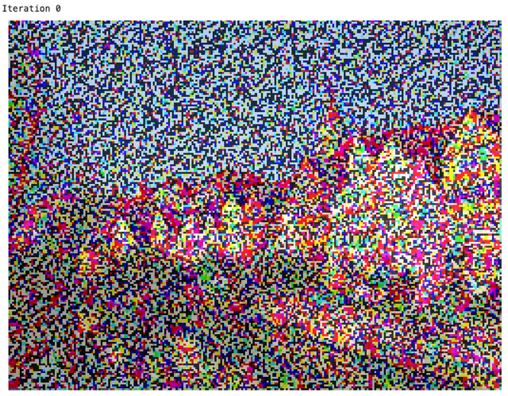</kbd></p>

<p align="center"><kbd>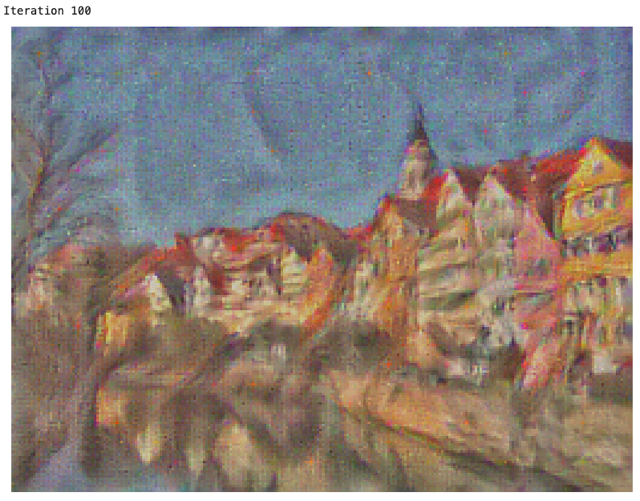</kbd></p>

<p align="center"><kbd>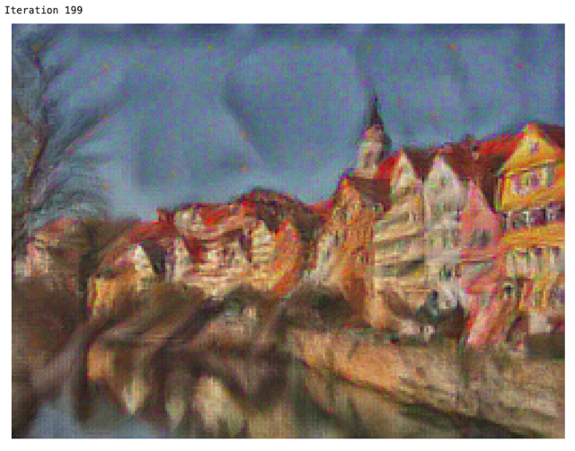</kbd></p>

<p align="center"><kbd></kbd></p>

<p align="center"><kbd></kbd></p>

<p align="center"><kbd></kbd></p>

<p align="center"><kbd>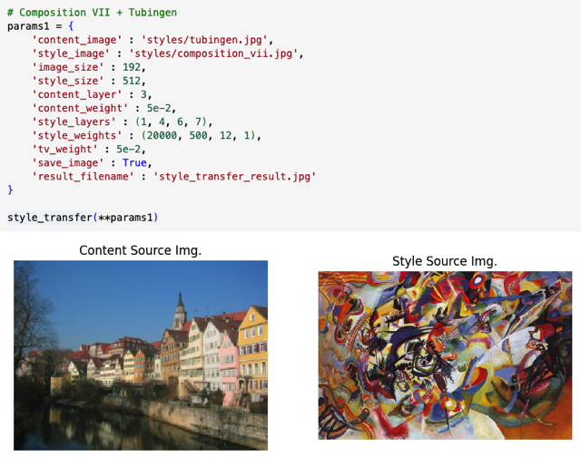</kbd></p>

<br>

<a id="node-1757"></a>

<p align="center"><kbd>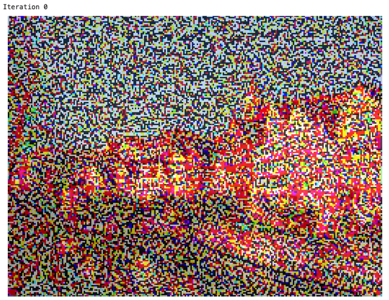</kbd></p>

<p align="center"><kbd>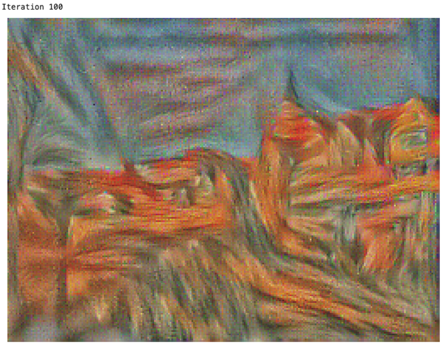</kbd></p>

<p align="center"><kbd>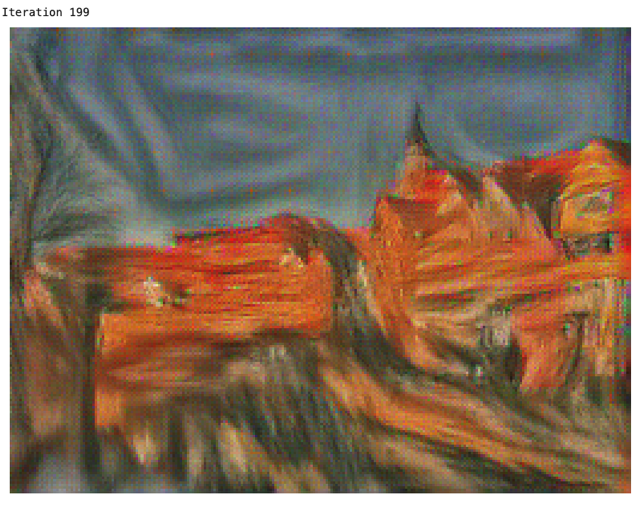</kbd></p>

<p align="center"><kbd></kbd></p>

<p align="center"><kbd></kbd></p>

<p align="center"><kbd></kbd></p>

<p align="center"><kbd>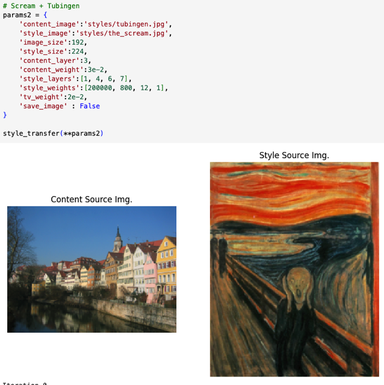</kbd></p>

<br>

<a id="node-1758"></a>

<p align="center"><kbd>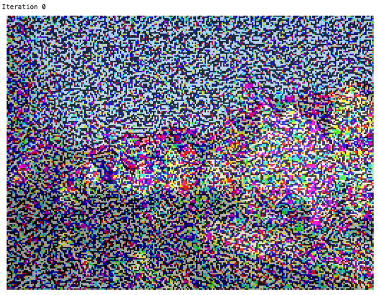</kbd></p>

<p align="center"><kbd>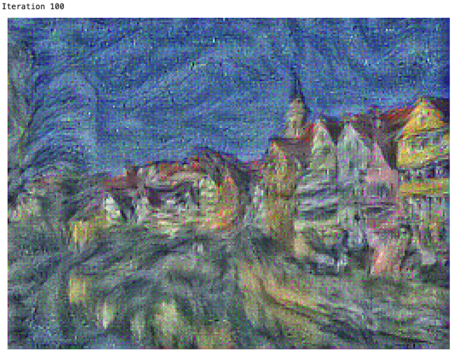</kbd></p>

<p align="center"><kbd>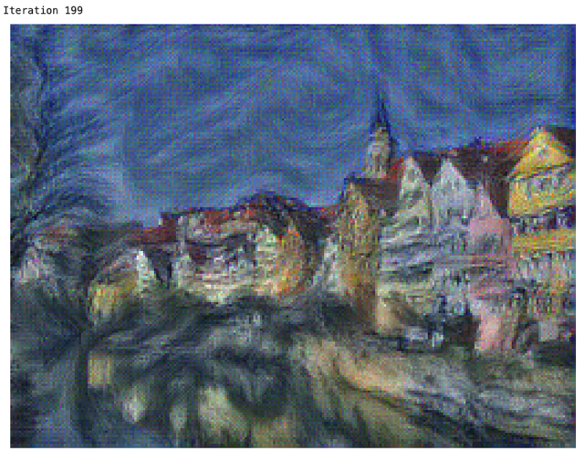</kbd></p>

<p align="center"><kbd></kbd></p>

<p align="center"><kbd></kbd></p>

<p align="center"><kbd></kbd></p>

<p align="center"><kbd>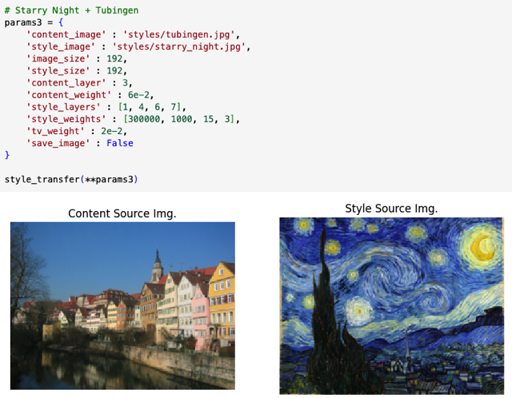</kbd></p>

<br>

<a id="node-1759"></a>

<p align="center"><kbd>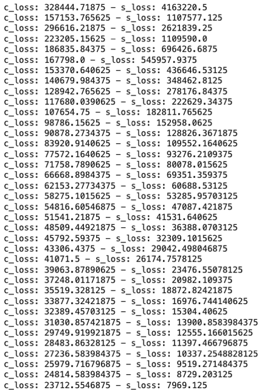</kbd></p>

<p align="center"><kbd></kbd></p>

<p align="center"><kbd>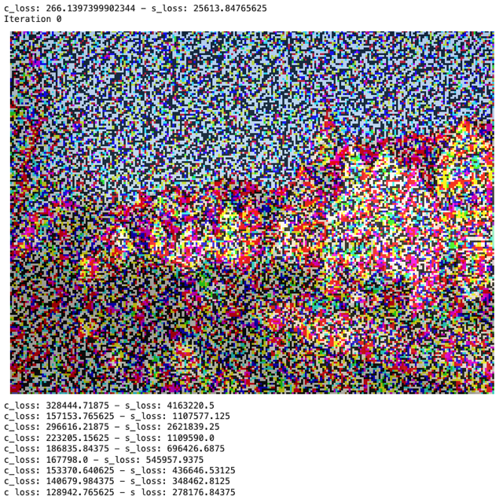</kbd></p>

> [!NOTE]
> đại khái là trong 3 ví dụ này, ta ini img với content image. Vậy thì đại
> khái là Optimization sẽ thay đổi content image sao cho nó vẫn giữ nội
> dung của mình (nhờ content loss), nhưng dần dần có style của style
> image (nhờ style loss).
>
> vì ini image với content image có thể thấy lúc ban đầu content loss rất
> nhỏ. Nhưng quá trình gradient thay đổi nó để nó có style của style image
> sẽ làm ảnh hưởng đến feature, nên content loss sẽ tăng. Do đó, rõ ràng
> vẫn cần có content loss để giữa cho việc copy style nhưng không làm
> mất đi content.

<br>

<a id="node-1760"></a>

<p align="center"><kbd>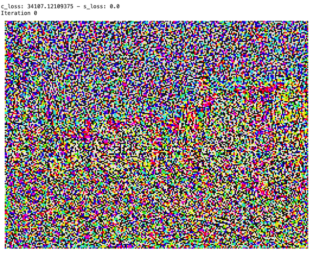</kbd></p>

<p align="center"><kbd>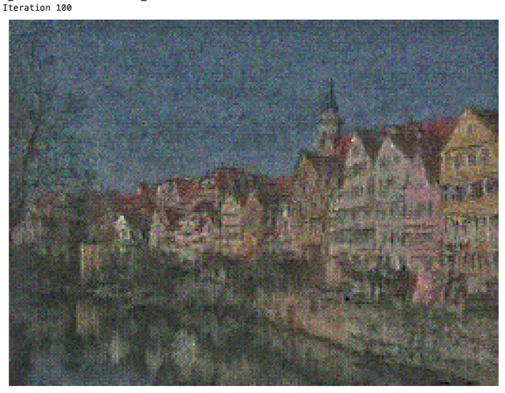</kbd></p>

<p align="center"><kbd>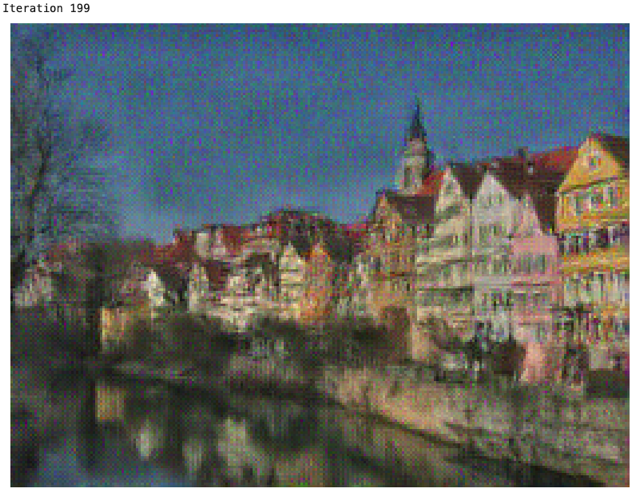</kbd></p>

<p align="center"><kbd>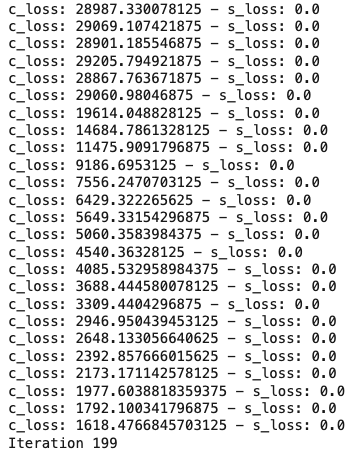</kbd></p>

<p align="center"><kbd>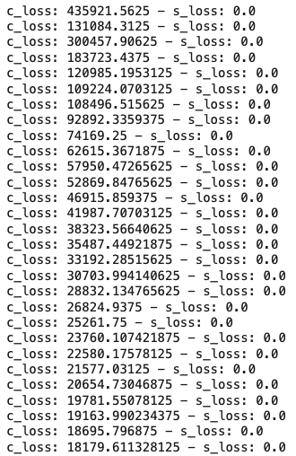</kbd></p>

<p align="center"><kbd></kbd></p>

<p align="center"><kbd></kbd></p>

<p align="center"><kbd></kbd></p>

<p align="center"><kbd></kbd></p>

<p align="center"><kbd></kbd></p>

<p align="center"><kbd>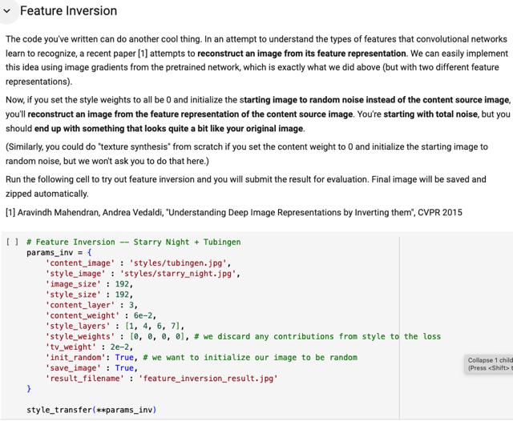</kbd></p>

> [!NOTE]
> Còn cái này thì ta ini image random. Và  content loss để hướng dẫn sự thay
> đổi  của random image để nó trở nên có feature giống với content image.
> tạo ra hệ quả là ta khôi phục lại được feature (feature inversion).
>
> Trong bài toán này thì set style weight bằng 0 hết, để quá trình này chỉ có
> content loss và total variation loss thôi

> [!NOTE]
> có thể thấy vì ini với random noise image nên
> content loss ban đầu rất lớn. Gradient của content
> loss w.r.t image sẽ dẫn dắt image dần dần có
> feature giống với feature của content image (khiến
> content loss giảm dần cũng là lúc một noisy image
> dần có những đường nét của content image

<br>

