# Eecs 498-007_598-005 (2022) Assignment 6: Generative Adversarial Network

📊 **Progress:** `21` Notes | `97` Screenshots

---

<kbd>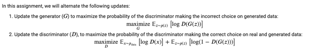</kbd>

<kbd></kbd>

<kbd>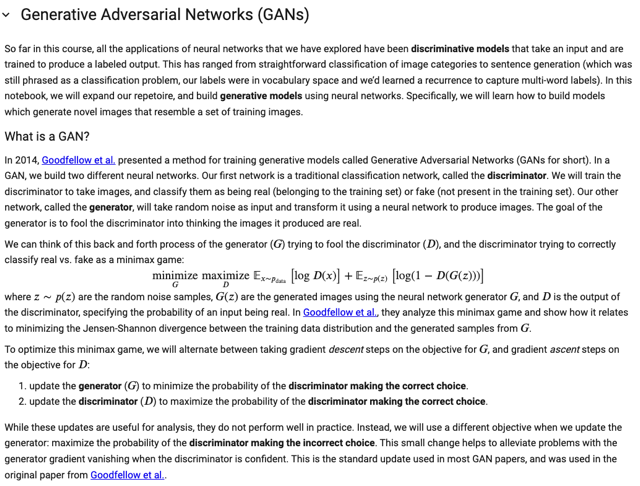</kbd>

> [!NOTE]
> Đại khái là nhắc lại mục tiêu của GAN, chỉ đáng chú ý ở chỗ này:
>
> Ta có thể "hiểu về" việc training GAN **như một cuộc chơi giữa G và D** trong
> đó:
>
> D cần phải**phân biệt được ảnh "thật**", **ảnh "giả"** bằng cách:
>
> - Cho **ảnh thật điểm cao**: **maximize D(x)**
>
> - Cho **ảnh giả điểm thấp**: **maximize (1-D(G(z))**
>
> G cần phải lừa được D, khiến nó cho G(z) điểm cao: 
>
> - Làm cho **minimize (1-D(G(z))**
>
> Đương nhiên ta sẽ đưa vào **log trick**, cũng như "làm vậy với nhiều image", để 
> ta có công thức min max như ở đây.
>
> Có điều, nếu theo cái này thì ta sẽ không train được G, lí do là vì**ban đầu
> D(G(z)) sẽ rất nhỏ**, coi như ~=0 (mang ý nghĩa là D dễ dàng output 0 cho
> G(z), tức là dễ dàng biết G(z) là ảnh fake). Điều này dẫn tới objective
> function "của" G (ý nói vế hai, có liên quan đến G, chứ vế một thì không) có
> giá trị sẽ là log [1-D(G(z))] ~= log (1-0) = log 1 = 0. Và từ đó, gradient sẽ
> cũng bằng 0, khiến gây hiện tượng vanishing gradient, ngăn cản việc
> training.
>
> Do đó, ta sẽ design objective khác cho G, đó là minimize log (-D(G(z)),
> tương đương maximize log D(G(z)). Sự thay đổi này vẫn giúp tương đương
> với việc đặt mục tiêu là G học cách tạo ra kết quả sao cho lừa được D. Tuy
> nhiên nó giúp khắc phục hiện tượng vừa nói, khi vào lúc ban đầu D(G(z)) = 0
> thì
> - log 0 = + vô cùng, tạo ra gradient lớn chứ không bằng 0.
>
> Và có thể hiểu việc chuyển từ:
>
> **minimize log (1-D(G(z))** thành **maximize log D(G(z))**
>
> sẽ giống như **minimize khả năng D làm đúng**, sang **maximize D làm sai**khi****gặp phải ảnh fake bởi G(z) vậy

 

<kbd>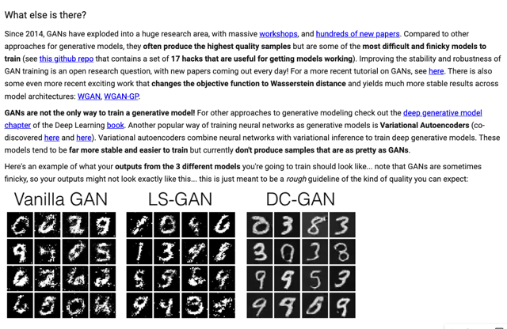</kbd>

> [!NOTE]
> Đại ý là kể từ khi ra mắt GAN nhận được sự quan tâm và nghiên cứu sôi nổi.
> So với các Generative model khác như VAE, Autoregressive thì nó là cái cho
> ra những sample đẹp nhất.
>
> Tuy nhiên nó cũng là cái khó ổn định, khó train nhất. Tác giả đề nghị ta quay 
> lại xem những paper, những github về các mẹo giúp train GAN cũng như
> là các paper nên xem liên quan đến GAN.
>
> Hiện nay có nhiều nghiên cứu nhằm tăng tính ổn định khi train GAN, ví dụ
> như việc dùng Wasserstain loss function mà mình đã gặp ở GAN Spec.
>
> Tác gỉa nhắc đến chương 20 của Deep Learning Yoshua, nói về Generative
> models.
>
> Và trong assignment này mình sẽ làm 3 GAN model Vanilla GAN, LS-GAN, 
> và DC-GAN

 

<kbd></kbd>

<kbd>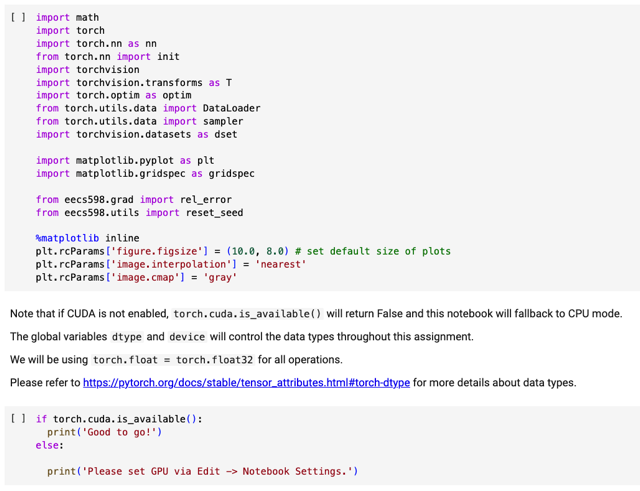</kbd>

<kbd></kbd>

<kbd></kbd>

<kbd></kbd>

> [!NOTE]
> setup notebooke import các lib

 

<kbd>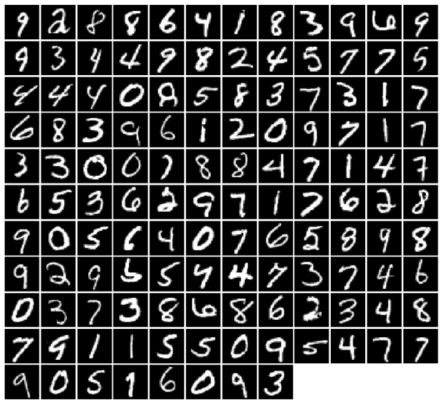</kbd>

<kbd></kbd>

<kbd>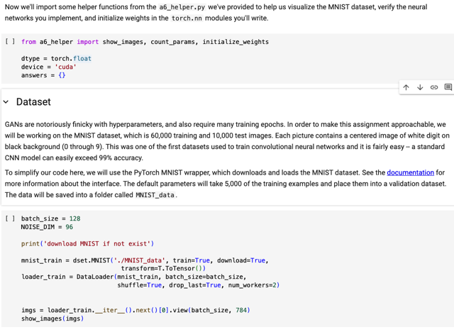</kbd>

> [!NOTE]
> họ cũng chuẩn bị cho một số function giúp visualize images, initialize model's
> weights. Cũng như là load MNIST dataset

 

<kbd>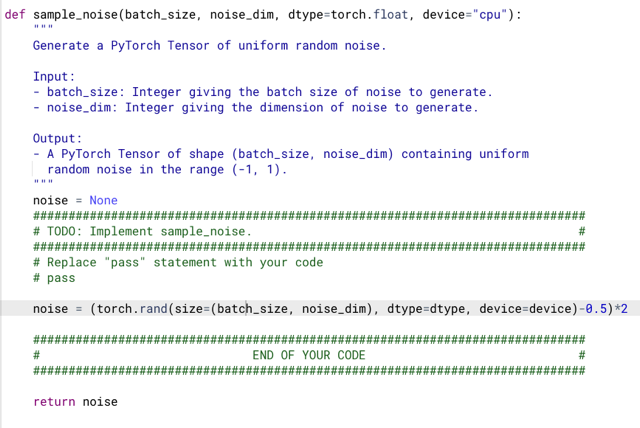</kbd>

<kbd></kbd>

<kbd>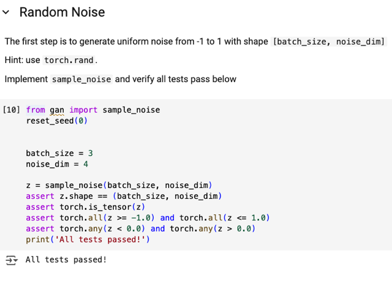</kbd>

> [!NOTE]
> Đầu tiên ta làm function giúp làm cái việc sampling một latent variable z
> từ p(z), với p(z) được chọn dùng là một simple distribution, ở đây họ yêu
> cầu dùng Uniform distribution. Cái vụ giả định về latent code p(z) này 
> đã nói ở VAE, trong VAE ta giả định p(z) là standard Gaussian (cũng là
> một simple distribution). Nói chung, về cái vụ giả định cho các prior distrib
> thì mình đã được biết ở DL Yoshua, và ta nhớ thường thì họ sẽ dùng
> Gaussian hoặc Uniform.
>
> Có điều yêu cầu là random latent var được sampling từ Uniform distribs
> có range từ -1 tới 1. Do đó, ta sẽ dùng torch.rand() với các argument
> cần thiết, thì cái này nó cho Uniform có range [0,1], nên mình sẽ shift 0.5 
> và nhân 2 để có raneg [-1,1]

 

<kbd>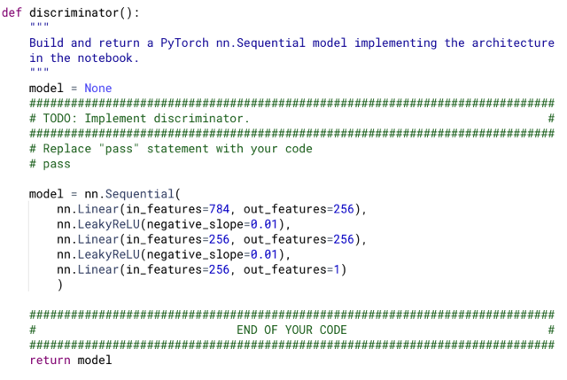</kbd>

<kbd>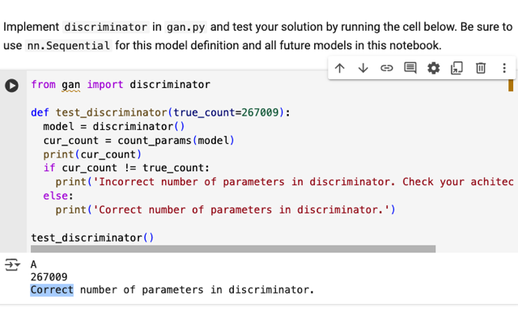</kbd>

<kbd></kbd>

<kbd></kbd>

<kbd>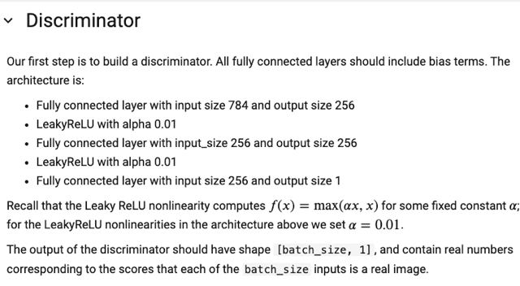</kbd>

> [!NOTE]
> Tiếp theo ta sẽ define kiến trúc của D theo mô tả, chỉ dùng FC layer với
> non-linearity là Leaky-ReLU với alpha 0.01.
>
> Input dims đương nhiên là 784 và sau khi qua vài combo Linear-Leaky Relu ta
> sẽ output ra 1 - class scores ứng với việc model dự đoán image là real được
> bao nhiêu điểm (đây đương nhiên là unnormalize class score của một bài toán
> binary classification, nếu pass qua sigmoid thì ta sẽ chuyển thành probability
> của positive class)

 

<kbd>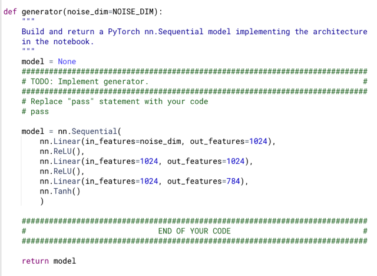</kbd>

<kbd></kbd>

<kbd>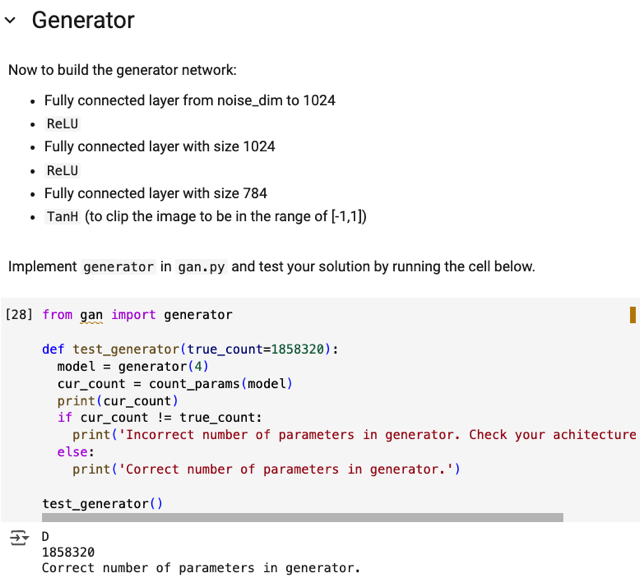</kbd>

> [!NOTE]
> Define kiến trúc của G, đương nhiên sẽ nhận input là latent code, và output
> là fake image. Nên out dims là 784. Ta sẽ dùng tanh để squash giá trị lớn bé
> tùy ý sau Linear thành ra giá trị [-1,1] (có lẽ chốc nữa ta sẽ chuyển real
> image về range [-1,1] luôn)

 

<kbd>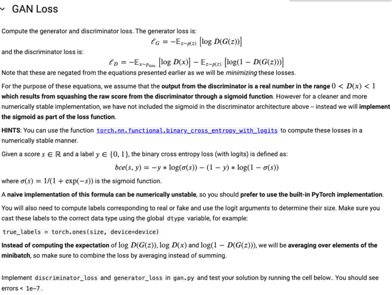</kbd>

> [!NOTE]
> rồi, GAN loss, thế thì công thức như thế nào thì lúc mở đầu đã nói rồi. Ở đây 
> đại  khái chú ý thêm rằng, dĩ nhiên ta đã biết việc train D chính là train một
> Binary classifier, nên ta sẽ dùng binary cross entropy loss. Có điều ở đây nhắc
> lại một điều ta đã biết đó là, việc tách riêng hàm sigmoid hay softmax và cross
> entropy loss có thể gây dễ mất ổn định, việc này có nguyên nhân xuất phát từ
> tính chất của exponential function. Do đó, người ta thường kết hợp việc chuyển
> logit (unnormalized class scores) thành probability scores chung với bước tính
> cross entropy loss. Và trong pytorch, ta làm việc đó bằng cách dùng torch.nn.
> functional.binary_cross_entropy_with_logits, đương nhiên trong cách làm này 
> thì ta chỉ pass "raw" class scores vào thôi.
>
> Ngoài ra, ta sẽ cần tạo và pass vào binary labels cũng như là tính loss trên batch

 

<kbd>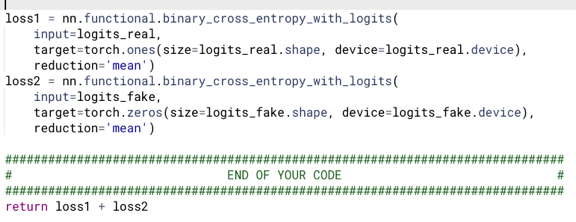</kbd>

<kbd>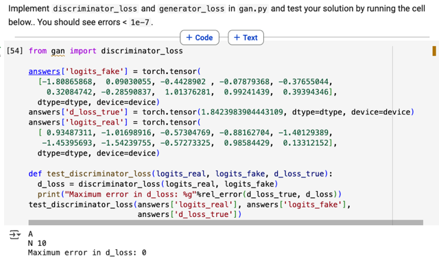</kbd>

<kbd></kbd>

<kbd></kbd>

<kbd>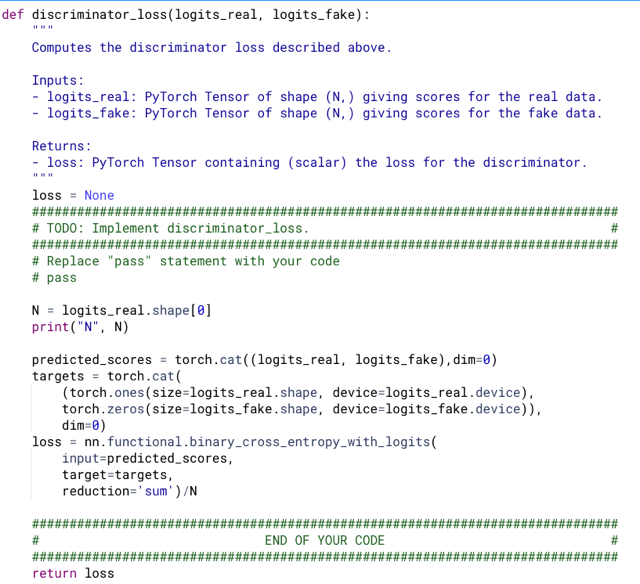</kbd>

> [!NOTE]
> Không có gì khó, ta sẽ dùng torch.ones và torch.zeros để tạo hai ground-truth label
> tensor, với shape là shape và device lấy từ của predicted class scores tensor
>
> Sau đó ta sẽ concatenate để gom lại thành một predicted class scores tensor và
> target tensor, pass vào F.binary_cross_entropy_with_logits.
>
> Một điểm chú ý là dùng reduction = sum và tự chia cho N để average thay vì dùng
> reduction = mean. Lí do của việc này, đó là, nếu ta dùng mean, cơ bản pytorch sẽ
> giúp ta sum và chia cho số sample - và trong trường hợp này nó sẽ là 2N, chứ
> không phải N.
>
> Thế thì nếu vậy thì không đúng là bởi:
>
> Ta nhớ là objective của D là :
>
> maximize ( E x~p_data [ log D(x) ] + E x~p_G [ log (1-D(G(x))) ] )
>
> Hay chuyển sang loss thì ta sẽ phải
>
> minimize ( -E x~p_data [ log D(x) ] - E x~p_G [ log (1-D(G(x))) ] )
>
> Thế thì, cần hiểu rằng ta có N image từ p_data và N image từ p_G
>
> Thì vế i) **- E x~p_data [ log D(x) ]** sẽ chính là / hay "ta tính bằng cách"  pass **N
> predicted class scores của real images** và **N target value = 1** vào torch's **bce
> function** để tính loss và LẤY TRUNG BÌNH BẰNG CÁCH **CHIA N**
>
> và vế ii) **- E x~p_G [ log (1-D(G(x))) ]** sẽ chính là / hay "tính bằng cách" pass**N
> predicted class scores của fake images** và **N target value = 0** vào torch's bce
> with logit để tính loss, và LẤY TRUNG BÌNH  BẰNG CÁCH **CHIA N**
>
> Thành ra nếu concatenate hai cái predicted tensor lại và target tensors lại rồi pass
> vào function thì ta phải sum rồi **CHIA N**, CHỨ KHÔNG PHẢI CHIA 2N.
>
> Và tốt hơn là tách ra hai term, tính mỗi cái với reduction=mean, ta sẽ có error  = 0

 

<kbd>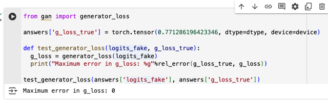</kbd>

<kbd></kbd>

<kbd>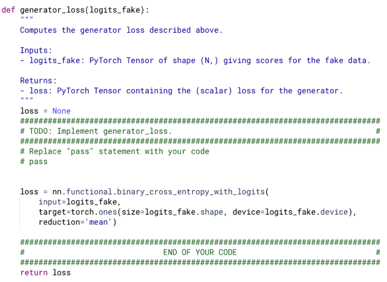</kbd>

> [!NOTE]
> *Nói thêm vì sao:
>
> **- E x~p_data [ log D(x) ]** lại là F.bce with logit(logits_reals, torch.ones...)
>
> **- E x~p_G [ log (1-D(G(x))) ]** lại là F.bce with logit(logits_fakes, torch.zeros...)
>
> là bởi công thức của bce with logit như nãy họ đã nhắc lại giùm mình đó là:
>
> L =  **- y*log(y^(z)) - (1-y)*log(1-y^(z))** trong đó y^(z) là **probability of positive 
> class**, là hàm  theo class score z, bằng sigmoid (z) , z là class scores.
>
> Vậy khi pass cặp y^, y với target y = 0, thì đương nhiên L sẽ là: 
>
> - **0***log(y^(z)) - (1-**0**)*log(1-y^(z))  = **- log(1-y^(z))**
>
> Còn nếu pass cặp y^, y với target y = 1 thì L sẽ là : 
>
> - **1***log(y^(z)) - (1-**1**)*log(1-y^(z)) =**- log y^(z)**
>
> Và tương tự như vậy với G's loss:
>
> **- E x~p_G [ log D(x ]** sẽ là F.bce with logits(logits_fakes, **torch ones**)
>
> Vì khi pass cặp y^, y với target y = 1 thì L sẽ là : 
>
> - 1*log(y^(z)) - (1-1)*log(1-y^(z)) = -log y^(z)
>
> ====
>
> Nói chung điểm cần nhớ là việc muốn tính bce loss theo công thức :
>
> - log y^ hay - log (1 - y^) là do việc ta pass vào label bao nhiêu.
>
> Từ đó giúp ta **HIỂU ĐƯỢC VỀ MẶT BẢN CHẤT CỦA CÂU HỎI TẠI SAO LẠI
> PASS ONES TENSOR VÀO LÀM TARGET KHI TÍNH LOSS CỦA G**. Bên
> cạnh việc hiểu theo kiểu "bề mặt" là ta muốn "target" của D(G(x)) là 1.

> [!NOTE]
> Hoàn toàn tương tự, để tính G's loss với công thức là - E x~p_G [ log D(x ] 
> ta sẽ pass predicted class scores (đóng vai trò D(x)) vào torch bce with 
> logit function, cùng với ones tensor.

 

<kbd>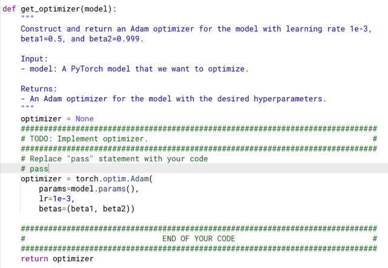</kbd>

<kbd></kbd>

<kbd>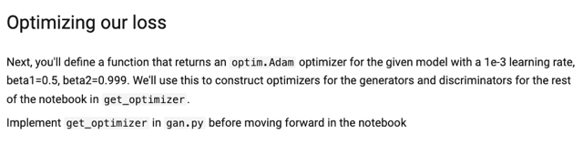</kbd>

> [!NOTE]
> chuẩn bị một function giúp tạo optimizer cho model pass vào, chốc nữa sẽ dùng
> nó để tạo optimizer cho G và D

 

<kbd>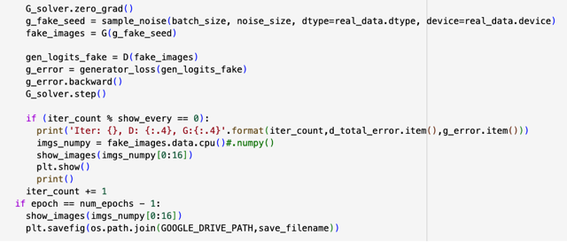</kbd>

<kbd></kbd>

<kbd>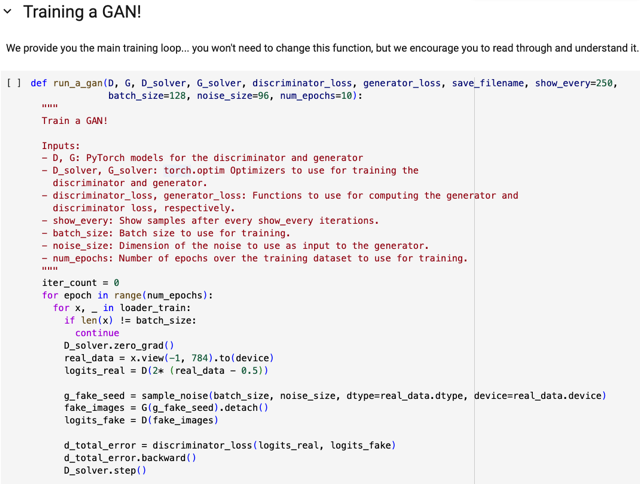</kbd>

> [!NOTE]
> function run việc training GAN họ không yêu cầu mình làm nhưng đương nhiên phải đọc kĩ để xem
>
> Input gồm có hai model D, G, cùng hai optimizer, cũng như hai function  dùng để tính loss của mỗi
> đứa. Cùng với một vài thông số hyper-params như batch size, noise size, num epochs.
>
> Iterate từng epoch, trong mỗi epoch, iterate từng data batch do data loader trả về. Đương nhiên
> đây là batch các real data - label
>
> Đầu tiên ta thấy họ sẽ reset gradient của D, trước khi flatten các real image trong batch từ (B,1,
> 28,28) thành (B,784) đồng thời move lên device (biến này chứa device cpu/gpu, lưu ở ngoài)
>
> Sau đó, các flatten images sẽ được preprocess về range [-1,1] theo cùng cách làm mà lúc nãy ta
> đã làm trong function sampling noise đó là shift -0.5  và scale với 2. Để rồi pass vào D để có D's
> prediction - logits_real.
>
> Tiếp, dùng function sample_noise mình đã làm để sampling một batch các latent codes từ một
> Uniform distribution có ranges [-1,1]. Pass vào G, để G generate batch các fake images. Pass
> chúng vào D để có prediction của D đối fake images.
>
> Tới đây ta có predictions của D với real và fake images, pass vào loss function của D, để có D's
> loss. Gọi backward() để back-propagation. Và gọi D's optimizer step() để thực hiện gradient
> descent.
>
> ===
>
> Tiếp, tới lượt (update cho G), reset gradient. Sampling một batch các latent code, pass vào G để
> có batch các fake images y như ở trên. Sau đó cũng lại pass qua D để có prediction. Và dùng nó
> để tính G's loss.
>
> Gọi loss backward và G's optimizer.step để update G.
>
> Và lâu lâu thì lấy các fake images chuyển vào cpu và pass vào show_images() function để in ra.
>
> ====
>
> Có thể cần lưu ý chỗ này đó là: khi cho G predict ra fake images để "dùng cho" việc training D, ta
> sẽ gọi **detach**() với G. Việc này nhằm mục đích **TÁCH G RA KHỎI COMPUTATION GRAPH**,
> ĐỂ KHI **D'S LOSS BACK-PROP**, **GRADIENT SẼ CHỈ FLOW "VỀ" D VÀ KHÔNG FLOW VỀ
> G**.
>
> Thế thì việc này có tác dụng chính là để**TÁCH G RA** KHỎI QUÁ TRÌNH TRAIN D, ĐỂ
> **PYTORCH NÓ KHỎI PHẢI PHÍ MEMORY VÀ COMPUTATION RESOURC**E CHO VIỆC TÍNH
> GRADIENT CỦA D'S LOSS W.R.T G'S
>
> Chứ không phải tác dụng chính là **ngăn không cho gradient của D's loss tích tụ** (accumulated)
> và t**ham gia vào việc update G**. Bởi là vì khi qua bước train G,  TA **CÓ BƯỚC G'S
> OPTIMIZER RESET GRAD** - đã đương nhiên sẽ xóa hết các  gradient từ D's loss flow về nếu
> không detach.
>
> Còn đối với khi update G. Ta thấy họ không gọi D.detach sau khi cho D predict logits của fake
> images. Ở đây có hai câu hỏi đặt ra.
>
> i) D có bị ảnh hưởng gì không nếu không detach: KHÔNG, đương nhiên,**vì dù khi G's loss.
> backward(), Pytorch nó sẽ tính gradient của G's loss w.r.t D's params** nhưng **nếu ta không gọi
> D_solver.step()** thì **cơ bản là ta ignore các gradient này**, và quả thật vậy, việc train G là ở
> bước sau, sau khi D đã được update, và ta thấy update G xong là **kết thúc để qua một vòng lặp
> mới**, và **TRONG VÒNG MỚI BẮT ĐẦU VỚI VIỆC RESET D'S GRADIENT** - đến đây ta hiểu
> rằng tại sao phải reset gradient sớm vậy - đó chính là để delete gradient của G's loss đối với D.
>
> ii) Nếu thế như việc reset grad hoặc không gọi step() sẽ giúp gradient dù có được tính cũng sẽ
> không bị dùng thì **chẳng phải giống như G, đáng lẽ ta cũng nên detach để ngăn việc Pytorch tính
> gradient của G's loss w.r.t D's params một cách thừa thải** gây tốn memory và tính toán hay sao?
>
> -> Câu trả lời của GPT là**nó không đáng kể do G thường bự hơn nhiều D, vì D với nhiệm
> vụ của binary classifier sẽ nói chung là nhỏ hơn G**, thành ra việc gọi thêm detach trên 
> D không cần thiết.

 

<kbd>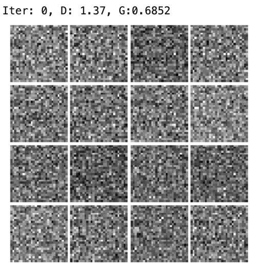</kbd>

<kbd>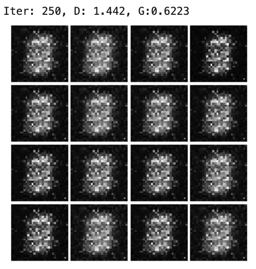</kbd>

<kbd>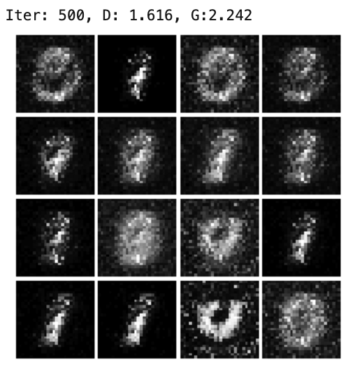</kbd>

<kbd>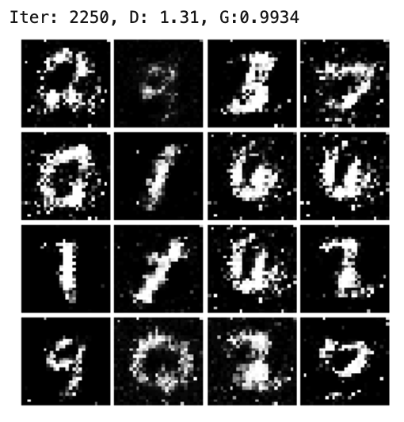</kbd>

<kbd>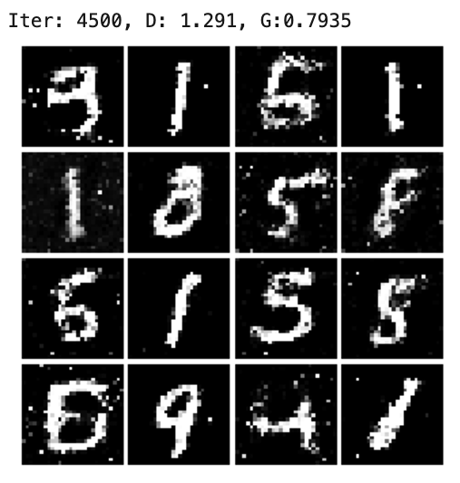</kbd>

<kbd></kbd>

<kbd></kbd>

<kbd></kbd>

<kbd></kbd>

<kbd></kbd>

<kbd>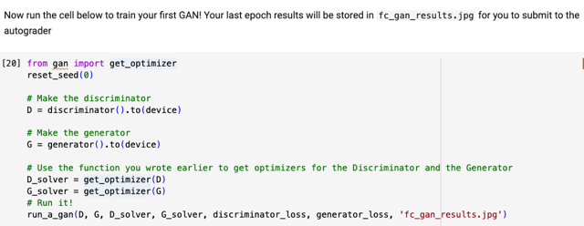</kbd>

> [!NOTE]
> Start training!

 

<kbd>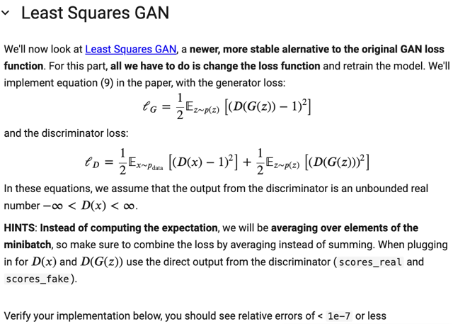</kbd>

> [!NOTE]
> Tiếp, ta sẽ làm một phiên bản cải tiến hơn một chút, chỉ là dùng một loss
> function khác, cũng cùng objective như cũ thôi nhưng loss này giúp training
> ổn định hơn - Least Square.
>
> Đương nhiên để hiểu rõ thì ta sẽ đọc paper Least Squares GAN, còn ở đây
> có thể hiểu đại ý về tác dụng của function này như sau:
>
> i) Nó k**hông còn theo cách tiếp cận xác suất**, từ đó không còn phụ thuộc
> vào hàm sigmoid. Điều này nhằm k**hắc phục nhược điểm là gây ra
> vanishing gradient**khi D quá tự tin (khiến sigmoid hoạt động ở hai "cực" ->
> gradient nhỏ) dẫn tới **cản trở việc học của G.**
>
> ii) Thay vào đó, nó sẽ dùng cách tiếp cận least square: hướng tới việc **ép
> D cho ra giá trị gần 0 đối với fake image**và **gần 1 đối với real image**.
> Và dù là ta thấy hai giá trị 0, 1 ở đây, nhưng đó KHÔNG PHẢI LÀ Ý NGHĨA
> XÁC SUẤT,  mà **CHỈ LÀ TARGET CHO LOGITS CỦA D** (nên trong notebook
> họ nói ta sẽ cho D output có "unbounded real number". Mục đích chỉ kiểu
> như là **có hai giá trị cụ thể để cho D hướng  tới**. Và điều đó cũng **đồng
> nghĩa ta có thể chọn giá trị khác, ví dụ như 10 cho real image, -10 cho fake
> image**. (đọc thêm phần trả lời của GPT về việc này ở note sau)
>
> Tuy nhiên người ta**thường dùng 0,1 để nhằm thuận tiện** hơn chút theo
> một cách để **chuẩn hóa**, chứ không mỗi người train với một target khác
> thì tuy không sai nhưng lộn xộn. Và quan trọng hơn là **nếu dùng target
> lớn có thể gây exploding gradient**.

 

<kbd>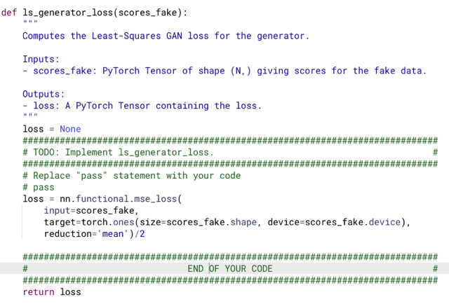</kbd>

<kbd>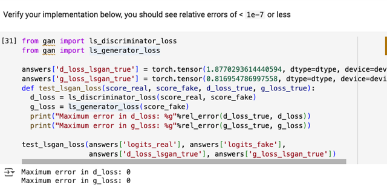</kbd>

<kbd></kbd>

<kbd></kbd>

<kbd>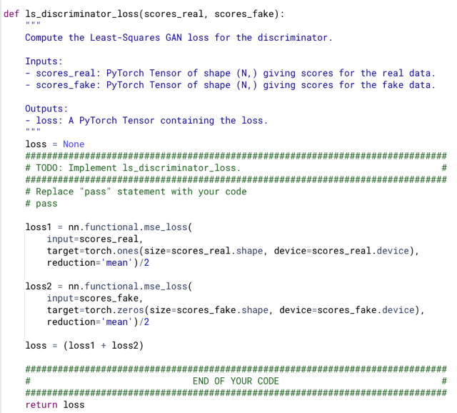</kbd>

> [!NOTE]
> Chỉ là thay F.binary_cross_entropy_with_logit() bằng F.mse_loss() và nhớ vụ
> nhân 1/2, còn lại không khác gì loss function trước

 

<kbd>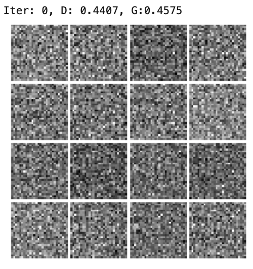</kbd>

<kbd>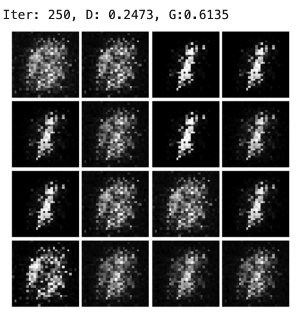</kbd>

<kbd>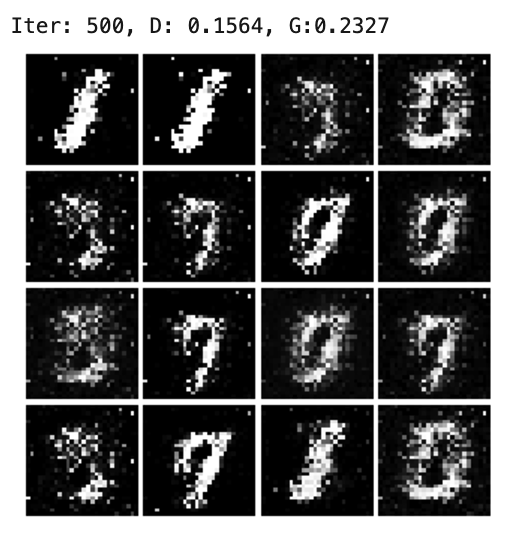</kbd>

<kbd>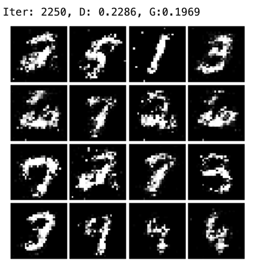</kbd>

<kbd>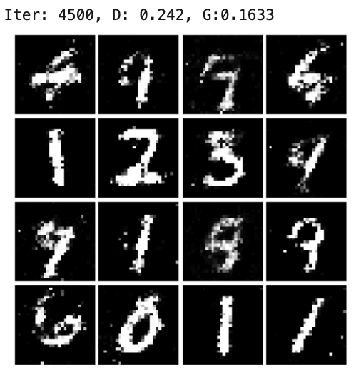</kbd>

<kbd></kbd>

<kbd></kbd>

<kbd></kbd>

<kbd></kbd>

<kbd></kbd>

<kbd>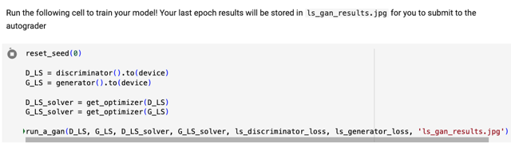</kbd>

 

<kbd>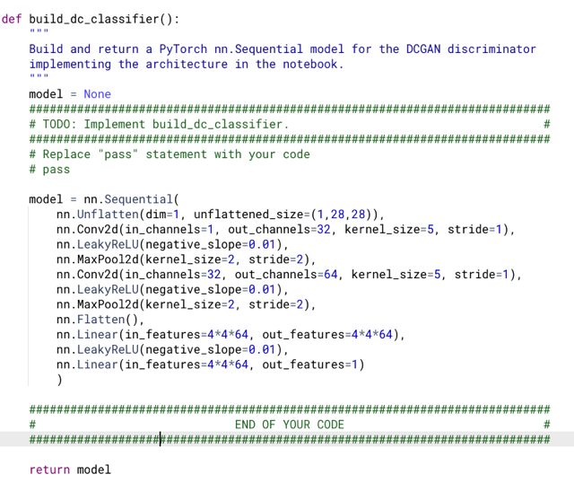</kbd>

<kbd>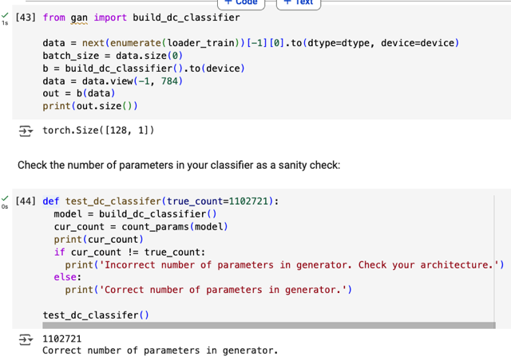</kbd>

<kbd></kbd>

<kbd></kbd>

<kbd>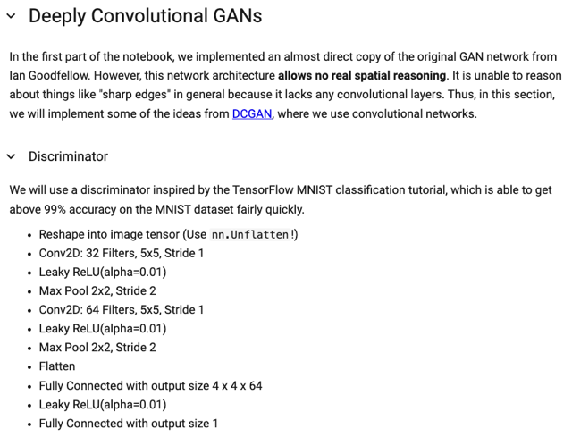</kbd>

> [!NOTE]
> tiếp theo ta sẽ thay G, va D bằng CNN model để nắm bắt các "spatial reasoning" -
> như đã biết, convolution mang lại khả năng nắm bắt được các cấu trúc liên quan đến
> "không gian 2D của hình ảnh, thứ mà nếu ta flatten image thành vector, ta sẽ bị mất,
> và không học được.
>
> Define kiến trúc CNN như họ yêu cầu, như ở đây có thể thấy đầu tiên cần  khôi phục
> dạng 2D với unflatten, trước khi qua 2 combo conv2d-LeakyRelu-pooling sau đó
> flatten để pass qua FC layer, và output.

 

<kbd>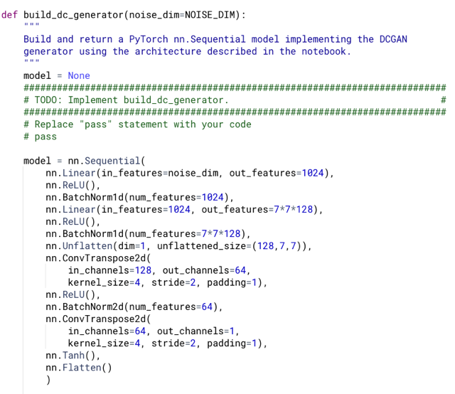</kbd>

<kbd>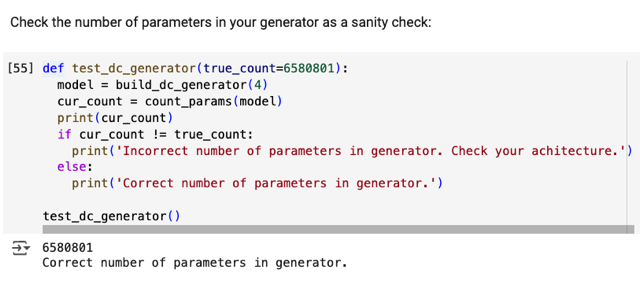</kbd>

<kbd></kbd>

<kbd></kbd>

<kbd></kbd>

> [!NOTE]
> G cũng vậy, bắt đầu với FC layer để nhận latent code, sau đó tăng số features
> lên và reshape thành 2d để pass qua Conv2d, dùng ConvTranspose để tăng
> spatial size
>
> Không có gì đáng nói
>
> Cuối cùng cũng pass qua tanh để squash về range [-1,1], và flatten để thành
> vector (để tương thích với D có unflatten layer ở đầu, vì ta nhận real image
> là dạng vector. Nói chung cũng dễ hiểu)

 

<kbd>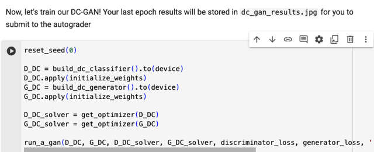</kbd>

> [!NOTE]
> Kết quả có thể thấy rõ DCGAN tốt hơn,
> cho ra hình ảnh rõ ràng hơn

 

<kbd>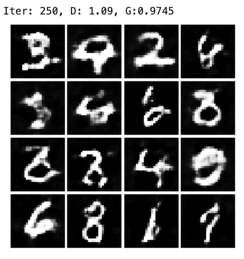</kbd>

<kbd>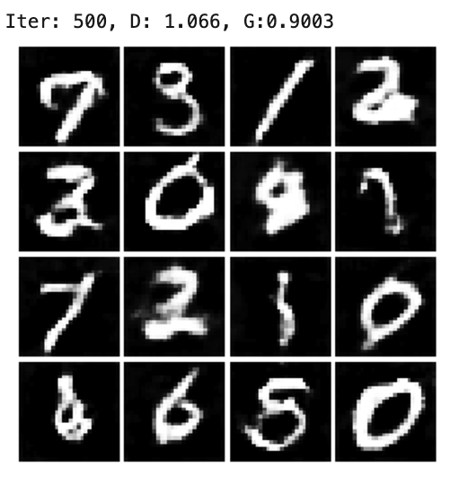</kbd>

<kbd>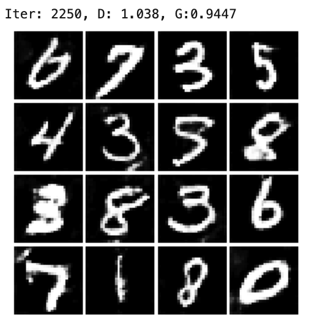</kbd>

<kbd>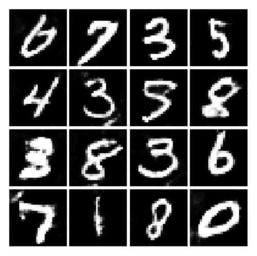</kbd>

<kbd></kbd>

<kbd></kbd>

<kbd></kbd>

<kbd></kbd>

<kbd></kbd>

<kbd></kbd>

<kbd></kbd>

<kbd></kbd>

<kbd></kbd>

<kbd></kbd>

<kbd></kbd>

<kbd></kbd>

<kbd>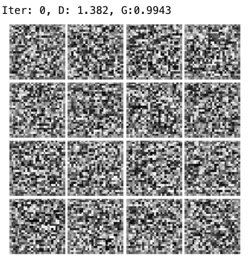</kbd>

> [!NOTE]
> Kết quả có thể thấy rõ DCGAN ở trên, (ở dưới là LSGAN):
>
> i) cho ra hình ảnh rõ ràng hơn
>
> ii)học nhanh hơn, khi iter 250 nó đã cho hình ảnh khá tốt

 

<kbd>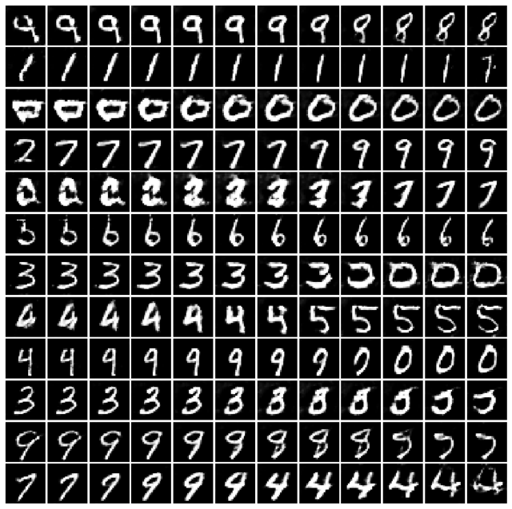</kbd>

<kbd></kbd>

<kbd>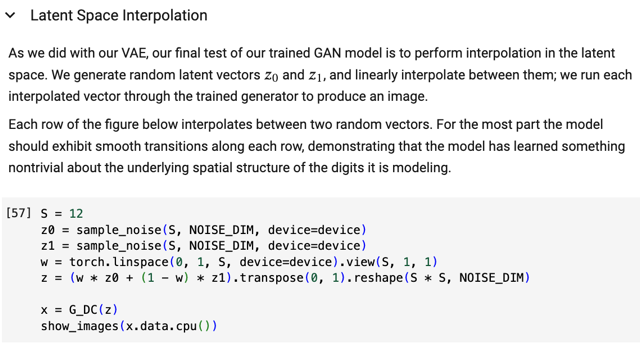</kbd>

> [!NOTE]
> Tương tự như VAR i**nterpolation từ một latent code này tới latent code khác** để
> có **các giá trị trung gian giữa chúng**, và pass chúng vào decoder. Kết quả những
> sự chuyển đổi dần giữa hai số cho thấy rằng **model đã học được những quy luật
> không đơn giản (non-trivial) của các chữ số**

 

