# Eecs 498-007_598-005 (2022) Assignment 6: Variational Auto-encoder

📊 **Progress:** `20` Notes | `63` Screenshots

---

<kbd>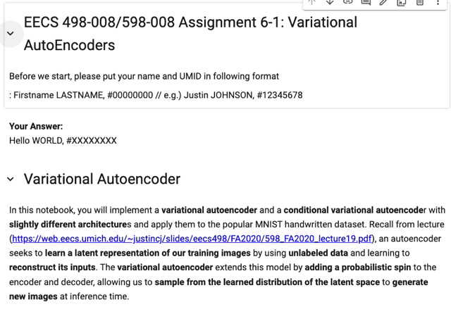</kbd>

> [!NOTE]
> Notebook này mình sẽ thực hiện một mô hình **variational autoencoder**, và
> một **conditional variational autoencoder**, hai mô hình có kiến trúc hơi
> khác nhau chút xíu, và áp dụng nó vào MNIST dataset.
>
> Thì như đã học trong bài giảng, khi xây dựng mô hình **Autoencoder**, nó
> sẽ **tìm** **cách học một latent representation** - tạm dịch là**các đặc trưng
> ngầm ẩn**, khắc họa những đặc điểm của hình ảnh ban đầu và những latent
> representation này, (có thể hiểu nó tương tự như những feature được learn /
> extract bởi cnn model)
>
> Và **Autoencoder** làm việc này sử dụng cách tiếp cận đó là cố gắng**compress và khôi phục** (reconstruct) lại hình ảnh (unlabeled data) ban đầu.
>
> ==
>
> Thế thì **Variational Autoencoder**, mở rộng và **phát triển thêm cách tiếp cận
> của  Autoencoder**, với việc **đưa vào mô hình xác suất**. Cụ thể là, nó sẽ
> dự đoán hay học cách dự đoán không phải chỉ là từng latent representation
> đơn lẻ của image ban đầu, mà thay vào đó nó**tìm cách dự đoán một phân
> phối xác suất chi phối các giá trị của latent feature** này.
>
> Để từ đó, nếu có thể thành công với cách tiếp cận này, sẽ**cho phép ta có thể
> thực hiện việc sampling** từ probability distribution dự đoán này, cho ra một
> latent code mới, và từ đó **tạo ra một hình ảnh hoàn toàn mới**, không có trong
> training set.

 

<kbd>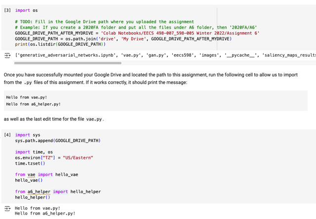</kbd>

<kbd></kbd>

<kbd></kbd>

> [!NOTE]
> Chạy một số
> bước chuẩn bị

 

<kbd>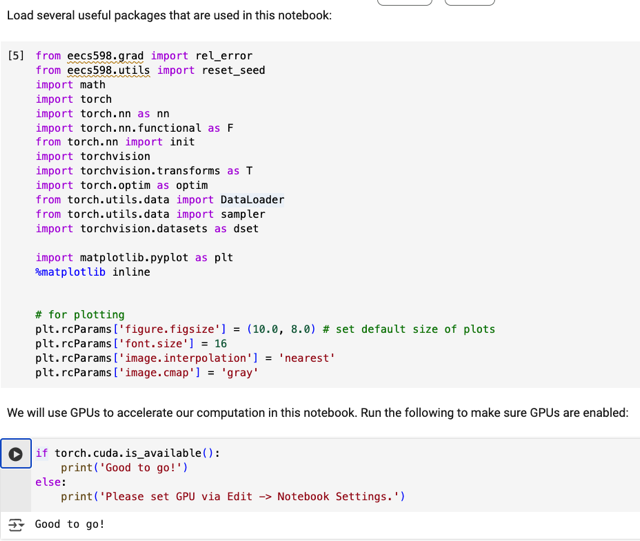</kbd>

 

<kbd>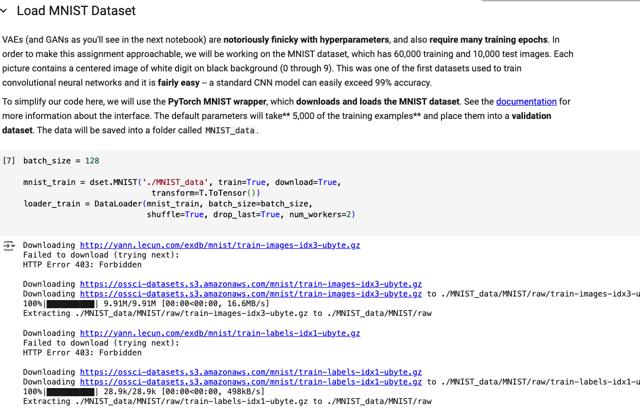</kbd>

> [!NOTE]
> rồi, đại khái là, VAE cũng GAN nổi tiếng là rất khó tính (notoriously finicky) đối
> với hyperparameters. Điều này mình cũng đã được biết từ GAN Specialization
> của deeplearning.ai. Do đó, ở notebook này ta sẽ chỉ dùng MNIST dataset, một
> dataset quen thuộc và cơ bản là dễ so với sức mạnh của các mô hình ngày
> nay.
>
> Thế thì ở đây, họ đề nghị ta dùng Pytorch MNIST wrapper, cái này sẽ giúp
> download và load dataset giùm mình. Và mặc định của nó nó sẽ dành 5000
> sample trong training set để làm thành validation set.
>
> Dòng code làm sẵn ở đây thấy rằng họ dùng torchvision.datasets (dset) để
> access MNIST, với đường dẫn tới thư mục sẽ chứa dataset, và transform
> argument được set với torchvision.transform (T) .ToTensor() giúp transform
> data thành tensor.
>
> Sau đó, họ dùng nó để tạo DataLoader, với batch_size, shuffle = True (để
> shuffle lên), drop_last = True nếu nhớ không lầm là để bỏ đi cái data batch 
> cuối không có đủ sample.

 

<kbd>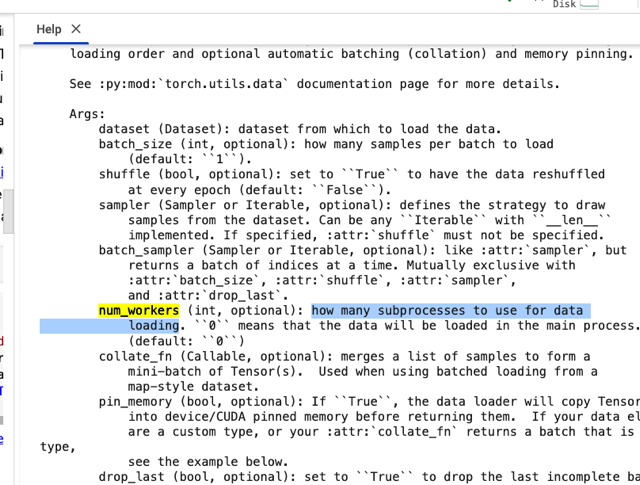</kbd>

<kbd></kbd>

<kbd>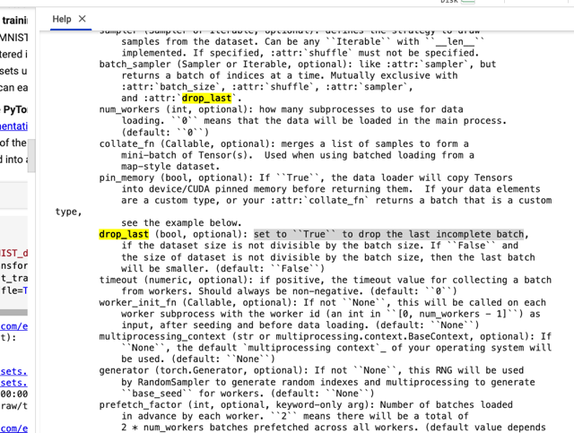</kbd>

> [!NOTE]
> gọi DataLoader?? để check thử thì đúng
> là drop_last có tác dụng đó

> [!NOTE]
> Còn num_worker quy định số subprocess ta
> muốn dành cho quá trình data loading

 

<kbd>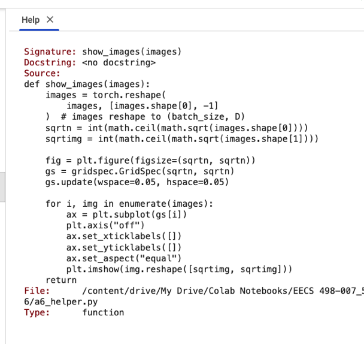</kbd>

<kbd>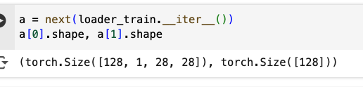</kbd>

<kbd></kbd>

<kbd></kbd>

<kbd>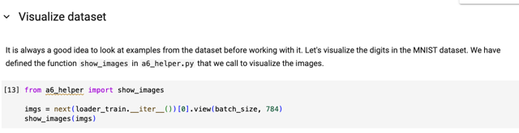</kbd>

> [!NOTE]
> tiếp theo ta sẽ visualize các image trong MINIST ra, đoạn code dưới sẽ lấy ra một
> data batch, sau đó dùng lệnh view() để reshape về batch_size, 784. Sở dĩ phải
> reshape vì xb (next(loader_train.__iter__()) trả ra một tuple xb, yb) có shape
> (batch_size, 1, 28, 28), yb là vector 128 chứa class id.
>
> Còn function show_image cơ bản sẽ reshape image thành hình vuông (chú ý dòng
> sqrtimg=..., và vẽ các hình ra

 

<kbd>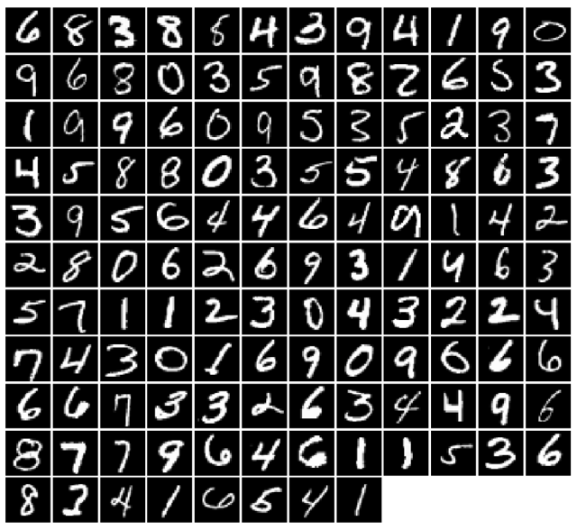</kbd>

 

<kbd>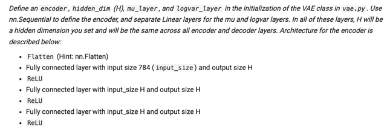</kbd>

<kbd></kbd>

<kbd>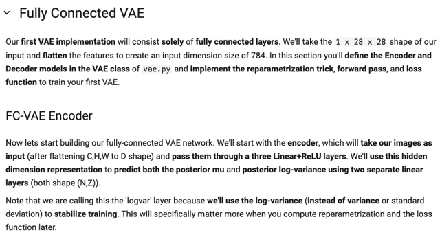</kbd>

> [!NOTE]
> Ok, để mở đầu ta sẽ làm một mô hình VAE **chỉ dựa trên Fully Connected
> layer**. Thế thì, ta sẽ nhận image là MNIST image 1x28x28, thì đầu tiên ta
> sẽ flatten nó thành 784-D vector. Và trong phần này ta sẽ define  Encoder,
> Decoder, cũng như reparametrization trick, forward pass, loss function.
>
> Rồi, đầu tiên ta sẽ làm Encoder. Ở đây cho biết Encoder sẽ nhận image
> đã được flatten ở trên. Pass nó qua 3 layer Linear + nonlinearity ReLU để
> cho ra cái người ta gọi là **hidden dimension representation** (output của
> hidden layer). Và cái này sẽ dùng để / được pass tiếp qua hai nhánh song
> song:
>
> Một nhánh dự đoán ra **mean** và một nhánh dự đoán ra **log variance**
> của  phân phối xác suất của latent variable.
>
> Thế thì, chỗ này mình sẽ nhớ lại rằng, **VAE khác Autoencoder ở chỗ**, là
> thay vì như Encoder của Autoencoder,**dự đoán ra giá trị của latent
> variable** khắc họa / **mang thông tin ẩn giấu phản ánh đặc trưng của image**
> gốc, thì Endoder của **VAE** muốn**dự đoán ra một phân phối xác suất chi
> phối giá  trị của latent variable này.**
>
> Thế thì, như trong bài ta biết, ta**giả định dạng của phân phối xác suất này
> là multivariate Gaussian** có tính chất đơn giản hóa đó là **các variable độc
> lập / uncorrelated nhau**. Nếu gọi **H là kích thước của latent
> representation**, hay nói cách khác,**latent code là vector có H component**.
> Thì ta đang làm  việc với một **Gaussian distribution có số chiều là H**, **mean
> cũng sẽ là vector có H component** - mỗi item là mean của chiều tương
> ứng và **variance cũng vậy, cũng là vector có H dimension, chứa variance
> của chiều tương ứng.**
>
> Đương nhiên với multivariate Gaussian, thì ta có c**ovariance matrix Sigma**,
> trong đó đ**ường chéo** là các**giá trị variance của các single dimension**. Và
> các vị trí ngoài đường chéo là**correlation giữa các variable (ở các
> dimension khác nhau)**, tuy nhiên như đã nói, ta **giả định sự correlation
> giữa các variable là 0**, nên covariance matrix sẽ là **diagonal matrix**.
>
> Tóm lại, ta sẽ cần dùng Encoder neural network để đóng vai trò là dự
> đoán ra một phân phối xác suất Gaussian bằng cách dự đoán ra mean và
> variance của  nó - và cả hai đều là H-dimensional vector. Chính xác hơn,
> thì ta sẽ dự đoán ra log-variance, thay vì variance, điều này là do dùng log
> variance sẽ giúp training process ổn định hơn.

 

<kbd>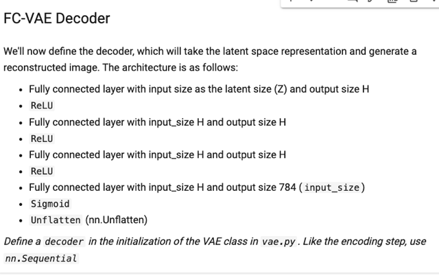</kbd>

> [!NOTE]
> Còn Decoder, cũng là một Fully Connected neural net, nó sẽ nhận input
> là một (hoặc một batch) các latent representation. Để rồi qua các
> linear-relu output ra layer cuối có 784 unit, apply sigmoid để squase các
> giá trị về range [0:1] (mang ý nghĩa là normalized image - cái vụ image
> sẽ được preprocessing với normalization để đưa value từ range 0-255 về
> 0-1 đó) và unflatten - reshape thành 1x28x28

 

<kbd>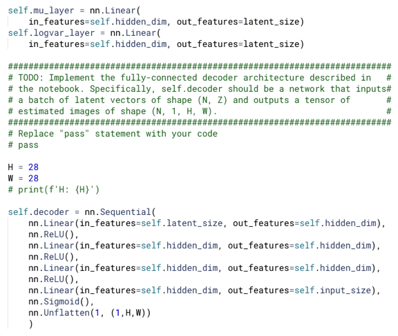</kbd>

<kbd></kbd>

<kbd>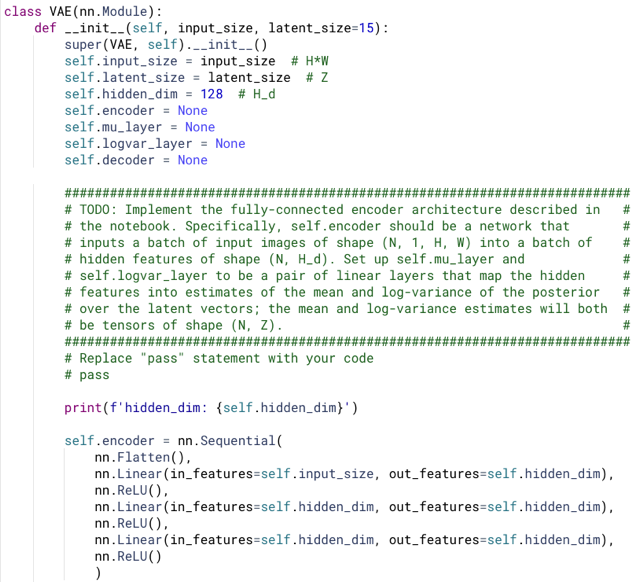</kbd>

> [!NOTE]
> Không có gì khó, ta sẽ define Encoder với mở đầu là Flatten layer để
> flatten input image 28x28 thành 784-d vector. Theo sau đó là 3 cặp
> linear layer - nonlinearity relu
>
> Tiếp ta sẽ define hau Linear layer với output dim là latent dimension 
> nhằm đóng vai trò hai nhánh song song của encoder predict ra mean 
> và variance của q_phi(z|x)
>
> Ở đây không thấy họ pass hidden_dim vào, nên mình define = 128.
>
> ===
>
> Đới decoder, kiến trúc cũng tương tự với Linear layer đầu tiên có 
> in_features là latent_size. Và linear layer cuối sẽ có out_features là
> self.input_size. Bởi vì decoder sẽ nhận latent code từ encoder và 
> khôi phục image (chỗ này hơi khác với lí thuyết trong bài giảng, có nói
> trong note ở bài giảng và ở note khi ta làm qua loss function phía sau)
>
> Thế thì vì ta đang có bài toán MNIST, nên ta mới dùng hàm sigmoid
> để squash giá trị về range 0-1. Cuối cùng là dùng nn.Unflatten để
> ..unflatten thành ra lại 28x28

 

<kbd>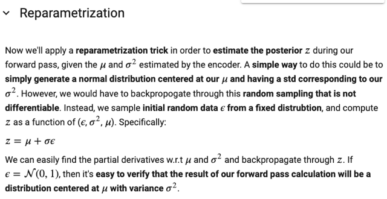</kbd>

> [!NOTE]
> Ok, cái này trong lecture có thể chưa nói rõ - **reparameterization trick:**Thì đại
> khái là vầy: Như đã nói, Encoder của VAE sẽ dự đoán một phân phối xác  suất
> của latent variable, thông qua việc output ra H-dimension mean và variance
> vector của nó (từ log variance tính ra lại variance)
>
> Thế thì, tiếp theo nếu như với **Autoencoder**, với việc encoder **dự đoán ra
> latent code** (latent representation / variable), thì ta **chỉ việc pass vào Decoder**
> để reconstruct image. Nhưng với **VAE** vì ta có một **probability distribution**,
> nên  ta **cần thực hiện động tác sampling từ đó để có latent code**.
>
> Vấn đề là, dù việc này có thể đơn giản đó là**dùng function random** với mean
> và variance, để nó **tạo cho ta một vector random được sampling từ phân phối
> xác suất có mean là predicted mean, và variance bằng predicted variance.**
>
> Tuy nhiên nếu làm vậy, thì không backprop được vì**random sampling không có
> tính chất differentiable. (khả vi) Lý do là vì quá trình random sampling  từ một
> phân phối ngẫu nhiên không có gradient để tính toán.** Do đó, người ta sẽ dùng
> một **trick**, đó là, **sampling một random value epsilon từ phân phối xác suất
> Gaussian chuẩn N(0,1)** và **dùng nó để tính ra latent z** là hàm theo predicted
> mean và predicted variance (hay predicted standard deviation) : z = mu +
> eps*std.
>
> Cách làm này, giúp cho có thể backprop hay nói cách khác **có thể tính được
> dz/dmu và dz/dsigma^2**, nhưng**vẫn đảm bảo là z có giá trị giống y như được
> sampling từ Gaussian distribution mean = predicted mean mu và variance =
> predicted variance**(chính xác hơn là chuyển từ log variance thành variance)
>
> exp(logvar) = var = std^2 <=> std = exp(logvar)^1/2 = exp[logvar*(1/2)] =
> exp(logvar/2)

 

<kbd>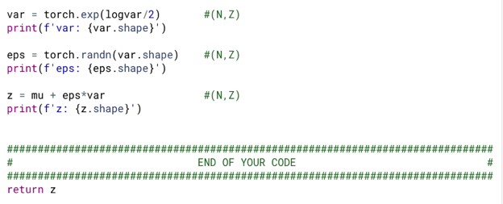</kbd>

<kbd>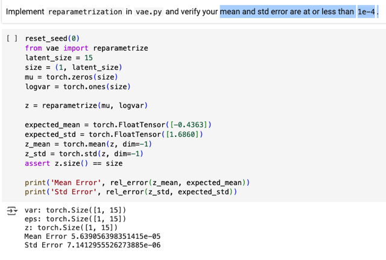</kbd>

<kbd></kbd>

<kbd></kbd>

<kbd>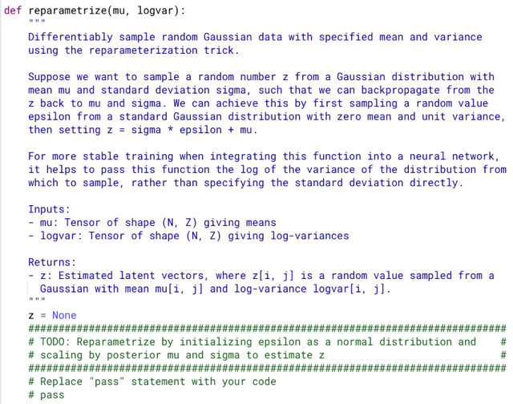</kbd>

> [!NOTE]
> function torch.randn(N,Z) sẽ cho ta matrix shape N,Z với các giá trị random theo
> Standard Gaussian: mean = 0, standard deviation = 1
>
> Từ logvar ta tính ra var. Nói về var, đương nhiên cũng là matrix shape (N, Z)
>
> Xét một image i trong N image của batch, thì **var[i] sẽ là vector chứa Z phần
> tử**, mỗi phần tử, ví dụ thứ j - **var[i,j] là variance của latent variable ở
> dimension j trong latent distribution**.
>
> Và mu[i] cũng là vector chứa Z phần tử, phần tử thứ j, tức mu[i, j] sẽ là**mean
> của các latent variable ở dimension j trong latent distribution**
>
> (nhắc lại không thừa, latent distribution được giả định là một multi-variate
> Gaussian có diagonal covariance matrix - mỗi vector trong latent space có Z
> components, và các giá trị của các component đó đều uncorrelated /
> independent nhau)
>
> Thế thì, xét eps[i], là vector có Z phần tử, mỗi phần tử, ví dụ **eps[i,j]** sẽ có
> xuất xứ từ / **sampling từ Gaussian mean = 0, variance = 1.**
>
> Thế thì **eps[i] element-wised multiply với var[i]**sẽ tạo kết qủa là khiến các giá
> trị **eps[i,j]*var[i,j]** như được **sampling từ Gaussian distribution có mean = 0,
> và variance = var[i, j]**
>
> Và khi cộng với mean **mu[i,j]** nữa sẽ khiến ta có giá trị đến từ Gaussian
> distribution có **mean = mu[i,j]** và **variance var[i,j]**

 

<kbd>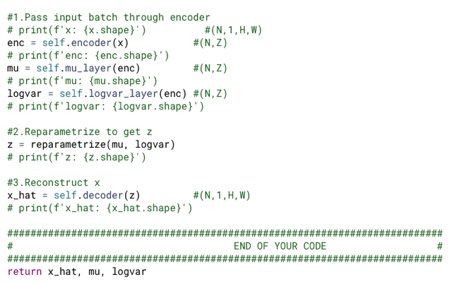</kbd>

<kbd>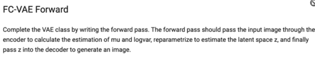</kbd>

<kbd></kbd>

<kbd></kbd>

<kbd>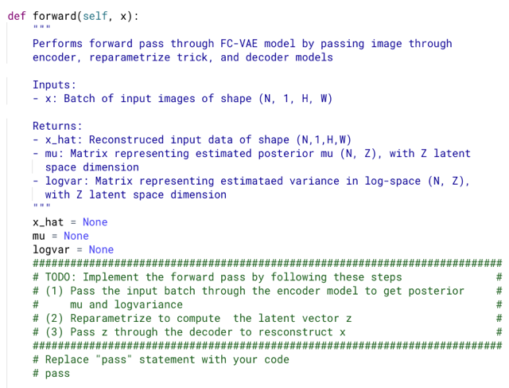</kbd>

> [!NOTE]
> Nhận x (batch of image), pass qua encoder để với mỗi một image trong
> batch, ta có một predicted distribution thể hiện bởi một mean vector và một
> variance vector (đường chéo của diagonal covariance matrix)
>
> Sau đó, bước re-parameterized trick để có N latent code.
>
> Pass batch các latent variable đó qua decoder để predict / reconstruct N "
> most  probable image"

 

<kbd>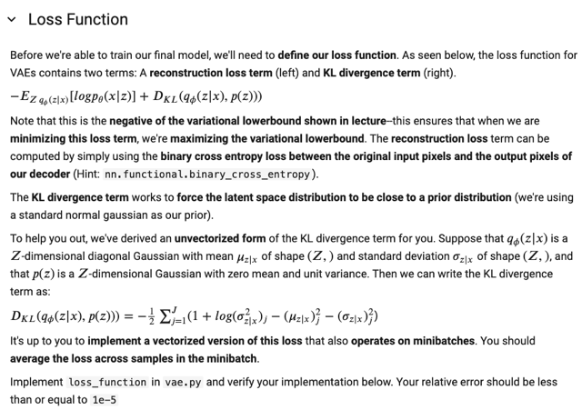</kbd>

> [!NOTE]
> ok, tiếp theo ta sẽ làm qua**loss function** sẽ có hai components (term):
> **Reconstruction loss** và **KL divergence** giữa q_phi(z|x) và p(z).
>
> Và nó chính là negative của Variational Lowerbound, nên khi minimize cái
> này, ta sẽ maximize cái bound này, để rồi giúp maximize cái p_theta(x) luôn
>
> Tiếp theo họ đề nghị ta có thể dùng **cross entropy** giữa cái**hình x ban
> đầu** pass vào encoder và **cái hình tái tạo** bởi decoder x^ mà như trong
> bài ta đã có phân tích để chỉ ra rằng, đây là cách làm đơn giản hóa so với
> lý thuyết đó là:
>
> thay vì cho decoder output **mean** và **variance** vector để mang ý nghĩa
> là **decoder sẽ dự đoán ra phân phối xác suất p_theta(x|z)**, từ đó ta sẽ
> **đặt objective functio**n là **maximize likelihood của observed image**.
>
> Thì ở đây ta**chỉ cho decoder output ra mean vector (mang ý nghĩa là
> sampling ra cái image có likelihood cao nhất)** để rồi đặt objective function
> là **minimize cross entropy giữa x và mean x^**. Điều này **cũng chính là
> maximize likelihood (của image x)** nhưng **cũng** mang ý nghĩa là **làm
> cho reconstructed image giống với image  ban đầu.**
>
> ===
>
> Còn cái **KL divergence**của hai **Gaussian distribution** **q_phi(z|x)** và
> **standard Gaussian p(z)** zero mean, Identity covariance matrix thì nó sẽ
> là như vậy (**J** trong đây chính là **số chiều của latent space**, tức là**Z** đó, họ đang hơi lộn, đáng lẽ phải dùng chữ Z mới đúng ).
>
> Công thức này như trong note ở bài giảng đã nói - **ta sẽ quay lại tìm hiểu
> kĩ hơn tại sao sau**. Còn ở đây, cứ tạm biết công thức nó vậy, và nhiệm vụ
> là tính nó theo **vectorization** cũng như là **tính với batch of data**

 

<kbd>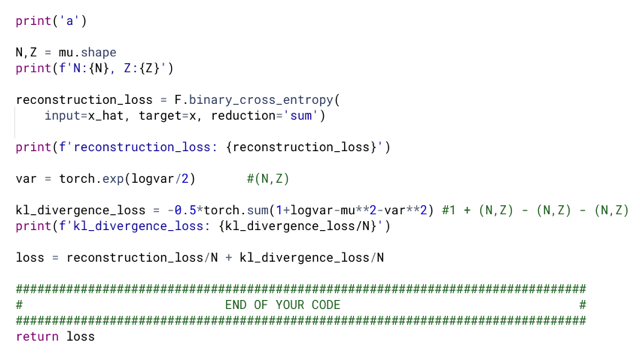</kbd>

<kbd>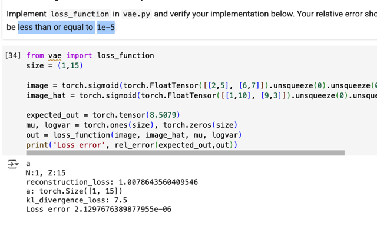</kbd>

<kbd></kbd>

<kbd></kbd>

<kbd>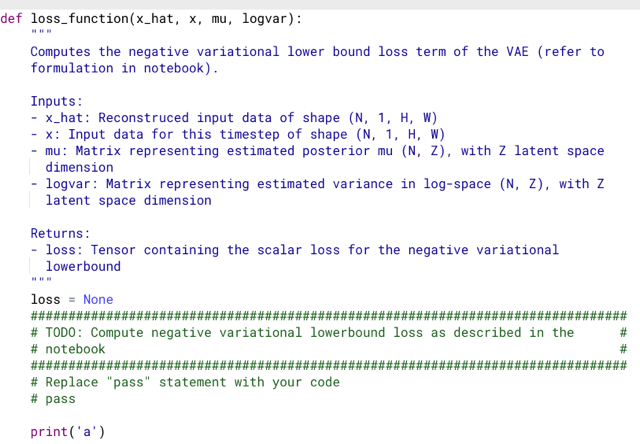</kbd>

 

<kbd>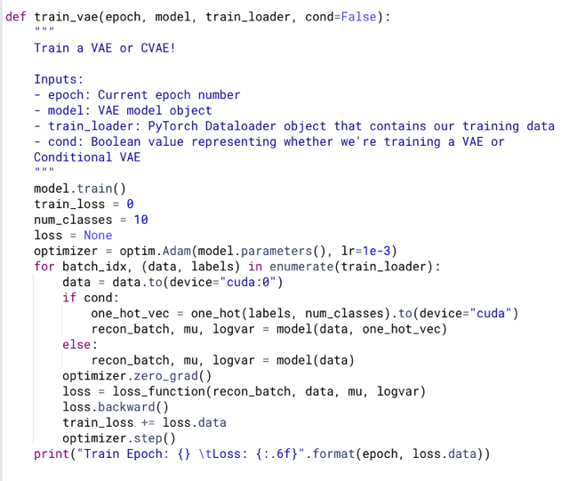</kbd>

<kbd></kbd>

<kbd>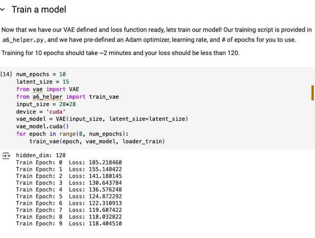</kbd>

> [!NOTE]
> Đại khái là họ làm giùm các đoạn code cần thiết để train, sau khi train với
> 10 epoches xong, loss đã nhỏ hơn 120 như expect

> [!NOTE]
> Function này họ làm sẵn, giúp train vae: Sẽ nhận model, train_loader (là một
> DataLoader) và current epoch
>
> Đầu tiên gọi model.train() để đặt model vào trạng thái training. Set các biến sẽ
> chứa training loss.
>
> Kế tới, khởi tạo Adam optimizer, pass vào model's parameters để optimizer
> nó biết phải update parameters nào, cùng với learning rate.
>
> Tiếp theo chạy vòng lặp: enumerate(train_loader), để nó trả từng batch dataset
> dưới dạng một batch index và tuple (data, labels)
>
> Ta sẽ chuyển data vào gpu.
>
> Sau đó là bước check xem ta đang làm việc với VAE hay conditional VAE
>
> để pass data hoặc cả data và label vào model để có batch reconstruction
> images cũng như mean và (log) variance của q_phi(z|x) do encoder dự đoán.
>
> Tiếp theo, reset gradient của optimizer, tính loss function bởi, reconstructions
> images và original images (data), cũng như mu và log var (predicted distribution
> bởi encoder). loss_function này là cái mà ta vừa làm.
>
> Kế tới, gọi loss.backward() để back-propagation.
>
> Gọi optimiser.step để update model's params

 

<kbd>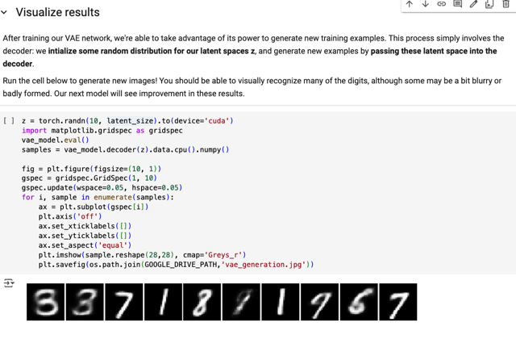</kbd>

> [!NOTE]
> sau khi train xong, ta có thể lấy decoder ra. sampling các latent variables từ
> simple standard Gaussian distribution (như ở đây họ dùng torch.randn(10,
> latent_size) chính là tạo 10 vector latent variable trong standard Gaussian có số
> dimension = latent_size
>
> pass vào decoder để nó predict các reconstructed images.
>
> Nên nhớ rằng, khi trainning, với KL divergence loss là KL divergence giữa
> q_phi(z|x) và p(z), đã khiến cho **latent code,** s**ampling từ một
> CONDITIONAL Gaussian q_phi(z|x) do encoder predicted CÓ "DẠNG"**
> **GIỐNG NHƯ ĐƯỢC  SAMPLING TỪ STANDARD GAUSSIAN p(z)**, và khi
> decoder reconstruct nó đã học được cách PREDICT RA IMAGE X CÓ
> LIKELIHOOD CAO DỰA TRÊN LATENT CODE Z thông qua việc nâng lower
> bound của p_theta(x) lên
>
> Phải nhấn mạnh rằng nhờ training mà q_phi(z|x) ~= p(z), nên bây giờ ta
> sampling từ p(z) là có thể đưa decoder predict x. Chứ nếu lúc training chỉ  lấy
> khơi khơi latent code từ p(z) đưa qua decoder thì decoder phải reconstruct cái
> gì, hay dựa vào đâu để mà học cách dự đoán p_theta(x|z).
>
> Phải cần image ban đầu x, nhờ encoder chắt lọc latent code z thì ta mới  thông
> qua việc ráng reconstruct lại x từ z, để dạy cho decoder. Nhưng đồng thời phải
> khích lệ encoder ráng học ra z sao cho giống với p(z) thì "tí nữa" train xong mới
> có thể lấy từ p(z) ra đưa cho decoder được. Chứ nếu không, ta sẽ không biết
> sampling z từ đâu cả vì q_phi(z|x) là một conditional distribution, nó cần có
> image x để predict distribution của z.

 

<kbd>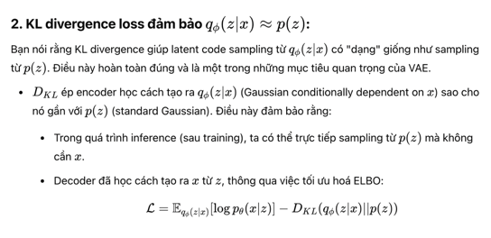</kbd>

<kbd>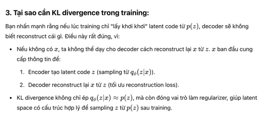</kbd>

<kbd>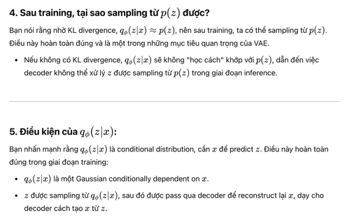</kbd>

<kbd>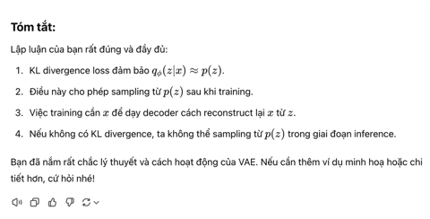</kbd>

<kbd></kbd>

<kbd></kbd>

<kbd></kbd>

<kbd></kbd>

<kbd>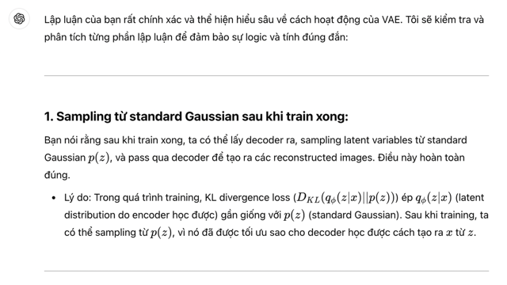</kbd>

 

<kbd>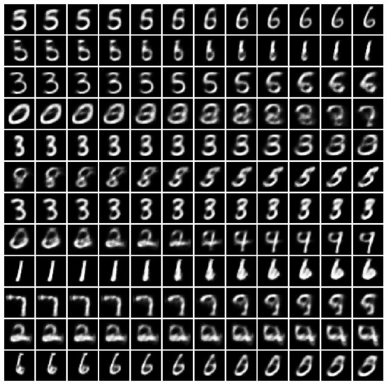</kbd>

<kbd></kbd>

<kbd>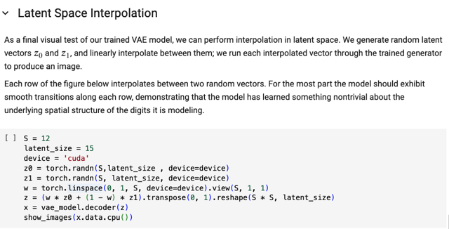</kbd>

> [!NOTE]
> đại khái là ta có thể thực hiện việc interpolation từ một latent code này tới
> latent code khác để có các giá trị trung gian giữa chúng, và pass chúng
> vào decoder. Kết quả những sự chuyển đổi dần giữa hai số cho thấy
> rằng model đã học được những quy luật không đơn giản của các chữ số

 

<kbd>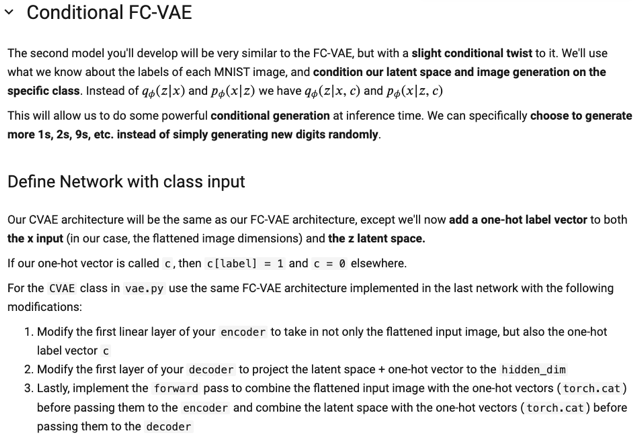</kbd>

> [!NOTE]
> Đại khái là tiếp theo ta sẽ sửa model VAE ở trên chút xíu bằng cách cho
> encoder cũng như decoder nhận thêm label của image, dưới dạng một
> one-hot encoded vector. Mục đích là ta sẽ coi như thay vì encoder học cách
> dự đoán một conditional probability distribution q_phi(z|x) thì bây giờ nó sẽ
> học một phân  phối xác suất conditional khác là q_phi(z|x,c) (c là class label,
> represent bởi one hot encoded). Và tương tự, decoder sẽ thay vì học
> p_theta(x|z), nó sẽ học p_theta(x|z, c) - có nghĩa là THAY VÌ CHỈ HỌC PHÂN
> PHỐI XÁC SUẤT CỦA IMAGE X DỰA TRÊN LATENT CODE, NÓ SẼ HỌC
> THÊM PHÂN PHỐI CỦA X DỰA TRÊN LATENT CODE VÀ LOẠI CỤ THỂ
> NỮA.
>
> Nhờ vậy, sau khi training, ta có thể pass một latent code sampling từ
> standard Gaussian p(z) VÀ MỘT LABEL ONE-HOT ENCODED để decoder
> generate ra cái loại cụ thể đó. Ví dụ muốn số 9 thì nó sẽ cho số 9, thay vì
> hiện tại với latent code z, nó có thể ra một số bất kì nào đó.
>
> Cách làm cũng dễ thôi, ta sẽ cho encoder nhận concatenation của flatten
> image và one-hot encoded label. Tương tự, decoder cũng sẽ nhận
> concatenation của latent code z và one-hot encoded labe.

 

<kbd>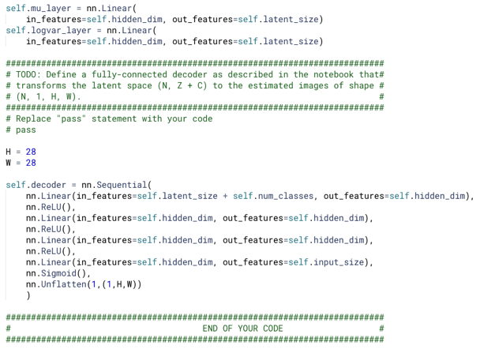</kbd>

<kbd>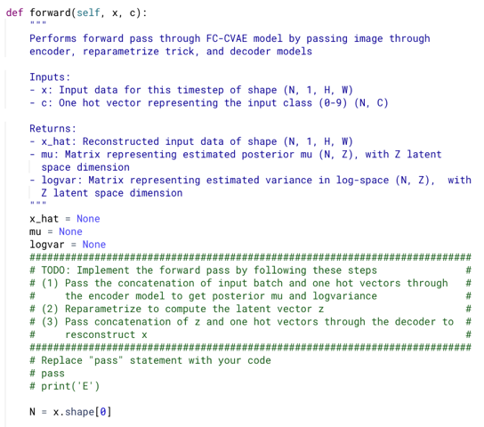</kbd>

<kbd></kbd>

<kbd></kbd>

<kbd>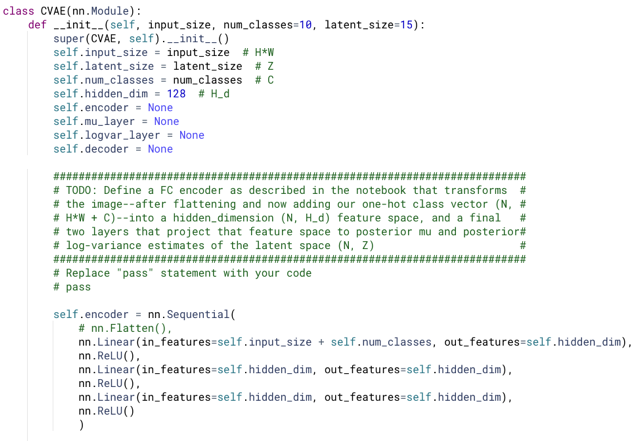</kbd>

> [!NOTE]
> Chỉ cần đổi in_features của encoder và decoder's linear layer đầu tiên.
> Và trong forward, ta cần phải **tự flatten x trước khi concat với c**. Thành
> ra cũng không cần Flatten layer của Encoder nữa

 

<kbd>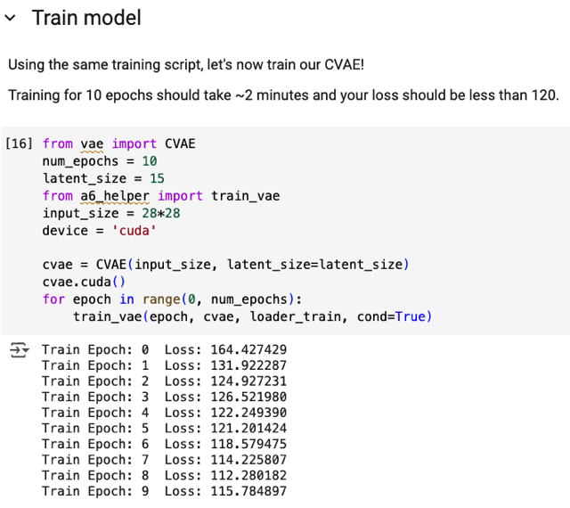</kbd>

 

<kbd>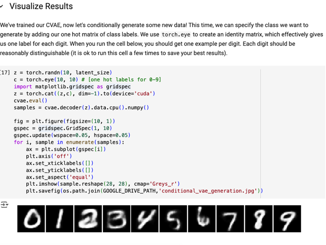</kbd>

> [!NOTE]
> Cuối cùng, ta sẽ sampling, ở đây họ dùng function torch.eye để tạo một
> Identity matrix 10x10, về cơ bản chính là 10 one-hot encoded vector dùng
> để pass vào decoder.

 

