# Guess Lecture - Adversarial Machine Learning

📊 **Progress:** `9` Notes | `12` Screenshots

---

<kbd>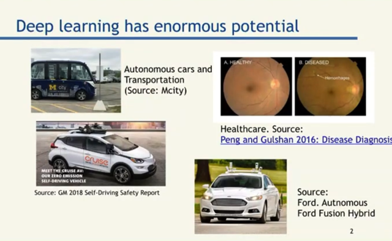</kbd>

> [!NOTE]
> Mở đầu gs nói qua về những tiềm năng to lớn của Deep
> Learning như trong xe tự lái, y tế ...

 

<kbd>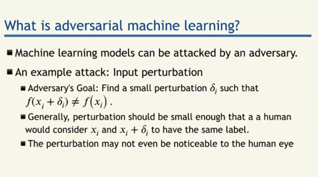</kbd>

> [!NOTE]
> Thế thì khái niệm adversarial machine learning sẽ bắt đầu với việc đặt ra câu
> hỏi rằng, liệu mô hình học máy có thể bị tấn công theo cách thức dựa vào
> một thay đổi nhỏ delta_i (perturbation) trên input x_i khiến mô hình từ việc
> classify đúng label của x_i khi tính ra f(x_i) trở nên dự đoán sai với việc tính
> f(x_i+delta_i) là một class khác.
>
> Gs nói, ví dụ như con người, sự thay đổi nhỏ như người đi bộ mặc áo khoác
> không khiến chúng ta nhầm lẫn thành một object khác. Thì nếu máy tính
> không làm được như vậy sẽ đặt ra câu hỏi lớn về độ tin cậy của mô hình
>
> *Nhưng trong adversarial attack, ta xét sự thay đổi nhỏ đủ để không khiến
> human eye nhận ra

 

<kbd>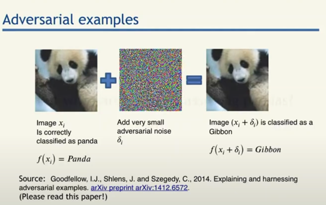</kbd>

> [!NOTE]
> ví dụ như ảnh con gấu trúc này, ban đầu model classify chính xác là
> gấu trúc, nhưng với một adversarial noise được add vào khiến mô
> hình dự đoán nó thành gibbon. Dù mắt người vẫn chỉ thấy nó là gấu
> trúc.

 

<kbd>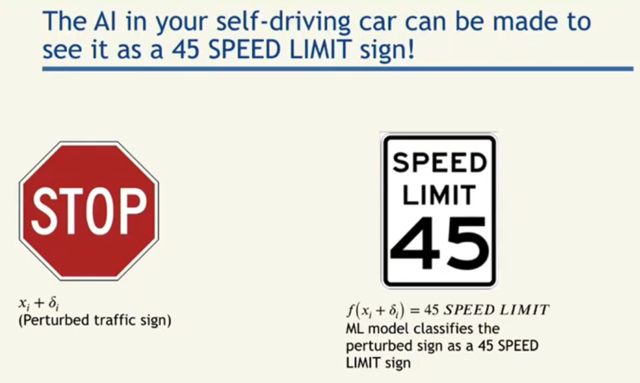</kbd>

> [!NOTE]
> vấn đề sẽ rất nghiêm trọng khi hình dung adversarial attack khiến hình
> ảnh stop sign bị nhầm lẫn thành một class khác cho phép chạy 45 mph
> chẳng hạn.

 

<kbd>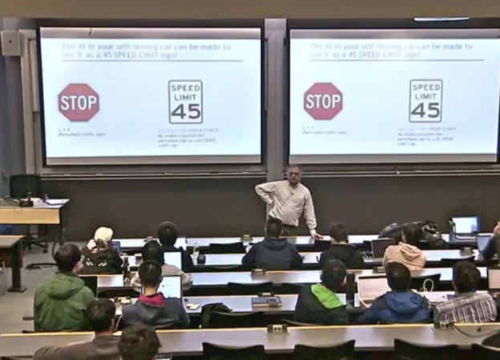</kbd>

> [!NOTE]
> tới đây gs đặt câu hỏi ta thử suy nghĩ xem tại sao điều này có thể xảy ra?
> Hay, tại sao ta có thể tìm được adversarial noise có tính chất làm mô hình
> nhầm lẫn như vậy?
>
> Thử trả lời: Lí do là vì, như trong bài giảng về DeepDream ta đã thấy, mô
> hình nhìn thấy những pattern trong bức hình mà mắt thường con người
> không nhìn thấy.

 

<kbd>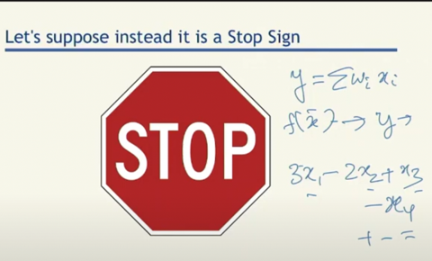</kbd>

> [!NOTE]
> câu trả lời là, ta hãy xét một linear classification này, y =
> Sum w_i*x_i.
>
> Để thay đổi y, ví dụ muốn làm nó tăng, như đã biết ta có
> thể dùng gradient của dy/dx_i để dẫn dắt sự thay của x_i
> giúp tăng y lên nhanh nhất. Vậy thì ý chính là nếu ta có i
> lớn, tức là trong bối cảnh của bài toán multivariate với
> dimension lớn thì  ta **chỉ cần thay đổi mỗi variable x_i
> chút xíu**, mỗi cái theo hướng khiến y tăng hoặc giảm thì
> tổng hợp hiệu ứng của một **số lượng nhiều variable**
> cũng có thể khiến dù mỗi thay đổi của x_i là nhỏ, nhưng
> với nhiều x_i thì **cũng đủ để  thay đổi đáng kể y**Thế thì bài toán này sẽ kiểu như ngược lại với việc train
> mô hình, khi ta dùng gradient descent để giảm loss, thì ở
> đây ta sẽ dùng gradient ascent để tăng loss (tức là thay
> đổi bức hình / thay đổi noise value sao cho mô hình ngày
> càng sai lầm)

 

<kbd>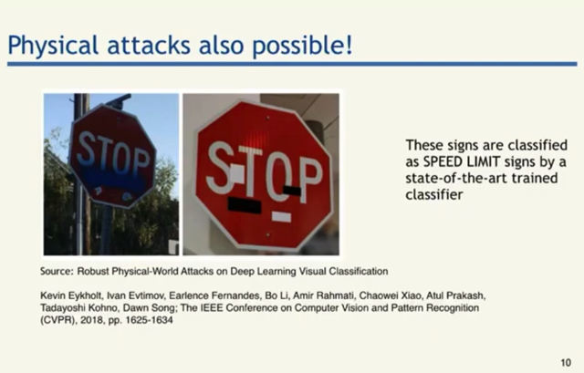</kbd>

> [!NOTE]
> tiếp theo đại ý là nếu như ta có thắc mắc là làm sao mà thay đổi từng
> pixel trong một tấm biển hiệu ngoài đời thật (add vào adversarial noise)
> để mà đánh lừa (ví dụ) cái xe tự lái được? Thì thật ra ta có thể làm hơi
> khác,  bằng cách train một "lớp" adversarial noise theo kiểu tìm ra vị trí
> để dán  mấy miếng sticker lên tấm biển sao cho tối đa được loss.
>
> Với cách làm này, người ta đã lừa được mô hình với việc dán các miếng
> sticker này lên. Và ví dụ này cũng đã gây chú ý tới cộng đồng khoa học.
> Bảo tàng London thậm chí liên hệ để xin tấm biển này về trưng bày

 

<kbd>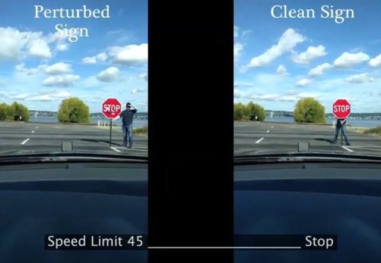</kbd>

> [!NOTE]
> Hình ảnh từ camera được pass qua classification model, kết quả cho
> thấy phần lớn thời gian, model classify là Speed Limit 45 đối với tấm
> bảng Stop Sign

 

<kbd>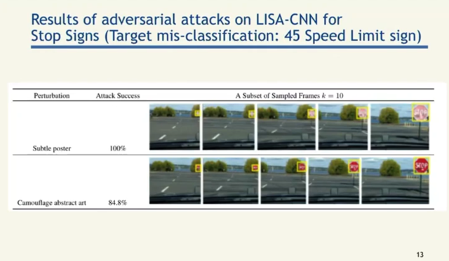</kbd>

 

<kbd>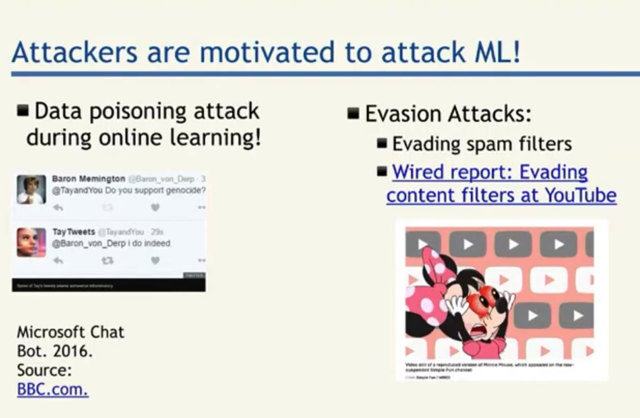</kbd>

 

<kbd>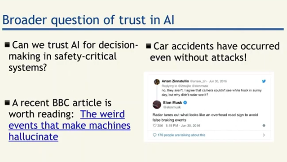</kbd>

 

<kbd>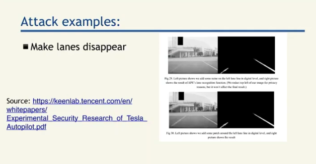</kbd>

> [!NOTE]
> Quay lại sau

 

