# Lecture 1/16 - Introduction To CNN

📊 **Progress:** `11` Notes | `31` Screenshots

---

<kbd>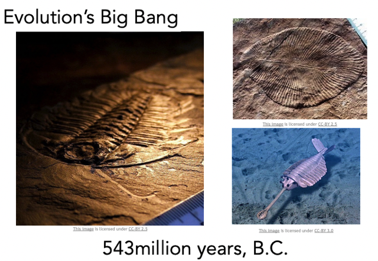</kbd>

 

<kbd>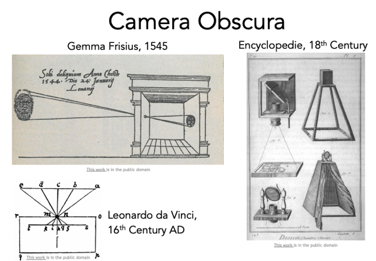</kbd>

 

<kbd>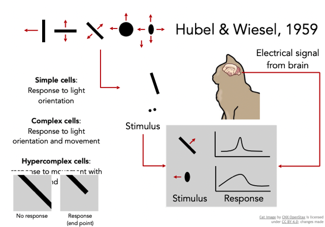</kbd>

 

<kbd>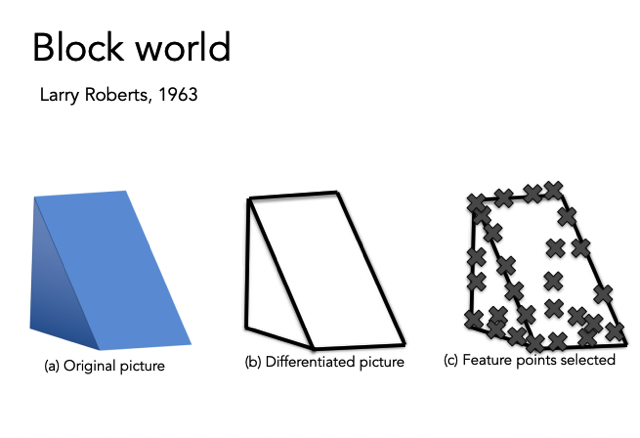</kbd>

 

<kbd>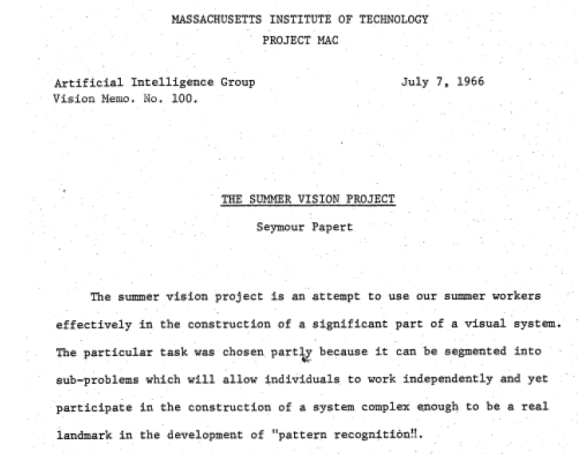</kbd>

 

<kbd>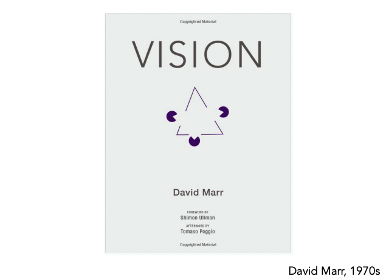</kbd>

 

<kbd>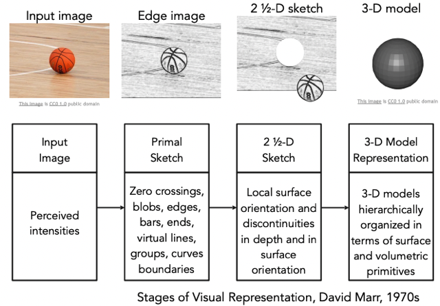</kbd>

> [!NOTE]
> Những nghiên cứu đầu tiên đặt nền
> móng cho thị giác máy tính

 

<kbd>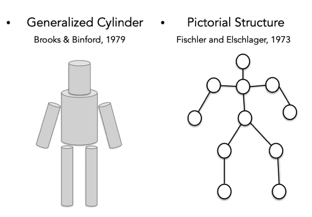</kbd>

 

<kbd>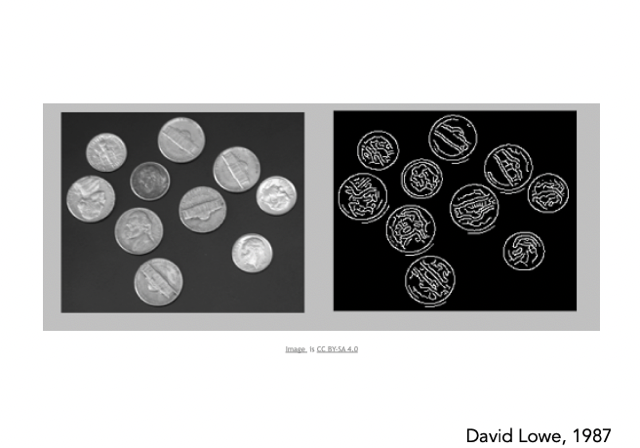</kbd>

 

<kbd>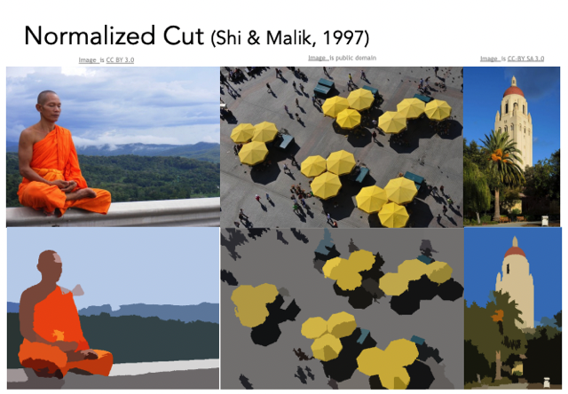</kbd>

> [!NOTE]
> Đại khái là một trong những nỗ lực ban đầu của computer vision chỉ là 
> segmentation chưa phải là semantic segmentation `-` trong đó có chỉ ra
> được vùng nào là của object gì, ở đây chỉ là khoanh vùng những vùng
> của cùng một chủ thể thôi

 

<kbd>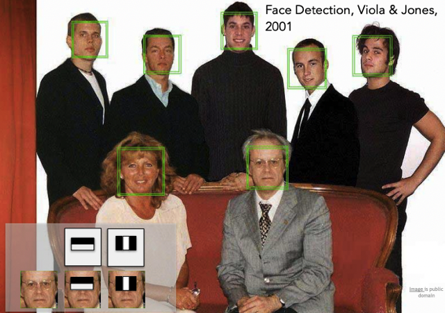</kbd>

> [!NOTE]
> Thời điểm 2001 thông qua việc feature engineering và kĩ thuật
> window scanning người ta đã có thể làm vấn đề nhận diện khuôn
> mặt.
>
> Và sau đó Fujifilm đã mang tính năng này lên thế hệ camera kĩ thuật
> số đầu tiên

 

<kbd>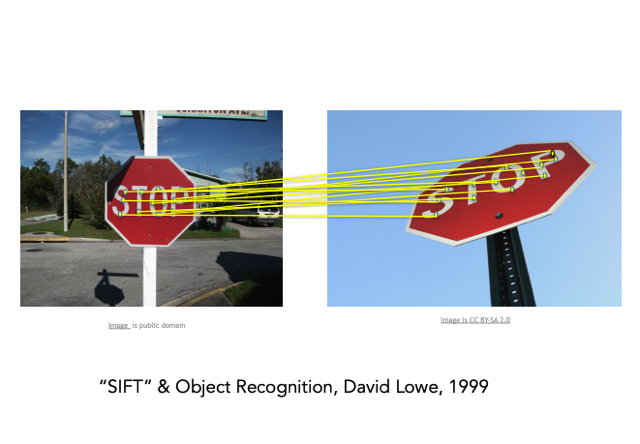</kbd>

 

<kbd>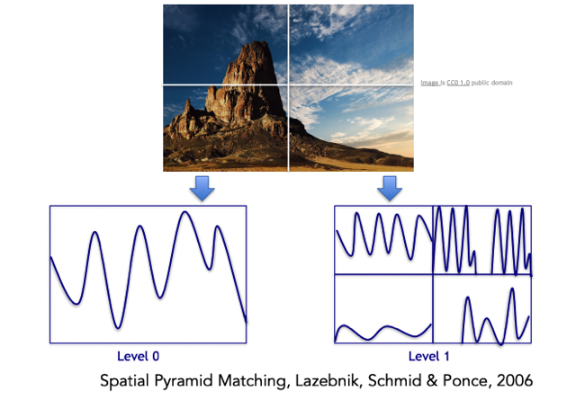</kbd>

 

<kbd>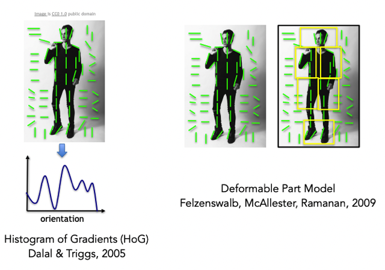</kbd>

 

<kbd>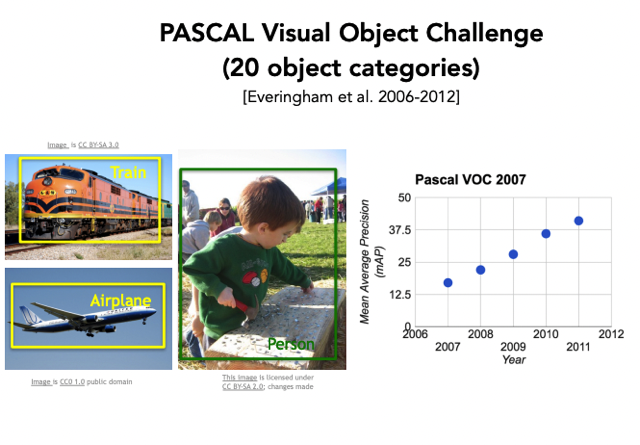</kbd>

> [!NOTE]
> Benchmark đầu tiên là PASCAL
> Visual Object Challenge

 

<kbd>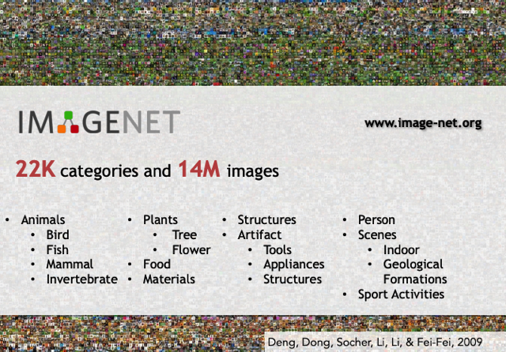</kbd>

> [!NOTE]
> Nằm 2009 trong nỗ lực thu thập một bộ labeled dataset thông qua đó giúp 
> training AI model trong vấn đề computer vision, bà Fei. Fei Li và đồng sự
> đã tạo bộ dataset IMAGENET. Từ đó xây dựng benchmark  cho computer 
> vision

 

<kbd>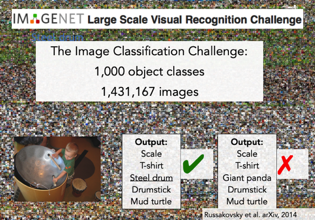</kbd>

 

<kbd>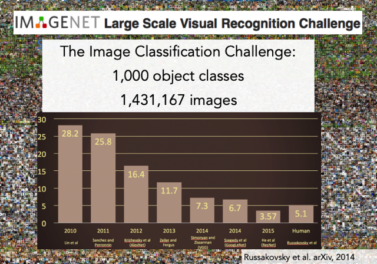</kbd>

> [!NOTE]
> Sự giảm của error rate, đáng chú ý sự sụt giảm
> mạnh năm 2012 với sự ra đời của CNN cụ thể
> là AlexNet của Jeff Hilton

 

<kbd>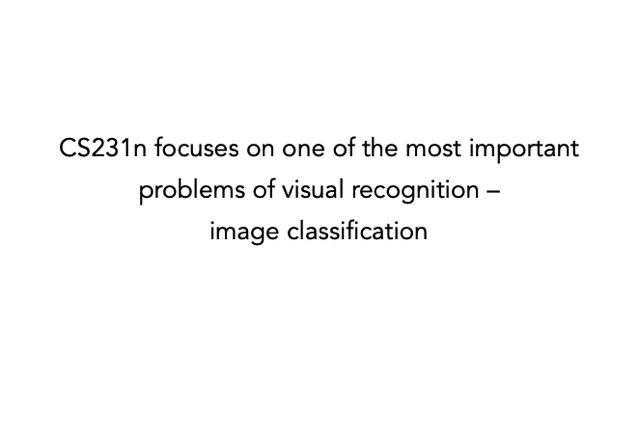</kbd>

 

<kbd>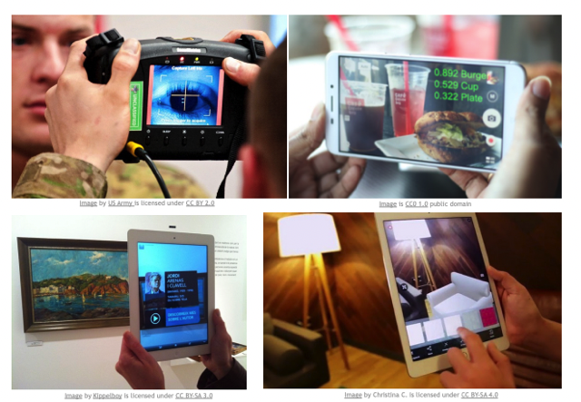</kbd>

 

<kbd>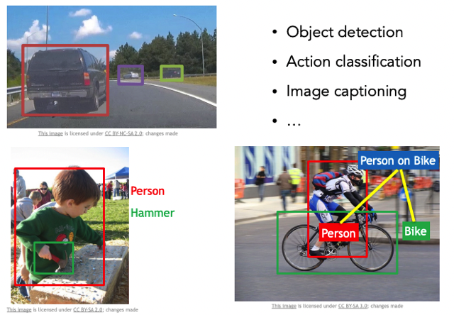</kbd>

 

<kbd>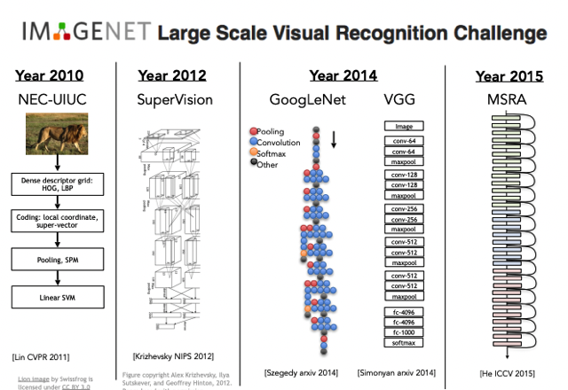</kbd>

> [!NOTE]
> năm 2012 với CNN model AlexNet của Jeff Hilton và Alex... giúp chứng
> kiến sự tiến bộ vượt bậc trong IMAGENET challenge

 

<kbd>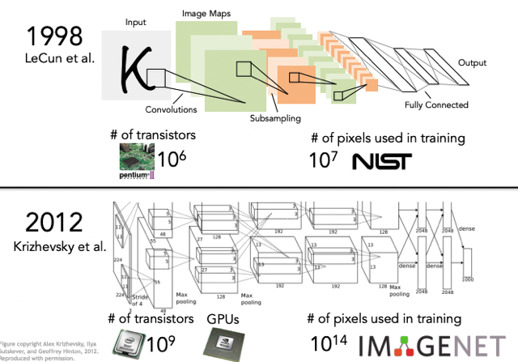</kbd>

> [!NOTE]
> Nhưng không phải nó mới được phát minh
> 2012 mà đã thai ngén từ lâu rồi

 

<kbd>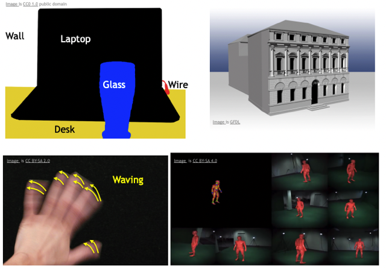</kbd>

 

<kbd>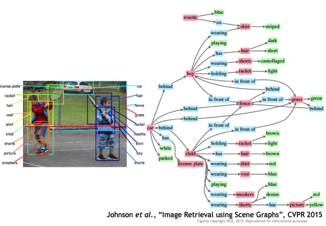</kbd>

 

<kbd>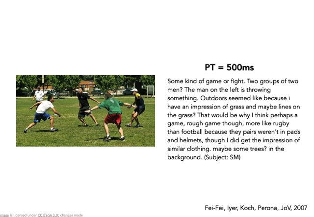</kbd>

> [!NOTE]
> Đại ý nói về một thí nghiệm cho 1 người xem qua bức ảnh trong vòng có nửa 
> giây nhưng đủ khiến họ có thể viết ra mô tả như vầy. Nếu cho thời gian lâu hơn
> Con người có thể đi sâu phân tích rất nhiều thứ, cả một câu chuyện dài phía sau.
>
> Từ đó cho thấy chặng đường dài phía trước cho Computer Vision giúp máy tính
> có thể tiệm cận khả năng này

 

<kbd>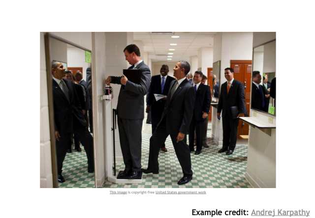</kbd>

> [!NOTE]
> Ý nói còn một chặng đường dài nữa máy tính mới có thể
> nhìn và hiểu được cái hình này tại sao lại có nhiều điểm
> thú vị. Nó phải hiểu tình huống tại sao lại hài hước. Ông
> đang giỡn là ai `-` là tổng thống Mỹ, càng khiến sự đùa giỡn
> đáng chú ý. Ý nói còn chặng đường rất dài nữa thì máy tính
> mới tiệm cận khả năng của con người trong vấn đề nhìn nhận
> một hình ảnh

 

<kbd>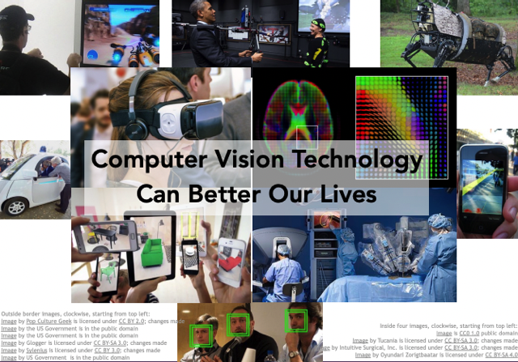</kbd>

 

<kbd>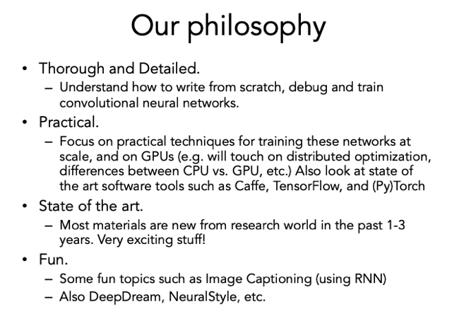</kbd>

 

<kbd></kbd>

 

<kbd>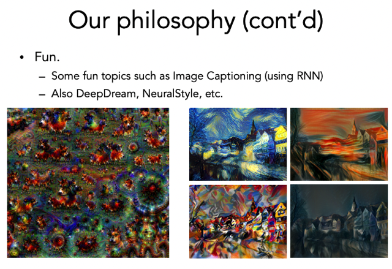</kbd>

> [!NOTE]
> Một số hình ảnh của Style
> Transfer technique

 

