# Lecture 12/16 - Visualization And Understanding

📊 **Progress:** `63` Notes | `102` Screenshots

---
<a id="node-1664"></a>

<p align="center"><kbd>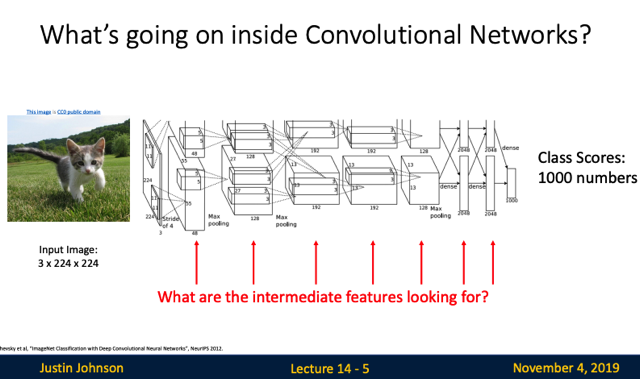</kbd></p>

> [!NOTE]
> đại khái là ta sẽ học một số technique để "nhìn" thấy những gì bên trong
> CNN, Từ đó giúp ta có thể hiểu được phần nào cách hoạt động của nó
> cũng như là khi cần thiết có thể biết được chuyện gì đang xảy ra
>
> Justin nói trước những phương pháp này mang tính chất empirical  chứ ta
> không có một strong theory cho cái này.

<br>

<a id="node-1665"></a>

<p align="center"><kbd>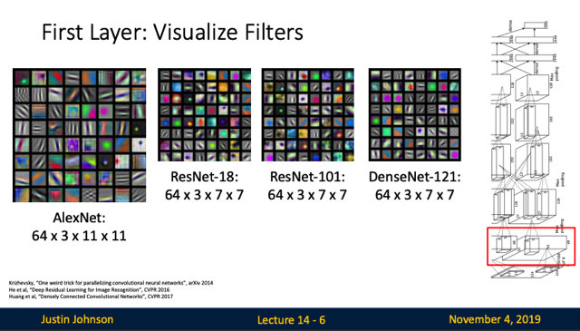</kbd></p>

> [!NOTE]
> đại khái là Justin nhắc lại những bài đầu hồi ta học về Linear Classifier,  Ta
> có thể visualize các learned weight, W `(num_class,` `input_dim),` cụ thể là ta
> lấy mỗi row của W, là vector `input_dim,` reshape lại thành image shape và
> plot ra thì có thể thấy rằng nó có dạng như một cái form, và một image mà
> có càng khớp với cái form ứng với class nào thì sẽ class score tính ra sẽ
> càng lớn.
>
> Thế thì ta mới tiếp tục cái idea này khi qua convolutional layer, với việc các
> filter cũng có dạng những cái form để rồi khi nó "quét" qua các vùng của
> image, vùng nào có độ khớp với các filter này thì output sẽ có giá trị lớn.
>
> Và ta cũng visualize các filter này để có thể hiểu được phần nào những
> layer đầu tiên này tìm kiếm (pattern) gì.
>
> Thêm nữa các simple `/` low level pattern này là tương đối chung dù là ta
> sử dùng model (architecture) nào ResNet hay VGG....Chúng thường là
> các pattern như edge, color gradient ...

<br>

<a id="node-1666"></a>

<p align="center"><kbd>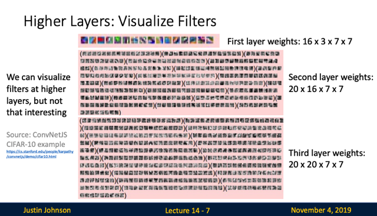</kbd></p>

> [!NOTE]
> Đại ý là liệu ta có thể tiếp tục cố gắng visualize các layer "sâu hơn" hay
> không. Thì Justin cho rằng có thể, nhưng sẽ không hữu ích lắm.
>
> Ví dụ như ở đây, ta có một model train on `CIFAR-10` dataset. Ở layer
> conv đầu tiên, nó có 16 filter, mỗi filter sẽ có shape là 3x7x7. Ta mới
> visualize 16 filter này ra (với 3 channel, thì có thể "in" nó ra như một
> color mage 7x7 bình thường). Kết qủa là mấy cái hình ở hàng 1.
>
> Sau đó, đương nhiên là ta biết nó sẽ qua relu, rồi ở conv layer tiếp
> theo với 20 filter mỗi cái có shape 16x7x7 (filter ở đây đương nhiên
> phải có depth `=` input depth). Thì Justin cho rằng ta không thể visualize
> những cái  16x7x7 filter này theo RGB. Do đó, ta sẽ visualize mỗi một "
> miếng" (channel) trong 16 miếng của một filter theo grayscale (tức là in
> cái miếng đó ra theo "trắng đen", và làm với mọi filter. Để rồi ta có hành
> thứ hai, là 16*20 cái hình trắng đen 7x7 như vậy. 
>
> Thế thì đại khái là có thể thấy các filter vẫn có "kiểu" của những pattern
> như edge,..nhưng khác ở chỗ nó "tìm kiếm" những pattern này trong
> feature map output từ 1st conv layer thay vì original RGB image
>
> Justin cho rằng, nếu tiếp tục cách làm này cho các layer deeper thì cũng
> không hữu ích cho lắm, nên ta cần những cách tiếp cận khác.

<br>

<a id="node-1667"></a>

<p align="center"><kbd>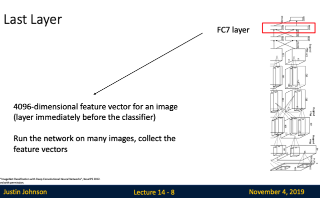</kbd></p>

> [!NOTE]
> Tiếp theo, đại ý là, một cách tiếp cận khác, ta có thể visualize những "
> last" layer, ví dụ nhớ lại cái mô hình VGG, cái layer cuối là FC7 có 4096
> units. Trước khi nó sẽ map với output layer có 1000 unit để predict 1000
> class scores. Vậy, hình dung rằng VGG giúp biến original RGB image
> thành một feature vector 4096 units,  để dùng nó trong một linear
> classifier, thì ta có thể tìm hiểu xem feature vector này có "dạng" như thế
> nào.

<br>

<a id="node-1668"></a>

<p align="center"><kbd>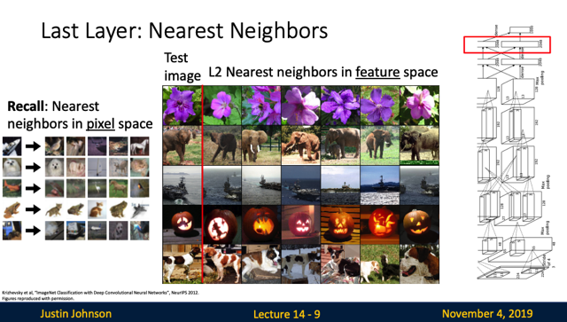</kbd></p>

> [!NOTE]
> Vậy một cách để ta "xem xét" những feature vector này đó là dùng  Nearest
> Neighbors: Nhớ lại những bài đầu khi ta đã làm qua KNN classifier, thì cái
> này hoạt động rất đơn giản, với một cái image cần classifier, ta chỉ việc tìm
> xem những cái hình nào trong training set là "gần" `/` "giống" với nó nhất, thì
> từ đó class của các neighbor sẽ  dùng để dự đoán biết class của image cần
> tìm. Thì như ta đã thấy performance của KNN không tốt lắm.
>
> Tuy nhiên khi áp dùng KNN với feature vector của cnn model nói ở trên, thì
> kết qủa rất kinh ngạc khi có thể thấy rằng những neighbor của cái hình cần
> tìm trong feature space, đều có cùng class với nó.
>
> Tức, là với KNN mà dùng image vector (tức là cái hình gốc, flatten, thì trong
> không gian original feature 32*32*3, thì nếu xét các nearest neighbor của
> một sample con voi, thì chúng chưa chắc, và phần đông không phải voi.
> Nhưng nếu xét không gian cnn feature vector thì các neighbor của một con
> voi đều là voi.
>
> Từ đó cho thấy cnn đã bằng cách nào đó học được rằng "như thế nào là
> voi, như thế nào là hoa...." bất kể những con voi trong training sét có bố cục,
> background, ánh sáng khác nhau.

> [!NOTE]
> Có câu hỏi là hãy nói cụ thể hơn cách làm:
>
> Thì ta sẽ forward cái "query" image nào đó qua cnn để lấy feature vector. Và
> làm vậy với toàn bộ test set để nói chung là dùng cnn để chuyển mỗi image
> thành ra feature vector. rồi dùng l2 distance để tìm nearest neighbor của cái
> query image

<br>

<a id="node-1669"></a>

<p align="center"><kbd>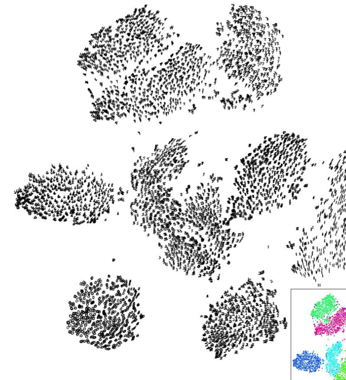</kbd></p>

<p align="center"><kbd></kbd></p>

<p align="center"><kbd>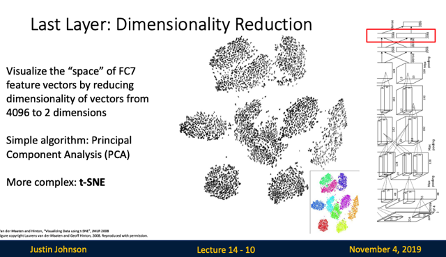</kbd></p>

> [!NOTE]
> một cách nữa là dùng thuật toán dimensionality reduction như PCA và
> `T-SNE` để giúp giảm từ 4096D vector space, xuống 2D space. (Justin
> cho biết PCA là linear algorithm, `T-SNE` là `non-linear).` Từ đó giúp ta
> visualize feature space.

<br>

<a id="node-1670"></a>

<p align="center"><kbd>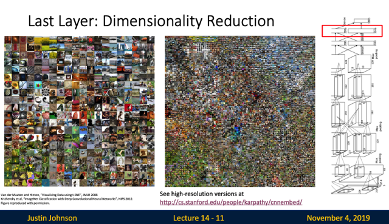</kbd></p>

<br>

<a id="node-1671"></a>

<p align="center"><kbd>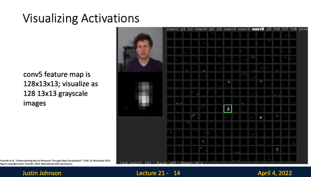</kbd></p>

> [!NOTE]
> Đại khái là ta sẽ lấy output của một layer nào đó trong cnn, ví dụ như
> của conv5 `-` là conv layer thứ 5 của AlexNet chẳng hạn, nó có 128 filter,
> nên output của layer này sẽ là tensor 128x13x13, mỗi depth slice sẽ là
> kết qủa của một filter.
>
> Vậy thì ta có thể in các depth slice này ra ở dạng gray scale, và xem xét.
> Trong ví dụ này, có thể thấy, tuy phần lớn đều có màu đen (*), nhưng một
> số filter's output cho thấy chúng bị kích hoạt. Ví dụ cái này, khi phóng to
> để align với ảnh gốc đầu vào , cho thấy nó tương ứng với vị trí của khuôn
> mặt. Từ đó có thể kết luận filter đó đã "learn" để detect được pattern ứng với
> khuôn mặt người.
>
> (*) Có câu hỏi tại sao phần lớn lại đen, Justin trả lời có hai 2 ý:
>
> 1. Là do hàm relu như đã biết output `=` 0 nếu không activate và dương tới
> vô cùng nếu activate. Nên có thể ở đây các relu neuron không activate.
>
> 2. Do khi activate, giá trị của relu có thể rất lớn, nên giả sử có một thằng
> có giá trị lớn, những cái khác có giá trị nhỏ (tức là activate nhưng nhỏ)
> thế thì khi ta in ra, ta phải squash các giá trị về range `0-255.` Do đó có thể
> các activate value nhỏ cũng bị squash về 0

<br>

<a id="node-1672"></a>

<p align="center"><kbd>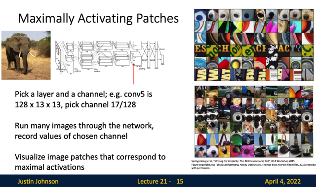</kbd></p>

> [!NOTE]
> đại khái là tiếp nối cách làm là quan sát activation output từ layer, ta sẽ
> forward training sét hoặc test sét và ghi lại trong số các **vùng (trên ảnh gốc)**
> mà khiến một filter định trước, của một layer định trước,**activate mạnh nhất**.
>
> Từ đó khi xem xét các vùng (của các bức ảnh khác nhau) có thể n**hìn thấy
> rằng các filter đã được train để kiểu như chuyên biệt cho việc phát hiện
> một pattern nào đó**.
>
> Ví dụ như dòng trên cùng, là của một filter quét và tìm những vùng trên ảnh
> có hình dạng của mắt chó, và tuy các màu lông chó khác nhau, vị trí của chúng
> cũng như những đặc điểm như đậm nhạt sáng tối khác nhau nhưng vẫn là mắt
> chó. Chứng tỏ cnn model đã học cách nắm bắt, phát hiện các khái niệm mang
> Tính trừu tượng.
>
> Điều này thể hiện rõ hơn ở những hàng dưới, nơi người ta lấy ở một layer 
> sâu hơn, cho thấy ở những layer này, model học những khái niệm trừu tượng
> hơn nữa, như bánh xe, mặt người....

<br>

<a id="node-1673"></a>

<p align="center"><kbd>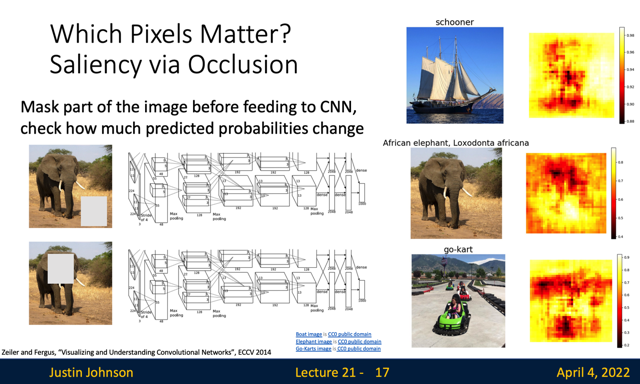</kbd></p>

> [!NOTE]
> Đại khái là ta có thể tìm hiểu xem rằng trong một image thì vùng nào
> những pixel nào đóng góp quan trọng trong việc dự đoán của model.
> Ví dụ như hình con voi, ta che một vùng nào đó đi và inference qua
> model, và ghi nhận giá trị probability of elephant dự đoán bởi model 
> Từ đó với những vùng khác nhau ta cũng làm vậy để hình thành kiểu
> như một bản đồ "nhiệt" (salient map) cho biết ứng với từng vùng khác
> nhau trên ảnh gốc thì mức độ hữu ích của nó khi giúp model tính toán
> ra xác suất bức hình là con voi `/` hay nôm na là mức độ tự tin của model
> khi che những vùng khác nhau đi. Nói chung là nhờ đó ta có thể có
> sự hiểu biết rằng model dựa vào đâu để đưa ra dự đoán.
>
> Thì có thể thấy khi mask ở vị trí con voi, sự tự tin của model giảm xuống
> trong khi nếu mask ở các vị trí khác thì không

<br>

<a id="node-1674"></a>

<p align="center"><kbd>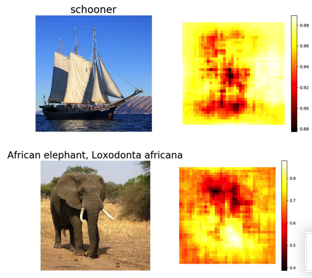</kbd></p>

> [!NOTE]
> một điểm đáng chú ý Justin nêu lên đó là, hãy tưởng tượng dataset
> có nhiều schooner, và chúng đều là những con thuyền nằm trên  mặt
> nước. Thế thì hoàn toàn có thể xảy ra việc một model đưa ra dự đoán
> của nó rằng chúng là những bức hình của schooner dựa  vào việc
> nhìn các chi tiết như có sự xuất hiện của nước, bầu trời  ..ví dụ vậy. Ý
> nói, nếu các bức ảnh schooner có những đặc điểm chung nào đó `-`
> không liên quan gì đến schooner, thì model có thể "Cheating" `-` ăn
> gian bằng cách dựa trên các chi tiết đó.
>
> Thế thì cách làm này chính là có thể giúp ta xác định xem rằng liệu
> Model có đang cheating hay không (bằng cách không nhìn vào những
> cái mà ta muốn nó nhìn hay không)

<br>

<a id="node-1675"></a>

<p align="center"><kbd>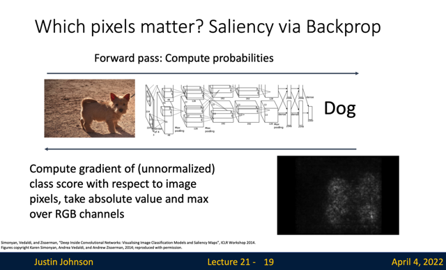</kbd></p>

> [!NOTE]
> Đại ý là cách làm như vừa rồi có phần khá tốn kém về tính toán, vì ta sẽ
> phải forward qua model nhiều tấm hình (được masked ở các vị trí khác
> nhau).
>
> Thế thì có một cách khác đó là, dựa vào backpropagation. Ta sẽ forward
> image một image qua model và lúc backprop, về để tính Gradient của các
> image pixel `-` tức là derivative của loss function w.r.t các phần tử của tensor
> ảnh gốc 3xWxH.
>
> Và vì gradient của một phần tử ứng với một pixel sẽ cho biết  mức độ thay
> đổi cần thiết để loss giảm xuống, cho nên các giá trị gradient này sẽ phản
> ánh mức độ quan trọng của các pixel khi đóng góp vào dự đoán của model
>
> Trong slice, họ tính gradient tức derivative của class score (không phải
> của loss, mà vai trò cũng như nhau thôi) đối với từng image pixels, và lấy
> giá trị tuyệt đối và lấy max trong 3 channel (tại một pixel có 3 phần tử 
> thuộc 3 channel `R/G/B)`

<br>

<a id="node-1676"></a>

<p align="center"><kbd>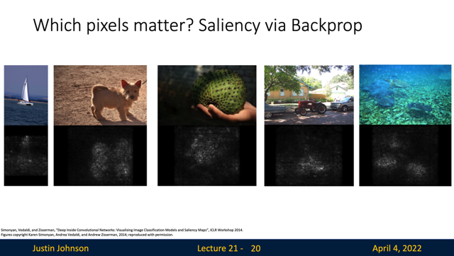</kbd></p>

> [!NOTE]
> một số kết qủa từ cách làm này, được lấy từ paper Ở đây Justin lưu ý 
> khi ta làm assignment về cái này có thể ta sẽ không có những kết quả
> trông đẹp mắt như vậy. Thì có thể không phải do bug mà do trong paper
> họ đã chọn ra những kết qủa đẹp nhất để đăng thôi

<br>

<a id="node-1677"></a>

<p align="center"><kbd>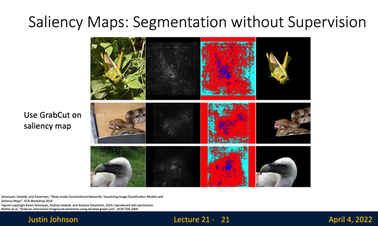</kbd></p>

> [!NOTE]
> Đại khái là, người ta có thể dùng cái salient map nói ở trên, để rồi cùng với
> một phương pháp image processing, để kiểu như `/` đại khái là xóa đi những
> vùng có mức salient thấp để có được kết quả giống như là chỉ giữ lại phần
> của bức hình có salient cao thôi. Kiểu như ta đang dùng salient map tạo bởi
> model để thực hiện việc segmentation `-` xác định, vùng trên bức hình tương
> ứng với một object category nào đó.
>
> Cái này là ví dụ cho thấy có thể dùng prediction của model theo nhiều cách
> thức, mục đích, tác dụng khác nhau. Tuy nhiên, again, Justin cũng căn dặn
> rằng, cách làm này có thể không work tốt nói chung, mà những kết quả có vẻ
> good này thực ra được chọn lựa để đưa vào paper. Nhưng dù sao đây vẫn là
> một ý tưởng hay

<br>

<a id="node-1678"></a>

<p align="center"><kbd>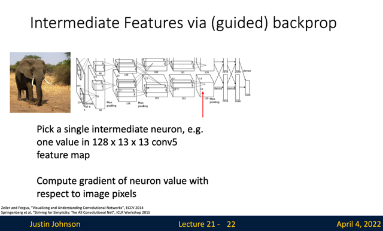</kbd></p>

> [!NOTE]
> đại khái là, người ta tiếp nối ý tưởng tương tự `-` dùng gradient trong quá 
> trình backpropagation để mà "xem thử" pixel nào trong hình gốc gây ra
> thay đổi lớn nhất với prediction. Thì bây giờ bằng cách tương tự để xem
> pixel nào gây ra sự thay đổi nhiều nhất với các intermediate value (tức
> output của các hidden layer. Cách làm chỉ là thay vì tính derivative của
> prediction w.r.t image pixels thì ta tính derivative of neuron value `(inter-`
> mediate layer) w.r.t. image pixels.

<br>

<a id="node-1679"></a>

<p align="center"><kbd>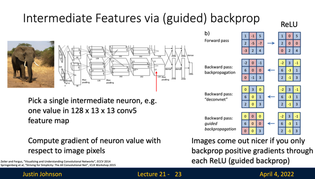</kbd></p>

> [!NOTE]
> Justin cho biết có vấn đề đại khái là nếu dùng gradient từ quá trình 
> backprop thông thường thì kết quả nó không đẹp, nên người ta dùng
> kiểu như một mẹo nhỏ (trick): Gọi là Guided backprop.
>
> Đại khái là vầy: Thông thường, với relu neuron, khi forward qua sẽ
> khiến chỗ nào giá trị âm sẽ trở thành 0. Điều này đã biết. Thế thì từ đó
> khi backprop, đi qua relu node, đương nhiên gradient khi qua các 
> inactivated relu neuron này cũng sẽ bằng 0 do nhân với local gradient 
> của các inactivated relu neuron này `=` 0.
>
> Vậy Guided backprop sẽ thêm một vụ nữa đó là, chỗ nào upstream 
> gradient mà âm thì chỗ đó gradient cũng reset thành 0 luôn.
>
> Justin cho biết chính anh cũng chưa rõ tại sao cái này lại làm kết quả
> của technique này đẹp hơn.

<br>

<a id="node-1680"></a>

<p align="center"><kbd>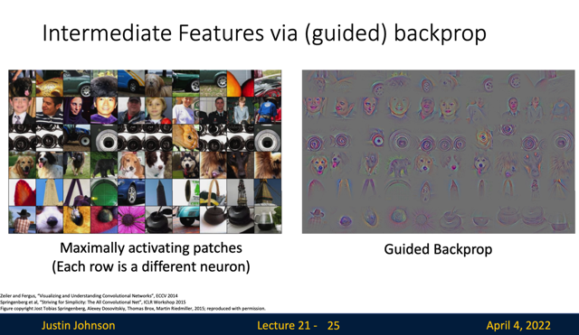</kbd></p>

<p align="center"><kbd></kbd></p>

<p align="center"><kbd>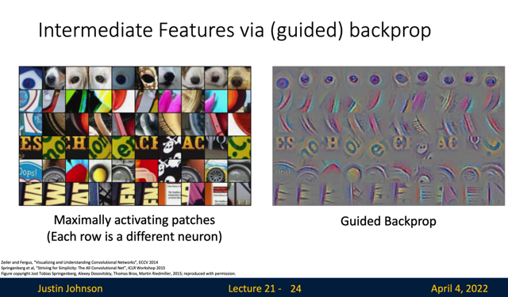</kbd></p>

> [!NOTE]
> Bên trái ví dụ hàng 1 như đã biết là những phần của các image khác
> nhau khiến output của một filter (nào đó, của layer nào đó định trước)
> có gía trị lớn nhất (hay nói theo cách khác, kích hoạt mạnh nhất) để 
> cho ta một sự hiểu biết rằng filter đó được train để học cách tìm kiếm
> ra, phát hiện ra mô tuýp "mũi , mắt chó"
>
> Thế thì các vụ Guided Backprop cũng cho thấy kết quả là, trong những
> vùng đó (của raw image) thì các pixel ngay tại vị trí mũi chó và mắt chó
> chính là những pixel ảnh hưởng nhiều nhất tới giá trị output của neuron
> (value trên spatial map tại vị trí tương ứng của intermediate layer)
>
> Từ đó cho ta thêm hiểu về việc neuron nó tìm kiếm, nhìn vào cái gì

<br>

<a id="node-1681"></a>

<p align="center"><kbd>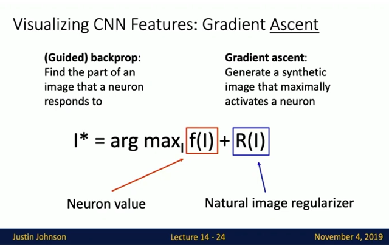</kbd></p>

> [!NOTE]
> Đại khái là vầy: Hồi nãy đến giờ là ta đang dựa trên việc xác định xem **cái pixel nào
> trên image gốc (** mà khi thay đổi nó thì khiến kết qủa dự  đoán (thể hiện bằng có
> thể là loss value hay class score) thay đổi nhiều nhất, thông qua việc so sánh đạo
> hàm của class scores đối với các pixel value đó, bởi vì ý nghĩa của đạo hàm là tỉ lệ
> thay đổi của giá trị hàm so với sự thay đổi của input. Để rồi nó cho ta biết rằng **có
> những vị trí  pixel trên ảnh gốc ảnh hưởng đến loss nhiều hơn, mạnh hơn những vị
> trí khác**, nhờ đó cho ta biết neural nó " nhìn vào đâu"
>
> Tương tự như vậy với (Guided) backprop, giúp ta biết trong các vị trí pixel khác
> nhau, khi ta thay đổi giá trị của cái nào thì sẽ ảnh hưởng mạnh nhất tới giá trị của
> một neuron (ví dụ như trong một vùng 3x10x10 ứng với `/` là receptive field của  một
> neuron, thì khi tăng mỗi cái lên 1 thì cái nào sẽ khiến  giá trị neuron tăng nhiều
> nhất).
>
> (*) Ta nhớ lại với conv layer, giá trị tại một vị trí trên một feature map, sẽ là kết quả
> của một phép dot product giữa filter và một vùng trên input layer. Để "tạo thành" một
> neuron output.
>
> `===`
>
> Vậy thì cái này, ta đặt vấn đề ngược lại, rằng: À thế thì ta có thể dựa vào cái quan hệ
> này `-` ý nói đến việc đạo hàm của giá trị neuron đối với giá trị của pixel có thể giúp
> hướng dẫn việc học ra `/` chọn ra giá trị của pixel khiến maximize giá trị của neuron.
> Quá trình đó chính là gradient ascent
>
> Giống như khi ta dùng gradient descent để thay đổi  các model parameters dần dần
> theo hướng khiến loss giảm xuống về cực tiểu. Thì ở đây ta có thể dùng gradient
> ascent để dẫn dắt sự thay đổi của các pixel value sao cho output của một neuron trở
> nên mạnh nhất
>
> `===`
>
> Công thức trong hình có nghĩa là: I* là giá trị của pixel khiến f(I) là giá trị của neuron `-`
> trở nên lớn nhất, có cộng thêm R(I) đóng vai trò giúp giá trị của pixel không trở nên
> quá kì cục (look natural). Nên hiểu giá trị của pixel đương nhiên cũng sẽ tạo nên diện
> mạo của một image. Nên function này cũng có thể mang ý nghĩa là:
>
> Bức hình nào, hoặc một vùng định trước của bức hình nào khiến giá trị của neuron A
> lớn nhất.
>
> Thì dùng Gradient Ascent:
>
> Ta thay vì tìm trong test set `/` training set cái nào "thắng" thì ta có thể chế ra  một bức
> hình (synthetic image) khiến output của neuron là lớn nhất,

<br>

<a id="node-1682"></a>

<p align="center"><kbd>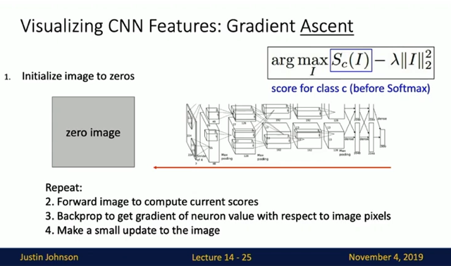</kbd></p>

> [!NOTE]
> Quá trình sẽ tương tự như khi ta train model, trong đó ta initialize model params
> với giá trị `=` 0 (với bias) hay ngẫu nhiên với weight. Rồi forward tính loss, backward
> tính gradient để dùng nó update params theo hướng loss giảm dần.
>
> Thì đây cũng vậy, ta bắt đầu với một zero image (tức là tensor image 3xHxW có
> giá trị `=` 0 hết) hoặc random noise (giá trị random). Sau đó ta forward qua tính
> neuron value, rồi backward tính gradient (Đạo hàm của neuron value đối với image
> tensor).
>
> Đặng dùng gradient đó để tăng giảm giá trị của image tensor 1 chút (cũng cái kiểu
> ```text
> += gradient*learning rate). (Dấu += vì đây là Gradient Ascent, đi Theo hướng
> ```
> gradient để neuron value tăng lên, với Gradient Descent ta thật ra là đi ngược
> hướng gradient để giảm loss xuống như đã biết)

<br>

<a id="node-1683"></a>

<p align="center"><kbd>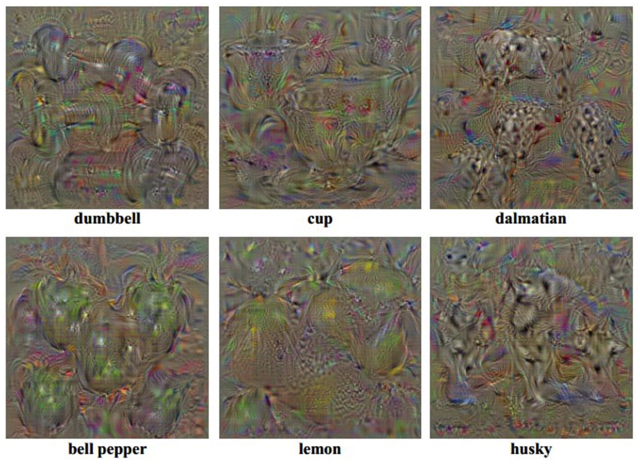</kbd></p>

<p align="center"><kbd>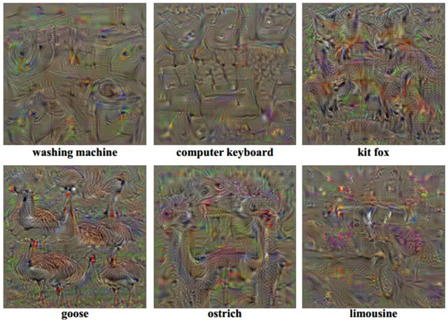</kbd></p>

<p align="center"><kbd></kbd></p>

<p align="center"><kbd></kbd></p>

<p align="center"><kbd>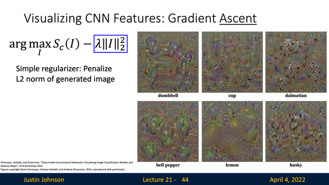</kbd></p>

> [!NOTE]
> Thế thì đại khái ở đây nhắc đến việc có một bài giảng về Adversarial
> images mà mình chưa xem. Nhưng đã từng biết qua qua MLOps
> Specialization về Adversarial attack nên có thể hình dung. Thì ở đây nói
> rằng quá trình này chính là cách sẽ tạo nên adversarial image `-` là một bức
> hình mà chẳng thấy có hình thù gì (theo sự hiểu của con người) nhưng lại
> có thể được dự đoán bởi model là một cái gì đó với sự chắc chắn rất cao `-`
> có nghĩa là xác suất tính ra của một class nào đó rất cao.
>
> Thì có thể hiểu được, nếu ta dẫn dắt quá trình thay đổi image tensor value,
> thay vì bằng derivate của neuron value, ta dùng gradient của một class
> score của một class nào đó ví dụ con mèo chẳng hạn, thì nó sẽ thay đổi
> image pixel value theo hướng class score cứ tăng dần đến cực đại `-` đồng
> nghĩa xác suất dự đoán bức hình tào lao này là một con mèo cũng cực đại
>
> `===`
>
> Vậy, ở đây Justin cho rằng, ta muốn tạo ra một bức hình trông tự nhiên
> một tí, chứ không phải tạo ra adversarial image. Do đó, như đã nói, ta sẽ 
> add thêm vào quá trình một cái tương tự như regularization loss, mà điển
> hình có thể dùng L2 norm của generated image. Thì nhờ cái này mà các giá
> trị của image pixel được khống chế để bức hình "chế" này trông tự nhiên.
>
> `===`
>
> Kết quả là ta được những cái hình như này.
>
> *Lưu ý đương nhiên quá trình này là dùng một trained deep model, ta chỉ
> fixed (freeze) các params, và quá trình backprop chỉ dùng để tính gradient
> và thay đổi image tensor thôi

<br>

<a id="node-1684"></a>

<p align="center"><kbd>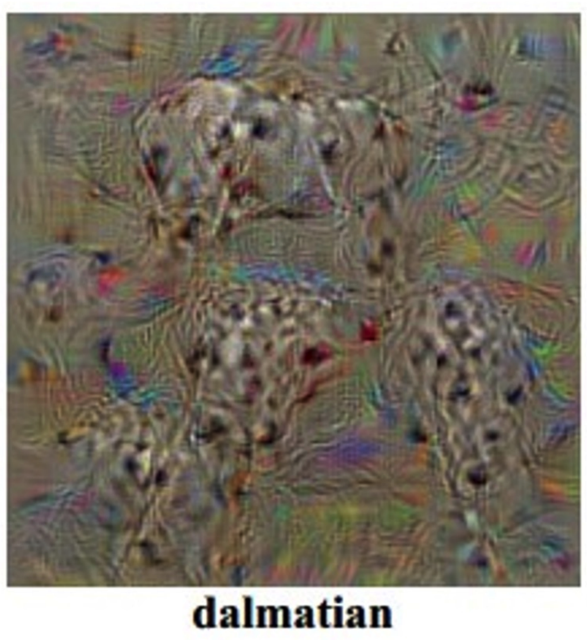</kbd></p>

> [!NOTE]
> Khi nhìn vào bức hình này, nó là của "chó đốm", thì có thể thấy
> nó có những pattern như các đốm đen, đương nhiên là ở mức 
> trừu tượng hơn. Từ đó có thể giúp ta hình dung được nó tìm
> Những cái gì để dự đoán ra là chó đốm

<br>

<a id="node-1685"></a>

<p align="center"><kbd>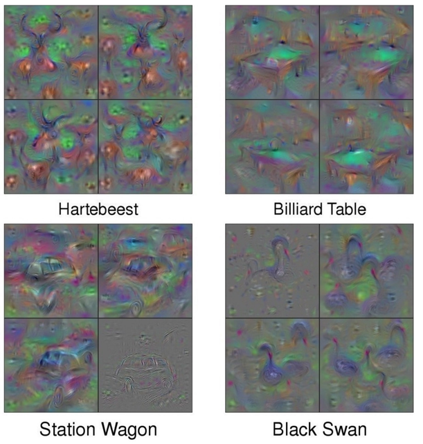</kbd></p>

<p align="center"><kbd>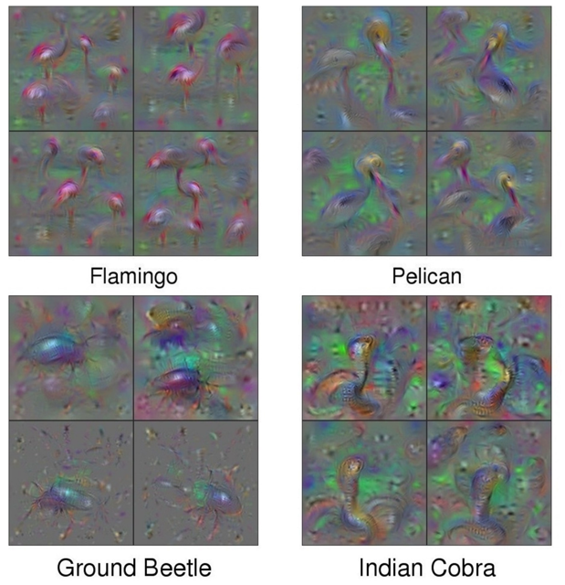</kbd></p>

<p align="center"><kbd></kbd></p>

<p align="center"><kbd></kbd></p>

<p align="center"><kbd>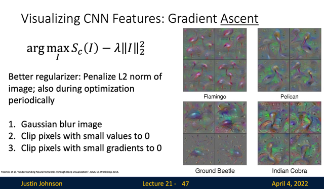</kbd></p>

> [!NOTE]
> đại khái là người ta thử nhiều loại regularizer để có được những image cùng
> hiệu quả nhưng trông tự nhiên hơn

<br>

<a id="node-1686"></a>

<p align="center"><kbd>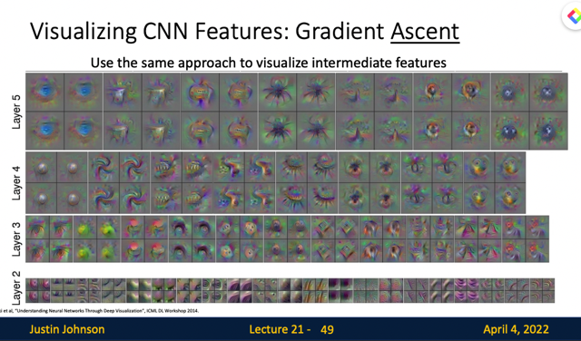</kbd></p>

> [!NOTE]
> đại ý là cùng một ý tưởng như vậy, ta có thể dùng cách làm này để tạo
> các synthetic image sao cho tối đa hóa giá trị một neuron của một layer
> trung gian nào đó. Từ đó cho phép ta nhìn thấy neuron đó đã được huấn
> luyện để tìm kiếm những pattern `/` mô tuýp nào. 
>
> Ví dụ như ở đây, với layer 5, cụm 4 ô thứ 4 của một filter nào đó có thể
> thấy nó sẽ activate mạnh nhất khi nó thấy một hình ảnh trên ảnh gốc có
> dạng như một con nhện. (chú ý nhớ là đây là hình ảnh mà nếu xuất hiện
> trên ảnh gốc thì sẽ khiến maximize giá trị của layer output)
>
> Nhận xét thêm là có thể thấy ở các layer "nông hơn", các pattern trông
> đơn giản hơn

<br>

<a id="node-1687"></a>

<p align="center"><kbd>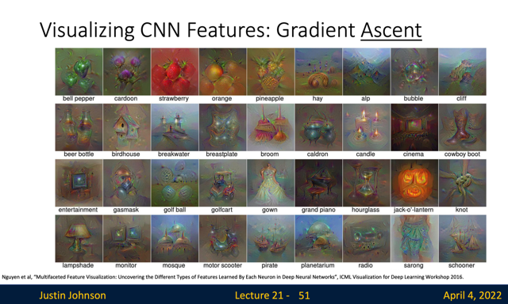</kbd></p>

<p align="center"><kbd></kbd></p>

<p align="center"><kbd>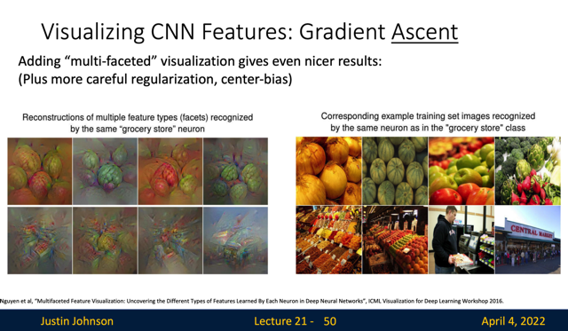</kbd></p>

> [!NOTE]
> như đã nói, người ta apply nhiều cách thức
> regularization để các synthetic image trong natural hơn

<br>

<a id="node-1688"></a>

<p align="center"><kbd>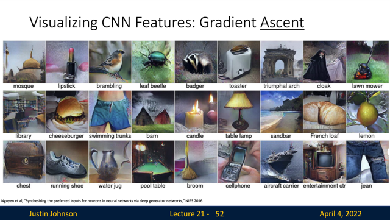</kbd></p>

> [!NOTE]
> và từ đó dẫn tới GAN `-` Generative Adversarial Network có thể tạo các image
> được classify (bởi Classification model) ở một class với confidence rất cao, và
> trông cũng rất giống thật dù nó là ảnh  generate bởi ai
>
> Thế thì ý là Justin quan ngại rằng, trong những bức ảnh này, bao nhiêu phần là
> liên quan đến một neural network nhìn cái gì, và  bao nhiêu phần là do một
> smart regularizer.
>
> Ý là: Như đã biết, mục đích ban đầu của việc này là tìm hiểu xem deep learning
> model đã được huấn luyện để tìm kiếm, phát hiện điều gì, hay nói cách khác,
> một mô hình AI nhìn vào cái gì trên bức ảnh để đưa ra dự đoán.
>
> Thì trong cách làm trên, bức ảnh được tạo ra bằng cách dùng gradient ascent
> để tối đa class score. Thì nếu chỉ có vậy, thì ta thuần túy có được Những hình
> ảnh mà một layer của model tìm kiếp khi thực hiện việc dự đoán thể loại cho
> một bức ảnh.  Tuy nhiên để những hình ảnh này trông tự nhiên người ta lại
> thêm regularizer, can thiệp vào. Từ đó kiểu như bóp méo những hình ảnh thật
> sự mô hình tìm kiếm theo hướng để nó trông tự nhiên với mắt người hơn.
>
> Thành ra Justin cho rằng để cho mục đích hiểu mô hình thì nên dùng simple
> Regularizer.

<br>

<a id="node-1689"></a>

<p align="center"><kbd>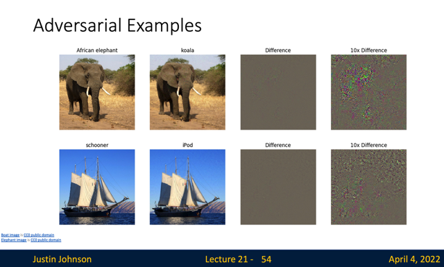</kbd></p>

<p align="center"><kbd></kbd></p>

<p align="center"><kbd>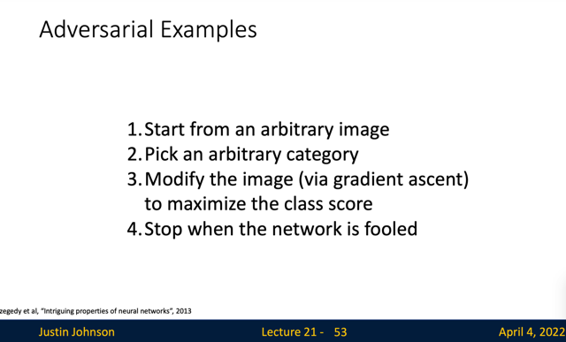</kbd></p>

> [!NOTE]
> Thế thì nếu không có regularizer thì sao, ta sẽ có Adversarial Example: Có
> một bài giảng về cái này sẽ xem sau,  nhưng đại ý là, ta sẽ bắt đầu bằng
> việc chọn một bức hình nào đó, chứa hình ảnh của một class gì đó ví dụ
> con voi.
>
> Sau đó, mới dùng gradient ascent như trên để thay đổi cái hình sao cho
> maximize class score (của một class khác, ví dụ con koala) Đương nhiên
> ban đầu nếu pass qua model thì nó sẽ predict class score của con voi là lớn
> nhất, nhưng quá trình gradient ascent ta thay đổi giá trị các pixel theo
> hướng tăng class score của koala. Thì đến lúc nào đó nó sẽ vượt qua class
> score của con voi thì khi đó ta dừng lại. Và kết quả là so với mắt thường thì
> hình ảnh vẫn là con voi, nhưng với "mắt" của model thì nó thấy con koala.

<br>

<a id="node-1690"></a>

<p align="center"><kbd>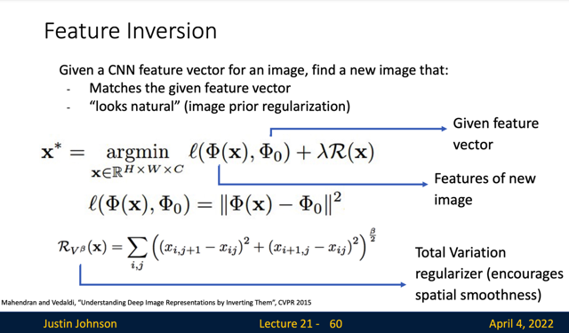</kbd></p>

> [!NOTE]
> Đại khái là vầy nè: ta sẽ pass một cái hình, ví dụ con voi ở trên qua model,
> và lấy ra feature map (tensor output của một layer nào đó), kí hiệu nó là Φ0.
> Và set up bài toán như sau: tạo một bức ảnh mới x (synthetic image, như
> nãy giờ ta đang làm) sao cho khi pass nó qua model và cũng lấy ra feature
> map (như làm với ảnh con voi ở trên) kí hiệu nó là Φ(x), thì sẽ khoảng cách
> giữa nó với Φ0 là nhỏ nhất, nói cách khác là tìm x làm sao để Φ(x) giống với
> Φ0 nhất, với một ràng buộc cộng thêm do regularizer quy định giúp bức hình
> trông tự nhiên
>
> Khoảng cách giữa hai tensor có thể dùng L2 hay L1 distance.
>
> Còn regularizer như trong slide sẽ có mục đích là giúp "encourage spatial
> smoothness)

<br>

<a id="node-1691"></a>

<p align="center"><kbd>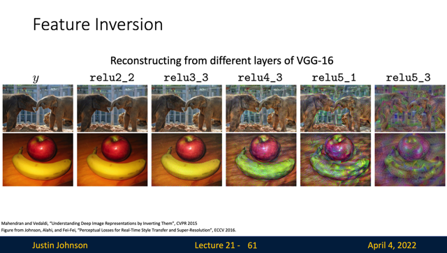</kbd></p>

> [!NOTE]
> vậy đại ý là, nếu ta extract feature dùng những layer đầu để làm, thì kết
> qủa của synthetic image trông vẫn giống với ảnh gốc.
>
> Nhưng nếu **càng xài các layer sâu hơn thì nó càng mất đi chi tiết**, **chỉ
> còn giữ các cấu trúc tổng thể**. Điều này có ý nghĩa là qua nhièu layer,
> kiểu mô hình càng extract ra (hay hiểu theo nghĩa nào đó là nó chỉ quan
> tâm tới) các "điểm chính `/` nét chính" thôi. Vì sao ta biết vậy? Là vì
> synthetic chỉ cần có những " điểm chính" này, ví dụ bố cục tổng quát như
> vậy là đủ để tạo ra feature mà minimize khác biệt với feature của ảnh gốc.
>
> Ví dụ như trong hình, có thể thấy ở các layer sâu, chỉ còn giữ những nét
> chính của con voi, hay quả cam quả chuối (mình vẫn nhìn thấy "nét" của 
> con voi, nhưng chi tiết thì không giống nữa)

<br>

<a id="node-1692"></a>

<p align="center"><kbd>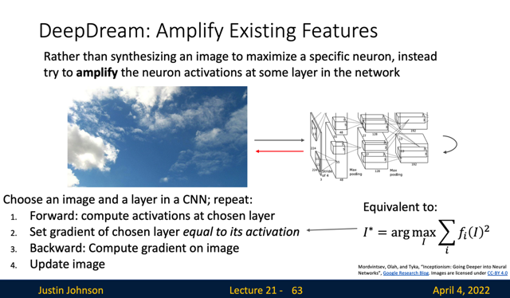</kbd></p>

> [!NOTE]
> Ta hiểu giả sử activation của một neuron (kết qủa của phép tính dot
> product của filter (cũng là một tensor thôi) với một vùng receptive field của
> input (là một tensor cùng shape với filter) càng lớn thì đồng nghĩa là trong
> bức ảnh tại vị trí tương ứng có những pattern phù hợp với những gì mà
> filter được train để tìm kiếm.
>
> Thế thì, nói về vai trò của gradient, giả sử gradient của activation của một
> neuron nói ở trên đối với giá trị của một pixel A trên ảnh gốc mà lớn hơn so
> với gradient của neuron value đối với pixel B. Thì có nghĩa là nếu thay đổi
> pixel A thì nó sẽ tác động nhiều hơn tới neuron value hơn là khi thay đổi
> pixel B.
>
> Do đó ở DeepDream người ta mới gán giá trị của activation của neuron
> cho gradient. Hệ quả là, nếu tại vùng A, khi neuron activate mạnh hơn
> vùng B thì gradient của neuron với vùng A sẽ cho lớn hơn vùng B. Từ đó
> thông qua Gradient Ascent (dùng gradient để thay đổi giá trị của pixel) thì
> vùng A sẽ được thay đổi với mức gradient lớn, đương nhiên là theo  hướng
> khiến neuron activate càng mạnh, còn vùng B giả sử ít hoặc không làm
> neuron activate thì gradient nhỏ hoặc bằng 0, cơ bản là không thay đổi gì
> vùng B.
>
> Kết quả là, vùng A nếu đang có một pattern gì đó khiến neuron activate
> mạnh thì nó sẽ được khuếch đại khiến neuron activate mạnh hơn nữa.

<br>

<a id="node-1693"></a>

<p align="center"><kbd>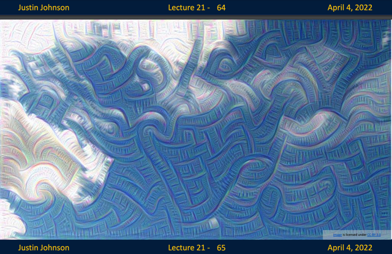</kbd></p>

> [!NOTE]
> kết qủa cho thấy, nếu ta dùng neuron ở các layer 'nông', thì quá trình trên tạo ra
> Hình ảnh như này, cho thấy rõ ràng rằng các neuron ở các layer này "quan tâm"
> tìm kiếm các low level patten như đường thẳng, đường cong,.....

<br>

<a id="node-1694"></a>

<p align="center"><kbd>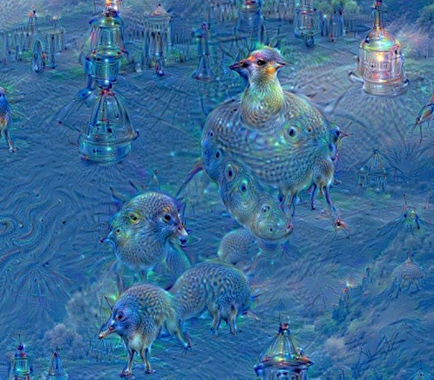</kbd></p>

<p align="center"><kbd>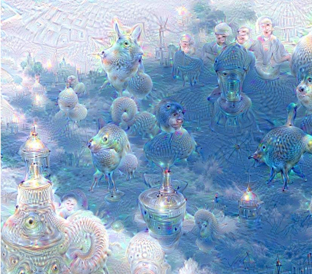</kbd></p>

<p align="center"><kbd></kbd></p>

<p align="center"><kbd></kbd></p>

<p align="center"><kbd>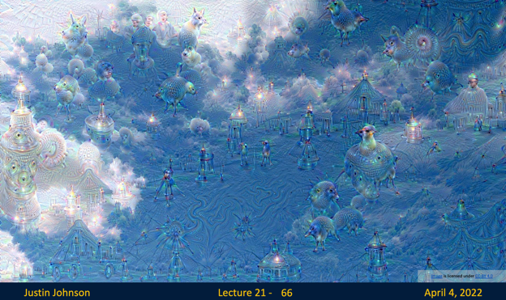</kbd></p>

> [!NOTE]
> còn nếu dùng các layer sâu hơn, mà ta cũng đã biết rằng nó sẽ tìm kiếm
> những pattern trừu tượng hơn (abstract). Kết quả cho thấy đúng là vậy Khi
> bức ảnh xuất hiện nhiều pattern phức tạp.
>
> Ở một nghĩa nào đó, nó giống với việc mình (human) nhìn đám mây và
> tưởng tượng một hình thù nào đó, và về cơ bản, human cũng đang tìm kiếm
> những hình thù (pattern) mà mình đã biết sau đó tưởng tượng thêm (gần
> giống với bước khuếch đại)
>
> Nên nhớ là các filter đã được train rồi, thì khi filter ở layer sâu này thấy một 
> Input area có vẻ là một pattern nào đó mà nó đang tìm (ví dụ hình dạng tổng
> thể của con chuột chẳng hạn) thì nó sẽ khuếch đại lên `-` tạo nên hình thù
> như trong ở đây

<br>

<a id="node-1695"></a>

<p align="center"><kbd>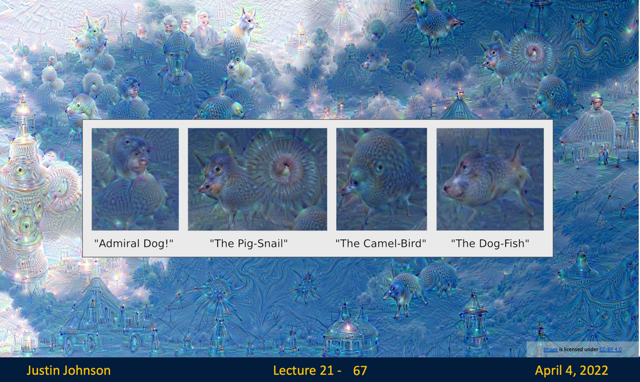</kbd></p>

<br>

<a id="node-1696"></a>

<p align="center"><kbd>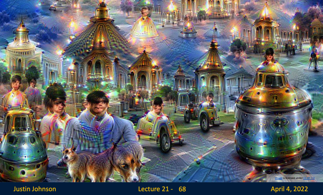</kbd></p>

> [!NOTE]
> Và khi train deepdream trong khoảng thời gian lâu thì kết quả nó như
> này. Cái này Justin nói rằng đang dùng một cnn model được train với
> ImageNet `-` vốn các image của là các object

<br>

<a id="node-1697"></a>

<p align="center"><kbd>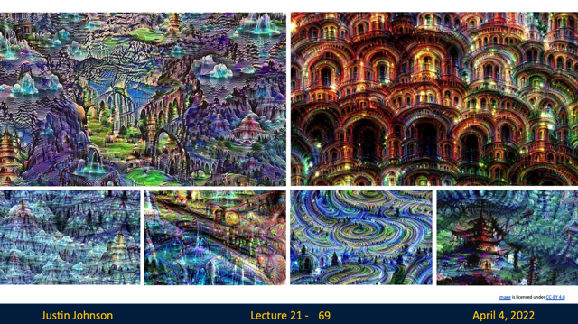</kbd></p>

> [!NOTE]
> Thì với một cnn model train trên bộ data khác, kết quả của DeepDream sẽ
> khác.
>
> Điều này phản ánh với những dataset khác nhau, cnn model được train để
> tìm kiếm các dạng pattern khác nhau.
>
> Và khi paper này ra mắt thì cộng đồng AI rất thích thú khi chứng kiến neural
> Network có thể được dùng cho những nhiệm vụ khác như generate art

<br>

<a id="node-1698"></a>

<p align="center"><kbd>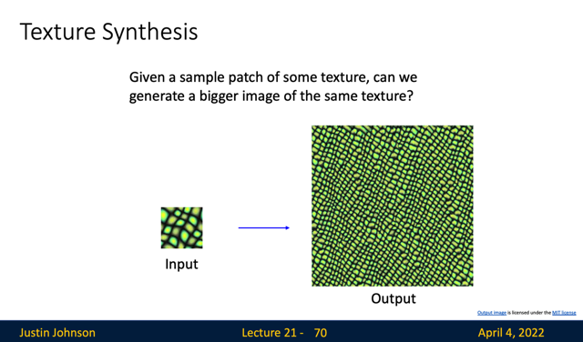</kbd></p>

> [!NOTE]
> thế thì đại khái là nói qua đến việc dùng neural network cho những nhiệm
> vụ khác thì có một cái gọi là texture synthetic, là một vấn đề classic Trong
> đó ta muốn tạo một cái hình lớn hơn từ một sample nhỏ sao cho cái hình
> lớn vẫn giữ những đặc trưng của hình mẫu

<br>

<a id="node-1699"></a>

<p align="center"><kbd>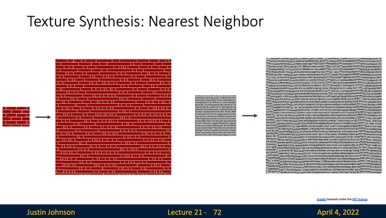</kbd></p>

<p align="center"><kbd></kbd></p>

<p align="center"><kbd>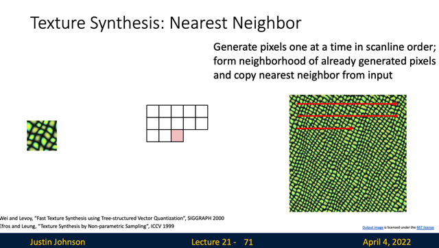</kbd></p>

> [!NOTE]
> Vậy thì từ những năm 99, 2000 người ta dùng Nearest Neighbor để
> làm việc này, tỏ ra khá tốt miễn là pattern tương đối đơn giản.

<br>

<a id="node-1700"></a>

<p align="center"><kbd>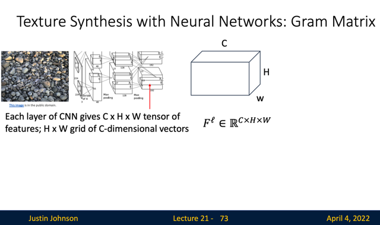</kbd></p>

> [!NOTE]
> Cách tiếp cận với Neural Networks dùng Gram Matrix, đầu tiên, ta sẽ
> dùng output của một layer trong cnn, như đã biết là một 3D tensor (C,H,
> W) với C là số channel `=` số filter của conv layer đó.
>
> Vậy thì có thể xem nó như C miếng HxW ghép lại hoặc cũng có thể  xem
> nó như một **grid HxW các `C-dimensional` vector.**

<br>

<a id="node-1701"></a>

<p align="center"><kbd>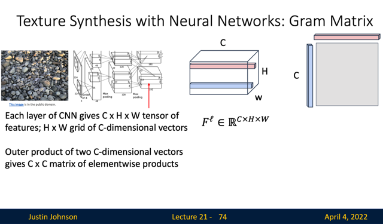</kbd></p>

> [!NOTE]
> Thế thì ta mới**lấy ra hai trong số HxW vector đó**, ứng với hai vị trí nào
> đó trong grid HxW, và **tính outer product** (không phải dot product, mà
> xem như phép tính giữa hai matrix Cx1 và 1xC) để **ra một matrix CxC**
>
> Trong matrix CxC này, mỗi vị trí là tích của một phần tử của vector
> thứ nhất `-` xanh với một phần tử của vector thứ hai `-` đỏ
>
> Mình: Nhận xét, điều này khiến ta liên hệ đến covariance matrix.
>
> Và ta sẽ làm tương tự với mọi cặp vector xanh đỏ có thể có

<br>

<a id="node-1702"></a>

<p align="center"><kbd>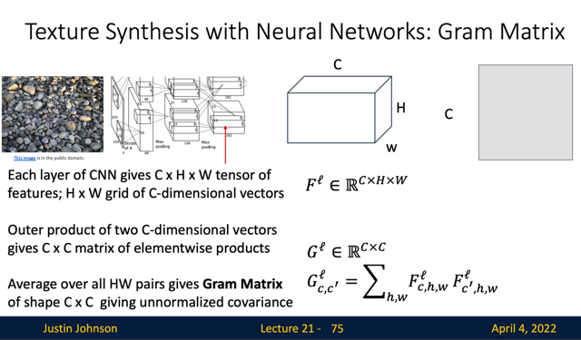</kbd></p>

> [!NOTE]
> Với mỗi cặp cho một matrix CxC, thì có HW^2 cặp vector xanh đỏ, nên ta sẽ có C^2 outer  product matrix shape CxC, có
> shape (HW^2,C,C)
>
> Ta sẽ **trung bình lại hết các matrix đó** ở dimension thứ nhất để được cái gọi là  **Gram  matrix CxC**
>
> Và giá trị của gram matrix được cho là "**unnormalized covariance**"
>
> **Vì sao ý nghĩa của Gram matrix sẽ đại diện cho texture style**:
>
> Ví dụ ta có input 4x4 như hình, thể hiện một dạng "hoa văn" texture. Và giả sử có 3 filter đã học được các activate khi
> receptive field có dạng mà nó quan tâm, filter 1 tìm kiếm hình tròn xanh lá, filter 2 tìm hình vuông đỏ, filter 3 tìm tam giác
> màu cam. Thế thì cứ tạm cho rằng feature map cũng có size 4x4, như bằng cách dùng same padding, và giả sử bỏ qua
> giá trị lớn bé ra sao, mà chỉnh coi relu neuron  có activate `(=1)` hay không `(=0).` Thì khi đó, feature map thứ 1 sẽ toàn số
> 1 vì bất cứ receptive field nào filter "quét qua" cũng có hình tròn xanh lá cả. Tương tự như vậy với "feature map hình
> vuông đỏ".  Thế còn feature map thứ 3 thì chỉ có 6 vị trí activate, vì tam giác cam chỉ có xuất hiện vài lần trong hình.
>
> Vậy thử tính Gram matrix, sẽ là 3x3 matrix `(C=3).` Lấy feature vector tại mỗi tọa độ spatial dimension  outer product với
> một feature vector tại một tọa độ khác, để ra 3x3 matrix. Suy nghĩ một chút sẽ hiểu là có 16x16 matrix như vậy (16 cách
> chọn `/` tọa độ vector thứ nhất và 16 cách chọn vector thứ hai) Vậy tưởng tượng chạy vòng lặp để tính, mỗi lần như vậy,
> ta cộng dồn vào, để sau 16^2 lần ta chia cho  tổng số lần để ra Gram matrix.
>
> Rồi, với mỗi matrix gọi là A, khoan hãy xét đường chéo, mà xét ngoài đường chéo, và vì tính đối xứng nên ta chỉ quan
> tâm A12 và A13. A12 sẽ bằng 1 khi nào và bằng 0 khi nào? Dễ hiểu nó sẽ bằng 1 khi trong  cặp feature vector đang
> được chọn để tính, tương ứng với hai vị trí trên hình gốc, thì tại vị trí thứ nhất có hình tròn xanh lá, và vị trí thứ hai có
> hình vuông đỏ, để rồi phần tử đầu tiên của vector thứ nhất là 1 và phần tử thứ 2 của vector kia là 1 luôn. Thì hai thằng `=`
> 1 nhân với nhau mới ra 1. Ngược lại nếu có một thằng inactivate thì giá trị sẽ `=` 0.
>
> ```text
> Ví dụ trong hình minh họa hai feature vector v1 tại tọa độ spatial (h=1,w=1) = [1 1 1] và vector thứ hai v2  tại tọa độ (h=3,
> ```
> ```text
> w=2) = [1 1 0] nên v1 outer product v2 ra matrix A có A12 = 1*1 = 1. Trái lại, A13 = 0 do  v1[3]*v2[3] = 1*0 = 0 nguyên
> ```
> nhân vì tại (1,1) có chấm tròn xanh mà (3,2) không có tam giác cam.
>
> Vậy khi cộng dồn vào thì Gram matrix sẽ tăng thêm 1 ở G[1,2] và G[2,1] còn G[1,3] (và G[3,1]) thì giữ  nguyên. Theo quy
> tắc này có thể thấy qua các outer product matrix A thì A12 luôn bằng 1, bởi lẽ chỗ nào cũng có chấm tròn xanh và hình
> vuông đỏ. Nên tổng cộng với 16*16 matrix A thì khi loop xong giá trị của  phần tử G[1,2] là `16*16=256.` Còn vì A[1,3] sẽ
> chỉ có giá trị bằng 1 vài lần, cụ thể là `16x6=96` lần (v1 nào cũng được `=` 16, v2 thì chỉ có 6 lần ứng với các tọa độ spatial
> mà chỗ đó có tam giác cam), nên sau khi  loop G[1,3] `=` 96.
>
> Từ đây rút ra **nhận định quan trọng** sau: Con số 256 của G[1,2] lớn hơn 96 của G[1,3] đã thể hiện rằng, **SỐ CẶP
> TRÒN `XANH-VUÔNG` ĐỎ XUẤT HIỆN NHIỀU HƠN SỐ CẶP TRÒN `XANH-GIÁC` CAM, KHÔNG QUAN TÂM VỊ TRÍ CỤ
> THỂ Ở ĐÂU**. Phải vậy không, rõ ràng là có tới 16*16 cặp tròn xanh vuông đỏ, nhưng chỉ có 16*6 cặp tròn `xanh-giác`
> cam thôi.
>
> Vậy ta thử suy nghĩ câu hỏi quan trọng sau, **NẾU MÌNH MUỐN VẼ LẠI MỘT HÌNH MỚI SAO CHO NÓ CŨNG CÓ
> GRAM MATRIX NHƯ VẬY THÌ TA SẼ VẼ THẾ NÀO?**
>
> Dễ thấy là nếu muốn G[1,2] `=` 256 ta cũng sẽ **cho hình tròn xanh nằm rải rác khắp nơi trước, đảm bảo mỗi ô trong 16 ô
> đều có ít nhất một cái**, và**cũng phải có một cái vuông đỏ**, thiếu một ô nào thì cũng sẽ cho ra kết quả nhỏ hơn 256
> (đang ví dụ là relu neuron chỉ activate hoặc không, tại đó có tròn xanh hay không, không care nhiều hay ít, và cũng dễ
> thấy nó **cũng không care vị trí chính xác của tròn xanh trong ô**)
>
> Tương tự muốn G[1,3] `=` 96 thì **cũng phải có vài ô là có tam giác cam**, **nhưng** **không được quá nhiều ô**, vì khi đó
> giá trị sẽ cao hôn hoặc thấp hơn 96.**** Thế thì với**ràng buộc**như vậy, thử vẽ sẽ thấy ta sẽ ra cái hình khá là giống
> về mặt phong cách với hình trên, nhưng xét vị trí chính xác của tròn xanh, vuông đỏ, tam giác cam thì hai hình không
> giống nhau. Và ngẫm nghĩ sẽ thấy ràng buộc (bởi Gram matrix, hướng dẫn ta vẽ ra cái hình mới) sẽ có ý nghĩa:
>
> Muốn giống Gram matrix thì hình tròn xanh và vuông đỏ phải rải rác khắp 16 ô, vì nếu dồn một đống ví dụ 16 cái tròn
> xanh vào một ô sẽ không tính, vì đang nói rằng filter thứ nhất đang tìm hình tròn xanh, nếu dồn vào 1 ô thì nó không còn
> là cái hình tròn xanh nữa, mà nó thành cái khác rồi, như số 8 xanh hay biểu tượng olympic xanh. Thành thử ra, cho dù
> ta bỏ đi giả định rằng relu chỉ activate hoặc không, tức là tính tới giá trị của activation có thể mạnh yếu, thì cũng vẫn phải
> cho hình tròn xanh rải rác ra, chứ không thể tập trung nhiều chỗ này ít chỗ kia được.
>
> Thành ra Gram matrix nó đã ràng buộc **CẤU TRÚC TỔNG THỂ CỦA CÁC FEATURE, QUY ĐỊNH FEATURE NÀO
> PHẢI RẢI NHIỀU VÀ CÁI NÀO RẢI ÍT HƠN, VÀ CÁI NÀO THÌ KHÔNG NÊN XUẤT HIỆN**.
>
> Còn lại, thì NÓ **KHÔNG QUAN TÂM VỊ TRÍ CỤ THỂ CỤC BỘ**, miễn trong mỗi ô có một hình tròn xanh là được,  còn
> nằm ở đâu thì nằm,
>
> Từ đó nếu model muốn generate ra cái hình có Gram matrix sát với Gram matrix mẫu, nó sẽ phải cho ra cái hình có quy
> luật tổng thể giống như vậy, nhưng soi chi tiết thì không khớp.
>
> `====`
>
> Do đó Justin mới nói **Gram matrix** **chỉ còn chứa thông tin** là **feature nào** (pattern nào) **trong C feature** (mỗi
> một filter tìm kiếm một loại pattern, để tạo thành một "loại feature") là **hay xuất hiện cùng nhau** `(co-occur),` loại nào thì
> không. Và nó**không còn spatial info nữa**. Thế thì đó **chính là kiểu như định nghĩa của texture**: là một loại quy luật `/`
> pattern quy định rằng, không quan tâm vị trí chính xác trên bức hình (chính là không quan tâm vị trí spatial), chỉ biết rằng
> khi nào có pattern hình tròn thì cũng có màu xanh, chỗ nào, không có hình tròn thì có màu đỏ. Tất nhiên với C lớn hơn,
> quy luật này phức tạp hơn, nhưng ý nói, Gram matrix **chính là chứa đựng quy luật, thông tin của một dạng texture.**
>
> Thành ra, ta có thể dùng cnn để tính ra `/` extract ra quy luật của một texture image bằng cách generate ra Gram matrix.
> Và dùng nó làm target trong việc tạo ra một image mới sao cho nó cũng có các quy luật như vậy. Và vì Gram matrix,
> như đã nói, không chứa thông tin liên quan đến spatial (hiểu nôm na là nó không quy định cụ thể chỗ nào phải như thế
> nào, mà chỉ quy định chung là ờ nếu chỗ đó như vầy thì cũng phải như sao đó, không thì thôi) nên khi mình dùng Gram
> matrix để dẫn dắt quá trình tạo ảnh mới thì kết quả cũng chỉ chứa quy luật, còn vị trí chính xác thì có thể khác
> `-` đồng nghĩa với việc ta đã có được **kết quả mong muốn của bài toán texture synthetic `-` đó là tạo ra hình ảnh chứa cái
> dạng "giống giống vậy" nhưng không cần y chang.**
>
> *Còn nói về việc dùng Gram matrix để dẫn dắt quá trình tạo synthetic image như thế nào thì dễ hiểu là cũng như ta dùng
> output của intermediate layer, hay class score để cùng với gradient ascent, tạo ra hình ảnh khiến maximize class score
> thôi.

> [!NOTE]
> Ở đây là cách tính Gram matrix một cách hiệu quả với
> vectorization.

<br>

<a id="node-1703"></a>

<p align="center"><kbd>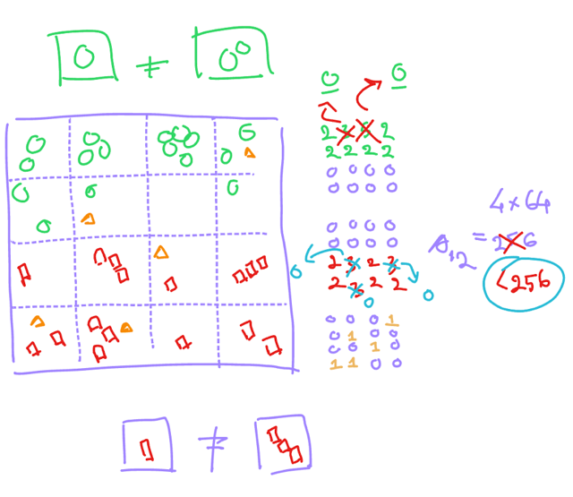</kbd></p>

<p align="center"><kbd>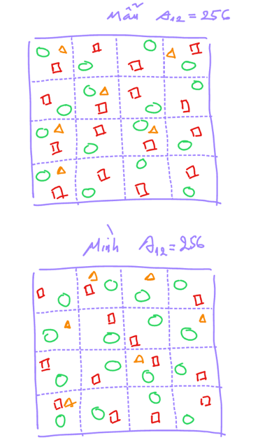</kbd></p>

<p align="center"><kbd></kbd></p>

<p align="center"><kbd></kbd></p>

<p align="center"><kbd>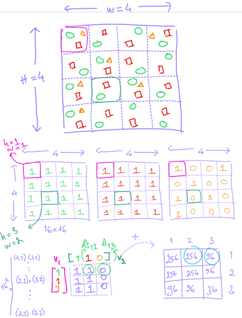</kbd></p>

> [!NOTE]
> Ta có thể nghĩ rằng có một kẻ hở để tạo ra cái hình mà hình tròn xanh
> không cần rải rác, chỉ cần đủ số 16 cái là được?
>
> Nhưng thật sự làm như vậy không được, vì dồn nhiều hình tròn xanh
> vào một ô sẽ không thỏa, vì khi đó filter không còn nhận ra và nó sẽ
> không active. Để cuối cùng A12 sẽ < 256
>
> Nên thật sự muốn có Gram matrix như vậy thì phải raỉ đều tròn xanh
> và vuông đỏ ra các ô.
>
> Từ đó cho thấy Gram matrix thật sự không chỉ yêu cầu ràng buộc
> feature xuất hiện nhiều hay ít mà còn ràng buộc bộ cục tổng thể của 
> nó nữa. Nhưng về cục bộ thì không care, nhìn tròn xanh có thể nằm ở
> bất kì đâu trong ô.

> [!NOTE]
> Dựa theo quy định của Gram matrix, muốn ra cái có Gram
> matrix như vậy thì mình sẽ phải vẽ ra cái hình như này

<br>

<a id="node-1704"></a>

<p align="center"><kbd>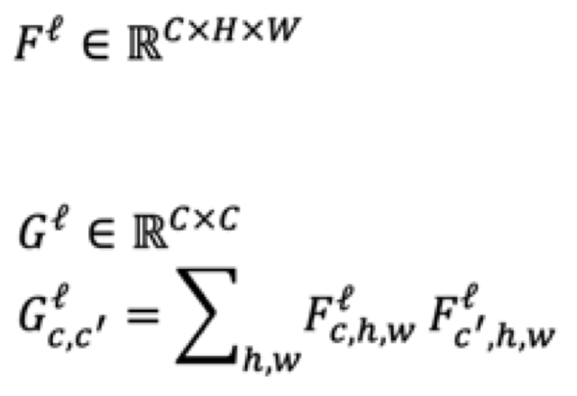</kbd></p>

> [!NOTE]
> Giải thích cái công thức này là sao:
>
> F^l ý là output tensor CxHxW của layer thứ l của cnn.
>
> G^l là Gram matrix "của" layer l đó, ý nói, được tính từ F^l và ngụ ý rằng, tí nữa ta sẽ tính
> Gram matrix cho nhiều layer của cnn chứ không phải chỉ có một.
>
> Vậy G^l c,c' là kí hiệu chỉ giá trị tại `i=c,` `j=c'` của matrix G^l.
>
> `=====`
>
> Thế thì như ta vừa nói, để tạo Gram matrix, ta sẽ **tạo một loạt các outer product matrix CxC**
> giữa hai **C-dimension feature vector** tại **hai vị trí trong  grid HxW**. Và sau đó **average chúng lại.**
>
> Vậy vị trí ví dụ G[2,5] `i=2,` `j=5` của Gram matrix chính là **trung bình các giá trị tại vị trí 2,5 của mọi
> outer product matrix** `-` mà **mỗi matrix ứng với một cặp vị trí (h, w) trên spatial space**.
>
> Thì đây là nghĩ theo cách nghĩ thứ nhất là hình dung **tính ra mọi miếng outer product CxC rồi
> lấy tổng mọi vị trí 2,5 của các miếng đó**. Và ta sẽ ghi là:
>
> G^l 2,5 `=` Sum "mọi outer product matrix" {op matrix [2,5]}
>
> (op matrix `=` outer product matrix tính bởi hai vector tại hai vị trí (w1,h1), (w2,h2))
>
> Mà kết quả của "mọi op matrix" {op matrix [2,5]}
>
> `====`
>
> Nhưng có thể nghĩ theo cách khác để từ đó hiểu công thức người ta ghi ở đây: 
>
> Bản chất**vị trí 2,5 của một "miếng",** chỉ là**tích của phần tử thứ 2 và phần tử thứ 5 của
> hai cái vector tạo ra miếng đó**. Và vị trí 2,5 trên Gram matrix là tổng (hay trung bình) của mọi
> cái như vậy.
>
> Thành ra cách nghĩ thứ hai là cứ **chọn một "cây" (ý nói một feature `C-d` vector ra) ra**, **lấy phần
> tử số 2**, và **một cây khác lấy phần tử số 5, nhân hai cái lại**, rồi lại chọn 2 cây khác,... là vậy cho
> đến hết, rồi **cộng lại hết**.
>
> Thì cách nghĩ thứ hai sẽ giúp dễ hiểu công thức này **G^l 2,5 `=` Sum h,w F^l [2,h,w] * F^l [5,h,w]**
>
> Khái quát lên, tương tự thì kết quả tại vị trí `i=c,` `j=c'` của Gram matrix chính là
>
> G^l c,c' `=` Sum h,w F^l c,h,w * F^l c',h,w
>
> `====`
>
> Vectorize:

<br>

<a id="node-1705"></a>

<p align="center"><kbd>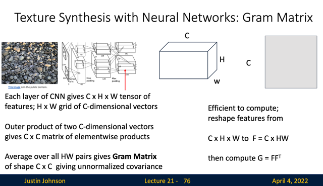</kbd></p>

<p align="center"><kbd></kbd></p>

<p align="center"><kbd>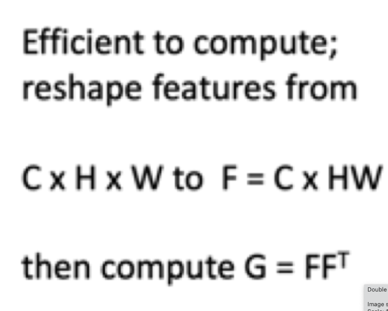</kbd></p>

> [!NOTE]
> Rồi, tới công thức này, thì phải **hết sức chú ý rằng**, cách tính Gram matrix theo
> FF. T như này **tạm gọi là một phiên bản đơn giản hơn của Gram matrix mô tả
> theo cách tính trong bài giảng**,**giúp việc tính Gram matrix trở nên khả thi và
> hiệu quả tính toán.** Lí do là vì theo cách làm FF.T này, sẽ **TƯƠNG ĐƯƠNG
> VỚI VIỆC**: khi chọn các `C-dimensional` vector để tính outer product (để rồi
> average `element-wise` lại cho ra Gram matrix) thì ta sẽ **CHỈ LẤY CÙNG MỘT VỊ
> TRÍ SPATIAL**.
>
> Tức là, thay vì có 16*16 `=` 256 outer matrix (16 vị trí của vector v1, và 16 vị trí
> của v2) thì bây giờ sẽ chỉ có 16 cái thôi (16 vị trí của `v1==v2).` Hay nói cách khác
> ta chỉ lấy một vector và outer product với chính nó.
>
> Mình đã chịu khó triển khai việc tính theo Justin nói trong bài và thấy rằng, cách
> tính F@F.T chỉ là chỉ là phiên bản đơn giản hơn của Gram matrix.
>
> Sau khi tham vấn GPT, nó cũng nói vậy, do đó ta hiểu G `=` FF.T là một phiên bản
> đơn giản hơn, để có thể tính toán hiệu quả, thay vì phải tính một phiên bản đầy
> đủ của Gram matrix sẽ không vectorize được.
>
> Phiên bản đơn giản hơn của Gram matrix, có thể hiểu là nó sẽ thể hiện tương
> quan giữa các feature khác nhau TẠI CÙNG MỘT VỊ TRÍ SPATIAL, BỎ QUA
> TƯƠNG QUAN CỦA HAI FEATURE TẠI KHÁC VỊ TRÍ.

<br>

<a id="node-1706"></a>

<p align="center"><kbd>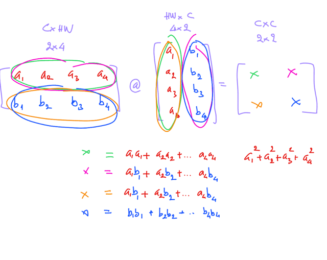</kbd></p>

> [!NOTE]
> Đây, cho F (2x4) tính thử với F@F.t thì G[1,1] và G[1,2] như này

<br>

<a id="node-1707"></a>

<p align="center"><kbd>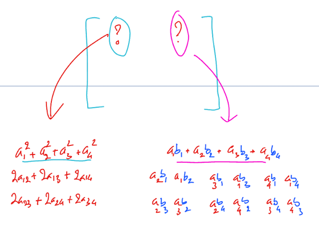</kbd></p>

<p align="center"><kbd></kbd></p>

<p align="center"><kbd>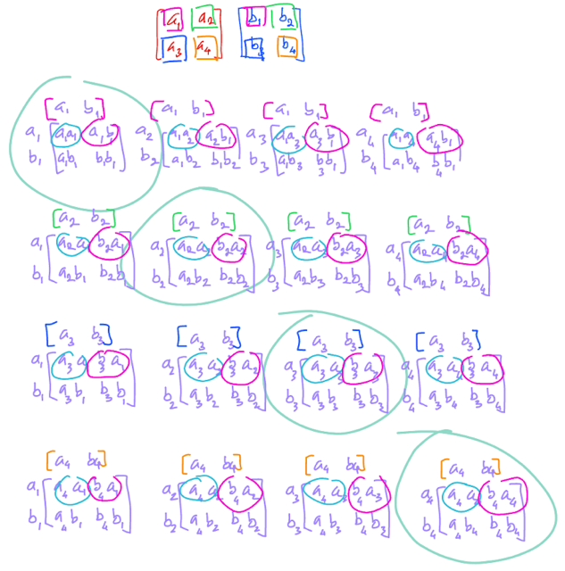</kbd></p>

> [!NOTE]
> Tính với phương pháp mô tả của Justin (outer product của mọi cặp vector vị trí) thì ta sẽ
> có HW^2 `=` 4^2 `=` 16 matrix 2x2. Cộng `element-wise` để ra Gram matrix thì thấy với cách
> làm này thì G[1,1] , G[1,2] không khớp với kết quả của FF.t
>
> ```text
> Cụ thể thì G[1,1] và G[1,2] phiên bản vectorized (=a1a1+a2a2 +. .a4a4, a1b1+a2b2+...
> ```
> a4b4) chỉ bằng phần đầu của đầu của G[1,1] G[1,2] phiên bản đầy đủ. Tức là chỉ tương
> đương với việc tính như Justin nhưng chỉ lấy các cặp vector v1, v2 CÙNG VỊ TRÍ

<br>

<a id="node-1708"></a>

<p align="center"><kbd>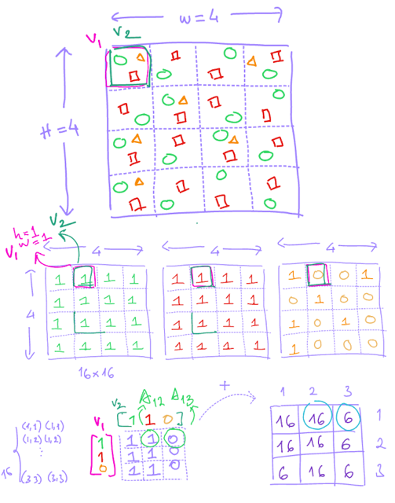</kbd></p>

> [!NOTE]
> Theo cách tính đơn giản hơn, chỉ xét các cặp v1, v2 tại cùng vị trí
> thì matrix Gram vẫn thể hiện rằng A12 cao hơn A13, thể hiện tại 16
> vị trí khác nhau trên spatial hai feature 1 và 2 luôn cùng xuất hiện, `=`
> 16 lần, trong khi đó `A13=6` thể hiện chỉ có 6 lần feature 1, 3 cùng
> xuất hiện. Nói chung việc đơn giản hóa Gram để tính hiệu quả hơn
> không ảnh hưởng nhiều tới ý nghĩa nắm bắt quy luật texture

<br>

<a id="node-1709"></a>

<p align="center"><kbd>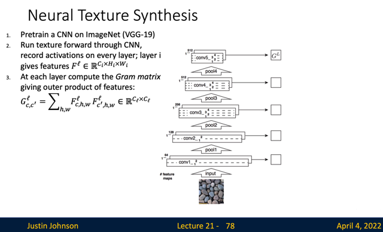</kbd></p>

> [!NOTE]
> rồi, đại khái quá trình tạo synthetic image sẽ bắt đầu bằng việc "trích
> xuất" Gram matrix của "ảnh mẫu" `-` chứa đựng thông tin về quy luật,
> mô tuýp texture mẫu mà ta mong muốn
>
> Thì việc này đơn giản là pass nó qua cnn, với mỗi layer output ta tính
> một Gram matrix.

<br>

<a id="node-1710"></a>

<p align="center"><kbd>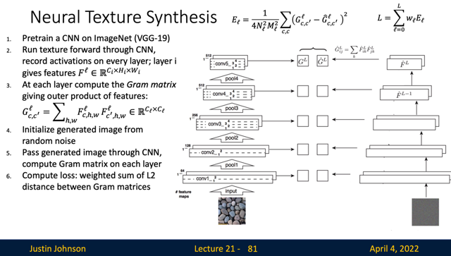</kbd></p>

> [!NOTE]
> Bước thứ hai là khởi tạo một cái hình ban đầu chưa có gì `-` giá trị chỉ
> là random noise. Sau đó ta cũng pass nó qua cnn và cũng tính gram
> matrix tại mỗi layer.
>
> Từ đó, dùng một công thức distance metric nào đó, ví dụ như L2
> distance để tính ra loss `-` nôm na là sai khác giữa hai Gram matrix tương
> ứng của ảnh mẫu và ảnh "chế". Weighted sum các loss đó lại để có một
> total loss.
>
> Bước weighted có thể hiểu là ta có thể can thiệp (một dạng `hyper-params)` 
> để điều chỉnh kết quả vì ta đã biết các layer khác nhau thì thông tin nó
> lưu giữ cũng khác nhau, ví dụ như layer nông thì còn giữ `/` quan tâm đến
> chi tiết, layer sâu hơn thì abstract hơn.

<br>

<a id="node-1711"></a>

<p align="center"><kbd>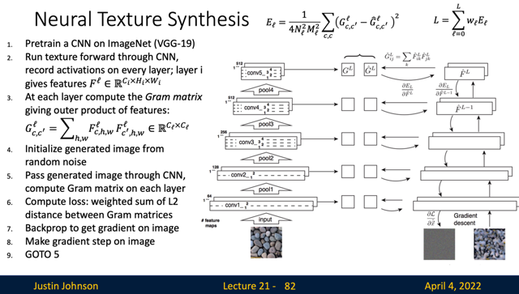</kbd></p>

> [!NOTE]
> Từ đó backprop để dùng gradient descent, thay đổi giá trị của
> image chế giúp loss giảm dần
>
> Và lặp lại quá trình này đến khi loss hội tụ cực tiểu thì ta đã có bức hình
> chế chứa những pattern giống ảnh mẫu (vì sao, vì khi đó Gram matrix
> của nó đã giống với Gram matrix của ảnh mẫu)

<br>

<a id="node-1712"></a>

<p align="center"><kbd>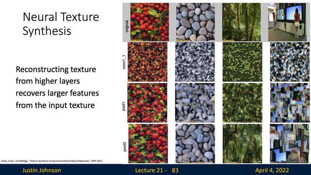</kbd></p>

> [!NOTE]
> đại khái là kết quả cho thấy rằng nếu dùng Gram matrix của những
> layer ở đầu, thì Gram matrix tại đó (tính toán bởi output) sẽ capture
> cái kiểu pattern `/` style mang tính chi tiết. Trong khi Gram matrix tại
> các layer sâu hơn nắm bắt các phong cách tổng thể hơn

<br>

<a id="node-1713"></a>

<p align="center"><kbd>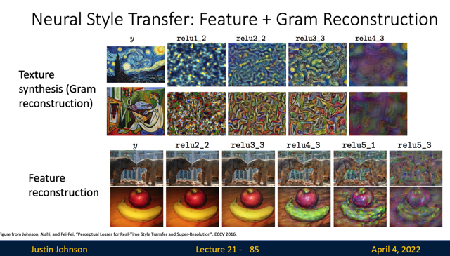</kbd></p>

> [!NOTE]
> Thế thì người ta với kết hợp với feature reconstruction: Nhớ lại hồi nãy,
> ta dùng technique feature inversion: Dùng gradient ascent để generate
> một image sao cho minimize distance giữa output của một layer nào đó
> bởi synthetic image và output của cùng layer đó bởi một real image. Kết
> quả là synthetic image chứa đựng những nét chính (feature)

<br>

<a id="node-1714"></a>

<p align="center"><kbd>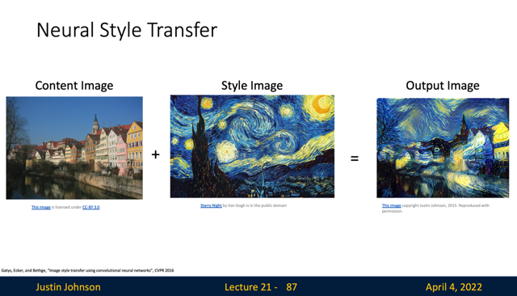</kbd></p>

<p align="center"><kbd></kbd></p>

<p align="center"><kbd>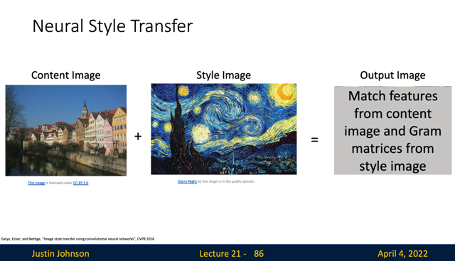</kbd></p>

> [!NOTE]
> Kết hợp ý tưởng của cả hai, ta sẽ generate synthetic image theo hướng
> "copy" feature từ một bức ảnh và style từ một bức ảnh khác.
> Để rồi kết qủa là ta có bức ảnh có nội dung này nhưng phong cách của
> bức ảnh kia

<br>

<a id="node-1715"></a>

<p align="center"><kbd>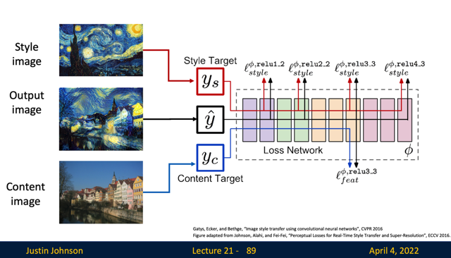</kbd></p>

<p align="center"><kbd></kbd></p>

<p align="center"><kbd>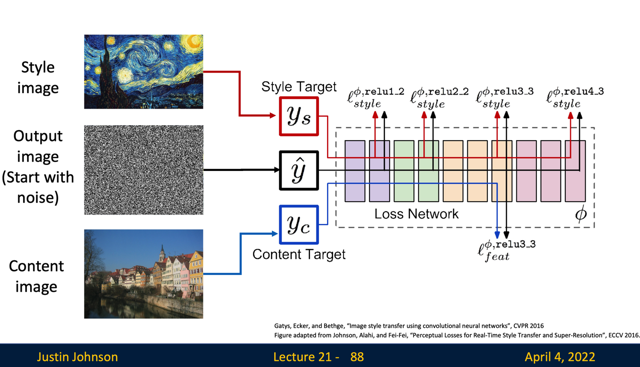</kbd></p>

> [!NOTE]
> Như thường lệ ta sẽ bắt đầu với một random noise image, và hai bức ảnh "
> mẫu". Pass cả ba image qua cnn, để làm hai "việc"
>
> 1) Copy style: Dùng output của nhiều layer trung gian để tính ra các Gram
> matrix (ở cả hình mẫu và hình "chế"), và xây dựng loss function là trung bình
> L2 distance của hai Gram matrix tương ứng (tức là tại cùng một layer)  của
> hai bức hình.
>
> 2) Copy feature: Dùng output của một layer trung gian nào đó được chỉ định
> để lấy feature (từ image mẫu thứ 2 và hình chế), xây dựng loss dựa trên
> distance giữa hai feature tensor.
>
> Cuối cùng là `back-propagation` và dùng gradient ascent để thay đổi image
> "chế" giúp loss giảm dần, và khi loss (cả hai loss đều thấp) là lúc ta có được
> bức ảnh mang nội dung và phong cách của cả hai ảnh mẫu.

<br>

<a id="node-1716"></a>

<p align="center"><kbd>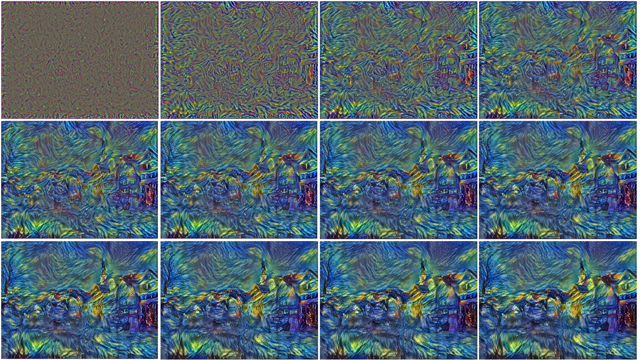</kbd></p>

<br>

<a id="node-1717"></a>

<p align="center"><kbd>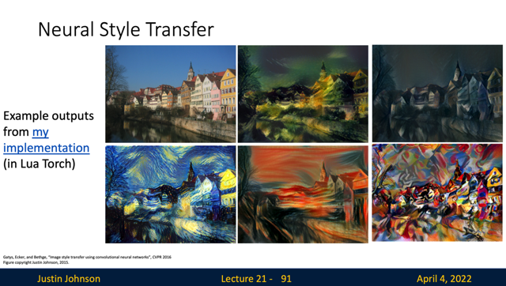</kbd></p>

<br>

<a id="node-1718"></a>

<p align="center"><kbd>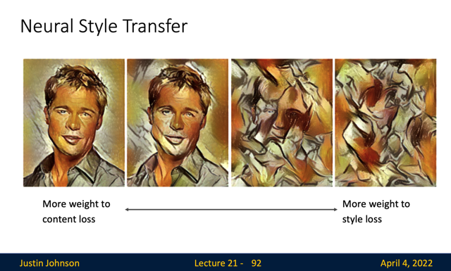</kbd></p>

> [!NOTE]
> đại ý là ta có thể thay đổi mức độ ảnh hưởng của style và feature 
> bằng cách thay đổi trọng số của content loss và style loss.
>
> Khi tăng trọng số của content loss, bức ảnh chú trọng đến (việc copy)
> content hơn, nên ta có thể thấy ta nhận ra hình ảnh Brad Pit.
>
> Khi tăng trọng số của style loss, bức ảnh chú trọng đến style hơn, để
> ra bức ảnh rặt phong cách của Van Gogh

<br>

<a id="node-1719"></a>

<p align="center"><kbd>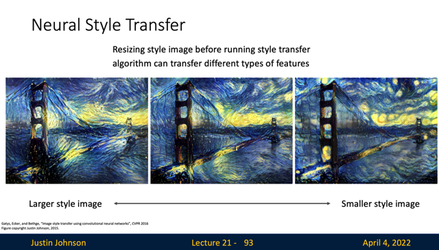</kbd></p>

> [!NOTE]
> đại ý là ta có thể scale "style" image lớn hay nhỏ trước khi dùng để style
> transfer. Thì, nếu scale image lớn lên, ta sẽ capture phong cách xài 
> nét cọ lớn của Van Gogh. Ngược lại khi scale style image nhỏ lại, ta sẽ
> capture những nét phong cách rộng hơn như ngôi sao trong bức hình
> "Scary night".

<br>

<a id="node-1720"></a>

<p align="center"><kbd>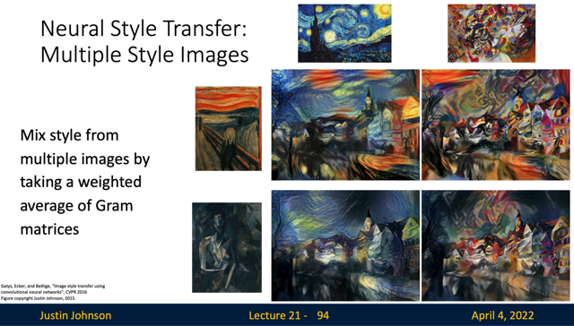</kbd></p>

> [!NOTE]
> Ta có thể pha trộn các phong cách bằng cách weighted
> average các Gram matrixes

<br>

<a id="node-1721"></a>

<p align="center"><kbd>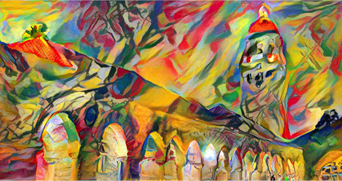</kbd></p>

<p align="center"><kbd></kbd></p>

<p align="center"><kbd>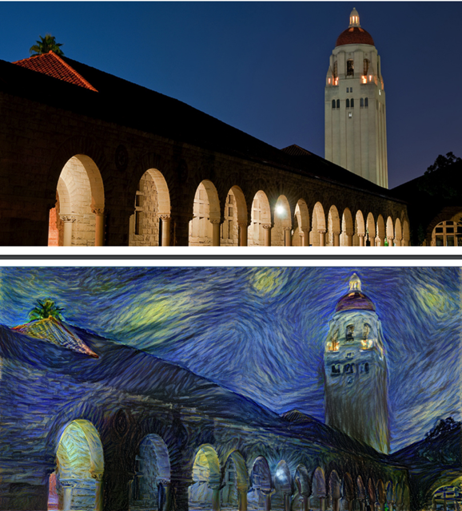</kbd></p>

<br>

<a id="node-1722"></a>

<p align="center"><kbd>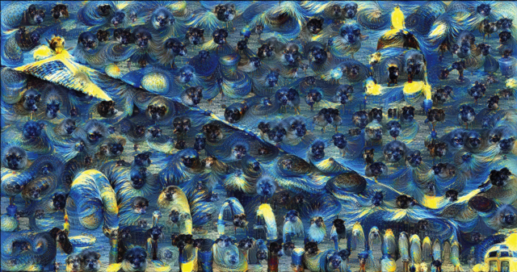</kbd></p>

> [!NOTE]
> và ta có thể làm cả Style Transfer `+` Deep Dream cùng lúc để
> có kết quả như này

<br>

<a id="node-1723"></a>

<p align="center"><kbd>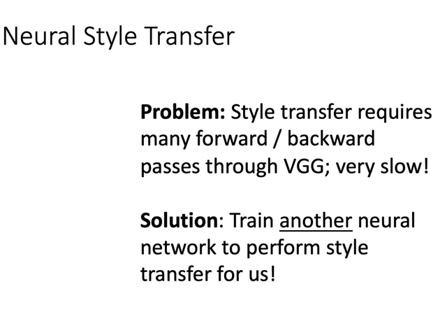</kbd></p>

> [!NOTE]
> vấn đề với cách làm này là nó chạy rất lâu khi quá trình bao gồm rất nhiều lần
> forward `+` backward: forward để tính loss (Gram matrix's distance giữa ảnh "chế"
> và ảnh style mẫu, và feature distance giữa ảnh chế và ảnh feature mẫu)
>
> để backward tính gradient và dùng gradient thay đổi ảnh "chế".
>
> Do đó để có thể đưa ra thực tế sử dụng thì không khả thi, cần có cách làm khác,
> Giải pháp đó là train một neural net cho việc đó

<br>

<a id="node-1724"></a>

<p align="center"><kbd>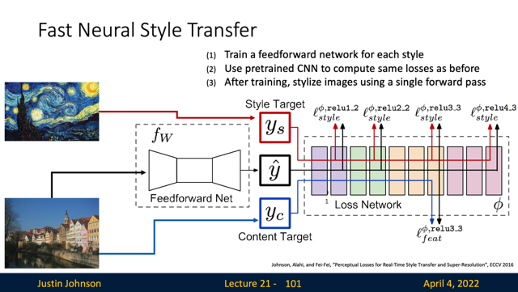</kbd></p>

> [!NOTE]
> Đại khái là trong cách làm này, người ta sẽ train một Feedforward Net với
> nhiệm vụ: Nhận vào một bức hình (mà ta muốn giữ nguyên feature, và áp
> dụng phong cách của Starry Night vào), nó sẽ cho **output là một bức
> hình giữ nguyên feature của input** nhưng **có style giống với style của
> Starry Night**
>
> Vậy có thể hình dung ta sẽ train cái FF model này như sau:
>
> Input vào một image (chính là yc ở dưới), **forward nó qua FF
> model để có y^**, là **predicted image `/` generated image của FF model**.
>
> y^ sẽ cùng với **ảnh gốc yc** (cũng là cái hình input vào FF để có y^) và**ảnh
> style mẫu ys**, cả ba **tham gia vào tính loss** như trước:
>
> **Pass cả 3 qua cnn (như VGG)**để tính**feature" loss"** từ distance giữa
> feature bởi yc và y^, và**style loss** từ distance giữa Gram matrix của ys và
> y^
>
> Để rồi khi supervised training giảm hai loại loss thì cuối cùng ta sẽ có FF
> model, đạt được hai mục tiêu: **khi nhận một image** nào đó vào (hình
> gốc), qua FF model, output của nó là một image mà **nếu pass qua cnn
> thì nó sẽ có feature giống với feature của ảnh gốc**, đồng nghĩa là
> **generated image có feature giống với feature gốc**. Đồng thời, **nếu pass nó
> và Starry night qua cnn và tính Gram matrix thì chúng sẽ giống nhau**, đồng
> nghĩa **generated image có style giống với Starry night**
>
> Như vậy là khi muốn apply phong cách Starry Night cho một bức hình thì
> chỉ việc dùng FF model này. Rồi nếu muốn một phong cách khác thì train
> một model khác.

<br>

<a id="node-1725"></a>

<p align="center"><kbd>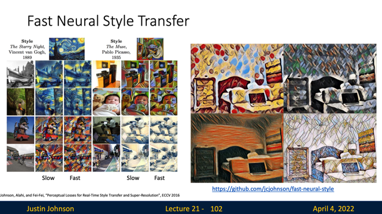</kbd></p>

> [!NOTE]
> Và với cách làm này, Style Transfer đã có thể đủ nhanh để ứng
> dụng trong production

<br>

<a id="node-1726"></a>

<p align="center"><kbd>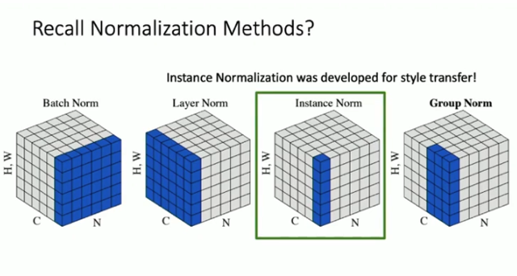</kbd></p>

<br>

<a id="node-1727"></a>

<p align="center"><kbd>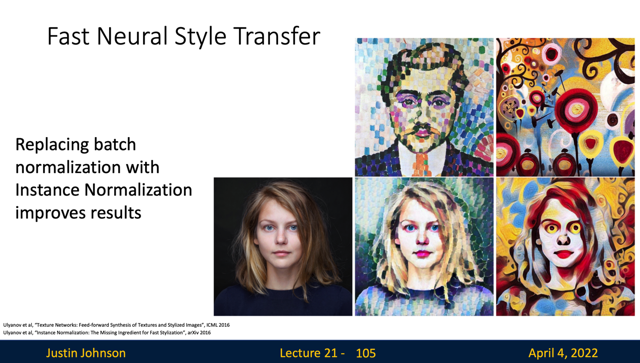</kbd></p>

> [!NOTE]
> Dùng Instance Normalization
> giúp cải thiện kết quả

<br>

<a id="node-1728"></a>

<p align="center"><kbd>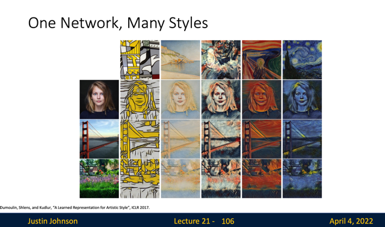</kbd></p>

> [!NOTE]
> Thế thì vấn đề là với cách này ta
> vẫn phải train một network cho
> một style mong muốn.

<br>

<a id="node-1729"></a>

<p align="center"><kbd>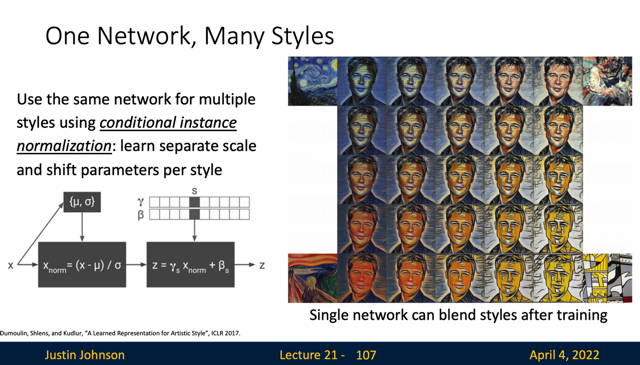</kbd></p>

> [!NOTE]
> Cách làm là train model sử dụng conditional instance normalization,
> để model chỉ cần dựa vào những shift & scale parameters khác nhau
> (đương nhiên model sẽ học ra những param này) để thay đổi style
> của bức hình. Có nghĩa là, model sẽ học cách map các bức ảnh với
> style mong muốn thông qua hai parameter này.
>
> Từ đó khi huấn luyện xong, khi cần một style nào đó ta chỉ kiểu như
> run model với một cặp gamma, beta. Ngoài ra nó còn cho phép mix
> style bằng cách weighted sum các bộ giá trị với nhau.

<br>

