# Lecture 13/16 - Generative Models

📊 **Progress:** `82` Notes | `97` Screenshots

---
<a id="node-1891"></a>

<p align="center"><kbd>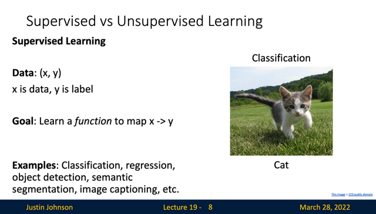</kbd></p>

> [!NOTE]
> đại khái là mấy slide đầu Justin nói sơ về sự khác nhau giữa supervised vs
> unsupervised learning. Vì trong lecture này là một dạng của unsupervised
> learning.
>
> Supervised learning thì như từ đầu đến giờ, những mô hình image
> classification, object detection, ....Được train với data có labeled.
>
> Lướt sơ các ứng dụng của unsupervised learning

<br>

<a id="node-1892"></a>

<p align="center"><kbd>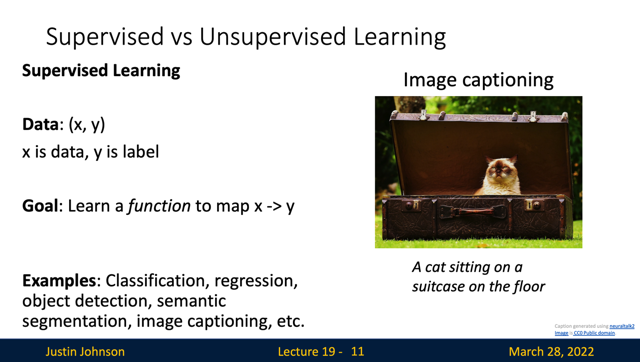</kbd></p>

> [!NOTE]
> Để dựa vào input và output (target `/` label), mô hình hóa một mapping
> function x `->` y

<br>

<a id="node-1893"></a>

<p align="center"><kbd>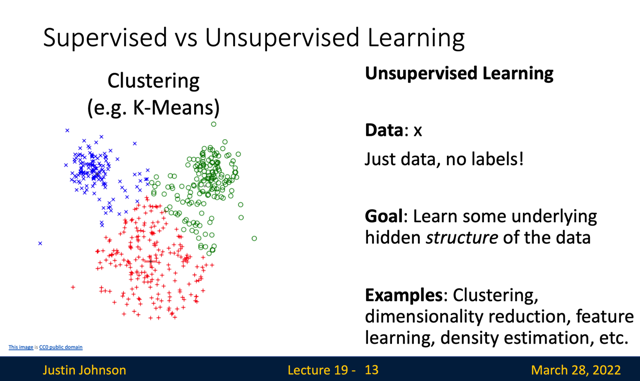</kbd></p>

> [!NOTE]
> Nhưng labeled data là nút thắt, khiến supervised learning rất tốn
> kém trong khi đó unlabeled data thì rất nhiều, unsupervised
> learning mong muốn khai thác được chúng. để bằng cách nào
> đó tự extract ra những hidden structure trong data
>
> Một ví dụ là `K-means` clustering, đã học trong MLSpecialization.

<br>

<a id="node-1894"></a>

<p align="center"><kbd>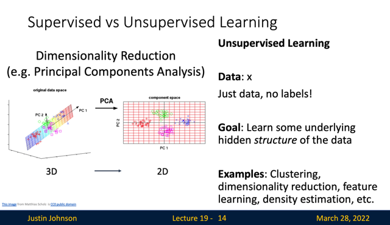</kbd></p>

> [!NOTE]
> Hay principal component analysis

<br>

<a id="node-1895"></a>

<p align="center"><kbd>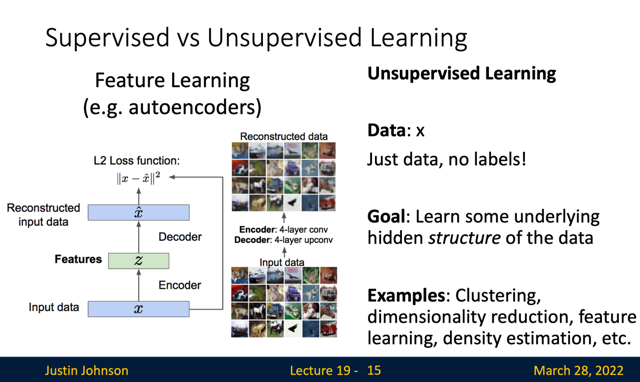</kbd></p>

> [!NOTE]
> và ở hai bài này, cũng thuộc phạm
> vi unsupervised learning.

<br>

<a id="node-1896"></a>

<p align="center"><kbd>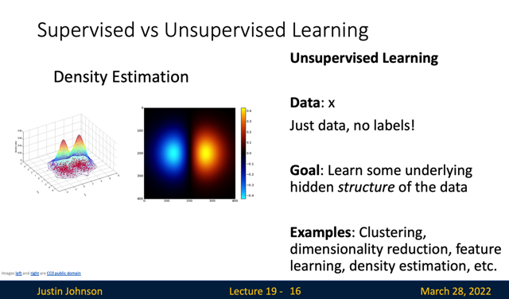</kbd></p>

<br>

<a id="node-1897"></a>

<p align="center"><kbd>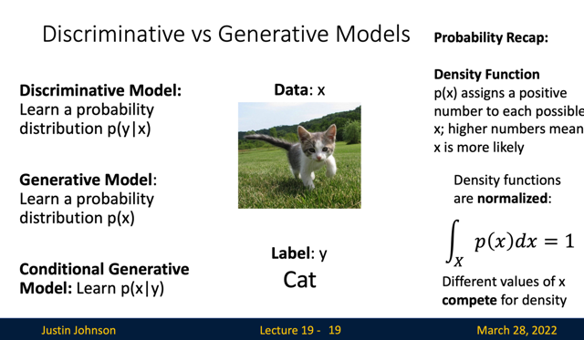</kbd></p>

> [!NOTE]
> Nói qua một dạng phân biệt khác là Discriminative models vs
> Generative models.

<br>

<a id="node-1898"></a>

<p align="center"><kbd>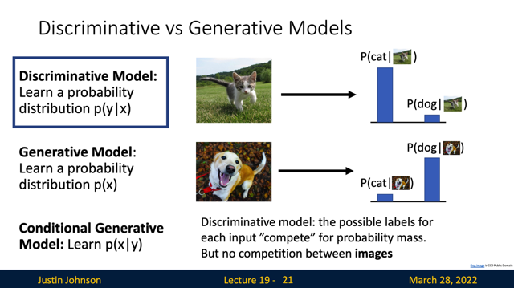</kbd></p>

<p align="center"><kbd></kbd></p>

<p align="center"><kbd>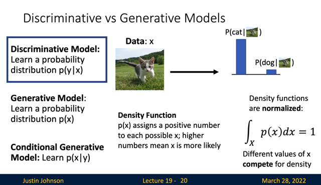</kbd></p>

> [!NOTE]
> Vậy discriminative model đại khái là sẽ tìm cách mô hình một phân
> phối xác suất điều kiện p(y|x). Ví dụ như phân phối xác suất qua
> các possible label của một input image. Thế thì vì là phân phối xác
> suất nên các label sẽ compete nhau để dành lấy probability mass,
> kiểu như nếu p(cat|image) tăng lên thì p(dog|image) phải giảm.

<br>

<a id="node-1899"></a>

<p align="center"><kbd>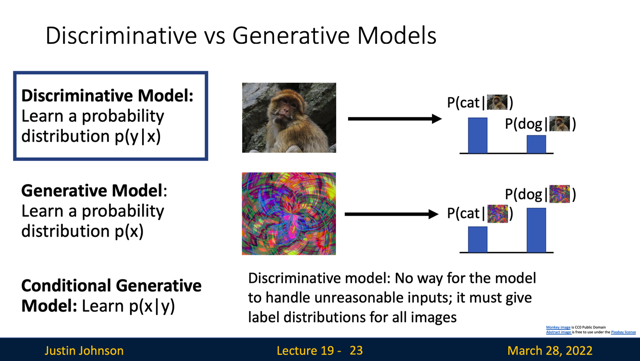</kbd></p>

> [!NOTE]
> Nhưng bản thân image (x) thì không compete nhau, nên kể cả đưa
> một cái hình tào lao, model vẫn phải đưa ra label distribution.

<br>

<a id="node-1900"></a>

<p align="center"><kbd>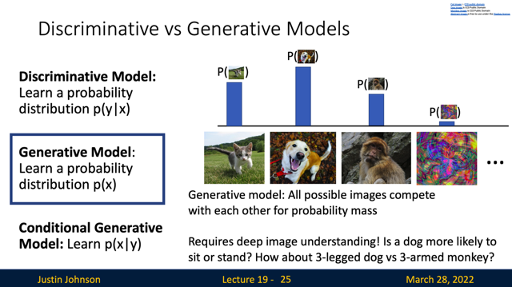</kbd></p>

> [!NOTE]
> với Generative model ví dụ như ở đây, thì nhiệm vụ là với mọi bức hình
> có thể tồn tại trên đời, phải tính được xác suất xảy ra `/` xuất hiện của nó.
> Hay nói cách khác, mô hình hóa một phân phối xác suất over mọi possible
> image.
>
> Thì đây là bài toán rất khó, vì để làm được vậy, phải hiểu rất sâu rộng về
> thế giới thì mới có thể đánh giá một image có dễ xuất hiện hay không.
> Mình có thể tưởng tượng một em bé vẽ một con chó trong tưởng tượng, 
> thì dựa vào kiến thức của mình, ta có thể đánh giá được, ước lượng được
> khả năng có con vật trong hình tồn tại hay không, chính là đòi hỏi sự hiểu
> sâu về thế giới.
>
> Justin cho biết ví dụ như khi làm cái slide này, để gán cho các cột cao, thấp
> cũng là một quá trình cần phải đánh giá xem cái hình con chó sẽ có khả
> năng cao hơn hình con khỉ, vì chó thì phổ biến với người hơi là khỉ,...đại 
> ý là lúc làm việc này, Justin chính là mô phỏng một generative model.

<br>

<a id="node-1901"></a>

<p align="center"><kbd>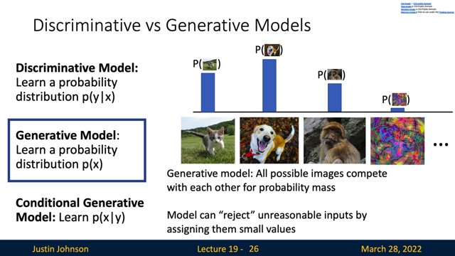</kbd></p>

> [!NOTE]
> đại khái là, vì bản chất như đã nói `-` mô hình một phân phối xác suất
> over MỌI POSSIBLE IMAGE nên, nó có thể xác định probability của
> một image bất kì, từ đó, nếu là cái hình tào lao thì đơn giản model sẽ
> tính xác suất của nó rất thấp

<br>

<a id="node-1902"></a>

<p align="center"><kbd>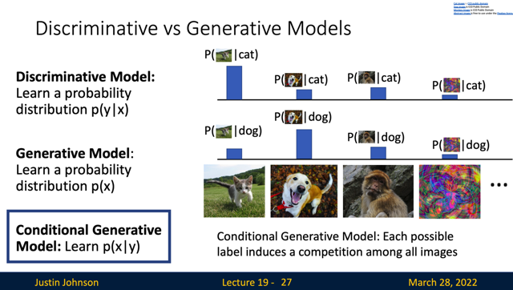</kbd></p>

> [!NOTE]
> Loại thứ ba là Conditional Generative Model `-` learn p(x|y). Đại khái là
> với mỗi label, ta sẽ learn một phân phối xác suất over mọi possible
> image thể hiện nếu là label y, thì xác suất xuất hiện một cái hình như
> vậy thuộc loại y là bao nhiêu.
>
> Ví dụ minh họa trong slide, với mỗi class trong hai class chó, mèo. Ta
> xây dựng mô hình xác suất để ví dụ như với một bức hình x. Ta sẽ tính
> P(x|cat) mang ý nghĩa là, nếu chọn `/` tạo một bức hình mèo, thì xác
> suất cái hình này giống cái hình đưa vô nhiều hay ít.
>
> Tương tự, phân phối xác suất P(x|dog) sẽ mang ý nghĩa, giả sử muốn
> chọn một cái hình chó, thì xác suất nó giống cái hình đưa vào là bao
> nhiêu
>
> Và đại khái là ta có thể xây dựng mộ image classification model bằng
> cách sử dụng Conditional Generative model này. Ví dụ cần xác định
> 10 category. Ta sẽ xây dựng 10 conditional generative model. Và để
> classify một image, đơn giản là ta sẽ tìm class k nào mà P(image|class
> k) lớn nhất. Đặc điểm quan trọng là với cách này, image classifier
> hoàn toàn có thể đưa ra kết quả là cái hình cần predict không thuộc
> loại nào hết bằng cách tính ra mọi giá trị p đều nhỏ. 
>
> Bởi vì không có rằng buộc P(x|class 1) `+` P(x|class 2) `+` ....P(X|class 10)
> `=` 1 như của Discriminative model

<br>

<a id="node-1903"></a>

<p align="center"><kbd>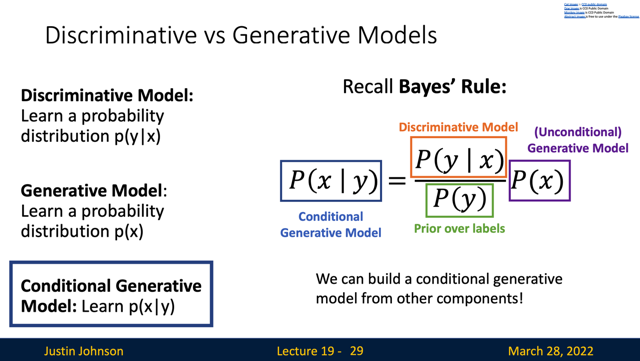</kbd></p>

> [!NOTE]
> Đại ý là Bayes Rule cho phép ta xây dựng Conditional Generative Model
> thông qua: (để dễ nói, ta sẽ ví dụ muốn xây dựng classifier 2 class {cam,
> dưa},  với predictor là khối lượng trái)
>
> Discriminative Model P(y|x). Ví dụ `P(Y='cam'|x)` sẽ là function cho biết với
> khối lượng x, xác suất đây là quả cam là bao nhiêu. Và `P(Y='dưa'|x)` cho
> biết với khối lượng x, xác suất đây là quả dưa là bao nhiêu.
>
> P(y) ví dụ `P(Y='cam'):` Xác suất của việc tự dưng khơi khơi bốc ra được
> một trái cam. Nó sẽ thể hiện phân phối các các class khi chưa có thông tin
> gì (prior distribution).  Và cái này có thể dùng tỉ lệ của các sample "cam"
> trong training set.
>
> P(x) ví dụ `P(X=2` kí lô) sẽ cho biết xác suất xuất hiện một trái (bất kì) nặng
> 2 kí lô.
>
> Nói chung ý là bằng cách xây dựng P(y|x), P(y) và P(x) ta có thể có P(x | y)

> [!NOTE]
> Dừng ở đây liên hệ chút xíu tới chương 4 của ISL phần Generative model như LDA, QDA, Naive Bayes
> để  củng cố một chút. Ta nhớ trong đó, ta cũng dùng Bayes Rule, nhưng mục đích là để muốn xây dựng
> discriminative model P(y|x).
>
> P(y|x) `=` P(y) * P(x|y) `/` P(x)
>
> và P(x) sẽ tiếp tục dùng sum rule để có P(x) `=` Sum y P(x|y)
>
> P(y|x) `=` P(y) * P(x|y) `/` Sum y P(x|y)
>
> Dùng ví dụ cam, dưa cho dễ hiểu: P(y) như vừa nói, sẽ thể hiện xác suất khơi khơi bốc được một qủa gì
> đó. Như `P(Y='cam')` là xác suất khơi khơi bốc được một quả cam. Thế thì P(cam), P(dưa) sẽ phản ánh
> mức độ phổ biến của hai loại quả này. Kiểu như, nếu ta có hai class cam và lê ki ma đi, thì dĩ nhiên lê ki
> ma ít phổ biến hơn cam. Nên P(lê ki ma) sẽ kiểu nhu thấp hơn P(cam).
>
> Rồi P(x|y) với ví dụ đang dùng predictor là 'khối lượng', thì ví dụ  `P(X=2` `kí|Y='cam')` sẽ cho biết xác suất
> tìm được một quả cam nặng 2 kg. Đương nhiên cam nặng 2 kí thì cũng ít nếu không muốn nói là hiếm
> thấy, nên kiểu như xác suất này sẽ thấp. Ngược lại `P(X=5` `kg|Y='dưa')` sẽ cao, vì dưa hấu 5 kí lô là bình
> thường (tức là có nhiều, dễ xảy ra).
>
> Cuối cùng là P(x). Ví dụ `P(X='5kg')` thể hiện xác suất bốc được một quả gì đó nặng 5 kg. Thế thì theo
> ```text
> sum rule, nó sẽ là tổng của P(X=5kg|Y=cam) và P(X=5kg|Y=dưa).
> ```
>
> `====`
>
> Tiếp tục, từ đó mới nhận định như sau: Vẫn lấy ví dụ cam dưa, thì một mô hình mà làm theo nguyên tắc
> `-` gán class nào có P(y|x) cao nhất thì nó sẽ có error rate thấp nhất, và đây chính là Bayes classifier. Ví
> dụ, với X `=` 2kg, nếu tính ra thấy P(dưa|2kg) lớn hơn P(cam|2kg) thì ta sẽ kết luận nó là dưa, thì sẽ nếu
> làm theo cách này sẽ có được classifier rất tốt.
>
> Thế thì nói chung, ta cần xây dựng P(y) và P(x|y). Thì P(y) trong ISL kí hiệu là pi, là prior distribution, có
> thể lấy bằng tỉ lệ class k trong training sample như nói trên.
>
> Thách thức là P(x|y). Thì từ đó tùy theo cách ta đặt giả định để mà estimate  cái này mà ta có các mô
> hình 'estimated' của Bayes classifier khác nhau là LDA, QDA, Naive Bayes (nói là estimated vì mình
> không thể biết được sự thật P(y|x) là như thế nào, chỉ có thể ước lượng dựa trên những giả định)
>
> Nếu ta giả định các sample class k đều tuân theo Gaussian distribution với mean khác nhau, nhưng
> variance giống nhau, thì ta sẽ có thể dùng hàm mật độ xác suất theo công thức Gaussian để tính p(x|y),
> từ đó ta có LDA. Ví dụ ta cho rằng, khối lượng (predictor X) của cả hai loại cam và dưa đều phân bổ
> theo normal distribution, quanh hai cái tâm khác nhau (ví dụ như cam thì trung bình khối lượng là 8 lạng,
> còn dưa thì trung bình là 3 kí), nhưng cả hai đều có variance như nhau (tức là mức độ biến thiên khối
> lượng nhỏ hơn hay lớn hơn khối lượng trung bình là như nhau)....
>
> Khi đó ta thấy rằng để assign class k mà khiến cho `P(Y=k|X=x)` lớn nhất thì (mà hình thành nên một cái
> gọi là discriminative function lớn nhất) thì với LDA, nó sẽ là hàm tuyến tính với 'khối lượng'. Rồi, gỉa sử
> xài thêm một predictor nữa X2 là kích thước trái, mô hình xác suất bây giờ của mỗi class ta sẽ giả định
> là `multi-variate` Gaussian, với tâm khác nhau nhưng covariance matrix giống nhau.
>
> ```text
> Hình dung trong đồ thị khối lượng / kích thước - xác suất P(X=[x1,x2] | Y='cam') sẽ là quả chuông tập
> ```
> ```text
> trung ở đâu đó (mean_cam = mean_cam_x1, mean_cam_x2) cho ta biết với loại quả là cam thì xác suất
> ```
> tìm thấy một trái to cỡ nào và nặng bao nhiêu là cao. Và với class dưa thì cũng có một cái chuông như
> vậy, nhưng ở giá trị tâm khác, thể hiện dưa có size và khối lượng trung bình khác với cam. Tuy nhiên,
> covariance matrix giống nhau sẽ thể hiện giả định mức độ tương quan giữa kích thước và khối lượng,
> cũng như sự biến thiên của chúng quanh mức trung bình ở hai class là như nhau.
>
> (* Chú ý rằng, trong câu chuyện này, ta không nói gì về việc kích thước và khối lượng có uncorelate
> nhau nhé, tức là vẫn có correlation giữa hai predictor bình thường, chẳng qua là chúng giống nhau ở cả
> hai class, để tí nữa khi nói qua Naive Bayes với giải định các predictor độc lập nhau thì nếu giả định các
> predictor tuân theo Gaussian nữa thì ta sẽ có trường hợp đặc biệt của LDA với covariance matrix là
> diagonal matrix)
>
> Rồi, nếu không giả định các distribution có chung covariance matrix thì ta có QDA.
>
> Và cuối cùng, như đã nói với Naive Bayes với giả định các predictor độc lập nhau. Giúp cho phép tách
> ```text
> P(X=x|Y=k) ra thành P(X1=x1|Y=k)*P(X2=x2|Y=k).
> ```
>
> tóm lại là liên hệ chút xíu qua ISL cho nhớ

<br>

<a id="node-1904"></a>

<p align="center"><kbd>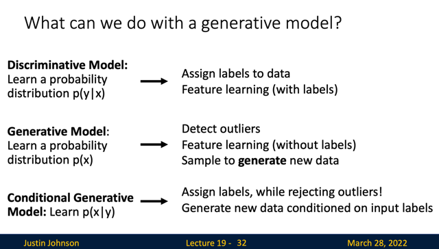</kbd></p>

> [!NOTE]
> Discriminative model: như đã thấy có thể giúp classify (assign labels) cho
> input data, nhưng cũng có thể dùng nó như feature extractor (ví dụ như khi ta
> dùng pretrained cnn model để lấy các features `-` output từ các intermediate
> layer để dùng cho các mục đích khác)
>
> Chỗ này có thể hiểu vầy: Ví dụ như xét toàn bộ một nn, thật ra ta đang theo
> lối supervised learning để dùng label để hướng dẫn việc learn một feature
> function: bằng cách learn feature sao cho tối đa `P(Y='target'|` feature(input)) `-`
> tìm cách thay đổi param sao cho bỏ image vào, tính ra feature thì feature này
> giúp tối đa hóa xác suất của target class. Nên nói feature learning with label
> là như vậy.
>
> Generative model: Đại khái là như hồi nãy đã thấy, thông qua việc mô hình
> một phân phối xác suất over mọi possible image, ta có thể dùng nó để xác
> định xác suất của một mẫu sample là lớn nhỏ thế nào, thì từ đây dẫn đến một
> bài toán là anomaly `/` outlier detection. Ví dụ nếu P(x) thấp hơn mức nào đó
> thì chứng tỏ nó là outlier.
>
> Bên cạnh đó, vì một generative model nếu đủ tốt sẽ "phản ánh hiểu biết sâu
> sắc của nó về thế giới", do đó có thể cũng có các để dùng nó cho feature
> learning (hiểu đại khái là dùng nó để dẫn dắt việc learn ra feature sao cho
> p(feature) cao, mà không cần dùng label để dẫn dắt.
>
> Và một tác dụng quan trọng từ đó chính là, dùng Generative model để
> generate ra sample mới. Kiểu như nếu ta đã tính được một image có xác
> suất cao hay thấp thì ta có thể chế ra một image sao cho nó có xác suất cao
> `->` thì tức là đây là một image chế nhưng giống thật.
>
> `====`
>
> Cuối cùng là Conditional Generative Model, vừa có thể dùng cho bài toán
> classification, với ưu điểm là cho phép reject outlier. Mà vừa có thể generate
> new sample dựa trên một class được chọn

<br>

<a id="node-1905"></a>

<p align="center"><kbd>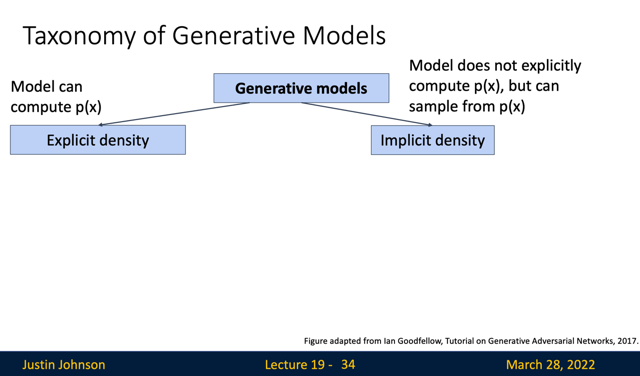</kbd></p>

> [!NOTE]
> Một sơ đồ cho thấy khái quát về Generative models: Đầu tiên có thể có loại
> trong đó ta tính được density function value và có loại ta không tính được p(x)
> nhưng thay vào đó có thể sample từ p(x)
>
> Ở đây Justin chú ý là ta nên hiểu về likelihood hay density và probability Tức
> là cái mà model tính toán ở đây là probability density function, là giá trị sẽ thể
> hiện mật độ ít nhiều của xác suất, đây cũng là tương đương với chữ likelihood
> `-` mà ta có thể tạm dịch là khả năng xảy ra. Còn probability thì lại mang ý nghĩa
> cụ thể hơn ví dụ xác suất giá trị rơi vào một vùng nào đó là bao nhiêu. Nên từ
> density function, ta phải tính trên một vùng nào đó thì mới thành ra xác suất
> xuất hiện trên vùng đó. Ví dụ gọi p(x) là mật độ xác suất, thì tích phân từ a đến
> b của p(x) sẽ là xác suất giá trị rôi vào vùng `a-b.`

<br>

<a id="node-1906"></a>

<p align="center"><kbd>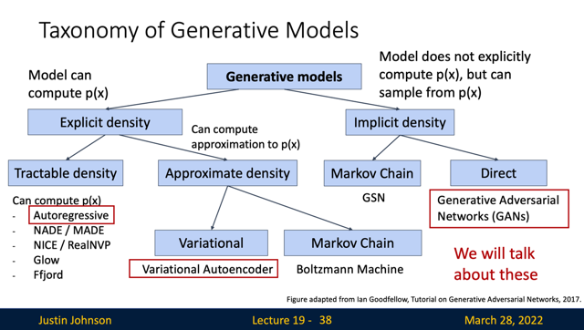</kbd></p>

> [!NOTE]
> và ta sẽ học về 3 model này:
> Autoregressive, VAE và GAN.

<br>

<a id="node-1907"></a>

<p align="center"><kbd>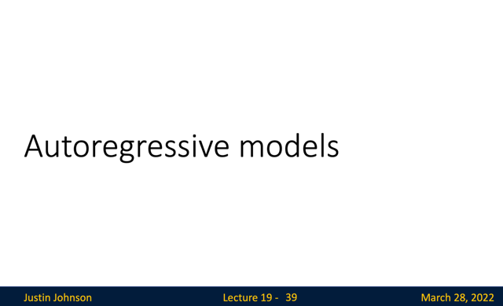</kbd></p>

<br>

<a id="node-1908"></a>

<p align="center"><kbd>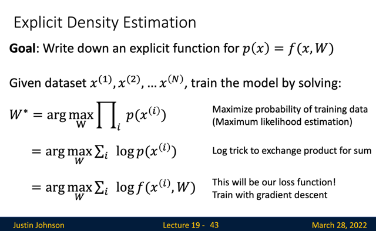</kbd></p>

> [!NOTE]
> đại khái là ta sẽ đặt mục tiêu là học được, tìm được một explicit probability
> density function `-` như đã nói ở trên, **function nhận một sample x** và dựa
> vào c**ác parameters W để tính toán ra giá trị của density function p(x)** `=`
> f(x,W)
>
> Thế thì ta sẽ học `/` tìm function bằng cách tìm ra giá trị parameters sao cho
> **tối đa khả năng xuất hiện** **(likelihood) của các observation** (training
> samples) đây chính là cách tiếp cận **Maximum Likelihood Estimation** đã
> học trong DLYo.
>
> Thế thì nhớ lại trong DLYo để hiểu rằng ta cho phép **giả định các sample
> `/` observation độc lập nhau** (Gọi là một dataset có tính chất**i. i.d `=`
> identical independent distribution**) để từ đó **cho phép xây dựng công
> thức của likelihood** của training set là **tích của likelihood của từng
> sample** (product rule của probability cho phép điều này)
>
> Vậy thì tiếp theo vì **hàm log là hàm đồng biến (monotonic)** nên cho
> phép ta sử dụng**log trick** `-` tìm W sao cho maximize tích các p(x(i))
> **cũng chính là W khiến maximize log của nó**, và từ đó**chuyển thành
> bài toán tìm W sao cho maximize tổng của các log p[x(i)]**. Với p[x(i)] là
> hàm theo x(i) và W
>
> Và dựa vào objective là maximize cái likelihood function này, cho phép ta
> xây dựng loss function là negative của nó, nên gọi là **negative log likehood 
> loss function. Dùng gradient descent để learn W.**

<br>

<a id="node-1909"></a>

<p align="center"><kbd>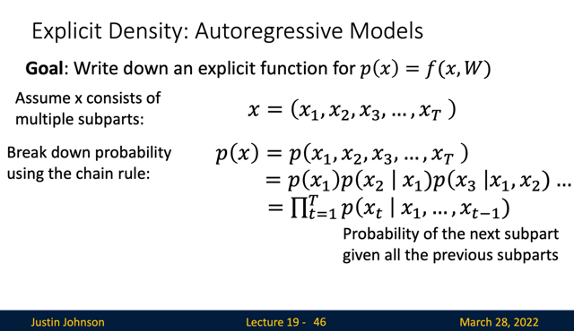</kbd></p>

> [!NOTE]
> Thế thì, dựa vào MLE ta có objective function, nhưng ta vẫn cần xây dựng 
> công thức của density function: p(x) `=` f(x,W). Gọi x là một sample, hay ví dụ
> là một image, ta có thể cho rằng nó có nhiều phần (subpart) để cho phép thể 
> hiện nó dưới dạng x `=` (x1, x2,....xT) 
>
> Tiếp, từ đó coi p(x) là một joint probability p(x1,x2....,xT) và dùng chain rule
> của probability để triển khai ra thành:
>
> p(x1, x2,...xT) `=` `p(x1)*p(x2|x1)*p(x3|x1,x2).....*p(xT|x1...xT-1)`
>
> Tới đây Justin hỏi ta có thấy nó giống cái gì đã học không?
>
> Me: Thử đoán: language model, bởi trong đó ta cũng cố gắng xây dựng
> một mô hình tính ra xác suất của một chuỗi.

<br>

<a id="node-1910"></a>

<p align="center"><kbd>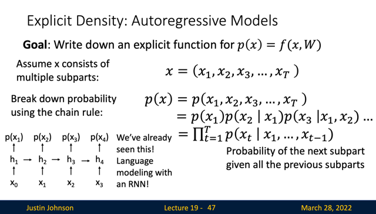</kbd></p>

> [!NOTE]
> Chính xác hơn thì Justin muốn nói tới chính là kiến trúc RNN (mà tác
> dụng của nó cũng được phát huy trong bài toán language model) `-` trong
> đó ta có thể dùng nó để tính toán một function dựa trên các output tại
> các `time-step` trước đó. Ý muốn nói, RNN cho ta một mechanism rất
> phù hợp để mô hình hóa cái density function đang quan tâm.
>
> Vậy với language model, ta dùng RNN để tính toán xác suất của token
> tiếp theo, dựa trên chuỗi token trước đó. Thì ở đây, ta cũng có thể dùng
> RNN để xây dựng function tính ra density function của subpart `x_t` dựa
> trên các subpart trước.
>
> Và với image, một subpart có thể là một pixel

<br>

<a id="node-1911"></a>

<p align="center"><kbd>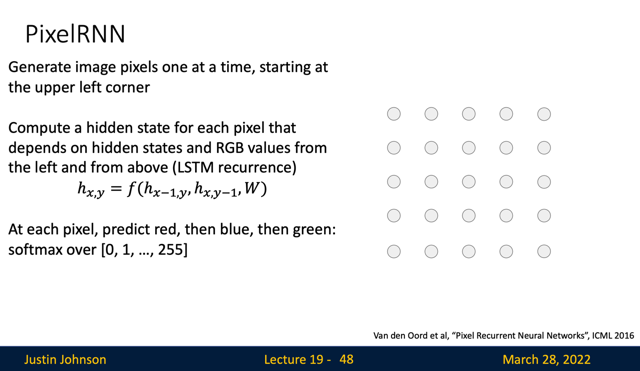</kbd></p>

> [!NOTE]
> Và từ đó ta có mô hình PixelRNN. Coi như các pixel là chuỗi từ vị trí đầu tiên
> bên trái, rồi từ đó từ trái qua phải, trên xuống dưới. Để rồi tại mỗi `time-step,` RNN
> sẽ tính toán dựa trên hidden state và prediction của `time-step` trước (*), tính ra
> một phân phối xác suất over `0-255` giá trị cho mỗi RGB channel  của pixel tiếp
> theo.
>
> *Có thể hiểu là tại `(time-step)` pixel t thì sẽ được tính dựa trên cả pixel bên trái
> nó và pixel bên trên nó.
>
> Theo công thức ở đây hx,y tức là hidden state tại pixel tọa độ x,y sẽ được tính
> dựa trên hidden state của pixel bên trái nó (tọa độ `x-1,y)` và pixel bên trên nó
> (tọa độ `x,y-1),` không nói đến RGB values. Cái này lúc sau có thể sẽ rõ hơn.
>
> Còn đương nhiên có thể hiểu vì trong image, mỗi pixel sẽ có 3 con số trong
> phạm vi `0-255,` mỗi số cho một trong 3 channel RGB. nên có thể hiểu ta cần dự
> đoán ra giá trị của 3 con số, mỗi số có 255 possible value. Do đó cũng tương tự
> như trong language model có vocab size `=` 255. Và ta dùng softmax để tính một
> phân phối xác suất over vocab size, từ đó chọn ra giá trị có xác suất cao nhất.
> Tóm lại, tuy là dự đoán ra giá trị của pixel là một integer nhưng đây vẫn là bài
> toán classification.
>
> Cụ thể hơn ta có thể hiểu rằng tại mỗi vị trí pixel và một trong 3 RGB channel ta
> sẽ dùng softmax để output một vector có 256 phần tử (thể hiện phân phối xác
> suất dự đoán cho giá trị của pixel ở channel đó). Hay nói cách khác, output của
> RNN cell sẽ là matrix 3x256, sau khi apply softmax theo `dims=1` (để normalize
> mỗi hàng, chuyển nó thành probability). Và loss sẽ là cross entropy loss với
> target là matrix 3x256. Mỗi hàng là một `one-hot` vector thể hiện phân phối xác
> suất thực, số một nằm tại vị trí ứng với giá trị của pixel (ví dụ tại đó pixel có giá
> ```text
> trị là red=1, green=10, blue=255. thì target sẽ là matrix mà hàng 1 là one-hot
> ```
> vector có số 1 tại index `=` 1, hàng 2 là `one-hot` vector có số 1 tại index `=` 10,...

<br>

<a id="node-1912"></a>

<p align="center"><kbd>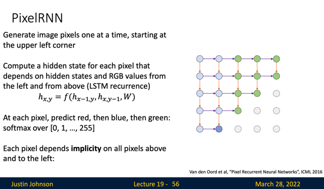</kbd></p>

<p align="center"><kbd></kbd></p>

<p align="center"><kbd>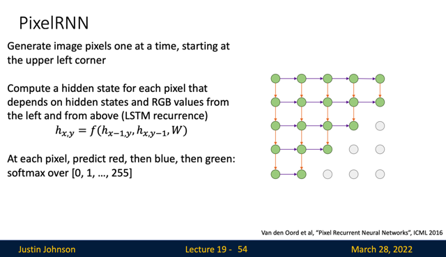</kbd></p>

> [!NOTE]
> Và quá trình sẽ expand dần dần từ `top-left` `->` bottom right corner. Trong đó
> mỗi pixel sẽ explicitly depend vào pixel bên trái và bên trên nó. Nhưng vì
> các pixel đó cũng depend các pixel trước đó nên thành ra implicitly, một
> pixel depend vào mọi pixel đã generate khác

<br>

<a id="node-1913"></a>

<p align="center"><kbd>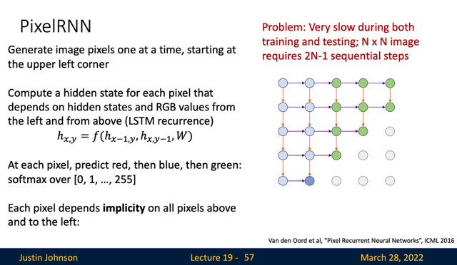</kbd></p>

> [!NOTE]
> Thế thì dễ hiểu là ta cũng sẽ gặp nhược điểm của RNN là hạn chế của
> việc xử lý tuần tự. Thành ra nó rất chậm trong cả training `+` testing nếu
> image size lớn

<br>

<a id="node-1914"></a>

<p align="center"><kbd>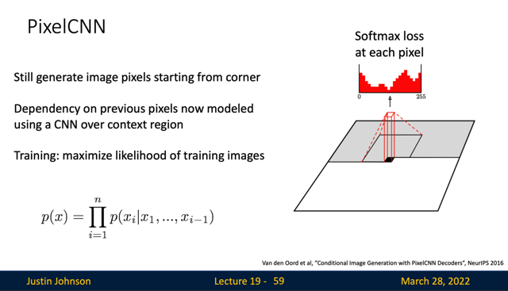</kbd></p>

> [!NOTE]
> đại khái là người ta thay RNN bằng CNN, đúng hơn là `masked-CNN,` để có
> thể "tính toán song song trong phạm vi `receptive-field"` `-` tức là sao.
>
> Đại khái thế này:
>
> Conv layer sẽ có filter có spatial shape là KxK có điều sẽ được masked để
> che đi những vị trí ở bên phải và bên dưới của pixel's location.
>
> vì ta cần output ra 3 vector, mỗi vector chứa 256 phần tử thể hiện phân phối
> xác suất dự đoán cho giá trị của từng RGB channel tại pixel đó. Nên ta sẽ "
> xài" 3*256 `=` 768 filter. Vậy mỗi filter đương vẫn có shape 3xKxK, để tại mỗi Vị
> trí nó tính ra 1 giá trị. Thì 768 filter cho ra 768 giá trị, tạo thành output cho
> pixel đó sẽ là vector có 768 phần tử. Ta mới reshape nó thành 3x256, và áp
> dụng softmax trên mỗi hàng để chuyển thành probability. (đặng xài
> `cross-entropy` loss với target như nói hồi nãy)
>
> `====`
>
> Thế thì cách này rõ ràng đã tận dụng khả năng tính toán song song của conv
> layer `-` mỗi pixel được tính toán "song song" vì phép dot product giữa filter
> và receptive field. Nhưng bên cạnh đó mọi pixel còn được tính toán song song
> khi phép convolution được thực hiện đồng loại ở mọi location.

<br>

<a id="node-1915"></a>

<p align="center"><kbd>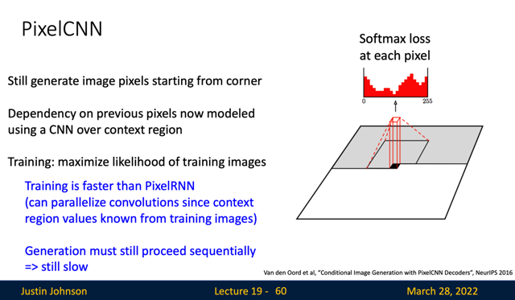</kbd></p>

> [!NOTE]
> Tuy nhiên nó chỉ giúp training nhanh hơn, chứ còn khi generation, thì
> vẫn phải làm tuần tự

<br>

<a id="node-1916"></a>

<p align="center"><kbd>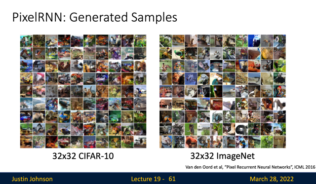</kbd></p>

> [!NOTE]
> Hình ảnh kết quả của việc train mô hình trên ImageNet, CIFAR10 và
> dùng nó để generate image mới.
>
> thế thì đại khái là ta có thể thấy nếu mà nhìn từ xa, có vẻ là những
> hình ảnh thực tế. Nhưng khi nhìn gần lại, hoàn toàn là chẳng phải
> hình thù cụ thể nào.
>
> Điều này gợi ý rằng, model đã học được một số dạng `high-level` 
> feature nào đó, nhưng vẫn chưa đủ khả năng generate ra những
> image chất lượng cao.

<br>

<a id="node-1917"></a>

<p align="center"><kbd>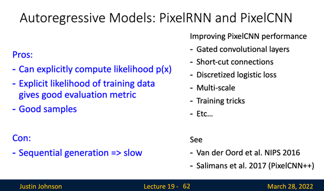</kbd></p>

> [!NOTE]
> có thể tóm lại một số ưu nhược điểm của autoregressive models này
> Ưu điểm là vì cách thiết kế cho phép tính toán ra giá trị likelihood (hay
> probability density function) của một image, nên cho phép ta evaluate
> nó bằng cách: training no training set, và evaluate likelihood của các
> image trong test set, và nếu model làm tốt, ta kì vọng nó cho ra giá trị
> cao. Vì sao lại vậy? Là vì như đã nói, mô hình này được huấn luyện
> để tối đa hóa likelihood function `-` hiểu nôm na là học được cách đánh
> giá một bức hình thật (hình ảnh thực tế về thế giới với màu sắc, đường
> nét) có likelihood `-` tạm dịch là khả năng tồn tại, xuất hiện `-` cao.
>
> Để rồi khi dùng nó để generate image mới nó sẽ tạo ra các image (bằng
> cách chọn giá trị cho các pixel) sao cho bức hình có likelihood cao `-` và
> nếu mô hình làm tốt, nắm bắt, học được, các kiến thức về hình ảnh thực
> tế của thế giới, thì bức hình likelihood cao mà nó tạo ra có thể là những
> bức hình trông rất giống hình ảnh thực sự được chụp bởi ai đó. (Tuy vậy
> rất tiếc mô hình này chưa đủ tốt để làm được vậy, khi như vừa mới nói,
> tuy hình ảnh có vẻ cũng có những màu sắc, đường nét nào đó, về cấu trúc
> local và bố cục cũng có vẻ giống với hình thật, nhưng nó vẫn chưa mô hình
> đúng được, để rồi khi nhìn gần ta không nhận ra bất cứ object nào, của thế
> giới thực cả.
>
> Thế thì quay lại việc evaluation, đương nhiên test image cũng là hình ảnh
> thực tế của thế giới, giống như training image. Thành ra nếu model tốt thì
> (dù nó chưa thể có khả năng generate hình ảnh giống thật) nhưng rõ ràng
> nó phải cho ra likelihood cao đối với test image.

> [!NOTE]
> Q: khi generating image, chẳng phải là ta sẽ phải bắt đầu với pixel đầu
> tiên hay sao?
>
> A: Đúng vậy, và đây cũng là một vấn đề gặp phải với language model,
> do đó cũng như trong nlp người ta thường cho nó một <START> token,
> thì ở đây cũng vậy, có thể kiểu như có cái padding đóng vai trò các start
> pixel
>
> Q: Cái này nó có thể generalize cho những resolution khác không?
>
> A: Với vanilla version nói đến ở đây thì ko nhưng có thể những phiên bản
> cải tiến của nó thì có.

> [!NOTE]
> Ngoài ra có rất nhiều technique để cải tiến của mô hình này mình có thể
> check các paper liên quan.
>
> Cuối cùng một nhược điểm quan trọng của cái này là nó chậm khi
> generating, vì phải generate từng pixel một

<br>

<a id="node-1918"></a>

<p align="center"><kbd>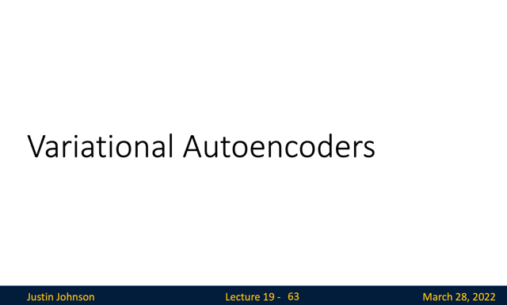</kbd></p>

<br>

<a id="node-1919"></a>

<p align="center"><kbd>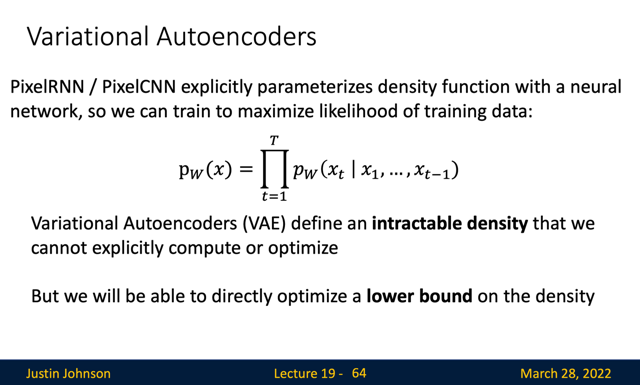</kbd></p>

> [!NOTE]
> Qua VAE `-` Variational Autoencoder.
>
> Với **Autoregressive**  model như PixelRNN hay PixelCNN, đại khái là ta**dùng neural network để biểu diễn, mô tả một cách rõ ràng (explicitly) cụ thể
> một probability  density function**, tức là **dựa trên tham số của neural
> net** (parameterized density function), nó sẽ đóng vai trò của density
> function
>
> Để rồi thông qua **objective là maximum likelihood của training set, dùng
> gradient descent**, ta có thể **train các  parameters của neural net sao cho
> tối đa "khả năng xảy ra" (likelihood) của các observed data sample**.
>
> Khi đó ta có thể dùng nó để i) **đánh giá likelihood của một new sample**
> hoặc ii) **generate một new sample sao cho  có likelihood cao** như trong
> hai mô hình `PixelRNN/CNN.`
>
> `===`
>
> Thế thì với VAE, ta sẽ **không tìm cách biểu diển, thể hiện density function
> một cách rõ ràng (intractable)** (để rồi tìm cách train params sao cho tối đa
> hóa  giá trị của likelihood `/` density function)
>
> Thay vào đó ta sẽ **tìm cách tối đa một giới hạn `/` biên dưới (lower bound)
> của density** HÌnh dung là, nếu ta cố gắng **nâng giới hạn dưới của một
> biến số (density function) lên**, thì cũng đồng nghĩa là ta có thể **ngầm
> hiểu (implicitly) là đã nâng giá trị của nó lên**

<br>

<a id="node-1920"></a>

<p align="center"><kbd>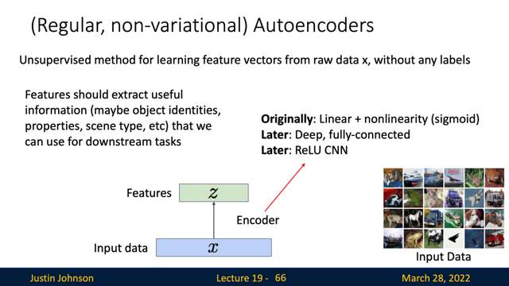</kbd></p>

> [!NOTE]
> Đầu tiên Justin nói tới (**regular, `non-variational)` Autoencoder** trước,  thì
> đại khái là đây là cách tiếp cận mà người ta muốn xây dựng mô hình sao
> cho nó có thể **học được các extract các feature vectors từ raw image**
> để dùng nó trong các downstream task (như khi ta dùng cnn được
> pretrained với ImageNet trong tác vụ classification để extract feature)
>
> Với cnn train với ImageNet thì nó thuộc Supervised, tuy nhiên ở đây
> **người ta muốn làm việc đó theo cách Unsupervised, tức là không cần
> image's label**Thế thì encoder đang nói đến cơ bản là có thể là kiến trúc nn nào đó, có
> thể đơn giản thì như linear layer với `non-linear` activation function (sigmoid,
> Relu) hoặc các kiến trúc tốt hơn sau này với CNN...

<br>

<a id="node-1921"></a>

<p align="center"><kbd>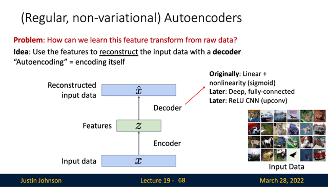</kbd></p>

> [!NOTE]
> Đại khái ý tưởng là ta sẽ xây dựng một mô hình có **encoder** và **decoder**,
> để làm nhiệm vụ: **encoder** sẽ encode một raw image, hay**extract feature
> từ raw image**, sau đó **decoder** sẽ **tái tạo lại (reconstruct) raw image** **ban
> đầu** từ những feature extracted bởi encoder.
>
> Decoder cũng sẽ là một nn, với các layer như **Transpose CNN** giúp khôi
> phục (tăng spatial map)

<br>

<a id="node-1922"></a>

<p align="center"><kbd>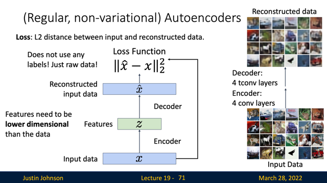</kbd></p>

> [!NOTE]
> và ta sẽ define loss function sẽ penalize **sai khác giữa raw image ban đầu** và
> **kết quả phục dựng từ decoder** (dùng**square l2 norm**)
>
> Điểm quan trọng cần lưu ý đó là ta**không muốn model work như một identity
> function**, khi nó chỉ việc spit out những gì nó nhận vào, do đó, cái mấu chốt là
> có một **ràng buộc** rằng **feature của encoder sẽ có kích thước (lower
> dimension) nhỏ hơn nhiều so với input**.
>
> Để rồi mô hình encoder phải **học cách có thể gọi là nén raw image**, **chắt lọc
> các tinh túy, đặc trưng** của raw image **để rồi decoder có thể phục dựng lại**bức
> ảnh gốc từ các tinh túy đó.

<br>

<a id="node-1923"></a>

<p align="center"><kbd>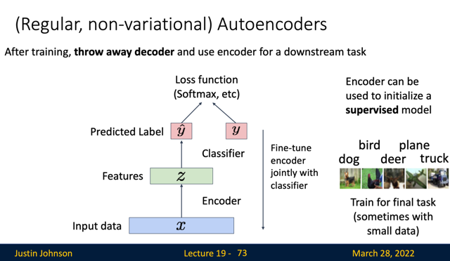</kbd></p>

<p align="center"><kbd></kbd></p>

<p align="center"><kbd>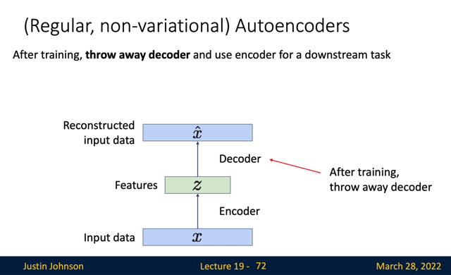</kbd></p>

> [!NOTE]
> Sau khi training, ta sẽ**không cần dùng đến decoder**nữa, mà chỉ  quan
> tâm encoder. Cụ thể là ta có thể **dùng nó để extract feature, finetune nó
> thêm với supervised learnin**g (như với nhiệm vụ image classification) có
> điều lúc này có thể c**hỉ cần ít labeled data hơn**.
>
> nói chung có thể thấy, **động lực để người ta muốn làm cái này chính là
> tìm cách train một model có khả năng extract các `low-high` level feature
> một cách Unsupervised**, vì như đã biết**label rất tốt kém**.
>
> Nếu encoder đủ tốt để rồi khi `fine-tune` với ít labeled data mà vẫn có thể
> đạt hiệu qủa như supervised training một cnn với dữ liệu lớn thì đương
> nhiên là rất tốt
>
> Q&A: Đại khái có người**hỏi về kiến trúc của encoder, decoder** thì
> Justin trả lời rằng thông thường ta có thể **hình dung decoder giống như
> ngược lại so với encoder**: encoder sẽ **thu nhỏ spatial size, tăng số
> channels** còn decoder thì ngược lại.
>
> Cuối cùng Justin cho rằng ta nên chỉ biết rằng **Autoencoder** là một ý
> tưởng hay nhưng hiện tại**thực tế nó không cho thấy hiệu quả như kì
> vọng.**

<br>

<a id="node-1924"></a>

<p align="center"><kbd>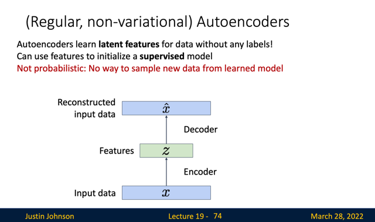</kbd></p>

> [!NOTE]
> Và **nhược điểm nữa Autoencoder**là****nó **không phải là một
> probabilistic model**, tức là ta **không thể dùng nó để sampling một
> data mới** từ một phân phối xác suất học được, bởi chẳng có phân
> phối xác suất nào cả.
>
> Nhớ lại với **Autoregressive** model trong đó **nó learn một probability
> density function**, để rồi từ đó **có thể dùng trong việc sampling một
> sample mới** **sao cho có likelihood cao** (bản chất của việc sampling
> từ một phân phối xác suất đương nhiên là ta có hay dễ có một giá trị có
> xác suất cao hơn các giá trị có xác suất thấp)
>
> Còn**ở đây, cơ bản là ta không có một phân phối xác suất nào** để mà
> sampling.**Tất cả những gì ta có thể làm** là dùng nó để**extract feature.**

<br>

<a id="node-1925"></a>

<p align="center"><kbd>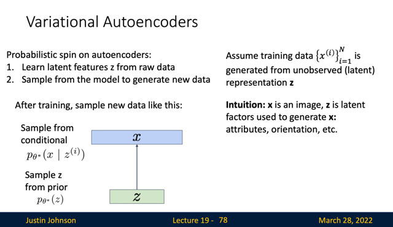</kbd></p>

> [!NOTE]
> Thế thì với **Variational Autoencoders**, người ta vẫn **muốn có khả năng
> extract ra những feature** (ở đây dùng từ latent feature thì cũng là bởi các
> feature này luôn ẩn giấu trong raw data) nhưng bên cạnh đó người ta muốn có
> thể **learn một phân phối xác suất giúp từ đó có thể  dùng để sampling để cho
> ra một image sample mới.**Để làm vậy, ta sẽ**giả định rằng training data được generate từ một feature
> hay representation ẩn giấu**, tiềm ẩn (**latent**) z nói đến ở trên.
>
> Giống như 100 bức hình **chụp con mè**o thì có thể **đều có chung một bộ
> features** nào đó.
>
> Vậy thì điều ta muốn làm, đó là, sau khi training, **encoder model** với
> parameters của nó có thể **biểu diễn `/` ước lượng `/` đóng vai trò của một prior
> probability distribution p_θ*(z)**, để rồi nó sẽ**cho phép ta sampling từ đó**
> để có được **một bộ feature `/` representation có likelihood cao**.
>
> Hoặc nói nôm na là, **model sẽ học được** **được** một **phân phối xác suất**
> để biết được rằng các **đặc trưng ẩn giấu " thường" là sẽ có giá trị như thế
> nào**, rồi**từ đó cho phép ta "lấy" (sampling) một bộ gía trị như vậy**.
>
> Sau khi đã **sampling được một bộ features `/` representations z**, ta sẽ tiếp tục
> nhờ khả năng thứ hai của model, đó là **decoder** model `-` thằng này**cũng học
> được một phân  phối xác suất điều kiện** (conditional probability density
> function)**p_θ*(x|z)**
>
> Mang ý nghĩa đại khái là****nó hiểu được,**với z như vậy, thì cái hình (tức bộ
> giá trị của các image pixel) sẽ "NÊN" như thế nào để có xác suất cao**.
>
> Nôm na:
>
> **Encoder** (sau khi **học được rằng mèo thì trông như thế nào** `-` **mèo thì có
> bộ features `/` representation z như thế nào**), để rồi nó sẽ **CHẾ RA một bộ giá
> trị z**.
>
> **Decoder** nhận lấy, và nó thì **học được rằng**, **với z như vậy, thì các giá trị
> của pixel nên như thế nào**, từ đó nó **CHO RA một bộ giá trị x**
>
> Và kết quả ta có được tấm hình một con mèo,**không có có trong training set**,
> mà hoàn toàn là do model tạo ra.

<br>

<a id="node-1926"></a>

<p align="center"><kbd>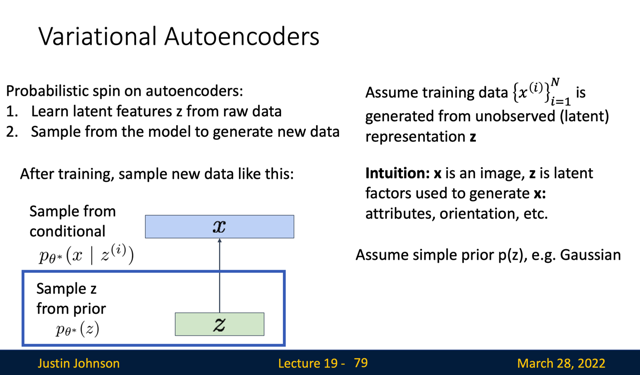</kbd></p>

> [!NOTE]
> Với **prior distribution p(z)**, ta thường sẽ **giả định rằng nó là một phân phối
> xác suất đơn giản** (để tính cho dễ) `-` và ta **thường chọn** là **Gaussian**
> distribution với **diagonal covariance matrix** `-` tức là mô hình xác suất
> Gaussian mà **các variable độc lập**, **uncorrelated** nhau.
>
> Nói thêm một chút, từ bài **MAP** của **DL Yoshua Bengio** ta cũng đã thấy
> cái **vụ đặt giả định cho prior distribution** thường dùng **Gaussian** hoặc
> **Uniform distribution**.
>
> Tất nhiên có thể hiểu**prior distribution,** khi ghi p(z) là `p_θ*(z)` thì có nghĩa
> là nó sẽ **được quy định bởi `/` tính bởi model's learned params** `(θ)` cho giá
> trị của mean, covariance matrix), và `θ*` biểu thị, ám chỉ **giá trị params `θ` tối ưu** 
> hay "đã huấn luyện xong"
>
> Hay nói cách khác, ta **vẫn phải train model để học ra các tham số của mô
> hình xác suất này** (Gaussian mean và variance của `-` cũng có thể nói là
> Gaussian mean và variance là **hàm bởi model's params)**
>
> Và với **mean** và **cov matrix**, ta mới **sampling ra z**.
>
> `=====`
>
> Ở đây có một điểm chú ý rằng,**có khi** người ta sẽ **chọn một phân phối
> xác suất đơn giản và fixed luôn**, chứ **không cần phải để model learn**. Ví
> dụ như ta sẽ  chọn z từ một standard Gaussian N(0, I) `-` **zero** mean,
> **Identity** covariance matrix (tức là các variable uncorrelated nhau và có
> variance `=` 1). Đương nhiên lúc này **p(z) chỉ là p(z) thôi, không cần p_θ(z)**
>
> Nhưng cũng có thể người ta cho `/` train model để học ra p(z), thì sẽ "ghi là"
> `p_θ(z).` Tuy nhiên có thể phải hiểu rằng khi đó **không phải là ta dùng decoder**
> để predict mà dùng **một model riêng biệt** (hỏi GPT thì nó nói vậy, trong cái gọi
> là **Hierarchical VAEs**). Và do đó đúng ra phải ghi là `p_eta(z)` để ám chỉ rằng
> đây là một model khác, tuy nhiên **quy tắc chung là dùng theta để chỉ việc ta
> sẽ dùng model để tính** nói chung.

<br>

<a id="node-1927"></a>

<p align="center"><kbd>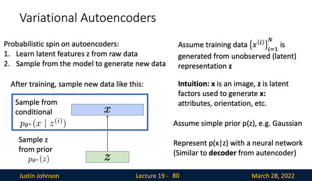</kbd></p>

> [!NOTE]
> Tiếp theo là p(x|z), ta sẽ**dùng `/` train neural network để biểu diễn p(x|z)**,
> đương nhiên khi đó phải ghi là `p_θ(x|z)`
>
> để rồi **nhận z**, nó sẽ**dự đoán** **một phân phối xác suất p_θ*(x|z)** để từ đó
> **sampling ra x** `-` mang ý nghĩa là, từ một latent code `/` variable sampled từ
> latent space ta sẽ có được một bức hình x có latent feature z đó

<br>

<a id="node-1928"></a>

<p align="center"><kbd>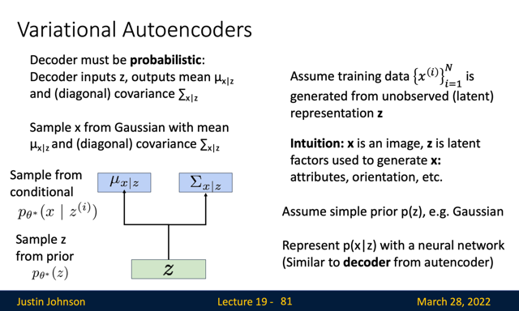</kbd></p>

> [!NOTE]
> Rồi với **latent variable** `/` latent feature z, thế thì làm sao neural network có thể
> dự đoán ra một phân phối xác suất này `-` **conditional probability distribution
> p(x|z),** để mà từ đó có thể sampling x?
>
> Câu trả lời đó là, ta sẽ **xây dựng một phân phối xác suất** mà **parameters của
> nó được tính toán bởi neural net**. Hay nói cách khác, neural network dự đoán
> phân phối xác suất bằng cách dự đoán ra tham số của phân phối xác suất đó.
> Vậy thì đương nhiên,**mỗi loại phân phối xác suất** có "công thức" khác nhau,
> **tham số khác nhau**. Do đó, ta cần chọn ra hay giả định về dạng của phân
> phối xác suất này.
>
> Và như thường lệ, khi phải **giả định dạng của phân phối xác suất**, người ta
> thường sẽ dùng**dạng Gaussian distribution.**Hơn nữa, ta sẽ chọn một mô
> hình Gaussian đơn giản `-` tất nhiên là không phải đơn giản tới mức có mean `=` 0
> và variance `=` 1, vì như vậy thì nói làm gì nữa. Mà ta sẽ chỉ giả định là các
> variable độc lập nhau `/` uncorrelated nhau, đồng nghĩa covariance matrix**là một
> diagonal matrix**. Lí do đó là với kích thước hình lớn, thì covariance matrix sẽ rất
> lớn. ****Tại đây mình có thể liên hệ Chapter 4 của **Introduction to Statistical Learning**
> khi ta học về các classification model như**Logistic Regression, Linear
> Discriminant Analysis, Quadratic Discriminant Analysis, Naive Baye**s, ....mình đã
> biết rằng, mỗi **mô hình sẽ dựa trên những giả định khác nhau** để mà có thể **có
> cách ước lượng ra** `/` có công thức để **tính các component trong Bayes classifier**.
>
> Và trong đó ta cũng nhớ **LDA** dựa trên giả định với **mỗi class**, các predictor đều
> tuân theo phân phối xác suất **Gaussian**, có **mean khác nhau** nhưng **covariance
> matrix giống nhau**. Rồi **QDA** thì cũng giả định như LDA ngoại trừ việc mỗi class
> cũng **khác nhau ở covariance matrix luôn.**
>
> Còn **Naive Bayes** thì giả định các **predictor `/` variable độc lập** hay **uncorrelated**.
> Thành ra nếu giả định thêm là các predictor cũng có phân phối Gaussian thì ta
> sẽ có điều kiện giống như ở đây `-` Gaussian distribution với diagonal covariance
> matrix.
>
> Thế thì nhớ lại, trong khi phân tích `/` so sánh các model với nhau, ta khẳng định
> lại **No Free Lunch theorem**: Không có cái nào tốt hơn cái nào cả, mọi cái đều sẽ
> phát huy nếu dùng nó trong bài toán mà data có các đặc điểm thống kê phù hợp
> với giả định của model. Và bên cạnh đó, ta còn gặp lại quy luật đánh đổi giữa
> bias-variance**. Càng nhiều parameters thì càng tăng variance**, khiến **dễ overfit**
> nếu không có nhiều data để cân bằng. Thì trong trường hợp này cũng vậy, việc
> đặt **giả định uncorrelation giữa các pixel giúp giảm số parameters** cũng nhằm
> **tránh overfit** và **đồng thời là chi phí tính toán.**Và****trong bài toán này, số chiều của nó sẽ**bằng số pixel  của image.**Vì
> sao? Vì "hình dạng" của image trông như thế nào thì cơ bản là quy định bởi giá
> trị của pixel chứ gì, nên chúng chính là biến số, variable
>
> Ví dụ, với cái hình có 100x100x3 `=` 30,000 pixel value, ta sẽ xây dựng một
> **multi-variate Gaussian distribution với 30,000 variable**.
>
> Và `multi-variate` Gaussian distribution này sẽ được **parameterized bởi neural
> network -**nói cách khác là **neural net sẽ dự đoán ra các tham số**(mean, cov
> matrix) của distribution này **dựa trên input là latent variable** Z
>
> (trong slide kí hiệu **mu_x|z**, **Sigma_x|z** là vậy)
>
> Như vậy, neural net sẽ **output một vector mean có 30,000 phần tử** (chứa giá
> trị mean của 30,000 variables) cũng như là một **covariance matrix có kích
> thước 30,000x30,000**. Tuy nhiên, như đã nói là `multi-variate`
> Gaussian distribution này cũng có **diagonal covariance** matrix, do đó chỉ có
> 30000 params trên đường chéo thôi. Mà **mỗi cái trên đường chéo như đã biết
> chính là variance của variable tương ứng**.

> [!NOTE]
> here the trick is that we're going to sort of **assume a parametric form for the
> probability distributions over images** so...
>
> ...in particular we're going to **assume that** it's going to **be a gaussian
> distribution** with **number of dimensions in the gaussian equal to the
> number of pixels in the image.**
>
> and now **we can parametrize that gaussian distribution** **using a mean
> value** for each pixel **as well as a as a standard deviation value for each
> pixel.**So then **what this neural network is going to do is** um **output a a high
> dimensional gaussian distribution** where it's going to **output a mean
> value for each pixel** and **a standard deviation or or covariance value
> for each pixel** and then we can combine the predicted mean the predicted
> per pixel means with the predicted per pixel standard deviations to give us
> this high dimensional gaussian distribution which is going to be a distribution
> over images that is conditioned on a latent variable z

> [!NOTE]
> yeah so um for for a kind of a **general gaussian distribution** it would be a full
> covariance matrix over all the over all the dimensions but um if you
>
> want to model like 512 squared pixels that means our covariance matrix would
> be like 512 squared times 5 times squared and now that's a thing that we need
> to output from a neural network so then the weight matrix that predicts that
> thing is going to be like size of the hidden of the previous hidden layer times
> 512 times 512 squared**so then the weight matrix is going to be absolutely
> astronomically large** so as a**simplifying assumption** we're going to not use a
> general gaussian distribution we're going to **assume it's a diagonal gaussian
> distribution** um so that **assumes that this that there's no covariance
> between the pixels** that means that um so there's an underlying uh probability
> there's an **underlying independence assumption here** which is that conditioned
> on the latent variable z **the pixels of the generated image are conditionally
> independent** and that's kind of the there's that's the independence assumption
> that we're making when we uh when we factor the distribution in this form

> [!NOTE]
> đại khái là như đã nói, ta sẽ giả định**diagonal cov matrix** vì **nếu không,
> số params sẽ rất lớn** ví dụ hình 512x512 thì sẽ là 512**2 params.
>
> Và đồng nghĩa là ta đã **giả định các variable independence**, tức là ta**giả
> định các pixel không tương quan nhau** (no covariance between pixel)
>
> Và theo Justin tin rằng assumption này**cũng là lí do chất lượng hình ảnh khi
> generate từ VAE bị mờ** (blurry)

<br>

<a id="node-1929"></a>

<p align="center"><kbd>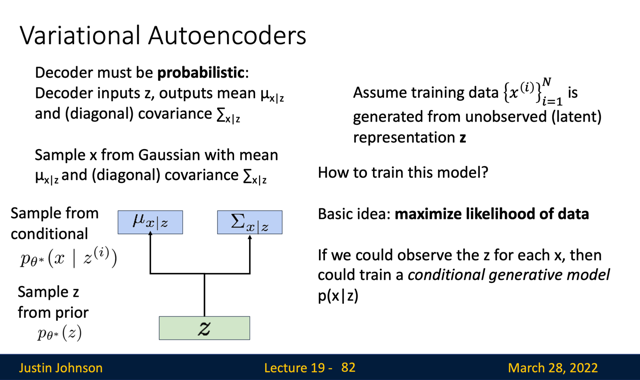</kbd></p>

> [!NOTE]
> thế thì câu hỏi tiếp theo là,**làm sao ta có thể train VAE**.
>
> Câu trả lời là dựa vào cách tiếp cận quen thuộc**Maximum Likelihood
> Estimation**, trong đó ta sẽ **train model parameters sao cho tối đa hóa
> likelihood của training observation** (training observation là mấy cái hình "
> thật" `-` ý là những bức hình khắc họa những hình ảnh thật ở ngoài đời, mà
> trong những bức hình này, các pixel value có gía trị như thế nào đó `-` tức
> tuân theo một quy luật thật sự nào đó của tự nhiên)
>
> Nhưng vấn đề là, **p_θ(x|z) là một CONDITIONAL probability density
> function**, **nên phải dựa vào z**, hay nói cách khác, **ta phải có z trước
> thì mới dùng nó làm input của nn** `-` dùng nn trong vai trò**tính ra tham số
> mean và variance của probability density function** và**lắp x vào để có
> likelihood của observed data** (lúc này objective function theo biến là
> model's params), và ta sẽ như thường lệ, **dùng optimization algorithm để
> train model params** giúp maximize likelihood function.
>
> Nhưng ta lại **không có z**, vì nó là **feature ẩn giấu mà ta muốn (train nn
> để  có thể) chắt lọc ra (extract) từ raw image**.

<br>

<a id="node-1930"></a>

<p align="center"><kbd>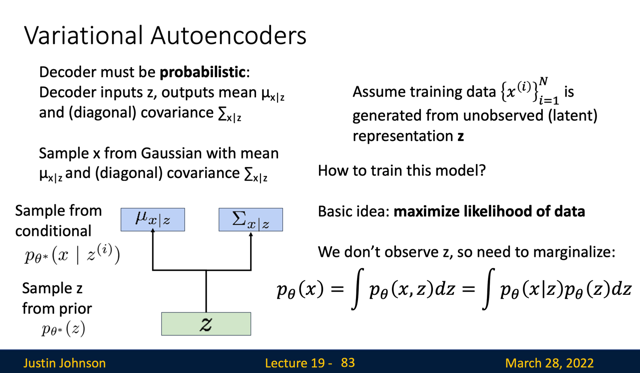</kbd></p>

> [!NOTE]
> vậy thì vì **không có z**, nên**hướng đi tiếp theo** thường là ta sẽ **"gom
> z lại" (marginalize) để kiểu như không cần biết z cụ thể là gì**, cũng đồng
> nghĩa ta **không cần biết p_θ(x|z)**, mà ta sẽ **chỉ quan tâm `p_θ(x)` với mọi z**
>
> giống như ví dụ một đống quả táo, cam và cho rằng vỏ chỉ có thể có màu
> xanh hoặc đỏ, thì xác suất một quả được chọn là cam `p(B=cam)` sẽ bằng
> xác suất chọn được quả cam trong những quả màu đỏ `-` `P(B=cam,` `A=đỏ),`
> cộng xác suất chọn được quả cam trong những quả màu xanh `-` `P(B=cam,`
> `A=xanh)`
>
> ```text
> P(B=cam) = P(B=cam, A=đỏ) + P(B=cam, A=xanh)
> ```
>
> ```text
> và P(B=cam, A=đỏ) thì bằng P(B=cam| A=đỏ)*P(A=đỏ)
> ```
>
> ```text
> và P(B=cam, A=xanh) = P(B=cam| A=xanh)*P(A=xanh)
> ```
>
> `===`
>
> Ý là nếu **không biết z để có p_θ(x|z)** ta có thể **khỏi cần quan tâm z cụ
> thể**, mà**tổng cộng tất cả giá trị khả dĩ của z để có p_θ(x)** không cần biết
> z cụ thể làm gì nữa.
>
> Và từ đó, thì **maximize p_θ(x)** cũng **chính là maximize `p_θ(x|z)` với mọi z**

<br>

<a id="node-1931"></a>

<p align="center"><kbd>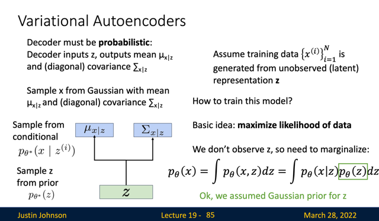</kbd></p>

<p align="center"><kbd></kbd></p>

<p align="center"><kbd>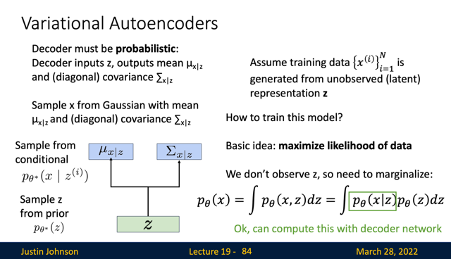</kbd></p>

> [!NOTE]
> Thì khi đó, trong công thức **p_θ(x)** là**tích phân mọi z** của **p_θ(x|z)*p(z)*dz**
> thì, ta đã có:
>
> `-` **p_θ(x|z):** như đã nói**có thể được học bỏi** /**tính bởi** một neural
> network
>
> `-` **p_θ(z)** thì như đã nói ta cho rằng nó là một simple **Gaussian distribution**
> và sẽ **dùng model sẽ chịu trách nhiệm dự đoán** hoặc có thể **chỉ dùng một
> fixed**  **simple Gaussian zero mean, variance 1, khi đó nếu khắt khe thì ghi 
> là p(z)**Có nghĩa là, nhìn lướt qua thì ta đã có thể**tạo ra function p(x) parameterized
> bởi model**. Và như vậy **chỉ việc train model's param để maximize likelihood**
> với observed image
>
> `====`
>
> Một điểm chú ý là với công thức này, **p_θ(x) đương nhiên parameterized bởi 
> model** (có chữ theta) bởi nó được tính bởi `p_θ(x|z)` `-` parameterized bởi model.
>
> Điểm này sẽ giúp giải thích tí nữa vì sao `p_θ(z|x)` cũng có chữ theta.

<br>

<a id="node-1932"></a>

<p align="center"><kbd>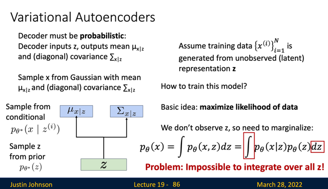</kbd></p>

> [!NOTE]
> Tuy nhiên,**vấn đề lại nằm ở chỗ** ta **không thể integrate mọi giá trị
> khả dĩ của z**, vì **z là latent, là ẩn giấu**, và ta không biết nó sẽ có
> không gian các giá trị khả dĩ lớn nhỏ ntn.
>
> **tóm lại cách tiếp cận này không khả thi**

<br>

<a id="node-1933"></a>

<p align="center"><kbd>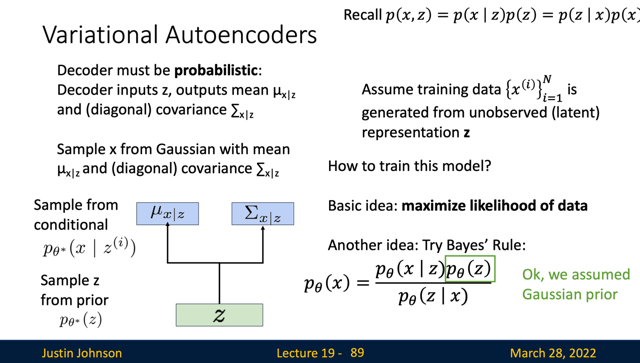</kbd></p>

<p align="center"><kbd></kbd></p>

<p align="center"><kbd>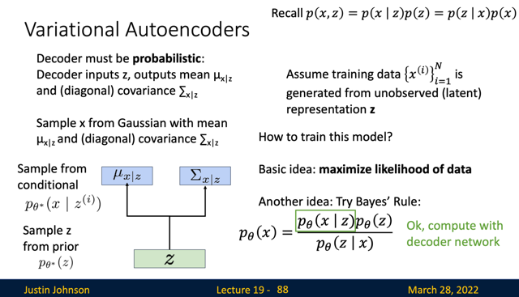</kbd></p>

> [!NOTE]
> thế thì thay vì triển khai p(x) theo cách tiếp cận là **marginalize**: **tích phân
> mọi z p_θ(x|z)*p(z)dz**mà việc**tích phân trên mọi miền giá trị của z là
> không khả thi**Ta có thể **dùng cách tiếp cận khác**, **dùng Bayes rule** để triển khai
> **p_θ(x) `=` `p_θ(x|z)` * `p_θ(z)` `/` p_θ(z|x)**.
>
> Khi đó để **tính p_θ(x),** cũng như vừa nói ta đã có hai thứ đó là
>
> **p_θ(x|z):** có thể được **tính bởi decoder network** như lúc nãy đã nói.
>
> **p_θ(z)** thì **cũng tính được** khi ta**giả định z theo một phân phối xác
> suất Gaussian đơn giản**parameterized bởi model hoặc không p(z)
>
> Ở đây cứ cho là ta sẽ chọn p(z) là một simple fixed Gaussian distribution đi.
>
> `====`
>
> Vậy thì nếu thắc mắc vì sao phải để theta vào mọi component trên, kể cả 
> `p_θ(z|x)` là bởi:
>
> `p_θ(x|z):` Như đã nói, cái này p(x|z) sẽ được dự đoán bởi model
>
> `p_θ(z):` Cái này có thể hoặc không được learn bởi model. Nên coi nó là p(z)
> hoặc `p_θ(z)` đều được.
>
> Thế thì công thức marginalization p(x) `=` tích phân mọi z p(x|z)p(z)dz sẽ dẫn đến
> p(x) cũng là hàm của model's params `->` `p_θ(x)`
>
> Thành ra với p(z|x) theo bayes rule bằng p(x|z) * p(z) `/` p(x) với p(x|z), p(x) đều
> là hàm của theta thì đương nhiên p(z|x) cũng vậy: `p_θ(z|x).`

<br>

<a id="node-1934"></a>

<p align="center"><kbd>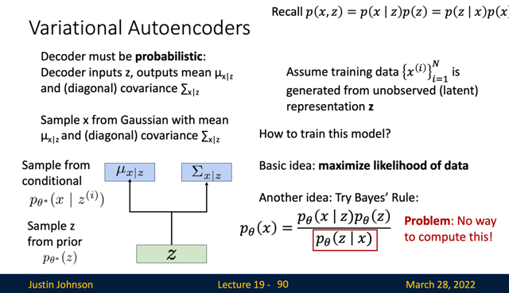</kbd></p>

> [!NOTE]
> Nhưng **bây giờ vấn đề**lại nằm ở chỗ ta **không có** **p_θ(z|x)**
>
> Cái p(z|x) mang ý nghĩa là **phân phối xác suất của latent variable
> conditioned on image x** và cái này nôm na có nghĩa là **với một cái
> hình x**, **thì các latent feature có thể có các giá trị như thế nào**.
>
> Và giải pháp là ta **lại dùng neural network khác để học ra**, học cách
> ước lượng ra, hay học các dự đoán ra `p_θ(z|x).`
>
> Và vì đây sẽ là một model khác, nên ta dùng kí hiệu là q_Φ(z|x) và
> cũng đồng nghĩa, hay có thể hiểu ta sẽ muốn nn này học ra q_Φ(z|x)
> sao cho **q_Φ(z|x) `~=` p_θ(z|x)**

<br>

<a id="node-1935"></a>

<p align="center"><kbd>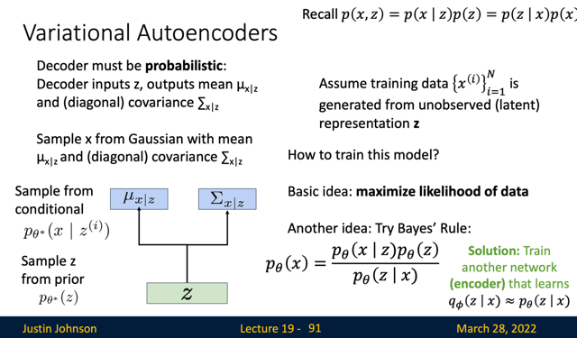</kbd></p>

> [!NOTE]
> Thế thì cái neural network sẽ **học cách đóng vai trò của p_θ(z|x)** gọi là
> encoder
>
> Có nghĩa là nó sẽ **cố gắng dự đoán phân phối xác suất của latent
> variable z dựa trên image x**

<br>

<a id="node-1936"></a>

<p align="center"><kbd>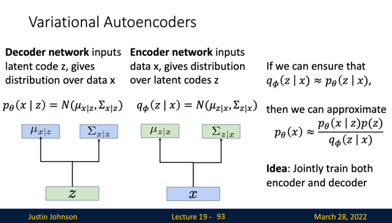</kbd></p>

> [!NOTE]
> Vậy Encoder network cũng sẽ tương tự như Decoder:
>
> **Decoder** như đã nói sẽ **đảm nhiệm tính toán p_θ(x|z)** `-` nó sẽ **dự
> đoán một phân phối xác suất của raw image value, conditioned on 
> latent feature z**.
>
> Và nãy ta cũng đã nói, ta sẽ giả định **phân phối xác suất này sẽ là
> `multi-variable` Gaussian có dimension `=` số pixel** (W*H*3) của image,
> **có covariance matrix là diagonal matrix** (mang ý nghĩa các variable
> uncorrelated) để **giúp đơn giản bớt, giảm bớt số parameters**).
>
> Đương nhiên **mean và diagonal covariance matrix sẽ được tính `/` dự
> đoán bởi decoder's parameter**
>
> Thế thì **Encoder** cũng vậy, nó cũng sẽ đóng vai trò**dự đoán một
> phân phối xác suất của latent variable z, condition on x**: **q_Θ(z|x)**
>
> Và ta **cũng giả định** nó là một **multi-variate Gaussian có covariance
> matrix diagonal**, và một lần nữa, dự đoán phân phối xác suất tức là nó
> sẽ dự đoán mean và covariance matrix (hay, mean và covariance matrix
> sẽ parameterized bởi model `-` công thức được xây dựng từ encoder
> params)
>
> Còn p(z) thì có thể thấy ở đây họ bỏ đi kí tự theta để biểu thị rằng ta sẽ
> chỉ dùng một fixed simple Gaussian distribution không phụ thuộc model.

<br>

<a id="node-1937"></a>

<p align="center"><kbd>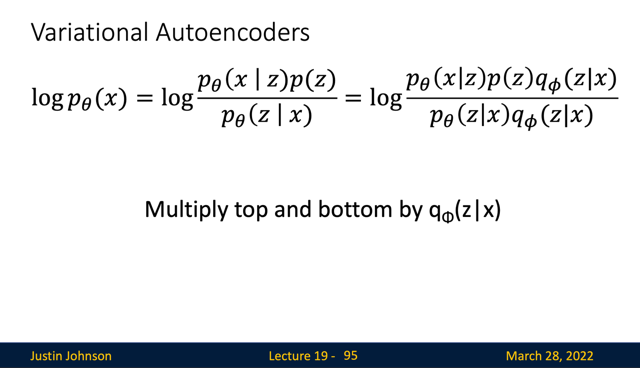</kbd></p>

> [!NOTE]
> Thế thì, ta đang có quan hệ giữa các element này theo Bayes rule:
>
> ```text
> p_θ(x) = p_θ(x|z) * p(z) / p_θ(z|x)
> ```
>
> Ta mới nhân tử và mẫu cho q_Θ(z|x). Sau đó lấy log hai vế

<br>

<a id="node-1938"></a>

<p align="center"><kbd>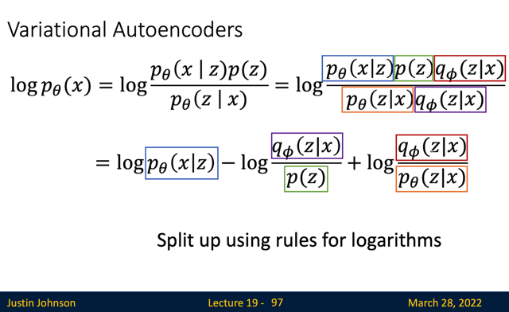</kbd></p>

> [!NOTE]
> triển khai ra, không có gì khó hiểu, chỉ là:
>
> i) log A*B*C `=` logA `+` logB `+` logC
>
> ```text
> A = p(x|z), B = p(z)/q(z|x), C = q(z|x)/p(z|x)
> ```
>
> ```text
> ii) rồi B = p(z)/q(z|x) = [q(z|x)/p(z)]^-1 (B=1/[1/B] = [1/B]^-1)
> ```
>
> ```text
> => logB = log(1/B)^-1 = -log(1/B)
> ```

<br>

<a id="node-1939"></a>

<p align="center"><kbd>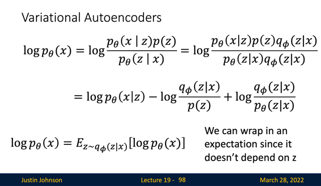</kbd></p>

> [!NOTE]
> tiếp theo đại khái là vì `p_θ(x)` không phụ thuộc z nên ta có thể wrap
> trong một expectation, để có log `p_θ(x)` bằng giá trị kì vọng của log
> `p_θ(x)` khi variable z "lấy từ" q(z|x):
>
> ```text
> log p_θ(x) = E z~q_Θ(z|x) [log p_θ(x)]
> ```

<br>

<a id="node-1940"></a>

<p align="center"><kbd>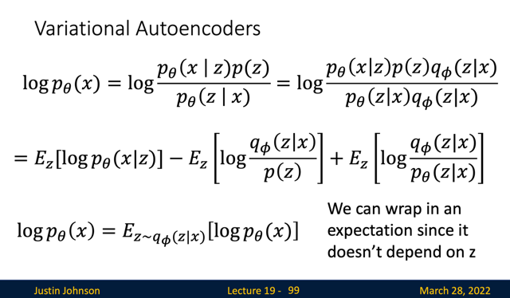</kbd></p>

> [!NOTE]
> và vì log p(x) bằng tổng 3 term này, nên người ta cho phép apply
> expectation lên 3 term này để ta có: 
>
> `E` z [log `p_θ(x)]` 
>
> ```text
> = E z [log p_θ(x|z)] - E z [log q_Θ(z|x) / p(z)] + E z [log q_Θ(z|x) / p_θ(z|x)]
> ```

<br>

<a id="node-1941"></a>

<p align="center"><kbd>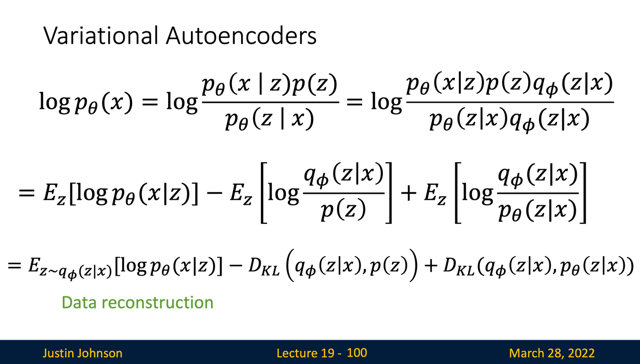</kbd></p>

> [!NOTE]
> Thế thì term đầu tiên ta sẽ biết nó có ý nghĩa là Data reconstruction,
> Tí nữa sẽ hiểu tại sao

<br>

<a id="node-1942"></a>

<p align="center"><kbd>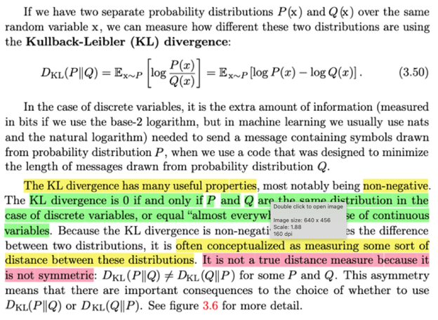</kbd></p>

<p align="center"><kbd></kbd></p>

<p align="center"><kbd>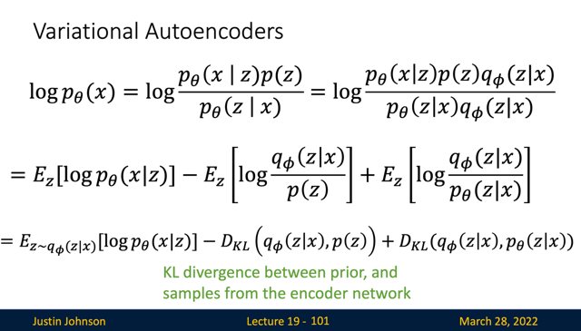</kbd></p>

> [!NOTE]
> Term thứ hai chính là **KL divergence giữa hai probability distribution:**
> prior**p(z)** và **q_Θ(z|x)**. Đúng là như vậy, từ DL Yoshua, mình đã biết
> công thức tính KL Divergence của hai distribution P(x), Q(x):
>
> ```text
> D KL P||Q = E x~P [log {P(x)/Q(x)} và D KL Q||P = E x~Q [log{Q(x)/P(x)}]
> ```

<br>

<a id="node-1943"></a>

<p align="center"><kbd>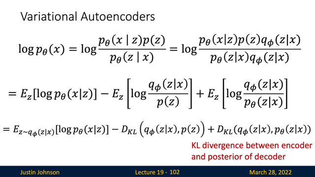</kbd></p>

> [!NOTE]
> Còn cái vế thứ 3 thì cơ bản là **không tính được** vì như đã
> nói ta không có có `p_θ(z|x)` như đã nói.
>
> Tuy nhiên nó chính là KL Divergence giữa q_Θ(z|x) và `p_θ(z|x)`
> và theo định nghĩa nó sẽ có tính chất không âm

<br>

<a id="node-1944"></a>

<p align="center"><kbd>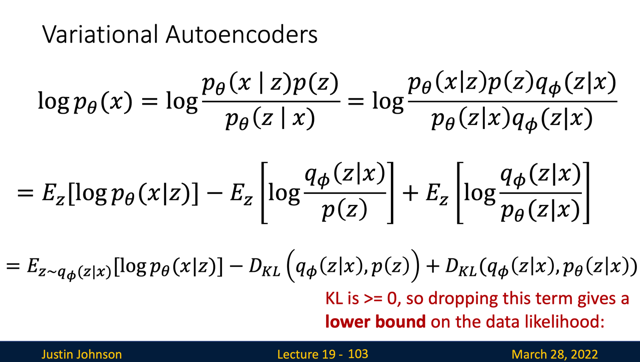</kbd></p>

> [!NOTE]
> Thành ra ta có thể bỏ nó đi để có thể**chuyển từ phương trình thành
> bất phương trình** như sau

<br>

<a id="node-1945"></a>

<p align="center"><kbd>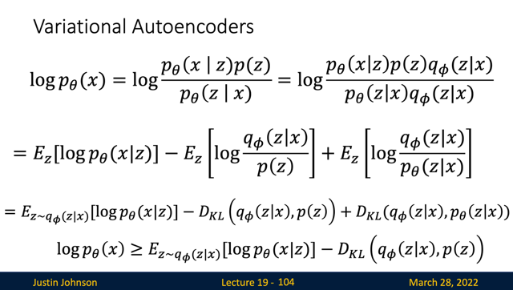</kbd></p>

> [!NOTE]
> Đó là **log p_θ(x)** sẽ**lớn hơn hoặc bằng** term 1 `+` term 2. Và với ý
> nghĩa đó, vế bên phải sẽ là **một giới hạn dưới của log p_θ(x)**
>
> Và **hai vế này ta đều có thể tính được `/` approximate bằng nn:**i) q_Θ(z|x) được ước lượng bởi **encoder**
>
> ii) `p_θ(x|z)` ước lượng bởi **decoder**

<br>

<a id="node-1946"></a>

<p align="center"><kbd>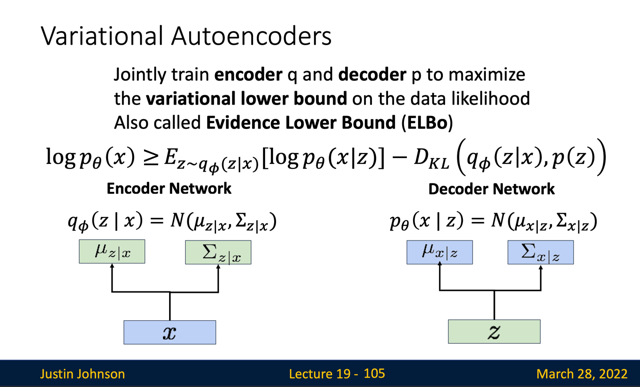</kbd></p>

> [!NOTE]
> và từ đó ta sẽ train, cùng lúc, encoder và decoder để **maximize cái
> variational lower bound** này, thì cũng **đồng thời chính hi vọng ràng là ta
> đang maximize log p_θ(x)**
>
> Justin cho biết đây là **cách tiếp cận rất phổ biến trong probabilistic
> model** trước khi có deep learning. Cách này có tên gọi là **variational
> inference**.
>
> Và cái hay ở đây là ta dùng cái mathematical trick này trong probabilistic
> model để áp dụng nó vào neural network.

<br>

<a id="node-1947"></a>

<p align="center"><kbd>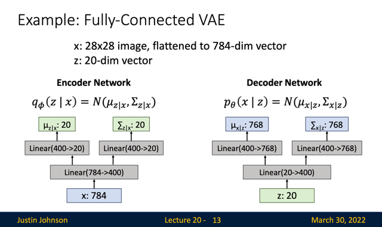</kbd></p>

> [!NOTE]
> Như vậy, ta đã có thể mô tả một VAE, ví dụ như chỉ sử dụng **Fully
> Connected**layer như sau:
>
> Encoder, như đã biết sẽ là một nn, dựa trên input là image x, dự đoán một
> **Uncorrelated `Multi-variate` Gaussian distribution của latent variable
> q_Θ(z|x)** (chọn cách giả định dùng Gaussian và dùng diagonal covariate `-`
> **các variable uncorrelated nhau để đơn giản hoá**,  giảm bớt số params
> của model `-` sẽ chỉ còn là một giá trị mean và một giá trị variance `/` mỗi
> variable)****Thế thì, vì dùng FC layer, nên input x (vì dụ build VAE cho MNIST
> dataset) sẽ được flatten thành 28*28 `=` 784 dimensional vector.
>
> Thông qua một hidden layer để giảm dimension thành 400 chẳng hạn.
>
> Tới đây nó sẽ predict qua **2 linear layer song song** để ra**mean và
> variance**. **dimension của latent variable là hyper-params**, ví dụ chọn
> bằng 20, thì ta sẽ có 2 linear layer với 20 unit để predict ra `20-d` vector
> mean và variance. Again, **đã nói covariance matrix là diagonal nên chỉ
> cần 20 giá trị trên đường chéo**.
>
> Và ráp vào công thức của Gaussian probability density function ta sẽ có
> q_Θ(z|x)
>
> (*) Nhắc lại là với giả định diagonal Gaussian tức là ta đang giả định  các
> latent variable (mỗi variable trong 20 variable của vector z) độc lập  nhau,
> uncorrelated nhau
>
> `====`
>
> Tương tự với Decoder, kiến trúc cũng tương tự, để đóng vai trò dự đoán ra
> một uncorrelated Gaussian probability distribution `p_θ(x|z)` có dimension là
> số pixel của bức hình trong trường hợp này là 28*28*1 `-` là**phân phối xác
> suất của các possible image.** Again, giả định các variable (là giá trị mỗi
> pixel) uncorrelated nhau giúp covariance matrix sẽ chỉ cần 784 giá trị trên
> đường chéo (mỗi giá trị là variance của mỗi `pixel/variable)` còn ngoài
> đường chéo đều bằng 0, giúp giảm số params của decoder.
>
> Vậy thì Decoder network sẽ predict `784-d` mean vector và `784-d` variance
> vector (đường chéo của covariance matrix). Ráp vào Gaussian density
> function để có `p_θ(x|z)`
>
> Chỗ này khi làm **assignment** ta sẽ thấy kiểu tạm gọi là một cách làm
> **đơn** **giản hoá** khi decoder thực tế sẽ**output một vector 784 giá trị
> CỦA MỘT IMAGE**, thay vì là hai vector mean và variance như vừa nói.
> Và **có thể coi đó là một image x^ được sampled từ predicted distribution
> p(x|z)** và cũng có thể hiểu đó chính là**most probable sampling** `-` chính
> là cái**mean của Gaussian**
>
> Để rồi ta **dùng loss là cross entropy loss giữa x** (cái hình ban đầu đưa
> vào encoder  và x^ là cái hình "tái tạo" của x bởi decoder)
>
> Vậy thì, bằng cách giảm loss `=` đẩy x^ giống với x, cơ bản ta cũng chính là
> maximize likelihood `p_theta(x|z)` của image x (Xem hình minh họa và nói rõ
> hơn ở bên) ** Một chú ý là đương nhiên các linear layer sẽ theo sau bởi
> `non-linearity`
>
> ** Trong slide ghi sai: `784=28*28` chứ không phải 768

<br>

<a id="node-1948"></a>

<p align="center"><kbd>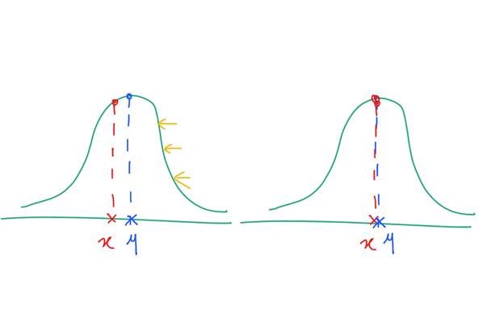</kbd></p>

> [!NOTE]
> Chỗ này phải nói kĩ hơn: Hình ảnh ví von là ta **đẩy vật A sát lại B** thì cũng
> giống như**đẩy B sát lại A**.
>
> Đây nhé: Với cách làm tạm gọi là theo lí thuyết, **cho decoder dự đoán
> mean và variance**, r**áp vào Gaussian likelihood function**, và từ đó ta
> **tính likelihood của một observed image x** là một function theo decoder's
> params. Để rồi ta sẽ thay đổi params sao cho đẩy likelihood này lên thì thật
> ra việc đó cũng chính là ta điều chỉnh params sao cho **đẩy điểm đỉnh
> (mean) của cái chuông Gaussian 784** chiều về vị trí của điểm x (image x,
> 784 giá trị của nó, là tọa độ của một điểm đại diện cho image đó trong
> không gian 784 chiều).
>
> Thế thì, với cách làm đơn giản thứ hai, ta có thể **coi output của decoder là
> một sample sampling từ predicted Gaussian** `-` và cũng có thể **coi đó là cái
> most probable sample** `-` chính là **đỉnh** hay **mean** của Gaussian. Thì lúc này
> dùng ta tính ra một **hàm số dùng cross entropy giữa x và x^** và thay đổi
> params để giảm cross entropy này thì cũng chính là**kéo mean của
> Gaussian về gần x**
> Tóm lại, nói vậy để hiểu về reconstruction loss

<br>

<a id="node-1949"></a>

<p align="center"><kbd>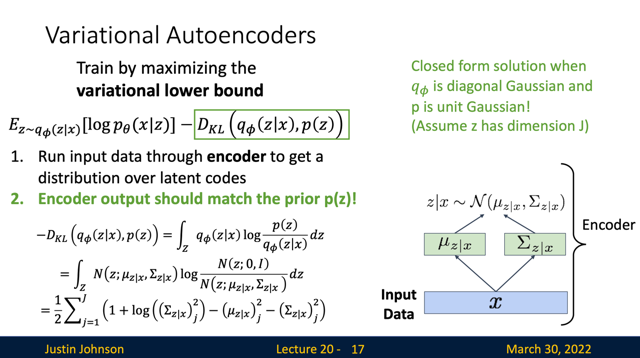</kbd></p>

> [!NOTE]
> đại khái là nói về việc training VAE, thì như đã biết, encoder sẽ nhận real 
> image x và tính ra predicted distribution q_Θ(z|x) thể hiện qua vector mean 
> và (diagonal) covariance matrix .
>
> Từ đó ta dùng nó để tính cái term thứ 2 của **variational lower bound** (là
> cái mà khi ta thay đổi parameters của model để tăng cái này lên, thì ta sẽ 
> kì vọng là cũng tăng log p(x) lên)
>
> Và đại khái là nếu triển khai ra, cùng với prior **p(z)** được chọn là**simple 
> standard normal distribution (mean 0, unit variance)** thì ta có thể tính 
> KL divergence của q(z|x)||p(z) ở dạng **closed-form** (đại khái là có thể triển 
> khai ra để có công thức cụ thể giúp tính được)
>
> Và với cái term này của objective function, thì nếu muốn thay đổi param 
> để maximize objective, ta phải ý nghĩa sẽ là ta**muốn giảm sự divergence 
> của prior distribution p(z) và predicted distribution q_Θ(z|x)**
>
> Tức là ta muốn encoder học một distribution của latent code z dựa trên x 
> nhưng phải làm sao đó để distribution này đơn giản thôi, gần với standard 
> Gaussian có zero mean, uncorrelated variable và variance của các variable 
> đều bằng 1
>
> `====`
>
> Và cũng có câu hỏi là**nếu ta chọn prior distribution p(z) là dạng khác**, 
> thì công thức sẽ khác?
>
> Justin: Đúng vậy, **có người chọn Bernoulli**  hoặc **Laplacian distribution**, 
> nhưng khi đó việc **tính toán sẽ khó**. Ở đây **chọn Gaussian giúp tính D KL 
> có thể đơn giản hơn**

<br>

<a id="node-1950"></a>

<p align="center"><kbd>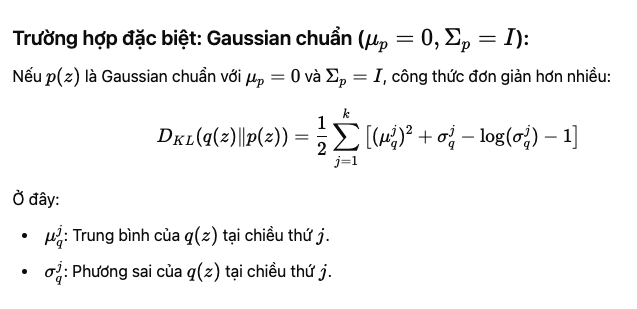</kbd></p>

<p align="center"><kbd></kbd></p>

<p align="center"><kbd>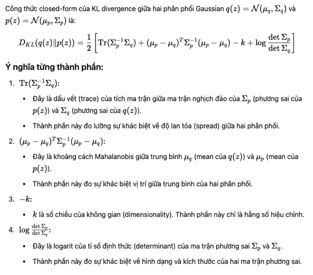</kbd></p>

> [!NOTE]
> Đại khái là tại sao lại có công thức này thì tạm thời cứ hiểu rằng, có công
> thức của KL Divergence giữa hai Gaussian distribution là như vầy.
>
> Và với trường hợp đặc biệt khi p(z) là standard Gaussian thì công thức
> trở nên đơn giản hơn.
>
> Còn tại sao có công thức trên thì tìm hiểu sau vậy

<br>

<a id="node-1951"></a>

<p align="center"><kbd>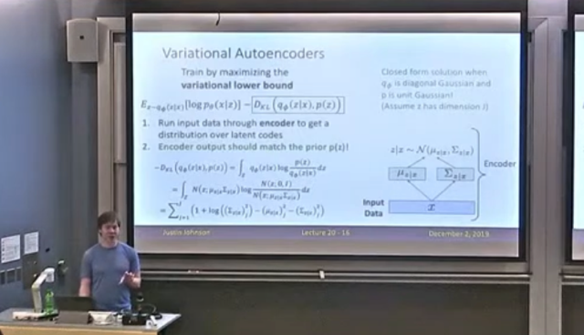</kbd></p>

> [!NOTE]
> Q: Có nên c**họn prior khác nhau tùy theo dataset không**?
>
> Justin: z là latent variable, ta không biết được, không quan sát được nó, mà ta
> muốn model tự học ra khi training, nên việc ta chọn prior như thế nào sẽ cho
> model biết cái kiểu latent variable mà ta muốn nó học
>
> Nên ví dụ như ở đây ta chọn diagonal Gaussian thì tức là ta đã nói  với model
> rằng cái kiểu latent variable, latent feature mà ta muốn nó học ra sẽ có tính
> chất independence.
>
> Do latent variable sẽ được model "học ra" khi training nên Justin cho rằng có
> thể chấp nhận việc dùng cùng prior cho các dataset khác nhau Nhưng nhắc lại
> là đây là lĩnh vực đang được nghiên cứu sôi nổi trong đó người ta thử nhiều
> loại distribution khác nhau
>
> `===`
>
> Q: Đại khái là anh này hỏi rằng ta đang chọn prior distribs là Uncorrelated
> Gaussian vậy thì có thể dùng nhiều binary classifier được không (ý là thay vì
> dùng uncorrelated Gaussian để giả định mô hình xác suất của z, ta có thể tách
> ra thành nhiều mô hình xác suất binary (mỗi cái cho mỗi variable của z)?
>
> Justin: Cách làm của VAE với neural net và probabilistic model còn có nguyên
> nhân về computational.
>
> **Người hỏi hỏi câu đó **đại ý là có thể đơn giản hóa bằng cách tách ra thành
> các mô hình đơn biến** cho mỗi variable không.
>
> Còn Justin trả lời thì**có thể hiểu đại ý là cách làm trên còn có lợi về tính
> toán** liên quan đến việc h**idden layer của neural net chia sẻ parameters
> (trong khi, trước khi đưa ra kết quả để pass qua phần probabilistic formula)**

> [!NOTE]
> Question is um could we train sort of **dimension-of-z different binary
> classifiers** instead of a **diagonal gaussian** and I think that would be
> **equivalent** but the difference is that.. um **we want to share the
> computation within the encoder network** so right now the variation auto
> encoder is kind of interesting because...
>
> we've got sort of **two levels of modeling** inside the model one is like the
> **neural network which is computing many layers** and the other is kind of
> **the probabilistic formulation** so it's true that even though we want that we'
> re telling the model we wanted to learn a set of latent variables that are
> uncorrelated the way that **we're computing those means and standard
> deviations of those latent variables is through a neural network that is going
> to share a lot of parameter**s and a lo of weights through shared hidden
> layers so **I think it's a computational reason** that we choose to do it in this
> way

<br>

<a id="node-1952"></a>

<p align="center"><kbd>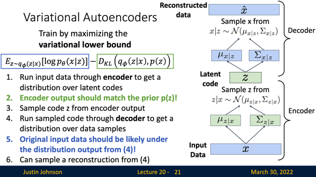</kbd></p>

> [!NOTE]
> Rồi sau khi encoder đã predict ra distribution p(z|x), ta sẽ sampling trong đó để
> có z. Và đưa cho decoder `-` vốn được train để predict ra distribution over all
> image x dựa trên latent variable z, p(x|z). Thế thì lúc này cái term 1 của
> objective function sẽ mang ý nghĩa là: với latent variable z được sampled từ
> phân phối xác suất của của latent variable dự đoán bởi encoder, ta sẽ muốn
> decoder đánh giá cao khả năng xảy ra (likelihood của x `-` p(x|z) cao) (*)
>
> Vì sao: Nôm na là **ta muốn encoder dựa trên image x, học được quy luật của
> latent variable (quy luật phân phối, phân phối xác suất q(z|x))**.
>
> Thế thì **nếu mà encoder học tốt**, thì **quy luật mà nó học ra sẽ phải có đặc
> điểm** là **phản ánh đúng sự phân bố giá trị của latent feature z**. Để rồi khi ta
> sampling  từ đây, ta sẽ **khả năng cao có được** **một cái latent variable "đúng"** (đúng tức là đúng quy luật tiềm ẩn chi phối giá trị của nó, mà model đã học
> được)
>
> Xét tới decoder, ta muốn nó học được phân phối xác suất của x dựa trên latent,
> variable z, tức là **muốn nó học được rằng với z như vậy thì các pixel nên có
> giá trị như thế nào thì hợp lí** `-` mà điều này đồng nghĩa rằng, đương nhiên là
> **với cái hình x ban đầu pass vào encoder để ra z**, thì **một decoder tốt**
> đương nhiên **phải đánh giá x này có likelihood cao** `-` vì nó là cái hình chuẩn `=`
> cái hình thực `=` cái có tồn tại thực sự ngoài đời.
>
> Thành ra cái **term 1** đặt ra cho model**nhiệm vụ là với cái z được sampling từ
> predicted distribution bởi encoder**, decoder phải **dự đoán được phân phối xác
> suất đúng của p(x|z)** sao cho**likelihood value khi tính với x input sẽ phải cao.**
> Cho nên điều này mang ý nghĩa**, mang bóng dáng của việc "tái tạo" lại** `-` thành
> ra có thể gọi nó là **reconstruction term**

> [!NOTE]
> basically this is a **data** **reconstruction** term then it's saying that
> what we want to do is **we take the data x** we **feed it to the
> encoder**
>
> and then we **get a predictive distribution over z**
>
> we **sample some z according to the distribution**
>
> we**feed those samples back to the decoder** and now the **decoder
> under that predictive distribution over x the original data x should have
> been likely** so this is **really a data reconstruction term** it means that if
> we**take our data and then use it to get a latent cod**e and **then use that
> that same latent code the original data should be likely again**

> [!NOTE]
> từ đó ta có full quá trình training của VAE. Với **hai vế của objective
> function** sẽ đóng vai trò đặt ra **hai nhiệm vụ có tính chất đối chọi
> nhau**.
>
> Cái term 1 màu xanh dương sẽ đặt ra nhiệm vụ **reconstruction**: Bắt
> đầu với **input image x**, qua encoder để có **latent variable z**
> (sampled từ phân phối xác suất của latent variable mà encoder dự
> đoán), thì**decoder phải học được cách tái tạo** (không phải là tạo ra
> lại cái hình đó, mà chính xác hơn là **học được cách tái tạo một phân
> phối xác suất của image để rồi likelihood của cái hình ban đầu sẽ cao**
>
> Cái term 2 màu xanh lục đặt ra nhiệm vụ là**khi encoder tìm cách học
> ra phân phối xác suất của latent variable**, nó phải**giữ làm sao phân
> phối đó đơn giản**, hay, ràng buộc của nó là **phải học ra các latent
> feature có tính chất đơn giản** (các latent's variable uncorrelated). Biểu
> hiện bởi term 2 như đã biết là **KL divergence của phân phối xác suất
> dự đoán q(z|x) và priori p(z)**, **model phải giữ nó nhỏ tức là hai phân
> phối xác suất này phải gần nhau**, và vì p(z) được chọn là simple,
> standard Gaussian mean zero, variance 1, nên hệ quả là q(z|x) cũng
> phải đơn giản.
>
> Thành ra kết hợp hai cái term, nhiệm vụ sẽ đại khái là model phải
> **vừa phải giữ làm sao latent variable đơn giản** nhưng cũng**phải
> chứa đựng đủ thông tin để giúp tái tạo ra "likelihood cao** của image"
> (nhớ là không phải tạo ra lại image, mà tạo ra, học ra phân phối xác suất
> mà trong đó p(image|z) cao.

> [!NOTE]
> basically these two objectives are kind of fighting against each other right
> because the the blue term is this data reconstruction term it's telling us that
> if we take the data give it back to the latent code and then get the latent
> code it should be easy to reconstruct the data but now the the green term is
> kind of saying that the predicted distribution over the latent variables should
> be simple and it should be gaussian so that's sort of could it 26:40 putting
> some kind of constraint on the types of latent codes that the encoder is
> allowed to predict right so then the the the kl divergence is sort of like
> forcing the latent codes to be as simple as possible by forcing it to be close
> to this this simple prior and the data reconstruction term is encouraging the
> latent codes to contain enough information to reconstruct the input data so
> somehow these two terms in the variational autoencoder are kind of fighting
> against each other

<br>

<a id="node-1953"></a>

<p align="center"><kbd>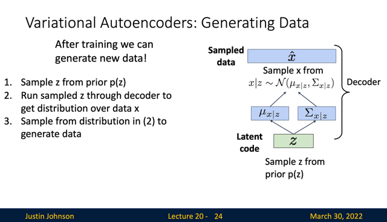</kbd></p>

> [!NOTE]
> Và khi đã train xong, ta có thể dùng VAE để tạo ra image mới. Bắt đầu bằng
> cách sampling một latent variable z từ prior distribution p(z) (*)
>
> Pass z vào decoder để có phân phối xác suất p(x|z) (chú ý nhé, nhắc lại, cả
> encoder và decoder để learn ra phân phối xác suất `-` với biểu hiện là output
> ra params (mean, cov matrix) của phân phối xác suất) để rồi ta sẽ sampling
> x từ đó `->` Đó là một generated image.
>
> Chỗ này (*) có thể cần chiêm nghiệm một chút **vì sao lại sampling từ p(z)**,
> vậy thì vai trò của encoder ở đâu.
>
> À thì bởi vì **encoder** lúc huấn luyện**được giao nhiệm vụ** là **học một
> phân phối xác suất của latent variable z** conditioned on input image x
> **q(z|x) sao cho đơn giản, bằng cách giữ nó `"giống"/gần` với p(z)**. Để rồi khi
> sampled từ q(z|x) ra một latent z, pass nó qua cho decoder, để nó dự đoán
> p(x|z)....
>
> Vậy phải hiểu thế này, **mấu chốt là ở chỗ encoder đã học một conditional
> distribution q(z|x) GẦN VỚI, GIỐNG VỚI p(z)**.
>
> Lúc training, ta cần Encoder dự đoán distribution DỰA TRÊN x để mà hướng
> dẫn, làn tiền đề cho decoder học một phân phối xác suất CŨNG DỰA TRÊN
> x MỘT CÁCH GIÁN TIẾP: Hãy để ý, encoder dự đoán q(z|x), rồi sampling từ
> nó ra z và đưa cho decoder dựa vào đó để dự đoán p(x|z) vậy thì phân phối
> xác suất này GIÁN TIẾP dựa vào x ban đầu, không phải sao. Thì như vậy
> nhiệm vụ tạo ra p(x|z) sao cho `p(x=image` ban đầu|z) cao mới hữu lý `-` mang
> ý nghĩa tái tạo.
>
> Nhưng khi training rồi, ta **không cần phải dùng encoder nữa**, vì**ta không
> cần phải dùng q(z|x), mà chỉ cần dùng ngay p(z)**. Vì như đã nói **q(z|x)
> được GIỮ CHO GẦN p(z)**, nên dù lúc train thì dùng q(z|x) nhưng lúc
> generating có thể dùng p(z) để sampling ra z.

<br>

<a id="node-1954"></a>

<p align="center"><kbd>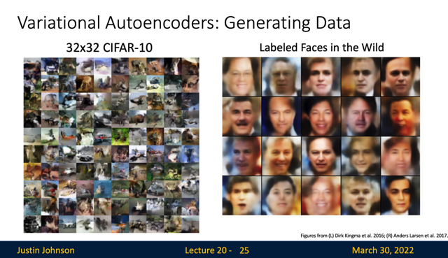</kbd></p>

> [!NOTE]
> một số kết qủa của VAE

<br>

<a id="node-1955"></a>

<p align="center"><kbd>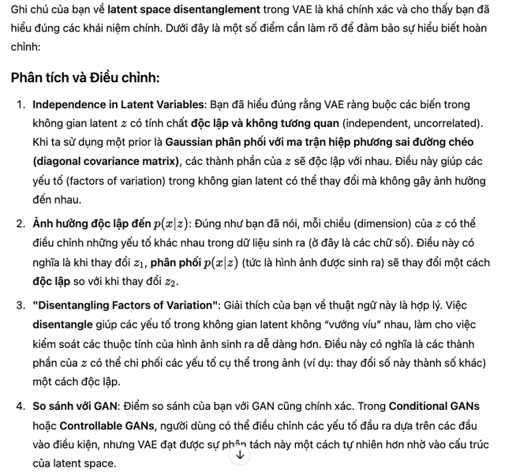</kbd></p>

<p align="center"><kbd></kbd></p>

<p align="center"><kbd>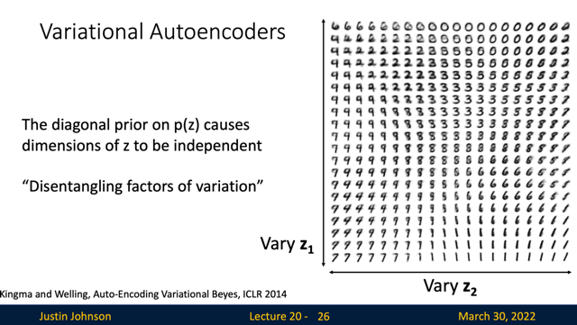</kbd></p>

> [!NOTE]
> đại khái là vì trong VAE, ta đã ràng **buộc latent distribution** có tính chất
> **independent**, **uncorrelated variable**, với các variable khác nhau của z,
> nó sẽ**ảnh hưởng đến distribution p(x|z) một cách độc lập.**
>
> Cái này hơi khó hiểu, nhưng đại khái là ví dụ z có 2 variable (dimension
> của latent space là 2, hay vector latent có 2 phần tử) z `=` (z1,z2). Khi
> ta cho z1 thay đổi thì distribution p(x|z) cũng thay đổi, để khi sampling
> các image cho thấy nó chuyển từ số 9 sang 7.
>
> Tương tự khi z2 thay đổi "nó chuyển từ số 7 sang số 1"
>
> Vậy ý nói là sao: Ý nói là, **các variable của z chi phối `/` có ảnh hưởng đến
> p(x|z) một cách hoàn toàn độc lập**, mà ở đây họ mô tả là "**disentangling**
> **factors of variation**" tạm hiểu là**những yếu tố tác động đến sự variation
> có tính chất riêng biệt, không rối rắm, vướng víu nhau** (disentangled)
>
> Nhờ vậy mà đây là một **ưu điểm rất rõ của VAE**, đó là **cho phép kiểm soát
> kết quả của generated image một cách dễ dàng**, **không bị rối.**
>
> Mình đã gặp về khái niệm này trong **GAN Specialization**, đặc biệt là bài
> conditional controllable GAN.

<br>

<a id="node-1956"></a>

<p align="center"><kbd>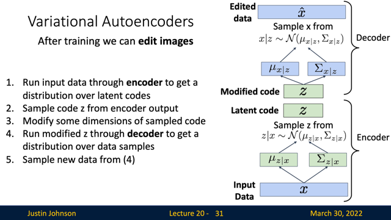</kbd></p>

> [!NOTE]
> Và một khả năng cũng rất hay mà VAE mang đến đó là khả năng cho
> phép sửa một bức ảnh. Thế thì cách thức sẽ là như vầy:
>
> Ta sẽ pass image cần sửa vào encoder `-` như đã biết, nó đã được train
> để predict một conditional probability distribution q(z|x) mà như đã nói,
> bị ràng buộc phải "gần" với simple prior distribution p(z)
>
> Thế thì với input x, ta có predicted distribution q(z|x), từ đó ta sẽ
> sampling ra latent variable z.
>
> Lúc này được nhiên có thể kì vọng ràng z sẽ "chứa đựng" những "tinh
> túy" (high level features) của image x. Để rồi nếu dùng nó pass qua
> encoder và sampling từ predicted distribution p(x|z), ta kì vọng có một
> image giống giống image ban đầu
>
> Thế thì bấy giờ nếu ta thay đổi z, giả sử bằng cách nào đó ta có thể biết
> được các phần tử khác nhau (các variable của z) tác động cụ thể đến
> khía cạnh gì của generated image, ví dụ phần tử thứ 2 của z kiểm soát
> việc khuôn mặt người có râu hay không, thì bằng cách thay đổi z[2] ta
> có  thể xóa râu hoặc thêm râu của bức ảnh ban đầu.

<br>

<a id="node-1957"></a>

<p align="center"><kbd>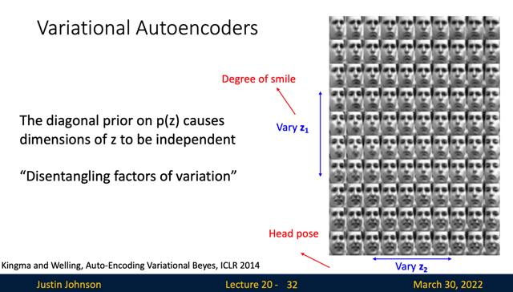</kbd></p>

> [!NOTE]
> như ví dụ ở đây, cho thấy khi thay đổi z1, sampled image thay đổi mức độ
> "cười" của khuôn mặt, và z2 thì thay đổi hướng khuôn mặt.
>
> Justin lưu ý là ta không biết trước, latent dimension nào sẽ gắn với đặc điểm
> gì, model sẽ tự học cái đó. Nhưng bằng cách thử nghiệm các kết quả sau khi
> train, ta có thể đoán biết được là model assign dimension của z với các khái
> niệm gì, đặc điểm nào.

<br>

<a id="node-1958"></a>

<p align="center"><kbd>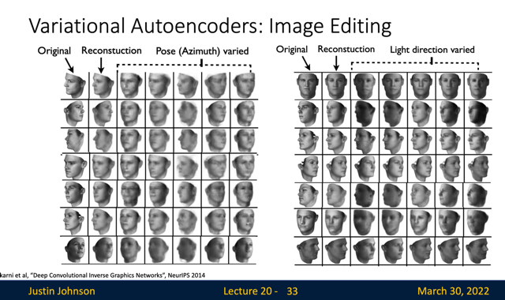</kbd></p>

> [!NOTE]
> một ví dụ khác.
>
> Nói chung điểm chính cần hiểu rằng, có thể thấy với VAE, ta phải
> deal với sự phức tạp hơn về mặt toán học, so với Autoregressive
>
> Nhưng phần thưởng là những khả năng và VAE mang lại như vừa rồi

<br>

<a id="node-1959"></a>

<p align="center"><kbd>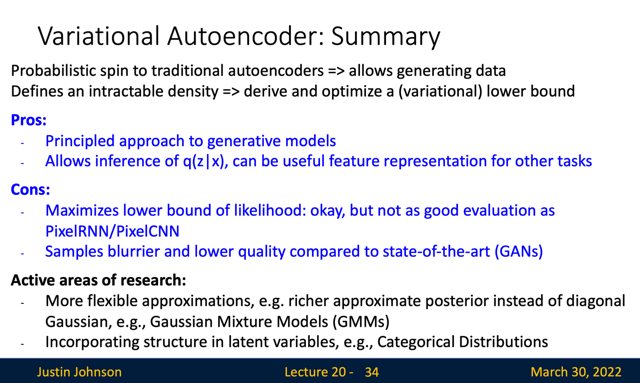</kbd></p>

> [!NOTE]
> tóm lại về VAE, ta có một cách tiếp cận mang tính chất là một
> probabilistic model so với autoencoders, nhờ đó đem lại khả năng cho
> phép generating data mới.
>
> về ưu điểm, nó là một cách tiếp cận có nguyên tắc giúp xây dựng một
> generative model tương đối bài bản.
>
> Và nó cho phép sử dụng q(z|x), vốn dĩ có thể giúp  tạo ra feature
> representation có thể đủ hữu ích đối với một số task
>
> Nhưng nhược điểm của nó là việc maximize lower bound của likelihood
> chưa thể coi là một cách thức tốt giúp tăng p(x)
>
> Và samples từ VAE có đặc điểm bị mờ, mà nguyên nhân Justin cho rằng
> là do cái rằng buộc đơn giản (diagonal Gaussian) về distribution p(z)
>
> Vẫn có nhiều nghiên cứu đang diễn ra để cải thiện cái này

<br>

<a id="node-1960"></a>

<p align="center"><kbd>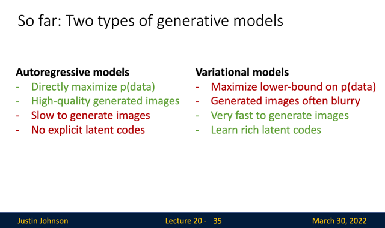</kbd></p>

> [!NOTE]
> tới đây ta đã biết hai loại generative models, và mỗi cái có ưu điểm riêng
> của nó:
>
> Autoregressive models thì có thể maximize trực tiếp p(x) thay vì phải gián
> tiếp thông qua maximize lower bound như VAE. Nó cũng có thể tạo ra các
> bức ảnh có chất lượng cao hơn, không bị mờ như VAE
>
> Nhưng bù lại nó lại có cách hoạt động chậm, khi phải generate tuần tự
> từng pixel và cũng không có khái niệm latent code như của VAE.
>
> Ngược lại, VAE có những hạn chế như nói trên, nhưng nó generate new 
> image rất nhanh vì không cần phải "làm tuần tự" (như đã biết, chỉ việc 
> sampling từ một multivariate predicted distribution p(x|z) có số dimension
> bằng số pixel, có nghĩa là một phát một ta có thể có ngay một image, đương
> nhiên vẫn phải bắt đầu bằng việc sampling một latent variable z, và pass
> qua cho encoder để nó cho ra predicted distribution p(x|z), nhưng sau đó,
> việc sẽ rất nhanh)
>
> Và điểm mạnh của VAE còn là học được một latent distribution giúp mang lại
> nhiều khả năng như nãy đã nói

<br>

<a id="node-1961"></a>

<p align="center"><kbd>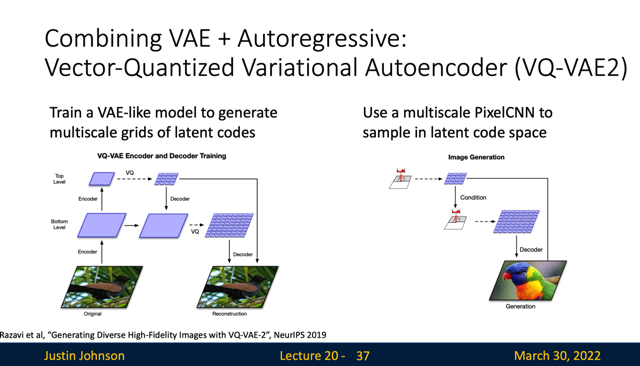</kbd></p>

> [!NOTE]
> và mô hình VQ VAE cố gắng kết
> hợp ưu điểm của cả hai.

<br>

<a id="node-1962"></a>

<p align="center"><kbd>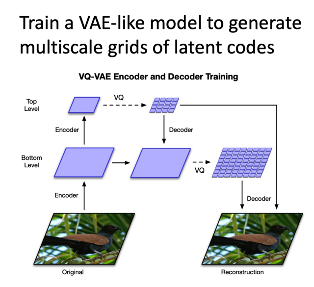</kbd></p>

> [!NOTE]
> Cái đầu tiên, cơ bản là giống VAE, nhưng thay vì generate một
> single latent feature z từ image x, nó sẽ generate một grid nhiều
> latent feature vector

<br>

<a id="node-1963"></a>

<p align="center"><kbd>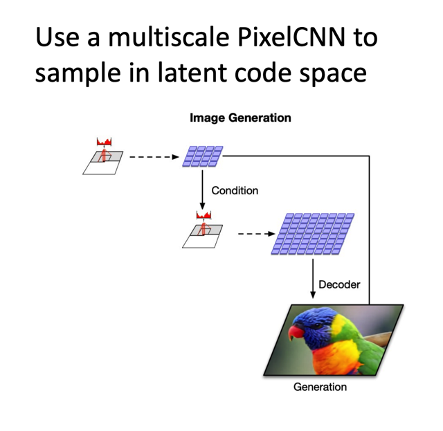</kbd></p>

> [!NOTE]
> và phần thứ hai nó sẽ như một
> PixelCNN (Autoregressive)

<br>

<a id="node-1964"></a>

<p align="center"><kbd>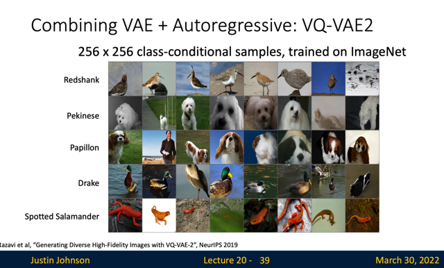</kbd></p>

<p align="center"><kbd></kbd></p>

<p align="center"><kbd>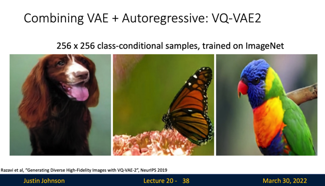</kbd></p>

> [!NOTE]
> Và kết quả của nó rất tốt
> image rất chân thật

<br>

<a id="node-1965"></a>

<p align="center"><kbd>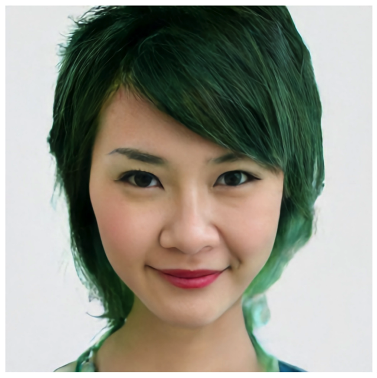</kbd></p>

<p align="center"><kbd>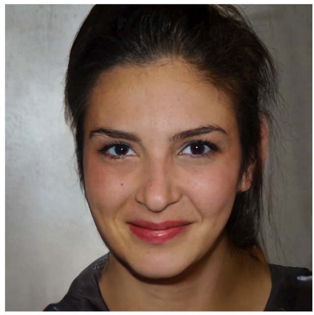</kbd></p>

<p align="center"><kbd></kbd></p>

<p align="center"><kbd></kbd></p>

<p align="center"><kbd>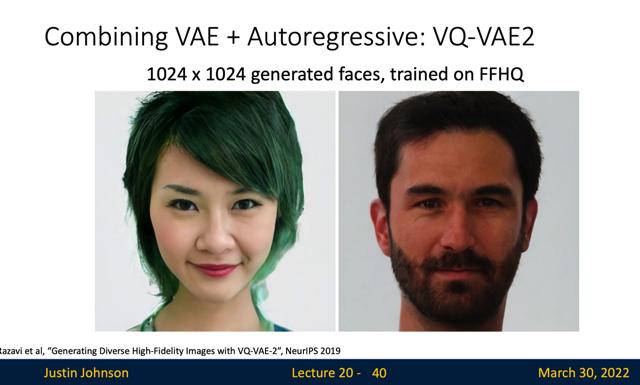</kbd></p>

> [!NOTE]
> và khả năng của nó với face image rất ấn tượng
>
> Lưu ý là tại thời điểm bài giảng thì cái này là state of the art, cái
> này ra sau GAN

<br>

