# Lecture 14/16 - Deep Reinforcement Learning

📊 **Progress:** `24` Notes | `29` Screenshots

---

<kbd>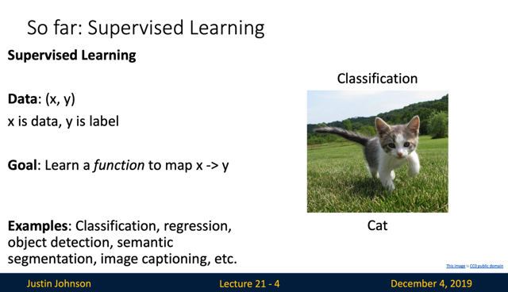</kbd>

> [!NOTE]
> Đại khái là ta đã biết 2 trụ cột quan trọng của Machine Learning là
> Supervised Learning và Unsupervised Learning

 

<kbd>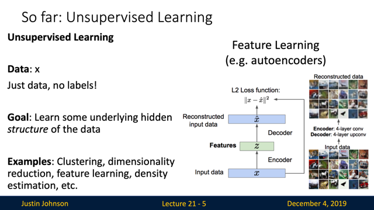</kbd>

 

<kbd>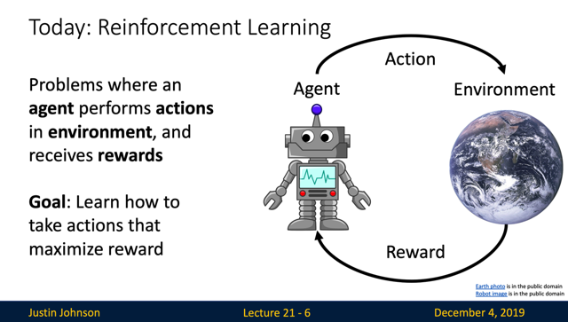</kbd>

> [!NOTE]
> Reinforcement learning là trụ cột thứ 3, ta
> sẽ học sâu về nó trong cs234n

 

<kbd>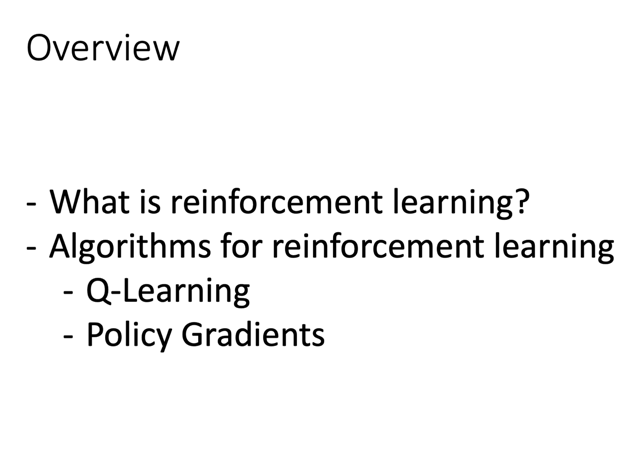</kbd>

 

<kbd>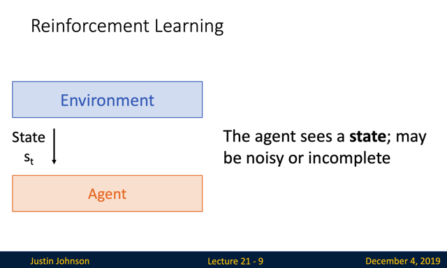</kbd>

> [!NOTE]
> đại khái là "State" sẽ cho (Agent)
> biết về trạng thái hiện thời của thế
> giới (Environment)

 

<kbd>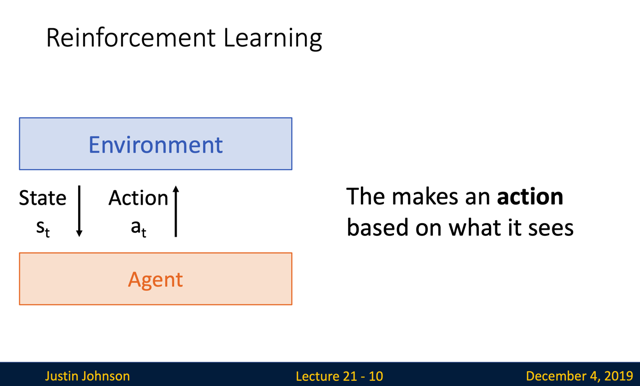</kbd>

> [!NOTE]
> Từ đó Agent thực hiện Action
> dựa trên những gì nó thấy

 

<kbd>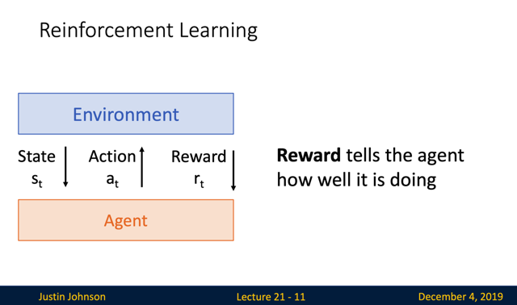</kbd>

> [!NOTE]
> Và Reward cho agent biết
> nó làm tốt tới đâu

 

<kbd>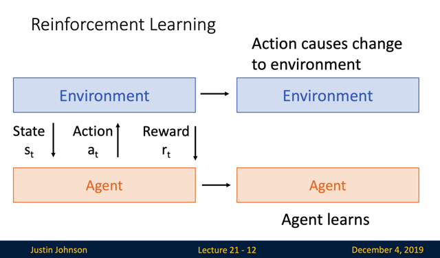</kbd>

> [!NOTE]
> Tuy nhiên mọi chuyện không chỉ vậy, khi Agent thực hiện
> action, nó đã tạo ra sự thay đổi tới environment. Và khi
> environment phản hồi agent bằng reward, cũng khiến agent
> thay đổi (agent đã học được gì đó)

 

<kbd>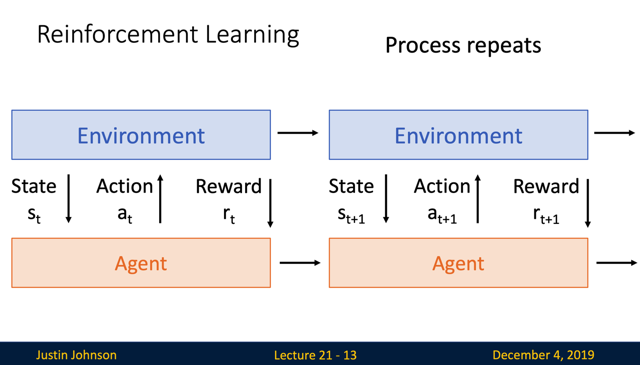</kbd>

> [!NOTE]
> và quá trình này
> cứ tiếp diễn

 

<kbd>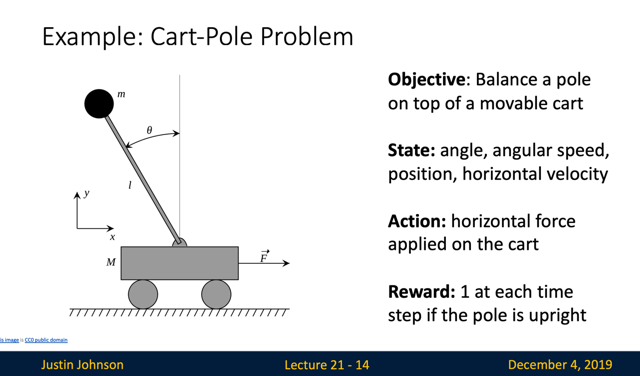</kbd>

> [!NOTE]
> Một ví dụ có thể dùng R.L là bài toán Cart-Pole: Đại khái là cái xe có cái
> cọc ở trên. Làm sao di chuyển cái xe qua lại giúp cái cọc đứng cân bằng
> được. Khi mô tả vấn đề bởi RL, ta sẽ có State là tất cả những thông tin
> về trạng thái hiện tại của hệ, như góc của cây cọc, vị trí của xe, vận tốc
> và hướng di chuyển....Còn action mà agent có thể thực hiện là kéo hay
> đẩy xe. Và reward sẽ là 1 nếu cọc đứng cân bằng, 0 nếu bị ngã

 

<kbd>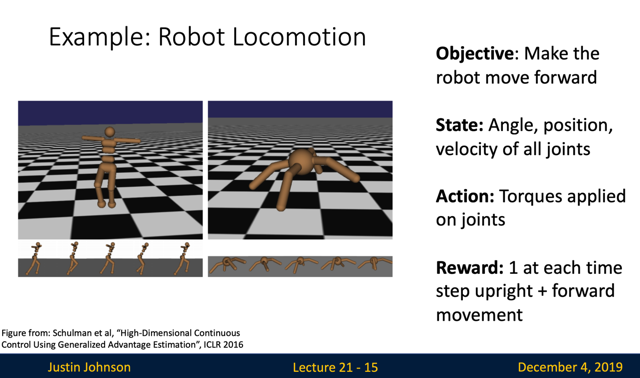</kbd>

> [!NOTE]
> Hay ví dụ này, nhiệm vụ là làm cho con robot di chuyển về phía trước
> State là angle, position...Action là các điều chỉnh cho khớp gối,...
> Thế thì reward sẽ thú vị ở chỗ, nó sẽ là 1 nếu con robot đứng thẳng và
> đi tới, còn nếu nó bò thì reward sẽ thấp hơn.

 

<kbd>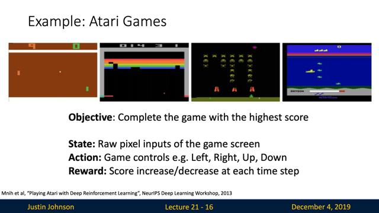</kbd>

 

<kbd>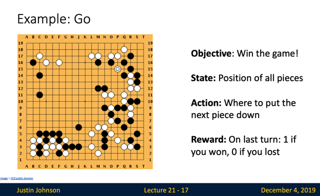</kbd>

> [!NOTE]
> GO là một thành công
> nổi tiếng của RL

 

<kbd>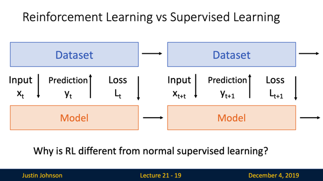</kbd>

<kbd></kbd>

<kbd>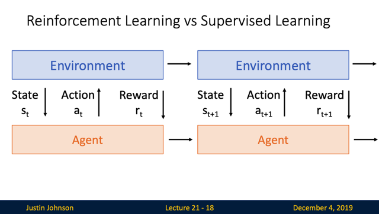</kbd>

> [!NOTE]
> đại khái là ta có thể suy ngẫm một chút để rồi thắc mắc là có vẻ như
> supervised learning cũng có thể diễn giải như RL: Trong đó
> Environment chính là dataset, Agent chính là model. Để rồi, dataset
> đưa input đóng vai trò của state cho model. Model sẽ đưa ra
> prediction đóng vai trò action. Từ đó dataset phản hồi lại reward dưới
> dạng loss function.
>
> Model sẽ dựa vào loss mà thay đổi, quá trình cứ lặp lại như vậy.
>
> Thế thì có nét giống nhau lắm chứ

 

<kbd>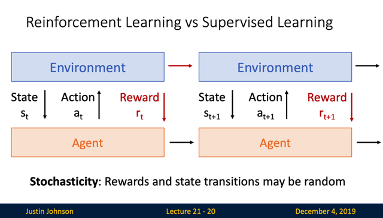</kbd>

> [!NOTE]
> Tuy nhiên sự khác nhau chính là Reward của RL có tính chất
> stochastic (ngẫu nhiên) cao - đại ý là, đối với S.L, loss function có
> tính chất determined hơn, còn reward thì không. Cùng một state
> nhưng có thể reward sẽ mỗi lúc mỗi khác. Và do đó RL phải deal với
> sự stochastic này

 

<kbd>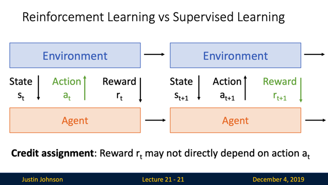</kbd>

> [!NOTE]
> Thứ hai, trong RL, agent nhận reward có thể không một cách trực
> tiếp, ý nói là nó có thể là hệ quả của các action trước đó rất lâu,
> giống như trong ví dụ GO - một nước đi đúng giúp thắng cuộc có
> thể xuất phát từ những bước đầu tiên rất lâu trước khi kết thúc ván
> cờ.

 

<kbd>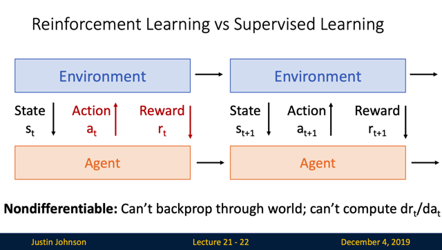</kbd>

> [!NOTE]
> Một vấn đề nữa là Non-differentiable: Đại khái là, nếu như trong
> supervised learning, để optimize model (train model), ta sẽ backprop
> để tính gradient của loss w.r.t model's params, từ đó dùng gradient
> descent để mà thay đổi model's params giúp loss giảm dần.
>
> Thì ở RL, nếu tiếp cận tương tự, ta sẽ phải tính derivative của Reward
> w. r.t agent, để dùng nó thay đổi agent (có thể là dùng gradient ascent
> để tăng reward lên). Có điều để làm vậy ta phải có một hàm số để tính
> reward và hàm số này sẽ dựa vào (hay nói cách khác, tính reward từ)
> state, và action. Vậy thì vấn đề là ta không có hàm số này, hoặc rất
> phức tạp nếu không muốn nói là không thể xây dựng một hàm số biểu
> diễn phản ứng (reward) của thế giới (environment) dưới tác động của
> agent action lên trạng thái hiện tại (state) được. Do đó không thể tính
> derivative của reward with respect to action để mà dùng nó thay đổi
> agent.

 

<kbd>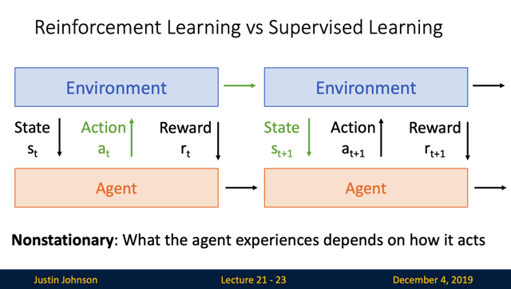</kbd>

> [!NOTE]
> đại khái là cái yếu tố thứ 4 mới chính là khác biệt quan trọng nhất
> giữa RL và Supervised Learning đó là: Tạm hiểu là trong SL, khi
> model học cách để trở nên tốt hơn, thì cơ bản là **nó không tác
> động gì dataset**, dataset kiểu như chỉ**nằm im một chỗ, không
> thay đổi, trong lúc model ngày càng tốt lên**, để dự đoán ngày cành
> chính xác hơn.
>
> Thì với RL, khi Environment phản hồi với Agent thông qua rewards
> giúp Agent học, thì**khi Agent tốt lên, nó tác động ngược lại tới
> environment thông qua action, thì sẽ khiến environment thay đổ**i.
> Do đó, environment không nằm yên một chỗ khi agent thay đổi,
> mà**nó cũng là một function phụ thuộc vào agent (thông qua
> action)**.
>
> Vấn đề này gọi là tính chất không tĩnh tại (**non-stationary)**Và vấn đề này còn xuất hiện trong GAN, khi tương tác giữa G và
> D cũng tạo ra trạng thái này.
>
> ===
>
> Tóm lại vì **4 tính chất stochasticity, non-differentiable, credit
> assignment , non-stationary** mà RL dù rất thú vị nhưng cũng **đầy
> thách thức**(cho việc training) hơn so với các trụ cột khác của
> machine learning.

 

<kbd>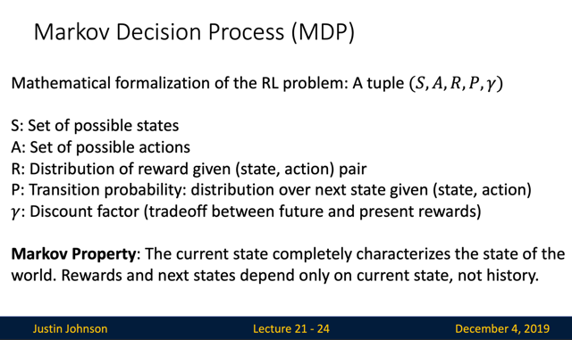</kbd>

> [!NOTE]
> Đại khái là công thức hóa về mặt toán học cho RL problem. Với
> Markov Property: cho biết đại khái là trạng thái hiện tại đã thể
> hiện đầy đủ mọi thông tin về thế giới, và trạng thái tiếp theo chỉ
> phụ thuộc vào current state.
>
> S là set các possible states
>
> A là set các possible actions
>
> R là distribution of reward mà environment dành cho cặp (state, action)
> Đại khái là phân phối xác suất quy định giá trị của reward mà environment
> dành cho một (state-action)
>
> P là transition probability: distribution over next state given (state, action)
> Đại khái là phân phối xác suất quy định giá trị của các cặp (state, action)
>
> Discount factor gamma

 

<kbd>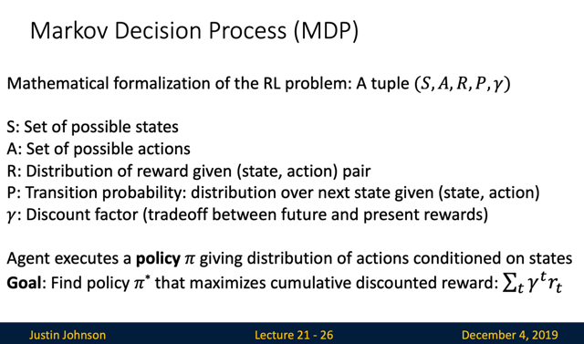</kbd>

> [!NOTE]
> Gamma giống như hệ số inflation factor - cho biết
> reward sẽ giảm dần nếu nhận ở hiện tại hay tương lai

 

<kbd>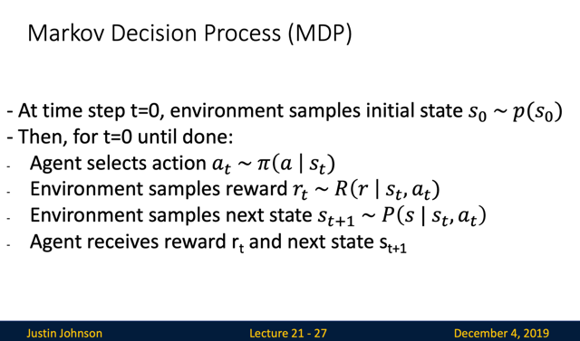</kbd>

> [!NOTE]
> ok, **bắt đầu là tại time-step t=0**, ta sẽ **sample một initial state s0 từ
> p(s0)**. sau đó, iteratively thực hiện các bước:
>
> Agent sẽ **chọn (sampling) một hành động a_t** từ **policy distribution**
> **pi(a|s_t)**đây có thể hiểu là **phân phối xác suất quy định giá trị của
> hành động a dựa trên giá trị hiện tại của state s_t**
>
> Environment sẽ **sampling reward r_t từ distribution R(r|s_t, a_t)**
>
> Environment sẽ**sample next state s_t+1 từ P(s|s_t, a_t)**
>
> Và Agent sẽ nhận reward r_t và state tiếp theo s_t+1

 

<kbd>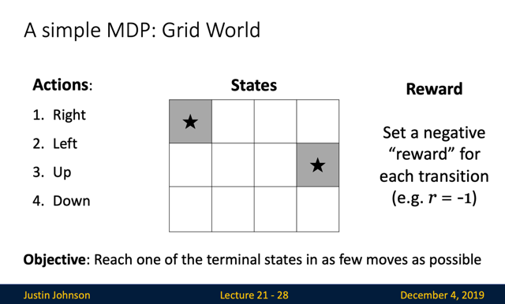</kbd>

> [!NOTE]
> đại khái là ví dụ này, trong đó states là 12 ô này, trong đó có 2 ô có
> sao. Actions có 4 loại. Và reward thì sẽ là âm 1 cho mỗi transition.
> Objective là đi đến ô có sao với ít move nhất

 

<kbd>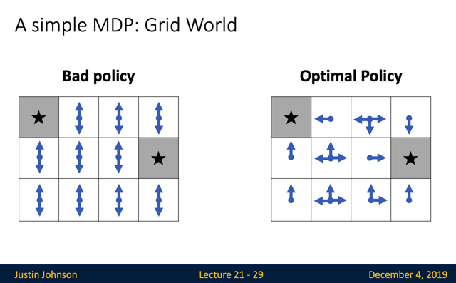</kbd>

> [!NOTE]
> và đây là ví dụ của bad
> và optimal policy.

 

<kbd>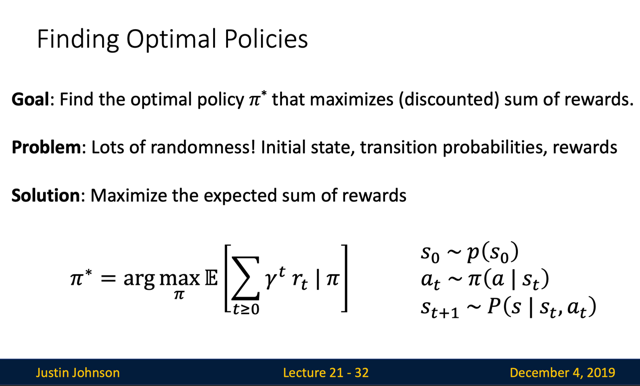</kbd>

> [!NOTE]
> mục tiêu sẽ là**tìm một policy pi*** sao cho**tối đa hóa sum rewards**.
> Thế thì bởi vì **có nhiều randomness** như initial state, transition
> probabilities, reward. Nên ta sẽ **maximize expectation** (như trung bình,
> giúp khử đi sự random) của**sum rewards**.
>
> Công thức có thể hiểu rằng: Ta sẽ**tìm một policy pi**(là phân phối xác
> suất quy định với một state s thì action a sẽ là gì), sao cho, **khi làm các
> bước hồi nãy**, thì t**ổng reward** (sau khi đã nhân với hệ số discount)
> **sẽ có giá trị kì vọng lớn nhất.**

 

<kbd>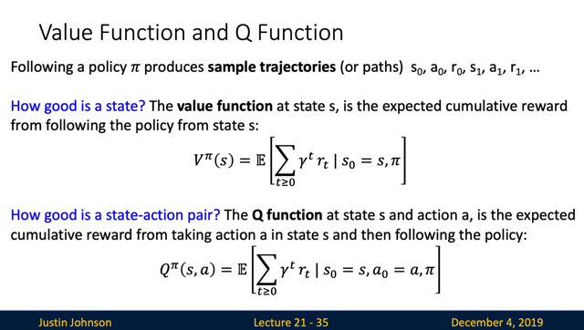</kbd>

> [!NOTE]
> Nói về **value function** và **q function**.
>
> Value function của s - **V_pi(s)** cho biết **khi bắt đầu với state s** và
> **tuân theo policy pi**, thì sau này, **giá trị kì vọng của tổng discounted
> reward là bao nhiêu**
>
> Nôm na là, nó cho biết **với một state s nào đó**, thì ta**có thể kì vọng có
> được nhiều reward cỡ nào**, nếu mình bắt đầu với state s đó, tức là cho s0
> = s
>
> Còn **q function tại state s và action a Q_pi(s, a)**, sẽ cho biết,**nếu bắt
> đầu với state s** **và action a** thì sau này,**giá trị kì vọng của tổng
> discounted reward là bao nhiêu**.
>
> Hiểu nôm na cái q cũng tương tự, nó cho biết với một cặp state-action s-a,
> thì gỉa sử ta bắt đầu bằng state s này và thực hiện hành động đầu tiên là
> action a này, thì ta sẽ kì vọng có được reward nhiều hay ít ra sao

 

<kbd>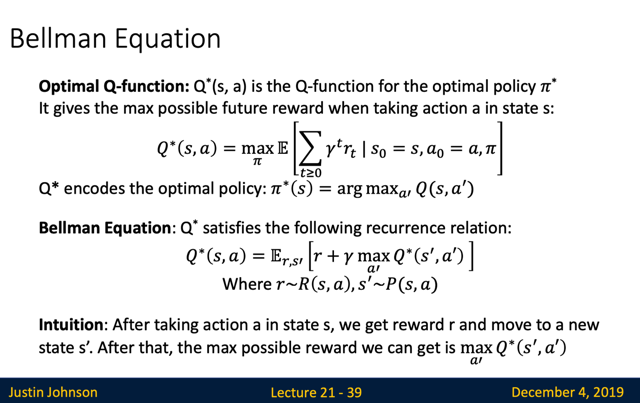</kbd>

> [!NOTE]
> Thế thì, Q*(s, a) là cái function Q(s, a) ứng với pi mà có giá kì vọng cao
> nhất.
>
> Thành ra mới nói Q* cũng chính là ứng với cái pi* bởi vì pi* như định
> nghĩa hồi nãy, đó là cái policy giúp tối đa được giá trị kì vọng của
> reward.
>
> Nên mới có pi*(s) là argmax Q(s, a'): mang ý nghĩa là, **trong những
> hành động được generate bởi policy distribution pi** thì **nếu pi nào mà
> khiến cho giá trị của Q(s,a) lớn nhất**, đó sẽ là **pi***Rồi, cái Bellman equation đại khái là: Nếu mình **bắt đầu với state s
> và thực hiện action a**, và **nhận một reward r**, để rồi **state mới là s'**, và sau đó **nếu ta tiếp tục hành động theo cách tối ưu với policy pi***
> thì khi đó, ta sẽ có phương trình Bellman cho biết:
>
> **reward tốt nhất mà ta có được khi bắt đầu với state s và action a - thể
> hiện bằng Q*(s, a)** sẽ cũng bằng kì vọng của [ r + reward lớn nhất mà
> ta có được khi thực hiện action a' khi từ state s' theo optimal policy pi* ]

 

<kbd>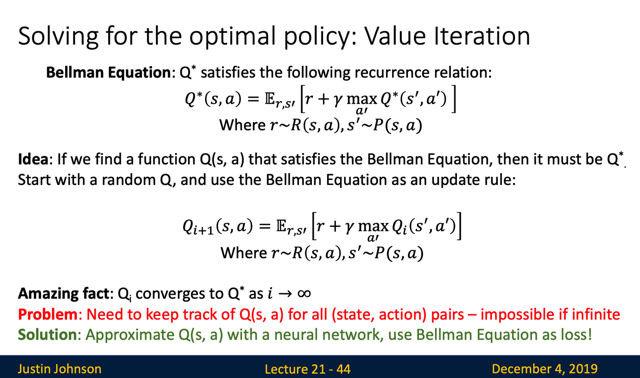</kbd>

> [!NOTE]
> Thế thì Bellman equation có đặc điểm là, nếu function Q mà
> thỏa Bellman equation thì nó chính là optimal function Q*

 

