# Lecture 14/16 - Generative Models Ii

📊 **Progress:** `45` Notes | `54` Screenshots

---
<a id="node-1967"></a>

<p align="center"><kbd>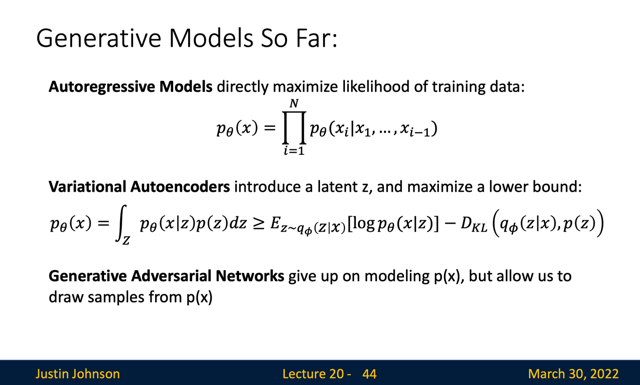</kbd></p>

> [!NOTE]
> Ok, để dẫn nhập vào GAN, thì ta lướt lại các mục tiêu khi xây dựng các
> generative model trước:
>
> Thế thì, trong cả **Autoregressive** và **VAE**, ta đều **muốn học** được
> **probability distribution over x p(x)** **hoặc p(x|z)** để **từ đó**, **sampling
> ra new image x** với hi vọng có được image x có likelihood cao.
>
> Vậy thì với **Autoregressive**, ta đặt objective là **maximize likelihood
> p(x)** còn với **VAE** thì ta **chỉ có thể làm gián tiếp** bằng cách
> **maximize lower bound** của **p(x|z)** như đã biết.
>
> Nhưng nói chung là ta **đều muốn có một distribution over image x** để từ
> đó sampling.
>
> Còn với GAN, ta **không còn quan tâm distribution này**, nói đúng hơn là ta
> không còn quan tâm đến dạng (likelihood function) cụ thể mà **chỉ cần làm
> sao đó có thể sampling**, generate new image mà thôi.
>
> Vậy thì cách tiếp cận của GAN như thế nào để mà không cần distribution
> mà vẫn cho phép sampling.

<br>

<a id="node-1968"></a>

<p align="center"><kbd>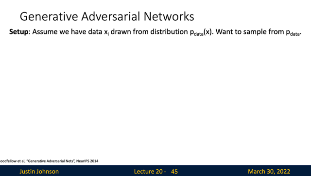</kbd></p>

> [!NOTE]
> Đầu tiên với GAN, người ta sẽ **giả định rằng**, **các image `x_i` thu thập được**,
> hay chụp được, ý nói các tấm ảnh thực, chụp hay lưu giữ một hình ảnh thực
> tế nào đó của thế giới...thì ta **giả định rằng chúng được sampled từ một
> distribution p_data(x)**
>
> Có nghĩa là **p_data(x)** này là một **phân phối xác suất nào đó của Chúa**, của
> tự nhiên, để **quy định rằng**, **các giá trị của image pixel như thế nào** đó thì sẽ
> có **khả năng cao là một bức hình "thực"**

<br>

<a id="node-1969"></a>

<p align="center"><kbd>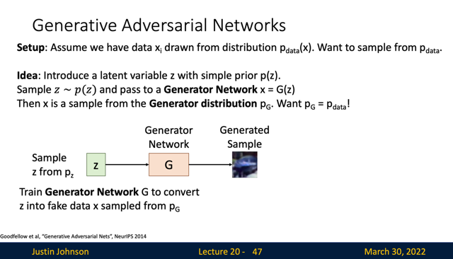</kbd></p>

> [!NOTE]
> Để **bắt đầu** ta cũng sẽ**đưa vào một latent variable z**, được **assume** rằng
> **tuân theo một phân phối xác suất đơn giản p(z)** có thể là **uniform
> distribution** hoặc **diagonal Gaussian distribution** (cái này giống VAE)
>
> Và ta sẽ **pass z vào một neural network**, gọi là **Generator network G(z)**.
>
> Thế thì, ý tưởng quan trọng thứ nhất đó là, ta sẽ **cho rằng G**, **bên trong nó
> sẽ tìm cách học một phân phối xác suất**dự đoán ước lượng của `p_data`
> để rồi sau đó nó**sampling ra một sample mới x `=` G(z)**. Khi nói ta "cho
> rằng", có nghĩa là ta **không quan tâm chuyện gì xảy ra bên trong**, cái
> distribution dự đoán của nó như thế nào ta không cần biết, ta **chỉ coi như x**
> output từ G **là một sample lấy từ một implicit distribution** mà G nó dự đoán
> về `p_data.` Mình có thể kí hiệu để gọi cái implicit distribution này là **p_G**,
> nhưng nhắc lại là **ta sẽ không biết nó có hình thù như thế nào**.
>
> Tuy nhiên, vì ta **xem như G đang cố gắng học cách ước lược p_data**, nên ta sẽ
> muốn p**_G `~=` p_data**

<br>

<a id="node-1970"></a>

<p align="center"><kbd>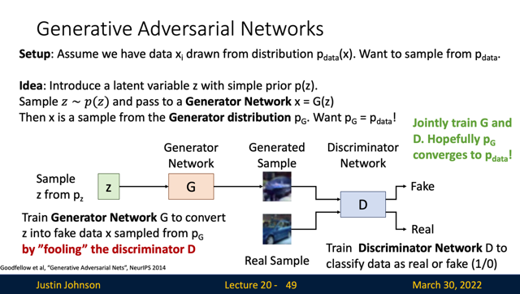</kbd></p>

> [!NOTE]
> Để làm vậy ta sẽ **JOINTLY** **train một Discriminator network** `-` là một
> **binary** **classifier** `-` trên cả **sampled (generated) image** và**real
> image** với nhiệm vụ là p**hân biệt đâu là real (1), đâu là fake (0)**
>
> Vậy lúc training, sẽ kiểu như **hai cái sẽ cạnh tranh nhau**, để rồi**G cố
> gắng tạo ra sample** sao cho**đánh lừa được D** và **D thì cố gắng phân
> biệt** được đâu là **thật**, đâu là **giả**.
>
> Và ta sẽ kì vọng là, bằng cách huấn luyện như vậy, **Generator**, một cách
> **NGẦM ẨN** bên trong nó sẽ **học được như thế nào là data distribution**, hay
> nói cách khác, **p_G `~=` p_data**. Và khi đó, các generated image từ G sẽ có
> thể rất giống như đến từ `p_data` tức là đến từ "thế giới thực"

<br>

<a id="node-1971"></a>

<p align="center"><kbd>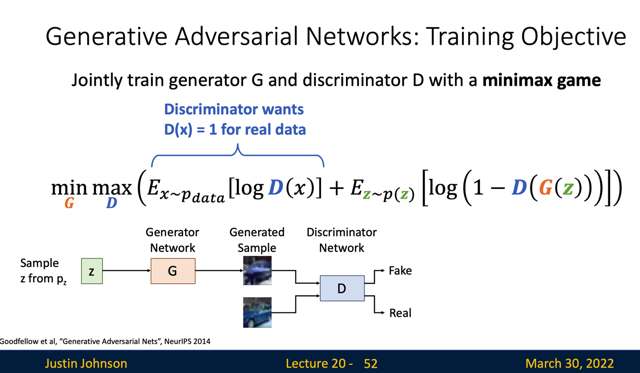</kbd></p>

> [!NOTE]
> **Objective của GAN** thể hiện qua công thức này:
>
> Đầu tiên cái **vế 1** đại khái là có thể hiểu như sau: nó **nằm trong max
> D** (...) nên mang ý nghĩa là **Discriminator** sẽ muốn**tối đa hóa giá trị kì
> vọng của log D(x)** với **x được sampled từ "real" data distribution
> p_data** (mà ta đã giả định ban đầu, rằng mọi hình ảnh "thực" đều đến
> từ `/` chi phối bởi một phân phối xác suất tự nhiên `p_data).`
>
> Thế thì cái này có ý nghĩa là: Ta có thể thấy, hay có thể hiểu **D(x) là log
> likelihood bởi D** **đối với một real image x**:
>
> D(x) chính là **giá trị likelihood dự đoán mà D gán cho một real image x**.
> Và vì ĐÂY LÀ **REAL IMAGE**, và VÌ **TA D MUỐN HỌC ĐƯỢC REAL
> IMAGE là như thế nào**, hay nói cách khác **MỘT CÁCH NGẦM ẨN**
> (implicitly) TA CŨNG **MUỐN D HỌC ĐƯỢC REAL DATA DISTRIB là như
> thế nào**. Do đó, ta muốn MAXIMIZE LIKELIHOOD (dự đoán bởi D) của
> một real image `=` chính là **maximize log D(x)**. (Còn log, như đã biết, chỉ là 
> một trick để **giúp việc training thuận lợi** hơn khi giúp triệt tiêu "yếu tố"
> exponential để ta có một hàm loss có tính tuyến tính, giúp đem lại tính chất
> có gradient ổn định có lợi cho training process)
>
> Còn nói theo lối **nôm na** hơn, thì **đặt mục tiêu cho D** (train D params để
> maximize term này) sẽ chính là**yêu cầu D phải HỌC CÁCH** BIẾT ĐƯỢC
> NHỮNG**REAL IMAGE SẼ "TRÔNG NHƯ THẾ NÀO"**, hay nói trong bối
> cảnh của một binary classification thì những image như thế nào thì nên
> được classify là real, là 1 (target)

<br>

<a id="node-1972"></a>

<p align="center"><kbd>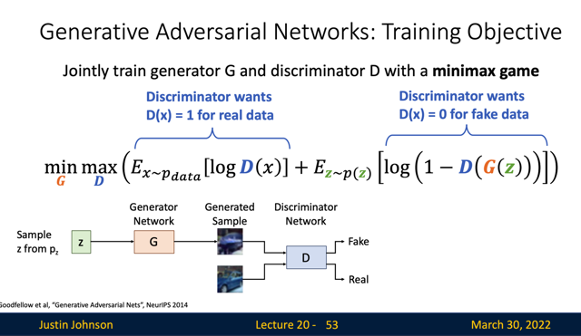</kbd></p>

> [!NOTE]
> còn vế thứ hai mà D muốn **maximize**, có thể hiểu là ta**sẽ sampling z**
> (latent variable) từ một **prior distribution p(z)** như đã biết, sau đó **pass z
> qua cho G** để có **G(z) mang ý nghĩa là một sample được sampled từ một
> implicit distribution** nào đó mà ta **cho rằng G một cách ngầm hiểu là đang
> tìm cách học cái distribution p(x|z) này.**
>
> Và với sample đó, **pass qua cho D**, thì **vì đây là fake image**, nên ta **muốn
> D dự đoán likelihood cho nó thấp** (để maximize log `(1-D(G(z))` thì nó phải
> minimize D(G(z)).
>
> Nói theo bối cảnh bài toán binary classification thì ta**muốn nó học được
> image như này G(z)** thì là **negative class (0)**.
>
> Vậy thì đối với D, một cách nôm na là **nó được dạy như thế nào là image
> thật** x ~ `p_data,` và như **thế nào là image fake G(z)**

<br>

<a id="node-1973"></a>

<p align="center"><kbd>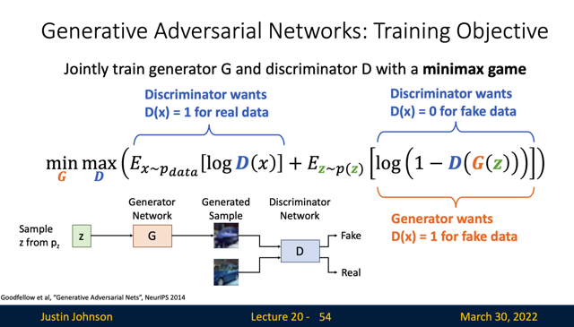</kbd></p>

> [!NOTE]
> Còn với G, nó sẽ muốn minimize cái cụm này, nhưng nó sẽ**chỉ
> control được vế thứ 2**, và **để minimize vế này**, nó sẽ phải adjust
> parameters của mình sao cho **D(G(z)) cao** (thì log `(1-D(G(z))` sẽ
> thấp)
>
> Và bằng cách đó, nó **sẽ phải cố gắng mà học được, hiểu được
> cái real distribution `p_data` như thế nào** để rồi khi sampling từ
> phân phối xác suất ước lượng đó `p_G,` ra G(x) thì **D sẽ thấy nó
> có likelihood D(G(x)) cao**. 
>
> Chú ý nhắc lại rằng,**ta không biết `p_G` như thế nào**, mà chỉ coi 
> như G(x) là **KẾT QUẢ NGẦM HIỂU ĐƯỢC SAMPLED TỪ p_G**,
> và bản thân với **p_G**,  ta CŨNG **NGẦM HIỂU LÀ PHÂN PHỐI
> XÁC SUẤT MÀ G ĐANG TÌM CÁCH ƯỚC LƯỢNG p_data**

<br>

<a id="node-1974"></a>

<p align="center"><kbd>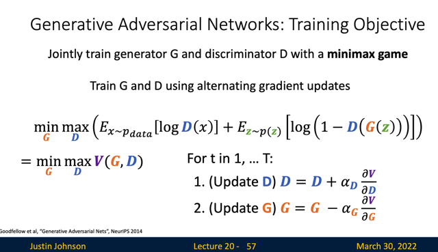</kbd></p>

> [!NOTE]
> Và quá trình training sẽ là **training cùng lúc cả D và G**. Trong mỗi iteration,
> ta sẽ **tính gradient của objective function w.r.t D** để  **update D** theo hướng
> t**ăng objective lê**n (gradient ascent)
>
> và sau đó **dùng gradient của objective function w.r.t G**để **update G** sao cho
> **giảm objective xuống** (gradient descent)
>
> Nói chung là nói theo kiểu trên cũng được mà diễn giải theo cách thông
> thường, bằng cách**tạo discriminator loss và generator loss** cũng được

<br>

<a id="node-1975"></a>

<p align="center"><kbd>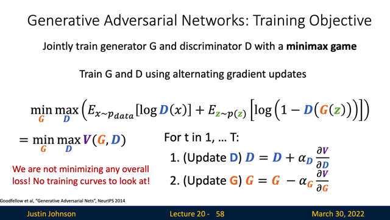</kbd></p>

> [!NOTE]
> Thế thì vấn đề với GAN đó là, với các bài toán khác của deep learning, ta
> có một cái loss tạm gọi là đơn giản mà ta muốn thấy nó giảm khi training.
> Thế nhưng với GAN, **ta có hai cái objective** này, hay nói theo loss thì **hai cái
> loss nó phụ thuộc một cách phức tạp với nhau**. Tại sao nói vậy?
>
> Bởi lẽ **loss của G** sẽ là một function phụ thuộc D (có bước tính D(G(z))
> nên **có thể coi nó cũng phụ thuộc loss của D** (bởi loss của D giảm tức là
> D thay đổi, mà D thay đổi thì dù G(z) không đổi D(G(z)) cũng sẽ thay đổi).
>
> Ngược lại trong nếu loss của G thay đổi tức là G thay đổi, thì cũng khiến
> loss của D thay đổi.
>
> Nói chung có thể hiểu hai cái loss nó phụ thuộc một cách phức tạp lẫn
> nhau. Thành ra, việ**c training mô hình GAN tỏ ra thách thức hơn** các bài
> toán khác. Và cũng vì vậy ta sẽ **không có mô tuýp thông thường là thấy
> loss tổng giảm dần để mà giúp ta hiểu mọi chuyện có đang tốt hay không**

<br>

<a id="node-1976"></a>

<p align="center"><kbd>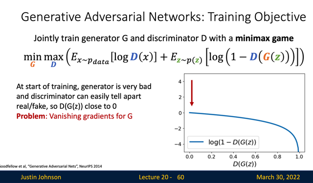</kbd></p>

> [!NOTE]
> Một vấn đề khác của training GAN, đó là, **khi bắt đầu training**, G đương
> nhiên lúc này "**chưa học được gì**", dẫn đến **G(z) cơ bản là random noise**
> **image** mà ta có thể nói vui là "**rõ một một là đồ giả**"
>
> Và với D thì **dù ban đầu cũng chưa học được gì**, nhưng **sau vài iteration**,
> nó **cũng bắt đầu học được chút xíu** thì lúc đó nó cũng**đủ để đưa ra dự
> đoán** cho một fake image "rõ mồn một là fake" ở trên.
>
> Điều đó có nghĩa là,**trong giai đoạn đầu, rất dễ dàng để D nhận diện
> fake image**, nên **D(G(z)) rất thấp (~=0)**, và dẫn đến **log `(1-D(G(z))`
> `~=log(1)` `~=` 0**. Mà đây là vế dính tới **loss hay gradient của cả D và G,
> nếu nó `~=` 0** thì đương nhiên gradient cũng `~=0.` 
>
> Có thể thấy trong đồ thị vẽ hàm f `=` log `(1-D(G(z))` theo D(G(z) ta có độ dốc 
> của hàm f `=` log `(1-D(G(z))` rất nhỏ khi D(G(z) `=` 0
>
> (Với D thì còn vế bên kia, còn G chỉ phụ thuộc vế này)
>
> Do đó, ở đây ta lại gặp vấn để **vanishing gradient** khi cản trở việc học
> của G.

<br>

<a id="node-1977"></a>

<p align="center"><kbd>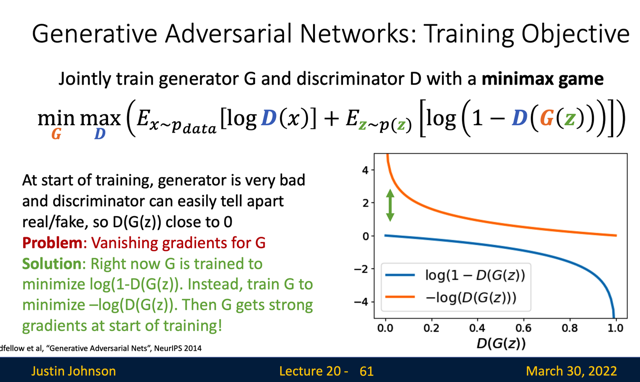</kbd></p>

> [!NOTE]
> Giải pháp đó là **thay vì 
>
> minimize log(1-D(G(z))** ta sẽ 
>
> **minimize -log(D(G(z)))**
>
> tương đương **maximize log(D(G(z)))**
>
> Về **mặt ý nghĩa thì cũng như nhau**, đó là vẫn đặt ra nhiệm vụ cho G
> là phải tạo ra sample G(z) sao cho D(G(z)) cao (thì `-log(D(G(z))` mới
> thấp) 
>
> Nhưng cách làm trên giúp khắc phục hiện tượng này là**bởi ban đầu D(G(z))
> có bằng 0 thì `-log(D(G(z))` `=` `-log(0)` sẽ vẫn lớn. Ta có thể thấy đồ thị hàm 
> số `-log(D(G(z))` theo D(G(z) sẽ có giá trị `+infinity` khi D(G(z)) `=` 0, giúp
> gradient không bằng 0, thuận lợi cho việc training**

<br>

<a id="node-1978"></a>

<p align="center"><kbd>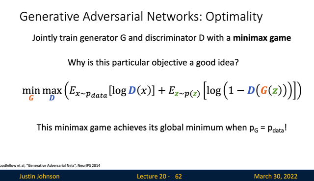</kbd></p>

> [!NOTE]
> phần tiếp theo sẽ**triển khai objective function** này để**làm rõ hơn
> cơ sở toán học của nó**, giải thích cho lí do chọn function như này

<br>

<a id="node-1979"></a>

<p align="center"><kbd>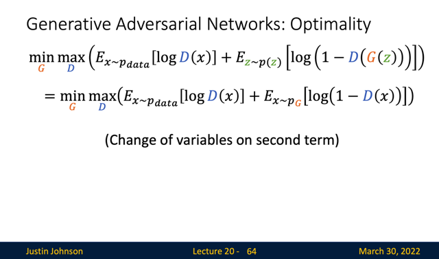</kbd></p>

> [!NOTE]
> Đầu tiên thay `E` **z~p(z)** `[log(1-D(G(z))]` bởi `E` **x~p_G** `[log(1-D(x))]`
>
> Lí do là bởi như đã nói, ta coi như **ngầm ẩn bên trong**, G đang học
> **dự đoán p_G(x)** `-` là nỗ lực ước lượng được phân phối xác suất thực, 
> tự nhiên  của image mà ta kí hiệu là  `~=` **p_data(x)**, và ta cũng xem 
> như `x=G(z)` là một sample sampled từ distribution dự đoán đó `p_G`
>
> (Có thể hiểu sát hơn nữa thì nó là phân phối xác suất của x dựa trên 
> latent variable z)
>
> Vậy nên có thể **xem như vế 2 là expectation của `log(1-D(x))` với x là
> các sample được sampled từ p_G**

<br>

<a id="node-1980"></a>

<p align="center"><kbd>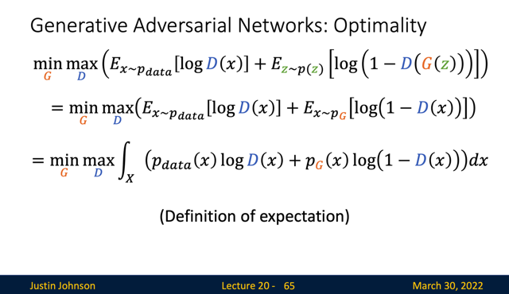</kbd></p>

> [!NOTE]
> Kế tới ta sẽ **thay công thức của expectation** vào.
>
> Với **discrete variable X** có các **possible value x1, x2, x3** tuân 
> theo phân phối xác suất p(X) thì **E X~p(x) [f(X)]** tính bằng 
>
> **p(X=x1)*f(X1) `+` `p(X=x2)*f(X2)` `+` p(X=x3)*f(X3)**
>
> Còn với X là continuous variable thì ta sẽ dùng **tích phân**:
>
> tích phân **trên miền giá trị của X** p(x)*f(x)*dx
>
> Do đó ở đây có thể hiểu 
>
> ```text
> E x~p_data [log D(x)] = tích phân p_data(x)*log D(x)*dx
> ```
>
> ```text
> và E x~p_G log(1-D(x)) = tích phân p_G(x)*log(1-D(x))*dx
> ```
>
> **Gom hai vế trong tích phân** (vì đều theo biến x mà) `-` không có gì
> khó hiểu chỗ này, vì **vế đầu** ta nói image **x được lấy từ real image
> distribution p_data**. Còn **vế sau** ta cũng đang xét các image x, nhưng
> **lấy từ một distribution khác là p_G**. Đều là image, đều là x cả.

<br>

<a id="node-1981"></a>

<p align="center"><kbd>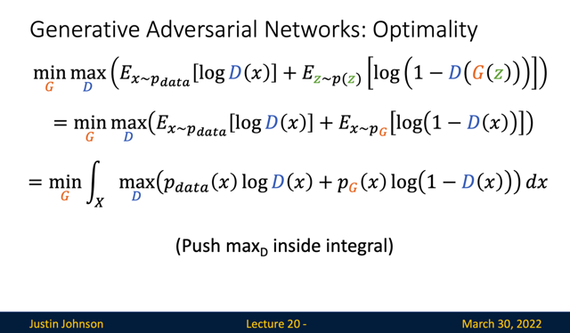</kbd></p>

> [!NOTE]
> tới đây họ **đưa `"max_D"` vào trong dấu tích phân**. Là sao nhỉ?
>
> Lấy lại ví dụ về **discrete var x**
>
> max f `E` [f(x)] `=` **max** f { `p(X=x1)*f(X1)` `+` `p(X=x2)*f(X2)` `+` `p(X=x3)*f(X3)` }
>
> Diễn giải là**tìm f sao cho `E` [f(x)] lớn nhất**thì khi đó `E` [f(x)] là bao nhiêu
>
> Vậy thì, theo GPT, cung cấp cho ta một cơ sở đó là**nếu hàm số mục tiêu
> có thể biểu diễn dưới dạng tổng các thành phần độc lập** thì có thể **tối ưu
> hóa từng thành phần**
>
> Do đó **muốn tìm f khiến 
>
> `p(X=x1)*f(X1)` `+` `p(X=x2)*f(X2)` `+` `p(X=x3)*f(X3)` lớn nhất**
>
> thì **phải tìm f khiến: 
>
> i) `p(X=x1)*f(X1)` lớn nhất** 
>
> **ii) `p(X=x2)*f(X2)` lớn nhất**
>
> **iii) `p(X=x3)*f(X3)` cũng lớn nhất**
>
> Do đó, sẽ bằng: (**đưa max vào trong tích phân**)
>
> ```text
> = max f [p(X=x1)*f(X1)] + max f [p(X=x2)*f(X2)] + max f [p(X=x3)*f(X3)]
> ```

<br>

<a id="node-1982"></a>

<p align="center"><kbd>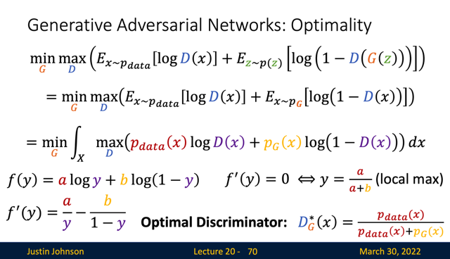</kbd></p>

> [!NOTE]
> Rồi, tiếp ta sẽ **xét riêng cái vế trong dấu tích phân**:
>
> ```text
> max D [ p_data(x)*log D(x) + p_G(x)*log(1-D(x)) ]
> ```
>
> Thì, ta sẽ **có thể tìm D sao cho cái vế này max ở đây luôn** (để rồi **cùng với
> dấu tích phân** sẽ mang ý nghĩa là**tổng tất cả các gía trị của cái vế này với
> mọi x** mà **tại mỗi giá trị của x, D đã được tối ưu**.
>
> Vậy thì xét hàm **f(y) `=` a*log(y)+b*log(1-y)**, có thể **giải phương trình f'(y) `=` 0**
> để **tìm y sao cho f(y) có giá trị lớn nhất**, trong đó f'(y) tính dễ vì chỉ là  một cái
> tổng, và sử dụng công thức đạo hàm log'(x) `=` `1/x.`
>
> Do đó, tương tự ta cũng cũng có thể tính ra D khiến f(D) `=`  `p_data(x)*log` D(x)
> `+` `p_G(x)*log(1-D(x))` lớn nhất, kí hiệu là D*
>
> Để từ đó ta có:
>
> **D*(x) `=` `p_data(x)` `/` `[p_data(x)` `+` p_G(x)]**
>
> *Justin chú ý là ta có công thức D* nhưng không tính được vì cả `p_data` và
> `p_G` ta đều không biết

<br>

<a id="node-1983"></a>

<p align="center"><kbd>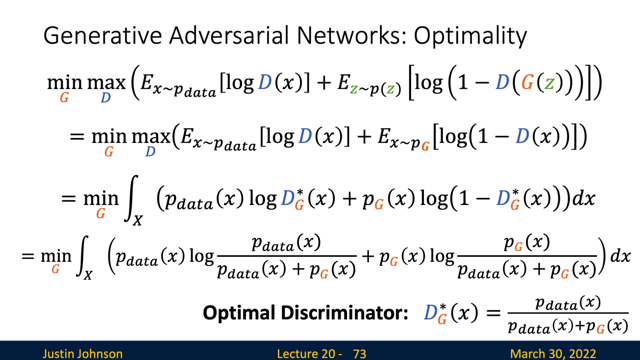</kbd></p>

> [!NOTE]
> Thế thì khi lắp D* vào đương nhiên ta**đã "giải" được bài toán tối
> ưu**của D , nên sẽ **không còn dấu max D nữa**

<br>

<a id="node-1984"></a>

<p align="center"><kbd>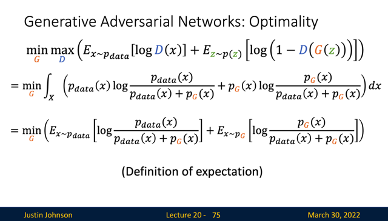</kbd></p>

> [!NOTE]
> Tiếp theo ta sẽ **làm ngược lại** hồi nãy (dùng công
> thức của expectation triển khai ra), **viết lại thành
> dạng expectation**

<br>

<a id="node-1985"></a>

<p align="center"><kbd>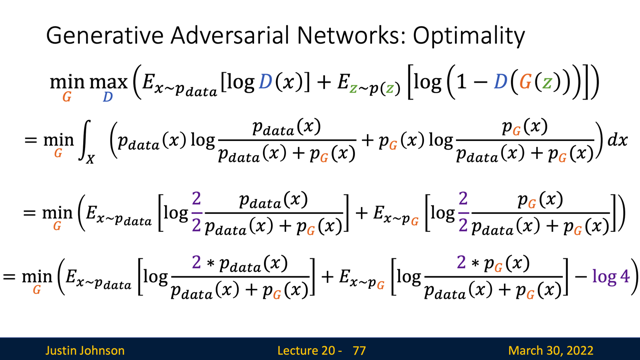</kbd></p>

<p align="center"><kbd></kbd></p>

<p align="center"><kbd>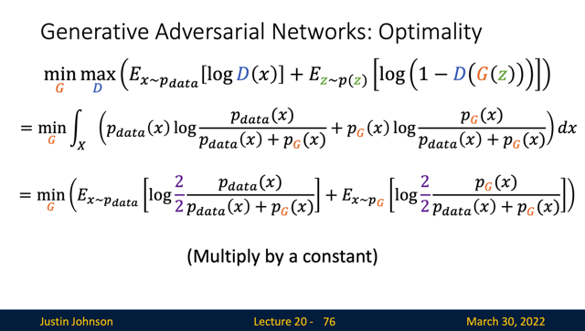</kbd></p>

> [!NOTE]
> Rồi, ta sẽ **nhân tử và mẫu cho 2**, đặng tí nữa sẽ thấy mục đích
>
> ```text
> Lòi ra cái log4 cũng dễ hiểu thôi, log A + log B = log (2A/2) + log (2B/2)
> ```
> ```text
> = log 2A - log 2 + log 2B - log 2 = log 2A + log 2B - 2log2
> ```
>
> ```text
> mà 2log2 = log2 + log2 = log (2*2) = log 4
> ```

<br>

<a id="node-1986"></a>

<p align="center"><kbd>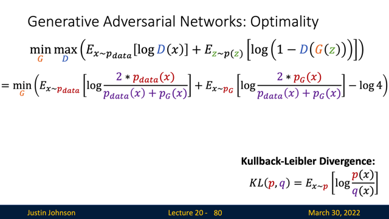</kbd></p>

> [!NOTE]
> Rồi, ta sẽ **thấy nó có dạng của hai cái KL Divergence** (cái này là gì thì gặp
> nhiều rồi, đã học bên DLYo và CS224n) của hai cặp phân phối xác suất:
>
> **p_data(x)** đóng vai **p(x)** trong công thức
>
> **[p_data(x) `+` p_G(x)]/2** đóng vai **q(x)**
>
> và 
>
> **p_G(x)** đóng vai **p(x)** trong công thức
>
> **[p_data(x) `+` p_G(x)]/2** đóng vai **q(x)**

<br>

<a id="node-1987"></a>

<p align="center"><kbd>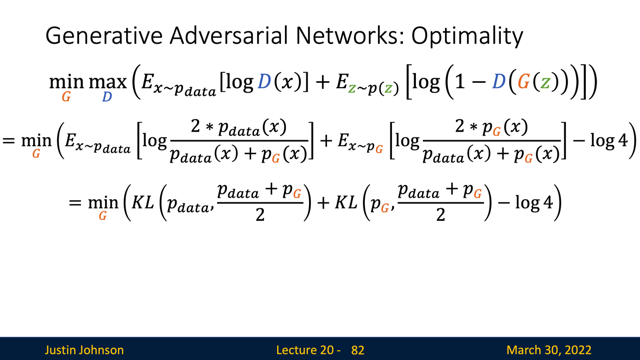</kbd></p>

<br>

<a id="node-1988"></a>

<p align="center"><kbd>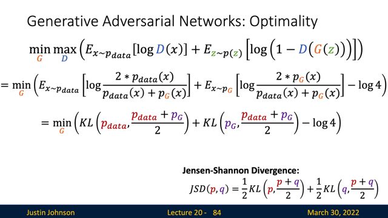</kbd></p>

> [!NOTE]
> Sau khi thay vào ta sẽ thấy nó còn có dạng của **Jensen-Shannon
> Divergence** nữa, mới gặp lần đầu, nhưng cũng có thể hiểu nó**cũng là
> một metric để đo độ divergence của hai distributio**n mà công thức của
> nó c**ũng dựa trên KL Divergence**

<br>

<a id="node-1989"></a>

<p align="center"><kbd>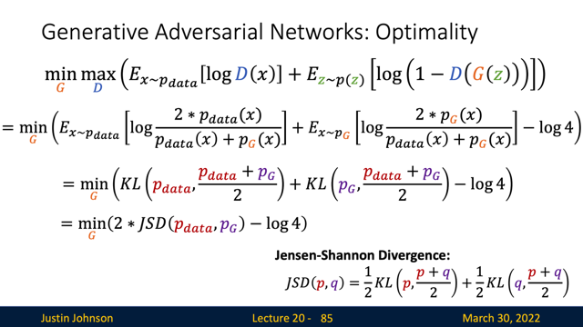</kbd></p>

> [!NOTE]
> Để rồi **objective function** cuối cùng trở thành việc **minimize
> cái `Jensen-Shannon` Divergence giữa `p_data` và p_G**

<br>

<a id="node-1990"></a>

<p align="center"><kbd>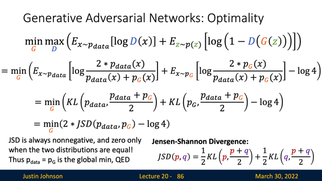</kbd></p>

> [!NOTE]
> Và với **tính chất không âm của JSD**, thì ta sẽ **min được cái này khi JSD
> `=` 0** và điều này **chỉ xảy ra khi `p_data` `=` p_G**
>
> Tóm lại **việc thiết lập objective function** theo công thức ban đầu đã về
> cơ bản là **đặt ra nhiệm vụ G** phải **học cách ước lượng được phân phối
> xác suất tự nhiên của image**, khiên pG `=` `p_data`

<br>

<a id="node-1991"></a>

<p align="center"><kbd>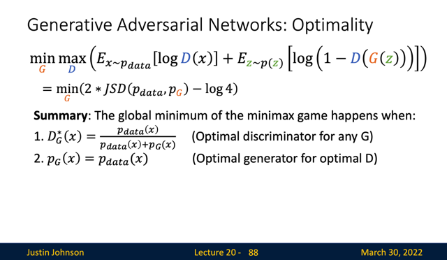</kbd></p>

> [!NOTE]
> và tổng hợp lại thì **nhiệm vụ của D** sẽ là **học được cách trở thành D***
> như công thức và **nhiệm vụ của G** là **học được `p_data` (để `p_G` `=` p_data)**

<br>

<a id="node-1992"></a>

<p align="center"><kbd>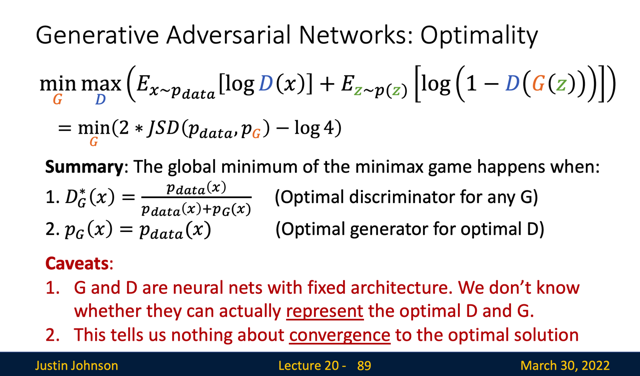</kbd></p>

> [!NOTE]
> Tuy nhiên, khó khăn có thể đến từ việc liệu **D** `-` vốn là một **neural network**,
> có thể được train (thay đổi param) để rồi D network có thể represent cho
> hay ứng xử như function D*(x) `=` `p_data(x)` `/` `[p_data(x)` `+` `p_G(x)]` **được
> không**.
>
> Để hiểu ý này mình nhớ lại trong bài về neural net architecture design của
> **DLYo** khi nói đến UAT `-` **Universal Approximation Theorem**,  trong đó người
> ta nói rằng **một MLP với một hidden layer có thể ước  lượng xấp sỉ một
> function phức tạp cỡ nào cũng được**, **miễn là có đủ  hidden unit**. Tuy
> nhiên,**không biết bao nhiêu là đủ**, và người ta có những nghiên cứu cho
> thấy để **tăng khả represent của neural network thì số  unit phải tăng
> exponentially**, nói tóm lại là **theo lí thuyết là có thể** nhưng**thực tế thì không
> chắc**. Và dù ta có dùng nhiều layer hơn để giảm số unit cần thiết thì cũng
> **không có gì chắc chắc rằng ta sẽ luôn có thể thiết kế được kiến trúc của D
> sao cho đủ để represent D***
>
> Và ta còn nhớ (cũng trong bài về neural net architecture design của DLYo)
> tác giả cũng có nói rằng **ngay cả khi giả sử có thể tìm được kiến trúc đủ
> khả năng represent mọi function thì UAT** cũng không nói gì đến việc có thể
> train thành không neural net để nó **converge thành công** (để rồi có thể
> đóng vai trò D*) hay không.
>
> Và với G cũng tương tự như vậy

<br>

<a id="node-1993"></a>

<p align="center"><kbd>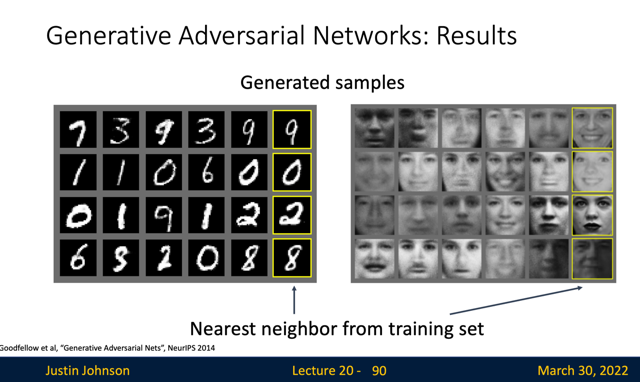</kbd></p>

> [!NOTE]
> một số kết quả của
> GAN "đời đầu"

<br>

<a id="node-1994"></a>

<p align="center"><kbd>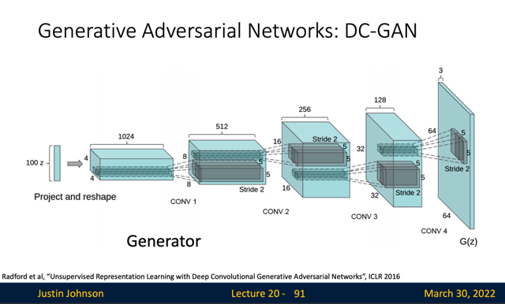</kbd></p>

> [!NOTE]
> Sau đó là nhiều mô hình tốt hơn, ví dụ như `DC-GAN` (mà ta đã
> gặp trong GAN Spec), sử dụng CNN

<br>

<a id="node-1995"></a>

<p align="center"><kbd>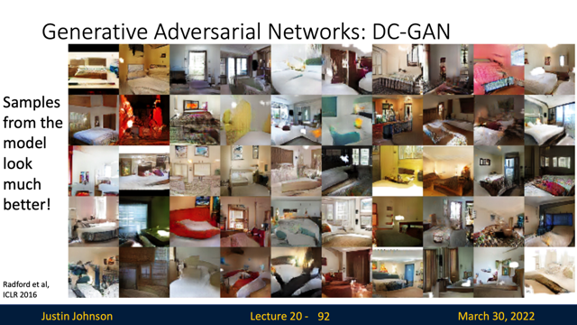</kbd></p>

> [!NOTE]
> ví dụ kết quả của `DC-GAN` train trên
> dataset các image về phòng ngủ.

<br>

<a id="node-1996"></a>

<p align="center"><kbd>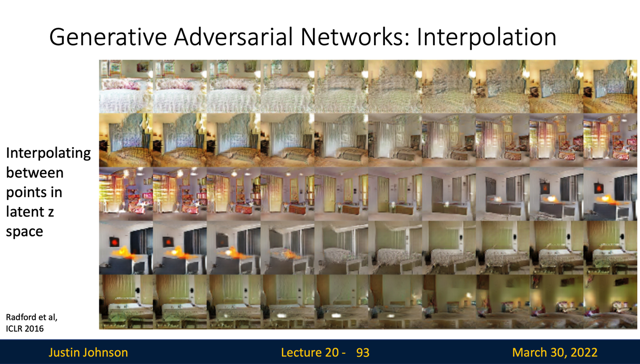</kbd></p>

> [!NOTE]
> Và nói về một khả năng của GAN mà cũng đã được biết tới ở GAN Spec,
> đó là interpolation: Đại khái là ta nhớ với GAN (cũng như VAE) quá trình
> inference sẽ bắt đầu với việc ta sampling một latent variable z từ priori p(z).
> Rồi pass z cho G để nó tạo ra x `=` G(z) (mang ý nghĩa là sampling từ một
> predicted conditional distribution `p_G(x|z)` mà nó cố gắng xấp xỉ `p_data` khi
> huấn luyện)
>
> Thế thì interpolation là ta bắt đầu với hai sample z khác nhau, và qua G
> kiểu như sẽ cho ra hai cái x khác nhau, giả sử như ta có hai cái phòng ngủ
> phong cách khác nhau đi.
>
> Thế thì bằng cách interpolate `-` đại khái là tạo các vector z trung gian giữa
> z1 và z2, thì các vector z này khi qua G sẽ cho ra các bức hình  lai tạo giữa
> hai bức hình x1, x2. Và hệ quả là ta thấy kiểu như biến đổi từ phòng ngủ có
> phong cách này (x1) sang phòng ngủ phong cách  kia (x2) vậy
>
> Nhưng điều này có ý nghĩa quan trọng hơn là ta nghĩ: Vì ta hãy hình dung
> rằng, khi từ z1 sang z2, không phải chỉ là bức hình x1 mờ dần rồi thay bằng
> x2. Không đơn giản như vậy, mà nó tạo ra các bức hình lai tạo của cả hai
> x1, và x2. Điều này cho thấy GAN đã học được mô hình xác suất phức tạp
> của "image về phòng ngủ"

<br>

<a id="node-1997"></a>

<p align="center"><kbd>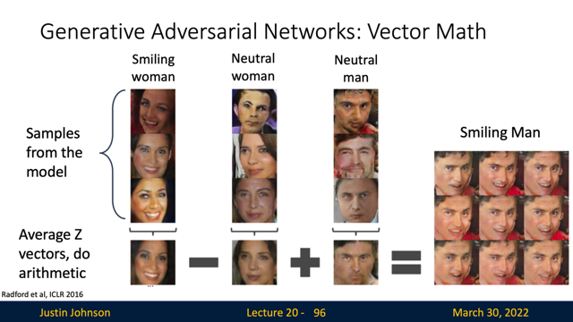</kbd></p>

> [!NOTE]
> và nó còn cho phép làm cái này: đại khái là ta sampling các image và
> phân loại nó. Thì việc thực hiện các phép tính số học đối với latent
> variable z, cho phép ta tách rời các feature ra. Ví dụ, `z_smiling` woman `-`
> `z_neutral` woman `=` `z_smilling:` là latent variable represent cho "smiling",
> để rồi khi cộng nó cho `z_neutral` man ta có được `z_smilling` man

<br>

<a id="node-1998"></a>

<p align="center"><kbd>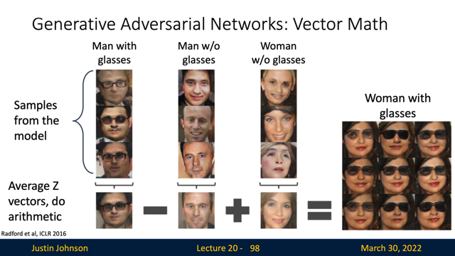</kbd></p>

<br>

<a id="node-1999"></a>

<p align="center"><kbd>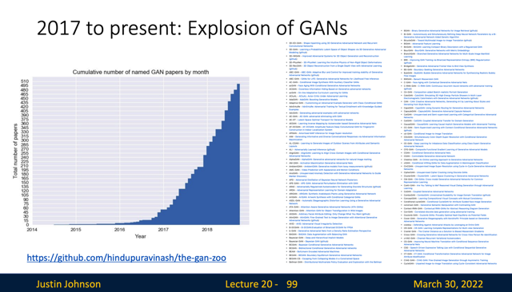</kbd></p>

> [!NOTE]
> Và kể từ khi ra đời thì số nghiên cứu về
> GAN bùng nổ với hàng trăm paper

<br>

<a id="node-2000"></a>

<p align="center"><kbd>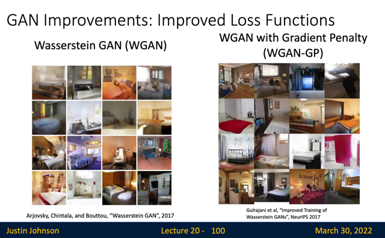</kbd></p>

> [!NOTE]
> Một improvement quan trọng là cải thiện loss function của GAN giúp ổn
> định quá trình huấn luyện và cho ra kết quả tốt hơn. GANSpec cũng có
> nói về WGAN, WGAN GP rồi

<br>

<a id="node-2001"></a>

<p align="center"><kbd>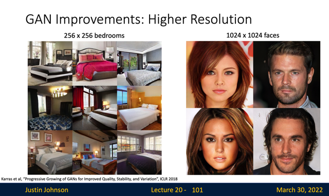</kbd></p>

> [!NOTE]
> Progressive GAN: có thể tạo các image có độ phân giải cao

<br>

<a id="node-2002"></a>

<p align="center"><kbd>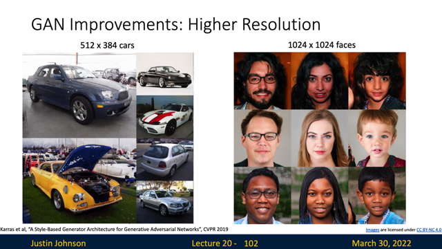</kbd></p>

> [!NOTE]
> Style GAN

<br>

<a id="node-2003"></a>

<p align="center"><kbd>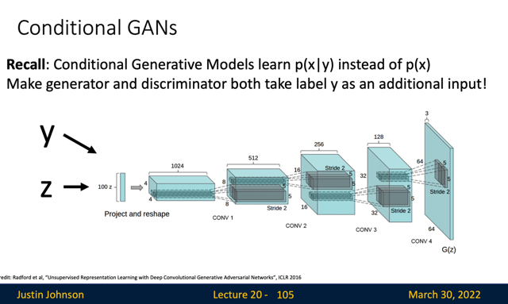</kbd></p>

> [!NOTE]
> đại khái là ta có thể train GANs để nó learn p(x|y) thay vì p(x) nhằm
> có thể kiểu như "yêu cầu GAN generate image thuộc category cho
> trước y" thay vì chỉ là các image tùy tiện.

<br>

<a id="node-2004"></a>

<p align="center"><kbd>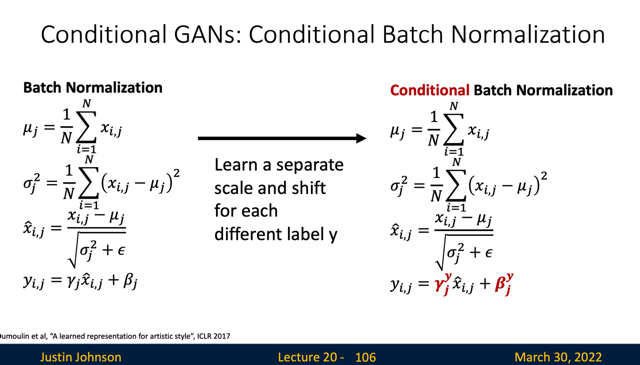</kbd></p>

> [!NOTE]
> Thế thì cách làm conditional GANs ở đây nói đến khác với
> Conditional GAN, trong GAN Spec: bằng cách cho các scale và shift
> parameters của BatchNorm được train với các label khác nhau, từ
> đó khi cần generate image với label y, chỉ cần dùng trained scale và
> shift của label tương ứng.

<br>

<a id="node-2005"></a>

<p align="center"><kbd>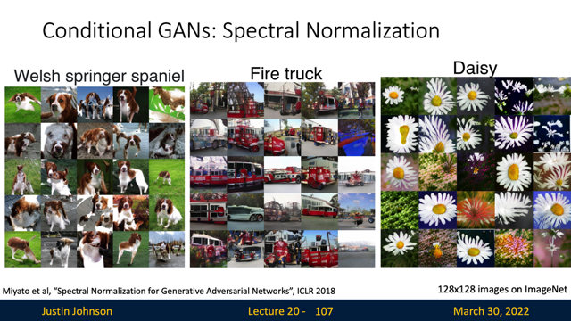</kbd></p>

<br>

<a id="node-2006"></a>

<p align="center"><kbd>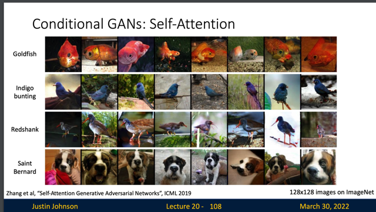</kbd></p>

> [!NOTE]
> nhắc đến việc dùng `Self-Attention`
> giúp cải tiến GAN rất tốt

<br>

<a id="node-2007"></a>

<p align="center"><kbd>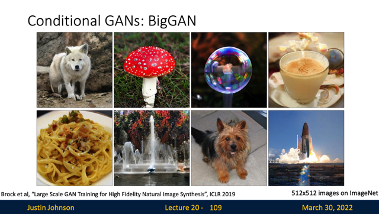</kbd></p>

> [!NOTE]
> BigGAN là một paper
> quan trọng nên đọc

<br>

<a id="node-2008"></a>

<p align="center"><kbd>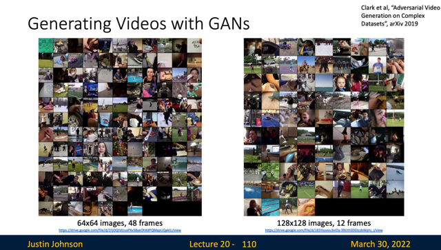</kbd></p>

<br>

<a id="node-2009"></a>

<p align="center"><kbd>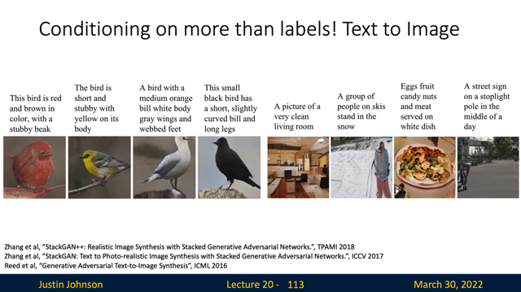</kbd></p>

> [!NOTE]
> Condition trên label nhưng label có
> thể là một câu. Khiến nó trở thành
> bài toán Text to Image.

<br>

<a id="node-2010"></a>

<p align="center"><kbd>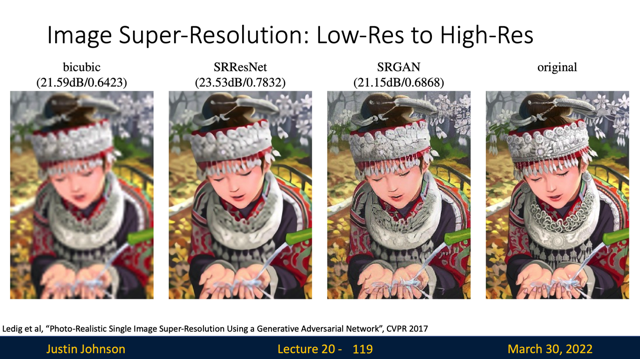</kbd></p>

> [!NOTE]
> cái vụ tăng độ phân giải của image lên như ứng dụng Remini mà
> ông ba dùng để làm hình cũng có thể là dựa trên GAN đây

<br>

<a id="node-2011"></a>

<p align="center"><kbd>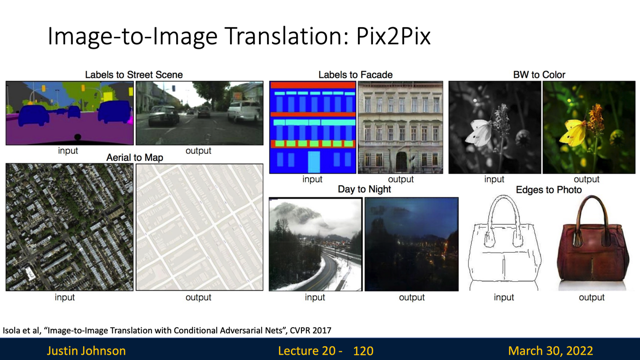</kbd></p>

> [!NOTE]
> Rồi Pix2Pix đã gặp
> ở GANSpec.

<br>

<a id="node-2012"></a>

<p align="center"><kbd>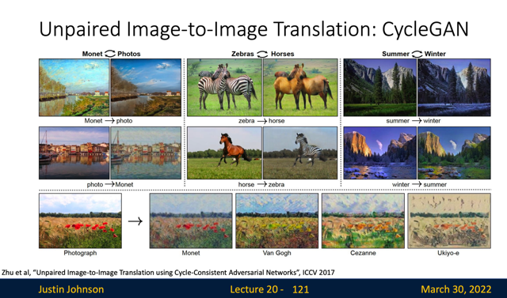</kbd></p>

> [!NOTE]
> Cũng gặp lại CycleGAN

<br>

<a id="node-2013"></a>

<p align="center"><kbd>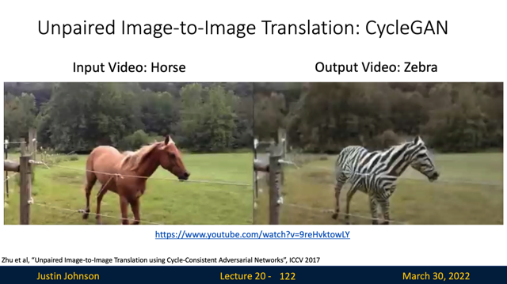</kbd></p>

<br>

<a id="node-2014"></a>

<p align="center"><kbd>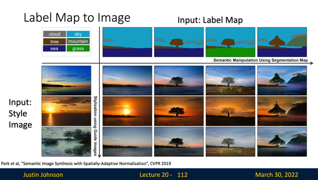</kbd></p>

<br>

<a id="node-2015"></a>

<p align="center"><kbd>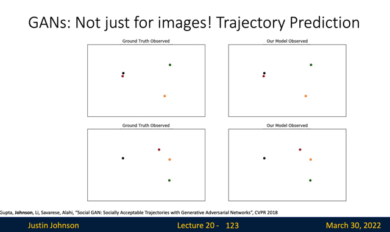</kbd></p>

> [!NOTE]
> Và GAN có thể generate cái khác chứ không chỉ là image. Ở
> đây kiểu như dự đoán một người sẽ đi đâu. Nói chung những
> slide cuối chỉ nói lướt qua hàng loạt các nghiên cứu rất hay
> và ứng dụng của GAN

<br>

<a id="node-2016"></a>

<p align="center"><kbd>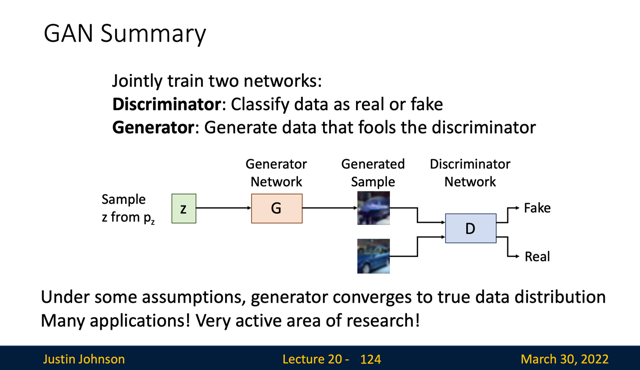</kbd></p>

> [!NOTE]
> Tóm lại với GAN, ta train cùng lúc hai network, với một số giả
> định, ta hi vọng G sẽ converge về, nắm bắt được data
> distribution thật sự của data

<br>

<a id="node-2017"></a>

<p align="center"><kbd>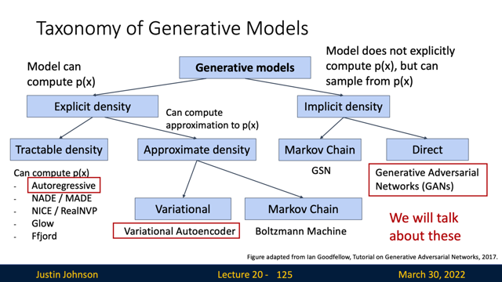</kbd></p>

<br>

<a id="node-2018"></a>

<p align="center"><kbd>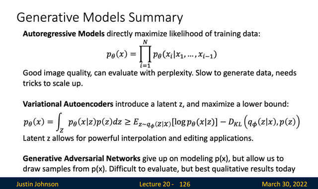</kbd></p>

> [!NOTE]
> Tóm lại ta đã biết qua 3 mô hình quan trọng của Generative Models:
>
> Với Autoregressive Models: Ta maximize likelihood of training data 
> một cách trực tiếp. Tạo ra model có ưu điểm là image quality cũng
> tốt, có thể đánh giá với perplexity (như language model) nhưng chậm
> và khó scale up.
>
> Với VAE, latent variable z mang lại nhiều khả năng rất mạnh của 
> việc có thể interpolation và editing.
>
> Cuối cùng là GAN, từ bỏ việc cố gắng học ra `/` tìm ra dạng cụ thể của p(x)
> nhưng lại cho phép sampling từ p(x). Cái này khó evaluate nhưng kết quả
> sample thì tốt nhất đến thời điểm bài giảng.
>
> Nói thêm thì ngày nay có thêm diffusion model...

<br>

