# Lecture 7/16 - Training Neural Network Ii

📊 **Progress:** `72` Notes | `97` Screenshots

---

<kbd></kbd>

 

<kbd>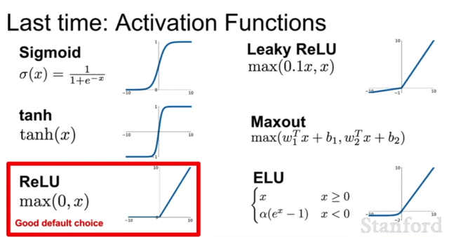</kbd>

> [!NOTE]
> tóm tắt lại chút xíu về bữa trước đã học các**activation function,**
> sigmoid và tanh thì bị vanishing gradient, **mặc định nên dùng reLu**

 

<kbd>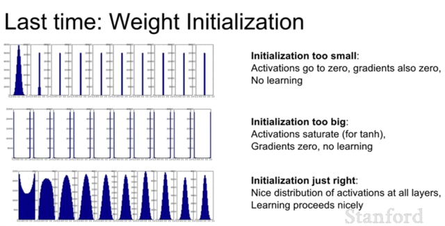</kbd>

> [!NOTE]
> Vấn đề initialization, ở trên cùng là khi **initialize với giá trị quá nhỏ**, thì
> nôm na là khi **nhân với một giá trị nhỏ nhiều lần thì kết quả nó ra rất nhỏ**,
> dẫn đến gradient sẽ -> 0 khiến "no learning". Nhớ dL/dW = X
>
> Ngược lại nếu initialize với giá trị lớn thì cũng gây vanishing do gradient qua
> các activation node có local grad = 0 (do input lớn, các tanh, sigmoid làm việc
> ở cái đuôi)
>
> Do đó cần có cách initialize tốt như Xavier initialization

 

<kbd>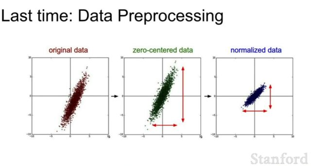</kbd>

 

<kbd>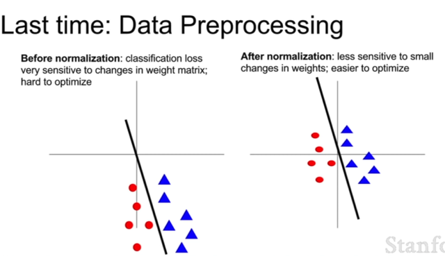</kbd>

> [!NOTE]
> đại ý là nói lại một ý đó là khi có normalization, thì classification loss sẽ bớt
> nhạy cảm với những sự nhiễu loạn (perturbation) của weight value dẫn
> đến dễ optimize hơn (sẽ nói thêm ở những phần sau)
>
> Ngoài ra, sự nhiễu loạn nhỏ này của weight matrix, dẫn đến sự nhiễu loạn
> của input vào activation function và được khuếch đại lên lại càng khiến
> quá trình training khó khăn hơn

 

<kbd>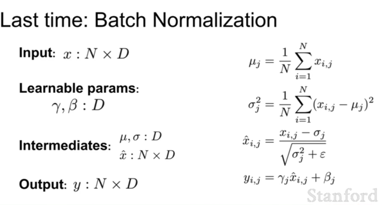</kbd>

> [!NOTE]
> và với batch normalization thì ta dùng statistic của training batch
> để tính ra mean, standard deviation để thực hiện normalize cho
> batch data đó. Và cũng có thêm learnable param scale - gamma
> và shift - beta để tăng thêm hiệu quả, add thêm độ flexibility

 

<kbd>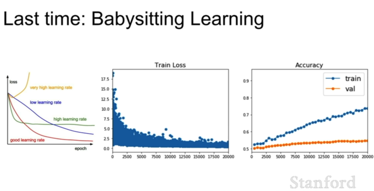</kbd>

> [!NOTE]
> bài trước cũng đã nói về quá trình "chăm bẵm" cho việc training, khi ta sẽ
> theo dõi giá trị của training / validation loss/accuracy để từ đó có thể nhận
> diện trạng thái under/overfit từ đó có những thay đổi cần thiết

 

<kbd>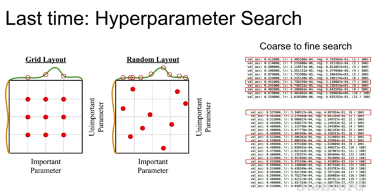</kbd>

> [!NOTE]
> Brief lại cái này, với random search vs grid search và coarse to fine
> technique trong đó kiểu như ta thử sơ (train với vài iteration thôi) để
> lọc ra / khoanh vùng để tìm kiếm ở phạm vi nhỏ hơn (fine) và training
> nhiều iteration hơn

 

<kbd>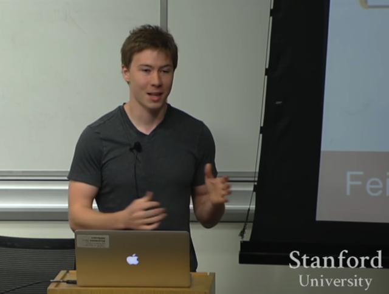</kbd>

> [!NOTE]
> **Learning rate là hp quan trọng nhất**, rồi có thể đến **regularization strength**, 
> **model size**.
>
> Nên ổng thường chỉ thử 3-4 hp một lúc. Trong đó learning rate là quan trọng
> nhất
>
> Có câu hỏi là có khi nào (hoặc có thường xuyên xảy ra không) khi mình 
> **thay đổi giá trị của hyper-parameter này mà lại dẫn đến thay đổi giá
> trị tối ưu của h.param khác**?
>
> -> Cũng có đôi khi xảy ra như vậy. Nhưng với learning rate thì nếu ta đã **chọn
> được một khoảng giá trị tốt** (có thể chưa đạt mức tốt nhất) thì có thể training ok 
> với nó mà **ít sợ nó sensitive với các thay đổi khác.**

 

<kbd>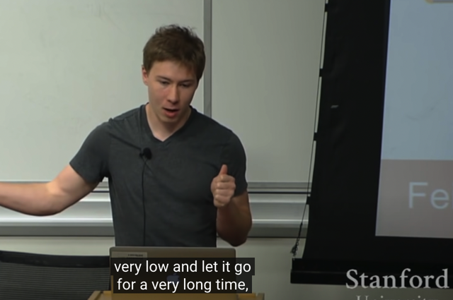</kbd>

> [!NOTE]
> Có câu hỏi là làm cách này được không - set lr rất nhỏ và tăng dần lên.
>
> -> Trên lí thuyết là nó sẽ luôn ok, tuy nhiên thực tế thì nếu mình chọn
> được lr đúng thì có thể quá trình training sẽ  chỉ tốt vài chục tiếng hoặc
> hơn nhưng nếu mình giảm lr xuống 10,100 lần thì có thể thời gian training
> sẽ kéo dài thành ra vài tháng. Do đó những constant như này ảnh hưởng
> rất lớn

 

<kbd>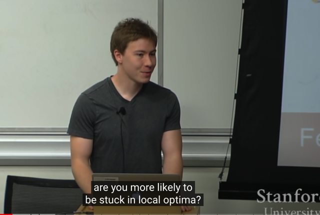</kbd>

> [!NOTE]
> Câu hỏi khác đó là có đúng không khi nếu lr nhỏ thì **qúa trình training
> sẽ dễ rơi vào các local minima?**
>
> -> Câu trả lời là cái này mới nghe có vẻ đúng nhưng thực tế hóa ra không
> phải là vấn đề lớn và cái này sẽ nói thêm ở phần sau

 

<kbd>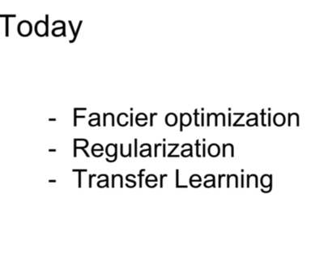</kbd>

 

<kbd>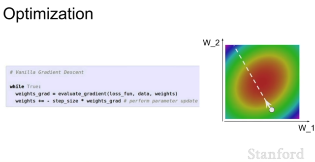</kbd>

> [!NOTE]
> đại khái là nhắc lại về quá trình training ml model là bài toán **optimization**
> với **gradient descent** technique trong đó loss function value cho ta biết
> **giá trị hiện tại của parameter "tốt cỡ nào"** và ta sẽ **lặp đi lặp lại quá trình
> update parameters theo hướng ngược với gradient** để hi vọng loss
> function có thể converge về global minimum
>
> Chú ý SGD ở đây là tính gradient trên mini-batch example tức là mini-batch
> GD theo như Andrew Ng

 

<kbd>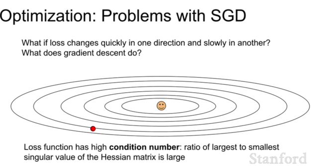</kbd>

> [!NOTE]
> đại khái là tuy nhiên gradient descent có những vấn đề gây ra sự **không
> hiệu quả**. Ví dụ như hình ảnh này minh họa, ta hình dung lòng chảo nơi đáy
> chảo là global minimum nhưng cái chảo dẹt, giống như cái bánh taco
>
> Trong đó khi di chuyển theo phương horizontal (update param theo hướng
> ngang trong hình vẽ) thì **loss giảm rất chậm**. Nhưng nếu update theo hướng
> dọc thì lại k**hiến loss rất sensitive** (khi lòng chảo ở hướng đó hẹp khiến việc
> update **dễ dàng đi quá lố lại phải trở lại**)

 

<kbd>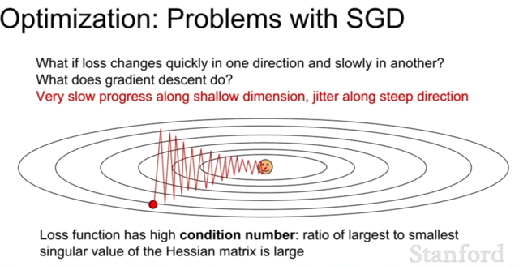</kbd>

> [!NOTE]
> và nếu ta training với stochastic gradient descent thì "đường đi" của
> gradient có thể như thế này khi nó đi **rất ziczac và do đó rất chậm để
> converge.**
>
> Nói thêm là hiện tượng này sẽ **rất phổ biến trong không gian high
> dimension** space. Có thể hình dung rằng cái hình elip trong 2D space (có
> 2 param w1, w2) dẹp ở đây là do sự chênh lệch lớn giữa hướng update
> param theo w1 và w2.
>
> Vậy thì trong 1000.000 dimensional space thì **sự chênh lệch giữa " cái"
> (hướng) lớn nhất và cái nhỏ nhất còn lớn cỡ nào** dẫn đến đây **thật sự là
> một vấn đề nghiêm trọng khi training neural network lớn.**

 

<kbd>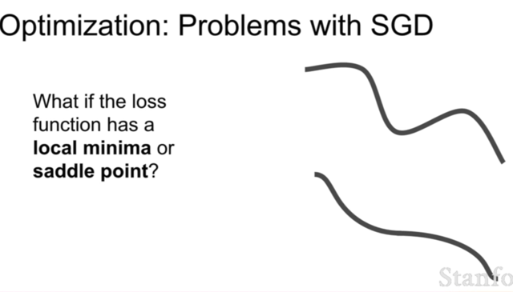</kbd>

> [!NOTE]
> Đại khái là có hai vấn đề gây cản trở việc training là **local minima** khi đi theo
> hướng nào thì loss cũng tăng và **saddle point**thì 1 hướng tăng loss một
> hướng giảm loss.
>
> Nhìn trong không gian 1D thì có vẻ như local minima gây vấn đề hơn là saddle
> point như trong không gian nhiều chiều thì ngược lại. Nôm na là ví dụ trong
> 100 triệu chiều thì sẽ ít vấn đề hướng nào cũng tăng loss hơn là có  hướng
> tăng có hướng giảm,
>
> Và nói thêm cứ tưởng tượng viên bi trên mặt bàn, tuy không ngay saddle point
> nhưng cũng gần gần và cả mặt bàn có **độ dốc rất nhỏ thì viên bi sẽ cơ bản là
> di chuyển rất chậm**

 

<kbd>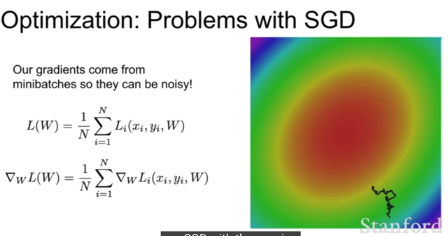</kbd>

> [!NOTE]
> vấn đề nữa của sgd chính là chỗ chữ s - stochastic khi ta cơ bản là đang
> estimate / approximate gradient chứ không chính xác vì ta chỉ tính trên 1
> mini-batch example. (Còn tại sao thì ta đã biết là do tính trên toàn bộ training
> sample sẽ rất tốn kém, cũng ko hiểu quả luôn)
>
> Nên đường đi của nó có tính chất noisy và đương nhiên là cũng có những
> hạn chế về độ hiệu quả

 

<kbd>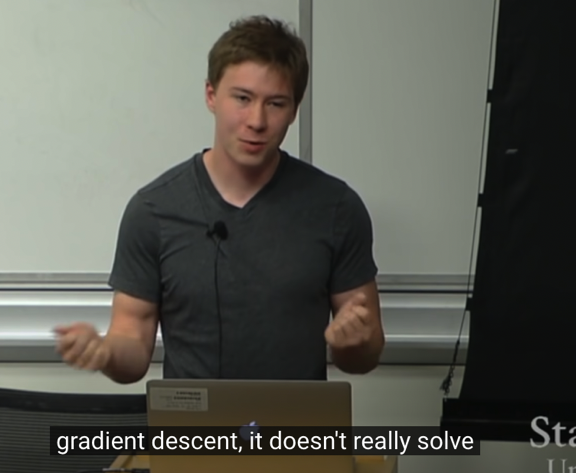</kbd>

> [!NOTE]
> Q: Có phải nếu ta dùng f**ull batch gradient descent** thì sẽ không gặp
> phải các vấn đề trên hay không?
>
> -> Không, ta vẫn sẽ bị vấn đề taco shell, saddle point, stochastic (sẽ
> nói sau về những cái đại khái là ta chủ động đưa thêm sự ngẫu
> nhiên vào) .  Nên nhìn chung là không.

 

<kbd>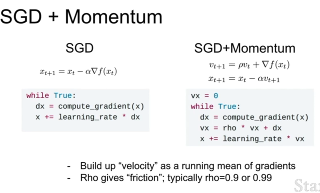</kbd>

> [!NOTE]
> Đại khái là giải pháp rất đơn giản nhưng tỏ ra rất hiệu quả đó là SGD với
> **momentum**. Ý tưởng là**thay vì dùng gradient**thì dùng **velocity** (hiểu nôm na
> là **quán tính của gradient**) để update.
>
> Velocity sẽ được **ini với 0**
>
> Trong đó velocity sẽ được **giảm xuống một chút bằng cách nhân với một
> parameter rho** trước khi **cộng thêm gradient và dùng nó để update params**.
>
> Ý nghĩa giống như **thay vì dùng gradient có tính chất stochastic** thi kiểu
> như là **tính toán ra một "sự trung bình", một "chiều hướng nói chung"**, \_**trong
> đó sự stochastic đã được khử đi**\_. Và dùng cái đó để update params.
>
> Nói thêm **velocity** có thể hiểu kiểu kiểu như **weight average của gradient ở các
> step trước đó nhưng "lấy nhiều hơn" (trọng số to hơn) ở các step gần nhất.**

 

<kbd>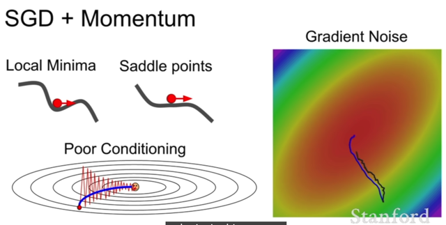</kbd>

> [!NOTE]
> Ý nghĩa sẽ giống như hòn bi lăn từ trên cao xuống thì nó sẽ có
> quán tính. Nên ngay cả khi lọt vào local minimum hay saddle point thì
> quán tính đó sẽ vẫn giúp nó lăn tiếp để thoát ra.
>
> Và hình ảnh cho thấy momentum giúp "đường đi" trở nên smooth hơn

 

<kbd>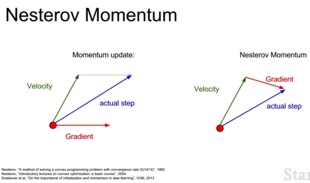</kbd>

> [!NOTE]
> **Nesterov momentum** hơi khác chút xíu. Với SGM momentum bình
> thường thì đại khái giống như ta đi **combine hai hướng (velocity +
> gradient) lại** và **đi theo hướng đó**.
>
> Còn **Nesterov** thì ta **đi theo hướng velocity** rồi **tính gradient tại đó**,
> Sau đó **kết hợp với velocity để ra actual step**. 
>
> Thế thì đại khái là nó **take care hơn** đến việc **giả sử velocity ra
> hướng sai thì nó sẽ giúp sửa lại tốt hơn** và có một vài tính chất 
> liên quan đến **convex optimization**. (Có thể tìm hiểu thêm sau)

 

## In the context of optimizing neural networks, traditional gradient descent methods update the parameters of

> [!NOTE]
> In the context of optimizing neural networks, traditional gradient descent methods update the parameters of
> the model by moving them in the opposite direction of the gradient of the loss function with respect to those
> parameters. The gradient and the loss are evaluated at the current position of the parameters. Momentum
> methods, including Nesterov Accelerated Gradient (NAG), build on this idea by incorporating a velocity
> component, which is a function of past gradients, to accelerate the optimization process.
>
> Nesterov momentum is a variant of the momentum method that introduces a clever twist to the update rule,
> which significantly improves the convergence rate of the optimization. The key difference between Nesterov
> momentum and standard momentum is in how and where the gradient is evaluated.
>
> ### \**Standard Momentum\**
>
> In standard momentum, the update at each iteration consists of two parts: a fraction of the previous update
> and a step in the direction of the current gradient. Mathematically, it looks something like this:
>
> 1. Compute the gradient g_t at the current parameters w_t.
> 2. Update the velocity v_{t+1} as a combination of the current velocity v_t and the current gradient:
> v_{t+1} = mu v_t - eta g_t, where mu is the momentum coefficient and eta is the learning rate.
> 3. Update the parameters using this velocity: w_{t+1} = w_t + v_{t+1}.
>
> ### \**Nesterov Momentum\**
>
> Nesterov momentum, on the other hand, makes a crucial modification to this process. Instead of calculating
> the gradient at the current parameters, it calculates the gradient at a lookahead position. This lookahead is
> based on the current velocity, effectively allowing the optimizer to have a glimpse into the future position of
> the parameters. The steps for Nesterov momentum can be outlined as follows:
>
> 1. **Lookahead Step**: First, it takes a step in the direction of the previous velocity to compute a temporary
> updated parameter: w~ = w_t + mu*v_t.
> 2. **Gradient Evaluation**: Then, it calculates the gradient g~ not at the current parameters
> w_t but at this lookahead position w~.
> 3. **Velocity Update**: Update the velocity with this lookahead gradient: v_{t+1} = mu v_t - eta*g~.
> 4. **Parameter Update**: Finally, update the parameters using this new velocity: w_{t+1} = w_t + v_{t+1}.
>
> ### \**Breaking the Norm\**
>
> The innovation of Nesterov momentum breaks the norm of evaluating the gradient and loss at the same
> point by introducing the concept of looking ahead. This lookahead approach allows the optimizer to correct
> its path more efficiently, leading to faster convergence and potentially avoiding poor local minima. By
> evaluating the gradient at a point that the parameters are likely to be in the near future (thanks to the
> momentum), Nesterov momentum can make more informed and prescient updates. This method effectively
> anticipates the future position and adjusts the direction accordingly, which is why it often outperforms
> standard momentum and gradient descent, especially in the context of deep learning where the optimization
> landscape can be highly non-convex and challenging to navigate.

 

<kbd>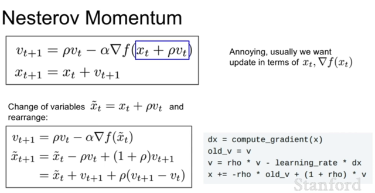</kbd>

> [!NOTE]
> Đại khái là với nesterov, không còn theo thông thường khi ta **tính gradient
> và update param tại cùng một điểm** (tại đó tính gradient, và dùng gradient
> đó để update param), mà bây giờ thị lại **update param tại một điểm bằng
> gradient tại một điểm khác** nên việc tính toán hơi phiền phức

> [!NOTE]
> Dùng cách đổi biến giúp khắc phục chuyện này??
>
> dòng 1 cho thấy đầu tiên ta tính **velocity mới (v_t+1)** giống như **sgd
> momentum** cũ, tức là bằng **velocity cũ** **giảm xuống một tí** (bằng cách nhân
> với friction rho) và **mix với gradient** tại đó.
>
> Sau đó update weight bằng **giá trị cũ cộng velocity** và kiểu như "**weighted
> difference**" giữa velocity mới và velocity cũ" **(rho*(v_t+1 - v_t))**
>
> Nên mới nói nó giống như **correct term** giữa **velocity cũ và mới** vậy

 

<kbd>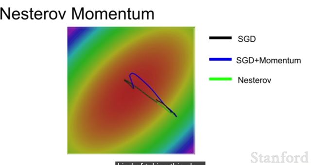</kbd>

> [!NOTE]
> hình ảnh cho thấy đại khái là SGD chậm hơn và hai thằng
> SGD+Momentum và Nesterov kiểu như chạy lố qua minimum
> và tự điều chỉnh để quay lại

 

<kbd>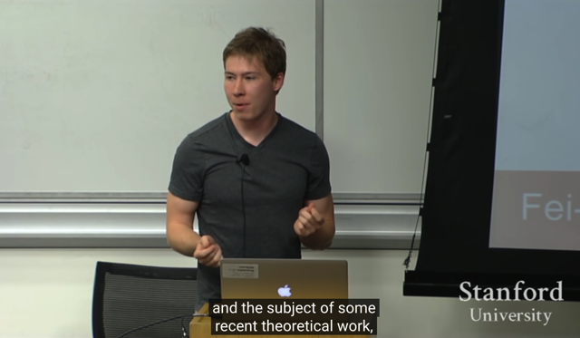</kbd>

> [!NOTE]
> Câu hỏi là nếu **minima giống như một cái vực sâu hẹp**, thì có phải **velocity
> sẽ khiến ta skip qua nó hay không**?
>
> Đại khái câu trả lời đó là nếu ta có một "**very sharp minima**" như vậy thì có
> thể ta cũng k**hông muốn đáp vào đó** (landing, ý nói **converge** vào đó) bởi vì
> có thể chỉ là **một điểm khiến model bị overfit**. Và có thể giả sử ta double
> kích thước training set thì cái sharp minima đó sẽ**biến mất.**
>
> Nên ta nhìn chung là muốn converge vào một **minima có tính chất flat**giống như
> một thung lũng phẳng nơi mà kiểu như là các giá trị params dù có thay đổi chút 
> xíu cũng vẫn có loss nhỏ chứ không phải sensitive như cái vực sâu kia. Vì khi đó
> **khả năng generalization** sẽ tốt hơn.
>
> Thành ra cái này thì **SGD momentum**giống như là **feature** thay vì **bug** khi nó
> giúp bỏ qua (skip over) những cái "very sharp minima" này

 

<kbd>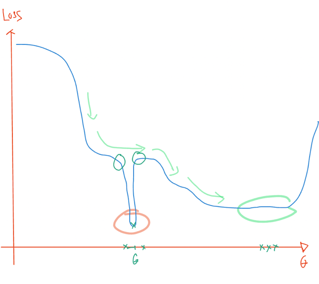</kbd>

 

<kbd>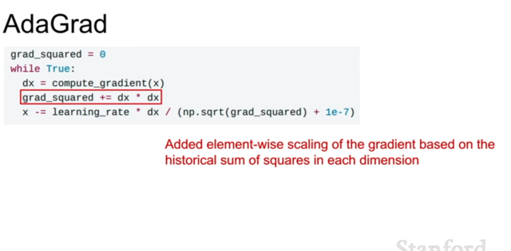</kbd>

> [!NOTE]
> đại khái cách làm là khi tính gradient xong thì ta **bình phương** nó và **cộng dồn
> vào một cái grad_squared**. Khi update params thì cũng như cũ chỉ có điều là
> scale gradient với sqrt của grad_squared (tức là chia gradient với sqrt
> grad_squared  cộng một hàng số nhỏ để tránh việc chia cho 0)

 

<kbd>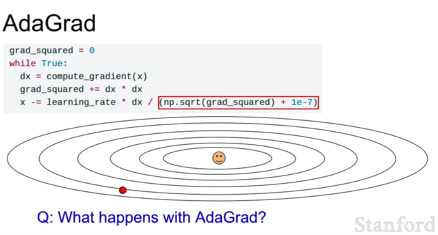</kbd>

> [!NOTE]
> đại khái là ý tưởng của adagrad đó là nó sẽ**scale (giảm, thu nhỏ) learning rate
> để sao cho các parameter sẽ có các lr khác nhau**, phù hợp.
>
> Lấy ví dụ trong bài toán có 2 param, gradient của mỗi cái là một hướng đi thì
> adagrad nôm na sẽ **điều chỉnh bước đi ở mỗi hướng mỗi khác**, sao cho **"
> cái nào" có các giá trị nhỏ thì sẽ có bước đi dài hơn và ngược lại.**
>
> (khi ví dụ dw1 nhỏ hơn dw2 thì dw1**2 và cộng dồn vào grad_squared_dw1 sẽ
> nhỏ hơn grad_squared_dw2 thành ra khi dùng để scale lr thì lr của w1 sẽ lớn
> hơn so với w2)
>
> Hiệu quả là n**ó giảm bớt lr ở hướng bị "wiggle"** và tăng tốc ở**hướng "slow"**

 

<kbd>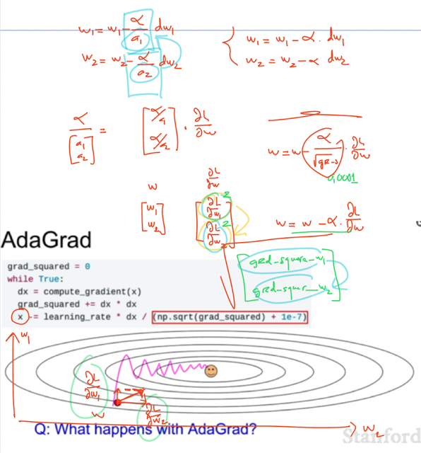</kbd>

 

<kbd>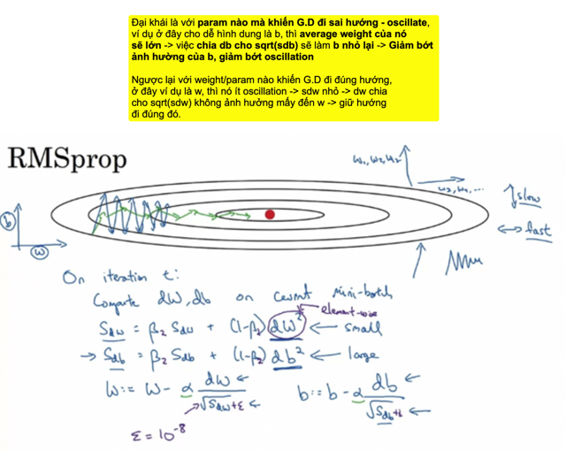</kbd>

> [!NOTE]
> Liên hệ lại DL Spec, Andrew Ng không nói về AdaGrad mà nói luôn
> RMSProp (khắc phục vấn đề lr nhỏ dần của AdaGrad)
>
> Nhưng ông vẫn giải thích rất rõ lợi ích của AdaGrad/RMSProp trong việc
> dùng cách scale lr của mỗi param khác nhau bởi một giá trị lớn nhỏ tùy 
> thuộc gradient của nó trong quá khứ khiến cho param nào được update
> nhiều sẽ có lr nhỏ lại và param dc update ít sẽ lr lớn lên. Nhờ vậy ví dụ ở
> phương dọc bị wiggle = tức là b được update nhiều (có grad lớn) thì sẽ dc
> hãm lại, còn ở phương ngang sẽ được khích lệ từ đó giúp "đường đi" sẽ 
> bớt wiggly

 

### The explanation you've provided delves into the core mechanism of AdaGrad (Adaptive Gradient Algorithm) and its

> [!NOTE]
> The explanation you've provided delves into the core mechanism of AdaGrad (Adaptive Gradient Algorithm) and its
> implications, particularly in the context of optimization problems with a high condition number. Let's break down the
> explanation and its significance:
>
> ### Running Sum of Squared Gradients
>
> AdaGrad maintains a \**cumulative sum of the squares of the gradients for each parameter\**. This sum represents the
> \**historical magnitude of the parameter updates\** and serves as a basis for \**adjusting the learning rate\**. Unlike methods
> that use a momentum (velocity) term to \**smooth out updates\**, AdaGrad focuses on \**scaling the updates based on the
> past gradients' squared magnitudes\**.
>
> ### Impact of Squared Gradient Accumulation
>
> By continually \**adding the squared gradients\** to this cumulative sum (referred to as the "\**grad squared term\**"),
> AdaGrad dynamically \**adjusts the learning rate for each parameter\**. When making parameter updates, the algorithm
> \**divides the gradient by the square root of this accumulated term\**, effectively scaling the learning rate.
>
> ### Scaling Effect in High Condition Numbers
>
> In \**optimization\**, the \**condition number\** of the \**problem\** can \**significantly impact\** the \**effectiveness of the optimization
> method\**. A high condition number indicates a \**large disparity\** in the \**scaling of the problem's dimensions,\** which can
> make \**optimization challenging\** due to the \**vastly different scales at which parameters\** need to be updated.
>
> \**AdaGrad's scaling mechanism\** addresses this issue by:
>
> - **\**Accelerating\** Movement in \**"Slow" Dimensions\****: For dimensions with \**consistently small gradients\**, the
> \**accumulated squared gradient \**sum remains relatively low, resulting in less aggressive scaling down of the learning
> rate. This allows for faster movement along these dimensions, helping to overcome areas of slow progress due to
> small gradients.
>
> - **\**Slowing Down in "Wiggly" Dimensions*\***: Conversely, for dimensions where gradients are consistently large, the
> accumulated squared gradient sum grows quickly, leading to a significant reduction in the learning rate for these
> dimensions. This slowing effect helps to stabilize updates in dimensions where the objective function might exhibit
> sharp curvatures or "wiggles."
>
> ### Problem with AdaGrad's Approach
>
> The described scaling mechanism, while beneficial in handling disparities in gradient magnitudes across
> dimensions, introduces a \**potential drawback\**: the perpetual accumulation of squared gradients can \**lead to overly
> aggressive reductions in the learning rate over time\**. For dimensions with large gradients, this can \**significantly
> decelerate progress\**, potentially to the point where \**further optimization becomes impractical\** due to \**exceedingly
> small updates\**. This effect is particularly pronounced in \**long-running training processes\**, where the \**accumulated sum
> can grow to such an extent that the learning rate becomes effectively zero\**, halting further improvement.
>
> This \**inherent limitation of AdaGrad\** has led to the development of modified algorithms like \**RMSProp\** and \**Adam\**,
> which introduce mechanisms (such as \**exponentially decaying averages\**) to \**control the growth of the accumulated
> squared gradient term\**, \**mitigating the risk of learning rate reduction to impractically low levels\**. These adaptations
> strive to \**balance the benefits of adaptive learning rate\** scaling with the need for \**sustained optimization progress\**
> over time.

 

  
  
<kbd>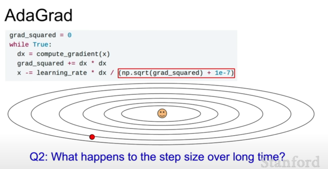</kbd>

  > Vấn đề **rõ ràng đó là ngày càng grad_square càng lớn** dẫn đến**learning rate
> sẽ ngày càng nhỏ lại**
>
> Tuy nhiên cái này có thể là một **ưu điểm** khi thật sự càng gần điểm hội tụ thì ta
> muốn chậm lại (cho learning rate nhỏ lại, đây chính là mục đích của các
> technique learning rate decay).
>
> Tuy nhiên đây chỉ đúng (là **feature, là ưu điểm**) nếu mình đang trong "convex
> case" tức là mình đang trong tình huống loss function có thể converge, ngược
> lại nếu không phải như vậy thì **việc lr nhỏ dần khiến giống như chưa tới đích
> mà đã hết xăng vậy**

   

  
  
<kbd>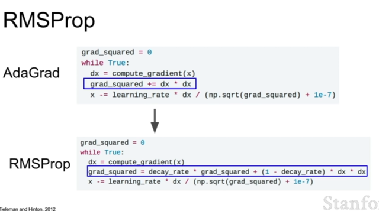</kbd>

  > RMSProp khắc phục cái này bằng cách làm khá giống **Adagrad** nhưng là
> đối với **average weight decay** của gradient ^ 2 với  thay vì gradient^2.
>
> Cụ thể là nó sẽ**giảm grad_square với decay_rate** (tương tự friction
> **rho**, của sgd momentum), combine nó với **bình phương gradient nhân
> với (1-decay_rate)** để tạo thành **grad_square** dùng grad_square để
> scale learning rate như adagrad.
>
> Nhờ vậy **grad_square** sẽ không cứ**lớn lên mãi (để rồi gây vấn đền lr
> quá nhỏ khi chưa converge)**như AdaGrad

   

  
  
<kbd>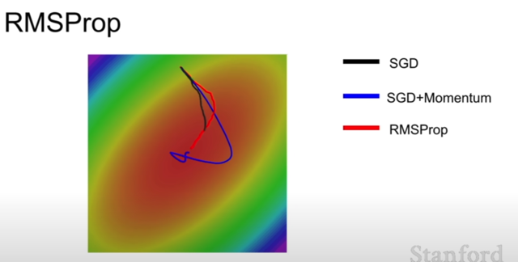</kbd>

  > HÌnh ảnh minh họa cho thấy tuy cả RMSProp và SGD Momentum đều
> giúp converge nhanh hơn SGD Nhưng RMSProp không có tình trạng **"đi
> lố qua rồi quay về" như SGD Momentum**
>
> Và cũng cho thấy AdaGrad (màu xanh lá) bị stuck khi lr nhỏ về 0

   

  
  
<kbd>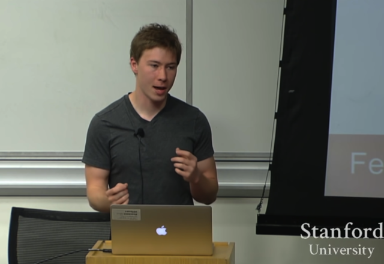</kbd>

  > Có câu hỏi là hình ảnh ở trên có phải là convex case hay không (ý nói nếu là
> convex case thì đáng lẽ **adagrad cũng phải ok chứ** vì như trên đã nói tính
> chất lr giảm dần chỉ là nhược điểm nếu ở non-convex case.
>
> Câu trả lời đúng là ở trong minh họa trên có hơi thiếu công bằng với Adagrad
> khi đúng ra phải tuning learning rate mỗi cái mỗi khác cho từng phương
> pháp.

   

  
  
<kbd>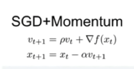</kbd>

  
<kbd>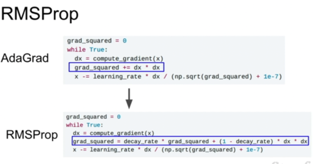</kbd>

  
<kbd></kbd>

  
<kbd></kbd>

  
<kbd>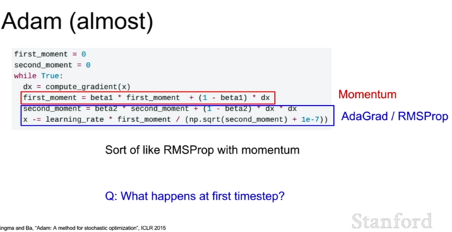</kbd>

  > Adam học theo ưu điểm của cả **SGD Momentum** với việc dùng
> first_moment để update thay vì gradient và của**AdaGrad/RMSProp** với
> việc dùng second_moment để adjust learning rate
>
> Có vấn đề đó là ở những bước đầu tiên, vì việc khởi tạo second_moment
> = 0 nên second_moment sau khi tính toán mang giá trị rất nhỏ, dẫn đến
> Việc scale lr khi chia nhỏ nó làm lr trở nên lớn, điều này không ổn

   

  
  
<kbd>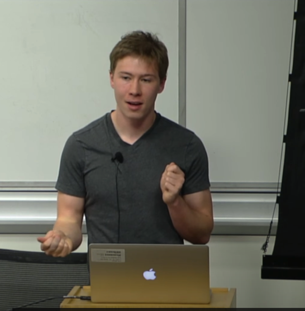</kbd>

  > Có câu hỏi nếu first moment cũng nhỏ thì chẳng phải là tử số nhỏ, mẫu
> số cũng nhỏ thì huề (cancel out each other) sao?
>
> -> Đúng, nhưng rõ ràng là cũng hên xui khi hên thì đúng là như vậy,
> Nhưng xui khi **"bad initialized"** thì ta sẽ có lr rất lớn khiến gây vấn đề
> không thể converge

  > Câu hỏi nữa là 10^-7 là sao, thì đó chỉ là
> con số nhỏ để tránh việc chia cho 0

   

  
  
<kbd>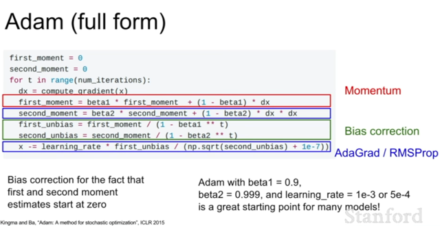</kbd>

  > đại khái là ta khắc phục vấn đề trên bằng cách thực hiện "**bias
> correction**" đó là ta sẽ thu nhỏ first_moment và second_moment lại
> bằng cách **chia cho (1-beta1^t) và (1-beta2^t)**
>
> Hiệu quả là trong các giai đoạn đầu khi t =1,2, thì beta1^t sẽ bằng 0.
> 9^1 = 0.9, 1-beta1^t = 0. 1 -> **giúp điều chỉnh first_moment lớn lên
> x10 (second_moment cũng tương tự)**
>
> Nhưng sau đó,**t lớn dầ**n, beta1^t lớn dần thì beta^t nhỏ dần,
> 1-beta^t sẽ tiến dần về 1 dẫn đến **vô hiệu quá cơ chế bias
> correction**

   

  
  
<kbd>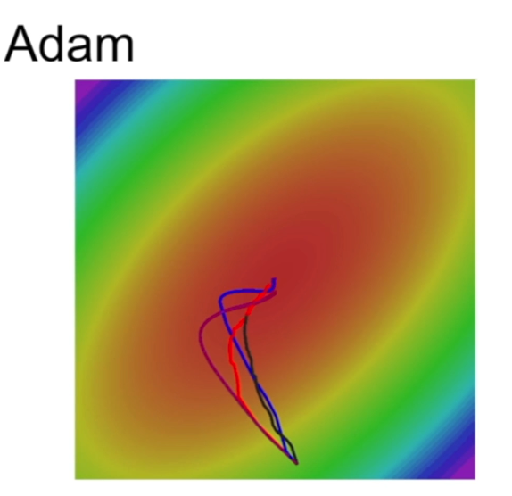</kbd>

  
<kbd></kbd>

  
<kbd>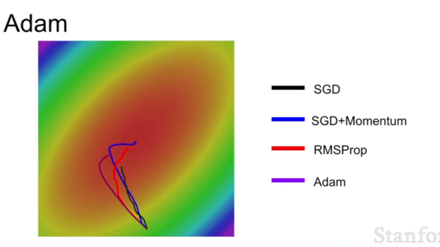</kbd>

  > Hình ảnh cho thấy Adam có đặc điểm giống SGD momentum ở chỗ nó
> cũng "đi lố qua rồi quay lại" (overshoot) nhưng không  nhiều bằng.
>
> Nó cũng giống RMSProp khi nó cố gắng cân bằng progress ở mọi
> dimension nên đường đi của nó có vẻ ôm cua bớt gắt hơn là RMSProp.

   

  
  
<kbd>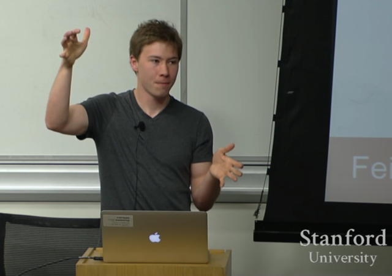</kbd>

  > Một câu hỏi đặt ra có trường hợp nào Adam cũng không thể làm tốt
> không?
>
> -> Câu trả lời đó là có, đó là khi ta có hình dạng của taco shell nhưng lại bị
> nghiêng (tilted) Trong hình ảnh của optimization landscape ở trên kiểu như
> là ta có một lòng chảo, hay một cái bánh taco shell để thẳng trục
> (axis-aligned), và ở trạng thái này,  Adam nó kiểu nhu điều chỉnh tốc độ đi
> theo từng hướng đơn lẻ để tạo  ra cách di chuyển tốt nhất. Tuy nhiên nếu
> optimization landscape bị nghiêng, thì việc Adam điều chỉnh sẽ chỉ giống
> như có tác dụng làm tròn bớt trạng thái dẹt của cái bánh taco-shell, nhưng
> không thể thay đổi sự nghiêng của nó.
>
> Do đó trong các trạng thái optimization landscape như vậy (poor conditioning)
> thì cả Adam và các algorithm khác để không làm tốt được

   

- To understand why Adam struggles with \\*poor conditioning\\*, let's delve a bit deeper into what poor conditioning means and how Adam operates.  ### Understanding Poor Conditioning  In the context of optimizing neural networks, conditioning refers to how well-suited the landscape of the optimization problem is for gradient-based methods. A well-conditioned problem has gradients that consistently guide the optimization algorithm towards the minimum. In contrast, a poorly conditioned problem has a landscape where the path to the minimum is not straightforward due to irregular shapes, steep valleys, or flat regions. The gradients in such landscapes can be misleading, too steep, or too shallow, making it hard for the optimization algorithm to find the optimal path.  ### How Adam Works  Adam (Adaptive Moment Estimation) is an optimization algorithm that combines ideas from two other algorithms: RMSprop and Momentum. Adam maintains a learning rate for each parameter of the model and adjusts it individually. It does this by calculating the first moments (the mean) and the second moments (the uncentered variance) of the gradients. This allows Adam to adapt the parameter updates based on the observed gradients, making it faster and more efficient in many cases.  ### The Limitation of Adam in Poorly Conditioned Problems  1. **Axis-Aligned Adjustments**: Adam adjusts its steps based on the gradients it observes along each dimension (parameter) independently. This works well when the optimal path is aligned with the parameter axes or when the gradients provide a clear direction towards the minimum.  2. **Tilted Landscapes and the Taco Shell Analogy**: Imagine a scenario where the optimization landscape is tilted, akin to a taco shell. In such cases, the optimal path to the minimum is not aligned with the axes of the parameters. Since Adam adjusts each parameter based on its gradient, it effectively "squishes" the taco shell along the axes, but it does not correct for the tilt of the shell itself. The algorithm lacks a mechanism to recognize and adjust for the overall orientation of the landscape.  3. **Inefficiency in Adjusting to the Landscape's Orientation**: Adam's adjustments are efficient when the gradients directly point towards the minimum. However, in a tilted landscape (poor conditioning), the gradients along the axes don't offer the most direct path to the minimum. Since Adam does not combine information from multiple dimensions in a way that adjusts for the tilt, it may take inefficient paths, requiring more iterations or even failing to converge to the global minimum.  4. **Sensitivity to Gradient Noises and Magnitude Variations**: In poorly conditioned landscapes, gradients can vary widely in magnitude or direction, leading to erratic updates. Although Adam attempts to mitigate this by adjusting learning rates based on the variance of the gradients, its effectiveness is limited when the problem's conditioning causes inherent instability in the gradient directions or magnitudes.  In summary, Adam's strategy of independently adjusting each parameter based on its observed gradients is less effective in poorly conditioned landscapes where the path to the minimum requires a coordinated adjustment across multiple dimensions, taking into account the overall orientation of the landscape. This is why Adam, while powerful in many contexts, faces challenges in situations of poor conditioning.
   

    
    
<kbd>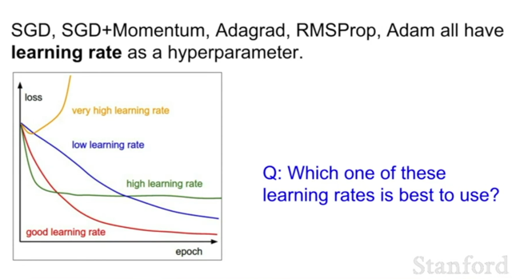</kbd>

    > Một hyperparams quan trọng cần được quan tâm là **learning
> rate**. Nếu lớn quá sẽ gây divergences, nhỏ quá thì làm training
> chậm

     

    
    
<kbd>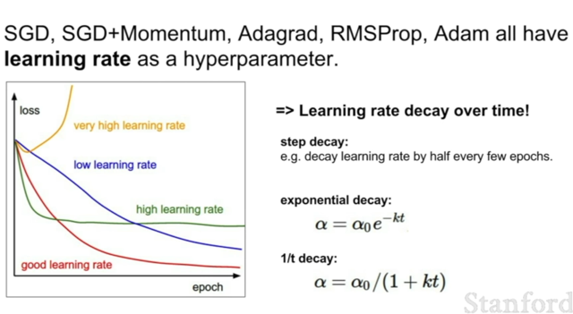</kbd>

    > Một cách làm đó là bắt đầu với lr lớn và giảm learning rate từ từ  gọi là "
> learning rate decay". Một số cách làm như step decay - cứ vài epoch là
> giảm 1 nửa (hay tỉ lệ nào đó) learning rate. Hoặc exponential decay, trong
> đó lr sẽ giảm liên tục

     

    
    
<kbd>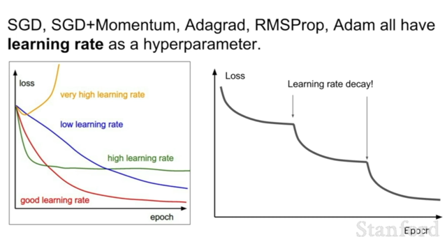</kbd>

    > giảng viên có chia sẻ thêm đó là l**earning rate decay**hay được dùng
> với **SGD momentum** và ít hơn với Adam
>
> và ta **nên thử với fixed lr trước**, sau đó**xem xét có cần lr decay
> hay không.**

     

    
    
<kbd>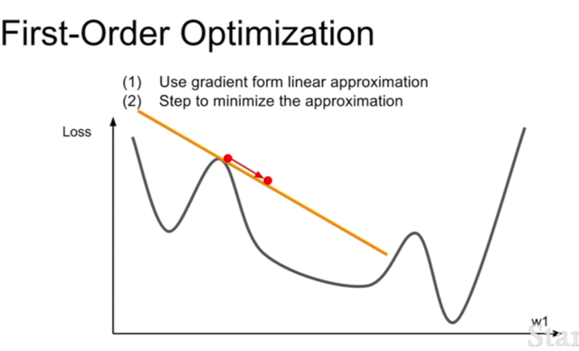</kbd>

    > Có thể hiểu đại ý là vầy, khi ta dùng **đạo hàm của loss hay cost function w.r.t
> parameters** để update params theo hướng khiến loss tăng hoặc giảm (nếu
> update theo hướng ngược lại) thì thật ra ta đang kiểu như là**ước chừng
> (approximate) function như một linear function**.
>
> Hay nói cách khác, việc dùng đạo hàm cấp 1 của function f(x) tại x chính là ta
> **đang "coi như" function f(x) xấp xỉ một linear function** (dù thật sự không phải
> vậy, nó là phi tuyến, nó có độ cong - curvature). Hình ảnh này đồng nghĩa **ta
> đang "cho rằng" (một cách bỏ qua sự chính xác) function f chính là đường tiếp
> tuyến tại x** (đường màu cam tạm gọi là hàm f').
>
> Thì dĩ nhiên theo đó thì để **tăng giá trị của f lên thì phải thay đổi x theo hướng
> khiến f' tăng lên**.
>
> Tuy nhiên vì ta chỉ đang approximate nên**đương nhiên không thể chính xác**
> thành ra **chỉ có thể "dùng" sự ước lượng đó trong một khoảng nhỏ** nơi mà sự
> ước lượng đó còn tạm gọi là đúng. Còn khi đi xa hơn ở điểm đó thì sự ước  lượng
> cũ trở nên thiếu chính xác nên phải ước lượng lại.
>
> Chính vì điều này mà phải có **learning rate để khống chế "step size"**Ý thứ hai muốn nói khi nhắc tới **Taylor series**là cách ta có thể ước chừng
> **approximation giá trị của một function f(x) gần một điểm a nào đó** bằng cách
> dùng **derivative của function tại a.**Theo đó nôm na là ta có thể dùng thêm đạo
> hàm cấp 2,3,...của f(.) tại a, để approximate chính xác hơn hàm f, thay vì chỉ "coi"
> nó như linear với việc chỉ dùng gradient (cũng là đạo hàm cấp 1, first order
> approximation của chuỗi Taylor).

     

  
  - The explanation revolves around the concept of first-order optimization algorithms, which are a foundational aspect of gradient descent and its variants like SGD (Stochastic Gradient Descent), Adam, RMSprop, etc. Let's break down the idea for clarity:  ### \\*First-Order Optimization Algorithms \\* - **Definition**: First-order optimization algorithms utilize the first derivative (gradient) of the objective function to guide the search for a minimum. The "first-order" refers to the use of the first derivative in the optimization process.  - **Objective Function**: This is the function you're trying to minimize (or maximize) during the optimization process. In machine learning, this is often the loss or cost function, representing the difference between the predicted values and the actual values.  ### The Process Described  1. **Current Point in Red**: Imagine you're visualizing the loss function, and you're currently at a specific point (marked in red), which represents your current parameters' values.  2. **Computing the Gradient**: At this red point, you calculate the gradient of the objective function. \\*The gradient gives you the direction of steepest ascent\\*; in other words, if you were to move in the direction of the gradient, you would \\*increase the function's value fastest\\*. Since we want to \\*minimize the function\\*, we move in the \\*opposite\\* direction of the gradient.  3. **Linear Approximation via First-Order Taylor Expansion**: The gradient information is used to \\*create a linear approximation of the objective function\\* around the current point. This approximation is essentially a first-order Taylor series expansion of the function. \\*The Taylor series is a way to approximate a function as a sum of its derivatives at a certain point, and the first-order approximation involves just the function value and its first derivative (gradient) at the current point\\*.  4. **Minimizing the Approximation**: With this l\\*inear approximation\\*, you then \\*pretend that this simpler, linear function is your actual objective function\\* and make a step intended to minimize it. This step is calculated based on the gradient and possibly adjusted by the learning rate or other mechanisms in more sophisticated algorithms.  5. **Limitation of the Approximation**: The linear approximation is \\*only accurate near the current point. \\* As you move away from this point, the approximation becomes \\*less reliable\\*, which means you \\*can't make very large steps based on this approximation\\* without risking overshooting or diverging from the minimum.  6. **Focus on First Derivative**: The key takeaway is that these algorithms \\*primarily rely on information from the first derivative of the function\\* (hence "first-order"). They\\* do not take into account higher-order derivatives\\*, which would \\*provide more information about the curvature of the function and potentially allow for more efficient optimization strategies.\\*  ### Implications  The reliance on first-order information makes these algorithms\\* relatively simple\\* and c\\*omputationally efficient\\*, \\*suitable for a wide range of problems\\*. However, it also imposes \\*limitations\\*, particularly in \\*handling complex landscapes with sharp curvatures, saddle points, or poorly conditioned areas\\* where a \\*linear approximation does not adequately represent the function's behavior\\*. In such cases, \\*second-order methods, which incorporate second derivatives (the Hessian matrix)\\*, could potentially offer \\*more accurate and efficient optimization,\\* albeit at a \\*higher computational cost.\\*
     

      
      
<kbd>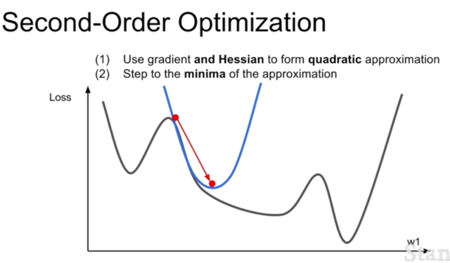</kbd>

      > Vậy thì đại ý là với first order approximation, ta **chỉ đang tập trung / hay chỉ dùng
> sự xấp xỉ cấp 1** - first order approximation của **chuỗi Taylor** - vốn **có thể cung cấp
> một sự xấp xỉ chính xác với các 2nd-order, 3rd-order** ....approximation nữa.
>
> Do đó, nôm na là ta **có thể cải thiện thêm**, bằng cách **đưa thêm 2-nd order
> approximation**vào, cụ thể thì ta sẽ dùng**cả gradient**(là đạo hàm cấp 1) và
> **Hessian** (là đạo hàm cấp 2) để**approximate loss function như một quadratic
> function** (dùng đạo hàm cấp 1 thì chỉ ước lượng như linear function)
>
> Từ đó ta có thể cải thiện thêm quá trình optimization. Hiểu nôm na là với việc
> approximate chính xác hơn thì sẽ ước lượng đúng hơn cái hướng phải thay đổi
> params, dẫn đến qúa trình training sẽ hiệu quả hơn

       

      
      
<kbd>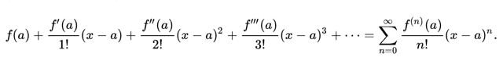</kbd>

      
<kbd></kbd>

      
<kbd>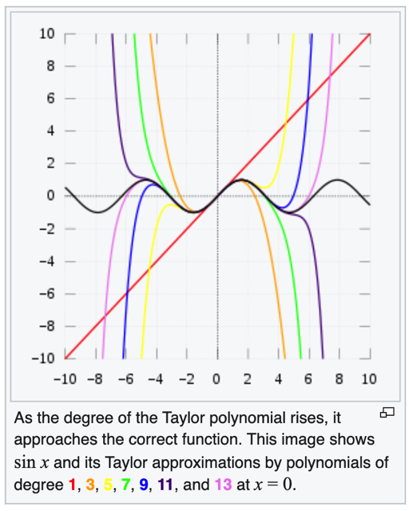</kbd>

       

      
      
<kbd>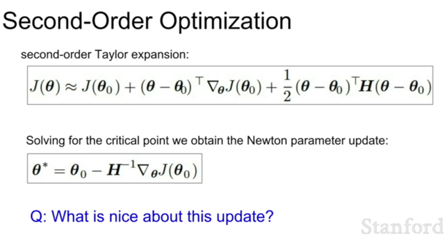</kbd>

      > Từ đó ta đưa thêm 2nd order approximation bằng cách **tính Hessian matrix**
> kí hiệu H, từ đó t**ính H inverse** và **nhân với gradient của loss function tại
> điểm hiện tại** và dùng cái này để update parameter về điểm khiến quadratic
> approximate của loss function đạt minimum. Đây chính là **Newton step.**
>
> Và với cái này (ít nhất là tại phiên bản vanilla của nó), ta **không cần đến
> learning rate** nữa. ý tưởng là khi **đã ước lượng xấp xỉ (approximate) loss
> function như / bằng một quadratic (hàm bậc 2, parabol)** thì ta **chỉ việc nhảy
> ngay tới điểm (giá trị của parameter) khiến function minimized**. Khác với
> việc ước lượng xấp xỉ với linear thì ta chỉ có thể "thận trọng" đi theo hướng
> giảm loss.
>
> Tuy nhiên thực tế thì**vẫn cần learning rate** vì như đã nói dù là việc sử dụng
> 2nd-order approximation giúp tăng sự chính xác thì nó vẫn còn xa mới tuyệt
> đối được, nên c**hỉ có thể đi theo hướng dẫn đến minimum của quadratic**
> function chứ không nên nhảy ngay xuống điểm đó.

       

      
      
<kbd>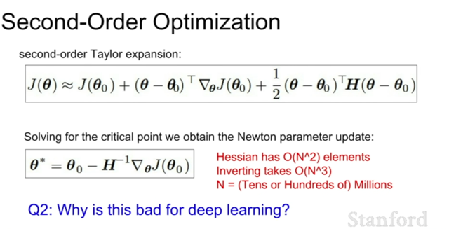</kbd>

      > tuy nhiên cách làm "vanilla của Newton update" không
> khả thi vì **Hessian matrix quá lớn**, không thể fit in memory

       

      
      
<kbd>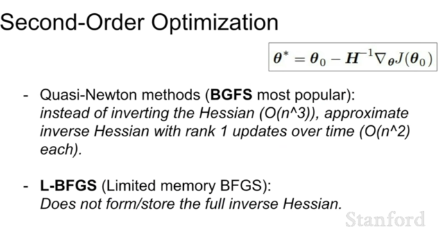</kbd>

      > Do đó trong thực tế đôi khi người ta dùng Quasi-Newton method,
> trong đó thay vì tính toán với Hessian matrix và invert của nó thì
> người ta **tính toán ước lượng,** phổ biến là "**low-rank approximation**"

       

      
      
<kbd>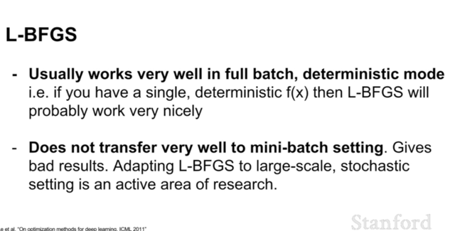</kbd>

      > Lướt sơ qua L-BFGS thuộc loại này, tuy nhiên nó có những nhược điểm
> Khi **không hiệu quả khi training với stochastic GD** và cũng có xu hướng
> **không work tốt với non-convex problem**

       

      
      
<kbd>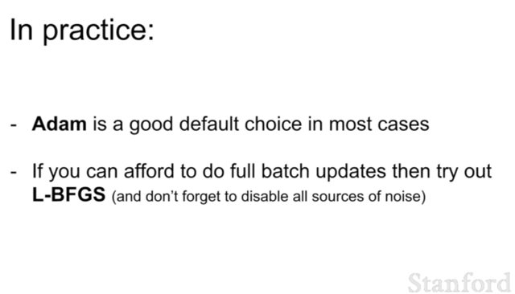</kbd>

      > Kết luận là thực tế ta nên dùng Adam như lựa chọn mặc định cho
> phần lớn trường hợp. Còn trong trường hợp ta có thể cho phép
> full-batch update thì có thể thử L-BFGS
>
> Ví dụ mình có thể dùng nó trong bài toán "style-transfer"

       

<kbd>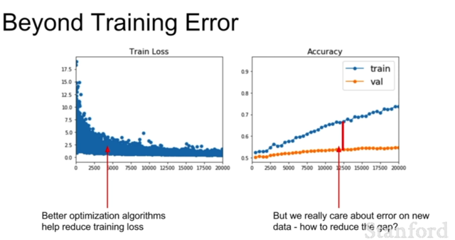</kbd>

> [!NOTE]
> đại khái là nhắc lại rằng dù các **optimization algorithm cải tiến** vừa nói giúp
> training **converge tốt hơn**, từ đó **tăng training performance**nhưng mục tiêu
> của ta khi train model là **khả năng generalize tốt,** cụ thể hóa bằng việc
> **khoảng cách giữa train và validation accuracy phải nhỏ**

 

<kbd>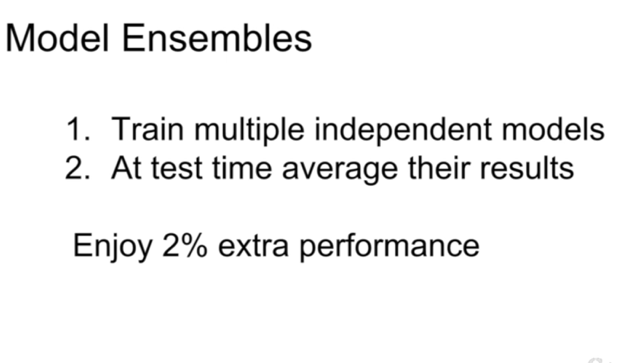</kbd>

> [!NOTE]
> một trong những cách để giảm overfit đó là **model ensembles**- dùng
> nhiều thay vì chỉ 1 model và dùng kết quả đồng thuận của chúng. Kinh
> nghiệm cho thấy giảm overfit, tăng generalization performance

 

<kbd>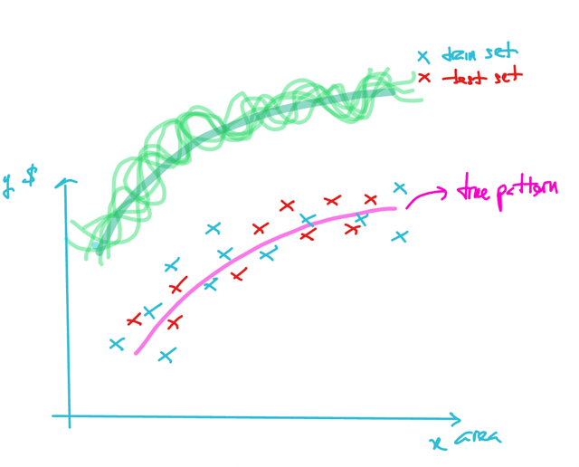</kbd>

<kbd></kbd>

<kbd>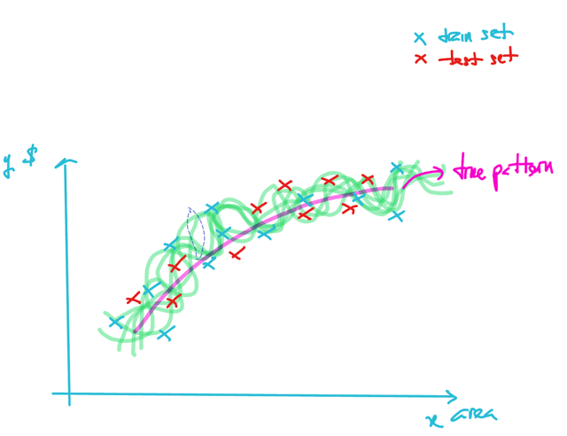</kbd>

 

<kbd>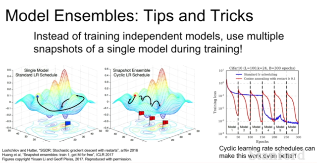</kbd>

> [!NOTE]
> một cách làm rất hay đó là thay vì training nhiều model một cách tách bạch
> thì ta có thể kiểu như training 1 model nhưng **dùng các "snapshot"** (các
> bộ param của nó ở các thời điểm khác nhau) để đóng vai trò như các model
> đơn lẻ.
>
> Một phương pháp nữa là**training với lr lúc cao lúc thấp trong một learning
> rate schedule hơi dị** như vầy đại khái được cho rằng giúp model
> **converge về nhiều vùng khác nhau** và khi dùng tất cả các snapshot này
> với ensemble method thì ta sẽ giúp cải thiện performance hơn nữa

 

<kbd>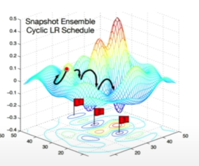</kbd>

<kbd></kbd>

<kbd>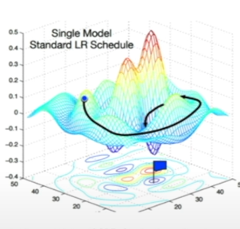</kbd>

 

<kbd>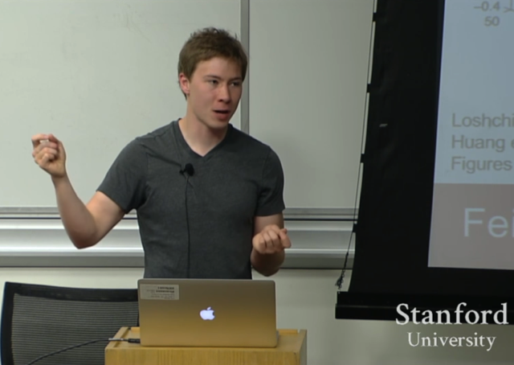</kbd>

> [!NOTE]
> Một câu hỏi đặt ra về việc ta quan tâm đến **khoảng cá**ch (the gap) giữa
> training performance và validation performance như thế nào?
>
> Câu trả lời đó là **nếu có khoảng cách lớn** giữa chúng thì đó là dấu hiệu của
> **overfiting**. Tuy nhiên nếu **không có khoảng cách nào thì chưa chắc đã
> tố**t. Cái chúng ta quan tâm đó l**à performance của model trên validation**
> set đạt mức nào. Nên n**ếu không có "gap" có thể có nghĩa là ta có thể đạt
> được performance tốt hơn nữa bằng cách cho nó overfit thêm một chút**

 

<kbd>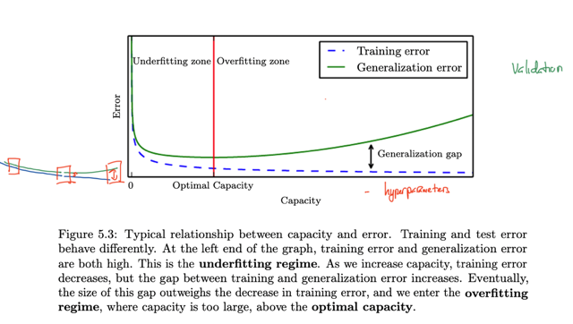</kbd>

 

<kbd>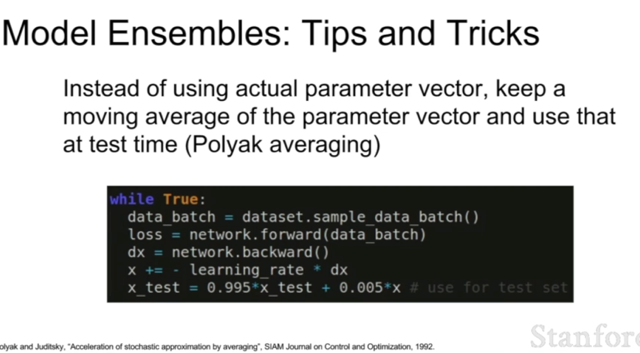</kbd>

> [!NOTE]
> đại ý là có một trick nữa trong đó thay vì dùng giá trị param,
> quá trình training ta sẽ dùng một bộ giá trị tính toán theo cách
> **"moving average"** (e.g exponential averaging decay) của
> params và dùng nó khi test. Đây gọi là phương pháp **Polyak
> averaging**, tuy vậy cái này không phổ biến lắm

 

<kbd>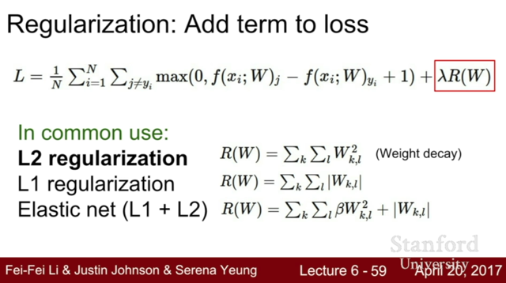</kbd>

> [!NOTE]
> đại ý là dù **ensemble method giúp giảm overfit**, nhưng liệu có cách nào để
> **giảm overfit trên mỗi single model hay không**. Những bài trước ta đã biết 
> về một regularization technique là L2 Regularization. Tuy nhiên trong 
> bối cảnh của **deep neural network thì cái này không hiệu quả lắm.**

 

<kbd>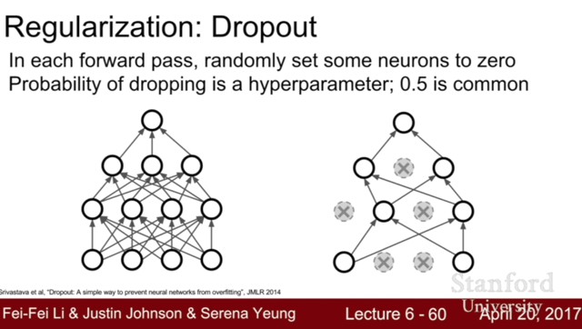</kbd>

> [!NOTE]
> **Dropout** regularization: trong quá trình**forward pass**, ta sẽ **randomly set một
> số**(với tỉ lệ gọi là **dropout rate**, thường dùng **0.5**) activation value = 0 (mang
> ý nghĩa là ta**tắt các neuron đi**).
>
> Thường được dùng với Fully Connected layer, và Convolutional layer.
>
> Hình ảnh có thể coi như với mỗi lần forward pass, ta đang **dùng và training 
> một neural network "nhỏ hơn"**. Và khi ta dùng "full" model thì giống như ta
> đang dùng **ensemble method** trên một bộ nhiều neural network nhỏ hơn đó.

 

<kbd>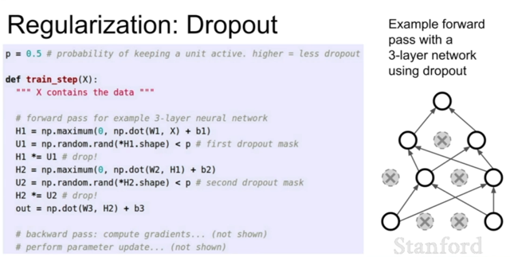</kbd>

> [!NOTE]
> đại ý là cách làm rất đơn giản, chỉ là **nhân (element wise)** **activation
> matrix** với **một matrix cùng shape mang các giá trị 0,1 ngẫu nhiên**
>
> (Trong code được tạo bằng random.rand cho ra matrix các giá trị 0-1 theo
> uniform distribution, việc so sánh < p cho matrix với 50% sẽ = 0,
> 50% = 1)

 

<kbd>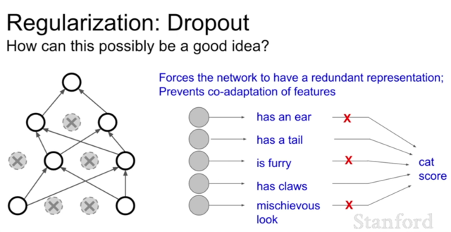</kbd>

> [!NOTE]
> Một lí giải nguyên nhân của sự hiệu quả của dropout là **giảm việc "
> chuyên môn hoá" của các neuron**, thay vì mỗi neuron đảm trách
> một nhiệm vụ thì nó sẽ san đều ra. Việc này chính là ví von về
> công ty **cho một nửa số nhân viên nghỉ mỗi ngày** của gs Andrew Ng
> giúp **tăng khả năng của mỗi nhân viên** và **giảm sự phụ thuộc của
> công ty vào bất cứ một cá nhân nào.**

 

<kbd>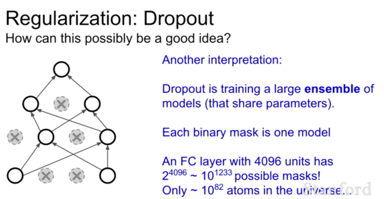</kbd>

> [!NOTE]
> một cách lí giải nữa mà chỉ gần đây mới xuất hiện đó là coi như
> ensemble learning như đã nói ở trên. (gs Andrew cũng có nói về
> cái này trong DLSpec).
>
> Số lượng binary mask (neural net con) của một FC layer có 4096
> neuron lên tới 2^4096 ~ 10^1233 trong khi số atom trong vũ trụ
> có 10^82 ý nói training với dropout là ta đang**dùng ensenble
> với một số lượng  khổng lồ các model**

 

<kbd>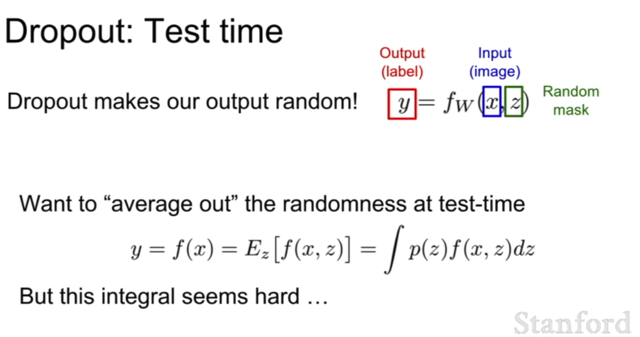</kbd>

> [!NOTE]
> Đại khái là vì lúc training ta có **đưa vào yếu tố ngẫu nhiên**, vậy thì khi test
> làm sao có thể xử lí chuyện này khi lúc này ta **không tắt các neuron** nữa
> nói cách khác là ta muốn **"dàn đều" sự ngẫu nhiên này ra**. Và làm vậy
> bằng c**ách tính / dùng một function trong đó có cả yếu tố ngẫu nhiên vào**
> dưới dạng gía trị kì vọng của function, với random variable là z - random
> mask.
>
> Giống như lấy ví dụ đơn giản khi ta muốn tính kì vọng của hàm f(z) với z
> theo Bernouilly distribution có param = phi. Thì **expectation của f = f(1)*p(Z=1)
> + f(0)*p(Z=0)**chính là giá trị của f có phản ánh sự không chắc chắn của z.

 

<kbd>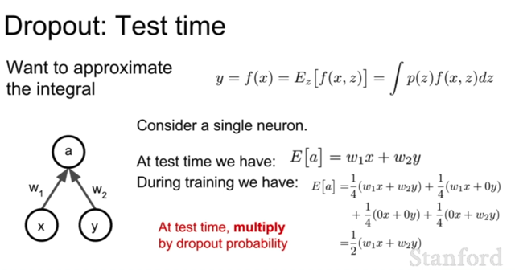</kbd>

> [!NOTE]
> Tuy nhiên tính chính xác như vậy khó (về mặt chi phí tính toán), do
> đó ta có thể tiếp cận theo cách approximation theo cách đơn giản là
> chia đi cho drop-out rate.
>
> Với lập luận lấy đơn giản cho giả sử có 2 neuron, ứng với w1, w2.
> Với drop out rate = 0.5 thì mỗi lần forward sẽ có thể có 1 em bị tắt.
> nên có thể có 4 trạng thái: với xác suất là 1/4. Vậy thì giá trị kì vọng
> của a là 
>
> 0.25(w1x+w2y) : giá trị hàm f() khi cả 2 cùng bật * xác suất 1/4
> 0.25(0*x+w2y)  : giá trị hàm f() khi neuron 1 tắt, neuron 2 bật * xác suất 1/4
> 0.25(w1x+0*y)  : giá trị hàm f() khi neuron 2 tắt, neuron 1 bật * xác suất 1/4
> 0.25(0*x+0*y)   : giá trị hàm f() khi cả 2 cùng tắt * xác suất 1/4

 

<kbd>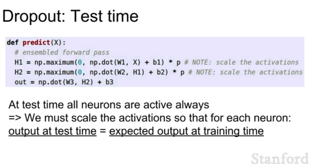</kbd>

 

<kbd>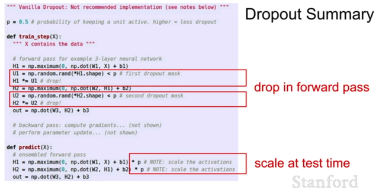</kbd>

> [!NOTE]
> Nói chung là thực hiện dropout tương đối đơn giản

 

<kbd>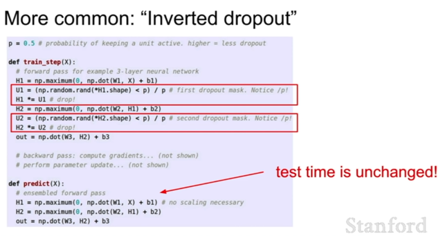</kbd>

> [!NOTE]
> đại khái là có khi người ta thực hiện "**inverted dropout**", trong đó việc ' thực
> hiện thêm một phép tính' được làm ở training - chia cho p, để khi test không
> cần phải làm gì (thay vì để việc này cho test time). Vì khi training ta sẽ run nó
> trên GPU nên không ảnh hưởng mấy còn **khi test time có thể ta muốn quan
> tâm nhiều hơn về "hiệu quả tính toán"**Có một câu hỏi là việc này sẽ ảnh hưởng thế nào đến quá trình training ->
> quá trình training sẽ **diễn ra lâu hơn do quá trình sẽ chỉ update một số các**
> neuron thôi, nhưng **generalization tốt hơn**

 

<kbd>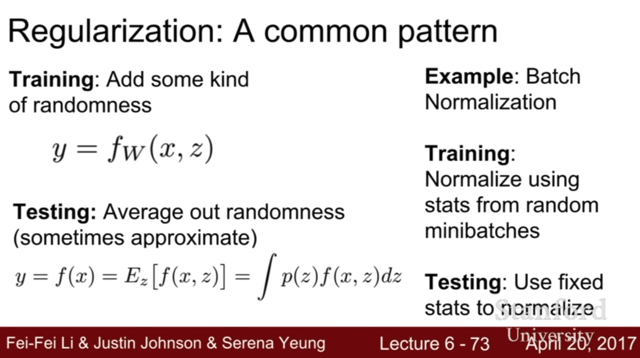</kbd>

> [!NOTE]
> đại khái là "drop out" là một cách làm cụ thể của một pattern chung hơn
> tạm gọi là "**đưa vào quá trình training những nhiễu động khíến gây khó
> dễ hơn cho model, giúp nó / bắt nó phải học tập hiệu quả hơn**". Sau đó
> lúc testing thì "average out" - dàn trải những nhiễu động này ra.
>
> Theo góc nhìn này thì technique **Batch Normalization cũng có tác dụng
> tương tự**, kiểu như là lúc training, mỗi lần, **model chỉ thấy và làm việc
> với một batch các data sample khác nhau**, do đó nó c**hỉ số statistic
> dùng để normalizing là khác nhau**, tức là nó thay đổi liên tục từ batch này
> qua batch khác khiến **tạo nên một yếu tố mang tính nhiễu động**, tương
> tự như dropout khi mỗi lần training nó phải dùng một bộ neuron khác nhau

 

<kbd>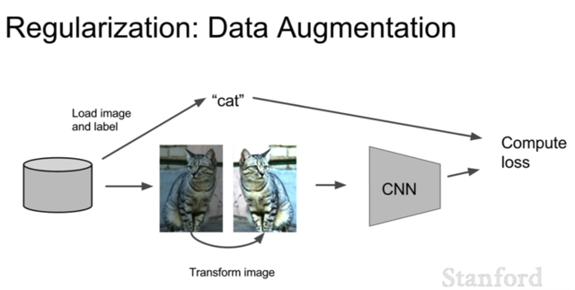</kbd>

> [!NOTE]
> một regularization technique phổ biến khác là **data augmentation**, trong đó
> Ta sẽ "chế" thêm các training sample nhưng không làm thay đổi label để từ
> đó t**ăng tính đa dạng** của training set. **Training set tăng sẽ giúp giảm overfit**

 

<kbd>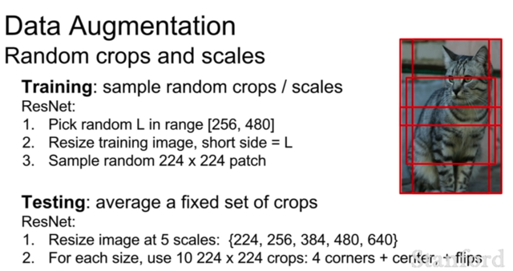</kbd>

<kbd></kbd>

<kbd>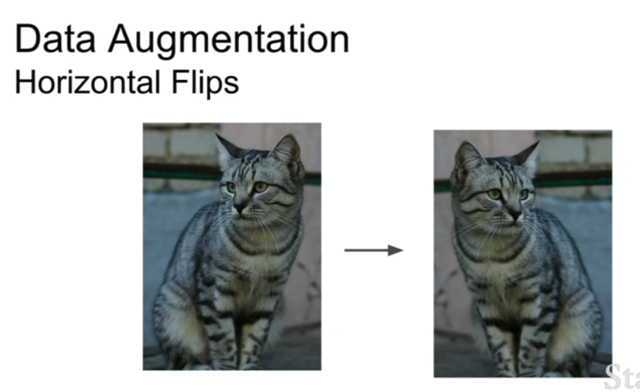</kbd>

> [!NOTE]
> đại khái có thể c**rop randomly** (khi training) và khi test thì average bằng cách
> test trên một bộ vài size khác nhau. Mỗi size sử dụng 10 crop: (4 góc + 1
> center)x2 (flip)

 

<kbd>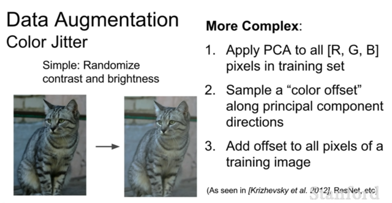</kbd>

> [!NOTE]
> có thể dùng các cách biến đổi khác như randomize contrast,
> brightness hay các phương pháp phức tạp hơn

 

<kbd>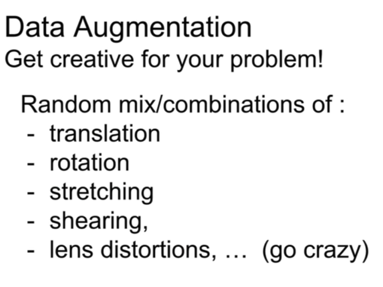</kbd>

> [!NOTE]
> nói chung ta có thể nghĩ ra các cách thức khác,
> miễn sao là đảm bảo không thay đổi bản chất của
> data

 

<kbd>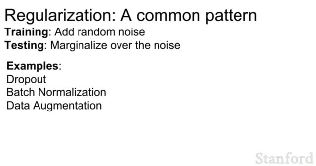</kbd>

 

<kbd>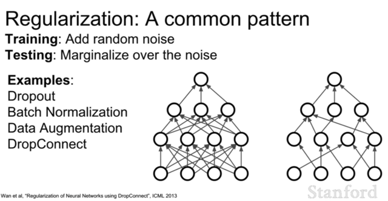</kbd>

> [!NOTE]
> một kiểu nữa gọi là **DropConnect**, thay vì zero out
> activation value thì người ta zero out một số value của
> weight matrix

 

<kbd>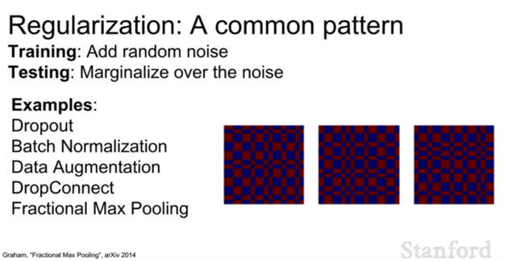</kbd>

> [!NOTE]
> tiếp theo nói về **fractional max pooling**, nôm na là ta không pooling với
> một fixed size window mà mỗi lần mỗi khác.

 

<kbd>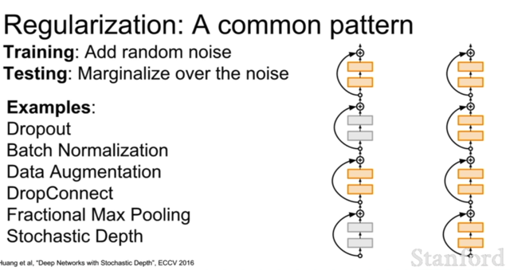</kbd>

> [!NOTE]
> một cách làm tương đối mới đó là stochastic depth - nôm na là
> tắt cả một layer, để mỗi lần như đang training một model có số
> layer khác nhau

 

<kbd>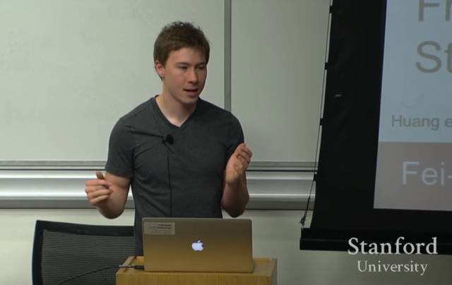</kbd>

> [!NOTE]
> câu hỏi là có phải ta sẽ luôn dùng hết tất cả các regularization technique
> này không.
>
> -> Có thể bắt đầu với batch-norm là đủ nhưng nếu thấy overfit thì thêm
> dropout vào. Nói chung là ta sẽ tăng dần, thêm dần các regularization
> technique vào khi thấy model overfit

 

<kbd>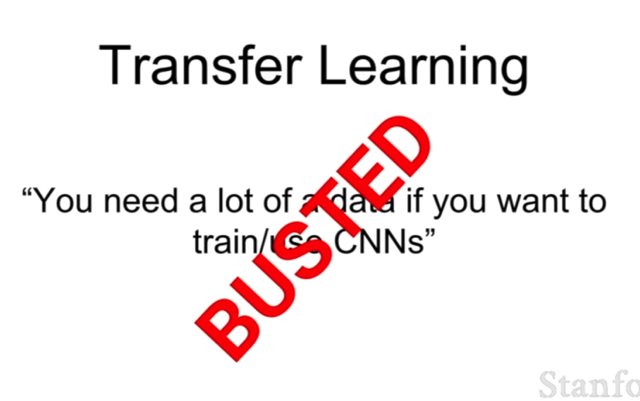</kbd>

 

<kbd>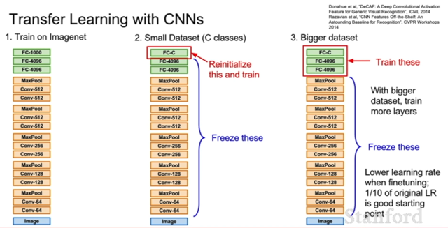</kbd>

> [!NOTE]
> đại ý là ta có thể **tận dụng các "kiến thức" từ một model đã pre-trained**,
> nhờ đó có thể có thể **chỉ cần ít data hơn** mà **vẫn train được deep
> learning model**. Thay vì như nhận định trước đây phải cần rất nhiều
> data mới training được.
>
> Cách làm đó là **tái sử dụng các layer phần "đầu-thân" đã được pre-train,
> và thêm vào layer** (hoặc vài layer cuối), train các layer này.
>
> D**ữ liệu càng nhiều thì có thể mở rộng phần re-train lên.**

 

<kbd>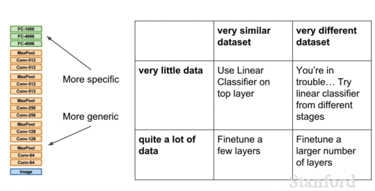</kbd>

> [!NOTE]
> đại khái là với**data có tính chất tương tự với data dùng để pre-train model**,
> Ta có thể chỉ cần train một**linear classifier** để dùng các**feature extracted
> bởi pre-trained layer.** Với nhiều data, có thể **fine-tune thêm các layer** như
> đã nói.
>
> Tuy nhiên với **data khác hẳn với pre-trained data**, ta cần dùng linear classifier
> ở các **stages khác có thể sớm hơn**(những layer ở đầu-giữa, nơi các feature
> có tính chất chung chung hơn).

 

<kbd>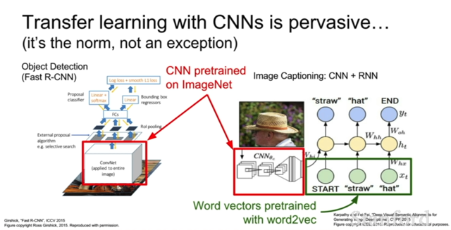</kbd>

> [!NOTE]
> đại khái là "**transfer learning**" là cách làm rất phổ biến, chứ không phải là
> ngoại lệ. Các hệ thống object detection như Fast R-CNN hay thực hiện
> nhiệm vụ image captioning đều có phần CNN được pre-train với
> IMAGENET, với cái sau, phần input vào RNN (tức các text được generated
> sẽ chuyển thành word embedding - được pre-trained với word2vec

 

<kbd>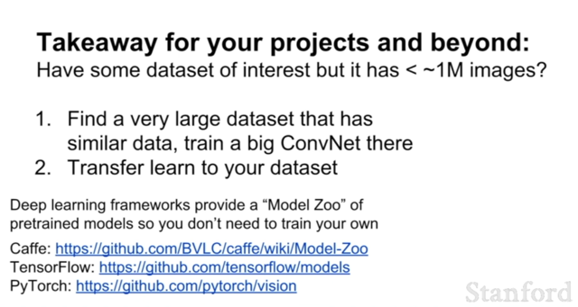</kbd>

> [!NOTE]
> Khi cần thực hiện một project mà dataset ít, ví dụ < 1 triệu image.
> Xem có thể tìm được một large dataset tương tự không, có thì train
> với một big ConvNet và transfer learning với dataset của mình

 

<kbd>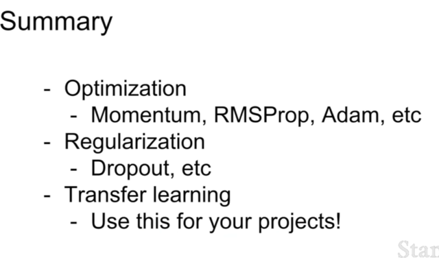</kbd>

 

