# Lecture 9/16 - CNN Architecture

📊 **Progress:** `62` Notes | `77` Screenshots

---

<kbd>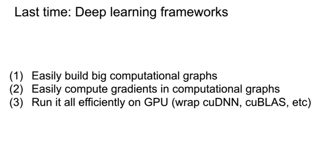</kbd>

 

<kbd>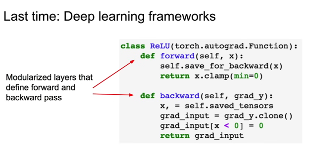</kbd>

 

<kbd>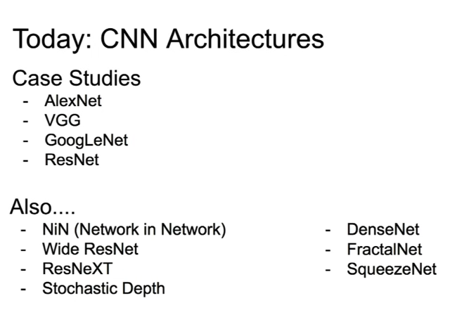</kbd>

 

<kbd>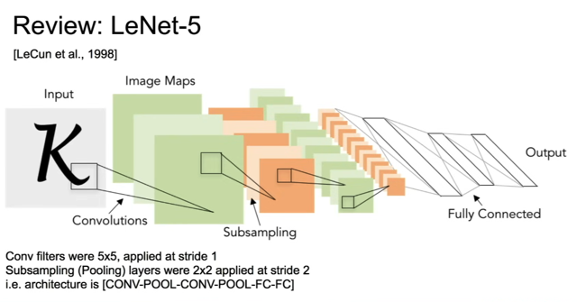</kbd>

 

<kbd>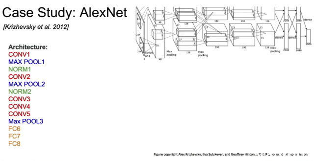</kbd>

> [!NOTE]
> AlexNet cơ bản là cũng khá giống LeNet
> với các Conv layer theo sau bởi Pooling,
> cuối cùng là các FC layer

 

<kbd>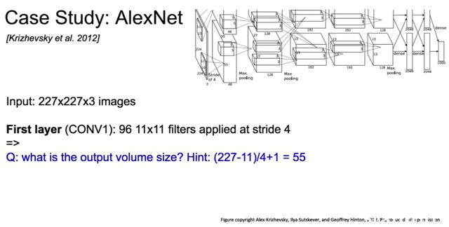</kbd>

> [!NOTE]
> AlexNet train với input là ImageNet image nên có input size là 227x227x3.
>
> Hỏi sau Convolutional layer đầu tiên với 96 filters 11x11 thì output size là  bao
> nhiêu.
>
> -> Theo công thức output width & height sẽ là: {round down [(input w +
> 2*padding - filter size) /stride} + 1]
>
> Round down [227 + 2p (padding) - filter size] / s (stride)  = round down (227 -
> 2*0 - 11)/4 + 1
>
> = 55
>
> Với 96 filter thì đương nhiên output depth 96, vậy output sẽ là 55x55x96

 

<kbd>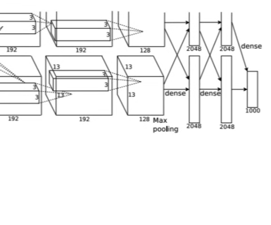</kbd>

<kbd></kbd>

<kbd>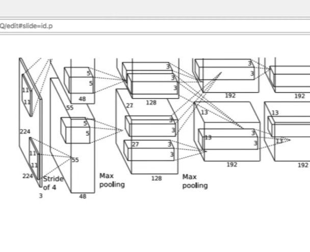</kbd>

 

<kbd>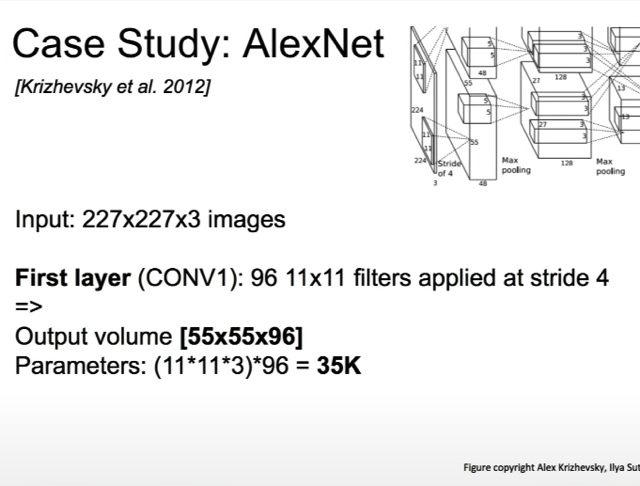</kbd>

> [!NOTE]
> số parameters của conv1: đương nhiên là tính từ kích thước và số lượng filter:
>
> Mỗi filter: 11x11x3 weights, cộng 1 bias là 11x11x3+1 = 363 + 1 = 364 parameters
>
> Vậy có 96 filters, 364x96 = 34944 params. Nếu không tính bias thì đâu đó cỡ 34848

 

<kbd>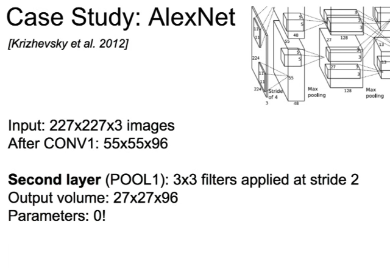</kbd>

> [!NOTE]
> Input spatial size là 55x55, pooling với 3x3 filter stride 2 output size sẽ là:
>
> Round down [(Input size - filter size) / stride] + 1 = (55-3)/2+1 = 26+1 = 27
>
> Output sẽ là 27x27x96 (output depth vẫn là 96)
>
> Số params: 0. Pooling chỉ là phép tính max / average nên ko có params

 

<kbd>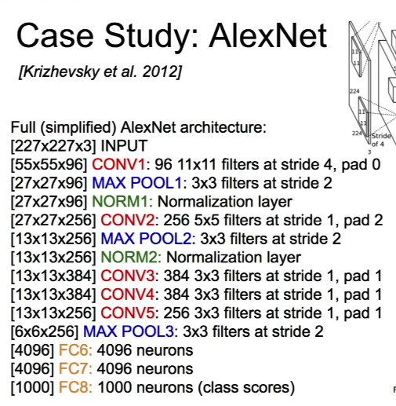</kbd>

> [!NOTE]
> một cái "cặp" conv - pooling layer, cuối cùng là
> vài FC layer trước khi output FC 1000 với
> softmax để ra probability ứng với 1000 class
> của ImageNet dataset

 

<kbd>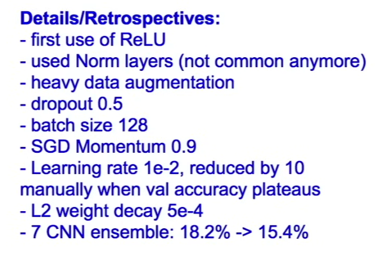</kbd>

> [!NOTE]
> một vài thông tin chi tiết về AlexNet đó là, 
>
> đây là mô hình đầu tiên dùng ReLU. 
>
> - Họ dùng Normalization layer dù hiện nay không còn phổ biến
>
> - Thực hiện data augmentation rất nhiều
>
> - Dropout layer với rate 0.5
>
> - Training với batch size 128.
>
> - Optimizer là SGD Momentum beta 0.9
>
> - Learning rate 1e-2, và dùng learning rate schedule theo chiến
> lược cứ giảm 10 lần mỗi khi accuracy plateaus
>
> - Dùng L2 weight decay (L2 regularization)
>
> - Cuối cùng là họ train 7 cái như vậy để dùng chúng theo
> Ensemble learning

 

<kbd>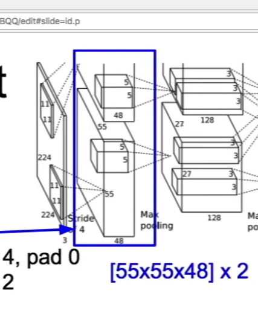</kbd>

<kbd></kbd>

<kbd>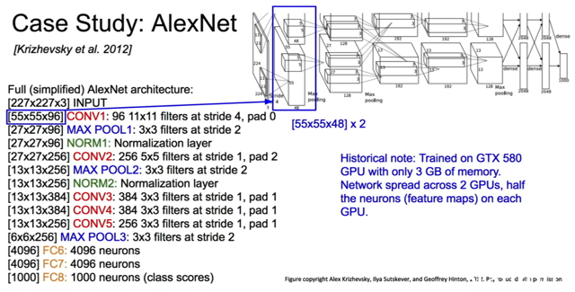</kbd>

> [!NOTE]
> có nghĩa là vì dung lượng của GPU thời đó không đủ nên họ
> thực hiện chia ra làm hai.
>
> Ví dụ như Conv1, 48 filter sẽ convol input trên GPU thứ 1, 
> 48 filter nữa sẽ convol input trên GPU thứ 2.

 

<kbd>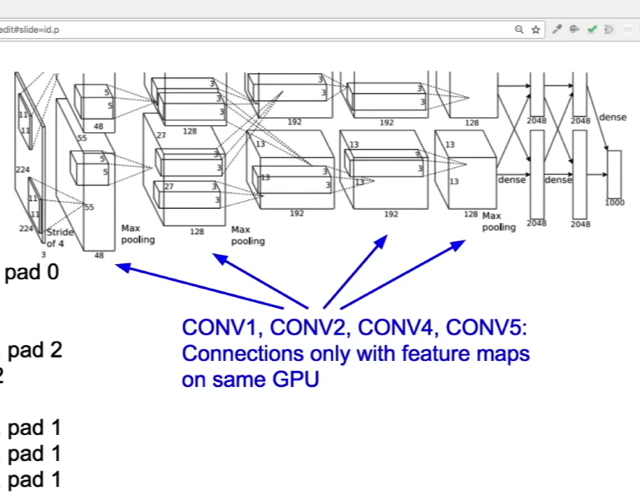</kbd>

> [!NOTE]
> tương tự, ở các conv1,2, 4,5 đều chỉ connect với feature map trong cùng gpu
>
> ví dụ conv2 256 filter 5x5 thì thật ra sẽ có 128 filter 5x5 convol input (output từ 
> pooling1-norm1) ở gpu 1, tạo ra cái tensor 27x27x128 thứ nhất. và 128 filter kia 
> sẽ convol input ở gpu thứ 2.

 

<kbd>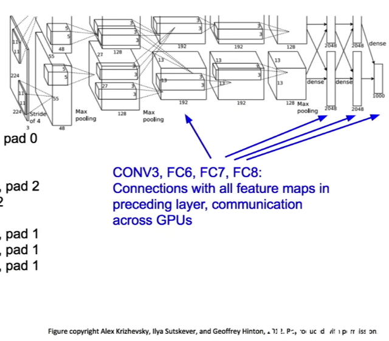</kbd>

> [!NOTE]
> nhưng conv3 384x3x3 thì sẽ có sự connection từ input feature map ở cả hai
> gpu.
>
> Nói ngắn gọn thì sau conv2-norm2, có sự đồng nhất giữa Hai GPU để mỗi cái
> đều có output từ conv2-norm2 ở cả hai gpu. gọi là f1, f2 mỗi cái đều là
> 27x27x128. Ở cả hai gpu, cả hai mới cộng lại để ra f: 27x27x128
>
> Và rồi mỗi gpu, conv3 sẽ convolution với 192 filter 3x3 với  cái f 27x27x128 này.

 

<kbd>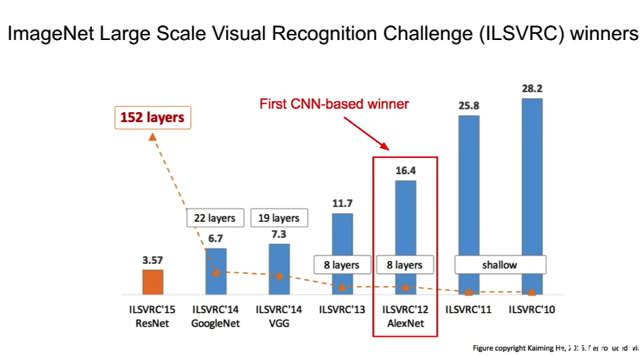</kbd>

> [!NOTE]
> AlexNet đã thắng giải ImageNet của năm 2012, với cách biệt rất đáng kể và
> vẫn phổ biến trong một thời gian dài sau đó (là kiến trúc sử dụng với
> transfer learning cho các bài toán khác).
>
> Chú ý trong hình là so sánh các model trên ImageNet theo error rate Những
> năm sau, các VGG, GoogleNet, ResNet đã vượt qua AlexNet
>
> Và đây cũng là cách tiếp cận Deep Learning đầu tiên trên ImageNet, trước
> đó như thấy trong hình, các cách tiếp cận thắng ImageNet năm 2010, 11
> vẫn là shallow

 

<kbd>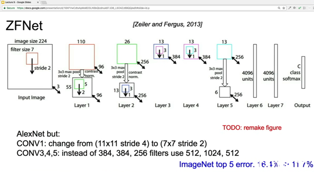</kbd>

> [!NOTE]
> thắng ImageNet 2013 là cơ bản vẫn là AlexNet nhưng với các
> hyperparams được tuned như dùng filter size khác, stride khác...giúp
> giảm error rate xuống hơn nữa tứ 16% của AlexNet xuống còn 11%

 

<kbd>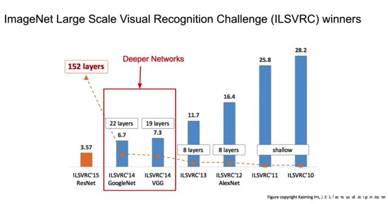</kbd>

> [!NOTE]
> thắng ImageNet trong hai năm tiếp theo
> chủ yếu là với cách tiếp cận "deeper" khi
> số layer tăng lên nhiều hơn

 

<kbd>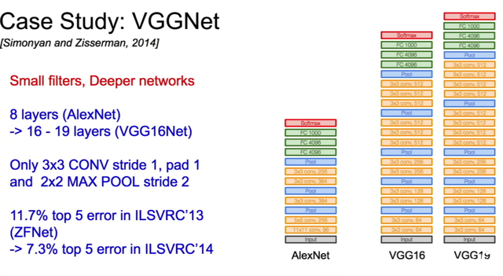</kbd>

> [!NOTE]
> So với AlexNet, thì VGG sâu hơn như đã nói, với 16 layer
> (thì gọi là VGG16) tới 19 layer (VGG19)
> *nói 16 layer thì chỉ tính các conv và pool layer thôi.không tính input, fc layer
>
> cái thứ hai đó là nó dùng filter size nhỏ là 3x3, stride 1, pad1, và pooling thì
> chỉ 2x2, stride 2.

 

<kbd>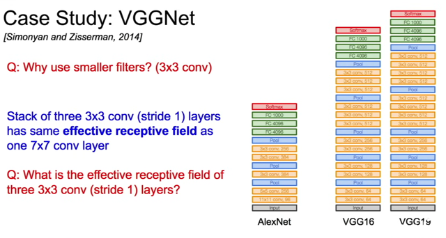</kbd>

> [!NOTE]
> Input 27x27, filter 7x7 output sẽ là (27-7)/1 + 1 = 21
>
> 27x27 -> f 7x7 -> **21x21**
>
> nếu filter là 3x3:
>
> 27x27 - f 3x3 -> 25x25 - f 3x3 -> 23x23 -f 3x3-> **21x21**Nhưng f 7x7 sẽ có 49 params
>
> f3x3 3 cái thì chỉ có 9x3 = 27 params

 

<kbd>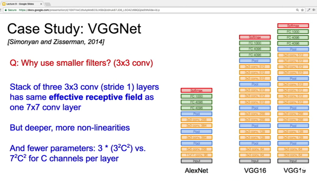</kbd>

<kbd></kbd>

<kbd>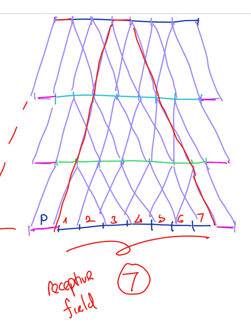</kbd>

> [!NOTE]
> tức là, qua 3 filter 3x3 thì tạo ra kết quả trong đó mỗi
> vị trí của output được nhận thông tin từ layer đầu
> tương đương với xài 1 filter 7x7

> [!NOTE]
> Nhưng số lượng param sẽ nhỏ hơn đồng thời, deeper sẽ cho phép
> nhiều non-linearity hơn -> tăng độ complexity của model

 

<kbd>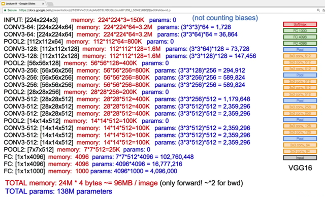</kbd>

> [!NOTE]
> Chi tiết số parameters của các layer (ta cho rằng nên thử tính
> lại như hồi nãy đã làm, good practice). 
>
> Tổng số các number chứa giá trị trong quá trình tính toán là 24M,
> với mỗi number cần 4 bytes thì tổng cộng sẽ là 96MB khi forward
> một image. Và giảng viên nói thêm là khi backward ta sẽ cần
> gấp đôi con số này vì cần phải save các intermediate value.
>
> Nên mới nói nếu ta có 5GB memory thì với ~100MB / image thì chỉ 
> có thể store khoảng 50 images
>
> Tổng số params là 138M (AlexNet là 60M)

 

<kbd>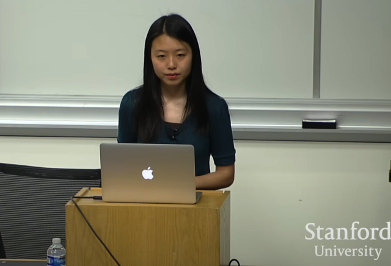</kbd>

> [!NOTE]
> câu hỏi đại khái là khi nói đến "deep" thì ý là số filter (ý là deeper có
> nghĩa là tăng depth = tăng số filter trong một convolution layer) hay là
> nói về số layer của model architecture
>
> -> Đúng là depth có thể khiến confuse, nhưng khi nói "deeper model"
> thì luôn đang nói đến số convolutional layer. Deeper tức là nhiều
> layer hơn

> [!NOTE]
> Đại khái câu hỏi là gì chưa rõ nhưng t.a nhắc lại quá trình trong một
> convolution layer đó là, mỗi filter sẽ kiểu như nhìn vào trong input
> mỗi lần là một vùng ví dụ 3x3, để rồi convolution qua hết cái input thì
> cho ra một "feature map".
>
> Và nhiều feature map tạo ra bởi nhiều filter sẽ stack together để thành
> Output

> [!NOTE]
> Đại khái câu hỏi là gì có phải là / có một quy tắc nào trong việc khi go 
> deeper thì số channel / số filter càng tăng hay không.
>
> Thật ra là không, đơn giản chỉ là vì người ta cho rằng, khi gỗ deeper,
> Spatial area ngày càng giảm đi (bề dài, bề rộng của tensor ngày càng
> nhỏ đi) thì cho phép tăng số filter lên mà không làm tăng quá mức số
> lượng tính toán. Chỉ vậy thôi.

> [!NOTE]
> Câu hỏi nữa là có thể dùng SVM loss thay vì Softmax không?
>
> -> Được, chỉ là người ta thử nghiệm thì thấy dùng softmax ok hơn nên
> dùng phổ biến cái này hơn thôi

 

<kbd>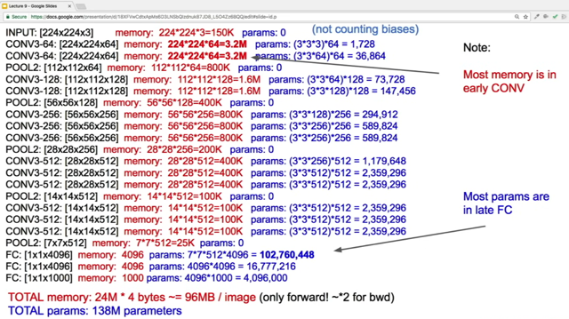</kbd>

> [!NOTE]
> Ta sẽ chú ý rằng phần tốn memory nhiều nhất là những
> conv đầu tiên khi nó phải take input original image có
> spatial area lớn cũng như là các fully connected layer
> cuối. Để tí nữa ta sẽ thấy các model sau này sẽ cố gắng
> khắc phục điều này

 

<kbd>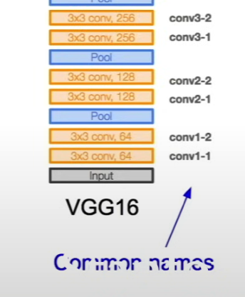</kbd>

> [!NOTE]
> một điểm cần để ý nữa đó là người ta
> cũng dùng cách gọi tên các layer theo
> group ví dụ như conv1-1

 

<kbd>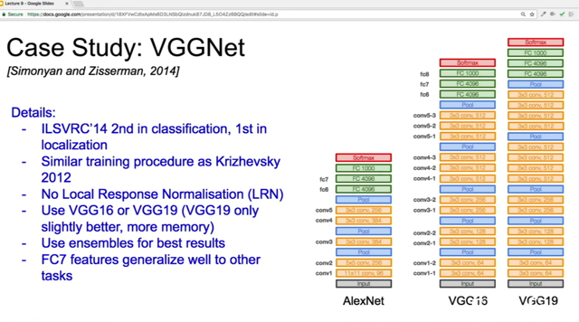</kbd>

> [!NOTE]
> một số ghi chú:
>
> VGGNet về nhứt ở hạng mục localization, về nhì ở classification trên 
> ImageNet 2014.
>
> Quá trình training tương tự AlexNet
>
> Không sử dụng Local Response Normalization, mà ở trên cũng có nói
> là cái này của AlexNet hiện giờ không còn được phổ biến sử dụng
>
> Dùng VGG16 hay 19 đều được
>
> Nên dùng ensemble technique để có kết quả tốt hơn - tức là ta sẽ train
> vài model và dùng như một team để lấy kết quả đồng thuận
>
> Cuối cùng output của FC7 được cho là nắm bắt được các general 
> pattern tốt để có thể sử dụng cho transfer learning đối với các task khác.
> Có nghĩa là ta có thể dùng output của FC7 của một pretrained VGG để
> train một model giải quyết một bài toán khác

> [!NOTE]
> Đại khái là localization assume là chỉ có một object, và
> model cần predict một bounding bõ cho nó. còn bài toán
> detection tuy rất gần vẫn có điểm khác. Ta sẽ được học
> trong phần sau

 

<kbd>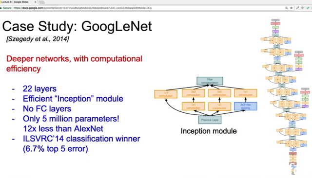</kbd>

> [!NOTE]
> GoogLeNet, giới thiệu "Inception" module.
>
> Như đã hiểu về nhược điểm của FC là sẽ tốn rất nhiều params,
> thì GoogleNet không còn dùng FC nữa.
>
> Để rồi tuy deeper, nhưng chỉ có 5M params = 1/12. AlexNet
>
> Nhưng độ hiệu quả thì hơn rất nhiều

 

<kbd>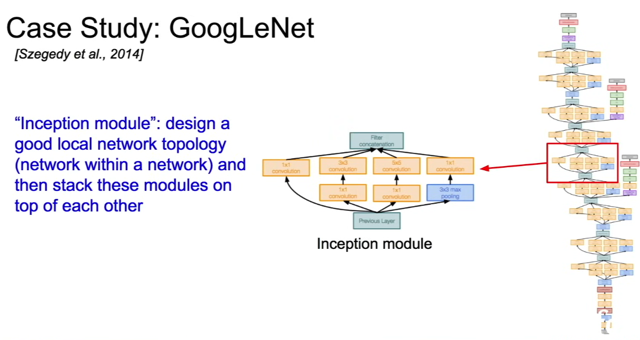</kbd>

> [!NOTE]
> Inception model: GoogleNet giới thiệu việc tạo
> ra các "local network" để rồi stack các module
> này lại để thành network lớn

 

<kbd>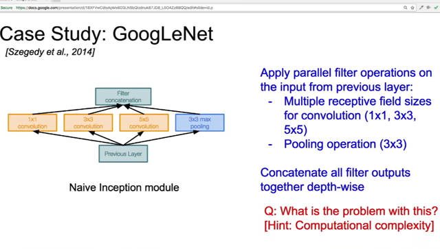</kbd>

> [!NOTE]
> đại khái là, input sẽ được convolution với nhiều filter có size khác nhau, như
> 1x1, 3x3, 5x5 để rồi concatenate lại depth-wise.

 

<kbd>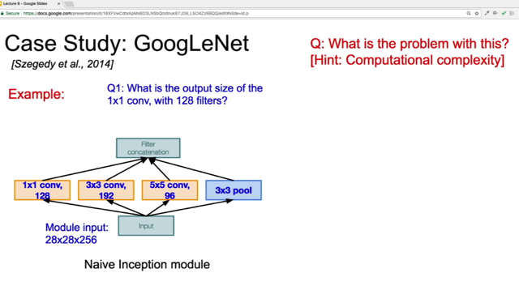</kbd>

> [!NOTE]
> 28x28x256 -1x1 128 (maintain spatial dimension, tức same padding) -> 28x28x128

 

<kbd>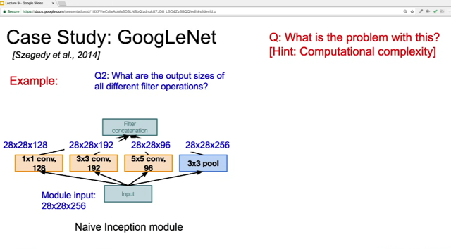</kbd>

 

<kbd>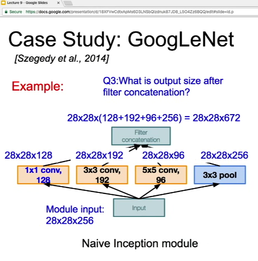</kbd>

 

<kbd>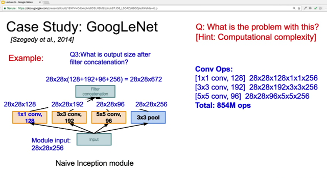</kbd>

> [!NOTE]
> Số phép tính trong 28x28x256 --1x1x128--> 28x28x128: 
>
> Filter size là 1x1, nhưng input's depth = 256, nên filter size là 1x1x256
> Vậy để convol input, tại mỗi vị trí (trong spacial map) sẽ cần 1x1x256 phép tính.
> Và có w,h = 28x28 vị trí thì sẽ cần 1x1x256x28x28 phép tính cho 1 filter, mà có 128
> filter nên tổng cộng sẽ là **1x1x256x28x28x128**
>
> Tương tự, số phép tính trong 28x28x256 --3x3x192-->28x28x192
> Filter size là 3x3, input depth = 256 nên filter shape là 3x3x256. Vậy mỗi vị trí
> khi convol sẽ cần 3x3x256 phép tính (product, ở đây nãy h không kể đến bias)
> Vậy tổng cộng sẽ có 3x3x256x28x28 phép tính cho 1 filter, mà có 192 filter nên
> sẽ là **3x3x256x28x28x192**Tương tự, cho mấy cái kia, để rồi cộng lại là **854M phép tính (operations)**

 

<kbd>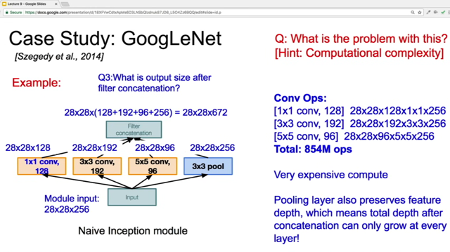</kbd>

> [!NOTE]
> một ý nữa đó là pooling chỉ giữ nguyên kích thước depth
> nên qua từng layer, depth chỉ tăng chứ không giảm. nên
> vấn đề ngày càng lớn khi qua các layer, số phép tính cần
> để thực hiện ngày càng lớn

 

<kbd>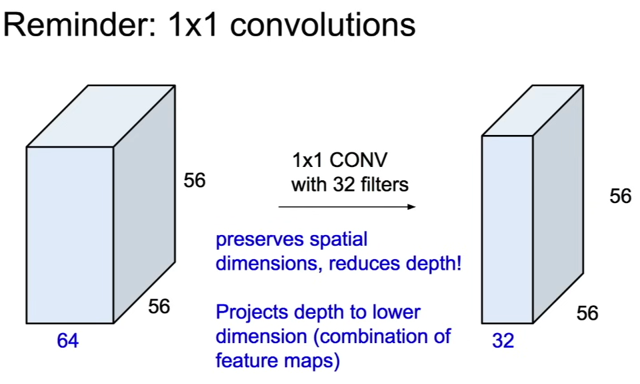</kbd>

> [!NOTE]
> cách khắc phục chính là dùng
> 1x1 conv để giữ nguyên spatial
> size nhưng giảm depth

 

<kbd>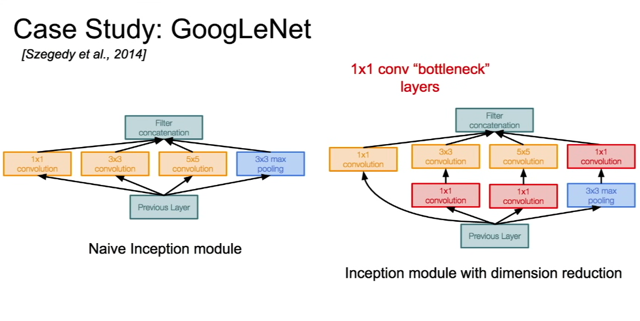</kbd>

> [!NOTE]
> để rồi 1x1 convolution sẽ
> tham gia giúp giảm depth

 

<kbd>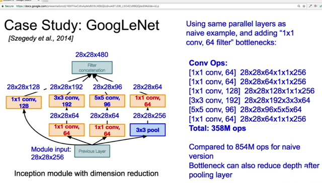</kbd>

> [!NOTE]
> Với cách làm này, inception module chỉ tốn
> 358M operations so với 854M

 

<kbd>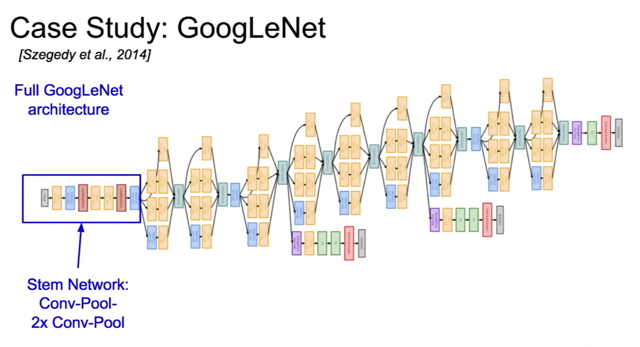</kbd>

> [!NOTE]
> GoogleNet architecture sẽ bắt đầu với Stem
> Network - chính là các lớp Conv-Pooling
> như đã gặp bên AlexNet

 

<kbd>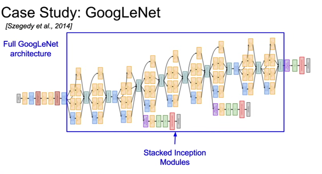</kbd>

> [!NOTE]
> Sau đó là đến phần stack lại
> nhiều Inception module

 

<kbd>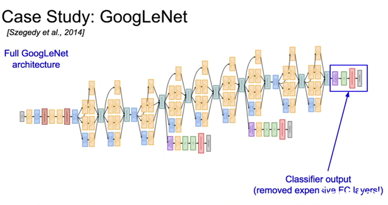</kbd>

> [!NOTE]
> Và output với classifier output -
> softmax 1000 unit có điều không
> còn dùng FC layer nữa

 

<kbd>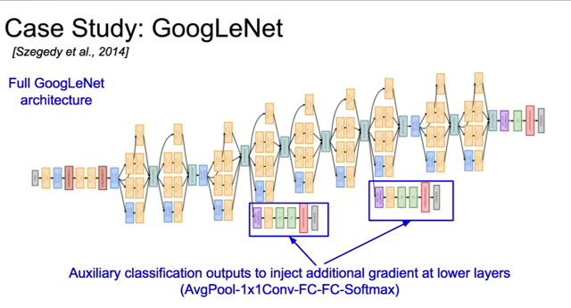</kbd>

> [!NOTE]
> một điểm đặc biệt đó là GoogleNet cũng output ở hai earlier layer.
> Việc này hiểu nôm na là đóng vai trò giúp gradient được bổ sung để
> train param của các layer đầu tiên vốn dĩ do GoogleNet rất sâu nên
> gradient từ 'final' output trở nên yếu khi tới đây. Và cũng cho thấy tại
> những output này, GoogleNet vẫn có thể dùng feature để thực hiện
> dự đoán

 

<kbd>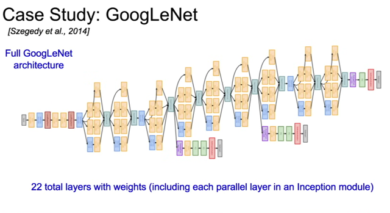</kbd>

> [!NOTE]
> tổng cộng googlenet có 22 layers

 

<kbd>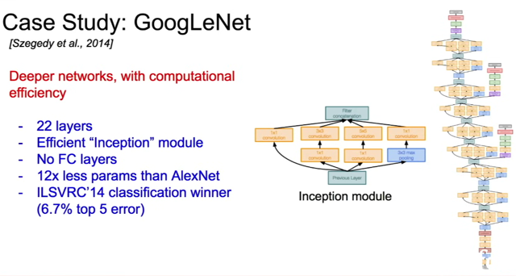</kbd>

 

<kbd>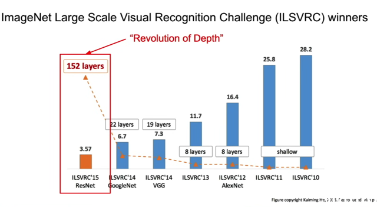</kbd>

> [!NOTE]
> kế đến là RestNet, thì đây là mô hình
> tạo bước nhảy vọt về mức độ 'depth'
> khi có tới 152 layers

 

<kbd>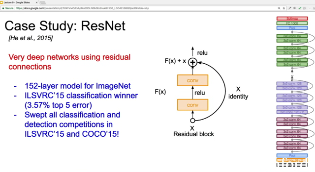</kbd>

> [!NOTE]
> và nó thắng các model khác ở mọi lĩnh vực
> cả classification và detection.

 

<kbd>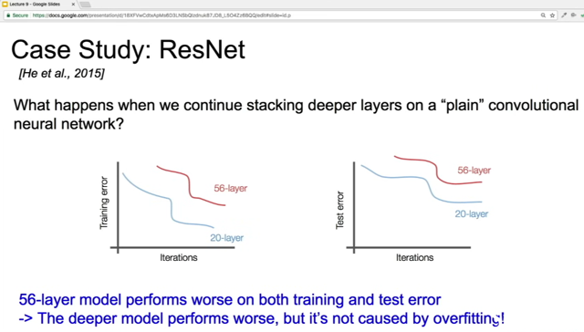</kbd>

> [!NOTE]
> đại ý là, khi ta tăng số layer lên, trên lí thuyết thì model phải phức tạp hơn,
> từ đó sẽ dần bị overfit. Tuy nhiên thực tế cho thấy cả training error và
> validation error đều cao hơn model với ít layer hơn
>
> Điều này cho thấy model không bị overfit, mà là việc thêm layer gây ra vấn
> đề khiến model học không tốt, từ đó giảm performance.

 

<kbd>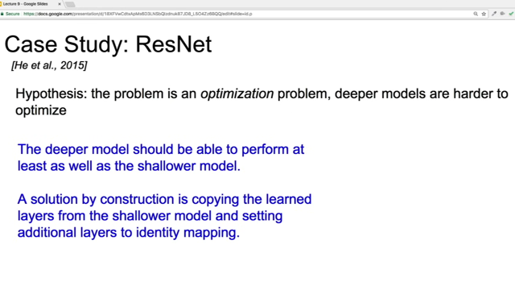</kbd>

 

<kbd>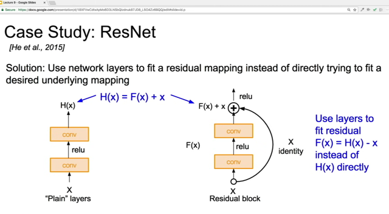</kbd>

> [!NOTE]
> "Use layers to fit residual F(x) thay vì H(x)": Có thể hiểu nôm na ý này đó là**thay vì fit / học một function H(x)**, thì ta có thể **học function F(x) gọi là
> residual function**
>
> Để rồi từ F(x) ta có hàm H(x) = F(x) + x. Vì cuối cùng mục đích cũng chỉ là
> học ra một (mapping) function (thể hiện bởi các parameters) để map giữa
> input và target thôi. Vậy với cách bố trí như vầy, thì ta sẽ cho model tìm
> cách học ra hàm F(x) mang ý nghĩa là **ta cần thêm (add) bớt (subtract) gì
> từ input x**Câu hỏi với t.a là tại sao việc học được một residual function F(x) lại 'dễ' hơn
> (dẫn đến việc dùng residual connection lại hiệu quả) là direct function H(x).
> t.a cho rằng, đây là lý thuyết của paper author, cho rằng đại khái là nếu 
> đặt trường hợp identity mapping lại là tốt (tức là trong mối quan hệ giữa input
> x và output y cần nắm bắt thật sự lại là một identity mapping, hay nói cách khác
> H(x) cần học được thật ra chỉ là H(x) = x, thì residual connection sẽ chỉ việc 
> học ra hàm F(x) = 0.
>
> Có vẻ như ta nên hiểu đây chỉ là lý thuyết đưa ra của tác giả, còn thực tế 
> chỉ đơn giản là nó tỏ ra hiệu quả.

 

<kbd>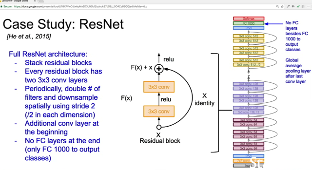</kbd>

 

<kbd>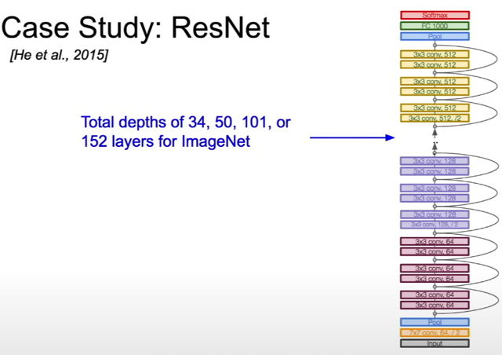</kbd>

 

<kbd>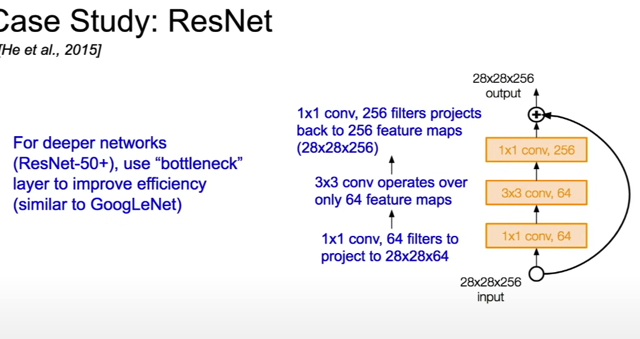</kbd>

> [!NOTE]
> Đại ý là với resnet 50 layer trở lên người ta có thể dùng
> bottleneck layer để cải thiện efficiency.

 

<kbd>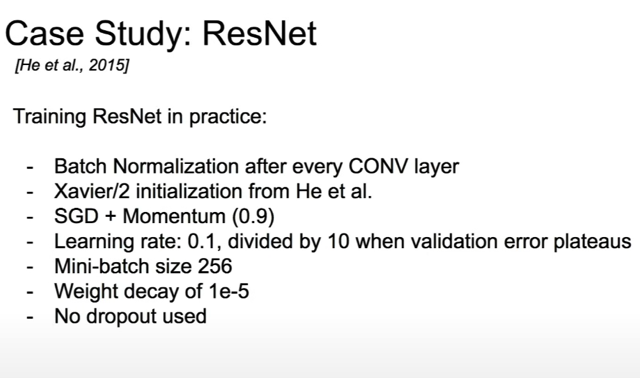</kbd>

> [!NOTE]
> một số thông số kĩ thuật khi huấn
> luyện resnet trong thực tế

 

<kbd>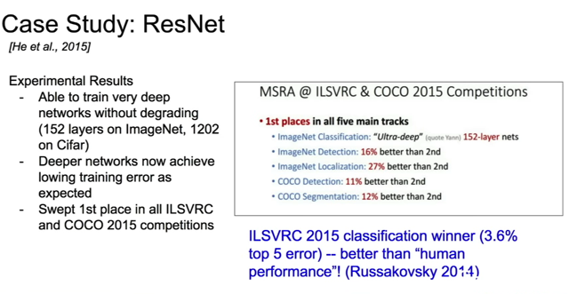</kbd>

> [!NOTE]
> một số thông tin về performance của resnet cho thấy
> nó cho phép huấn luyện một model rất sâu mà không
> ảnh hưởng đến performance. Đánh bại mọi model khác     
> ở các 'bài toán' khác nhau

 

<kbd>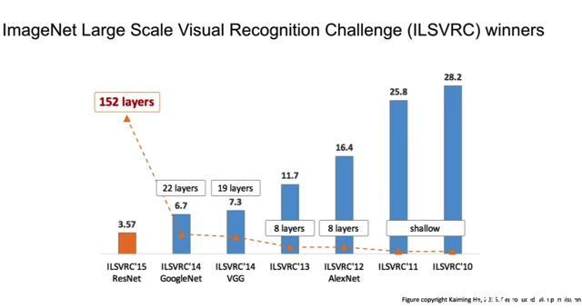</kbd>

> [!NOTE]
> đại ý nói rằng resnet đã trở thành một lựa chọn ưu tiên khi
> muốn finetune cho một bài toán computer vision. Mặc dù
> googlenet hay vgg vẫn được dùng

 

<kbd>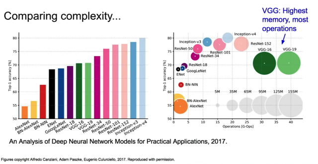</kbd>

<kbd></kbd>

<kbd>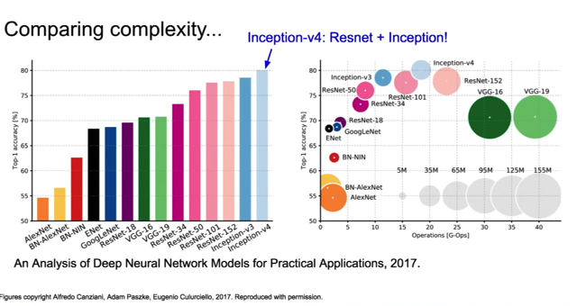</kbd>

> [!NOTE]
> biểu đồ cho thấy inception-v4 (có sự kết hợp giữa restnet và inception)
> đạt accuracy cao nhất.

> [!NOTE]
> biểu đồ đường kính cho thấy vgg tốn memory
> nhất cũng như số operation cũng nhiều nhất
> có nghĩa là efficiency thấp

 

<kbd>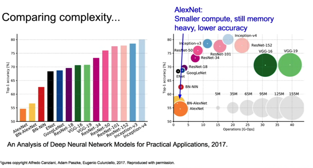</kbd>

<kbd></kbd>

<kbd></kbd>

> [!NOTE]
> googlenet có mức hao memory cũng như operation thấp
> cho thấy nó rất hiệu quả nhưng accuracy kém hơn resnet, vgg

> [!NOTE]
> Alexnet thì tuy mức operation thấp nhưng memory cũng
> tương đối. và accuracy cũng ko cao

 

<kbd>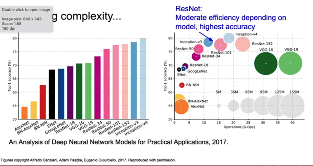</kbd>

> [!NOTE]
> Resnet có efficiency trung bình tùy thuộc vào model, nhưng
> accuracy ở mức cao

 

<kbd>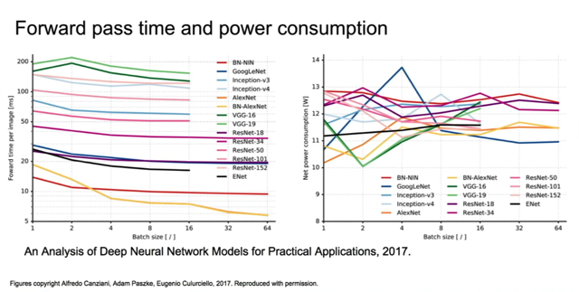</kbd>

> [!NOTE]
> thêm những so sánh khác về hiệu
> suất của các architecture

 

<kbd>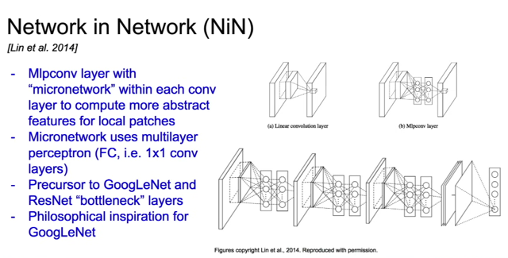</kbd>

> [!NOTE]
> nói thêm một số kiến trúc, cái này đại khái là dựa trên ý tưởng
> dùng fc layer để **learn more abstract features** cho một local
> patches. Có thể tạm hiểu là filter khi 'tính toán' một receptive
> field thì thay vì sum thì nó sẽ qua một fc layer.
>
> Và cái này chính là tạm gọi là tiền thân của bottleneck layers trong
> GoogleNet và ResNet. Truyền cảm hứng cho GoogleNet

 

<kbd>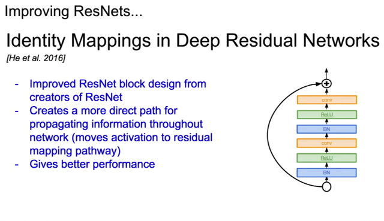</kbd>

> [!NOTE]
> nguời ta tìm cách cải thiện hơn nữa resnet. Bằng
> cách tạo nhiều hơn các direct path giúp thông tin
> được propagate throughout network

 

<kbd>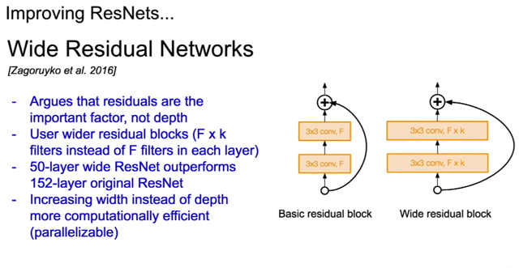</kbd>

> [!NOTE]
> đại khái là trong paper này người ta lập luận rằng residual connection là
> yếu tố quan trọng, chứ không phải là nhiều layer (not depth). Do đó
> người ta phát triển wide residual net, trong đó wide ở đây chỉ việc sử
> dụng nhiều filter hơn (nhân số filter cho factor k). Kết quả ở đây cho biết
> 50 layer wide resnet làm tốt hơn 152 layer original resnet

 

<kbd>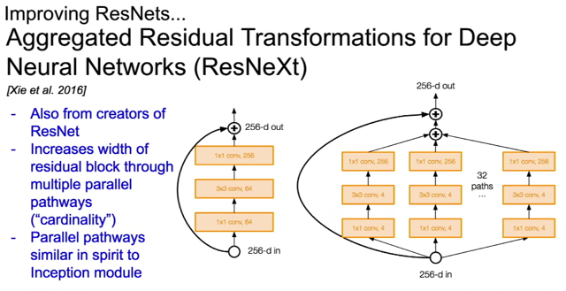</kbd>

> [!NOTE]
> Quay lại sau

 

<kbd>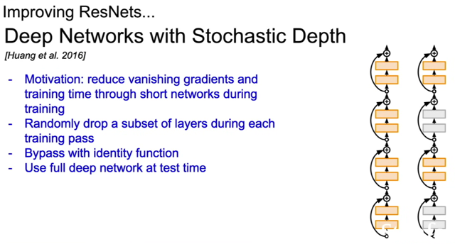</kbd>

> [!NOTE]
> Quay lại sau

 

<kbd>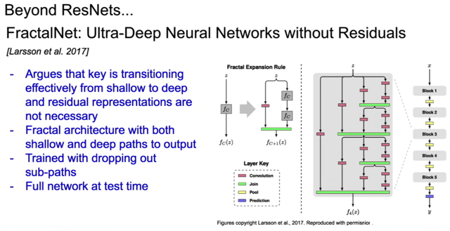</kbd>

> [!NOTE]
> Quay lại sau

 

<kbd>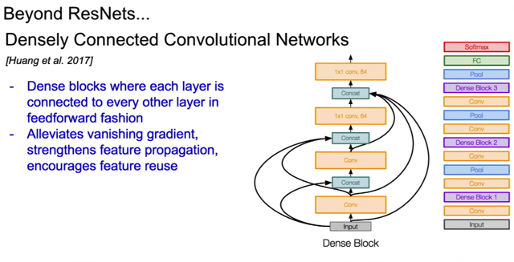</kbd>

> [!NOTE]
> DenseNet: các Dense block có các layer được kết nối với mọi layer
> khác theo feedforward fashion.
>
> Khắc phục tình trạng vanishing gradient, củng cố feature propagation
> và khích lệ feature reuse.

 

<kbd>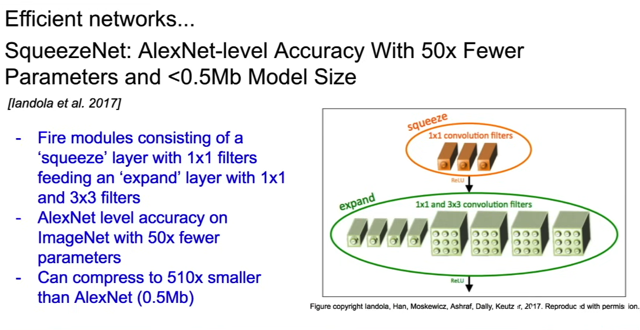</kbd>

> [!NOTE]
> Quay lại sau

 

<kbd>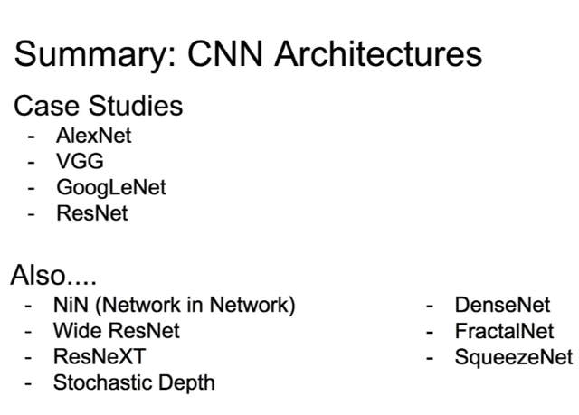</kbd>

 

<kbd>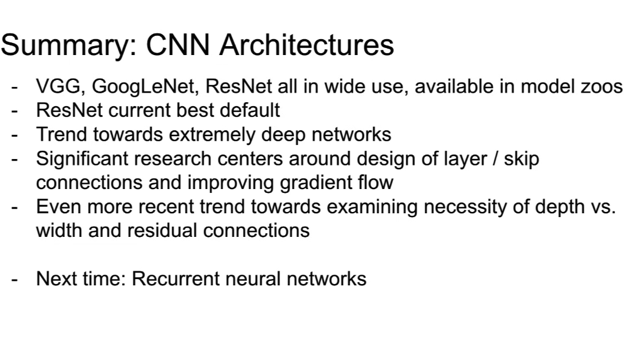</kbd>

> [!NOTE]
> Tóm lại, VGG, GoogLeNet, ResNet là những kiến trúc được sử dụng
> rộng rãi, xuất hiện trong mọi model zoos. Trong đó ResNet là cái mặc
> định tốt nhất
>
> Có một xu hướng đến những network cực kì "sâu".
>
> Trọng tâm của các nghiên cứu hiện nay xoay quanh việc thiết kế ra
> layer/skip connection giúp khắc phục gradient flow.
>
> Những xu hướng nghiên cứu gần đây hướng tới việc kiểm tra tính cần
> thiết của 'dept' đối trọng với 'width' + residual connection.

 

