# Lecture Note Introduction To RNN

📊 **Progress:** `14` Notes | `23` Screenshots

---

<kbd>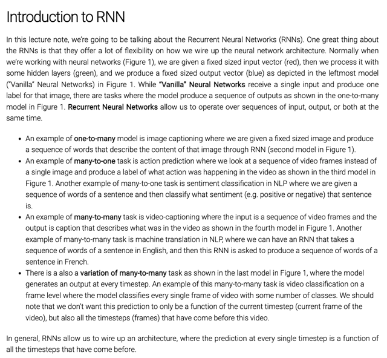</kbd>

 

<kbd>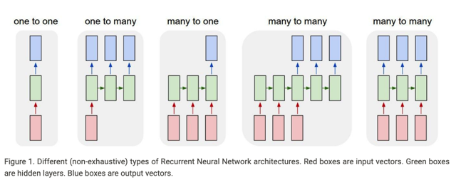</kbd>

> [!NOTE]
> rồi mở đầu tg nói rằng trong Vanilla NN, ta có một input vector (red block),
> pass nó qua một layer (minh họa bởi green block) để được một vector
> output (blue block)
>
> Trong đó input là image vector, vector output có thể là một vector các class
> scores trong bài toán Image classification. Thế thì có những bài toán mà
> mình muốn output ra nhiều thay vì chỉ một (vector). Ví dụ như Image
> Captioning, trong đó, output là nhiều / chuỗi các vector mỗi vector là phân
> phối xác suất dự đoán từ trong chuỗi từ (mô tả nội dung image). RNN phù
> hợp cho nhiệm vụ này.
>
> Một ví dụ cho One-to-many đã nói ở trên Image Captioning,
>
> Ví dụ cho Many-to-One là Sentiment Classification hay dự đoán một chuỗi
> các khung hình trong video thuộc loại gì.
>
> Ví dụ cho Many-to-Many là Machine Translation, nơi câu cần dịch và câu
> dịch không cùng length, và không align nhau (cs224n)
>
> Ví dụ cho Many-to-Many ở cuối nơi input và output align nhau thì có
> thể là classify từng khung hình trong video chẳng hạn.

 

<kbd>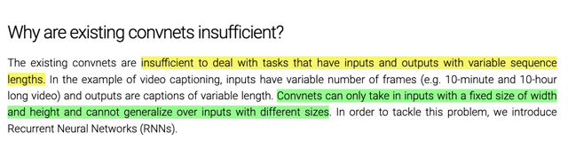</kbd>

> [!NOTE]
> lí do ConvNet không thể giải quyết các bài toán này là vì, nó chỉ
> take input có fixed (W,H) size chứ không thể take input có
> length bất kì được.
>
> Và output của nó cũng không thể có length bất kì được luôn.

 

<kbd>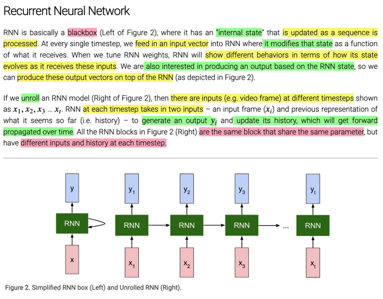</kbd>

> [!NOTE]
> rồi, đại khái người ta dùng từ blackbox để mô tả RNN, mà bên trong nó có một
> "internal state" (chính là hidden state vector h). Để rồi cái internal state này sẽ
> được update liên tục khi RNN xử lý một chuỗi các input.
>
> Thì khi xử lý chuỗi input, mỗi lần nó chỉ xử lý một cái, gọi là tại mỗi time-step t,
> nó sẽ nhận một vector x<t> (là một input của chuỗi input có độ dài x<T>)
> thì mỗi lần như vậy nó sẽ tính toán với x<t> và giá trị của internal state hiện tại
> (hay nói cách khác là giá trị internal state đã tính được ở "lần trước" h<t-1>) để 
> sửa lại cho hidden state gọi giá trị mới là h<t>. Và tiếp tục nhận input tiếp theo
> để tính toán và sửa lại hidden state.
>
> Thế thì, tại mỗi lần như vậy, mỗi time-step, ngoài việc "update" lại internal state,
> tức tính ra h<t> (như đã biết, từ x<t> và h<t-1>), ta có thể muốn dùng cái h<t>
> để tính tiếp một output gì đó y^<t>. Nói có thể là bởi điều này chỉ áp dụng với
> mô hình Many-to-Many hoặc Many-to-One nhưng là tại time-step cuối.
>
> Hiểu như vậy sẽ thấy, chỉ có một cái internal state vector, được tính đi tính lại,
> bởi internal state trước và input mới. Và cũng chỉ tính bởi một bộ param duy 
> nhất.

 

<kbd>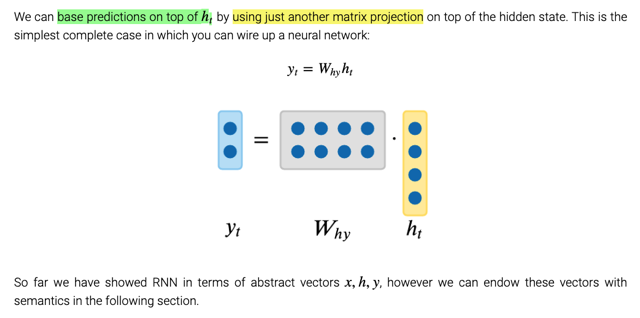</kbd>

<kbd></kbd>

<kbd>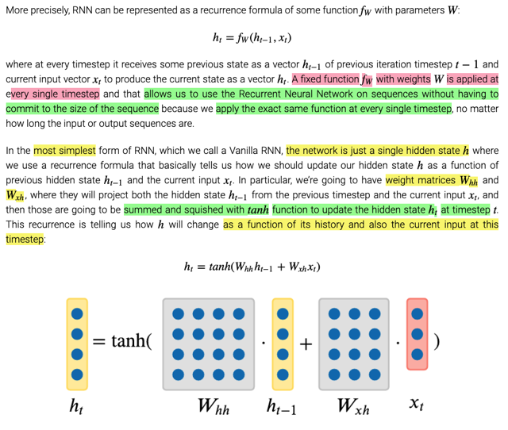</kbd>

> [!NOTE]
> Rồi, công thức là đây, cơ bản như đã nói, chỉ có một bộ param W, b
> được dùng để tính đi tính lại (qua các time-step, với các input khác nhau
> x<t>, và hidden state cũ h<t-1>) để có giá trị mới của hidden state
> (h<t>).
>
> Thì cái hay đó là nhờ vậy, dù input sequence có có dài bao nhiêu, hay
> Muốn output ra sequence dài bao nhiêu thì cũng chỉ xài một bộ params
> chứ không phải là input/output càng dài thì cần nhiều params.
>
> Vậy cụ thể hơn, có thể coi W là hai matrix Whh dùng để transform
> h<t-1> và Wxh để transform x<t>. Sau đó cộng hai kết quả lại, và bỏ
> qua tanh để squish (bóp lại, ý là bóp lại về value có range trong [-1,1]).
>
> Rồi, như đã nói, nếu cần output một prediction, thì sau khi có h<t>, ta
> transform nó qua một matrix Why nữa (có thể có bias) để có được
> vector y^ (mang ý  nghĩa gì thì tùy bài toán, ví dụ dự đoán một từ trong
> Image's description  thì nó là phân phối xác suất over toàn bộ các từ
> trong vocab, hay nếu là bài toán phân loại video time-frame thì nó sẽ là
> phân phối xác suất qua các class)

 

<kbd>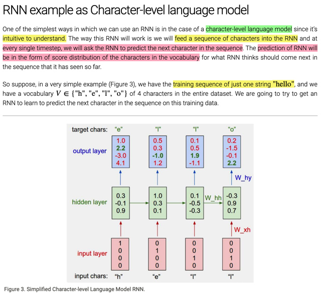</kbd>

> [!NOTE]
> đại khái là Justin nói về việc dùng RNN để train một mô hình ngôn ngữ cấp kí
> tự. Trong đó, tại mỗi time-step ta feed in RNN một kí tự và bảo nó dự đoán ra
> kí tự tiếp theo. Thế thì y^ như vừa mới nói, sẽ là vector các class scores over
> tất cả các class=từ vựng khác nhau trong vocab, mà ta có thể dùng softmax
> để chuyển thành probability distribution như đã quá quen thuộc.
>
> Vậy giả sử training sequence là h e l l o, và vocab có 4 kí tự h, e, l, o.

 

<kbd>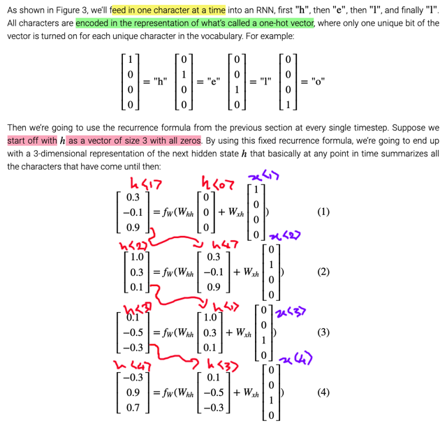</kbd>

> [!NOTE]
> Vậy, như đã biết không thể đưa kí tự vào RNN được, mà ta phải represent nó
> bởi một vector các con số - one-hot encoding vector, có dimension = |V|, tức
> là x<t>. Hidden state h thì ở đây ví dụ chọn dimension  = 3. Sẽ được khởi tạo
> bằng zero vector, nói cách khác h<0> = zero. 
>
> Quá trình tính toán như đã biết, time-step 1, input vào vector x<1> là one hot
> vector của từ 'h', cùng với h<0> với các giá trị ban đầu của Whh, Wxh (khởi
> tạo kiểu gì như đã biết, cũng random, có thể là xavier initialization luôn)
> để tính ra h<1>. 
>
> Từ h<1>, tính tiếp ra y^<1> là một 4-D vector (vì có 4 từ trong vocab), mang
> predicted class score mà model gắn với mỗi kí tự trong việc dự đoán là kí tự
> tiếp theo.
>
> Tiếp tục như vậy, tại time-step 2, nó tính với x<2> và h<1> để ra y^<2>

 

<kbd>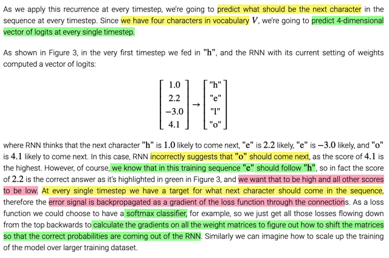</kbd>

> [!NOTE]
> Thế thì, quay lại tại time-step 1, nó tính ra y^<1>, là class scores dự
> đoán cho từ theo sau h, tức là từ thứ 2 trong chuỗi. Mà ta đã biết nó
> phải là từ e, cũng đồng nghĩa, nếu lôi one-hot vector của e thì đó 
> chính là target của y^<1>, kí hiệu là y<1>. Nên có thể hiểu (dù ở đây
> không nói, nhưng đã hiểu ở bài Dinosaur Name của DLSpec), x<2>
> chính là y<1>.
>
> Rồi, quay lại đoạn này, thì đại ý người ta nói model dự đoán score cao
> nhất là 4.1, tức là nó đang đoán sau h là o. Nhưng rõ ràng sai, thì ta
> sẽ ghi nhận loss với y^<1> và y<1>, dùng softmax loss chẳng hạn,
> để rồi backprop tính ra gradient của Whh, Wxh mà sửa lại.
>
> Để rồi dần dần trong quá trình training, ta mới "dịch chuyển" phân phối
> xác suất dự đoán y^<t> cho gần lại với phân phối xác suất target y<t>

 

<kbd>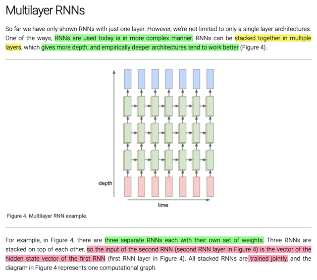</kbd>

> [!NOTE]
> rồi, như trong bài đã biết, thường người ta có thể stack vài (2,3) RNN thành
> ra Deep RNN. Trong đó input tại mỗi time-step của RNN sau là hidden state
> tại time-step tương ứng của RNN trước

 

<kbd>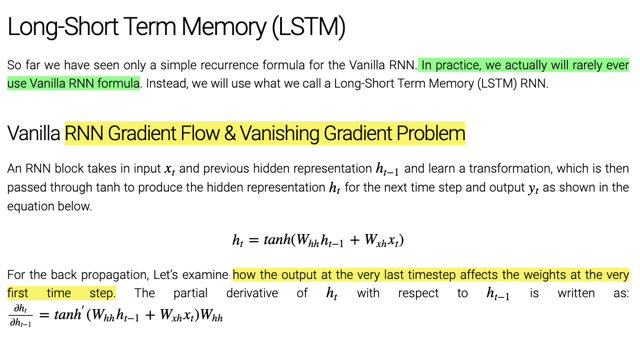</kbd>

 

<kbd>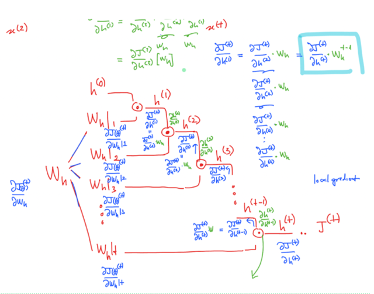</kbd>

<kbd>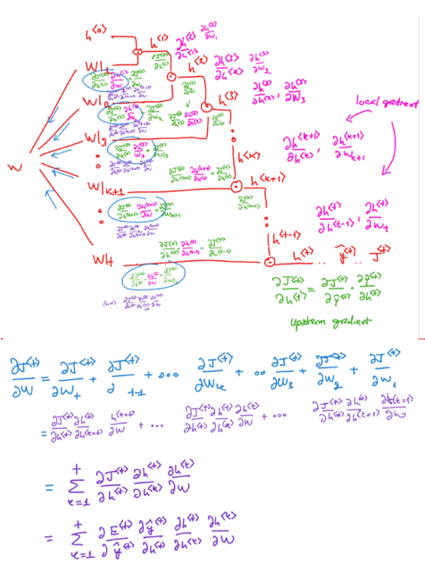</kbd>

<kbd>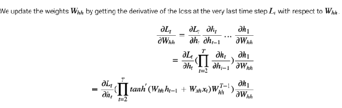</kbd>

<kbd></kbd>

<kbd></kbd>

<kbd></kbd>

<kbd>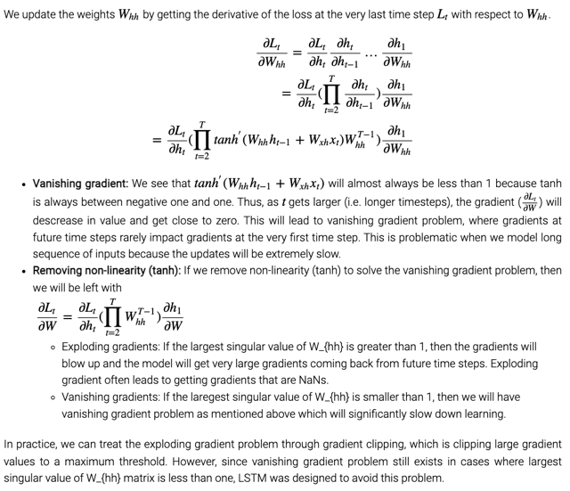</kbd>

> [!NOTE]
> Ở đây, có thể hiểu là người ta đang nói về việc update Whh bởi derivative của 
> loss tại time-step t (L<t>), nhưng **phải hiểu rằng gradient của Whh không chỉ có
> vậy mà phải là sum của**. 
>
> Nên đúng hơn thì đây chỉ đang nói đến derivative của L<t> đối với Whh|1,
> là cách mình kí hiệu cho việc Whh tham gia tính toán tại time-step thứ 1, để
> được h<1> để rồi nó tham gia tính toán để ra h<2> -> h<3> ->...h<t>.
>
> Và ở đây ta hiểu rằng người ta muốn cho thấy cái này sẽ rất nhỏ với lí do sẽ nói
> ở dưới nhưng ta đã biết từ bên cs224n đó là nó sẽ ảnh hưởng tới việc "sửa chữa" 
> Whh theo hướng giúp nó tính ra h<1> tốt hơn. Thì điều đó mang ý nghĩa là khả 
> năng của model trong việc "dùng thông tin" từ những từ "ở xa" để dự đoán một
> từ hiện tại <t> sẽ bị kém, điều đó đồng nghĩa với việc model "quên mất" không
> nắm bắt được quan hệ của các từ ở xa.
>
> ====
>
> Hiểu ý tưởng chính là như vậy, còn như đã biết bên cs224n, để có dL<t>/dWhh
> phải sum derivative của dL<t>/dWhh | k, với j là các nhánh mà Whh tham gia tính
> các h<k>
>
> Thế thì quay lại xét cái **dL<t> / dWhh | 1**, với computation graph, mà hoặc có thể
> triển khai / vẽ lại ở đây cho nhớ:
>
> Whh | 1 * h0 ---> z1 --- tanh ---> h1 
>
> (tất nhiên z1 không chỉ tính bởi Whh*h0 mà z1 = Whh*h0 + Wxh*x1
>
> Whh | 2 * h1 ---> z2 --- tanh ---> h2
>
> Whh | 3 * h2 ---> z3 --- tanh ---> h3
> ..
> ..
> Whh | t * h_t-1 ---> z_T --- tanh ---> hT ---...--- LT
>
> Vậy chỉ xét đường dây từ Whh | 1 (kí hiệu để ám chỉ cái việc Whh tham gia tính ra h1) 
> để ra h1 rồi từ h1 nó tham gia đường dây lên ht ta sẽ có:
>
> - T nút tanh
>
> - từ h1 lên hT **có T-1 lần mà h_k-1 -> h_k**: h1 -> h2, h2 -> h3, ...h_t-1 -> hT
>
> (chỉ tính những node này vì từ Whh | 1 đến hT ta không đi qua bước h0 -> h1, ráng hiểu 
> nhé)
>
> Vậy theo chain rule , dLt / dWhh | 1 sẽ là: 
>
> (a) dLT/dhT (upstream gradient) 
>
> (b)****Tích của T cái tanh'(z_t) với t = 1,2..T với z_t = **Whh * h_t-1 + Wxh * x_t**
>
> hoặc có thể **chia ra để riêng dh1/dWhh gọi là (b2)** (cho giống trong lecture note) thì ta 
> sẽ có:
>
> **(b1): Tích của T-1 cái tanh'(z_t)**với**t = 2..T** với z_t = **Whh * h_t-1 + Wxh * x_t**
>
> (c) Tích của T-1 cái dh_k/dh_k-1, mà mỗi cái dễ thấy nó chính là Whh. 
> Vậy ta có **Whh**(T-1)** 
>
> =====
>
> Vậy ta có (a)(b1)(b2)(c): 
>
> **dLT/dhT** * {**Tích của T-1 cái tanh'(z_t) với t = 2..T**} * {**Wxh * x_t**} * {**Whh**(T-1)**} * **dh1/dWhh**

> [!NOTE]
> Thế thì, đại khái là ta thấy một tích T-1 cái tanh'(..) và một lũy thừa T-1 cái W,
>
> *À ở đây có thể thấy trong công thức người ta ghi dấu ngoặc hơi sai, như triển
> khai lại bên kia đã thấy nó phải là {tích các tanh'} nhân với {W^T-1},
> Ghi như trong note là sai vì nó nghĩa là tích các {tanh't * W^T-1)
>
> Dẫn đến hệ quả: **Do đạo hàm của hàm tanh'() có giá trị nhỏ hơn 1**, lại được
> **nhân đi nhân lại nhiều lần nên nó khiến gradient vanish**. Điều này có thể hiểu
> được, tuy nhiên chú ý lập luận của họ có thể gây hiểu nhầm khi cho rằng
> **vì bản thân hàm tanh có range [-1,1]** **NÊN TANH' LUÔN NHỎ HƠN 1**. 
>
> Điểm này phải hiểu ý của họ là vầy theo công thức**tanh'(x) = 1 - tanh(x)**2** 
> cũng cho ta thấy nếu x gần 0 thì tanh'(x) ~ = 1 còn |x| lớn thì tanh(x)**2 ~= 1 
> -> tanh'(x) ~ = 0. 
> Thế thì chính vì tanh(x) luôn trong range [-1, 1] nên theo công thức hàm tanh'(x)
> dẫn đến **nó sẽ luôn bé hơn 1, là đúng
>
> ===
>
> Ý thứ hai, đại khái là giả sử ta có bỏ đi cái tanh, thì vẫn còn đó cái lũy thừa
> của W. Ở đây người ta nói về giá trị riêng lớn nhất của W, nhưng có thể**hiểu 
> nôm na là khi nhân với một matrix W có gía trị lớn hơn 1 mà lũy thừa nhiều lần thì 
> kết quả sẽ rất lớn dẫn đến exploding gradient.
>
> Ngược lại, nếu W nhỏ hơn 1 thì lũy thừa nhiều lần sẽ cũng khiến gradient vanish.
>
> ===
> Nên thực tế khi làm ta sẽ dùng gradient clipping để khắc phục exploding gradient
> còn như trong bài đã biết với vanish gradient thì phải cải thiện kiến trúc model -> LSTM

 

<kbd>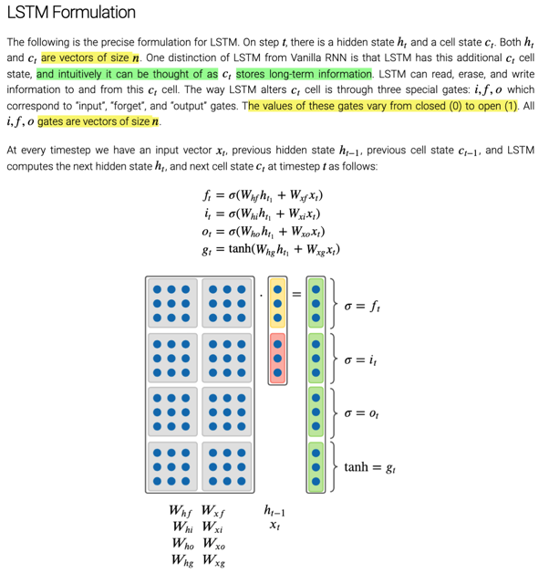</kbd>

> [!NOTE]
> LSTM có thêm ct cũng là n-D vector giống ht. ct có thể được hiểu một
> cách trực giác như long-term memory.
>
> LSTM sẽ thay đổi ct thông qua các gate i, f, o, chúng cũng là các n-D
> vector, được tính từ xt, ht-1 và hàm sigmoid, nhưng có thể coi nó sẽ luôn
> chỉ mang những giá trị 0 hoặc 1.

 

<kbd>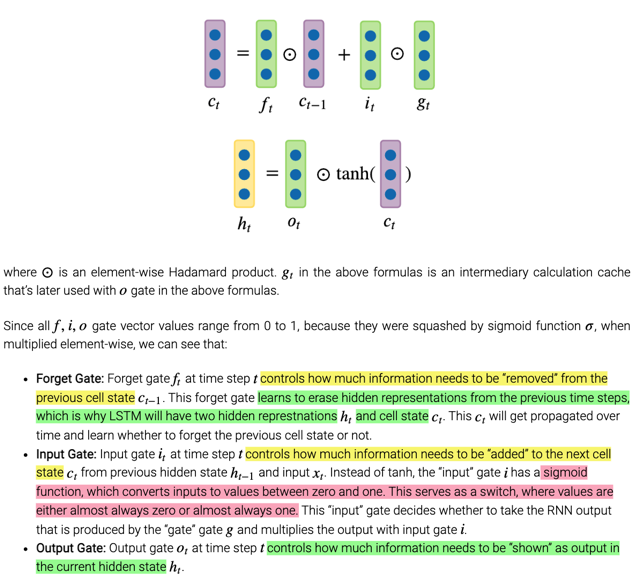</kbd>

> [!NOTE]
> để rồi bằng element-wise Hadamard product (trong đó nhân hai vector, các
> phần tử tương ứng nhân nhau, như dot product nhưng không có sum)
>
> Điều này mang hiệu quả là forget gate sẽ reset (forget) hay giữ nguyên
> một giá trị tại vị trí của cell state cũ (cho value tại vị trí đó = 0 hay 1).
>
> Sau đó, input gate cũng sẽ **dùng hay không dùng giá trị tại một vị trí của
> candidate  gt**. Cái gt này thì là kết quả của ht-1, xt với hàm tanh, nhưng
> có thể coi nó chỉ mang các giá trị 1 hay -1.
>
> Nhưng **giá trị của nó được dùng hay không là do input gate quyết định**.
> Để rồi khi update ct ta có hiệu quả là một vài vị trí của ct được reset, một
> số khác thì tăng thêm 1, một số khác thì giảm bớt 1.
>
> Cuối cùng hàm tanh sẽ squash ct về [-1,1] và được **filter bởi output gate
> để có ht**cho phép model quyết định bao nhiêu lượng thông tin sẽ được
> shown dưới dạng output

 

<kbd>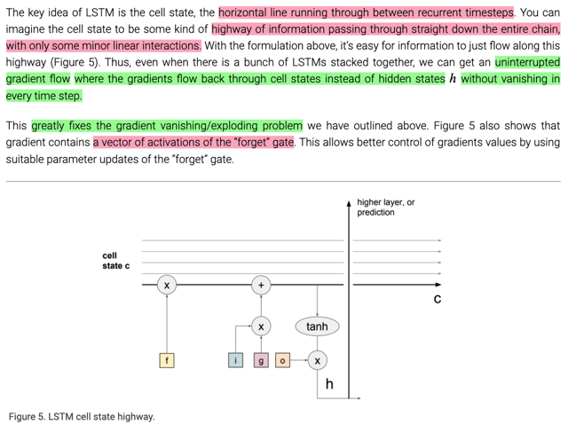</kbd>

> [!NOTE]
> thì đại ý là cell-state của LSTM đóng vai trò như một highway giúp gradient
> flow backward thông suốt mà ít bị interupted (chỉ qua vài linear interaction
> không ảnh hưởng)
>
> Điều này đã giúp khắc phục đáng kể vanishing / exploding gradient.

 

<kbd>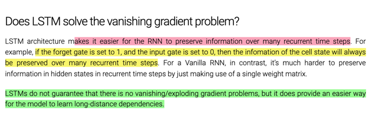</kbd>

> [!NOTE]
> ở đây nhắc lại LSTM không hoàn toàn giải quyết vấn đề vanishing/exploding
> nhưng nó đã cho phép gradient trong quá trình backprop được flow xa hơn
> mà không bị vanish/explode, giúp cải thiện khả năng nắm bắt những long-term 
> dependency

 

