# LECTURE NOTE: Linear classification: Support Vector Machine, Softmax

📊 **Progress:** `24` Notes | `21` Screenshots

---

<kbd>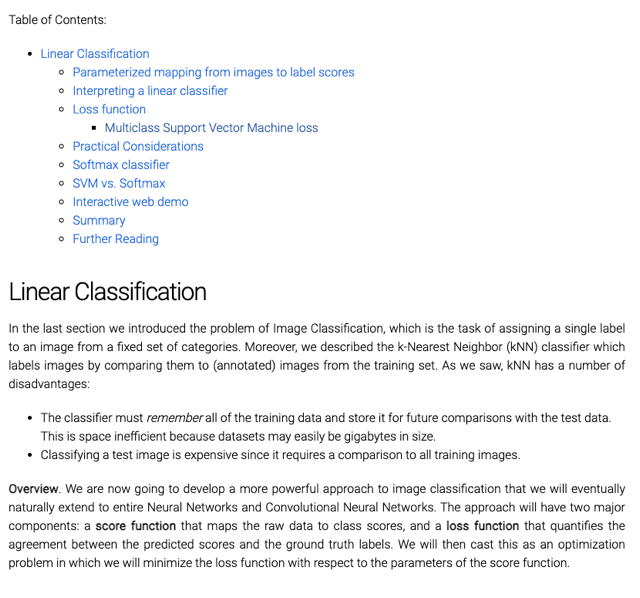</kbd>

> [!NOTE]
> Đại khái là ta đã biết bài toán Image classification, trong đó ta phải map
> một image với một category. Biết về KNN và nhược điểm của nó khi phải
> nhớ toàn bộ training sét. Đồng thời quá trình tính toán cũng tốn kém khi
> phải so sánh (distance) với mọi training sample
>
> Ở đây ta sẽ dùng một cái mạnh hơn dần dần mở rộng sang NN và CNN
> Trong đó ta define score function và loss function để rồi từ đó xây dựng
> objective function

 

<kbd>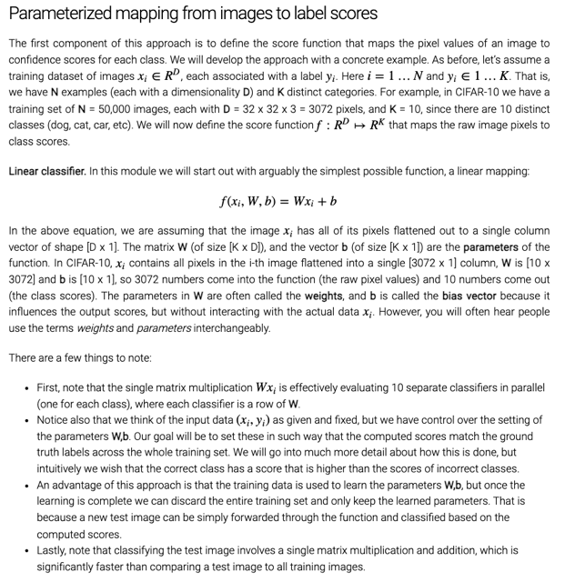</kbd>

> [!NOTE]
> Đại khái là mỗi bức hình sẽ được flatten thành x = 1D vector. Để rồi tính
> toán với phép tính matrix multiplication với weight matrix W (Dx10) và
> cộng với B (10,)
>
> Thì người ta nói cơ bản là ta đang dùng 10 cái linear classifier mỗi cái là
> một vector hàng của W. Khi tính W.x thì cơ bản là ta  Tính 10 phép d.p
> của x các row vector w (i,:) của W. Thì như ta biết kiểu như với cái này
> thì model training ra mỗi w(i,:) sẽ giống như là tìm ra một pattern chung
> nhất giữa tất cả các image của một loại. Để rồi nếu mà một image mới
> mà giống với cái pattern chung của loại (category) đó nhất (thể hiện qua
> việc có chỉ số score = d.p của x và w(i,:) lớn nhất thì ta sẽ kết luận
> category của image là loại đó (thứ i trong các class i=1...K)
>
> Nói chung cái này y như Linear Classification (logistic regression) chỉ
> có thiếu bước bỏ score qua sigmoid thôi.
>
> Có nói về bias có tên như vậy vì nó thể hiện giá trị của f^(x(i)) nếu không
> xài đến x(i) - tức là x(i) không ảnh hưởng gì, nên gọi là bias / là định kiến
>
> Tiếp một ý nữa là với cái này ta sẽ sau khi training xong thì vứt bộ training
> data đi, chỉ còn dùng W,b để making prediction thôi.
>
> Cuối cùng là nó sẽ tính nhanh hơn KNN nhiều khi không phải tính distance

 

<kbd>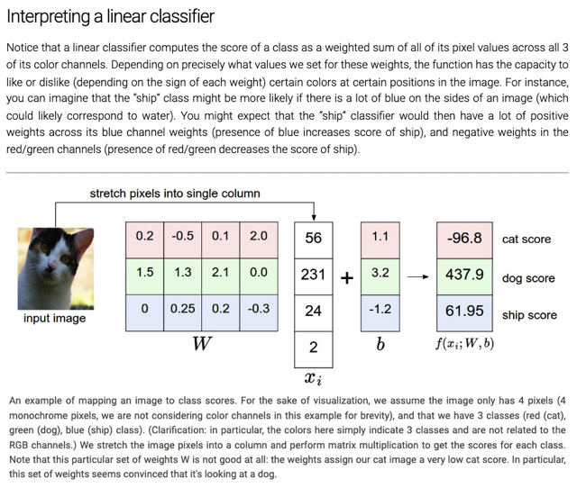</kbd>

> [!NOTE]
> Đại khái là như mới nói, nôm na trong model này, nó sẽ chỉnh (học) các 
> pattern chung nhất của mỗi loại từ training images, thể hiện thành một
> vector có D chiều, (ví dụ 3072). Để rồi nếu test image vector có độ giống
> cao nhất với vector row của loại A thì nó sẽ có score (d.p x(i)wA + bA cao nhất)
> Thì người ta ví dụ là vector w của loại "tàu biển" khả năng cao là có nhiều
> màu xanh, tức là dải value ở 1 phần 3 cuối của vector sẽ có giá trị cao. Khi đó
> nếu test image có nhiều màu xanh, thì 1 phần 3 cuối cũng có giá trị cao thì 
> d.p với w_"ship" sẽ ra giá trị cao.

 

<kbd>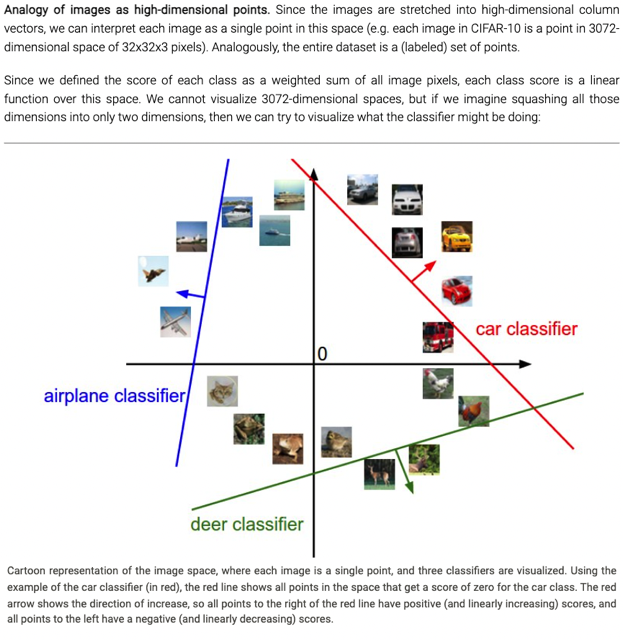</kbd>

> [!NOTE]
> Đại khái là thể hiện trong không gian 33072 chiều của các feature vector (các
> flatten vector của image). Thì Linear Classifier nó sẽ sử dụng các linear
> hyper-plane để chia tách các điểm đó. Hyper-plane cao chiều những vẫn là
> tuyến tính (plane).
>
> Vì dể hình dùng là nếu có 3D thôi, thì mỗi classifier (mỗi rơ của W) sẽ tạo các
> mặt phẳng chia tách. HOặc nếu 2D thôi , thì mỗi classifier sẽ tạo các line chia
> tách.
>
> Trong đ1o những điểm trên line sẽ là có score của class tương ứng đó = 0.
> những điểm ở bên có dấu mũi tên thì sẽ có score class dương, ngược lại là âm.
>
> Và cuối cùng là cái hình tượng khi ta thay đổi (khi train model) các giá trị của
> W thì sẽ quay các line này

 

<kbd>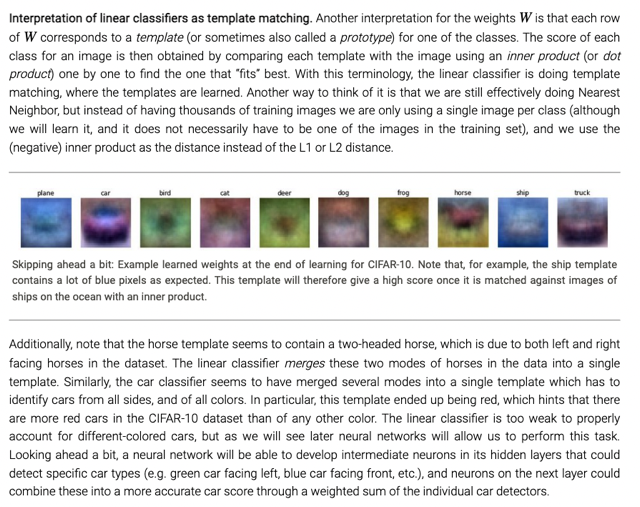</kbd>

> [!NOTE]
> Đại khái là như trên đã nói, trong cái này thì mỗi cái row vector w_i của W
> đóng vai giống như cái template. Được model learn sao cho chứa  đựng
> những cái chung nhất của một class i tương ứng. Để rồi khi image mà giống
> với cái template nào nhất đồng nghĩa với việc dot product của image vector
> với w_i đó sẽ cao nhất thì khả năng class của image đó sẽ là class i.
>
> Thì cái hay là họ nói cái này ta có thể coi như cũng vẫn là KNN, tuy nhiên thay
> vì khi inference, ta tính distance của query image với tất cả cả image trong
> training set rồi sort để lấy "cái" có distance nhỏ nhất. Thì đây ta tính distance
> của query image với cái "đại diện" của mỗi trong 10 class. Và dùng một chỉ số
> cũng thể hiện distance đó là dot product. để lấy ra cái có distance  nhỏ nhất
> (dot product cao nhất).
>
> Đại khái là linear classifier chỉ là một model yếu khi kiểu như nó chỉ represent
> các pattern theo kiểu "có nhiêu trộn hết lại" ví dụ như ở class horse nó tổng
> hợp là lại thành ra cái template trông như có hai con ngựa quay đầu về hai
> hướng, vài bữa khi qua NN, hay DNN thì nó có thể represent các pattern tốt
> hơn để rồi nó sẽ đánh giá chính xác hơn

 

<kbd>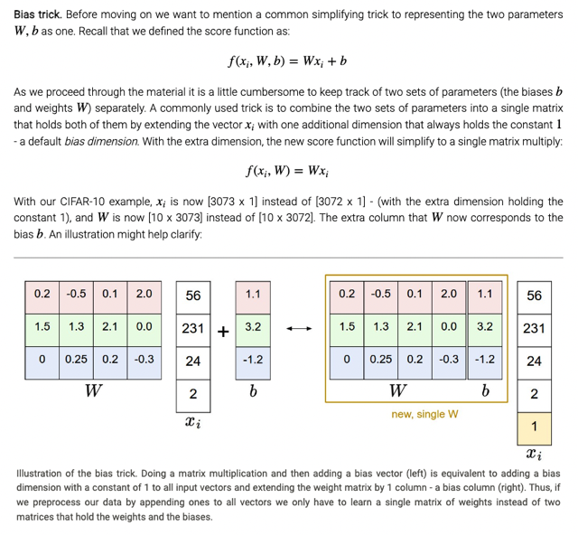</kbd>

> [!NOTE]
> Đại khái không có gì, chỉ là thay vì để riêng W và b, người ta có thể 
> gộp chung nó lại, muốn vậy thì feature x(i) sẽ có thể một "bias dimension"
> mang giá trị = 1. Cái này ở ML old course của Andrew ng mình đã thấy.

 

## Image data preprocessing. As a quick note, in the examples above we

> [!NOTE]
> Image data preprocessing. As a quick note, in the examples above we
> used the raw pixel values (which range from [0…255]). In Machine
> Learning, it is a very common practice to always perform normalization of
> your input features (in the case of images, every pixel is thought of as a
> feature). In particular, it is important to center your data by subtracting the
> mean from every feature. In the case of images, this corresponds to
> computing a mean image across the training images and subtracting it
> from every image to get images where the pixels range from
> approximately [-127 … 127]. Further common preprocessing is to scale
> each input feature so that its values range from [-1, 1]. Of these, zero
> mean centering is arguably more important but we will have to wait for its
> justification until we understand the dynamics of gradient descent

> [!NOTE]
> Đại khái là thông thường ta phải thực hiện normalization trong đó ta trừ mỗi
> pixel (và cũng gọi là feature trong trường hợp khi xây dựng model với image
> như thế này) với mean của feature đó tính trên toàn bộ dataset. Có nghĩa là
> nếu X là matrix cho toàn training data sét với shape là m,n = D thì ta sẽ tính
> mean của các cột (trong D = 3072 cột, la 3072 feature)
>
> Như ta cũng đã hiểu ra nó cũng ra vector mean có 3072 unit để rồi ta sẽ trừ
> X với hai vector mean (để  mỗi pixel sẽ được trừ đi mean thì từ range 0-255
> trở thành range -127:127, và thường được scale tiếp để thì trở thành là
> range -1:1
>
> Thì đại khái là họ nói sẽ có tác dụng trong quá trình Gradient Descent

 

### Loss function In the previous section we defined a function from the pixel

> [!NOTE]
> Loss function In the previous section we defined a function from the pixel
> values to class scores, which was parameterized by a set of weights W .
> Moreover, we saw that we don’t have control over the data (xi,yi)  (it is fixed
> and given), but we do have control over these weights and we want to set
> them so that the predicted class scores are consistent with the ground truth
> labels in the training data.
>
> For example, going back to the example image of a cat and its scores for the
> classes “cat”, “dog” and “ship”, we saw that the particular set of weights in that
> example was not very good at all: We fed in the pixels that depict a cat but the
> cat score came out very low (-96.8) compared to the other classes (dog score
> 437.9 and ship score 61.95). We are going to measure our unhappiness with
> outcomes such as this one with a loss function (or sometimes also referred to
> as the cost function or the objective). Intuitively, the loss will be high if we’re
> doing a poor job of classifying the training data, and it will be low if we’re doing
> well.

> [!NOTE]
> Đại khái là đầu tiên ta sẽ xây dựng những function cho phép đánh
> giá performance của model - Loss function hay objective function.
> Để rồi khi đó với một bộ giá trị của params ta mới biết được là
> model đang tốt hay tệ tới đâu

 

  
  
<kbd>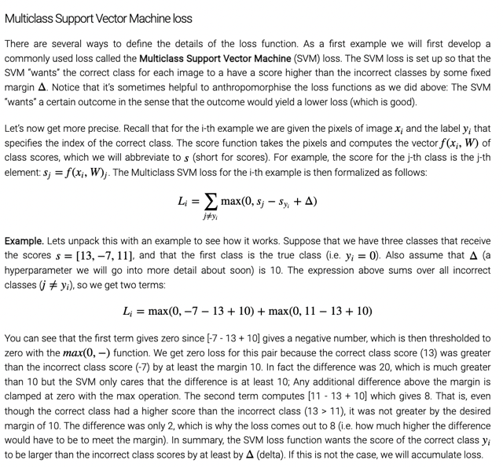</kbd>

  > Đại khái cách đầu tiên là dùng SVM loss. Cơ bản là trong cách xây
> dựng loss function này, model nó sẽ kiểu như sẽ happy nếu score của
> correct class lớn hơn score của incorrect class một khoảng Delta và sẽ
> không hài lòng nếu không đạt điều này.
>
> Thành ra function sẽ được xây dựng sao cho, một score của một incorrect
> class thỏa điều này thì loss trên class đó = 0, còn không thì sẽ bằng khoảng
> cách mà model cần phải nới rộng ra thêm để đạt điều này.
>
> Do đó cách xây dựng của function đó là nó sẽ check các incorrect score sj 
> không check correct score (j!=yi). Để rồi, nó tính loss (tại/đối với incorrect class) 
> đó là max(0, sj - syi + Delta) chính là để nếu đã thỏa thì sẽ là 0, còn không thỏa
> thì nó sẽ là phần cần phải giảm bớt thêm nữa để thỏa.
>
> Nói chung SVM loss sẽ tiếp tục tăng correct score lên đến khi correct score
> vượt trội các incorrect score một khoảng an toàn.

   

  
  
<kbd>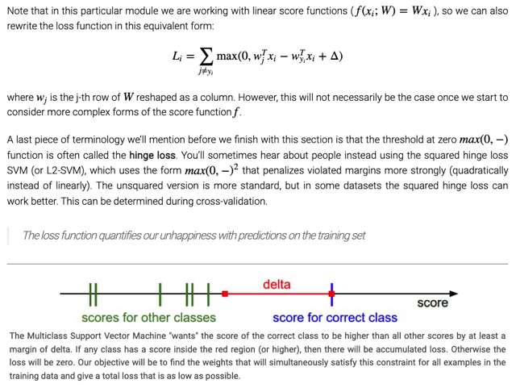</kbd>

  > Thì thay các score bằng dot product của wj và x(i) vào thì ta có công thức này.
>
> Thì người ta nói thêm cái này còn có tên là hinge loss và đôi khi giống như MSE, 
> để penalize mạnh hơn thì người ta dùng bình phương, gọi là L2-SVM

   

  
  
<kbd>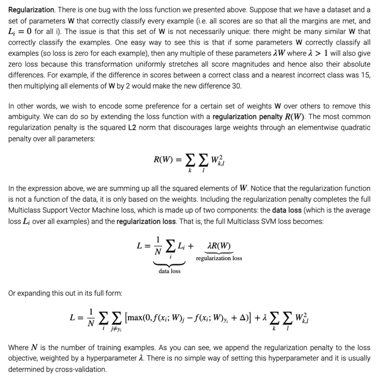</kbd>

  > Đại khái là người ta nói với cái SVM loss này rất dễ lập luận để chứng minh rằng
> giả sử có W khiến L = 0 với mọi data sample i rồi thì các matrix W khác = lambda.
> W với lambda dương sẽ vẫn khiến L = 0. Có nghĩa là có thể có vô số gía trị của W
> khiến đạt được L = 0.
>
> Thì người ta nói để mà hạn chế cái này, có thể đưa vào thêm Regularization loss
> term. Với công thức nếu xài L2 Reg thì cơ bản là tổng bình phương  tất cả các wij
> trong matrix, nhân thêm hyperparams lambda có thể tìm bằng quá trình
> hyperparam tuning với cross validation.
>
> Thì bias không có ảnh hưởng gì nếu muốn bỏ vào (loss term) hay không cũng đều
> được.

   

  
  
<kbd>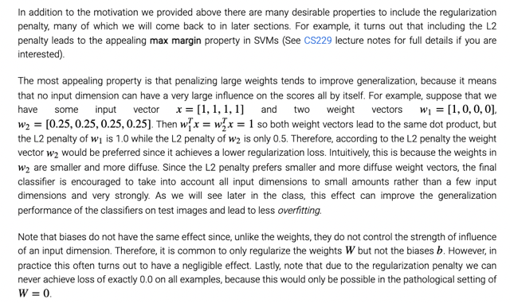</kbd>

  > Thì cuối cùng người ta nhắc lại ví dụ trong đó cho thấy tại sao L2 loss lại
> giúp tạo ra W "diffuse" hơn = phân tán hơn dàn trải ra nhiều feature hơn
> từ đó giúp giảm overfit (khi ta biết rằng overfit có nguyên nhân do trạng
> thái high variance, khi nó quá đánh giá cao một feature nào đó thì sẽ
> cũng giống như nó đánh gía quá cao một data sample nào đó để rồi khi
> bỏ cái data sample đó ra khỏi training set lập tức model  bị bối rối và
> thay đổi lớn - high variance)
>
> Tuy nhiên trong bài có nói, tùy vào bài toán cụ thể mà có thể dùng L2 L1
> reg term khác Nhau vì mỗi loại sẽ có một cách định nghĩa simple model
> là sao khác nhau. L1 thì  cho rằng simple model là các weight nào ít ảnh
> hưởng thì cho bằng 0 luôn còn L2 thì dàn trải ra.
>
> Tóm lại với reg term ta dễ dàng thấy không có chuyện có nhiều giá trị
> khiến L = 0 nữa

   

  
  
<kbd>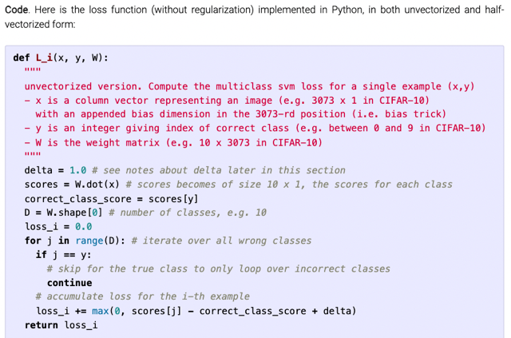</kbd>

  > Phiên bản tính L(i) có dùng loop, cũng dễ hiểu, trong đó, ta sẽ loop
> qua các score trong D scores, bỏ qua cái correct class score là cái ở
> index  = y.
>
> Rồi với mỗi cái incorrect class score, tính loss L và cộng dồn lại

   

  
  
<kbd>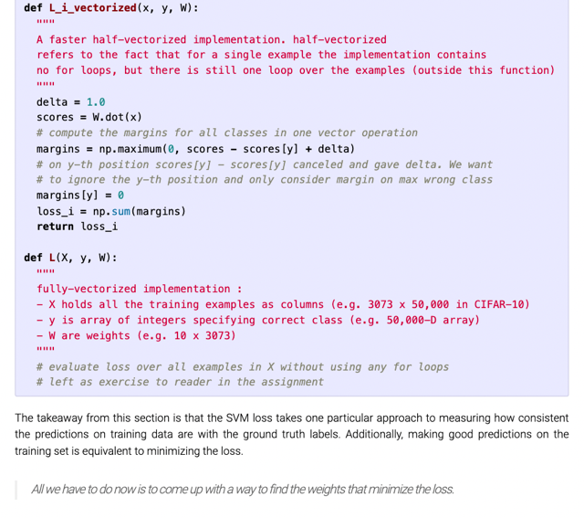</kbd>

  > Ở phiên bản half_vectorized thì đầu tiên là tính W.x để ra vector scores
> Dx1 lấy scores Dx1 này trừ đi scores[y] là chỉ số score của correct
> class thì  Python broadcasting sẽ biến chỉ số đó thành vector. Để thành
> ra hai vector trừ nhau. hoặc hiểu theo nghĩa vector trừ 1 số scalar thì
> bằng element-wise  Subtraction cũng được.
>
> Xong lấy max(0, với một vector) thì kiểu như ra vector các phép max(0,
> element) Nhưng do làm kiểu này vẫn có các việc "tính cho correct
> class" nên phải khử đi bằng cách cho margins[y] = 0. Cuồi cùng sum lại
> để ra loss
>
> ===
>
> Cái cuối để dành cho mình làm

   

  
  
<kbd>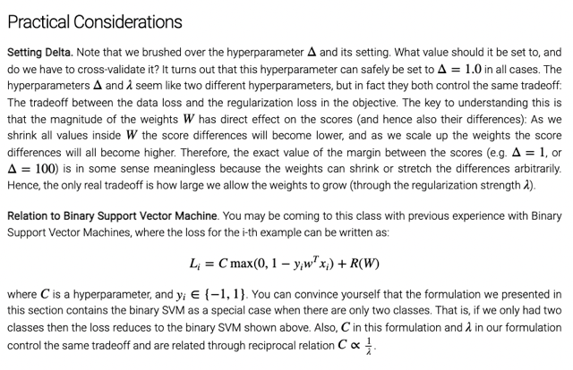</kbd>

  > Đại khái là người ta nói thực tế chỉ cần chọn Delta = 1 là được vì với Reg
> term, trong đó có lambda, nó sẽ không chế khiến co dãn cái W từ đó ảnh
> hưởng cái margin dẫn đến là có set nhiều các giá trị Delta cũng vô ích
>
> Cái nữa đó là nếu đã từng học về Binary SVM (mà mình đã học trong
> ML Old class) thì cái SVM chính là bản multi class của Binary SVM

   

  
  
<kbd>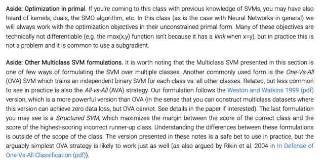</kbd>

  > Một số Ghi chú bên lề quay lại sau

   

  
  
<kbd>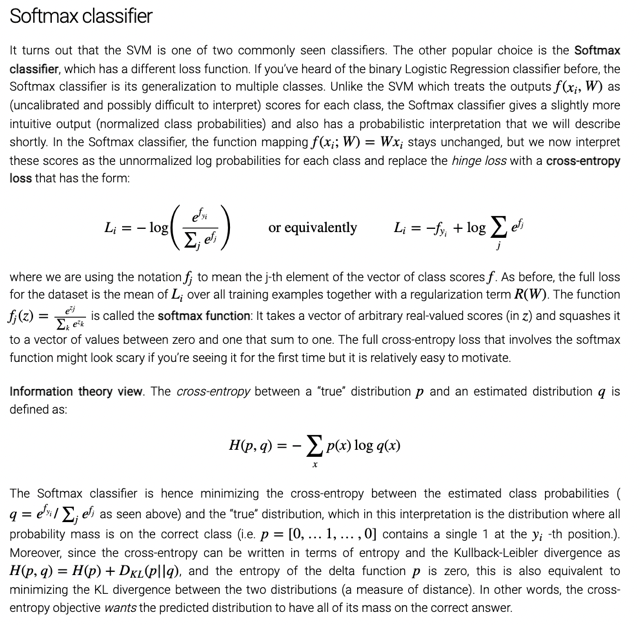</kbd>

  > Thì đại khái là nói về loss function phổ biến thứ 2 cho bài toán này là
> Softmax là bản generalized của logistic function (Sigmoid)
>
> Trong đó đại khái là sẽ chuyển cái scores vector từ real number thành ra
> vector có tổng = 1, trong khoảng [0:1]. Từ đó giống như một probability
> distribution.
>
> Để rồi loss function sẽ dùng cross-entropy có tác dụng giảm khác biệt giữa
> hai probability distribution, một cái là predicted là vector các scores đã qua
> softmax một cái là target probability distribution trong đó mọi xác suất đều
> dồn cho correct class - chính là thể hiện bởi one-hot vector y(i).
>
> Cuối cùng có nhắc đến KLDivergence cũng là "thước đo sự khác biệt / phân
> kì của hai probability distribution"

   

  
  
<kbd>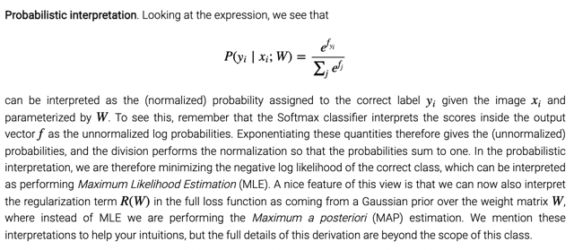</kbd>

  > Cái đoạn dưới nói về MAP Cụ thể là sao?

  > Đại khái là hàm softmax coi input score tại yi scores[yi] như unnormalized
> log probabilities. nên việc nó làm là bỏ log (bằng cách exponential) và
> normalize (bằng chia cho tổng e^fj) để ra lại probability của correct class
> P(yi | xi, W)
>
> Thành ra việc dùng cross entropy loss function có thể hiểu là ta đang làm
> bài toán là Maximum Likelihood Estimation MLE

   

  
  
<kbd>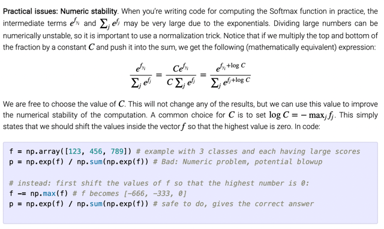</kbd>

  > Đại khái là khi tính softmax, nếu mẫu số lớn thì dễ bị numerical unstable
> issue. Thành ra người ta nói có thể dùng trick đó là nhân tử và mẫu cho 1 có
> C (thì kết quả vẫn không đổi). Thì có thể chọn C Bao nhiêu cũng được nhưng
> thường nên chọn = - giá trị lớn nhất frong f (score vector) tức là lấy bằng
> score lớn nhất.
>
> Thì người ta nói đại khái là nếu chọn như vậy thì cơ bản là mình dịch chuyển
> vector các scores lùi lại trên trục số để cái lớn nhất từ ví dụ 999 thành 0, cái
> nhỏ nhất ví dụ từ 0 thành -999

   

- Possibly confusing naming conventions. To be precise, the SVM classifier uses the \\*hinge loss\\*, or also sometimes called the \\*max-margin los\\*s. The Softmax classifier uses the \\*cross-entropy loss\\*. The Softmax classifier gets its name from the softmax function, which is used to squash the raw class scores into normalized positive values that sum to one, so that the cross-entropy loss can be applied. In particular, note that technically it doesn’t make sense to talk about the “softmax loss”, since softmax is just the squashing function, but it is a relatively commonly used shorthand.
  > Đại khái là softmax chỉ là hàm biến vector logit thành
> probability distribution nên nói softmax loss là không đúng
> lắm (vì hàm loss thực sự có tên là cross entropy loss),
> nhưng thường hay gọi vậy cho tiện

   

    
    
<kbd>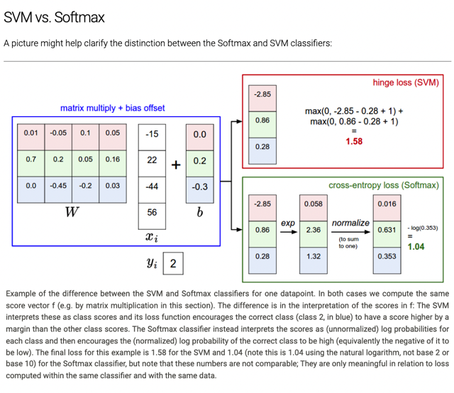</kbd>

     

    
    
<kbd>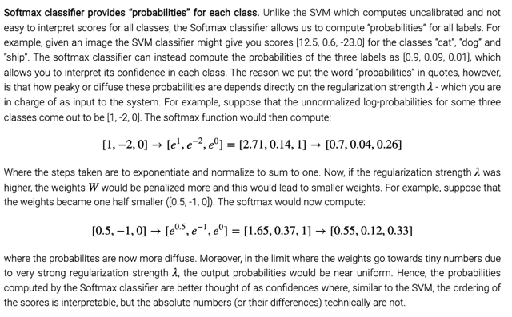</kbd>

    > Đại khái người ta nói rằng tuy softmax tạo ra cho ta probability nhưng
> nó không tuyệt đối theo nghĩa đó vì với các W khác nhau, cho ra các
> scores khác nhau thì probabilities cũng thay đổi. Thành ra nên hiểu nó
> như "độ tự tin" thì đúng hơn trong đó với correct class có p cao tức là
> model nó tự tin cao rằng input x là class đó hơn là các class khác.

     

    
    
<kbd>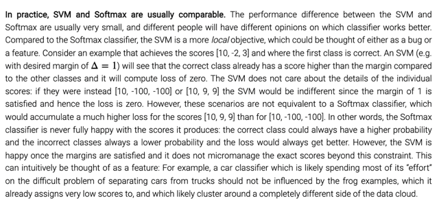</kbd>

    > Đại khái là nói về sự khác nhau của SVM khi chỉ quan tâm khoảng cách
> correct class score và mấy thằng incorrect class score có thể là bug nếu
> hiểu theo nghĩa là nó hời hợt quá cũng có thể coi như feature nếu hiểu
> theo nghĩa là nó không micromanage xét nét từng tí chỉ số tuyệt đối của
> score là bao nhiêu. Ngược lại với softmax.

     

    
    
<kbd>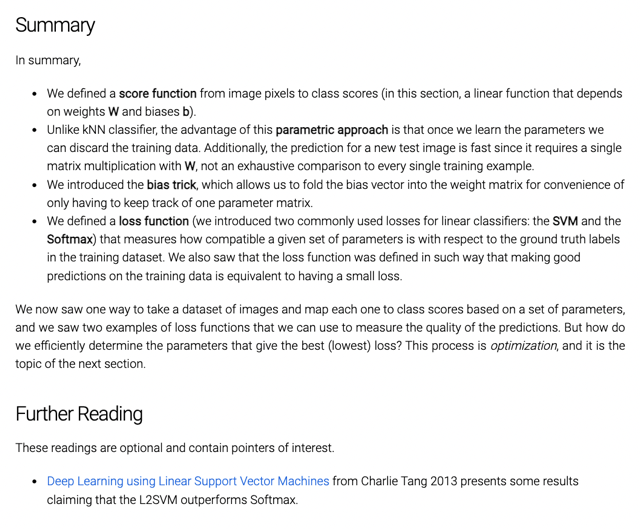</kbd>

    > Đại khái là tổng kết lại ta đã biết score function giúp tính ra chỉ số
> mà model "gán" một class cần predict cho một input image data
> Rồi việc sử dụng parametric approach như này giúp training tốn
> thời gian nhưng một khi train xong thì chỉ việc dùng bộ params W
> để predict thôi không còn cần training sét như KNN nữa.
>
> Biết về bias trick để kết hợp W và b lại thành một matrix.
>
> Biết về loss function SVM và Softmax giúp đánh giá độ chính xác
> trong khả năng fit - dự đoán khớp các input data và label của nó trong
> training set của model với một bộ W cụ thể.
>
> Tuy nhiên làm sao để tìm ra bộ params W giúp đạt loss tối thiểu thì ta 
> sẽ qua note 2.

     

