# LECTURE NOTE: Optimization: Stochastic Gradient Descent

📊 **Progress:** `19` Notes | `22` Screenshots

---

https://cs231n.github.io/optimization-1/

<kbd>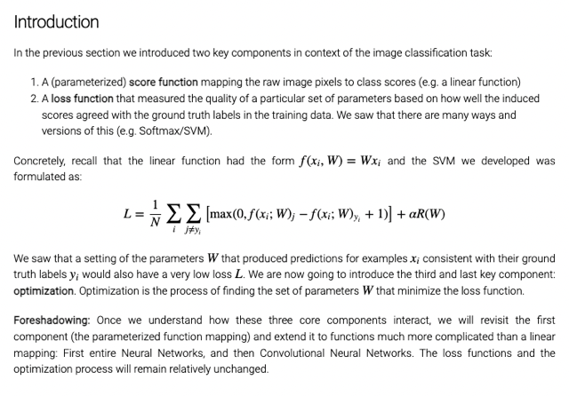</kbd>

> [!NOTE]
> Đại khái là ở note trước ta đã biết về score function và loss function giúp
> đánh giá khả năng của model trong việc mapping được đúng xi và yi. Mà hai
> function phổ biến là SVM và Softmax Ở đây ta sẽ làm bước cuối cùng,
> component cuối cùng của bức tranh đó là optimization để tìm các giá trị W
> giúp giảm thiểu loss.
>
> Từ đó qua NN và CNN ta sẽ vẫn dùng optimization này chỉ thay các kiến trúc
> model thôi

 

<kbd>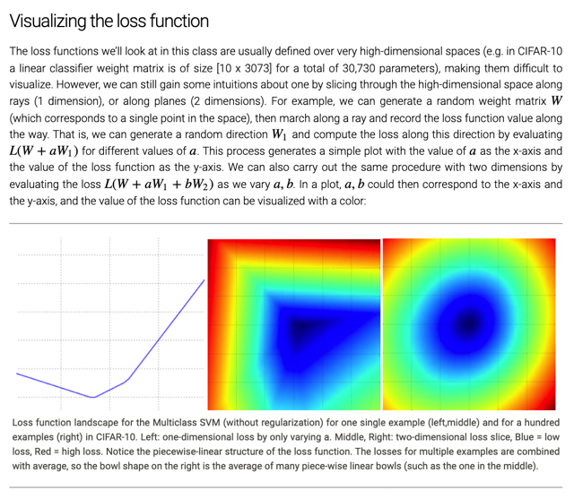</kbd>

> [!NOTE]
> Đại khái là ở đây nói về vấn đề khó khăn trong việc làm sao vẽ ra được đồ
> thị của loss function khi W thay đổi. Vì W là matrix có KxD = 10x3073. K =
> số class trong bài toán CIFAR-10 thì là 10, D là feature vector dimension =
> 32x32x3+1(bias) = 3073.
>
> Tức là với mỗi bộ W có thể coi như một vector có 30730 units, trong không
> gian 30730 dimensions.
>
> Thế thì một cách để visualize đó là người ta sẽ cho W thay đổi ở 1 hoặc 2
> trục trong  30730 dimension này, gọi là W1, W2 và vẽ J để rồi ta được một
> 1D hoặc 2D plot khi W1,W2 biến thiên.
>
> Nếu làm với 2 trục và với loss khi tính trên 1 data sample ta có hình giữa
> ta thấy gọi là **piecewise-linear structure** và nếu làm với **trung bình của
> nhiều data sample** thì ta có hình bên phải

 

<kbd>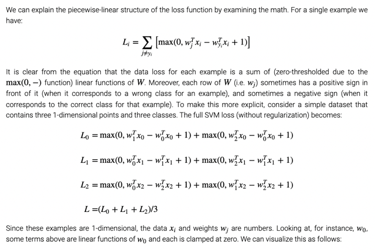</kbd>

> [!NOTE]
> Đại khái là người ta giải thích cho mình hiểu tại sao có dạng **piecewise-linear**
> như hình trên.
>
> Thì nôm na là để dễ hình dung người ta lấy bài toán với 1 feature thôi, tức
> x chỉ là một con số thực, không phải vector. Thì lấy ví dụ có 3 categories,
> có nghĩa là kết quả tính toán của model với một data sample sẽ là 3 class
> scores, từ đó tính ra loss tính trên mỗi data sample và tính loss nói chung
> sẽ là average của loss trên 3 data sample x(0), x(1), x(2)

 

<kbd>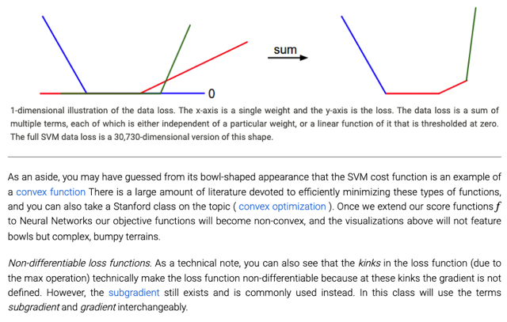</kbd>

> [!NOTE]
> QUay lại sau

 

<kbd>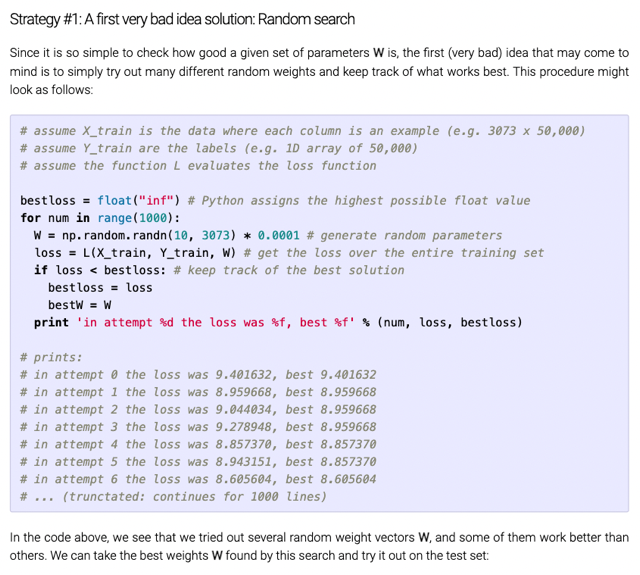</kbd>

> [!NOTE]
> Thì cách đầu tiên có thể nghĩ đến và cũng là cách tệ nhất đó là dùng
> random search - cứ lấy ngẫu nhiên các giá trị của W rồi tính loss
> xem thử cái nào tốt nhất

 

<kbd>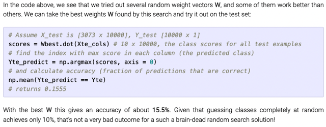</kbd>

> [!NOTE]
> Rồi với bộ W, tính thử
> tét sét cho ra 15%.

 

<kbd>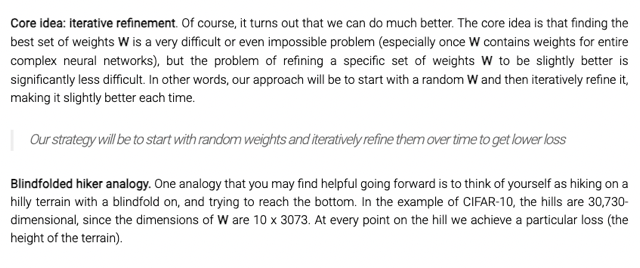</kbd>

> [!NOTE]
> Core idea là thay vì random chọn các bộ ngẫu nhiên W, ta có thể bắt đầu
> với ngẫu nhiên nhưng iteratively cải thiện chút từ từ để giảm dần loss
>
> Và analogy là như người đi leo núi muốn xuống núi thì ta sẽ đi mò mẫm
> từng  bước theo hướng có độ dốc lớn nhất. Nhưng có điều ở đây là trong
> không gian 30730 dimensions

 

<kbd>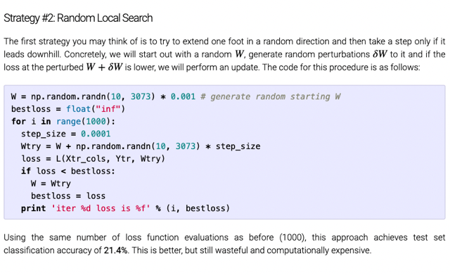</kbd>

> [!NOTE]
> Đại khái cách này là thử đi theo nhiều hướng khác nhau, xem thử hướng nào
> là giúp giảm loss nhiều nhất
>
> Ở đây họ thử 1000 lần. Mỗi lần ta sẽ thay đổi các giá trị của W ở một mức
> nhỏ xíu (Chính là thử update vị trí của current W point trong không gian
> 30730 chiều sang một vị trí gần đó ở khoảng cách rất nhỏ, nhưng hướng thì
> vẫn hoàn toàn  ngẫu nhiên) Để rồi tính loss xem thử trong 1000 hướng đó thì
> cái nào là giảm loss nhiều nhất.
>
> Thì cách này cho performance tốt hơn Random Search nhưng vẫn khá tệ khi
> cơ bản là vẫn phải mò mẫm xem hướng nào là tốt nhất,
>
> Ở analogy thì cách này chính là bước thử 1 bước về các hướng khác nhau
> 1000 lần xem thử kết quả hướng nào cho ta xuống đồi sâu nhát. Tất nhiên để làm
> Vậy thì phải bước lên bước về 1000 lần,

 

<kbd>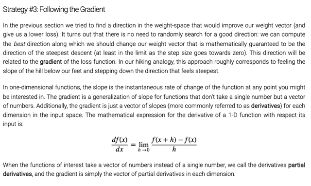</kbd>

> [!NOTE]
> Dùng G.D chính là thay vì thử và tìm các hướng ta chỉ việc đi theo hướng
> (ngược lại)  của gradient - là hướng mà theo tích phân sẽ khiến có độ dốc lớn
> nhất giúp function tăng nhanh nhất đồng nghĩa đi ngược laị hướng đó sẽ giảm
> loss nhanh nhất.
>
> HÌnh ảnh nôm na sẽ là ta xe thử dùng bàn chân để rờ xem hướng nào có dốc
> nhất thì đi hướng đó.
>
> Khi chỉ có 1 biến, hay không gian chỉ có 1 dimension thì nó gọi gradient hay
> derivative của f w.r.t x nhưng với không gian đa chiều khi x là vector thì
> gradient là vector tương ứng với số chiều của x chứ các phần từ là partial
> derivative của f w.r.t từng phần tử của x

 

<kbd>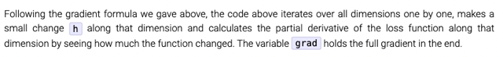</kbd>

<kbd></kbd>

<kbd>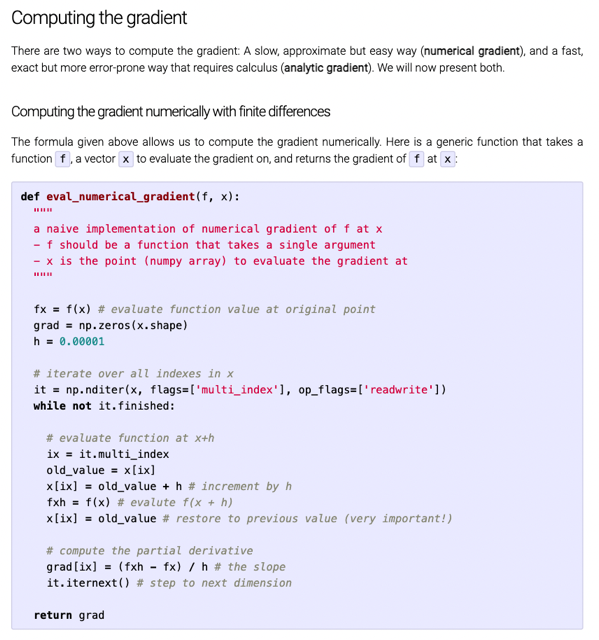</kbd>

> [!NOTE]
> Function này đại khái là nhận. 1 điểm (1 vector) ví dụ như w là [w1,
> w2...wn] Đầu tiên là nó tính f (hay loss function J) với bộ param này
> ư.
>
> Sau đó nó lần lượt thay đổi các phần tử của vector w ví dụ w_i một
> khoảng h rất nhỏ. và tính lại giá trị của function w + [0,..w_i + h,.  0]
> này và sau đó tính tỉ lệ f mới - f / h lưu vào vị trí i của gradient - là
> một vector cùng shape với w.
>
> Kết quả là ta sẽ có vector gradient - chứa các partial derivative của
> f w.r.t các phần tử của w
>
> Thì đây chính là cách tính đạo hàm theo numerical thường dùng để
> Gradient check

 

<kbd>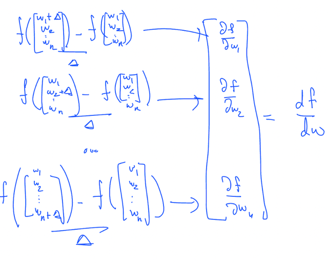</kbd>

 

<kbd>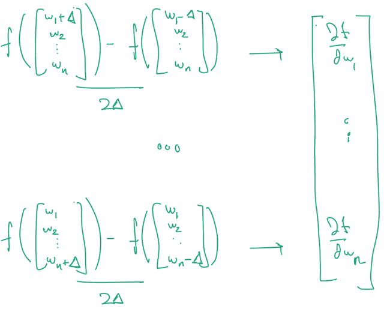</kbd>

> [!NOTE]
> Thì họ nói có thể dùng kiểu này
> cũng được sẽ chính xác hơn

 

<kbd>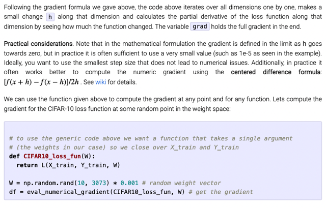</kbd>

 

<kbd>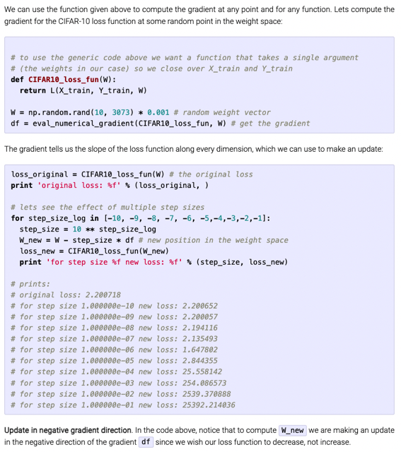</kbd>

> [!NOTE]
> Đại khái là ta ứng dụng cách tính gradient trên để iterate vài lần theo
> đó xem loss có giảm liên tục không. Khởi đầu là randomize W Sau đó
> tính gradient (bỏ vào loss function và W, nhìn hơi lạ nhưng đại khái là
> CIFAR10_loss_fun sẽ biết là dùng cái W để tính ra loss với W và
> Xtrain Ytrain.
>
> Sau đó, cho các giá trị tăng dần -10 -> -1 tức là để iterate nhiều lần
> với stepsize tăng dần lên. Mỗi lần như vậy nhân với gradient để
> update W. Sau đó tính loss với updated W.
>
> Kết quả ta thấy loss giảm dần ở vài step đầu đúng như expect, vì ta
> đang đi theo hướng ngược với gradient. Nhưng để ý thấy loss tăng
> mạnh ở cuối. Người ta đang muốn nói qua vấn đề learning rate nên cố
> ý cho (learning rate tăng lên dần)

 

<kbd>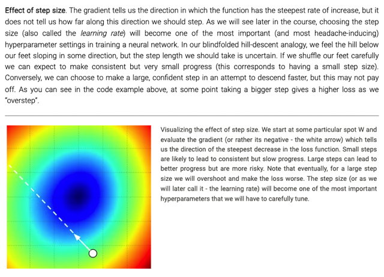</kbd>

> [!NOTE]
> Y như việc đi theo hướng độ dốc lớn nhất nhưng nếu bước quá lớn
> có thể khiến bị lố quá điểm cần đến. Do đó learning rate phải được
> chọn rất cẩn thận. Nếu nhỏ quá thì sẽ làm chậm không cần thiết
> nhưng lớn quá thì không được.
>
> Thành ra learning rate là một trong những hp quan trọng nhất cần
> được tune

 

## A problem of efficiency. You may have noticed that evaluating the

> [!NOTE]
> A problem of efficiency. You may have noticed that evaluating the
> numerical gradient has complexity linear in the number of parameters. In
> our example we had 30730 parameters in total and therefore had to
> perform 30,731 evaluations of the loss function to evaluate the gradient
> and to perform only a single parameter update. This problem only gets
> worse, since modern Neural Networks can easily have tens of millions of
> parameters. Clearly, this strategy is not scalable and we need something
> better.

> [!NOTE]
> Rất dễ thấy với cách tính gradient bằng numerical
> gradient sẽ phải tính cho mỗi param 1 lần, vậy nếu có
> cả triệu param thì sẽ tốt rất nhiều phép tính

 

<kbd>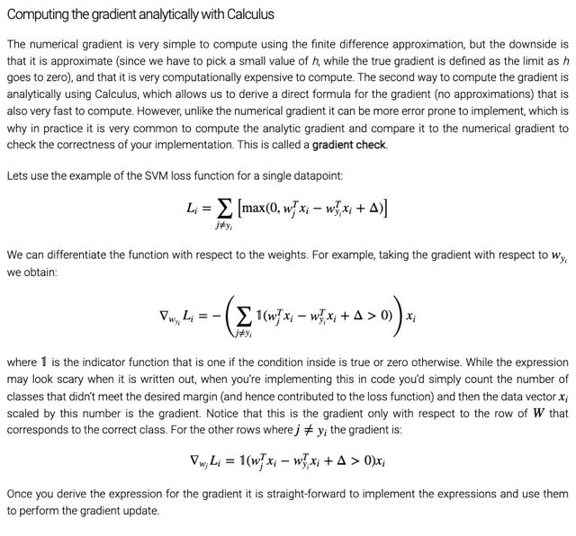</kbd>

> [!NOTE]
> Đại khái là cách tính thứ hai là dùng analytical, tức là dùng đạo hàm. Thì ở
> đây họ nói cách tính này tuy vậy chứ cũng rất dễ sai thành ra thường người
> ta tính với cách này xong dùng cách kia để  kiểm tra gọi là gradient check.
>
> Công thức tính derivative of loss w.r.t params của SVM loss có function 1(a)
> là kí hiệu của identity function, trong đó nó sẽ trả về 1 nếu a dương và 0
> nếu a âm. 
>
> Thành ra công thức tính trên, là derivative của Loss w.r.t vector (row) của W ứng
> với correct class có thể được diễn giải như sau: Trong
> các index của incorrect class (j!=yi), xem thử cái nào có score nhỏ hơn correct
> score chưa được một khoảng delta (wjTxi - wyiTxi + delta) thì tính 1, thành ra
> Khi tổng lại ta có một con số ví dụ 3,4,5 gì đó. Xong chỉ việc nhân với xi là xong.
> Tức là công thức nhìn vậy chứ dễ tính.
>
> Còn ở dưới là derivative của loss w.r.t các vector row của W ứng với incorrect
> class.

 

<kbd>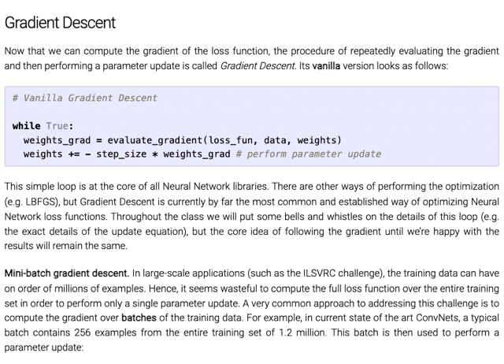</kbd>

> [!NOTE]
> Ở đây là đoạn code perform (vanilla gradient descent): Cơ bản là dùng một
> forever loop, trong đó ta dùng function với loss, data, weights để  tính
> gradient và dùng nó để update model weights.
>
> Thì người ta nói đây là core của mọi Neural Network library, và dù có thêm
> bớt hay improve chút xíu thì cơ bản đây vẫn là trái tim.
>
> Cuối cùng là nói về Mini-batch, cái này ta đã nói đi nói lại nhiều lần, đó là
> tính gradient theo cách loss trên toàn bộ data samples thì rất tốn kém.
> Thành ra mỗi lần "bước" update weights thì phải tính rất lâu, do đó người
> ta có thể dùng stochastic hoặc mini-batch gradient descent (cách này tận
> dụng được vectorization), giúp ước lượng hướng đi, tuy không đúng như
> cách chuẩn nhưng giúp tính toán nhanh giúp quá trình training diễn ra
> nhanh hơn,.
>
> Và trong Dl người ta dùng batch thường với 256 hay 512 data samples

 

<kbd>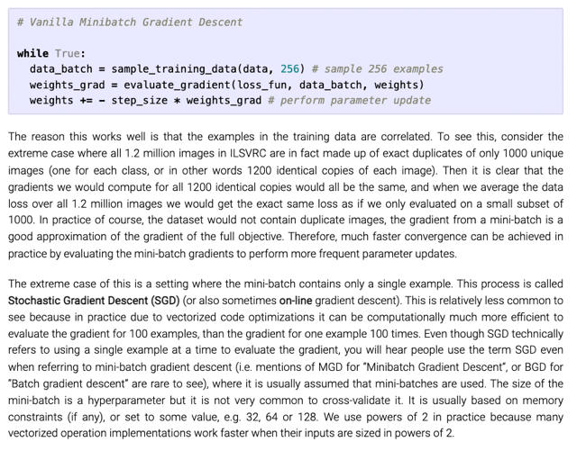</kbd>

> [!NOTE]
> Đoạn code cho thấy cách dùng mini-batch gradient descent, trong đó ta
> lấy từng batch 256 các data sample, và tính gradient, tất nhiên vì chỉ là
> loss trên một subset data nên đây chỉ là ước lượng. Tuy nhiên ở đây họ
> nói đến một ý mà mình có thể cũng đã nghe ở đâu đó đó là ngoài việc
> giúp quá trình training nhanh hơn thì không hẳn mini-batch gradient
> không ước lượng được đúng hướng (gradient) mà có khi vẫn đúng. Lí
> do là data samples trong training thường bị duplicate ví dụ như Trong
> bộ ILSVRC có 1 triệu 2 images nhưng thực ra chỉ là 1000 imgaes.
> Thành ra có tính trên toàn bộ cũng chẳng hơn tính trên một batch 1000
> images.
>
> Cuối cùng một điểm chú ý là SGD dù trên lí thuyết là nói về việc dùng
> cách tính gradient chỉ trên một single data sample tuy nhiên ngày nay 
> ít xài do cách này không apply được vectorization. Và dù người ta nói
> SGD nhưng thực chất khả năng cao là người ta nói đến mini batch GD
>
> Và số data sample trong batch thường dùng lũy thừa của 2, lí do là nó giúp
> hiệu quả hơn về mặt memory

 

<kbd>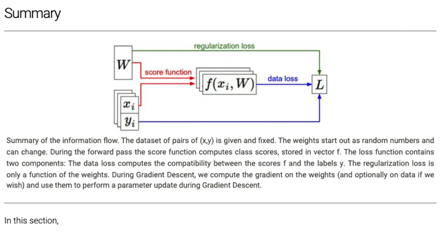</kbd>

 

<kbd>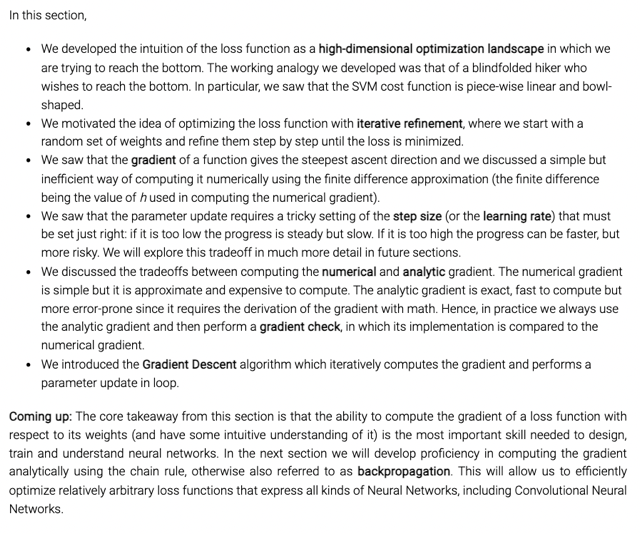</kbd>

> [!NOTE]
> Tóm lại, trong phần này ta đã biết về cái gọi là high dimensional optimization
> landscape trong đó ta tìm cách "đi xuống" điểm (W) có Loss thấp nhất. Và để
> làm điều đó ta dùng cái gọi là iterative optimizing trong đó ta sẽ cứ từ từ chỉnh
> các W sao cho dần dần loss sẽ giảm về cực tiểu, bắt đầu bằng cách mò mẫm
> với random search và thử các hướng nhưng sau đó ta thấy cùng gradient để
> dẫn lối sẽ hiệu quả hơn. Thế rồi ta biết cách tính gradient bằng numerical tuy
> chính xác nhưng chậm nên ta sẽ dùng analytical method và check với
> numerical. Rồi khi đã biết " hướng đi nào" thì ta cần chú sải bước nên không
> được dài quá khiến overshoot nhưng ngắn quá sẽ khiến đi rất lâu mới tới đích.
>
> Cuối cùng là ta đã biết thực tế người ta sẽ dùng minibatch gradient descent
> thay để đỡ tốn kém và nhanh hơn hiệu quả hơn

 

