# Lecture X: Transformer

📊 **Progress:** `42` Notes | `48` Screenshots

---
<a id="node-1271"></a>

<p align="center"><kbd>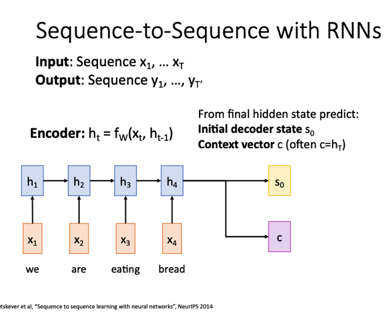</kbd></p>

> [!NOTE]
> đại khái là nói về kiến trúc `Seq-To-Seq` nơi ta giải bài toán mà input
> output không cùng length. Nên input có length T, output có length T'
>
> Thế thì input sequence sẽ được process bởi một RNN, gọi là encoder,
> để cuối cùng cho ra hai vector s0 đóng vai trò là initial hidden state của
> decoder. Và một context vector c, sẽ tham gia vào mọi `time-step` của
> decoder.
>
> Justin cũng cho biết thường người ta cho context c là last hidden state
> còn s0 có thể được qua một vài FC layer nữa.

<br>

<a id="node-1272"></a>

<p align="center"><kbd>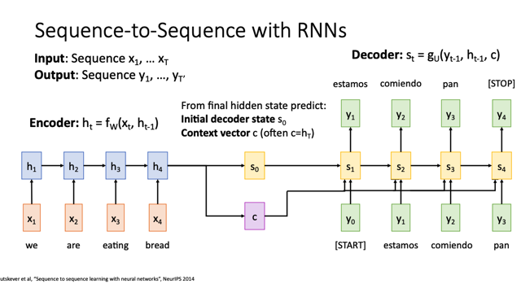</kbd></p>

> [!NOTE]
> Decoder sẽ nhưng bình thường tại mỗi `time-step,` tại `time-step` đầu
> tiên nó nhận c, s0 và một input vector <START> token. Để tính toán ra
> s1 (kí hiệu s chỉ hidden state của decoder), rồi y^1 là phân phối xác
> suất over vocab như đã biết dự đoán từ tiếp theo. Sau đó như đã biết,
> ta lấy từ phân phối đó từ có xác suất cao nhất, đưa vào input của
> `time-step` tiếp theo, nó sẽ tiếp tục cùng với context vector c tham gia
> tính toán s2 y^2...
>
> Tất nhiên đây là nói lúc testing, còn lúc training, với y^<t>, ta sẽ tính loss
> L<t> với target y<t>, nhưng sau đó, target sẽ được dùng để đưa vào làm
> input của `time-step` kế tiếp (dù là y^<t> có như thế nào), đó chính là 
> teacher forcing.

<br>

<a id="node-1273"></a>

<p align="center"><kbd>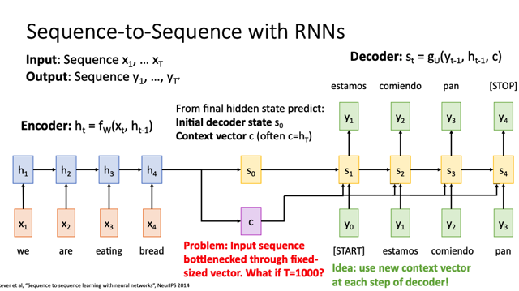</kbd></p>

> [!NOTE]
> thế thì cách làm này có vấn đề khi câu cần dịch có thể rất dài, cả một
> đoạn văn hoặc một cuốn sách, khi đó, chỉ vector c không đủ để chứa
> hết thông tin của input. Nó trở thành một nút thắt cổ chai khiến thông
> tin context input không pass qua decoder được.
>
> Ý tưởng để khắc phục vấn đề này là tính lại một context vector tại mỗi
> decoder `time-step` thay vì xài đi xài lại một cái c cố định output từ encoder.
>
> `==`
>
> Cái công thức ở góc phải, st ở decoder nên hiểu là `gU(yt-1,` `st-1,` c) (again,
> s ở đây chỉ là gọi hidden state của decoder, gU là ám chỉ function tính toán
> của một Gate Recurrent Unit, nhưng ta nên hiểu chung cho cả LSTM

<br>

<a id="node-1274"></a>

<p align="center"><kbd>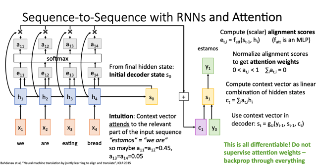</kbd></p>

> [!NOTE]
> Rồi, cái slide này hầu như đủ để hiểu về Attention trong bài toàn
> machine translation, cũng như đã được học từ mr Cris Manning ở
> cs224n:
>
> Đại khái là như đã nói, ý tưởng là ta sẽ tại mỗi `time-step` của decoder
> ta tính lại một context vector, thay vì xài vector c cố định. Thế thì
> tính bằng cách nào: Đó là ta sẽ dùng một feed forward network (MLP)
> để chuyển hai vector: `st-1,` tức là hidden state (previous, ví dụ như đang
> chuẩn bị tính s1, thì ta sẽ đang có s0) của decoder, và hi, tức là hidden
> state tại tại `time-step` i của encoder, để ra qua cái MLP đó cho ra một
> et,i `=` mang ý nghĩa là: Rồi, tôi chuẩn bị tính st của encoder, vậy thì tôi
> nên chú ý tới hi bao nhiêu `(điểm/score).` Hai thứ cần nói ở đây:
>
> `-` MLP cứ coi như một function, vì bản chất một nn model làm việc như
> một function, có điều nó là learnable hay parameterized function. Và
> function này ở đây đơn giản là tính xem độ tương đồng của `s_t-1` với
> `h_i.` Trong cs224n, gs Cris Manning dùng function similarity score như
> dot product hoặc cosine similarity, nhưng việc dùng MLP cho phép model
> linh hoạt hơn với khả năng tự học luôn cái function đảm nhiệm việc xem
> ```text
> xét sự giống nhau / phù hợp của s_t-1, h_i.
> ```
>
> ```text
> - Vậy là với mọi time-step i của encoder, sẽ cùng với s_t-1 tính ra một
> ```
> dãy các chỉ số et1, et2...eti..etT. Mỗi cái như đã nói mang ý nghĩa là "để
> tính `s_t,` thì nên dùng `h_i` nhiều hay ít, nhưng đang tạm gọi là đánh giá theo
> điểm số cao thấp bất kì, vì output từ MLP là một con số bất kì.
>
> Thế rồi, ta mới bỏ cái vector này qua softmax, để normalizing, chuyển
> các con số mang ý nghĩa là attention scores, thành ra tỉ lệ phần trăm
> attention weights, hiểu là tỉ lệ phần trăm mỗi `h_i` nên được dùng trong việc
> tạo ra context `c_t` phục vụ cho việc tính ra `s_t.` Gọi là vector `a_t`
>
> Ở đây, trong slide ghi sai, đúng phải là at,i trong [0,1] và tổng at,i  `=` 1
>
> Rồi với tỉ lệ phần trăm đó (gọi là attention weights) thì ta lấy các `h_i` theo
> tỉ lệ tương ứng, để được một cái weighted sum của các `h_i,` và đây chính là
> context vector dùng cho `time-step` t của decoder, như đã nói, thay thế cho việc
> dùng một fix vector c hồi nãy.

> [!NOTE]
> Vậy, ý tưởng hay ý nghĩa của nó chỉ đơn giản là vậy, tại mỗi `time-step` của 
> decoder khi chuẩn bị tính `s_t` nó sẽ xem cái previous state `s_t-1` tương thích
> nhiều ít với những "từ" nào trong các từ của câu cần dịch, để rồi tạo một vector
> bối cảnh phù hợp mang ý nghĩa là ta sẽ chú ý ít nhiều tới các từ khác nhau 
> khi "dịch" `/` "chọn từ cho câu dịch" tiếp theo.
>
> Cuối cùng, một ý Justin rất quan trọng, là mọi thứ ở đây đều differentiable, hiểu
> nôm na là ta chỉ kiểu như bố trí `/` set úp như vậy, còn lại, trong quá trình training
> model sẽ tự học được cách phải "chú ý" vào đâu khi dịch một câu nào đó.
>
> Rồi vector context xài như thế nào thì y như trước thôi.

<br>

<a id="node-1275"></a>

<p align="center"><kbd>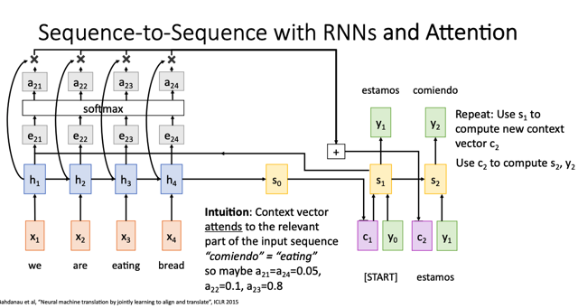</kbd></p>

> [!NOTE]
> tương tự, các `time-step` tiếp theo cũng vậy, ví dụ như để tính s2,
> ta cũng sẽ dùng s1, với các `h_i` để tính một context vector c2, để
> rồi cùng với y1, s1 tính ra s2. Cứ thế.

<br>

<a id="node-1276"></a>

<p align="center"><kbd>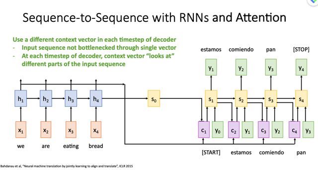</kbd></p>

> [!NOTE]
> vài cái này đã khắc phục được bottlenecked hồi nãy, để rồi dù câu cần dịch
> có dài cỡ nào, thì model nó cũng sẽ (khi tính toán `/` dự đoán để chọn một từ
> để trả ra) nó cũng sẽ kiểu như xem xét một loại các từ của câu gốc để mà
> chọn ra từ nào thì nên chú ý đến, từ nào thì bỏ qua. Nhờ vậy thông tin
> quan trọng cho việc dịch đúng một từ nào đó không bị "thất lạc" `/` "chèn ép"
> trong một núi thông tin như cách làm trước với fixed context vector c

<br>

<a id="node-1277"></a>

<p align="center"><kbd>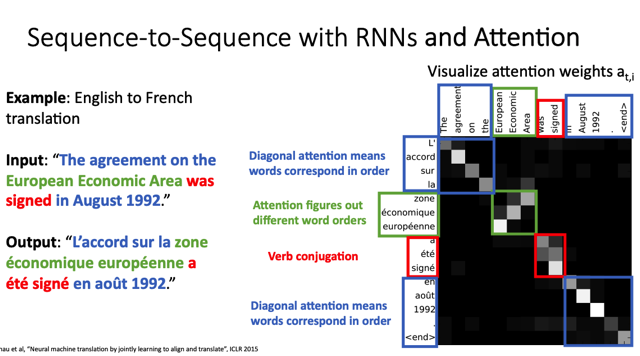</kbd></p>

> [!NOTE]
> Đại khái là khi in ra attention score mà model tính toán ta thấy:
>
> Với 4 từ đầu tiên, nó khớp `1-1` với các từ tiếng pháp. Nhưng với các từ
> xanh lá, dù thứ tự của 3 từ tiếng anh, nếu xét nghĩa, thì sẽ không khớp `1-1`
> với 3 từ tiếng pháp, nhưng có thể hiểu là model vẫn hiểu và "chú ý" đúng
> khi từ European, nó sáng nhất (chú ý nhiều) ở từ "europeenne" dù vị trí của
> hai từ này không khớp nhau.
>
> Rồi một phân tích khác cụm từ màu đỏ với 2 từ tiếng anh "was signed'
> model chú ý tới không 3 từ a, ete, signed.
>
> Tóm lại là ta thấy attention mechanism rất hay khi giúp model chú ý đúng
> thông tin input quan trọng giúp tại mỗi step.
>
> Và đây còn cho ta một cách thức để interpret model, phần nào hiểu được
> tại sao model lại cho ra kết quả như vậy vốn dĩ là một vấn đề của deep
> learning

<br>

<a id="node-1278"></a>

<p align="center"><kbd>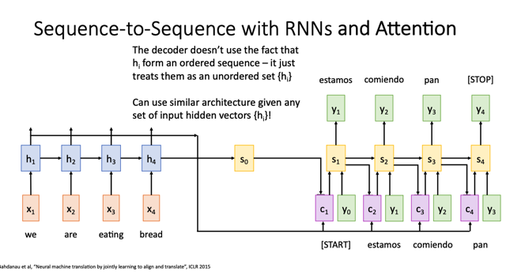</kbd></p>

> [!NOTE]
> Rồi, thế thì đây là một cái mà ở đây mới biết thêm: Đó là thực tế có thể thấy
> decoder nó không care thứ tự của các `h_i` khi dùng `h_i` trong attention
> mechanism. Nên hiểu ý này là, dĩ nhiên là trong kiến trúc này, ta vẫn xử lý
> input một cách tuần tự để có được s0.
>
> Nhưng, khi tính toán attention score, cơ bản là model không cần biết thứ tự
> của `h_i.`
>
> Do đó, ý nói cơ chế này hoàn toàn có thể áp dụng với một  dạng input khác
> không có tính tuần tự, ví dụ như hình ảnh.

<br>

<a id="node-1279"></a>

<p align="center"><kbd>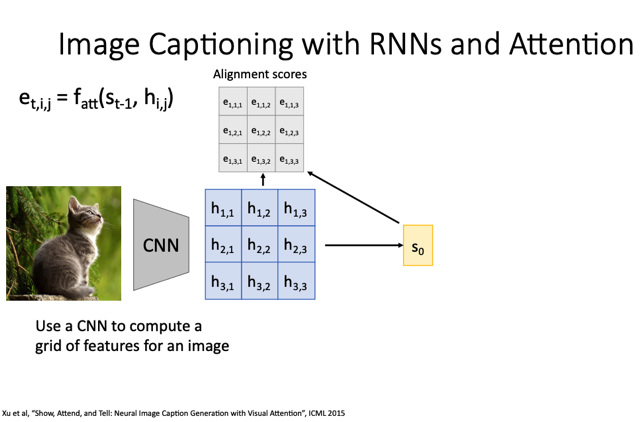</kbd></p>

> [!NOTE]
> áp dụng qua bài toán computer vision. Thế thì, đầu tiên Justin cho biết output
> ở conv layer cuối có thể xem như một grid các embedding feature vector, mỗi
> cái tương ứng với 1 vùng spatial area (mỗi hij ở đây sẽ là 1 vector, dimension
> đương nhiên là số filter của conv layer)
>
> Thế thì ta sẽ dùng nó, để predict một initial hidden state của RNN s0 (không
> như seq2seq, để mà có hidden state ở last step của encoder để mà dùng làm
> s0, nên ta có thể hình dung một cách làm nào đó có thể là sum các vector
> hij để tạo vector s0, hoặc qua một conv layer để chuyển spatial size thành 1x1.
>
> Thế thì tiếp theo, attention: s0 sẽ cùng với mỗi vector hij tham gia vào function
> `f_att` để tính toán ra các attention scores (ở đây gọi là alignment scores) e1_ij

<br>

<a id="node-1280"></a>

<p align="center"><kbd>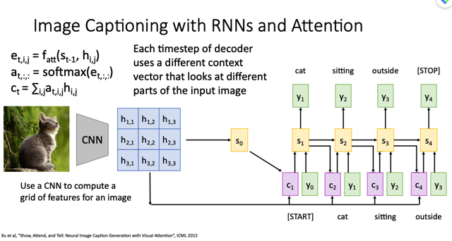</kbd></p>

> [!NOTE]
> Tiếp, các alignment scores sẽ qua softmax để chuyển thành các attention
> weights a1_ij, rồi hoàn toàn tương tự, nó sẽ dùng để tính một linear
> combination các feature vector hij để tạo ra một " context" vector c1 mang
> ý nghĩa là: để dự đoán `/` tính toán s1, thì cần chú ý nhiều ít vào vùng
> (spatial area) nào trên bức hình.
>
> Để rồi cùng với y0 (hay ta gọi là `x_dec_0)` là <start> token, s0 (với lstm ta
> hiểu rằng sẽ là gồm có cell state c0 và hidden state h0) để tham gia tính
> toán ra s1 (again, nếu là lstm ta hiểu rằng ta sẽ có hidden state h1 và cell
> state c1).
>
> Rồi, tương tự, s1 sẽ tham gia tính ra y^1 là một probability distribution
> over vocab để rồi "chọn" ra từ ứng với prob cao nhất đóng vai trò input
> của `time-step` tiếp y1 (nếu là testing)
>
> đồng thời sẽ lại attention để tính c2, chuẩn bị cho việc tính S2. cứ thế. Cho
> đến khi output ra <end> token.

<br>

<a id="node-1281"></a>

<p align="center"><kbd>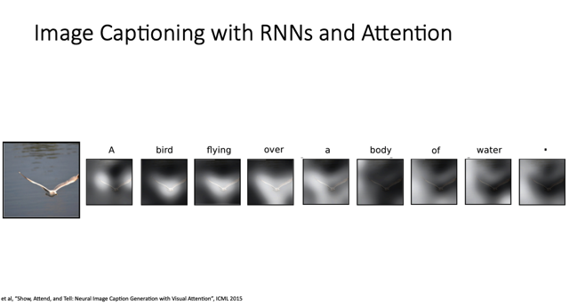</kbd></p>

> [!NOTE]
> có thế thấy, với cái này, khi model (chuẩn bị) generate ra từ bird, nó đã
> hầu như tập trung hoàn toàn vào vùng có hình ảnh con chim. Còn với
> water, thì ngược lại, nó nhìn vào "mặt nước"
>
> Thế thì ở đây, có một kiểu khác mà ta sẽ học ở bài sau, đó là thay vì
> tính một linear combination các feature vector của mọi vùng. Thì nó chỉ
> dùng 1 vùng thôi Cái này cần một chút điều chỉnh, bài sau sẽ học.

<br>

<a id="node-1282"></a>

<p align="center"><kbd>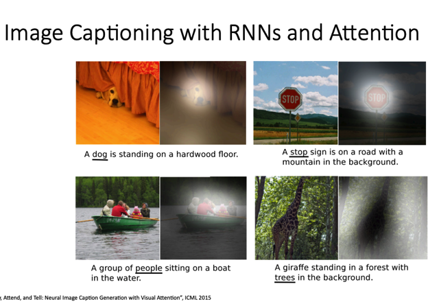</kbd></p>

> [!NOTE]
> Một vài ví dụ khác

<br>

<a id="node-1283"></a>

<p align="center"><kbd>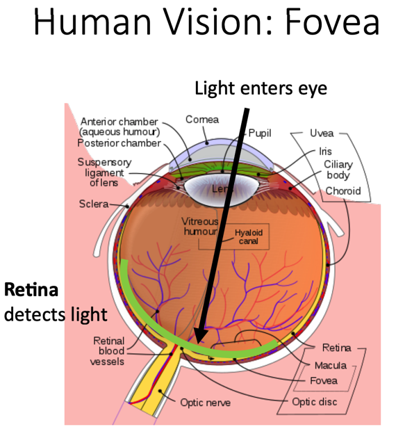</kbd></p>

<br>

<a id="node-1284"></a>

<p align="center"><kbd>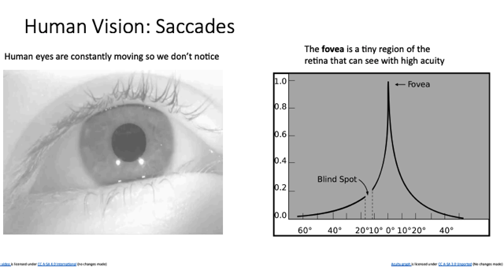</kbd></p>

<br>

<a id="node-1285"></a>

<p align="center"><kbd>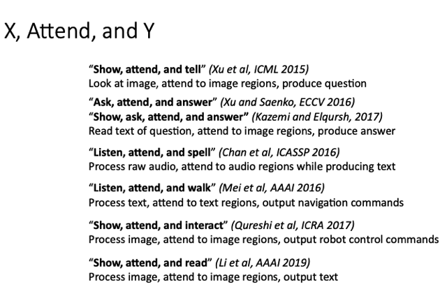</kbd></p>

<br>

<a id="node-1286"></a>

<p align="center"><kbd>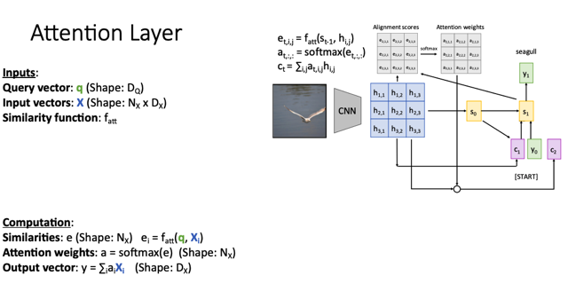</kbd></p>

> [!NOTE]
> đại ý là người ta tìm cách, khái quát nó, để phục vụ cho nhiều bài toán, vấn
> đề khác. Để rồi ta có Attention layer, trong đó input sẽ gồm một query vector
> q, size `D_Q` và một bộ input vectors X, shape `(N_X,D_X)`
>
> Để rồi, trong đó nó sẽ tính một vector các similarity scores `e_i` thông qua một
> function `f_att().` Và dùng softmax để chuyển thành attention weights, rồi
> dùng nó như hệ số của linear combination các vector trong X để có output
> vector

<br>

<a id="node-1287"></a>

<p align="center"><kbd>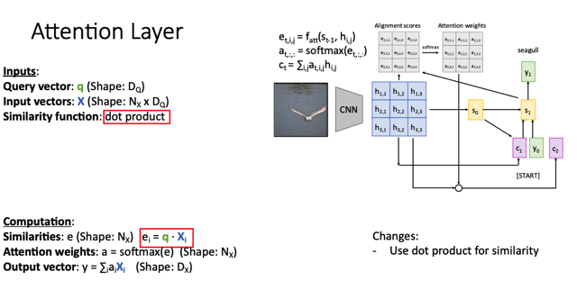</kbd></p>

> [!NOTE]
> Vậy thì, một cách làm đầu tiên cho thấy sự hiệu quả đó là `f_att` hóa ra 
> chỉ cần dot product giữa q và `X_i`

<br>

<a id="node-1288"></a>

<p align="center"><kbd>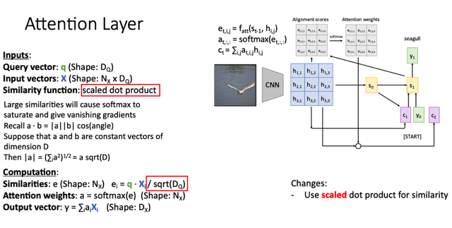</kbd></p>

> [!NOTE]
> đại khái là sau đó người ta thấy dùng scaled dot product thì tốt hơn. Vì
> như ta biết attention score sẽ phải pass qua softmax để chuyển thành 
> attention weights. Thế thì, như đã biết về tính chất hàm softmax, cũng
> như sigmoid, sẽ có gradient bị saturate ở giá trị lớn. Do đó, cũng như
> nghĩ về hàm sigmoid cho dễ hình dung, nếu sigma(z) lớn tức là xác suất
> tập trung phần lớn về positive class, và rất ít ở negative class, lúc này
> gradient sẽ bằng 0. Thì tương tự vậy, tưởng tượng nếu một attention
> score lớn hơn vượt trội các scores khác, thì tình hình cũng y như vậy,
> đó là phân phối xác suất sẽ tập trung hết vào cái 'class' đó, để thành ra như
> một cái đỉnh (peak), lúc này gradient của softmax cũng sẽ bằng 0 gây là 
> hiện tượng vanish gradient.
>
> Rồi, một cái vấn đề nữa, đó là vầy: ta nhớ dot product của hai vector a, b
> là tích của độ dài hai vector `(norm/magnitude)` và cos của góc giũa chúng.
>
> a.b bằng `|a||b|cos_alpha,` ví dụ lấy constant 2D vector đi, tức các unit của 
> chúng bằng nhau gọi là bằng x đi. 
>
> Có thể thấy |a| `=` x*sqrt(2) (pytagore thôi). Khái quát lên ở không gian có 
> D dimension thì |a| `=` x*sqrt(D).
>
> Vậy thì ý nói vì dot product của hai vector sẽ tỉ lệ với độ lớn của magnitude 
> chúng, mà một vector trong không gian vector có dimension càng lớn, hay
> nói gọn là có nhiều phần tử thì độ lớn của nó sẽ càng lớn. Dẫn đến kết luận
> số dimension càng lớn thì đợt product giữa hai vector sẽ càng lớn.
> Và khi làm việc trong neural net có các vector có số dimension rất lớn
> thì sẽ dễ có các kết quả đợt product giữa hai vector lớn.
>
> Và tác hại của attention score lớn thì đã nói ở ý 1
>
> `=====`
>
> Do đó người ta mới chia cho sqrt của D để khắc phục hiện tượng này,

<br>

<a id="node-1289"></a>

<p align="center"><kbd>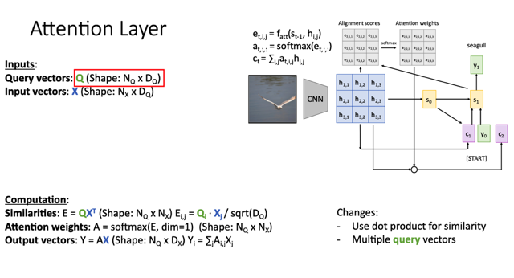</kbd></p>

> [!NOTE]
> Cải tiến thứ 2 là thay vì chỉ "cho" một query vector, thì ta sẽ cho nhiều query
> vector được tham gia attention mechanism cùng lúc. Như vậy, thay vì một
> vector q, bây giờ sẽ là một bộ nhiều vector làm thành matrix Q có shape
> ```text
> N_Q, D_Q, N_Q là số vector query, D_Q như cũ là số unit của query vector.
> ```
>
> Khi đó, việc tính **cho mỗi**query vector một bộ các similarity giữa nó và
> các vector của X, sẽ được thực hiện cùng lúc, thông qua phép nhân matrix
> ```text
> QX.T/sqrt(D_Q), để có kết quả với shape là (N_Q, N_X)
> ```
>
> Sau đó, ta sẽ apply softmax với `dim=1` để chuyển thành attention weights A
> và với mỗi một bộ attention weights, ta tính một linear combination các
> vector X cùng lúc bằng phép nhân AX.

<br>

<a id="node-1290"></a>

<p align="center"><kbd>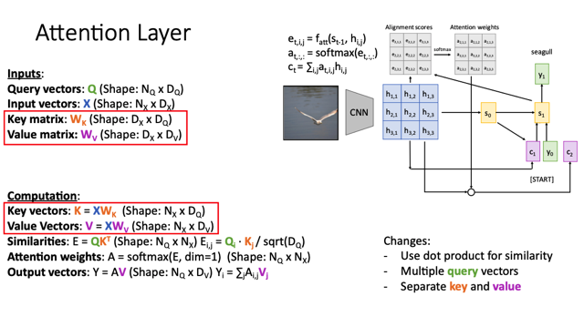</kbd></p>

> [!NOTE]
> rồi, cải tiến tiếp theo đó là, từ việc ta dùng bản thân các vector của X để tính
> "mức độ tương đồng" similarity scores với query vector q, để rồi có các
> attention weights và tính một linear combination các vector X để trả ra làm
> kết qủa.
>
> Thì bây giờ ta sẽ **cho phép model tự học `/` định nghĩa** ra **cho mỗi vector
> của  X, một vector key và một vector value**, để rồi nó sẽ dùng key trong
> việc tính ra attention weights, và dùng value để tính cái weighted linear
> combination để trả ra kết quả.
>
> Như vậy, bây giờ có thêm việc ta dùng 2 linear transformation với Wk và Wv
> để learn từ các vector x (X) ra các vector key (K) và value (V). Và dùng K,Q
> trong việc tính attention weights và V trong linear combination AV.
>
> Chú ý cốt lõi vẫn chỉ là ta có một query vector (ví dụ decoder `h_t),` và một bộ
> vector cần tính attention x1,x2... (X) (ví dụ encoder's h1, h2...hT). Giờ ta sẽ
> cho model học để chuyển từ mỗi vector `x_i` ra hai vector key `k_i` và value
> `v_i.` Để rồi dùng các vector k1, k2,... để tính attention weight với q, sau đó
> dùng các weight đó để linear combination các vector v1,v2...
>
> Rồi, thay vì "làm" với một vector q đơn lẻ thì ta muốn "làm" với nhiều vector
> q1,q2....cùng lúc thì (Q)

<br>

<a id="node-1291"></a>

<p align="center"><kbd>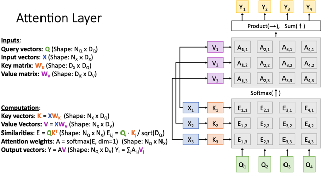</kbd></p>

> [!NOTE]
> Và ta đã có một Attention Layer với mục đích sử dụng chung cho bất kì 
> tính huống nào mà ta có một query và một bộ các input và cần dùng attention
> để combine các input.

<br>

<a id="node-1292"></a>

<p align="center"><kbd>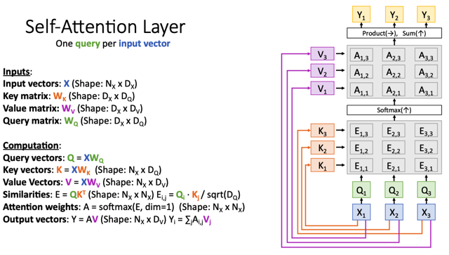</kbd></p>

> [!NOTE]
> và từ đó ta có một dạng đặc biệt của Attention layer, là `Self-Attention`
> layer. Trong đó, đơn giản là thay vì ta có một bộ các vector q (Q) cần "làm"
> attention với một bộ vector x (X). Thì nay có thể coi như các vector q này
> chính là các vector x luôn, mang ý nghĩa là, ta muốn: với mỗi một vector x,
> ta cần tính sự tương đồng của nó với các vector x khác, để rồi tạo một
> linear combination từ các vector x đó. Tất nhiên, như ở trên, ta cũng sẽ
> không dùng bản thân vector x làm key hay value mà cho model `"học/tạo"`
> từ x, thì nay ta cũng cho model "tạo" ra vector query q cho mỗi x luôn.
>
> Mọi chuyện còn lại đều tương tự Attention Layer.
>
> Như vậy khác với Attention Layer, cái này có đặc biệt là chỉ có một bộ
> vector input, mà mỗi input cần attend với các thằng khác để kiểu như tạo
> ra một phiên bản khác trong đó kết hợp nhiều ít từ các thằng khác.

<br>

<a id="node-1293"></a>

<p align="center"><kbd>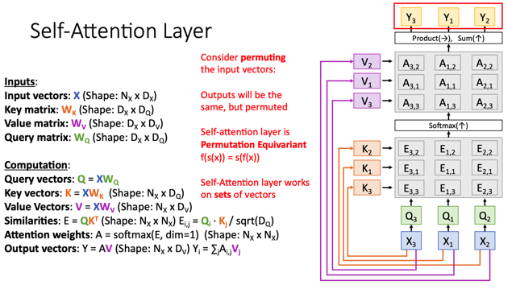</kbd></p>

> [!NOTE]
> rồi, Justin nói qua một tính chất thú vị của self attention đại khái rất đơn giản
> đó là khi ta xáp trộn thứ tự (permute) của các input x, thì mọi thứ vẫn y
> chang, và output cũng chỉ thay đổi thứ tự. Do đó gọi là permutation
> equivalent, có nghĩa là ta xáo trộn xong apply self attention f(s(x)) thì cũng y
> như là apply self attention xong rồi xáo trộn s(f(x))
>
> Như vậy, ta có một Layer mới mà trong đó nó không care thứ tự của input,
> mà chỉ đơn giản là đưa vào một set các vector và trả ra một set các vector.

<br>

<a id="node-1294"></a>

<p align="center"><kbd>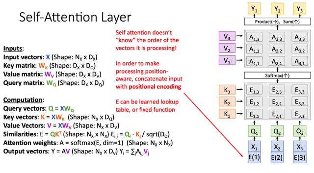</kbd></p>

> [!NOTE]
> thế thì, vì layer này không đoái hoài thì tới thông tin về vị trí của các input, 
> thành ra trong một số bài toán như translation, captioning rõ ràng là ta cần
> thông tin vị trí. Vì vậy mới có một hack đó là dùng một cái gọi là positional
> encoding để concatenate với input, cái này sẽ giúp quá trình self attention
> ra output vẫn có thông tin về thứ tự.
>
> Cái positional encoding có thể dùng một fixed function hoặc là một learnable
> lookup table.

<br>

<a id="node-1295"></a>

<p align="center"><kbd>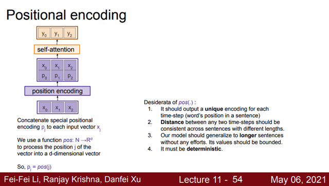</kbd></p>

> [!NOTE]
> cụ thể về positional encoding trong lecture của đh Michigan không nói,
> ta phải mượn lại slide của cs231n (dù ko có lecture video nhưng xem 
> slide cũng có thể hiểu). Thế thì ở đây họ cho rằng cái position encoding
> cần đáp ứng được những điều kiện như
>
> Nó phải thể hiện được tính chất unique của position info, đương nhiên.
>
> ```text
> Thứ hai, hiểu ý này là ví dụ như pe(t=1)-pe(t=2) phải bằng pe(t=3)-pe(t=4)
> ```
>
> Nó phải khái quát hóa được với câu dài bất kì, một cách đơn giản
>
> và nó phải deterministic.

<br>

<a id="node-1296"></a>

<p align="center"><kbd>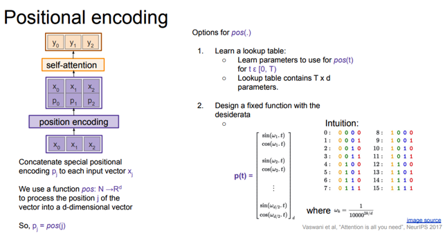</kbd></p>

> [!NOTE]
> vậy có hai cách, một là learn một look up table, kiểu như Embedding matrix
> với với word embedding, thì đây cũng vậy ta sẽ có một "Positional Embedding" 
> matrix để map một position t thuộc [1,...T] với một vector pos(t). cái matrix này
> có shape là Txd, d là số unit của position encoding vector.
>
> Cách thứ hai là dùng một fixed function, và như DLSpec, ta đã biết cái này.

<br>

<a id="node-1297"></a>

<p align="center"><kbd>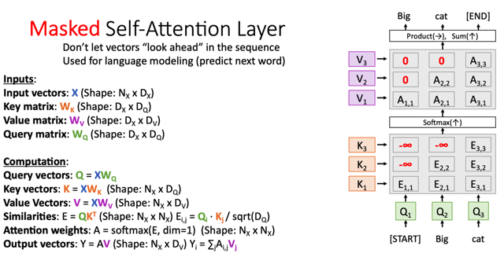</kbd></p>

> [!NOTE]
> Một dạng đặc biệt của `Self-Attention` nữa là Masked `Self-Attention`
> Layer, khi trong một số tác vụ ta chỉ muốn một input tại một vị trí chỉ
> attend vào các input của từ vị trí hiện tại trở về trước. 
>
> Khi đó ta sẽ sau khi tính attention scores, thì ta sẽ scores ứng với các
> vị trí sau vị trí hiện tại thành `-infi,` ví dụ với q1 thì attention score của
> q1k2, q1k3 đều set thành `-infi.` Nhờ đó qua softmax, attention weight
> của sẽ là 0 nên linear combination sẽ "chỉ lấy" v1: a11*v1 `+` 0*v2 `+` 0*v3

<br>

<a id="node-1298"></a>

<p align="center"><kbd>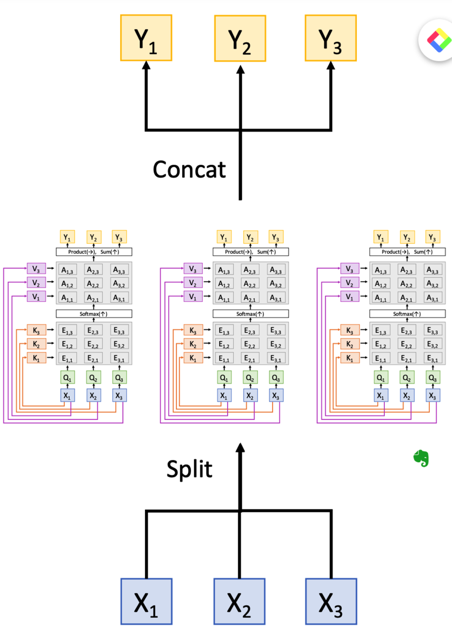</kbd></p>

<p align="center"><kbd></kbd></p>

<p align="center"><kbd>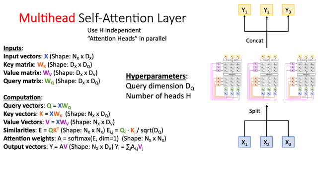</kbd></p>

> [!NOTE]
> rồi, đến cái Multihead `Self-Attention:` Cơ bản chỉ là ta chia mỗi vector input x
> (mà cả bộ làm thành matrix X) thành h phần, tức là mỗi vector input được chia
> thành h vector "ngắn hơn". Thành ra từ một "bộ" input vector ta trở thành h bộ.
> Và mỗi bộ ngắn hơn này đơn giản là pass qua một `Self-Attention` layer như đã
> biết, để cho ra h bộ output vector. Thế là ta concatenate các vector output
> tương ứng lại để thành một bộ output như thường lệ
>
> Vậy thì với cái này nó có 2 hyperparams, một là số bộ h(gọi là số head) và một
> cái nữa là query dimension vốn là ta cũng đã biết nó sẽ do kích thước matrix
> ```text
> W_Q quy định (vì query vector q được "learn" từ x bởi W_Q: Q = X@W_Q)
> ```

<br>

<a id="node-1299"></a>

<p align="center"><kbd>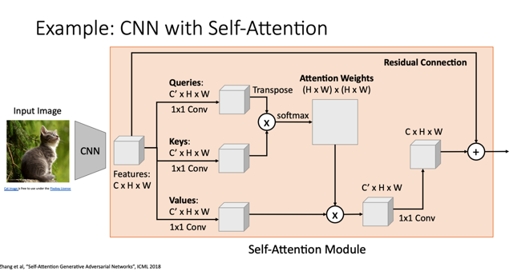</kbd></p>

> [!NOTE]
> Rồi như đã nói `Self-Attention` kiểu như đã trở thành một loại layer mới
> mang tính cách khái quát để rồi có thể được áp dụng cho nhiều bài toán
> bằng cách insert layer này vào nn. Ví dụ như trong CNN.
>
> Vậy đại khái là ta có một 3D tensor (C,H,W) và như phần đầu đã nói, ta có
> thể coi nó như một bộ (set) có H*W vector, mỗi vector có C unit,. Và ta
> muốn `Self-Attention.` Vậy, như trên ta nói, qua 3 matrix WQ, WK, WV ta
> chuyển mỗi vector x trong bộ (X) thành 3 vector q, k, v (với toàn bộ các
> vector x thành ta có 3 matrix Q,K,V). Vậy thì với CNN, dùng 3 1x1 Conv để
> đóng vai WQ, WK, WV. Để rồi kết quả ta có 3 tensor (cũng gọi là Q, K, V
> luôn đi)
>
> Rồi, ta mới "làm" cái bước attention, cũng y vậy, dùng phép dot product để
> tính với mỗi một vector query q, ta sẽ tính similarity giữa nó với mọi vector
> key, dễ thấy sẽ có W*H vector, để có các similarity scores, hay gọi là
> alignment  scores hay attention scores cũng được. Và vì ta có W*H vector
> query, nên tổng cộng ta có (W*H)*(W*H) attention scores, qua softmax
> thành attention weights.
>
> Rồi, cái tensor attention weights này sẽ cùng với các W*H vector values để
> tính các linear combination.
>
> Và thường thì người ta sẽ có thêm một 1x1 conv cũng như là residual
> connection nữa.
>
> `===`
>
> Kết quả là ta có một layer mới, mà nó làm một thứ khác với convolution (dĩ
> nhiên) đó là nó update các vector theo depth dimension lại bằng một
> linear combination các "depth vector" khác theo cơ chế attention

<br>

<a id="node-1300"></a>

<p align="center"><kbd>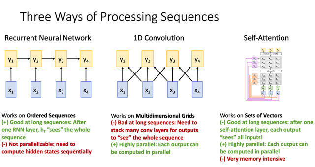</kbd></p>

> [!NOTE]
> tới đây tổng hợp lại 3 cách để dùng cho bài toán sequence data, với ưu
> nhược điểm riêng. Với RNN, như LSTM, ưu điểm là có khả năng capture
> `long-term` dependency tốt (tuy ko bằng Transformer) nhưng nhược điểm là
> phải xử lý tuần tự, không tận dụng được khả năng tính toán song song
> của máy tính.
>
> 1D convolution cũng có thể xử lý sequence data như hạn chế là không
> capture `long-term` dependency tốt nhưng ưu điểm lại là có khả năng tính
> toán song song rất tốt.
>
> Và `Self-Attention` chính là có hai ưu điểm của hai cái kia, chỉ có cái nhược
> điểm là tốn nhiều memory nhưng máy tính ngày càng mạnh thì cái này ko
> sao

<br>

<a id="node-1301"></a>

<p align="center"><kbd>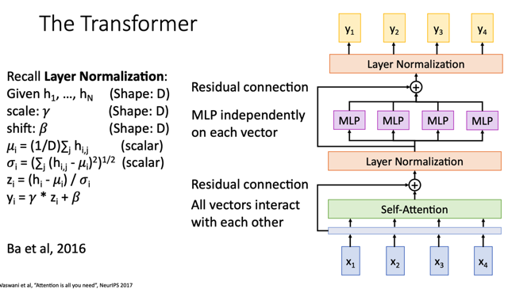</kbd></p>

> [!NOTE]
> Vậy nếu ta có sequence thì nên xài cái nào, thì một paper rất nổi tiếng
> Attention is All You Need cho ta câu trả lời: Mô hình Transformer, trong đó
> ta chỉ dùng `Self-Attention` thôi. Các vector input x sẽ đi qua `Self-Attention`
> layer, với Residual Connection.
>
> Sau đó là layer normalization, là cái ta đã làm ở bài trước, ở đó, mỗi vector
> sẽ được normalized riêng nó, không depend vào các vector khác (khác với
> self attention, mỗi output sẽ là kết quả depend vào mọi input).
>
> Output của Layer normalization là nhiều set vector, mỗi cái sẽ được đi qua
> một MLP. Với Skip Connection, và qua một layer normalization nữa để ra output

<br>

<a id="node-1302"></a>

<p align="center"><kbd>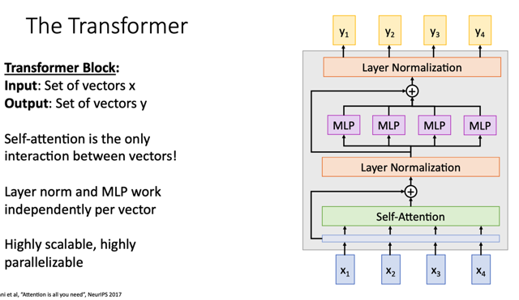</kbd></p>

> [!NOTE]
> kết quả ta có một kiến trúc gọi là Transformer block. Trong đó chỉ có
> trong `Self-attention` là các vector interact với nhau. 
>
> Ưu điểm là khả năng scalable và parellizable cao

<br>

<a id="node-1303"></a>

<p align="center"><kbd>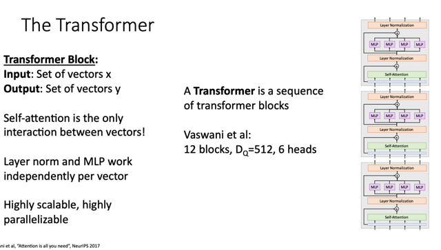</kbd></p>

> [!NOTE]
> và ta có vài `hyper-parameters` như
> số block, DQ và số head.

<br>

<a id="node-1304"></a>

<p align="center"><kbd>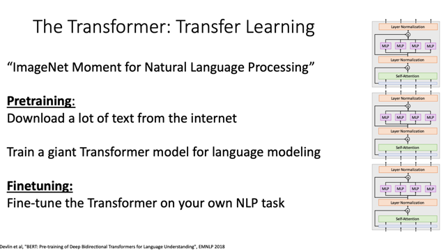</kbd></p>

> [!NOTE]
> và như gs Jeremy Howard đã nói trong fastai rằng với Transformer, thì
> NLP đã có thể tương tự như computer vision đó là transfer learning.
>
> Khi ta có thể `pre-train` một base model và `fine-tune` với specific task

<br>

<a id="node-1305"></a>

<p align="center"><kbd>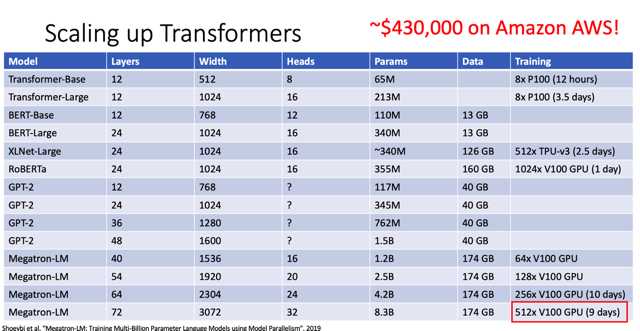</kbd></p>

> [!NOTE]
> đại ý là các nhóm research, các công ty ngày càng train một
> Transformer model lớn hơn

<br>

<a id="node-1306"></a>

<p align="center"><kbd>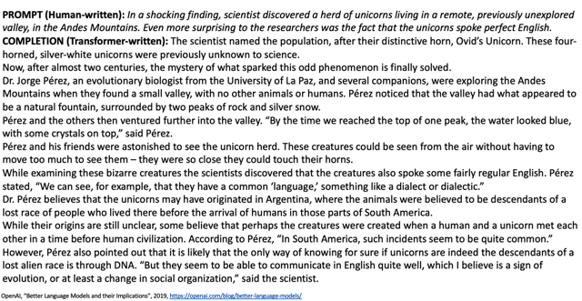</kbd></p>

<br>

<a id="node-1307"></a>

<p align="center"><kbd>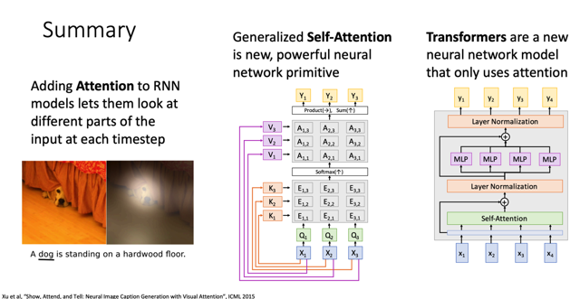</kbd></p>

<br>

<a id="node-1308"></a>

<p align="center"><kbd>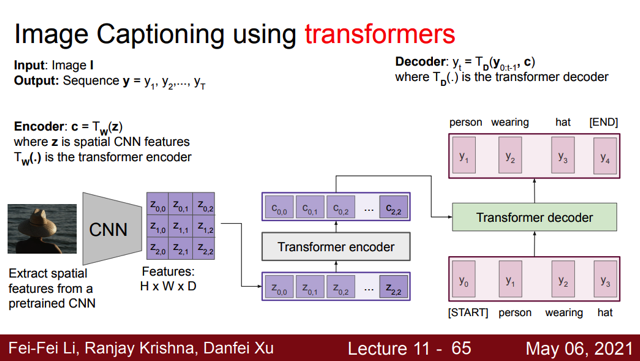</kbd></p>

> [!NOTE]
> ở đây quay lại slide cs231n một chút để quay lại nói về Image Captioning
> mà bây giờ sau khi đã có `Self-Attention` và Transformer block. 
>
> Thì có thể thấy, như trên đã nói,
> output từ CNN là tensor có H*W các feature vector, mỗi vector có D unit.
>
> Vậy thì ta sẽ feed nó vào một Transformer encoder block, output sẽ pass
> qua decoder, để vào Transformer decoder block.
>
> Trong decoder, input cũng sẽ vào transformer block, đương nhiên input
> này sẽ không còn phải "vào tuần tự như RNN nữa" mà nguyên bộ vector
> ```text
> x_dec_0, x_dec_1...x_dec_T' (ở đây x_dec_0 là <START> token vector)
> ```
> hay ở đây là y0, y1...yT' sẽ vào cùng lúc.
>
> Để rồi, output ra kết quả.

<br>

<a id="node-1309"></a>

<p align="center"><kbd>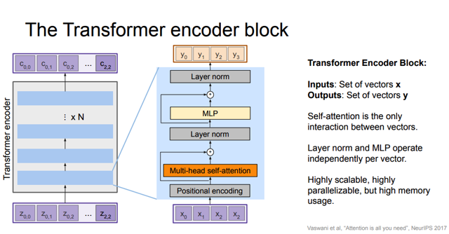</kbd></p>

> [!NOTE]
> vậy Transformer block của encoder sẽ như vầy, là một chuỗi nhiều (N)
> Transformer layer, mà mỗi cái thì như hồi nãy trong lecture của Michigan
> đã nói, gồm có:
>
> bộ input vector mà ở đây là các feature vector z00,...zWH sẽ được
> concatenate với Positional encoding (chỗ này hơi lạ, nhưng cũng có thể
> hiểu, tuy là hình ảnh (text thì không nói, vì đương nhiên phải có thông
> tin vị trí) nhưng cũng ít nhiều có thông tin vị trí theo spatial dimension.
> Do đó cũng cần thiết phải có positional encoding.
>
> Sau đó, mới đi qua `Multi-head` self attention như đã biết.
>
> Output sẽ cũng là bộ W*H các vector (cùng số lượng với input), sẽ được
> add với skip connection.
>
> Sau đó là Layer Norm, MLP với skip connection, rồi một cái layernorm
> nữa mới output.
>
> Và qua N cái block như vậy để có bộ c00,...cWH past qua decoder.
>
> `====`
>
> Có thể thấy ý nghĩa rằng mỗi vector trong bộ c00...cWH là kết quả của
> quá trình một vector `z_i` được `"self-attend"` với các vector khác nhiều
> lần, với rất nhiều khía cạnh khác nhau. Khía cạnh gì thì ko biết, chỉ biết
> ta kiến trúc như vậy cho phép model có sự linh hoạt lớn trong việc tìm
> ra những khía cạnh trừu tượng trong quá trình attention.

<br>

<a id="node-1310"></a>

<p align="center"><kbd>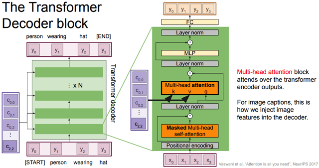</kbd></p>

> [!NOTE]
> Rồi, với cái Transformer block của decoder: như đã nói lúc training, nó sẽ
> nhận vào cùng  lúc mọi input <START>, target 1, target 2....target T' thay vì
> <START> rồi xử lý `tính/` dự đoán ra y^1 (rồi tính loss 1), rồi đưa vào target 1
> để tính toán đoán ra y^2...
>
> Thì nay, đưa vào hết, cùng lúc. 
>
> Rồi, mọi input đưa vô thì nó cũng qua nhiều Transformer decoder block mỗi
> cái cũng là Positional Encoding, nơi nó được concat với positional encoding.
>
> Sau đó là Masked `Multi-head` self attention, để lúc 'self attend' mỗi vector chỉ
> attend các vector từ vị trí của nó trở về trước thôi, nhờ đó mà một vector
> output sẽ không có thông tin về các véctơ ở sau nó `/` tương lai.
>
> Rồi qua các skip connection layer norm các kiểu...
>
> `====`
>
> Mới đến một block quan trọng là `Multi-head` attention với sự tham gia của các
> output từ encoder.
>
> Trong đây, các **encoder's output c00...cWH sẽ đóng vai key** và **values
> vectors**,  tức là nó sẽ được **dùng để learn ra keys và values (qua matrix
> `W_K,` W_V)** còn **các vector output từ các block ở dưới của decoder** sẽ
> **đóng vai để learn ra queries (qua W_Q**)
>
> Vậy trong attention này, một vector query sẽ tìm sự tương đồng với các
> vector key từ encoder (quá trình tính attention `/` alignment scores) để rồi có
> attention weights dùng trong linear combination các values.
>
> Vậy thì điều này sẽ mang ý nghĩa đại ý là với mỗi " `time-step"`  của decoder,
> thì **cần tham vấn vào vị trí nào trong mọi vị trí  của encoder's input** **nhưng
> ở một cấp độ linh hoạt và phức tạp hơn rất nhiều** khi **output của encoder
> đã trải qua nhiều quá trình self attention nên trở nên rất phức tạp**, giờ lại
> được dùng để learn keys và values dùng trong một cơ chế attention với
> queries được learn từ output của các decoder block trước cũng là quá trình
> self attention rất phức tạp.
>
> Thành ra output của cross attention sẽ là sự tham vấn phức tạp của "tất cả
> các vị trí trong encoder's input" và "tất cả các vị trí trước đó của decoder's
> input" hay trong bài toán image captioning, **một vị trí output của cross
> attention sẽ là sự tham vấn phức tạp với mọi feature vector của image**, và
> **mọi từ đã  được generate trong câu caption trước đó.**

<br>

<a id="node-1311"></a>

<p align="center"><kbd>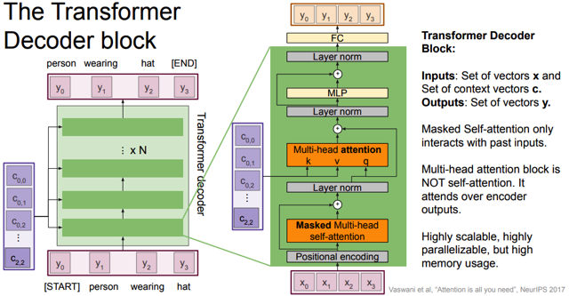</kbd></p>

> [!NOTE]
> Và output từ có cross attention tiếp tục qua layer norm, mlp với skip
> connection...Để là thành một Transformer decoder block và như đã nói có
> N decoder block trước khi output

<br>

<a id="node-1312"></a>

<p align="center"><kbd>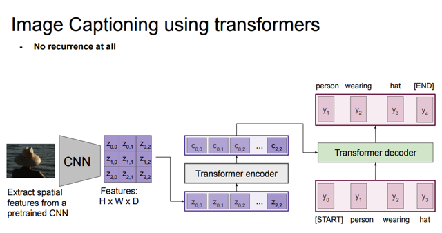</kbd></p>

> [!NOTE]
> vậy thì có thể thấy cả quá trình TRAINING: đưa vào mọi vị trí của input và
> tính toán mọi vị trí của câu captioning  CÙNG MỘT LÚC,
>
> Bởi ví dụ y^1 (output của DECODER) là sự tham vấn rất phức tạp của
> <START> với mọi feature vector của image để dự đoán ra một phân phối
> xác suất over vocab cho từ đầu tiên của caption y1, để tính loss l1
>
> rồi y^2 (output của DECODER) là sự tham vấn phức tạp của y1 với mọi
> feature vector của image VÀ vị trí trước đó <START> để dự đoán y2, tính
> loss l2
>
> rồi tương tự rồi y^3 (output của DECODER) là sự tham vấn phức tạp của
> y2 với mọi feature vector của image VÀ vị trí trước đó <START> , y1 để
> dự đoán y3, tính loss l3

<br>

<a id="node-1313"></a>

<p align="center"><kbd>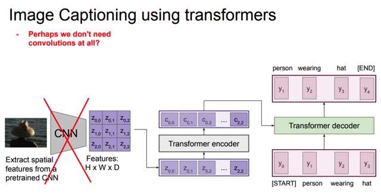</kbd></p>

> [!NOTE]
> và, slide này (again ko có bài giảng) nhưng đại khái là người ta cho
> rằng khỏi dùng output từ CNN luôn

<br>

<a id="node-1314"></a>

<p align="center"><kbd>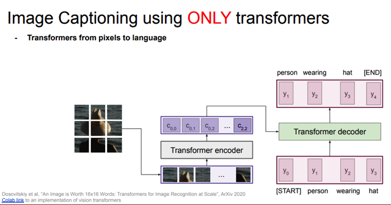</kbd></p>

> [!NOTE]
> và dùng luôn các feature vector gốc, như vậy là mỗi vector có 3 unit (RGB)

<br>

<a id="node-1315"></a>

<p align="center"><kbd>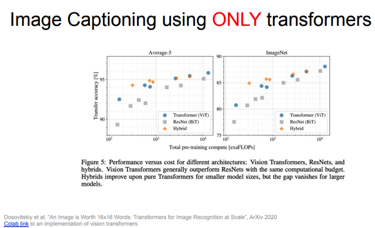</kbd></p>

> [!NOTE]
> Slide này có thể thấy nói về kết quả của VisionTransformer (nơi mà ko
> còn xài CNN), so với ResNet cho thấy nó vượt ResNet nếu so cùng
> computational budget, nếu có CNN trong VisionTransformer vọi là hybrid
> thì với model nhỏ thì nó hơn pure VisionTransformer nhưng model lớn thì
> cách biệt không còn, ý nghĩa là nếu với model lớn thì việc dùng CNN ko
> còn ý nghĩa gì, bản thân VisionTransformer có thể đủ để đạt hiệu xuất
> hơn cả CNN (như restnet)

<br>

<a id="node-1316"></a>

<p align="center"><kbd>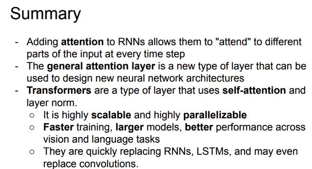</kbd></p>

> [!NOTE]
> tóm tắt:
>
> Về cơ chế attention cho phép một `time-step` của RNN có thể attend các
> phần khác nhau tại mọi `time-step`
>
> Từ đó người ta mới khái quát hóa cái này tạo ra Attention Layer để dùng
> trong nhiều bài toán khác nhau.
>
> Từ đó hình thành một kiến trúc mang tên Transformer có đặc điểm nổi
> bật là khả năng scalable và parallelizable cao.
>
> Từ đó cho phép faster training, larger model và better performance 
> trên cả nlp và vision.
>
> Nó nhanh chóng thay thế RNN, LSTM **thậm chí là cả convolution trong
> Computer Vision**

<br>

