# Mở Rộng Hơn Nữa

📊 **Progress:** `14` Notes | `31` Screenshots

---

<kbd>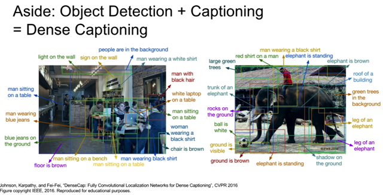</kbd>

> [!NOTE]
> Justin lướt qua một cái mà ổng làm với Andrej: Kết hợp
> object detect và image captioning

 

<kbd>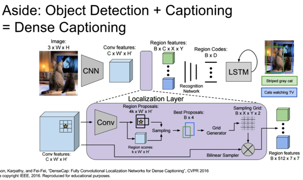</kbd>

 

<kbd>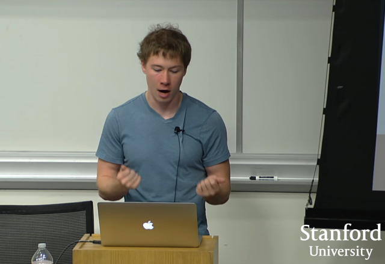</kbd>

> [!NOTE]
> But the idea here is that once you have this, **you
> can kind of tie together a lot of these ideas** and if
> you have **some new problem** that you're
> interested in tackling like **dense captioning**, you
> can **recycle a lot of the components  that you've
> learned from other problems** like object detection
> and image captioning and kind of**stitch together
> one `end-to-end` network** that produces the outputs
> that you care about for your problem

 

<kbd>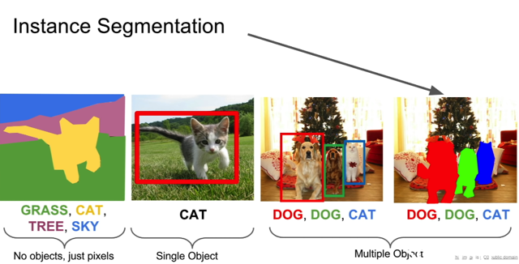</kbd>

 

<kbd>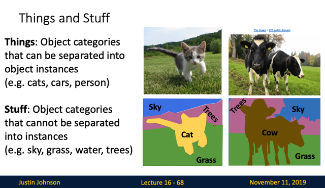</kbd>

> [!NOTE]
> đại khái là người ta trong lĩnh vực cv phân biệt ra Things và Stuff. Things
> là những object mà ta sẽ muốn tách bạch từng cái, từng con
>
> còn stuffs thì ngược lại như bãi cỏ, bầu trời, cây cối...

 

<kbd>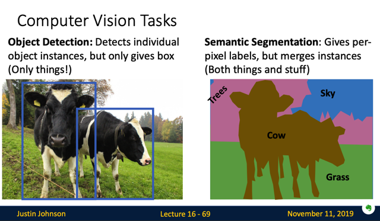</kbd>

> [!NOTE]
> Cho nên ý nói, với object detection thì chỉ apply với things thôi, đương
> nhiên vì ko ai muốn detect từng ngọn cỏ cả. Còn với semantic segmentation
> thì cả things lẫn stuff

 

<kbd>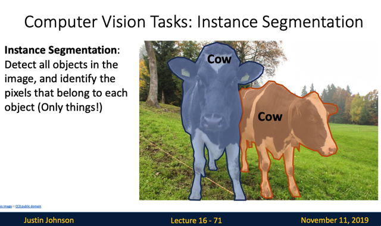</kbd>

> [!NOTE]
> nên Instance Segmentation là ta muốn detect từng object, và
> segmentation chúng

 

<kbd>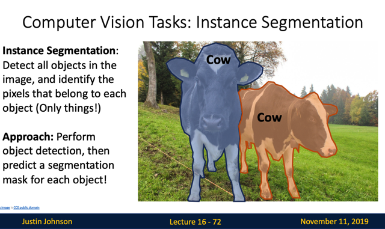</kbd>

> [!NOTE]
> vậh đầu tiên có thể dùng object detector để xác định từng
> object sau đó pass nó qua segmentation object

 

<kbd>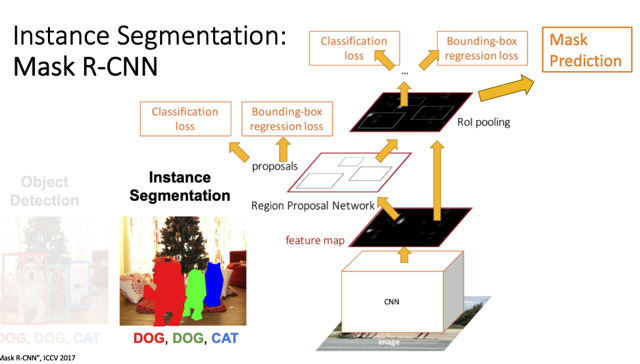</kbd>

<kbd></kbd>

<kbd>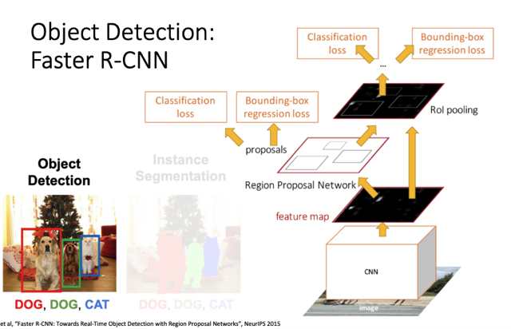</kbd>

> [!NOTE]
> vậy thì cái này chỉ cần dựa trên object detector model như Faster
> `R-CNN` nhưng có thêm một bước segmentation (mask prediction) nữa

 

<kbd>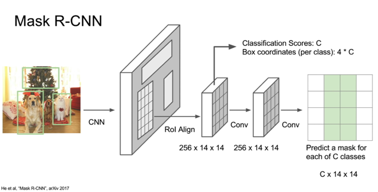</kbd>

> [!NOTE]
> đại khái là khúc đầu cũng giống `R-CNN` `-` dự đoán ra các proposed region.
> Sau đó, với mỗi region. một nhánh predict class và bounding box như trên,
> nhưng thêm một nhánh predict một mask cho mỗi class trong C class
> `-` giống bài toán segmentation
>
> Nói chung ý tưởng chính là kết hợp hết những kiến trúc của các bài toán
> segmentation, localization (**unifies all of these different problems** that we'
> ve been talking about today i**nto one nice jointly `end-to-end` trainable
> model**)

 

<kbd>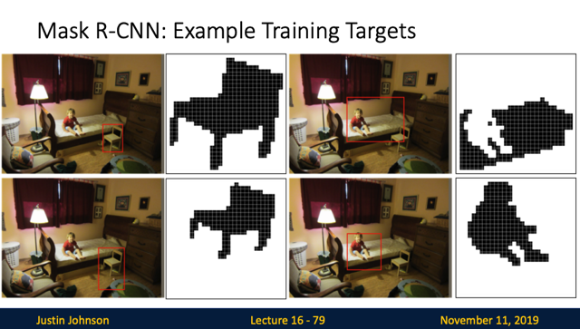</kbd>

> [!NOTE]
> đại ý là với cái này thì cái target để train cho cái mask sẽ
> kiểu như là cái mask trên propose region

 

<kbd>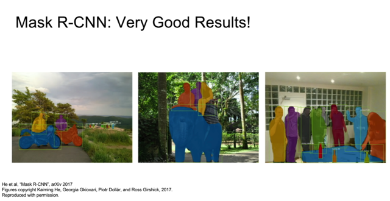</kbd>

 

<kbd>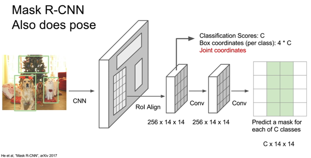</kbd>

> [!NOTE]
> thậm chí là kết hợp cáo
> pose prediction luôn

 

<kbd>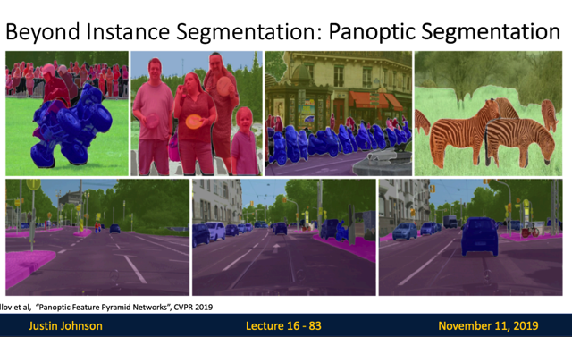</kbd>

<kbd></kbd>

<kbd>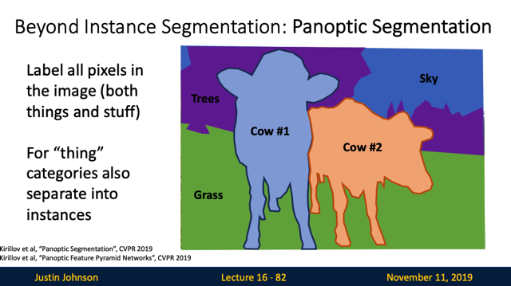</kbd>

> [!NOTE]
> ngoài ra còn một task nữa mà người ta cũng làm là Panoptic segmentation,
> cũng như segmentation nhưng có phân biệt từng con bò (things) với nhau
> còn với stuff thì nó gộp chung

 

<kbd>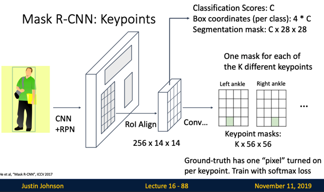</kbd>

<kbd></kbd>

<kbd>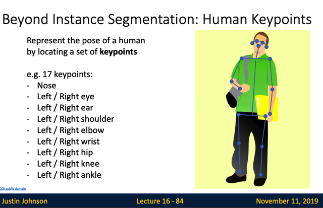</kbd>

> [!NOTE]
> rồi còn có cái bài toán này, predict ra keypoints, tương tự chỉ
> cần mở rộng Faster `R-CNN` để nó predict thêm các keypoint
> positions

 

<kbd>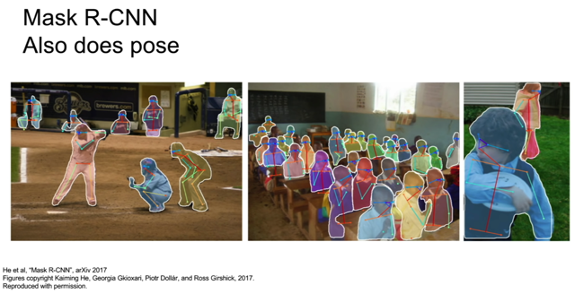</kbd>

 

<kbd>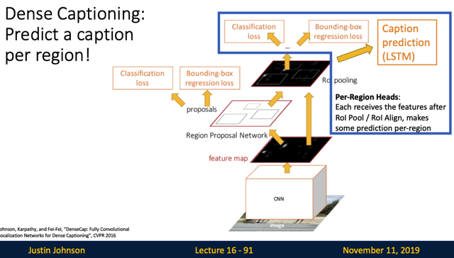</kbd>

<kbd>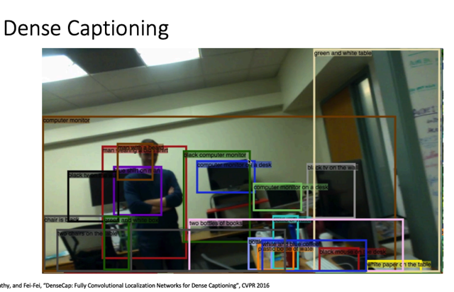</kbd>

<kbd></kbd>

<kbd></kbd>

<kbd>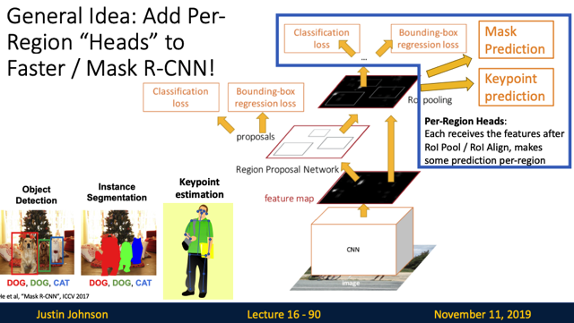</kbd>

> [!NOTE]
> ý tưởng chung là có thể mở rộng để trở
> thành nhiều mô hình khác

 

<kbd>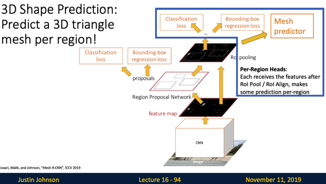</kbd>

<kbd></kbd>

<kbd>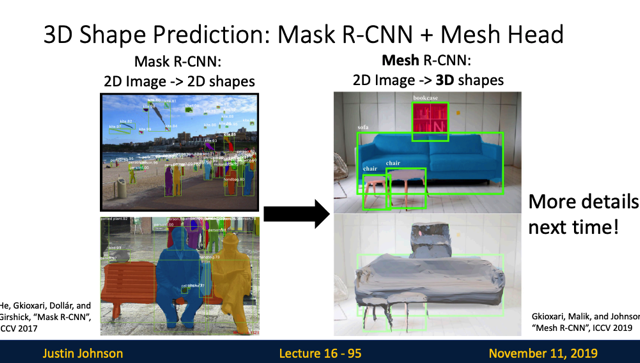</kbd>

> [!NOTE]
> đại ý là có thể mở rộng hơn nữa để thành
> bài toán predict luôn 2D `->` 3D

 

<kbd>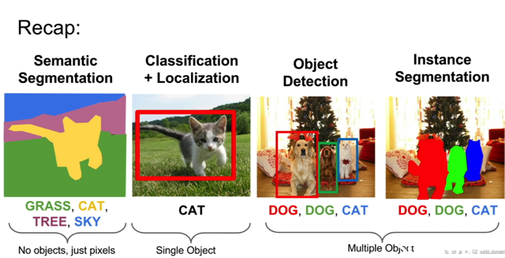</kbd>

 

