# Note #4 Backpropagation

📊 **Progress:** `9` Notes | `13` Screenshots

---

<kbd>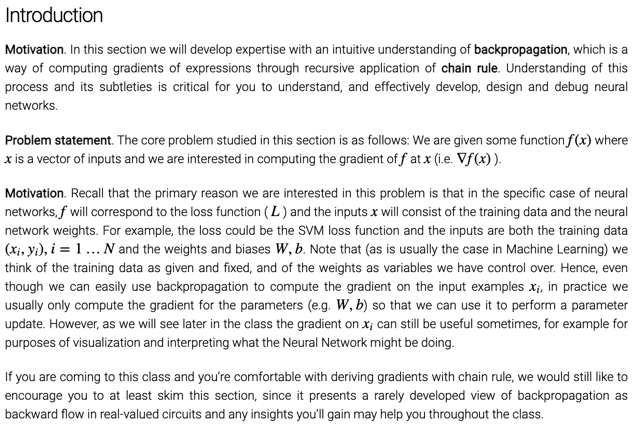</kbd>

 

<kbd>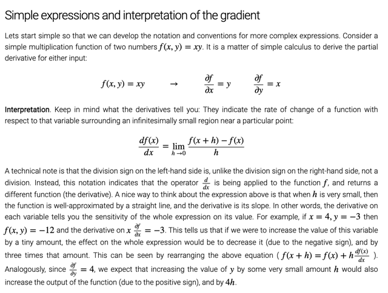</kbd>

> [!NOTE]
> Đại khái là nói về ý nghĩa của đạo hàm là tỉ lệ của khoảng thay
> đổi của hàm f trên khoảng thay đổi vô cùng nhỏ (infinitesimally)
> của x.
>
> Và kí hiệu df/dx không phải ý chia df cho dx mà là kí hiệu chỉ việc
> tính ra đạo hàm của hàm f w.r.t (đối với) x và nó cũng là một hàm
> số

 

<kbd>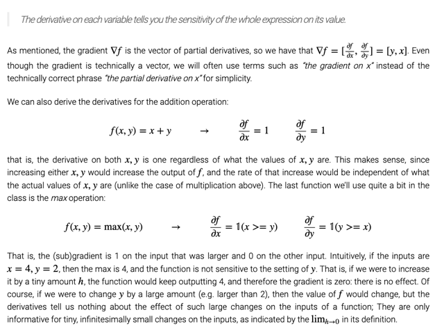</kbd>

> [!NOTE]
> Đại khái là chính vì ý nghĩa đạo hàm như vậy nên có thể hiểu nó như
> **sự nhạy cảm** của function f (khi x thay đổi tác động đến f thay đổi
> nhiều hay ít ra sao)
>
> Tiếp theo như đã biết khi f là function của**hai  variable x, y** hay của
> một variable nhưng dưới dạng  **vector [x, y]** thì đạo hàm của f đối với
> input là **vector  các partial derivative.**
>
> Nói qua ý nghĩa của đạo hàm của hàm**f = x + y**đối với x, hay y đều
> bằng **1**. Vì rõ ràng với hàm sum như này thì **x thay đổi bao nhiêu thì f
> thay đổi bấy nhiêu**, thành ra **tỉ lệ  của hai khoảng thay đổi là 1.**
>
> Còn với hàm **max** (x, y) thì rõ ràng là vì **nếu y nhỏ hơn x**, thì**hàm f chỉ
> được tính bởi x**, do đó c**hỉ có x tác động lên f**, còn y thì không nên y
> có thay đổi (nhỏ) bao nhiêu thì f vẫn vậy nên đạo hàm của f đối với y
> là 0, và **với x là 1 (vì khi đó như hàm  f = x)**

 

<kbd>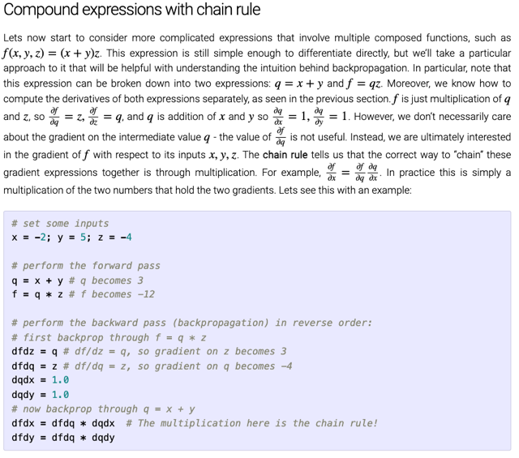</kbd>

> [!NOTE]
> Đại khái là mô phỏng một cách đơn giản quá trình forward
> prop với việc tính q từ xây và f từ q, z và backprop với việc
> tính df/dx, df/dy, df/dz thông qua chain rule với df/dq
>
> Các công thức tính gradient thì như đã biết ở phần trên

 

<kbd>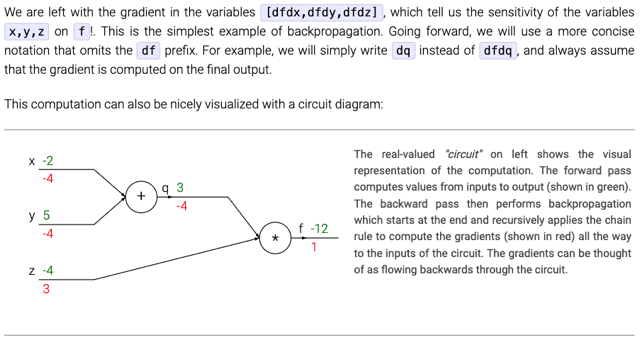</kbd>

> [!NOTE]
> từ sau sẽ viết tắt
> dfdx là dx thôi

 

<kbd>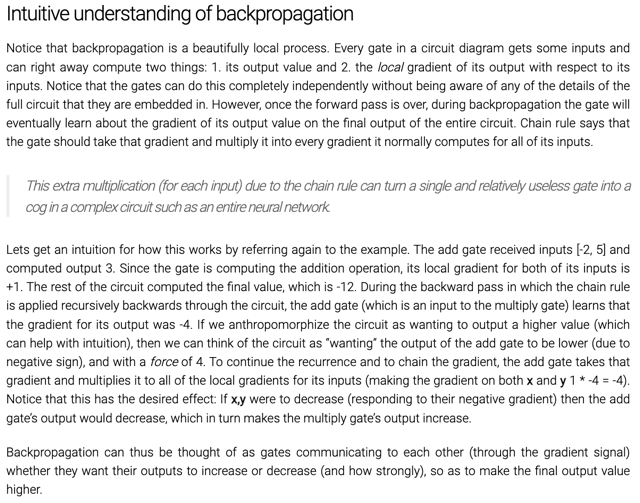</kbd>

> [!NOTE]
> đại khái là backprop sẽ như cách các gate giao tiếp với nhau để kiểu
> như node sau báo cho node trước biết: à, mà mà tăng 1 khoảng chút
> xíu thì hệ quả f cuối sẽ tăng hay giảm khoảng như vậy. Từ đó cả đám
> sẽ dựa vào đó mà thay đổi sao đó để đạt mục đích chung

 

<kbd>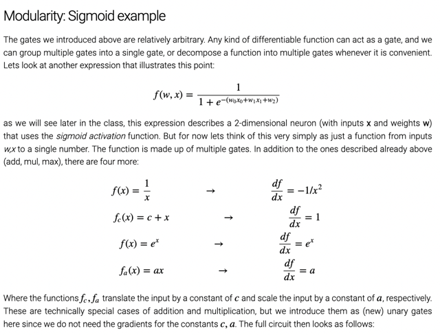</kbd>

> [!NOTE]
> đại khái là cái khái niệm **gate (hay node)** ở trên về cơ bản có thể là bất
> kì một function nào mà **differentiable** nào. Và ta**có thể
> nhóm các gate lại (hay node)** thành một node bự hơn hoặc
> **chia nhỏ ra** để thuận tiện
>
> Cung cấp thêm một số công thức tính đạo hàm của các function
> với vụ **unary gate** ý nói các function f = x + c hay a*x là hàm đơn biến
> vì c với a là constant **nên chỉ có 1 nhánh input**

 

<kbd>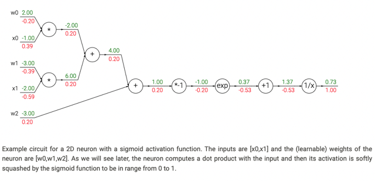</kbd>

> [!NOTE]
> ví dụ này đã triển
> khai ở bài trước

 

<kbd>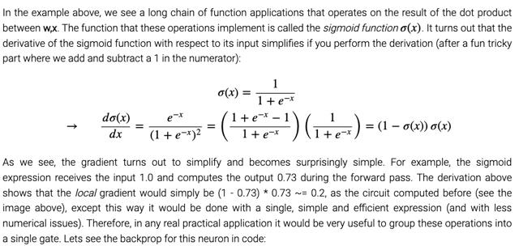</kbd>

> [!NOTE]
> nói về đạo hàm của hàm sigmoid, và khi tính
> toán có thể coi sigmoid là 1 gate (gồm các gate
> nhỏ hơn) để khi backprop thì dùng công thức
> này để tính local gradient

 

<kbd>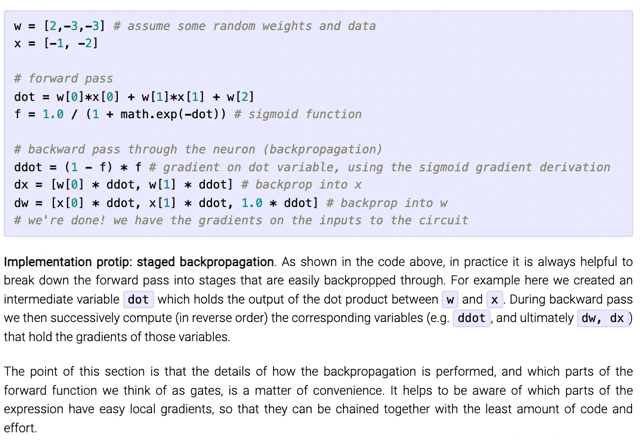</kbd>

> [!NOTE]
> Theo computational graph thì khi backprop, tại z (hay ở dưới là dot) input
> của sigmoid (= weighted sum của x và w) ta có df/dz là (1-f)*f. và local
> gradient tại node z = vector x.dot product với vector w, dz/dw sẽ là vector x,
> thành ra df/dw là ddot*x.
>
> Thì nhờ dùng local gradient của sigmoid tức là coi sigmoid là 1 node nên 
> việc tính toán gọn hơn

 

<kbd>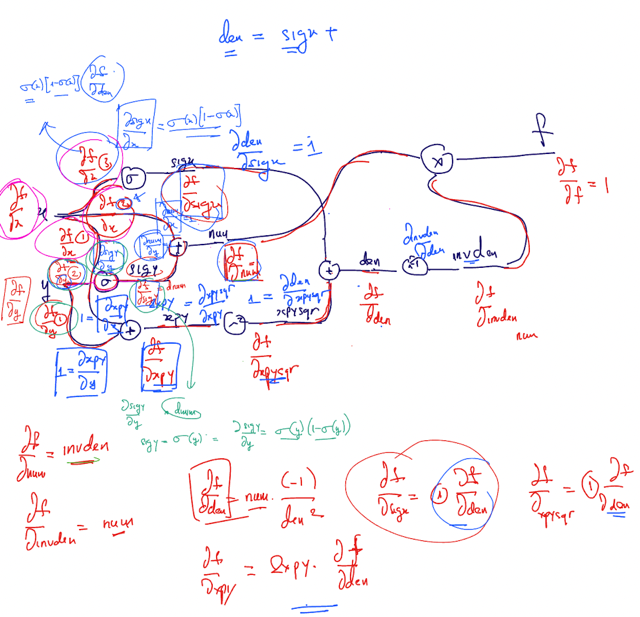</kbd>

 

<kbd>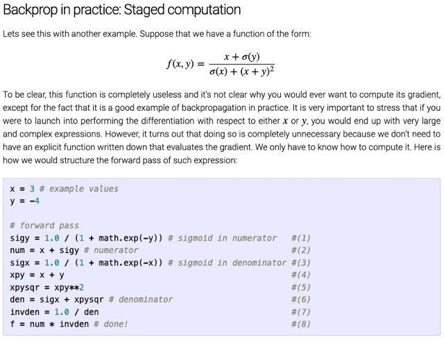</kbd>

 

<kbd>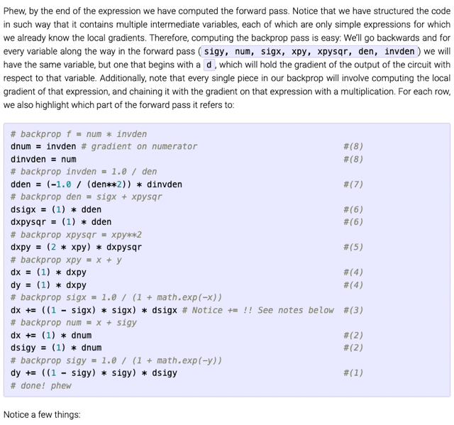</kbd>

 

