# Note - Convolutional Net

📊 **Progress:** `23` Notes | `33` Screenshots

---
<a id="node-742"></a>

<p align="center"><kbd>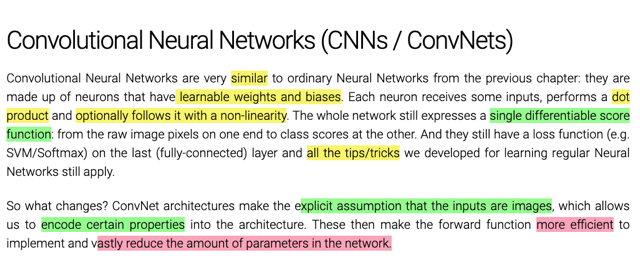</kbd></p>

> [!NOTE]
> Đại khái là CNNs cơ bản là vẫn là một score function, để rồi map giữa
> một image và class score, đầu ra của nó vẫn là FC layer, chỉ có điều nó
> sẽ 'explicitly' yêu cầu đầu vào là image, từ đó có những cải tiến hơn so
> với FC Net đó là khả năng parameter sharing nhờ vậy giảm đáng kể số
> lượng params

<br>

<a id="node-743"></a>

<p align="center"><kbd>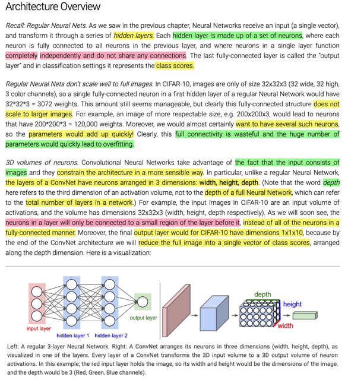</kbd></p>

> [!NOTE]
> đại ý là review lại kiến trúc cuả Regular NN với các hidden layer (và
> output layer), mỗi hidden layer gồm nhiều `unit/neuron,` mỗi neuron
> sẽ take input (mỗi input sẽ có tương ứng một param) từ tất cả các 
> output từ layer trước. Vậy thì cách làm này có nhược điểm chính là
> nếu input của network là một image có kích thước lớn thì số params
> sẽ trở nên rất lớn, ở đây cho biết điều này khiến model dễ dẫn đến 
> overfit
>
> Với convnet, nó sẽ constrain input chỉ là image (ý nói với regular nn,
> nó có thể nhận input là bất cứ thứ gì chứ không nhất thiết là image)
> nên nó có thể có cách xử lý phù hợp hơn cho image. Trong đó mỗi
> unit của layer sau không cần phải take input từ mọi output của layer
> trước mà chỉ một phần, do đó khắc phục được vấn đề params quá 
> lớn của regular neural net.
>
> Ngoài ra, convnet còn có ưu điểm chính là shared params, giúp tăng
> hiệu quả cũng như giảm số param cần thiết.
>
> Với output, thì regular net, nếu là bài toán multiple class classification
> thì sẽ có số unit tương ứng, tính ra các class scores. Thì convnet cũng
> vậy nhưng output của layer cuối sẽ là vector 3D shape `1x1xnum_classes`

<br>

<a id="node-744"></a>

<p align="center"><kbd>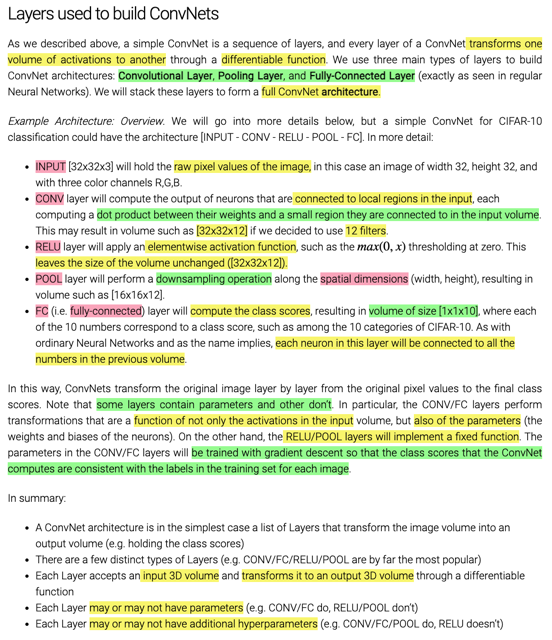</kbd></p>

> [!NOTE]
> mô tả một simple architecture của một ConvNet dùng để
> train `CIFAR-10` images. Mở đầu là input layer, cơ bản nó sẽ 
> "đại `diện"/"chính` là" cái hình đưa vào, là một 3D tensor size
> 32x32x3. Sau đó là Conv layer, tùy theo filter size bao nhiêu
> cũng như các hyper.params như stride, padding, số filter 
> để output nó sẽ là 3d tensor có spatial size lớn hay nhỏ, và depth
> thì do số filter. Sau đó là relu, apply hàm relu với ouput của conv
> layer. Tiếp theo là pooling layer, thu nhỏ spatial size với max hay
> average. Có thể qua nhiều combo `conv-relu-pooling` như vậy để 
> cuối cùng là FC layer, cái này thì đương nhiên là take input từ
> mọi output của pooling layer cuối (có thể hiểu là 3d tensor của
> pooling layer cuối sẽ được flatten thành 1d rồi input vào FC layer.

<br>

<a id="node-745"></a>

<p align="center"><kbd>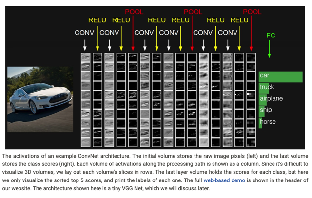</kbd></p>

<br>

<a id="node-746"></a>

<p align="center"><kbd>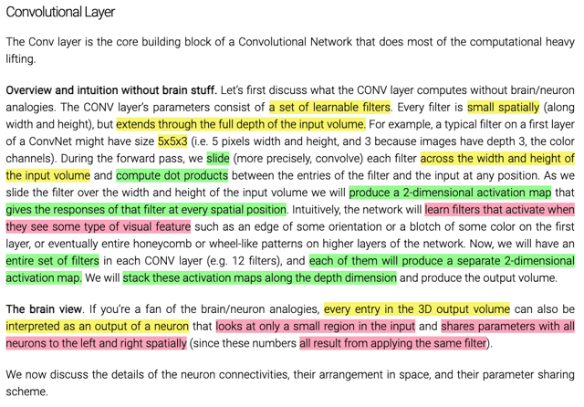</kbd></p>

> [!NOTE]
> đoạn trên nói về cách thức các filter của một conv layer tính toán, với
> input để cho ra output. Mỗi filter sẽ có depth bằng với input depth, spatial
> size (tức dài, rộng) thì là một h.param. Thế thì filter sẽ `slide/` hay gọi đúng 
> là convol (trái qua phải trên xuống dưới, gọi là slide `trong/trên` spatial
> dimension của input), mỗi lần như vậy nó sẽ tính một phép weighted sum
> của input value (channel nào thì tương ứng với channel đó của filter),
> rồi cộng một bias để ra một giá trị. Sau đó, slide qua một bước quy định 
> bởi 'filter stride' `-` là một h.param. Kết quả là mỗi filter sẽ cho ra một activation
> map (chỉ là 1 matrix). Bao nhiêu filter cho ra bấy nhiêu activation map, stack
> lại thành ra volume (3D).
>
> Vậy qúa trình training, model sẽ thay đổi các giá trị của filter weight, bias
> để detect được pattern trong input giúp tạo ra output sao đó giúp predict
> đúng.
>
> Đáng chú ý đó là câu cuối, có thể coi mỗi vị trí (value tại ví trí) của output
> `volume/3d` tensor là một kết quả của một neuron giống như neuron trong
> regular fully connected layer. Có điều thay vì "fully connected" với mọi
> input, thì ở đây nó chỉ connected (tức là tính toán bởi input và weight của
> nó) với một vùng `/` một vài input thôi.
>
> Và có thể coi các neuron này đều được xài chung một bộ params, dể hiểu
> điều này là bởi (nếu coi các vị trí của output là kết quả tính toán của một 
> neuron) thì rõ ràng nó được tính bởi cùng các giá trị của cái filter

<br>

<a id="node-747"></a>

<p align="center"><kbd>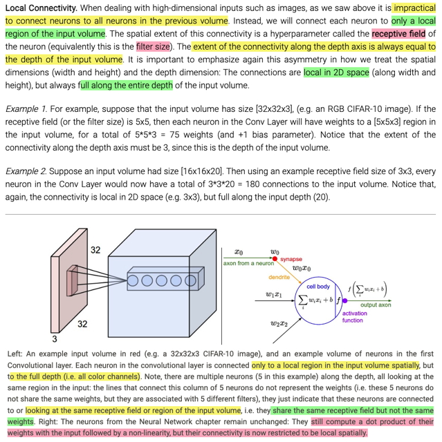</kbd></p>

> [!NOTE]
> Khái niệm "Local Connectivity" ở đây nhấn mạnh, cách làm này giúp giải
> quyết vấn đề của regular nn, khi mỗi output (được coi như output của một
> neuron, tính toán bởi filter với các input value) sẽ chỉ take input "**locally**"
> theo spatial size như "**full**" theo depth dimension.
>
> Và receptive field `/` chính là filter size chỉ cái local region trên input mà neuron
> "nhìn vào" để tính toán. Đây là góc nhìn mà trong DLSpec không nói đến, hiểu
> như vậy sẽ hiểu tại sao các "neuron" trong cùng một channel (của output) đều
> share chung param (chính là giá trị của cái filter). Nhưng các neuron trong
> cùng một trục dọc theo depth của output sẽ cùng một receptive field, nhưng dĩ
> nhiên là khác params, vì mỗi cái tính toán bởi một filter khác nhau.
>
> Đây là cách nhìn nhận quan trọng mà trước đấy DLSpec mình chưa có (mặc
> dù hiểu phương thức filter convol input để ra output nhưng những khái niệm
> như receptive field, share parameter chưa rõ lắm

<br>

<a id="node-748"></a>

<p align="center"><kbd>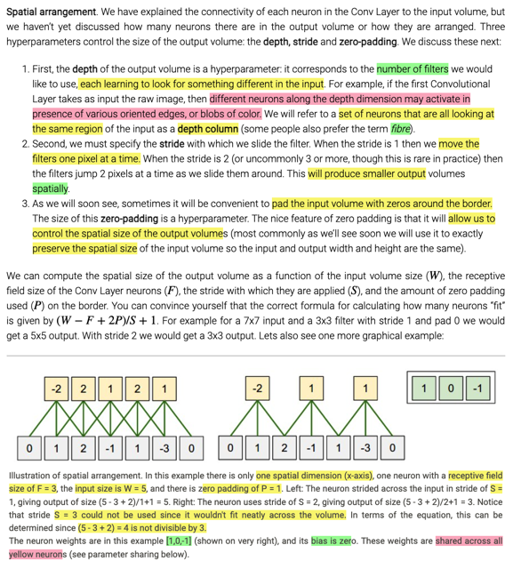</kbd></p>

> [!NOTE]
> Phần lớn đều đã biết từ DLSpec, như số filter sẽ quy định depth 
> của output volume, còn filter size `/` receptive field, stride, zero
> padding sẽ quy định spatial size (W,H) của output. Trong đó stride
> là bước nhảy, zero padding có tác dụng giúp kiểm soát output spatial
> size.
>
> ```text
> Công thức tính spatial size của output sẽ là (W - F + 2P)/S + 1.
> ```
> Trong DLSpec, Andrew cho rằng round down của (W `-` F `+` `2P)/S`
> rồi mới cộng 1.
>
> Một điểm mới là depth column để để chỉ các output (hay như đã nói
> ở trên, có thể nhìn nhận như các output của các neuron) mà cùng
> nhìn vào một receptive field (đương nhiên mỗi cái được tính toán bởi 
> một filter khác nhau)
>
> Trong ví dụ dưới các giá trị màu vàng (là các ouput) sẽ đều được
> tính bởi cùng một bộ params `[1,0,-1]` bias `=` 0, của cùng một filter

<br>

<a id="node-749"></a>

<p align="center"><kbd>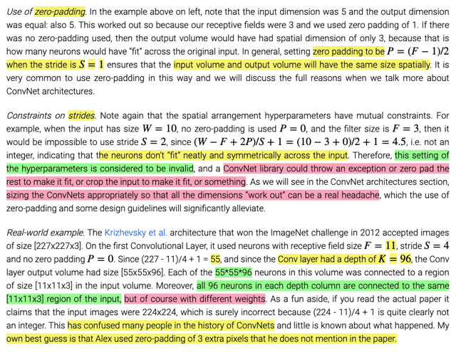</kbd></p>

> [!NOTE]
> Zero padding thì biết rồi, ở đây nói cụ thể về một ví dụ cụ thể tác dụng
> giúp spatial size của output vẫn bằng input.
>
> Với stride thì có điểm lưu ý là không phải stride nào cũng valid, do đó
> ở đây cho biết việc chọn stride cho đúng đôi khi cũng đau đầu, nhưng
> nhờ có zero padding mà giải quyết được gánh nặng này. 
>
> Khi có những vấn đề 'không khớp' xảy ra thì trong các thư viện ConvNet
> như tensorflow, pytorch nó sẽ phản ứng theo nhiều cách, có thể raise
> Exception, có thể tự thực hiện padding hoặc crop input.
>
> Sau cùng là một ví dụ về một real word convnet. không có gì khó hiểu,
> Khi F (receptive field) là 11, Stride s `=` 4, padding P `=` 0, spatial size của
> input là 227. Thì output tính ra sẽ là 55. Với 96 filter thì output sẽ là 55x55x96
>
> Ở đây nói đến một dữ kiện vui đó là trong paper gốc người ta lại ghi là xài
> input size 224x224, trong khi con số này không đúng vì với các setting như
> trên thì nó sẽ không valid. Nên điều này một thời gian gây khó hiểu giới
> nghiên cứu. Theo suy đoán của tác giả (note này) thì thật ra họ dùng padding
> 3 mà quên không nói.

<br>

<a id="node-750"></a>

<p align="center"><kbd>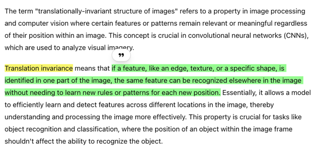</kbd></p>

<p align="center"><kbd></kbd></p>

<p align="center"><kbd>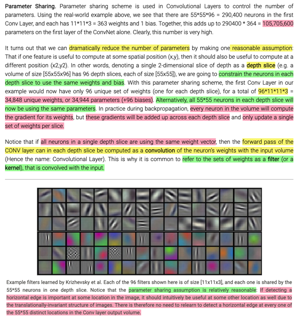</kbd></p>

> [!NOTE]
> ở đây phân tích kĩ hơn vụ (khái niệm) parameter sharing. Như đã
> biết, (nếu coi mỗi output value là một neuron output) và như đã nói
> mỗi neuron sẽ 'nhìn vào' `/` tính toán từ một local region (receptive
> field) `+` full depth, giả sử có size là 11x11x3 (với 11 là receptive field
> size, 3 là input's depth) thì mỗi neuron sẽ có `11x11x3+1` `=` 364 params
> (Mỗi input value sẽ được gán `/` dot với weight, để tính phép weighted
> sum, sau đó cộng bias)
>
> Vậy nếu như trong setting ở trên output volume có shape là 55x55x96
> thì số param cần thiết sẽ là 55x55x96x364 `~=` hơn 100 triệu.
>
> Vậy người ta mới đặt vấn đề giảm param bằng cách cho rằng các neuron
> trong cùng một depth slice (một channel `/` 1 miếng spatial) sẽ có thể dùng
> chung một bộ giá trị params, sở dĩ điều này là hợp lý (nhờ đó tạo cơ sở
> cho cách làm này) đó là vì nếu như một bộ param giúp detect một pattern
> nào đó tại một khu vực (local `region/receptive` field) thì đương nhiên cũng
> sẽ có ích trong việc detect ra pattern đó ở một vị trí khác. Thành ra, các 
> neuron trong cùng một depth slice của output hoàn toàn hợp lý nếu được
> tính toán bởi cùng một bộ giá trị params. Nói chung đó là cách nhìn khác
> giúp mình hiểu sâu hơn về của việc một filter sẽ convol input image để ra 
> một "miếng" (một `channel/một` slide của output volume).
>
> Khi backprop, gradient của các params sẽ được cộng dồn khi backprop
> qua từng neuron (across each depth slice) và để rồi dùng nó để update
> gía trị của bộ param duy nhất (again, chính là của filter, share cho mọi 
> neuron trong depth slice đó)
>
> Và ở cuối mới nói về việc tính toán tất cả các neuron sử dụng cùng một 
> bộ param thì nó cũng tương đương hình ảnh đem cái `filter/kernel` quét
> qua từng ô receptive field của input. Đó chính là phéo convolved, xuất
> phát của cái tên Convolutional layer
>
> Cuối cùng trong hình, nhấn mạnh một lần nữa luận điểm đó là nếu một
> filter (tức một bộ param, again, xài chung cho mọi neuron của cùng một
> depth slice) có thể giúp detect được một pattern nào đó như hình ảnh của
> một 'edge' `/` cạnh (ngang, dọc, chéo gì đó) thì đương nhiên nó cũng sẽ có
> ích tại các vị trí khác. Do đó **không cần phải mỗi một neuron cùng depth
> slice có một bộ param riêng làm gì. Khái niệm translationally invariance
> nhắc đến ở đây chính là tính chất này**

<br>

<a id="node-751"></a>

<p align="center"><kbd>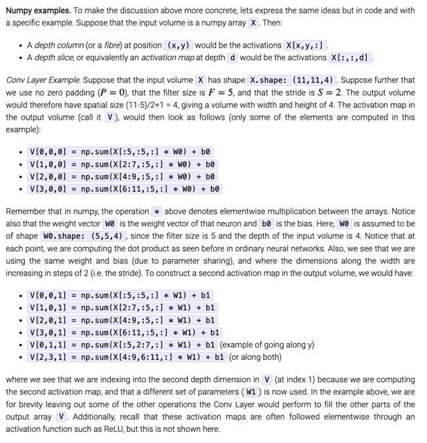</kbd></p>

> [!NOTE]
> Không có gì khó hiểu, chỉ là ví dụ cụ thể tính toán X (11x11x4) `->` V với
> filter size 5, stride 2, padding 0.
>
> Ví dụ V[0,0,0] `=` np.sum(X[:5,:5,:]*W0) `+` b0 tức là:
>
> với mọi (full) depth của X, receptive field rộng `=` 5x5, bắt đầu từ  'hàng 1
> cột 1 `->`  hàng 5 cột 5 để tạo thành một block 5x5x4. Thế thì mỗi  giá trị
> của cái block này sẽ được weighted với một weight của filter (như đã
> biết nó là shared param của mọi neuron trong cùng activation map) thì
> filter's weight cũng coi như là một block 5x5x4. Để rồi thực hiện
> `element-wise`  giống như với hai vector, có điều đâu là hai 3d tensor.
> Sum lại và công với bias.
>
> Tiếp theo vì stride bằng 2 nên slide qua theo phương x 2 unit, output
> tiếp theo (cũng trong activation map đó) sẽ là sum(X[2:7,:5,:] * W0) `+` b0
>
> Tiếp tục như vậy đến hết là được một activation map, và nó là cái depth
> slice đầu tiên của V: V[:,:,0].
>
> Tiếp theo với một filter khác, W1, b1, ta sẽ là tương tự để có cái depth 
> slice thứ 2 của V: V[:, :, 1]

<br>

<a id="node-752"></a>

<p align="center"><kbd>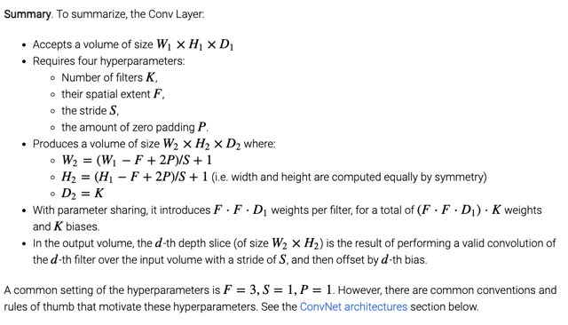</kbd></p>

<br>

<a id="node-753"></a>

<p align="center"><kbd>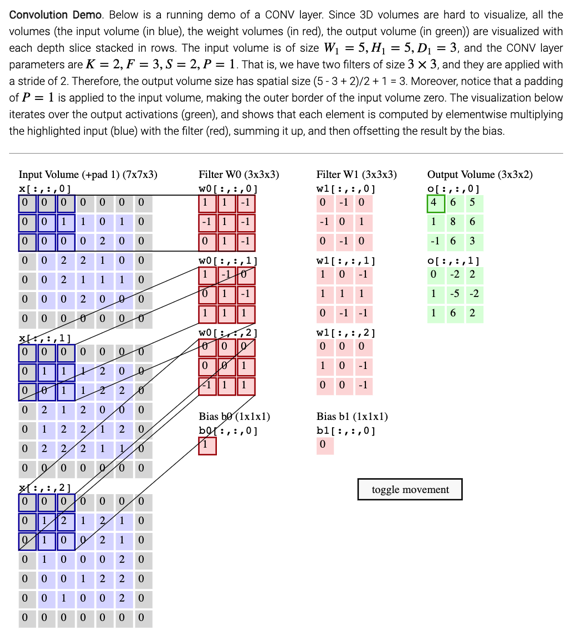</kbd></p>

<br>

<a id="node-754"></a>

<p align="center"><kbd>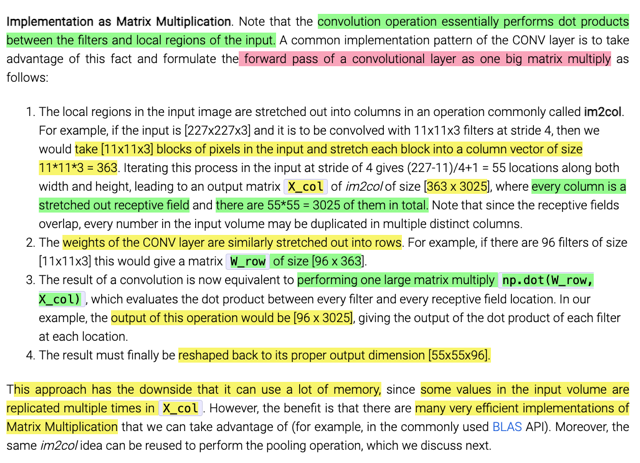</kbd></p>

> [!NOTE]
> Ok, ý tưởng của cái này là thể hiện quá trình tính từ input tensor X thành
> output tensor theo kiểu nhân hai matrix lớn. Đầu tiên input X, mỗi neuron là
> dot product  của filter param với một block có kích thước FxFxD (F là filter
> size, receptive field) D là input depth. Thế thì ta sẽ flatten cái block 3D này
> ra thành một vector 1D. Rồi, slide cái filter qua một khoảng `=` stride, để tính
> tiếp "một neuron khác" thì ta sẽ lại flatten cái input block đó ra làm thành
> vector. Cứ như vậy,  vì sẽ có 55x55 lần slide và tính ra 55x55 output nên ta
> sẽ có 55x55 input vector như trên.
>
> Gọi đó là matrix `X_col` có 55x55 cột, mỗi cột là một vector có FxFxD `=`
> 11x11x3 `=` 363 phần tử.
>
> Tương tự với các filter (các neuron param). Như đã biết mỗi activation map
> là kết quả của một filter, mỗi filter là một tensor FxFxD, ta cũng flatten ra
> thành một hàng. Có 96 filter, thành 96 hàng. Để thành matrix 96x363
>
> Như vậy mỗi output là đợt product của cái input `sub-block` FxFxD và filter
> tensor FxFxD (rồi cộng bias) có thể coi như là dot product của hai vector
> cột của `X_col` và hàng của matrix weight.
>
> Nên toàn bộ quá trình sẽ tương đương: `weights@X_col` `+` bias với shape là
> 96x363@363x3025 `=` 96x3025
>
> Ta sẽ reshape matrix output này thành 3d tensor lại là 55x55x96
>
> `====`
>
> Tác giả cho biết tuy cách làm này có phần tốn memory nhưng có một số
> Ưu điểm như tận dụng được các lợi thế đến từ sự hiệu quả của nhân
> matrix

<br>

<a id="node-755"></a>

<p align="center"><kbd>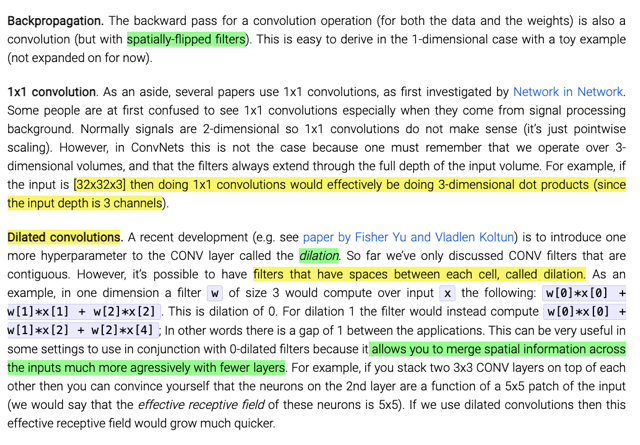</kbd></p>

> [!NOTE]
> cái ý dilated conv cũng dễ hiểu, thay vì w1x1 `+` w2x2 `+` w3x3 thì sẽ là
> `w1x1+w2x3` `+` w3x5, có nghĩa là sẽ bỏ qua một bước (với dilate value
> `=` 1, đây là một h.p) Nó có tác dụng là nôm na là gom thông tin theo
> spatial information nhanh hơn, nhờ đó dùng ít layer hơn, ta hiểu nôm
> na ý này là giả sử start với cái hình lớn thiệt lớn thì phải qua nhiều layer
> thì mới nén thông tin theo bề ngang rộng lại từ từ, thì cái vụ dilate sẽ
> làm chuyện đó nhanh hơn.

<br>

<a id="node-756"></a>

<p align="center"><kbd>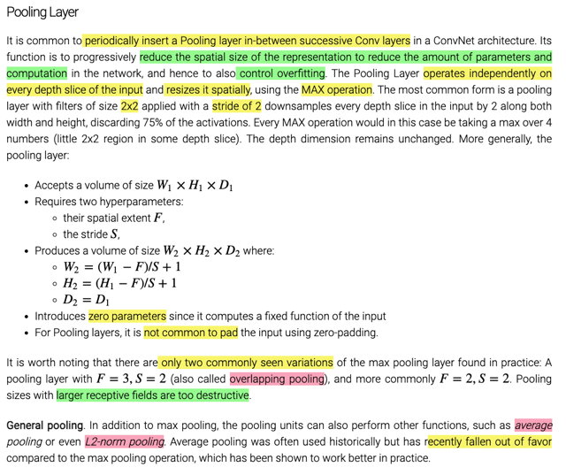</kbd></p>

> [!NOTE]
> Pooling thì cơ bản không có gì phức tạp, như đã biết từ DLSpec,
> pooling thường được dùng xen kẽ với các conv layer. ở đây giúp biết
> thêm là nó có tác dụng nhanh chóng giảm spatial dimension giúp giảm
> số parameters của network từ đó giúp giảm overfit.
>
> Pooling thực hiện một fix operation, trên từng depth slice input một cách
> độc lập
>
> hiện nay average pooling hồi xưa thì phổ biến, thậm chí có cả l2 norm
> pooling nhưng ngày nay ít được dùng, mà thông dụng là max pooling.
>
> Cái này thì như đã biết là không có params, ở đây biết thêm là thường
> ```text
> chỉ dùng hai h.p là F = 3, S = 2 hoặc F = 2, S = 2, chứ F hay S lớn hơn
> ```
> khiến mất nhiều thông tin. (Cái đầu có tên là overlap pooling).

<br>

<a id="node-757"></a>

<p align="center"><kbd>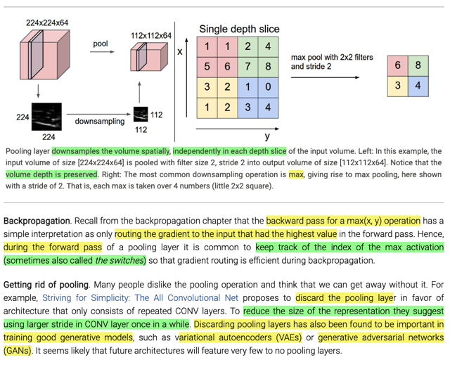</kbd></p>

> [!NOTE]
> nói về backprop, cơ bản max pooling forward pass là một hàm max ,
> thì đại khái là đã biết ở bài trước khi back pass qua hàm max cơ bản chỉ
> là pass y nguyên upstream gradient qua nhánh nào mà lúc forward pass
> nó mang giá trị lớn nhất. Do đó sẽ tiện lợi cho quá trình backprop bằng 
> cách giữ index của cái input có giá trị max.
>
> Cuồi cùng là nói về xu hướng bớt dùng đến không dùng pooling hiện nay,
> để giúp giảm spatial size thì người ta dùng stride lớn. Nhắc đến trong các
> generative model như VAE và GAN thì không dùng pooling tỏ ra có ích.
> Sẽ còn gặp lại GAN sau,

<br>

<a id="node-758"></a>

<p align="center"><kbd>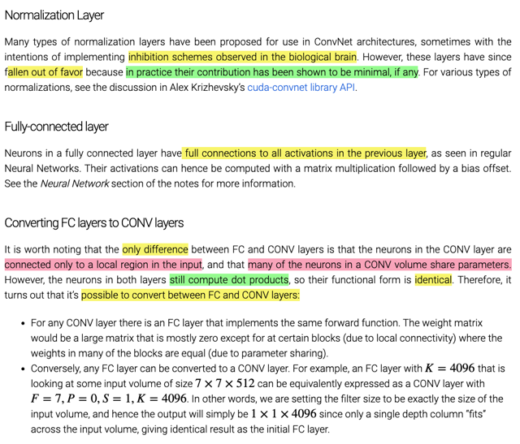</kbd></p>

<br>

<a id="node-759"></a>

<p align="center"><kbd>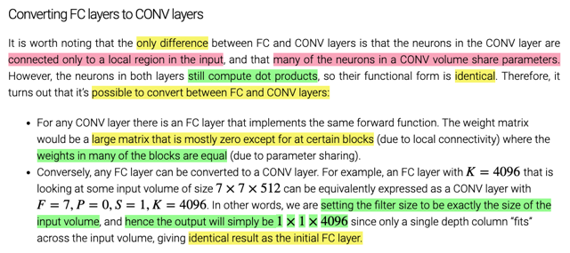</kbd></p>

> [!NOTE]
> Đại khái là nói rằng ta có thể convert từ Conv `->` FC và ngược lại  được
> là vì bản chất hai layer đều tính phép dot product của weights và input và
> cộng với bias. Chỉ có điều FC thì "tính hết" mọi input, còn Conv thì tính
> một vùng. Vậy `Conv->FC` có thể xem như (đương nhiên mỗi output của
> output volume sẽ là một neuron, ví dụ conv output ra  55x55x10 volume
> thì sẽ tương đương FC có 55*55*10 unit. Nhưng mỗi `unit/neuron` trong
> FC này chỉ connect (tính toán từ) một nhóm các input ví dụ input là
> 247x247x3, filter size là 5x5 thì một neuron sẽ chỉ tính với 5*5*3 input
> value trong tổng số 247*247*3 giá trị của input thôi. Thì điều này tương
> đương mỗi neuron, như đã biết sẽ có một vector weights (và một bias),
> thì vector weight tuy sẽ vẫn có 247*247*3 phần tử, nhưng trong đó chỉ có
> một nhóm 5*5*3 weight là có giá trị, còn lại là bằng 0 hết.  Do đó mới nói
> cái ý là cái giant weight matrix này sẽ có rất nhiều khoảng trống, chỉ có
> lác đác một số vùng có giá trị.
>
> Và vì những Conv output khác trong cùng activation map sẽ được tính
> cùng một filter, nên có thể thấy các tất cả các neuron của FC chuyển đổi
> mà xuất phát từ các Conv neuron cùng activation map, sẽ có giá trị giống
> nhau.
>
> Nhưng chú ý là nó sẽ khác nhau về vị trí, vì chúng connect với các nhóm
> input khác nhau (những receptive field `/` filter location khác nhau)
>
> `====`
>
> Còn từ `FC->` Conv, thì ta dùng filter có size bằng spatial size của input,
> ví dụ một FC layer take input từ toàn bộ value của volume WxHxD (có thể
> hiểu là cái volume này được flatten thành vector, để đưa vào FC layer)
>
> Nó sẽ tương tự dùng Conv với filter size `=` W ( `=` H), để rồi output có spatial
> size `=` 1x1. Nếu FC layer có 100 neuron, thì Conv chuyển đổi sẽ có 100 filter

<br>

<a id="node-760"></a>

<p align="center"><kbd>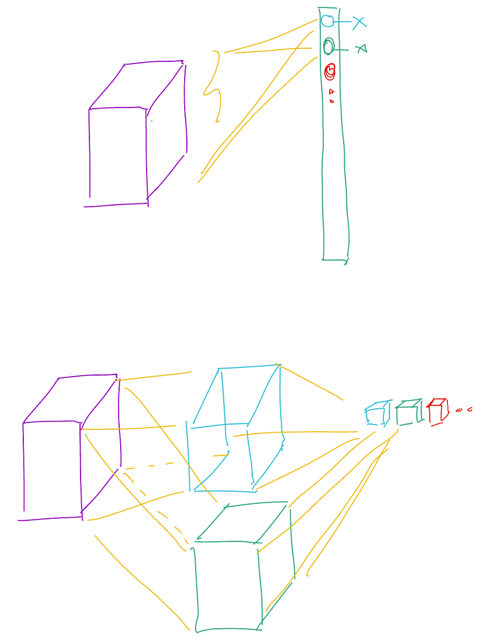</kbd></p>

<p align="center"><kbd></kbd></p>

<p align="center"><kbd>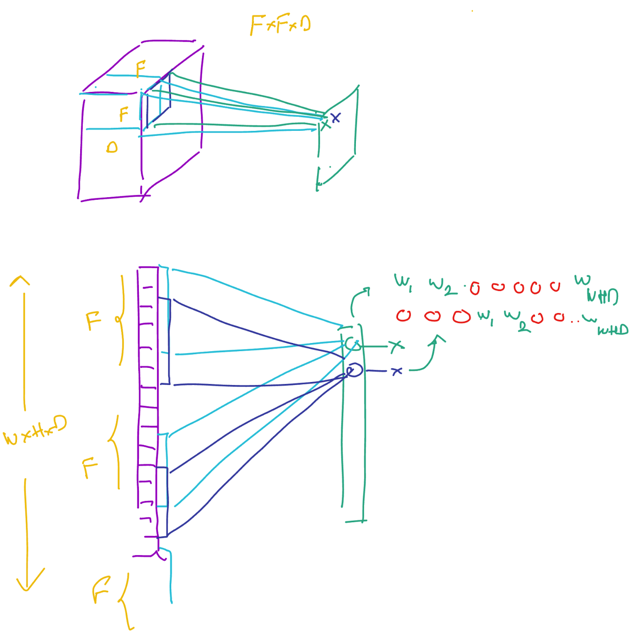</kbd></p>

<br>

<a id="node-761"></a>

<p align="center"><kbd>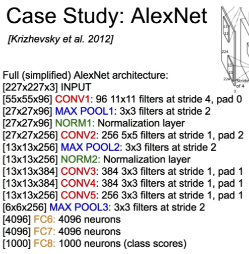</kbd></p>

<br>

<a id="node-762"></a>

<p align="center"><kbd>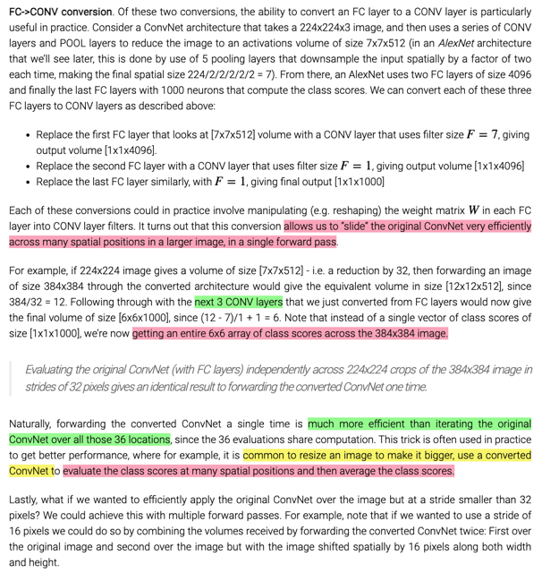</kbd></p>

> [!NOTE]
> đại khái là vầy nè, bây giờ coi như ta đang có cái alexnet, nhận vào cái hình size
> 224x224x3 để output tại layer pooling chót là 7x7x512 volume, đặng như đã biết nó
> sẽ (coi như được flatten ra, theo Andrew Ng, trước khi bỏ vào FC layer) input hết vào
> FC layer đầu tiên có 4096 neuron, sau đó lại vào FC thứ 2 cũng có 4096 neuron, và
> cuối cùng là FC cuối có 1000 output neuron.
>
> Vậy, cái ý người ta nói ở đây đó là, nếu mà phải "làm" trên cái hình to hơn thì sao ví
> dụ 384x384, thì đương nhiên sẽ không được, vì AlexNet nó quy định đầu vào là
> 224x224 rồi, vậy ta phải cắt ra cái hình 384x384 thành 36 vùng 224x224 (giống như
> lia cái khung 224x224) trái phải trên dưới như khi convolution vậy. Mỗi lần như vậy,
> bỏ vào AlexNet, để ra Một vector 1000 class scores như đã biết. Và làm vậy 36 lần
> được 36 vector class scores, xong đem trung bình lại để có class scores của cái hình
> 384x384
>
> `====`
>
> Rồi, nghĩ lại cái trên thì sở dĩ nói AlexNet quy định đầu vào thực ra là do mấy cái FC
> cuối, ví dụ cái FC đầu tiên với 4096 neuron nó sẽ có W matrix là (4096,7*7*512) tức
> mỗi neuron có vector weight dài 7*7*512, cộng 1 bias Chứ những conv layer, pooling
> layer ở trước đó thì vẫn có thể "xử lý" cái hình đầu vào 384x384, để tại pooling layer
> cuối thay vì ra 7x7x512 thì nó ra 12x12x512 volume.
>
> Tới đây đương nhiên nếu flatten cái volume 12x12x512 này ra thì sẽ không "khớp"
> được với FC ở trên. Tới đây mới dùng cái trick là convert mấy cái FC  layer đó sang
> Conv layer:
>
> Với Fc layer đầu tiên, chuyển sang conv layer sẽ có 4096 filter với size là 7x7.  Fc
> layer thứ hai là 4096 filter với size là 1x1,và Fc layer cuối là 1000 filter size 1x1 Vậy
> qua 'converted' conv đầu tiên, từ 12x12x512, sẽ cho ra output volume là 6x6x4096,
> qua tiếp cái converted conv layer 2 thì từ 6x6x4096 trở thành 6x6x4096 (vì filter size
> là 1x1, nên spatial size không đổi, số filter của layer 2 vẫn là 4096)
>
> Và qua layer cuối, từ 6x6x4096 với 1000 cái filter 1x1, sẽ cho ra output 6x6x1000.
>
> `====`
>
> Vậy ý nghĩa của việc này đó là: Việc convert FC layer sang Conv layer đã cho  phép "
> xử lý" cái hình ban đầu to hơn dự kiến (384x384) để thay vì phải phân nó ra  làm 36
> vùng (mỗi vùng có size 224x224) rồi "forward" qua AlexNet 36 lần để ra 36 cái vector
> 1000 class scores) thì nay, cứ đưa vào cái hình 384x384, nó sẽ cho ra output là
> 6x6x1000 volume, thì cũng chính là 36 cái vector "1x1x1000" kia stack  lại thành một "
> bó" 6x6x1000.
>
> Vậy thì đương nhiên đây chính là ý người ta nói đó là nó cho phép ta **slide cái
> ConvNet qua nhiều vùng (36 vùng) của cái hình to hơn (384x384) một cách rất hiệu
> qủa, chỉ trong một lần duy nhất (in a single forward)**

<br>

<a id="node-763"></a>

<p align="center"><kbd>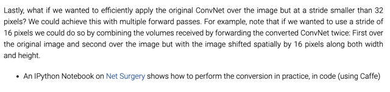</kbd></p>

> [!NOTE]
> chưa hiểu lắm,
> quay lại sau

<br>

<a id="node-764"></a>

<p align="center"><kbd>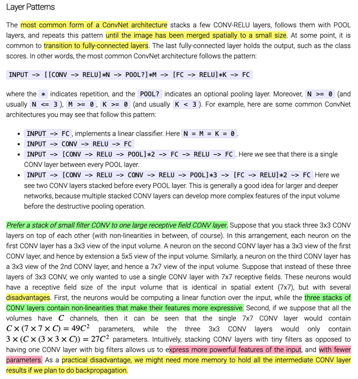</kbd></p>

> [!NOTE]
> đại ý nói về các kiến trúc `/` cách sắp xếp thông dụng các conv, pooling,
> relu, fc trong ConvNet. Nói chung là ta sẽ hay lặp lại vài cặp `conv-relu`
> sau đó chèn vào một cái pooling, và lặp lại cái combo (vài lần
> `conv-relu-pooling)` này cho đến khi spatial size nhỏ lại đáng kể thì
> chuyển sang fc. Và có thể dùng 2,3 cái fc là hết.
>
> Đoạn dưới nói về lợi ích của việc dùng "nhiều cái conv layer có filter
> size nhỏ thay vì một conv layer có filter size lớn" vì với cùng receptive
> field thì tốn ít  Params hơn, bên cạnh đó nhiều conv layer thì sẽ nhiều
> lần relu, đương nhiên là tốt hơn một conv layer (ta đã hiểu tầm quan
> trọng của nonlinearity rồi)
>
> Chỉ có một cái nhược điểm của việc dùng ít  conv layer filter nhỏ là số
> lượng các giá trị trung gian phải 'giữ' cho quá trình backprop sẽ lớn hơn

<br>

<a id="node-765"></a>

<p align="center"><kbd>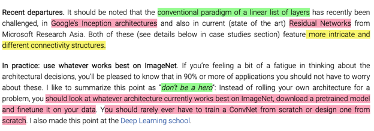</kbd></p>

> [!NOTE]
> đại ý là cái mô tuýp sắp xếp các layer theo thứ tự như vậy đang bị thách
> thức với các kiến trúc mới như Inception và Residual Net.
>
> Tuy nhiên ở đây người ta nói cứ dùng bất cứ architecture nào  mà đạt hiệu
> quả tốt. Và phần lớn mình sẽ không train một ConvNet từ đầu mà sẽ
> finetune một pretrained model

> [!NOTE]
> Link dẫn tới một clip bài giảng của Andrej Karpathy: 
> ```text
> rất hay https://www.youtube.com/watch?v=u6aEYuemt0M
> ```

<br>

<a id="node-766"></a>

<p align="center"><kbd>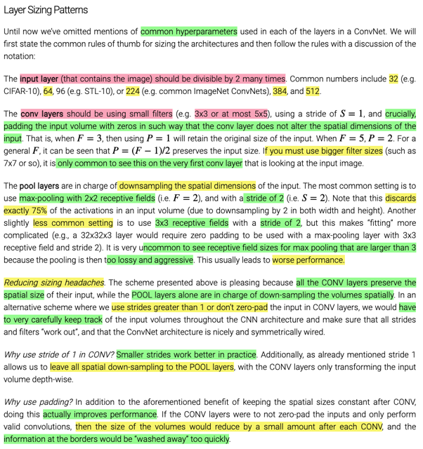</kbd></p>

> [!NOTE]
> đại ý là một số giá trị hyperparam nên `/` người ta hay dùng.
>
> với input layer, tức cái hình gốc đưa vô, thì thường chia hết được
> cho 2 vài  lần như 32, 64, ...512.
>
> với conv layer thì nên dùng filter nhỏ như đã nói về lợi ích ở trên,
> thường  là 2x2, 3x3 (trừ khi cái hình đưa vô quá bự thì có thể dùng
> filter lớn hơn như 7x7), chứ lớn hơn thì sẽ mất nhiều thông tin quá
> nhanh.
>
> đồng thời nên dùng stride 1 (thực tế cho thấy stride nhỏ tác dụng
> tốt) và padding sao cho spatial size không thay  đổi (Andrew Ng gọi
> là same padding), lợi ích của nó là giúp không bị mất thông tin ở
> border, và lợi ích thứ hai là giao hẳn việc downsampling (chỉ nhiệm
> vụ giảm spatial size) cho pooling layer, như vậy sẽ dễ kiểm soát
> vấn đề kích thước hơn.
>
> Pooling thì thường là 2x2, stride 2, như đã nói, nó sẽ đảm nhiệm
> việc giảm spacial size. Nhưng nếu lựa chọn cách tiếp cận khác khi
> conv layer dùng  stride lớn hơn 1 và không dùng padding (đồng
> nghĩa hình sẽ nhỏ lại spatially) thì phải theo dõi cẩn thận vấn đề
> kích thước.

<br>

<a id="node-767"></a>

<p align="center"><kbd>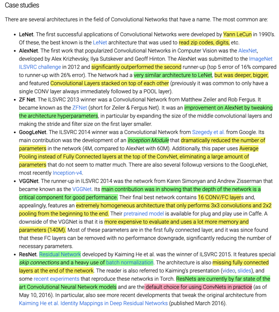</kbd></p>

<br>

<a id="node-768"></a>

<p align="center"><kbd>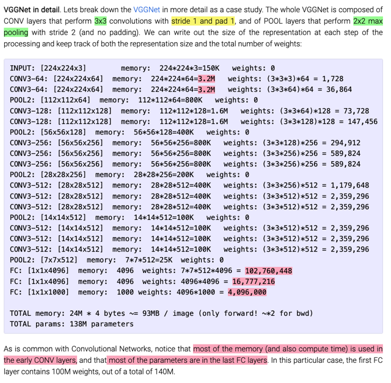</kbd></p>

> [!NOTE]
> có thể thấy phần chiếm nhiều memory nhất là các conv layer đầu tiên, còn tốn
> nhiều param nhất là các fc layer ở cuối
>
> *đơn vị của memory không phải byte đâu nhé, nó là floating point, tính tổng
> số floating point ta sẽ nhân 4 hoặc 8 để ra số byte

<br>

<a id="node-769"></a>

<p align="center"><kbd>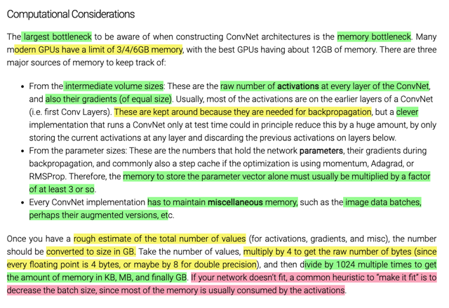</kbd></p>

> [!NOTE]
> đại khái là để ước lượng tổng số memory mà cần để train một convnet
> sẽ gồm các intermediate (các activation của các layer, mình cần giữ
> để dùng khi backprop), đi kèm với nó là số lượng tương đương gradient
> của chúng.
>
> Model param, gradient của tụi nó, cũng như các param dùng trong optimizer
> Nên nói chung là cần ước lượng bằng cách lấy số param, nhân 3.
>
> Ngoài ra phải tính tới momory cho data batches, data augmentation ...
>
> Khi có con số sơ bộ về số lượng thì nhân 4 hoặc 8 để có số byte (một floating
> number chiếm 4 hoặc 8 bytes). Sau đó chia cho 1024 để có KB...
>
> Nếu sau khi ước tính thấy quá nhiều thì phải giảm bằng cách giảm batch size,....

<br>

<a id="node-770"></a>

<p align="center"><kbd></kbd></p>

> [!NOTE]
> ```text
> https://github.com/soumith/convnet-benchmarks
> ```
>
> ```text
> http://cs.stanford.edu/people/karpathy/convnetjs/demo/cifar10.html
> ```
>
> ```text
> http://torch.ch/blog/2016/02/04/resnets.html
> ```

<br>

