# Note - Neural Network Part 2

📊 **Progress:** `46` Notes | `64` Screenshots

---

<kbd>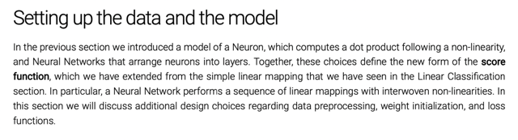</kbd>

> [!NOTE]
> Đại khái là trong phần trước đã biết về **mô hình của một neuron**, trong
> đó tính toán**weight sum các input** (phép dot product giữa input vector
> và weights vector). Sau đó apply **non-linearity function**.
>
> Từ đó một neural network là **chuỗi các linear mapping xen kẽ với
> non-linearity** để mở rộng score function từ một **simple linear mapping**
> trong mô hình linear classification đơn giản thành **neural network.**
>
> Bài này sẽ bàn các vấn đề liên quan với**data preprocessing, weight
> initialization**và**loss function**.

 

<kbd>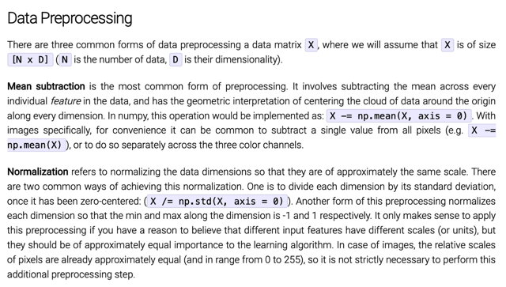</kbd>

> [!NOTE]
> có 3 cách thức phổ biến của data preprocessing. lấy matrix X NxD.
>
> ***Mean-subtraction** đơn giản là **trừ mỗi value với mean của feature** tức là
> đối với X thì trừ mỗi value của X cho **mean của từng cột**, nên mới dùng axis
> = 0 trong X -= np.mean(X, **axis=0**).
>
> Còn với hình ảnh, thì có thể**chỉ cần trừ mean của toàn bộ** (tất cả value của
> tensor 3D HxWx3) hoặc **trừ mean của channel** tương ứng.
>
> hệ quả sẽ giống như ta **dịch chuyển data cloud sao cho nó có tâm là 0**.
>
> ***Normalization**: là cách làm để mục đích đưa các feature thành range 
> giống giống nhau 
>
> **Thế thì một cách đầu tiên gọi là chia mỗi value cho standard
> deviation của feature** để từ đó mọi feature để có **deviation = 1**. Cùng với
> zero centered thì nó gọi là standardization
>
> Một cách nữa là **min-max scaling**, đó là ta sẽ normalize sao cho min và max
> của mỗi feature đều bằng lần lượt là -1 và 1. Và cái này chỉ nên dùng khi có
> cơ sở để tin rằng các input feature **dù cho có scale khác nhau nhưng nên
> đóng góp bằng nhau trong tầm quan trọng.
>
> Với image thì do các feature (các pixel) để đã có range giống nhau (0-255)
> rồi nên không cần làm cách này**

 

<kbd>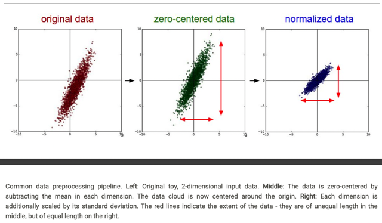</kbd>

> [!NOTE]
> hình ảnh minh họa cho quá trình data preprocessing, với bước 1
> tâm của data points chuyển về gốc 0,0 và bước normalization
> giúp cho deviation bằng nhau.

 

<kbd>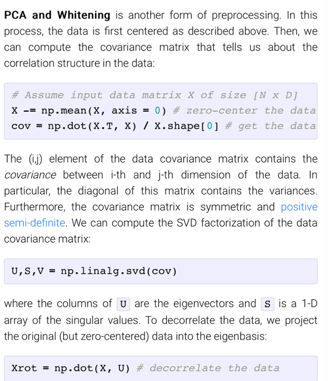</kbd>

> [!NOTE]
> Đầu tiên là**tính covariance matrix X.T@X**. Trong đó mỗi item
> là covariance giữa hai feature tương ứng. Sau đó dùng lệnh
> **svd để phân tách thành U S V** (singular value decomposition)
>
> Trong đó **mỗi cột của U là eigenvectors của cov(X)**, **đường
> chéo của S là eigenvalues của cov(X).**(Note màu xanh dương
> tiếp theo sẽ giải thích tại sao lại như vậy)

 

## Dùng\\* svd(cov)\\* để ra U và nói rằng \\*U là eigenvectors, vậy câu hỏi là eigenvectors

> [!NOTE]
> Dùng\**svd(cov)\** để ra U và nói rằng \**U là eigenvectors, vậy câu hỏi là eigenvectors
> của cái gì? Và tại sao lại dùng U để project X (tính Xrot = XU)
>
> \**Trả lời: Đó là vì cov(X), đặt là C, là một symmetric, semi-positive definite matrix
> nên nó có tính chất đó là:
>
> 1.Left hay right singular matrix cũng như nhau tức là U = V
>
> 2.\**Left singular matrix của C cũng chính là eigenvectors của C\**, 
> nên nói U là eigenvectors tức là eigenvectors của C = cov(X)
>
> Các \**singular value của C cũng bằng eigenvalue của C\** hay:
>
> Σ (ở đây kí hiệu là S) trong C = UΣV.t (svd decomposition) 
> Cũng bằng với Λ trong C = QΛQ.t (eigen decomposition)
>
> 3.\**Singular value/eigenvalue của C\** cũng bằng (\**bình 
> phương SINGULAR value (không phải eigenvalue) của X) / N-1
> \**
> Hay nói cách khác như DL Yoshua về singular value:
>
> Singular value of X là căn hai của eigenvalue (cũng là singular value) của X.tX
> vậy
>
> Tức là nếu X svd decom = UxΣxVx.t thì Σ là bình phương của Σx / N-1\**\**Do có thể chứng minh được rằng (cũng là để trả lời câu hỏi tại sao lại dùng U 
> để project X (tính Xrot = XU)
> \**\**1.Vì e\**igenvectors của cov(X) là orthonormal \**nên \**project X lên hệ trục này (matrix U)\** sẽ 
> được d\**ataset mới có các feature uncorrelated nhau\**. Chứng minh ở note kế tiếp.
> Thì đâu là công dụng thứ nhất của PCA, decorrelating feature
>
> 2.Nếu project X lên các trục khác nhau thì khi trục đó là eigenvector của cov(X) thì variance 
> sẽ max hoặc min. Nên khi project X với U thì ta \**sẽ có các uncorrelated feature có variance
> từ lớn nhất đến nhỏ nhất\**. Để từ đó cho phép ta bỏ đi các feature có variance quá nhỏ
> giúp giảm bớt sự dư thừa, nhẹ bớt. Thì đây là công dụng thứ 2 của PCA - giảm nhẹ dữ liệu

 

<kbd>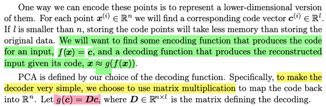</kbd>

<kbd></kbd>

<kbd>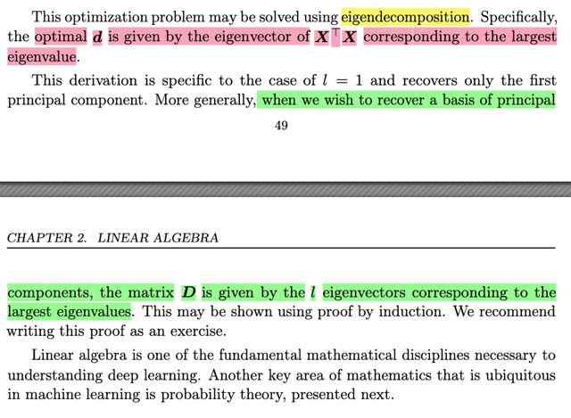</kbd>

> [!NOTE]
> Trong phần 2.12 Deep Learning Yoshua Bengio có chứng minh rằng
> để gọi là tìm bộ điểm c(i) sao cho khi recover ra lại x(i) thì mất ít thông
> tin nhất thì ta sẽ dùng matrix U là các eigenvector của cov(X) 
>
> Ở đây chỉ screenshot đoạn đặt vấn đề và đoạn kết luận

 

### Chứng minh khi project X lên hệ trục này (matrix U) sẽ

> [!NOTE]
> Chứng minh khi project X lên hệ trục này (matrix U) sẽ 
> được dataset mới có các feature uncorrelated nhau 
>
> ta tính cov(X_proj) = cov(X@U):
>
> = [XU].t@[XU] = U.tX.tXU 
>
> Thay X.tX = cov(X) = C
>
> cov(X_proj) = [XU].t@[XU] = U.tCU 
>
> Thay C = UΣV.t mà mới nói tính chất của C là U = V
>
> nên C = UΣU.t
>
> cov(X_proj) = U.t@USU.t@U
>
> Thay U.t@U = I, U.t@U = I
>
> Nên cuối cùng cov(X_proj) = Σ (hay ở đây kí hiệu là S) 
>
> Cho thấy c\**ov(X_proj) là diagonal matrix\** nên\**suy ra
> X_project có feature uncorrelated
>
> *Chú ý Σ ở đây là đang nói của matrix C = cov(X)
> \**còn và

 

<kbd>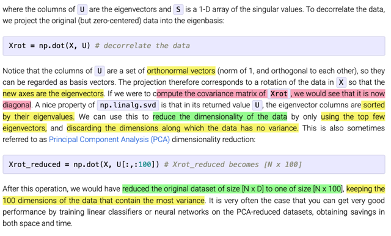</kbd>

> [!NOTE]
> Đại khái là svd function sẽ trả ra **U với các cột được sort theo
> eigenvalue từ lớn đến nhỏ**. Và các cột của U là **orthonormal vectors**
> nên việc project X với U (X@U) sẽ **decorrelate**. Kết quả là các
> **feature mới uncorrelated nhau**. (Nên nếu tính covariance matrix sẽ
> được diagonal matrix)
>
> Và nếu **chỉ** **lấy 100 cột đầu** của U thì kết quả (của X@U[:, :100])
> kiểu như là ta sẽ **tạo training set mới với 100 feature đã decorrelate
> nhau** và **dùng 100 cái có variance lớn nhất**.
>
> Kết quả cho thấy có thể **tăng hiệu suất của model đồng thời tiết kiệm
> chi phí tính toán** **và lưu trữ** khi ta **dùng các feature có lượng thông
> tin nhiều nhất**, loại bỏ các feature ít thông tin (thể hiện bằng mức
> variance,)

> [!NOTE]
> **Tại sao nói "project X với U là X@U":**
>
> Từ DL Yoshua bài 2.7 eigendecomposition đã hiểu **nếu b là unit vector 
> thì project a on b chính là dot product của a và b** (có note về cái này).
>
> Vậy khi X@U thì có thể thấy hàng thứ 1 của X (vector x(1)) sẽ dot
> product với cột thứ nhất của U để ra phần tử thứ 1 của hàng thứ 1
>
> Như vậy, chính là vector x(1) (là vector của sample thứ 1) được
> chiếu lên trục eigenvector u1 để ra tọa độ của nó trên u1.
>
> Để rồi làm tương tự như vậy với các vector u2, u3...Chính là chiếu
> vector x(1) lên các trục này để có tọa độ của vector x(1) trên các
> trục đó.
>
> Kết quả làm thành hàng thứ nhất của matrix kết quả X@U, là tọa
> độ của vector x(1) khi chiếu lên hệ trục mới u1, u2, ....uD
>
> Sở dĩ nói là hệ trục mới vì U là orthogonal matrix, các cột là một
> bộ orthonormal vector.
>
> Như vậy tương tự với các hàng x(2), x(3) của matrix X thì kết quả là
> tọa độ của các điểm (vector) này trong hệ trục mới
>
> ====
>
> Vậy ta mới thấy, giả sử X có 3 cột, tức là x(1) là một điểm trong không
> gian 3 chiều. Nhưng thay vì dùng U ta chỉ dùng U[:,:2]. Tức là chỉ 
> chiếu lên hai trục u1, u2 (bỏ u3). Thế thì có nghĩa là từ điểm x(1) từ trong
> không gian 3 chiều, ta sẽ chỉ tính 2 tọa độ của nó trong hệ trục mới
> tương ứng với u1, u2. Và tương tự mấy điểm kia x(2),x(3)...cũng vậy.
>
> Vậy kết quả là ta chuyển/chiếu 1 đám điểm trong không gian 3 chiều thành
> lên một mặt phẳng 2D tương ứng với hai trục u1, u2 trong không gian,
>
> *Phải hiểu rằng các điểm nó vẫn đứng yên vị trí, chỉ là tính lại toạ độ của
> Nó trong hệ trục u1, u2, u3 mới. Mà nếu mặc kệ u3, chỉ quan tâm u1, u2 thì
> kiểu như ta chỉ quan tam đến hình chiếu của các điểm này lên mặt phẳng
> u1, u2.

   

<kbd>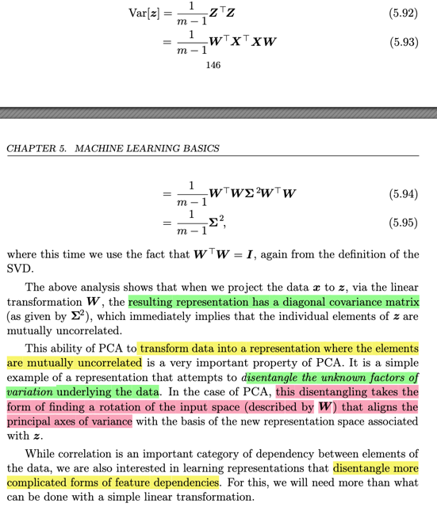</kbd>

> [!NOTE]
> liên hệ đoạn cuối của phần 5.xx DL Yoshua Bengio, tác gỉa
> nói về tác dụng của PCA giúp decorrelate feature

   

<kbd>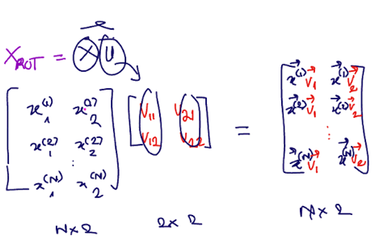</kbd>

<kbd></kbd>

<kbd>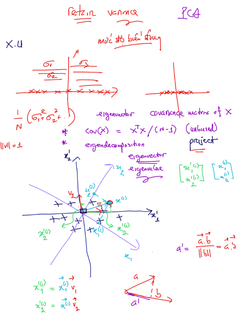</kbd>

   

<kbd>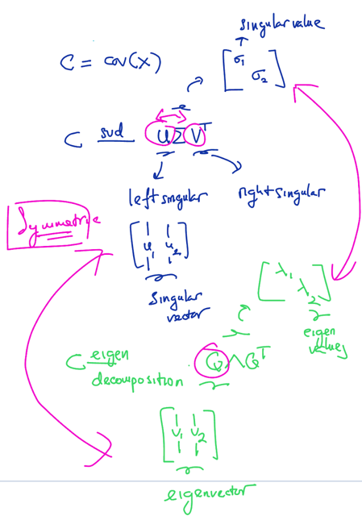</kbd>

   

<kbd>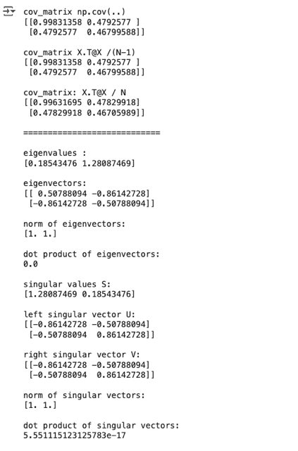</kbd>

> [!NOTE]
> https://colab.research.google.com/drive/1XqSmsJedHRHX7TG712iXvPF7buwTDrCb#scrollTo=xq9iqqChFNlg

   

<kbd>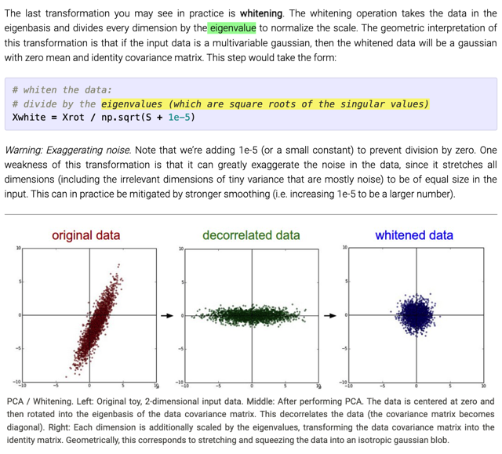</kbd>

> [!NOTE]
> Đại khái là nếu **chia Xrot (kết quả của X@U) với căn hai của
> eigenvalues** (là giá trị của S) thì kết quả là các column đều có variance
> bằng 1 (và bằng nhau)
>
> Có nghĩa là **covariance matrix sẽ là identity matrix**(nhắc lại covariance
> matrix là matrix các covariance giữa các feature/cột, vốn dĩ tại đây, sau khi
> đã decorrelated, đã có covariance giữa các feature = 0. Tuy nhiên variance
> của các feature vẫn khác nhau (chính là giá trị của eigenvalues, mà đã nói
> chán chê nãy h chính là singular value - matrix Σ trong cov(X) = UΣV.t, và
> cũng là eigenvalue - matrix Λ trong phép eigendecomposition cov(X) = QΛQ.t
>
> Bây giờ khi normalize, tức là chia các feature cho căn bậc hai của variance 
> (tức là eigenvalue) thì chính là chia cho độ lệch chuẩn (standard deviation) 
>
> Thì kết quả là các variance đều bằng 1, gọi là unit variance, và khi đó covariance
> matrix của X_whitening sẻ là identity matrix vì các item trên đường chéo đều = 1

   

<kbd>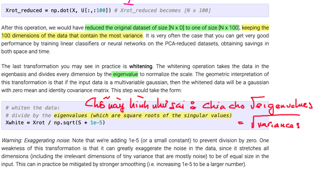</kbd>

> [!NOTE]
> Chỗ này cho rằng họ ghi hơi sai, chia công thức là chia cho
> căn bậc hai của eigenvalue (vốn là variance, nên căn bậc
> hai của nó chính là độ lệch chuẩn).
>
> Nên công thức là chia cho độ lệch chuẩn để đưa độ lệch chuẩn 
> của mọi feature thành 1 hết.
>
> Chứ không phải eigenvalue là căn bậc hai của singular value

   

<kbd>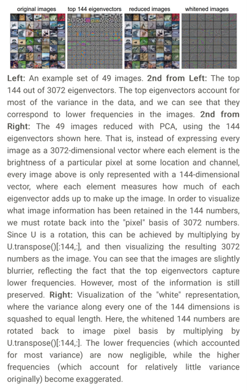</kbd>

> [!NOTE]
> Mỗi hình trở thành row vector 3072 units.
>
> Dataset có 49 image
>
> -> X là matrix 49x3072 covariance matrix
>
> X.T@X sẽ có shape là 3072x3072, và U sẽ 3072x3072.
>
> Lấy 144 cột đầu tiên ứng với 144 dimensions có variance
> cao nhất (eigenvalue lớn nhất)
>
> U100 = U[:,:100] có shape 3072x144.
>
> Xr = X@U100sẽ là 49x144.
>
> Sau đó lại nhân Xr (49x144) với U100.T (144x3072) để
> thành X_approx có shape 49x3072 nhưng kiểu như là chỉ
> giữ lại 144 feature có variance cao nhất, chứa nhiều
> thông tin nhất

   

<kbd>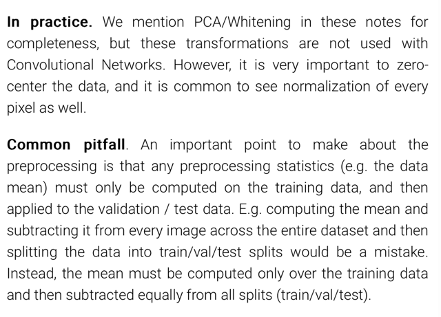</kbd>

> [!NOTE]
> Đại khái là PCA/Whitening thường không dùng ở convolutional neural
> network. Và nhắc nhở rằng đừng nên quên rằng **việc tính toán các thông
> số trong quá trình preprocessing phải dùng training set**, tức là ta sẽ **chia
> train/val/test rồi mới preprocessing với mean, stddev từ training set**. Chứ
> ko phải dùng toàn bộ dataset để thực hiện preprocessing rồi mới split
> train/val/test

   

<kbd>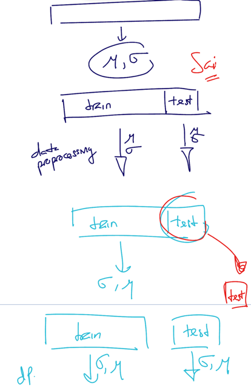</kbd>

   

<kbd>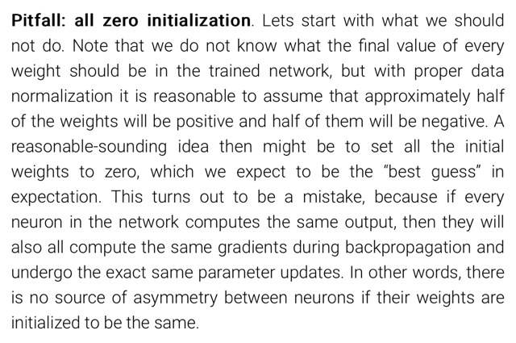</kbd>

> [!NOTE]
> đại khái là cái này nếu như những cái params mà ban đầu **có giá trị
> giống nhau** thì trong quá trình **forward pass** thì nó sẽ**tính ra
> những giá trị giống nhau**
>
> dẫn đến là trong quá trình backprop thì **những giá trị gradient này nó
> cũng giống nhau**
>
> dẫn đến cách **các parameters giờ lại tiếp tục có giá trị giống nhau**
> và**cái sự giống nhau này không bị phá vỡ được** khiến cho cả
> neural networks **không có được tính đa dạng trong khả năng học
> tập được các pattern phức tạp**

   

<kbd>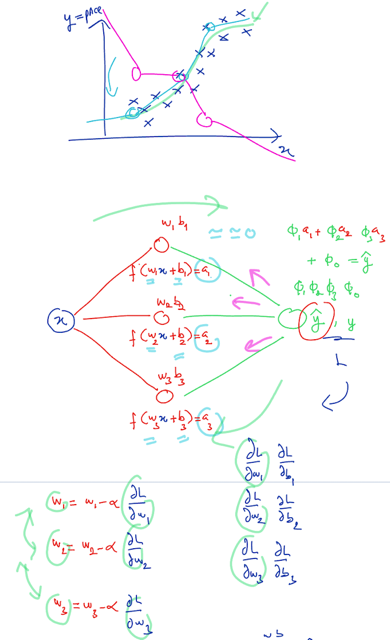</kbd>

> [!NOTE]
> Minh họa cho thấy layer có 3 neuron mà bắt đầu
> bằng nhau, thì tính toán giống nhau, nên
> backprop gradient cũng sẽ giống nhau. Và coi
> như chỉ tương đương 1 neuron

   

<kbd>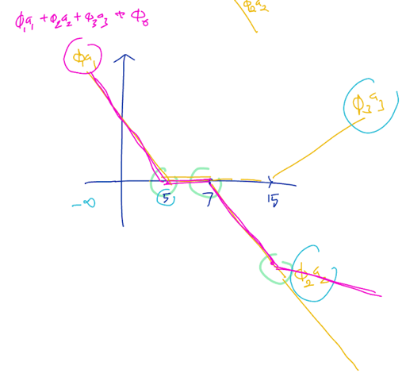</kbd>

<kbd></kbd>

<kbd>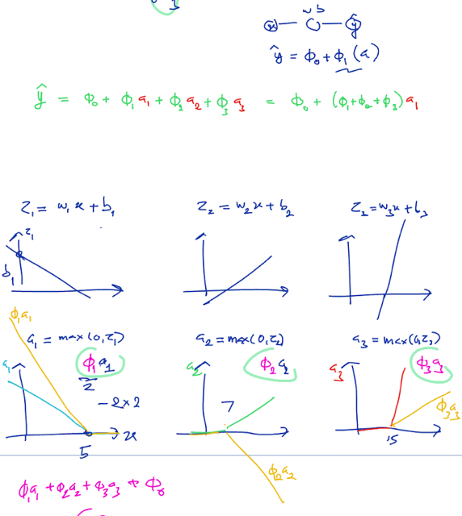</kbd>

   

<kbd>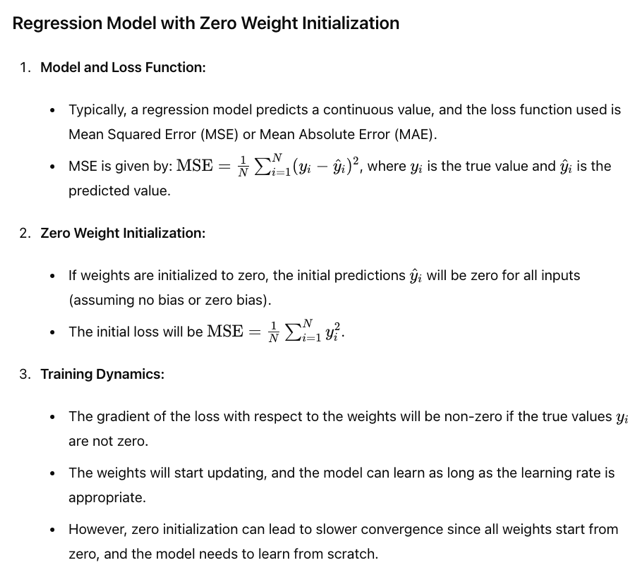</kbd>

   

<kbd>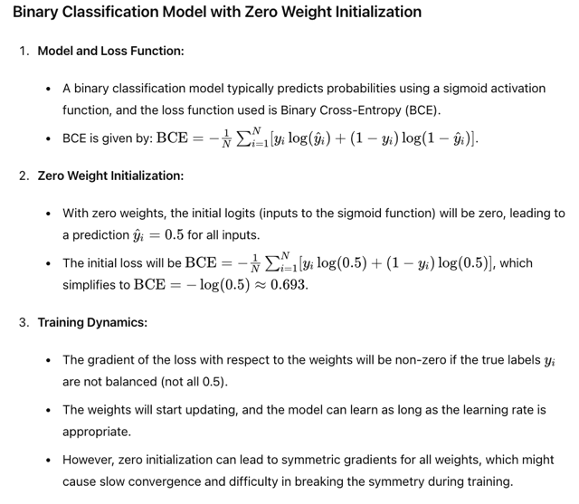</kbd>

   

<kbd>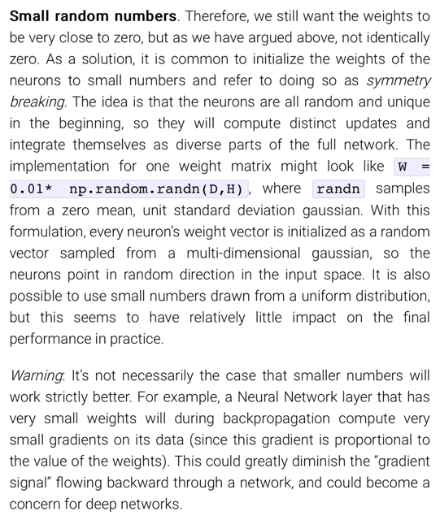</kbd>

> [!NOTE]
> đại khái là để **symmetry breaking**, ý tưởng đó là khởi taọ  các giá trị
> ban đầu của các neuron (ý nói các params) với **giá trị ngẫu nhiên
> nhưng nhỏ ~= 0**. Như vậy thì kiểu như  vẫn đạt được trạng thái là**mỗi
> params trong quá trình training sẽ được update mỗi kiểu khác nhau**,
> nhờ vậy **cả neural net có tính đa dạng và hoạt động như một function
> phức tạp** đủ để có thể nắm bắt được các complex pattern.
>
> Cách làm đó là dùng **randn(weight matrix shape)*một số nhỏ** (ví dụ 0.
> 01) để nó sẽ lấy random từ một **Gaussian distribution mean 0, variance
> = 1.**
>
> Có thể dùng **Uniform distribution** nhưng**thực tế cho thấy không hiệu
> quả bằng**
>
> Ghi chú đó là **ko nhất thiết giá trị (ngẫu nhiên) ban đầu nhỏ xíu mới là
> tốt** vì **nhỏ quá thì gradient cũng sẽ trở nên rất nhỏ** thì sẽ không giúp
> update được params

   

<kbd>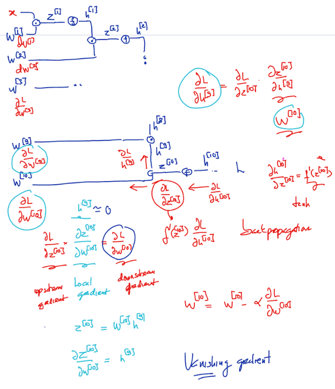</kbd>

> [!NOTE]
> Minh họa với computation graph cho thấy khi khởi tạo W nhỏ
>
> (khi backprop qua note dot product của W[l] và H[l-1] cho ra Z[l]) thì dW[l]
> = dZ[l]*dZ[l]/dW[l]
>
> với dZ[l] là upstream gradient,
>
> **dZ[l]/dW[l] là local gradient** và có thể hiểu nó sẽ **chính là H[l-1]**
>
> vậy nếu **các giá trị của activation value cứ NHỎ DẦN** (do W nhỏ nên
> input*W nhỏ lại) qua từng layer thì rõ ràng **gradient sẽ bị nhỏ theo.**
>
> mà W khởi tạo lớn thì hoặc là bị thêm cái **dưới** hoặc là **activation
> cũng lớn dần lớn dần khiến backprop grad sẽ lớn, gây exploding
> gradient**
>
> ===
>
> Hiện tượng này cũng sẽ xảy ra**khi W khởi tạo random lớn**, khiến các
> **giá trị của z lớn dần**, để rồi khi vào tanh() nó hoạt động ở vùng đuôi,
> điều này cũng sẽ gây vấn đề khi backprop qua node tanh, **local
> gradient cũng = 0**, khiến các downstream gradient = 0.
>
> Và nếu ko bị vậy thì **cũng bị cái trên** là **gradient qua các layer cứ lớn
> dần lớn dần -> Exploding gradient** (W nhỏ thì gradient nhỏ dần ->
> vanish)

   

<kbd>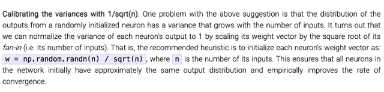</kbd>

> [!NOTE]
> cách làm này có vấn đề đó là khiến output của các neuron (các node/unit của
> layer) sẽ có variance lớn dần. Qua nhiều layer, thì nó sẽ trở nên rất lớn khiến
> cho trong quá trình backpropagation, gradient với hàm sigmoid hay tanh sẽ work
> **ở vùng có độ dốc thấp gây ra hiện tượng vanishing gradient**Ý tưởng đó là init weight với giá trị random nhưng sẽ scale xuống bởi sqrt(n)
> (hay nhân cho 1/sqrt(n)). Có thể chứng minh được điều này khiến variance của
> output vẫn là 1 chứ ko lớn dần lên

   

<kbd>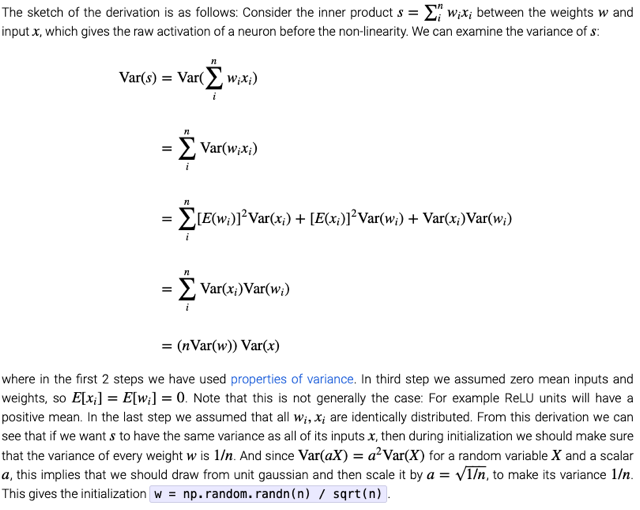</kbd>

> [!NOTE]
> đại ý là, s (hay Andrew in dùng z) là weighted sum của input. Ví dụ x = [x1, x2,x3]
> w = [w1, w2, w3]. s = w1x1 + w2x2 + w3x3 Có thể thấy trong phần triển khai, nếu
> scale w xuống bằng cách chia cho sqrt(n) (n=3) thì**var(s) sẽ bằng var(x).
>
> var(s) = var(x) là để các giá trị activation (thật ra là giá trị trước khi bỏ qua
> activation function)  không lớn lên từng ngày, khiến qua activation value (mà đang
> ví dụ là dùng tanh) nó không hoạt động** ở vùng có độ dốc. = 0 khiến quá trình
> backprop qua tanh unit để tính local gradient sẽ có giá trị = 0
>
> Trong phần triển khai sử dụng những ý:
>
> 1. var(sum X_i) sẽ = sum {var(X_i} + sum {cov(X_i, X_j)} nhưng cov(X_i, X_j) = 0
> (mà ở đây chính là vậy vì các w1x1, w2x2 không liên quan, dependent gì nhau) thì
> var(sum X_i) sẽ = sum {var(X_i}
>
> 2. var(X,Y) = E[X]^2*var(Y) + E[Y]^2*var(X) + var(X)*var(Y)
>
> 3. Và vì cho rằng đang dùng activation function là sigmoid hay tanh nên x sẽ có
> zero mean tức E(x) = 0. và Weight được init zero mean nen E[w] = 0
>
> 4.Ý cuối, tổng i var(xi)*var(wi) trở thành n*var(x)*var(w) là vì: các wi đều
> **identically distributed, và xi cũng vậy. Theo định nghĩa của khái niệm 'identically
> distributed' thì các random variable này sẽ đều có chung một probability
> distribution. Thành ra var(x1) = var(x2) = ...gọi chung là var(x) là variance của
> phân phối xác suất.**Tương tự với w cũng thế Từ đó mới có thể triển khai thành
> ra vậy

   

<kbd>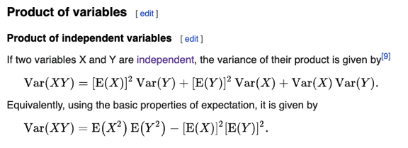</kbd>

<kbd></kbd>

<kbd>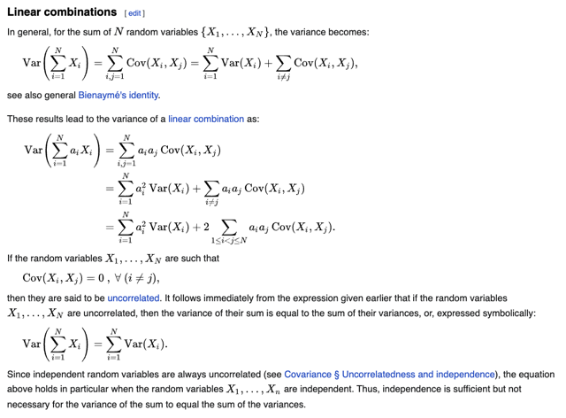</kbd>

> [!NOTE]
> (Xem câu cuối) các independent random variable thì
> đương nhiên uncorrelated, nên var(sum(Xi)) với các Xi
> independent sẽ bằng sum(var(Xi))

> [!NOTE]
> Variance của một "tích" các random variable

   

<kbd>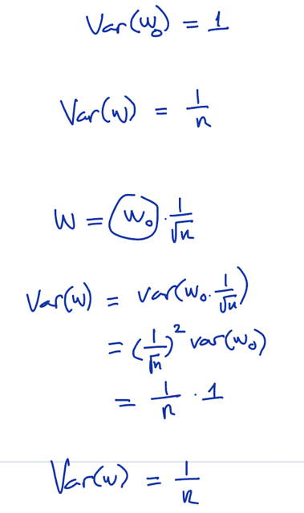</kbd>

> [!NOTE]
> cái đoạn lập luận tại sao phải scale down w cho sqrt(n) thì như sau:
>
> Ban đầu, ta sẽ lấy (sampling) ngẫu nhiên w từ unit variance Gaussian 
> distribution. tạm gọi là w_0 đi, thì ta có var(w_0) = 1.
>
> Bây giờ ta cần w có var = 1/n (để mà từ đó mới có var(s) = var(x) tức là 
> Variance của output vẫn giữ bằng variance của input giúp giữ ổn định
> quá trình training.
>
> Thế thì ta cần w = w0/sqrt(n) thì var(w) = var[w_0*(1/sqrt(n)] mà cái này theo
> công thức var(aX) = a^2*var(X) cho nên ta có var(w) = 1/n*var(w_0) = 1/n*1 = 1/n

   

<kbd>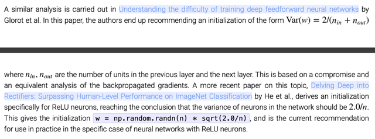</kbd>

> [!NOTE]
> đại khái là những (tạm gọi là) nghiên cứu khác đề xuất những cách weight
> initialization khác như scale W theo factor sqrt[2/(n_in+n_out)] (Glorot)
>
> Còn nếu dùng activation function reLU thì dùng cách làm của He
> initialization là scale W cho sqrt[2/n]

   

<kbd>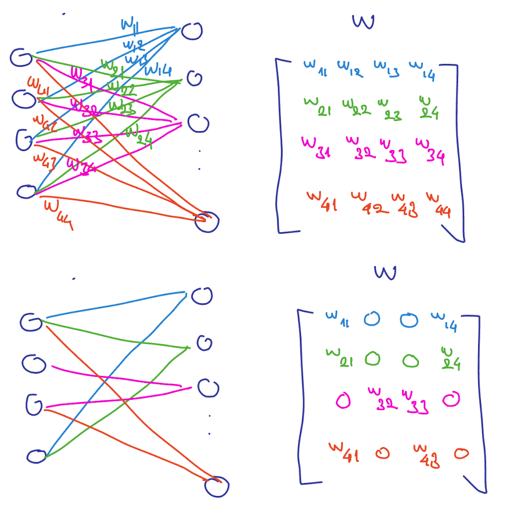</kbd>

<kbd></kbd>

<kbd>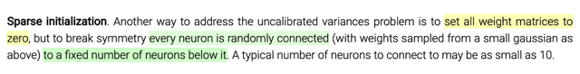</kbd>

> [!NOTE]
> đại khái là ở đây có nhắc tới một phương pháp là **sparse initialization**, cách
> thức đại khái đó là ta sẽ k**hởi tạo weight matrix = 0 hết**, sau đó chỉ có mỗi
> hàng (bộ weight của một neuron) có vài giá trị nhỏ khác 0 mà thôi (vài là
> một con số cố định, ví dụ 10, và các giá trị nhỏ nói ở đây là lấy random
> theo normal distribution)
>
> Hình ảnh sẽ là đối với mỗi neuron của layer sau, thì nó sẽ chỉ connect với
> vài neuron ở layer trước thôi chứ không phải tất cả như bình thường.
>
> Cách này người ta chỉ lướt qua, và cũng chỉ ở đây CS231n mới nghe nói
> đến cái này. Sau khi hỏi gpt thì được biết nó ít được sử dụng hoặc chỉ dùng
> trong một số trường hợp nhất định như khi mạng neural rất lớn..
>
> Lí do dễ thấy là theo mô tả cách làm của nó thì thấy phải thực hiện thêm
> các bước như kết nối randomly neuron với các neuron trước và hiệu quả
> của nó chưa được chứng minh rộng rãi so với các Xavier, He initialization

   

<kbd>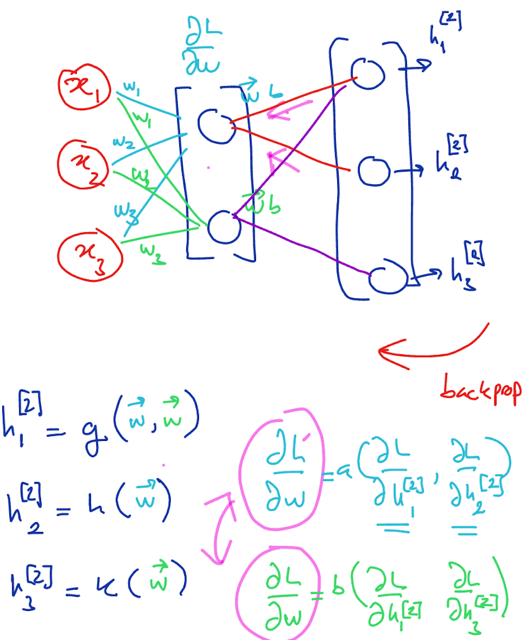</kbd>

> [!NOTE]
> Có thể hiểu nôm na là vì mỗi neuron sẽ connect với một bộ các
> neuron khác nên **khi tính gradient (derivative of loss w.r. t w của
> mỗi neuron trong quá trình backpropagation) sẽ khác nhau**. Dẫn
> tới các neuron params sẽ được update khác nhau. Nhờ vậy có thể
> symmetry breaking.
>
> Trong hình dưới là dw của neuron 1, layer 1(xanh dương sẽ tính
> (không quan tâm chính xác) từ dh[2]_1 và dh[2]_2) còn của neuron
> 2, layer 1 sẽ được tính từ dh[2]_1 và dh[2]_3. Do đó rõ ràng nó sẽ
> khác nhau

   

<kbd>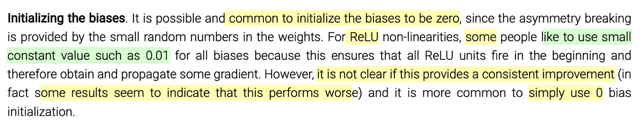</kbd>

> [!NOTE]
> đại ý là bias thì cứ khởi tạo với 0. vì nó ko ảnh hưởng gì tới vấn đề
> symmetry breaking như của weight.
>
> Đối với reLu thì một số có thể khởi tạo với số dương nhỏ như 0.01,
> đã học trong bài đó là nhằm kiểu như khiến cho input của relu ban 
> đầu đều > 0 giúp tránh hiện tượng dying relu (khi input âm thì function
> làm việc trong vùng có độ dốc = 0, hay nói cách khác gradient 
> chạy về sẽ bằng 0, không giúp model học được gì)
>
> Tuy nhiên ở đây cho rằng cách này chưa chứng minh được là luôn hiệu
> quả mà thậm chí có khi gây hại. Cho nên phổ biến người ta cứ khởi
> tạo bias = 0

   

<kbd>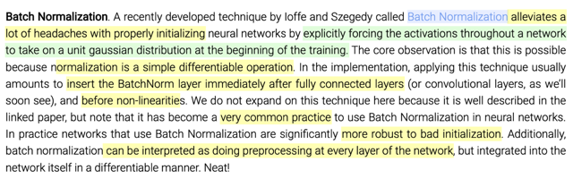</kbd>

> [!NOTE]
> đại khái là nói sơ về công dụng của BatchNorm, rất thông dụng ngày nay. ý
> chính dù các phương thức initialization giúp khắc phục phần nào vấn đề
> vanishing/ exploding gradient như không hoàn toàn. BatchNorm ra đời cho
> thấy hiệu quả hơn đáng kể giúp giảm đi phiền não liên quan đến việc phải
> initialize weight ra sao.
>
> Ở đây người ta không nói lại nguyên lý của batch norm nhưng nôm na là
> nó sẽ chủ động thay đổi các chỉ số thống kê của data ngay trong quá trình
> training đang diễn ra, cụ thể là nó **sẽ ép (force) output từ phép linear
> transformation sau mỗi layer về trạng thái có variance = 1**
>
> Cách làm thì cơ bản chỉ việc **thêm BatchNorm layer sau Linear layer** (fully
> connected layer)  hoặc convolutional layer (nhưng trước activation layer)
>
> MỘt ý nữa đại khái là có thể hiểu nó (interpret) như là thực hiện data
> preprocessing ngay trong mọi layer của network

   

<kbd>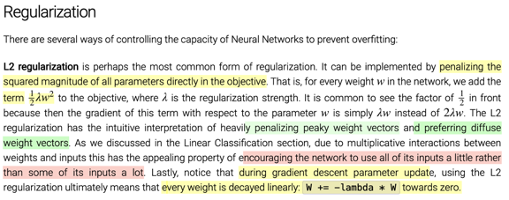</kbd>

> [!NOTE]
> đại ý: L2 regularization còn có tên là weight decay regularization ý chính
> là ta sẽ đưa "yêu cầu" giảm/hạn chế độ lớn của parameters vào trong
> objective luôn, tức là xây dựng loss function có thêm l2 regularization
> term nhằm mục đích trong lúc training, model phải giữ who param (chỉ
> nói về w) nhỏ.
>
> Reg term là tổng bình phương tất cả w, nhân thêm hyperparam lambda
> để kiểm soát mức độ regularization.
>
> Ở đây bài viết nhắc đến khái niệm peaky weight vectors ý nói L2 sẽ hạn
> chế việc model cho vài params có gía trị lớn, còn mấy cái khác thì nhỏ,
> nên nếu vẽ ra sẽ thấy biểu đồ có dạng vài cột cao vọt lên hơn hẳn các
> cái khác. Điều này mang ý nghĩa là model coi trọng một số feature quá
> mức, và chỉ dùng các feature đó trong khi ignore các feature khác.
>
> L2 reg sẽ ngăn điều này, bắt model dùng đều các feature, nên weight
> vector sẽ có dạng khuếch tán (diffuse) - ý là phân tác sự coi trọng của
> model đối với các feature ra chứ không chỉ tập trung vào một vài cái nào
> đó  và các giá trị sẽ nhỏ đều
>
> Một điểm đáng chú ý là nó có cái tên weight decay không chỉ là vì  hiệu
> qủa giảm nhỏ params mà thật sự trong quá trình training, ta sẽ thấy các
> giá trị weight sẽ giảm dần tuyến tính. (tuyến tính vì gradient của L2 reg
> term loss là bậc 1 của W: W = W - lambda*W)

   

<kbd>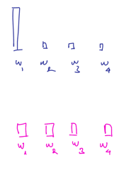</kbd>

   

<kbd>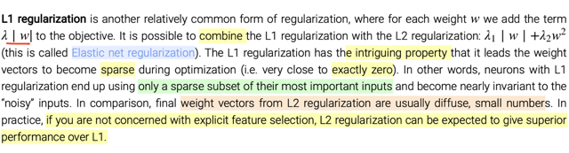</kbd>

> [!NOTE]
> đại ý là L1 cũng phổ biến vì nó có một hệ quả là các weight gắn các feature
> ít quan trọng trở thành ra = 0 (đối lập với L2 reg, tạo weight vector dàn đều),
> tạo ra weight vector có tính chất sparse (trống trải) và mang hàm nghĩa  là tự
> động thực hiện feature selection cho mình.
>
> Tuy nhiên cũng nói đến việc nếu mình ko cần feature selection thì nên dùng
> L2 sẽ cho kết quả tốt hơn

   

<kbd>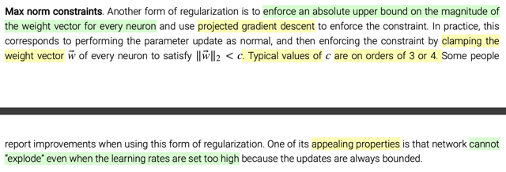</kbd>

> [!NOTE]
> với max norm, đại ý cách làm là dùng một cơ chế để **khống chế không cho
> độ lớn của model weight**không cho vượt quá một mức nào đó.
>
> Cách thực hiện cụ thể thì chưa rõ, nhưng nó có tính chất mà người ta thích
> đó là xài cái này thì không sợ "**exploding**" khi **weight trở nên quá lớn gây mất
> ổn định**  vì dù có set learning rate lớn thì vì weight luôn bị khống chế nên
> không bị hiện tượng  này.

   

<kbd>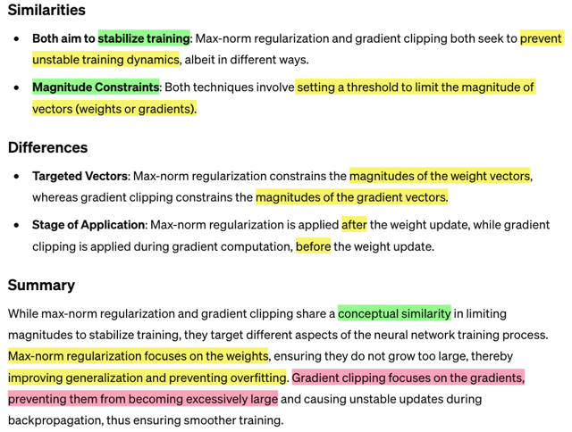</kbd>

> [!NOTE]
> đại khái là có vẻ giống với gradient clipping nhưng cơ bản là g.c nhắm tới
> việc khống chế độ lớn của gradient vector hay matrix, và nó sẽ clip/scale giá
> trị của gradient tức là dW xuống nếu thấy nó lớn quá (cũng so với một
> threshold nào đó), rồi mới dùng dW để update W. Và cái này như đã biết
> nhắm vào khắc phục hiện tượng **exploding** gradient. Còn max-norm
> regularization là một ..regularization technique, nên mục đích chính là giảm
> overfit, tăng khả năng generalization. Max-norm nhắm vào việc scale giá trị
> của bản thân weight vector xuống, tức là W, chứ không phải dW.

   

<kbd>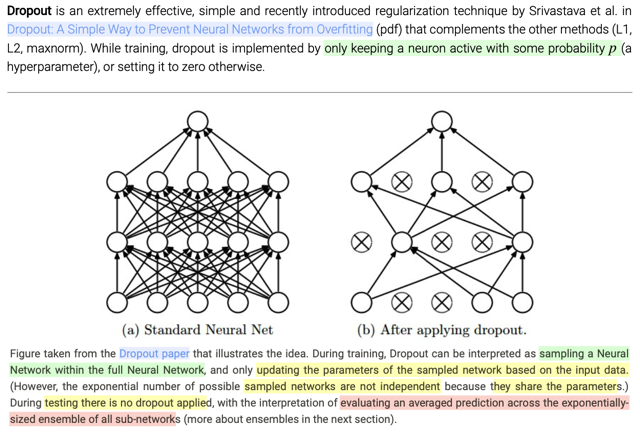</kbd>

> [!NOTE]
> một cách ngắn gọn, dropout là trong lúc training, ta tắt một tỉ lệ nào đó các
> neuron một cách ngẫu nhiên, để thành ra mỗi lần training là như đang
> training một neural net con. Còn lúc testing thì giống như đang dùng ensemble
> Method với rất nhiều neural net con như vậy.

   

<kbd>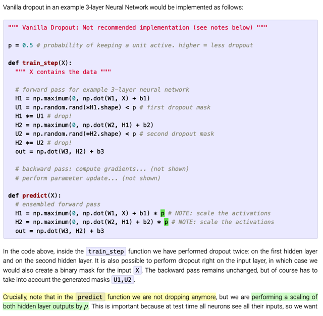</kbd>

> [!NOTE]
> np.random.rand() sẽ cho matrix các giá trị ngẫu nhiên theo Uniform
> distribution từ 0 - 1. Nên np.random.rand(*H.shape) < 0.5 (ví dụ p =
> 0.5) thì cơ bản là sẽ cho mình một matrix cùng shape với H, mà những
> chỗ nào < 0.5 thì True, còn lại thì False. 
>
> Cái dấu '*' trong *H.shape chỉ đơn giản là trải các value trong tuple H.shape
> thành một daỹ, cái này là một tính năng của python cho phép có một 
> cách tiện lợi để đưa argument vào function. thay vì phải rand(H.shape[0], 
> H.shape[1]..)
>
> Như vậy vì các con số trong np.random.rand(*H.shape) sẽ ngẫu nhiên
> từ 0 - 1 nên trong mask sẽ có 50% vị trí trở thành True, còn lại là False.
>
> Nhân element-wise mask matrix này với H1 chính là làm động tác "tắt"
> các đi 50% các output H. H đương niên là một batch các activation 
> vectors, có shape là (N, hidden dim), nếu xét riêng 1 sample (N = 1) thì 
> sẽ dễ hiểu khi thấy rằng sẽ có 50% trong số hidden_dim output bị set
> thành 0.

   

<kbd>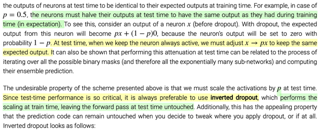</kbd>

> [!NOTE]
> đại ý đó là lúc training, chỉ xài có một phần của model để tính, ví von như
> có 2 cánh tay, khi huấn luyện với khối lượng input như vậy, chỉ một cỗ máy
> được rèn luyện để ra một kết quả đạt yêu cầu.
>
> Nhưng khi testing, vì hai cánh tay đã được huấn luyện cho nhiệm  vụ đó,
> nên giờ xài cả hai thì phải điều chỉnh lực output tổng xuống một nửa nếu
> không thì sẽ "dư" (hiểu nôm na vậy)
>
> ===
>
> Tuy nhiên vì người ta ngại đụng đến hàm testing, hay predict nên thay vì thực
> hiện việc điều chỉnh ở testing, thì có thể điều chỉnh ngay tại training.
>
> Khi đó ta có "inverted dropout"

   

<kbd>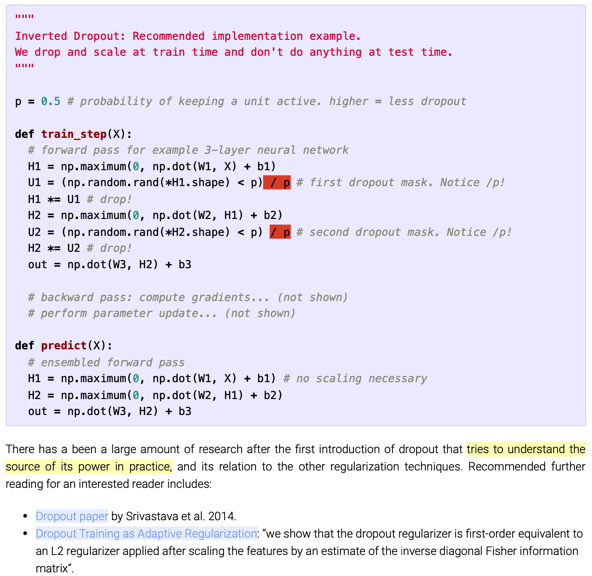</kbd>

> [!NOTE]
> Inverted dropout, chủ động chia p lúc
> training thì lúc testing khỏi thay đổi gì

   

<kbd>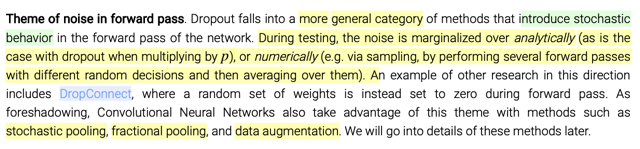</kbd>

> [!NOTE]
> Đại khái cho biết dropout là một dạng cụ thể của một technique chung hơn
> với ý tưởng là đưa sự nhiễu động ngẫu nhiên vào quá trình training. Sự
> nhiễu động này hiểu nôm na là làm khó cho model, khiến nó trở nên mạnh
> mẽ hơn (robust), linh hoạt hơn.
>
> Lúc test thì những nhiễu động này được "marginalize" - kiểu như tái lặp lại,
> cân nhắc vào quá trình testing bằng cách chia cho dropout rate thì gọi là 
> analytically, còn nếu sampling nhiều lần ròi lấy trung bình thì gọi là numerically
>
> một số cái tên khác của dạng này là DropConnect, thay vì tắt = set giá trị
> bằng 0 đối với output value của neuron, thì set 0 giá trị của weight, đối với
> CNN thì có stochastic pooling (thay vì chọn max, hay average value trong
> pooling window, thì chọn random), fractional pooling (thay vì pooling window
> có size cố định thì cho random) Ngoài ra data augmentation cũng thuộc dạng
> này
>
> HIểu sơ sơ là vậy còn cụ thể thế nào thì khi nào gặp sẽ tìm hiểu.

   

<kbd>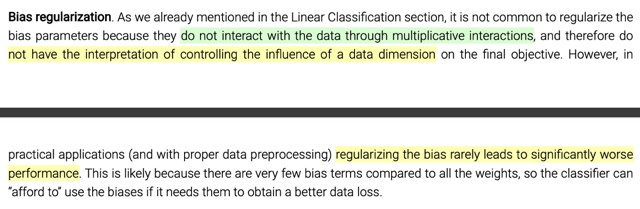</kbd>

> [!NOTE]
> đại ý là bias ví dụ a = g(Wx+b) thì dễ thấy b không tham gia vào phép nhân,
> dẫn đến nó không ảnh hưởng mấy

   

<kbd>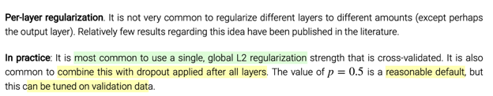</kbd>

> [!NOTE]
> tóm lại thông dụng nhất là dùng L2 reg và
> dropout với rate 0.5 (có thể tuning them)

   

<kbd>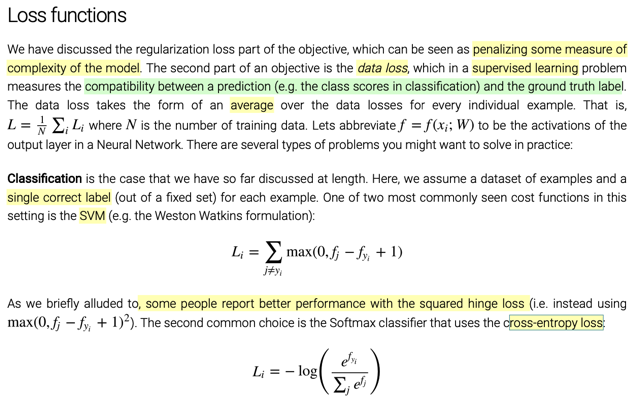</kbd>

> [!NOTE]
> đại ý:
>
> Loss function L sẽ là **trung bình (expected value)**của**các loss trên
> tất cả các data sample L(i)**
>
> Với bài toán classification, có hai loại hay dùng là **SVM loss** và **cross-entropy**
>
> Trước hết phải nhớ rằng trong bài toán này, model sẽ tính toán ra một **vector
> các "class scores"**, ví dụ bài toán có C = 10 class (category) thì có 10 scores.
> Đương nhiên với **mỗi data sample trong training set sẽ có một label, hay 
> "correct" class** (để dùng cho việc train model theo **supervised learning**)
>
> ===
>
> Với SVM loss, có thể hiểu L(i) ở trong hình là **tổng tất các khoảng cách** giữa
> **correct class score** (score gắn với correct class **f_y(i)**) và các **incorrect class
> score** (score model tính toán ứng với các incorrect class) **f_j** (j != y(i)) cộng thêm 
> **1 (delta, gọi là margin)**
>
> Việc giảm loss tức là **thay đổi params** sao cho model cho ra**score của correct
> class phải vượt lên bỏ xa các score của incorrect class một khoảng margin 
> c = 1**
>
> === 
>
> Với**cross entropy** loss, trước tiên chuyển các class score thành probability score 
> (normalizing với hàm softmax). Thì L(i) được diễn dịch là **negative log likelihood**
> tạm dịch là **khả năng xảy ra của true class** = **probability score của correct 
> class.**
> Nói nhanh về cross entropy: **H(p,q) sum x p(x)log q(x)** đo **mức divergence giữa 
> hai phân phối xác suất p và q**.
>
> trong bài toán classification có C = 10 class, sample thứ i:
>
> **phân phối xác suất thật** **p(x) là là one hot vector với số 1 ở vị trí y(i)
>
> phân phối xác suất tính toán q(x) hay p model x là y^(i)**
> nên cross entropy sẽ trở thành**- log y^(i)[y(i)]** hay - log probability model tính toán
> ứng với correct class = - log (e^correct class score f_y(i) / tổng j e^ class score j)
>
> việc giảm loss mang ý nghĩa là model sẽ đặt mục tiêu tính ra probability của 
> correct class ra tuyệt đối, của các incorrect class = 0

   

<kbd>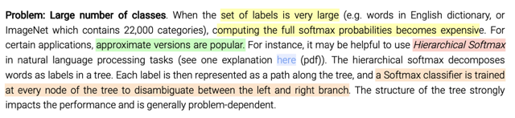</kbd>

> [!NOTE]
> hiểu đại khái là người ta sẽ làm sao đó để train ra một cái **binary tree**. để
> rồi từ cái cây này mà xác định ra cái đường đi từ đỉnh đến các lá cây ở
> tầng dưới cùng, có |W| lá cây.
>
> Để rồi từ đó tính xác suất của một class, sẽ tính theo cách nhân các xác
> suất của các node trên đường đi, mà việc này "nhẹ nhàng" hơn là tính
> bằng hàm softmax truyền thống khi mẫu số phải tính một loạt các phép
> tính (lũy thừa e^fy_j) ứng với mỗi class nên nếu số class nhiều thì sẽ rất 
> tốn kém về mặt tính toán.

   

<kbd>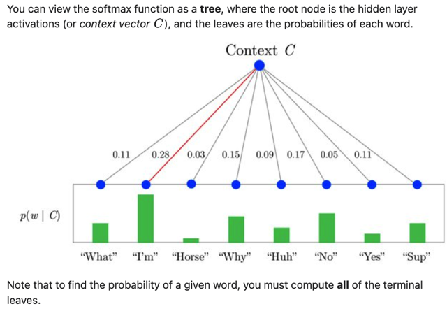</kbd>

> [!NOTE]
> https://www.quora.com/What-is-hierarchical-softmax
>
> https://research.google/blog/chat-smarter-with-allo/

   

<kbd>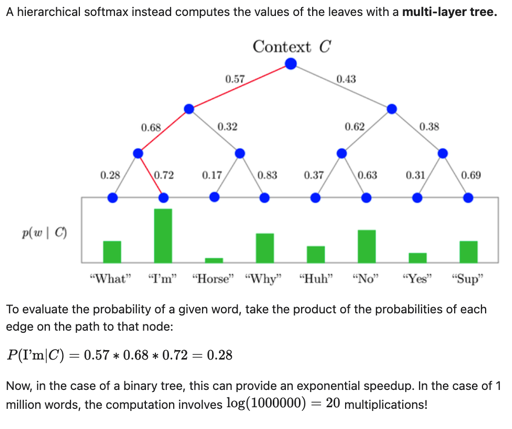</kbd>

> [!NOTE]
> có thể chưa hiểu hoàn toàn cái này nhưng tạm chú ý một ý
> này: cứ mỗi lần tính p('I'm' | C) thì phải tính 1000.000 phép
> tính lũy thừa e (để ra cái mẫu số trong hàm softmax)
>
> Trong khi đó nếu có thể (làm sao đó chưa biết) có một cái
> tree (tất nhiên để có cái tree như vậy thì cần tốn thêm các
> bước tính toán nào đó, có thể tìm hiểu Huffman tree sau) 
> nhưng sau đó chỉ cần nhân vài phép tính là ra p(' I'm' | C)

   

<kbd>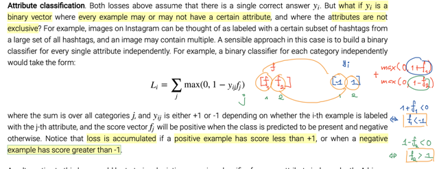</kbd>

> [!NOTE]
> đại khái là đặt vấn đề bài toán classification, sample
> target label không chỉ có một class mà có thể có nhiều class
> cái này chính là bài toán **multi label classification.**
>
> Cách một là tương tự svm classifier
>
> thì cách gán label và xây dựng loss có thể như sau:
> gán label là vector binary, mỗi value ứng với một class, đánh số 1 
> hoặc -1 để biểu thị sample có hay không thuộc class đó tạm gọi 
> là "class label" ví dụ sample thứ i, class thứ j: yij
>
> tính loss: với mỗi class tính max (0, 1- class_label yij nhân với
> fj là score model tính toán ra ứng với class j)
>
> Vậy cái này cũng có vẻ tương tự svm loss.
>
> Ví dụ yi là [-1 1] (thể hiện image thuộc class 2, không thuộc class 1)
> thì Li sẽ là max(0, 1+f1) + max(0, 1-f2). Để minimize loss, model
> sẽ phải thay đổi param sao cho tính toán ra 1+f1 =< 0 và 1-f2 <= 0
> tương đương với việc đẩy f1 xuống để <= -1 và f2 lên để >= 0

   

<kbd>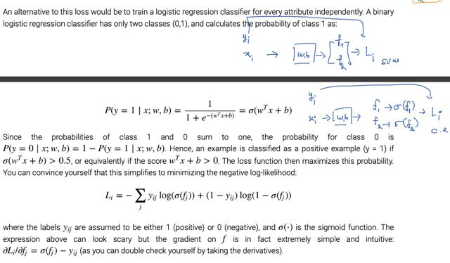</kbd>

> [!NOTE]
> cách thứ hai là dùng **probabilistic model** cụ thể là **logistic regression** bằng cách
> **chuyển các class score thành probability**p(y = 1, x, w, b) bằng hàm sigmoid và 
> dùng cross entropy loss.
>
> với cách này thì label sẽ gán 1 hoặc 0 (thay vì -1)
>
> Chú ý: Sở dĩ là dùng sigmoid chứ không phải softmax vì đây là bài toán multi-label
> classification, chứ không phải multi-class classification nên các class không loại trừ
> nhau (exclude) thành ra giống như ta đang dùng C (số class) binary classifier riêng
> lẻ thôi.
>
> Ví dụ model tính ra 2 class score f1, f2, qua sigmoid ra sigma(f1) và sigma(f2) thì
> hai chỉ số probability này không cần phải có tổng bằng 1 như bên bài toán softmax
> classifier.
>
> Và tính toán loss là tổng L1, L2 dùng binary cross entropy loss.

   

<kbd>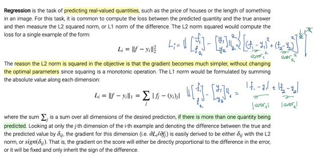</kbd>

> [!NOTE]
> một ý có thể gây khó hiểu, đó là ở đây người ta đang nói đến 
> bài toán  regression khái quát mà target yi là vector. 
>
> Ví dụ như dự đoán doanh thu VÀ lợi nhuận của một công ty có 
> các đặc điểm x(i) thì y(i) là vector chứa 2 target value y(i)1,y(i)2
>
> nên cost function khi triển khai sẽ là MSE_1 + MSE_2 với 
> MSE_1 = (1/N) sum i=1:N error(i)1^2 = [f(i)1 - y(i)1]^2
> MSE_2 = (1/N) sum i=1:N error(i)2^2 = [f(i)2 - y(i)2]^2
>
> Nếu là dùng L1 thì chính là MAE (Mean Absolute Error)

   

<kbd>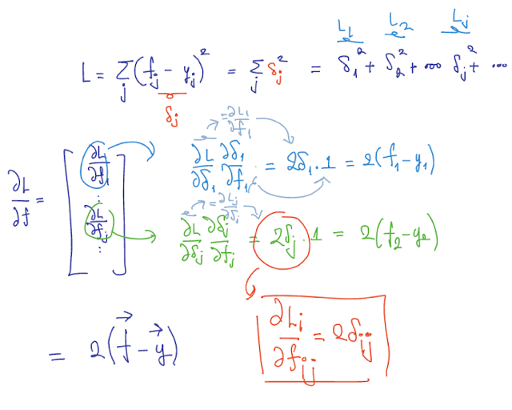</kbd>

   

<kbd>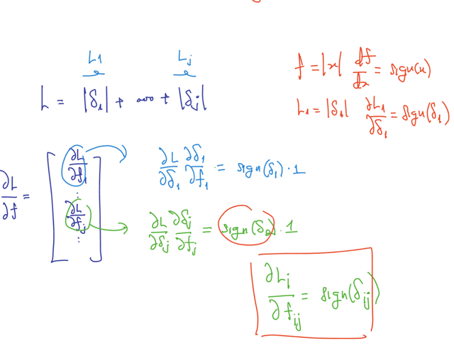</kbd>

   

<kbd>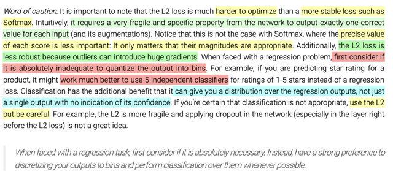</kbd>

> [!NOTE]
> đại ý là L2 loss khó train vì dễ mất ổn định nên nếu được thì hãy chuyển
> sang bài toán classification. Vì ngoài **lợi ích hàm softmax ổn định hơn** thì
> nó **còn cho ra một giá trị xác suất thể hiện mức độ tự tin** của model mà
> bài toán linear regression không có được. Còn nếu phải dùng bài toán
> regression thì **ưu tiên dùng L2 nhưng phải cẩn thận với kiến trúc model.**
> (ý này ở những tác giả khác không nói đến tính chất fragile của L2 loss
> mà chỉ cho biết rằng dùng l1 l2 là tùy bài toán cụ thể A.Geron)

   

<kbd>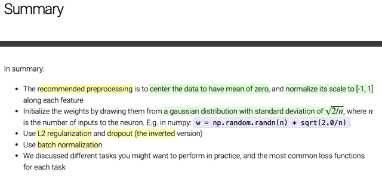</kbd>

   

