# Note - Neural Network Part 3

📊 **Progress:** `53` Notes | `70` Screenshots

---
<a id="node-689"></a>

<p align="center"><kbd>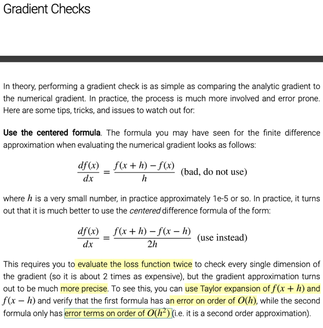</kbd></p>

> [!NOTE]
> Ôn lại về Taylor series: 
>
> Đại khái là f(x) có thể được triển khai thành một chuỗi các phép tính tại điểm a 
> như sau: 
>
> ```text
> f(x) = f(a) + SUM (1/n!)*[(x-a)^n]*f(n)(a)
> ```
>
> f(n)(a) là đạo hàm cấp n của f tại a.
>
> ví dụ triển khai cụ thể:
>
> ```text
> f(x) = f(a) + f'(a)*(x-a)^1/1! + f''(a)*(x-a)^2/2! + f'''(a)*(x-a)^3/3! + ...
> ```
>
> `====`
>
> Vậy áp dụng Taylor expansion vào để tính `f(x+h)` thành chuỗi Taylor quanh
> điểm x như sau, sẽ bằng:
>
> ```text
> f(x) + SUM f(n)(x)*[(x+h)-x]^n/n! = f(x) + SUM f(n)(x)*[h]^n/n!
> ```
>
> Ví dụ triển khai cụ thể:
>
> ```text
> f(x) + f'(x)*h + f''(x)*h^2/2! + f'''(x)*h^3/3! + ...
> ```
>
> ```text
> và ta có thể ghi là: O(h^4) = f(4)(x)*h^4/4! + f(5)(x)*h^5/5! + ...sẽ mang giá trị
> ```
> là truncation error `-` sai sót gây ra nếu cắt bỏ đi các term từ order 4 trở lên
>
> f(x) `+` f'(x)*h `+` `f''(x)*h^2/2!` `+` `f'''(x)*h^3/3!` `+` **O(h^4)** với ý nghĩa rằng, n**ếu cắt tại
> đây 3rd order term, không triển khai nữa** thì có thể coi như **sai số là theo hàm
> mũ 4 của h, nếu h nhỏ dần thì sai số sẽ nhỏ lại theo tỉ lệ thuận với h^4**- Có 
> nghĩa là error sẽ giảm rất nhanh khi h nhỏ lại.
>
> `====`
>
> Tương tự áp dụng Taylor expansion vào để tính `f(x-h):`
>
> ```text
> = f(x) + SUM f(n)(x)*[(x-h)-x]^n/n! = f(x) + SUM f(n)(x)*(-h)^n/n!
> ```

> [!NOTE]
> đại ý là nói về gradient check một hoạt động đã quen thuộc, chỉ có đáng chú
> ý là ở đây cho biết có thể dùng Taylor series để chứng minh centered
> difference gradient chính xác hơn forward difference gradient formula cho
> nên nên dùng cái đó

<br>

<a id="node-690"></a>

<p align="center"><kbd>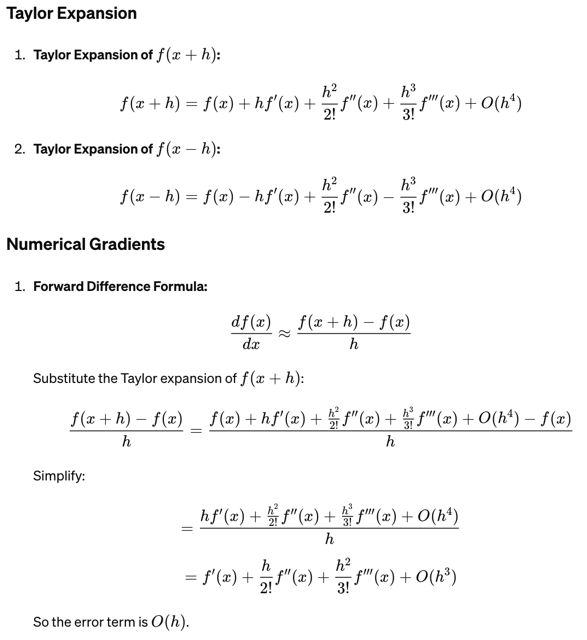</kbd></p>

> [!NOTE]
> triển khai Taylor series với `f(x+h)` và `f(x-h)` như đã hiểu, thay vào công thức 
> tính đạo hàm xấp xỉ (theo cách thứ nhất `-` forward difference formula) cho thấy 
>
> ```text
> f'(x)_approximated = [f(x+h)-f(x)]/h = f'(x) + h*f''(x)/2! + h^2*f'''(x)/3! + O(h^3)
> ```
> có nghĩa là sai số khi tính đạo hàm bằng phương pháp xấp sỉ này là:
>
> ```text
> f'(x)_approx - f'(x) =  h*f''(x)/2! + h^2*f'''(x)/3! + O(h^3) ~= O(h). Đồng nghĩa
> ```
> rằng h càng giảm thì sai số sẽ giảm theo tốc độ là tỉ lệ thuận với h

<br>

<a id="node-691"></a>

<p align="center"><kbd>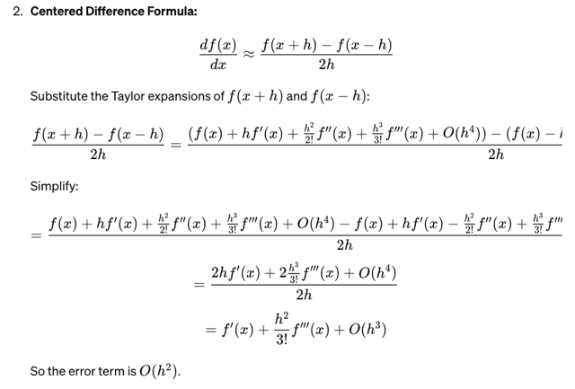</kbd></p>

> [!NOTE]
> còn trong khi đó với centered difference formula ta có sai số giữa
> f'(x) approx và f'(x) sẽ là O(h^2)  chứng tỏ rằng nó có sai số nhỏ
> hơn là của forward difference formula

<br>

<a id="node-692"></a>

<p align="center"><kbd>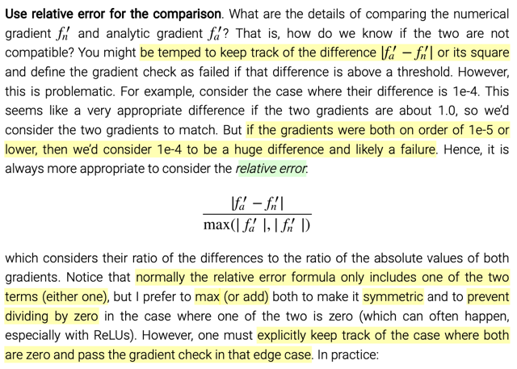</kbd></p>

> [!NOTE]
> đại ý là khi tính ra numerical gradient và analytic gradient thì check thế nào.
> Vậy thì không đơn giản là chỉ **tính norm của difference hai thằng đó rồi so
> với một threshold nhỏ nào đó** là được Vì difference có thể n**hỏ trong
> trường hợp này nhưng lại lớn trong trường hợp khác.**
>
> Do đó phải **so difference một cách tương đối với độ lớn của hai gradient**.
> Với lưu ý rằng phải check xem liệu cả hai đều bằng 0 không, khi đó thì pass
> test case (nếu không sẽ bị lỗi chia 0).

<br>

<a id="node-693"></a>

<p align="center"><kbd>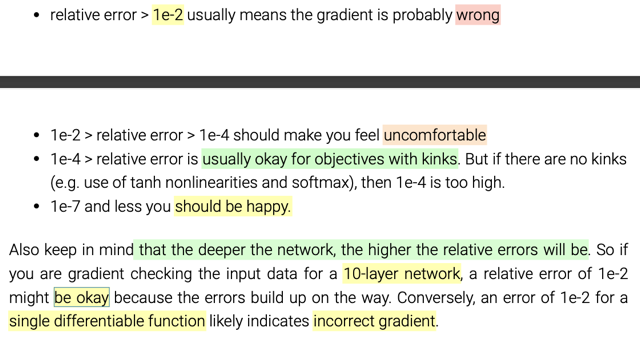</kbd></p>

> [!NOTE]
> kink: là các điểm mà function `non-differentiable,` ví dụ như xài tanh hay
> softmax thì no kink. Một số tạm gọi là threshold để mà đánh giá relative
> error
>
> Lưu ý nữa đó đại khái là model càng sâu thì relative error càng lớn, tức là
> cùng một mức relative error ví dụ `10^-2` nếu trên một model  nhiều layer thì
> có nghĩa là ok vì error cộng dồn qua nhiều layer còn nếu trên một layer thì
> có nghĩa là đang tính sai

<br>

<a id="node-694"></a>

<p align="center"><kbd>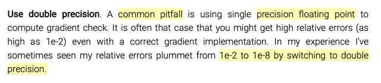</kbd></p>

> [!NOTE]
> Kinh nghiệm cho thấy nên dùng double precision float, vì
> dùng single precision có thể cho relative error lớn

<br>

<a id="node-695"></a>

<p align="center"><kbd>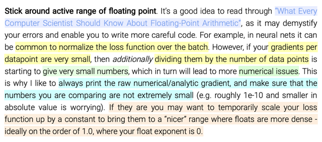</kbd></p>

> [!NOTE]
> Đại ý là trong quá trình tính toán, nếu gradient quá nhỏ sẽ gây vấn đề
> (numerical issue). Thông thường khi tính loss (và gradient) ta sẽ  tính trung
> bình trên một batch, nên nếu gradient nhỏ thì chia với batch size sẽ còn trở
> nên nhỏ hơn nữa.
>
> Do đó lời khuyên đưa ra đó là luôn in giá trị gradient kể cả numerical hay
> analytical ra khi so sánh hai cái đó trong lúc gradient check để theo dõi. Nếu
> giá trị quá nhỏ cỡ dưới `10^-10` thì có thể xử lý bằng cách tạm thời scale up
> loss function lên (nhân cho một factor) để gradient trở nên ở trong một khoảng
> an toàn, lí tưởng là order of 1.0, float exponent là 0 (tức là các số ở khoảng 0.
> 1, 0.2 ... 2.0, 3.0)

<br>

<a id="node-696"></a>

<p align="center"><kbd>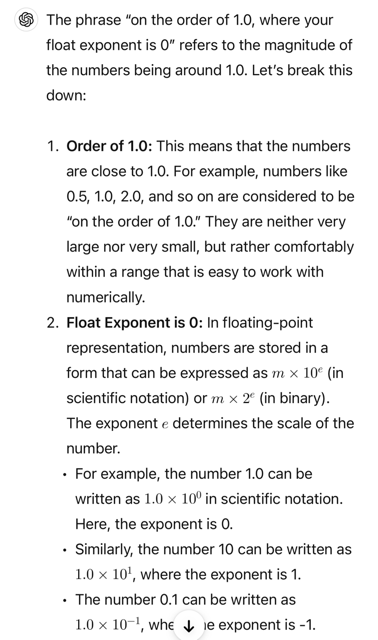</kbd></p>

> [!NOTE]
> Order of 1.0 có nghĩa là các con số có
> giá trị gần 1.0
>
> exponent of 0. tức là 10^0 `=` 1

<br>

<a id="node-697"></a>

<p align="center"><kbd>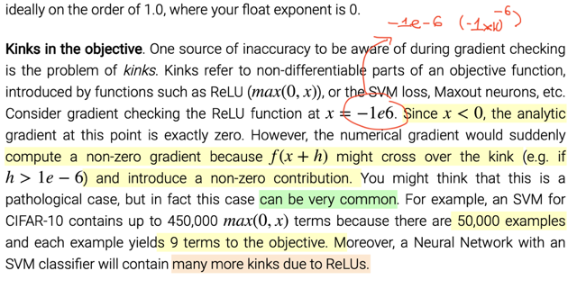</kbd></p>

> [!NOTE]
> Đại ý là nói về kinks: ám chỉ cái điểm của function mà có tính chất
> không tính đạo hàm được `(non-differentiable` point) vì sự thay đổi đột 
> ngột. 
> Ví dụ điểm giao tại 0 của hàm relu hay các bước tính toán có hàm max(). 
> Những chỗ này có thể là nguồn gây ra sự không chính xác trong tính toán.
>
> Ví dụ trong hàm max(0,x) cái này có thể là hàm reLu activation function,
> hoặc khi tính toán SVM loss, thì nếu x âm nhưng mang giá trị nhỏ ví dụ
> ```text
> -1e-6 (-1*10^-6) thì gradient tính ra sẽ bằng 0 (và đây là analytic gradient)
> ```
>
> ```text
> Nhưng khi tính numerical gradient = [f(x+h) - f(x-h)]:2h thì nếu h lớn hơn
> ```
> ```text
> 1e-6 thì f(x+h) sẽ ra bằng x+h vì x+h > 0, x-h vẫn âm nên f(x-h) = 0 thành ra
> ```
> gradient tính ra sẽ khác 0. Từ đó gây ra sai lệch giữa numerical gradient
> và analytical gradient.
>
> `===`
>
> Cuối cùng người ta dẫn chứng là sẽ có rất nhiều phép tính như vậy chứ 
> không phải hiếm gì. Lấy ví dụ bài toán SVM classification, thì mỗi sample 
> khi qua model để tính toán cho ra 10 class scores. Bỏ vào tính SVM loss,
>
> ```text
> L(i) = Sum j!=y(i) max(0, s_j - s_i + 1)
> ```
>
> Tức là trong việc tính L(i) gồm (số class `-` 1) phép tính max(0,x). Nên với 10
> class của bộ dataset CIFAR10, sẽ là 9 phép tính trong mỗi lần tính loss của
> một data sample. Với 50.000 sample. Con số này sẽ là 450.000
>
> Và dễ hiểu với neural network, các hidden layer có reLu activation function
> thì còn nhiều hơn nữa

<br>

<a id="node-698"></a>

<p align="center"><kbd>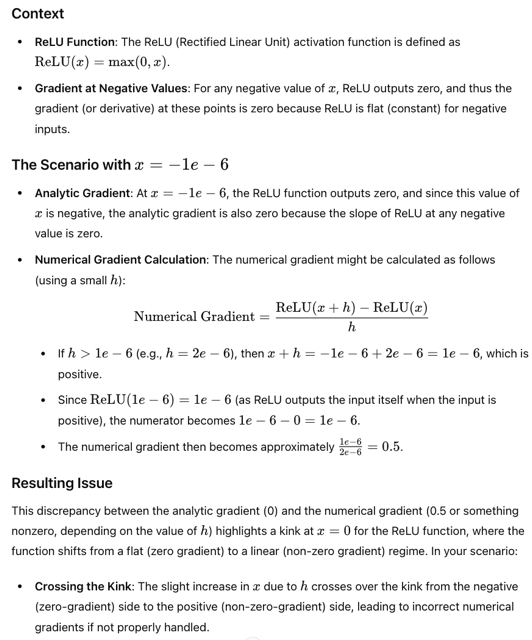</kbd></p>

> [!NOTE]
> nếu x `=` `-1e-6,` a.gradient tính ra `=` **0** (hàm reLU, x < 0 thì
> reLu(x) `=` 0, slope `=` 0)
>
> Nhưng khi tính n.gradient với h nhỏ `=` `2e-6` thì ra **0.5**

<br>

<a id="node-699"></a>

<p align="center"><kbd>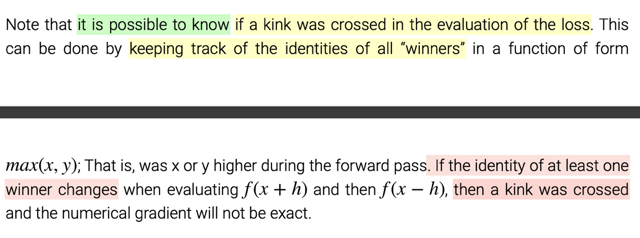</kbd></p>

> [!NOTE]
> đại ý là ví dụ ta đang tính analytical gradient, của function max(0, x) và thấy 
> rằng vì x nhỏ hơn 0, nên gradient là 0. Đồng thời ta sẽ ghi nhận 0 là winner.
>
> Sau đó ta tính numerical gradient. Bằng cách lần lượt tính `f(x+h)` là max(0, `x+h)`
> và `f(x-h)` là max(0, `x-h).`
>
> Thế thì nếu trong hai phép tính này nếu ta thấy có trường hợp x "thắng" thì 
> chứng tỏ có sự "cross the kink". Ví dụ:
>
> *Ví dụ trường hợp xảy ra "cross the kink":
>
> ```text
> x = -1e-6, h = 2e-6 (là ví dụ ở trên)
> ```
>
> max(0,x) thì 0 là winner vì x < 0
>
> ```text
> còn khi tính max(0, x+h) với x+h = -1e-6 + 2e-6 = 1e-6 > 0, nên x là winner
> ```
> vậy thì khỏi cần xét max(0, `x-h)` việc đổi ngôi winner này từ 0 sang bên x `(x+h)` 
> là dấu hiệu của việc "cross the kink"
>
> *Ví dụ không xảy ra "cross the kink":
>
> ```text
> x = -3e-6, h = 2e-6 thế thì max (0,x) 0 là winner
> ```
> Nhưng max(0, x `+` h) thì 0 vẫn là winner vì x `+` h vẫn chưa lớn hơn 0 nên
> ở trường hợp này không xảy ra "cross the kink"

<br>

<a id="node-700"></a>

<p align="center"><kbd>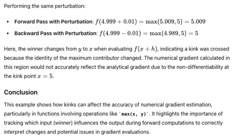</kbd></p>

<p align="center"><kbd></kbd></p>

<p align="center"><kbd>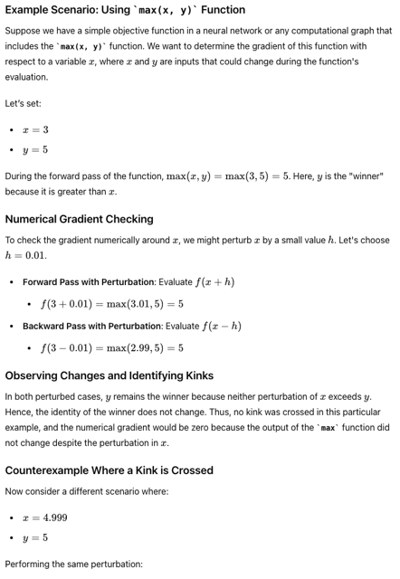</kbd></p>

<br>

<a id="node-701"></a>

<p align="center"><kbd>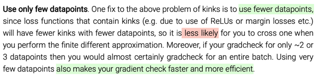</kbd></p>

> [!NOTE]
> đại ý là đề xuất ta thực hiện việc gradcheck với ít data point thôi thay vì tính
> toán trên một batch mấy chục sample thì có thể tính với 2,3 cái thôi. Như
> vậy thì ít lần tính toán với max() lại thì ít dễ xảy ra vấn đề "cross the kink"
> vậy thôi.
>
> Ngoài ra nó còn giúp việc tính toán nhanh hơn

<br>

<a id="node-702"></a>

<p align="center"><kbd>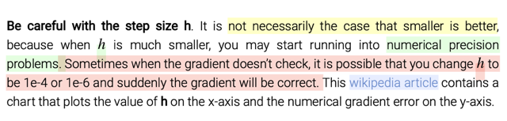</kbd></p>

> [!NOTE]
> cần chọn h sao cho không
> quá lớn, ko quá nhỏ

<br>

<a id="node-703"></a>

<p align="center"><kbd>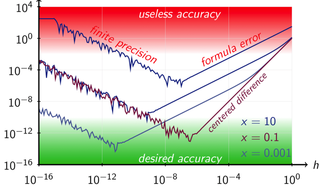</kbd></p>

> [!NOTE]
> từ wiki page,
>
> ```text
> https://en.wikipedia.org/wiki/Numerical_differentiation
> ```
>
> trục tung là accuracy.  Khi dùng h lớn nhỏ khác nhau, đồ thị
> cho thấy h lớn quá thì không tốt mà nhỏ quá cũng không được.
>
> Có thể dễ hiểu, h lớn quá thì việc ước lượng (tính  gradient
> approximation bằng numerical gradient) sẽ không chính xác
> (gọi là formula error)
>
> Nhưng h nhỏ qua sẽ gây sai sót do vấn đề numerical
> precision.
>
> Ta muốn chọn h sao cho accuracy rơi vào vùng "desired
> accuracy"

<br>

<a id="node-704"></a>

<p align="center"><kbd>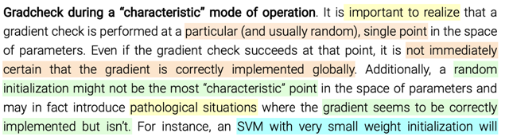</kbd></p>

> [!NOTE]
> đầu tiên đại ý nói là gradcheck chưa chắc là hoàn toàn tin cậy bởi vì kiểu như
> ta chỉ đang kiểm tra bằng cách tính toán trên một điểm cụ thể nào đó, nên
> chưa chắc nó sẽ đúng trên toàn bộ. Ví dụ như khi gradcheck ta tính analytic
> gradient `(dJ/dtheta)` tại một điểm theta, và so với numerical gradient tại theta
> thì  nôm na là không chắc rằng việc tính analytic gradient có đúng với mọi
> miền của hàm f hay ko.
>
> Chưa kể, việc khởi tạo giá trị ban đầu của theta (weight initialization) cũng
> chưa chắc là tạo ra một điểm mang tính chất đại diện nhất trong không gian
> parameters vector, do đó nó có thể dẫn đến một trạng thái bệnh lí
> (pathological situation) là gradcheck ok nhưng thực tế đang không đúng.

<br>

<a id="node-705"></a>

<p align="center"><kbd>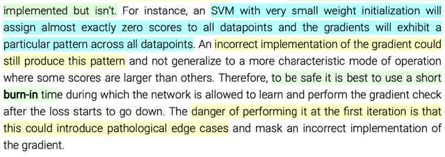</kbd></p>

> [!NOTE]
> đại khái là ví dụ svm classifier khi được khởi tạo với weight value nhỏ có thể
> dẫn tới tình trạng ban đầu gradient trên các datapoint rất giống nhau 
>
> Và việc thực hiện gradient check ở giai đoạn này có thể gây sai sót, không
> phát hiện được vấn đề. Do đó họ đề nghị là để một giai đoạn `burn-in,` cho phép
> neural net learning và chỉ thực hiện `grad-check` khi loss bắt đầu giảm

<br>

<a id="node-706"></a>

<p align="center"><kbd>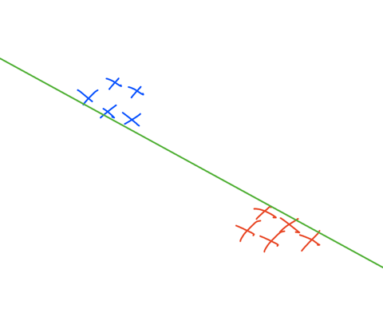</kbd></p>

<p align="center"><kbd></kbd></p>

<p align="center"><kbd>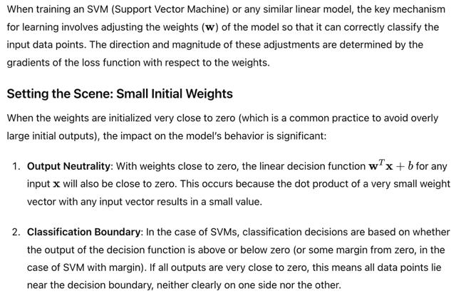</kbd></p>

> [!NOTE]
> Đại khái là nếu weight được initialized nhỏ, thì `w_T@x` `+` b tức output  cũng
> sẽ nhỏ.
>
> Đương nhiên output cũng là score (trong svm classifier, ta sẽ tính các
> class scores qua phép tính `w_T@x` `+` b)
>
> Vậy dẫn đến tình trạng là **các class scores đều nhỏ** (lớn hơn hoặc bé
> hơn) quanh quẩn mức 0.
>
> Và mọi sample sẽ đều bị như vậy mà điều này sẽ phản ánh tình trạng của
> decisive boundary có tính chất là nó sẽ không cách xa mấy các data points.

<br>

<a id="node-707"></a>

<p align="center"><kbd>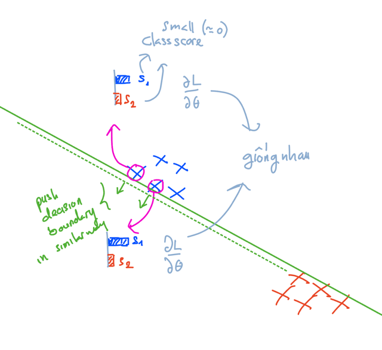</kbd></p>

<p align="center"><kbd></kbd></p>

<p align="center"><kbd>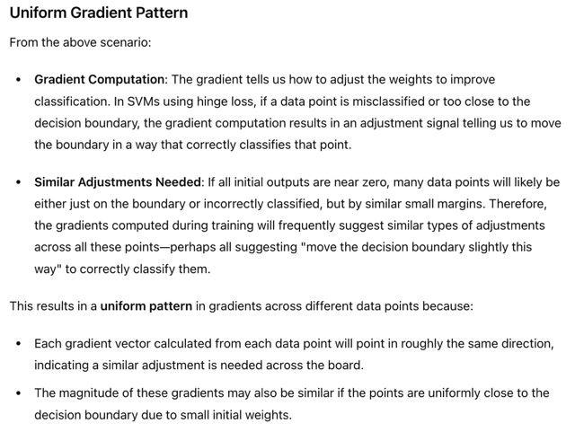</kbd></p>

> [!NOTE]
> vậy đại khái là khi các điểm đều nằm trên hoặc sát decision boundary
> thì kiểu như tụi nó sẽ hành xử rất giống nhau trong việc tác động đến
> việc thay đổi decision boundary trong quá trình training.
>
> Và đó chính là ý họ nói về **uniform gradient pattern.**Hành xử ở đây ý là khi tính loss trên các sample đó, rồi tính gradient, 
> tức đạo hàm của loss function w.r.t parameter sẽ giống giống nhau.
> Đều hướng thay đổi đến param theo cùng một cách

<br>

<a id="node-708"></a>

<p align="center"><kbd>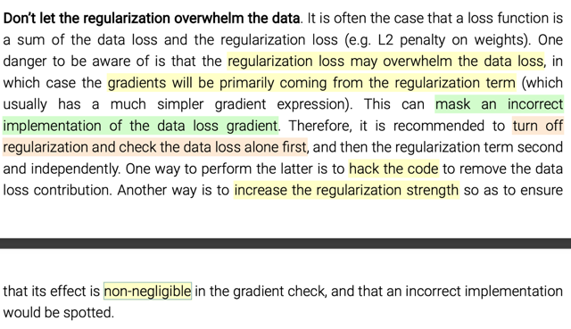</kbd></p>

> [!NOTE]
> Cái này thì dễ hiểu, đại khái là nếu regularization loss mà vượt trội so với main
> loss thì gradient từ nó cũng vượt trội dẫn đến khi grad check có thể ta đang
> làm sai analytic main gradient (nhưng đúng đối với regularization gradient vì
> nó đơn giản hơn) nhưng lại không phát hiện ra
>
> Nên cách làm là 1. bỏ regularization loss một cách thủ công bằng cách sửa
> code khi grad check hoặc 2. tăng lambda `-` regularization strength lên để khiến
> regularization loss không làm mờ `đi/bỏ` qua sự tính sai của main gradient trong
> quá trình gradcheck

<br>

<a id="node-709"></a>

<p align="center"><kbd>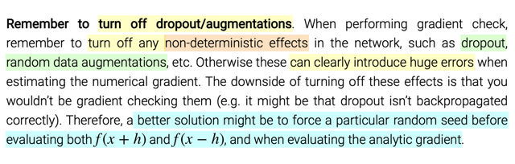</kbd></p>

> [!NOTE]
> chú ý tiếp theo là nên về tác động của các quá trình có tính ngẫu nhiên như
> dropout, augmentation sẽ có thể khiến gradient check không chính xác. Dể
> hiểu là vì những cái này mỗi lần forward là nó mỗi khác.
>
> Vậy cách thứ nhất là tắt đi khi `grad-check,` nhưng làm vậy thì nhược điểm là
> không phát hiện được sai sót trong việc tính analytic gradient của dropout.
>
> Cách thứ hai tốt hơn là dùng một giá trị cố định của random seed trong lúc
> `grad-check` để kiểu như mỗi lần dropout hay bước tính toán nào có yếu tố
> ngẫu nhiên đều ra cùng kết quả

<br>

<a id="node-710"></a>

<p align="center"><kbd>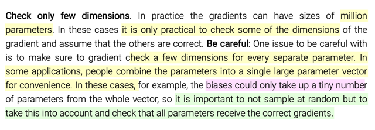</kbd></p>

> [!NOTE]
> đại khái là vì model có thể có hàng triệu parameters, tạo thành một vector có
> hàng triệu dimension, nên tương ứng vector gradient derivative of loss w.r.t
> parameters cũng sẽ có hàng triệu dimension.
>
> Vậy khi thực hiện `grad-check` sẽ chỉ có thể làm với một số lượng nào đó các
> params, đại khái là ta sẽ sampling các params được check, theo ý nghĩa đó
> thì ta sẽ chọn một vài dimension của gradient vector để check.
>
> Vậy một điểm chú ý đó là số lượng bias nhỏ so với weight, nên khi sampling
> ngẫu nhiên sẽ ít khả năng "trúng" bias hơn nên người ta khuyên nên có cách
> tiếp cận sao cho tính tới việc này

> [!NOTE]
> vẽ thêm hình minh họa thể hiện vector gradient chứ tất cả
> partial derivative of model's params

<br>

<a id="node-711"></a>

<p align="center"><kbd>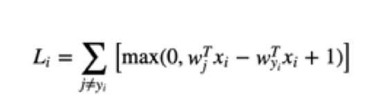</kbd></p>

<p align="center"><kbd>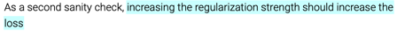</kbd></p>

<p align="center"><kbd></kbd></p>

<p align="center"><kbd></kbd></p>

<p align="center"><kbd>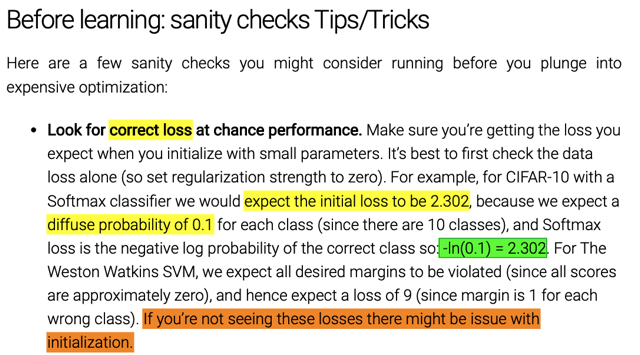</kbd></p>

> [!NOTE]
> Đại ý là trước khi bắt đầu training nên check mức giá trị của loss khi ban đầu
> các giá trị parameter được khởi tạo như vậy
>
> Thế thì nếu là model train với CIFAR10 dataset và negative log likelihood loss
> thì giá trị của loss nên là 2.3. Lí do là vì với các giá trị param được khởi tạo
> random thì kiểu như sự dự đoán ban đầu của model là hoàn toàn ngẫu nhiên,
> đồng nghĩa với một mẫu dữ liệu đưa vào thì xác suất mà nó tính toán ra cho
> các class đều phải như nhau, tức là đều là 10%. Vậy loss trên một mẫu dữ
> liệu theo hàm cross entropy sẽ là `-` log probability of correct class `=` `-` log 0.1
>
> Và tính trung bình dĩ nhiên cũng vậy nên loss sẽ có giá trị `-log` 0.1 `=` 2.3
>
> `===`
>
> Với **SVM** thì loss trên một sample là Sum `j!=y(i)` max(0, `s_j` `-` `s_y(i)` `+` 1) diễn
> đạt là: trong số các score mà model gán cho wrong class, cái nào mà có
> khoảng cách so với correct score vẫn nhỏ hơn 1 thì ghi nhận khoảng  cách
> đó là loss, còn không thì thôi.
>
> Nên khi ban đầu với các param khởi tạo ngẫu nhiên nhỏ, các score cho cả
> correct class và incorrect class đều rất nhỏ xấp xỉ 0. Nên đương nhiên  `s_j` `-`
> `s_y(i)` `+` 1 `~=` 1. Do đó nếu là CIFAR10 thì loss trên 1 sample sẽ là 9 (9 wrong
> class)
>
> `===`
>
> nếu loss ban đầu mà không như vậy thì có thể đã sai ở đâu đó
>
> Ngoài ra nhớ đây chỉ là đang nói về main loss, nên phải nhớ tắt regularization đi,
> và n**ếu bật regularization lên thì đương nhiên ta expect loss sẽ tăng**

<br>

<a id="node-712"></a>

<p align="center"><kbd>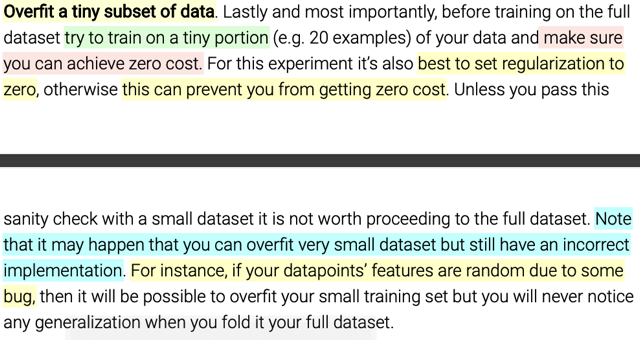</kbd></p>

> [!NOTE]
> Đại ý là trước khi train với toàn bộ dataset thì thử train trên bộ nhỏ data.
> Mục đích là để coi thử với ít data thì model có dễ dàng bị overfit không
> (Loss `=` 0)
>
> Do đó đương nhiên cũng phải tắt regularization đi vì dễ hiểu là nó sẽ
> ngăn model bị overfit.
>
> *Tuy nhiên cũng có chú ý là ngay cả khi thấy model bị overfit thì cũng còn
> khả năng là có lỗi trong số ít dữ liệu đó

<br>

<a id="node-713"></a>

<p align="center"><kbd>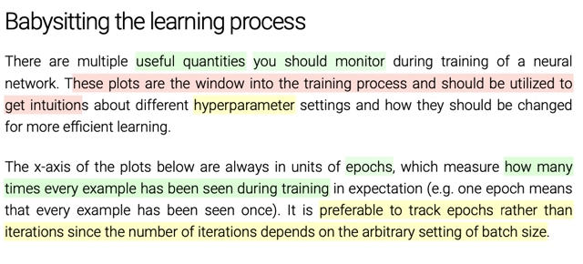</kbd></p>

> [!NOTE]
> Đầu tiên đại ý là việc xem xét một số chỉ số trong quá trình training 
> rất hữu ích. Và nên tracking theo epoch. Một epoch là khi quá trình
> training đã đi qua toàn bộ training set. Khác với iteration thì tùy thuộc
> vào batch size

<br>

<a id="node-714"></a>

<p align="center"><kbd>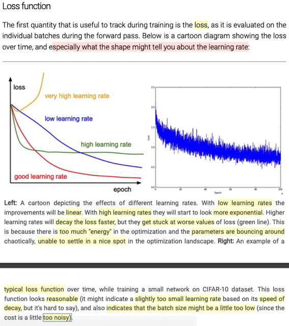</kbd></p>

> [!NOTE]
> đầu tiên là xem loss, giúp ta nhận định được mức learning rate đang
> cao hay thấp.
>
> Nếu loss xuống theo đường có vẻ tuyến tính, có nghĩa là l.r đang thấp
> `-` loss xuống chậm. Lr cao hơn sẽ khiến đường đi có vẻ giống  đường
> exponential.
>
> Rồi lr nếu cao thì có thể dẫn đến tuy giúp loss giảm nhanh nhưng lại
> converge ở mức loss cao, là bởi theo sách nói là quá nhiều năng
> lượng khiến giá trị của param cứ nhảy qua nhảy lại mức tối ưu, để rồi
> vector param cứ lòng vòng quanh chứ không settle down ở điểm tối ưu
> của  optimization landscape.
>
> Hình bên phải là một điển hình của loss trong quá trình training. Có thể
> nhận định hoặc nghi ngờ lr đang thấp do đường đi xuống có vẻ tuyến
> tính. Và sự noisy có thể cho biết batch size đang nhỏ quá

<br>

<a id="node-715"></a>

<p align="center"><kbd>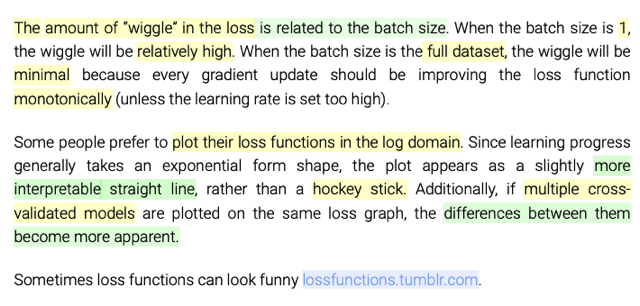</kbd></p>

> [!NOTE]
> Đại ý là độ noisy sẽ cho ta dấu hiệu rằng batch size nhỏ hay lớn quá.
> Như đã biết với SGD thì gradient chỉ đang là gradient approximation
> Do đó batch size càng nhỏ thì sự approximation càng ít chính xác.Dẫn
> đến độ wiggly. Và ngược lại nếu với full batch thì đường đi sẽ rất smooth
> (ở đây nói gradient giúp loss giảm một cách đơn điệu monotonically)

<br>

<a id="node-716"></a>

<p align="center"><kbd>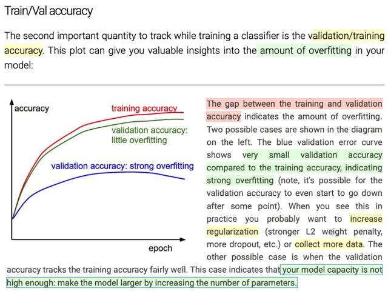</kbd></p>

> [!NOTE]
> đại ý là ta sẽ theo dõi khoảng cách giữa accuracy (hoặc loss) giữa training
> set và validation set
>
> Nếu val perfomance bám sát training performance có nghĩa là model đang
> underfit và có thể tăng khả năng của model hơn nữa (bằng cách giảm
> regularization, dùng model phức tạp hơn (nhiều layer, neuron)
>
> Ngược lại nếu có khoảng cách lớn giữa validation và training set chứng tỏ
> model bị overfit. Cần tăng regularization hoặc tăng số lượng data

<br>

<a id="node-717"></a>

<p align="center"><kbd>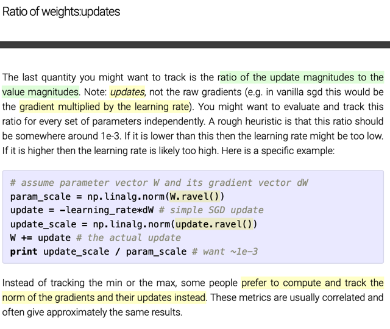</kbd></p>

> [!NOTE]
> đại ý là ta cũng sẽ theo dõi độ lớn của khoảng thay đổi của param so với độ lớn
> param. Tức là độ lớn của gradient sau khi nhân với learning rate với độ lớn của
> weights.
>
> Nếu tỉ lệ này quá nhỏ (< `1e-3)` thì có nghĩa là learning rate đang nhỏ quá, ngược
> lại sẽ cho biết learning rate đang lớn qúa.
>
> Đoạn code ví dụ cho thấy họ tính norm của weight matrix, hàm ravel là chuyển
> từ matrix thành vector thôi không có gì. Sau đó là tính norm của vector gradient
> sau khi đã nhân với learning rate

<br>

<a id="node-718"></a>

<p align="center"><kbd>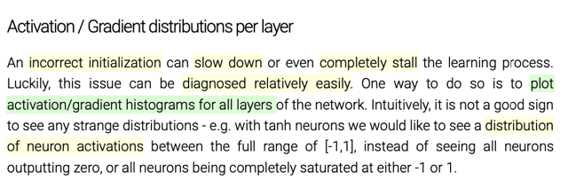</kbd></p>

> [!NOTE]
> đại khái là để thẩm định xem có vấn đề gì liên quan tới weight
> initialization hay không thì ta có thể plot histogram của activation của
> mọi layer ra. Cái này ở trong bài giảng cũng đã thấy. Bằng việc này
> ta có thể phát hiện hiện tượng gradient **vanishing** `/` **exploding** nếu
> thấy output của layer `~=` 0 (histogram sẽ có dạng cái cột ốm dần)
> hoặc `~=` `-1` và 1

<br>

<a id="node-719"></a>

<p align="center"><kbd>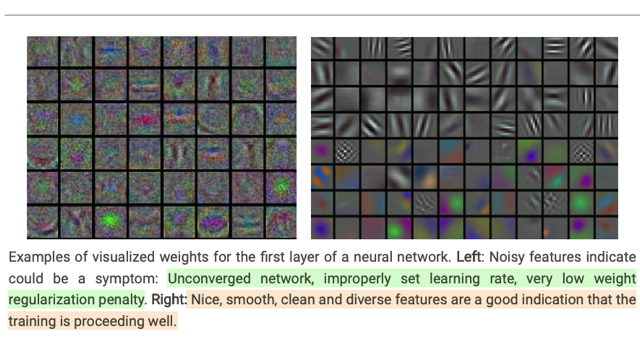</kbd></p>

<p align="center"><kbd></kbd></p>

<p align="center"><kbd>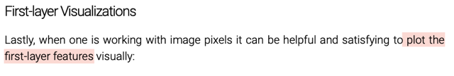</kbd></p>

> [!NOTE]
> một cách làm hay nữa là plot feature của first layer, ý là ta sẽ visualize
> các weight matrix của convolutional layer đầu ra với ý tưởng chính là,
> nếu nó cho thấy những pattern rõ ràng, và đa dạng chứng tỏ model
> đang học tốt

<br>

<a id="node-720"></a>

<p align="center"><kbd>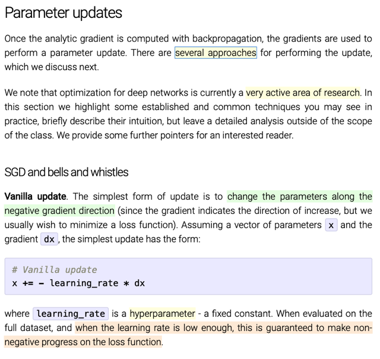</kbd></p>

> [!NOTE]
> đại ý là sẽ chỉ nói vài cách tiếp cận trong vấn đề optimization `-` dùng gradient
> để thay đổi parameters. Với vanilla SGD thì chỉ là dùng (negative) gradient
> scaled bởi một learning rate để update params.
>
> Như đã biết, gradient thể hiện hướng thay đổi param sao cho function tăng
> lên, nên update params theo hướng ngược lại sẽ giúp giảm loss function.
> Learning rate để khống chế bước update để giúp "bước đi" không quá lớn
> gây mất ổn định và cũng như đã học, vì cơ bản ta đang dùng "1st order"
> optimization (xem lại note của lecture 7) nên chỉ là đang ước lượng. Do đó
> cần phải bước đi, dò dẫm từng bước

<br>

<a id="node-721"></a>

<p align="center"><kbd>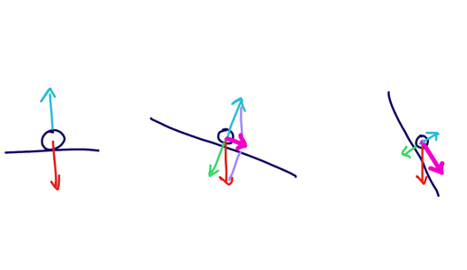</kbd></p>

<p align="center"><kbd></kbd></p>

<p align="center"><kbd>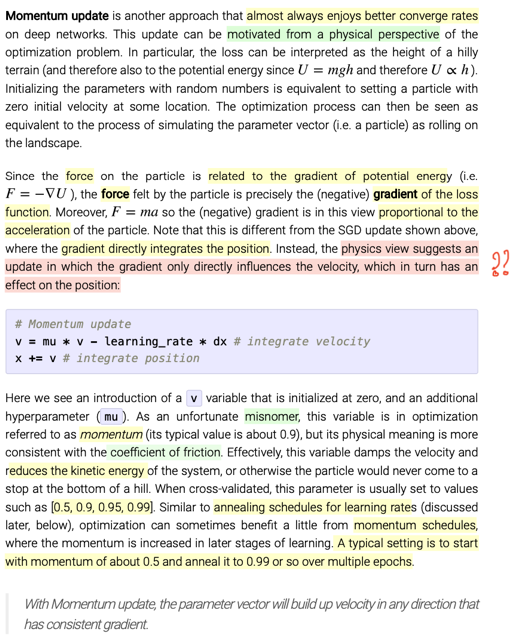</kbd></p>

> [!NOTE]
> đoạn đầu tạm dịch đại khái là phương pháp momentum được lấy
> cảm hứng của vật lý. Trong đó, loss coi như **chiều cao** của một
> con đồi cao, càng cao thì **mức năng lượng (thế năng)** càng lớn.
> Việc khởi tạo param random giống như việc ta đặt một hạt với **vận
> tốc ban đầu bằng 0**, tại một điểm ngẫu nhiên nào đó. Thế thì quá
> trình optimization có thể được hiểu `/` xem như mô phỏng cái hạt
> (particle) khi nó lăn xuống
>
> Vậy liên hệ **độ dốc (gradient) sẽ tỉ lệ với lực (force),** hình dung là
> **độ dốc lớn thì kiểu như lực kéo tác động lên viên bi sẽ lớn** dẫn đến
> tạo ra gia tốc, tức tăng vận tốc của viên bi về hướng đó. Đây là cách
> nói đồng nghĩa với việc thay đổi vị trí của viên bi theo hướng của
> gradient
>
> Chỉ khác là bây giờ, sinh ra một khái niệm là **vector quán tính**, nó
> sẽ " **được cập `nhật/` được tích hợp**" **bởi vector gradient (hiểu
> nôm na là vector gradient sẽ giúp bẻ lái vector quán tính một chút,
> nếu nó khác hướng, còn nếu nó cùng hướng thì nó giúp vector quan
> tính mạnh thêm mang hiệu quả "lăn nhanh về hướng đúng")**,  trước
> khi dùng nó để dẫn dắt viên bi
>
> `====`
>
> Có thể trước giờ mình nghĩ về gradient là **hướng có độ dốc lớn
> nhất** có thể gây khó hiểu một chút, vì hướng là thứ hơi trừu tượng,
> với việc giá trị của parameters sẽ biểu thị vị trí của viên bi trong
> không gian optimization landscape thì gradient `-dw` **nên được hiểu
> là vector thay đổi theo hướng có độ dốc lớn nhất** Hay có thể hiểu là
> "cái đoạn đường (bao gồm hướng đi" mà nếu đi theo sẽ giúp xuống
> dốc nhanh nhất). Chỉ hơi khác một chút nhưng cách hiểu này toát lên
> ý nghĩa đây là phản ánh khoảng thay đổi của vị trí được đề xuất
>
> Định nghĩa như vậy để thấy dw là chỉ một vector, thể hiện hướng và
> độ lớn để mà thay đổi param. Và khi ta dùng nó trong vanilla gradient
> descent thì ta dùng l. r để kiểu như chỉ đi một bước nhỏ theo hướng
> đó thôi.
>
> Vậy với momentum, v `=` mu*v `-` lr.dx sẽ kiểu như cho mình một cái
> hướng tạm gọi là **vector quán tính.** Và mỗi lần, **ta giảm nó lại một
> chút bằng friction rate mu**đồng thời**cộng thêm cái hướng của
> Vector gradient**để mang ý nghĩa là à,**điều chỉnh lại**một chút bằng cách
> **giảm lại ở hướng đang có** và **kết hợp (bẻ lái) một chút qua hướng
> dựa vào gradient**

> [!NOTE]
> Vector màu hồng thể hiện độ dốc lớn, "lực gradient" (tạm gọi
> là vậy để chỉ lực kéo gây nên bởi độ dốc, tất nhiên theo vật lí
> thì nó là trọng lực, chiếu lên hướng đường đi) sẽ lớn

<br>

<a id="node-722"></a>

<p align="center"><kbd>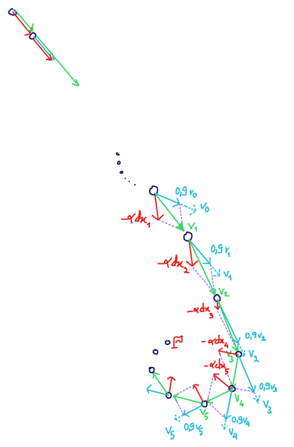</kbd></p>

> [!NOTE]
> Ban đầu, cho viên bi tại một điểm ngẫu nhiên. Tại đó **vector gradient sẽ
> kéo viên bi bắt đầu lăn**, và vector đương nhiên sẽ chỉ hướng có độ dốc lớn
> nhất, và vector cũng sẽ thể hiện độ lớn cần di chuyển và**ta sẽ đi theo
> hướng đó**, nhưng với **một bước nhỏ** thôi (thể hiện bằng learning rate *
> `-dw)`
>
> Với vanilla GD. Hình ảnh sẽ là **vector này sẽ trực tiếp "dẫn dắt" viên bi**.
> Nên sẽ xảy ra tình huống**gradient bằng 0** (như khi gặp vùng bằng, phẳng
> hoặc ở local minima) thì **viên bi sẽ dừng lăn**. Cũng như là nếu gradient
> **độ dốc đều đều thì viên bi sẽ vẫn chỉ lăn đều đều (chứ không có chuyện**
> lăn nhanh dần)
>
> Với momentum, ngay sau khi bi lăn do gradient kéo đi, ví dụ hiểu nôm na là
> tại "bước thứ 2" thì ta sẽ **dùng vector cũ ở bước thứ nhất**, để mang ý nghĩa
> là **vector quán tính (momentum),** để rồi tại bước thứ hai này, nó bị **giảm lại
> chút xíu do ma sát** (mu `-` hay ro theo như Andrew Ng, mà ở đây người ta cho
> rằng phải gọi là hệ số ma sát friction rate, thay vì momentum là cách gọi sai
> (misnomer)), sau đó nó sẽ **kết hợp với vector gradient mới** để **bẻ lái về
> hướng đó đồng thời việc cộng hai vector tạo nên hiệu ứng hợp sức
> tăng tốc hơn nữa.**
>
> Nhờ vậy, **dù gradient tại đó có bằng 0**, thì vẫn còn đó**vector quán tính sẽ
> kéo viên bi đi**. Và giả sử gradient tiếp tục bằng 0 thì vector quán tính sẽ nhỏ
> dần dần, giúp viên bi tiếp tục đi thêm một đoạn mới dừng.
>
> Nhờ vậy nó sẽ giúp viên bi **vượt qua các vùng bằng phẳng cục bộ hoặc  hố
> sâu** cục bộ.
>
> Và cũng vì vậy có thể giải thích hiện tượng là momentum gd sẽ**đi lố qua  và
> vòng về**global minimum.
>
> Cũng như là nó **sẽ đi nhanh hơn** vanilla do khi vector momentum trùng
> vector gradient thì nó thành ra càng đẩy mạnh về hướng đó"
>
> `===`
>
> Cuối cùng, vector gradient hay vector momentum có thể dùng khái niệm vector
> lực gradient và lực quán tính cũng được vì dù sao lực gây ra gia tốc và từ đó
> đẩy bi đi. **Lực cũng là đại lượng có hướng và độ lớn. Tuy nhiên cách diễn
> đạt lực không hoàn toàn chính xác vì đối với quán tính thì không phải là
> lực quán tính như đã biết hồi học vật lí**

<br>

<a id="node-723"></a>

<p align="center"><kbd>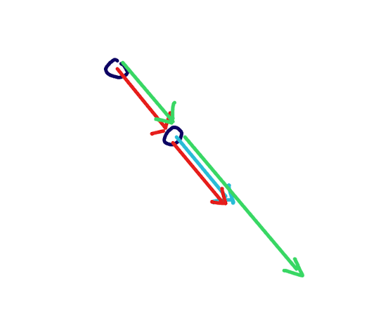</kbd></p>

> [!NOTE]
> Ban đầu, cho viên bi tại một điểm ngẫu nhiên. Tại đó vector gradient sẽ
> kéo viên bi bắt đầu lăn, và vector đương nhiên sẽ chỉ hướng có độ dốc
> lớn nhất, và vector cũng sẽ thể hiện độ lớn cần di chuyển và ta sẽ đi
> theo hướng đó, nhưng với một bước nhỏ thôi (thể hiện bằng learning
> rate * `-dw)`
>
> Cũng như là nó sẽ đi nhanh hơn vanilla do khi vector momentum trùng
> vector gradient thì nó thành ra càng đẩy mạnh về hướng đó"

<br>

<a id="node-724"></a>

<p align="center"><kbd>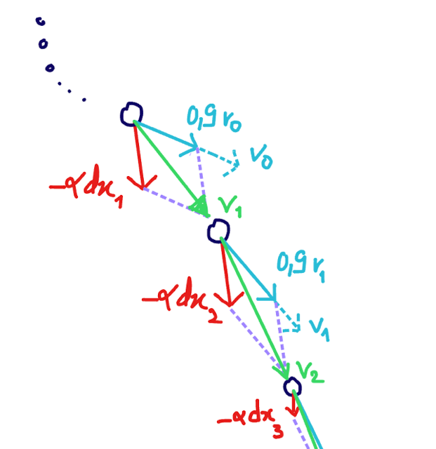</kbd></p>

> [!NOTE]
> Với momentum, ngay sau khi bi lăn do gradient kéo đi, ví dụ hiểu nôm na là
> tại "bước thứ 2" thì ta sẽ dùng vector cũ ở bước thứ nhất, để mang ý nghĩa
> là vector quán tính (momentum), để rồi tại bước thứ hai này, nó bị giảm lại
> chút xíu do ma sát (mu `-` hay ro theo như Andrew Ng, mà ở đây người ta
> cho rằng phải gọi là hệ số ma sát friction rate, thay vì momentum là cách
> gọi sai (misnomer)), sau đó nó sẽ kết hợp với vector gradient mới để bẻ lái
> về hướng đó.

<br>

<a id="node-725"></a>

<p align="center"><kbd>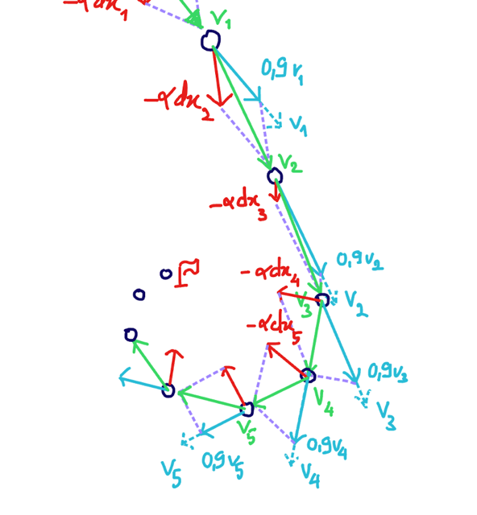</kbd></p>

> [!NOTE]
> Nhờ vậy, dù gradient tại đó có bằng 0, thì vẫn còn đó vector quán tính sẽ
> kéo viên bi đi. Và giả sử gradient tiếp tục bằng 0 thì vector quán tính sẽ
> nhỏ dần dần, giúp viên bi tiếp tục đi thêm một đoạn mới dừng.
>
> Nhờ vậy nó sẽ giúp viên bi vượt qua các vùng bằng phẳng cục bộ hoặc 
> hố sâu cục bộ. 
>
> Và cũng vì vậy có thể giải thích hiện tượng là momentum gd sẽ đi lố qua 
> và vòng về global minimum.

<br>

<a id="node-726"></a>

<p align="center"><kbd>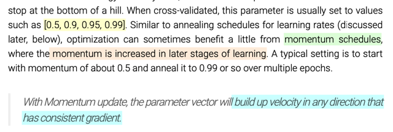</kbd></p>

> [!NOTE]
> đại ý là có thể có ích khi tăng friction rate lên dần, có thể hiểu nó sẽ
> giúp tăng dần masat, tăng sức cản khiến bi lăn chậm lại dần khi gần
> đến đích
>
> Chữ in nghiêng nhấn mạnh đến việc momentum giúp tăng dần (build
> úp) Vector gradient, hay (lực gradient) để giúp đẩy viên bi khi đi đúng
> hướng thì ngày càng mạnh hơn

<br>

<a id="node-727"></a>

<p align="center"><kbd>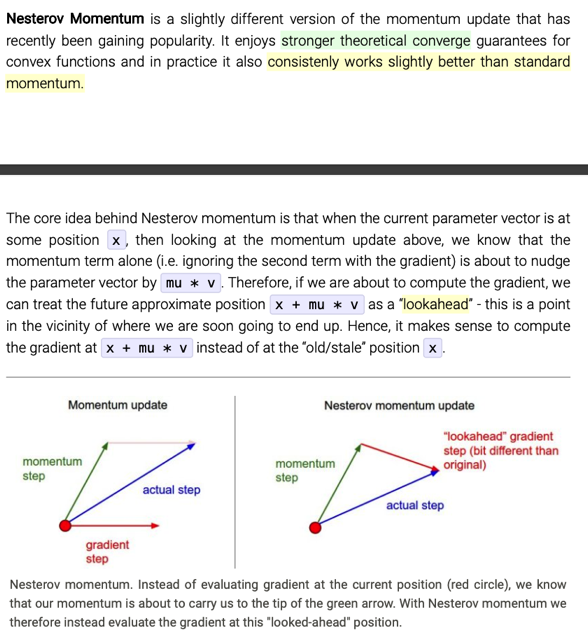</kbd></p>

<br>

<a id="node-728"></a>

<p align="center"><kbd>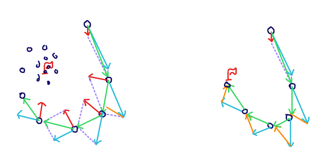</kbd></p>

> [!NOTE]
> đại ý là thay vì bẻ lái bởi vector gradient, lực gradient tại điểm
> hiện tại, thì nó kiểu như "tính trước" rằng à sắp tới độ dốc nó về
> hướng nào, nhờ vậy nó bẻ lái "sớm" hơn từ đó **giảm hiện tượng
> "vòng lố qua rồi lại lố lại một lúc lâu mới dừng đúng nơi"** của
> vanilla momentum

<br>

<a id="node-729"></a>

<p align="center"><kbd>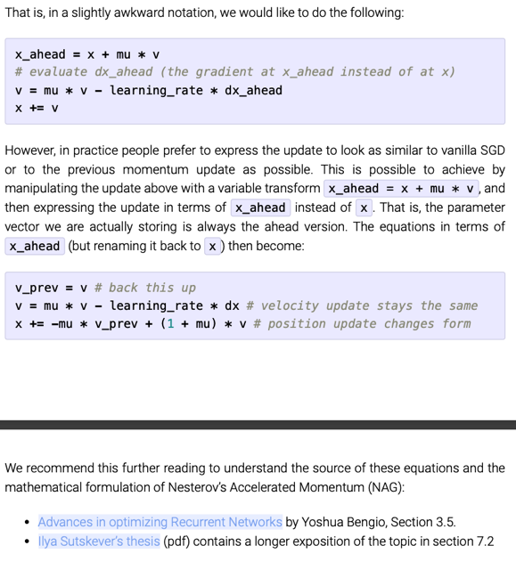</kbd></p>

> [!NOTE]
> đại ý là lí thuyết của Nesterov khiến việc thực thi hơi kì cục khi ta
> lại tính vị trí (giá trị param) ở phía trước (nếu đi theo hướng
> quán tính một đoạn), rồi tại đó ta tính vector gradient rồi mới bẻ
> lái vector quán tính theo hướng đó.
>
> Nhưng để cho nó "bình thường: thì có thể thực hiện theo cách
> khác

<br>

<a id="node-730"></a>

<p align="center"><kbd>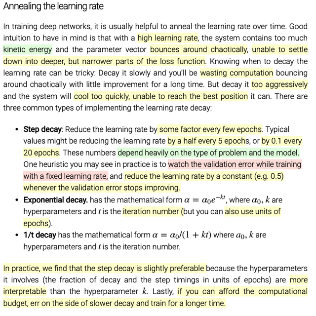</kbd></p>

> [!NOTE]
> Đại ý về lí do phải giảm dần learning rate là vì ví như động năng
> (kinetic energy), nếu lớn quá thì nó sẽ cứ**"bouncing around" `-` văng
> qua văng lại quanh một vùng xung quanh global loss minimum
> nhưng không đậu lại được, về được vùng gần đích hơn có loss thấp
> hơ**n.
>
> Việc chọn chiến lược giảm lr dần cần làm sao để phát huy hiệu quả
> tốt nhất. **Giảm nhanh quá thì giống như "nguội" quá nhan**h, sẽ
> khiến **chưa về  tới nơi đã hết xăng**. Còn **giảm chậm quá thì bị
> phí thời gian chờ**
>
> Các cách làm thông dụng là **step decay**, trong cách này **cứ vài
> epoch thì giảm lr bằng một factor** nào đó. Cách này tác giả nói rằng
> được ưu ái vì có tính chất interpretable tốt. Tuy nhiên vài epoch là
> bao nhiêu, tỉ lệ bao nhiêu thì tùy bài toán cụ thể nên phải thử. **Một
> kinh nghiệm là theo dõi val error, khi nào nó Không giảm nữa thì
> giảm lr một nửa.**Hai cách khác là exponential decay hay `1/t` decay thì cũng là dùng 
> các công thức giảm lr theo số lần iteration (cứ coi như epoch) tuy nhiên
> h.p k của cái này khó giải thích hơn là của step decay.
>
> Cuối cùng, **nếu dư dả thời gian và sức tính toán thì cứ dùng cách giảm 
> lr chậm, train lâu**

<br>

<a id="node-731"></a>

<p align="center"><kbd>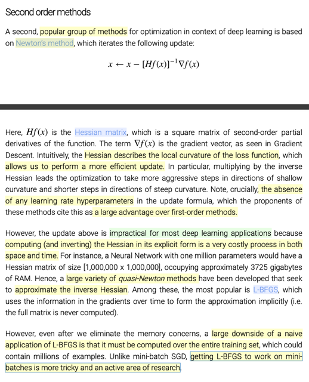</kbd></p>

> [!NOTE]
> đại ý là nói về cách update model weight **dựa trên second
> order method**, Theo đó trong công thức ta sẽ phải **tính
> inverse của ma trận Hessian**, hiểu nôm na là **ma trận đạo
> hàm cấp hai của loss function với model parameters.**
>
> Với công thức này, thì **không cần learning rate**, vốn xuất
> hiện trong **first order method** là bởi việc **ước lượng của pp
> này coi hàm số như tuyến tính**, thành ra phải **nhân với lr để
> khống chế bước đi mang ý nghĩa là vì ta đang ước lượng nên
> phải dò dẫm từ từ.**
>
> Còn phương pháp này nó **ước lượng loss function như hàm
> bậc hai**nên cơ bản là nó **cho một vector để thực bước nhảy
> ngay xuống  vị trí cực tiểu.** (Trong bài có nói, tuy vậy ta cũng
> thường vẫn cần lr vì dù gì second order vẫn là dựa trên
> approximation)
>
> TUy nhiên, phương pháp này **trong thực tế khó khả thi**vì
> việc**tính Hessian matrix của một bộ params lớn là rất tốn
> kém.**
>
> Do đó  có những nghiên cứu **tìm cách ước lượng Hessian
> matrix**, tiêu biểu là **L-BFGS n**hưng cái này **chưa thật sự
> giải quyết vấn đề** vì để làm vậy **cần tính trên full training
> set**, còn đ**ể bắt chước SGD tính với `mini-batch` thì lại không
> chính xác.**

<br>

<a id="node-732"></a>

<p align="center"><kbd>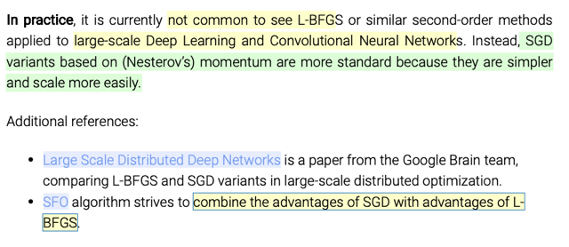</kbd></p>

> [!NOTE]
> Trong thực tế tác giả cho biết ít dùng second order method, mà
> dùng sgd nesterov momentum vì đơn giản và dễ scale lên

<br>

<a id="node-733"></a>

<p align="center"><kbd>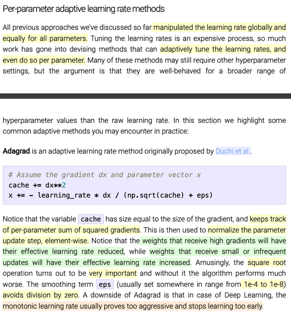</kbd></p>

> [!NOTE]
> Nói qua họ các phương pháp kiểu như áp dụng mỗi learning rate mỗi
> khác tùy theo params thay vì mọi params đều cùng một "global"
> learning rate
>
> Adagrad sẽ tính bình phương của gradient. Để rồi nó sẽ dùng để
> normalize `-hiểu` nôm na là san sẻ, phân chia lại mức gradient.
>
> Kiểu như là ví dụ dx `=` [dx1 dx2] mà dx1 nhỏ, dx2 lớn, thì dx1^2 sẽ
> nhỏ, dx2^2 sẽ lớn nên lr của x1 sẽ lớn hơn của x2 từ đó giúp weights
> ít được update hoặc mức update nhỏ sẽ có learning rate cao hơn
>
> Tuy nhiên nhược điểm là nó khiến việc giảm lr quá nhanh gây dừng
> quá trình training quá sớm. lí do là **cache cứ được cộng dồn và lớn
> dần khiến lr cứ giảm dần một cách đơn điệu (mononically)**

<br>

<a id="node-734"></a>

<p align="center"><kbd>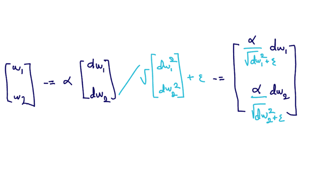</kbd></p>

<br>

<a id="node-735"></a>

<p align="center"><kbd>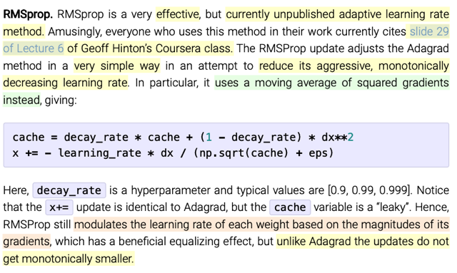</kbd></p>

<p align="center"><kbd>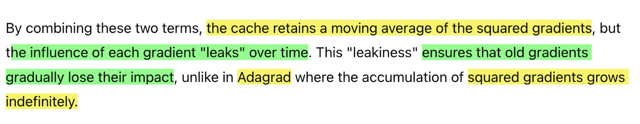</kbd></p>

<p align="center"><kbd></kbd></p>

<p align="center"><kbd></kbd></p>

<p align="center"><kbd>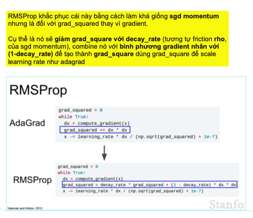</kbd></p>

> [!NOTE]
> đại khái là RMSProp cơ bản là sự cải tiến của AdaGrad, cải thiện vấn đề lr
> giảm đơn điệu của AdaGrad bằng cách dùng "**moving average của bình
> phương gradient**" thay vì **bình phương gradient như adagrad**. Trong đó
> decay rate tường là 0,9 hoặc 0,99  hoặc 0.999.
>
> Chữ leaky trong đây ý là việc nhân với `decay_rate` giúp cache (giá trị cộng
> dồn của bình phương gradient) được "rò rỉ" từ từ, giúp nó không bị tình trạng 
> "cứ lớn dần mãi" như của Adagrad vốn là nguyên nhân khiến l.r giảm một cách
> nhanh chóng và liên tục

> [!NOTE]
> Chỗ này trong lecture 7 nói sai, RMSProp giống Adagrad mới
> đúng, và nó dùng **moving average gradient square** **thay vì
> gradient squared**

<br>

<a id="node-736"></a>

<p align="center"><kbd>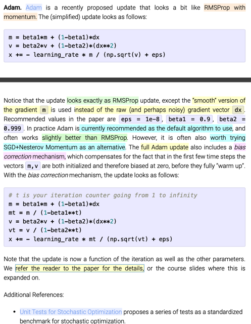</kbd></p>

> [!NOTE]
> Adam kết hợp RMSProp (nên cơ bản là AdaGrad) với Momentum.
>
> Nhìn công thức sẽ thấy m được tính `/` có vai trò tương tự vector
> quán tính trong SGD momentum khi nó được giảm một chút với
> ma sát beta1 và kết hợp với một phần của vector gradient (trong
> SGD momentum thì chỉ v `=` rho*v `+` lr.dx)
>
> Còn v ở đây chính là moving average của bình phương gradient
> trong RMSProp, với `decay_rate` chính là beta2
>
> Và trong công thức ta dùng vector momentum để update param
> như với learning rate được điều chỉnh cho mỗi param bằng cách
> chia cho  sqrt(cache `=` v) của phương pháp RMSProp
>
> `====`
>
> Phiên bản Adam đầy đủ có thêm vụ bias correction nhằm giúp giai
> đoạn đầu khi m khởi tạo bằng 0 thì sau bước update đầu tiên chỉ
> được  cộng thêm 0,1 của dx nên rất nhỏ
>
> bias correction sẽ khắc phục bằng cách ví dụ khi t `=` 1 thì beta1^t `=`
> ```text
> beta1^1, ví dụ beta1 = 0.9, thì beta1^1 = 0.9 nên m = m/(1-0.9) =
> ```
> mm `/` 0.1 `=` 10m. Điều này giúp m ban đầu lớn lên

<br>

<a id="node-737"></a>

<p align="center"><kbd>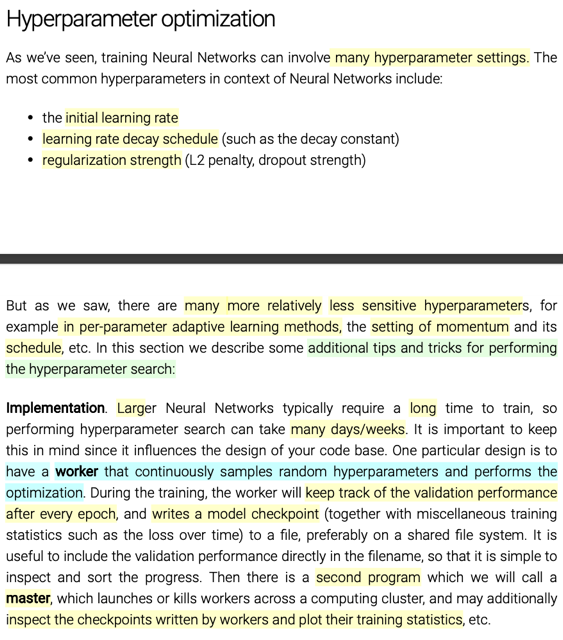</kbd></p>

> [!NOTE]
> đại khái là ý nói ngoài các hp "quan trọng ra" thì còn các hp khác cần
> tuning nữa. Thành ra ở đây chia sẻ một số kinh nghiệm
>
> Đầu tiên kiểu như là nói sơ về một cách thiết kế một hệ thống bao
> gồm các worker (hiểu là các máy tính) sẽ chọn random các h.p
> và tiến hành training, trong quá trình training nó sẽ theo dõi val loss
> và thực hiện checkpoint.
>
> Một máy chủ (kiểu như vậy) sẽ nhận các check point này để xem xét
> kĩ hơn để quyết định dừng các worker và start các worker khác.

<br>

<a id="node-738"></a>

<p align="center"><kbd>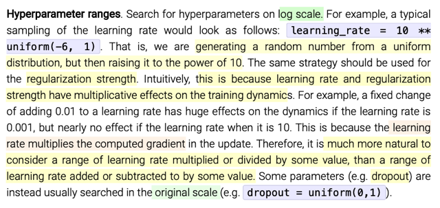</kbd></p>

> [!NOTE]
> đại ý là một số hp như lr hay reg stretch nên search theo log scale (ý là
> tăng lên hay giảm xuống thì gấp 10 lần). ví dụ 0.001 rồi đến 0.01.
> Vì những hp này thâm gia nhân với gradient (chưa hiểu ý lắm nhưng để sau)
>
> Cái này có thể xem lại DLSpec của Andrew Ng.

<br>

<a id="node-739"></a>

<p align="center"><kbd>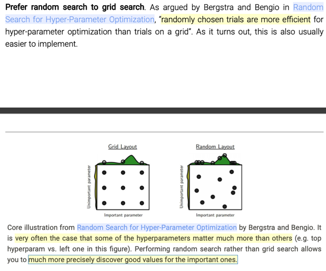</kbd></p>

> [!NOTE]
> rồi thì nên dùng random search hơn là grid search vì nó cho phép khám phá
> nhiều option của hp quan trọng hơn. Ví dụ grid search lr với một hp khác ít quan
> trọng tạm gọi là a chẳng hạn. Thì với grid search, 9 lần test ta chỉ check được 3
> giá trị của lr trong khi với grs ta check được 9 giá trị của lr. Thế thì ý là với h.p
> thì 3 lần hay 9 lần đều chẳng quan trọng gì, nhưng với lr thì kết quả của việc test
> trên 9 giá trị sẽ giúp thấy được nhiều điều hơn là 3.

<br>

<a id="node-740"></a>

<p align="center"><kbd>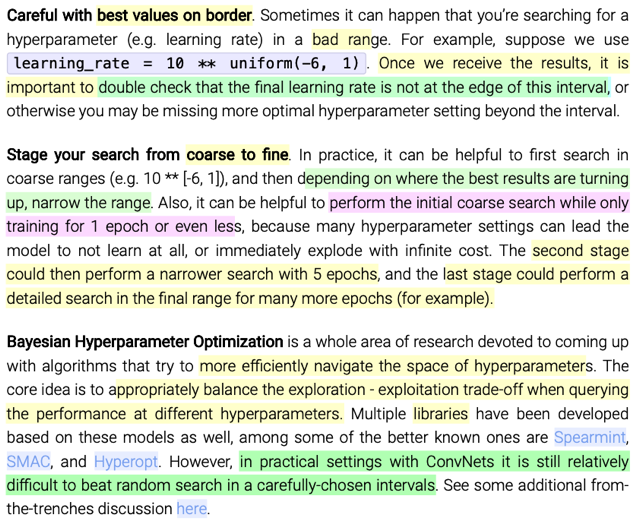</kbd></p>

> [!NOTE]
> 1. đã nói trong bài, coi chừng cái tốt nhất lại nằm bên lề, tức là còn có thể
> tốt hơn nữa.
>
> 2.Bắt đầu tìm sơ với wide `/` corse range, train trên 1 epoch. Sau đó thu hẹp
> range lại Train trên vài epoch, rồi thu hẹp hơn nữa với nhiều epoch hơn
>
> 3.Có vài nguyên cứu tìm cách cân bằng giữa exploration và exploitation
> nhưng chưa thấy đột phá

<br>

