# Object Detection

📊 **Progress:** `74` Notes | `102` Screenshots

---

## (slow) R-cnn

 

<kbd>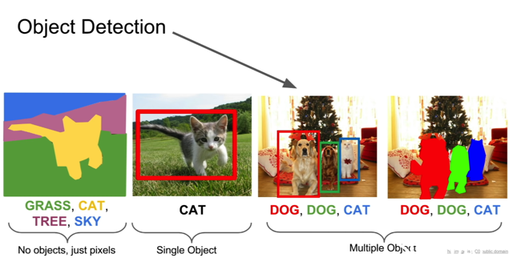</kbd>

> [!NOTE]
> rồi, như đã nói classification + localization là khi ta đã biết trước có mấy loại
> Nhưng quan trọng là trong mỗi bức hình ta biết trước sẽ có 1 hoặc 2
> hoặc 3 con. Và ta muốn phân loại con nào là con gì và vẽ bounding box.
>
> Còn object detection tuy ta cũng có một bộ các class nhưng trong mỗi image
> ta không biết sẽ có mấy con. Nhiệm vụ của model sẽ là, cứ mỗi một con xuất
> hiện trong hình thì vẽ bounding box và classify nó là con gì.

 

<kbd>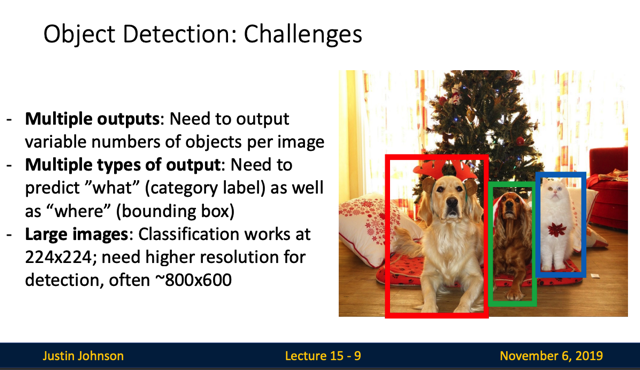</kbd>

> [!NOTE]
> đại khái là O.D đòi hỏi khó hơn Image Classification khi có nhiều
> output, và nhiều loại output cũng như phải xử lý large images

 

<kbd>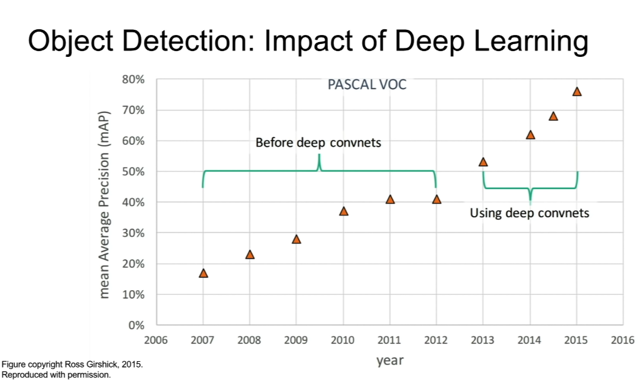</kbd>

> [!NOTE]
> đại khái là object detection là core task của computer vision nên người
> ta  theo dõi hiệu suất của nó rất sát. Biểu đồ cho thấy trước khi áp dụng
> Deep Learning thì hiệu suất của của các model chững lại 2012. Sau khi
> dùng Deep learning thì tăng tốc và ngày nay người ta cho rằng bộ
> dataset PASCAL VOC đã trở nên quá dễ với deep learning.

 

<kbd>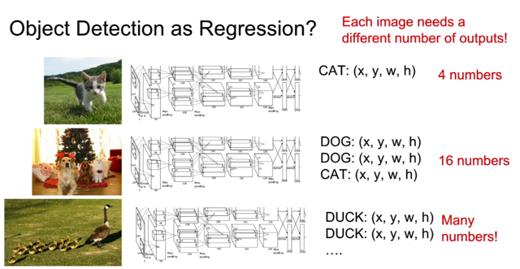</kbd>

> [!NOTE]
> như đã nói, khác với localization, trong bài toán detection, ta ko biết
> số object sẽ có thể có trong image. Nên mỗi image khác nhau số
> lượng output.

 

<kbd>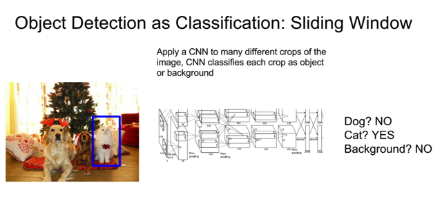</kbd>

<kbd></kbd>

<kbd>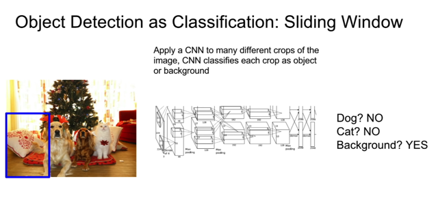</kbd>

> [!NOTE]
> một cách tiếp cận cho bài toán detection là dùng sliding window.
> đại ý là ta crop image và pass nó qua cnn, để classify background
> hay cat hay dog. Và mỗi lần slide window là ta lại làm vậy với crop
> image đó.

 

<kbd>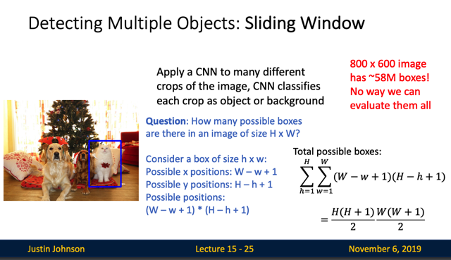</kbd>

<kbd></kbd>

<kbd>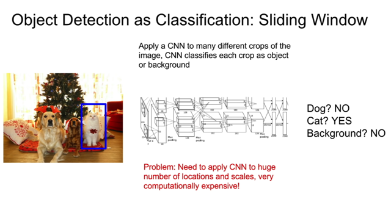</kbd>

> [!NOTE]
> vấn đề của cách tiếp cận này là ko biết phải chọn size ntn cho window
> cả. Vì có thể có rất nhiều object xuất hiện với đủ mọi kích cỡ. Do đó
> cách này không hiệu quả.

 

<kbd>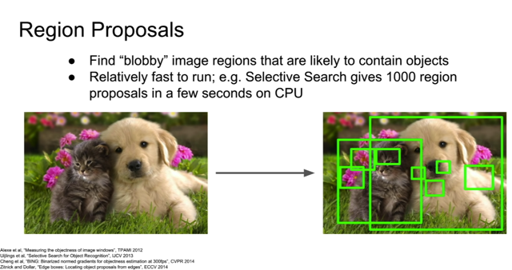</kbd>

> [!NOTE]
> ý tưởng của Region Proposal đại khái là ta có thể **process cái image** để
> rồi (dựa trên thuật toán) **xác định được một đường viền đóng kín** từ đó
> **đề xuất một bounding box**. Để rồi ta sẽ **có khoảng 1000-2000 box**, để
> mà **check những bounding box này bởi một classification + localization
> cnn** để **xem có phải là có object hay ko** (thay vì với sliding window thì
> như đoán mò)
>
> cách làm này ko hẳn thuộc về deep learning mà là**traditional computer
> vision technique**.
>
> Cách làm này được cho là **tuy "propose" ra nhiều window không có
> object** **nhưng recall cao**, tức nếu **có object thì hầu như nó đều
> propose**.
>
> Chạy cũng nhanh.

 

<kbd>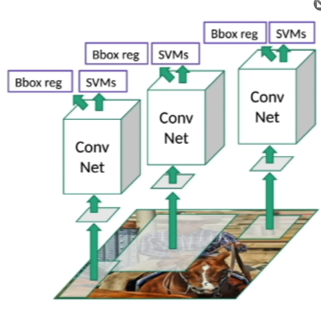</kbd>

> [!NOTE]
> đó chính xác là cơ chế của **R-CNN (Region-based CNN)** Trong đó đầu
> tiên **cái hình được xử lý qua một thuật toán Region Proposal** để
> **propose ra những box tiềm năng**
>
> Sau đó, chúng sẽ **được thay đổi kích thước** để phù hợp với input size
> mà classification & localization cnn yêu cầu.
>
> Để rồi sau khi forward qua CNN ta sẽ có **predicted class** cũng như**bounding box**. Hình ảnh minh họa đại ý là với các region tiềm năng, ta
> mới pass qua Conv-Net để dự đoán ra
>
> 1. **Classification head**: Dự đoán class
>
> 2. **B.box regression head**: Dự đoán "vị trí" chính xác của b.box có thể
> dưới dạng khoảng cách từ các cạnh của region tới cạnh tương ứng của
> box. Ý nghĩa của từ "regression" là vậy - thu nhỏ sai lệch giữa giá trị dự
> đoán (ví dụ tọa độ / vị trí 4 cạnh của region
> - vốn dĩ đóng vai trò là predicted box) với tọa độ / vị trí thật sự của
> bounding box - ground truth box.
>
> Bổ sung sau khi làm assignment, ta đã hiểu box regression sẽ  predict
> deltas. Có thể khác nhau tùy mô hình cụ thể.
>
> Như với FCOS tức One-stage detector, nó sẽ là khoảng cách từ location
> center  tới 4 cạnh của bounding box, ta dùng nó để xác định tọa độ hai
> điểm Top-Left, Bottom-Right của bounding box.
>
> Còn với Faster R-CNN, thì trong stage 2, Region Proposal Network - RPN,
> nó  là tx, ty, tw, ty: Trong đó tx, ty nôm na là giá trị cần để "shift" (chuyển
> dịch) tâm của anchor box (cũng là của location) / tới tâm của bounding box,
> và tw, th là scale factor để scale width và height của anchor box để thành
> width & height của ground truth box. Còn ở stage 2, hiện tại lúc ghi  những
> dòng này là mình vừa xong RPN của part 2, review để chuẩn bị làm stage
> 2, cụ thể là hoàn thành module Faster R-CNN, mà ngoài ra người ta nói vì
> để cho đơn giản, sẽ không "làm BoxRegression" ở stage hai nơi mà nếu là
> phiên bản đầy đủ của Faster R-CNN thì sẽ có bước này để tiếp tục refine
> cái proposal region (output / predict từ RPN) một lần nữa. Nhưng dù không
> làm, ta cũng có thể hình dung nếu có làm thì nó cũng sẽ giống như việc
> match anchor box và ground truth box trong RPN: predict ra reg box deltas

 

<kbd>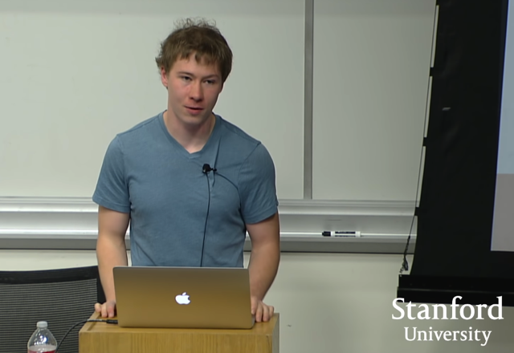</kbd>

> [!NOTE]
> câu hỏi:
>
> ? Region Proposal **có "learnable" không?**
>
> -> Không, nó kiểu như là một thuật toán **fixed**, nhưng tí nữa ta sẽ thấy có thể
> thay đổi điều này, làm cho nó **learnable**.
>
> ? Predicted bounding box **có luôn nằm trong proposed region không**?
>
> -> Không, kiểu như CNN model có thể predict rằng à đây là một người mà
> propose region lại chỉ có phần thân, thì model hoàn toàn có thể predict
> bounding box ở ngoài phạm vi của propose region.
>
> ? Có những propose region không có object thì sao?
>
> -> ta luôn có một class = background để predict cho những vùng ko có
> object.
>
> ? Dataset sẽ ntn: Mỗi image sẽ đều có bounding box với label

 

<kbd>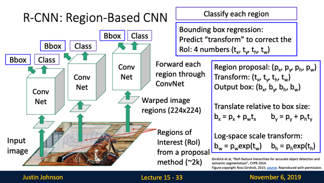</kbd>

> [!NOTE]
> rồi ở đây (như hình ảnh cho thấy vẫn đang trong Slow RCNN), ta sẽ nói về
> box regression
> **Proposal region output từ thuật toán Region Proposal** (fixed) sau đó sẽ
> được **map với ground truth box** qua box regression head **để train một 
> transformation**, đại khái là kiểu như **cho model học cách sửa lại / tinh 
> chỉnh lại proposal region**.
>
> ====
>
> Ví dụ **region proposed là có center là px, py, dài rộng là ph, pw**. Thì
> model sẽ dựa vào label - cái correct bounding box để **learn một Transform
> tx, ty, th, tw** mang **ý nghĩa là cần chỉnh lại cái region proposed** với các
> giá trị như vậy. Để rồi cái bounding box sẽ là bx, by, bh, bw.
>
> Cái ý **translate relative to box size**: **bx = px + pw.tx** có nghĩa là **nếu tx = 0, thì
> có ý nghĩa là vị trí của proposed box đã ok**, không cần chỉnh gì thêm. Còn
> nếu tx = 1  thì px (center của box) phải được điều chỉnh một khoảng bằng 1
> x chiều rộng của propose box.
>
> Hiểu tạm như vậy có thể vào assignment hoặc đọc paper ta sẽ thấy rõ hơn.

 

<kbd></kbd>

<kbd></kbd>

<kbd></kbd>

<kbd></kbd>

<kbd></kbd>

<kbd></kbd>

<kbd></kbd>

> [!NOTE]
> cũng dễ hiểu thôi, trong mấy slide này định nghĩa cách transform từ
> anchor box (có dạng center x, center y, width, height)  và prediction của
> model (là phép transform quy định bởi tx, ty, tw, th)  để tính ra predicted
> box. (dưới dạng center x, center y, width, height)
>
> Ta sẽ dựa vào đây mà xây dựng công thức từ anchor box, và ground truth
> box để tính ra tx, ty, tw, th.
>
> Có điều trong function ta làm việc với anchor box có dạng XYXY  tức là
> x1, y1, x2, y2. Và gt box cũng vậy. Nên mình cần chuyển nó sang "dạng"
> (center x, center y, width, height) để tính.
>
> có thể hiểu model predict ra một phép transform để mà "biến đổi" một 
> anchor box thành một object box. Việc biến đổi này bao gồm 
>
> 1: là shift cái center của anchor box sang vị trí của "object" box. Và 
>
> 2: scale kích thước của anchor box để được object box. Mà trong công thức
> có exponential là mục đích để scaling factor luôn dương.

> [!NOTE]
> Trong đây có thể hiểu ý họ nói là sở dĩ ta "thiết kế" như vậy (tức là để cho
> model learn  một phép transformation shift & scale) là vì nó có tính chất
> invariance, ý là model không biết/không thấy giá trị mang tính tuyệt đối
> của các box và gt box, nên nó không thể học không thể predict ra vị trí
> chính xác của object box, thay vào đó, nó sẽ học một quan hệ tương đối
> giữa anchor box và object box để rồi từ đó có ý nghĩa như là với một
> anchor box (có vai trò như một region proposal ban đầu / nháp) thì nó sẽ
> biết cách "sửa" lại để tạo thành một region proposal chính xác

> [!NOTE]
> Với việc học ra phép transformation thì nếu 'predicted' transform = 0 thì tức
> là model thấy rằng không cần sửa cái "initial proposal region" (tức là cái anchor
> box) mà nó đã chính là cái output / cái proposal region chuẩn rồi.

> [!NOTE]
> Và từ các công thức này ta có thể có công thức của phép biến đổi nếu có
> anchor box (proposal) và ground truth box (target output). Dùng nó cho việc
> hoàn thành function này

 

<kbd>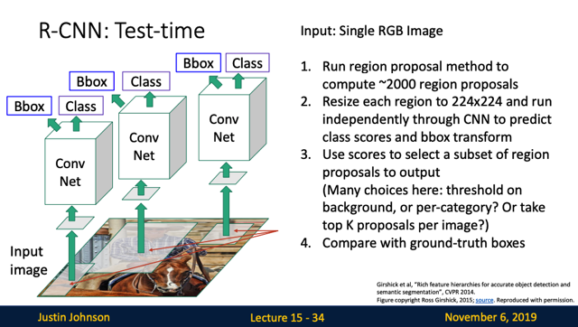</kbd>

> [!NOTE]
> nói về lúc test,
>
> 1. Đưa image vô, region proposal layer sẽ propose các box.
>
> 2. Chúng sẽ được resize để thành kích thước yêu cầu để **pass qua cnn để
> predict class scores đồng thời predict bbox transform.**
>
> 3. Đại khái là với (say) 2000 cái bbox mỗi cái có một list các  predicted
> classes scores đó. thì đương nhiên ta phải chọn ra một vài cái để xài (ở
> downstream task) chứ không thể dùng hết được.
>
> Vậy thì có nhiều cách để chọn, ví dụ như có thể làm theo kiểu  yêu cầu bao
> nhiêu 10 object đó, lúc này ta sẽ threshold on background: tức là ta sẽ chọn
> 10 (hay bao nhiêu đó thì tùy) bbox  mà predicted class scores ứng với
> background là nhỏ nhất (có thể hình dung cách làm này là chọn 10 b.box mà
> khả năng có  object là cao nhất)
>
> Hoặc threshold on per-category, đại khái là chọn bbox mà probability score
> ứng với 1 class nào đó cao hơn threshold.
>
> ===
>
> Trong hình đương nhiên là ta hiểu rằng chỉ có một cnn xử lý hết mọi region
> proposal box nhé

 

<kbd>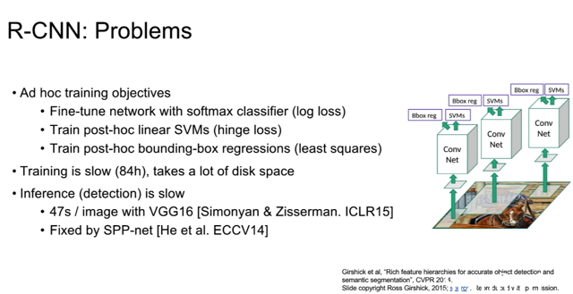</kbd>

> [!NOTE]
> Nhưng R-CNN có nhiều hạn chế như rất chậm cả training và
> inference và tốn memory. Rồi nó cũng dựa trên thuật toán region
> proposal fix, không learnable, cũng là một hạn chế.
>
> Justin nói về tốc độ thì quá trình inference một bức hình có khi
> tốn cả mấy chục phút / 1 tấm vì cnn phải forward hàng ngàn region.

 

## Fast R-cnn

 

<kbd>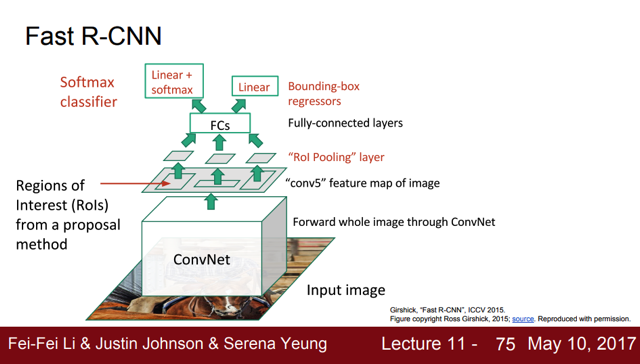</kbd>

> [!NOTE]
> cái Fast R-CNN cải tiến một chút, khắc phục nhược điểm chậm của
> R-CNN. Bằng cách **xử lý bức hình gốc bằng CNN trước**, rồi mới dùng
> region proposal algorithm để propose ra các "region of interest" (kiểu như
> những vùng mà nghi ngờ có object) "trên" feature map của CNN. Và việc
> này nên hiểu là không phải là ta "chạy" thuật toán Region Proposal trên /
> từ feature map, mà là ta project những proposed region từ raw image lên
> feature map. Có nghĩa là, ta sẽ luôn bắt đầu với việc chạy thuật toán RP
> trên raw image như một bước chuẩn bị, rồi với "Slow" RCNN thì ta pass
> các region này qua CNN như đã nói, còn với Fast RCNN thì ta kiểu như
> tạm để các region đó đã, forward raw image qua CNN trước, sau đó mới
> project các proposed region lên các feature map)
>
> Sau đó, vì vẫn phải **input vào một fixed size fc layer** nên các region sẽ
> được **resize** nhờ một layer gọi là **RoI Pooling**. RoI pooling nói ở
> phần dưới (Đi theo mũi tên)
>
> Sau đó qua**fc layer, classification head** (head ý là output layer) để cho
> ra**class  scores** và box regression head để có bounding box.
>
> Để rồi tính log loss (classification) và l1 loss (regression - bounding box)
> và gradient backprop để learn model param

 

<kbd>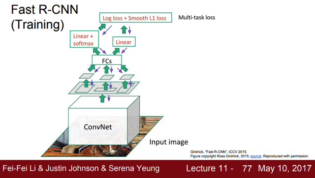</kbd>

 

<kbd>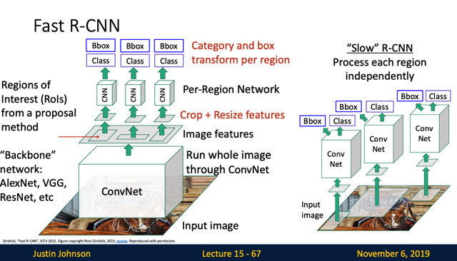</kbd>

> [!NOTE]
> So sánh với EECS 498-007, ý tưởng cũng vậy, chỉ biết thêm cái CNN mà
> ta sẽ **process raw image gọi là backbone network**, nó đương nhiên là
> một **pretrained - CNN** mà ta đã biết như AlexNet, VGG, ResNet.
>
> Sau đó, như cs231n (slide trước) **thuật toán Region Proposal như
> Selective Search sẽ được apply với output của CNN** = feature maps thay
> vì raw images
>
> Tiếp, chỗ này khác với cs231n trong đó proposed region sẽ pass qua một
> **ROI Pooling** rồi **FCs** để ra class **scores** và **bbox regressor** (tức
> là ra luôn predicted location của bbox)
>
> Thì ở đây ta sau khi qua **ROI Pooling** thì sẽ đến các **"tiny lightweight per
> region network"** để output ra**class scores** và **bbox transform - dùng
> để transform các propose box để có được predicted box**

 

<kbd>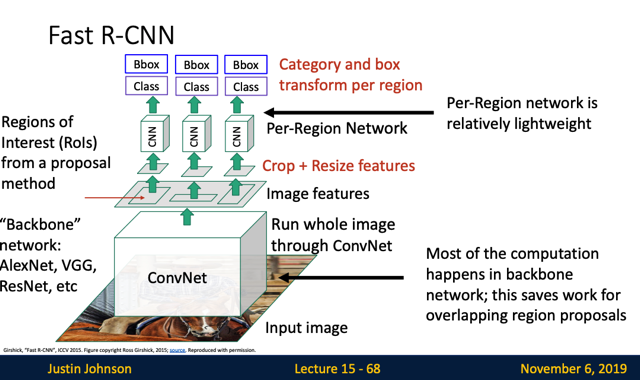</kbd>

> [!NOTE]
> đại khái là với cải tiến này nó sẽ rất nhanh, khi phần lớn sự tính toán đã được
> share trong backbone network nhờ đó giảm số lượng công việc của Region
> Proposal (RoI)

 

<kbd>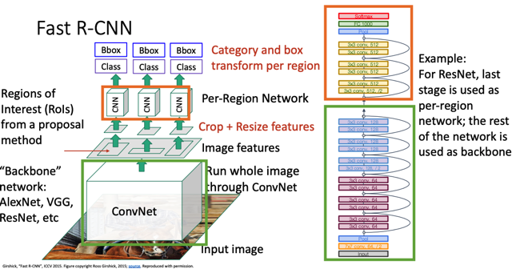</kbd>

<kbd></kbd>

<kbd>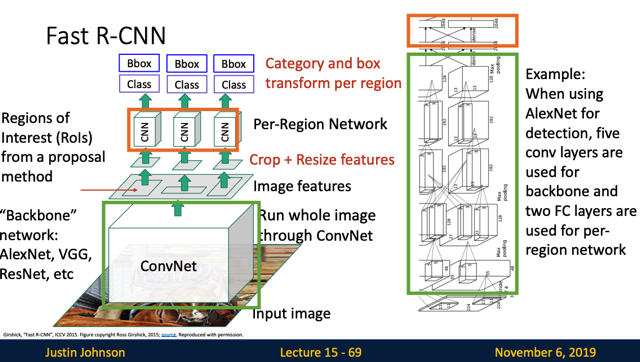</kbd>

> [!NOTE]
> Đại ý là nếu dùng AlexNet thì backbone sẽ là phần conv layers, và khúc
> Per-Region Network là phần đuôi gồm hai cái FC layer của ResNet
>
> Còn nếu là ResNet thì backbone cũng là khúc "đầu-mình", khúc đuôi
> với các layer cuối sẽ được dùng làm Per-Region network.
>
> Vậy **ý nói mọi khúc tính toán nhiều được xử lý lúc đầu với backbon**e,
> còn **các region dù nhiều chỉ cần pass qua các khúc đuôi vốn xử lý rất
> nhanh.**

 

<kbd>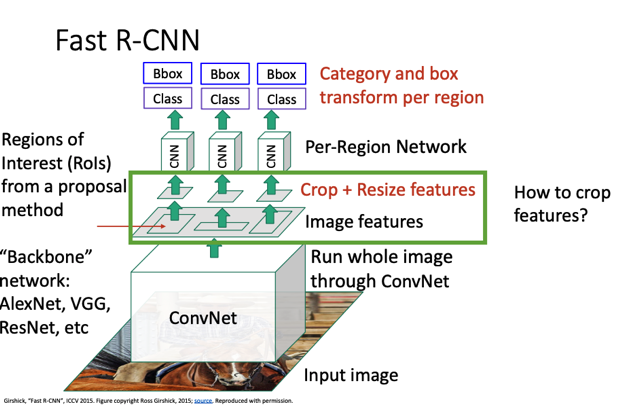</kbd>

> [!NOTE]
> rồi, thế thì một vấn đề nữa là cái phần Region of Interest này, trong đó **project ra
> các proposed region trên raw image lên CNN feature map** rồi  sau đó **crop +
> resize** (RoI pooling) để thành **fixed size theo yêu cầu của phần Per-Region
> network**.
>
> Vậy vì ta cần gradient backward về cả backbone CNN nên ta muốn khúc này
> **differentiable**.

 

<kbd>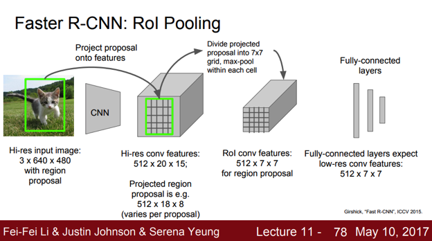</kbd>

> [!NOTE]
> về cái ROI, justin bỏ qua sẽ quay lại saU, đại khái là
> nó cũng **giống giống như max pooling**

 

<kbd>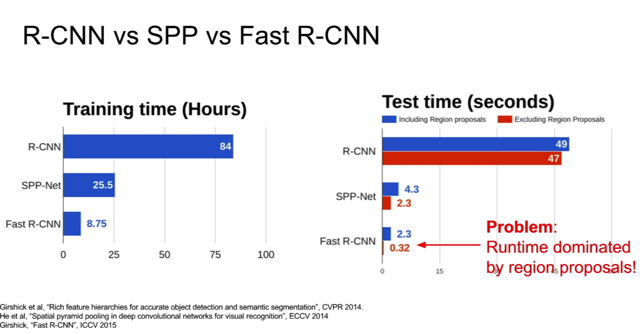</kbd>

> [!NOTE]
> So sánh hiệu suất của các model, SPP-Net (Justin ko nói nó là gì)  cho
> thấy Fast R-CNN rất nhanh, đến nỗi bottleneck chỉ còn là ở khúc tính
> region proposal, ý là chỉ mất thời gian chỗ này, chứ có region rồi thì
> Inference qua cnn rất nhanh.

 

## Faster R-cnn = Train Rpn

 

<kbd>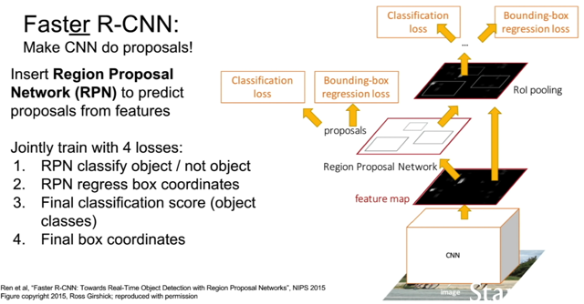</kbd>

> [!NOTE]
> giải pháp khắc phục bottleneck này, Faster R-CNN **cho model tự học bước
> region proposal** luôn thay vì dùng một fixed algorithm.
>
> Từ raw image, qua CNN để có feature map, tới đây nó sẽ được một
> Region Proposal Network (có thể hiểu nó là một CNN con nằm trong
> CNN mẹ) predict ra các region cũng như là predict region đó có phải là
> object hay không.
>
> Sau đó predicted region lại được đi tiếp qua các bước tiếp theo như cũ.
>
> Như vậy thì có thể thấy nó có 4 losses như trong slide đã list ra, và việc
> cân bằng các loss này là một thách thức.

 

<kbd>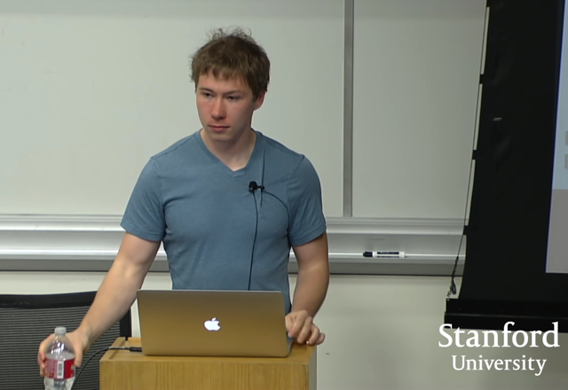</kbd>

> [!NOTE]
> câu hỏi là làm sao để train cái Region Proposal Network khi ta không có
> ground truth label
>
> -> Cái này hơi rườm rà và có thể ta sẽ nói sau
>
> Classification loss của RPN là gì:
>
> -> Binary classification loss, vì RPN sẽ phải predict region phải hay không
> phải là object

 

<kbd>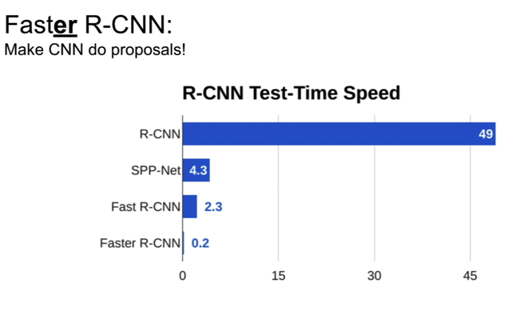</kbd>

> [!NOTE]
> Faster R-CNN rất nhanh. 
>
> và vì nó có cơ chế Region Proposal learnable nên nó đã khắc phục được
> một nhược điểm hồi nãy có nói là fixed region proposal algorithm
>
> và nó gọi là một họ các model dựa trên proposal region gọi là reigon-based 
> model

 

<kbd>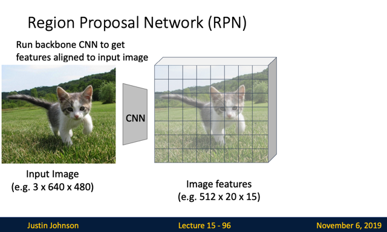</kbd>

> [!NOTE]
> cs231n thì không nói, nhưng EECS 498 thì có nói về việc train Region
> Proposal Network. như đã nói hồi nãy, mỗi vị trí trên feature map sẽ tương
> ứng với một vị trí của raw image. Tất nhiên spatial size của feature map
> nhỏ hơn.

 

<kbd>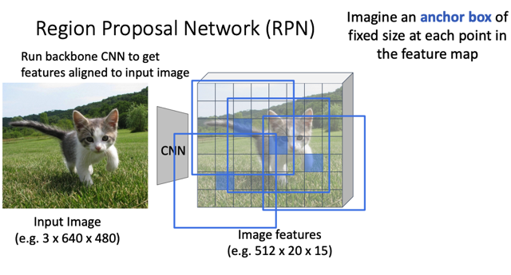</kbd>

> [!NOTE]
> thế thì, đại khái là RPN sẽ được train để predict **một fixed-size
> anchor box** (với center là một vị trí trên feature map) **xem nó có
> chứa một object hay là không**. (Binary classification)
>
> Đương nhiên là có thể output (với mỗi vị trí trên feature map) ra 2
> score ứng với 2 class - positive / negative để dùng softmax. Hoặc
> output ra 1 con số p(y=1) như bài toán logistic regression.

 

<kbd>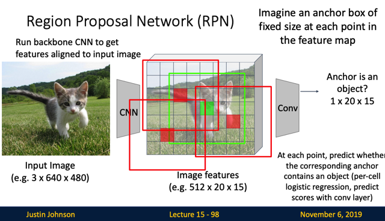</kbd>

> [!NOTE]
> ví dụ cái anchor box xanh lá cây thì True, mấy cái khác thì False. Cho
> nên output có thể dùng một 1x1 conv để xuất ra một matrix cùng spatial
> size chứa các score Positive / Negative

 

<kbd>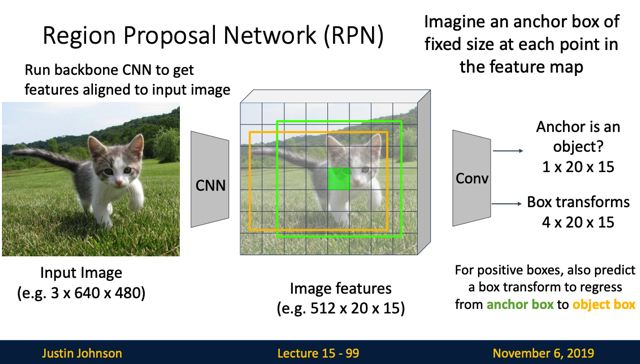</kbd>

> [!NOTE]
> thế thì tất nhiên cái fixed size anchor box sẽ không đủ để đảm bảo tạo ra các
> bounding box đúng. Do đó **RPN còn learn ra BBox transform** giống như hồi
> đầu đã biết. Dùng regression loss. Để rồi ví dụ như trong hình, RPN predict ra
> rằng một anchor box có chứa object, thì cộng với **predicted bbox transform,** nó sẽ **'adjust' anchor box** **để ra được object bounding box** (màu vàng)
>
> Ở đây chưa nói dùng cái target như thế nào để train cái regression loss này,
> nhưng sau khi làm part 2 assignment thì ta hiểu, đương nhiên là dùng cái
> ground truth box để làm target, nhưng phải có bước "gán": Và hiểu cách ngắn
> gọn là, nếu muốn (huấn luyện) model dự đoán ra cách transform một anchor
> box thành ra ground truth box, thì với một anchor box, và ground truth box, thì
> các thông số để transform là gì, thì việc deltas đó (tính từ anchor box và gt
> box) sẽ chính là target cho việc training box regression head của RPN

 

<kbd>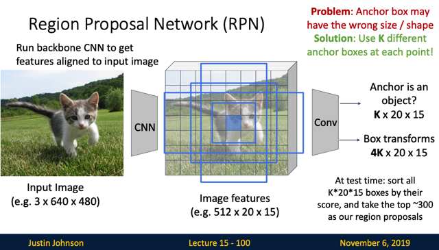</kbd>

> [!NOTE]
> thế thì người ta thấy rằng **một anchor box không đủ hiệu quả** từ đó người
> ta **dùng K anchor box khác nhau**. Thành ra RPN sẽ output ra K*W*H
> probability score và 4k*W*H box transform.
>
> (Tại mỗi vị trí trên feature map có K anchor box (size khác nhau, mỗi cái
> cần predict một probability (có object) score nên W*H vị trí),  sẽ là W*H*K
> prob score)
>
> Và các anchor box size, K, đều là hyperparameter

 

<kbd>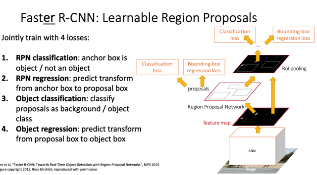</kbd>

> [!NOTE]
> tổng hợp lại train cả hệ thống sẽ có **4 loại losses**:
>
> Đầu tiên là hai loại loss khi train RPN: một là mỗi anchor box  predict **có
> phải hay không là object** -> binary cross entropy loss.
>
> Mỗi anchor **box transform map anchor box với ground truth box ->
> regression loss.**
>
> Sau đó output của RPN sẽ pass qua phần còn lại để ra final prediction dự
> đoán **object thuộc loại gì (multi-class classification loss)** và **vị trí chính
> xác của bbox (regression loss) (cái này cũng mang ý nghĩa là refine** thêm
> một lần nữa predicted region từ RPN: map predicted region từ RPN với
> ground truth box
>
> Nếu không muốn, ta có thể dùng chính predicted region từ RPN làm final
> bounding box (giống như trong assignment vì lí do hạn chế tính toán của
> Colab). Hãy nhớ và để ý rằng Region Proposal Network predict ra propose
> region thì nó cũng là cái bounding box rồi.
>
> Đó là Justin còn chưa nói về vài thứ râu ria vì ko đủ thời gian, nên object
> detection là một bài toán phức tạp

 

<kbd>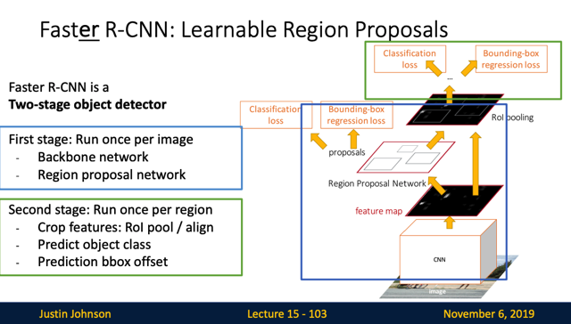</kbd>

> [!NOTE]
> thế thì Faster R-CNN còn gọi là **2-stage object detector**, khi stage 1 là "xử
> lý" (**MỘT)** bức ảnh gốc thông qua backbone CNN, và sau đó là Region
> Proposal Network để ra các predicted / proposed region/box.
>
> Còn stage 2 là pass **MỖI** proposal region qua RoI pool / align + Predict
> object class và (có thể) refine bbox một lần nữa

 

## Training Slow / Fast/ Faster R-cnn

 

<kbd>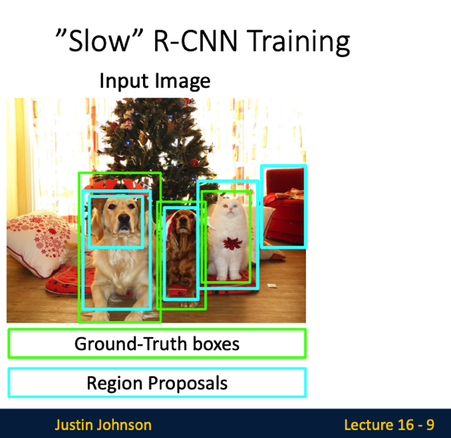</kbd>

> [!NOTE]
> đại khái là trong lecture này Justin sẽ nói rõ hơn về quá trình training
> vốn nói rất ít ở cả cs231n và lecture 15 EECS 498-007/598-005)
>
> Đầu tiên, những ô màu green là ground-true box, màu cyan là proposal
> region bởi thuật toán như Region Proposal như Selective Search

 

<kbd>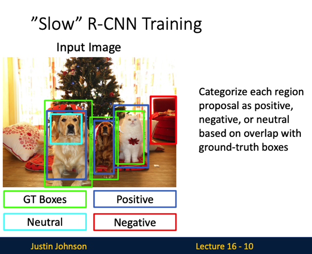</kbd>

> [!NOTE]
> đại khái là ta sẽ phân loại các proposal region (P.R) dựa trên một threshold
> IoU nào đó với các ground truth (G.T) để xếp loại là Positive khi P.R cover
> khá tốt một g.t box, ngược lại ko overlap nhiều với G.T như cái ngoài góc
> thì xếp là negative còn không tốt cũng ko đến nỗi tệ như cái proposed box
> bao cái mặt con chó thì classify là Neutral

 

<kbd>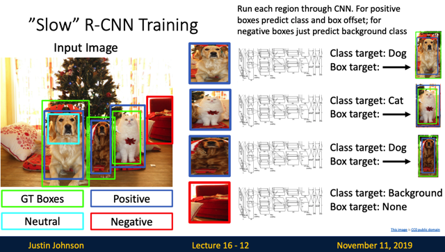</kbd>

> [!NOTE]
> Với những cái propose region đó ta sẽ bỏ qua các Neutral region, chỉ dùng
> những cái positive và negative để mà training.
>
> Với các positive region, target của nó sẽ là category đúng (cho biết bởi cái
> ground truth bbox tương ứng mà cái region có IoU lớn hơn threshold)  còn cái
> negative thì target sẽ là Background class
>
> Đây cũng là câu hỏi của 1 người học target class của region lấy ở đâu, thì
> chính là lúc ta xác định xem nó (một propose region) overlap với cái g.t box
> nào để gán nó là positive thì cũng sẽ cho biết target class của nó sẽ là gì. Vậy
> **trước khi ta bắt đầu training, ta sẽ run training set qua region proposal để có
> các regions, rồi làm cái bước classify thành positive / negative / neutral và
> chuẩn bị các target các kiểu. Justin nói rằng ta sẽ run offline quá trình này
> trước khi training.**Nhưng đó là với (Slow) R-CNN, nơi ta chỉ dùng fixed region proposal
> algorithm, còn với Fast R-CNN khi ta train luôn cả cái này tức là Region
> Proposal Network thì ta phải đại khái là làm cái bước preparation này online
> - ý là trong lúc training luôn.****Cái thứ hai là ta cũng train một bbox transform (nhớ ko), thế thì target sẽ
> đương nhiên là cái ground truth box. Để rồi model sẽ phải h**ọc ra cách adjust
> propose box (bởi Region Proposal algorithm)** bởi bbox transform để có được
> cái "final" predicted bbox..
>
> Một ý nữa là với negative region thì target bbox sẽ là none. Điều này sẽ khiến
> việc tính loss trở nên hơi rắc rối khi một số sample (region) thì lại có regression
> loss, một số thì không. Và tỉ lệ positive/negative cũng là một h.p cần tuning.

> [!NOTE]
> Và có thể hiểu rằng CNN không thật sự (học cách) generate / inventing cái bbox
> mà thật ra nó học cách adjusting cái box được propose bởi Regional Proposal.
>
> Và cũng vì vậy mà lúc testing, ta expect rằng ta dùng cùng cái thuật toán R.P
> mà lúc training ta xài, để rồi dùng cái bbox transform predict bởi CNN để adjust
> cái region. 
>
> Điều này trực tiếp dẫn đến là nếu lúc test ta dùng một thuật toán R.P khác thì
> model sẽ fail. Điều này cũng dễ hiểu khi liên hệ tới nguyên tắc quan trọng trong
> ML là data statistic của training set và test set phải giống nhau, cũng như yêu cầu
> preprocessing phải giống nhau vậy

 

<kbd>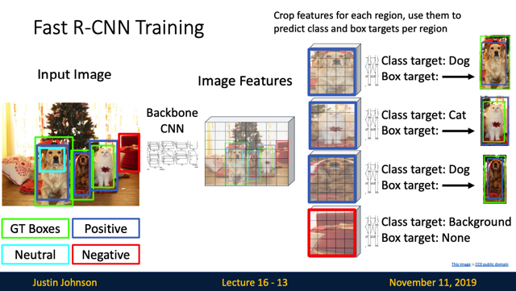</kbd>

> [!NOTE]
> Với Faster R-CNN thì như đã biết ta**chỉ đổi chỗ**: ta sẽ **process raw
> image** với **CNN trước**, **rồi mới chạy R.P algorithm trên feature map**.
> Nhưng sau đó thì  các bước tiếp theo như khúc mapping để phân loại region
> như vừa rồi đều giống nhau.

 

<kbd>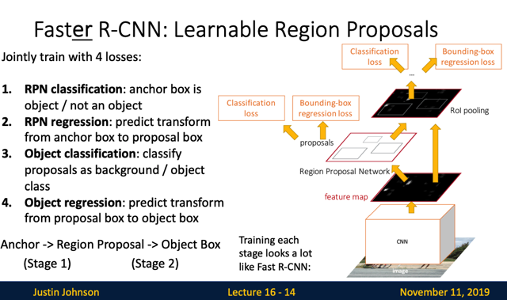</kbd>

> [!NOTE]
> rồi, nói qua việc training cái Faster R-CNN, mà ta biết thay đổi chính là
> **train cái RPN để predict ra propose region** thay vì dùng thuật toán
> fixed như **Selective Search**.
>
> Vậy đầu tiên, Justin cho rằng ta có thể hình dung cái này nó giống như
> việc ta **transform các anchor box** (mà như trong single-stage detector,
> mỗi vị trí của feature map sẽ có K cái anchor box với size fix, là một
> dạng h.p) thành region proposal. Ta hiểu đại ý là bởi vì ta đã nói là sẽ
> train cái RPN là cái sẽ làm thay việc của một Region Proposal mà.
>
> Và trong**stage 2 thì ta sẽ transform cái region proposal thành ra final
> output object box**

 

<kbd>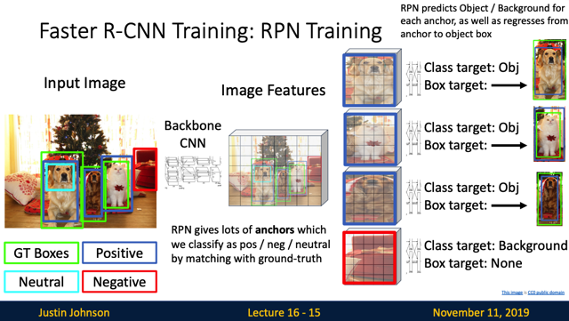</kbd>

> [!NOTE]
> thế thì ta cũng làm cái bước **pairing** như hồi nãy, với từng anchor-box ta
> sẽ gán nó là **positive / negative / neutral dựa vào IoU với một ground  truth
> box**.
>
> Và sau đó ta cũng sẽ **chỉ quan tâm các positive & negative anchor box** và
> training RPN để **map từng anchor box với class target**. Và cái này thì
> không như hồi nãy khi ta map nó với target là class id. Ở đây thì chỉ map với
> binary  class True / False - có hay không object.
>
> Chỗ này chưa hiểu lắm, nếu đã xác định negative (do IoU của anchor box và
> ground truth box < threshold) thì đương nhiên target nó là false rồi còn
> ngược lại nếu đã là positive thì đương nhiên target nó sẽ là true (Ý nói, nội
> bản thân trạng thái pos / neg đã luôn tương đồng với target rồi). Nhưng có
> thể cũng chỉ là như vậy.
>
> Rồi, ở second stage thì cũng vẫn giống của Slow R-CNN, có điều như đã nói
> hồi này, chỉ khác là ta sẽ pair giữa cái propose region mà spit out bởi RPN
> với ground truth box. Những cái này sẽ rõ hơn khi**ta làm assignment 4**

 

<kbd>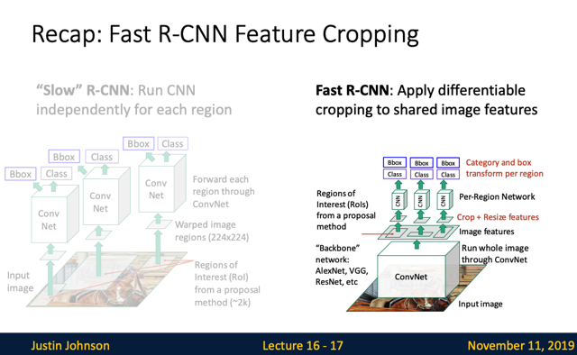</kbd>

> [!NOTE]
> Review lại một chút, với R-CNN, Region Proposal algorithm được áp
> dụng đối với raw image, sau đó, các region proposed mới được xử lý bởi
> CNN khiến nó rất chậm.
>
> Vậy thì Fast R-CNN thay đổi bằng cách đổi chỗ CNN và R.Proposal để
> dùng CNN xử lý raw image trước, rồi mới apply region proposal  trên
> feature map output từ CNN

 

## Single Stage

> [!NOTE]
> SINGLE STAGE
> DETETOR

 

<kbd>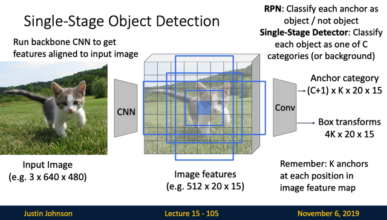</kbd>

> [!NOTE]
> Vậy thì người ta thấy rằng không cần phải có stage 2 làm gì, mà hoàn toàn có
> thể nhờ stage 1 làm hết. Bằng cách, **thay vì train RPN để predict một bài
> toán binary cho có hoặc không có object**, thì có thể **train nó luôn bài toán
> multi-class để nó predict class gì luôn**. Khi đó RPN từ việc output K*W*H tức
> với mỗi vị trí trên feature map (sẽ có K anchor box) cần dự đoán ra K chỉ số
> p(có object) thì bây giờ với mỗi box sẽ predict C class scores -> C*K*W*H.
>
> Và thật ra là có 1 class là background nữa nên là **(C+1)*K*W*H.**

 

<kbd>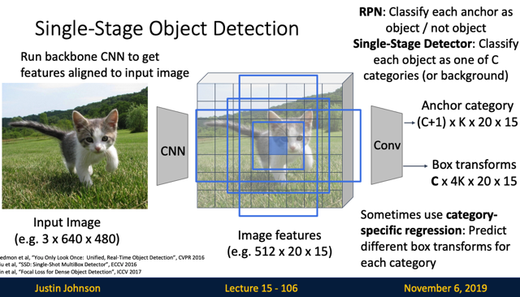</kbd>

> [!NOTE]
> rồi, còn với bbox transform, thì người ta thấy rằng **predict với mỗi class
> một transform khác nhau sẽ hiệu qủa hơn**. Nên từ việc output ra **4*K*W*H
> (mỗi box một bộ 4 giá trị transform)** thì bây giờ **mỗi box sẽ có C*4 giá trị
> transform -> C*4K*W*H**
>
> Thì đây chính là **YOLO** thuộc về Single Stage Object Detection

 

<kbd>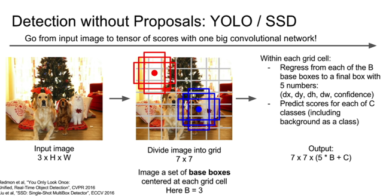</kbd>

> [!NOTE]
> YOLO, đã học bên DLSpec. Đại khái là, chia image thành một grid ví dụ 7x7
> với mỗi grid-cell, chọn B ví dụ 3, (là một h.p) base box tâm tại cell center.
>
> Để rồi predict ra với mỗi based box một bộ số gồm có dx, dy, dh, dw, và
> confidence score c. Vậy model output sẽ là tensor 7x7x(5*B+C). Với C là số
> class.
>
> Label tạo kiểu gì thì Justin nói hơi hairy, nhưng có thể đoán rằng nó cũng sẽ là
> một tensor 7x7x(5*B+C) như vậy để **train cả hệ thống với một 'giant cnn'**
> Và thật sự phân tích kĩ sẽ thấy R-CNN thật ra cũng có điểm tương đồng với
> YOLO.

> [!NOTE]
> And by the way, the region proposal network that gets used in faster
> R-CNN ends up looking quite similar to these where they have some
> set of base bounding boxes over some gridded image, another region
> proposal network does some regression plus some classification. So
> there's kind of some overlapping ideas here.

 

<kbd>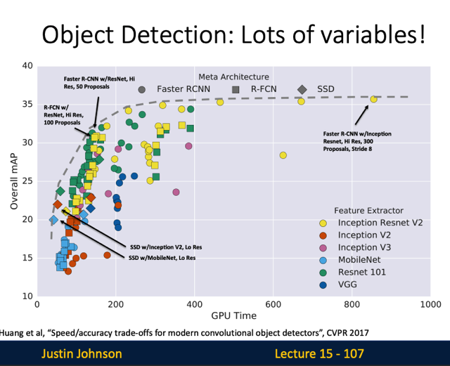</kbd>

> [!NOTE]
> và có thể thấy O.D có rất nhiều biến số, nào là dùng phương pháp nào
> Faster-CNN hay R-FCN (ko có thời gian để nói) hay SSD (Single Stage
> Detector). Rồi nào là dùng backbone model nào rồi các thông số kích
> thước như anchor size, ......Do đó rất khó để so sánh hai O.D với nhau
>
> Có một paper họ cố gắng thử tất cả và so sánh chúng, nên Justin
> recommend nên đọc qua

 

<kbd>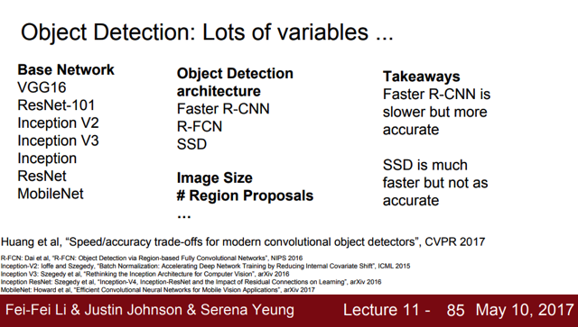</kbd>

> [!NOTE]
> tóm lại Object Detection có rất nhiều biến số (để thử, kiểu như h.p)
> như base cnn model nào, dùng Region-based RCNN hay YOLO
> và các thông số kích thước như image size, region proposal....
>
> Justin mới đề xuất nên tham khảo paper dưới đây để trong đó kiểu
> như người ta so sánh hiệu suất của việc thử các variable này
>
> Nhưng kinh nghiệm là region-based chính xác hơn nhưng chậm
> hơn yolo.

 

<kbd>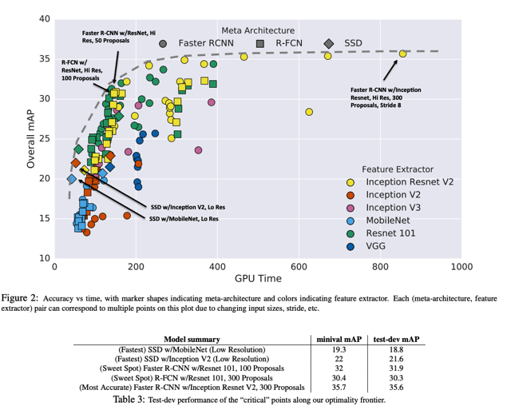</kbd>

<kbd>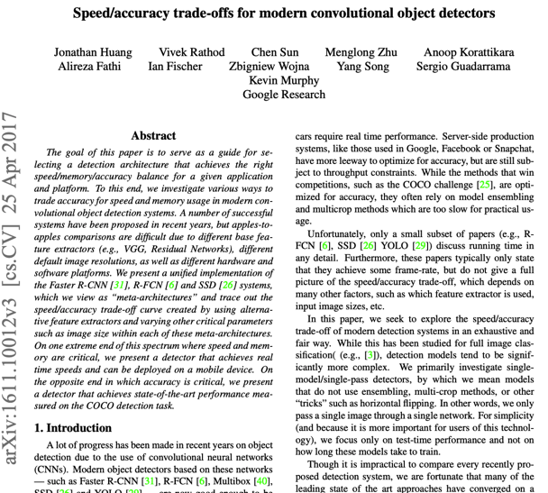</kbd>

<kbd></kbd>

<kbd></kbd>

<kbd>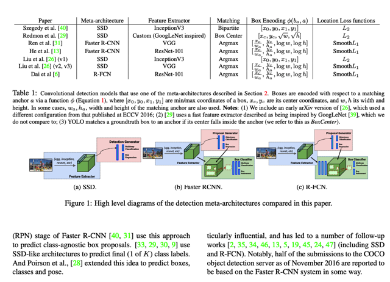</kbd>

 

<kbd>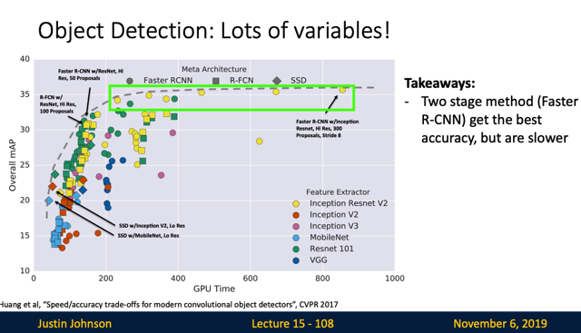</kbd>

> [!NOTE]
> kết quả của paper đó đại khái là 2-stage detector tend to work chính
> xác hơn nhưng chậm hơn

 

<kbd>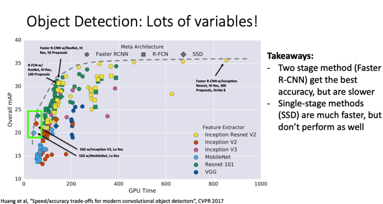</kbd>

> [!NOTE]
> còn Single-stage thì nhanh hơn
> nhưng bớt chính xác hơn

 

<kbd>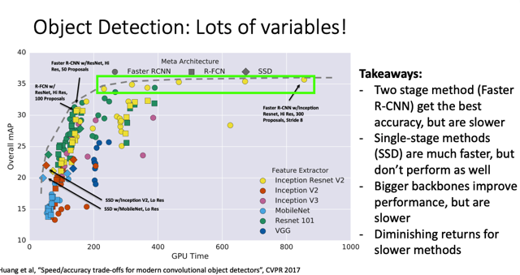</kbd>

> [!NOTE]
> và backbone network càng mạnh thì performance cũng càng
> tốt nhưng lại càng chậm

 

<kbd>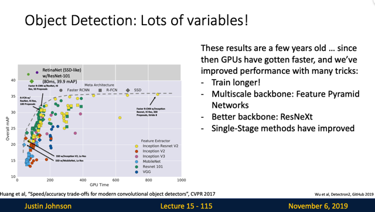</kbd>

<kbd></kbd>

<kbd>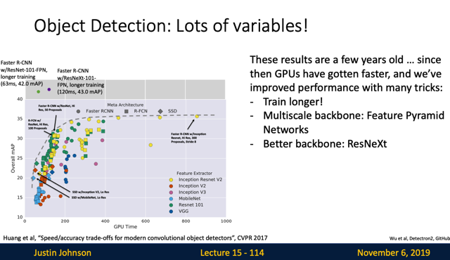</kbd>

> [!NOTE]
> những slide sau đại khái là nói về các bước tiến bộ sau vài năm kể từ 
> khi paper trên. Với những cải tiến như dùng **Feature Pyramid Network**
> (Ko có thời gian để nói), train lâu hơn đã đẩy mAP lên cao hơn nữa
>
> Đồng thời One-stage detector cũng không còn thua kém về accuracy
> So với 2-stage

 

<kbd>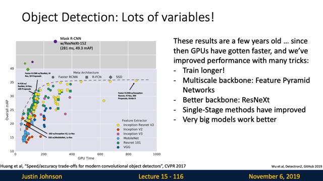</kbd>

> [!NOTE]
> Rồi model càng bự thì càng
> chính xác hơn nữa.

 

<kbd>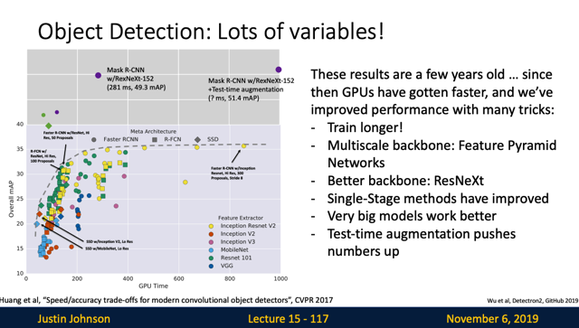</kbd>

 

<kbd>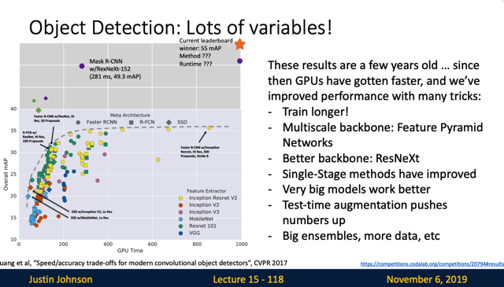</kbd>

> [!NOTE]
> rồi với big ensemble, train với nhiều data hơn cộng với kĩ thuật
> TTA **test-time agumentation** mà gb.Howard có nói đến trong
> lecture 6 fastai đã giúp performance lên rất tốt

 

<kbd>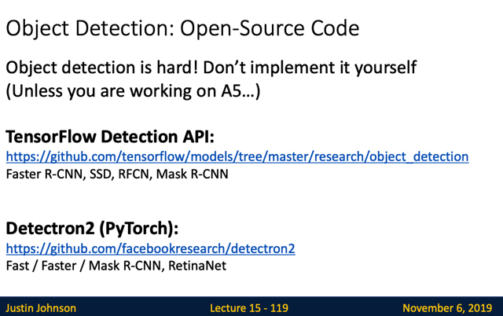</kbd>

> [!NOTE]
> nói chung Justin cho rằng trừ Assignment 4 nơi ta sẽ
> làm from scratch cái này còn lại thì đừng tự làm mà
> hãy dùng các api của TF hay PT

 

<kbd>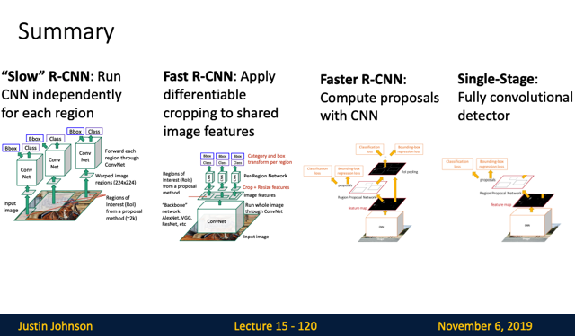</kbd>

 

## Rol Pooling & Roi Aligned Pooling

 

<kbd>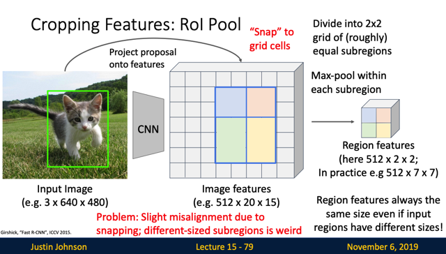</kbd>

> [!NOTE]
> đại khái ý ổng nói là **vì mỗi vị trí (spatial size) của feature map đương nhiên
> phải tương ứng với một vị trí trên raw image**, nên ta có thể "proposed region"
> trên raw image, từ đó ta **project lên feature map để có cái bbox trên feature
> map**
>
> Và vì **feature map nhỏ hơn (bề rộng bề ngang) của hình gốc** nên sau khi
> project **nó sẽ không khớp với grid cell**, do đó phải **snap** - tức là **"dịch
> nó, kéo dãn, ép" nó phải khớp với grid cell trên feature map**
>
> Từ đó đương nhiên **dẫn đến vấn đề đó là proposed region trên feature map**
> **không hoàn toàn align với proposed region (đã làm trên raw image)**.
>
> Vậy thì **tạm gác lại cái vấn đề này** (vì ta sẽ khắc phục nó bằng cái **RoI Align**)
> để nói tiếp về **cách thực hiện IoR pooling**:
>
> Thì đầu tiên, ta sẽ **chia proposed region thành các subregion**, ví dụ 2x2 để
> **thực hiện max pooling**, đương nhiên sẽ có những vùng không khớp để rồi nó
> thành 3x2 chẳng hạn nhưng ko sao. Tiếp,**apply max pooling trên những
> subregion đó** để mỗi vùng 2x2x512 (512 là depth) sẽ **trở thành 1x1x512** tức là
> một 'depth' vector như đã biết.
>
> Rồi, cái subregion 3x2x512 sau khi max pooling **cũng cho ra 1x1x512**. Thành
> ra **output của việc ta max pooling cái proposal region sẽ luôn có spatial size
> hình vuông** và từ đó (**bằng cách chọn 2x2 hay 3x3** hay 7x7 thì **output của RoI
> pooling sẽ có size phù hợp với yêu cầu kích thước của stage 2** - cái **cnn hay 
> fc layer**

 

<kbd>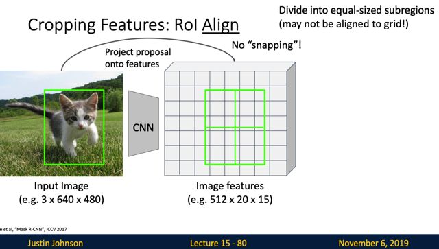</kbd>

> [!NOTE]
> vậy thì RoI Align giúp khắc phục vấn đề "mis-aligned"

 

<kbd>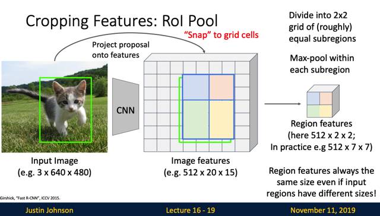</kbd>

> [!NOTE]
> Bài trước ta đã biết "cách làm" sẽ là mình sẽ dùng region proposed kết
> quả của việc **dùng thuật toán region proposal** như **selective search** apply
> **trên raw image**. Sau đó ta sẽ **PROJECT** **nó lên feature map** output từ
> CNN.
>
> Sau đó, trong bước gọi là **RoI pool**, ta mới chia các "projected
> proposal region trên feature map" thành các vùng. Ví dụ 7x7 (và "xem
> xem" nó như 8x7) để**thực hiện max-pooling**, kết quả **là một output có
> spatial size vuông**, và theo kích thước mà stage 2 khúc cnn hay fc layer
> map với class scores yêu cầu.

 

<kbd>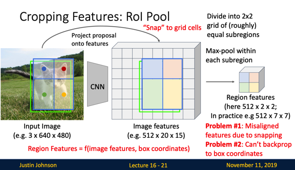</kbd>

> [!NOTE]
> Justin nói về**vần đề của RoI pooling**, đầu tiên là vấn đề **misalignment**
> xuất phát từ nguyên nhân là cái bước "**snap**".
>
> Cái bước "snap" nói xuyên suốt trong lecture này và lecture trước có nghĩa
> là: Ta **dùng thuật toán region proposal trên raw image**, để**tính ra tọa độ
> của 4 điểm của region proposed**. Sau đó ta **mới project lên feature map**.
> Mà feature map thì **nó nhỏ hơn raw image**, nên phải " snap" tức là **gán**
> /**ép buộc cái "region phóng chiếu" phải khớp với grid cell.**Thì đương
> nhiên như Justin nói ở đây, nếu ta lấy tâm của cái region sau khi được snap
> mà **phóng chiếu (project) ngược lại lên raw image thì hai cái region sẽ
> không khớp**.
>
> Người ta đã minh họa trong slide, cái**khung màu xanh lá** kiểu như là cái
> **region propose mà thuật toán vẽ ra trên raw image**. Sau đó ta mới
> **project "lên" feature map** được cái "màu xanh lá trên feature map" thì đại
> khái là **có thể thấy nó không khớp với grid cell**.(Có thể hiểu điều này, hình
> dung grid cell trên raw image là 1 pixel, còn feature map thì nhỏ hơn raw
> image nên chiếu cái region xuống nó sẽ ko khớp hoàn toàn với grid cell của
> feature map).
>
> Vậy nên phải **snap**, **để cho nó khớp**, thành ra **cái khung xanh dương
> ở trên feature map**. Thì rõ ràng là **nó bị lệch xong với khung xanh lá**, nên
> **phóng chiếu khung xanh dương của feature map lên lại hình gốc thì cái
> region xanh dương sẽ không trùng với region xanh lục của image gốc**.
>
> ====
>
> **Vấn đề thứ hai** đại khái là **nếu ta coi bước này như một function** nhận
> **input** là **feature map**, và **box coordinate** (được project từ region
> proposed từ raw image) để có được "region feature" thì quá trình
> **backprop** ta **chỉ có thể tính gradient của image feature** chứ **ko thể tính
> gradient của box coordinate** được.
>
> Thành ra cách khắc phục là **dùng RoI aligned** mà lecture trước ko có thời
> gian nên Justin bỏ qua kêu tự tìm hiểu, tuy nhiên vì ta sẽ phải làm nó trong
> assignment 4 thành ra ổng sẽ nói ở đây

> [!NOTE]
> seems a little bit weird with this ROI pool operation if it is also related to
> the snapping one one so one way to look at what this cropping operation
> is doing is that it's a function that takes two inputs and produces one
> output the two inputs are the the feature map for the entire image and the
> coordinates of the bounding box at which we want to crop and the output
> are the features for the bounding before that bounding box but now
> because of the snapping **we cannot back propagate to the coordinates
> of the bounding box** because the coordinates of the bounding box were
> always snapped onto the grid cells of the feature map so in this roi pool
> operation we can **we can back propagate to the from the region
> features back to the image features** but there's **no way for us to back
> propagate from the region features back to the coordinates** of the
> bounding box at which we were doing this this computation
>
> so that also gives us a hint that maybe something is a**little bit weird**
> inside this are this roi pool operation because **normally we like to use
> operations that are fully differentiable** and can properly pass gradients
> between all of the inputs and all the outputs and that's not the case with
> this ROI pool operation**so the the fix for this is this ROI aligned operation** that we did not have
> time last time to talk about in detail but **I wanted to go over it today
> because you actually will be implementing it on your homework and
> assignments**

 

<kbd>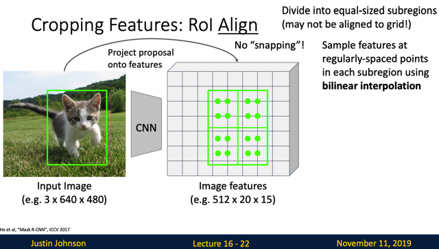</kbd>

> [!NOTE]
> rồi, thì **RoI Align** đại khái ý tưởng sẽ là như vầy: Đầu tiên ta **cũng sẽ
> project cái proposed region lên feature map**, và đương nhiên nó sẽ (có
> thể) không khớp với grid-cell (hình minh họa cho thấy khung màu xanh lá
> không khớp với grid-cell),
>
> rồi tiếp như đã nói **ta sẽ không  snapping gì hết** vì đây là cái gây vấn đề.
> Mà ta sẽ **chia cái region trên feature map** (gọi là **"feature region"** cho
> gọn đi)**thành những phần bằng nhau** (ví dụ như 2x2 như minh họa).

 

<kbd>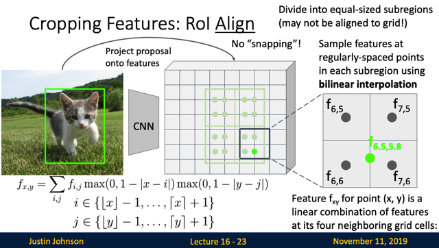</kbd>

> [!NOTE]
> Thế thì **đương nhiên các ô này nó không khớp với feature map grid cell**
> nên ta sẽ tính giá trị các ô này bằng**linear interpolation**.
>
> Ví dụ trong hình, vị trí chấm màu xanh là giá trị cần tìm, ta sẽ **dựa vào
> khoảng cách của nó với các chấm màu đen** để**tính một linear combination**
> cụ thể là theo công thức **fxy = sum i, j f_i,j*max(0,1-|x-i|)*max(0,1-|y-j|)**
>
> nôm na là t**rong tất cả các điểm màu đen**, **chỉ xét 4 điểm gần nhất** (cái 
> max(0,...) mang ý nghĩa này, ví dụ nếu green dot có khoảng cách tới
> black dot theo phương x lớn hơn 1 thì max(0, 1 - |x-i|) sẽ = 0, tức là không
> xét những black dot có khoảng cách theo phương x tới green dot > 1)
>
> Vậy với 4 điểm (6,5), (7,5), (6,6), (7,6) thì khoảng các của nó theo phương
> x và y tới green dot lần lượt là (0.5, 0.8) (0.5, 0.8) (0.5, 0.2) (0.5, 0.2)
>
> Áp vô công thức ta sẽ có giá trị của green dot là:
>
> f6,5(1-0.5)(1-0.8) + f7,5(1-0.5)(1-0.8) + f6,6(1-0.5)(1-0.2) + f7,6(1-0.5)(1-0.8)
>
> = f6.5*0.5*0.2 + f7,5*0.5*0.2 + f6,6*0.5*0.8 + f7,6*0.5*0.8

 

<kbd>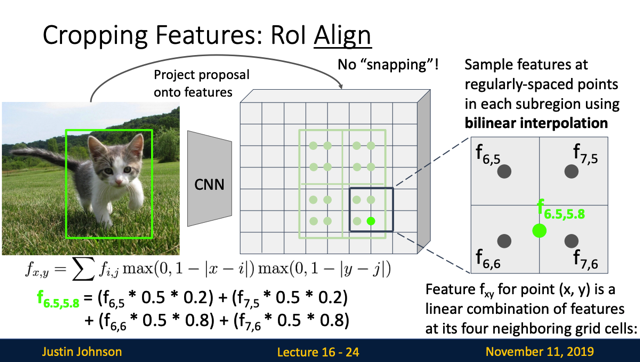</kbd>

 

<kbd>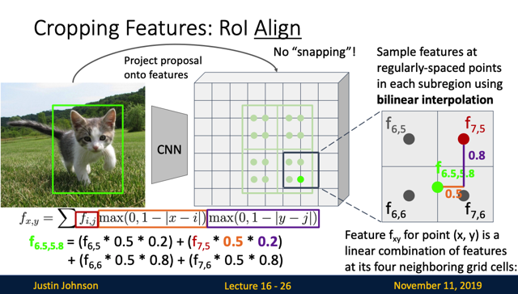</kbd>

<kbd>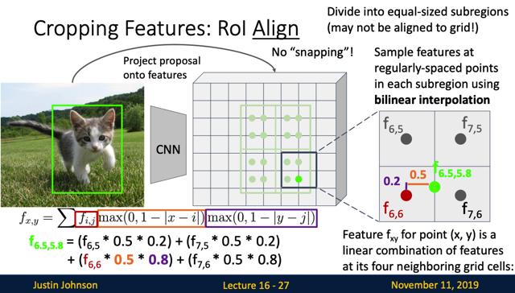</kbd>

<kbd>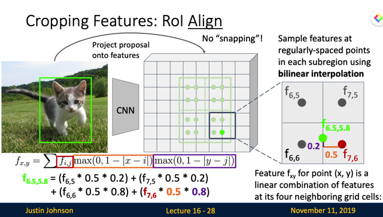</kbd>

<kbd></kbd>

<kbd></kbd>

<kbd></kbd>

<kbd>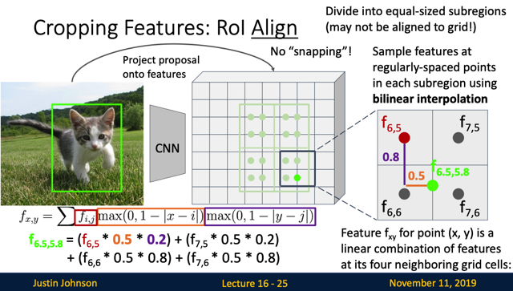</kbd>

 

<kbd>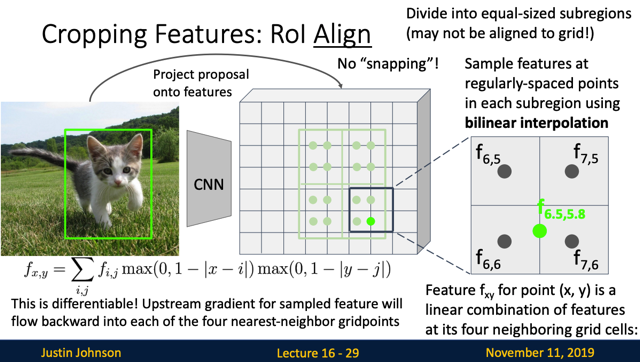</kbd>

> [!NOTE]
> và **quá trình tính toán này differentiable**, giúp
> khắc phục vấn đề hồi nãy nói

 

<kbd>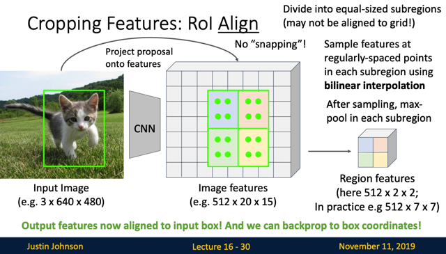</kbd>

> [!NOTE]
> và nó **cũng giải quyết vấn đề misalignment**
> luôn vì ta **ko còn "snapping" nữa**

 

<kbd>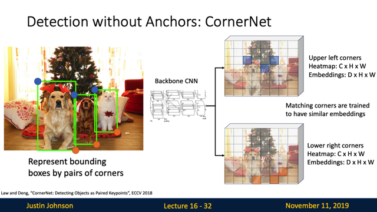</kbd>

> [!NOTE]
> đại khái là Justin đặt vấn đề liệu **có cách nào mà ta có thể thiết kế một
> object detector mà ta không phải dựa trên anchor box** hay không.
>
> Thì có một cách làm rất hay xuất phát từ chính đại học Michigan đó là
> **CornerNet**. Ý tưởng là, ta sẽ **train một mô hình trong đó một nhánh
> nó sẽ dự đoán xác suất một vị trí trên feature map** **là một upper-left
> corner**của một b. box. và **một nhánh khác dự đoán xác suất một vị trí
> trên feature map là một lower-right corner**. Và việc train sẽ dựa vào
> cross-entropy loss ở từng vị trí.
>
> Túc test phát sinh vấn đề là làm sao ghép các predicted upper-left và
> lower-right được thành một cặp, thì người ta **sẽ biểu diễn dưới dạng
> upper left và lower right embedding vector**. Để rồi**nếu hai vector gần
> nhau thì đó là một cặp, tạo thành một bounding box.**

 

## mAP & NMS

 

<kbd>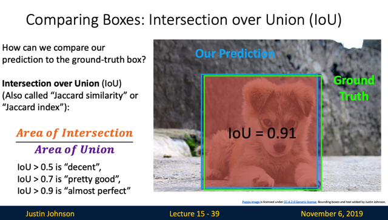</kbd>

<kbd></kbd>

<kbd>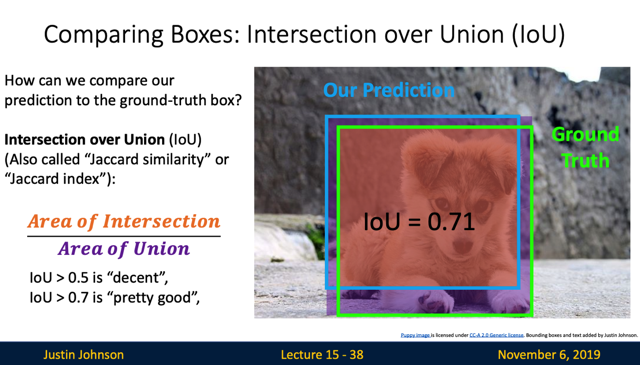</kbd>

> [!NOTE]
> đại khái là, ta cần một chỉ số để so sánh hai bbox để phục vụ cho bước 3
> trong đó ta cần chọn lọc những predicted bbox tốt nhất.  Ví dụ như khi so
> với target bbox Thì người ta dùng IoU, tỉ lệ giữa diện tích của phần
> intersection và phần union. Tỉ lệ càng cao thì đương nhiên càng tốt.

 

<kbd>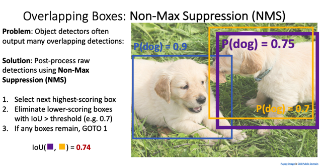</kbd>

<kbd></kbd>

<kbd>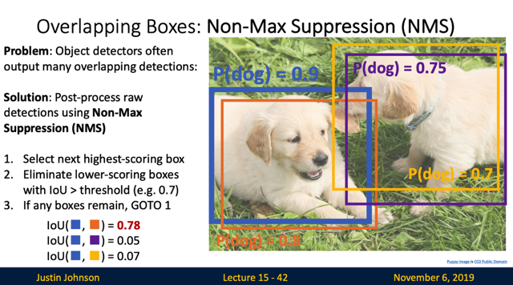</kbd>

> [!NOTE]
> tiếp theo đại khái là nói về vấn đề khi một object có thể có nhiều box, ta cần
> dùng một quá trình hậu xử lý (post-processing) để loại bỏ bớt, chỉ giữ lại  cái
> tốt nhất. Có nhiều cách, nhưng phổ biến nhất là Non-Max Suppression
> (NMS) mà mình đã biết ở DLSpec.
>
> Vậy thuật toán này đại ý là : Bỏ đi những box có độ overlap cao (tức chỉ số
> IoU)  với cái box có probability cao nhất.
>
> Ví dụ ở hai con chó này, model predicted ra 4 box. Thì đầu tiên ta xem cái
> nào có p cao nhất -> cái màu xanh. Vậy xem thử trong những cái còn lại cái
> nào overlap với nó cao nhất, hay IoU cao, thì loại bỏ đi. Cao là bao nhiêu thì
> ta định ra threshold ví dụ 0.7. Vậy trong 3 cái cam, vàng, tím. Có cái cam là
> có iou với  box xanh là lớn hơn 0.7 -> Loại bỏ box cam. Trong thực tế nếu
> còn các box khác cũng có iou với box xanh lớn hơn 0.7 thì loại hết.
>
> Thế thì mang ý nghĩa đơn giản là, ta chỉ dùng cái box có probability cao
> nhất, và bất cứ caí box nào khác có sự trùng lặp lớn với cái đó (đương nhiên
> sẽ có p thấp hơn vì đã nói cái kia có p cao nhất rồi) sẽ đều được cho là bị
> dư, trùng, nên bỏ đi.
>
> Rồi, tiếp theo ta sẽ chuyển sang cái khác (tức là không xét cái box xanh
> nữa)  có p cao nhất và lặp lại.

 

<kbd>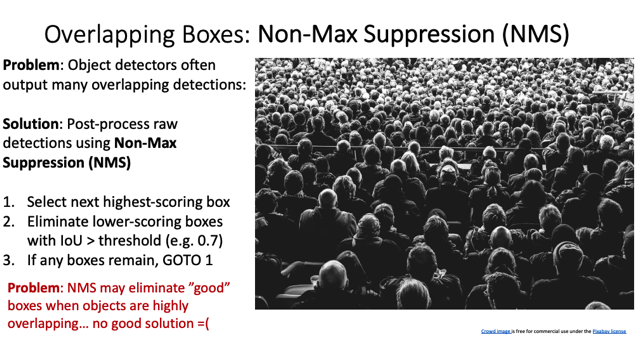</kbd>

> [!NOTE]
> Tuy nhiên NMS vẫn có hạn chế chưa khắc phục được tại thời điểm bài giảng
> đó là với những bức hình có rất nhiều object, khả năng là nó sẽ loại bỏ cả
> những box tốt. Cộng đồng vẫn đang nghiên cứu cách tốt hơn để làm.

 

<kbd>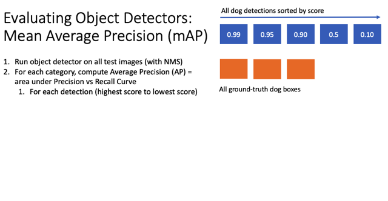</kbd>

> [!NOTE]
> Đại khái là so với bài toán classification trong đó để đánh giá hiệu  suất của
> classifier tương đối đơn giản với những công cụ như đã  Biết. Còn để đánh
> giá hiệu suất của Object Detectors ta cần một  chỉ số goị là Mean Average
> Precision, có liên quan đến Recall-Precision Curve mà ta đã được học ở
> HandsOnML A.Geron, trong đó nó cho biết tương quan của Precision và
> Recall với các threshold khác nhau.
>
> Vậy đầu tiên ta sẽ lấy object detector và inference các image của test set, rồi
> dùng NMS để loại đi các box dư như vừa nói.
>
> Bước 2: Với mỗi category, ta sẽ lấy ra hết các box gắn với category đó **trong 
> test set**, và sort theo p
>
> Ví dụ, mấy ô màu xanh đại diện cho các box có p_dog cao nhất của cả test
> set tức là trong test set, nhữn box nào thuộc về class dog, thì lấy ra sort theo
> p từ cao xuống thấp.
>
> Rồi, còn mấy ô cam đại diện các ground-truth boxed có "category = dog" **trong
> test set.**

 

<kbd>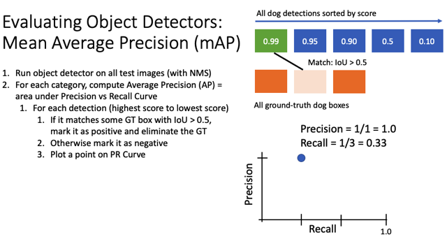</kbd>

> [!NOTE]
> Tiếp theo, ta mới lấy cái "dog box" có top score, xem thử nó có khớp với
> ground-truth "dog box" nào không bằng cách xét iou > 0.5
>
> Điều này thật ra có ý nghĩa là ta chọn một một **threshold (ngưỡng xác suất**
> mà ta quyết định rằng đó sẽ là "dog") **bằng 0.99, và xem thử với threshold
> này thì precision và recall là bao nhiêu (ta đang vẽ biểu đồ Precision Recall
> Curve mà)**
>
> giả sử thấy nó **match với một cái là ô cam ở giữa**. Tức là ta có 1 "True
> Positive"
>
> Khi đó ta sẽ "nói rằng" khi xét tại threshold 0.99 ta **có 1 dự đoán là positive
> thì nó " trúng" hết**, tức là Precision (độ chính xác là 1/1). Và mình liên hệ lại
> thì nó đương nhiên là tỉ lệ TP/(TP+FP): Trong những "cái" predict Positive thì
> đúng (True) được bao nhiêu %. Ở đây, xét "những cái có p dog cao nhất", dự
> đoán 1 cái thì đúng cả 1 nên Precision = 1.
>
> Còn trong 3 box là Positive thì chỉ "phát hiện được 1" nên độ nhạy Sensitivity
> hay Recall là 1/3.
>
> Từ đó ta vẽ được một điểm của Precision-Recall Curve.

 

<kbd>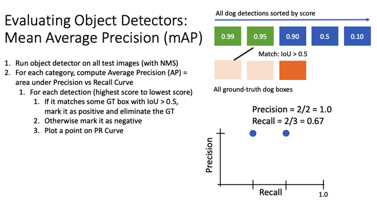</kbd>

> [!NOTE]
> Tiếp ta check cái dog box có p = 0.5, cũng đồng ý nghĩa là ta hạ
> threshold xuống còn 0.95 và xem thử precision và recall bao nhiêu.
>
> Giả sử cái dog box 0.95 nó **match với thêm một ground truth nữa**.
> tức là thêm một True Positive nữa
>
> Vậy, trong "2 box được predict là positive" thì "trúng" cả 2 -> Precision
> = 2/2 = 1.
>
> Và trong 3 truth thì trúng dc 2, -> Sensitivity = Recall  = 2/3.
>
> Vẽ thêm 1 điểm nữa

 

<kbd>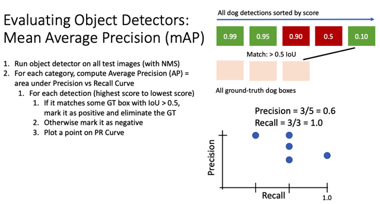</kbd>

> [!NOTE]
> tiếp, "hạ threshold" xuống 0.9, thì giả sử cái bbox có p = 0.9 không match với 
> truth box nào, tức là nó là False Positive. Vậy Precision trở thành 2/3
> và Sensitivity = 2/3.
>
> Tiếp hạ threshold xuống 0.5, cái bbox có p 0.5 giả sử cũng không match, vậy
> là thêm một false positive nữa -> Precision = 2/4, Sensitivity = 2/3
>
> Tiếp, với threshold = 0.1, giả sử cái bbox này lại match với true box, tức 
> là thêm một True Positive, nên Precision = 3/5, Sensitivity = 3/3.
>
> Ta vẽ được P.R curve.

 

<kbd>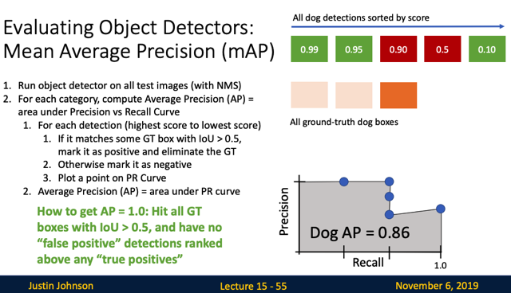</kbd>

> [!NOTE]
> và khi đó Area Under the Curve (AUC) chính là chỉ số mean Average Precision
> ta cần. Vậy để hiểu ý nghĩa của việc tại sao ta dùng chỉ số này để đánh giá  một
> Object Detector thì cần hình dung khi nào thì ta có mAP = 1.
>
> mAP = 1 khi, khi threshold giảm dần thì precision luôn = 1, và sensitivity sẽ dần
> dần -> 1: nôm na là, giảm dần ngưỡng thì các ngày càng nhiều dự đoán dương
> tính và cái nào cũng đúng đồng thời số case dương tính thật sự cũng dần được
> phát hiện đủ, để rồi khi phát hiện đầy đủ các case dương tính thật rồi tức là độ
> nhạy đã = 100% rồi thì độ chính xác vẫn = 100% (tức là tất cả những dự đoán
> dương tính đều đúng, hay vừa đủ, vừa đúng)
>
> Mà chiếu theo chuỗi box ở trên, muốn được vậy thì các box "trúng" (tức là
> match với orange box / hay true positive) sẽ đều phải nằm ở trước, để khi giảm
> threshold dần dần đều phát hiện được chúng. Điều này rõ ràng mang ý nghĩa
> rằng, các box dự đoán có p cao đều match với truth box, còn các box không
> match đều có p thấp. Được như vậy rõ ràng là một Object Detector tốt. 
>
> Justin nói thêm, thực tế cho thấy có những bài toán người ta cần precision cao
> ví dụ như trong xe tự lái, ta không muốn miss bất kì cái xe nào xung quanh, thì
> ở đây ta muốn độ nhạy sensitivity phải cao, dù có thể hi sinh precision (phát hiện
> hết các xe hơi xung quanh nhưng chấp nhận có những cái ko phải là xe)
>
> Tóm lại là tùy hoàn cảnh cụ thể mà ta có thể ưu tiên Precision hay Sensitivity
> nhưng P-R curve cho ta một đánh giá tổng thể khả năng của model. (nó giống
> việc ta đánh giá Classification model vậy)

 

<kbd></kbd>

> [!NOTE]
> và đương nhiên với mỗi category ta sẽ tính
> một cái như vậy,. Và average lại

 

<kbd>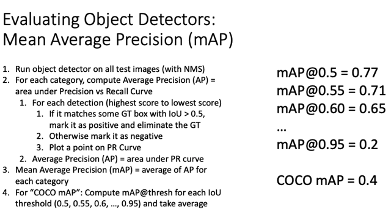</kbd>

> [!NOTE]
> và đó cũng chỉ là ta đang dùng IoU threshold 0.5, người ta sẽ lặp lại với các
> threshold khác. Và average lại hết mới được cái mAP cuối cùng

 

