# Paper: Batch normalization

📊 **Progress:** `19` Notes | `41` Screenshots

---
<a id="node-834"></a>

<p align="center"><kbd>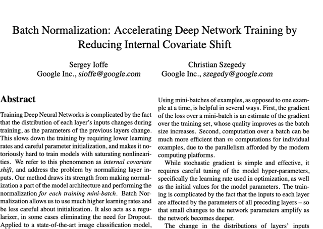</kbd></p>

<br>

<a id="node-835"></a>

<p align="center"><kbd>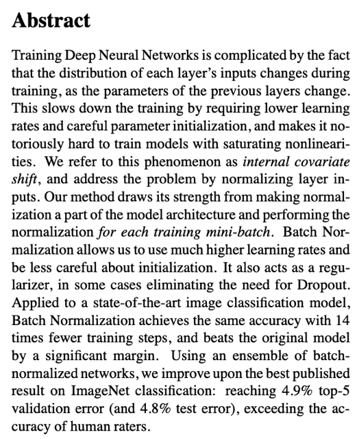</kbd></p>

> [!NOTE]
> Đại ý là việc training deep nn phức tạp do**distribution của input vào
> mỗi layer thay đổi liên tục trong quá trình training**. Dẫn đến**làm
> chậm quá trình training** khi ta **phải dùng learning rate nhỏ**, cũng
> như phải rất c**ẩn thận với bước parameter initialization vì rất dễ
> dẫn tới `vanishing/exploding` gradient** nên rất khó khăn khi training
> với các hàm nonlinearity có tính chất saturating (ý nói cái đuôi có
> gradient `~=` 0 như sigmoid, tanh)
>
> Cái hiện tượng trên dc gọi là**internal covariate shift,**thì BN sẽ cố
> gắng khắc phục bằng cách **normalizing input của mỗi layer**Phương pháp này sẽ đại khái là **tích hợp quá trình normalization
> thành một phần của model architecture**, và nó sẽ thực hiện
> **normalization với từng training mini batch.**Kết quả cho thấy nó giúp c**onverge nhanh hơn** vì **có thể dùng
> lr lớn hơn và ít cần quan tâm về weight initialization hơn mà không
> sợ bị `exploding/vanishing` gradient**như đã biết.
>
> Ngoài ta nó còn có vai trò của regularization technique, từ đó giảm
> bớt việc phải dùng các kĩ thuật regularization khác như Dropout.
>
> Nói chung là tác giả công bố nó giúp giảm error rate của ImageNet
> model đáng kể

<br>

<a id="node-836"></a>

<p align="center"><kbd>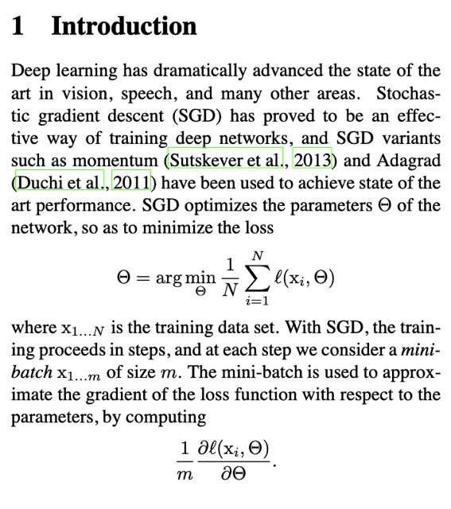</kbd></p>

> [!NOTE]
> nói về SGD và các cải tiến của nó đã được chứng mình giúp
> training nn hiểu quả. Trong đó ta sẽ đặt mục tiêu là tìm ra
> param khiến loss trên training set nhỏ nhất, và ta làm việc này
> bằng cách dùng gradient (derivative of loss trên w.r.t param) 
> ước lượng từ (một mini batch) để update params

<br>

<a id="node-837"></a>

<p align="center"><kbd>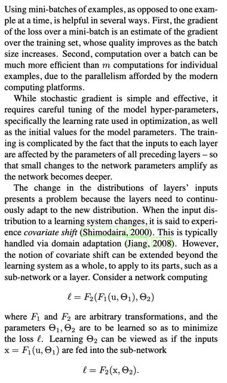</kbd></p>

> [!NOTE]
> đoạn đầu nhắc lại cho ta biết rằng lợi ích của
> mini batch để trong training là giúp **estimate
> gradient tốt hơn là dùng một sample**, đồng thời
> phát huy tác dụng của khả năng**tính toán song
> song**trong máy tính hiện đại với `GPU/TPU...`
>
> Tiếp theo đại ý là tuy rằng SGD thì đơn
> giản và hiệu quả nhưng lại cần phải tuning lr rất kĩ
> cũng như là weight initialization. Khi càng có nhiều
> layer thì chỉ một thay đổi nhỏ của lr, hay weight ini
> cũng sẽ bị khuếch đại lên, để rồi model trở nên
> rất sensitive với lr và weight initialization

<br>

<a id="node-838"></a>

<p align="center"><kbd>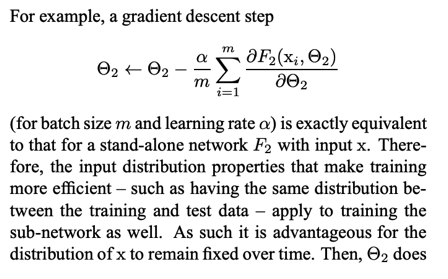</kbd></p>

<p align="center"><kbd></kbd></p>

<p align="center"><kbd>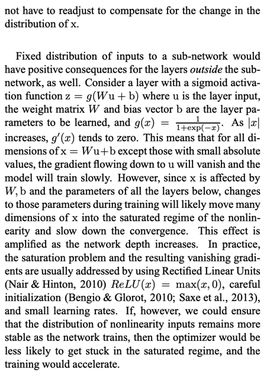</kbd></p>

> [!NOTE]
> việc này cũng **hữu ích khi xét input vào một layer có output
> là sigmoid** hay activation function nào mà có cái tính chất bị
> saturated (như tanh, nếu input vào sigmoid mà lớn thì local
> grad sẽ bằng 0, gây vanish gradient). Vậy ý là nếu ouput x `=`
> Wu `+` b mà đang tốt để qua sigmoid không bị kích hoạt ở
> vùng có grad `~=0` thì một sự thay đổi nào đó từ W, b hay từ
> các layer trước dẫn đến u sẽ khiến sigmoid(x) lại rơi vào
> vùng `grad~=0.`
>
> Nói chung là **gây ra nhạy cảm, dễ bị mất ổn định của** quá
> trình huấn luyện
>
> Rồi, thế thì tuy rằng các nghiên cứu của Hinton, Bengio,.. đã
> phần nào khắc phục bằng cách dùng **relu** thay tanh,
> sigmoid, rồi các **strategy weight initialization** nhưng  ta có
> thể dùng BN để đảm bảo distribution của các layer input
> được ổn định

> [!NOTE]
> Ý này chính là Andrew Ng đã nói trong DL Spec, đại khái 
> nếu distribution của input vào layer sau (theta2) cứ thay đổi
> liên tục thì **theta 2 phải liên tục điều chỉnh**, dẫn đến nó **khó
> học một cách hiệu quả**. Theo cách diễn đạt của Andrew Ng
> thì giống như nó đang chuẩn bị nắm bắt một pattern nào
> đó rồi thì phải học lại từ đầu.
>
> Do đó nếu có thể cố định distribution output của layer 1 sẽ
> **giúp việc học hiệu quả hơn**

<br>

<a id="node-839"></a>

<p align="center"><kbd>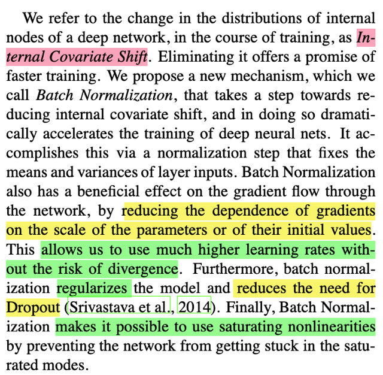</kbd></p>

> [!NOTE]
> như đã nói ở phần mở màn, BN giúp **bớt phụ thuộc vào weight ini,
> Cho phép có thể dùng lr lớn** (trong phần assignment 2 Deep FC đã thấy,
> với **nhiều layer, model rất nhạy cảm với weight scale**, và cũng thấy
> rằng **lr phải giữ mức nhỏ nếu không rất dễ bị divergence
>
> Ngoài ra còn vai trò regularization cũng như cho phép xài hàm 
> saturating nonlinearity**

<br>

<a id="node-840"></a>

<p align="center"><kbd>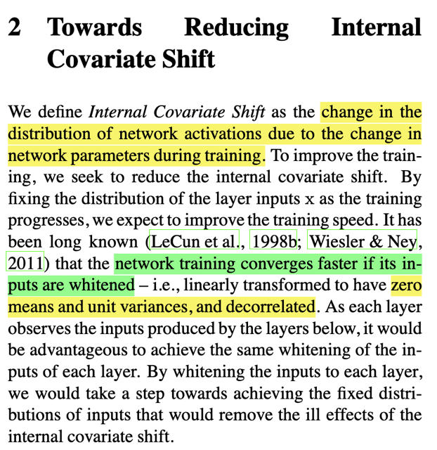</kbd></p>

> [!NOTE]
> Nhắc khái niệm**Internal Covariate Shift** lần nữa là khi distrib của
> activation (output của layer) bị thay đổi trong quá trình training do
> param dc update liên tục.
>
> Sau đó tác giả nhắc đến các công trình nghiên cứu của Yan Lecun
> Cho thấy việc thực hiện **whitening** (transform data sao cho zero
> center,  và variance `=` 1, như đã biết trong lec note) input sẽ giúp
> training converge nhanh hơn

<br>

<a id="node-841"></a>

<p align="center"><kbd>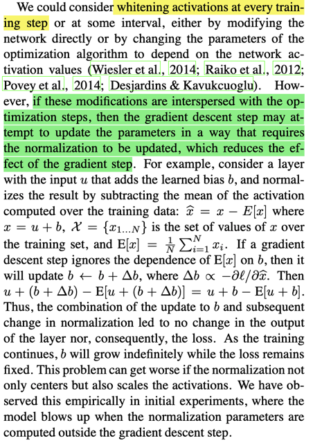</kbd></p>

> [!NOTE]
> đoạn này chưa hiểu cụ thể nhưng đại ý là nếu
> thực hiện whitening output theo cách này thì nó lại
> **hủy đi tác dụng của gradient descent** khiến
> output và loss không đổi.
>
> Nôm na là **g.d giúp thay đổi params**, nhưng **bước
> normalization lại sau đó lại khiến hủy đi kết quả** này
> để rồi mặc dù b (learned param trong ví dụ này) cứ
> lớn lên mãi nhưng output vẫn gĩư nguyên

<br>

<a id="node-842"></a>

<p align="center"><kbd>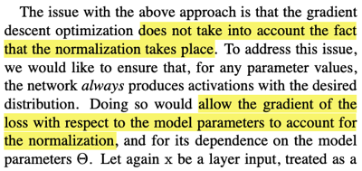</kbd></p>

<p align="center"><kbd></kbd></p>

<p align="center"><kbd>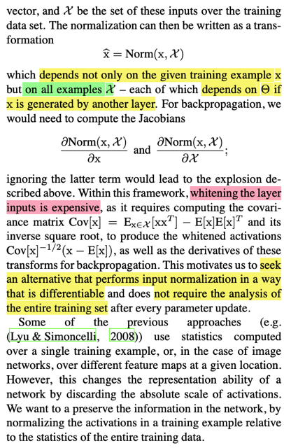</kbd></p>

> [!NOTE]
> Có thể hiểu là vấn đề trên xảy ra là do khi tính
> derivative của loss w.r.t params, thì lại không
> tính đến sự ảnh hưởng của normalization lên
> loss. Hay cụ thể hơn, nếu **coi quá trình
> normalization là một phép biến đổi Norm(x, X)**trong đó ta**dùng các statistic tính bởi X** là
> set các input (output của layer trước) để thực
> hiện whitening. Vậy thì khi backpropagation
> để **tính gradient dx phải có sự tham gia của
> dNorm(x, X) /dX**thì mới chính xác.
>
> Mà quá trình này sẽ **tốn kém** khi phải tính
> covariance matrix cov(X) và căn bậc hai của
> matrix inverse của nó `cov(x)^-1.`
>
> Do đó cần phải có cách tiếp cận khác.

<br>

<a id="node-843"></a>

<p align="center"><kbd>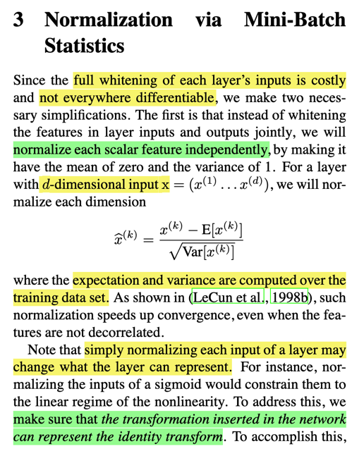</kbd></p>

> [!NOTE]
> cách làm sẽ là tính **mean và variance của mỗi feature**và dùng những chỉ số này để transform thành zero
> centered `+` unit variance.
>
> Tuy nhiên vì việc này có thể làm thay đổi representation
> của layer `-` đại khái là làm **thay đổi thông tin** nên người ta
> đưa vào hai **learnable params**cho mỗi feature, đóng vai
> trò là**scale và shift param.**

<br>

<a id="node-844"></a>

<p align="center"><kbd>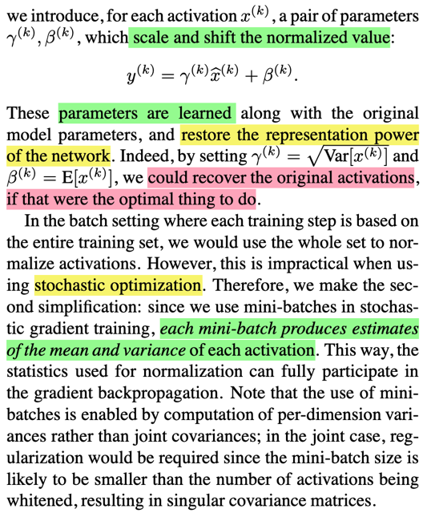</kbd></p>

> [!NOTE]
> Mục đích là giúp **cho phép model tự học** ra các giá trị của
> các thông số  trong việc normalization này **mà nó cho là tốt
> nhất**chứ không nhất thiết là unit variance zero mean. Mà một
> ví dụ đó là **nếu nó thấy không cần thiết phải biến đổi**thì nó
> có thể cho ra beta là mean[x], gamma là  sqrtVar[x] giúp**đảo
> ngược quá trình transform để thành identity mapping** (tức là
> có sao để vậy)
>
> Và vì quá trình training dùng stochastic optimization (chứ không
> phải full batch optimization) nên mean và variance sẽ được 
> estimated từ một mini batch

> [!NOTE]
> Khúc dưới họ nói về việc **tính toán các statistic** cho quá trình
> **normalization là `per-dimension` thay vì joint covariance,
> Chưa hiểu lắm**

<br>

<a id="node-845"></a>

<p align="center"><kbd>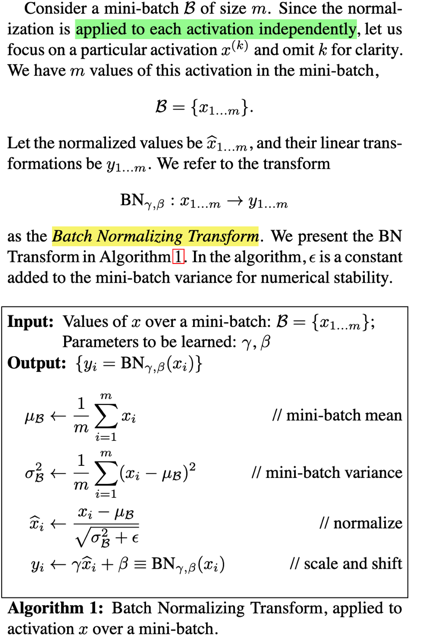</kbd></p>

> [!NOTE]
> các bước làm sẽ là, với input là một `mini-batch`
> các output của một layer. gọi là B `=` {x1, x2,...
> xm}. Mỗi xi đương nhiên là vector.
>
> 1. Đầu tiên tính mini batch mean (vector). từ các
> xi, mỗi phần tử của nó đương nhiên là mean của
> feature value tương ứng.
>
> 2. Tính `mini-batch` variance.
>
> 3.Thực hiện normalize bằng cách trừ mean và
> chia cho standard deviation `(+` epsilon)
>
> 4.Nhân thêm cho learnable scale param và cộng
> learnable shift param

<br>

<a id="node-846"></a>

<p align="center"><kbd>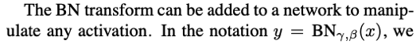</kbd></p>

<p align="center"><kbd></kbd></p>

<p align="center"><kbd>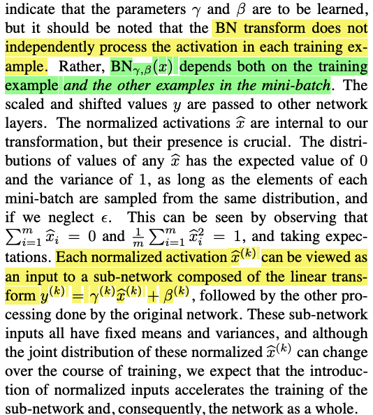</kbd></p>

<br>

<a id="node-847"></a>

<p align="center"><kbd>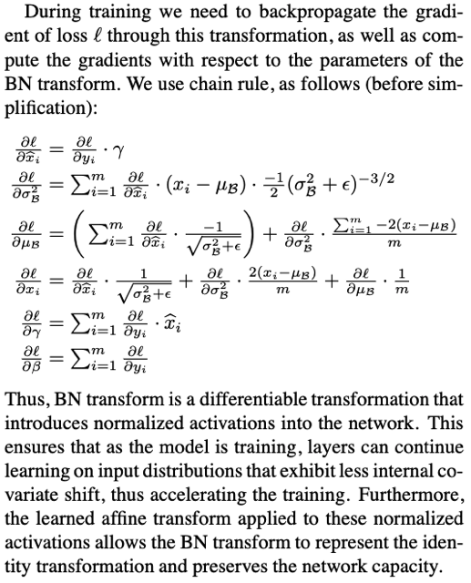</kbd></p>

> [!NOTE]
> Dùng chain rule với computation graph có
> thể hiểu các công thức gradient

<br>

<a id="node-848"></a>

<p align="center"><kbd>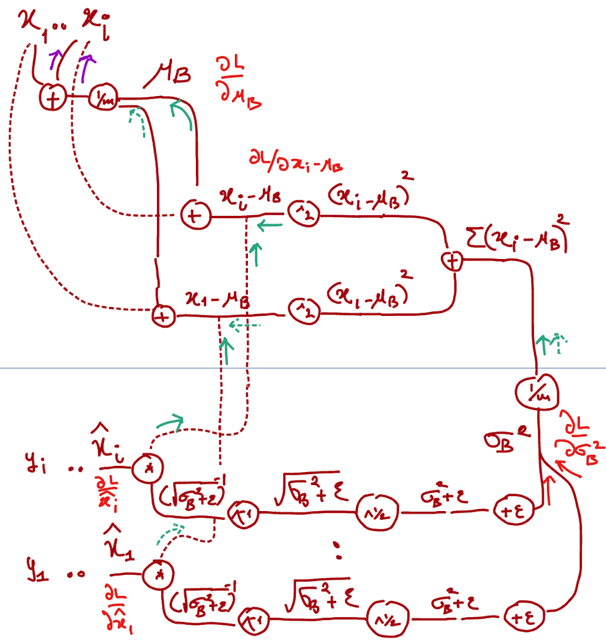</kbd></p>

<br>

<a id="node-849"></a>

<p align="center"><kbd>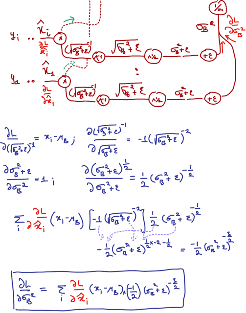</kbd></p>

> [!NOTE]
> batch variance sigmaB**2 chẽ ra tham gia tính toán vối các
> x^(i), nên gradient của nó phải là sum của các `dL/dvarianceB(i)`
> từ các nhánh. Mỗi nhánh thì dựa vào chain rule tính bằng
> `dL/dx^(i)` nhân với tích các local grad

<br>

<a id="node-850"></a>

<p align="center"><kbd>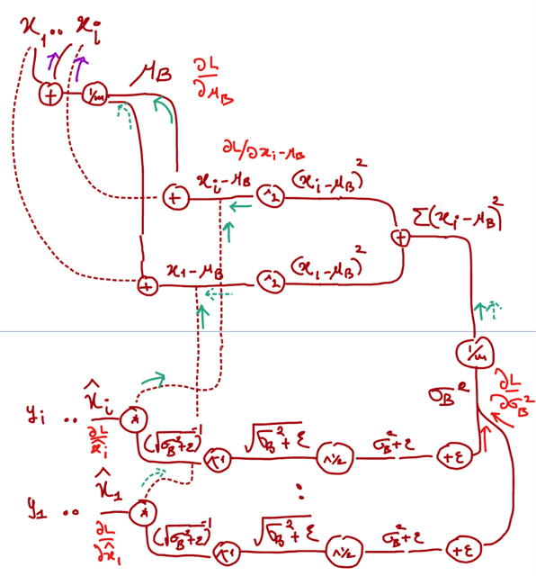</kbd></p>

> [!NOTE]
> `dL/dmuB` là tổng của nhiều nhánh. Trong đó mỗi nhánh
> là hợp của 2 nhánh vì `xi-muB` tách ra 2 nhánh để tính

<br>

<a id="node-851"></a>

<p align="center"><kbd>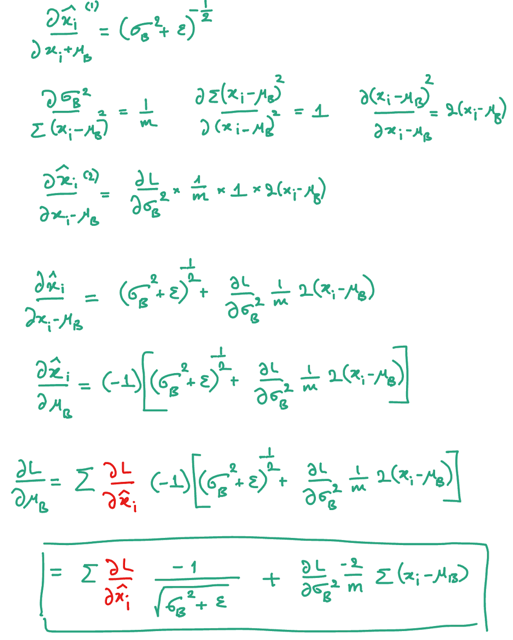</kbd></p>

<br>

<a id="node-852"></a>

<p align="center"><kbd>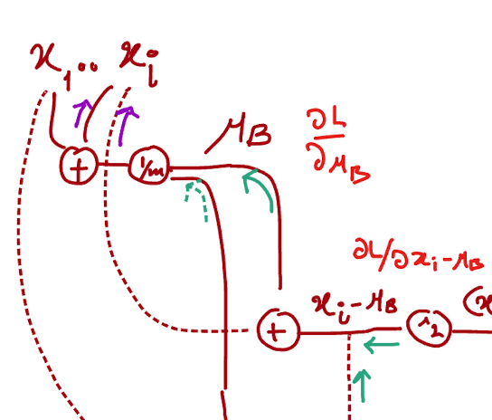</kbd></p>

<p align="center"><kbd></kbd></p>

<p align="center"><kbd>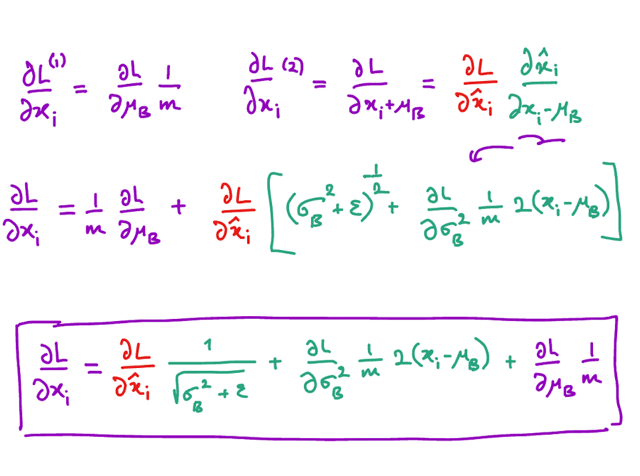</kbd></p>

<br>

<a id="node-853"></a>

<p align="center"><kbd>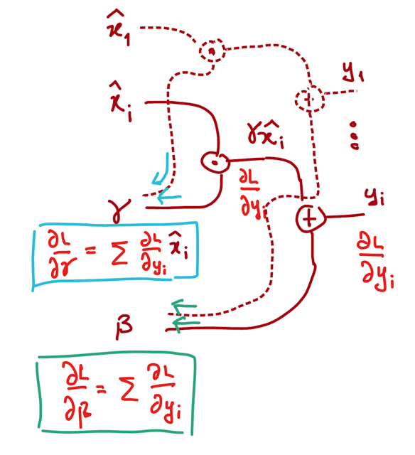</kbd></p>

<br>

<a id="node-854"></a>

<p align="center"><kbd>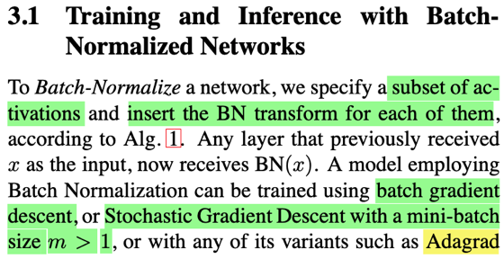</kbd></p>

<p align="center"><kbd>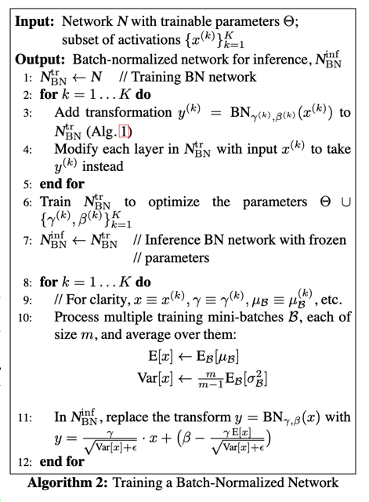</kbd></p>

<p align="center"><kbd>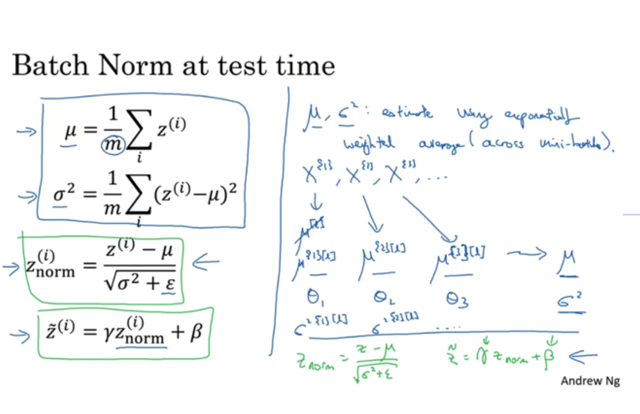</kbd></p>

<p align="center"><kbd></kbd></p>

<p align="center"><kbd></kbd></p>

<p align="center"><kbd></kbd></p>

<p align="center"><kbd>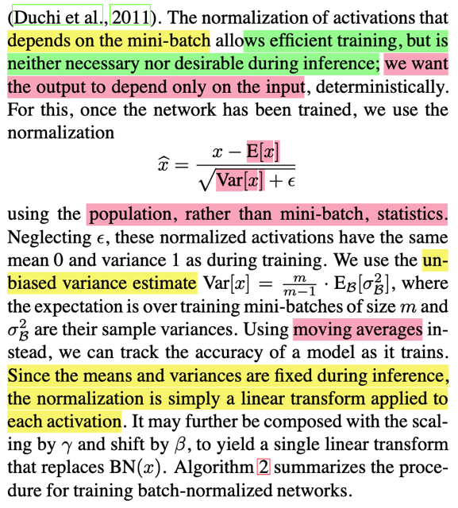</kbd></p>

> [!NOTE]
> đại khái là, tóm lại để thực thi BN, ta sẽ 'làm' với các batch of
> activation. Điều này yêu cầu là **phải train với full batch** hoặc
> SGD (hoặc các cái khác như AdaGrad, Momentum..) nhưng
> **size của mini batch > 1.**
>
> Khi**training thì dùng running statistic** (trong paper dùng từ
> moving average) của mini batch.
>
> Lúc **test `/` inference thì theo trong paper thì ta sẽ dùng `E[x],` sqrt
> `Var[x]` là population statistic** tức là mean và variance tính bởi full
> training set.
>
> *Tuy nhiên trong **assignment** và cả trong DLSpec, cũng đều
> cho rằng lúc **test time dùng running average, và trong pytorch7**cũng làm vậy
>
> Vì lúc này chỉ dùng**'running' statistic là mean và variance**
> được tính như tên gọi là running trong training: Theo DLSpec, ta
> sẽ giữ một **exponential decay ing running averag**e kiểu như
> mu `=` 0. 9*mu `+` `mu_B`
>
> Nên cơ bản lúc inference, với activation (1 sample thôi) x, Thực
> hiện **normalize với running mean và variance, rồi linear
> transform với gamma (scale param) và beta (shift) para**

<br>

<a id="node-855"></a>

<p align="center"><kbd>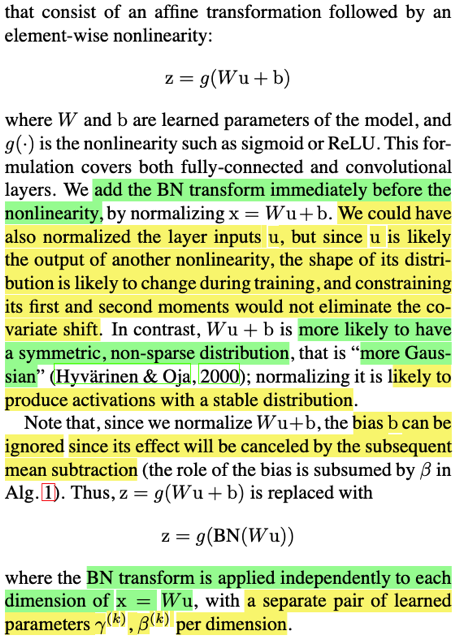</kbd></p>

<p align="center"><kbd></kbd></p>

<p align="center"><kbd>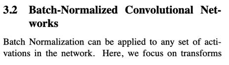</kbd></p>

> [!NOTE]
> ở đây đại ý là nói rằng trong batch normalization, ta sẽ
> add bước BN đối với kết quả của affine transformation
> x  `=` `(Wu+b).` Có nói lí do ta ko apply nó với u hay với 
> sigma(x) là bởi việc trải qua nonlinearity khiến distribution
> bất ổn, dẫn tới dù có normalize bằng mean và variance
> (first và second moment ở đây chính là nói đến mean và
> variance) cũng không có tác dụng.
>
> Ngược lại, nếu áp dụng BN vào x, sẽ khiến nó 'có vẻ gần
> với Gaussian distribution' (lại loại tạm gọi là model rất thích)
> nhờ đó giúp ổn định quá trình training.
>
> Nói về bias  term b, đại ý là vai trò của nó nếu có dụng trong
> BN cũng bị vô hiệu khi qua bước scale & shift nên người ta
> không dùng. Tức là BN sẽ chỉ tính với x `=` Wu
>
> Ý cuối, cho biết sẽ có một cặp gamma và beta ứng với mỗi
> dimension của x. Dễ hiểu thôi không có gì bối rối, ta biết
> như người ta nói nãy h, batch norm sẽ 'áp dụng' với `per/dimension`
> tức là x là một D dimension vector  [x1,x2..,xD].
>
> Thì một batch, tạm kí hiệu Xb là matrix `batch_dim` hàng, D cột
> thì ta sẽ tính vector `mu_b` là `D-dimensional` vector, mỗi phần tử
> là mean của các feature values tương ứng ví dụ mu1 là mean của
> x(1)1, x(2)1...x(N)1. Variance cũng vậy.
>
> Khi đó thực hiện normalization thì ta sẽ trừ feature value cho 
> mean của feature đó, sau đó chia cho variance của feature đó.
>
> Rồi mới qua bước scale & shift. Thì scale và shift param cũng
> sẽ là `D-dimensional` vector, mỗi feature có một scale và shift param.
>
> Đặng (ví dụ đang làm cho 1 sample cho dễ) thì ta sẽ có:
>
> ```text
> x^ = [γ1x1+β1, γ2x2+β2,...γDxD+βD] = γ*x + β (vector gamma
> ```
> `element-wise` multilply với vector x, cộng vector beta)

<br>

<a id="node-856"></a>

<p align="center"><kbd>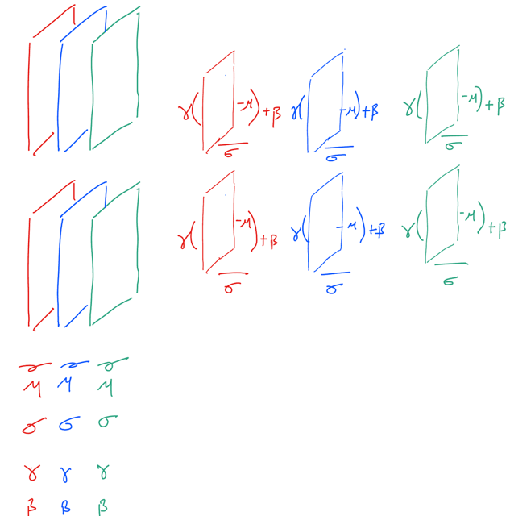</kbd></p>

<p align="center"><kbd></kbd></p>

<p align="center"><kbd>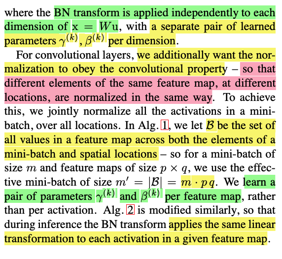</kbd></p>

> [!NOTE]
> Vậy với conv layer, đại khái là ở đây người ta nói: nhiều element khác
> nhau tại các vị trí khác nhau trong cùng feature map sẽ được normalize
> giống nhau. Có thể hiểu ý này, khi so sánh với FC layer, thì trong đó mọi
> element trong cùng một feature, tức là một cột trong matrix `X_batch` có
> shape là NxD, N hàng là N sample trong batch D là số feature, của một
> feature vector. Vậy ta sẽ normalize bằng cách trừ mỗi feature value cho
> mean của feature đó tính bởi một batch. Ví dụ x(1)1 `-` `mean_1,` x(2)1 `-`
> `mean_2....x(N)1` `-` `mean_D,` rồi chia cho standard deviation cũng tương
> tự.
>
> Thế thì với conv, ta sẽ tính mean của activation map và trên các sample
> trong batch. HÌnh dung thế này:
>
> Mỗi batch giờ không phải là có shape (N,D) mà là (N,C,W,H), C là số là
> depth, là số activation map. W,H là spatial size. Vậy giả sử N `=` 2, C `=` 3
> cho dễ nói chuyện. Thế thì ta sẽ có 2 BLOCK, (N `=` 2), mỗi block có 3
> miếng (C `=` 3), mỗi miếng là hình vuông WxH.
>
> Vậy ta sẽ tính ra 3 cái mean: mean 1 sẽ là trung bình của 2 miếng ở vị trí
> thứ 1 của 2 block. Nên nó sẽ là trung bình của 2*(W*H) (ở trong paper
> ghi (m*pq) unit. Tương tự tính cho mean 2, mean 3 của miếng (feature
> map) thứ 2, 3. Variance cũng tương tự.
>
> Rồi nói đến bước scale & shift. Thì ở paper nói mỗi feature map có một
> cặp gamma, beta là hoàn toàn dễ hiểu. Khi so sánh với FC batch norm là
> mỗi feature trong D feature có một cặp gamma, beta.
>
> Như vậy có thể thấy, khi tính mean1,2,3 và variance 1,2,3 tương ứng với
> 3 feature map. Thì ta sẽ normalize bằng cách feature map nào thì trừ
> mean feature map tương ứng, sau đó chia cho variance tương ứng.
>
> Xong sẽ nhân element wise với gamma, và cộng beta. Như vậy ở đây ta
> sẽ chỉ  có 3 cặp gamma, beta.

<br>

