# Segmentation

📊 **Progress:** `20` Notes | `26` Screenshots

---

<kbd>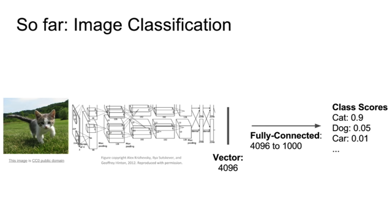</kbd>

> [!NOTE]
> Cho tới giờ ta chỉ làm bài toán image classification, với cnn xử lý
> một input image ví dụ vgg để rồi last fc layer output ra một vector
> 4096, được pass qua output layer 1000 unit để ra 1000 class scores

 

<kbd>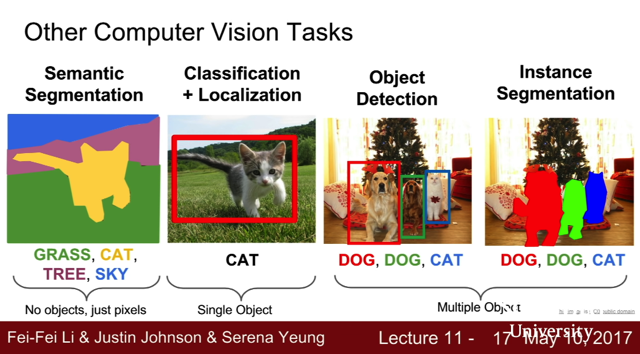</kbd>

 

<kbd>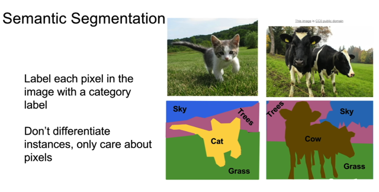</kbd>

> [!NOTE]
> đầu tiên là segmentation, trong đó thay vì chỉ classify cả bức ảnh nói chung
> thì ta muốn classify từng pixel. Để rồi label sẽ có dạng như vầy, được label
>
> Cái này có đặc điểm, ví dụ như (những pixel) chỗ hai con bò trong hình sẽ 
> đều được gán label là "cow" chứ không cần phân biệt con nào. Đây là nhược
> điểm mà qua Instance Segmentation sẽ được khắc phục.

 

<kbd>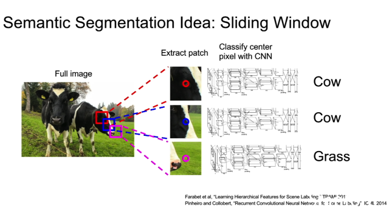</kbd>

> [!NOTE]
> đại ý là ta có thể dùng một image classification model để thực hiện bài toán
> segmentation theo cách sau: Ta sẽ dùng cách thức là sliding window có thể
> hiểu đại khái là ta sẽ train một classification model để map input là các crop
> window với class của cái pixel ở giữa window đó. Khi đó, ta sẽ dùng mô hình
> classification để tạo segmentation bằng cách slide cái window qua hết caí
> hình, mỗi lần thì forward cái crop Image qua classifier để predict ra class của
> pixel. Kết quả là ta sẽ cũng có được segmentation.

 

<kbd>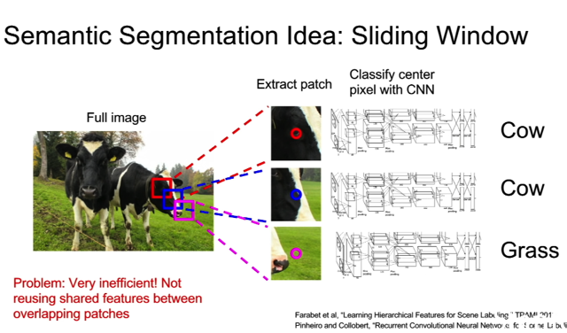</kbd>

> [!NOTE]
> Tuy nhiên cách này rất không hiệu quả

 

<kbd>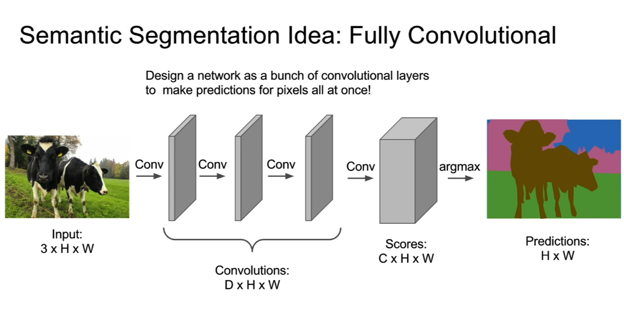</kbd>

> [!NOTE]
> cách làm thứ hai là Fully Convolutional, tức dùng convolution layer với chỉ ..
> conv  layer chứ không có pooling hay gì hết, với conv  layer cuối có output
> shape là (C,H,W) (tức cùng spatial size với input image) C là số class. Và
> một (tạm gọi là depth) vector (vector mà các unit là ở cùng  một vị trí trong
> các spatial map khác nhau) sẽ mang tính chất là chứa các  class scores mà
> model dự đoán cho pixel tại vị trí đó. Rồi cũng qua softmax để biến thành
> predicted probability distribution.
>
> Loss function sẽ là ta sẽ tính cross entropy loss giữa ground truth probability
> và predicted probability distribution. Để rồi sum / average loss trên mọi pixel
> để có cost function.
>
> Có câu hỏi đại ý là có phải ta sẽ giả định rằng là ta đã biết trước các class
> ko? -> Đúng vậy, giống như bài toán classification thôi

 

<kbd>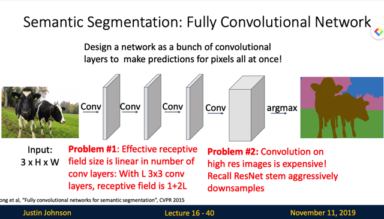</kbd>

> [!NOTE]
> đại khái là Justin cho biết nếu train một deep cnn model với cứ same
> padding trong suốt các layer thì nó tuy sẽ đạt hiệu suất tốt như lại vô
> cùng tốn kém về tính toán và memory.
>
> Ngoài ra Justin còn nhắc lại cái vụ khi ta stack nhiều conv layer lại thì
> effective receptive field sẽ mở rộng từ từ một cách tuyến tính vậy với
> cái kiểu mà ko dùng pooling thì phải cần rất nhiều conv layer thì
> effective receptive field mới  mở rộng đủ để cover hết image

 

<kbd>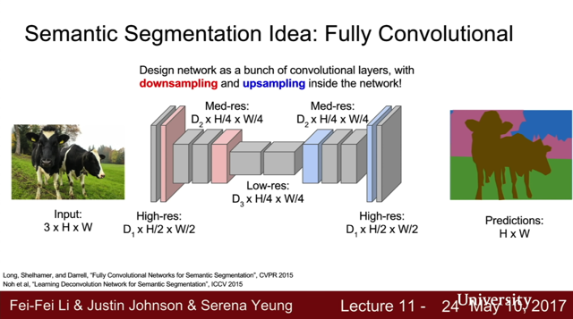</kbd>

> [!NOTE]
> Do đó người ta thường dùng kiến trúc model mà trong đó phần đầu qua từng
> layer output sẽ ngày càng nhỏ lại bề W,H nhưng dày lên bề sâu giống như
> các kiến trúc cnn của classification. Nhưng phần hai, thì ngược lại để dần
> khôi phục spatial size và giảm depth.
>
> Thì cái này nhờ giảm spatial size nên cho phép receptive field có thể tăng lên
> nhanh hơn nhiều

 

<kbd>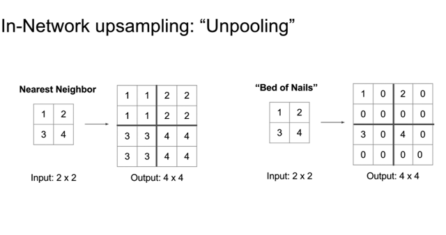</kbd>

> [!NOTE]
> Nói về cách để upsampling (tăng spatial size) thì đầu tiên là un-pooling,  có
> hai loại nearest neighbor trong đó nearest neighbor thì đơn giản là ta copy
> nó ra những vùng xung quanh. Còn bed of nails thì giá trị cũ cứ nằm ở góc,
> chèn mấy số 0 vào thôi (gọi là bed of nails vì chỉ có vài chỗ có giá trị, còn
> lại là ko giống như cái chân giường).

 

<kbd>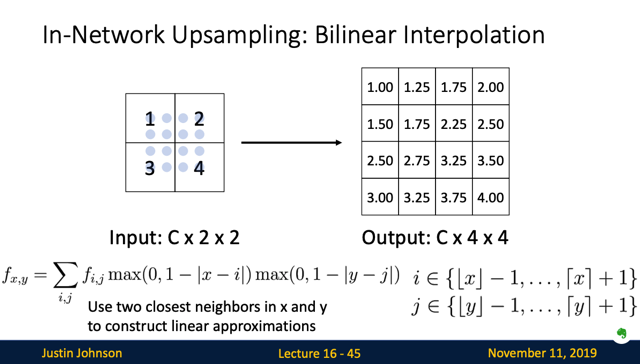</kbd>

> [!NOTE]
> rồi, tương tự như cái bilinear interpolation ta đã làm hồi nãy RoI Aligned,
> thì ta cũng có thể áp dụng vào đây. Với các vị trí bed nails ta sẽ
> interpolate sang các vị trí khác để tạo ra một phiên bản max pooling
> mượt hơn

 

<kbd>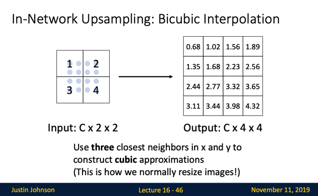</kbd>

> [!NOTE]
> Một cách khác nữa là Bicubic
> interpolation, có thể tìm hiểu sau

 

<kbd>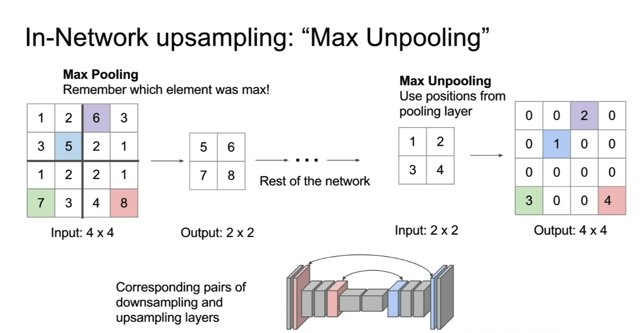</kbd>

> [!NOTE]
> tiếp theo nói về khái niệm Max Unpooling, giải thích có thể dài dòng nhưng
> nhìn hình là hiểu liền. Đại khái là ví dụ lúc downsampling trong 4 ô 1,2,3, 5
> thì số 5 lớn nhất thì lúc Unpooling, ta cũng sẽ để số 1 nằm tại vị trí tương
> ứng với số 5 hồi nãy, thay vì nếu là pooling như hồi nãy thì cứ cho 1 nằm
> ở góc.
>
> Và một nguyên tắc đó là, lúc downsampling nếu dùng average pooling thì
> lúc upsampling nên dùng nearest neighbor unpooling. Còn lúc down
> sampling dùng max pooling thì lúc upsampling dùng max upsampling

 

<kbd>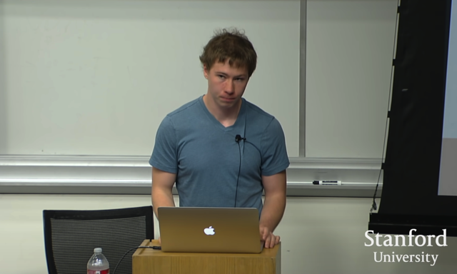</kbd>

> [!NOTE]
> Câu hỏi là tại sao việc (tạm gọi là) "giữ lại vị trí gốc" như vừa rồi lại quan
> trọng: Thì đại khái là vì khi mã pooling, theo ý nghĩa nào đó thì ít nhiều thông
> tin ở chiều spatial đã bị mất, ví dụ như từ 4 'ô' [1,2,3,5] qua max pooling chỉ
> còn 5, thì kiểu như ta không biết số 5 này thật sự nằm chỗ nào trong 4 ô ban
> đầu. Mà với bài toán segmentation thì vị trí chính xác kiểu như quan trọng.
>
> Nên việc giữ được thông tin như vừa nói là quan trọng.
>
> =====
>
> Có câu hỏi là việc này có ảnh hưởng gì đến quá trình backprop không: Không
> vì việc giữ thêm vài con số (vị trí) chẳng nhằm nhò gì so với những thứ khác.

 

<kbd>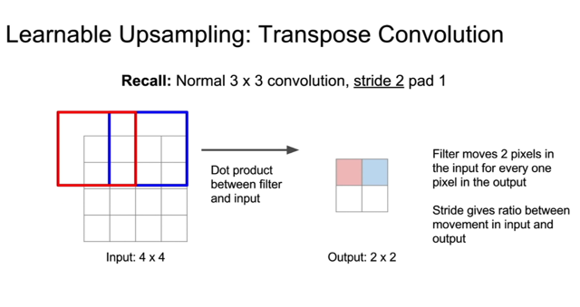</kbd>

<kbd></kbd>

<kbd>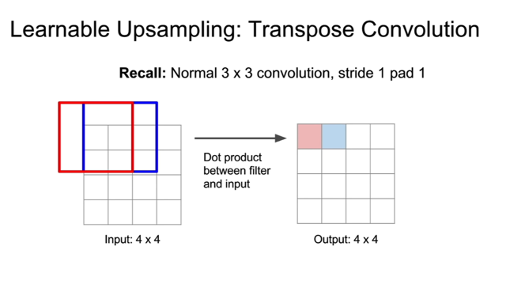</kbd>

> [!NOTE]
> Đại khái là phương pháp pooling kiểu như fixed function, còn cách thứ hai
> sắp nói tới là Transpose Convolution.
>
> Đại khái là review lại chút về convolution trong đó tại mỗi vị trí ta tính một
> phép dot-product giữa input và filter. Sau đó nhích qua vị trí tiếp
>
> Còn nếu stride = 2 thì nhích qua 2 ô, ko có gì phải nói cả. Và nó chính là
> tỉ lệ giảm spatial size.

 

<kbd>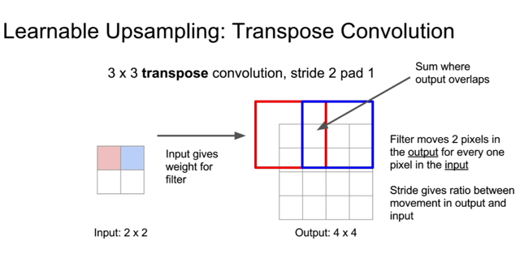</kbd>

> [!NOTE]
> còn với Transpose convolution, learnable filter sẽ nhân với input, input sẽ
> đóng vai trò của scalar để ra output. và cũng dùng stride để tăng kích
> thước, vùng overlap thì cộng lại. Cái này có thể có tên là Deconvolution.
>
> Fractionally strided convolution / Backward strided convolution

 

<kbd>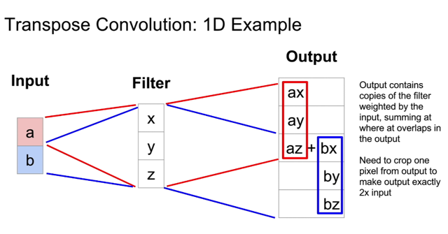</kbd>

> [!NOTE]
> Minh họa 1D Transpose Convolution, learnable filter params sẽ được
> scale bởi input để ra kết quả, vùng chồng lấn sẽ sum lại.

 

<kbd>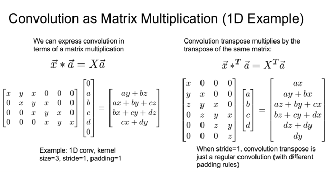</kbd>

 

<kbd>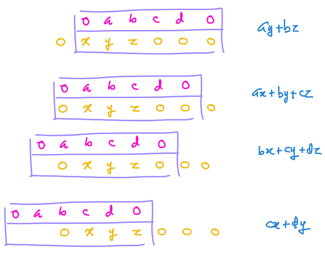</kbd>

<kbd></kbd>

<kbd>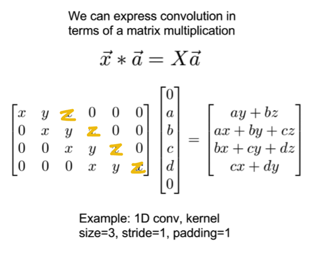</kbd>

> [!NOTE]
> đại ý là ta có thể thực hiện phép convolution như một phép nhân matrix để "
> làm một phát một, chứ không phải slide cái filter rồi tính toán tuần tự" cái
> này mình đã biết qua việc tự làm qua assignment 3 - Pytorch

 

<kbd>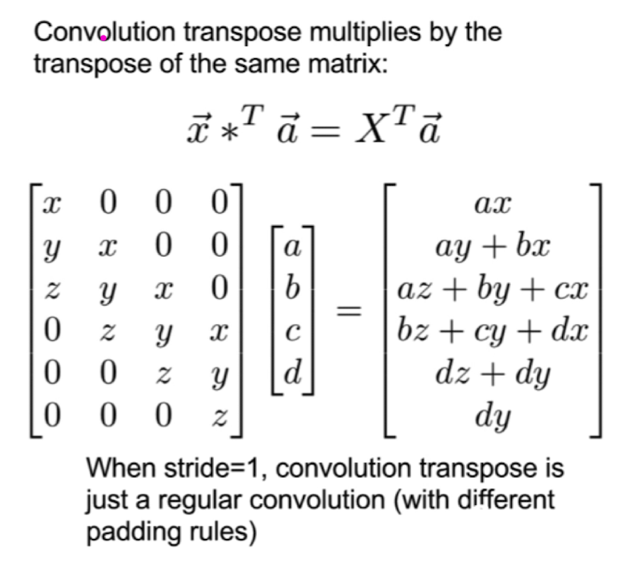</kbd>

> [!NOTE]
> đại ý là convolution transpose với stride bằng 1 thì cũng co thể coi là
> giống một convolution thông thường khi ta cũng có thể thể hiện dưới
> dạng matrix multiplication.

 

<kbd>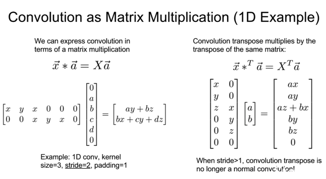</kbd>

> [!NOTE]
> đại khái là với stride = 2 thì convolution transpose trở nên không còn là
> convolution thông thường nữa. Khi ta thấy kết quả ví dụ như ax, ay, ..
> không còn là kết quả của phép convol
>
> Nên tóm lại là muốn nói, cái tên transpose convolution không đúng lắm.

 

<kbd>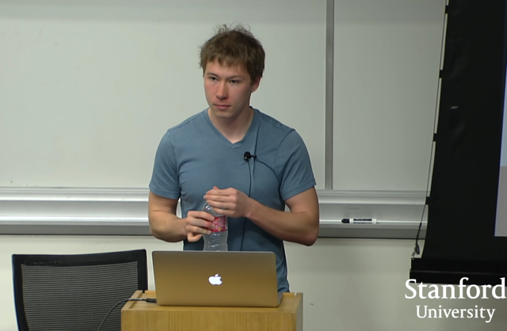</kbd>

> [!NOTE]
> câu hỏi đại khái là tại sao chỗ vùng chồng lấn ta lại sum chứ không
> average.
>
> Đó là bởi công thức của transpose convolution nó như vậy, tuy nhiên đúng
> là cách làm này gây ra các vấn đề như checker-board artifact (một dạng
> pattern kiểu bàn cờ mà mình đã thấy người ta nói đến trong GANSpec),
> do đó người ta dần tìm cách khắc phục bằng cách dùng 4x4 stride 2, hay
> 2x2 stride 2

 

<kbd>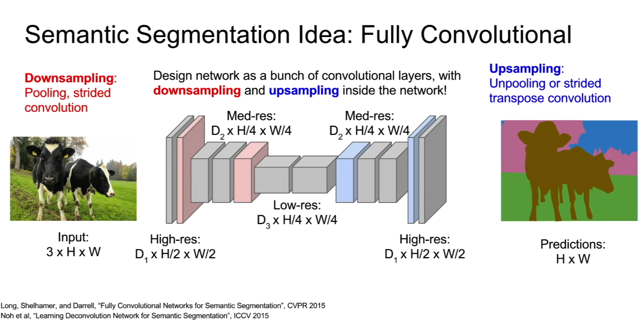</kbd>

> [!NOTE]
> tóm lại là ta sẽ dùng kiến trúc như này (gọi là U-Net) với phần đầu dùng
> convolution để giảm (spatial) size và tăng depth và phần sau dùng
> Transpose Convolution để tăng (spatial) size và giảm depth.
>
> Và train model với backpropagation như thông thường để mập input
> image với label output

 

