# Data Type

📊 **Progress:** `8` Notes | `15` Screenshots

---

<kbd>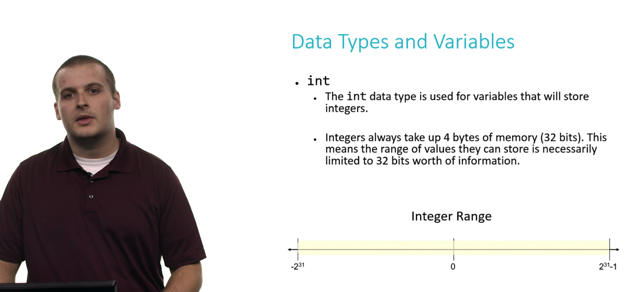</kbd>

> [!NOTE]
> Đại khái ổng nói là như đã biết các ngôn ngữ ngày nay như
> Python sẽ tự biết data type của variable nhưng C hay Java thì
> cần phải define
>
> Thì với int - integer. Được represent bằng 4 bytes = 4*8 bits = 32 bit
>
> ====
>
> Integer Range -2^31 -> 2^31-1 là sao?
>
> **3 bits**: 111 = 2**2 + 2**1 + 2**0 = 4 + 2 + 1 = 7 = 8 - 1 = **2**3-1**
> **4 bits**: 1111 =2**3 + 2**2 + 2**1 + 2**0 = 8 + 4 + 2 + 1 = 15 = 16 - 1 = **2**4 - 1
> n bits**: .....**2^n - 1**
>
> Với 32 bits, **trừ 1 bit dành cho 'dấu' (dương hay âm)** thì ta **còn 31 bits**. 
>
> Thì số dương lớn nhất có thể được represent là **2**31 - 1: đó là khi bit đầu
> bằng 0 (thể hiện số dương), 31 bits tiếp theo là 1 hết.
>
> Ở giữa, khi 31 bit đều là 0 thì tất nhiên là 0**Số âm đầu tiên = -1 khi **bit đầu là 1, 31 bit tiếp theo là 0. 
>
> Do đó khi cả 31 bits tiếp theo ta thể hiện được tới số lớn nhất là 2^31 - 1.
> có nghĩa là với 31 bits đó nhỏ nhất là 0 và lớn là 2^31-1. Nhưng thay vì bắt
> đầu bởi -1 thì nay bắt đầu bởi -2 nên số lớn nhất là -2^31**

 

<kbd>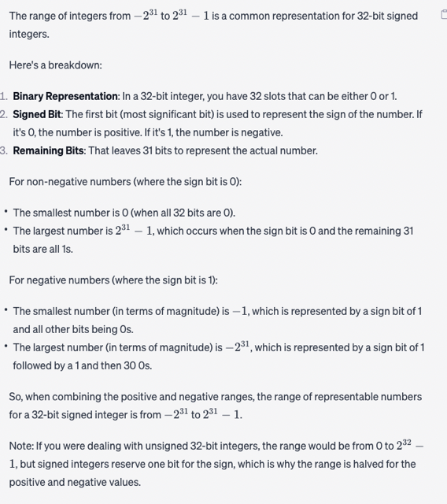</kbd>

<kbd></kbd>

<kbd>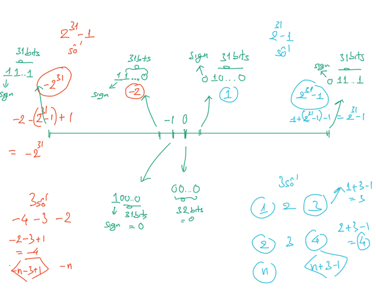</kbd>

 

<kbd>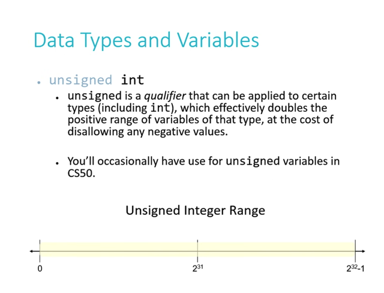</kbd>

> [!NOTE]
> Cái dạng **unsigned int** này nó sẽ cho phép **represent integer** ở
> **range lớn hơn bằng cách hi sinh phần negative bằng cách xài luôn cái
> bit dành cho dấu**  cộng hay trừ (tức là khi cần integer lớn hơn 2 tỉ và biết
> rằng không mang giá trị âm thì có thể dùng cái này.
>
> Và vì không support số âm nữa, nên không cần dành 1 bit cho  dấu (sign)
> nữa, nên dùng cả 32 bits cho giá trị. Thì như mới nói với 32 bits số lớn
> nhất thể hiện được sẽ là **2^32 - 1  (với 32 bits đều = 1)**

 

<kbd>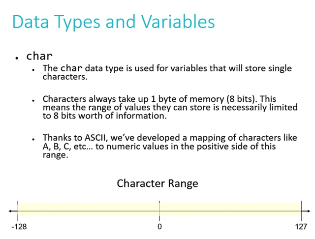</kbd>

> [!NOTE]
> **char data type** dùng để store một **character**. Chiếm **1 byte = 8 bits.**
>
> Với **8 bits** thì và có support số âm thì dùng 1 bit cho sign, còn lại 7 bits. Tương tự ở
> slide trước, số dương lớn nhất là 2^7-1 = 128-1 = 127 số âm nhỏ nhất là -127-1 =
> -128
>
> Và mỗi kí tự sẽ represent bằng một số theo ASCII

 

<kbd>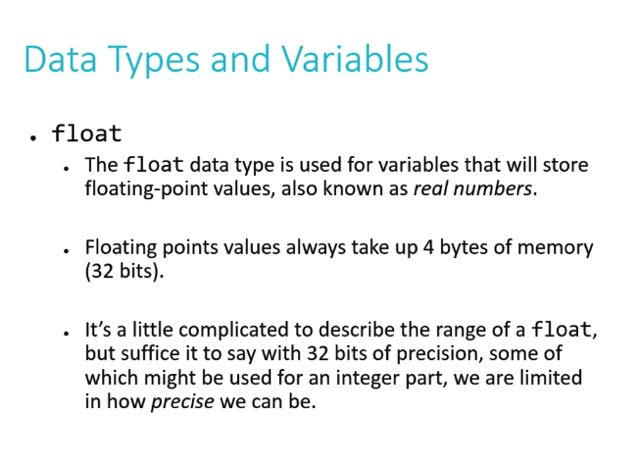</kbd>

> [!NOTE]
> float dùng**32 bits** để represent **real number**.  Như đã nói bên **LLM**, nó
> tổ chức theo kiểu **1 bit đầu dành cho sign**,  **8 bits tiếp dành cho exponent**,
> **23 bits tiếp theo dành cho fraction.**Và vì bị giới hạn bởi chỉ có 32 bits, trong khi phần fraction - thập phân là chuỗi
> vô hạn nên float bị vấn đề **precision - tức là không thể nào represent chính xác
> tuyệt đối.**

 

<kbd>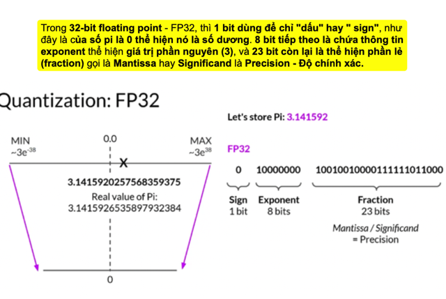</kbd>

 

<kbd>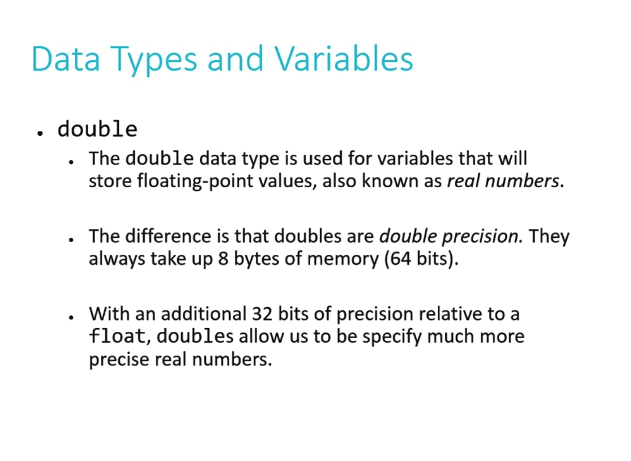</kbd>

> [!NOTE]
> Double cho phép represent real number với 64 bits từ đó
> tăng phần thập phân giúp chính xác hơn

 

<kbd>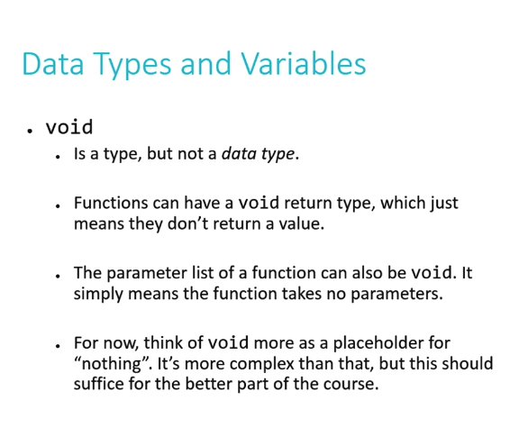</kbd>

> [!NOTE]
> Void không hẳn là datatype, nó chỉ đơn giản là báo hiệu
> function không return cái gì hoặc không nhận argument (ví dụ
> main (void)

 

<kbd>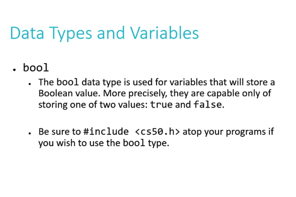</kbd>

 

<kbd>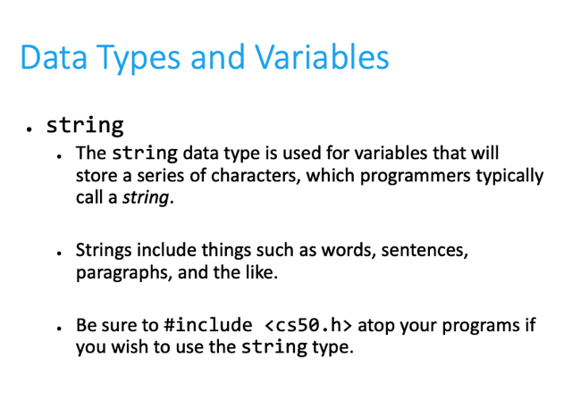</kbd>

 

<kbd>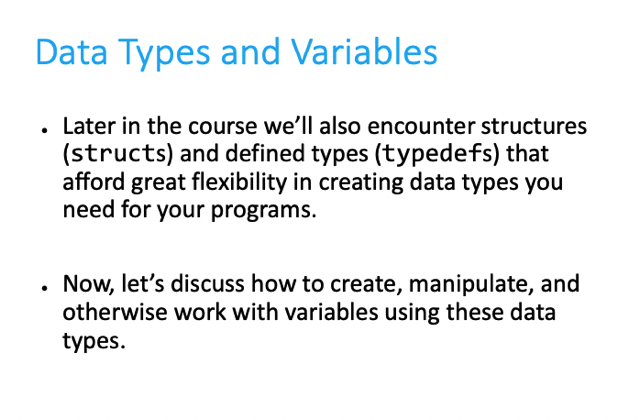</kbd>

> [!NOTE]
> Những tuần sau sẽ có structs dùng typedefs để define (gần
> gần nhưng chưa phải là class trong OOP)

 

<kbd>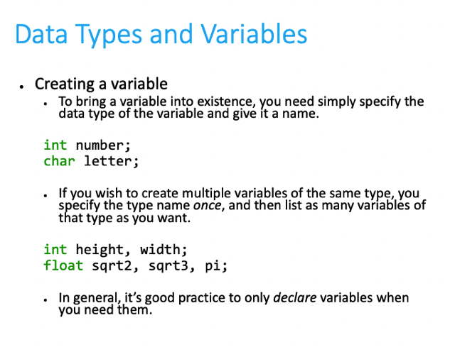</kbd>

> [!NOTE]
> Cách define,
> tương tự java

 

<kbd>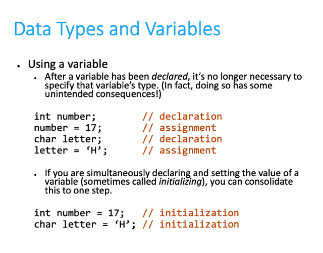</kbd>

 

