# Day 1

📊 **Progress:** `16` Notes | `28` Screenshots

---

<kbd>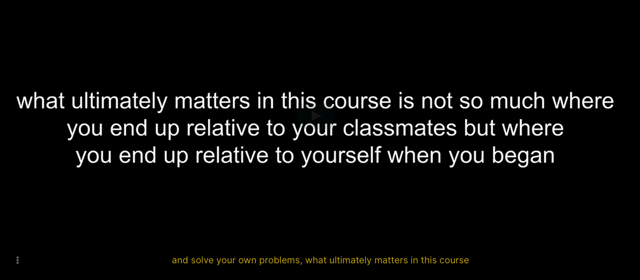</kbd>

 

## Nếu có thất vọng, thì cũng là bình

> [!NOTE]
> Nếu có thất vọng, thì cũng là bình
> thường vì đó là dấu hiệu mọi
> chuyện đang tiến triển

 

<kbd>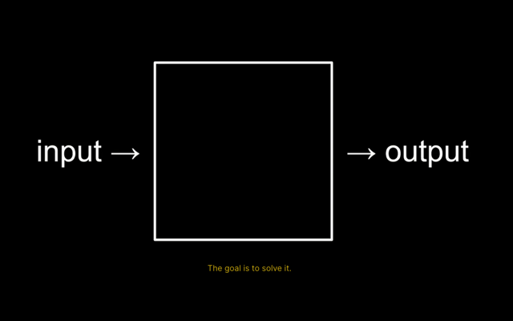</kbd>

 

<kbd>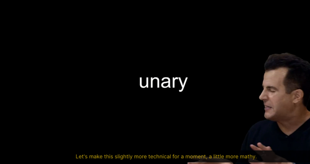</kbd>

 

<kbd>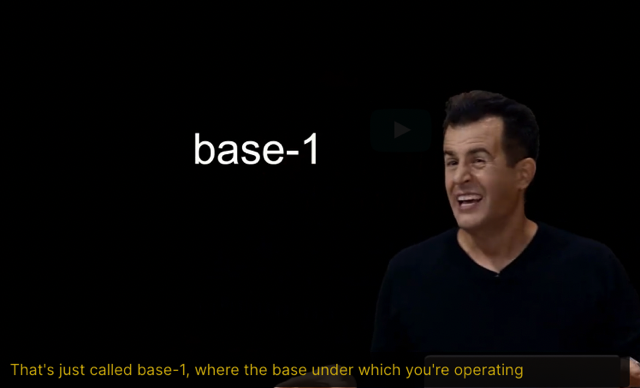</kbd>

 

<kbd>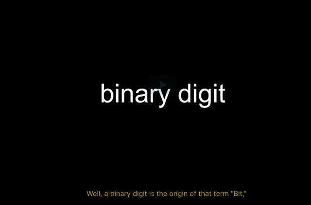</kbd>

 

<kbd>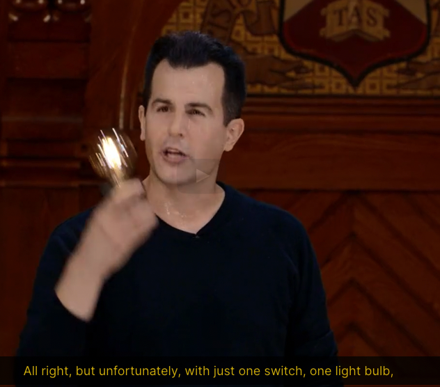</kbd>

 

<kbd>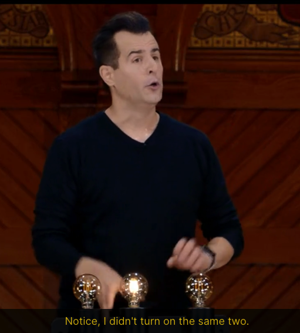</kbd>

 

<kbd>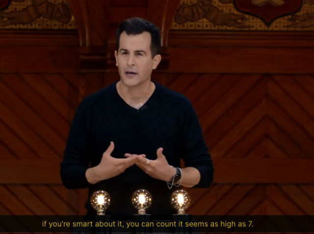</kbd>

> [!NOTE]
> Với 3 bóng đèn, có thể
> dùng để represent 1-7

 

### ### = 2^2 2^1 2^0 = 4 2 1

> [!NOTE]
> ### = 2^2 2^1 2^0 = 4 2 1
> 001 = 4*\**0\** + 2*\**0\** + 1*\**1\** = 0 + 0 + 1 = 1 
> 010 = 4*\**0\** + 2*\**1\** + 1*\**0\** = 0 + 2 + 0 = 2
> 011 = 4*\**0\** + 2*\**1\** + 1*\**1\** = 0 + 2 + 1 = 3
> 100 = 4*\**1\** + 2*\**0\** + 1*\**0\** = 4 + 0 + 0 = 4
> 101 = 4*\**1\** + 2*\**0\** + 1*\**1\** = 4 + 0 + 1 = 5
> 110 = 4*\**1\** + 2*\**1\** + 1*\**0\** = 4 + 2 + 0 = 6
> 111 = 4*\**1\** + 2*\**1\** + 1*\**1\** = 4 + 2 + 1 = 7

 

  
  
<kbd>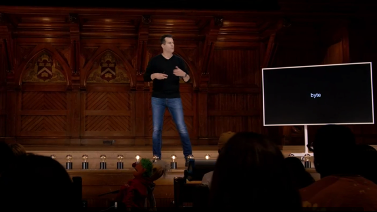</kbd>

> [!NOTE]
> Byte = 8 bit

   

  
  
<kbd>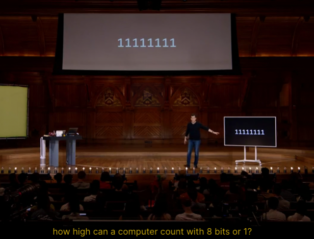</kbd>

> [!NOTE]
> Như này là 255 =128 + 64 +
> 32 + 16 + 8 + 4 + 2 + 1

   

  
  
<kbd>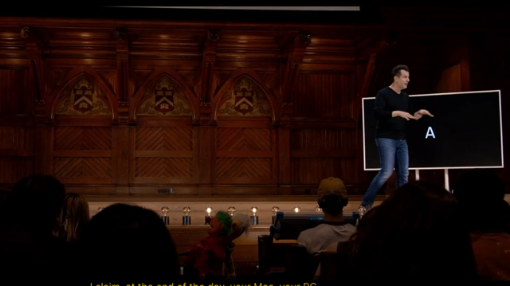</kbd>

   

  
  
<kbd>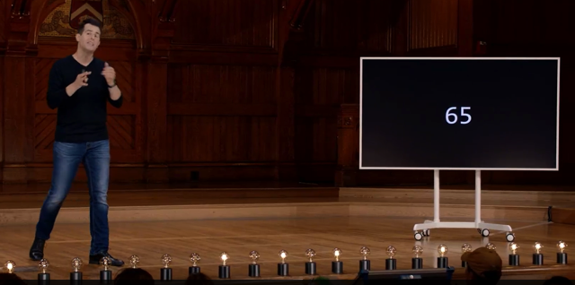</kbd>

> [!NOTE]
> A được represent bởi số 65, sử dụng 8 bits bật vài số tắt
> vài số để được 65 - represent cho A

   

  
  
<kbd>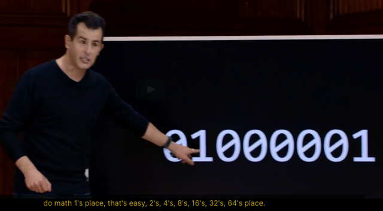</kbd>

> [!NOTE]
> 0 + 64 + 0 + 0 + 0 + 0 + 0 + 1 = 65

   

  
  
<kbd>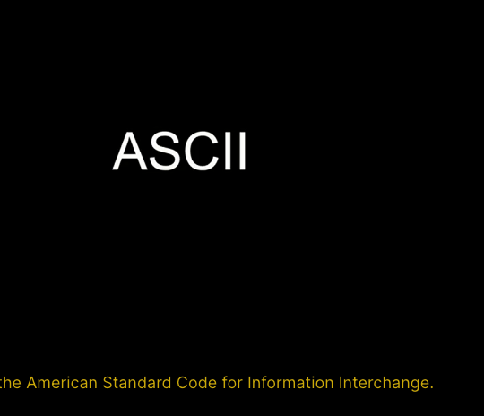</kbd>

> [!NOTE]
> Đọc là **At-s-ki**

   

  
  
<kbd>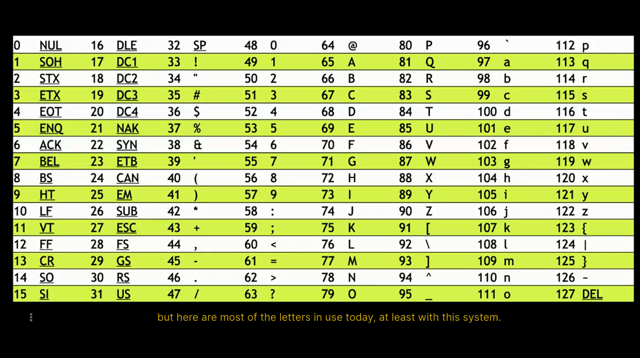</kbd>

   

  
  
<kbd>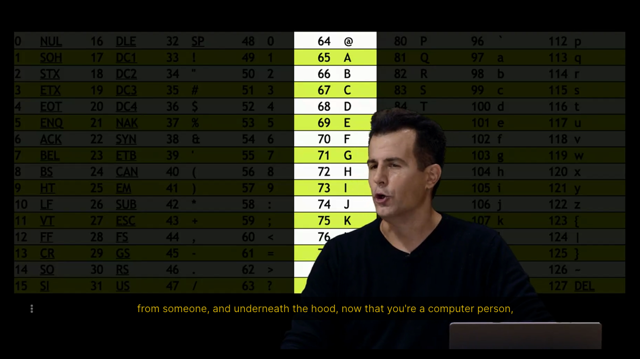</kbd>

> [!NOTE]
> 65 = A, 66 = B...

   

  
  
<kbd>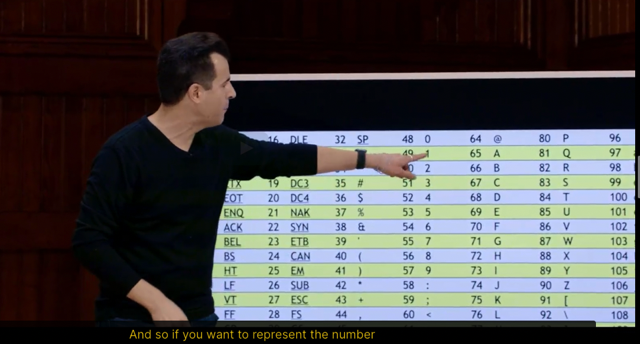</kbd>

> [!NOTE]
> Và quay lại các số cũng được
> represent bởi số ví dụ 49 = 1

   

  
  
<kbd>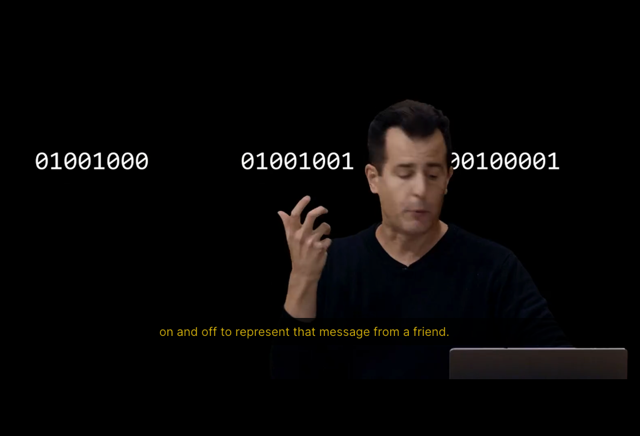</kbd>

> [!NOTE]
> = 72 73 33 = h i !

   

  
  
<kbd>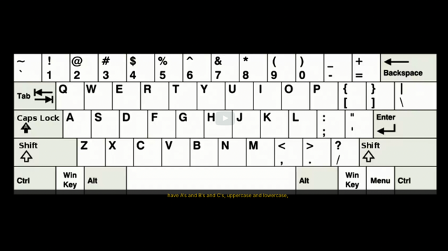</kbd>

   

  
  
<kbd>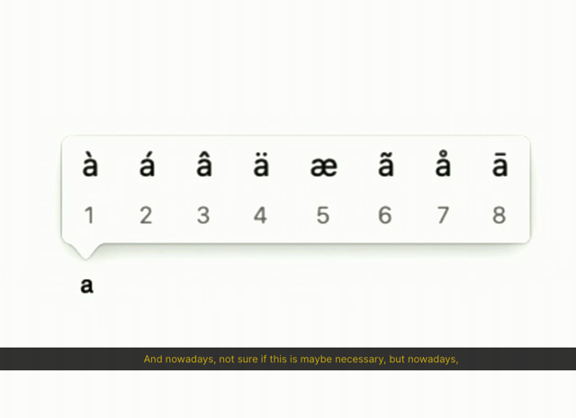</kbd>

   

  
  
<kbd>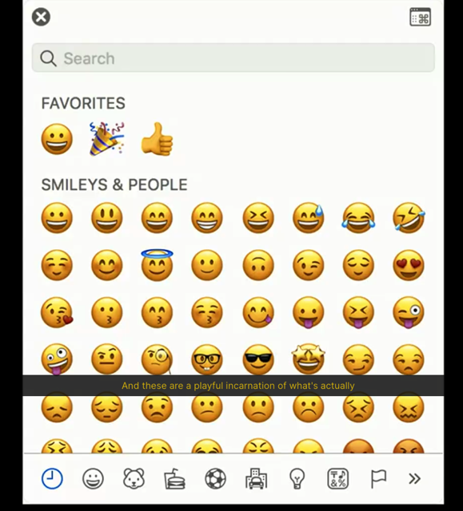</kbd>

   

  
  
<kbd>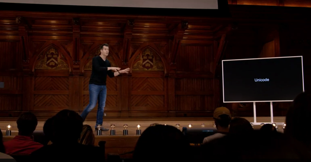</kbd>

> [!NOTE]
> Để represent nhiều kí tự hơn vì**bên ngoài English**,
> các ngôn ngữ khác **còn có dấu, rồi emoji.**.thì 1 bit
> không đủ vì nó chỉ có thể represent max là **256** kí tự
> (0-255)
>
> Giải pháp là **dùng nhiều bit hơn**, và dẫn đến
> **Unicode** vẫn là map giữa number và character
> nhưng nhiều hơn
>
> Nó là Consortium - kiểu như đồng thuận giữa nhiều
> công ty, quốc gia...với sứ mệnh là digitalize mọi thứ liên
> quan đến human

   

  
  
<kbd>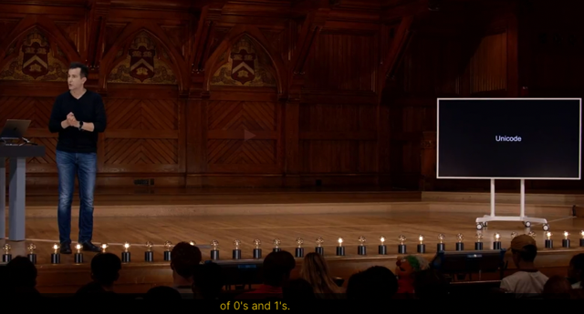</kbd>

> [!NOTE]
> Nếu dùng **32 bits** = 4 bytes để represent thì sẽ có
> **8 tỉ**cách khác nhau để permutation các con số 0,1

   

  
  
<kbd>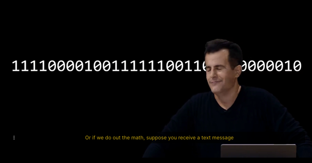</kbd>

> [!NOTE]
> Giả sử ta có chuỗi binary này

   

  
  
<kbd>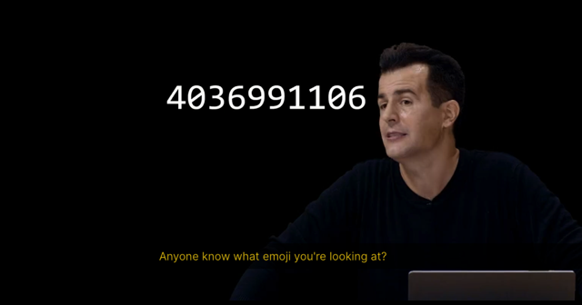</kbd>

> [!NOTE]
> chuyển sang decimal được số này

   

  
  
<kbd>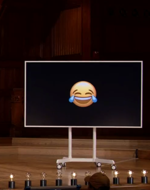</kbd>

> [!NOTE]
> Nó chính là cái này,
> most popular

   

  
  
<kbd>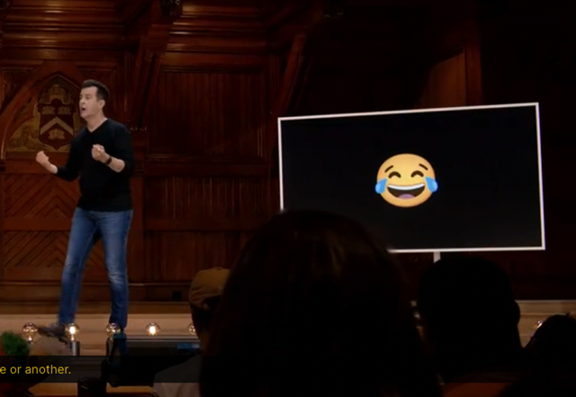</kbd>

> [!NOTE]
> Ở Android nó khác chút xíu

   

  
  
<kbd>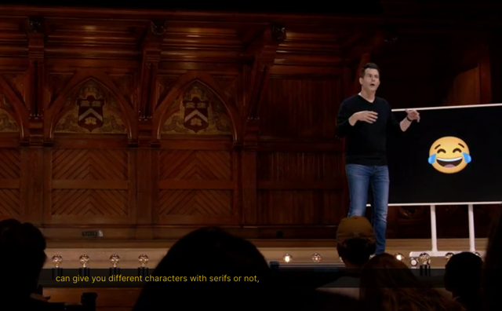</kbd>

> [!NOTE]
> Các công ty có các font khác nhau, nên
> emoji cũng là character nên cũng khác
> nhau ở các device khác nhau

   

