# Day 2

📊 **Progress:** `42` Notes | `54` Screenshots

---

<kbd></kbd>

> [!NOTE]
> Nên đôi khi thấy lỗi khi load emoji đơn giản là
> do phone chưa update để nhận font mới nhất

 

<kbd></kbd>

 

<kbd>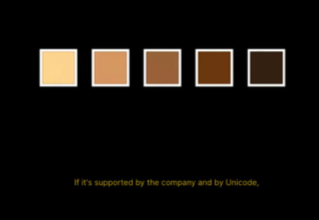</kbd>

> [!NOTE]
> Ý là các công ty hiện nay cho phép tuỳ
> chỉnh color của icon (skin tone...)

 

<kbd>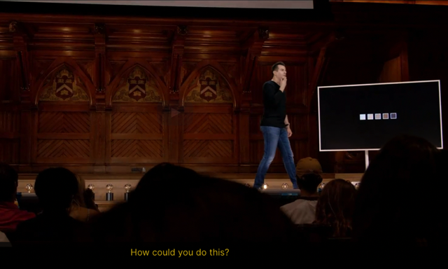</kbd>

> [!NOTE]
> Câu hỏi là **làm sao các company cho
> phép tuỳ chỉnh màu sắc của các emoji với
> các skin tone khác nhau?**

 

<kbd></kbd>

> [!NOTE]
> Thì ổng nói có thể ta**làm mỗi icon với
> một skin tone cụ thể một mã hoá binary
> riêng biệt**. 5 cái skin tone thì thành ra 5
> cái chuỗi binary khác nhau. Nhưng rõ
> ràng làm vậy **không hiệu quả lắm** khi
> các icon **chỉ khác nhau chút xíu ở skin
> tone** mà **phải sử dụng nhiều bit hơn**

 

<kbd></kbd>

> [!NOTE]
> 1 bà nói về RGB

 

<kbd></kbd>

 

<kbd>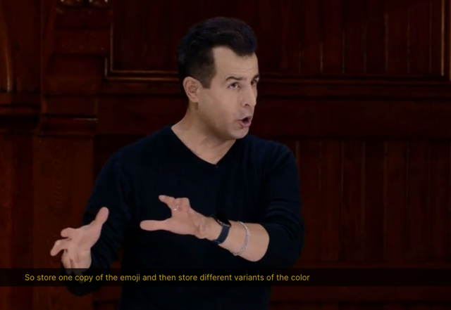</kbd>

> [!NOTE]
> Một ý kiến khác là store 1 copy
> của emoji và store nhiều variants
> của colors khác nhau

 

<kbd></kbd>

> [!NOTE]
> Một ý kiến khác cho rằng
> 'filter' là giải pháp

 

<kbd></kbd>

> [!NOTE]
> Một ý kiến nữa là 5 skin tone
> là 5 font khác nhau

 

<kbd>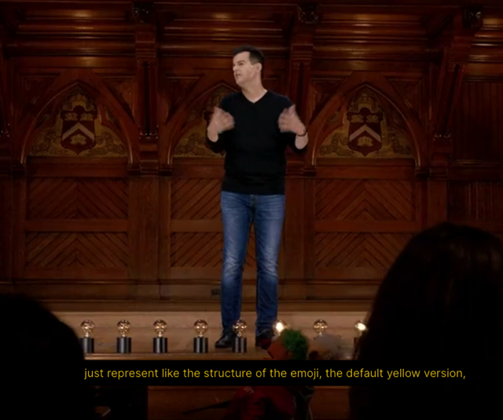</kbd>

> [!NOTE]
> Bite đầu tiên để represent cấu trúc của emoji - tức là
> chuỗi binary represent emoji với màu default - vàng
> (sau khi chuyển sang decimal, tra cứu bảng
> unicode)

 

<kbd>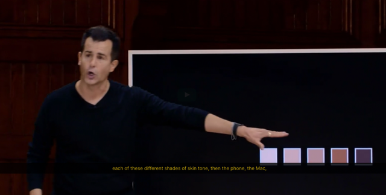</kbd>

> [!NOTE]
> Và sau đó là **byte thứ 2** - "a certain pattern of bit" thứ hai
> sẽ là kiểu như quy ước (human standardize) để represent
> các different shades of skin tones

 

<kbd></kbd>

> [!NOTE]
> Thì như vậy**chỉ dùng x2 số bit cần thiết** thay vì phải **x5**
> cho**5 cái different pattern cho 5 cái emoji với skin tone
> khác nhau**

 

<kbd>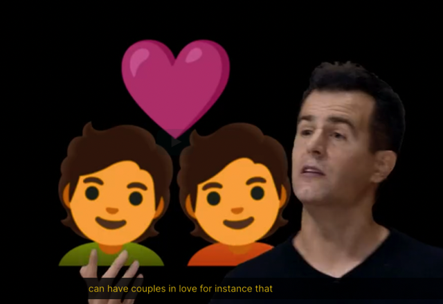</kbd>

 

<kbd>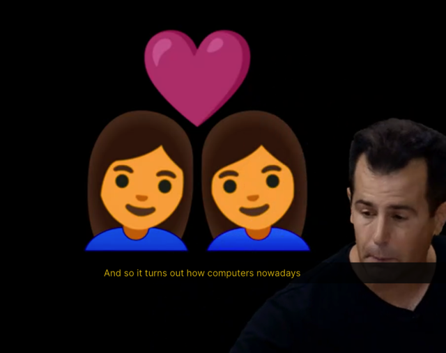</kbd>

> [!NOTE]
> Thì đại khái là người ta chỉ tạo binary bits cho mỗi cái hình trong emoji này, rồi
> combine lại để thành emoji hoàn chỉnh. Với cách này, người ta **ko cần phải
> define cụ thể từng cái emoji** (với 2 man yêu nhau, 2 woman yêu nhau, rồi tùm
> lùm các case cụ thể mà không thể nào 'làm trước' được)...mà chỉ việc**ghép
> các ...tạm gọi là các emoji đơn lẻ - tất nhiên là ở dạng binary - lại**

 

<kbd></kbd>

 

<kbd>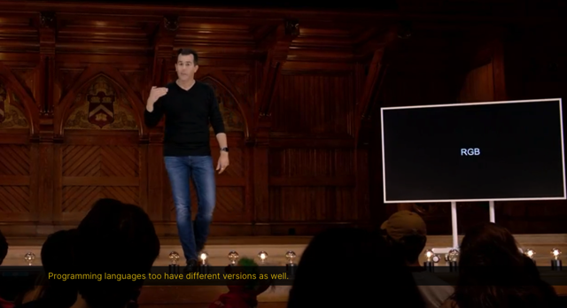</kbd>

> [!NOTE]
> Tới đây ổng nói vì **người ta không tính trước** (ví
> dụ như ASCII - chỉ chứa American centric
> character để rồi sau này phải tạo ra Unicode) nên
> mới có khái niệm **version**

 

<kbd></kbd>

> [!NOTE]
> Qua tuần sau khi học về C, ta sẽ biết với vai trò là developer ta
> phải cho máy tính biết cái gì là text cái gì là number ...Đó chính là
> **data type**Và sau này với các language như Python, nó sẽ tự dựa vào
> context mà biết được data type phù hợp, rất tiện lợi cho human

 

<kbd>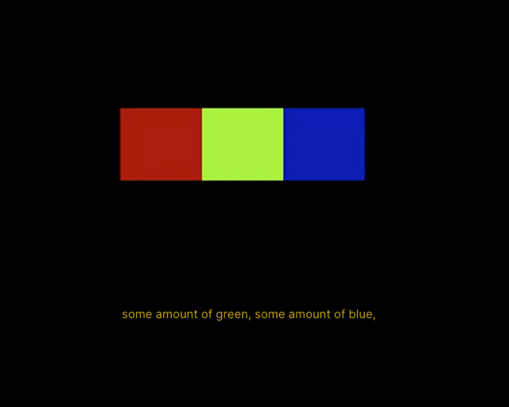</kbd>

 

<kbd>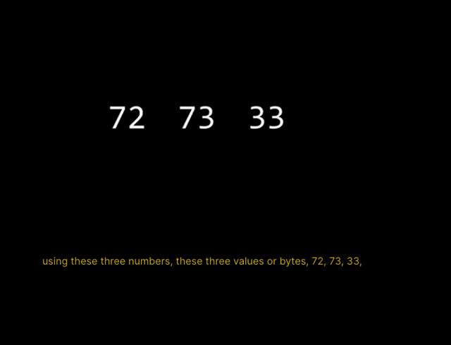</kbd>

> [!NOTE]
> Ở đây ổng nói nếu là messenger nó sẽ hiểu 72
> 73 33 là hi! thì với Photoshop chẳng hạn nó sẽ
> hiểu là 3 giá trị của R,G,B.

 

<kbd>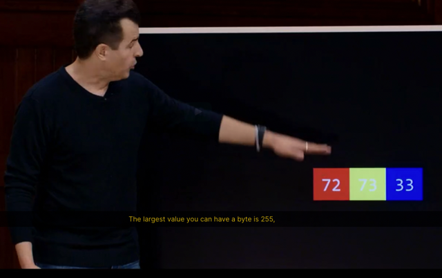</kbd>

> [!NOTE]
> Ở đây tự nhiên hiểu tại sao giá trị của pixel có
> range từ 0 -**255**: 255 chính là các **số có thể được
> represented bởi 1 byte = 8 bit.**

 

<kbd>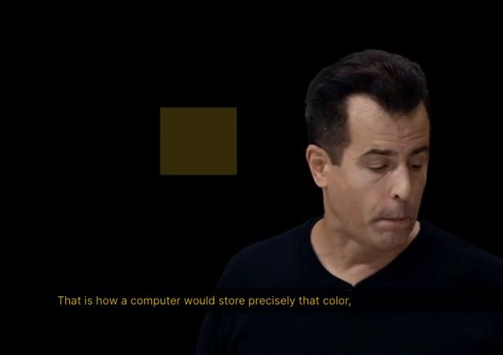</kbd>

> [!NOTE]
> Thì 72 73 33 chính
> là cái màu này

 

<kbd>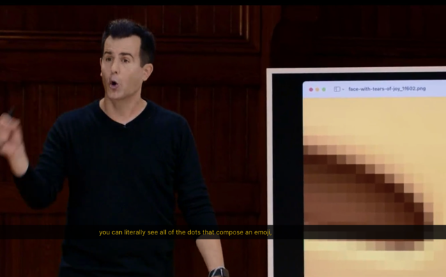</kbd>

> [!NOTE]
> Và như vậy **mỗi pixel** sẽ được represent bởi **3 bytes:** 1
> byte = 8 bit cho Red, 1 byte = 8 bit cho Green, 1 byte = 8 bit
> cho Blue

 

<kbd></kbd>

> [!NOTE]
> Vậy video thì sao ?

 

<kbd></kbd>

> [!NOTE]
> Cơ bản là các image thay đổi liên tục
> thôi: 24 images / second

 

<kbd>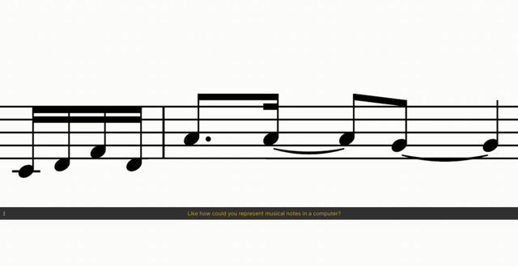</kbd>

 

<kbd>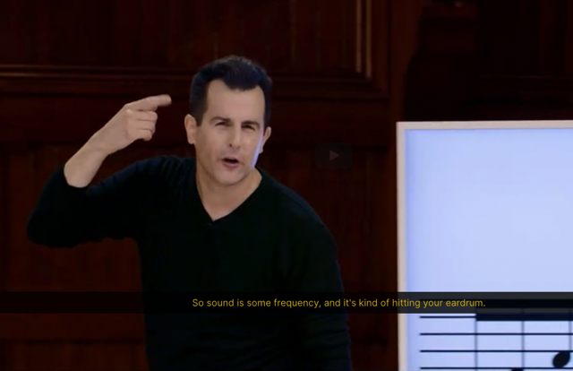</kbd>

> [!NOTE]
> Đại khái là người ta represent number là **chỉ số Hezt - tần số cao độ
> (nốt cao hay nốt trầm)**. Có thể **dùng thêm byte khác** represent
> **cường độ (to hay nhỏ)**. Có thể **dùng thêm byte nữa** represent ..kiểu
> như **thời gian bấm 1 nốt nhạc lâu hay nhanh**...Từ đó ra các định
> dạng **MIDI, mp3**...tất cả **đều là các cách represent khác nhau của
> âm thanh.**

 

<kbd>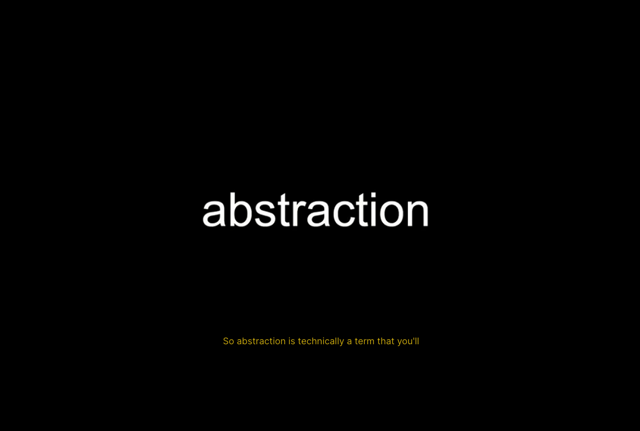</kbd>

> [!NOTE]
> Ý ổng là vì dụ như ta đi xe hơi ta không quan tâm
> máy nó chạy hay cấu tạo ra sao, ta chỉ quan tâm đi
> từ A-B. Đó gọi là abstraction

 

<kbd></kbd>

> [!NOTE]
> Vì như vậy sẽ rất chậm khi phải care mọi
> thứ behide , ta chỉ think và operate ở
> high level of abstraction

 

<kbd>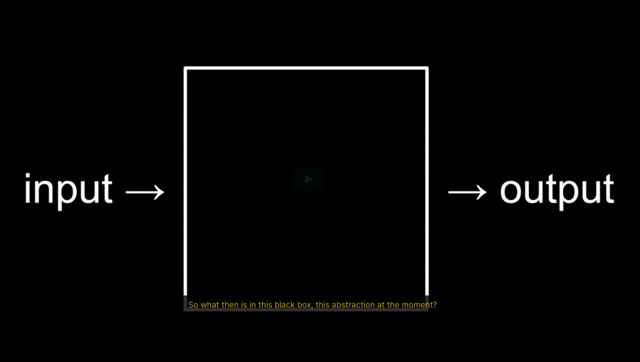</kbd>

> [!NOTE]
> Vậy cho đến nay, có gì trong blackbox này (ý là để
> rồi giúp ta với **input** là **binary** và **output cho ra text,
> số, image, video, music....)**

 

<kbd>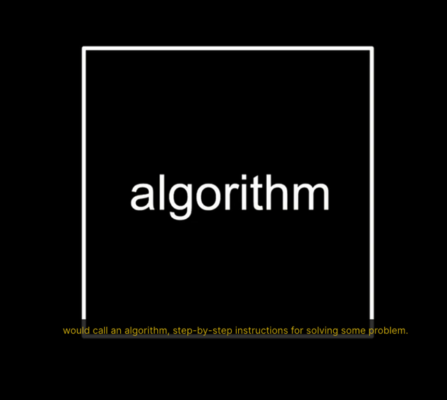</kbd>

 

<kbd>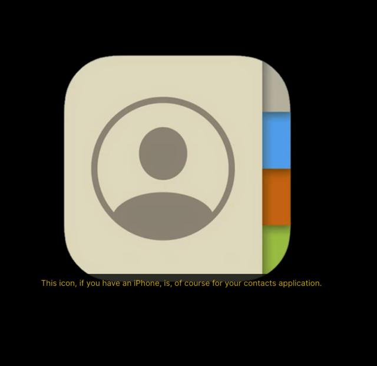</kbd>

 

<kbd>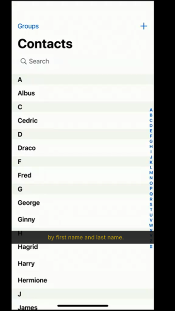</kbd>

> [!NOTE]
> Ổng lấy ví dụ, search trong phone book app,
> **"HI"**, lập tức **autocomplete** suggest các name
> start với HI. Câu hỏi là **nó hoạt động như thế
> nào?**

 

<kbd></kbd>

> [!NOTE]
> Thì một cách là**loop từ đầu đến cuối, thằng nào có tên
> bắt đầu với H, A thì 'lấy'**. Nhưng rõ ràng làm vậy không
> ổn, sẽ **rất chậm** khi list name lớn

 

<kbd></kbd>

> [!NOTE]
> Thì ổng nói, ví dụ ổng tìm ông có tên là Harvard trong
> cuốn name record này, bằng cách lật từng trang từ đầu
> đến cuối. Thì nó vẫn là algorithm đúng vì một lúc nào đó
> ổng sẽ tìm thấy tên ổng cần. Dù việc này rất chậm
> nhưng vẫn đúng.

 

<kbd></kbd>

> [!NOTE]
> Rồi ổng giả sử lật 2 trang một, thì rõ
> ràng algorithm này sai, vì ổng có thể
> skip cái tên ổng cần.

 

<kbd></kbd>

> [!NOTE]
> Thì trong thực tế we **human** sẽ làm là **lật bừa ra xem
> thử trúng chữ gì** ví dụ **M**. Từ đó **xác định được cái
> tên John Harvard cần tìm nằm ở phần bên nào.**Với việc xác định vì H nó trước chữ M nên suy ra nó
> nằm ở phần đầu,  từ đó ổng xé bỏ phần sau chỉ giữ lại
> phần đầu

 

<kbd></kbd>

> [!NOTE]
> Rồi tiếp tục như vậy
> again and again,...

 

<kbd></kbd>

> [!NOTE]
> Cuối cùng ổng come up with 1 page cần tìm.

 

<kbd>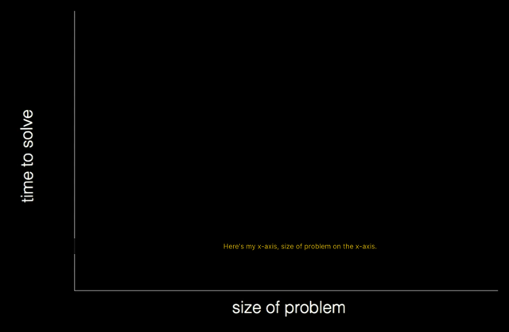</kbd>

> [!NOTE]
> Nói về thể hiện đồ thị giữa số lần phải thực hiện
> (ví dụ lật trang để tìm tên trong phone book) và số
> lương tên trong phone book
>
> Ví dụ phải tìm cái tên thứ n trong phone book có
>  có n cái tên (size of problem = n)

 

<kbd>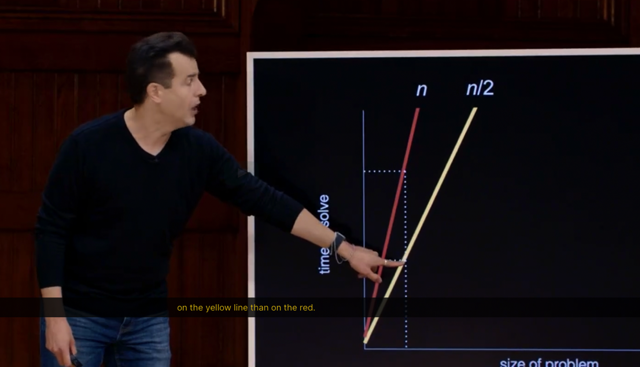</kbd>

> [!NOTE]
> Thì ở đây, ổng nói nếu làm theo cách cũ (lật từng
> trang) thì số lần phải thực hiện (phép tính) là n (ví dụ
> có n cái tên trong phone book và cần tìm cái tên thứ
> n)
>
> Nếu làm theo cách lật 1 lúc 2 trang như cách sau, thì
> số lần  phải thực hiện chỉ còn n/2 (tuy nhiên như đã
> biết algorithm này không đúng)

 

<kbd>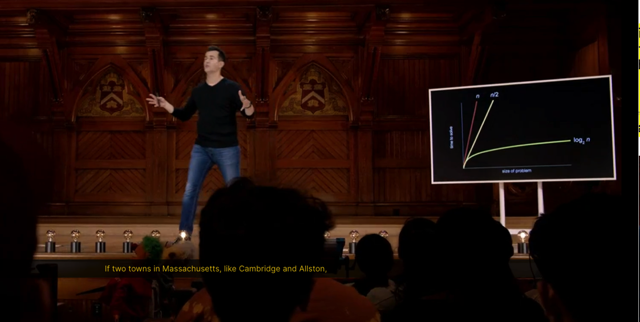</kbd>

> [!NOTE]
> Thì ý là với một algorithm mà "**chia nửa rồi xé"** rất
> hiệu quả thể hiện trên biểu đồ màu vàng log2(m).
>
> Cho thấy **dù số lượng name trong phone có tăng
> nhiều thì số phép tính phải làm không tăng bao nhiêu.**Bởi vì dù **số lượng cái tên có x2**thì cũng **chỉ tốn
> thêm 1 lần chia**

 

<kbd>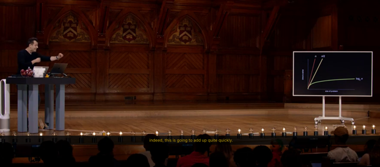</kbd>

> [!NOTE]
> Nếu database nhỏ thì không nói làm gì, có thể cứ search từ
> trên xuống mà tìm như cách 1. Nhưng nếu database cỡ
> Google thì algorithm rất quan trọng.

 

<kbd></kbd>

 

<kbd>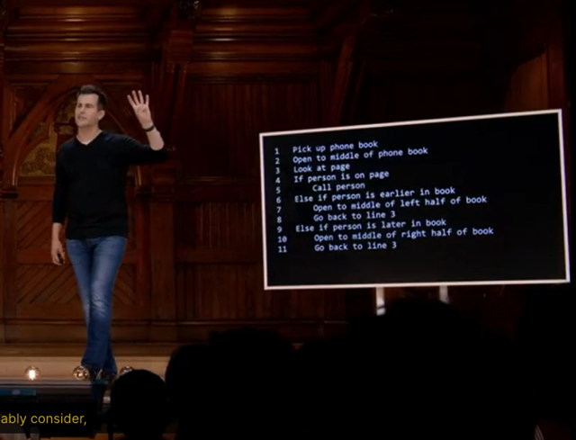</kbd>

> [!NOTE]
> Đại khái là mô tả cách làm
> bằng human language

 

<kbd>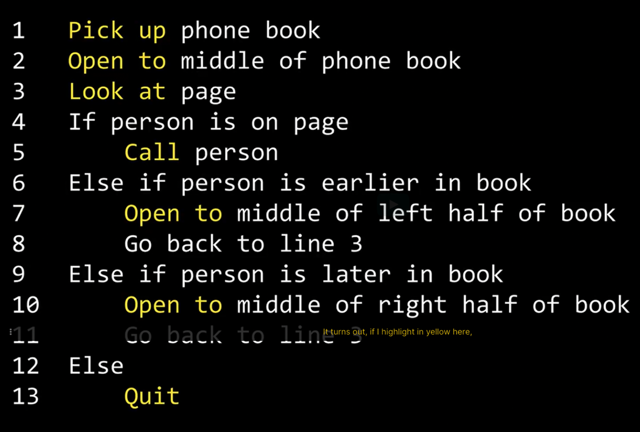</kbd>

> [!NOTE]
> Verb in pseudocode (màu vàng) = **function**

 

<kbd>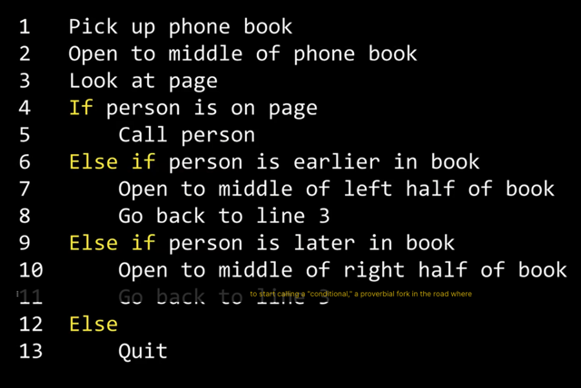</kbd>

> [!NOTE]
> Condition

 

<kbd>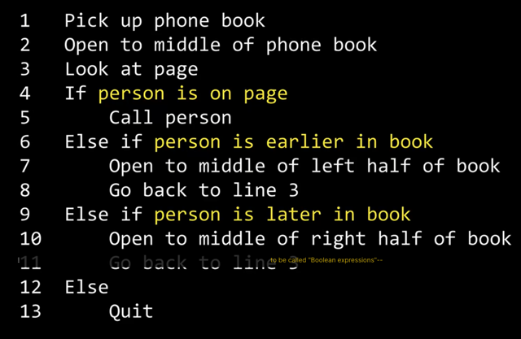</kbd>

> [!NOTE]
> Boolean expression

 

<kbd>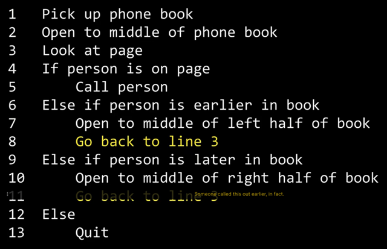</kbd>

> [!NOTE]
> Loop

 

<kbd>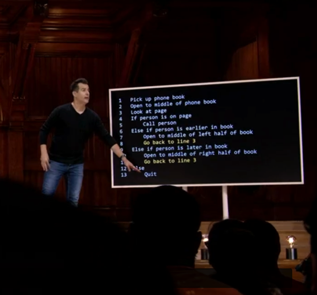</kbd>

> [!NOTE]
> Ý ổng nói the key để nó không chạy quài và mắc kẹt là
> bởi 1 là nó sẽ tìm được cái tên cần tìm hai là không có
> và nó reach keyword "Quit"

 

<kbd>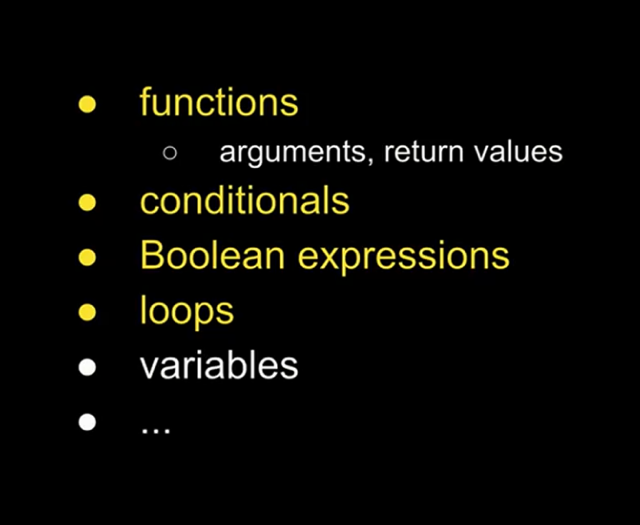</kbd>

 

<kbd>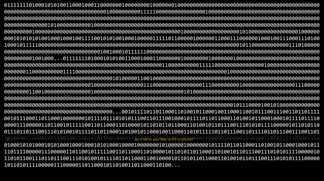</kbd>

> [!NOTE]
> Hello world!

 

<kbd>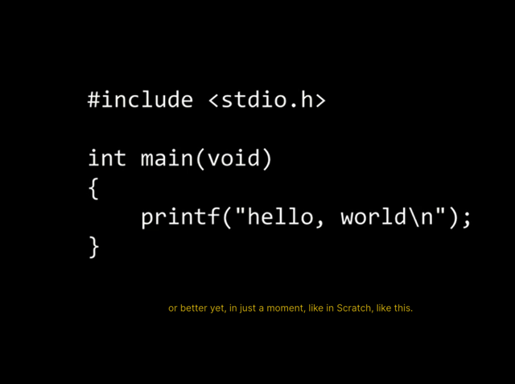</kbd>

 

<kbd></kbd>

 

