# Day 3

📊 **Progress:** `22` Notes | `41` Screenshots

---

<kbd>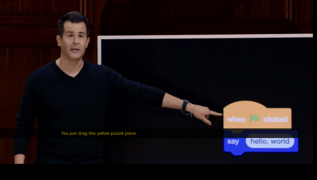</kbd>

 

<kbd>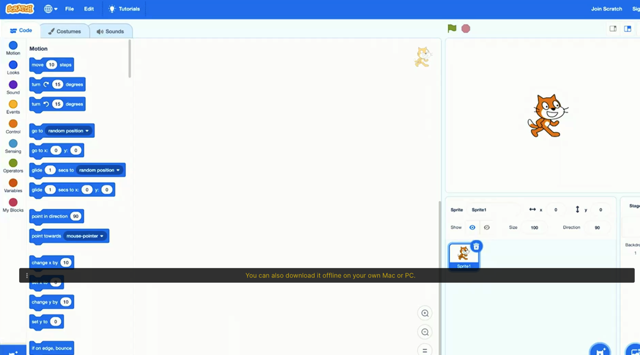</kbd>

 

<kbd>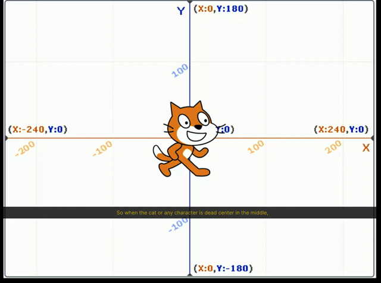</kbd>

 

<kbd>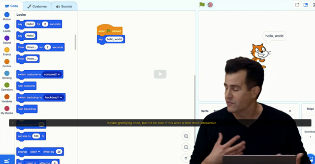</kbd>

> [!NOTE]
> Ổng nói về khi ta bấm icon green flag, ta đã trigger an
> event. Và nó trigger function màu xanh define để print "
> Hello, world!". Message đó là input, hay argument,
> parameters của function

 

<kbd>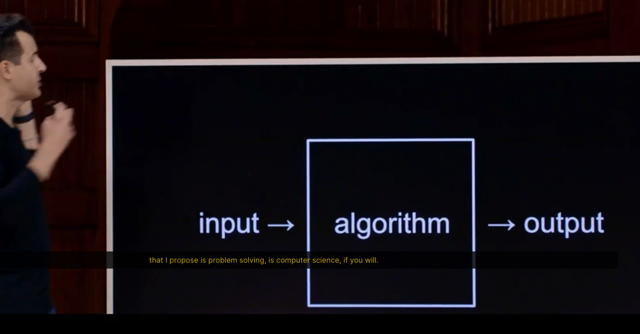</kbd>

 

<kbd>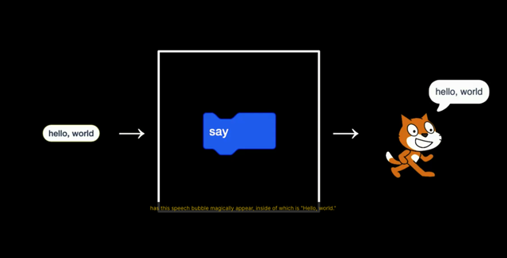</kbd>

> [!NOTE]
> **Input** là **'Hello, world'** là **argument/parameter** của function
>
> **Algorithm** là những gì Scratch **xử lý bên dưới khi thực hiện
> function say() này**
> Output trong trường hợp này gọi là**'side effect'** - **something
> mình thấy, nghe ...**

 

<kbd>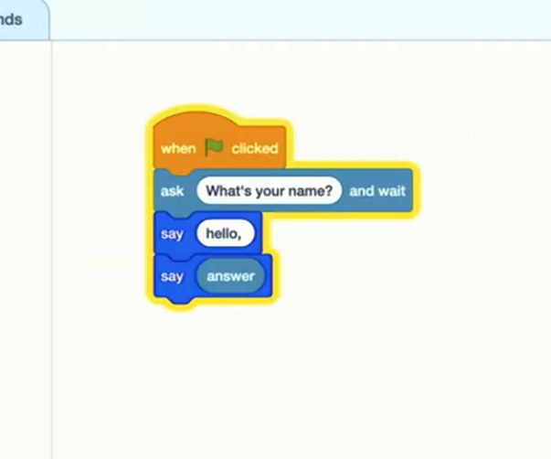</kbd>

> [!NOTE]
> Ổng làm vậy, để giới thiệu khái niệm **'return value'** của
> function. Tuy nhiên ổng hỏi tại sao khi run nó chỉ in ra 'David'
> - là cái tên được nhập sau câu hỏi.
>
> -> Rõ ràng ở trình của mình ta hiểu bởi 'hello,' vẫn được  in
> nhưng đã bị thay bởi 'David' tức thì nên ta không thấy

 

<kbd>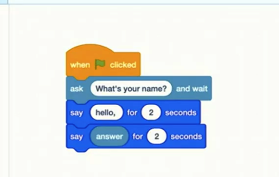</kbd>

> [!NOTE]
> Xong ổng khắc phục bằng cái này,
> nhưng rõ ràng rất stupid khi say '
> Hello'...rồi 2 giây sau 'David'

 

<kbd>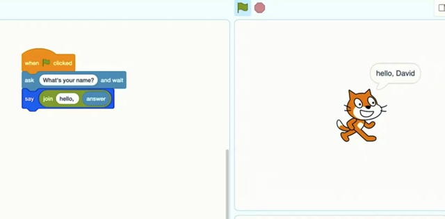</kbd>

 

<kbd>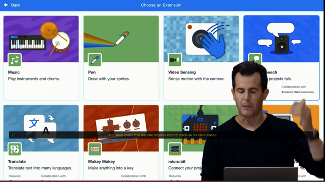</kbd>

 

<kbd>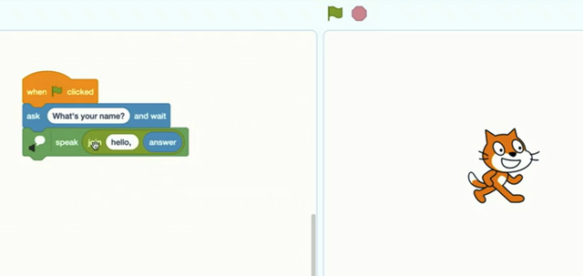</kbd>

> [!NOTE]
> Xịn xò hơn, dùng text to
> speech để say "hello, David"

 

<kbd>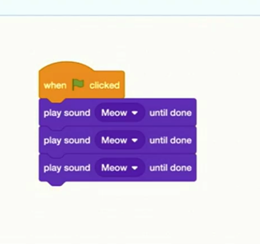</kbd>

 

<kbd>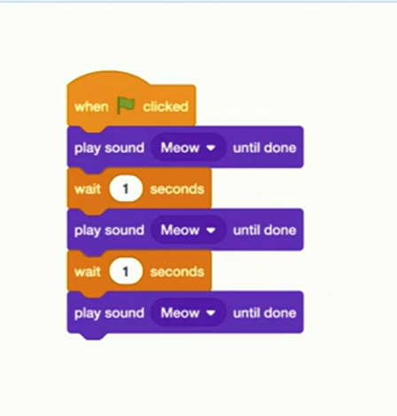</kbd>

 

<kbd>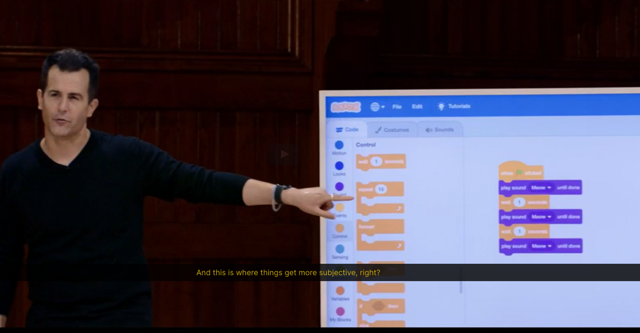</kbd>

> [!NOTE]
> Ý ổng là sắp nói về cách để dùng **loop**. Với yêu cầu **cho
> con mèo kêu 3 lần**, cách nhau chút xíu thì như vầy là đúng.
> Nhưng về**design thì nó không phải là tốt nhất.**Vì giả sử
> muốn đổi thời gian đợi thành 2 giây ta phải sửa từng cái....từ
> đó mất thời gian và sinh ra bug

 

<kbd>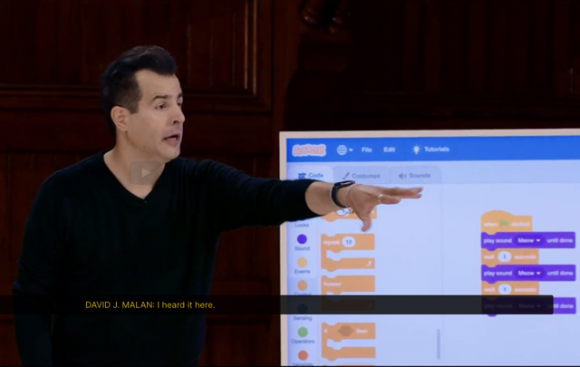</kbd>

> [!NOTE]
> Câu hỏi là nên làm thế nào cho tốt hơn? ->
> Tự trả lời: Theo mình có lẽ là dùng for loop,
> số lần loop là số lần mèo kêu nhận từ argument,
> Trong loop gọi function mèo kêu và wait'

 

<kbd>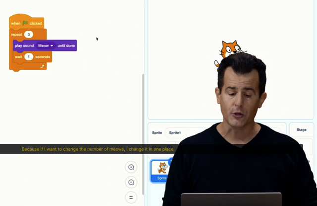</kbd>

> [!NOTE]
> Với for loop (repeat block) như thế này, ta đã
> improve code khi bây giờ nếu muốn thay đổi số lần
> mèo kêu, ..ta chỉ change 1 chỗ

 

<kbd>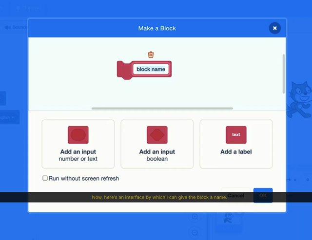</kbd>

 

<kbd>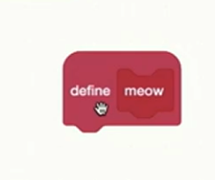</kbd>

 

<kbd>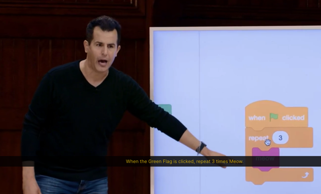</kbd>

 

<kbd>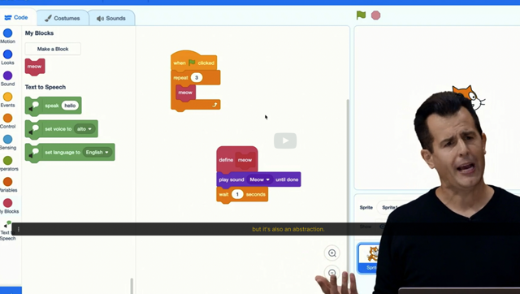</kbd>

> [!NOTE]
> Đại khái là với việc **define function 'meow'** của mình
> (**custom function**) ta có thể có đoạn code **more readable,**
> Và giả sử cần thay đổi gì ta **chỉ thay đổi trong function
> meow thôi** chứ k**hông cần thay đổi nhiều nơi có sử dụng
> hành động mèo kêu này**

 

<kbd>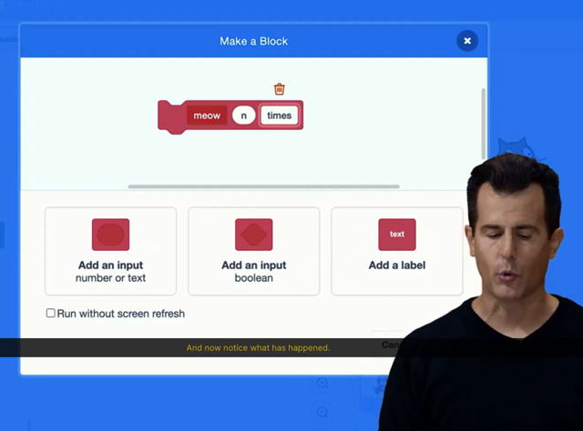</kbd>

> [!NOTE]
> Đại khái là sửa lại function meow chút xíu sao
> cho có thêm input (argument) , đặt là n, và add
> label cho argument là 'times'

 

<kbd>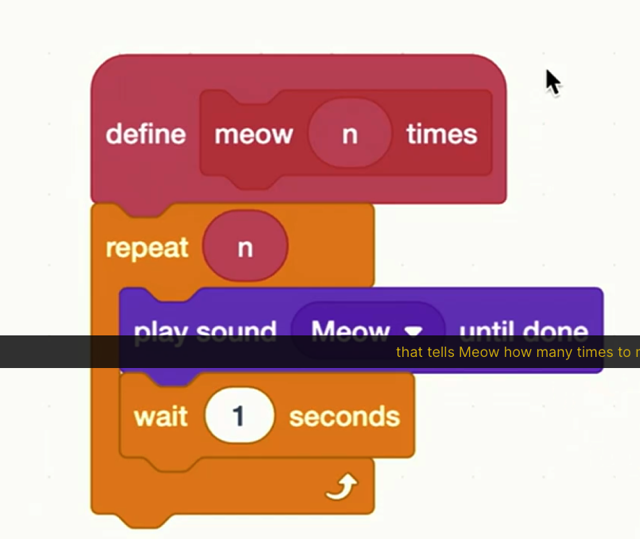</kbd>

> [!NOTE]
> Đại khái là ổng move cái loop vào trong
> function meow luôn, sử dụng argument times
> -n của meow làm số lần repeat.

 

<kbd>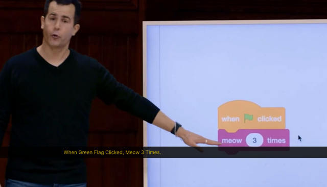</kbd>

> [!NOTE]
> Với việc đó, đoạn code ta
> much more readable :Click
> green flag, meo 3 times

 

<kbd>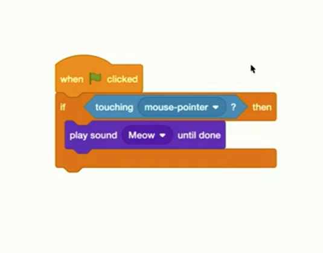</kbd>

> [!NOTE]
> Ổng muốn khi ổng move con chuột tới hình con mèo
> thì nó kêu. Nhưng đoạn code này không work, tại
> sao?
>
> -> Rõ ràng là khi ông click, nó đã run cái conditional ở
> dưới và lúc này con chuột đương nhiên đang ở  cái
> green flag nên condition fail nên nó không gọi đoạn
> code bên trong. Tới đây thì nó đã 'xong'
>
> Nên khi ổng rê tới cái hình con mèo thì còn gì nữa
> đâu mà khóc với sầu.
>
> Muốn làm như ổng nói thì phải có cái gọi là **event listener**

 

<kbd>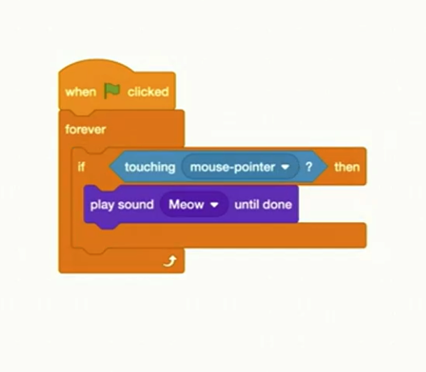</kbd>

> [!NOTE]
> Một cách ở làm ở đây là dùng
> forever loop - nó sẽ liên tục
> check cái condition này

 

<kbd>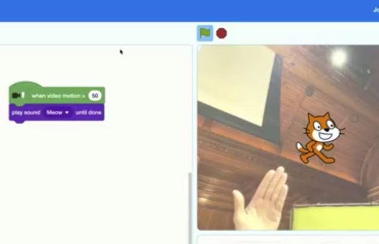</kbd>

> [!NOTE]
> Xong ổng dùng cái 'when video motion' của video
> add-on gì đó để detect event camera phát hiện motion
> lớn hơn mức nào đó (argument) thì phát tiếng mèo kêu

 

<kbd>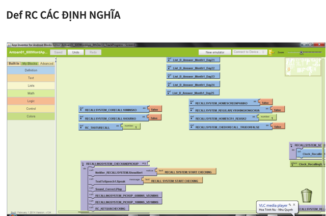</kbd>

<kbd></kbd>

<kbd>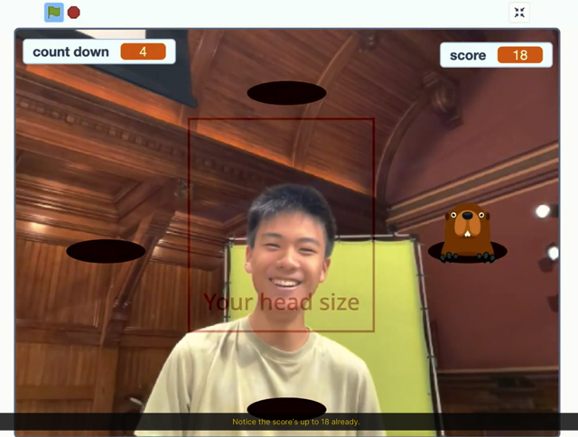</kbd>

> [!NOTE]
> Ý là với Scratch ta có thể build game, app như game này.
> Nhớ lại hồi xưa mình cũng đã từng làm cả một cái app học
> tiếng Anh với nhiều tính năng với App Inventor - một cái
> tương tự như Scratch này.

 

<kbd>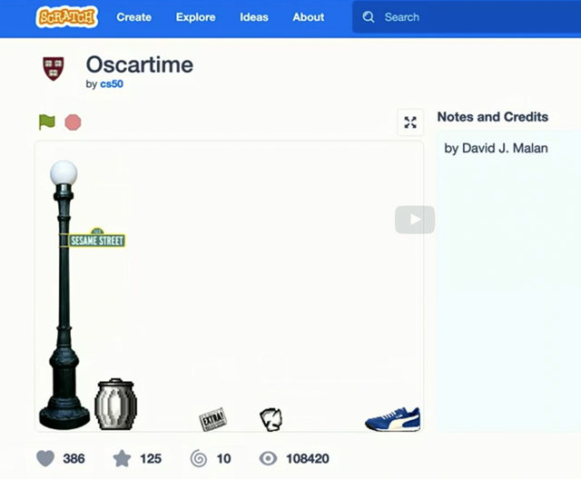</kbd>

<kbd></kbd>

<kbd>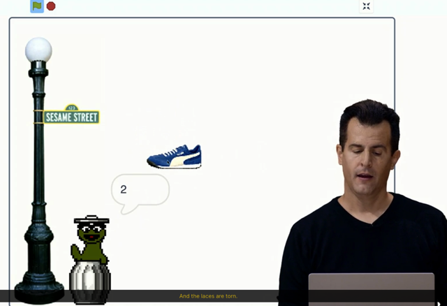</kbd>

> [!NOTE]
> Tiếp ổng nói về cái game do ổng viết hồi xưa, trong đó
> rác rời xuống và mình phải kéo nó vào thùng rác. Hình
> như còn có vụ nội dung bài hát sẽ báo trước số lượng
> rác xắp rơi xuống nữa

 

<kbd>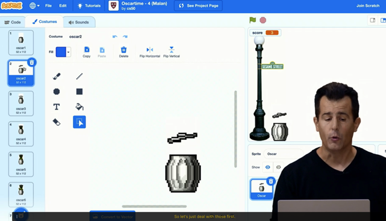</kbd>

 

<kbd>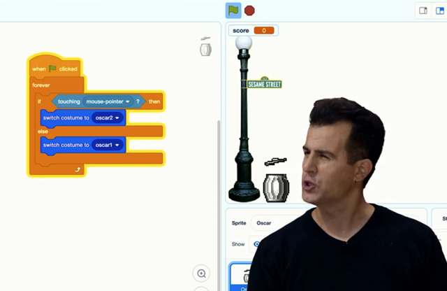</kbd>

> [!NOTE]
> Ý ổng nói đến một ý quan trọng đó là: Kiểu như **ở high level**, khi ta
> **rê chuột tới cái thùng rác người ta thấy nó 'Mở ra'**, nhưng **thực
> tế 'ở dưới code'** chỉ là **thay đổi cái hình của cái sprite thành hình
> khác.**Và nếu làm siêng hơn, cho nó thay đổi thành nhiều hình liên tục
> thay vì chỉ có 2 hình thì nó sẽ tạo hiệu ứng thị giác là cái thùng mở
> nắp

 

<kbd>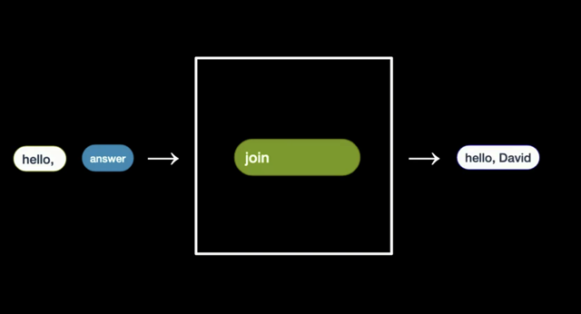</kbd>

> [!NOTE]
> Theo mô típ Input -> Algorithm -> Output

 

<kbd>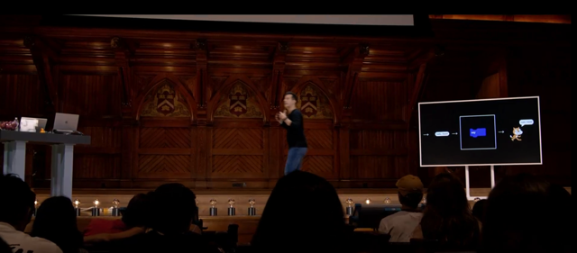</kbd>

 

<kbd>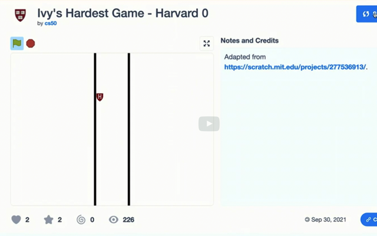</kbd>

> [!NOTE]
> Ổng hỏi là làm sao để cái này nó
> di chuyển theo key: Trả lời, có cái
> forever loop listen to key

 

<kbd>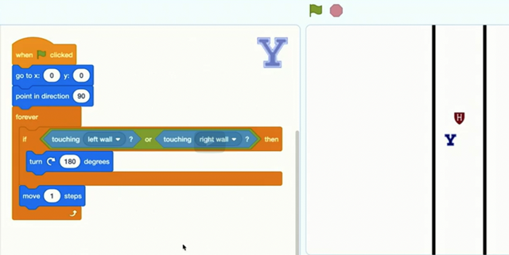</kbd>

> [!NOTE]
> Ở đây ổng hỏi Y nó làm gì: Nhìn biết liền, khi click green flag,
> về giữa, quay 90 độ rồi với forever loop, nó sẽ move 1 step có
> vẻ như là nó sẽ di chuyển 1 ở phương direction tức sau khi
> quay 90 độ là phương ngang, nếu đụng bức tường thì nó quay
> 180 độ. Có nghĩa là chữ Y (là 1 sprite) sẽ chạy qua chạy lại
> giữa 2 bức tường.

 

<kbd>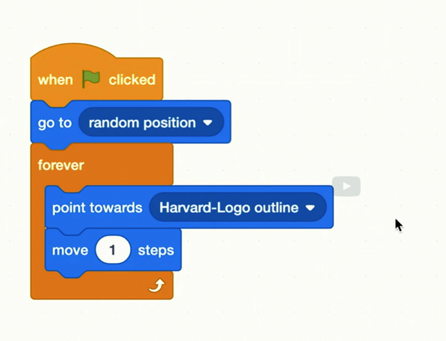</kbd>

> [!NOTE]
> Tiếp hỏi cái này làm gì: Thì dễ thấy khi click cái cờ thì
> cái MIT (đây là code của cái MIT sprite) được assign một
> random position, sau đó với forever loop, nó hướng tới
> cái Harvard sprite và move 1 step. Tức là nó luôn dí theo cái
> Harvard sprite

 

<kbd>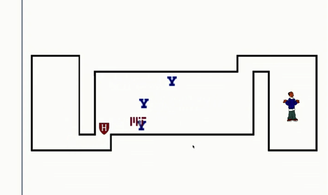</kbd>

 

<kbd>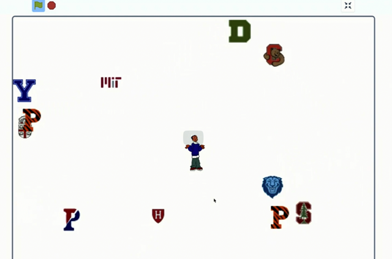</kbd>

 

