# Ghi Chú Tay Cho Lab + Problem Set - Week 4 - Memory

📊 **Progress:** `46` Notes | `93` Screenshots

---

## Lab 1 Smiley

 

<kbd></kbd>

 

<kbd></kbd>

 

<kbd></kbd>

> [!NOTE]
> Đại khái là trong picture, mỗi pixel "có" 3 bytes:
> 1 bytes cho value của Red, 1 bytes cho value 
> của Green, 1 bytes cho value của Blue.
>
> Với 1 bytes, thì như ta đã biết nó có thể thể hiện
> từ 0 (00000000 hay 0x00 trong base-16) tới 
> 255 (11111111 hay 0xff)
>
> Và như vậy combo mấy màu này có thể cover mọi
> màu

 

<kbd></kbd>

> [!NOTE]
> Đại khái là trong lib bmp.h có define một struct: 
> typedef struct {
> ...3 variable thuộc "loại" BYTE = 8-bit integer.
> } RGBTRIPLE
>
> Ở đây nhớ lại int trong C được "cho" 4 bytes tức là
> 32 bits. Còn BYTE là integer 8-bit. Thì mình hiểu 
> nôm na là int cần để chứa số nguyên, nên cần 32 bit
> (mà còn không đủ, khi muốn thể hiện số lớn hơn 2 tỷ
> phải cần đến long = 8 bytes = 64 bits)
>
> Còn BYTE có thể chỉ cần 8 bit để thể hiện một dải giá
> trị có max chỉ 255 là đủ.
>
> ====
>
> Rồi một số điều mới biết đó là image nó có metadata
> hay còn gọi là headers. 
>
> Và với một pixel thuộc "loại" RGBTRIPLE ở trên thì
> có thể access các colors của nó (các variable của nó
> thuộc loại BYTE như mới nói) bằng .rgbtBlue, rgbtRed,
> .rgbtGreen. Cái này thì ko có gì khó hiểu, struct - nó chưa phải
> object nhưng cũng gần gần với object

 

<kbd></kbd>

> [!NOTE]
> Đại khái là mình sẽ "làm" function **colorize()** này.
> Để làm sao có thể nhận một 2D array các giá trị pixel của
> Image và chuyển đổi các màu đen thành màu mong muốn
>
> Ở dưới chỉ cách compile và chạy thử function, nó sẽ 
> nhận file image gốc cần chỉnh sửa smiley.bmp và xuất ra
> image (outfile.bmp)

 

### Thought Question

> [!NOTE]
> Thought Question
>
> How do you think you **represent a black pixel**
> when using a**24-bit color BMP file**?
>
> Is this the same or different when mixing paints
> to repesent various colors?

> [!NOTE]
> 1. A: Hình như là chuỗi số 0 hết tức là 
>
> 00000000 (Red), 00000000 (Green) 00000000 (Blue)
>
> Hay 0x00 Red, 0x00 Green, 0x00 Blue 
>
> Hay #000000
>
> Hay nói cách khác cả ba BYTE var rgbtRed, Green, Blue 
> của RGBTRIPLE đều = 0
>
> 2. A: Chưa hiểu câu hỏi.

 

<kbd></kbd>

> [!NOTE]
> Loop trong các pixel là các RGBTRIPLE struct
>
> Check có phải nó là black pixel không: nếu cả 3 variable: 
> rgbtRed/Green/Blue (loại BYTE là 8-bit integer) đều bằng 
> 0 thì nó là Black
>
> Thì khi đó assign lại cái màu khác (bằng cách đổi giá trị 
> khác (từ 0-255))

 

<kbd></kbd>

<kbd></kbd>

<kbd></kbd>

 

<kbd></kbd>

 

## Lab 2: Volume

 

<kbd></kbd>

> [!NOTE]
> Đổi volume của audio file

 

<kbd></kbd>

 

<kbd></kbd>

 

<kbd></kbd>

> [!NOTE]
> Đại khái là cái thư viện stdint.h nó có declare sẵn một
> số loại (type) ví dụ như uint8_t, và int16_t.
>
> Unsigned (có chữ u phía trước như uint8_t) có nghĩa là
> nó dành hết 8 bits để chứa value. Và như vậy chỉ thể hiện
> số dương thôi. Do đó max của nó là 8 số 1: 11111111 = 255
>
> Nhưng Signed, ví dụ int8_t thì nó phải dành 1 bit đầu cho 
> "dấu (sign)" với 0 là số dương, 1 là âm. Thành ra chỉ còn 7 bit
> cho giá trị. Nên số dương lớn nhất chỉ còn + 127, và số âm 
> nhỏ nhất là -128.
>
> Tại sao: 
>
> Max: 0 (sign = số dương) còn lại 7 bit cho 7 số 1 hết thì ta có:
> 1*2^6 + 1*2^5 + 1*2^4 + 1*2^3 + 1*2^2 + 1*2^1 + 1*2^0
> = 64 + 32 + 16 + 8 + 4 + 2 + 1 = 127
> Min: 1 (sign = số âm) còn lại 7 bit cũng số 1 hết thì 
> 1 000000 sẽ là -1
> 1 000001 sẽ là -2
> ...
> 1 1111111 sẽ là -128
>
> ====
>
> Do đó với định nghĩa của WAV file trong đó 44 byte đầu tiên
> dành cho header thì ta có thể cho rằng nó chỉ số dương nên
> Ta có thể **"TREAT CÁC BYTE ĐÓ NHƯ uint8_t value"**Còn chuỗi samples mỗi sample là 2 bytes mang gía trị
> của âm thanh thì ta sẽ **TREAT CÁC BỘ 2 BYTES NÀY
> NHƯ int16_t value**

 

<kbd></kbd>

> [!NOTE]
> Đại khái là function sẽ nhận 3 argument (nếu check
> phải check argc _argument count = 4) vì như đã biết
> cái tên function là 1 argument rồi
>
> Thì ta sẽ mở file gốc ra, mở file đích ra.
>
> Loop trong đó, hay đọc các byte trong đó
>
> Nôm na là 44 byte đầu tiên là header thì giữ nguyên
> chỉ ghi (write) y xỳ vào file đích
>
> Còn các 16 bits sample tiếp theo, thì nhân giá trị với
> Factor trước khi ghi vào file đích.
>
> Nôm na là vậy

 

<kbd></kbd>

 

<kbd></kbd>

 

<kbd></kbd>

> [!NOTE]
> các 2-bytes samples đơn giản chỉ là một con số,
> ví lí do gì đó mà sample được cho 2 bytes = 16 bits để thể hiện 
> giá trị. Có nghĩa là max của nó là 2^17 - 1 = 131071
> (Ở đây cứ nhớ vầy: ví dụ 8 bit thì max là 2^7+2^6.. 2^0 thì chính
> là bằng 2^8-1= 256-1 = 255. Nên tương tự nếu có 16 bit thì mã
> sẽ là 2^17-1 = 131071)
>
> Và việc nhân con số này lên sẽ tạo hiệu quả là  làm nhân (scale) 
> volume lên (cái này cứ biết vậy thôi)

 

<kbd></kbd>

> [!NOTE]
> Function sẽ nhận 3
> command-line argument

 

<kbd></kbd>

 

<kbd></kbd>

 

<kbd></kbd>

> [!NOTE]
> Đọc doc

 

<kbd></kbd>

> [!NOTE]
> Ổng nói khi copy header thì vì đã biết luôn có 44
> bytes của header nên chỉ việc read từ file gốc 44
> bytes đầu và write vào file đích thôi
>
> Còn đọc sample và nhân với factor rồi ghi vào
> file đích thì cần loop cho đến khi hết

 

<kbd></kbd>

> [!NOTE]
> Còn lại thì tự làm hết với các chú ý rút ra như sau:
>
> 1. Để hiểu function fread, nhận argument đầu tiên là một **pointer**:
>
> Ví dụ trong doc của họ:
>
> char c;  -> Tạo một vùng memory 1 byte cho c.
>
> fread(**&c**...) hoặc tạo**int *p = &c**; fread(**p**,....) cũng sẽ đúng -> Read file và **load thông
> tin vào vùng memory có ADDRESS là &c (hay p)**
>
> Tương tự như vậy: **uint8_t header[44];** -> **Tạo vùng memory rộng 44 bytes** cho
> header
>
> for loop..: fread(&header[i], 1, 1, input):  -> Có nghĩa là **read file và load data vào
> vùng memory mà  ADDRESS là &header[i]**====
>
> 2. Cũng có thể làm gọn, không cần phải "đọc 1 byte rồi bỏ vào array rồi ghi vào
> file output 1byte". Vì fread cho phép **đọc nhiều byte**, quy định bởi arg size (thứ 2) 
>
> Nên làm theo solution của họ thì như sau:
>
> fread(**header**, **HEADER_SIZE**, 1, input); 
>
> fwrite(**header**, **HEADER_SIZE**, 1, output);
>
> Thì cơ bản là bảo máy tính **đọc và load data 44 byte** vào **vùng memory tại
> header** và sau đó là **ghi vào output data** tại vùng memory của header.
>
> Chú ý là **header ở đây thì không cần dùng &header**.
>
> Có thể lí giải là vì **bản thân header là array thì** **nó cũng là pointer** (tới các
> int16_t) rồi.
>
> Cũng như trong bài giảng có chỗ khi dùng s - string thì không cần & vì **bản thân
> nó là pointer rồi**

 

<kbd></kbd>

> [!NOTE]
> Sai một chỗ khiến code work đúng khi factor 2.0,
> 3.0 nhưng không khi factor 0.5: Đó là nhầm lẫn
> **int16_t** thì lại ghi là **uint16_t**. Phải search google
> mới phát hiện.

 

<kbd></kbd>

 

## Ps : Recover

 

<kbd></kbd>

 

<kbd></kbd>

> [!NOTE]
> "r" = read mode

 

<kbd></kbd>

 

<kbd></kbd>

 

<kbd></kbd>

> [!NOTE]
> Ta sẽ **đọc file theo từng chunk 512 bytes** và check
> pattern bằng cách **check 4 bytes đầu tiên**
>
> Khi check thấy trong một cục đó có pattern của  một jpeg
> file (bằng cách check 4 byte đầu tiên)
>
> Tại sao chỉ **check 4 byte đầu tiên**: Là bởi ổng nói nó - là
> cái cơ chế FAT của máy ảnh
>  - sẽ ghi data theo kiểu giả sử l**ưu hết 1 image rồi mà
> vẫn dư** thì nó**vẫn qua chunk 512 bytes tiếp theo** để
> ghi image mới. Và phần dư của cái chunk gọi là **slack space**

 

### Fortunately, digital cameras tend to store photographs contiguously on

> [!NOTE]
> Fortunately, digital cameras tend to store photographs contiguously on
> memory cards, whereby each photo is stored immediately after the previously
> taken photo. Accordingly, the start of a JPEG usually demarks the end of
> another.
>
> **However**, digital cameras often initialize cards with a FAT file system
> whose**“block size” is 512 bytes (B)**. The implication is that these cameras
> only write to those cards in units of 512 B. A photo that’s 1 MB (i.e., 1,048,576
> B) thus takes up 1048576 ÷ 512 = 2048 “blocks” on a memory card. But so
> does a photo that’s, say, one byte smaller (i.e., 1,048,575 B)! The **wasted
> space** on disk is called “**slack space**.” Forensic investigators often look at
> slack space for remnants of suspicious data.
>
> The implication of all these details is that you, the investigator, can probably
> write a program that **iterates over a copy of my memory card**, **looking for
> JPEGs’ signatures**.
>
> Each time you **find a signature**, you can **open a new file** **for writing**
> and start **filling that file with bytes from my memory card**, closing that file
> only**once you encounter another signature**.
>
> Moreover, **rather than** read my memory card’s **bytes one at a time**, you can
> **read 512 of them at a time** into a buffer for efficiency’s sake. Thanks to FAT,
> you can trust that JPEGs’ signatures will be “block-aligned.” That is, you need
> **only look for those signatures in a block’s first four bytes.**

 

#### Realize, of course, that JPEGs can span contiguous blocks. Otherwise, no JPEG could be larger than 512 B. But the **last byte of a JPEG might not fall at the very end of a block.**  Recall the possibility of**slack space**. But not to worry. Because this memory card was **brand-new**when I started snapping photos, odds are it’d been**“zeroed”**(i.e., filled with 0s) by the manufacturer, in which case any slack space will be filled with 0s. It’s okay if those trailing 0s end up in the JPEGs you recover; they should still be viewable.

> [!NOTE]
> Đại khái là ổng nói**một cái jpeg sẽ trải qua nhiều  block (512
> bytes)**. Và cái **byte cuối cùng của jpeg khả năng cao là không
> nằm ngay chóc cái byte  cuối cùng của block** (cái này thì dễ
> hiểu rồi)
>
> Và cũng như đã nói ở đoạn trước đó là phần dư (Chưa hết 1
> block mà đã hết jpeg) gọi là slack-space.
>
> Thì ổng nói là vì cái thẻ mới nên khả năng cao là chưa xài,
> nên cái phần dư đó chỉ có số 0, tức là còn mới tinh, chưa
> từng chứa dữ liệu gì.
>
> Như đã học, ổng nói vậy vì nếu mà cái thẻ xài rồi, khả năng
> khi ghi đến giả sử byte thứ 400 trong block thì kết thúc  data
> của jpec thì 112 cái byte còn lại có thể cũng có GARBAGE là
> data của chương trình nào đó lưu vào nhưng chưa xoá.
>
> Thì từ đây có thể cho ta cái hiểu rằng, cứ ghi hết data của mỗi
> block vào file dù cho block cuối data jpec của jpeg kết thúc trước
> byte cuối. Vì phần data trong slack sapce không ảnh hưởng gì

 

#### Now, I only have **one memory card**, but there are a lot of you! And so I’ve gone ahead and created a “forensic image” of the card, **storing its contents, byte after byte**, in a file called card. raw.   So that you don’t waste time **iterating over millions of 0s** unnecessarily, I’ve only imaged the **first few megabytes** of the memory card. But you should ultimately find that the image contains 50 JPEGs.

<kbd></kbd>

<kbd></kbd>

> [!NOTE]
> Cuối cùng đại ý là ổng đảm bảo cái các jpegs chỉ nằm ở những
> megabytes đầu tiên của memory thôi chứ không phải nằm ở đâu
> đó xa xôi tuốt luốt để mà phải iterate cả triệu con số 0 (tức là các
> byte trống không có data) 
>
> Và dù vậy vẫn có 50 cái hình

 

<kbd></kbd>

<kbd></kbd>

<kbd></kbd>

 

<kbd></kbd>

<kbd></kbd>

<kbd></kbd>

> [!NOTE]
> "002.jpg" = 7 char -> Cần 8 bytes
>
> Đại khái là cách để open card.raw để bắt đầu đọc data.
>
> Dùng sprintf để "đặt tên" có nói rõ ở sau.Và không cần
> recover tên gốc của image mà chỉ cần đặt tên theo số 
> thứ tự là được
>
> Để check thử cái file mình recover có đúng không thì 
> chỉ việc bấm mở ra để xem, nếu là cái hình thì đúng
>
> Ở dưới là cách xoá file

 

<kbd></kbd>

> [!NOTE]
> Ở đây họ có hint cho việc tạo một new type dạng uint8_t
> chưa hiểu để làm gì.
>
> https://man.cs50.io/3/fread
> Còn việc đọc file bằng fread có hướng dẫn ở sau, đại khái
> Buffer sẽ là cái pointer, ta sẽ đọc từng element , mỗi element
> có BLOCK_SIZE = 512 bytes, raw file là cái file sau khi dùng
> fopen để mở file.
>
> Thì như họ cũng có nói (ở sau) cách để detect xem việc đọc
> và ghi file có thể kết thúc hay chưa. Thì ở đây chính là như vậy:
> Ta sẽ while cho đến khi nào lệnh fread trả về không bằng 512 bytes 
> nữa thì dừng (mà ở đây ổng nói thêm là nó sẽ trả về 0) bởi file
> raw được tạo Theo kiểu có đúng some numebr of 512 bytes block.

 

<kbd></kbd>

> [!NOTE]
> Ta sẽ lần lượt đọc từng chuck 512 bytes và detect
> xem 4 bytes đầu có  pattern của một jpeg ko

 

<kbd></kbd>

> [!NOTE]
> Và khi xác định là có, thì:
>
> Nếu chưa thì tạo file và bắt đầu ghi
> data từ file này vào file đó
>
> Nếu đang ghi thì kết thúc tạo file mới và bắt đầu ghi

 

<kbd></kbd>

 

<kbd></kbd>

> [!NOTE]
> Đây là khi đang ghi thì phát hiện pattern ->
> Đóng file đang ghi và ghi file mới

 

<kbd></kbd>

 

<kbd></kbd>

> [!NOTE]
> Size: **số bytes của mỗi element** mà mình đang cố gắng
> đọc từ file
>
> number: Số element mà mình muốn đọc cùng lúc  (all at
> once) Cái này nhiều khả năng là 1 thôi.
>
> và inptr: FILE mà mình sẽ đọc data từ đó
>
> Và có**chú ý là ta sẽ cần đọc file** từ memory card theo các
> **chunk 512 bytes** thì có nghĩa là như vậy ta sẽ **set size =
> 512 (mỗi element là 512 bytes)**

 

<kbd></kbd>

> [!NOTE]
> Đại khái là mình sẽ đọc data thành từng **chunk 512 bytes.**
> Vì ta kiểu như làm sao có một cái array để chứa 512 bytes đó
>
> Thì từ đó mới check thử xem có phải là JPEG ko bằng cách
> check **4 byte đầu tiên**. (Với mỗi byte, kiểu như tính ra xem
> base-16 value của nó là bao nhiêu)
>
> Và so với quy luật
>
> ====
>
> 0xff = 255 Vậy cái byte thứ nhất phải là có chuỗi binary là 
> 11111111 hay tính ra phải là 255
>
> Nhớ lại 1 byte = 8 bit. Thì câu hỏi là đọc giá trị của 1 byte như
> thế nào? 
>
> A: Có thể là từ address tới 1 byte ví dụ p. Ta sẽ **int n = *p;** 
> để đi tới đó, và xem value của nó. thì check giá trị của nó 
> xem có bằng 255 không

 

<kbd></kbd>

> [!NOTE]
> Thì đại khái là đối với cái byte thứ 4, thay vì so 16 lần
> với 16 cái pattern thì dùng cách **bit-wise arithmetic** như
> thế này. Nôm na là nó "**cắt đi bớt và so phần đầu thôi"**"Just look at the first four bits of this 8-bits, và set 4 bits 
> còn lại thành 0" (ví dụ 1234 5678 thì ) thành 1234 0000.
>
> Để rồi chỉ cần so kết qủa sau khi cắt với 0xe0. Phần này
> hiểu ý chính là vậy
>
> 0xe0 = e*16 + 0 = 14*16 + 0 = 224
> 0xe1 = e*16 + 1 = 14*16 + 1 = 225
> ....
> 0xef = e*16 + f = 14*16 + 15 = 239
>
> 0xe0 = 224: **1110** 0000 = 2^7 + 2^6 + 2^5 + ...0
> 0xe1 = 225: **1110** 0001 = 2^7 + 2^6 + 2^5 + ...2^0
> 0xe2 = 226: **1110** 0010 = 2^7 + 2^6 + 2^5 + ...2^1
> ..
> 0xef = 239:  **1110** 1111 = 2^7 + 2^6 + 2^5 + ...0

 

<kbd></kbd>

> [!NOTE]
> Khi đã "tìm thấy một pattern cho thấy đó là
> jpeg thì ta sẽ **tạo một file mới** và **write data vào**
>
> Và **cần đặt tên file** để biết ta **đang ghi file jpeg thứ mấy**
> thì có thể dùng function **sprintf** là in vào một string
>
> Như này có nghĩa là in vào var string filename, một 
> content có dạng 3 digit.jpg (quy định bởi %03i), và số
> là giá trị digit -> filename sẽ là **002.jpg**

 

<kbd></kbd>

> [!NOTE]
> Phải make sure có **đủ memory = có đủ character**
> để fully **represent this entire file name**

 

<kbd></kbd>

> [!NOTE]
> Khi đó ta sẽ dùng FILE *img. = fopen(filename, "w") để
> mở file có tên filename mới đặt, ở mode "write" ("w")
> để có thể bắt đầu "write" file

 

<kbd></kbd>

> [!NOTE]
> Để ghi data vào file:
>
> data: pointer to bytes (hay address của cái bytes) mà ta
> muốn ghi vào file
>
> size: Là số bytes trong mỗi element mà mình muốn write to
> the file, để coi lại element là gì
>
> number: Số element that you're going to write to the file
>
> outptr: FILE mà mình muốn ghi vào, chính là cái file mới mở
> ra ở trước.

 

<kbd></kbd>

> [!NOTE]
> Và ta sẽ cứ tiếp tục detect và ghi file JPEG cho
> đến khi detect end of the file (file gốc trong bộ nhớ)

 

<kbd></kbd>

> [!NOTE]
> Ví dụ tôi muốn đọc 255 elements = 255 bytes (À element là
> bytes) thì ý ổng nói là máy tính nó sẽ trả về từng cục 255
> bytes. Thì khi đến sắp hết file thì nó không còn trả đủ 255
> bytes nữa thì đó chính là dấu hiệu hết file
>
> Có thể chưa rõ chỗ này cụ thể là gì nhưng đại khái là  vậy
> để **check khi nào thì kết thúc**

 

<kbd></kbd>

 

<kbd></kbd>

 

<kbd></kbd>

> [!NOTE]
> QUay lại thử lại với BYTE buffer[512]

> [!NOTE]
> uint8_t buffer[512]: Tạo array chứa 512 uint8_t. 
>
> Thì khi gọi lệnh này máy tính sẽ tìm 512 byte (uint8_t là 8 bit
> chứa số dương) và return về buffer cái address của cái byte
> đầu tiên
>
> Khi gọi fread(buffer, 1, 512, file), máy tính sẽ đọc file, theo từng
> bộ 512 element mỗi element là 1 byte. Và load vào memory 
> có address là buffer từ byte đầu đến byte 512 chuẩn bị sẵn

 

<kbd></kbd>

> [!NOTE]
> read từng cụm 512 bộ (element) mỗi bộ 1
> bytes để bỏ vào buffer là array chứa 512
> uint8_t
>
> Nó hơi khác với vụ đọc 1 bộ (element), có
> 44 bytes ở bài toán volume.

 

<kbd></kbd>

> [!NOTE]
> Xong hết nhớ đóng cả file
> input (file) và img
>
> Gọi malloc thì phải free cái filename

 

<kbd></kbd>

> [!NOTE]
> Quay lại làm cái vụ trim sau. Tạm thời
> có thể check byte[3] kiểu này

 

## Ps: Reverse

 

<kbd></kbd>

 

<kbd></kbd>

> [!NOTE]
> Yeah, header nếu chỉ define là WAVHEADER header
>
> Thì máy tính cơ bản chỉ là tạo 1 **pointer** (8 bytes)
> cho header nhưng chưa có vùng memory nào để
> chứa 44 bytes của WAVHEADER cả.
>
> Phải malloc(44)
>
> Và khi gọi check_format phải *header vì để pass vào
> VALUE / là vùng 44 bytes chứa thông tin header, 
> bằng cách ĐI VÀO ADDRESS mà header đang giữ
> chứ bản thân header chỉ là một pointer variable được 
> cho 8 byte để mang giá trị của cái ADDRESS thôi

 

<kbd></kbd>

<kbd></kbd>

<kbd></kbd>

> [!NOTE]
> Đã check cách 2, vẫn đúng:
>
> Nếu mình define kiểu header là array như  này: 
>
> WAVHEADER header[1]
>
> Thì ngay lập tức máy tính sẽ tạo vùng 44 byte (vì WAVHEADER 
> struct cần size 44 byte) và assign **ADDRESS** của byte đầu cho 
> header, khi đó khỏi cần malloc. 
>
> Khi đó pass vào check_format sẽ đơn giản là header[0]
> vì header[0] đã **CHỈ TỚI** giá trị của vùng memory 44 byte
> chứa WAVHEADER

 

<kbd></kbd>

 

<kbd></kbd>

 

<kbd></kbd>

> [!NOTE]
> BYTE buffer[block] -> máy tính tạo vùng memory 4 (block)
> bytes  và assign address byte đầu cho buffer.
>
> fread(buffer,...) sẽ load data vào vùng 4 byte này với address
> của byte đầu là chứa trong buffer bởi. Nhắc lại không thừa
> buffer sẽ là pointer var được cho 8 bytes bộ nhớ.
>
> ====
>
> Việc fread(buffer, 1, block, ..) hay fread(buffer, block, 1...) cũng
> như nhau.
>
> ====
>
> Chỉ chú ý 1 chỗ là khi chuyển pointer về cuối file input thì
> phải lùi về 1 block cho lần read & write đầu tiên.
>
> ====
>
> Còn các function fseek cũng dễ hiểu, chỉ là giúp move pointer
> của file tới vị trí nào đó đọc doc là hiểu
>
> ftell thì giúp tell cái vị trí pointer hiện tại. 
>
> Thì ban đầu nó = 0, tức con trỏ ở byte thứ 0 (byte đầu tiên)
> mỗi khi lệnh fread( ..,size in bytes of element, no.element,...)
> thì pointer nó move đi (size of element* no.element), ví dụ
> từ 0, fread(..,1,4,..) thì nó nghĩa là nó read 4 byte, vậy sau
> khi read, pointer sẽ ở byte thứ 0 + 4 = 5

 

## Practice (không Bắt Buộc)

 

### Bottom Up

> [!NOTE]
> LÀM SAU

 

### License

> [!NOTE]
> LÀM SAU

 

## PS: FILTER I + II (II chỉ có thêm Edge)

> [!NOTE]
> Quay lại sau để Note & Giải thích

 

<kbd>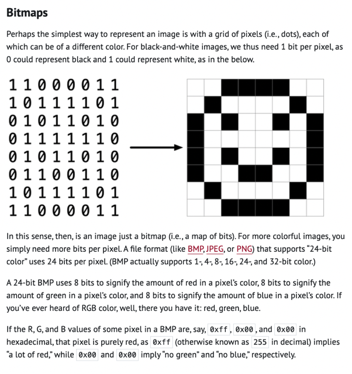</kbd>

 

<kbd>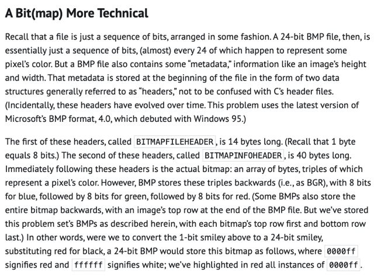</kbd>

 

<kbd>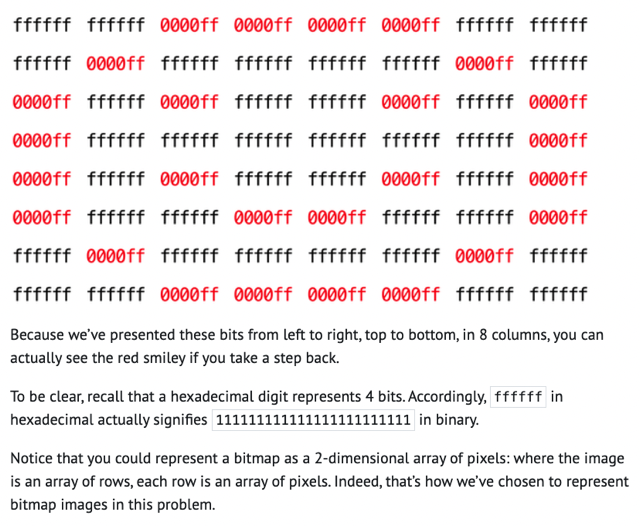</kbd>

 

<kbd>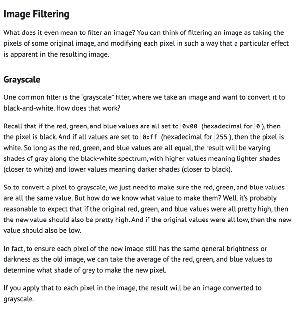</kbd>

 

<kbd>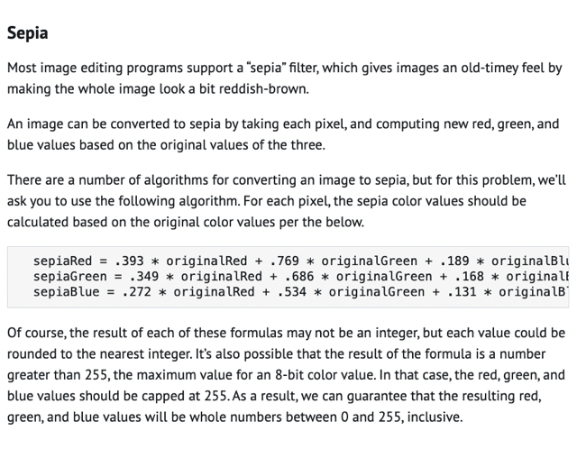</kbd>

 

<kbd>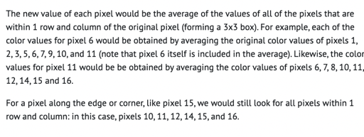</kbd>

<kbd></kbd>

<kbd>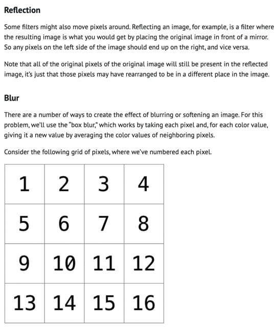</kbd>

 

<kbd>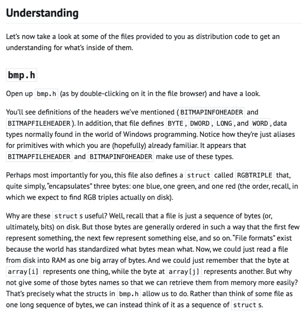</kbd>

> [!NOTE]
> Đại khái là mọi file đều chỉ là chuỗi 0101 binary. Hay
> Cũng là chuỗi các 8 bít = 1 bytes
>
> Và file format chính là cách để thế giới quy ước nhau
> file gì là như thế nào, chính là bằng các byte đầu tiên
> tạo thành header
>
> Thì đại khái ví dụ ở Lab Volume.c ta thấy file jpeg
> có phần header là 44 bytes mang giá trị thể hiện size,
> ...mà mình đã load bằng uint8_t (vì nó không có số
> âm) và sau đó là chuỗi binary mà cứ 2 bytes là một
> nốt (samples) và ta load vào một int16_t
>
> Thì ý nói là mình có thể đặt ra struct để thuận tiện hơn
> cho việc load data

 

<kbd>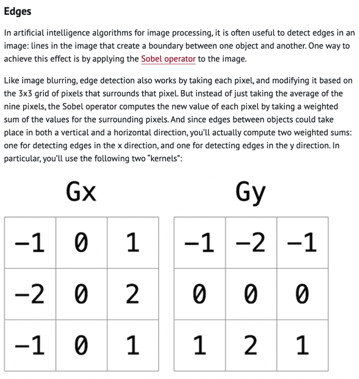</kbd>

 

<kbd>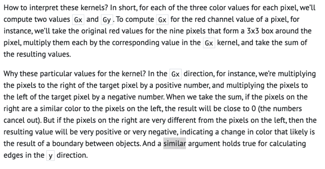</kbd>

> [!NOTE]
> Cái này thì chính là convol operation. Hai
> matrix Gx, Gy chính là là hai filter
>
> Như ta đã biết, khi nhân filter 3x3 với matrix 3x3
> của image (trên một channel Red/Green/Blue)
> thì nếu...

 

<kbd>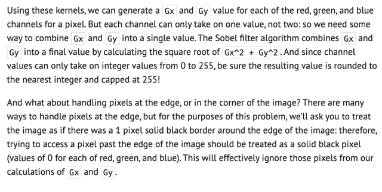</kbd>

 

<kbd>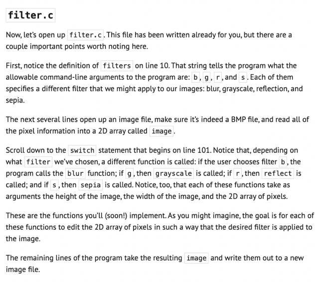</kbd>

 

<kbd>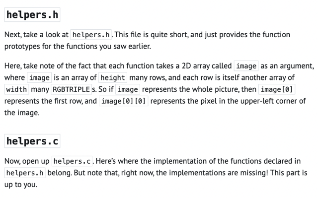</kbd>

 

<kbd>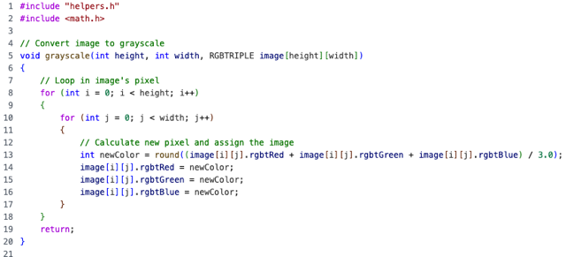</kbd>

 

<kbd>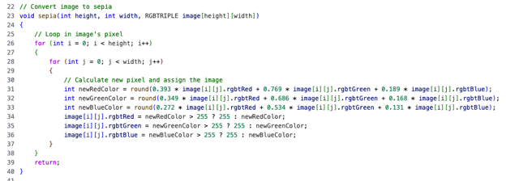</kbd>

 

<kbd>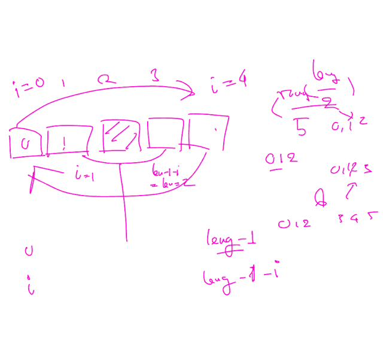</kbd>

<kbd></kbd>

<kbd>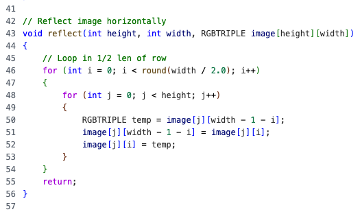</kbd>

 

<kbd>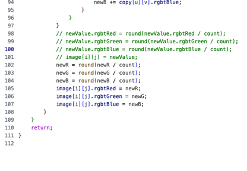</kbd>

<kbd></kbd>

<kbd>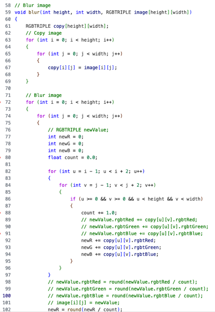</kbd>

> [!NOTE]
> Tại sao dùng RGBTRIPLE newValue không
> work?
>
> Có thể là chỉ khởi tạo RGBTRIPLE newValue
> thì chỉ là  pointer, chưa có memory, giống như
> string vậy. Cần thử lại chỗ này

 

<kbd>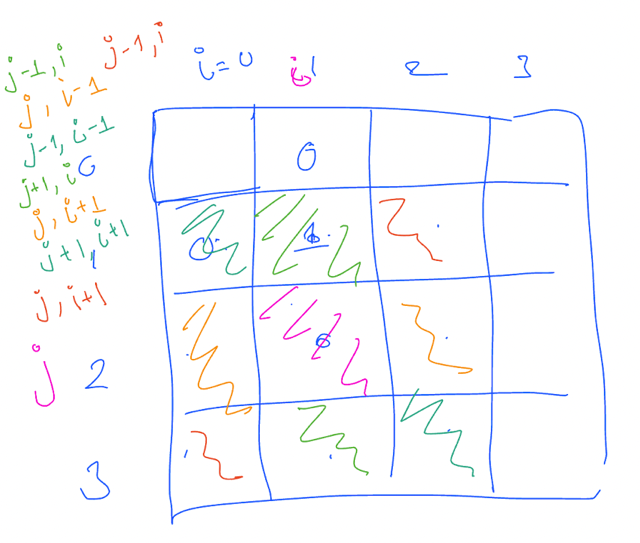</kbd>

 

<kbd>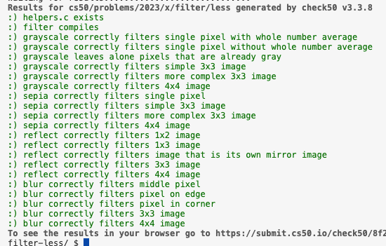</kbd>

 

<kbd>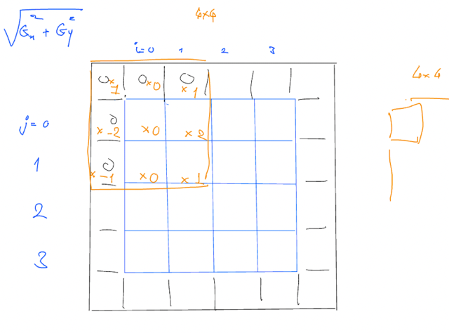</kbd>

 

