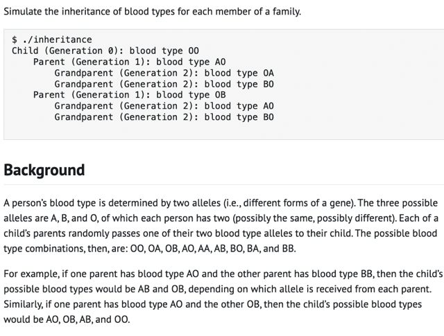
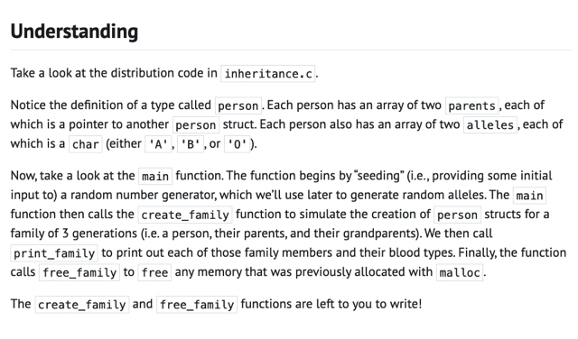
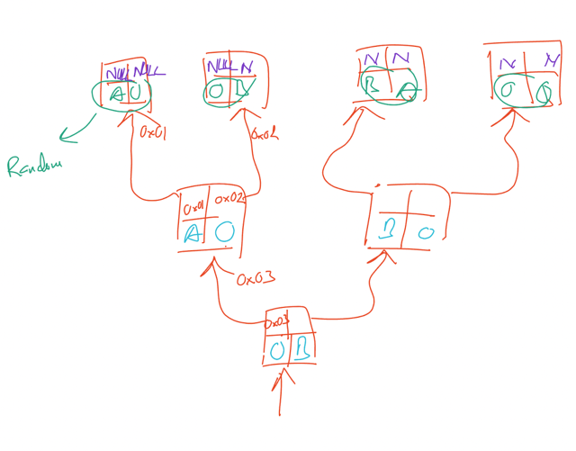
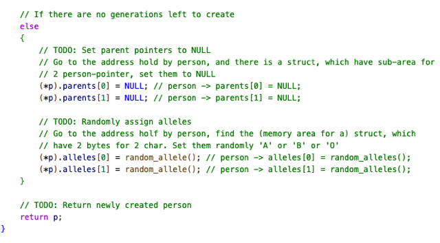
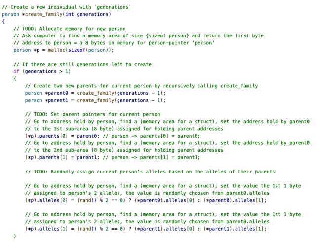
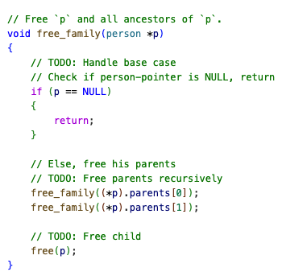

# Ghi Chú Tay Cho Lab + Problem Set - Week 5 - Data Structure

📊 **Progress:** `7` Notes | `50` Screenshots

---

## Lab

 

<kbd></kbd>

> [!NOTE]
> Có 3 Alen A,B,O mỗi người có 2 cái. Và
> truyền random 1 cái cho con.

 

<kbd></kbd>

 

<kbd></kbd>

 

<kbd></kbd>

<kbd></kbd>

<kbd></kbd>

> [!NOTE]
> Cũng không khó lắm

 

<kbd></kbd>

> [!NOTE]
> Chỉ lộn chút xíu ở chỗ khi free child
> lúc đầu để free_family(p)

 

## Problem Set: Speller

> [!NOTE]
> Quay lại sau để Note & Giải thích

 

### Load

 

<kbd></kbd>

<kbd></kbd>

<kbd></kbd>

 

#### Walkthrough

 

<kbd></kbd>

 

<kbd></kbd>

 

<kbd></kbd>

<kbd></kbd>

<kbd></kbd>

 

<kbd></kbd>

 

<kbd></kbd>

<kbd></kbd>

<kbd></kbd>

 

<kbd></kbd>

 

<kbd></kbd>

 

<kbd></kbd>

> [!NOTE]
> Có thể tự set word vào cũng được
> nhưng dùng strcpy sẽ tiện hơn

 

<kbd></kbd>

 

<kbd></kbd>

 

<kbd></kbd>

> [!NOTE]
> cái word là char array mà mình muốn nó load
> vào.
>
> Thì ở đây dựa trên việc ta đã biết từ dài nhất
> trong các dictionary là bao nhiêu thì có thể tạo
> sẵn char array[]
>
> char *word[LENGTH];
> while (fscanf(file, "%s", word) != EOF)
> {
> }

 

<kbd></kbd>

 

<kbd></kbd>

 

<kbd></kbd>

 

<kbd></kbd>

<kbd></kbd>

<kbd></kbd>

<kbd></kbd>

<kbd></kbd>

 

### Hash

 

<kbd></kbd>

 

<kbd></kbd>

 

<kbd></kbd>

 

### Size

 

### Check

 

<kbd></kbd>

 

<kbd></kbd>

 

<kbd></kbd>

 

<kbd></kbd>

 

<kbd></kbd>

 

<kbd></kbd>

 

### Free

 

<kbd></kbd>

 

<kbd></kbd>

 

<kbd></kbd>

 

<kbd></kbd>

 

<kbd></kbd>

 

<kbd></kbd>

 

<kbd></kbd>

 

<kbd></kbd>

 

## Practice (không Bắt Buộc)

 

### Trie

> [!NOTE]
> LÀM SAU

 

