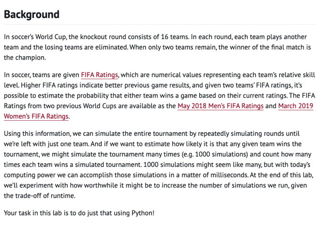
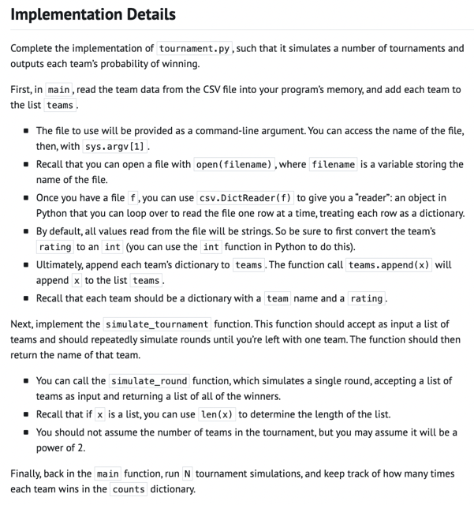
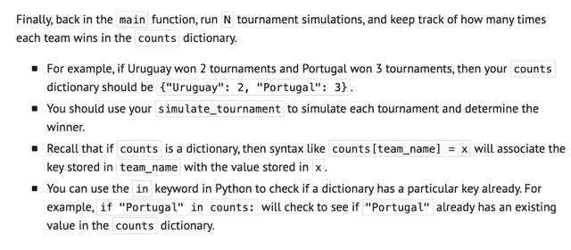

# Ghi Chú Tay Cho Lab + Problem Set - Week 6: Python

📊 **Progress:** `8` Notes | `7` Screenshots

---

## Lab

> [!NOTE]
> Quay lại Note & Giải thích

 

<kbd></kbd>

 

<kbd></kbd>

 

<kbd></kbd>

 

## Mario

> [!NOTE]
> Quay lại Note & Giải thích

 

## Ps: Cash

> [!NOTE]
> Quay lại Note & Giải thích

> [!NOTE]
> Quay lại Note & Giải thích

 

## Ps: Credit

> [!NOTE]
> PS: CREDIT
> (CHỌN 1 TRONG 2
> VỚI CASH)

> [!NOTE]
> LÀM SAU

 

## Ps: Readablility

> [!NOTE]
> Quay lại Note & Giải thích

 

## Ps: Dna

> [!NOTE]
> Quay lại Note & Giải thích

 

<kbd></kbd>

 

<kbd></kbd>

 

<kbd></kbd>

 

<kbd></kbd>

 

## Practice (không Bắt Buộc)

> [!NOTE]
> LÀM SAU

 

### Bank

 

### Frank, Ian,

> [!NOTE]
> FRANK, IAN,
> GLEN'S LETTERS

 

### Jar

 

### 7 Day Average

 

### Taqueria

 

