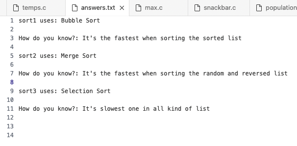

# Lab

📊 **Progress:** `1` Notes | `1` Screenshots

---

<kbd></kbd>

> [!NOTE]
> Thành nhanh nhất ở sorted list chính là Bubble vì nó có BIG
> OMEGA (n) nhỏ nhất so với BIG OMEGA(n**2) của
> Selection Sort, và nlogn của Merge Sort
>
> Thằng nhanh nhất ở random list chính là Merge Sort vì nó 
> có BIG O(nlogn) là nhỏ nhất so với BIG O(n**2) của hai thằng kia
>
> Thằng chậm nhất ở cả ba loại list là Selection Sort

 

